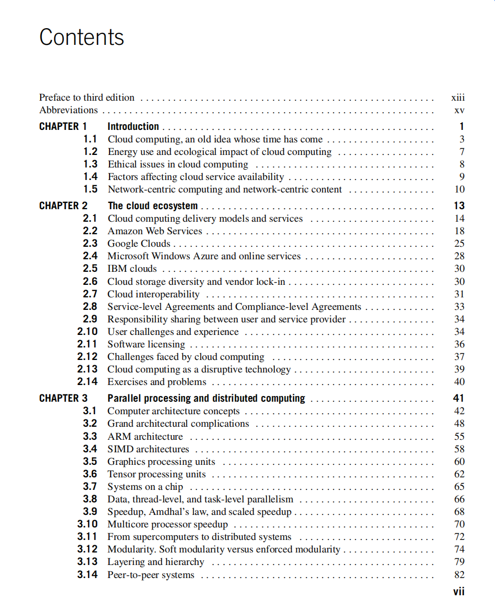
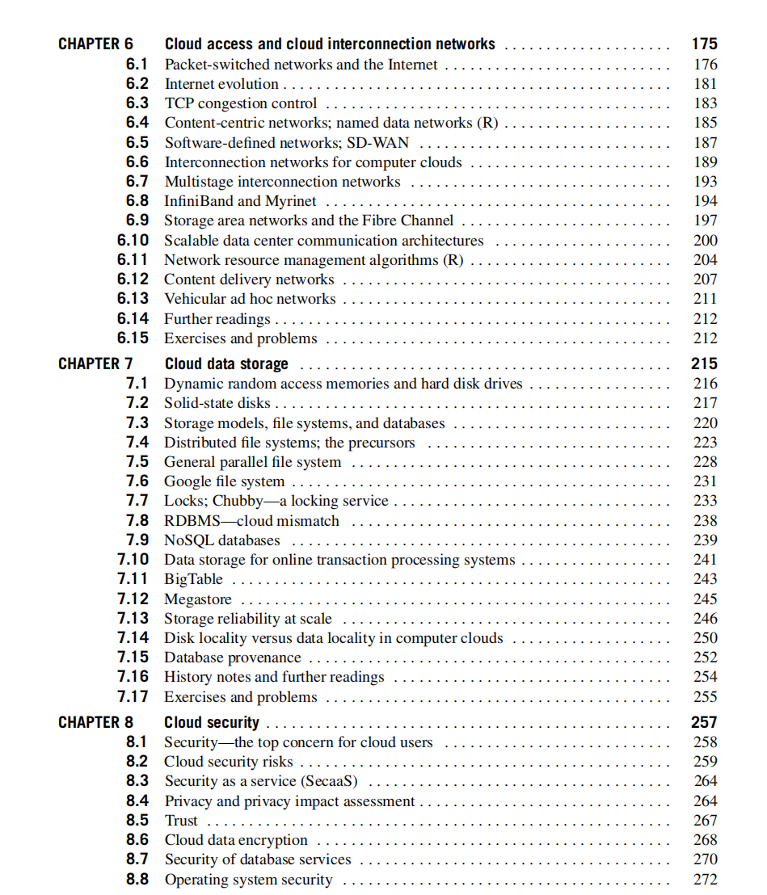
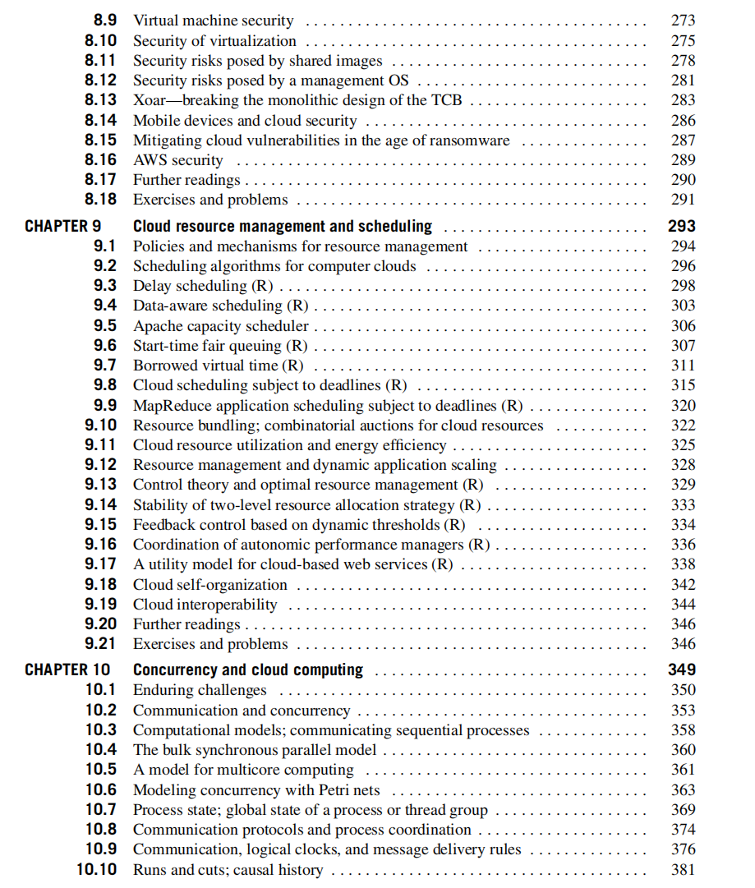
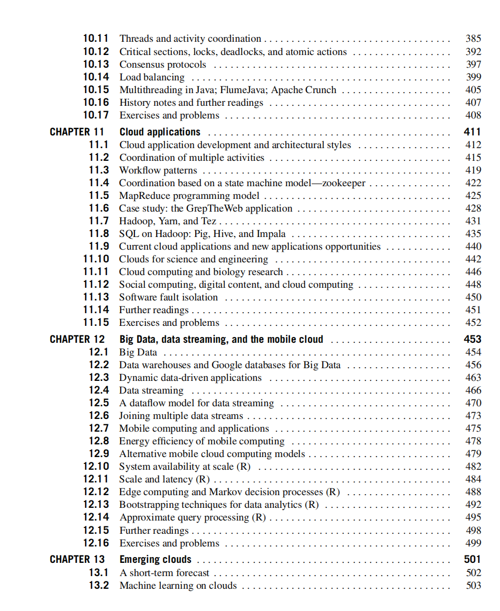
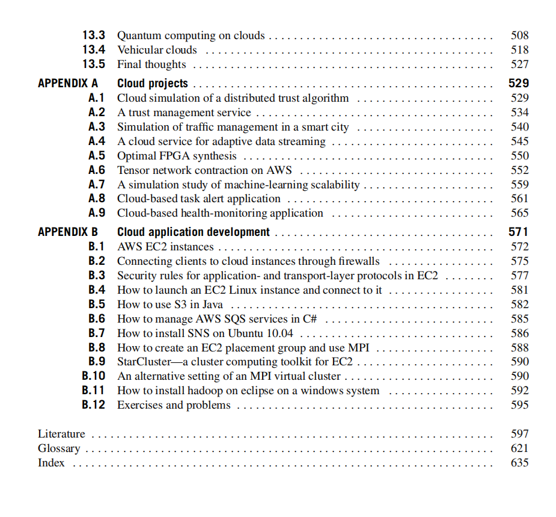

# Chapter 0 Contents

## 

**1\. 标题：云计算与分布式系统：从基础概念到前沿应用的完整导学目录**

以下笔记基于所给出的所有图片（即本书的目录），将其视作相互关联的整体内容，为读者提供对整本云计算教材的系统性概览与导读。通过阅读本笔记，即使没有任何预习，也能对教材各章与附录所涵盖的主要知识点、研究方向和实践案例有清晰的了解。

* * *

2\. 详细内容解析
----------

### **CHAPTER 1 Introduction（第1章：引言）**

1.1 **Cloud computing, an old idea whose time has come**

*   主要讨论云计算的概念及其历史渊源。指出云计算虽然在近些年迅速发展，但其实它的基本理念可追溯到共享计算资源、网络计算的早期尝试。
*   介绍云计算是如何随着网络带宽、虚拟化技术、分布式存储、廉价硬件以及商业模式的成熟而逐步成为主流的。

1.2 **Energy use and ecological impact of cloud computing**

*   分析云计算数据中心（含大型服务器机房）在能源消耗上的挑战。
*   探讨如何通过虚拟化、资源调度、负载均衡等方式提升能效、减少碳排放，兼顾可持续性和环保目标。

1.3 **Ethical issues in cloud computing**

*   介绍云计算中的数据隐私、数据所有权、数据利用及合规性等道德和法律层面的问题。
*   涉及用户数据的使用边界、个人信息保护、云服务商的责任与监管等。

1.4 **Factors affecting cloud service availability**

*   探讨影响云服务可用性的多种因素，如网络带宽和质量、服务器硬件可靠性、软件架构韧性等。
*   提到服务等级协议（SLA）相关概念，服务宕机及灾备方案等内容。

1.5 **Network-centric computing and network-centric content**

*   介绍网络中心化计算（或网络为中心的计算），以及云计算中内容的分发与管理机制。
*   说明云计算体系中如何利用网络进行资源聚合，从而实现高效的内容分发与协作。

* * *

### **CHAPTER 2 The cloud ecosystem（第2章：云计算生态系统）**

2.1 **Cloud computing delivery models and services**

*   讲解云计算三大服务模式：IaaS（基础设施即服务）、PaaS（平台即服务）、SaaS（软件即服务）。
*   说明公共云、私有云、混合云以及社区云等不同部署模型的特点。

2.2 **Amazon Web Services**

*   以AWS为例，剖析云计算最早且最具影响力的公共云平台之一。
*   介绍EC2（弹性计算云）、S3（简单存储服务）、RDS（关系型数据库服务）等AWS核心产品。

2.3 **Google Clouds**

*   介绍Google的云服务，包括Compute Engine、App Engine、BigQuery、Kubernetes等。
*   强调Google在大规模分布式系统和大数据处理方面的技术创新（如MapReduce、Spanner等），以及其在云上提供的服务形态。

2.4 **Microsoft Windows Azure and online services**

*   解析Azure的主要组件，如Azure虚拟机、Azure存储、Azure数据库等。
*   介绍Azure在混合云、多语言支持和与Windows生态系统整合方面的优势。

2.5 **IBM clouds**

*   概述IBM在云计算领域的服务布局，如IBM Cloud、Bluemix（旧称）、Watson等AI相关云服务。
*   说明IBM从传统硬件、软件到云服务的转型过程及特点。

2.6 **Cloud storage diversity and vendor lock-in**

*   探讨云存储服务的多样性，如对象存储、块存储、文件存储等，及不同厂商提供的技术与接口差异。
*   重点分析厂商锁定（vendor lock-in）问题，云服务之间的兼容性与迁移成本。

2.7 **Cloud interoperability**

*   进一步探讨跨云平台的互操作性问题。
*   涉及开放API、标准化协议、容器化和微服务架构在实现云间互通方面的重要性。

2.8 **Service-level Agreements and Compliance-level Agreements**

*   介绍服务等级协议（SLA）和合规等级协议（CLA）在云计算中的重要性。
*   讨论关键指标如可用性、性能、支持与赔偿机制以及数据合规（如GDPR、HIPAA等）。

2.9 **Responsibility sharing between user and service provider**

*   界定云服务提供商和用户各自的安全、维护、合规等责任。
*   不同服务模式（IaaS/PaaS/SaaS）之下责任分配方式的差异。

2.10 **User challenges and experience**

*   总结云用户在应用云服务时普遍面临的挑战，包括数据迁移、性能、成本管理、安全信任等。
*   分享实际使用云的经验、案例与应对策略。

2.11 **Software licensing**

*   探讨传统软件许可模式与云端订阅模式、使用量付费等新型许可方式的区别。
*   涉及开源协议与商业软件许可在云环境下的应用。

2.12 **Challenges faced by cloud computing**

*   综合性地总结云计算在安全、性能、法规、标准化、互操作、网络带宽等方面的难点。
*   引出后续章节更深入的探讨。

2.13 **Cloud computing as a disruptive technology**

*   分析云计算在商业模式、IT基础设施、软件开发流程中带来的颠覆性影响。
*   结合以往IT变革经验，阐述云计算对企业和社会的深层次影响。

2.14 **Exercises and problems**

*   针对本章内容提出思考题或实践题目，帮助读者巩固云计算生态系统的理解。

* * *

### **CHAPTER 3 Parallel processing and distributed computing（第3章：并行处理与分布式计算）**

3.1 **Computer architecture concepts**

*   回顾计算机体系结构基础：CPU、内存、总线、存储、I/O等关键硬件组件。
*   探讨并行与分布式计算依赖的硬件与系统架构。

3.2 **Grand architectural complications**

*   并行与分布式系统所面临的体系结构复杂性，如一致性模型、通信延迟与吞吐、同步机制等。

3.3 **ARM architecture**

*   介绍ARM架构的特点，低功耗、多核设计及其在移动设备和服务器中的应用。
*   为后续探讨移动云、边缘设备的计算能力打下基础。

3.4 **SIMD architectures**

*   解释单指令多数据（SIMD）架构的概念及应用，如GPU、向量处理器等。
*   讨论其在大规模并行计算和数据分析中的作用。

3.5 **Graphics processing units（GPU）**

*   专门分析GPU架构及其通用计算（GPGPU）。
*   GPU在云端训练深度学习、加速大数据分析等方面的贡献。

3.6 **Tensor processing units（TPU）**

*   介绍Google提出的TPU硬件加速器，用于深度学习模型的训练和推理。
*   说明在云环境中使用TPU带来的高效算力优势。

3.7 **Systems on a chip（SoC）**

*   探讨SoC集成度高、功耗低的特点，以及对移动设备、物联网节点的影响。
*   解释其与云端协作的意义，尤其是在边缘计算场景。

3.8 **Data, thread-level, and task-level parallelism**

*   细分并行计算中的不同层次：数据并行、线程并行、任务并行。
*   结合实例说明如何选择或混合不同并行策略以提升性能。

3.9 **Speedup, Amdhal’s law, and scaled speedup**

*   介绍Amdahl定律对于并行系统性能的理论限制。
*   解释 Gustafson 定律和“弱可伸缩性”在大规模并行中的意义。

3.10 **Multicore processor speedup**

*   讲解多核处理器如何实现并行计算加速以及在云服务器中的价值。
*   讨论缓存一致性、线程调度和负载均衡等影响因素。

3.11 **From supercomputers to distributed systems**

*   对比传统超级计算机与当代分布式系统/云平台的相同点与不同点。
*   说明为什么大规模分布式集群甚至可能替代部分超级计算机的角色。

3.12 **Modularity. Soft modularity versus enforced modularity**

*   解释模块化设计在分布式系统中的重要性。
*   “软模块化”强调设计灵活性，“强制式模块化”则侧重在架构层面强制隔离和统一接口，以减少耦合和故障传播。

3.13 **Layering and hierarchy**

*   探讨分层设计思想在并行与分布式系统中的应用（如网络协议栈、软件分层、硬件抽象层）。
*   有助于降低系统复杂度，并便于维护。

3.14 **Peer-to-peer systems**

*   介绍P2P系统的概念与应用，如BitTorrent、区块链等。
*   强调去中心化的节点组织结构在资源共享与容错方面的特点。

* * *

### **CHAPTER 4（图片中未出现，可能省略或在后续）**

如果目录中并未给出第4章的具体内容，我们直接跳到后面已有的章节。

* * *

### **CHAPTER 6 Cloud access and cloud interconnection networks（第6章：云接入与云互联网络）**

（注：本书在章节顺序上可能有5章内容被省略或未展示，直接给出了第6章。以下按照图片中顺序解析。）

6.1 **Packet-switched networks and the Internet**

*   回顾分组交换网络的基本原理以及互联网的构成。
*   介绍包交换在云环境与数据中心网络中的应用。

6.2 **Internet evolution**

*   从ARPANET到Web 2.0、移动互联网、物联网等演进过程。
*   分析云计算对互联网架构提出的新需求。

6.3 **TCP congestion control**

*   讲解TCP拥塞控制算法（如Tahoe、Reno、CUBIC），对云应用性能的影响。
*   讨论在高带宽、低延迟数据中心环境中TCP的优化。

6.4 **Content-centric networks; named data networks (R)**

*   介绍内容中心网络（CCN）或命名数据网络（NDN）的概念，即以内容/数据名称而非IP地址为中心进行路由。
*   探讨在未来互联网架构中支持云内容分发的可能性。

6.5 **Software-defined networks; SD-WAN**

*   解析软件定义网络（SDN）的原理：控制平面与数据平面分离，通过集中控制器来管理网络流量。
*   SD-WAN在跨地域云互联、流量优化、多分支机构连接中的应用。

6.6 **Interconnection networks for computer clouds**

*   介绍大规模数据中心互连网络如Clos网络、Fat-Tree拓扑、Spine-Leaf架构。
*   分析高吞吐、低延迟、可扩展性设计在云中的重要性。

6.7 **Multistage interconnection networks**

*   具体讨论多级网络交换结构（如Butterfly、Benes网络）在并行计算机和数据中心网络的应用。
*   重点在多径路由与负载均衡。

6.8 **InfiniBand and Myrinet**

*   讲解高性能计算环境常用的网络互连技术InfiniBand、Myrinet等，它们在低延迟和高吞吐方面的优势。
*   当这些技术运用于云数据中心时的取舍与挑战。

6.9 **Storage area networks and the Fibre Channel**

*   说明存储区域网络（SAN）及Fibre Channel在传统企业级存储解决方案中的地位。
*   结合云环境下对大规模存储与网络速度的要求，探讨未来趋势。

6.10 **Scalable data center communication architectures**

*   对数据中心网络需要在可扩展性、容错性、负载均衡方面进行的设计和实践展开讨论。
*   介绍常用的可扩展网络结构以及路由协议。

6.11 **Network resource management algorithms (R)**

*   介绍数据中心网络中的资源调度和分配算法，如流量工程、拥塞控制策略、队列管理等。
*   “(R)”表示可能是一篇研究性内容或文献调研。

6.12 **Content delivery networks**

*   解析CDN的工作原理（就近访问、分发节点、缓存机制）。
*   云时代下CDN与边缘计算融合，提升用户体验。

6.13 **Vehicular ad hoc networks**

*   介绍车载自组织网络（VANET）与车辆云概念。
*   探讨其在实时导航、无人驾驶、车联网服务中的地位。

6.14 **Further readings**

*   列出与网络和云互联有关的参考文献及拓展资源。

6.15 **Exercises and problems**

*   针对本章云网络的重点提出练习题和问题，供读者实践和思考。

* * *

### **CHAPTER 7 Cloud data storage（第7章：云数据存储）**

7.1 **Dynamic random access memories and hard disk drives**

*   回顾DRAM和传统机械硬盘（HDD）的工作原理与性能。
*   说明云环境下对存储介质的需求和相应的架构选择。

7.2 **Solid-state disks**

*   介绍SSD的技术原理（NAND闪存等）以及其在数据中心中快速普及的原因。
*   对比HDD，讨论SSD在随机读写性能、功耗和可靠性方面的差别。

7.3 **Storage models, file systems, and databases**

*   分析存储模型从文件系统到关系型数据库、NoSQL数据库的演进。
*   概述不同系统在一致性、可扩展性与数据模型等方面的区别。

7.4 **Distributed file systems; the precursors**

*   追溯早期分布式文件系统（如NFS、AFS）的起源和关键概念。
*   为后续大规模云存储系统的出现做铺垫。

7.5 **General parallel file system**

*   解析GPFS、Lustre等并行文件系统在高性能计算及云环境中的应用。
*   强调数据条带化、并行I/O对吞吐提升的重要性。

7.6 **Google file system**

*   深入剖析GFS的架构、Master/Chunkserver设计、数据切分与容错机制。
*   GFS对云计算分布式存储系统的深远影响。

7.7 **Locks; Chubby—a locking service**

*   介绍Google Chubby分布式锁服务，如何在分布式系统中实现一致性与仲裁。
*   探讨分布式锁在云计算中的基础作用。

7.8 **RDBMS—cloud mismatch**

*   阐述传统关系型数据库在云环境大规模水平扩展方面的困难。
*   引出NoSQL、分布式数据库等解决方案。

7.9 **NoSQL databases**

*   介绍NoSQL数据库分类（键值数据库、文档数据库、列式数据库、图数据库等）。
*   强调其在可扩展性、高可用性、CAP定理取舍方面的特点。

7.10 **Data storage for online transaction processing systems**

*   探讨OLTP系统的特性及在云端部署的关键考量（高并发、ACID特性、负载峰值管理等）。
*   可能提及NewSQL等混合方案。

7.11 **BigTable**

*   介绍Google BigTable的设计思路和数据模型。
*   结合分布式文件系统、分布式锁服务组成的生态。

7.12 **Megastore**

*   Google另一个数据库系统，其特性介于关系型与非关系型之间。
*   通过多副本与半同步复制保证一定程度的事务一致性。

7.13 **Storage reliability at scale**

*   大规模云存储系统的可靠性设计，如副本策略、纠删码、自动故障转移等。
*   硬件故障、网络分区、数据中心灾难等各种场景下的应对方法。

7.14 **Disk locality versus data locality in computer clouds**

*   对比磁盘局部性（传统单机时代的概念）与云时代的数据局部性（跨节点、跨机架甚至跨数据中心）。
*   提到在数据分析作业中把计算推向数据节点的重要思路。

7.15 **Database provenance**

*   介绍数据溯源机制，在云数据库中如何记录数据的来源、操作轨迹。
*   用于审计、合规、回溯错误等场景。

7.16 **History notes and further readings**

*   概述云数据存储的发展历史，并提供相关文献参考。

7.17 **Exercises and problems**

*   针对本章提出实践题目，进一步理解云数据存储的核心要点。

* * *

### **CHAPTER 8 Cloud security（第8章：云安全）**

8.1 **Security—the top concern for cloud users**

*   强调云安全在用户选择云服务时的重要性。
*   提到安全合规、隐私保护、数据防泄漏等方面的需求。

8.2 **Cloud security risks**

*   枚举常见安全风险：数据泄露、账户劫持、恶意内部人员威胁、网络攻击等。
*   分析云环境下风险的特殊性。

8.3 **Security as a service (SecaaS)**

*   介绍安全即服务理念，用户通过云安全服务商获取防火墙、监控、漏洞检测等。
*   探讨第三方安全服务的优缺点。

8.4 **Privacy and privacy impact assessment**

*   强调在云中对用户敏感信息进行隐私影响评估（PIA）和合规性审查。
*   涉及数据加密、脱敏、访问控制等措施。

8.5 **Trust**

*   探讨信任模型在云计算中的地位，包括对云服务提供商的信任、对基础设施的信任，以及第三方认证。

8.6 **Cloud data encryption**

*   介绍云中常见的加密策略：对称加密、非对称加密、传输层加密、同态加密（研究热点）等。
*   讨论密钥管理是云安全的难点之一。

8.7 **Security of database services**

*   分析云端数据库特有的安全挑战，如多租户环境的隔离问题。
*   数据库审计、行列级安全策略与加密等实践。

8.8 **Operating system security**

*   探讨云服务器操作系统（Linux、Windows Server等）的加固措施。
*   容器及虚拟机层面安全策略：最小化攻击面、定期补丁更新。

8.9 **Virtual machine security**

*   重点关注虚拟机隔离、虚拟机逃逸攻击等问题。
*   如何在云端确保不同租户间互不干扰。

8.10 **Security of virtualization**

*   讨论虚拟化管理程序（Hypervisor）安全漏洞可能带来的严重影响。
*   强调KVM、VMware、Xen等虚拟化方案的安全机制。

8.11 **Security risks posed by shared images**

*   用户在公共镜像市场下载镜像时，可能存在后门或恶意脚本。
*   云服务商在审核共享镜像方面应有的策略。

8.12 **Security risks posed by a management OS**

*   管理操作系统与宿主环境被攻破后，所有虚拟机都受威胁。
*   提到管理平面分离、最小权限原则等关键防护方法。

8.13 **Xoar—breaking the monolithic design of the TCB**

*   可能是一个研究项目，探讨如何将传统Hypervisor的单体TCB设计拆分，降低风险面。

8.14 **Mobile devices and cloud security**

*   移动端接入云服务的安全问题，如设备丢失、移动恶意应用、网络窃听等。
*   结合BYOD政策及企业安全策略。

8.15 **Mitigating cloud vulnerabilities in the age of ransomware**

*   当下勒索软件盛行，对云环境也带来威胁。
*   介绍数据备份、快照、分层防护等缓解措施。

8.16 **AWS security**

*   以AWS为例，说明云安全最佳实践：身份与访问管理（IAM）、VPC隔离、KMS密钥管理等。

8.17 **Further readings**

*   提供进一步拓展云安全的文献。

8.18 **Exercises and problems**

*   练习与问题，用于检验对云安全要点的掌握。

* * *

### **CHAPTER 9 Cloud resource management and scheduling（第9章：云资源管理与调度）**

9.1 **Policies and mechanisms for resource management**

*   介绍云环境中资源（计算、存储、网络）管理的策略与机制。
*   探讨自动伸缩、负载均衡、计费与配额等方面。

9.2 **Scheduling algorithms for computer clouds**

*   常见调度算法：先来先服务(FCFS)、最短作业优先(SJF)、优先级调度、多级队列等。
*   适用于云端大规模集群的改进算法。

9.3 **Delay scheduling (R)**

*   具体算法可能来自MapReduce或YARN中的调度优化，用延迟策略提升数据局部性。
*   “(R)”表示研究性内容或参考文献。

9.4 **Data-aware scheduling (R)**

*   在任务调度时考虑数据所在位置，从而减少数据传输开销，提高效率。

9.5 **Apache capacity scheduler**

*   以Hadoop YARN中的Capacity Scheduler为例，探讨多队列资源共享和隔离。

9.6 **Start-time fair queuing (R)**

*   一种在云环境中保证不同用户或作业公平性的队列机制。

9.7 **Borrowed virtual time (R)**

*   进一步的公平调度算法理论，可能结合虚拟时间、优先级调整等机制。

9.8 **Cloud scheduling subject to deadlines (R)**

*   考虑作业截止时间的调度算法，确保在给定时限内完成关键任务。

9.9 **MapReduce application scheduling subject to deadlines (R)**

*   针对MapReduce作业调度，满足时间约束、优化吞吐或降低成本。

9.10 **Resource bundling; combinatorial auctions for cloud resources**

*   介绍云资源分配的市场机制，如打包租用、竞价模式等。

9.11 **Cloud resource utilization and energy efficiency**

*   重点在提高资源利用率、减少空闲浪费，从而降低能耗和成本。
*   结合虚拟化弹性伸缩、服务器整合等技术手段。

9.12 **Resource management and dynamic application scaling**

*   讨论应用层如何根据实时负载自动扩容/缩容。
*   包括弹性伸缩的实现架构、监控指标和决策算法。

9.13 **Control theory and optimal resource management (R)**

*   应用控制理论方法（如PID控制、预测控制）在云资源管理的动态调优中。

9.14 **Stability of two-level resource allocation strategy (R)**

*   进一步探讨多层级调度（如本地调度 + 全局调度）如何保持系统稳定。

9.15 **Feedback control based on dynamic thresholds (R)**

*   引入反馈控制循环，动态调整阈值实现资源管理。

9.16 **Coordination of autonomic performance managers (R)**

*   自主性能管理器在云环境中的协同工作机制。
*   强调自动化、智能化调度。

9.17 **A utility model for cloud-based web services (R)**

*   将云服务性能或可用性与效益或满意度相结合的效用模型。
*   在学术或企业评估中常用。

9.18 **Cloud self-organization**

*   分布式自组织系统思想，节点根据局部信息进行全局协作与负载均衡。

9.19 **Cloud interoperability**

*   与第2章互操作性议题呼应，强调调度与资源管理层面跨云操作的挑战。

9.20 **Further readings**

*   提供学术论文、技术报告等资源。

9.21 **Exercises and problems**

*   练习题与思考题，帮助理解云资源管理与调度的实践与原理。

* * *

### **CHAPTER 10 Concurrency and cloud computing（第10章：并发性与云计算）**

10.1 **Enduring challenges**

*   并发编程中持续存在的问题：死锁、竞争、可扩展性、调试复杂度等。
*   云环境下的并发规模更大，问题也更具挑战。

10.2 **Communication and concurrency**

*   探讨并发系统中通信模型，如消息传递、共享内存。
*   不同模型在云架构中的应用场景。

10.3 **Computational models; communicating sequential processes**

*   介绍CSP理论等并发模型，以及其在分布式系统中的映射。
*   强调抽象化思维在并发编程中的意义。

10.4 **The bulk synchronous parallel model**

*   BSP模型：将并行计算拆分为计算、通信和同步的阶段。
*   在云大数据处理领域的意义，如MapReduce常被视作一种BSP变体。

10.5 **A model for multicore computing**

*   多核下的共享内存并行编程模型，如OpenMP、线程库的使用。
*   强调任务分解与负载均衡。

10.6 **Modeling concurrency with Petri nets**

*   Petri网是常用的并发系统建模工具，可分析死锁、资源竞争等。
*   适用于工作流管理、业务流程分析等云应用。

10.7 **Process state; global state of a process or thread group**

*   并发系统中进程或线程全局状态跟踪的难点。
*   云环境下分布式多线程的状态一致性。

10.8 **Communication protocols and process coordination**

*   常见通信协议（TCP/UDP/RPC等）在进程协调中的用法。
*   分布式一致性算法如Paxos、Raft等（可能在后面章节进一步探讨）。

10.9 **Communication, logical clocks, and message delivery rules**

*   介绍Lamport逻辑时钟、Vector Clock在事件排序和一致性检测中的应用。
*   保障消息传递的有序性和因果关系。

10.10 **Runs and cuts; causal history**

*   进一步探讨分布式系统中的一致性可视化方法，如runs-cuts模型、因果历史图。
*   帮助理解并发事件的先后关系和调试方法。

10.11 **Threads and activity coordination**

*   在线程级别进行协调管理，如信号量、互斥锁、条件变量等常见机制。

10.12 **Critical sections, locks, deadlocks, and atomic actions**

*   并发编程核心概念：临界区、互斥、死锁、原子操作。
*   解释其在云端服务的多线程组件中如何体现。

10.13 **Consensus protocols**

*   介绍Paxos、Raft、Zab等分布式一致性协议。
*   在云计算中保证多副本一致性与容错。

10.14 **Load balancing**

*   并发与云环境下负载均衡的重要性，常用算法如轮询、最短响应时间优先等。
*   硬件负载均衡器与软件方案（NGINX、HAProxy等）对比。

10.15 **Multithreading in Java; FlumeJava; Apache Crunch**

*   以Java并发编程API为例，讲解高层次并发框架如何简化任务。
*   FlumeJava、Apache Crunch等大数据管道处理工具。

10.16 **History notes and further readings**

*   给出并发领域的经典文献与拓展资料。

10.17 **Exercises and problems**

*   并发编程和云计算结合的实践与测试题。

* * *

### **CHAPTER 11 Cloud applications（第11章：云应用）**

11.1 **Cloud application development and architectural styles**

*   介绍云原生应用开发模式、微服务架构、12-Factor App等理念。

11.2 **Coordination of multiple activities**

*   多活动（多个并行任务或微服务）的协调方式，如工作流、消息队列、服务编排等。

11.3 **Workflow patterns**

*   常见的工作流模式：顺序、并发、条件分支、同步等。
*   在云上实现自动化业务流程的价值。

11.4 **Coordination based on a state machine model—zookeeper**

*   说明Zookeeper在分布式协调服务中的角色：配置管理、命名服务、分布式锁等。
*   状态机复制、一致性保证的机制。

11.5 **MapReduce programming model**

*   对MapReduce思想的回顾：Map阶段并行处理、Reduce阶段汇总。
*   在大数据分析和分布式处理上的广泛应用。

11.6 **Case study: the GrepTheWeb application**

*   可能是一个示例应用，通过MapReduce或分布式搜索进行海量文本检索。
*   说明如何在云环境中搭建并扩展该应用。

11.7 **Hadoop, Yarn, and Tez**

*   分析Hadoop生态：HDFS存储、YARN资源调度、Tez作为MapReduce的DAG化升级。

11.8 **SQL on Hadoop: Pig, Hive, and Impala**

*   说明在Hadoop之上进行SQL查询的多种工具：Pig脚本、Hive数据仓库、Impala实时SQL等。
*   强调大数据分析与交互式查询需求。

11.9 **Current cloud applications and new applications opportunities**

*   综述云计算当前成熟应用（SaaS、PaaS、AI训练、IoT后端等）及未来潜力领域。

11.10 **Clouds for science and engineering**

*   科学计算、高性能计算（HPC）在云上的应用，如分子模拟、气象预测、基因测序等。

11.11 **Cloud computing and biology research**

*   对接生物信息学领域的大规模计算需求，云端分析基因数据、蛋白质结构等实例。

11.12 **Social computing, digital content, and cloud computing**

*   社交网络、在线媒体内容分发（视频、音频、图片）如何借助云平台实现海量处理。
*   用户生成内容（UGC）带来的存储与带宽挑战。

11.13 **Software fault isolation**

*   讨论如何在同一云环境中隔离不同软件的错误，使其不会相互影响。
*   包含沙箱技术、容器化技术的介绍。

11.14 **Further readings**

*   云应用相关的研究文献与扩展材料。

11.15 **Exercises and problems**

*   练习题与应用开发实践。

* * *

### **CHAPTER 12 Big Data, data streaming, and the mobile cloud（第12章：大数据、数据流处理与移动云）**

12.1 **Big Data**

*   介绍大数据的4V特征（Volume、Velocity、Variety、Veracity）及行业应用案例。

12.2 **Data warehouses and Google databases for Big Data**

*   传统数据仓库与Google BigQuery、Spanner等面向大数据的云数据仓库服务。

12.3 **Dynamic data-driven applications**

*   根据实时数据进行决策或调整的应用形态，如实时推荐、在线风控。

12.4 **Data streaming**

*   流式计算模型：数据源源不断到达，系统实时进行处理与响应。
*   可能提及Apache Kafka、Flink、Storm等。

12.5 **A dataflow model for data streaming**

*   在流式计算中通常使用有向无环图（DAG）或数据流模型来描述处理过程。

12.6 **Joining multiple data streams**

*   讨论实时数据关联、多数据流Join操作的挑战与常用算法。

12.7 **Mobile computing and applications**

*   移动云的特点：设备不稳定性、网络波动、高并发位置服务等。
*   移动端和云端协同的典型业务模式。

12.8 **Energy efficiency of mobile computing**

*   移动设备电池有限，要借助云来完成计算密集型任务。
*   相关技术策略如云卸载、边缘协处理。

12.9 **Alternative mobile cloud computing models**

*   可能涉及云端代理、云游戏、云AR/VR、Cloudlet等概念。

12.10 **System availability at scale (R)**

*   大规模系统可用性建模与分析，云+移动场景的冗余与故障切换策略。

12.11 **Scale and latency (R)**

*   在大规模数据处理与分布式系统中，延迟与吞吐的权衡。

12.12 **Edge computing and Markov decision processes (R)**

*   在边缘节点进行计算时，可用马尔可夫决策过程（MDP）进行资源或任务决策优化。

12.13 **Bootstrapping techniques for data analytics (R)**

*   在数据分析早期可用的启蒙或自举技术，用于模型训练或推断。

12.14 **Approximate query processing (R)**

*   大数据场景中，牺牲一定精度换取更高速度的查询方式。

12.15 **Further readings**

*   提供与大数据、数据流、移动云等相关的研究资源。

12.16 **Exercises and problems**

*   练习与讨论，深化对本章概念的掌握。

* * *

### **CHAPTER 13 Emerging clouds（第13章：新兴云计算形态）**

13.1 **A short-term forecast**

*   对云计算近期发展趋势的预测：容器编排、Serverless、AIOps等。

13.2 **Machine learning on clouds**

*   云端机器学习服务（如AWS Sagemaker、GCP AI Platform、Azure ML）以及大规模分布式训练（TensorFlow、PyTorch on Kubernetes等）。

13.3 **Quantum computing on clouds**

*   介绍量子计算在云中的试验性平台（如IBM Quantum Experience）。
*   探讨量子计算与传统云的结合潜力。

13.4 **Vehicular clouds**

*   车辆云或移动云的延伸，将车辆计算与网络资源结合实现协同决策。
*   辅助自动驾驶、车队编排等应用。

13.5 **Final thoughts**

*   总结云计算发展历程与展望。

* * *

### **APPENDIX A Cloud projects（附录A：云项目示例）**

A.1 **Cloud simulation of a distributed trust algorithm**

*   在云环境中模拟分布式信任算法，可能涉及区块链或去中心化架构。

A.2 **A trust management service**

*   云上部署的信任管理模块，验证用户或节点的可信度。

A.3 **Simulation of traffic management in a smart city**

*   用云模拟智慧城市交通流量管控，挖掘实时数据。

A.4 **A cloud service for adaptive data streaming**

*   动态调整数据流处理拓扑，以适应负载变化和网络状况。

A.5 **Optimal FPGA synthesis**

*   在云上并行化地进行FPGA综合以缩短设计时间，提升资源利用率。

A.6 **Tensor network contraction on AWS**

*   可能与量子计算或高维张量相关的大规模计算，在AWS上测试与优化。

A.7 **A simulation study of machine-learning scalability**

*   研究ML任务在不同规模数据集与计算节点下的可扩展性。

A.8 **Cloud-based task alert application**

*   基于云的任务或事件提醒服务。

A.9 **Cloud-based health-monitoring application**

*   健康监测应用，采集可穿戴设备数据并在云端进行分析、存储与通知。

* * *

### **APPENDIX B Cloud application development（附录B：云应用开发）**

B.1 **AWS EC2 instances**

*   介绍如何创建、配置和管理EC2实例，选择合适的实例类型。

B.2 **Connecting clients to cloud instances through firewalls**

*   探讨安全组、VPC、端口映射等，保证云实例与外界通信安全。

B.3 **Security rules for application- and transport-layer protocols in EC2**

*   针对HTTP/HTTPS、SSH、RDP等常见协议的访问控制与安全配置。

B.4 **How to launch an EC2 Linux instance and connect to it**

*   实际操作指导，如使用AWS控制台或CLI创建并通过SSH登录。

B.5 **How to use S3 in Java**

*   在Java程序中使用AWS SDK调用S3进行对象存储操作示例。

B.6 **How to manage AWS SQS services in C#**

*   示例如何在C#中使用AWS SDK与SQS队列进行消息管理。

B.7 **How to install SNS on Ubuntu 10.04**

*   一个稍早的实例教程，设置SNS（Simple Notification Service）客户端或服务端。

B.8 **How to create an EC2 placement group and use MPI**

*   演示在Placement Group中部署集群实例以获得高吞吐网络，以及使用MPI进行分布式计算。

B.9 **StarCluster—a cluster computing toolkit for EC2**

*   第三方工具StarCluster在AWS上快速搭建HPC集群的用法。

B.10 **An alternative setting of an MPI virtual cluster**

*   进一步探讨在云上创建MPI集群的不同方案。

B.11 **How to install hadoop on eclipse on a windows system**

*   在Windows下基于Eclipse环境搭建Hadoop本地开发与测试环境的教程。

B.12 **Exercises and problems**

*   针对附录B各种云开发实操的练习题。

* * *

3\. 总结
------

通过以上章节与附录的概览，可以看出本教材/书籍涵盖了从云计算基础与生态系统，到分布式计算与并行处理，再到云网络、云存储、云安全、资源管理与调度，并且深入到并发模型、实际云应用案例、大数据与移动云、以及新兴云计算形态（如量子计算、车载云、Serverless趋势等）。附录部分则提供了丰富的实践项目和云上开发部署教程，包含AWS EC2、S3、Hadoop等具体操作细节。

本书目录所构建的内容体系非常完整，既有理论深度（如分布式一致性、并发模型、调度算法）也有实践案例（AWS操作说明、MapReduce、Hadoop生态）。对于想要系统学习云计算，从基础硬件、虚拟化、分布式架构到应用层和新趋势，都能在这本书中找到相应的知识点与实践指导。

* * *

4\. 报错（勘误提示）
------------

*   从提供的目录截图看，本次笔记对所有可见章节与附录已做了逐条解释，没有明显的缺失。
*   若图片内容有更细节或特殊小节，可能未被完全展示，若需要更深入内容可根据实际章节进行延伸学习。

