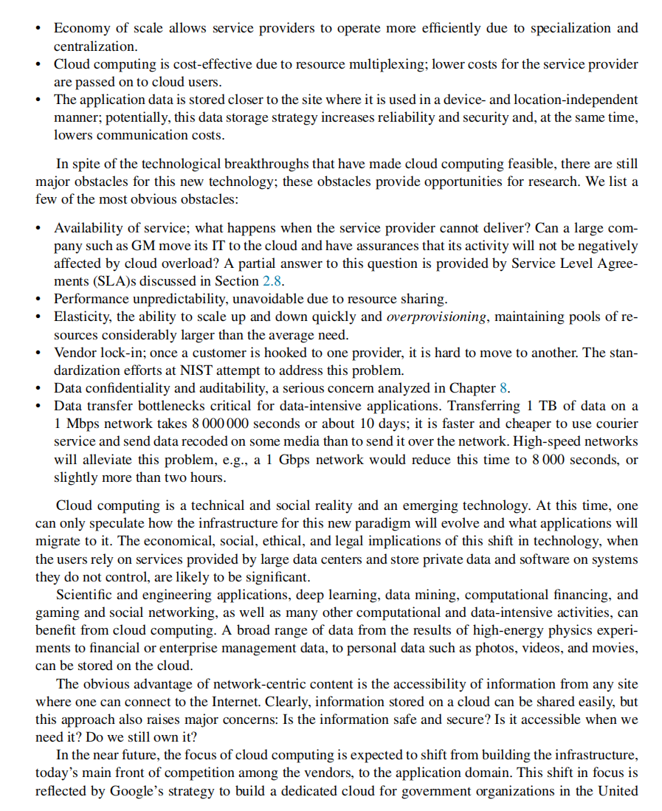

# Chapter 1

**User:** awe d (dqswordman@gmail.com)  

# Start

**第一部分：云计算导论**

以下笔记基于四张课件截图的内容，旨在帮助读者系统理解云计算（Cloud Computing）的由来、核心概念、技术特征以及面临的挑战。即使没有任何预习或课本辅助，阅读本笔记也能较全面地掌握相关知识点。

* * *

1\. 本部分内容概况
-----------

1.  **云计算的背景与概念**
    
    *   云计算的发展脉络：从“公用事业计算”（Utility Computing）的启示到商业模式的演变。
    *   NIST（美国国家标准与技术研究院）对云计算的定义及其五大关键特征。
    *   John McCarthy 的“计算机公用事业”预言与云计算在当代的社会、技术意义。
2.  **云计算的兴起与驱动**
    
    *   AWS（Amazon Web Services）在 2006 年推出 EC2 与 S3，引领云计算商用化浪潮。
    *   大规模数据中心与“网络中心”计算模式，用户向云服务提供商（CSP）交付数据及代码。
    *   业务按使用量计费（pay-per-use）的经济模型与资源弹性伸缩。
3.  **云计算带来的技术挑战与机遇**
    
    *   大规模并行处理：GPU、TPU 的出现要求新的并行算法、编程环境、工具。
    *   大数据时代对计算与存储能力的需求暴增，“粗粒度并行”可能更具优势。
    *   系统规模剧增可能导致资源管理、服务器性能瓶颈及宕机风险，需警惕低概率事件的严重后果。
4.  **云计算的本质与核心优势**
    
    *   颠覆性的计算范式：需要在数据存储、计算架构、网络、资源调度、系统工程等多方面进行重大革新。
    *   共享模式（多租户与资源复用）带来成本效益；“无所不在”、“随需应变”的特性体现出云计算的灵活性。
    *   采用低成本、通用（off-the-shelf）的硬件组件，通过软件定义的方式提供高可用、高可靠服务。
5.  **云计算的挑战与争议**
    
    *   极大规模复杂系统的管理难题：系统体系架构演进、通信和网络要求提升（如 IPv6 迁移等）。
    *   安全与隐私问题始终是云计算应用的重要关切。
    *   对云计算的质疑：是否只是营销噱头？用户是否过度依赖云端供应商？当云出现故障时，影响范围将非常广泛。

* * *

2\. 详细内容与知识点解析
--------------

下面将分段深入解析课件四张图片中出现的主要段落和概念。

* * *

### 2.1 “云计算”的概念与公用事业计算（Utility Computing）

> **云计算是提供计算服务的一种公用事业模式**

*   在过去的“公用事业计算”理念中，人们可以像使用自来水、电力或电话一样使用计算服务。硬件和软件资源集中于大型数据中心，用户只需为自身所用的计算、存储和通信资源付费。
*   云计算继承并扩展了公用事业计算的思想，但更强调**商业模式**——即按需使用、灵活计费，以及更高的资源可扩展性。

> **NIST 对云计算的定义**

*   NIST 将云计算定义为：一种“使用户能够随时随地、按需访问可配置计算资源的共享池”的模式，且这些资源可以快速供应与释放，减少人为管理干预。
*   五大核心特征：
    1.  **On-demand self-service（按需自助服务）**：用户可根据需求随时申请、扩容或缩容计算资源，不必与服务提供商进行人工交互。
    2.  **Broad network access（广泛的网络接入）**：资源可通过网络从各种平台（笔记本、手机、平板等）访问。
    3.  **Resource pooling（资源池化）**：计算资源被集中、抽象为一个资源池，根据用户需求动态分配。
    4.  **Rapid elasticity（快速弹性伸缩）**：从资源少量到大规模都可以迅速调整，体现“弹性”特性。
    5.  **Measured service（可度量服务）**：系统会自动控制并优化资源使用，根据具体的计量方式（例如时长、流量、CPU用量等）进行计费。

> **John McCarthy 的预言**

*   早在半个世纪前（MIT 百年校庆期间），John McCarthy 便指出“未来的计算机可能组织成公用事业，就像电话系统一样”。
*   他的观点：计算机作为一种公用设施可以诞生新的重要产业，这在现今以云计算为代表的模式中已成为现实。

* * *

### 2.2 云计算的兴起：从大规模数据中心到 Amazon S3

> **计算与存储模式的转变**

*   云计算时代的核心是：将原本在本地运行的应用与数据放到远程的数据中心中，通过网络访问。
*   用户在这一新模式下不再直接控制底层硬件与系统配置，而由云服务提供商（CSP）运维。
*   这种模式称为“网络中心（network-centric）”计算或“网络中心”存储。

> **Amazon EC2 与 S3 的里程碑**

*   2006 年 Amazon Web Services 推出了 **Elastic Cloud Computing (EC2)** 与 **Simple Storage Service (S3)**，标志着云计算大规模商用的开始。
*   到 2012 年，EC2 已在 200 多个国家得到应用，S3 存储的对象（objects）数量突破 2 万亿，峰值请求量超过每秒 110 万。
*   云计算服务自此发展迅猛，全球各行各业都在使用 CSP 提供的弹性计算和存储服务。

> **按需计费与经济模式**

*   云服务主要依据“按使用量付费”（pay-per-use）理念，为用户提供可伸缩的计算、存储与网络服务。
*   对于企业而言，使用云计算能够减少前期购买硬件、运维设施的投入，使用多少付多少钱。
*   大量组织和企业纷纷采用这种模式，云计算也由此成为一种**可持续发展的商业模式**。

* * *

### 2.3 数据密集型与并行计算时代：边缘计算、GPU/TPU 的挑战

> **数据不再只存储于本地设备**

*   在云计算背景下，个人设备（工作站、笔记本、智能手机、平板等）原本需要本地存储和处理的数据可以放在云端。
*   只要设备与网络相连，就能随时随地访问数据，大大提升数据可得性与协作效率。
*   由于网络带宽和响应时间的限制，还可能需要\*\*边缘计算（Edge Computing）\*\*来预处理或本地缓存数据，以减少网络传输量并降低延迟。

> **新计算架构：GPU、TPU 的出现**

*   GPU（图形处理器）与 TPU（张量处理单元）的崛起为云计算数据中心带来惊人的并行处理能力。
*   这意味着软件开发者、算法工程师需要适配新的**并行算法、编程模型与工具**，以充分利用多核、多处理器架构的潜力。
*   等待频率更高的CPU已经意义不大，关键在于**开发更好的算法**和**并行模型**，让数百万个计算核心协同工作。

> **大数据与“大规模并行”观念**

*   大数据（Big Data）时代对处理能力的需求异常庞大，大量应用（数据分析、科学计算、金融建模、人工智能等）都可在云端获得并行化优势。
*   “粗粒度并行”被认为在实际工程中更具可行性，因为微观级别的细粒度并行往往带来更高的调度与同步开销。

* * *

### 2.4 大规模系统的机遇与风险：可扩展性与故障影响

> **系统可扩展性与潜在“噩梦”**

*   规模越大，可能带来更高收益和更多不可预期的好处。但同时，复杂系统中一旦出现小概率故障，其影响面也会急剧放大。
*   一个硬件或软件组件的故障可能导致级联效应，引发整个系统或网络瘫痪，造成极大的经济与声誉损失。

> **云计算是颠覆性的计算范式（Disruptive Computing Paradigm）**

*   它需要在系统结构、网络通信、资源管理、调度策略、数据中心硬件设计等多方面进行创新。
*   云计算环境往往充满不确定性和多变性，一方面用户需求多样且冲突（高性能 vs. 成本、稳定 vs. 弹性），另一方面硬件与网络环境也会不断演变。
*   对工程师而言，需要开发全新思维，考虑**高变异性、冲突需求**与**大规模基础设施**下的技术挑战。

> **资源复用（Resource Multiplexing）与成本效益**

*   多租户（multi-tenancy）与虚拟化技术使云计算具备整合不同应用负载的能力，**在同一个物理服务器上同时运行多个虚拟实例**，从而提升资源利用率，降低单位成本。
*   对使用云计算的组织而言，可以减少自建机房与购买硬件设备的开销；对云服务商而言，集中规模化运维则能带来\*\*经济规模（economies of scale）\*\*效益。

> **采用“廉价、通用组件”进行系统构建**

*   与过去动辄上千万美元的专用超级计算机不同，云数据中心更多使用**通用硬件**（off-the-shelf）堆叠，通过软件层面（虚拟化、容器化、软件定义网络等）来实现容错、负载均衡与高可用。

* * *

### 2.5 云计算基础设施的复杂性与演进

> **几乎无限的系统组合与故障几率**

*   现代数字系统规模庞大，且由软件驱动，将多个复杂子系统组合到一起往往带来不可预期的行为。
*   大规模云环境中，完全避免失败并不现实，必须具备**故障管理机制**和**灾难恢复能力**。
*   面对网络、操作系统、硬件、应用层面等各种可能出现的故障，系统需要有容错和回滚设计。

> **计算与通信的深度交织**

*   云计算能够普及，离不开高速、低延迟、低成本的网络与通信能力（如现代的光纤网络、智能路由器、AI增强安全等）。
*   在云数据中心与超级计算中心中，高性能交换机、路由器与 AI 技术同样扮演重要角色。

> **体系架构、协同机制与分析方法的持续演进**

*   面对技术与用户需求的不断变化，云计算的架构（从 IaaS/PaaS/SaaS 到更细分的 XaaS）、协调机制（集群调度、编排系统）以及分析/监控方法必须不断迭代。
*   通信和互联网本身也在更新换代：速度、可靠性、安全性、IPv6 的使用、寻址能力扩大等，都会影响云的未来发展。

> **管理如此庞大的基础设施**

*   如何在拥有数百万台服务器的数据中心中进行自我管理与自我修复？
*   是否要从严格的确定性模型转向更具弹性的非确定性模型，让系统具备一定的自适应和“智能”能力？
*   这类问题构成了云计算在计算机科学与工程领域的前沿研究。

* * *

### 2.6 云计算的质疑与关注点：安全、隐私与依赖性

> **质疑与批评**

*   一些批评者认为云计算可能只是一种营销宣传，使用户过度依赖特定厂商。
*   当云平台出现故障或中断时，那些高度依赖云的个人和企业可能面临严重损失。

> **安全与隐私**

*   由于数据存储在远程服务器上，“数据安全”与“隐私保护”成为最突出的问题之一。
*   云平台需要通过加密、访问控制、审计追踪等手段保障多租户环境下的数据安全。
*   政策与法律层面也会影响云服务商数据中心的选址、合规性管理等。

> **用户对云的依赖性**

*   随着越来越多的应用与服务迁移到云端，一旦云服务停止或出现故障，就会对大范围用户产生影响。
*   企业需要制定弹性策略，包括**混合云**或**多云**部署，以减少对某一家云供应商的依赖。

* * *

3\. 本次内容小结
----------

1.  **云计算的定位与发展**
    
    *   云计算不仅是一种技术，更是一种基于互联网的商业与服务模式。
    *   通过集中管理与规模化运维，云计算为企业和个人提供“随用随付”的计算与存储能力，极大降低进入门槛。
2.  **核心特征与驱动力**
    
    *   按需自助服务、广泛网络接入、资源池化、弹性伸缩与可度量服务，共同构成云计算的典型特征。
    *   大数据、人工智能、并行计算等对算力与存储需求的爆发性增长，加速了云计算的普及和演进。
3.  **面临的关键挑战**
    
    *   大规模系统设计与管理难度高，需防范低概率的大规模故障。
    *   并行计算架构（GPU、TPU）的崛起要求开发者更新算法与编程环境。
    *   安全、隐私、合规和供应商依赖等现实问题仍待进一步完善与解决。
4.  **未来演进方向**
    
    *   网络与通信技术（IPv6、AI路由、安全协议）的进步将继续为云计算提供更坚实的基础。
    *   可能出现更智能化、更自动化（自管理、自修复）的云基础设施，利用自动编排、容器化和微服务化应对复杂需求。
    *   云计算与边缘计算等模式的融合，为实时性与移动性提出新的方案。

* * *

4\. 是否有疏漏或内容不清晰
---------------

*   从截图文字来看，本次引用的文字内容较为清晰，未发现明显模糊或无法辨认之处。
*   已尽量对每张图片中的知识点进行了完整解释，若后续有更多截屏或更深层次的技术细节（如具体的云计算架构、虚拟化技术、资源调度算法等），可在后续部分继续深入探讨。

* * *

以上即为根据四张课件截图所做的详细笔记汇总与分析。通过这些内容，读者能够初步掌握云计算的核心理念、发展历程、技术特点以及在大规模应用层面面临的挑战与机遇。若有任何进一步疑问或希望更深入了解的细节，可以再行讨论或补充。

# **1.1** **Cloud computing, an old idea whose time has come**

**第一部分：云计算——一个“老想法”迎来黄金时代**

下面的笔记内容基于本次提供的多张课件截图，涵盖了云计算的发展背景、软件工程思维演进、云计算的核心概念与模型、以及云计算所面临的机遇与挑战。本文将按照以下结构展开：

1.  **标题与总体概况**
2.  **详细知识点解析**
3.  **本次内容总结**
4.  **是否有疏漏或错误**

* * *

1\. 标题与总体概况
-----------

**标题**：云计算：从“老概念”到新时代的计算范式

**概况**

*   云计算并非突然出现的全新技术，而是多种技术（微处理器、多核、网络、存储、软件工程架构）的协同演进与成熟的结果。
*   随着硬件（SoC、多核CPU、GPU、TPU）与存储技术（SSD、闪存等）不断进步，软件工程也逐渐发展出三层架构等新模型，云计算的规模化经济与“随用随付”模式开始大受认可。
*   云计算不仅给企业和个人带来弹性、高效的计算与存储服务，也面临如可用性、性能不可预测性、弹性管理、供应商锁定、安全与隐私等重要挑战。
*   此外，云计算涵盖不同的交付模式（如 IaaS、PaaS、SaaS、DBaaS）与部署模式（如公有云、私有云、混合云、社区云），对应不同的用户需求场景与管理方式。
*   最终，网络中心（Network-centric）的计算方式使信息可以随时随地访问，但也引发了关于数据安全、隐私、法律与道德层面的思考。

* * *

2\. 详细知识点解析
-----------

以下按课件截图的脉络，对主要知识点进行拆解与深入分析。

* * *

### 2.1 云计算：一个“老主意”终于成熟

> **背景：多种技术进步的累积效果**

*   **微处理器和多核技术**：硅基芯片上集成多个核心（multi-core）的出现，使得 CPU 的计算能力迅速提升。核心间的距离变得更近，缓存一致性电路能够在更高时钟频率下工作（而不必出芯片再返回），这大幅提升并行计算性能与能效比。
*   **SoC（System on a Chip）**：如 Apple M1，集成了通用核心（CPU）与专用核心（GPU、TPU 等），在同一块芯片上提供高性能与低功耗的结合。
*   **存储技术革新**：从机械硬盘 (HDD) 向固态硬盘 (SSD)、闪存 (Flash) 转变，使得 I/O 延迟大幅降低、高并发处理能力显著提高；光存储技术也更加普及化与廉价。

> **软件工程的演进**

*   **三层架构（Three-tier Model）**：
    1.  **Presentation tier（表示层）**：通常在桌面端或笔记本、移动端运行，负责用户界面和信息呈现。
    2.  **Application/Logic tier（应用或逻辑层）**：控制应用功能，可在工作站、应用服务器上运行，可能具有多层逻辑模块。
    3.  **Data tier（数据层）**：数据库或主机系统，用于存储和管理数据；与应用服务器分离，提高扩展性和性能。
*   这套分层设计思想逐渐成熟，为后期的**云计算平台**提供了良好的应用架构范式（可独立替换、分离部署、水平扩展等）。

> **大规模数据中心的经济效益**

*   当技术要素（硬件 + 软件 + 网络）准备就绪后，在大规模数据中心集中建设并经营云服务就变得经济可行。
*   **规模经济（Economy of Scale）**：拥有超过 50,000 台服务器的大型数据中心，比拥有 1,000 台服务器的中小型机房更具运营成本优势；同时能够减少单位能耗。
*   基于通用硬件（commodity hardware）构建的数据中心可在能耗与资源消耗方面比中型机房减少到五分之一到七分之一。

* * *

### 2.2 云计算成功的驱动因素

文中列举了影响云计算成功的四大主要因素：

1.  **技术进步（technological advances）**
    
    *   硬件层面：CPU 多核化、GPU/TPU、大容量内存与高速存储、网络带宽升级。
    *   软件层面：分布式与并行计算算法、虚拟化与容器化、自动化运维、调度编排等。
2.  **现实的系统模型（realistic system model）**
    
    *   与过去只能在纸面或实验室阶段的分布式模型不同，当下的计算环境已经能真正支撑大规模的网络中心运算。
3.  **用户便利性（user convenience）**
    
    *   弹性与按需付费，免去用户自建机房的高成本与管理负担；
    *   丰富的云服务生态（从 IaaS/PaaS/SaaS 到各种数据库服务、AI 服务等）提高使用体验。
4.  **成本因素（cost）**
    
    *   按使用量计费，无需预付大量成本购置硬件。
    *   统一管理硬件与集中运维带来的规模效益可使云服务商以相对优惠的价格提供服务。

> **云计算带来的价值**

*   更好地利用最新的软件、网络、存储和处理器技术。
*   提供硬件与软件资源于同一管理域中（集中式管理），相比完全分布式环境更易实现故障管理和质量控制。
*   专注企业级计算（金融、医疗、零售等），带来巨大的经济影响。
*   提供“无限计算资源的假象”：弹性伸缩不再局限于单台主机或单个机房。
*   消除了前期购买硬件的巨额资金投入，通过“随用随付”模式吸引新应用和新用户。
*   多种不同规模、不同用户群体的云基础设施：
    *   **公有云（Public Cloud）**：由云服务商提供服务，面向大众或大规模行业组织。
    *   **私有云（Private Cloud）**：由组织（企业、大学、研究机构）自建自用，安全需求与管理域明确。
    *   **混合云（Hybrid Cloud）**：同时包含公有云与私有云部分，通过标准化或专有技术进行数据与应用的交互。
    *   **社区云（Community Cloud）**：由几个组织共享并共同关心的云基础设施，通常面向相似需求（如政府部门、学术联盟）建立。

* * *

### 2.3 图示：云计算的核心要素与模型（图 1.1）

> **四大维度**

1.  **交付模式（Delivery Models）**
    
    *   **IaaS**（Infrastructure as a Service）：以虚拟机、存储、网络等基础资源形式提供。
    *   **PaaS**（Platform as a Service）：提供应用开发平台，如数据库、运行环境、开发工具。
    *   **SaaS**（Software as a Service）：直接交付软件应用给用户，无需关注底层环境。
    *   **DBaaS**（Database as a Service）：按需使用云数据库服务。
2.  **部署模式（Deployment Models）**
    
    *   公有云、私有云、社区云、混合云（见上文解释）。
3.  **核心属性（Defining Attributes）**
    
    *   **Massive Infrastructure（海量基础设施）**：庞大的服务器集群与存储系统。
    *   **Utility Computing（公用式计算）、Pay-per-usage（按使用付费）**
    *   **Accessible via the Internet（网络可及性）**
    *   **Elasticity（弹性伸缩）**
4.  **资源（Resources）与**  
    **基础设施（Infrastructure）**：
    
    *   资源包括计算节点、存储服务器、网络、应用。
    *   分布式基础设施、资源虚拟化、自主化系统（自动调度、自动故障恢复）等。

> **私有云 vs. 公有云**

*   私有云使用与公有云相同的硬件与虚拟化技术，但安全和访问范围更受限，适用于企业或研究机构。
*   即使是私有云，也可采用“随用随付”的策略（对内部部门或科研项目进行资源计量与结算）。
*   对比公有云，私有云通常有更严格的安全规范和管理域限制。

> **云计算交付服务的新思路**

*   通过互联网提供弹性服务，自动分配和回收计算资源。
*   资源可度量并按照实际使用量收费。
*   服务商负责维护与安全，用户可专注于自身应用开发与业务逻辑。

* * *

### 2.4 云计算的经济与技术优势

1.  **规模经济（Economy of Scale）**
    *   服务提供商通过集中化、专业化运维，让单个用户的成本更低。
2.  **资源复用（Resource Multiplexing）**
    *   多租户共享同样的硬件资源，整体成本得到摊薄。
3.  **数据就近存储**
    *   可以把数据存放在最接近应用或用户使用地点的云端节点，减少延迟，提高安全性，降低传输成本。

* * *

### 2.5 云计算面临的主要障碍与研究机会

文中列举了多个需要进一步解决或改进的问题：

1.  **服务可用性（Availability of Service）**
    
    *   当云服务提供商发生故障或资源紧张时，是否能保证大型企业或机构（如 GM）正常运行？
    *   服务水平协议（SLA）在一定程度上承诺可用性与性能，但并非完全消除风险。
2.  **性能不可预测性（Performance Unpredictability）**
    
    *   资源共享下，不同租户或应用的负载干扰，可能导致延迟、吞吐量等指标波动。
3.  **弹性（Elasticity）与过度配置（Overprovisioning）**
    
    *   虽然云可以按需扩容，但为应对突发流量，通常需要准备“富余”资源池，导致部分资源闲置。
4.  **供应商锁定（Vendor Lock-in）**
    
    *   一旦使用某家云服务，其管理接口、API 可能是专有的，迁移到其他平台成本较高。
    *   标准化努力正在进行，如开放容器标准、云原生计算基金会（CNCF）所推行的一些规范。
5.  **数据机密性与审计（Data Confidentiality and Auditability）**
    
    *   对数据密集型应用而言，云端传输或存储的数据可能涉及隐私、商业机密。
    *   须考虑加密、访问控制、合规性（如 GDPR）等方面的复杂性。
6.  **数据传输瓶颈（Data Transfer Bottlenecks）**
    
    *   上传/下载超大规模数据（TB级）到云端可能耗时数小时或数天，或需要“快递硬盘”方式。
    *   提升网络带宽（从 1 Mbps 到 1 Gbps）能显著缩短传输时间，但仍需工程与经济层面的配合。

* * *

### 2.6 云计算的未来与影响

> **云计算是技术与社会现实的交汇**

*   涉及经济、社会、伦理与法律等多重影响：数据掌控权在大公司手中，隐私与监管成为焦点。
*   各种需要海量计算或海量数据的应用（科学与工程、深度学习、金融计算、社交网络、游戏等）都能受益于云计算的弹性与扩展性。

> **网络中心（Network-centric）计算的优势**

*   数据和服务可以在任何有互联网的地点访问，信息共享更加容易。
*   但也会带来信息安全与合规性的疑虑——数据是否安全，是否真的只属于自己，何时何地需要离开云？

> **互联网的发展与云计算的共生**

*   没有高速网络，云计算难以想象；物联网（IoT）的兴起也早已在云中埋下种子。
*   云厂商（如亚马逊）已经提供包括 Lambda 和 Kinesis 在内的无服务器 (Serverless) 计算、数据流服务，助力 IoT 与实时处理。

> **展望：新应用与新模式**

*   部署在云中的应用将不断涌现，新一代云应用或多云/混合云、Serverless 架构、边缘计算、5G/6G 低延时网络的结合，以及更先进的分布式数据库与容器编排生态会持续发展。
*   平衡分布式系统的可扩展性、可靠性和一致性依然是重要研究课题。

* * *

3\. 本次内容总结
----------

1.  **云计算并非“凭空出现”，而是分布式与并行计算、硬件多核化、虚拟化和互联网高速通信等多方合力的成果。**
2.  **三层架构**和**大规模数据中心**的出现，配合**经济规模效益**，让云计算在商业上极具吸引力。
3.  云计算的**关键优势**在于：弹性伸缩、按需付费、资源复用、缩短研发部署周期，推动了新一波技术应用爆发。
4.  不同类型的云（公有、私有、混合、社区）及不同的服务层次（IaaS/PaaS/SaaS/DBaaS）满足了不同用户与企业的需求。
5.  **主要挑战和研究热点**：服务可用性、性能波动、弹性资源调度、供应商锁定、安全隐私、网络瓶颈等。
6.  **未来**：云计算与物联网、AI、边缘计算、5G/6G 网络等深度交织，必将继续演化并在社会、经济、法律层面带来深远影响。

* * *

4\. 是否有疏漏或错误
------------

*   目前图片中文字清晰可辨，内容已尽量完整解析。
*   若有后续章节更细致的内容或需要对相关技术（如虚拟化、容器、编排、Serverless 架构、SLA 管理等）做进一步深入，可在后续课件中继续探讨。
*   本次无明显阅读模糊与遗漏之处，暂未发现错误之处。

* * *

以上即为本次课件截图所涵盖内容的详细笔记与分析。通过本笔记，读者可对云计算从概念到实践的前因后果以及当前面临的问题有较为系统的认识。后续若有更多资料，可将其与本笔记进行联系，加深对云计算的全面理解。

# **1.2** **Energy use and ecological impact of cloud computing**

**第一部分：云计算的能源消耗与生态影响**

本次笔记基于截图中关于“云计算在能源使用与生态影响（Energy use and ecological impact）”的内容展开，重点分析数据中心产生的碳排放、云计算如何影响环境，以及相关机构对未来云基础设施可持续发展的预测与建议。即使读者没有任何预习，也可从以下笔记中了解到核心知识点。

* * *

1\. 本部分内容概况
-----------

*   **云计算的碳排放现状**
    
    *   工业化国家（如美国、中国）在全球二氧化碳排放中占比很高，IT 产业和数据中心是重要的排放来源之一。
    *   随着越来越多的应用与服务迁移至云端，数据中心耗能不断增长，需正视其对气候变迁的影响。
*   **减少碳足迹的紧迫性**
    
    *   为应对温室气体排放带来的环境与社会压力，云基础设施在硬件与软件层面都需要持续升级和优化，注重能源效率。
*   **研究预测与可行路径**
    
    *   国际数据公司（IDC）预测，持续采用云计算可在 2021-2024 年间避免超过 10 亿吨的 CO₂ 排放（若 60% 的数据中心采用“更智能”的绿色技术和流程）。
    *   通过调整能源结构（如可再生能源）、减少硬件能耗与服务器冷却成本、按需调度工作负载等方式可有效降低云计算的碳排放。
*   **数据中心活动的增长与能效**
    
    *   近年数据中心的计算实例增长迅猛，但单位计算实例的能耗强度正在逐年下降（年均下降 20%）。
    *   2018 年，全球数据中心能耗估计为 205 太瓦时（约占全球用电量的 1%），比 2010 年增长 6%，但数据中心算力增长了 550%，说明整体能耗效率有所提高。

* * *

2\. 详细知识点解析
-----------

### 2.1 数据中心与全球 CO₂ 排放概况

*   **CO₂ 排放数据**
    
    *   截图中的 “Figure 1.2” 展示了全球范围内主要国家或地区的二氧化碳排放占比。
    *   中国占比约 28%，美国约 15%，印度 7%，俄罗斯 5%，日本 3%，德国 2%，其余如加拿大、墨西哥、沙特阿拉伯、韩国等占比 2% 或 1%。
    *   “Rest of the world” （世界其他地区）约占 21%。
    *   由此可见，占比前几位的国家对全球CO₂ 排放的影响最为显著，IT 产业与数据中心在这些国家都具有庞大规模。
*   **IT 与数据中心的排放贡献**
    
    *   大型数据中心（尤其是云计算数据中心）能耗巨大，长期运转的服务器集群、存储设备及冷却系统都需要大量电力。
    *   云计算的扩张与人类活动日益“上云”带来了用能需求的进一步增长。

### 2.2 减少云计算碳足迹的必要性

*   **碳减排与社会需求**
    
    *   越来越多的应用程序、业务流程依赖云计算，从而引发更高能耗。
    *   要想降低云计算活动对气候的影响，需从硬件、软件、运维、能源结构等多方面采取措施，如：
        1.  采用更节能的处理器与硬盘；
        2.  利用智能调度算法，优化工作负载分配与服务器利用率；
        3.  积极使用清洁能源如风能、太阳能，并对机房进行余热回收或散热效率改进。
*   **IDC 的预测**
    
    *   国际数据公司估计，若有 60% 的数据中心在 2024 年前采用更环保的技术与运维模式，可在 2021-2024 年内避免超 10 亿吨的 CO₂ 排放。
    *   这一假设基于数据中心逐步转向使用可再生能源，并升级为“更智能”的基础设施，包括自动化能耗管理和更高效的制冷系统等。

### 2.3 数据中心工作负载与能耗趋势

*   **计算实例与存储容量激增**
    
    *   过去十年，数据中心的计算实例增长了 550%，存储容量也增加了约 25 倍。
    *   数据中心网络流量（IP 流量）更是增长了 10 倍甚至更多。
*   **能效提升**
    
    *   2018 年，全球数据中心的能耗约 205 太瓦时，占全球用电量的 1%，相较 2010 年增长 6%。
    *   若对比算力增幅，能耗增长并不算高，说明数据中心在“单位计算量”的能效上得到明显改善。
    *   “能源强度”指标：指每个计算实例消耗的能量正在以年均 20% 的速率下降。

### 2.4 主要优化方向与技术措施

*   **硬件层面**
    
    *   升级至更高能效比的 CPU、GPU/TPU，采用低功耗内存与更先进的芯片制程；
    *   使用 SSD、闪存等更节能快速的存储介质，减少机械硬盘带来的能耗和散热需求。
*   **软件与资源管理**
    
    *   云计算服务商应采用更智能的资源调度算法，按需动态分配或关闭服务器（减少闲置浪费）；
    *   采用虚拟化与容器化技术集中工作负载，提升服务器利用率；
    *   结合自动化监控（如 AI 或机器学习）进行实时能耗调度和故障检测。
*   **能源供给与布局**
    
    *   转向清洁能源：在风能、太阳能丰富的地区建设数据中心，甚至利用地理位置因素（如极地、地下冷源）降低制冷成本；
    *   根据负载情况进行跨地域调度，把部分计算任务迁移到可再生能源利用率更高或电价更低的地区。

* * *

3\. 本次内容总结
----------

1.  **云计算的快速增长与高能耗并存**
    
    *   数据中心的规模日益扩大，算力需求多倍增长，随之带来更高的能源消耗与二氧化碳排放。
    *   然而，单位计算能效也持续提升，证明节能技术正发挥重要作用。
2.  **降低云计算对环境的负面影响**
    
    *   硬件升级与软件优化、可再生能源利用、数据中心布局优化等手段综合作用，能在未来几年有效减少云计算的碳足迹。
    *   IDCb的研究与学术期刊的论文分析显示，只要持续推动“绿色数据中心”技术演进，可在 2021-2024 年间避免 10 亿吨的 CO₂ 排放。
3.  **社会与行业责任**
    
    *   云计算巨头、硬件厂商、软件开发者均应协同合作，从设计到运维各个环节关注能源优化、生态环境保护；
    *   政府与组织可能通过激励或规范方式（如碳税、能效标准）推动数据中心绿色化。
4.  **未来展望**
    
    *   随着云应用进一步普及，数据中心依然会继续扩张，但也必然在技术和法规双重压力下不断演进；
    *   通过智慧数据中心与更清洁的能源结构，行业期望实现算力与能耗的“脱钩式”增长。

* * *

4\. 报错/是否有缺失内容
--------------

*   从截图文字本身来看，内容清晰可辨，核心数据也得到完整引用。
*   暂未发现明显缺漏或无法辨认的部分。若后续有更多章节或细节（如具体的节能技术指标或实操方案），可在后续补充探讨。

* * *

通过以上笔记，读者应能较全面地理解云计算在能源消耗与生态影响方面的现状、趋势与改进方向。云数据中心的绿色化与可持续发展是一项长期工程，既需要技术突破，也需要产业与社会的协同合作。

# **1.3** **Ethical issues in cloud computing**

**第一部分：云计算中的伦理问题**

以下为本次课件截图（1.3 节）中关于云计算伦理问题的详细笔记。内容涵盖了云计算所带来的“范式转变”，以及该转变对计算机伦理、用户隐私、安全、责任归属等方面所引发的重大影响。即使读者此前未做任何预习，也可以通过本笔记对云计算的主要伦理挑战与应对思路有系统认识。

* * *

1\. 本部分内容概述
-----------

*   **云计算的范式转变**
    
    1.  用户将数据与控制权交给第三方服务；
    2.  数据被托管在不同组织管理的多处站点；
    3.  多个云服务在网络中进行互操作。  
        这些因素使得责任边界、隐私保护、数据主权等伦理议题变得更加复杂。
*   **主要伦理关切**
    
    *   未经授权访问、数据损毁、基础设施故障与服务不可用。
    *   第三方控制风险：难以确定故障或泄露的源头，分布式架构带来“去边界化”。
    *   个人信息的自决权受到挑战：云和社交网络的普及使身份盗窃与滥用更易发生。
    *   文化差异与全球化影响：隐私观念在不同地区存在冲突，数据中心的合规性成为云计算能否被广泛接受的关键。
*   **责任、问责与治理**
    
    *   随着服务的跨组织边界，云平台出现“难以明确归责”的现象。
    *   需要建立有效的规制与治理框架，明确分工、对不当行为承担责任。
    *   供应商锁定（Vendor Lock-in）与“寡头化”市场也可能带来对用户或行业不利的垄断风险。

* * *

2\. 详细知识点解析
-----------

### 2.1 “范式转变”对计算机伦理的影响

> **控制权的移交**

*   传统的企业或个人，可以直接把控本地硬件与数据；而在云计算模式中，大部分基础设施和运维都交由第三方。
*   这意味着用户在安全策略、服务质量、数据完整性方面不再有完全的自主掌控能力。

> **多方管理与互操作**

*   云服务往往依靠多个自治组织提供的底层资源或中间服务，数据可能在不同的地理位置、不同公司运维的机房之间流动。
*   **边界模糊（de-perimeterization）**：云中的“安全边界”不再是单一机构或单一网络的边界，而是一个跨组织的生态体系；这使得出现错误或安全问题时，很难快速确定责任归属。

### 2.2 未授权访问、数据泄露与基础设施故障

> **常见的风险**

1.  **未经授权访问**：外部攻击者或内部人员的不当操作，可导致数据泄露或篡改。
2.  **数据腐败（Data Corruption）**：传输或存储过程中的错误，可能影响数据完整性。
3.  **基础设施故障（Infrastructure Failure）**：任意一处云服务节点或网络链路故障，可能引发连锁反应。
4.  **服务不可用（Service Unavailability）**：数据中心宕机或网络异常会导致大范围用户无法访问关键业务。

> **责任难以追溯**

*   由于云系统跨越多个组织，当问题发生时，如果没有完善的记录与统一的审计标准，很难判断由谁来承担法律或经济责任。
*   不明确的责任机制会动摇用户对云计算的信任。

### 2.3 隐私与个人数据保护

> **个人数据自决权的挑战**

*   随着云端数据共享与社交网络的交融，用户往往无法完全掌控对自己数据的收集与使用，容易发生**身份盗窃**、欺诈、隐私泄露等问题。
*   数据在多国传输时，面临不同的法律与文化背景，隐私保护的标准也不尽相同。

> **已收集的大量敏感数据**

*   云服务商已积累了海量个人数据（甚至 PB 级规模），如果缺乏妥善的管理和透明合规机制，会引发更大范围的潜在风险。
*   接受云计算在一定程度上取决于用户与组织对于这些服务商在法律和道德层面的信任度。

### 2.4 文化差异与全球化影响

*   **隐私态度的差异**
    *   有些社会更强调个人隐私，把它视为基本权利；另一些社会更强调集体或社区价值，隐私的观念相对弱化。
    *   这种差异在全球互联网的环境下，会造成对云计算监管、隐私条款的不一致，也为跨国数据处理带来合规挑战。

### 2.5 治理（Governance）与伦理原则

> **需要不断更新的法规与政策**

*   云计算带来的新应用、新风险不断涌现，必须持续完善法律法规；
*   需要明晰云服务中“谁管理、谁负责、违约如何处理”的问题；
*   政府部门、行业组织、用户团体等应共同参与制定云计算的伦理和合规框架。

> **问责机制（Accountability）**

*   问责是云计算必不可少的环节：明确记录和审计数据的使用情况，防止越权访问；
*   要建立跨服务商、跨地域、跨组织的责任分配机制，以在问题发生时迅速定位并纠责。

> **供应商锁定（Vendor Lock-in）**

*   当用户使用特定云服务后，迁移到其他云可能很困难（数据格式、API 的专有性）；
*   这种“锁定”可以让云服务商形成较高的市场壁垒，可能导致不公平竞争或将来涨价、改变服务条款等。
*   NIST 等机构致力于推动标准化，减少锁定带来的负面影响。

> **寡头格局的潜在风险**

*   若只有少数云巨头在市场上占据主导地位，他们对数据与服务的定价和使用规则几乎拥有绝对主导权；
*   这不仅影响用户自主性，也涉及到全球数字经济的公平与安全。

* * *

3\. 本次内容总结
----------

1.  **核心伦理困境**：云计算让数据与控制权“外包”，从而引发对安全性、责任分配、隐私保护等方面的深度担忧。
2.  **责任边界模糊与监管挑战**：去边界化（de-perimeterization）令追究“谁该负责”愈发困难，需要国际或行业层面建立统一标准与问责机制。
3.  **隐私与数据主权**：海量个人或企业敏感信息存储在云端，全球化环境下不同地区对隐私的法律法规各异，增加了合规复杂度。
4.  **文化冲突与社会接受度**：不同社会对隐私和信息共享的态度差异，会影响云计算的全球推广与应用。
5.  **推进伦理治理与标准化**：需在法律法规、商业实践、技术手段三方面协同，避免云计算发展中出现的垄断、锁定、侵害隐私等问题。

* * *

4\. 报错/缺失内容说明
-------------

*   目前从截图文字来看，内容相对完整，未发现明显模糊或丢失段落。
*   如果后续章节对具体法规、隐私保护技术（如加密、多方安全计算、零信任架构等）有更细节的阐述，可再进一步补充。

* * *

通过以上笔记，读者可对云计算在伦理、隐私、安全、问责等方面面临的问题形成概念化理解。随着技术与云服务规模的持续扩张，这些问题仍将不断演进，需要行业、法律、社会各界共同关注与制定合理的规范和治理机制。

# **1.4** **Factors affecting cloud service availability**

**第一部分：影响云计算服务可用性的因素**

本笔记基于课件中 1.4 小节“Factors affecting cloud service availability”的内容展开，重点剖析导致云端服务不可用的常见原因，并介绍相应的典型案例和可行的应对思路。本次总结力求帮助读者，即使在没有任何预习的情况下，也能系统理解云服务可用性所面临的挑战及其解决方案。

* * *

1\. 本部分内容概况
-----------

*   **面临的主要风险**
    
    1.  恶意攻击（如 DDoS、DNS 攻击）。
    2.  基础设施故障（配电系统、网络设备、电源或冷却系统失效等）。
    3.  软件或配置的缺陷（如负载均衡器、数据库恢复系统中的 bug）。
*   **典型案例**
    
    *   2004 年 Akamai 域名系统遭到攻击，影响到 Google、Yahoo 等众多网站的访问。
    *   2009 年 Google 成为严重 DNS 攻击的目标，致使 Gmail、Google News 等服务大面积宕机。
    *   2012 年 6 月底美国东部 AWS 数据中心受雷击及电力不稳影响，导致 Amazon EC2、EBS 以及 RDS 等云服务出现长时间故障，波及 Instagram 在内的多家企业。
*   **多重服务交互带来的不确定性**
    
    *   不同云提供商、网络运营商、应用服务商之间的调度与负载均衡策略可能相互影响。
    *   “耦合效应”与不可预测的反馈循环，可能导致整体系统出现性能不稳定或恢复不畅。
*   **地理分散化与容灾**
    
    *   将数据中心分布在不同地域可降低某个区域出现灾难时的整体风险。
    *   同时也有助于负载均衡和降低能耗，但需要更智能、有效的策略来管理跨区域资源。

* * *

2\. 详细知识点解析
-----------

### 2.1 恶意攻击与域名服务故障

> **DNS 攻击的严重性**

*   DNS（域名系统）故障会导致用户无法通过域名访问云端服务，即使云端本身依然在运行，也会因为域名解析失败而令服务对外不可见。
*   案例：2004 年对 Akamai 的攻击造成大规模域名瘫痪；2009 年针对 Google 的 DNS 攻击，让 Gmail、Google News 数天无法正常提供服务。

> **DDoS 和拒绝服务**

*   攻击者通过海量请求向目标服务器或网络带宽资源发起冲击，迫使服务器宕机或拒绝新请求。
*   公有云服务常常具备一定的防护措施（流量清洗、分布式防御等），但在极端流量下依旧可能出现可用性问题。

### 2.2 基础设施故障（以 AWS 2012 宕机为例）

> **雷击导致的供电问题**

*   2012 年 6 月，美国东部数据中心所在区域出现严重雷暴天气，市政电力波动并中断。
*   AWS 拥有多个“可用区”（Availability Zones），每个区由数个独立的数据中心组成；理论上可相互切换或备份。
*   在这次事故中，某些数据中心未能及时切换至备用发电机（UPS），致使电力彻底耗尽，最终导致云服务宕机。

> **控制面（Control Planes）的失败**

*   AWS 提供在其他区域重启或迁移实例的功能，但当控制平面软件自身也出现故障或访问中断时，用户就无法利用该功能迅速迁移资源，延长了修复时间。

> **关键组件缺陷**

*   **Elastic Load Balancer (ELB)**：其在检测可用服务器并路由流量时出现 bug，部分流量无法正确分配。
*   **RDS 恢复过程中的缺陷**：在特定场景下触发了软件 bug，导致数据库恢复不顺利。
*   这些“隐藏问题”只有在极端故障情况下才会暴露，一旦出现，就会令故障范围进一步扩大。

### 2.3 多重服务交互与不稳定性

> **耦合效应**

*   在云环境里，一个应用提供商、一个云存储提供商、一个网络提供商可能分别实施不同的负载均衡或自动伸缩策略。
*   当系统试图应对高负载或故障时，这些策略之间的“相互牵制”可能导致意想不到的反馈循环，引发服务抖动甚至全局不稳定（类似于网络中的 BGP 协议策略冲突所导致的路由震荡）。

> **恢复过程中的极端情况**

*   某些耦合在正常状态或中等负载下不会显现，只有在资源紧张、紧急恢复时才会爆发。
*   大规模云平台在恢复时需要分阶段谨慎地启动各组件，否则会进一步加重系统负载或碰到竞态条件（Race Condition）。

### 2.4 地理分散化与容灾策略

> **分散化部署的优点**

*   将计算与存储资源分布在多个地理区域，可以降低发生单点灾难（如地震、洪水、断电）时的总体影响。
*   也可利用不同区域的电价和自然条件（如使用自然冷却、可再生能源等），在减低能耗的同时提高服务效率。

> **智能调度与负载均衡**

*   通过跨地域的数据中心协作，云提供商能将计算负载分配到相对健康、可用或成本更低的区域。
*   这需要高效的全局负载均衡（Global Load Balancing）和监控系统，保证在紧急情况下能自动或半自动地完成转移而不影响用户体验。

* * *

3\. 本次内容总结
----------

1.  **影响云服务可用性的多重因素**
    
    *   恶意攻击与 DNS 故障常常造成大范围可用性中断；
    *   电力或设备故障会令大型数据中心面临持续宕机风险；
    *   软件与配置的漏洞在极端情况下可能导致故障进一步扩大。
2.  **经典宕机案例**
    
    *   Akamai 与 Google 的 DNS 攻击事件；
    *   2012 年 AWS 美国东部雷击事故暴露的电力切换、控制平面、负载均衡器等问题。
3.  **耦合系统与不稳定性**
    
    *   云环境是高度复杂的分布式系统，不同策略的相互影响会带来不易觉察的风险；
    *   只有在故障或极端负载中才能发现这些隐藏缺陷，恢复过程因此可能耗时更长、影响更大。
4.  **地理分布和容灾**
    
    *   通过跨区域部署降低单点灾难风险，同时利用不同地域能源与网络成本差异；
    *   需要完善的全局调度与监控方案，才能真正发挥容灾与负载均衡的优势。

* * *

4\. 是否存在疏漏或错误
-------------

*   本次截图内容较为完整，未发现明显的模糊或无法读取的地方。
*   已尽力将课件中的关键知识点与案例作详细展开和说明。若有后续章节对云服务可用性管理的具体策略、技术方案（如故障检测、自动扩缩容算法、混沌工程等）进行进一步阐述，可在后续补充。

* * *

通过以上笔记，读者可以对云计算服务可用性所面临的主要风险、典型实例、成因分析及基本应对策略形成全面而深入的理解。

# **1.5** **Network-centric computing and network-centric content**

**第一部分：网络中心计算与网络中心内容**

本次笔记基于课件中 1.5 小节“Network-centric computing and network-centric content”的内容展开，聚焦网络中心（network-centric）计算与网络中心内容的发展理念、特点，以及在云计算和大数据时代的主要应用场景与面临的挑战。阅读以下笔记，即使没有任何预习，也能系统理解相关概念以及它们与云计算的关系。

* * *

1\. 本部分内容概述
-----------

1.  **网络中心计算的定义**
    
    *   通过互联网进行数据处理和存储，不再局限于本地设备或局域网。
    *   计算资源可以在远程服务器上进行分布式处理，用户只需要网络访问即可获得所需功能。
2.  **网络中心内容（network-centric content）**
    
    *   内容指任意类型或容量的媒体：静态或动态、单体或模块化、实时或存储式，可能由聚合或混合而产生。
    *   通过用户请求、命名数据、内容发布等方式在网络中流动，并支持**内容挖掘**（content mining）来为用户提供更有价值的信息或服务。
3.  **主要特征**
    
    *   大多数应用高度依赖数据（data-intensive），需要大量的数据分析、AI/ML 或科学研究计算。
    *   计算与通信资源共享，采用多租户（multiplexing）提高资源利用率。
    *   数据共享促进跨地域、跨团队协作。
    *   几乎所有应用都依赖网络，低延迟与高带宽成为关键。
    *   系统往往通过“瘦客户端”（thin client）访问，终端设备无需过多本地计算能力。
4.  **潜在挑战**
    
    *   大规模资源池的管理难度
    *   对安全、隐私与性能保障提出更高要求
    *   面对极端负载场景的可伸缩性与服务质量（QoS）保障

* * *

2\. 详细知识点解析
-----------

### 2.1 网络中心计算：从本地到云端的范式转变

> **核心思路**

*   将原本在本地执行的运算和数据存储转移到远程可访问的计算平台，即“云端”或分布式数据中心。
*   用户只需要一个具备基本联网能力的设备（如 PC、平板、手机等瘦客户端），无需关注底层硬件和软件配置。
*   此模型借助高速网络传输和分布式处理能力，实现更高的弹性和更大的规模。

### 2.2 网络中心内容（content-centric）与内容挖掘

> **内容的范围**

*   包括文本、图像、音视频、实时数据流、传感器数据等各类媒体；也可能是各个独立模块或聚合体。
*   信息（Information）则是对内容进行处理、分析、组合后得到的结果，即更有意义的知识或洞察。

> **内容挖掘（content mining）**

*   用户通过搜索、推荐系统或数据挖掘算法，从海量内容中提取所需的有用信息。
*   典型应用：搜索引擎、推荐算法、AI 分析平台等。
*   网络中心内容和内容挖掘的结合，使应用能动态地从最合适的地点或最优的网络路径获取并处理数据。

### 2.3 网络中心计算与内容的主要特性

1.  **数据密集（Data-intensive）**
    
    *   随着传感器普及和 AI/ML 应用增长，海量数据产生并需要实时或离线分析。
    *   科学研究（物理、生物、化学、地理、考古等）也依赖大规模模拟和数据处理。
2.  **资源共享与多租户（Multiplexing）**
    
    *   通过共享 CPU、存储和网络带宽来满足大量并发应用需求。
    *   当各应用高峰期不同步时，资源总体利用率提升。
3.  **数据共享促进协作**
    
    *   各行业与学科都需要多人、多团队对同一数据集进行分析、管理或交叉验证。
    *   工业、金融、政务等领域也通过云端数据共享实现全球合作。
4.  **网络密集（Network-intensive）**
    
    *   并行计算、实时仿真、流媒体、IoT 等都需要高带宽、低延迟网络支撑。
    *   当需要快速传输 TB 级别数据或进行分布式计算时，网络性能成为关键瓶颈。
5.  **瘦客户端（Thin client）**
    
    *   用户端只需少量计算/存储，核心逻辑和数据处理在云端完成。
    *   移动设备、Web 浏览器等轻量化终端得到广泛使用。

### 2.4 网络中心范式面临的挑战

1.  **大规模资源管理**
    
    *   大型池化资源引入新的安全、隔离、可靠性与可维护性问题。
    *   复杂系统中的局部故障或配置失误可能影响大量用户。
2.  **复杂系统特性**
    
    *   大规模云系统类似于“相变（phase transition）”的复杂系统，细微环境变化也可能诱发全局连锁反应。
3.  **服务质量（QoS）难题**
    
    *   完美的性能隔离很难实现，“邻居噪声”（noisy neighbor）问题、网络拥塞等都会影响用户体验。
    *   在负载突然激增时，如何确保快速自动扩容并保持低延迟也是核心难点。
4.  **安全与隐私**
    
    *   大规模共享与远程访问可能带来更高的攻击面，需要更强的访问控制、日志审计与加密方案。
    *   同时，数据共享也要兼顾对合法用户授权与敏感信息保护的平衡。
5.  **访问控制与详细日志**
    
    *   对谁在什么时间修改了数据、读取了哪些内容等操作需要精确记录。
    *   有必要实现基于角色、属性或多因素的访问控制机制，满足合规要求。

* * *

3\. 本次内容小结
----------

1.  **网络中心计算**通过借助远程分布式计算资源，为终端提供强大算力和存储，实现随时随地的计算服务。
2.  **网络中心内容**不仅关注数据本身，更关注对内容进行深度挖掘和价值提炼，为用户或企业提供更有意义的信息服务。
3.  典型特征包括：
    *   数据密集、网络密集、多租户共享、高度协作及瘦客户端访问。
    *   在科学研究、工业应用、AI/ML、物联网等领域均发挥重要作用。
4.  **主要挑战**：管理超大规模资源池、处理复杂系统的耦合效应、保障服务质量与安全、记录与审计访问操作等。
5.  **未来趋势**：随着云计算的持续扩张和网络技术（5G/6G、SDN、边缘计算等）的发展，网络中心计算与内容挖掘将继续深化与普及。但需要在可扩展性、安全性、隐私和性能保证方面不断创新。

* * *

4\. 是否存在疏漏或错误
-------------

*   截图文字显示良好，知识点已完整解释。
*   本笔记未发现明显缺失或错误，如有更多后续细节或扩展案例，可在今后章节补充分析。

* * *

通过上述笔记，读者应能清晰认识到网络中心计算与内容的概念、主要特性，以及在当今云计算环境下所面临的技术与管理挑战。

