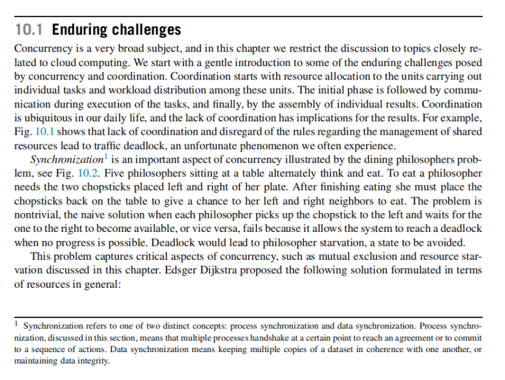
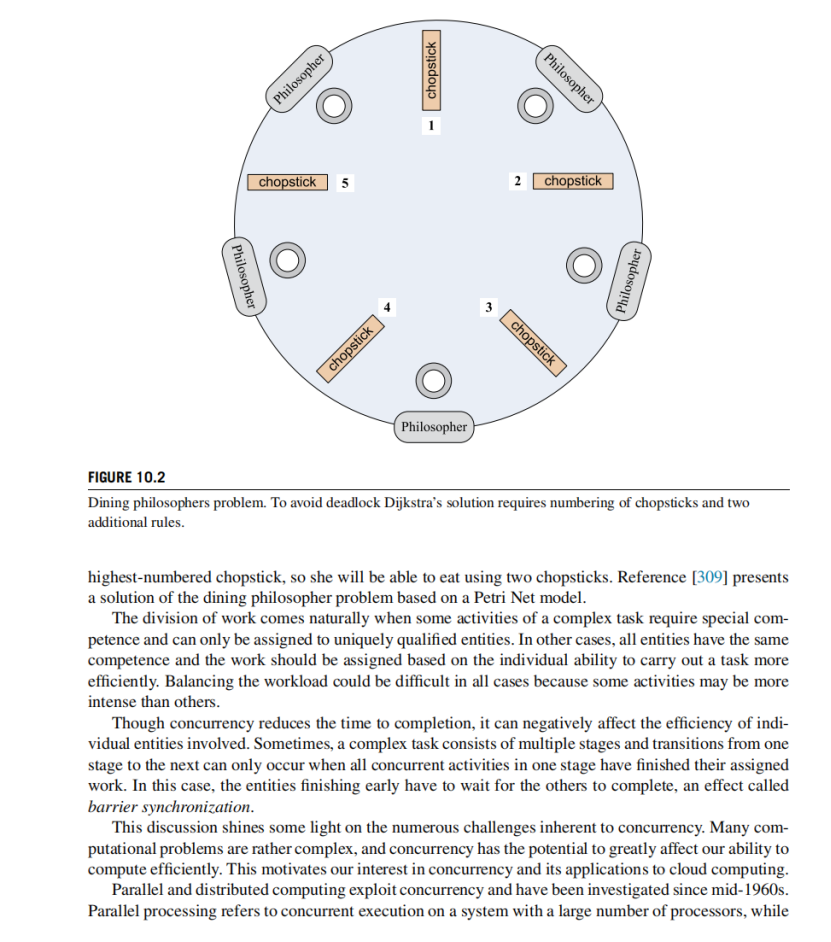
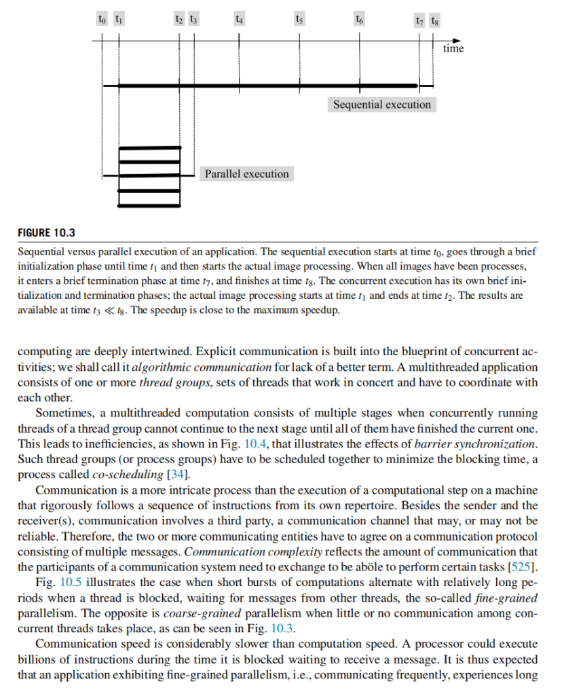
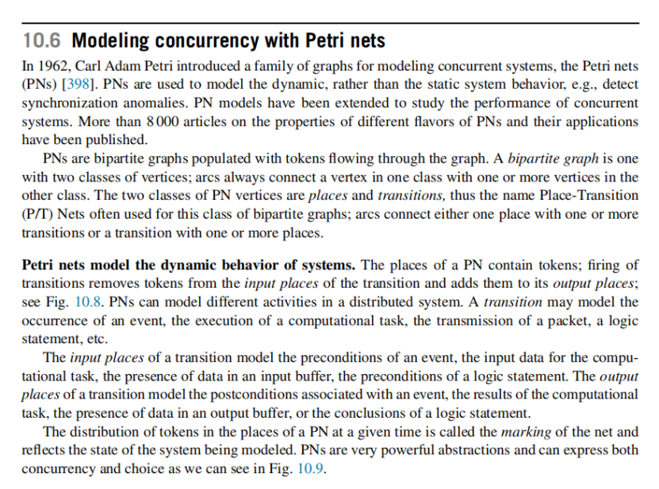
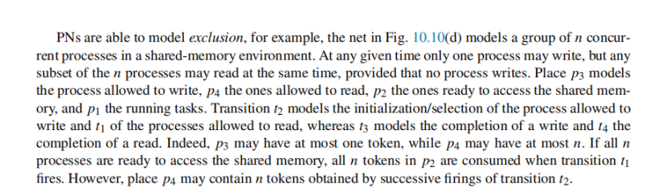
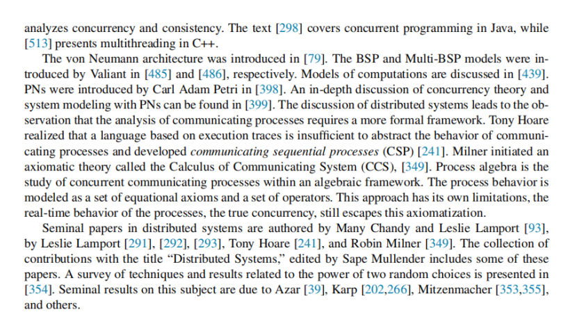
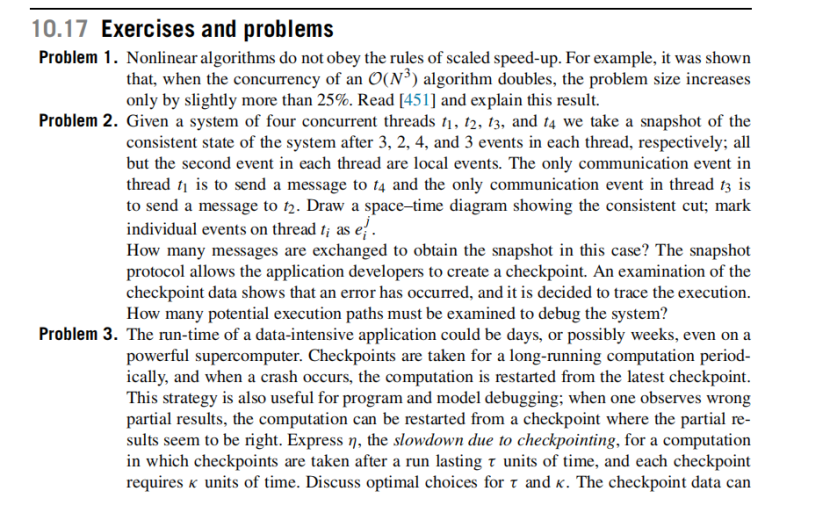

# Chatpter 10 Concurrency and cloud computing

# Start

**1\. 标题：并发与云计算——核心概念与章节内容概览**

本部分主要介绍了并发（Concurrency）在云计算中的重要性、并发与并行的区别，以及后续章节所涉及的一系列核心主题，包括进程间通信、并行计算模型、分布式系统中的快照与一致性、多线程及负载均衡等，为后续深入理解云端资源管理与并发机制提供理论基础。

* * *

**2\. 详细内容解析**

下面我们按照图片中出现的顺序，对本章节的主要内容与知识点进行逐段、逐点的细致讲解。

* * *

### 2.1 并发与云计算的背景

1.  **并发是云计算的核心**
    
    *   云计算中，许多大型工作负载会在多台实例上并发（同时）运行，充分利用云基础设施提供的充足资源。
    *   并发执行的核心动机有两个：
        1.  **克服单一系统物理极限**：将工作量分配到多个服务器上，以突破单台机器的性能瓶颈。
        2.  **显著减少计算完成时间**：通过并行处理，减少应用或任务的总运行时长。
2.  **Leslie Lamport 对并发的评论**
    
    *   Lamport 在 2013 年图灵奖演讲中提到并发曾被赋予了多种名称：并行计算、并发编程、多道程序设计（multiprogramming）等。
    *   他认为分布式计算是更广义的“并发”主题的一部分。
3.  **并发与并行处理（Parallel Processing）的区别**
    
    *   **并发（Concurrency）**：描述了“多重计算（活动）同时执行”的必要性，也就是在同一时间段内，有多项活动同时进行。其关注点在于活动之间的“协作（cooperation）”和可能产生的“干扰（interference）”。
    *   **并行处理（Parallel Processing）**：更强调“缩短整批活动总耗时”的目标，通常需要在一个明确的并行模式下执行；并行处理往往也会受到活动间的交互或干扰的限制。
    *   一句话概括：并发更关心如何让多个活动同时进行且能够正确配合，注重“交互”；并行处理更关注如何让整体运行更快，注重“性能提升”。

* * *

### 2.2 并发执行中对通信与协调的需求

1.  **通信影响并发活动的整体效率**
    
    *   对于同时运行的大量并发任务，需要频繁通信时，通信就会影响任务的整体完成时间。
    *   通信需要事先约定通信协议，避免异常（例如死锁）对应用的整体调度造成影响。
2.  **并发执行可能需要集中或分散的协调**
    
    *   活动在并行执行时，要么是“相对独立”的（quasi-independent），要么需要紧密配合。
    *   在云计算背景下，复杂的活动经常需要协调：
        *   需要描述参与活动的各个实体在协同时要完成的工作，以及活动之间的交互方式。
        *   协调本身带来一定开销和复杂性。

* * *

### 2.3 本章内容的整体结构与要点预告

图片中最后几段对本章后续各节进行概述，主要包括以下关键章节与主题：

1.  **10.1 并发的持续性挑战（enduring challenges）**
    
    *   本节可能着重于讨论并发编程、分布式协作中常见的根本性问题与难点。
2.  **10.2 并发进程的通信执行概述（concurrent execution of communicating processes）**
    
    *   将会对并发进程之间的通信机制与运行模型做一个总体介绍。
3.  **10.3 计算模型（Computational Models）**
    
    *   提到“BSP(10.4)”“分层硬件-软件模型(10.4、10.5)”“Petri nets(10.6)”等，都是并发或并行计算中的理论模型：
        *   **BSP（Bulk Synchronous Parallel）**：一种在并行计算中常用的“分块同步并行”模型，侧重于将计算划分为若干“超级步（superstep）”，每个步骤执行计算与通信，然后进行全局同步。
        *   **Petri 网**：一种常见的描述并发系统行为的模型，用标记（token）和转换（transition）来刻画系统状态与变化，能很好地分析死锁、竞争与同步等并发特性。
4.  **10.7 进程状态概念（process state）**
    
    *   进程状态对于理解并发非常关键：很多云应用需要使用进程的状态信息来进行资源分配与管理。
    *   资源管理政策（策略）需要准确的状态信息来做调度与决策。
5.  **与前后章节的衔接**
    
    *   **第 9 章**讨论了云资源管理，需要准确的状态信息。第 10 章则深入到并发执行细节。
    *   **10.8 进程协调（Process Coordination）**：分析并发进程如何协调执行。
    *   **10.9 逻辑时钟与消息传递（Logical clocks and message delivery rules）**：在分布式并发中，为了分析事件顺序、因果关系，我们采用逻辑时钟（如 Lamport Clock、Vector Clock）来辅助理解系统行为。
6.  **分布式快照与一致性切片（Consistent Cuts and Distributed Snapshots）**
    
    *   这些概念对于**checkpoint-restart**机制非常重要，尤其是在大规模、长时间运行的任务时：
        *   **Checkpoint**：定期保存进程或系统的状态，当系统出现故障时，可以从最近的检查点而不是从头开始恢复。
        *   相关内容在 **10.10 和 10.11** 介绍。
7.  **原子操作、共识协议与负载均衡**
    
    *   在并发与分布式系统中，经常需要确保某些操作“原子性”或达成集体决策，这里会提到：
        *   **Atomic actions**（10.12）
        *   **Consensus protocols**（10.13）
        *   **Load Balancing**（10.14）
    *   这些主题对分布式系统如何维护一致性、保证可靠性、合理调度任务至关重要。
8.  **10.15 在 Java、FlumeJava、Apache Crunch 中的多线程与并发**
    
    *   展示并发与多线程编程在实际工业工具和编程环境中的应用。

* * *

### 2.4 本章总结与学习建议

1.  **本章重点**
    
    *   以理论算法与概念为基础，帮助读者理解系统和应用软件中关键的并发机制。
    *   并发相关的概念与技术，在云端资源管理策略以及系统机制中都占据核心地位。
    *   后续章节深入讲解：
        *   不同并行/并发计算模型，
        *   分布式系统中的一致性与快照，
        *   如何在实际框架与语言中实现并发编程。
2.  **与后续章节和参考文献的关联**
    
    *   本章的后半部分（或本章尾声）还会提供大量经典并发理论和算法的参考文献，帮助对分布式与并发问题有更深入研究需求的读者继续学习。

* * *

**3\. 本次内容的小结**

*   并发在云计算中的意义：大规模、分布式任务需要同时运行，提升资源利用率和加速整体完成。
*   并行处理与并发的不同：前者关注缩短总体执行时间，后者强调多活动间的交互和协作。
*   通信与协调在并发中必不可少：并发体越多，频繁通信与同步可能带来更高复杂度与潜在问题。
*   本章将介绍从并发基础原理到具体实现，包括：并发计算模型、分布式系统下的状态管理与协调、原子操作与共识协议、多线程编程实践等。
*   为后续的云资源管理和并发机制的学习打下理论基础。

* * *

**4\. 错误检查/内容遗漏**

*   从本次提供的两张图片来看，文字内容较为清晰，没有明显的无法辨认之处。
*   目前笔记已经将图片中所有主要段落与提及的章节要点做了覆盖与解释，没有出现明显缺失。
*   若有细节（如具体算法、公式、更多编程示例等）在图片中仍看不清或暂未展示，可在后续配合原文进一步研究。

如果对以上内容有任何疑问或希望我进一步展开其中的某一部分，请随时告诉我。

# **10.1** **Enduring challenges**

**1\. 标题：并发的持久性挑战与资源竞争——以交通堵塞与哲学家问题为例的深入剖析**

本部分内容围绕并发在云计算与实际场景中面临的“持久性挑战（Enduring challenges）”，阐述了在共享资源管理、活动协调以及同步等方面会遭遇的典型难题，并通过交通路口死锁示例与著名的哲学家进餐问题，说明如何利用严格的资源分配策略来避免系统陷入死锁或饥饿。

* * *

2\. 详细内容解析
----------

以下我们按照图片和段落内容的顺序，对知识点和关键细节进行解读。

### 2.1 并发的持久性挑战（Enduring challenges）

1.  **并发与云计算的关联**
    
    *   并发是一个非常宽泛的概念。在云计算中，讨论的重点通常与“协调（coordination）”息息相关：
        1.  **资源分配（Resource allocation）**：决定哪些“单位”或“任务”获得哪些资源；
        2.  **任务执行过程中的通信（Communication）**：各执行单元之间需要相互交换信息或状态；
        3.  **结果的组合（Assembly of results）**：多个并发活动完成后，需要将产出汇总形成最终结果。
    *   缺乏良好协调会导致并发进程争夺公共资源、相互阻塞，最终可能发生死锁或者效率低下。
2.  **不协调的直接后果：交通路口堵塞（图 10.1）**
    
    *   在日常生活中，“共享资源管理不当”最直观的例子之一就是城市路口。图 10.1 展示了没有红绿灯或交通标志控制时，汽车在路口相互阻挡，导致所有方向都被堵死，形成**交通死锁**。
    *   这说明当多个实体（车辆）都在争用同一组资源（路口或车道），且缺乏统一的规则或者次序时，就会出现“无人可前进”的局面。
3.  **同步（Synchronization）概念**
    
    *   图片中提到一个脚注，指出同步可以分为两种：
        1.  **进程同步（Process synchronization）**：多个并发进程（或线程）在某些关键点上需要通过“握手机制”达成一致，以保证某些顺序或不可同时发生的动作；
        2.  **数据同步（Data synchronization）**：涉及保持分布式环境中多个副本数据的一致性。
    *   本小节着重的是**进程同步**，尤其是典型的\*\*互斥（mutual exclusion）**和**资源竞争（resource contention）\*\*问题。

* * *

### 2.2 哲学家进餐问题（Dining Philosophers Problem）及其启示

1.  **问题简介**
    
    *   这是对并发中“共享资源争用”最常见的抽象模型之一。图 10.2 展示了五位哲学家围坐在餐桌前，每位哲学家都需要左右两只筷子才能进餐。
    *   一旦哲学家用完筷子，就要把它们放回桌面，让邻座有机会继续用餐。
    *   若每个人都先拿起左边（或右边）筷子并等待另一只筷子可用，就可能导致没有一个人能拿到第二只筷子，从而引发**死锁（deadlock）**；如果有人永久无法获得筷子，则会造成**饥饿（starvation）**。
2.  **死锁、饥饿及其危害**
    
    *   **死锁**：所有进程都在等待其他进程所持有的资源，最终“谁也动不了”。
    *   **饥饿**：即使没有死锁，也可能出现某个或某些哲学家一直拿不到资源，无法执行（进餐），形成不公平或效率低下的问题。
    *   在实际系统中，死锁会导致系统停滞，饥饿则意味着某些任务无法获取资源长时间等待。
3.  **Dijkstra 的解决思路**
    
    *   Dijkstra 提出了一种著名的资源顺序化方法：
        1.  **给所有资源（筷子）设定一个部分顺序（partial order）**。
        2.  **规定获取资源的顺序**：必须按照该部分顺序来请求资源。
        3.  **规定没有顺序关系的资源不能同时被同一个工作单元（哲学家）占用**。
    *   在哲学家进餐问题中，将筷子编号为 1, 2, 3, 4, 5，每位哲学家统一先拿编号较小的筷子，再拿编号较大的那一只。这样可以避免循环等待。
    *   这一方法避免了**死锁**，而且在图示例子中，也能避免**饥饿**：如果有四位哲学家都先拿到了自己“低号筷子”，那么第五位哲学家还会有一只“高号筷子”留在桌面上，从而可以继续执行，系统不会陷于完全停顿。

* * *

### 2.3 资源分配与并发效率

1.  **工作分配方式**
    
    *   在并发或云计算环境中，某些任务需要特定技能或硬件资源，只能由特定的“工作单元”执行；另外一些任务则可以让任何有同等能力的工作单元执行。
    *   分配过程要考虑：
        *   **任务负载的平衡性**：有的工作负载可能更加繁重，需要更多资源或更久时间；
        *   **各执行主体的能力或特性**：某些实体可能具有更快的处理能力或特殊的硬件加速。
2.  **并发与总完成时间的关系**
    
    *   并发常常可以减少整体任务完成所需的时间，但也**可能增加单个实体的等待时间**或资源竞争的成本。
    *   例如，某些多阶段流水线式的任务，一阶段的所有并发活动必须在全部完成后才能进入下一阶段，这就是常见的**barrier synchronization（同步屏障）**。较早完成的实体仍需等待其他全部完成，才可进行后续操作。
    *   这体现了并发中各种同步机制的复杂性和潜在效率损失。

* * *

### 2.4 并行计算与分布式计算的区别及在云端的应用

1.  **并行计算（Parallel Processing）**
    
    *   在同一台机器或同一个系统上，拥有大量处理器（或 CPU 核心）来并行执行任务。
    *   通信延迟通常较低，因为处理器之间共享相同的内存或高效互联结构。
    *   适用于“细粒度（fine-grained）”的任务并行，每个活动需要经常通信或共享数据。
2.  **分布式计算（Distributed Computing）**
    
    *   在多个位置（通常是多台物理机器）上并发执行任务。
    *   节点之间的通信延迟更高，系统往往适合“粗粒度（coarse-grained）”的并行：并发活动之间的交互较少时，效率更高。
    *   关键挑战在于节点的可靠性、负载均衡以及网络延迟。
3.  **云计算中的模糊化**
    
    *   在云环境下，“并行计算”与“分布式计算”常常融为一体。因为云数据中心里有成千上万、甚至数百万台服务器，硬件或网络配置多种多样。
    *   不过，无论是并行还是分布式，都需要面对常见的并发问题：**同步、死锁、防止饥饿、负载均衡、共识协议**等等。
    *   通信延迟在云计算中依然是一个关注点（在第 4、9、11 章还会继续深入说明）。
4.  **评估并行/分布式系统效率的指标**
    
    *   **执行时间（execution time）**
    *   **加速比（speedup）**
    *   **处理器利用率（processor utilization）**
    *   这些指标在第 3 章中有进一步讨论。

* * *

3\. 本次内容小结
----------

*   **并发的持久性挑战**：并发不仅带来速度提升或容量扩展，也带来了协调、同步和资源分配方面的复杂问题。
*   **交通路口与哲学家问题**：都属于共享资源管理不当会导致死锁或饥饿的经典例子。Dijkstra 给出的解决思路是为资源编号并按顺序获取资源，从而打破循环等待的条件，避免死锁。
*   **并发的副作用**：虽然并发能缩短整体任务的完成时间，但也可能增加通信与同步的开销，并导致单个活动的等待时间上升。
*   **并行计算 vs. 分布式计算**：二者关注点有所不同，但在云环境下常常交融，都需要面对并发带来的同步、负载均衡和资源调度等共性挑战。
*   本节在理论层面奠定了并发和资源竞争的基础，后续章节会更深入讨论 **同步机制、共识算法、负载均衡、checkpointing** 等关键主题。

* * *

4\. 错误检查/内容遗漏
-------------

*   从提供的图片与文字中，所有主要段落的概念和示例（交通路口、哲学家进餐问题、Dijkstra 的解决方案要点等）均已完整解释。
*   没有明显看不清或遗漏的内容，如有需要展开的细节（例如具体的 Petri 网建模等），可在后续提供更多参考章节。

如有进一步疑问或需要更细致地探讨本节中的某一部分内容，请随时提问。

# **10.2** **Communication and concurrency**

**1\. 标题：并发中的通信与加速效益——从多线程分工到屏障同步与通信粒度**

本部分内容围绕“并发和通信（Communication and Concurrency）”的关系展开。它强调了并发带来的速度提升（speedup）与通信开销之间的权衡，并讨论了多线程或多进程在执行时如何通过同步机制来协调不同阶段的工作，以及“细粒度并发”与“粗粒度并发”在通信成本上的差异。

* * *

2\. 详细内容解析
----------

下面依照图片与文字顺序，对本节各知识点进行剖析和扩展说明。

### 2.1 并发与速度提升

1.  **并发意味着多进程/多线程的协同执行**
    
    *   当任务能够拆分为若干子任务并行执行时，可以减少总体完成时间。
    *   并发利用了计算基底（computing substrate，即底层硬件、处理器或服务器集群）的多执行单元来最大化利用度。
2.  **速度提升（Speedup）概念**
    
    *   速度提升  $S$  定义为“串行执行所需时间”与“并发执行所需时间”之比。公式可以写作： 
        $$
         S = \frac{t_8 - t_0}{t_3 - t_0} \approx 5
        $$
        *   示例：将 500 万张图片从一种格式转换为另一种格式，并把工作量分配给 5 个处理器或 5 个核心并行处理。如果几乎不需要相互通信，则这是一个“embarrassingly parallel”（可并行程度极高）的问题，速度提升非常接近 5。
3.  **并行程序的实现**
    
    *   并行算法通常由一个**并行程序**来实现，该程序能够在带有多个执行单元的系统上运行。
    *   在操作系统中：
        *   **进程（Process）**：是正在执行中的程序，拥有自己的地址空间（存放程序代码和数据）。
        *   **线程（Thread）**：是轻量级的执行单元，与其他线程共享同一个进程的地址空间。

* * *

### 2.2 并发与通信的不可分割性

1.  **逻辑层面与物理层面的并发**
    
    *   逻辑/算法层面的并发：关注程序结构、编译器优化等。例如，编译器可以对循环展开（loop unrolling），甚至在硬件层面做指令并行处理（在第 3 章曾提及）。
    *   物理层面的并发：依赖于硬件多核、多机网络等实际资源。
2.  **通信在并发中扮演的角色**
    
    *   并发并不仅仅是把任务分给多个线程或进程，各并发实体之间往往需要**交换数据**或**同步状态**，这被称为“算法通信（algorithmic communication）”。
    *   对于多线程应用，通常存在一个或多个“线程组（thread groups）”，需要在执行不同阶段时协同、协调调度。
3.  **通信复杂度（Communication Complexity）**
    
    *   通信的实现通常需要一个渠道（channel），并要符合双方约定的协议（protocol）；
    *   可能受限于网络可靠性、消息传递延迟等因素；
    *   通信越多，线程/进程之间的等待与同步开销就越大，影响并发执行效率。

* * *

### 2.3 屏障同步（Barrier Synchronization）与线程组调度

1.  **屏障同步的核心思想**
    
    *   在多线程并发程序中，若需要分为多个阶段或批次执行，则所有线程必须**等到同一阶段所有工作都完成**后，才能统一进入下一阶段。
    *   图 10.4 显示一个线程组中共有 7 个线程（T1 ~ T7），它们执行阶段 1 后，必须全部完成才可进入阶段 2，否则部分提前完成的线程也要等待落后的线程。
    *   结果：
        *   提前完成的线程处于阻塞状态，浪费了一些潜在计算时间；
        *   有利于保证阶段间的任务一致性，避免数据不一致或顺序混乱。
2.  **共同调度（co-scheduling）**
    
    *   为了尽量减少等待时间，一种方法是尽量让**同一个线程组**中的线程能在同一时间段内被操作系统调度执行。
    *   这样可以最大程度地减少由于等待某个尚未完成工作的线程而造成的整体阻塞。

* * *

### 2.4 细粒度并发（Fine-Grained）与粗粒度并发（Coarse-Grained）

1.  **细粒度并发（Fine-Grained Parallelism）**
    
    *   线程或进程间**频繁通信**，每隔很短的计算就需要交换消息或同步。
    *   这类并发往往在通信上花费的时间较多：处理器可能在等待消息时空转，导致性能下降。
    *   图 10.5 中，短暂的计算（黑色方块）和较长的通信等待（白色方块）交替出现，说明线程之间常常等待彼此的数据或信号。
2.  **粗粒度并发（Coarse-Grained Parallelism）**
    
    *   各并发单位之间交互较少，仅在更大的计算块结束后才需要一次通信或数据交换。
    *   相较于细粒度并发，通信成本低，利用度更高；缺点是需要把问题切分成较少但更大块的任务，要求问题本身适合这种模式。
3.  **通信与计算速率的对比**
    
    *   现代处理器在等待消息的这段时间内，可能本来可以执行数十亿条指令。
    *   若通信在并发任务中过于频繁且延时较高，那么并行带来的速度优势容易被通信开销抵消。

* * *

3\. 本次内容小结
----------

1.  **并发与速度提升（Speedup）**
    
    *   把任务拆分给多核心/多机并行执行，可以显著缩短总体执行时间，尤其是像“图像转换”这样几乎不需要相互通信的场景（embarrassingly parallel）。
2.  **通信在并发中的地位**
    
    *   并发实体需要交换信息或同步动作，这会带来通信成本；
    *   通信越频繁、越复杂，越可能导致等待和阻塞，限制并行效率。
3.  **同步与调度机制**
    
    *   屏障同步（barrier synchronization）保证了多线程在多个阶段执行时的有序性，但也可能增加等待时间；
    *   通过“co-scheduling”或合理的任务划分，可以减少等待开销。
4.  **粒度大小对性能影响**
    
    *   细粒度并发：高通信开销，适合需要紧密协作的任务；
    *   粗粒度并发：低通信开销，但要求任务能大块独立执行。

总体而言，本节揭示了并发执行中，速度提升与通信开销之间的动态平衡：适度的并发能有效提高应用效率，但过度或不当的细粒度通信可能造成相当大的性能损失。后续章节将进一步探讨如何在不同并发模型中有效地管理与最小化这些通信与同步的代价。

* * *

4\. 错误检查/内容遗漏
-------------

*   从图片和文本内容看，所有主要内容（加速比示例、屏障同步、细粒度/粗粒度并发）均已覆盖。
*   若尚有对图中某些时间节点或线程阻塞的具体机制不明，可在后续结合原文更深入探讨。
*   当前笔记对本节内容的讲解应能帮助理解并发和通信间的紧密关系，以及在实际应用中如何权衡并行效率与通信开销。

# **10.2.2** **Communication and concurrency**

**1\. 标题：并发中的通信复杂度与计算模型——从局部性到控制流与数据流的系统演变**

本部分内容从两方面探讨并发时的通信成本：一是针对不同硬件资源和线程调度策略所产生的“非算法性通信（nonalgorithmic communication）”，二是从系统结构和编程模型的角度对“控制流模型”和“数据流模型”进行对比，帮助我们理解并发执行在现代多核和分布式环境下如何演进和应用。

* * *

2\. 详细内容解析
----------

下面我们依照图片及文本的主要脉络，对涉及的核心概念与细节进行分段解读。

### 2.1 通信开销与局部性

1.  **通信开销的两种类型**
    
    *   **算法性通信（algorithmic communication）**：并行算法本身需要在执行过程中交换数据或同步，属于算法结构固有的需求。
    *   **非算法性通信（nonalgorithmic communication）**：由于底层硬件、操作系统调度或数据分配策略引起的额外通信。例如，在分布式系统中，如果某线程（或进程）需要访问位于另一台机器内存中的数据，就会导致网络级别的传输，这并非算法设计本身必然需要的通信，而是实现和调度上的“副作用”。
2.  **通信带来的性能影响**
    
    *   当并行任务需要频繁通信而带来长时间阻塞时，就会大幅降低实际的并行效率。
    *   在“Embarrassingly Parallel”（几乎不需通信）场景中，可以获得接近线性甚至超线性的加速比；但对于需要大量通信的程序，带宽和延迟往往成为瓶颈，难以充分利用处理器性能。
3.  **空间局部性（Spatial Locality）与时间局部性（Temporal Locality）**
    
    *   **空间局部性**：若程序在某一时段内访问了一块内存区域，那么在相邻的时段很可能也会访问到与之接近的内存地址（如同一个cache line或同一磁盘扇区）。
    *   **时间局部性**：若程序在某一时刻访问了某项数据，很可能在不久的将来再次访问同样的数据。
    *   这些局部性原理可以减少通信或数据传输时所需的开销，因为常用数据往往已经在本地缓存中。
4.  **对多核和分布式系统的影响**
    
    *   系统规模越大，**非算法性通信**的负面效应可能越显著：CPU 与内存/网络之间的多级缓存失配、远程访问等都会导致并行效率降低。
    *   调度器需要动态挑选足够多的待运行虚拟任务来填满物理处理元素，以尽量提高吞吐量（throughput）。但若数据位置与调度绑定不当，就会导致跨节点通信增多。

* * *

### 2.2 控制流（Control Flow）与数据流（Data Flow）模型

1.  **控制流模型（Control Flow Model）**
    
    *   对应“冯·诺依曼（von Neumann）”体系：程序以指令序列顺序执行，或通过条件、循环等逻辑分支来决定下一条指令的执行。
    *   并发要么依赖并行算法把程序分解为多线程，在合适的时机进行通信与同步；要么依赖编译器/硬件将指令流水线并行化。
    *   左侧示例（图 10.6 上）：
        *   `if then else`：根据条件执行 `I2` 或 `I3`，然后统一进入 `I4`；
        *   `while loop`：循环体 `I2` 周期性执行，直到某个条件为假再转向后续指令 `I3`。
    *   这种模型下，如果并行执行不同指令，仍需要控制流上的同步或消息传递确保有序与正确性。
2.  **数据流模型（Data Flow Model）**
    
    *   线程或计算单元一旦获得其所需的所有输入数据，就立即开始执行（无需等待全局的指令序列或特定控制流）。
    *   图 10.6 右侧给出一个复杂的数据流图：
        *   13 个计算节点（C1 ~ C13）之间存在数据依赖；
        *   某些节点（如 C1, C3, C4）在获取 `data1, data3, data4` 等输入后可立即启动；
        *   C13 需要来自 C8, C6, C2 等多路数据（如 `data14, data16, data17, data12...`）全部到位后才会执行。
    *   优点：一旦数据就绪，就可以并行执行，不必遵循某种顺序结构；这是“隐式通信模型”，更容易让硬件或执行框架自动发掘并行性。
    *   难点：仍可能需要大量消息传递，因为每一个计算节点都要向依赖它输出的后继节点发送数据（或引用）。
3.  **Petri 网与两种模型的结合**
    
    *   在 10.6 节提到，Petri 网可以同时表达“控制流”与“数据流”过程。
    *   通过“地点（place）”表示系统状态或数据，及“变迁（transition）”表示动作或事件，Petri 网能捕捉到并发系统中对数据和控制的同步约束。

* * *

### 2.3 并发成为主流的背景

1.  **过去 vs. 现在**
    
    *   早年并发主要用于操作系统开发或科学与工程领域的高性能计算；多数通用软件依赖单线程并期待随着时钟频率提升而获取“自动加速”。
    *   如今，**摩尔定律**在频率层面遭遇瓶颈，多核处理器成为主流；各类应用开发者开始必须了解并行与并发，以利用多核或分布式环境获得性能提升。
2.  **并发开发的挑战**
    
    *   并发程序的编写和调试远比顺序程序复杂，需要更谨慎地处理线程间的相互依赖、锁、死锁和可见性等问题。
    *   需要新的思维模式和工具来编写高质量的并发软件。
3.  **下一步：计算模型与并发抽象**
    
    *   后续章节（如第 10.3, 10.4, 10.5）将更深入讨论不同的计算模型（如 BSP、MapReduce 等），以及如何在大规模云环境中实施并行与分布式执行。
    *   这些抽象模型旨在帮助人们更好地分析并发的本质，并针对不同硬件/网络结构进行优化。

* * *

3\. 本次内容小结
----------

1.  **非算法性通信的影响**：在多核或分布式系统中，调度和内存分布不当会导致额外通信和等待，显著降低并行效率。充分利用空间和时间局部性是优化的关键。
2.  **控制流 vs. 数据流**：
    *   **控制流**：以指令序列或分支结构为中心，需要在关键点上同步；
    *   **数据流**：运算单元在收到所需数据后即可启动执行，大幅提高并行度，但也有潜在的通信负担。
3.  **并发的普及**：多核时代和对高性能的追求使并发技术走向普遍化，编写并发程序虽更具挑战，却成为不可回避的趋势。
4.  **未来方向**：更多以数据流、事件驱动或分布式模型为基础的云计算框架，将大大改变应用开发模式。

* * *

4\. 错误检查/内容遗漏
-------------

*   本次提供的图片和文字内容较为完整，涵盖了从通信粒度、局部性原理到控制流与数据流模型的演示；
*   笔记对每个示例（图 10.6 的对比、C1~C13 数据流依赖）的主旨都做了阐述；
*   若还需更详细的数据依赖分析或计算步骤，可在后续补充；目前的笔记已能独立帮助理解这些核心概念。

若对并发模型的实际应用场景或更多技术细节存在疑问，可后续再行探讨。

# **10.3** **Computational models; communicating sequential processes**

**1\. 标题：多种计算模型与并发进程通信——从图灵机、PRAM 到 CSP 的概念梳理**

在并发与云计算环境中，我们需要借助各种计算模型（Computational Models）来分析算法复杂度、并行执行方式以及进程/线程的交互规则。本节首先概述了图灵机、布尔电路、有限状态机等常见抽象机模型，然后延伸到 PRAM（并行随机存取机）与冯·诺依曼体系的主流应用。最后，介绍了 Tony Hoare 提出的 **CSP（Communicating Sequential Processes）** 理论，说明并发进程的通信与同步可通过消息传递的形式进行抽象和分析。

* * *

2\. 详细内容解析
----------

下面我们按照图片和文字顺序，对核心概念与要点进行深入讲解。

### 2.1 计算模型的多样性

1.  **抽象机（Abstract Machines）与决策树（Decision Trees）**
    
    *   这是计算复杂度理论中的两大类模型，用以界定算法可用的原始操作并研究算法的上、下界。
    *   **抽象机**示例：图灵机、λ 演算（lambda calculus）、有限状态机（FSM）、累加机（accumulator machine）、随机访问机（RAM）、并行随机访问机（PRAM）等。
    *   **决策树**模型则经常用来分析比较排序等算法的复杂度。
2.  **图灵机与布尔电路**
    
    *   **图灵机（Turing Machine）**：一种统一（uniform）的计算模型，针对所有输入长度采用同一个“机器”来处理。它是计算机科学奠基性模型，用来定义可计算性和算法的运行时间上限。
    *   **布尔电路（Boolean Circuits）**：一种非统一（non-uniform）模型，不同输入规模有不同的电路  $C_n$ 。对给定输入规模，可使用相应的电路进行计算，特别适合并行硬件设计和复杂度分析。
3.  **有限状态机（FSM）**
    
    *   由一个逻辑电路  $\mathcal{L}$  和内存  $\mathcal{M}$  组成，在每步读取输入并更新状态，输出一部分结果。
    *   在网络与系统软件中广泛应用（如 TCP 协议栈、Zookeeper 协调模型等）。
4.  **RAM 与 PRAM**
    
    *   **随机访问机（RAM）**：使用CPU、寄存器、小型内存来顺序执行指令，是对真实计算机（基于冯·诺依曼架构）的抽象。
    *   **并行随机访问机（PRAM）**：在 RAM 基础上加以扩展，假设存在若干处理器，共享一片内存；在一次 PRAM 执行步中，所有处理器同时进行“读取-计算-写回”操作。
    *   PRAM 在并发算法的理论分析中常用，是一种理想化的并行模型，现实中需要额外考虑内存访问冲突、同步等实际开销。
5.  **冯·诺依曼模型（Von Neumann Model）的持续影响**
    
    *   自 20 世纪 40 年代起就奠定了现代计算机结构的基础，如存储程序、指令序列执行以及层级存储架构。
    *   该模型能适应半个多世纪的技术变迁，是当代主流 CPU 设计的思想起点。

* * *

### 2.2 并发进程通信：CSP（Communicating Sequential Processes）

1.  **CSP 的由来与核心思想**
    
    *   由 Tony Hoare 在 1978 年提出，用来对**并发系统**中进程之间的交互进行形式化描述。
    *   **CSP** 将输入/输出操作视为基本原语（primitive），并用“同步消息传递（synchronous message-passing）”来定义进程间的通信模式。
2.  **CSP 的基本概念**
    
    *   **进程（process）**：一个独立的顺序活动单元，仅通过同步通信和其他进程交互。
    *   **消息（message）**：由发送方和接收方共同定义，必须在双方都准备好的时候传递（同步）。
    *   **并行组合（parallel composition）**：把多个进程并行执行，让它们在需要时进行通信。
3.  **CSP 理论的发展**
    
    *   Brookes、Hoare 和 Roscoe 将 CSP 发展为“进程代数（process algebra）”，由以下要素构成：
        *   **初始事件（initial events）**：进程交互的最基本动作。
        *   **原子进程（primitive processes）**：不可再分的动作或行为。
        *   **操作符**：包括以下几种核心组合方式：
            1.  **前缀（prefix）**：`a → P` 表示先执行事件 `a`，再进入进程 `P`。
            2.  **隐藏（hiding）**：将某些事件对外部不可见。
            3.  **并行交错（interleaving）**：`P || Q` 在并发环境中同时执行 `P` 和 `Q`。
            4.  **确定性选择（deterministic choice）**：外部环境选择 `a` 或 `b`，进程执行 `P` 或 `Q`。
            5.  **非确定性选择（nondeterministic choice）**：进程本身也可能“随机”地选择执行哪一个分支，而外部无法控制。
4.  **CSP 的应用与工具**
    
    *   **FDR（Failures/Divergence Refinement）** 等模型检查器，可将 CSP 进程表达式转换为“标记转换系统（Labelled Transition System）”，并验证系统是否满足特定语义模型或安全属性（如死锁自由）。
    *   **实际示例**：1998 年用于分析 2.2 万行代码的容错计算机软件（控制组装、重启及飞行控制等），经验证确认设计无死锁。
    *   CSP 在分布式系统、通信协议、并发算法等领域都有广泛应用。

* * *

### 2.3 并行与并发编程的时代背景

1.  **并发：从小众到主流**
    
    *   过去，多数应用开发者依赖顺序执行和更高的时钟频率来提升性能；
    *   如今，由于多核处理器普及，以及分布式系统需求增大，并发编程成为不可或缺的能力。
2.  **编写并发软件的挑战**
    
    *   必须处理多线程或多进程间的交互、同步、竞争以及故障容忍等问题；
    *   需要借助如 CSP 这样的形式化方法或其他编程模型（Actor 模型、MapReduce 等）来降低复杂度。
3.  **后续章节与相关技术**
    
    *   图片所示的 10.3 节只是对常见计算模型的概述。后文（如 10.4, 10.5）还会介绍其他并行/分布式模型（BSP、MapReduce 等），帮助读者理解在云计算环境中如何高效地构造并发算法或并行程序。

* * *

3\. 本次内容小结
----------

1.  **计算模型多样化**：从图灵机到布尔电路、从有限状态机到 PRAM，每种模型都有助于分析系统的可计算性和复杂度，并且部分也能用于并行环境的理论推导。
2.  **CSP 的定位**：
    *   是一个针对并发通信的形式化语言，强调同步消息传递，在并行与分布式系统中常被用来验证进程交互的正确性。
    *   提供了一套“进程代数”操作符，用以组合、隐藏、选择等手段来刻画复杂并发系统。
3.  **实用价值**：CSP 等模型在学术研究、工业界（如容错系统、通信协议）都已得到验证，可以帮助发现死锁、竞态条件或进行正确性证明。
4.  **时代趋势**：多核与云计算的普及让并发编程成为主流；掌握相应的理论模型与工具对开发者而言越来越关键。

* * *

4\. 错误检查/内容遗漏
-------------

*   本次提供的截图主要介绍了抽象计算模型与 CSP 的核心概念，并未出现难以辨认或遗漏的内容；
*   笔记已将常见模型定义和 CSP 的主要操作符基本覆盖，若需深入细节（如 CSP 进程代数的完整语法和验证流程），可在后续结合更多参考文献或章节内容继续学习。

如对任何模型或 CSP 的实际应用场景有疑问，欢迎进一步提问。

# **10.4** **The bulk synchronous parallel model**

**1\. 标题：BSP（批同步并行）模型——并行计算的桥接方法与核心机制**

本部分介绍了由 Leslie Valiant 于 1990 年代初提出的 **BSP（Bulk Synchronous Parallel）** 模型，阐述了它如何通过“超步（superstep）”和“屏障同步”来在并行硬件与软件之间建立统一的抽象，从而在不同规模和拓扑结构的系统上高效执行并行算法。

* * *

2\. 详细内容解析
----------

以下我们依照图片中的要点和文字顺序，对 BSP 模型的概念、运行步骤、参数设置以及示例应用逐一解读。

### 2.1 BSP 模型的背景与目标

1.  **提出动机**
    
    *   **Leslie Valiant** 在 1990 年代初提出 BSP，旨在避免并行处理时出现的对数级效率损失，并为并行与分布式计算提供“可移植（portable）”的统一模型。
    *   他的核心观点：
        *   并行与分布式计算应基于可移植性（portability）的模型；
        *   并行算法应当具备足够的**并行宽裕（parallel slackness）**，使之在不同规模的硬件系统上都能高效执行。
    *   BSP 强调程序员不必关心底层的内存管理、通信实现或低级同步，前提是算法本身要提供足够的并行性。
2.  **模型组件**
    
    *   BSP 模型通过一些参数化机制量化底层硬件约束，并在程序中使用统一的抽象，主要包括：
        1.  **处理元件（Processors）与内存（Memory）**：可以视为若干个虚拟并行处理器，每个处理器配有一个本地内存；
        2.  **路由器（Router）**：用于在处理单元之间进行消息传递，具有一定的吞吐量（ $\bar{g}$ ）和启动开销（ $s$ ）；
        3.  **同步机制（Synchronization）**：在固定间隔  $L$  时间单位后进行全局同步（barrier）。
3.  **并行宽裕（Parallel Slackness）**
    
    *   指的是为每个处理器准备好**充足的就绪任务**，使得在通信或等待时，处理器仍有其他可并行执行的工作，进而“隐藏通信延迟”。

* * *

### 2.2 BSP 的核心概念：超步（Superstep）与任务（Tasks）

1.  **超步（Superstep）**
    
    *   BSP 程序由一系列“超步”组成，每个“超步”分配固定的时间单位  $L$ ，可以包含若干个局部计算和消息交换的任务。
    *   **执行流程**：
        1.  **开始阶段**：为每个处理器指定一个任务；
        2.  **执行阶段**：处理器在接下来的  $L$  个时间单位内进行本地计算（local operations）以及可能需要的消息发送/接收；
        3.  **结束检查**：当  $L$  时间到达，进行全局检查：
            *   若所有任务在本超步已完成，则进入下一个超步；
            *   否则，再给本超步追加另一个  $L$  时间单位，让未完成的任务继续执行，直到所有处理器都到达同步点为止。
2.  **局部操作对并行的影响**
    
    *   在 BSP 中，单个处理器的局部操作不会自动阻塞其他处理器。
    *   只在下一个屏障同步到来时，才需要所有处理器都完成当前阶段的工作或通信。
3.  **通信与路由器开销**
    
    *   BSP 模型不对通信延迟做额外假设，但规定了一个抽象的路由器，吞吐量为  $\bar{g}$ ，启动开销为  $s$ 。
    *   若处理器之间的消息交换形成所谓的  $h$ \-relation（即每个处理器最多发送/接收  $h$  条消息），则这批消息需要大约  $\bar{g}\times h + s$  的时间。
4.  **超步周期的可调控**
    
    *   参数  $L$ （超步的周期）既依赖于底层硬件（越快的硬件可以使用更短的  $L$ ），也与应用级并行粒度相关。
    *   当某些处理器完成本阶段工作后，可以先闲置，直到所有处理器都完成，才进入下一个超步。

* * *

### 2.3 数据分布与访问

1.  **数据映射策略**
    
    *   BSP 通常使用\*\*哈希函数（hash function）**或**伪随机映射（pseudo-random mapping）\*\*方式，把全局数据均匀地分配到各个处理单元上。
    *   目标：减少访问热点，使得任意一个处理器都不会过分集中地成为数据存取瓶颈。
2.  **通信复杂度分析**
    
    *   若在某个超步中，每个处理器需要访问  $p$  个存储节点或发出  $p$  次请求，就会有  $\log p$  级别的期望访问开销；通过路由器，可以在  $\mathcal{O}(\log p)$  时间内完成这些分散的访问。
    *   BSP 在理论层面给出了一个对数级的最优值，不会因为并行处理器数的增加而产生极度的通信瓶颈。

* * *

### 2.4 BSP 示例：矩阵乘法

1.  **并行矩阵乘法**
    
    *   给定两个  $n \times n$  矩阵  $A$  和  $B$ ，采用标准算法可在 BSP 上进行并行模拟：
        *   如果使用  $p \le n^2$  个处理器，每个处理器可分配到  $\frac{n}{\sqrt{p}} \times \frac{n}{\sqrt{p}}$  大小的子矩阵，分别处理  $A$  的若干行与  $B$  的若干列。
        *   执行时需要进行  $\frac{2n^3}{p}$  次加法与乘法操作，并交换  $\frac{2n^2}{\sqrt{p}}$  条消息。
    *   运行时间可达  $\mathcal{O}\bigl(\frac{n^3}{p}\bigr)$ ，通信开销与计算开销相比仅增加常数级因子。
2.  **并行性扩展**
    
    *   当  $h$  较小时，可通过**复制数据**（replication）进一步提高并行度——例如把矩阵的行列片段复制给多个处理器同时处理。
    *   结论：有相当多的重要并行算法可在 BSP 模型上高效地实现，且在不同网络拓扑（如超立方体、环、网格等）中都有适用性。

* * *

### 2.5 Valiant 的总结与意义

1.  **高效共享内存模拟**
    
    *   BSP 带来的启示：如果算法提供足够的并行宽裕，软件可在虚拟的共享内存环境中运行，而实际由底层进行必要的通信管理。
    *   这种抽象使并行算法更具可移植性，与硬件通信技术或互连网络拓扑的具体差异隔离开来。
2.  **通用性**
    
    *   BSP 作为一种“桥接（bridging）”模型，可以对应到多种通信拓扑结构，从超立方体到大规模网络均可。
    *   在实践中，它已在一些并行库、分布式计算框架中得到运用（例如部分基于 BSP 思想的分块迭代算法、MapReduce 的 superstep 同步思路等）。

* * *

3\. 本次内容小结
----------

1.  **BSP 核心特征**：
    
    *   将程序分解为若干超步（superstep），在每个超步中进行本地计算和有限通信，然后进行全局同步；
    *   提供一个抽象路由器来衡量通信吞吐量和启动开销，帮助分析算法的通信复杂度；
    *   借助并行宽裕（parallel slackness），隐藏部分通信延迟。
2.  **数据分布与哈希映射**
    
    *   通过随机或哈希式策略将数据均匀分布给处理器，避免访问瓶颈；
    *   理论上能保证期望 $\mathcal{O}(\log p)$ 的访问开销。
3.  **应用示例**：
    
    *   并行矩阵乘法可达到  $\mathcal{O}\bigl(\frac{n^3}{p}\bigr)$  的运行时间，并有较低的通信代价；
    *   其他并行算法也可采用类似设计，在超步边界进行同步。
4.  **BSP 的优势**
    
    *   能在不同规模、不同网络拓扑的并行/分布式平台上保持较好的效率与可移植性；
    *   支持程序员在较高级别上编写并行算法，而无需手动处理底层的通信协议或内存分配。

* * *

4\. 错误检查/内容遗漏
-------------

*   从本次图片和文字信息看，BSP 模型的主要机制（超步、同步、路由器参数、并行矩阵乘法示例等）均已完整呈现。
*   笔记内容也覆盖了 BSP 的关键要点：并行宽裕、哈希分配、 $\mathcal{O}(\log p)$  通信分析等。
*   若后续需要更深入细节（如更严格的复杂度推导、不同超步间的负载均衡策略、BSP 在实际编程框架中的实现等），可以参考相关文献或课程资料进行拓展。

如对此部分有任何疑问或需更详细的某个并行算法示例，请随时提问。

# **10.5** **A model for multicore computing**

**1\. 标题：面向多核计算的分层 BSP 模型：Multi-BSP 的结构与关键参数**

本部分聚焦于在多核（multicore）环境中提取最佳处理器性能的挑战，介绍了一种 **多层次 BSP（Multi-BSP）** 模型。该模型以层级（Level）的方式抽象多级缓存与内存结构，继承了 BSP 在并发、通信与同步分析方面的优点，力图更精细地反映多核系统中不可避免的通信代价与缓存层次。

* * *

2\. 详细内容解析
----------

下面依照图片与文字的顺序，对 Multi-BSP 模型的核心思想、层级定义、参数含义及其可应用场景进行逐一解读。

### 2.1 多核计算的复杂性与 Multi-BSP 的提出

1.  **多核性能提取的挑战**
    
    *   不同多核或并行系统可能具有多层缓存、不同的内存带宽与拓扑结构；在一个系统上表现良好的应用，在另一种硬件架构上不一定获得相同的加速比。
    *   开发并行算法往往非平凡，需要针对多级存储层次、同步机制及通信成本做合理设计。
    *   随着问题规模和硬件规模的变化，应用性能可能难以线性扩展。
2.  **Multi-BSP 的目标**
    
    *   \*\*层次化（hierarchical）\*\*地抽象多级缓存与内存结构，模拟多核中常见的“分层存储”和“分层通信”形态；
    *   提供一套可参数化的模型来量化每一层的同步和带宽限制，从而帮助算法设计者在多核环境中更准确地估算通信/计算/同步代价。

* * *

### 2.2 Multi-BSP 的层次结构与主要参数

1.  **深度（depth-d）模型**
    
    *   Multi-BSP 被描述为一棵深度为  $d$  的树：
        *   树的叶子层（level 0）代表具体的物理处理器（cores）；
        *   内部节点（level i）对应该层级的共享缓存或内存；
        *   最上层（level d）可被视作整个系统的最高层内存/主存。
    *   每层都有自己的**缓存容量**或**内存大小**，以及一定的**通信带宽**与**同步代价**。
2.  **4d 个参数**
    
    *   每一层  $i$ （1 ≤ i ≤ d）包含四个核心参数：
        1.   $p_i$ ——在第  $i$  层中包含的  $(i-1)$  层组件数量。
        2.   $g_i$ ——通信带宽（bandwidth），度量处理器和该层内存之间每单位时间可以传输多少“字（words）”。
        3.   $L_i$ ——同步（屏障）代价，表示在第  $i$  层进行一次超步（superstep）需要多少时间开销。
        4.   $m_i$ ——该层拥有的内存/缓存容量（以存储的“字”计）。
    
    如此层级化的参数，用于刻画处理器在不同缓存层之间的数据交换成本与可用容量。
    
3.  **各层的含义与计算**
    
    *   **处理器数量**：在第  $i$  层组件中，处理器（物理核心）或更下层组件的总数可累乘或累加得到；
    *   **内存层**：每一层有自己的容量  $m_i$ ，并可与上层（level  $i+1$ ）交换数据，带宽为  $g_i$ ，延迟或同步花费为  $L_i$ 。
    *   **通信代价**：例如从 level 1 到外层，需要传输  $m_{i-1}\cdot g_{i-1}^{-1}$  时间或按一定公式计算整体代价；
    *   **同步点**：同层级内的  $(i-1)$  层组件间彼此独立执行，只有到达同层屏障才可与上层进行数据交换。

* * *

### 2.3 Multi-BSP 的运行机制：层级超步（Level-i Superstep）

1.  **层级超步**
    
    *   在第  $i$  层中，包含  $p_i$  个子组件（每个子组件可能是上一层的一组处理器或更低层级），它们各自独立执行，直到在此层达成一次屏障同步；
    *   只有到达屏障后，才能进行与更高层存储（level  $i+1$ ）的通信。
2.  **通信与同步解析**
    
    *   通信的开销由带宽  $g_i$  和需要传输的数据量决定；
    *   同步的开销用  $L_i$  度量，并且只在同一层的各子组件都准备好后才会发起。
    *   不同层之间的同步互不影响，例如：level  $i$  与 level  $i+1$  的同步点，与同层其它分支并不共享某些锁定机制。
3.  **分层缓存和多核现实**
    
    *   该层次模型对应实际硬件中 L1, L2, L3 缓存、NUMA 结构、主存、分布式节点等；
    *   每一层都有自己的“容量—带宽—同步”特性，算法设计需要根据这些参数进行数据分块、任务划分与调度。

* * *

### 2.4 模型价值：最优性与应用示例

1.  **参数含量庞大的困惑**
    
    *   一开始看，Multi-BSP 需要  $4d$  个参数，似乎很复杂。但对多核或分层系统来说，不同层级确实存在不同的缓存大小、带宽和同步代价，无法简单用一个或两个参数来描述。
    *   研究显示，用这样详细的分层模型分析矩阵乘法、FFT（快速傅里叶变换）、比较排序等并行算法，可以得到\*\*“参数无关（parameter-free）”\*\*的最优解，即对给定硬件特征具有常数级的逼近最优性能。
2.  **最优 Multi-BSP 算法的特性**
    
    *   **并行计算步数**：与已知下界相差不超过一个常数因子；
    *   **并行通信成本**：也与最优解的通信量在一个常数因子内；
    *   **同步成本**：同样保持在常数因子范围。
    *   这些结论基于对分布式算法通信下界的深入分析。
3.  **应用场景**
    
    *   在多级缓存、NUMA 或分布式-多核混合环境中，Multi-BSP 提供了更精准的性能预测和算法设计依据；
    *   例如：大规模矩阵乘法、FFT、排序等常见高性能计算任务，可以通过 Multi-BSP 的层级分析来划分数据块、安排并行执行顺序与同步频率，达到高效扩展。

* * *

3\. 本次内容小结
----------

1.  **Multi-BSP 是对多核/多层缓存结构的层级抽象**
    
    *   将硬件视作一棵深度为  $d$  的树，叶节点是实际处理器，内部节点是各层次内存或缓存；
    *   每层定义 4 个关键参数： $(p_i, g_i, L_i, m_i)$ ，分别表示子组件数量、通信带宽、同步代价与内存容量。
2.  **层级超步与屏障同步**
    
    *   各层可以独立进行“超步”，在同层范围内等待所有子组件完成后，再与更高层发生数据交换；
    *   同步与通信的时间开销可分别用  $L_i$  与  $g_i$  加以量化。
3.  **理论最优性与实际用途**
    
    *   在矩阵乘法、FFT、排序等关键并行任务上，多级参数模型能帮助算法在每层保持接近最优的通信与同步代价；
    *   与单一 BSP 不同，Multi-BSP 可捕捉多级缓存带来的不可避免的通信开销，更适合当代多核、复杂内存架构。
4.  **展望**
    
    *   虽然参数较多，但这正是多核/分布式现实硬件复杂度的真实反映；
    *   通过 Multi-BSP，研究者与工程师能够在高层次上设计并行算法时更好地考虑不同缓存层的大小、带宽和同步点，从而尽量利用硬件特性提高性能。

* * *

4\. 错误检查/内容遗漏
-------------

*   以上笔记涵盖了本次图片中 Multi-BSP 模型的主要介绍、层次参数定义及其对常见并行算法的启示；
*   若需更具体的例程（比如矩阵分块方式、在层与层之间如何划分 FFT 数据等）或完整的复杂度推导，可以在后续参考 \[486\] 所指的文献或更详细资料。
*   就本次截图文字内容而言，关键信息已完整解析，不存在明显遗漏或无法辨识之处。

如对 Multi-BSP 在实际系统中的实现细节或其他并行算法应用有更多疑问，欢迎再行提问。

# **10.6** **Modeling concurrency with Petri nets**

**1\. 标题：用 Petri 网建模并发性——从令牌流动到优先级与互斥的多层示例**

本节介绍了 **Petri 网（Petri Nets, PNs）** 在并发系统建模中的角色和特点。通过令牌（token）在“库所（place）”与“变迁（transition）”之间的流动，Petri 网能够准确表达系统的动态行为，如并发、同步、选择、互斥等。本节还展示了多种 Petri 网变体或扩展，用以处理优先级、互斥、条件选择等实际并发情景。

* * *

2\. 详细内容解析
----------

以下将按照图片和文字介绍的顺序，逐段阐释 Petri 网的核心概念、基本操作规则以及在并发场景中的具体应用。

### 2.1 Petri 网的基本定义与特性

1.  **二部图（Bipartite Graph）结构**
    
    *   Petri 网由两类顶点组成：
        *   **库所（Place）**：用圆圈表示，可以容纳一定数量的“令牌（token）”；
        *   **变迁（Transition）**：用矩形或粗短条表示，对应事件或动作的发生。
    *   弧线（Arc）只在库所与变迁之间连接，库所与库所之间或变迁与变迁之间不直接相连，形成一个典型的二部图结构。
2.  **令牌（Tokens）与系统状态**
    
    *   **令牌**分布在各库所中，称为 **标识（marking）**，表示当前系统的全局状态。
    *   当变迁被触发（firing）时，它会从其**输入库所**移除一定数量的令牌，并往其**输出库所**添加相应数量的令牌。
3.  **动态行为**
    
    *   Petri 网专注于**系统运行时的动态变化**，能帮助检测并发系统中的同步异常，如死锁、竞争或资源冲突。
    *   变迁可以代表事件（如消息到达、任务结束）、指令或操作。输入库所表示启用此操作所需的条件（如数据或资源），输出库所表示该操作完成后产生的结果（如新的状态、释放/占用的资源）。

* * *

### 2.2 令牌流动示例（图 10.8）

1.  **未标识网与已标识网**
    
    *   图 10.8(a) 显示了一个未放置令牌的 Petri 网：有两个输入库所  $p_1, p_2$  和一个输出库所  $p_3$ ，中间有一个变迁  $t_1$ 。标注的数字（如 2, 1, 3）是弧的权重，表示一次 firing 需要或产生多少令牌。
    *   图 10.8(b) 显示了同一个网，但在输入库所放置了若干令牌，表示已标识（marked）后系统的初始状态。
    *   图 10.8(c) 显示 firing 发生后，令牌如何从输入库所被移除并放到输出库所中。
2.  **启用与 firing**
    
    *   变迁  $t_1$  在两个输入库所都有足够令牌的情况下被“启用（enabled）”，就可执行 firing。 firing 后会移动令牌数量 = 弧的权重：
        *    $\text{从 } p_1 \text{取出 2 个令牌}$ ，同时从  $p_2$  取出 1 个；
        *    $\text{将 3 个令牌添加到 } p_3$ 。

* * *

### 2.3 并发与选择（图 10.9）

1.  **选择（Choice）**
    
    *   图 10.9(a) 展示了 **选择/冲突**：只有  $t_1$  或  $t_2$  可以 firing，但不能同时。此时它们共享某些输入库所，导致在相同状态下只能启用一个变迁。
    *   这种冲突或选择意味着系统必须作出决策，往往代表分支流程。
2.  **并发（Concurrency）**
    
    *   图 10.9(b) 中， $t_1$  与  $t_3$  彼此**并发**，因为它们的输入库所没有相互依赖；它们可独立启用、顺序无关。
    *   同时， $t_2$  与  $t_3$  也可能产生冲突：如果  $t_2$  先 firing，就会禁用  $t_3$ ；若  $t_3$  先 firing， $t_2$  可能被禁用。
3.  **混合现象：混乱（Confusion）**
    
    *   当一个 Petri 网里同时存在“并发”和“冲突”关系，就会产生 “confusion” 的情况，如图 10.9(c) 的不对称混乱（asymmetric confusion）。
    *   具体来说， $t_1$  同时与  $t_3$  并发，又与  $t_2$  冲突；若  $t_3$  firing 发生在  $t_1$  之前，就会影响  $t_2$  的可执行性。

* * *

### 2.4 更复杂的网示例与应用（图 10.10）

1.  **(a) 状态机（State machine）**
    
    *   只能选择  $t_1$  或  $t_2$  之一，无并发性。
    *   仅代表一个带有分支的顺序流程。
2.  **(b) 标记图（Marked Graph）**
    
    *   显示两条并行路径， $t_2$  与  $t_3$  并发执行；无冲突关系。
    *   用于表达多个操作在因果无关情况下并发进行。
3.  **(c) 扩展网：建模优先级**
    
    *   在图中， $p_2 \to t_1$  存在一个带“圆圈”符号的抑制弧（inhibitor arc）或优先级弧，表示在某些条件下需要中断/抑制对方的 firing。
    *   这里举例说明：两个进程并行准备运行，但其中一个具有更高优先级，需要先获得激活。
4.  **(d) 互斥与读者-写者场景**
    
    *   表示  $n$  个并发进程共享一块内存：只能有**一个写者**，但可以同时有多个读者，前提是**没有任何写者**在操作。
    *   库所  $p_3$  存放有权进行写操作的进程令牌（一次只能一个）；库所  $p_4$  表示可读进程（可容纳多个令牌）； $p_2$  表示准备好访问内存的全部进程， $p_1$  表示正在运行的任务。
    *   不同变迁  $t_1, t_2, t_3, t_4$  控制写和读的开始和结束，保证**写互斥**与**读并发**的规则。

* * *

### 2.5 Petri 网的建模能力与总结

1.  **可表达多种并发特性**
    
    *   **冲突（choice）**：只能执行一个变迁；
    *   **并发（concurrency）**：多个变迁可独立并行；
    *   **同步（synchronization）**：变迁需要多个输入库所的令牌同时满足；
    *   **互斥（exclusion）**：通过令牌分配和抑制弧等技术实现；
    *   **优先级**或**限制访问**：如抑制弧、条件弧等扩展形式。
2.  **分析与验证**
    
    *   Petri 网能直观展示系统中哪些动作可以并行发生，哪些有冲突或互斥；
    *   可以用来研究死锁（所有变迁无令牌可用，系统停滞）、可达性（能否到达某种标识状态）等并发问题；
    *   在复杂系统（操作系统、分布式协议、生产流水线）中广泛应用。
3.  **Petri 网在并发与云计算中的价值**
    
    *   帮助我们在分布式场景中可视化并行活动、消息传递与资源共享；
    *   结合其它并发模型（如 CSP、BSP、Actor 模型等）或工具（如模型检查器），可对系统执行情况进行形式化验证，避免同步异常。

* * *

3\. 本次内容小结
----------

1.  **Petri 网的核心**：令牌在库所与变迁之间流动，通过 firing 表示事件触发；分布令牌的状态（marking）反映了系统的当前活动或资源使用情况。
2.  **并发/冲突/混乱**：网结构决定哪些变迁可以同时启用（并发），哪些变迁会相互排斥（冲突），以及在复杂环境下出现的混合情形（confusion）。
3.  **实际应用**：可以建模多进程互斥、生产者-消费者、读者-写者、优先级调度等典型问题；也可用于检测死锁、保证安全属性等。
4.  **扩展形式**：抑制弧、标记图、优先级、条件约束等，将 Petri 网扩展为功能更强的工具，覆盖从简单状态机到复杂并发系统的各种场景。

* * *

4\. 错误检查/内容遗漏
-------------

*   从本次图片中的图 10.8、10.9、10.10 可以看出，相关示例已较全面地介绍 Petri 网的 firing 规则、并发/冲突场景，以及如何表达优先级和互斥；
*   笔记已将每个要点和概念作详细解析；
*   若需深入了解 Petri 网的数学定义、可达图（reachability graph）构造或更多分析方法，可在后续参考文献或课程专门章节进一步学习。

# **10.6.2** **Modeling concurrency with Petri nets**

**1\. 标题：Petri 网的形式化定义与多类扩展：从基础记号到状态爆炸问题的深入探讨**

在前面关于 Petri 网的非正式介绍中，我们已经了解了令牌如何在库所与变迁之间流动，以及并发、冲突和互斥等概念。本节进一步给出了 Petri 网的**形式化定义**，并区分了多种基于结构特性的 Petri 网类别（如状态机、标记图、自由选择网等）。与此同时，还介绍了更高级的 Petri 网扩展（如有色 Petri 网、随机 Petri 网），以及在云计算等复杂系统中应用 Petri 网时所面临的“状态空间爆炸”挑战。

* * *

2\. 详细内容解析
----------

以下按照图片和文字的呈现顺序，对本节中每个要点进行拆解和分析。

### 2.1 Petri 网的形式化定义

1.  **带标记的 Petri 网（Labeled Petri Net）**
    
    *   一个带标记的 Petri 网可以用四元组表示： 
        $$
         N = (p, t, f, l)
        $$
         其中：
        *    $p$  是库所（places）的有限集合；
        *    $t$  是变迁（transitions）的有限集合；
        *    $f \subseteq (p \times t)\cup(t \times p)$  是有向弧的集合，也称为**流关系（flow relation）**；
        *    $l: t \to L$  是一个“标记”或“权重函数”，指明每条弧在触发（firing）时需要/产生多少令牌（tokens）。
    *   库所中可放置一定数量的令牌，令牌的分布定义了 Petri 网的**当前状态（marking）**。
2.  **带标记的 Petri 网 + 初始标识 = 标记 Petri 网（Marked Petri Net）**
    
    *   若再加上一个关于库所的多重集合（bag），记录初始状态下每个库所有多少令牌，即可形成**标记 Petri 网**： 
        $$
         (N, s), \quad \text{其中 } N = (p, t, f, l)
        $$
        *    $s$  是一个分布在各库所  $p$  上的多重集（bag），表示初始标识（initial marking）。
3.  **Preset 和 Postset**
    
    *   对于一个变迁  $t_i$ ，其输入库所称为 \\,^{\\bullet} t\_i（preset），输出库所称为  $t_i^{\bullet}$ （postset）。
    *   对于一个库所  $p_j$ ，其输入变迁记为 \\,^{\\bullet} p\_j，输出变迁记为  $p_j^{\bullet}$ 。
    *   例如：
        *   在图 10.8(a) 中，变迁  $t_1$  的 preset 是  $\{p_1, p_2\}$ ，postset 是  $\{p_3\}$ ；
        *   在图 10.10(a) 中，库所  $p_4$  的 preset 是  $\{t_3, t_4\}$ 。
4.  **普通网（Ordinary Net）**
    
    *   若所有弧的权重皆为 1，则该 Petri 网称为**普通网**。
    *   这样网中每次 firing 从每个输入库所只取 1 个令牌，并向输出库所各加 1 个令牌。

* * *

### 2.2 变迁启用、触发与可达性

1.  **启用（Enabled）**
    
    *   在标记 Petri 网  $(N, s)$  中，一个变迁  $t_i$  处于“启用”状态，当且仅当每个输入库所的令牌数都不少于该输入弧的权重。
    *   即：\\forall p\_j \\in \\,^{\\bullet} t\_i,\\ s(p\_j) \\ge w(p\_j, t\_i)，其中  $s(p_j)$  表示库所  $p_j$  的令牌数， $w(p_j, t_i)$  表示连接弧的权重。
2.  **触发（Firing）规则**
    
    *   若  $t_i$  被启用，则其 firing 会“消耗”输入库所的令牌、同时在输出库所生成新令牌： (N, s)\[t\_i\\rangle \\quad \\Longrightarrow \\quad s' = s - \\sum\_{p\_j \\in \\,^{\\bullet} t\_i} w(p\_j, t\_i) + \\sum\_{p\_k \\in t\_i^{\\bullet}} w(t\_i, p\_k)
    *   这会使网的标识从  $s$  变为  $s'$ ，网随之进入一个新的状态。
3.  **触发序列与可达性（Reachability）**
    
    *   从初始标识  $s_0$  出发，经由一串变迁 firing（例如  $\sigma = t_1, t_2, \dots, t_n$ ），能到达的标识集称为可达集（reachable markings）。
    *   **可达性问题**：给定一个目标标识  $s_g$ ，判断是否存在这样的一串 firing 能让  $s_0$  演变到  $s_g$ ；这是 Petri 网分析中的核心问题之一，但算法在规模较大时易出现指数级复杂度。
4.  **活性（Liveness）**
    
    *   若网是\*\*有活性（live）\*\*的，意味着对任何一个变迁，都可以在一定的 firing 序列后再次触发它，不会出现永久不可触发的情形；
    *   无活性的网很可能含有死锁（deadlock）或饥饿（starvation）等问题。

* * *

### 2.3 结构化分析：Incidence Matrix 与扩展

1.  **Incidence Matrix（关联矩阵）**
    
    *   对于包含  $n$  个变迁与  $m$  个库所的 Petri 网，可构造一个  $m \times n$  的矩阵  $F$ ，其中 
        $$
         f_{i,j} = w(p_i, t_j) - w(t_j, p_i).
        $$
        
    *   在普通网中， $w(p_i, t_j)$  要么为 0 要么为 1，此矩阵可用于描述 firing 后库所令牌数的变化量。
2.  **扩展网：带抑制弧、权限弧等**
    
    *   **带抑制弧（inhibitor arc）**：若某库所存在令牌则阻止某变迁触发；如图 10.10(c) 中，从  $p_2$  到  $t_1$  的抑制弧表示  $p_2$  有令牌时， $t_1$ 就无法触发。
    *   **修改后的启用规则**：当带抑制弧出现时，如果该库所中有令牌，就会禁止（inhibit）变迁 firing。

* * *

### 2.4 不同类别的 Petri 网

图 10.11 及后续文字列举了几种常见网的分类与定义。它们之间的差异主要取决于每个变迁的输入、输出弧的数量，以及库所与变迁的连线模式：

1.  **State Machine（状态机）**
    
    *   若每个变迁只有一个输入库所且只有一个输出库所（|\\,^{\\bullet} t\_i| = 1 \\land |t\_i^{\\bullet}| = 1），则该 Petri 网是“状态机”类型。
    *   由于缺乏并行分支，它只能表达顺序或选择过程，无法建模真正的并发。
2.  **Marked Graph（标记图）**
    
    *   若每个库所只有一个输入变迁且只有一个输出变迁（|\\,^{\\bullet} p\_i| = 1 \\land |p\_i^{\\bullet}| = 1），则是“标记图”。
    *   这种图只能表达并发但不能表达冲突，因为库所无法分支出两个以上变迁。
3.  **Free-Choice Net（自由选择网）**
    
    *   若两个变迁共享某一库所，则它们**只能共享这一输入库所**，不得再有其他额外共同库所。
    *   也就是说，若变迁  $t_i$  和  $t_j$  有共同的 preset，则它们的 preset 完全相同；这样就不会产生复杂的“混乱（confusion）”。
4.  **Extended Free-Choice Net（扩展的自由选择网）**
    
    *   在自由选择网的基础上允许存在抑制弧或其他扩展弧，但需满足类似的共享条件。
5.  **Asymmetric Choice Net（不对称选择网）**
    
    *   两个变迁可以只部分共享输入库所，从而可能产生不对称冲突（asymmetric confusion）。

* * *

### 2.5 Petri 网的扩展与应用边界

1.  **有色 Petri 网（Colored Petri Nets, CPN）**
    
    *   每个令牌可携带“颜色”或数据值，以区分不同类型或属性的令牌；
    *   增强了表达能力，但分析难度上升。
2.  **随机 Petri 网（Stochastic Petri Nets, SPN）**
    
    *   在变迁上关联一个随机时间分布（如指数分布），当变迁启用后，并不会立即 firing，而是在随机时间后才触发；
    *   用于性能分析、排队网络模型等。
3.  **高层次随机 Petri 网（Stochastic High-Level PN, SHLPN）**
    
    *   结合了有色 Petri 网和随机变迁时间，能对复杂系统进行**马尔可夫过程**级别的聚合分析，减少状态空间。
4.  **可扩展性与局限**
    
    *   Petri 网能形象地描述并发系统的高层交互，但随着系统复杂度提升，标识空间迅速膨胀。
    *   在云计算场景中，即使 Petri 网能表达常见的工作流模式与并发关系，若要精细化到所有子任务、资源及通信，状态空间会爆炸，限制了其在大规模系统中的直接可用性。

* * *

3\. 本次内容小结
----------

1.  **Petri 网的形式化**：我们从四元组  $(p, t, f, l)$  出发，通过初始标识  $s$  形成“标记 Petri 网”，并以“变迁启用-触发”来模型系统的状态转移。
2.  **分析关键点**：
    *   **可达性**：判定一个标识是否可达；
    *   **活性**：是否存在死锁或是否所有变迁都可能反复执行；
    *   **关联矩阵**：用来描述 firing 后令牌分布的变化，可用于数学推导。
3.  **多类别网的结构差异**：
    *   **状态机**：只能表示顺序或选择，无并发；
    *   **标记图**：只能并发无冲突；
    *   **自由选择网**/扩展/不对称选择网：可在一定程度上表达并发与选择，并区分是否允许部分共享库所。
4.  **扩展与应用**：
    *   有色/随机 Petri 网提升了表达能力，可进一步分析复杂系统性能；
    *   在云计算和分布式场景中，Petri 网擅长可视化并发和同步，但细节越多，状态空间越大，分析难度呈指数级增长。

* * *

4\. 错误检查/内容遗漏
-------------

*   本次提供的截图包含了 Petri 网的正式定义、启用触发规则、不同结构分类以及扩展模型等。笔记已按顺序进行详细说明；
*   若需要更深层次的数学推导（如构造可达图、分析覆盖图、判定死锁或安全性），可参考更专门的 Petri 网文献；
*   对于大规模云应用的 Petri 网建模，可借助抽象化、聚合（如 SHLPN）等技术，以缓解状态爆炸问题。

如对其中某个概念或分类存在更多疑问，欢迎在后续对话中提出。

# **10.7** **Process state; global state of a process or thread group**

**1\. 标题：进程（线程）状态与全局视图——基于时空图的事件序列分析**

本节介绍了在分布式与并发环境中如何从“进程或线程的状态”以及“通信渠道”两个角度来理解系统的全局行为。通过时空图（space-time diagrams），我们可以更直观地看到各个进程（或线程）随时间发生的事件序列，以及它们之间通过发送和接收消息而产生的交互。

* * *

2\. 详细内容解析
----------

以下依照图片中的 (a)、(b)、(c) 三个子图示例，对本节的核心概念与关键细节进行讲解。

### 2.1 进程与线程的状态

1.  **进程（Process）与线程（Thread）**
    
    *   **进程**是正在执行中的程序，拥有独立的地址空间。
    *   **线程**是进程内的轻量级执行单元，可以与同一进程内的其他线程共享地址空间，但各自有独立的栈与程序计数器。
    *   操作系统调度的最小单位可能是线程（在多线程 OS 中），也可能是进程（在更传统 OS 中）。
2.  **状态的含义**
    
    *   一个进程或线程的“状态”是指其在某一时刻能够继续执行所需的全部信息（如寄存器内容、栈指针、程序计数器、内存中的局部变量等）。
    *   当某个事件（event）发生时，该进程或线程会从当前状态跳转到下一个状态，例如执行某条指令、收到某条消息、完成某个 I/O 操作等。
3.  **事件序列**
    
    *   如图 10.12(a) 所示，一个进程  $p_1$  的事件按时间顺序标记为  $e_1^{1}, e_2^{1}, e_3^{1} \dots$ 。
    *   在事件  $e_i^{1}$  发生后，进程进入相应的状态  $\sigma_i^{1}$ ，并保持该状态直到下一个事件触发。

* * *

### 2.2 时空图示例与通信事件

图 10.12 展示了三种情形的“时间-进程”示意图：

1.  **(a) 单一进程的本地事件**
    
    *   仅有一个进程  $p_1$ ，它依次发生事件  $e_1^{1}, e_2^{1}, \dots$ 。
    *   **本地事件**：小黑圆点表示了进程内部状态的改变，如执行一条指令或完成一项计算。
    *   这种情形不包含通信，与外界没有交互。
2.  **(b) 两个并发进程/线程间的通信**
    
    *   横轴上有两个进程（或线程）： $p_1$  与  $p_2$ 。
    *   事件  $e_2^{1}$  是一个**发送事件（send(m））**，随后在  $p_2$  那里出现一个对应的**接收事件（receive(m））** $e_2^{2}$ 。
    *   时空图中用一条斜线连接这两个事件，表示**消息从发送者传递到接收者**所需的一段时间。
    *   其余的黑圆点仍表示各自进程的本地事件或状态变化。
3.  **(c) 三个并发进程/线程间的交互**
    
    *   增加了进程  $p_3$ ，形成更复杂的时空图。
    *   图中出现多条交叉的斜线，意味着在同一时段， $p_1$ 、 $p_2$ 、 $p_3$  可能彼此间进行多次通信。
    *   这正是分布式环境的典型特征：不同实体并行执行，本地事件与通信事件交织进行。

* * *

### 2.3 进程组与通信通道

1.  **进程组（Process/Thread Group）**
    
    *   指一组为某个共同目标而协同合作的进程或线程。
    *   这些进程/线程之间需要持续交换数据、同步边界条件或共享某些资源（例如并行求解偏微分方程 PDE、云端协同处理大规模数据集等）。
2.  **通信通道（Communication Channel）**
    
    *   用于实现 **send(m)** 与 **receive(m)** 操作；消息 m 是可被发送者、接收者双方理解的有结构的数据单元。
    *   本节假设通信只通过这种消息交换完成，意味着所有交互都可归结为“发送-接收”事件对，且在时空图中可被画成发送到接收的连线。
3.  **全局状态与一致性**
    
    *   当多个进程协同工作时，我们常常关心系统的“全局状态”，即每个进程的本地状态以及通信通道中尚未被接收的消息。
    *   由于并行性与网络延迟存在，获得真正一致的“全局视图”往往不易，需要借助快照算法或其他分布式协议（在后续章节会更深入讨论）。

* * *

### 2.4 关键意义与模型简化

1.  **简化假设**
    
    *   假定通信通道是可靠的，发送的消息一定会在一定延迟后被接收，这在真实系统中常通过 TCP 协议或其他可靠通信机制来保证。
    *   省略了队列、缓存、网络抖动等更细节的部分，以便我们更专注于并发的**逻辑顺序**和**因果关系**。
2.  **空间-时间图（Space-Time Diagram）的价值**
    
    *   能够直观展示：
        1.  各进程内部事件的先后顺序；
        2.  进程之间的交互如何在时间上重叠、错开；
        3.  一个进程的发送事件与另一个进程的接收事件之间的时差及因果关系。
    *   在分布式调试、逻辑推理、或者分析并发系统的正确性与性能时非常有用。
3.  **对后续内容的衔接**
    
    *   本节为后续讨论**全局状态快照（checkpoint）、一致性协议、逻辑时钟**等概念奠定基础。
    *   在大规模云计算或分布式系统里，理解这些“事件序列”与“进程状态”的关系有助于构建容错机制（如在出现故障后恢复进程状态）和分析系统性能。

* * *

3\. 本次内容小结
----------

1.  **进程/线程状态**：由若干事件触发发生变化；要重启或恢复进程，就需要了解此时的所有状态信息。
2.  **事件类型**：本地事件（内部状态改变）与通信事件（发送、接收消息）。
3.  **时空图示例**：
    *   (a) 单一进程的时间轴；
    *   (b) 两个并发进程之间的消息发送/接收；
    *   (c) 多个进程相互交织通信，展示分布式系统的典型并发场景。
4.  **进程组与通信通道**：共同协作的进程可能频繁交换消息，需要保持一定的一致性或同步；
5.  **在分布式系统中的价值**：帮助我们更好地理解并发行为、因果关系与全局状态，为后续章节讨论容错与同步奠定概念基础。

* * *

4\. 错误检查/内容遗漏
-------------

*   本次图片中的文字主要说明了进程/线程状态的概念以及通信事件如何在时空图中可视化，没有出现模糊之处；
*   笔记也涵盖了所有关键知识点，如事件序列、通信通道、进程组等。
*   若需要更具体的时空图分析（如 Lamport 时钟或矢量时钟标记事件）可在后面相关章节（例如 10.9）找到更详细的讨论。

如对图示中任何事件或消息交互方式还有疑问，欢迎后续提出。

# **10.7.2** **Process state; global state of a process or thread group**

**1\. 标题：并发事件路径与全局状态格——从两进程示例到多线程一般化的路径计数**

在并发系统中，每个进程/线程都有独立的事件序列，多个线程的事件可以按不同顺序交织而形成各种可能的“全局状态”。本部分通过一个两进程的示例与对应的\*\*状态格（lattice of global states）\*\*来说明如何计算到达某个目标状态的所有可能事件序列，并推广到多线程情形下的路径数目分析。

* * *

2\. 详细内容解析
----------

以下按照图示和公式展开，先从两进程的情形（如图 10.13、10.14）进行示例性说明，再到多进程/多线程的公式化结论。

### 2.1 全局状态格与路径计数

1.  **全局状态与局部事件**
    
    *   当系统包含两个并发进程  $p_1$  和  $p_2$  时，进程  $p_1$  的事件序列可标记为  $\{e_1^{1}, e_2^{1}, \dots, e_m^{1}\}$ ，进程  $p_2$  的事件序列为  $\{e_1^{2}, e_2^{2}, \dots, e_n^{2}\}$ 。
    *   一个“全局状态  $\Sigma^{(k,l)}$ ”可理解为“ $p_1$  已执行了  $k$  个事件，而  $p_2$  已执行了  $l$  个事件”所对应的系统状态。
2.  **状态格（Lattice）**
    
    *   图 10.13(a) 显示了当进程  $p_1$  有  $m$  个事件、进程  $p_2$  有  $n$  个事件时，所有可能到达的全局状态以及从一个状态到下一个状态的过渡关系。
    *    $\Sigma^{(0,0)}$  是初始状态（都未执行任何事件）， $\Sigma^{(m,n)}$  是两个进程都已执行完全部事件的终止状态。
    *   在这个格子结构中，每往上一层表示“某进程再执行了一个事件”，也就是从  $\Sigma^{(k,l)}$  到  $\Sigma^{(k+1,l)}$  或  $\Sigma^{(k,l+1)}$ 。
3.  **状态  $\Sigma^{(2,2)}$  的示例**
    
    *   在图 10.13(a) 的示意中， $\Sigma^{(2,2)}$ （阴影处）可以由多条路径抵达：系统先执行某些事件属于  $p_1$ ，再执行属于  $p_2$ ，或者交错执行。
    *   图 10.13(b) 展示了具体的 6 条事件顺序示例，对应 6 条不同路径。但它们都在同一个时刻“达成” $\Sigma^{(2,2)}$ 。
4.  **计算路径数**
    
    *   对于两进程的情况（各有  $m$  和  $n$  个事件），若不考虑通信依赖，每个事件执行的先后顺序可以认为是将  $m$  个事件与  $n$  个事件交织的所有排列总数： 
        $$
         N_p^{(m,n)} \;=\; \frac{(m + n)!}{m!\,n!}.
        $$
        
    *   对于  $\Sigma^{(2,2)}$ ，代入  $m=2, n=2$ ，我们得到 
        $$
         N_p^{(2,2)} = \frac{(2+2)!}{2!\,2!} = \frac{24}{4} = 6,
        $$
         完美符合图示中的 6 条路径。

* * *

### 2.2 递归关系与多线程一般化

1.  **递归关系**
    
    *   在图 10.14 中，指出某个全局状态  $\Sigma^{(m,n)}$  只可能从  $\Sigma^{(m-1,n)}$  或  $\Sigma^{(m,n-1)}$  两个状态过渡而来（即执行了  $p_1$  的下一个事件，或  $p_2$  的下一个事件）。
    *   这形成了一个递推方程： 
        $$
         N_p^{(m,n)} \;=\; N_p^{(m-1,n)} + N_p^{(m,n-1)}.
        $$
        
    *   与组合数性质一致，也支持使用类似的“假设  $m=1, n=1$  是初始情况”进行归纳证明。
2.  **推广到多线程**
    
    *   若系统有  $q$  个线程  $\{p_1, p_2, \dots, p_q\}$ ，各自需要执行的事件数分别是  $\{n_1, n_2, \dots, n_q\}$ 。
    *   总共  $\sum_i n_i$  个事件在一个大序列中可有多少种交织方式？结论是 
        $$
         N_p^{(n_1, n_2, \ldots, n_q)} \;=\; \frac{(n_1 + n_2 + \dots + n_q)!}{n_1!\,n_2!\,\dots\,n_q!}.
        $$
        
    *   这表明随着线程数和事件数的增长，可能的执行路径组合呈**阶乘量级**爆炸，给并发调试带来巨大挑战。

* * *

### 2.3 失效与复杂度（图 10.15）

1.  **对调试的启示**
    
    *   正如方程 (10.13) 所示，线程数越多、事件数越多，全局状态和可能序列呈现指数或阶乘级增长，导致**调试难度极大**。
    *   在图 10.15 中，如果每条消息都有一定概率丢失，协议需要在出现部分消息丢失的情况下仍能正常工作，这就要求我们考虑更多的错误分支与路径。
2.  **全局谓词求值（GPE）**
    
    *   在分布式系统中，有时需评估一个布尔表达式以检测是否满足某种一致性或安全属性（如“是否存在同时占用同一资源”）。
    *   这种“全局谓词求值”本质上要考察系统所有可能的全局状态，因而复杂度随并发度陡增。

* * *

3\. 本次内容小结
----------

1.  **两进程状态格**：
    
    *   通过空间-时间图中的事件交错，可构建一个全局状态格；
    *   每个全局状态用  $\Sigma^{(k,l)}$  表示，并有多条路径通向同一状态；
    *   计算到达  $\Sigma^{(m,n)}$  的路径总数可用组合公式  $\frac{(m+n)!}{m!n!}$  得出。
2.  **多线程推广**：
    
    *   当有  $q$  个并发线程，各自需要执行  $n_i$  次事件，总路径数公式一般化为  $\frac{(\sum n_i)!}{n_1!\,n_2!\,\dots\,n_q!}$ 。
    *   路径数的快速增长带来调试和验证上的复杂性。
3.  **分布式系统的调试难题**
    
    *   指派给每个线程的事件越多，系统可能的执行序列就越庞大；
    *   协议必须在可能丢失消息、出现多种异常的情况下保持正确性，从而进一步增加路径分析的难度。
4.  **应用：全局谓词求值（GPE）**
    
    *   许多分布式问题都可归结为判断在某条可行执行路径上是否满足特定布尔条件；
    *   分析大量可行路径或构建状态空间时，往往面临“状态爆炸”，需要更高层次的抽象或分割技术。

* * *

4\. 错误检查/内容遗漏
-------------

*   从图片可见，内容主要围绕到达给定全局状态的路径数计算以及其在多线程场景中的扩展。
*   笔记已详细解读图 10.13、10.14 与 10.15 中的公式、示意，以及其对调试和分布式系统复杂度的启示。
*   无明显遗漏，如需更深入探讨如何在大规模系统中有效减少搜索空间或应用抽象，需要后续章节或其它文献提供更具体的策略。

# **10.8** **Communication protocols and process coordination**

**1\. 本章（第 10 章）内容总览：并发与云计算的理论与实践**  
本章围绕“并发（Concurrency）”在云计算和分布式系统中的地位与挑战展开，涵盖了并发与并行的区别、并发执行中的通信与同步成本、分布式系统的死锁与饥饿问题、各种计算模型（如 BSP、Multi-BSP、CSP、Petri 网）的理论基础和应用，以及分布式进程的全局状态与协议协作等核心主题。下面将对本章的关键知识点做系统性、整体性的总结。

* * *

2\. 详细内容解析
----------

### 2.1 并发的基础与核心挑战

1.  **并发与并行**
    
    *   **并发**更关注多活动（进程/线程）同时进行以及它们的交互、协作和干扰；
    *   **并行**偏重缩短整体执行时间，提高吞吐量或加速比；
    *   在云计算场景下，许多应用在大规模分布式资源上并发执行，如何有效协调与通信是关键。
2.  **持久性难题（Enduring Challenges）**
    
    *   共享资源管理不当易导致死锁或饥饿（如交通路口堵塞、哲学家进餐问题）；
    *   Leslie Lamport 提出的“分布式计算”是并发的核心子领域，需要在异步环境下保持系统一致性。
3.  **通信与协调**
    
    *   并发带来速度提升，但也引入通信开销与同步等待；
    *   细粒度并发通信频繁，可能受网络或总线带宽限制；粗粒度并发通信相对较少，但需要更大块的任务分配。

* * *

### 2.2 并发计算模型

1.  **数据流模型 vs. 冯·诺依曼的控制流模型**
    
    *   **控制流**：逐条指令或逻辑分支（if/while）控制执行顺序，适合在传统架构或多线程编程中实现；
    *   **数据流**：一旦输入数据就绪就能触发运算，更易挖掘并行度，常在图计算、流水线处理等场景用到。
2.  **CSP（Communicating Sequential Processes）**
    
    *   Hoare 提出的并发进程代数语言，用同步消息传递定义进程间通信；
    *   通过事件、进程、操作符（并行、选择、隐藏等）刻画分布式系统行为，并借助 FDR 等工具验证死锁自由、正确性。
3.  **BSP（Bulk Synchronous Parallel）**
    
    *   Leslie Valiant 提出的“桥接（bridging）”模型，用“超步（superstep）+ 全局同步”抽象并行执行；
    *   适用多核/多机分布式场景，提供对通信与计算综合分析；
    *   并行算法需具备“并行宽裕”以隐藏通信延迟，哈希/随机数据分布避免访问热点。
4.  **Multi-BSP**
    
    *   针对多级缓存、NUMA 或多层存储环境的层次化模型；
    *   用四元组参数  $(p_i, g_i, L_i, m_i)$  刻画第  $i$  层并行组件数、带宽、同步开销、内存容量；
    *   更细粒度地分析多核系统中的通信与同步成本。
5.  **Petri 网（PNs）**
    
    *   以库所（places）和变迁（transitions）构成二部图，令牌流动表示系统动态演化；
    *   能抽象并发、冲突、同步、优先级、互斥等多种行为；
    *   但随着系统复杂度增长，状态空间容易指数爆炸，需要模型简化或高级扩展（如有色网、随机网）来处理实际大规模场景。

* * *

### 2.3 分布式进程与全局状态

1.  **进程/线程状态与时空图**
    
    *   进程/线程的本地事件按时间顺序执行，发送/接收消息形成跨进程的通信事件；
    *   时空图可直观展示多进程的事件交织，为理解并发和因果关系奠定基础。
2.  **全局状态与路径数**
    
    *   多进程事件可交错排列，形成庞大的状态空间；
    *   对两线程各执行  $m,n$  个事件，到达某特定全局状态可能有  $\frac{(m+n)!}{m!\,n!}$  条路径，扩展到  $q$  个线程则 factorial 级暴增；
    *   这也是并发调试和全球谓词求值（GPE）困难的根源。
3.  **通信协议与故障**
    
    *   在有丢包概率  $\epsilon>0$  的信道中，无法设计保证两进程“必然达成一致”的有限消息协议；
    *   实际通信协议需结合纠错码（error control）、流量控制（flow control）和拥塞控制（congestion control）等机制提升可靠性与效率。
4.  **因果关系（Causality）**
    
    *   本地事件在同一线程上按照先后顺序产生因果；
    *   发送事件必须先于对应的接收事件；
    *   因果关系具有传递性，但若两事件互不影响，则称为并发（concurrent）。

* * *

### 2.4 对云计算和分布式系统的启示

1.  **并发是云计算的核心**
    
    *   大规模任务拆分到多台机器并行执行可大幅提升吞吐；
    *   但需要在通信、同步、负载均衡、容错等方面做好设计。
2.  **模型与工具的价值**
    
    *   BSP、Multi-BSP、CSP、Petri 网、数据流等模型，为并行/分布式算法提供了不同角度的抽象；
    *   有助于在复杂系统中分析并发正确性、性能瓶颈、死锁等问题。
3.  **挑战：规模、失败与时钟同步**
    
    *   在实际云环境中，资源数量庞大、网络故障率更高，本地时钟精度或同步不完善，都为分布式并发带来更多变数；
    *   需要结合速率控制、容错协议、全局时间基准（如 Logical Clock、Vector Clock）等方法来应对。
4.  **设计与调试**
    
    *   并发程序更难编写和验证，相比顺序程序需特别关注数据竞争、死锁、同步开销等；
    *   在大规模环境下，“状态爆炸”更为严重，需要抽象与分而治之的策略。

* * *

3\. 本章总结
--------

*   **并发的概念与动机**：加速计算、克服单机极限；
*   **通信与同步成本**：影响并发程序的实际性能与正确性；
*   **多种模型**：从控制流、数据流、BSP/Multi-BSP，到 CSP 与 Petri 网，提供不同层次的并发描述与分析能力；
*   **全局状态与事件因果**：是分布式系统的核心难题，路径数爆炸使得协议设计与调试非常复杂；
*   **分布式协作的要点**：可靠通信、容错同步、全局时间或逻辑时钟、死锁/饥饿避免等。

学习并发和云计算，需要结合理论模型与实际系统实现，同时注意调度、同步、负载均衡、故障容忍和安全性等综合因素。

* * *

4\. 错误检查/内容遗漏
-------------

*   整体来说，以上笔记已覆盖本章主要段落和插图内容；
*   若需更深入探讨某个模型的严格数学推导、协议可靠性证明或在云计算中的具体实现，可参考对应节的参考文献或后续章节；
*   目前未发现明显未解读或难辨之处，若有进一步疑问可再行提出。

以上即为第 10 章并发与云计算相关概念与模型的系统总结。祝学习愉快!

# **10.9** **Communication, logical clocks, and message delivery rules**

**1\. 标题：逻辑时钟与消息传递——在分布式环境下实现因果有序的关键机制**

本节探讨了在没有全局时钟、网络延迟各异的分布式系统中，如何使用“逻辑时钟（Logical Clocks）”与“消息传递规则（Message Delivery Rules）”来部分实现事件的因果有序性。我们将看到，逻辑时钟并不能提供全局顺序，但可帮助系统检测并维护因果关系；同时，不同的消息传递协议（如 FIFO、有因果消息传递）会在多进程通信中呈现出不同的排序行为。

* * *

2\. 详细内容解析
----------

以下我们依照图片与文字顺序，对逻辑时钟的概念、更新规则以及消息传递中的 FIFO/因果发送等要点逐一解释。

### 2.1 逻辑时钟（Logical Clocks）

1.  **引入动机**
    
    *   在分布式环境中，物理时钟无法完美同步，不可能总是准确比较事件的先后次序。
    *   **逻辑时钟**是为保证“事件的部分有序性”而设计的一种抽象计数器，每个进程都拥有一个本地逻辑时钟变量，用它来给事件打上时间戳。
2.  **逻辑时钟的更新规则**
    
    *   对于每个进程  $p_i$ ，用  $\mathrm{LC}(e)$  表示事件  $e$  的逻辑时钟值。更新可总结为式 (10.18)： 
        $$
         \mathrm{LC}(e) := \begin{cases} \mathrm{LC} + 1 & \text{若 } e\text{ 是本地事件或发送事件(send(m))} \\ \max(\mathrm{LC}, \mathrm{TS}(m) + 1) & \text{若 } e\text{ 是接收事件(receive(m))} \end{cases}
        $$
        *   **本地/发送事件**：将当前进程的  $\mathrm{LC}$ （逻辑时钟）自增 1；
        *   **接收事件**：取本地  $\mathrm{LC}$  与消息中时间戳  $\mathrm{TS}(m)$  + 1 的最大值。
3.  **逻辑时钟的含义**
    
    *   若事件  $e$  导致事件  $e'$ （例如“发送先于接收”或同一进程内先后执行的事件），则常有  $\mathrm{LC}(e) < \mathrm{LC}(e')$ 。
    *   然而，逻辑时钟无法提供**全局**顺序：若  $\mathrm{LC}(e) < \mathrm{LC}(e')$  并不一定表示  $e$  在物理时间上早于  $e'$ 。我们只能保证一部分“因果有序”能够被识别。
4.  **间隙检测（Gap Detection）**
    
    *   如果  $\mathrm{LC}(e) < \mathrm{LC}(e') < \mathrm{LC}(e'')$ ，但事件  $e''$  其实并未真正在  $e'$  之后发生，那就说明只凭逻辑时钟值还无法确定是否存在其它事件介入其中。
    *   逻辑时钟只提供了最基本的因果线索，无法完全决定事件的绝对顺序。

* * *

### 2.2 消息传递规则（Message Delivery Rules）

1.  **接收（receive）与交付（deliver）**
    
    *   在图 10.17 中，对分布式系统中收消息与投递消息做了区分：
        *   **receive(m)**：进程从网络通道获得消息 m，但此时还未“应用”到本地；
        *   **deliver(m)**：进程真正将消息 m 提交到应用层或本地处理逻辑中。
    *   这区分在分析系统中非常重要，特别是当消息可能以不确定顺序到达却需要某种传递顺序时。
2.  **FIFO 有序传递**
    
    *   **First-In-First-Out (FIFO)**：对某一对进程  $(p_i,p_j)$ ，要求按发送顺序交付消息，即若  $p_i$  先发送  $m$  再发送  $m'$ ，则在  $p_j$  一定要先交付  $m$  再交付  $m'$ ；
    *   若底层通道不保证 FIFO，也可在上层协议添加序列号并在接收侧按序重组。
3.  **因果消息传递（Causal Delivery）**
    
    *   拓展了 FIFO 到多个发送者的情境：若消息  $m$  的发送在因果上先于消息  $m'$  的发送（例如  $m'$  的发送者曾经接收了  $m$ ），则交付次序须保证： 
        $$
         \text{send}(m) \rightarrow \text{send}(m') \;\;\Longrightarrow\;\; \text{deliver}(m) \rightarrow \text{deliver}(m').
        $$
        
    *   图 10.18 给出在三进程场景下，若不采用因果传递，可能会出现**违背因果**的消息交付顺序。
4.  **消息乱序的影响**
    
    *   在多进程间通信时，即使在单对之间保证 FIFO，也可能在跨进程引用后导致更复杂的顺序冲突，需要因果协议去维护一致的视图。
    *   若需要更强的一致性（如全序），则要引入全序广播或更复杂的协议。

* * *

### 2.3 强时钟条件与因果推断

1.  **Clock Condition (10.24, 10.25)**
    
    *   公式 (10.24) 表示基本的**钟条件**：若  $e \rightarrow e'$ （因果先后），则必须有  $\mathrm{RC}(e) < \mathrm{RC}(e')$ 。
    *   **强时钟条件**： $\forall e, e',$   $e \rightarrow e' \iff \mathrm{TS}(e) < \mathrm{TS}(e')$ 。此时能精确对应因果关系与时间戳之间的映射，但在实际系统通常很难保证。
2.  **错误推断示例**
    
    *   图 10.19 展示了在存在“隐藏信道”或并发因素时，逻辑时钟可能让观察者错误地推断事件间的因果关系。
    *   比如，Process  $p_1$  检测到管道破裂并发送消息，Process  $p_2$  监控到压力下降也发送消息，Controller  $p_3$  收到后先后做出反应，但错误推断出“增加温度”导致“管道破裂”，这是一个因果分析中的经典例子。

* * *

### 2.4 小结：为何逻辑时钟与消息传递如此重要

1.  **逻辑时钟**
    
    *   帮助我们在分布式系统中建立**部分有序**的关系；
    *   对并行调试、一致性维护、分布式快照等都很关键（如后面章节讨论 Lamport Clock、Vector Clock 在去中心化一致性中的应用）。
2.  **消息传递协议**
    
    *   **FIFO**或**因果传递**可以在多节点协作时确保一定程度的事件顺序；
    *   具体选择什么传递规则取决于应用场景对一致性的要求；
    *   更高阶的协议可能实现全序广播（Total Order Broadcast），但代价更高。
3.  **真实系统的限制**
    
    *   物理网络可能乱序发送/丢包，不同进程时钟无法完全同步；
    *   在实际应用中，需要结合可靠传输、时钟同步协议或在上层软件做协议控制来确保因果或全序等所需的语义。

* * *

3\. 本次内容小结
----------

*   **核心概念**：逻辑时钟通过对事件加上单调增长的时间戳，部分反映了因果先后关系；但它并不提供全局或绝对时间顺序。
*   **消息传递规则**：在分布式系统中，接收消息与投递消息相分离，若仅保证单对进程的 FIFO 顺序仍不足以保证多进程场景的因果有序，需要更高级的因果传递协议。
*   **因果推断的局限**：隐藏信道或并发行为可能让逻辑时钟的因果关系显得不足，引发错误推断；若想更精确，需要更强的全局同步或全序机制，但代价也较大。
*   **实践价值**：在云计算或大型分布式系统里，了解并利用逻辑时钟和因果消息传递能够帮助我们设计有序一致的广播、确保数据副本之间的正确性等。

* * *

4\. 错误检查/内容遗漏
-------------

*   本次图片与文字主要介绍了逻辑时钟、消息投递规则（FIFO、因果）以及强时钟条件等，内容较为完整；
*   我们已涵盖更新公式 (10.18) 以及示例图 (10.16, 10.17, 10.18, 10.19) 中反映的关键情节；
*   若需更深入了解全序广播或矢量时钟（Vector Clocks）等，还需结合后续或相关文献。

如果对本节中的任何逻辑时钟原理、消息传递规则或因果分析示例有疑问，可在后续提问中继续探讨。

# **10.10** **Runs and cuts; causal history**

**1\. 标题：分布式系统中的运行与切片、因果历史及一致性快照**

在分布式系统中，为了检测死锁、做全局检查点或评估全局性质（如一致性、死锁检测等），我们常常需要获取分布式系统的“全局状态”。本节围绕“运行（run）”与“切片（cut）”的概念，阐述了如何以**因果顺序**来判定“切片”是否一致（consistent cut）。同时介绍了\*\*因果历史（causal history）\*\*如何帮助理解单个事件的全部先行因果关系，并概述了 **Chandy–Lamport** 协议在完全互连网络下实现“一致性快照”的过程。最后，附带说明了线程在操作系统中的几种常见状态（图 10.23）及其转变过程。

* * *

2\. 详细内容解析
----------

以下根据图片与文字的顺序，对 **Runs & Cuts；Causal History** 的概念和它们在一致性快照中的应用展开说明。

### 2.1 运行（Run）与全局状态序列

1.  **运行（Run）的定义**
    
    *   给定一个分布式系统中所有的事件（多进程），若将它们作**总排序**且与各进程的局部顺序相容，则称此排序为一个“运行”  $R$ 。
    *   在图 10.20 的示例中，假设系统有三个进程  $p_1, p_2, p_3$ ，各自的事件按本地时间顺序排列。如果我们把所有事件放到一个全局列表里，并且不破坏每个进程的先后顺序，就得到一个可能的运行  $R$ 。
    *   有效运行可以看作系统经历的一条“完整执行路径”，也对应一系列全局状态的演化。
2.  **全局状态格**
    
    *   回顾第 10.13 节对两进程状态格的介绍，这里在多进程（如三维）情形下同样可以绘制一个全局状态格，从  $\Sigma^{(0,0,0)}$  出发到可达的每个状态  $\Sigma^{(i,j,k)}$ 。
    *   运行实际上是一条从初始状态到某个可达状态的“路径”，并按事件发生顺序排出全局状态序列  $\Sigma^{(0,0,0)}, \Sigma^{(i_1,j_1,k_1)}, \dots$ 。
3.  **有效性与无效性**
    
    *   某些事件顺序可能违反系统的因果前后关系（如先接收消息再发送它，这在逻辑上是不可能的），就会导致对应的运行无效。
    *   图 10.20 中举例：运行  $R_1 = (e_1^1, e_2^1, e_3^1, e_2^2)$  是有效，但若试图让  $e_2^1$ （消息的发送）出现在其接收事件后面就会失效。

* * *

### 2.2 切片（Cut）与一致性

1.  **切片（Cut）**
    
    *   对每个进程的本地事件历史，选定到某个时刻的所有事件，合并各进程的这些前缀就形成一个“切片”  $C$ 。
    *   数学上，若  $h_i^j$  表示进程  $p_i$  的局部事件序列直到第  $j$  个事件，则一个切片可以写作 
        $$
         C = \{\,h_i^{j_i} \mid i \in [1,n]\}\quad \text{(式 10.28)}
        $$
        
    *   其中  $j_i$  表示我们对进程  $p_i$  截止到的事件数。
2.  **前沿（Frontier）**
    
    *   切片的“前沿”指在每个进程中**最后**被包含在切片内的事件，形成一个  $n$ \-元组 ( 例如  $(4,5,2)$  表示在  $p_1$  拿到第 4 个事件为止、 $p_2$  到第 5 个、 $p_3$  到第 2 个 )。
    *   在图 10.20 里，C1 的前沿是  $(4,5,2)$ ，C2 是  $(5,6,3)$ 。
3.  **一致切片（Consistent Cut）**
    
    *   若切片中保留了一个事件  $e$ ，则它的所有因果先行事件也必须被包含，否则就出现了“到达效果却不见原因”的矛盾。
    *   形式化：对切片  $C$  内的所有事件  $e,e'$ ，若  $e' \to e$ （因果先行），则  $e' \in C$ 。这就是式 (10.29) 所指： 
        $$
         \forall e,e'\in G,\,(e' \to e) \land (e\in C)\;\Longrightarrow\; e' \in C.
        $$
        
    *   图 10.20 中：
        *   **C1**（ $(e_4^1, e_5^2, e_2^3)$ ）是不一致的，因为它包含了消息  $m_3$  的接收事件  $e_5^2$ ，但不包含消息  $m_3$  的发送事件  $e_3^3$ ；违反因果。
        *   **C2**（ $(e_5^1, e_6^2, e_3^3)$ ）是一致切片，不会跳过它的前置事件。

* * *

### 2.3 因果历史（Causal History）

1.  **事件  $e$  的因果历史**
    
    *   表示为  $\gamma(e)$ ，它是包含  $e$  在内的**最小一致切片**。也就是把所有先于  $e$  的事件（按因果关系）都收集起来，再加上  $e$  本身。
    *   公式 (10.30)： $\gamma(e) = \{\,e' \mid e' \to e\}\cup \{e\}$ 。
    *   图 10.21 中，给出了  $e_2^5$  的因果历史  $\gamma(e_2^5) = \{e_1^1, e_2^1, e_3^1,\dots e_2^3\}$  等事件集合。
2.  **将因果历史当作时钟值**
    
    *   若把事件  $e$  的因果历史  $\gamma(e)$  视为一个集合，事件的因果关系便可映射为集合的包含关系： 
        $$
         e \to e' \;\;\Longleftrightarrow\;\; \gamma(e)\subset \gamma(e').
        $$
        
    *   若系统能维护每个事件的因果历史作为“时间戳”，就满足“强时钟条件”，可精确比对两个事件是否具备因果顺序。但此方法的存储量恐怕会非常庞大。

* * *

### 2.4 一致性快照：Chandy–Lamport 协议

1.  **背景**
    
    *   为了构造分布式系统的全局状态（或快照），最经典的方法就是**Chandy–Lamport** 协议。它在异步系统中允许各进程在不同时间记录本地状态，还能准确收集通道中的未处理消息，最终形成一个“可代表某一时刻”的一致性快照。
2.  **协议步骤**
    
    *   假设有  $n$  个进程  $p_0, p_1, \dots, p_{n-1}$ ，以及有向通道  $\xi_{i,j}$  表示从  $p_i$  到  $p_j$  的消息队列：
        1.  **启动：** 一个进程（称为监控者或  $\mathrm{monitor}$ ）先给自己发送“take snapshot”消息，并记录自己的本地状态；
        2.  **向其他进程扩散**：收到“take snapshot”消息的进程，若是第一次收到，就记录本地状态并向所有出站通道发送相同消息，接着开始记录该进程**入站通道**接收的所有消息；
        3.  **停止记录**：当此进程再从某个通道接收到“take snapshot”消息时，表示该通道的快照也已确定，不再记录新的消息。
    *   这样，每条通道只会穿越一次“take snapshot”消息，各进程第一次接收时捕捉本地状态，后来的消息用于确定通道状态。
3.  **消息复杂度与示例**
    
    *   在图 10.22 举例，有 6 个进程（ $p_0,\dots,p_5$ )，每对进程间有 2 个定向通道，共  $6\times 5 = 30$  条边。发起方  $p_0$  需要将“take snapshot”消息传遍整个网络，共发送  $n \times (n-1)$  条消息（即 30）。
    *   每个进程和通道状态都各自获得一次“快照”，最后汇总成系统的一致全局状态。

* * *

### 2.5 线程状态图（图 10.23）

1.  **线程状态**
    
    *   典型的线程生命周期包括以下几种状态：
        *   **Not Allocated**：还未创建或已退出，不在系统中；
        *   **Runnable**：已分配线程，但目前可运行（就绪）状态；
        *   **Running**：正在 CPU 上执行；
        *   **Waiting**：挂起，等待某个事件（I/O、信号、锁等）才可继续。
2.  **状态转换**
    
    *   **Allocate Thread**：从 Not Allocated → Runnable；
    *   **Scheduler**：在就绪队列中挑选线程，获得 CPU → Running；
    *   **Yield**：Running 主动放弃 CPU → Runnable；
    *   **Await**：Running 等待事件 → Waiting；
    *   **Advance**：Waiting 的事件满足 → Runnable；
    *   **Exit Thread**：Running 执行完毕 → Not Allocated。

* * *

3\. 本次内容小结
----------

1.  **Run 与 Cut**：
    *   运行是一条合法的全局事件排序；
    *   切片是一组进程前缀的并集；若其中所有因果先行事件都被包含，切片即为一致切片（consistent cut）。
2.  **因果历史**：
    *   单个事件的最小一致切片就是它的因果历史；可作为最精确的因果时间戳，但代价高。
3.  **Chandy–Lamport 快照算法**：
    *   利用消息传播“take snapshot”标记，异步地收集各进程与通道状态，确保形成一致快照；
    *   需要每个通道过一次该标记，总共  $n \times (n-1)$  条消息（在完全互连网络中）。
4.  **线程状态机（图 10.23）**：
    *   线程在 OS 中一般有 Not Allocated、Runnable、Running、Waiting 四种主要状态；
    *   通过调度或等待/唤醒机制实现状态间切换。

* * *

4\. 错误检查/内容遗漏
-------------

*   以上笔记覆盖了图 10.20、10.21、10.22 中涉及的切片一致性、因果历史、Chandy–Lamport 快照算法流程，以及图 10.23 的线程生命周期；
*   内容较为连贯，对每个概念作了细节说明，如有对其中算法实现或更多数学推导的需要，可参考后续专门章节或经典论文（Chandy–Lamport 1985）。

# **10.11** **Threads and activity coordination**

**1\. 标题：线程与活动协调——从单核虚拟化到多核并行的多层次并发管理**

本节介绍了现代操作系统和应用程序中多线程（Threads）的重要地位，以及它们如何在处理器、操作系统内核和应用层面实现并发协作。我们将看到，线程是如何被创建、调度和切换（context switch），并在嵌入式系统、云计算、多核处理器等领域扮演关键角色；还会说明操作系统内核如何利用并发理念虚拟化处理器和内存，从而提高系统整体性能与效率。

* * *

2\. 详细内容解析
----------

下面依照图片及相关段落的顺序，讲解本节的关键要点，包括线程的概念、状态流转、内核中多线程的运作原理，以及多重虚拟化场景下的并发复杂性。

### 2.1 线程与现代应用

1.  **并发日益普及的背景**
    
    *   过去，并发主要是操作系统的内部机制；如今，单台服务器资源不足以处理海量数据或用户请求，大规模分布式和多核系统成为主流；
    *   应用层面开始普遍使用多线程来加速任务或应对异步事件（如 IO、网络、传感器等）。
    *   在嵌入式系统（IoT、实时控制、家电等）中，也常通过多线程来并发处理不同外部事件或控制流程。
2.  **线程的定义**
    
    *   线程是操作系统调度的最小执行单元，与同进程的其他线程共享地址空间、文件描述符等资源，但有独立的程序计数器（PC）、栈与 CPU 寄存器上下文。
    *   创建线程（`allocate thread`）后，系统调度器会在可运行线程池中选择某个线程放到处理器上执行。

* * *

### 2.2 多层次线程调度（图 10.24）

1.  **应用层与操作系统层的线程**
    
    *   应用程序自己可能管理线程（如 Java 虚拟机的线程、应用级线程库），但最终还是需要操作系统层的线程调度来分配 CPU；
    *   除了应用线程，操作系统内核本身也有许多后台线程（scheduler thread、interrupt thread 等）负责资源管理、设备中断处理等。
2.  **共享处理器的快照**
    
    *   图 10.24 展示了多应用、多线程在同一个或多个核心上运行的情形；
    *   OS 负责在众多“runnable”线程中挑选一个运行，若线程耗尽时间片或进行等待操作（I/O blocking），则会“yield”处理器；
    *   当等待条件满足，线程又回到可运行状态，等候下一次调度。
3.  **操作系统中的并发工作者**
    
    *   除了应用层线程，内核还可能为**中断处理**、**调度**和**虚拟内存管理**等功能各自维护专门的内核线程；
    *   这些系统线程在后台并发运行，对资源进行统一管理。

* * *

### 2.3 线程上下文切换（图 10.25）

1.  **上下文切换的过程**
    
    *   当线程主动或被动让出 CPU，需要切换到另一个线程时，就会触发**上下文切换**（context switch）；
    *   上下文切换必须保存当前线程的处理器上下文（如寄存器、程序计数器、栈指针等），然后加载下一个线程的寄存器和栈指针，恢复其执行现场。
2.  **多重切换示例**
    
    *   图 10.25 中，线程 1 调用 `yield`，使得调度器从“处理器层”返回到“调度层”，再进入“处理器层”执行另一线程；
    *   此过程涉及用户态→内核态、内核态→用户态多次转换；对性能有一定损耗，但切换更快时，系统并发效率更高。
3.  **线程 vs. 进程**
    
    *   线程切换比进程切换更轻量，因为不必切换地址空间（进程切换需更新页表、内存映射等）；
    *   线程间上下文共享更多资源，有利也有弊：有利于高效通信，弊端是线程间若共享数据不慎加锁，易出现并发错误。

* * *

### 2.4 并发：系统软件视角

1.  **OS 虚拟化与并发**
    
    *   操作系统利用并发技术来“隐藏延迟”和“分时复用”系统资源，例如：
        *   当某线程 IO 阻塞时，切换到另一个线程继续执行，提高 CPU 利用率；
        *   创建抽象的“虚拟地址空间”、增大可用内存；
        *   RAID 磁盘系统中并行读写以提升可靠性和吞吐等。
2.  **单核的伪并发与多核的真实并发**
    
    *   即便只有单处理器，操作系统也能快速切换多线程，让它们“似乎”并发执行；
    *   在多核场景下，不同核心可真正并行执行多个线程，但操作系统仍管理哪些线程在何时在哪个核心上运行（负载均衡、CPU 亲和性等）。
3.  **上下文切换的复杂性**
    
    *   现代内核的上下文切换可能牵涉到**虚拟内存管理（VMM）**、**中断处理（EH）**、**调度器（S）**、\*\*多级内存管理（MLMM）\*\*等；
    *   例如发生页缺页（page fault），当前线程被挂起，调度器调度另一个就绪线程，而缺页中断处理程序则调用多级内存管理器去加载数据。

* * *

### 2.5 多核与多重虚拟化

1.  **虚拟机下的并发**
    
    *   当在一台物理机上跑多个操作系统（VM），每个 OS 内部有多个线程；
    *   资源共享和调度发生在**两层**：
        1.  OS 自身对应用线程的调度；
        2.  Hypervisor 对各个虚拟机线程的调度。
    *   使得并发管理更具挑战性。
2.  **管线化与并发**
    
    *   处理器流水线（pipeline）也是并发思想：在同一时间多个指令处于不同阶段（取指、译码、执行等）；
    *   若再结合虚拟内存，可能在执行中突发缺页，需要内核调度另一个线程，导致流水线被打断，此时要确保数据一致性和正确恢复，进一步增加系统复杂度。
3.  **收益与代价**
    
    *   并发/多线程有时可带来数倍加速比或高吞吐，但必然增加设计和调试难度；
    *   在系统层面（管线 + 虚拟化 + 多线程 + 多核）叠加时，可能出现相当复杂的交互，需谨慎设计和测试。

* * *

3\. 本次内容小结
----------

1.  **多线程的普及**：现代应用（云端、大数据、嵌入式）普遍依赖多线程来并行处理任务；
2.  **操作系统支持**：
    *   OS 负责管理线程创建、调度、上下文切换；
    *   也利用并发机制隐藏 I/O 延迟、虚拟化内存和处理器资源；
3.  **上下文切换与多层次并发**：
    *   线程切换涉及用户态与内核态的转换；在多核与虚拟机场景下还需额外考虑 Hypervisor 调度；
    *   若再加上流水线与缺页处理，就形成更繁复的并发场景，需要更高的设计和分析能力。
4.  **应用场景**：
    *   嵌入式控制器中针对外部事件混合硬件软件实现；
    *   云服务器上一进程多线程处理大规模用户请求；
    *   虚拟机层的多 OS 并发，都需要良好的线程管理与并发协同。

* * *

4\. 错误检查/内容遗漏
-------------

*   本小节围绕图 10.24、10.25 等描述了多线程在 OS 内核和应用层的调度运行机制；
*   笔记已涵盖主要话题：线程创建与状态、调度切换、OS 并发管理、多核与虚拟机并发；
*   没有明显遗漏之处，如需更深层次了解特定内核组件（如中断线程、VMM）的实现细节，可参考后续章节或更专业的操作系统资料。

如果对多线程在嵌入式或云环境中的应用有更多疑问，欢迎后续再行探讨。

# **10.11.2** **Threads and activity coordination**

**1\. 标题：并发在应用软件中的实践及多线程共享数据的挑战**

本部分将焦点从系统层面的线程调度与虚拟化，转移到应用软件实际利用并发的方式。通过多线程的分工与消息传递机制，应用能加速计算、处理更多客户端请求。然而，在共享数据的场景下，若缺乏必要的同步约束，就容易产生**竞态条件（race condition）**，如图 10.28 所示。以下将详细说明该节内容及其核心要点。

* * *

2\. 详细内容解析
----------

下面依照图片与文本中的主要脉络，剖析并发在应用层面的运用、消息传递方式以及可能出现的竞态问题。

### 2.1 应用软件中的并发与云环境

1.  **并发的目标：加速计算与提高吞吐**
    
    *   在并行计算场景，应用将工作负载拆分给多个线程，借助多核硬件显著加速整体任务；
    *   在分布式或网络服务场景（如 Web 服务器），并发使得服务器可同时处理多用户请求，提高系统吞吐和响应速度。
2.  **云弹性与并发**
    
    *   现代 Web 应用部署在云端，利用弹性（elasticity）在负载高峰时自动扩容更多实例或线程；
    *   应用层若使用并发线程处理请求，可更好地利用云端资源。按使用量付费，也让资源的动态伸缩更经济。
3.  **通信通道与消息传递**
    
    *   并发活动通常需要协调与通信，可通过共享内存（多线程同一进程）或消息传递（不同服务或进程）实现；
    *   **MPI（Message Passing Interface）** 在并行与分布式应用中经常使用，既支持同步通信也支持异步通信。

* * *

### 2.2 多线程共享数据：图 10.28 的竞态条件

1.  **竞态条件（Race Condition）**
    
    *   当多个线程在没有正确同步的情况下**同时或交错**读写共享变量或数据结构，结果可能依赖于它们的执行时序，导致不可预期或错误的结果。
    *   图 10.28 展现了一个简单的生产者线程 A 与另一个线程 B 同时写入同一缓冲区位置 “in=0”；B 较“慢”地执行指针增量操作，而 A“快速”写入新数据并更新指针，最终 B 的写操作被覆盖或覆盖了 A 的结果，顺序完全混乱。
2.  **图 10.28 具体情形**
    
    *   **t0**：缓冲区空，`in=out=0`；
    *   **t1**：线程 B 写入数字 7 到 buffer\[0\]（位置 in=0），但尚未更新 in；
    *   **t2**：线程 A 写入数字 15 到 buffer\[0\]，覆盖了 7，然后把 `in` 加 1 (in=1)；
    *   **t3**：线程 A 的 `in` 变为 1，缓冲区\[0\]保存 15；
    *   **t4**：线程 B 才把 in 更新到 2，误以为位置\[0\]已经成功写 7 并前进；实际上 7 已被覆盖，导致冲突。
    *   这是一个典型的“并发时序干扰”示例，因为两个线程都依赖同一个指针 `in` 指向下一可写位置，却未进行互斥保护。
3.  **影响**
    
    *   竞态条件往往让结果不稳定、难以调试；
    *   实际应用中（如数据库读写、银行转账等）若出现竞态更容易导致数据不一致、严重错误。

* * *

### 2.3 并发协作与同步

1.  **消息传递的隔离好处**
    
    *   若各并发活动间采用消息传递而非共享内存，它们可相对隔离，某个进程/线程崩溃不一定影响他人（也称为 “sharing fate” vs. “no sharing fate”）。
    *   在分布式系统中，服务器可以失效重启，不影响其他客户端进程继续运行。
2.  **同步原语与并发控制**
    
    *   在共享内存模式下，通常需要通过**互斥锁（mutex）**、**信号量（semaphore）**、\*\*条件变量（condition variable）\*\*等机制来保证正确时序；
    *   在分布式或跨进程场景中，也可使用**barrier**、**队列**、**分布式锁**或**事务**等较高级的方法。
3.  **并发的结构化与非结构化**
    
    *   **并行应用**（如科学计算）常用“barrier 同步”在每阶段结束后等待所有线程完成，再继续下一阶段；
    *   **分布式应用**则通信图更动态，有时一个“协调者”进程帮助同步，或者让多个进程点对点消息互联，形成更灵活的通信模式。

* * *

3\. 本次内容小结
----------

1.  **应用层的并发动机**：大规模加速、支持多请求并行、利用云端资源弹性；
2.  **消息传递 vs. 共享内存**：
    *   消息传递有较好隔离性，但要求编程模型清晰描述发送/接收；
    *   共享内存更高效，但需严格锁或同步来避免竞态条件，如图 10.28 所示的写覆盖问题。
3.  **竞态条件演示**：当两个线程不加锁地写入相同 buffer 位置，结果可能被意外覆盖；
4.  **并发通信模式**：
    *   并行计算多采用结构化 barrier；
    *   分布式应用更具弹性与异步特征，需要仔细设计消息传递协议和同步策略。

* * *

4\. 错误检查/内容遗漏
-------------

*   本节文本和图示在 10.28 处揭示了共享内存下竞态的典型情形，以及云端和并发服务器的应用背景；
*   笔记已将关键概念（竞态示例、消息传递的好处、应用并发动机）做了阐述，未见明显遗漏；
*   若需要更深入了解锁机制、内存模型或分布式一致性协议，可在后续章节和相应文献查看细节。

若对竞态条件的解决策略（互斥同步、原子操作、事务）或消息传递在云计算中的具体实现有更多疑问，欢迎进一步提问。

# **10.12** **Critical sections, locks, deadlocks, and atomic actions**

**1\. 标题：临界区、锁与死锁：并发中的原子性与一致性保障**

本节聚焦“并发编程”时最关键的挑战之一：**如何确保对共享资源的安全访问**。为此，需要在临界区（Critical Section）采用锁（Lock）或其他同步机制防止竞态条件，并在操作上实现“原子性（atomicity）”以保证多步更新不被中断或暴露中间状态。此外，还介绍了因锁而衍生的死锁现象，以及“all-or-nothing”原子操作如何依赖硬件/软件支持（如 compare-and-swap 或日志式存储）来落地。

* * *

2\. 详细内容解析
----------

依照图片与文字顺序，我们先阐述锁的设计与死锁形成的四个必要条件，再解读原子性（atomicity）的内涵，最后说明如何在存储层支持全或无（all-or-nothing）操作。

### 2.1 临界区与锁（图 10.29）

1.  **临界区（Critical Section）**
    
    *   一段需要独占访问共享资源（如变量、数据库记录、硬件设备等）的代码片段。
    *   如果在此过程被打断或有其他线程同时修改相同资源，可能导致数据不一致或竞态条件。
2.  **锁（Lock）**
    
    *   一种控制并发访问的机制，只有获取到锁（acquire）才可进入临界区，使用完后必须释放（release）锁。
    *   图 10.29 中，多个线程（ $i, k$ ）试图操作同一共享变量，需要先竞争同一个锁  $L$ ，再执行多步操作，这些多步操作对其他线程而言是不可见的，直到锁释放。
3.  **序列化与并发**
    
    *   虽然“锁”会让同一时刻只有 1 个线程访问共享数据，似乎与并发理念“同时执行”相悖，但**没有正确同步就无法保证结果正确**。
    *   一些研究（如无锁编程）试图减少锁，但在实际复杂场景下，锁依旧是主要且简单有效的机制。

* * *

### 2.2 死锁（图 10.30）

1.  **死锁（Deadlock）定义**
    
    *   两个或多个并发线程相互等待对方持有的资源而不肯释放，导致谁都没法推进。
    *   图 10.30 显示一个示例：线程  $T_1$  拿了资源  $R_1$  正在等待  $R_2$ ，而线程  $T_2$  拿了  $R_2$  等待  $R_1$ ；这时双方都陷入僵局。
2.  **Coffman 四条件**
    
    *   **互斥（Mutual Exclusion）**：资源不可共享；
    *   **占用并等待（Hold and Wait）**：线程已持有某资源，又请求其他资源；
    *   **不可抢占（No Preemption）**：系统不能强行从线程手中抢走资源；
    *   **循环等待（Circular Wait）**：存在一个资源环，互相等待彼此持有。
    *   同时具备这四个条件就可能导致死锁。
3.  **应对策略**
    
    *   **死锁预防**：破坏四条件中的任意一条；
    *   **死锁检测与恢复**：允许死锁发生后检测到再强制撤销某些线程以释放资源；
    *   **死锁回避**：如银行家算法，保证系统始终处于安全状态。

* * *

### 2.3 原子动作与原子性

1.  **原子动作（Atomic Action）**
    
    *   不可分割的一系列操作，外部不可见其中间过程；要么**全部成功**，要么**什么都不发生**。
    *   在金融交易或转账中尤其关键：转出与转入必须成对地完成，否则系统出现不一致。
2.  **硬件支持**
    
    *   如 `test-and-set`、`compare-and-swap` 指令，都能在一次原子操作中读-比较-写，避免被打断；
    *   在高层语言中，这些原语通常通过库函数或锁来封装。
3.  **两种口径的原子性**
    
    *   **all-or-nothing**：要么整个操作执行完毕并提交（commit），要么操作没有任何效果。图 10.31 展示了**Pending → (Commit 或 Abort) → (Committed 或 Discarded)** 的状态机；
    *   **before-or-after**：对外表现如同一瞬间执行了更新，无任何中间状态可被观察到。

* * *

### 2.4 日志式存储与多版本（图 10.32）

1.  **日志模型（Journal Storage）**
    
    *   进行写操作前先把旧值和意图写入日志（pre-commit），若提交成功（commit），再把新值写回主存（post-commit）；若中途失败，可回滚到旧值。
    *   图 10.32 中“Cell Storage”并不本身提供 all-or-nothing，但通过“Manager”协调写入日志，可回溯变更历史，从而实现原子操作。
2.  **两阶段提交**
    
    *   类似数据库中的事务机制：
        1.  **预提交（pre-commit）**：分配资源、加载页面、获取许可等；如果出错就放弃，不影响系统原状态；
        2.  **提交（commit）**：实际生效，对外可见。
    *   这样一来，直到**commit point**以前都不暴露任何不可逆变更，完美满足 all-or-nothing 效果。

* * *

3\. 本次内容小结
----------

1.  **锁与临界区**
    
    *   并发访问共享资源时，需使用锁保护临界区；锁允许多线程轮流执行关键操作，避免竞态错误；
    *   但是不正确使用锁会导致**死锁**或**性能下降**。
2.  **死锁：四条件与应对**
    
    *   若互斥、占用并等待、不可抢占、循环等待四条件均成立，就可能出现死锁；
    *   系统需通过避免、预防或检测来处理死锁风险。
3.  **原子性的重要性**
    
    *   多步更新时需保证要么全部成功，要么完全回滚，以防系统处于不一致中间状态；
    *   硬件提供原子指令，软件层可用**事务**或**日志**等机制强化全或无（all-or-nothing）。
4.  **多版本存储和日志**
    
    *   对需要回滚或回溯的场景，保留历史版本与操作日志，使得任何失败都能恢复到之前一致状态；
    *   常见于数据库、事务系统、大规模分布式存储等。

* * *

4\. 错误检查/内容遗漏
-------------

*   本次内容涉及图 10.29（锁）、10.30（死锁示意）、10.31（原子操作的状态机）和 10.32（日志存储及版本历史）等；
*   笔记涵盖了锁、死锁原理、原子性的概念及实现方式，并无明显遗漏；
*   若后续需深入探讨具体的死锁预防算法、事务机制或 compare-and-swap 的具体实现细节，请参考后面章节或专业文献。

# **10.12.2** **Critical sections, locks, deadlocks, and atomic actions**

**1\. 标题：原子性需求与高阶并发机制——从锁到监视器的系统化方案**

在上一节讨论了临界区、锁和死锁等概念后，本节进一步关注**如何系统地实现原子性**（atomicity）以及在多并发主体下进行安全的序列化访问。  
我们将探讨以下关键问题：

1.  如何保证在任意时刻只允许一个“原子操作”访问共享资源？
2.  当原子操作执行失败时，如何回滚（restore）到原先的系统状态？
3.  多个原子操作之间如何保证正确的先后顺序，使系统保持一致？

同时，我们会简要介绍\*\*监视器（Monitor）\*\*如何提供一种面向过程的“锁+条件变量”封装，让线程队列在内部排队并按序访问临界区数据。

* * *

2\. 详细内容解析
----------

以下按照文字与图 10.33 的主线，解读原子性在分布式与多线程系统中的重要性，并说明锁、信号量、监视器等典型机制如何在更高层次上保证原子操作的正确性与系统一致性。

### 2.1 原子性需求与三大问题

1.  **一次只允许一个原子操作（a）**
    
    *   若多个线程或进程同时“开始”执行原子操作，但都在修改同一资源，就会破坏原子性。
    *   典型做法是为需要原子操作的共享资源施加某种序列化手段（如锁、互斥量），从而确保在整个操作期间，不会有并发干扰。
2.  **原子操作失败时回滚（b）**
    
    *   在事务或分布式系统中，若操作中途出错，应可恢复到操作开始前的状态；
    *   日志或多版本存储（如上一节图 10.32 所示）可实现“undo”或“abort”，保证系统不暴露半成品数据。
3.  **多原子操作的执行顺序（c）**
    
    *   当多个原子操作需要在逻辑上有顺序要求（如转账中：先扣款后存款），怎么让系统全局按照正确顺序来执行？
    *   常见手段包括“串行化（serializable）”的调度、全局队列、或者乐观并发控制等。

* * *

### 2.2 由锁到监视器：并发结构化

1.  **锁与信号量**
    
    *   用来保护小范围的“临界区”或者对资源计数；
    *   线程在进入临界区前先“acquire”锁或P操作（信号量），离开临界区后“release”锁或V操作；
    *   如果一个线程获取锁后不释放，或多个线程循环等待资源，就会导致**死锁**。
2.  **监视器（Monitor）（图 10.33）**
    
    *   它是一种更高级抽象，将数据与操作封装在“监视器”内部，通过“过程调用（procedure）”对外提供访问接口；
    *   只有一个线程能在同一时间内执行监视器内的过程（相当于隐式持有一把锁），其他线程若要调用同一个监视器的过程，必须排队；
    *   监视器内还可能配合“条件变量（condition variable）”，让线程在等待某条件时被挂起，再通过 `signal` 或 `notify` 唤醒，实现更加灵活的并发同步。
3.  **图 10.33 解析**
    
    *   右侧是“共享数据”所在的内存区域；监视器维护对应的数据结构和初始化代码；
    *   当外部线程通过监视器提供的“P1, P2, …”方法访问时，若已有线程在执行，则后续线程会进入等待队列（图中顶部橙色长条），直到当前线程结束为止；
    *   这样一来，不同线程间对共享数据的访问就自然得到了顺序化和同步，避免了显式地加/解锁。

* * *

### 2.3 提升并发与系统一致性的思考

1.  **并发与原子性**
    
    *   原子性允许我们在高层次上把一系列操作当作整体对待；
    *   结合并发控制机制（锁、监视器等），系统能在多线程/多进程环境中安全地进行复杂的多步操作而不暴露中间状态。
2.  **开销与灵活性**
    
    *   原子性与同步往往会降低并行度（因为要排他访问或等待条件），同时也可能增加系统复杂度和性能开销；
    *   需要权衡：哪些操作必须完全串行化？哪些可以乐观并发？
    *   在云计算、大规模数据库等领域，常见“多级隔离”、“多版本并发控制（MVCC）”等做法均是对原子性和并发度的进一步折中。
3.  **多样的并发抽象**
    
    *   除了锁与监视器，还有信号量、消息队列、CSP/Actor 模型等高层并发抽象；
    *   最终目的都是在简化编程难度的同时维持系统性能与正确性。

* * *

3\. 本次内容小结
----------

1.  **原子性的重要性**
    
    *   保证多步操作要么全部生效，要么全部回滚，防止中间状态破坏系统一致性；
    *   需回答“三大问题”：如何排他访问、如何回滚失败操作、如何在多个原子操作间保持正确顺序。
2.  **锁到监视器的进化**
    
    *   **锁**：在临界区入口处手工加/解锁；
    *   **监视器**：将共享数据与访问方法封装为单一抽象，自动保障排他执行，不必在外层手动锁定；同时可内置条件变量以管理更复杂的等待与唤醒场景。
3.  **系统复杂度增加**
    
    *   加锁与等待队列引入死锁或优先级反转等新问题；
    *   需要通过合理的锁设计、锁层级、死锁检测或预防手段来维持可用性和性能。
4.  **面向大型分布式系统**
    
    *   多数数据库、事务系统采用事务/日志/监视器等手段来确保原子操作；
    *   在云端，这些抽象与协议（如二阶段提交、全序广播等）进一步扩展到跨节点的分布式协作上。

* * *

4\. 错误检查/内容遗漏
-------------

*   本次文字涵盖了图 10.33（监视器）的核心概念，以及原子性在并发开发中的重要作用；
*   已回答了如何在同一时间只允许一个原子操作、失败回滚、保持多个原子操作的顺序等问题，并说明了锁与监视器的关系；
*   若需要更深入了解“条件变量”、监视器内部的信号机制或分布式原子性算法，可在后续章节或操作系统/数据库高级资料中查阅。

如对监视器、原子性或锁机制还有进一步疑问或具体实现需求，欢迎在后续提问中进行更详细讨论。

# **10.13** **Consensus protocols**

**1\. 标题：Paxos 共识协议——在分布式系统中达成“一致”**

本节围绕 **Paxos** 协议展开，Paxos 是用于在存在故障（但非拜占庭级别）环境下实现分布式一致性（consensus）的核心算法族。通过对提议者（Proposer）、接受者（Acceptor）、学习者（Learner）等角色的交互设计，Paxos 能让一组进程就某个值（事务结果、日志条目等）达成唯一且可靠的共识。本节还介绍了基本 Paxos 的假设、两阶段流程（Phase I 与 Phase II）、协议安全性和常见的改进与应用场景。

* * *

2\. 详细内容解析
----------

以下我们按照文字与图片中提出的Paxos框架顺序，为你剖析 Paxos 的实体角色、执行流程以及它所具备的特性与典型应用。

### 2.1 Paxos 背景与角色定义

1.  **问题背景**
    
    *   在分布式系统中，需要多个进程对某个“提案值（value）”达成一致，这常被称为“共识（consensus）”。
    *   Paxos 是一套经典算法家族，保证即使在一部分进程（或网络）出现失效（crash failure、消息丢失）时，仍能确保系统不会学习到多个不同的值（保证“一致性”）。
    *   若故障非拜占庭式（即不会随机发送错误或恶意数据），Paxos 可实现容错并发。
2.  **Paxos 主要实体**
    
    *   **Client（客户端）**：发送请求，等待系统给出一致决定；
    *   **Proposer（提议者）**：代表客户端发起提案，尝试让分布式接受者同意某个值；
    *   **Acceptor（接受者）**：作为存储该协议“内存”的核心，是达成共识的关键；只要有大多数 Acceptor 接受同一个值，则这个值成为全局一致结果；
    *   **Learner（学习者）**：复制最终结果；一旦某值被大多数 Acceptor 接受，Learner 就将其记录为系统最终共识；
    *   **Leader**：在优化实现中，有一个“主提议者”（leader）协调提案，减少竞争。
3.  **假设与限制**
    
    *   系统中进程可以任意速度运行，并可能出现崩溃；
    *   网络可丢失、乱序、重复传递消息，也可能延迟不定；
    *   没有拜占庭失效（不会发送恶意或错误数据），而是“遗失式 / 崩溃式”故障。

* * *

### 2.2 Basic Paxos 两阶段算法

Paxos 的核心思路是：一个提案包含**编号（proposal number）**和**值（value）**，并通过两个阶段（Phase I、Phase II）在多数 Acceptor 之间取得一致。

#### Phase I：Prepare / Promise

1.  **Proposal Preparation**
    
    *   Proposer(领导者) 选择一个提案编号  $\mathrm{pn} = k$ ，携带值  $v$ ，向大多数（quorum）Acceptor 发送“prepare”消息；
    *   要求 Acceptor：
        *   不要再接受编号小于  $\mathrm{pn}$  的新提案；
        *   返回它已接受过的最高编号提案（若存在）。
2.  **Proposal Promise**
    
    *   Acceptor 对编号  $\mathrm{pn} = k$  的 prepare 请求作出承诺：
        *   若它从未对更高编号 $(> k)$  的请求做过“promise”，则可以承诺只接受 $k$ 及以上编号；
        *   并返回“自己已接受过的最高编号提案”信息给 Proposer；
        *   若 Acceptor 已对更大编号做过承诺，则可能忽略此请求。

#### Phase II：Accept / Learn

1.  **Accept Request**
    
    *   当 Proposer 收集到多数 Acceptor 的 promise，应当选取它们返回的**最高编号提案**中的值作为新的 $v$ （若所有人都没返回任何提案，则可使用初始提案值）；
    *   然后把这个 $(\mathrm{pn}=k, v)$ 发“accept request”给同样多数 Acceptor。
2.  **Accept**
    
    *   若 Acceptor 收到的“accept request”编号是它承诺过的最高编号，则它**必须**接受该值；并向 Learner (以及 Proposer) 回报“已接受(\\mathrm{pn}=k, v)”；
    *   若 Acceptor 已承诺不接受更低编号，则拒绝。

* * *

### 2.3 Paxos 协议的性质与应用

1.  **安全性**
    
    *   **Only proposed values**：不会出现系统外来值；
    *   **At most one value**：不会同时出现两个或更多互异值被大多数 Acceptor 学习；
    *   **Eventual agreement（liveness）**：只要存在充足的非故障 Acceptor 和 Proposer，最终所有 Learner 都能学到某个值。
2.  **多种变体**
    
    *   Lamport 提出了Disk Paxos、Cheap Paxos、Fast Paxos、Byzantine Paxos、Vertical Paxos、Leaderless Byzantine Paxos等；
    *   适应不同场景下的网络延迟、磁盘IO、拜占庭失效等需求。
3.  **典型实现**
    
    *   Google Chubby锁服务基于Paxos，确保分布式锁的一致性；
    *   Apache Zookeeper 也借鉴了Paxos思路，用Zab协议实现分布式协调；
    *   大多新型分布式系统（如 etcd、Consul）采用类似 Raft 的共识协议，本质上与 Paxos 类似也属于容错共识算法。

* * *

3\. 本次内容小结
----------

1.  **Paxos 的核心目标**：在一组节点中，尽管存在崩溃或消息丢失，也能使他们就某一提案值达成唯一、不可逆的共识。
2.  **两阶段流程**：
    *   Phase I（Prepare/Promise）收集Acceptor先前接受的最大编号提案；
    *   Phase II（Accept）令多数 Acceptor 同意并广播最终选定的值。
3.  **协议安全属性**：只要多数节点存活，Paxos 就可最终把某个提案值“固定下来”，并保证不出现多个值被并发学习。
4.  **应用广泛**：Google Chubby、Zookeeper等分布式锁和协调服务都使用Paxos或其变体来达成高可用一致性。

* * *

4\. 错误检查/内容遗漏
-------------

*   已包含本节文本对 Paxos 的角色、假设、两阶段流程，以及常见性质的解读；
*   笔记对不在文本中的详细证明或不同改进版本（如 Fast Paxos、Byzantine Paxos 等）未展开，但已做提及；
*   如需更深入了解其数学证明或更复杂的拜占庭场景，可参见后续文献。

若对 Paxos 在工程实现或与 Raft、Zab、2PC/3PC 等协议的对比有兴趣，后续可继续提问。

# **10.14** **Load balancing**

1\. 标题：分布式系统中的CAP定理与一致性协议的抉择

**1\. 标题：负载均衡——将任务或对象均匀分配到资源节点的难题**

本小节讨论了\*\*负载均衡（Load Balancing）\*\*在并发与分布式环境中的重要性。负载均衡的核心目标是将  $N$  个对象或任务，尽可能均匀地分配到  $P$  个“容器”（如处理器、服务器或“bin”）上，以最小化系统的整体完成时间或最大负载。  
然而，负载均衡和调度问题通常都是 **NP 完全** 的，这意味着无法在多项式时间内找到普适的最优解。我们常用随机化或启发式的方法来实现近似均衡。

* * *

2\. 详细内容解析
----------

以下结合文中举例（如放球到桶的模型、分配若干任务到处理器等），介绍负载均衡的不同表述方式和解决思路。

### 2.1 负载均衡的不同表述

1.  **将  $N$  个对象分配到  $P$  个节点**
    
    *   想象有  $N$  个任务或“球”（balls），以及  $P$  个处理器或“桶”（bins）；
    *   问题：如何把这些任务分配给处理器，使每个处理器的工作量相对均衡？
    *   若一个处理器负载过高，则系统整体完成时间被拉长。
2.  **Balls-and-bins 模型**
    
    *   常用简化模型：将  $n$  个球放进  $n$  个箱子，或把  $m$  个球放进更少的  $n < m$  个箱子；
    *   重点关注：放置结束后，“某个箱子里最多有多少球（max load）”？
    *   若将球随机均匀地放，每个箱子的负载大约相似，但仍可能出现“最大负载”偏差；
    *   对于并行处理/调度而言，这能抽象为“每个箱子（处理器）能同时只执行一个任务（球），完成后再取下一个”。
3.  **哈希视角**
    
    *   另一个背景：负载均衡可与哈希函数问题类比，即向  $n < m$  个桶中顺序地放入  $m$  件物品；找一条合适哈希函数让每个桶负载大致均衡；
    *   实际在大规模分布式缓存、分布式哈希表（DHT）里也广泛使用类似思路。

* * *

### 2.2 分布式系统中的任务调度

1.  **公式化**
    
    *   有一组任务  $\mathcal{T}$ ，每个任务有执行时间，目标是把任务分配给  $P$  个处理器；
    *   规定每个处理器同一时刻只能执行一个任务；任务无抢占，一旦开始就一直占用处理器直到完成；
    *   想要**最小化**系统所有任务完成所需的时间（Makespan）。
    *   这是**NP 完全**问题，与经典的机器调度、bin packing 问题有类似之处。
2.  **随机分配与效果**
    
    *   若任务相似或等长，随机将任务分散到各处理器上，随着任务数足够大，每个处理器负载大概率接近均值；
    *   在作业执行时间分布不均匀时，随机分配也可能造成某处理器意外负载过高，需要其他启发式策略来改进。
3.  **Balls-and-bins 结果**
    
    *   研究表明，对于  $n$  个球和  $n$  个桶的随机分配，**最大负载**常集中在  $\frac{\ln n}{\ln\ln n}$  附近（式 10.34），“高概率”可控；
    *   更有趣的是，“**双选择策略**”可将最大负载降低到  $\frac{\ln\ln n}{\ln 2}$  量级：
        1.  每次随机选 2 个桶，
        2.  将球放到负载较小的桶中；
    *   这种方法在分布式系统中无须集中通信，仅需每次查询 2 个节点的当前负载，就显著改进了负载峰值。

* * *

### 2.3 随机化与启发式

1.  **随机化**
    
    *   仅需少量通信，即可取得良好均衡；对于大规模系统尤其合适；
    *   只要任务本身的执行时间分布相对均匀且不需要精细调度，这类方案简单易行。
2.  **启发式与局部搜索**
    
    *   在一些更严苛场景，需要考虑任务优先级、硬件异构性等；往往采用启发式算法（贪心、局部最优搜索、基因算法等）来近似最优；
    *   由于问题是 NP 完全的，不大可能找到通用高效的精确算法。
3.  **更多应用场景**
    
    *   服务器集群中的请求分发（负载均衡器），动态将请求分配至后端节点；
    *   容器调度：容器编排系统（如 Kubernetes）需将工作负载调度到各节点上，力求资源利用率最大化且避免单节点过载。

* * *

3\. 本次内容小结
----------

1.  **负载均衡的本质**：将任务/对象分配到多节点，使各节点工作量大体均衡，从而缩短整体完成时间或减少最大负载；
2.  **Balls-and-bins 模型**：理论上可用简单随机或双选择策略，得到良好负载分布；
3.  **分布式系统中的调度**：该问题通常 NP 完全，只能用随机化或启发式策略获得近似解；
4.  **常见成果**：通过随机或最少加载策略，可使**最大负载**接近  $\ln n / \ln\ln n$  或  $\log\log n / \log 2$  量级，尤其当任务分布大致均匀时效果很好。

* * *

4\. 错误检查/内容遗漏
-------------

*   已涵盖了文本对负载均衡的主要讨论：Balls-and-bins 模型、随机策略结果，以及在分布式任务调度中的 NP 完全性质；
*   笔记还提及双选择的改进、大规模系统实践等概念；
*   若需更深入了解具体算法（如轮询、最短队列优先等）或在云平台调度的应用，可结合后续章节或更多资料。

如对负载均衡在实际分布式系统（Kubernetes、MapReduce 框架）里的策略实现有更多疑问，欢迎后续提出。

# **10.14**.2 **Load balancing**

**1\. 标题：扩展的 Balls-and-Bins 模型与并行随机化负载均衡——多选策略与通信复杂度**

本节继续深入讨论 **Balls-and-Bins** 模型，重点放在“多选策略（power of  $d$  choices）”如何显著改善最大负载（max load），以及在并行场景下如何通过多轮次通信减少负载峰值。同时也提及这一思路在哈希与路由中的应用，以及分析负载均衡“见证树（witness tree）”方法，用以估计出现严重不均衡的概率。

* * *

2\. 详细内容解析
----------

下面我们依照图片与文字中的要点，分段阐述多选策略的原理、随机化通信的代价，以及该思路在多领域的应用。

### 2.1 多选策略：从  $d=2$  扩展到  $d>2$ 

1.  **Power of Two Choices 回顾**
    
    *   当向  $n$  个桶顺序放置  $n$  个球时，若每次随机从**2** 个候选桶中选择负载较小的一个放入球，则能把最大负载从  $\Theta(\frac{\ln n}{\ln\ln n})$  降到  $\Theta(\ln\ln n)$  水平；
    *   这一“2选1”就已经带来了指数级改进，称为 “the power of two choices”。
2.  **扩展到  $d$  选**
    
    *   若我们可以每次从 ** $d$ ** 个随机选出的桶里挑最小负载的一个放球，那么最大负载能进一步下降；
    *   文中引用了 (10.36) 给出上界  $\max L_i^{(d)} \le \frac{\log \log n}{\log d} + O(1)$ ，表明选择越多，最大负载越低。
3.  **证明思路：分层归纳（layered induction）**
    
    *   每一层分析有哪些桶已达到一定负载  $j$ ，并估计新放入的球撞上同一负载层桶的概率；
    *   当  $d>2$  时，这个概率大幅降低，从而使得出现高负载桶的数量下降更快。

* * *

### 2.2 并行随机化负载均衡：通信轮数与复杂度

1.  **并行放置与通信**
    
    *   在前述模型中，球是按顺序（串行）放入的；如果同时有  $m$  个球要放入，那么如何分配、如何让它们“知道”当前桶的负载？
    *   常见方法：分多轮（round）通信——
        *   **第一阶段**：球向若干候选桶发送消息并接收反馈；
        *   **第二阶段**：球决定最终放在哪个桶。
    *   随着通信轮数增加，可获得更完善的负载信息，但通信开销也随之上升。
2.  **通信-负载的折中**
    
    *   文中 (10.39) 指出若轮数  $r$  限制在常数（甚至2轮），要想将最大负载压缩到  $O(\log n / \log\log n)$  的水平非常困难，存在  $\Omega(\sqrt{\frac{\ln n}{\log \log n}})$  的下界；
    *   这意味着：**要想显著降低最大负载，就需要一定量的通信**。在大规模分布式系统中，一味提高通信也会带来额外开销。
3.  **“困惑球（confused ball）”分析**
    
    *   在多轮通信中，若一些球或桶信息不对称，比如多球都选了同一对桶，并出现冲突；它们需要用最后一轮随机决策来选择其中一个桶。
    *   若不增加足够轮数或额外机制，半数“困惑球”可能都涌向某个节点，导致较高负载。

* * *

### 2.3 应用：哈希、路由与其他场景

1.  **哈希表中的碰撞链长度**
    
    *   Balls-and-bins 模型可映射到哈希场景： $n$  个键插入  $n$  大小的哈希表。若使用**单哈希**且出现碰撞，就形成链接链。随机哈希能使最长链长为  $\Theta(\frac{\ln n}{\ln\ln n})$ （高概率）。
    *   **双哈希**（two choices）可使最长链下降到  $\Theta(\ln\ln n)$ 。每个键随机选 2 个桶，把它插到更空的一方，或与之对应的指针链更短的一方。
2.  **路由虚电路**
    
    *   在网络拓扑上，选择多条可用路径中的一条；power of two choices 改进拥塞；
    *   不需全局信息，只需对少数路径做比较即可获得较好负载分散。
3.  **见证树（witness tree）**
    
    *   一种分析技巧：把抽象的球投放事件、通信轮数建模为一棵见证树，枚举可能事件轨迹，并统计最坏情况出现概率；
    *   能更准确估算“高负载”或“极端碰撞”发生的概率。

* * *

3\. 本次内容小结
----------

1.  **多选策略的威力**
    
    *   从 2 选 1 到  $d$  选 1，每次放球时选择多个候选桶并选最小负载者，可显著降低最大负载；
    *   理论上最大负载可降至  $\frac{\log \log n}{\log d} + O(1)$  水平。
2.  **并行放置中的通信限制**
    
    *   若同时投放大规模 balls，需要足够多轮沟通来更新负载信息，否则“困惑球”现象会导致负载峰值难以下降；
    *   存在  $\Omega(\sqrt{\ln n / \log \log n})$ 的负载下界，显示没有足够通信就无法达到极佳均衡。
3.  **广泛的应用场合**
    
    *   哈希碰撞链、路由选择、云集群的任务调度、共享内存多处理器仿真等；
    *   随机化与少量比较就能实现近似优质的均衡，兼顾通信代价与负载性能。
4.  **见证树与分层归纳**
    
    *   通过巧妙的概率分析方法（见证树、layered induction），可以量化高负载出现的概率以及策略最坏情况下的表现。

* * *

4\. 错误检查/内容遗漏
-------------

*   本次笔记涵盖了图中有关多选策略上界 (10.36)、并行通信轮数与下界 (10.39) 的主要概念；
*   同时讲到哈希、路由中的应用，以及见证树技术；
*   若需更深入公式推导可参考原论文 \[39, 353, 355\] 或后续教材细节，当前总结应能独立帮助理解此处要点。

如对并行随机负载均衡的具体实现、算法的消息复杂度或其他高级应用（如 GPU 集群调度）有进一步兴趣，可在后续提问中再行探讨。

# **10.15** **Multithreading in Java; FlumeJava; Apache Crunch**

**1\. 标题：Java 多线程与数据并行库 FlumeJava、Apache Crunch——从语言级并发到大数据管道**

本节从语言层的多线程机制（Java Threads）出发，阐述了 Java 在并发编程上的基础设施和常见用法；随后介绍了面向数据并行处理的 **FlumeJava** 库如何利用“并行集合”来管理大规模数据流式计算；最后提到 **Apache Crunch** 在 Hadoop 生态中对数据管线的简化，帮助开发者更方便地利用 MapReduce/Hive/Pig 等大数据框架。

* * *

2\. 详细内容解析
----------

下面我们逐段解析Java 并发编程、FlumeJava 的数据管线概念，以及 Apache Crunch 在大数据处理上的应用场景。

### 2.1 Java 线程与并发

1.  **Java Threads 概念**
    
    *   Java 中，**线程**（Thread）是“轻量级执行单元”，与同一个进程共享地址空间，却拥有独立的栈与程序计数器；
    *   Java 应用从 `main` 线程开始，可创建更多线程并发执行。
2.  **内存一致性与同步**
    
    *   如无恰当的同步，不同线程可能对共享变量持有不一致的视图；
    *   Java 提供 **synchronized** 关键字保护**临界区**（critical section）或方法：
        *   **synchronized methods**：在类方法前标注 `synchronized`，仅允许一个线程进入该方法；
        *   **synchronized statements**：以某个对象作为锁保护代码块；
    *   这样确保修改可见性与互斥执行，避免竞态条件。
3.  **多线程支持与工具**
    
    *   **Atomic 操作**：`getAndIncrement()`, `compareAndSet()` 等位于 `java.util.concurrent.atomic`，利用底层 CPU 原子指令实现无锁更新；
    *   **不可变类**（immutable）亦可降低并发 bug：将对象字段全部 `final` 且对象不可变，可自由在多线程间安全共享；
    *   **线程池** 与 `Executor`框架：减少频繁创建/销毁线程的代价；调度 `Runnable` 或 `Callable` 任务并返回 `Future`；
    *   **Fork/Join**：自 Java 7 引入，可将任务分割成子任务让多个工作线程并行执行后再合并结果；
    *   **非阻塞队列**（如 `ConcurrentLinkedQueue`）及同步容器类进一步提供多样并发数据结构。
4.  **线程间通信**
    
    *   **interrupt()**：可发中断信号给目标线程，由对方决定是否及何时处理；
    *   **Thread.sleep()**：当前线程挂起指定时间；
    *   **join()**：等待其他线程执行完毕，再继续当前线程。

* * *

### 2.2 FlumeJava：数据并行管线

1.  **概念简介**
    
    *   FlumeJava 是 Google 推出的 Java 库，用于编写、测试、运行**数据并行**管线（类似于 MapReduce 的高级封装）；
    *   核心抽象：**parallel collection**（PCollection），可代表内存数据、文件集、数据库表等。
2.  **延迟执行与优化**
    
    *   调用并行操作时，会将操作记录到内部“图结构（execution plan）”，并不会立刻执行；
    *   当最终需要结果时，FlumeJava 会**优化**这一计算图并批量执行各步骤；
    *   这样既能利用数据并行度，也通过对操作进行“管线化（pipelining）”提升效率。
3.  **常用类与操作**
    
    *   **`PCollection<T>`**：不可变的数据集，可处于“延迟”或“已完成”状态；
    *   **`PTable<K,V>`**：带有 k-v 结构的并行数据集，可基于 key 进行 `groupByKey()` 或 `combineValues()` 等；
    *   **`flatten()`**：把多个 `PCollection<T>` 合并成一个；
    *   **`parallelDo()`**：最基本的元素级并行操作，应用一个“`DoFn`”函数对每条数据进行处理。
4.  **管线执行**
    
    *   FlumeJava 会将一系列操作组成**拓扑排序**的批处理计划，独立操作可并发执行；
    *   **pipelined operation**：若函数 `f` 的输出接到 `g` 的输入，则 FlumeJava 并行运行 `f` 与 `g`，利用 task-level 和 data-level 并行。

* * *

### 2.3 Apache Crunch：基于 Hadoop 的管线简化

1.  **Apache Crunch** 简介\*\*
    
    *   受 FlumeJava 启发，为 Hadoop 提供更易用的**数据管线**构建方式；
    *   与 Hive/Pig 结合，简化编写 MapReduce 流程；可在 Pig 脚本或 Hive 查询的基础上做额外处理。
2.  **Crunch Pipeline**
    
    *   构建一系列操作（MapReduce 任务）形成一个多阶段管线；
    *   自动处理中间输出与依赖排序；
    *   性能略逊于手工编写 MapReduce，但大大提升了开发效率。
3.  **应用场景**
    
    *   在大数据平台（Hadoop/YARN）上，用户可用 Crunch 直接构建定制数据流，而无需详细管理每个 MapReduce job；
    *   常用于快速原型或复杂数据分析管线，与 Hive/Pig 配合实现交互式或批处理分析。

* * *

3\. 本次内容小结
----------

1.  **Java 并发**
    
    *   Java 提供多线程机制及 `synchronized`/`atomic` 原语来保障安全共享数据；
    *   `java.util.concurrent` 包进而提供线程池、阻塞队列等丰富的并发工具类，简化多线程编程并提高性能。
2.  **FlumeJava**
    
    *   面向数据并行，支持“并行集合（PCollection）”及延迟执行的算子图；
    *   在执行阶段对图进行整体优化并并行执行，可充分利用集群资源。
3.  **Apache Crunch**
    
    *   将 FlumeJava 的理念带入 Hadoop 生态，简化编写多阶段数据管线；
    *   与 Hive/Pig 无缝协作，利于快速开发大数据作业，适合数据分析与处理任务。

总体而言，从语言层（Java 线程）到框架层（FlumeJava, Crunch），Java 系生态围绕并发与数据并行提供了成熟的解决方案，涵盖了编程模型、执行优化以及在云上大规模部署的完整流程。

* * *

4\. 错误检查/内容遗漏
-------------

*   上面笔记涵盖了本节提及的 Java 线程与并发机制、FlumeJava 的数据并行模型、Apache Crunch 在 Hadoop 上的数据管线；
*   已对主要类和操作（PCollection、parallelDo 等）以及其与 MapReduce/Hive/Pig 的关联作了说明；
*   若需要更深入了解 Fork/Join 框架或特定 FlumeJava/Crunch 算子优化，可在后续或官方文档中深入探究。

# **10.16** **History notes and further readings**

**1\. 标题：并发历史简述与参考文献——从 Dijkstra 的早期算法到现代并发模型**

本节回顾了并发理论和实践的早期发展历程，尤其突出 Edsger Dijkstra 在 1960-1970 年代所做的先驱性工作，以及之后由 Lamport 等人对并发与分布式系统所做的深入研究。文中还提到了若干重要的并发概念（互斥锁、生产者-消费者）以及后续在 Petri 网、CSP、计算树逻辑（CTL）等模型中的理论延伸。最后罗列了本章内容及其他著名著作或论文的参考信息，便于读者拓展阅读。

* * *

2\. 详细内容解析
----------

下面我们逐段阐述历史背景和参考文献建议，帮助读者对并发与分布式系统研究的脉络有更深刻的了解。

### 2.1 Dijkstra 的早期贡献

1.  **1965 年互斥与活锁自由问题**
    
    *   Dijkstra 最先系统性研究了如何在  $N$  个进程间实现互斥（mutual exclusion）与活锁自由（livelock freedom）；
    *   他的算法确保：
        1.  任何时刻最多一个进程处于临界区；
        2.  若有进程想进入临界区，就一定能成功（无无限等待）；
    *   Dijkstra 指出并发算法微妙且易出错，需要严谨的形式化证明。
2.  **生产者-消费者（Producer–Consumer）同步**
    
    *   第二个标志性问题：在一个有界缓冲区中，生产者不断往内存储数据，消费者取走数据；
    *   关键在于：
        *   **缓冲大小（N）** 决定能否容纳新数据；
        *   **in** 指向下一待写位置，**out** 指向已输出的序列；
    *   这类算法常需不变式（invariant）推导来确保数据读写的正确性。
3.  **不变式（Invariance）**
    
    *   Dijkstra 和 Lamport 都强调：证明并发算法正确性的核心是找到**状态不变式**，即“在每个可能的系统状态下都为真”的性质；
    *   这类不变式能保证算法始终满足资源安全或顺序一致性等目标。

* * *

### 2.2 Petri 网与 CSP 的并发模型

1.  **Petri 网**
    
    *   Carl Adam Petri 发明的一种二部图模型，用令牌在库所与变迁之间流动来表示并发活动；
    *   适合刻画多进程之间的同步、互斥、死锁等，但对某些更复杂的算法描述仍嫌不够灵活。
2.  **CSP（Communicating Sequential Processes）**
    
    *   Tony Hoare 创立的一套进程代数，使用同步消息通信的概念来分析并行系统；
    *   通过抽象的事件、通道与操作符（并发、屏蔽、选择）等，能以代数方式组合并推理分布式进程的行为；
    *   Robin Milner 的 CCS（Calculus of Communicating Systems）也是类似思路，以方程组和操作符方式表达进程间的通信与演化。
3.  **时态逻辑与自稳化**
    
    *   Amir Pnueli 提出的时态逻辑（temporal logic）为并发系统的状态演变提供了一套强大的形式化工具；
    *   Dijkstra 1974 年还研究了“自稳化（self-stabilization）”算法，思考即便初始状态错误或部分失效，也能自动恢复到正确行为。

* * *

### 2.3 著作与进一步阅读

1.  **针对不同领域的并发教材**
    
    *   \[509\] 专门讨论事务处理系统中的并发控制与一致性；
    *   \[397\] 结合并发与一致性问题；
    *   \[298\] 侧重 Java 并发编程；\[513\] 涉及 C++ 的多线程。
2.  **von Neumann 体系与并发模型**
    
    *   Valiant 的 BSP、Multi-BSP；
    *   Carl Adam Petri 在 \[398\] 中提出 Petri 网及其应用；
    *   Hoare 在 \[241\] 首创 CSP；
    *   Milner 在 \[349\] 研究进程代数 CCS；
    *   这些工作为现代分布式系统提供了理论支柱。
3.  **分布式系统经典论文**
    
    *   Chandy 与 Lamport \[93\]，Tony Hoare \[241\]，Robin Milner \[349\] 等；
    *   Leslie Lamport 多篇论文 (\[291\], \[292\], \[293\]) 对分布式算法安全性、活性、时钟同步做深入研究；
    *   Sape Mullender 编的“Distributed Systems”收录了众多分布式领域的重要论文。
4.  **负载均衡的两随机选择**
    
    *   Azar \[39\], Karp \[202,266\], Mitzenmacher \[353,355\] 这些文献介绍了两随机选择（two-choice）在负载均衡中的理论突破与证明，已在本章后半部分讨论。

* * *

3\. 本次内容小结
----------

1.  **Dijkstra 的影响**
    
    *   互斥与活锁自由问题、生产者-消费者模型等，是并发编程的早期基石；
    *   引入“不变式”概念，为之后算法正确性证明打下基础。
2.  **Petri 网与 CSP**
    
    *   两大并发模型，分别从令牌流动和同步消息角度刻画分布式进程；
    *   虽然各有局限，但在系统化理解并发行为方面具有深远意义。
3.  **分布式系统演化**
    
    *   Dijkstra、Lamport、Hoare、Milner 等人的贡献奠定了现代并行/分布式理论；
    *   实际工程中，BSP/Multi-BSP、时态逻辑、进程代数等方法被广泛引用来分析和实现高可靠并发系统。
4.  **推荐读物**
    
    *   不同教材与经典论文专注并发编程理论、事务并发控制、分布式算法等多个领域；
    *   对想深入理解并发机制和分布式协议的读者而言，这些资源具备极高参考价值。

* * *

4\. 错误检查/内容遗漏
-------------

*   已综合本段主要内容，包括 Dijkstra 的历史背景、生产者-消费者算法、不变式、Petri 网、CSP、分布式经典论文和相关著作；
*   若有需要更具体的论文编号或详细链接，可参考文中 \[146\], \[241\], \[349\], \[398\] 等文献索引；目前笔记对本节要点已比较完整。

如对早期并发理论、Petri 网或 CSP 在更多实践中的应用有进一步疑问，欢迎在后续探讨中提出。

# **10.17** **Exercises and problems**

**1\. 标题：本章习题的要点与考查方向梳理**

在 10.17 节，给出了 10 个与并发和云计算相关的综合性思考题，分别从不同维度考查读者对本章内容（如并发模型、快照与恢复、并行加速比、负载均衡等）的理解与应用能力。以下将对每一道习题所涉及的知识点加以阐述和提示，并强调要在何种思路或背景下进行分析。**（请注意，以下并未提供题目的具体解答，仅作知识要点的指引与说明。）**

* * *

2\. 详细知识点解析
-----------

### **Problem 1：非线性算法的并发加速与规模效应**

*   **背景**
    *   讨论了一个  $\mathcal{O}(N^3)$  复杂度的算法，若并发度翻倍，问题规模也增加，但性能收益仅略大于 25%。
*   **关键考查点**
    1.  **并发加速比**：线性加速往往假设问题大小不变，或算法可完美拆分；实际非线性算法并不总符合此规律。
    2.  **算法复杂度与并发**：当算法本身的复杂度是  $\mathcal{O}(N^3)$ ，随着  $N$  增加，时间增长更快；并行带来的好处会被非线性增长所部分抵消。
    3.  **阅读建议**：参考文献 \[451\] 讨论了此类非线性并发问题下的规模效应。

* * *

### **Problem 2：多线程系统的快照及空间-时间图**

*   **场景**
    *   有 4 个并发线程  $t_1, t_2, t_3, t_4$ ，需在各自执行 3、2、4、3 个事件后进行一致性快照（consistent cut）。
    *   指定了 2 条通信事件： $t_1$  给  $t_4$  发送消息、 $t_3$  给  $t_2$  发送消息；其余事件均为本地（local）事件。
*   **关键考查点**
    1.  **绘制空间-时间图（space–time diagram）**：标记线程上各事件  $e_j^i$  并呈现通信线。
    2.  **一致性切片（consistent cut）**：识别在哪些事件发生后可以得到全局快照；思考**快照协议**（如 Chandy–Lamport）需要交换哪些消息。
    3.  **调试与状态回溯**：题目还引出若出错，需要回溯多少可能的执行路径——这涉及全局状态空间分析。

* * *

### **Problem 3：检查点（checkpoint）对长时间任务的影响**

*   **场景**
    *   一个数据密集型应用可能运行数天或数周，为了容错，会在间隔  $\tau$  时间后做一次checkpoint，每次耗时  $\kappa$ 。
    *   发生故障后可从最近checkpoint恢复，而无需从头开始。
*   **关键考查点**
    1.  **容错与恢复机制**：此题聚焦如何设置合适的 checkpoint 间隔  $\tau$  与每次开销  $\kappa$ ，权衡“恢复时节省的时间”与“常态下检查点的额外成本”。
    2.  **推导检查点导致的减速比（slowdown）**：运算总时间内，被checkpoint插入和故障恢复占用多少；在无故障和有故障场景下分析差异。
    3.  **位置与存储方式**：还可延伸思考 checkpoint 存放在本地磁盘或网络存储的开销差异。

* * *

### **Problem 4：系统化的“all-or-nothing”原子性设计**

*   **问题指向**
    *   为什么要有系统化的全或无（all-or-nothing）方案，而非在需要时临时实现？
    *   原子性给系统各层（虚拟内存、处理器虚拟化、异常处理等）带来哪些好处与复杂性？
*   **关键考查点**
    1.  **Atomicity 的意义**：保证多步操作要么全部成功要么全部回滚，避免中间状态外泄；
    2.  **系统级支持**：操作系统或运行库若能统一管理原子操作，开发者在实现并发事务时会更容易；
    3.  **复杂性与收益**：atomicity 会增加实现难度，但简化上层逻辑、提高可恢复性与安全性。

* * *

### **Problem 5：对图 10.10(d) 的 Petri 网建模**

*   **场景**
    *   图 10.10(d) 的网表示  $n$  个并发进程在共享内存环境下的读写互斥：一次只允许运行一个写者，但可有多个读者并行。
*   **关键考查点**
    1.  **标识所有变迁与库所**：尤其 `p_1`, `p_2`, `p_3`, `p_4` 的含义，以及变迁 `t_1,t_2,t_3,t_4`。
    2.  **构造状态机（reachability graph）或网标识**：分析网的输入输出库所、发射弧和抑制弧，确认何时读或写可并发进行。
    3.  **不变性/死锁**：判断在何种条件下该网保持互斥无冲突，以及可能的死锁或安全性。

* * *

### **Problem 6\***（可选标记）：带屏障同步的多阶段并行执行

*   **场景**
    *   计算分为  $n$  个阶段，每阶段结束时要做 barrier synchronization，所有  $N$  个线程完成本阶段后才能进入下一个阶段。
*   **关键考查点**
    1.  **随机执行时间**：若每线程在每个阶段耗时随机，怎么估计整体完成时间？
    2.  **Order statistics**：可能要用顺序统计量（order statistics）的概念描述某个阶段耗时最慢的线程决定该阶段完成时间。
    3.  **Barrier 的作用**：先完成的线程需等待慢的线程。

* * *

### **Problem 7：数据流图中任务与数据可用性**

*   **场景**
    *   图 10.6 所示 data flow，假设输入数据 `data1,data2,data3,data4` 分别在时刻 `t_1,t_2,t_3,t_4` 变得可用。各计算 `C_i` 耗时 `T_i`。
*   **关键考查点**
    1.  **任务依赖与串并行**：要分析何时 `C_i` 可以启动，何时结束；
    2.  **表达总执行时间**：数据可能分批到达，进程需等待前置节点或输入数据；
    3.  **图中并发与调度**：类似于 DAG（有向无环图）调度问题，了解如何将 T 与 T\_i 组合。

* * *

### **Problem 8：并行松弛度（parallel slackness）影响因素**

*   **场景**
    *   探究并行执行时“slackness”，如并行粒度大小、任务分配的细粒度或粗粒度，对性能的影响。
*   **关键考查点**
    1.  **粗粒度 vs. 细粒度**：颗粒度越细，需要越多同步/通信；过粗则可能负载不均；
    2.  **系统特征**：硬件拓扑、网络延迟、任务异构性等都会影响并行效率；
    3.  **适度并发**：通过设定“并行宽裕”隐藏部分通信与同步开销。

* * *

### **Problem 9\***：Balls-and-Bins 的“power of two choices”推导

*   **背景**
    *   之前 10.14 节讲了随机负载均衡：给每个球随机找一个桶，但“二选一”策略能降低最大负载到  $\Theta(\log\log n)$ 。
*   **关键考查点**
    1.  **证明思路**：如何利用二项分布、Chernoff bound 来估计同时含有至少  $i$  个球的桶数；
    2.  **“按序放置”**：每个球在放时查看 2 个桶 (或更多) 决定去负载更小的一方；
    3.  **结果**：最大负载从  $\frac{\ln n}{\ln\ln n}$  降到  $\ln\ln n$ 。

* * *

### **Problem 10：图与资源分配图之间的区别**

*   **场景**
    *   让读者思考\*\*“resource allocation graph”\*\* vs. **一般图（graph）**：在并发和分布式环境下，这两类图如何反映系统状态？
*   **关键考查点**
    1.  **Resource Allocation Graph (RAG)**：用于表示哪些资源被哪个进程持有，哪个进程在等待哪个资源；用于死锁分析。
    2.  **一般图**：可能只是通信拓扑、依赖关系或其他并发结构。
    3.  **对比**：RAG 里顶点分两类（资源与进程），边表示“占用”或“请求”，而普通图更通用且无固定语义约束。

* * *

3\. 小结与提醒
---------

*   **这些问题大多综合了本章各节重点**，包括并发系统快照、checkpoint、负载均衡、时空图与死锁、atomicity 的系统化方法等；
*   **建议在回答前**：先回顾相应章节（如 Chandy–Lamport 快照协议、Balls-and-Bins 随机负载均衡、barrier synchronization、atomicity 概念），再针对题目给出的特定场景进行思考或画图；
*   **不提供具体解答**：上述说明仅为思路梳理与概念提示，实际解题还需自行分析与展开运算或推理。

通过这些习题，可以加深对并发控制、分布式算法以及大规模并行计算中各种机制的理解与运用。祝学习顺利!

