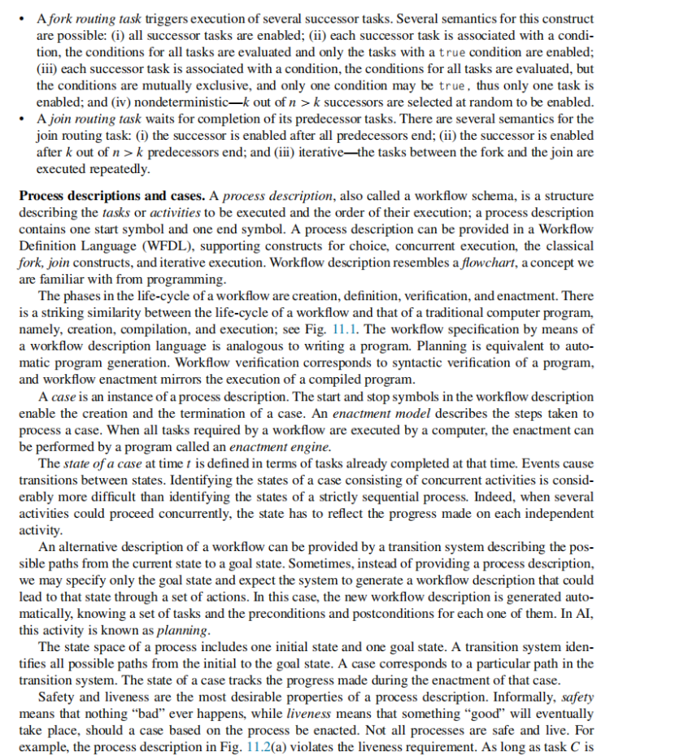
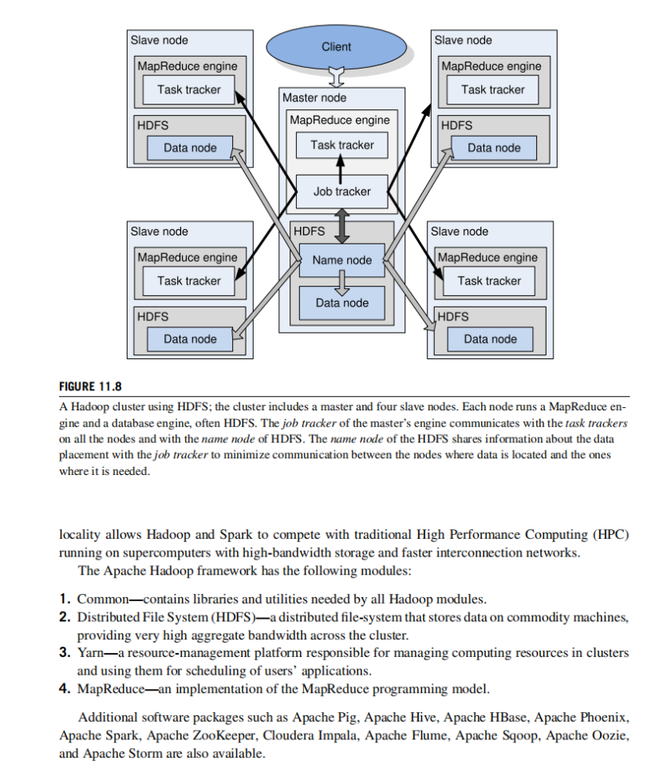
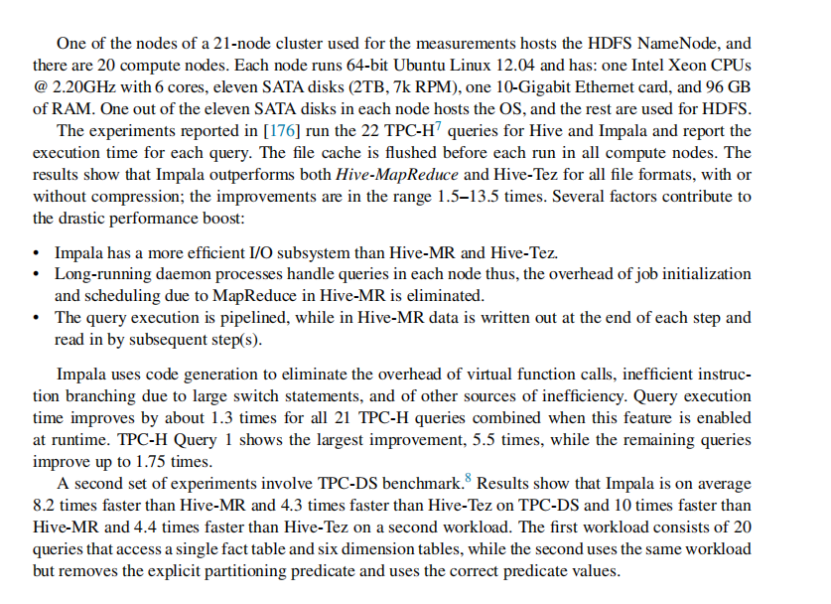
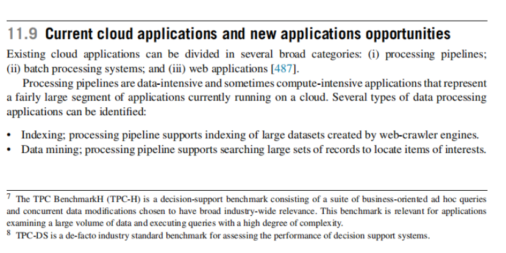

# Chapter 11 Cloud applications

# Start


**1．标题：第十一章——云应用（Cloud Applications）概述与内容导引**

本次课件的主要内容围绕“云计算应用”展开，介绍了云计算应用从产生背景、挑战、优势到典型应用与架构工具的整体脉络，并概括了本章各小节的内容安排。

* * *

**2．详细内容解析**

1）**云计算应用的背景与挑战**

*   **传统数据中心与大规模计算系统的困境**
    *   随着大规模计算系统在数据中心的普及，开发高效的数据密集型（data-intensive）和计算密集型（computationally intensive）应用变得困难重重。
    *   很难确定最适合运行某个应用的系统，或者判断什么时候能够调度资源让应用运行，以及结果何时可以返回。
    *   将应用在不同系统之间移植，常常成为一项艰巨的任务：在某个系统上调优良好的应用，很可能在另一个系统上表现不佳。
*   **服务提供商面临的挑战**
    *   资源不能被有效地管理，难以提供QoS（服务质量）保证。
    *   需要应对动态负载，同时当出现系统级故障时，需要快速恢复，这在超大规模的环境中相当困难。
    *   虽然集中化的资源可能带来一定的经济优势，但由于资源的利用率并不高，这种优势也会被高昂的空闲成本所抵消。

2）**云计算的崛起及其影响**

*   **云计算对用户与服务商观念的改变**
    *   用户与服务提供商开始重新思考：如何更高效、更低成本地完成大规模计算。
    *   对应用开发者和服务提供商来说，云端环境下原本的诸多挑战要么消失，要么被大幅度弱化。
    *   “Just-in-time infrastructure” 概念：应用开发者不再需要过多考虑应用究竟运行在何处或硬件部署等细节，而是能够随需自适应地获取资源。
*   **云弹性（Cloud Elasticity）**
    *   “弹性”意味着云应用可以根据需求快速地对额外工作负载进行扩展或收缩。
    *   当工作负载可以被切分成 n 个独立或并行的“任务片段”时，应用可以按需生成 n 份副本，并行执行，从而得到线性或接近线性的速度提升。
    *   对于需要计算机辅助设计或复杂系统建模等场景，可以通过云快速生成多种模型并同时评估，从而大幅缩短研发周期。
*   **云计算与网格计算（Grid Computing）的比较**
    *   云计算主要面向企业级计算，并且专注于科学与工程领域的应用。
    *   云计算相比网格计算的一个显著特征是：云计算的资源由同一个管理域（administrative domain）提供，资源集中管理更为可控。

3）**云计算的优势与未来发展**

*   **资源利用与典型计算框架**
    *   通过云计算，服务提供商在资源利用率方面可获得显著收益。
    *   大量通用型工作负载逐渐以 MapReduce、Hadoop 等框架为代表进行并行化处理，云端形成了大规模的计算集群并支持多种大数据处理工具。
*   **云计算未来的成功因素**
    *   对于普及“实用型计算（utility computing）”的公司来说，需要向越来越多的用户群体宣传云计算的网络化、低门槛与高效率特点。
    *   这也包括解决在云平台上关于安全性、可扩展性、可靠性、QoS（服务质量）等问题。
    *   服务等级协议（SLA）的要求变得关键：确保提供的服务和资源能够满足业务需求。

4）**本章各节内容简介**

*   **第 11.1、11.2、11.3 节**：主要探讨云应用开发与工作流管理（workflow management）的核心思路和技术。
*   **第 11.4 节**：介绍基于状态机模型（state machine model）的协调机制，为后续云应用中的流程与调度奠定理论基础。
*   **第 11.5、11.6 节**：深入讨论 MapReduce 编程模型，以及 MapReduce 在典型场景中的应用案例。
*   **第 11.7 节**：介绍 Hadoop、Yarn、Tez 等核心云计算与大数据处理框架。
*   **第 11.8 节**：进一步探讨如 Pig、Hive、Impala 等数据分析系统。
*   **第 11.9 节**：对当前的云应用及未来可能的新应用机会做了概述与预测。
*   **第 11.10、11.11 节**：分别讨论了云计算在科学与工程以及生物学研究领域中的应用。
*   **第 11.12、11.13 节**：聚焦社会化计算（social computing）和软件故障隔离（software fault isolations）的关键主题。

* * *

**3．内容小结**  
本次内容重点介绍了云计算应用的产生背景以及在数据中心中运行业务时面临的难点和挑战，概述了云计算对用户和服务提供商带来的观念革新与技术变革，突出了云弹性（elasticity）对应用性能和效率提升的重要意义。也对云计算与网格计算的差异做出了初步分析，随后强调了云计算广泛应用的价值、面临的挑战以及在未来持续发展的关键要素，最后整体梳理了本章各节的知识结构，包括 MapReduce 等典型云计算编程模型、工作流管理、在科学与工程以及生物学领域中的具体应用等。

* * *

**4．报错**

*   本次图片内容清晰可辨，已尽量全面分析解读，无明显遗漏或无法识别之处。如有需要更深层的细节或专有名词解释，可随时提出。

（以上即为对本次图片内容的完整笔记。）

# **11.1** **Cloud application development and architectural styles**


**1．标题：云应用开发与架构风格（11.1节）——从需求挑战到服务端编程范式的系统解析**

本次课件内容聚焦于云应用的开发挑战与常见的系统与软件架构风格，探讨了哪些应用适合云环境、如何在云端有效设计与部署应用，以及在不同编程语言与系统间进行通信时需要考虑的要点和常见解决方案。

* * *

### 2．详细内容解析

#### 2.1 云应用开发与云架构概述

1）**适合云计算的应用类型**

*   **适合：**
    *   Web服务、数据库服务、交易型服务（transaction-based services）等常见“请求-响应”模式的应用非常适合放在云端，因为它们能最大化利用弹性资源，同时只需要为实际使用的资源付费。
*   **不适合：**
    *   负载无法任意拆分，或者依赖实例之间密集通信的应用，通常不易充分利用云的并行与分布式优势。
    *   高性能计算（HPC）类应用如果有复杂的工作流和大量依赖关系，可能导致执行时间更长、通信成本更高，不一定能在云环境中获得与超级计算机（具备低延迟高带宽互连）相当的性能。

2）**云应用开发所面临的挑战**

*   **计算、I/O 和带宽的失衡：**
    *   云应用常常是数据密集型（data-intensive），需要非常庞大的数据传输量，而云的网络和I/O带宽相对计算能力来说并不总是充足，且分布式架构放大了这些问题。
*   **自动化与应用开发者的责任：**
    *   虽然云平台会自动分发与均衡负载，但应用开发者仍需思考如何**最优地选择存储位置**、**利用数据的局部性（locality）**、**减少实例之间的通信**以及**优化代码放置**等问题。
*   **弹性吸引力：**
    *   开发者可以根据需求灵活使用所需数量的服务器，从而以最优成本获得期望的性能与响应时间。
    *   若工作负载可以被分割为任意大小的独立部分（arbitrarily divisible load sharing model），就可在云端并行处理，大幅提高吞吐量与执行效率。
*   **共享基础设施的问题：**
    *   多租户（multitenant）环境使得**性能隔离**变得困难，云环境中虚拟机性能会根据系统负载与资源争用情况发生波动。
    *   **安全隔离**在共享环境中也同样具备挑战性。
    *   云基础设施的**可靠性**：由于服务器数量庞大，且硬件往往是通用现成部件（off-the-shelf），故障时有发生，需要提供快速故障检测与容错能力。

3）**实例类型选择**

*   云计算提供多种实例类型（CPU、内存、GPU、存储I/O配置等不同），用户要根据**性能隔离**、**可靠性**和**安全性**等需求做出选择。
*   成本因素也会影响到实例类型的选择：有些实例价格较低，但网络带宽或I/O性能有限，反之亦然。

4）**多阶段应用的并行与通信**

*   许多应用由多个阶段构成，每个阶段又可在并行的云服务器上运行，这就带来了并发、通信和数据交换的管理问题。
*   云基础设施的带宽和延迟并不稳定，在大规模分布式部署中，**效率**、**一致性**和**可扩展性**是开发者需重点关注的问题。

5）**数据存储与元数据管理**

*   对于数据密集型应用，**数据存储与访问模式**往往决定整体性能。必须评估数据的组织方式、存储位置、带宽、延迟等因素。
*   常见的云存储模式：
    *   **离线云存储**（off-instance），如 S3 等对象存储。
    *   **可挂载的块存储**（mountable block storage），如 EBS（Elastic Block Store），可在实例生命周期内使用，也可持久化。
*   \*\*元数据（metadata）\*\*管理：
    *   数据密集型应用往往需要对每条记录存储附加信息（如音频文件的名称、歌手、录制信息等）。
    *   元数据的存储同样需要**可扩展性**、**高可靠性**以及便捷的访问机制。

6）**日志记录与分析**

*   云环境中的日志记录（logging）对于排查错误、性能优化、或审计非常关键。
*   日志通常只在实例存活期间保留，若需要长期分析或回溯，就需采取额外手段将日志文件转移或持久化。

#### 2.2 云应用的架构风格

1）**云计算的基本模式：客户端-服务器（Client-Server）**

*   云应用大多基于**请求-响应**模型，由客户端发送请求，服务器处理请求并返回响应。
*   为满足高并发和可扩展性，很多云应用倾向采用\*\*无状态（stateless）\*\*服务器：
    *   服务器不记录客户端的会话状态，任何请求都可被看作独立的事务；当服务器重启或宕机恢复后，只要能接收请求并返回结果即可。
    *   无状态服务更容易水平扩展（scalable），对于服务器端故障的恢复也更加简单。
    *   但如果是\*\*有状态（stateful）\*\*连接，需要在服务器端或专用的存储空间保存连接上下文，这对可扩展性提出更高要求，也增加了系统复杂度。

2）**HTTP 及其特性**

*   HTTP 基于 TCP 的连接导向传输协议，保证数据能够有序、可靠地送达。
*   但由于 TCP 在建立连接时会有握手过程，也会带来被恶意攻击（如SYN Flood）以及性能开销的问题。
*   在典型的云应用中，HTTP 成为最常见的上层传输协议，无状态的请求-响应过程有助于系统对外提供简单、统一的接口。

3）**跨系统通信的关键：结构化信息交换**

*   当不同架构、不同语言的进程或线程相互通信时，需要关注**字节序**（大端/小端）、数据表示方式、字符编码等差异。
*   通信通道以比特流方式传输数据，需要在发送端**序列化**数据结构（serialize），在接收端**反序列化**或**解组（unmarshal）**。

4）**架构风格选择的考量：中立性、可扩展性、独立性**

*   **中立性（neutrality）**：指在协议层面支持多种传输方式（如TCP、UDP、SMTP、JMS等），或支持不同语言、系统的互联。
*   **可扩展性（extensibility）**：能否方便地加入安全、加密、日志跟踪等新功能。
*   **独立性（independence）**：是否能兼容不同编程风格、不同平台和多语言环境。

5）\*\*远程过程调用（RPC）\*\*与存根（stubs）

*   在云中，客户端和服务器通过**RPC**来调用远程的函数或方法，而非仅仅通过报文消息。
*   存根（stub）会完成数据封装与解析，将调用方的参数打包为可传输的数据，并在接收端还原后再执行相应操作。

6）**CORBA（通用对象请求代理架构）**

*   早期为支持跨语言、跨平台分布式应用而设计。
*   使用 IDL（Interface Definition Language）定义接口，通过 ORB（Object Request Broker）将对象请求从客户端转发到服务器端，并处理数据的编解码。
*   支持多种语言（C、C++、Java、Smalltalk、Ruby、Python 等）互操作。

7）**SOAP（Simple Object Access Protocol）**

*   1998年为Web应用提出的一种基于 XML 的消息通信协议。
*   能运行在多种协议之上（TCP、UDP、HTTP、SMTP、JMS等）。
*   面向消息的网络模型，支持发送者、接收者、中间代理（intermediary）、最终接收者（ultimate receiver）等多角色协同，具有较好的可扩展性。

8）**WSDL（Web Services Description Language）**

*   2001年引入，用于**XML方式**描述网络应用各端点之间的通信接口与数据结构。
*   主要抽象定义：
    *   **services**：通信端点的集合
    *   **types**：数据类型描述容器
    *   **operations**：服务所支持的操作描述
    *   **port types**：操作所支持的端点组合
    *   **bindings**：具体协议、数据格式与端口对应关系
    *   **ports**：由绑定与网络地址定义出的实际可访问端点

9）**REST（Representational State Transfer）**

*   一种**轻量级**的面向资源（resource-oriented）的分布式超媒体系统架构风格，大多基于HTTP实现。
*   通过常见的 HTTP 动词（GET、PUT、POST、DELETE）完成对资源的 CRUD（创建、读取、更新、删除）操作。
*   REST对比SOAP：
    *   REST请求往往仅需要一个URL即可完成资源访问；
    *   SOAP 传输需要更多的XML格式报文，且需在服务端进行解析。
    *   REST更易于构建、调试，且对数据格式的约束更少；SOAP 借助 WSDL 等工具则有更好的自文档化特性（self-documentation）。

* * *

### 3．本次内容小结

*   **云应用的适用范围**：并非所有应用都适合云环境，尤其是要求高带宽、低延迟、无法并行拆分或依赖大量紧密通信的工作负载，云计算未必能提供最佳性能。
*   **云应用开发面临的关键挑战**：
    *   计算、I/O、网络带宽不匹配；
    *   多租户环境下的性能与安全隔离问题；
    *   日志与数据存储策略；
    *   可伸缩性和容错性的实现方式。
*   **云应用常见架构模式**：
    *   多数基于客户端-服务器、请求-响应的无状态交互；
    *   通过RPC、CORBA、SOAP、REST等多种分布式通信与服务编排方式进行数据与功能对外暴露。
*   **核心技术点**：
    *   不同系统语言与数据结构间的序列化与反序列化；
    *   面向服务的接口描述和通信协议的多样性（HTTP/TCP/UDP/SMTP等）；
    *   中立性、可扩展性和独立性原则，用以支撑分布式系统的互操作。

整体而言，云应用架构的选择往往在易用性、扩展性、性能和安全性之间取得平衡：

*   REST风格更简单直观，常用于Web应用；
*   SOAP/WSDL则在跨平台、大型企业系统、自动化工具支持方面更成熟；
*   CORBA和RPC仍可能在特定的分布式场景或遗留系统中使用。

* * *

### 4．报错

*   本次图片内容已完整解析，暂无明显无法识别的部分。若对某些专有名词或特定框架还需更深层次讨论，可进一步提问。

# **11.2** **Coordination of multiple activities**





**1．标题：多任务工作流的协调与生命周期——从基础概念到安全与活性分析**

本节（11.2）主要讨论在云环境或分布式场景下，如何对多个相互依赖的任务（Tasks）进行调度、编排与协调，即\*\*工作流（Workflow）\*\*的概念和模型。内容涵盖任务的基本属性、复合与路由任务、工作流的描述与生命周期，以及对工作流进行安全性（safety）与活性（liveness）验证时需要注意的问题，特别是死锁风险与异常处理。

* * *

2．详细内容解析
--------

### 2.1 工作流概念与多任务协调

1）**工作流（Workflow）**

*   \*\*定义：\*\*由一组相互关联的任务（tasks）组合而成，描述了如何有序或并行地完成一个复杂活动的过程。
*   \*\*应用范围：\*\*在云计算环境中，许多需要多个互相关联步骤才能完成的业务流程都可以视作工作流，例如数据处理管线、业务审批流程、复杂计算任务等。

2）**任务（Task）的基本属性**

*   \*\*名称（name）：\*\*唯一标识该任务的字符串。
*   \*\*描述（description）：\*\*对任务功能或目的的自然语言描述。
*   \*\*动作（actions）：\*\*任务执行时对环境的改变，如更新数据库、生成文件等。
*   \*\*前置条件（preconditions）：\*\*只有在这些布尔表达式为真时，任务的动作才可执行。
*   \*\*后置条件（postconditions）：\*\*任务完成后需满足的条件或最终效果。
*   \*\*属性（attributes）：\*\*包含该任务所需资源类型、数量、执行者（actor）、安全需求、是否可逆等关键要素。
*   \*\*异常（exceptions）：\*\*包含异常处理规则，例如出现特定事件（event）-动作（action）配对时该如何应对。
    *   \*\*预期异常（anticipated exceptions）：\*\*已在异常列表中列出的可识别异常。
    *   \*\*未预期异常（unanticipated exceptions）：**不在异常列表中的情况，需要进行**重规划（replanning）\*\*或任务关系的重新定义。

3）**复合任务（Composite Task） 与 基本任务（Primitive Task）**

*   \*\*基本任务：\*\*不可再被分解为更小的子任务。
*   \*\*复合任务：\*\*由多个子任务及其执行顺序构成，继承工作流的一些属性，并且拥有自己的名称、前置条件、后置条件等。

4）**路由任务（Routing Task）**

*   \*\*作用：\*\*专门用来在流程描述中衔接或分叉不同的任务路径，通常依赖于前驱任务（predecessor task）或后续任务（successor task）之间的关系。
*   **分类：**
    *   \*\*Fork Routing：\*\*并行触发多个后续任务，可有多种语义：
        1.  所有后续任务同时被启用；
        2.  每个后续任务拥有独立条件，只有满足条件的任务才被触发；
        3.  条件互斥的情形下，仅有一个条件为真时对应的任务被启用；
        4.  不确定（nondeterministic）情况下，n个后续中只有k个被随机启用。
    *   \*\*Join Routing：\*\*等待其所有（或部分）前驱任务完成后再启用下一个任务，可有以下语义：
        1.  等所有前驱都完成才触发后续；
        2.  只需前驱中的 k 个完成即可触发；
        3.  迭代式语义，fork 与 join 之间的任务会多次循环执行。

### 2.2 工作流描述与生命周期

1）**过程描述（Process Description）**

*   又称**工作流模式（workflow schema）**，用于定义任务或活动以及它们之间的执行顺序。
*   开始符号和结束符号：明确流程从何时创建以及如何终止。
*   通常可使用\*\*工作流描述语言（WFDL）\*\*来编写类似流程图（flowchart）的结构，包括分支（choice）、并发（fork/join）以及迭代执行等构造。

2）**工作流的典型生命周期**

*   \*\*创建（Creation）：\*\*规划需要的任务及其流转关系。
*   \*\*定义（Definition）：\*\*将工作流以描述语言形式固定下来，相当于“编写程序”的过程。
*   \*\*验证（Verification）：\*\*对描述进行语法与逻辑检查，避免不一致或不可达状态，类似“编译程序”的过程。
*   \*\*执行（Enactment）：\*\*借助工作流引擎（enactment engine）实际运行，和“执行编译后程序”类似。

3）**Case（实例）**

*   \*\*含义：\*\*工作流描述是一种模板或模式，每当实际需要运行一次流程，就会生成一个具体实例（case）。
*   \*\*Enactment model：\*\*描述了如何从流程描述启动一条新的流程实例，以及在实例中怎样执行所有的任务。
*   \*\*Case 的状态：\*\*在任意时间点，case 的状态可由已完成的任务集合和事件触发的状态转换来定义；并发任务会带来状态表示的复杂性。

4）**静态工作流 vs. 动态工作流**

*   \*\*静态工作流（Static Workflows）：\*\*在定义阶段就固定流程结构，执行过程中不更改。对应“静态程序”。
*   \*\*动态工作流（Dynamic Workflows）：**运行时可能根据情况变化进行**重规划（replanning）\*\*或动态修改流程结构，对应“动态程序”。

### 2.3 安全（Safety）与活性（Liveness）

1）**安全性（Safety）：**

*   “没有坏事发生”，即不会出现系统希望避免的错误或异常终止情形。
*   例如，在某流程中不会出现任务之间的冲突、资源错误分配等导致故障的情况。

2）**活性（Liveness）：**

*   “好事最终发生”，即流程不会无限阻塞或卡死，应能到达预期的完成状态。
*   如果流程存在路径导致任务无法被激活或陷入死锁，就违反了活性要求。

3）**死锁风险示例（图 11.2(b)）**

*   有两个任务 A 和 B，并行执行，需要独占访问资源 r 和 q。
*   若 A 在时间 t1 获取 r，B 在时间 t2 获取 q，之后 A 想要获取 q 而 B 想要获取 r，就可能导致双方互相阻塞、无法继续执行。
*   \*\*解决方案：\*\*可一次性请求全部资源，但会带来某些资源闲置的问题；或采取有效的锁管理、调度策略来避免相互持有对方所需的资源。

### 3．总结

本节强调了**多任务协调**在云计算工作流中的重要性：

1.  **任务（task）模型**奠定了工作流管理的基本单位，描述其名称、前/后置条件、动作、异常以及资源需求等。
2.  \*\*路由任务（fork/join）\*\*构建并行或顺序逻辑，为工作流的可编排性提供灵活机制。
3.  **工作流生命周期**（创建、定义、验证、执行）与传统软件开发过程有相似之处，尤其是对安全与活性特性的验证极其重要。
4.  **动态工作流**在处理未预期异常时能进行运行时修改和重规划，与静态流程相比更具适应性，但也更复杂。
5.  **死锁与活性**问题在并行环境下普遍存在，需要在设计与验证阶段就确保避免陷入无终止的执行。

* * *

### 4．报错说明

*   本次图片内容已基本解析，未发现明显模糊或遗漏之处。如需对具体的异常处理或工作流描述语言进行更深入探讨，请进一步提问。

# **11.3** **Workflow patterns**


**1．标题：工作流模式与协调机制——多分支同步、动态修改及与数据库事务的比较**

本节（11.3）主要介绍了工作流模式（workflow patterns）的概念与分类，并阐述了在云计算环境或分布式场景中支持这些模式所需的协调与管理机制。同时，对比了传统数据库事务型系统与云工作流在一致性、持久性和资源分配等方面的差异。

* * *

2．详细内容解析
--------

### 2.1 工作流模式的概念与分类

1）**工作流模式（Workflow Pattern）的意义**

*   工作流模式着眼于流程中任务之间的**时序关系**（temporal relationships），如先后顺序、并行执行、条件分支与合并等。
*   这些模式可帮助我们**抽象与复用**常见的流程结构，使工作流描述语言或系统更易表达实际业务逻辑。
*   参考文献中常将它们分为多个类别：基础模式、进阶分支与同步模式、结构化模式、基于状态的模式、取消模式以及多实例（multi-instance）模式等。

2）**基本工作流模式**（图 11.3）  
以下为文中提到的“基础模式”示例，每一种都在图中有对应的示意结构：

*   **(a) Sequence（顺序）：**  
    依次调度执行多个任务（A → B → C），一个完成后下一个才能开始，最简单的串行关系。
    
*   **(b) AND Split（并行分支）：**  
    将流程分成并行的多条分支，如任务 A 完成后，同时激活任务 B 与任务 C。可显式（explicit）地通过路由节点实现，或隐式（implicit）地直接连线给分支。
    
*   **(c) Synchronization（同步）：**  
    需等待并行任务都完成才触发后续任务。例如任务 A 和 B 并发执行，只有当 A、B 同时完成后，才可启动 C。
    
*   **(d) XOR Split（互斥分支）：**  
    需要进行**决策**，在任务 A 执行完后，要么进入 B，要么进入 C，而不是同时进入。
    
*   **(e) XOR Merge（互斥合并）：**  
    若存在多条可替代的分支（例如 B、C），不论哪个分支先结束，都可汇总到一个后续节点（如任务 A）。只有一个分支的结果被合并，或者当第一个完成的分支到达合并节点，后续任务便被激活。
    
*   **(f) OR Split：**  
    在任务 A 之后，可以选择多个后续路径，如 B、C 或者同时激活 B 和 C。这与 XOR Split 不同，XOR 只能选择其中一个，而 OR 可选择一个或多个。
    
*   **(g) Multiple Merge（多重合并）：**  
    允许多个分支在某些条件下重复激活同一后续任务，而不需要等待所有并发分支完成。
    
    *   比如，A 执行完后，B 和 C 可以并发执行；一旦 B 完成，D 被激活；随后 C 完成后，再次触发 D。但此时可能会带来重复激活等问题，需要小心处理。
*   **(h) Discriminator（鉴别器/排他器）：**  
    等待若干个分支中的一个（或部分）完成后就激活下一任务，然后对剩余分支不做处理或等待其结束。
    
    *   常见用法：只要一个分支先完成就触发后续活动，后续再等待其他分支完成后进入重置状态。
*   **(i) N out of M Join：**  
    当有 M 个并行分支运行时，需要至少其中 N 个完成，才激活下一个任务。图中例子“2/3”表示需要在 A、B、C、D 中至少有 2 个完成后，才可以激活 E。
    
*   **(j) Deferred Choice（延迟选择）：**  
    类似 XOR Split，但不提前显式指定分支选择，运行时根据环境或上下文来决定走哪条路径。比如系统在执行时才会确定究竟去往 B 还是 C。
    

### 2.2 工作流可达性分析与静态/动态工作流

1）**可达性（Reachability）**

*   在工作流系统  $\Sigma$  中，我们有一个**初始状态**  $s_{\text{initial}}$  和一个**目标状态**  $s_{\text{goal}}$ 。
*   可达性问题指：从初始状态是否能够通过执行一系列合法的任务转变达到目标状态。
*   一个通俗解释是：**后置条件（postconditions）**决定了流程的结果能否满足后续任务的**前置条件（preconditions）**，若能逐步推进到目标，就说明工作流可行。

2）**静态工作流 vs. 动态工作流**

*   \*\*静态工作流：\*\*工作流图在执行期间不变化，可用工作流描述语言（WFDL）进行定义和验证。
*   **动态工作流：**允许**运行时**对流程结构进行修改或重规划。
    *   面临的复杂问题包括如何与资源管理、优化策略相结合，以及如何保证一致性。
    *   动态修改时，流程系统需能够根据当前状态和上下文对活动图进行变更，并维护流程正确性。

### 2.3 强协调模型与弱协调模型

1）**强协调模型（Strong Coordination Models）**

*   存在一个\*\*协调者（coordinator）\*\*或“根进程”，它监督和保证从一个任务到下一个任务的平稳过渡。
*   可采用**层次化（hierarchical）协调结构**：顶层有一个全局协调者，负责管理下级的多个局部协调者，各自管理一部分流程或子任务。
*   特点：
    *   对于动态工作流的支持：当需要修改流程时，协调者可以先让所有并发分支进入一致状态，再评估变更可行性，然后执行修改。
    *   易于集中控制，但也可能带来一定的通信开销。

2）**弱协调模型（Weak Coordination Models）**

*   无集中协调过程，更接近\*\*对等（peer-to-peer）\*\*模式。
*   常使用\*\*元组空间（tuple space）\*\*或类似共享数据结构进行事件与状态传递。
    *   某个进程  $p_i$  完成后，就把它的后置条件（postconditions）等信息放到 tuple space 中，其他进程（ $p_j$ ）在适当时机检查 tuple space，以判断是否具备执行条件（其前置条件 pre( $p_j$ ) 是否满足）。
*   优势：
    *   进程间相对独立，无需全局协调者；
    *   也有助于动态环境下灵活响应。
*   可能的挑战：
    *   需要每个进程自己维护活动图的一份拷贝或理解；
    *   对并发冲突的检测与解决需要额外机制。

### 2.4 与数据库事务系统的对比

文中也提到传统事务系统（transaction-oriented systems）和云工作流的异同点：

1）**一致性状态的维护难度**

*   数据库一般是封闭系统，短事务能够严格保证ACID特性（原子性、一致性、隔离性、持久性）。
*   云工作流却面向更开放的系统，状态在流程生命周期中会不断变化，且可能持续时间更长。

2）**事务 vs. 云工作流任务**

*   数据库事务通常**短小**且**原子动作**相对固定；
*   云工作流包含的任务数量多、执行时间长（可能是长周期作业），过程中可能出现**动态结构变更**，或者需要回滚到先前阶段等。

3）**可逆与不可逆操作**

*   工作流中的某些任务是不可逆的——一旦执行，不能简单地撤销；而传统数据库事务若回滚往往可以撤销所有操作。
*   在云场景中，有时为了长期利益而放弃继续错误路径并回退是必要的，因而某些任务被设计成可逆；或者宁可付出一定代价再往回走，也比在错误路径上越走越远好。

4）**资源分配**

*   数据库事务基本只需要数据库管理系统（DBMS）内部的调度；
*   工作流在云上往往牵涉到各种资源：计算、存储、带宽、外部API等，需要考虑更复杂的调度与分配方案。

* * *

3．本次内容总结
--------

1.  **工作流模式**为我们提供了表达流程中时序关系的常用构造，包括顺序、并行、条件分支、合并与分支选择等。
2.  **静态与动态工作流**的差异在于执行阶段能否修改流程图；动态工作流虽然灵活，但对一致性和正确性要求更高。
3.  **强协调模型**与**弱协调模型**体现了集中式协调与分布式对等（peer-to-peer）两种极端：
    *   强协调：层次化控制、易统一管理，但可能通信负担大；
    *   弱协调：更多自治、松散耦合，但对冲突处理和状态跟踪提出额外要求。
4.  **与数据库事务对比**：云工作流具有更长的执行周期、更开放的系统边界、更灵活的可逆/不可逆操作，以及更加多样化的资源管理需求。这使得传统ACID事务的一致性维护方式难以直接应用于云工作流，需要更适合分布式、异步环境的机制。

* * *

4．报错说明
------

*   本次图片内容已做较为全面的解析，尚未发现缺失或辨认不清之处。如需深入探讨某一特定模式的实现细节或更多跨章节关联，可进一步提问。

# **11.4** **Coordination based on a state machine model—zookeeper**


**1．标题：基于状态机模型的协调——ZooKeeper 在云环境中的分布式一致性管理**

本节（11.4）介绍了在云计算和大规模分布式系统环境下，为了实现**多服务器、多进程、多云环境间的协调与一致性**，可采用一种**确定性有限状态机（finite-state machine）**模型来对外部请求进行有序处理。ZooKeeper 作为该模型的一种典型开源实现，通过**主从复制（leader-follower）**以及原子广播（atomic broadcast）等机制，保证在分布式系统中提供**一致性、可靠性**的协调服务。

* * *

2．详细内容解析
--------

### 2.1 背景与需求

1）**云计算弹性（elasticity）与分布式数据/计算**

*   现代云应用常常需要在多服务器或多云之间分配计算与存储任务。
*   若应用是关键性或需要高可用（如数据库访问、会话管理、服务注册发现），就必须确保在某个服务器发生故障时，系统能够自动切换到“热备（hot standby）”实例，并且所有副本与主服务器保持一致的状态。
*   对于分布式存储模型（如多代理/多代理节点 architecture），代理（proxy）本身可能成为单点故障，需要多副本分布式协调来维持一致性。

2）**传统静态协调方式的缺点**

*   将配置信息写在统一配置文件并分发到所有节点只能在服务启动或系统故障后重新分发，过程较为“静态”，且无法恢复每个节点原先的精确状态。
*   因此需要一种**动态协调模型**，能够在节点故障或网络分区后自动进行**状态同步**和**领导者选举**，并保证整体系统的正确运行。

### 2.2 ZooKeeper 简介

1）**ZooKeeper 的定位**

*   是一个**分布式协调服务（distributed coordination service）**，用于管理分布式系统中数据的一致性、配置、命名（naming）、分布式锁、组成员关系等常见场景。
*   提供**高吞吐、低延迟**的核心功能，并在大规模分布式环境中被广泛应用。
*   开源软件，使用 Java 实现，同时对 Java、C 等语言提供绑定。

2）**ZooKeeper 的集群结构**

*   在 ZooKeeper 的集群（pack）中，每个服务器都与其他服务器通信，互相复制数据库；当集群中的服务器达成共识，会选举出一个**leader**，其他为**follower**。
*   \*\*客户端（client）\*\*可连接到任意一台服务器：
    *   发起请求（包括读请求 read、写请求 write、注册监视器 watch 等），并接收响应。
    *   如果连接的服务器崩溃，客户端会自动感知并连接到另一台存活的服务器。

3）**工作流程（图 11.4）**

*   **读请求（READ）**
    *   为了降低延迟，client 请求直接在其连接的那台服务器本地副本上执行并返回结果；这意味着读操作往往是“快速响应”。
*   **写请求（WRITE）**
    *   follower 会将写请求**转发给 leader**，leader 再通过原子广播（atomic broadcast）将该写请求分发给所有 follower。
    *   只有在多数（超过半数）节点达成共识（基于 Paxos 或类似算法）的情况下，该写操作才真正生效并返回成功。
    *   当 leader 出现故障时，集群会自动发起**新 leader 的选举**，保证系统继续提供服务。

4）**ZNode 与层次化命名空间（图 11.5）**

*   ZooKeeper 将数据组织成一个类似文件系统的**树状结构**，路径使用“/”分隔，称为**znode**。
*   每个 znode 可存储少量数据及其元信息（如版本号、时间戳、访问控制列表 ACL 等），并支持\*\*watcher（监视）\*\*机制：一旦该 znode 发生变化，就可通知客户端。
*   **znode 的类型**
    *   **持久节点（Persistent）**：一旦创建就保存在 ZooKeeper 中，直到显式删除。
    *   **临时节点（Ephemeral）**：与客户端会话相绑定，会话结束时自动删除，可用于实现分布式锁或选举。

### 2.3 ZooKeeper 的一致性保障

ZooKeeper 的一致性可以概括为以下几点（也称为 ZAB 协议/ZooKeeper Atomic Broadcast 的特性）：

1.  \*\*原子性（Atomicity）：\*\*一次更新要么全部完成要么全部失败，不存在部分完成的中间状态对外可见。
2.  \*\*顺序一致性（Sequential Consistency）：\*\*更新按接收次序严格依次应用，客户端可以看到线性的更新顺序。
3.  \*\*单一系统映像（Single system image）：\*\*无论客户端连接到哪台服务器，得到的结果一致。
4.  \*\*更新持久性（Update persistence）：\*\*一旦更新成功被提交，就会被持久化，直到被下一次更新覆盖。
5.  \*\*可靠性（Reliability）：\*\*只要大多数服务器（超过半数）存活且能通信，系统就可正常对外提供一致视图。

### 2.4 通讯层与 Paxos 共识

1）**基于消息广播实现共识**

*   写操作会被打包为**proposal**，通过\*\*广播（broadcast）\*\*发送给集群中的所有节点；在得到集群大多数节点的确认（ack）后视为提交成功，leader 再向所有节点发送提交消息。
*   对消息可靠传递、总序（total order）以及因果顺序（causal order）都有保证。

2）**领导者选举**

*   当 leader 故障或网络中断，剩余节点会通过**Paxos**或类似算法进行新 leader 的选举，以保证系统继续运转。
*   客户端与原 leader 的连接断开后，会重新发现并连接到新的 leader/follower 节点。

### 2.5 ZooKeeper API

ZooKeeper 提供了常见的 7 种操作接口，用以简化开发者对分布式状态和配置的管理：

1.  `create(path, data, ...)`：在树状路径下创建一个 znode 节点，可为持久或临时；
2.  `delete(path, ...)`：删除指定 znode；
3.  `get data(path, ...)`：读取节点数据；
4.  `set data(path, data, ...)`：向节点写入数据；
5.  `get children(path, ...)`：获取该节点下子节点列表；
6.  `sync(path, ...)`：客户端同步操作，等待将先前的更新与节点状态保持一致后才返回；
7.  支持临时节点（ephemeral）与 watcher（监视机制），可在节点被修改时异步通知客户端。

### 2.6 总体小结：有限状态机模型与云环境应用

通过上述机制，ZooKeeper 将云或分布式系统中的关键数据与元信息保存在一个**共享的、强一致性**的存储中，并采用**确定性有限状态机**的思想：

*   任何写操作都导致系统从一个状态转移到下一个状态，所有节点都按相同顺序执行这些转移。
*   客户端可把 ZooKeeper 用来构建更高级的功能：分布式锁、选举服务、组成员管理、配置管理等。
*   例如许多大规模系统（如 Yahoo! 的消息中间件、Hadoop、HBase 等）都依赖 ZooKeeper 来做分布式协调。

* * *

3．内容总结
------

1.  **状态机模型核心思想**：所有节点对同样的输入指令（序列）做状态转移，保证全局一致性。
2.  **ZooKeeper 工作方式**：
    *   集群间选主（leader），其他 follower 复制数据；
    *   读请求直接从本地副本服务，写请求通过 leader 序列化并原子广播给所有 follower；
    *   提供树形 znode 命名空间，支持数据、版本、ACL 等信息管理，并可设置 watch 进行通知。
3.  **一致性保障**：
    *   原子性、顺序一致性、单一系统映像、更新持久性、可靠性等关键特性，依赖 Paxos / ZAB 原子广播协议实现。
4.  **典型应用场景**：
    *   分布式锁服务、分布式配置管理、服务注册发现、集群成员管理等。
5.  **优势**：
    *   高吞吐、低延迟，易于扩展并在大规模分布式场景中应用；
    *   广泛用于 Hadoop/HBase 等大数据生态系统中的核心协调。

* * *

4．报错说明
------

*   本次图片与文字内容均已详细讲解，无明显遗漏或无法识别处。若需要更深入的实现原理（如 ZAB 协议细节、Paxos 算法流程）或应用场景示例，可在后续问题中再进行探讨。

# **11.5** **MapReduce programming model**


**1．标题：云端并行计算的核心范式——MapReduce 编程模型及其扩展**

本节（11.5）重点介绍了 MapReduce 编程模型的概念、执行流程与典型应用场景，并简要提及了基于 FlumeJava 的扩展方式。MapReduce 以“弹性伸缩”与“自动容错”为核心，支持大规模数据的分布式处理，成为云计算和大数据处理领域的代表性框架。

* * *

2．详细内容解析
--------

### 2.1 MapReduce 的背景与动机

1）**云计算与负载弹性**

*   云计算的最大优势之一在于可根据应用需求弹性地启用服务器集群，降低成本并满足时延要求。
*   前端系统（如交易处理系统）可将请求分发至多台后端服务器；当负载增加时，可动态添加更多后端节点。

2）**可任意切分的负载模型（Arbitrarily Divisible Load Sharing Model）**

*   若工作负载可以被拆分成大量小规模、近乎等大小的子任务，就可以并行处理，大幅度提升效率。
*   然而，对于数据密集型应用，要找到良好的数据切分方式并非易事，需要考虑数据大小、处理逻辑以及网络吞吐等多种因素。

### 2.2 MapReduce 基础原理

1）**核心思想**

*   **Map（映射）**：对输入数据进行分块处理，将每个输入数据块（key, value）映射为中间结果（intermediate key, intermediate value）。
*   **Reduce（归约）**：按中间 key 对数据分组聚合，对相同 key 的所有 intermediate value 进行汇总处理，输出最终结果。

2）**SPMD（单程序多数据）范式**

*   MapReduce 与传统并行计算中的 SPMD 思想相似：通过一个**Master**实例来调度与分配大规模数据分块给多个并行工作者（Workers），并负责最终结果的合并。

3）**示例：Word Count**

*   **Map 函数：**
    
    ```java
    map(String key, String value) {
        // key: 文档名; value: 文档内容
        for each word w in value:
            EmitIntermediate(w, "1");
    }
    ```
    
    将文档内容按单词切分，对每个单词发射 (单词, 1)。
    
*   **Reduce 函数：**
    
    ```java
    reduce(String key, Iterator values) {
        int result = 0;
        for each v in values:
            result += ParseInt(v);
        Emit(AsString(result));
    }
    ```
    
    将相同 key（单词）的所有计数相加，得到该单词在所有文档中的出现次数。
    

### 2.3 MapReduce 执行流程（图 11.6）

1）**输入拆分与启动**

*   运行时库将输入文件切分为 M 个分块（split），通常每块 16~64 MB。
*   识别集群中可用的 N 台机器，启动程序的多份拷贝：一个为 **Master**，其余为 **Worker**。
*   Master 负责将 M 个 Map 任务以及后续的 R 个 Reduce 任务分配给空闲 Worker。

2）**Map 阶段**

*   被分配了 Map 任务的 Worker 从对应分块读取数据，解析成 <key, value> 对，并调用用户自定义的 Map 函数处理；
*   生成的中间结果（<key, value>）暂存于内存中，之后会写入本地磁盘，并根据 `partition` 函数将其划分到 R 个区域（对应 R 个 Reduce）。

3）**Shuffle 与 Reduce 阶段**

*   当所有 Map 任务完成后，Master 知道存放中间数据的位置，并将此信息通知各 Reduce Worker；
*   Reduce Worker 通过远程读取（remote procedure call）从每个 Map Worker 拉取相应分区的数据，根据中间 key 分组，然后执行用户定义的 Reduce 函数；
*   将处理结果写入最终输出文件或共享存储。

4）**任务完成与容错机制**

*   Master 轮询监控各个 Worker 的状态，若某 Worker 无响应，就认为其故障，重置该任务并分配给其他空闲 Worker；
*   MapReduce 会定期存储检查点（checkpoint），在 Worker 故障时可从检查点重新执行，并且多副本文件系统（如 GFS/HDFS）也确保输入数据安全。
*   当 Master 确认所有 Map 和 Reduce 任务都成功执行后，才唤醒用户程序并结束此次作业。

### 2.4 实践规模与实现细节

1）**典型硬件环境**

*   多数 MapReduce 集群由数百到数千台 x86 服务器组成，每台带有 2~4 GB 内存、数百 GB~TB 级本地磁盘，并通过 100~1000 Mbps 级别的网络互联。
*   文件系统（如 GFS）使用副本存储保障数据的可靠性。

2）**FlumeJava 与 MapShuffleCombineReduce**

*   **FlumeJava**（在 10.15 节有提及）提供了更高级的 MapReduce API，如 `ParallelDo`, `GroupByKey`, `CombineValues`, `Flatten` 等操作。
*   **MapShuffleCombineReduce**：将多个分阶段的 MapReduce 逻辑合并为一次集中处理。
    *   支持多个 Reducer 和 Combiner，每个 Reducer 可输出多个结果；
    *   避免传统 MapReduce 对输入/输出 key 保持一致的强制要求，支持更灵活的管道化处理。

3）**缓存执行模式（Cached Execution Mode）**

*   如果在某个管道运算中，输入数据及代码都未更改，则可重用先前运行的结果，节省重复计算开销。
*   在调试或迭代开发复杂数据处理管道时尤其有用。

### 2.5 系统特性与优势

*   \*\*弹性伸缩：\*\*当数据量增长或负载升高，可轻松添加 Worker 节点；
*   **容错性：** Master 持续监控 Worker 状态，自动发现故障并重新调度；
*   \*\*简单编程模型：\*\*用户只需关注 Map 和 Reduce 的逻辑，不需手动处理并行、分布式 I/O、负载均衡等复杂细节；
*   \*\*高吞吐量：\*\*得益于本地磁盘输入（减少网络传输）与分布式文件系统的支持；
*   \*\*成熟生态：\*\*Hadoop 为典型开源实现，支持多种语言 API 以及与数据库、机器学习工具的对接。

* * *

3．本次内容小结
--------

1.  **MapReduce 的核心流程**包括：拆分输入 → 分派 Map 任务 → 本地生成中间结果 → Shuffle → Reduce 归约 → 输出结果。
2.  **容错与调度**是 MapReduce 成功应用于大规模分布式集群的关键：Master 维持全局调度，故障节点可被替换；底层文件系统也保证数据的多副本存储。
3.  **FlumeJava 等扩展**让 MapReduce 从单次任务模式演变为多阶段数据管道，支持更复杂的组合操作，并利用缓存与动态优化来提高效率。
4.  通过这种编程模型，开发者可以专注于数据处理逻辑（Map 和 Reduce 函数），而不必深入管理并行细节，因而被广泛运用于日志分析、排序、机器学习预处理、文本挖掘等海量数据场景。

* * *

4．报错说明
------

*   本次图片内容解析完备，未发现缺失或识别不清部分。如有任何关于 MapReduce 底层实现或更多实战应用的疑问，可进一步提问。

# **11.6** **Case study: the GrepTheWeb application**


**1．标题：基于Hadoop的云端文本搜索——GrepTheWeb应用案例分析**

本节（11.6）介绍了真实生产环境中的一个MapReduce应用案例——**GrepTheWeb**。该应用由亚马逊团队开发并运行在其云服务（EC2、S3、SimpleDB、SQS）之上，用来处理海量网络爬取数据，基于用户给定的正则表达式筛选符合条件的记录并返回搜索结果。它类似于在海量文件中执行Unix“grep”的效果，充分展示了**云端按需部署**与**分布式并行处理**的典型流程与优势。

* * *

2．详细内容解析
--------

### 2.1 系统整体架构与组成

1）**核心目标**

*   允许用户提交一个正则表达式，去匹配存储在云端的大规模网页记录（这些记录由Alexa Web Search引擎的爬虫日常抓取生成）。
*   输出满足该正则表达式的所有记录。用户可以随时查询处理进度，也能终止正在进行的处理。

2）**依赖的云服务**

*   **Amazon EC2**：弹性云计算（Elastic Compute Cloud），用于启动并运行Hadoop MapReduce集群。
*   **Amazon S3**：简单存储服务（Simple Storage Service），用于存放输入数据和最终输出结果。
*   **Amazon SimpleDB**：非关系型数据库（NoSQL），用于存储一些配置信息、状态信息及元数据。
*   **Amazon SQS**：消息队列（Simple Queue Service），在该应用中用于在不同控制模块之间传递指令和任务信息。

3）**控制器（Controller）与队列**

*   整个系统由多个**控制器线程**组成：
    *   **Launch Controller**：负责启动任务（分配EC2实例、部署Hadoop并提交MapReduce作业）。
    *   **Monitor Controller**：负责监控处理状态，检查任务进度、错误等。
    *   **Shutdown Controller**：负责当用户请求结束或故障时，安全地关闭Hadoop进程、释放EC2资源。
    *   **Billing Controller**：用于记录计费信息，比如本次作业使用了多少实例、多长时间、S3使用量等等。
*   不同控制器之间通过SQS队列进行通信，四个典型的队列为：**launch queue**、**monitor queue**、**shutdown queue**、**billing queue**。

### 2.2 工作流程（图 11.7）

根据书中的描述，GrepTheWeb包含以下主要阶段：

1）**Start-up Phase（启动阶段）**

*   系统创建了若干SQS队列（launch、monitor、billing、shutdown）并启动相应的控制器线程。
*   每个控制器线程会周期性**poll**自己关联的输入队列，一旦检测到消息，就解析并执行对应操作。

2）**Processing Phase（处理阶段）**

*   当用户通过某界面提交“StartGrep”请求（包含正则表达式等信息）时，就往**launch queue**中发送消息。
*   **Launch Controller**检测到此消息后：
    1.  在Amazon SimpleDB中更新作业信息（状态、时间戳等）；
    2.  在Amazon EC2上启动一个或多个实例（已预装Java、Hadoop），部署所需库文件并运行MapReduce作业；
    3.  Hadoop集群在EC2实例上并行执行：
        *   **Map任务**：从S3中读取待搜索的网页记录，对每一条内容匹配正则表达式，找出符合条件的片段；
        *   **Combine/Reduce任务**：合并并排序部分结果，将符合条件的记录最终整合成输出；
    4.  将完成后的中间或最终结果文件写回Amazon S3的指定输出桶（bucket）；
    5.  一旦启动任务完成，Launch Controller向**monitor queue**发送监控任务并删除来自launch queue的消息。
*   此时，**MapReduce处理**在EC2集群上持续进行，直到所有任务完成或发生异常。

3）**Monitoring Phase（监控阶段）**

*   **Monitor Controller**从monitor queue获取消息，检查SimpleDB中的状态字段和EC2/Hadoop的实际执行情况：
    *   周期性地查询Hadoop作业进度、是否出现故障，更新SimpleDB中记录的状态/错误信息；
    *   若处理完成，则把下个阶段相关信息（关停、计费等）投递到shutdown或billing队列；
    *   确认监控任务无误后，从monitor queue移除消息。

4）**Shutdown Phase（关停阶段）**

*   **Shutdown Controller**从shutdown queue获取“关闭系统”指令后：
    1.  终止Hadoop进程、释放EC2实例；
    2.  收集EC2拓扑信息、SimpleDB中的一些统计等；
    3.  将资源释放信息、使用情况等交给Billing Controller，最后删除shutdown队列中的消息。

5）**Cleanup Phase（清理阶段）**

*   将简单数据库（SimpleDB）中的记录（或用户信息）进行归档，腾空临时数据以防资源浪费。

6）**用户与系统的交互**

*   用户可以通过**GetStatus**接口查询当前执行状态（controller和Hadoop作业）以及最终结果文件在S3的位置；
*   处理结束后，可在S3中下载或查看搜索匹配到的数据；
*   如需中途取消，可向系统发出终止指令，从而触发shutdown流程。

### 2.3 应用中的关键技术点

1）**消息驱动的工作流**

*   系统采用SQS队列进行消息触发，具备松耦合、可扩展的特点，易于增加新的控制器或更复杂的任务流。

2）**基于Hadoop的分布式搜索**

*   GrepTheWeb类似“大规模分布式的grep”：将正则匹配分摊到多个Map任务并行执行，加快对海量网页文本的搜索速度。
*   最终Reduce或Combine阶段将结果汇聚，便于用户统一获取。

3）**资源弹性与按需计费**

*   在处理前动态启动EC2实例，结束时释放，能针对不同正则搜索请求随时扩容/缩容。
*   SimpleDB和S3也采用**按使用量付费**模式，Billing Controller收集各部分用量以进行计费核算。

4）**性能优化**

*   将多份S3对象合并，减少传输中的开销；
*   启动多线程以更快地获取S3对象，并在本地排序URL指针；
*   可以并行、分批处理数据，适配不同问题规模及用户数量。

### 2.4 价值与启示

*   **快速搭建大规模分布式搜索**：通过Amazon云服务与Hadoop生态，无需自建大型数据中心，开发者可快速实现高可用、高并发的搜索应用。
*   **工作流自动化**：借助消息队列（SQS）编排控制器，使启动、监控、关停、计费等流程实现无人值守或少人工干预。
*   **适用性**：该模式可拓展到更多场景，如大规模日志分析、推荐系统中的文本过滤、实时检测等。
*   **展现了云计算“On-Demand”**：可根据用户需求扩充作业规模，不再受限于固定硬件资源。

* * *

3．内容小结
------

1.  **GrepTheWeb**是将传统“grep”搜索模式拓展到云端的典型案例，通过**MapReduce**并行执行与**消息队列**驱动的多控制器协调，完成对庞大网页数据的正则匹配与结果汇总。
2.  **亚马逊云服务**（EC2、S3、SimpleDB、SQS）的组合让系统在启动、监控、关停以及计费等环节实现了全自动化，极大简化了运维工作。
3.  **核心流程**包含：
    *   **启动阶段**：队列和控制器线程就绪；
    *   **处理阶段**：启动EC2实例，执行Hadoop MapReduce；
    *   **监控阶段**：持续检查作业状态，并将任务信息发送给后续队列；
    *   **关停与清理阶段**：释放资源、归档记录、更新计费信息；
    *   **用户交互**：可随时查询进度或终止流程，并在结束后检索结果。
4.  **该案例**直观展示了云环境下如何使用按需服务和分布式编程模型来处理海量数据，同时满足高可用和可扩展。

* * *

4．报错说明
------

*   本次案例分析信息完整，图片内容也已充分描述，无明显缺漏或无法识别之处。若需更深入的收费策略或正则匹配实现细节，可进一步提问。

# **11.7** **Hadoop, Yarn, and Tez**





**1．标题：Hadoop、Yarn与Tez——现代大数据基础设施的核心框架**

本次课件（11.7）聚焦于Apache Hadoop生态中最关键的几个技术组件：**Hadoop**本身的分布式存储与计算框架、**Yarn**作为资源管理和调度平台，以及**Tez**通过有向无环图（DAG）模型进一步提升批处理和交互式查询的执行效率。它们共同构成当今大数据应用在云环境中高效运转的核心。

* * *

2．详细内容解析
--------

### 2.1 Hadoop：分布式存储与计算

1）**Hadoop的背景与应用**

*   Hadoop是一个开源、基于Java的分布式系统框架，用于大规模数据的存储与处理。
*   在互联网、金融、科研、政府等领域广泛应用：
    *   行业巨头（Apple、IBM、HP、Microsoft、Yahoo、Amazon等）和媒体机构（New York Times、Fox）以及社交网络（Twitter、Facebook、LinkedIn）都在部署Hadoop集群。
    *   Facebook在2012年报告的Hadoop集群规模接近100 PB，日增长0.5 PB；2013年时，超过一半的《财富500强》企业也在使用Hadoop。
*   Azure HDInsight和AWS EMR等云服务也提供Hadoop平台作为托管服务。

2）**Hadoop核心思想**

*   **MapReduce**计算模型：在Hadoop 1.x时代，MapReduce自带了资源管理和任务调度功能。Map阶段对数据分片做并行处理，Reduce阶段对分片结果进行聚合。
*   **HDFS（Hadoop Distributed File System）**：为分布式集群提供高吞吐量的文件读写；支持多副本存储，默认3份，保障数据可靠性。
*   **Data Locality（数据本地化）**：将计算“推向”数据所在节点，以减少网络传输，提高处理效率。

3）**Hadoop关键组件**

*   **Common**：Hadoop通用的库与工具。
*   **HDFS**：分布式文件系统，存储海量数据并提供高带宽数据访问。
*   **Yarn**：在Hadoop 2.x中引入，用于管理集群资源、调度应用。
*   **MapReduce**：基于MapReduce编程模型的数据处理引擎。

4）**Hadoop 1.x与2.x对比**

*   **Hadoop 1.x**：JobTracker（全局）+ TaskTracker（每个节点）模型，单一组件负责所有资源管理和调度。
*   **Hadoop 2.x**：将资源管理抽离为Yarn，MapReduce变成一个在Yarn之上运行的应用；提升了系统可扩展性、灵活性及资源利用率。

5）**Hadoop生态系统**

*   依托Hadoop核心，围绕大数据处理形成庞大的生态：
    *   **Pig**、**Hive**、**HBase**、**Impala**、**Phoenix**、**Spark**、**ZooKeeper**、**Flume**、**Sqoop**、**Oozie**、**Storm** 等；
    *   许多基于Hadoop的SQL引擎（如IBM的BigSQL、Cloudera的Impala等）让用户可以使用标准SQL访问分布式数据。

### 2.2 Yarn：统一的资源管理与调度平台

1）**Yarn的诞生动机**

*   在Hadoop早期版本中，MapReduce框架既负责分布式计算逻辑又承担资源管理，难以适配多种并行计算模型（例如Spark、Tez等）。
*   Yarn将资源管理（CPU、内存、网络、磁盘等）从MapReduce中剥离，使其他分布式计算框架也能在同一集群上运行并共享资源。

2）**Yarn的体系结构**

*   **Resource Manager（RM）**：集群全局资源管理者，负责分配CPU、内存等。包含一个**Scheduler**来决定各应用拿到的资源份额。
*   **Node Manager（NM）**：在集群每个节点上运行，汇报资源使用情况，并根据RM指令分配“容器（Container）”给应用任务。
*   **Application Manager（AM）**：每个应用（例如一个MapReduce作业）都对应一个AM进程，用以与RM协商所需资源，并管理应用内部的任务执行。
*   **Container**：Yarn资源分配的最小单位，执行实际的计算任务，如一个Map或Reduce Task。

3）**应用提交流程（图 11.10 & 11.11）**

1.  用户向Resource Manager提交应用请求；
2.  Resource Manager根据调度策略，分配一个Container来启动**Application Manager**；
3.  Application Manager在Node Manager的Container内启动并运行；
4.  Application Manager再向Resource Manager请求更多资源Container给具体的Map/Reduce tasks；
5.  Node Manager在收到RM指令后，为这些tasks创建Container；
6.  Task在各Container中并行执行，AM负责监控并汇报进度；
7.  作业完成后，AM向Resource Manager销毁或释放相应的Container，整个流程结束。

4）**调度插件与容量管理**

*   Yarn中的Scheduler可以是**Capacity Scheduler**、**Fair Scheduler**等插件；它们基于不同策略分配资源，兼顾多用户/多队列需求。
*   Scheduler不直接跟踪应用状态或故障重试，而仅关注资源分配与并行度控制；重试与监控在AM层面进行。

### 2.3 Tez：新一代DAG执行引擎

1）**Tez的主要目标**

*   Hadoop早期的MapReduce更适用于批处理，若一个流程需要多次Map→Reduce串接，性能开销会显著增加；
*   Tez通过将作业抽象为一个**DAG（有向无环图）**，让用户以更灵活、高效的方式表达多阶段管道；
*   和Hive或Pig结合时，Tez可以替代传统MapReduce作为底层执行引擎，大幅提升查询速度（针对复杂SQL、多重Join和聚合场景尤为明显）。

2）**DAG处理模型**

*   每个节点（vertex）对应执行逻辑（类似Map或Reduce），边（edge）表示数据在阶段间的流动；
*   Tez在运行时会动态优化任务调度、数据分区、传输模式、内存使用，尽量避免不必要的I/O；
*   与Yarn集成后，Tez引擎获取资源（Container），依次启动这些DAG节点所需的任务。

3）**对应用的好处**

*   **多阶段流程合并**：传统MapReduce要拆成多个job；在Tez中可以把整个管道在同一个应用里处理；
*   **更少的写入/读取HDFS**：若节点间可以直接传输数据，就不必反复写回磁盘，大幅减少I/O开销；
*   **Hive与Pig**使用Tez时，能显著缩短查询执行时间，在交互式分析和批量任务中均见效。

* * *

3．本次内容小结
--------

1.  **Hadoop**：作为大数据生态体系的基石，提供分布式文件存储（HDFS）与MapReduce并行计算。通过数据本地化和多副本来提高计算效率与容错性。
2.  **Yarn**：引入“Resource Manager + Node Manager + Application Manager + Container”框架，统一管理CPU、内存等集群资源，让MapReduce仅成为众多可在Yarn上运行的引擎之一。
3.  **Tez**：以DAG形式表达数据处理流程，减少多道Map→Reduce之间的重复开销，提升多阶段分析的性能。Hive、Pig等工具可基于Tez取得更高吞吐量与更快响应。
4.  **生态系统与兼容性**：Hadoop与Yarn、Tez三者共同打造了一个灵活可扩展的大数据平台，兼容传统批处理与新兴的实时/交互式查询，在学术和工业界都得到广泛部署。

* * *

4．报错说明
------

*   已根据课件截图和文字进行了全面解析，未发现无法辨认或遗漏之处。如果需深入探讨调度算法细节、Tez DAG优化机制或其他Hadoop生态组件，可在后续提问中具体展开。

# **11.8** **SQL on Hadoop: Pig, Hive, and Impala**


**1．标题：在Hadoop之上运行SQL——Pig、Hive与Impala的功能与实现原理**

本节（11.8）主要介绍了在Hadoop生态下实现类似SQL查询的三种典型工具或框架：**Pig**、**Hive**和**Impala**。它们在分布式大数据处理场景中填补了MapReduce本身对复杂查询、高级算子和交互式分析能力的不足，成为对大规模数据进行SQL或SQL-like编程的重要手段。

* * *

2．详细内容解析
--------

### 2.1 Pig：面向数据流的脚本编程

1）**Pig的动机与背景**

*   **来自Yahoo**的开源数据流系统，最初用于简化在Hadoop上编写并行数据处理任务。
*   支持对多数据源进行联合处理（join）、过滤（filter）、聚合（aggregation）等常见操作。
*   提供与MapReduce互操作的**高级抽象**，自动将高层脚本编译为一系列MapReduce作业。

2）**Pig Latin语言**

*   Pig的脚本语言，用户可编写**声明式**的数据操作；它最终会编译成Hadoop上的可执行计划。
*   编程模式通常分为：
    1.  **交互式（Interactive）**：在命令行或小型Shell中一次性输入Pig命令；
    2.  **批处理（Batch）**：将一系列Pig Latin命令写成脚本文件，一次性执行；
    3.  **嵌入式（Embedded）**：通过Java等语言API调用Pig的功能。

3）**Pig的编译与执行流程（图11.12）**

1.  **Parsing（语法解析）**：
    *   进行类型检查、语法校验和模式推断；生成DAG形式的**Logical Plan**（逻辑计划），描述加载、过滤、连接、聚合等算子。
2.  **Logical Optimization（逻辑优化）**：
    *   优化逻辑计划，如对查询顺序或算子进行简化、合并、拆分等。最后得到**Physical Plan**，即物理分发和操作步骤。
3.  **编译成MapReduce Plan**：
    *   将物理计划中的算子映射到Map/Reduce/Combine流程。
    *   典型的聚合操作（如AVERAGE）会被拆分成多个阶段（初始聚合、中间合并、最终归约）。
4.  **执行**：
    *   Pig将DAG拓扑排序后，在Hadoop集群上依次或并发提交多个MapReduce作业。

*   **STORE命令**：指定将最终处理结果输出到HDFS或其他存储位置；若包含多个存储动作，还可触发额外的Split操作。

4）**性能与基准**

*   **Pig Mix**：由Yahoo等用于测试系统功能和性能的基准，覆盖常见的ad hoc查询场景。
*   **内存管理挑战**：Pig的实现是Java编写，大规模数据脚本执行时要合理规划内存与对象回收，否则易产生内存瓶颈。

### 2.2 Hive：SQL风格的数据仓库系统

1）**Hive的起源与特点**

*   **最初由Facebook**开发，目前为Apache开源项目。
*   目标：在Hadoop之上提供**类似SQL**的查询语言（HiveQL），让数据工程师和分析人员可以用类数据库方式操作海量数据。
*   适合**离线批量处理**和**数据仓库**场景，易于和传统BI或SQL工具衔接。

2）**HiveQL与数据模型**

*   HiveQL是Hive的查询语言，包括**DDL**（创建表、分区、设置序列化格式等）和**DML**（增删改查）。
*   \*\*表、分区、桶（bucket）\*\*构成Hive的数据存储结构：
    *   **表（Table）**：映射到HDFS上的目录；
    *   **分区（Partition）**：将表按指定列的值进行子目录划分；
    *   **桶（Bucket）**：在分区内继续按哈希等方式划分更细粒度数据文件。
*   Hive支持**自定义序列化/反序列化（SerDe）**，可存储多种格式的数据（文本、二进制等）。

3）**系统组成**

*   **External Interface**：命令行CLI、Web UI、JDBC/ODBC等方式与Hive交互；
*   **Thrift Server**：供Java或C++客户端通过Thrift协议执行HiveQL；
*   **Metastore**：元数据存储，记录数据库、表、分区、桶、列等结构信息，以及对应HDFS存储路径；
*   **Driver**：编译、优化、执行HiveQL语句；
*   **Database**和**Table**：逻辑命名空间和元数据信息；
*   **Partition**：定义分区列、SerDe、存储路径等。

4）**HiveQL执行流程**

1.  **Parser**：将输入SQL转成语法树；
2.  **Semantic Analyzer**：将语法树转换成内部表示（操作符树等）；
3.  **Logical Plan Generator**：生成逻辑执行计划；
4.  **Optimizer**：对逻辑计划做优化；
5.  **最终**编译成MapReduce作业（或在Tez、Spark上执行），并在Hadoop集群上运行。

5）**应用规模**

*   Facebook曾公布其Hive数据仓库规模超过700 TB，日均执行上千条查询。在业界广泛用于OLAP（在线分析处理）和大数据ETL流程。

### 2.3 Impala：面向交互式SQL查询的MPP引擎

1）**背景与动机**

*   **由Cloudera在2012年**推出并捐赠为Apache项目，为在Hadoop上提供**实时交互式SQL**查询；
*   与Hive的批处理模式不同，Impala采用**MPP（大规模并行处理）**架构，能对HDFS或HBase中的数据进行**低延迟**的SQL查询。

2）**核心优势**

*   **无复杂的MapReduce启动延迟**，而是以类似数据库引擎的方式直接读取数据进行并行处理；
*   避免反复写入HDFS做shuffle，支持更快的网络数据交换和内存式计算；
*   支持与Hive Metastore共享元数据，可与Hive、Pig等工具并行使用，**元数据一致**。

3）**适用场景**

*   **交互式BI与分析**：数十GB到TB级数据，也可扩展到PB级。
*   在需要快速SQL查询、低延迟场景下，Impala可明显优于纯MapReduce方式。

4）**其它SQL-on-Hadoop引擎**

*   如Facebook的**Presto**、IBM的**BigSQL**、Pivotal的**HAWQ**等，都在增强Hadoop平台的交互式或混合查询性能。

* * *

3．内容小结
------

1.  **背景**：MapReduce最初虽然适合大规模离线处理，却在复杂查询、交互式分析与SQL功能方面存在不足；
2.  **Pig**：使用Pig Latin脚本语言，将数据流式计算编译成MapReduce作业，适合面向过程的数据管道；
3.  **Hive**：模拟数据库的使用体验，以HiveQL查询大规模数据，提供数据仓库功能（表、分区、元数据管理）；
4.  **Impala**：构建在Hadoop之上的MPP查询引擎，通过绕过MapReduce调度实现低延迟、高吞吐的交互式SQL分析；
5.  **生态格局**：Pig、Hive、Impala都与Hadoop/MapReduce深度集成，解决不同类型的数据分析需求，极大丰富了Hadoop在“大数据+SQL”领域的应用场景。

* * *

4．报错说明
------

*   本次内容已作较为全面的知识点解析，尚未发现无法识别或缺失之处。如需要更深入了解Pig编译器的优化策略、Hive的查询执行优化、或Impala的内部架构，可继续提问。

# **11.8.2** **SQL on Hadoop: Pig, Hive, and Impala**





**1．标题：Impala——在共享无共享并行架构上实现高速 SQL 查询的引擎**

本节内容（11.8 关于 Impala 部分）详细阐述了 Cloudera 出品的分布式 SQL 查询引擎 **Impala** 的技术特点与性能优势。Impala 通过“**长期驻留的守护进程**+**无共享（shared-nothing）并行数据库**”架构，直接在 HDFS 或 HBase 上对数据进行内存级的并行处理，绕开了类似 Hive on MapReduce 的作业启动和文件写入-读出开销，因而在交互式分析场景中拥有远胜传统批处理模式的查询速度。

* * *

2．详细内容解析
--------

### 2.1 Impala 的架构与工作原理

1）**面向 Hadoop 生态的并行数据库架构**

*   Impala 并非将 SQL 翻译成 MapReduce 任务，而是通过 C++/Java 混合实现的**分布式查询引擎**，使用 **HDFS、HBase、Metastore、Yarn、Sentry** 等标准 Hadoop 组件。
*   采用“**Shared-Nothing**”模式：集群中每个节点都能独立处理本地数据分片，最大程度利用 CPU、内存和 I/O 并行能力。

2）**集群部署与守护进程**

*   在 Cloudera 的分发版本中，每个数据节点都装有 Impala，以守护进程（Daemon）的方式常驻，等待执行查询。
*   该 Daemon 负责**解析**和**编译**SQL、**协调**和**执行**查询计划，并将中间结果在节点之间进行流水线（pipeline）式传输。

3）**主要的三个 Daemon 服务**

1.  **Impalad**
    
    *   集群核心服务，接收并协调查询。包含：
        *   **Query Planner**（查询规划器）：将 SQL 解析成可执行的并行计划。
        *   **Query Coordinator**（查询协调器）：分配查询到各个执行节点，并收集结果。
        *   **Query Executor**（查询执行器）：执行诸如扫描、连接、聚合、排序等操作；
    *   以最小化数据传输为目标，在分布式环境下进行算子下推和数据局部化（Data Locality）。
2.  **Statestored**
    
    *   用于在全集群范围内进行**元数据发布-订阅**；
    *   维护一系列（key, value, version）主题，进程通过注册来获取元数据更新（如新的数据表、分区等）。
3.  **Catalogd**
    
    *   元数据访问网关，从外部元数据源（例如 Hive Metastore）或第三方存储中获取表定义等信息；
    *   只加载一个最小骨架（skeleton）到内存，以便启动时不被大量元数据拖慢；
    *   后续再由线程按需在后台加载更多表信息给 Impalad 守护进程。

4）**I/O 子系统与性能优化**

*   Impala 在每台节点上针对每个磁盘都会生成 I/O 线程，**异步**读取本地 HDFS 分片，提高 CPU 与磁盘利用率。
*   充分使用 Intel 的 SSE（流式 SIMD 扩展）指令集来加速文本解析与处理；
*   要求将查询的工作集（work set）尽可能放进集群总内存，以减少磁盘 I/O；
*   与 Hive 相比，采用**持久运行的进程**避免了每次查询都启动新的 MapReduce 作业的开销，同时**流水线执行**（pipeline execution）使得数据的后续处理能够在前一步还没完全完成时就开始，减少等待与落地存储。

### 2.2 列式存储与查询性能

1）**Parquet 与 ORC**

*   Impala 常与 **Parquet**（以及 ORC）等列式存储格式配合，可以更好地完成按需列的检索、压缩与编码。
*   列式存储能够显著提升 OLAP 查询性能（聚合、扫描特定列），并减少 I/O 量。
*   \*\*分页（page）或条带（stripe）\*\*机制保证列块在物理磁盘上的连续存放，提升扫描效率。

2）**实验结果：对比 Hive on MR/Tez**

*   在 TPC-H、TPC-DS 等标准测试中，Impala 对比 Hive-MapReduce 或 Hive-Tez，速度提升在 1.5~13.5 倍不等；平均可达 8~10 倍加速。
*   原因包括：
    *   更高效的 I/O 子系统；
    *   长驻进程无需重复初始化；
    *   数据采取流水线式处理，而不是在每个作业结束都写入 HDFS。
    *   内部**代码生成**减少虚函数调用和分支开销，使查询执行能得到额外 1.3 倍以上的性能增益。

### 2.3 Impala SQL 特性与限制

1）**SQL 语法支持**

*   兼容大部分 SQL-92 SELECT 语法与 SQL-2003 分析函数（如窗口函数 ROW\_NUMBER, RANK 等）。
*   允许大批量插入（INSERT INTO … SELECT），而暂不支持 UPDATE 或 DELETE 语句。

2）**共享 Hive Metastore**

*   Impala 与 Hive 使用相同的元数据存储（MySQL/PostgreSQL 等），意味着它们可访问相同的表定义、分区信息；
*   用户可以在 Hive 中建表，而后在 Impala 进行快速查询，反之亦可。

3）**典型应用场景**

*   交互式 BI/分析：需要快速返回查询结果；
*   与工具如 Tableau、Qlik 等配合实现可视化分析；
*   混合场景：HBase 用于快速随机读写，Impala 利用 HBase 下层数据进行批量或实时分析。

### 2.4 总结：Impala 在云端大数据分析中的地位

*   **高并发低延迟**：适合数据仓库/数据湖内部署；对 TB~PB 级数据进行类数据库查询；
*   与 **Hive**、**MapReduce**、**Tez** 等形成互补：
    *   Hive 侧重离线批量处理；
    *   Impala 提供近实时或交互式的 SQL 查询；
    *   Spark 另一个并行计算框架也能进行内存处理和交互式分析；
*   实验数据显示 Impala 在 TPC-H、TPC-DS 等基准下表现出色，可比 Hive 在 MR/Tez 上 1.5~13.5 倍的速度提升；
*   充分利用列式存储（如 Parquet）和内存管道化（pipeline）技术降低 I/O 与作业调度开销。

* * *

3．本次内容小结
--------

1.  **Impala 架构**：无共享并行数据库模型 + 长驻进程守护进程，直接读取 HDFS/HBase 数据并进行分布式协同处理；
2.  **核心组件**：`impalad`（核心执行与协调）、`statestored`（元数据发布-订阅）、`catalogd`（与外部元数据源交互），共同提供高效 SQL 查询服务；
3.  **性能亮点**：
    *   更高的 I/O 吞吐和利用率；
    *   无需反复启动 MapReduce 任务；
    *   支持流水线式执行与代码生成；
    *   显著超越 Hive-MapReduce/Hive-Tez 的查询性能；
4.  **使用范围**：广泛适用于交互式 BI、OLAP、实时数仓，以及与其他 Hadoop 生态工具（如 Hive、Pig、Spark）联动；
5.  **限制**：目前不支持更新/删除操作，仅支持一次性插入；不过在注重批量写、多维查询的场景下依然非常适用。

* * *

4．报错说明
------

*   本次章节中图片文字均已充分解析，暂未发现任何模糊或遗漏。如需深入探讨 Impala 内核实现、查询优化策略或列式存储格式原理，可在后续提出。

# **11.9** **Current cloud applications and new applications opportunities**



**1．标题：云应用现状与未来机遇——数据管线、批处理与Web服务的多元场景**

本节（11.9）主要讨论当前在云计算平台上常见的三大类应用：**数据处理管线**、**批处理系统**以及**Web应用**，并分析了它们在不同行业、不同需求下的典型场景与新机遇。最后也指出随着云计算的不断演进，面向大数据分析、科学工程计算、教育领域等新应用模式将越来越普及。

* * *

2．详细内容解析
--------

### 2.1 数据处理管线（Processing Pipelines）

1）**应用概念**

*   数据处理管线常被用于**数据密集型**或**计算密集型**任务，代表了很多云端应用的主力。
*   一般流程是：**输入数据** → **若干变换/处理步骤** → **输出结果**；这些步骤通常可以并行或串行地在云上执行。

2）**典型场景**

*   **索引（Indexing）**：对海量网页爬取数据进行索引；或在企业环境中，对文档和日志进行索引方便检索。
*   **数据挖掘（Data Mining）**：从超大规模数据中寻找模式或特定的项；可使用MapReduce、Spark等云工具来并行筛查。
*   **图像处理（Image Processing）**：诸如Flickr、Picasa等云端图片存储服务，后台可对图像执行压缩、加密、缩放、生成缩略图等批量操作。
*   **视频转码（Video Transcoding）**：视频格式转换，如AVI 转 MPEG，往往需要高计算量，云上可快速扩容并行处理。
*   **文档处理（Document Processing）**：批量将大量文档从一种格式转换为另一种（Word 转 PDF 或加密），或执行OCR（光学字符识别）将图像转换为可编辑文本。

### 2.2 批处理系统（Batch Processing Systems）

1）**基本特征**

*   面向**企业级**或**科研**场景，需要**定期**或**按需**大规模处理海量数据。
*   对安全性和按时交付（Deadlines）往往有较高要求；在零售、制造、金融等行业尤为普遍。

2）**典型案例**

*   周期性报表生成：从每日到年度的财务、运营数据报告；
*   交易处理：聚合、汇总金融交易数据，医疗保单、保险明细等；
*   库存管理：处理企业规模庞大的库存信息；
*   薪资结算：批量完成员工薪水核算与支付；
*   软件开发管理：自动化构建、持续集成、测试、更新软件仓库；
*   硬件系统测试与验证：云端自动化运行大规模测试。

3）**经济与技术优势**

*   把数据与计算都部署在云端，**就近**利用云服务器处理数据，减少带宽与传输成本；
*   利用云的弹性优势，批处理高峰时可迅速扩容，离峰时缩减实例以控制成本。

### 2.3 Web 应用（Web Applications）

1）**增长趋势**

*   云主机与容器化平台使得建立和维护网站变得更容易；
*   某些网站只有周期性或临时性质的流量高峰（如会议或事件官网），或季节性（如电商促销、高峰报税季），云提供的**弹性**在这些场景能显著节省成本。

2）**典型形态**

*   **短期或周期性网站**：会议站点、节日促销活动、学术竞赛平台等，一年中只有少数时间访问量巨大，其余时间极低。
*   **大规模促销活动**：电商在促销季需要短时间内应对瞬时洪峰；云计算可按需扩展服务器处理请求并在结束后释放资源。
*   **Mashups**：借助开放API将不同来源的数据或功能组合到一起并对外提供新的服务；这是云计算下常见的创新应用形态。

### 2.4 新应用机会与演进

1）**面向大数据分析与决策支持**

*   未来更多的批处理或在线分析(OLAP)工作负载将迁移至云端，使企业和研究机构能利用更强大且灵活的资源进行**商业智能**、**预测分析**和**深度学习**等任务。

2）**移动与多源数据融合**

*   移动设备、传感器、物联网产生的大量实时数据，需要在云端进行**并行处理与交互可视化**；
*   Mashup 等应用整合多个数据源，产生创新场景，如实时交通、个性化推荐等。

3）**科学与工程计算**

*   云端按需提供高性能计算环境，对于**数值模拟、基因测序、天文观测**等大规模数据密集型任务极具吸引力；
*   教育和科研中，可将常用软件如 MATLAB、Mathematica 部署到云上供远程使用；“云端实验室”可大幅降低硬件采购与运维成本。

4）**自动化与无人值守**

*   云环境中可更容易实现脚本化、API 调度的自动运维（DevOps）；
*   应用从开发到部署再到扩容，可实现全生命周期自动化管理。

* * *

3．内容小结
------

1.  **现有云应用**大致分为三类：
    *   **数据管线**：包含索引、数据挖掘、图像/视频/文档处理；
    *   **批处理**：定期或一次性大规模数据处理流程，在金融、零售、工业和软件开发等领域常见；
    *   **Web 应用**：从临时网站到大型促销活动，对弹性伸缩需求显著。
2.  **新机遇与前景**：
    *   **大数据分析与OLAP**在云端继续发展；
    *   **移动与物联网**产生海量数据急需云端整合和实时处理；
    *   **科研与教育**可利用云资源降低高性能计算门槛；
    *   **自动化与Mashup**平台让更多创新应用涌现。

总的来说，云计算不但支撑了已有的海量数据处理需求，还为**未来**的各类**科学计算、商业分析、机器学习**等应用提供了广阔空间与基础设施。

* * *

4．报错说明
------

*   本次图片内容已仔细分析并提炼关键点，未发现无法辨识或遗漏之处。若需对某类应用的技术实现或最佳实践进一步探讨，请在后续提出。

# **11.10** **Clouds for science and engineering**


**1．标题：云计算在科学与工程领域的应用——高性能计算与典型科研代码实践**

本节（11.10）重点探讨了云计算在科学与工程（Science and Engineering）方面的应用场景，尤其是面向\*\*高性能计算（HPC）\*\*任务时，如何将云资源用于模拟、建模、数据挖掘等密集型工作负载。文中还给出了多个具体 HPC 应用案例（如 CAM、GAMESS、MILC 等）以及与美国国家能源研究科学计算中心（NERSC）超级计算机对比的基准测试结果，分析了云端在带宽、延迟和计算能力上与传统超算系统的差异。

* * *

2．详细内容解析
--------

### 2.1 科学发展的新阶段：eScience 与数据驱动

1）**科学方法的演变**

*   过去几百年，以理论与实验为主；近几十年计算机模拟兴起；如今进入了**eScience**时代：通过测量仪器或仿真生成海量数据，并借助**云端**强大存储与计算资源进行分析。
*   这些数据与知识被存储、共享，并与各种统计和可视化工具集成，形成科学研究的全新模式。

2）**科学研究中的共性需求**

*   **海量数据采集与管理**：例如基因组数据库（NCBI）、天文观测数据（NASA）、气象/气候数据（NOAA, NCAR）等；
*   **模型构建与运行**：需要大规模并行计算，模拟复杂物理或生物过程；
*   **文献与数据整合**：科学知识、实验文档、研究过程的汇总与检索；
*   **成果分享与长期保存**：需要可靠的存储与备份。

### 2.2 HPC on AWS：将高性能计算迁移至云端

1）**高性能计算示例**

*   参考文献\[256\]分析了在 AWS EC2（云计算）与三个 NERSC 超级计算机系统上运行 HPC 应用的对比。
*   NERSC（National Energy Research Scientific Computing Center）位于美国劳伦斯伯克利国家实验室，拥有大量用户和科研项目，涵盖气候、化学、核物理等方向。

2）**NERSC 的典型科研代码**

*   **CAM**（Community Atmosphere Model）：大气动力学，是社区气候系统模型（CCSM）的一部分；使用二维域分解（latitude × vertical level 以及 longitude × latitude）进行并行计算。
*   **GAMESS**（General Atomic and Molecular Electronic Structure System）：量子化学计算的 ab initio 方法；基于分布式数据接口（DDI），程序在 NERSC 上采用 Socket 通信或 MPI，并行度高、内存与通信均密集。
*   **GTC**（Gyrokinetic Toroidal Code）：核聚变领域，用三维粒子（PIC）方法模拟受约束等离子体；通信以最近邻交换为主，对带宽需求大。
*   **IMPACT-T**：粒子加速器物理模拟，使用并行且相对论级方法；对带宽、负载均衡与 MPI 效率敏感。
*   **MAESTRO**：天体物理学领域的流体动力学模拟；采用自适应网格细化技术，通信拓扑复杂，测试集群的内存延迟和全局通信。
*   **MILC**（MIMD Lattice Computation）：研究量子色动力学（QCD），离散化四维时空格点，对存储与通信需求极高；迭代求解稀疏矩阵大型线性方程组时，需要大量点对点与集合操作。
*   **PARATEC**：量子力学电子结构计算，基于平面波基组和 FFT，通信+计算均负载很大，主要使用 MPI 的点对点短报文通信。

3）**结果与挑战**

*   许多 HPC 程序在云环境中可运行，但**云端网络延迟更高、带宽更低**，对通信密集型作业影响较大。
*   在求解大规模科学问题时，EC2 实例约等同于传统 1.0~1.2 GHz Opteron，通信仅有千兆以太网，远逊于超级计算机的 Infiniband/QDR/Cray 互联。
*   对**内存带宽与 MPI 并行**也有较高要求。因而对于高度并行、通信频繁的 HPC 程序，云端效率相比 NERSC 超算低了一个量级。

### 2.3 HPC Challenge 基准测试对比

1）**HPCC（High Performance Computing Challenge）**

*   包含 7 个测试：
    *   **DGEMM**：双精度矩阵乘法性能；
    *   **STREAM**：内存带宽；
    *   **网络延迟**基准；
    *   **网络带宽**基准；
    *   **HPL**：高性能 Linpack，用于衡量浮点运算速度（常见于超算排名TOP500）；
    *   **FFTE**：离散傅里叶变换的浮点速率；
    *   **PTRANS**：并行矩阵转置，主要考察节点间同时通信能力；
    *   **RandomAccess**：整型随机访存测试（GUPS）。

2）**测试系统**

*   **Carver**：400 节点 IBM iDataPlex，Quad-Core Nehalem @2.67GHz，24GB RAM/节点；QDR InfiniBand；3GB 核心内存带宽。
*   **Franklin**：Cray XT4，9660 节点，每节点 8GB RAM AMD Opteron @2.3GHz，通过 Cray SeaStar2+ ASIC 提供高带宽低延迟三维互联。
*   **Lawren**（Lawrencium）：198 节点 Linux 集群，双 Xeon @2.66GHz，每节点 16GB RAM，DDR Infiniband；
*   **EC2 虚拟集群**：由 AWS 提供，用 ml.large 实例模拟 HPC 节点，网络仅有千兆以太网，MPI 版本与编译环境移植自 Lawrencium。

3）**测评结果（表 11.1）**

*   **DGEMM**（GFlops）：EC2 大概 4.6，而 Carver 可达 10.2；
*   **STREAM**（GB/s 内存带宽）：EC2 仅 1.7，相比 Carver 的 4.4；
*   **Latency（网络延迟）**：EC2 高达 145μs，是 Carver 的几十甚至上百倍；
*   **Bandwidth（网络带宽）**：EC2 仅 0.06 GB/s，远低于 Carver 的 3.4 GB/s；
*   **HPL**（TFlops）：EC2 仅 0.07 vs Carver 的 0.56；
*   **FFTE**（GFlops）、**PTRANS**（GB/s）、**RandomAccess**（GUP/s）等指标也明显低。

整体结论：

*   **EC2** 的通信延迟比 Carver 高 70 倍以上，带宽也低 70 倍以上。
*   对于通信密集型代码，云端表现更弱；对于大内存消耗或 CPU 密集的作业，或更“松耦合”的并行任务，云可取得尚可的性能表现且具备弹性优势。

### 2.4 科学与工程领域对云计算的定位

1）**适用性分析**

*   通信密集、需要超低延迟/超高带宽的超级计算领域，传统 HPC 系统（Cray、IBM iDataPlex、InfiniBand 集群）仍具显著优势；
*   若计算更偏向**数据密集**而并非强耦合通信的工作负载，或需要**灵活的按需扩张**，云计算具有经济优势与可扩展性；
*   科研团队可在云上快速部署测试环境，进行预研与中小规模并行试验，而将最终大规模高并发作业放在专用超算上。

2）**具体示例**

*   **CAM**、**GAMESS**、**MAESTRO** 等通信+内存双密集。若对通信延迟极为敏感，云环境难以媲美专业超算；
*   **MapReduce 型数据挖掘**、**生物信息学**（部分基因组操作可分块）等更适合云分布式文件系统与大规模并行架构。

3）**未来展望**

*   随着云厂商提升网络性能（如 AWS HPC 实例带有 InfiniBand/Elastic Fabric Adapter）、更高端 CPU/GPU、低延迟高带宽，以及软件栈的优化，云在 HPC 场景可能有更大竞争力。
*   某些国家和机构也在尝试“**云超算融合**”模式，将部分 HPC 计算弹性地迁移至公有云，以应对周期性峰值或特别负载。

* * *

3．内容小结
------

1.  **科学与工程计算**已进入**数据驱动**与**并行模拟**时代，云计算可为研究者提供弹性且相对低成本的计算与存储资源。
2.  **HPC 在云环境**面临网络、带宽、内存等瓶颈：对强通信耦合的应用而言，云端表现仍落后于专门的超级计算机，但对于数据密集、可松耦合并行或中小规模 HPC，云具备不错的可行性。
3.  **典型科研代码**（CAM、GAMESS、GTC、MAESTRO、MILC、PARATEC 等）对内存、通信和并行度要求极高；对比 NERSC 超算的测试显示 EC2 在带宽与延迟方面处于劣势，但可胜在灵活按需和广泛可用。
4.  \*\*基准测试（HPCC）\*\*突出说明了云与超算的性能差异；云如果想满足最苛刻的 HPC 需求，需要持续在网络互联、硬件加速器、调度优化等方面增强。

* * *

4．报错说明
------

*   本次图片与文字材料已全面解析，无明显识别不清或遗漏之处。若需更深入探讨某个 HPC 代码的并行策略或云端网络优化方案，可在后续问题中再行展开。

# **11.11** **Cloud computing and biology research**


**1．标题：云计算助力生物学研究——以AzureBLAST与Cirrus系统为例**

本节（11.11）主要聚焦于云计算在**生物学**（尤其是分子生物学、基因组学等方向）的应用，探讨如何在云端运行**BLAST**等经典生物信息学工具以处理海量序列数据，并介绍了在微软Azure平台上针对Windows应用所设计的通用执行框架（Cirrus）以及大规模分布式作业管理工具（BigJob）的实践案例。

* * *

2．详细内容解析
--------

### 2.1 生物学研究对云计算的需求

1）**海量数据与计算需求**

*   生物学研究日益呈现“大数据”特征，特别是**分子动力学**（需要大量CPU）和**蛋白序列比对**（需要大量I/O）等应用，都需**庞大的并行计算资源**与存储空间。
*   典型的基因或蛋白质序列数据库规模可达数GB乃至TB量级，如NCBI的nr（nonredundant）数据库就含数千万至上亿条序列，需要进行经常更新与比对。

2）**BLAST工具及其重要性**

*   **BLAST**（Basic Local Alignment Search Tool）是生物信息领域最常用的序列比对程序之一，用于在已知数据库中寻找相似序列，推断功能或演化关系。
*   在云上部署BLAST可利用弹性扩容能力，加速“全部对全部”（all-by-all）比对等大规模任务。

### 2.2 AzureBLAST：在微软Azure平台的案例

1）**实验背景**

*   微软研究院团队进行“all-by-all”蛋白序列比较：数据库含1000万条蛋白序列（大小约4.2GB），需进行nr数据库中的相互比对。
*   实验配置了8核虚拟机（大于8核心的Extra Large实例）共 475 台（或等效 3700 权重实例），分布在Azure的3个数据中心，每处都搭建了AzureBLAST部署，每处包含 62 台 Extra Large实例。

2）**计算量与资源分配**

*   若在单机环境下评估，这些比对工作量约等同 **7年**的CPU时间。
*   通过云端分割序列库，然后并行调度，输出结果达 260GB 压缩数据（约 400,000 个输出文件）。
*   最终总运行时仅用14天，充分体现云端大规模并行带来的效率提升。

3）**运行中的问题与观察**

*   **过时重试（repeated computations）**：Azure队列机制中，若任务运行时间超2小时，会再现于队列导致重复执行。简易解决方案是先判断已有结果再决定是否重跑。
*   **负载不均衡**：当所有工作实例都使用同一种VM规格，部分计算量很大的任务拖慢总体进度。
*   **空闲浪费**：当一个子任务执行完，实例会等待其它子任务收尾，出现冗余空转。
*   **实例失效/网络问题**：大约50%活跃实例出现过存储服务连接丢失错误，但AzureBLAST中自动恢复机制保障整体任务继续进行。

### 2.3 Cirrus：在云端执行Windows遗留应用的通用平台

1）**系统概念**

*   Cirrus可看作是一种通用的作业管理工具，帮助**科学应用**（如AzureBLAST）在Azure上自动完成：
    *   **前置脚本（prologue）**：设置运行环境；
    *   **命令集（commands）**：待执行的可执行程序；
    *   **参数（parameters）**：可批量变化的配置信息；
*   整体对应一条作业描述，Cirrus会自动在云端分发并执行这些命令。

2）**主要组件（图11.13）**

*   **Web role**：提供Web界面和服务接口，用户可提交或监控作业；
    *   维护一个**job registry**表，记录已提交的作业；
*   **Job manager role**：包含**调度器（scheduler）**、**参数引擎（parametric engine）**和**采样过滤器（sampling filter）**；
    *   可根据当前负载对实例进行动态扩容或缩减（scaling engine）；
    *   将作业拆分为子任务进入**dispatch queue**，由后端Worker角色消费；
*   **Worker role**：实际执行作业，周期性更新任务状态到任务表。
*   **Azure blob/table/queue**：用作存储中间文件、大规模数据，以及半结构化的作业状态或消息队列。

3）**流程简要**

*   用户以Windows Live ID身份登录Portal；
*   提交任务及参数→写入**job registry**；
*   Job manager读取配置后生成相应的子任务队列；
*   若是试运行（test-run），Parametric engine会以一小部分参数先做采样；
*   Worker role周期性在队列中拉取任务并执行，更新状态至Azure table；
*   完成后将结果放至Azure blob，供用户下载或后续处理。

### 2.4 BigJob：面向松耦合工作负载的作业管理

1）**应用背景**

*   当大量生物学计算或其他科学模拟是**松耦合**的（即各任务间依赖较少，更多是参数变动带来的多次独立运行），可用BigJob在Azure平台上简化“实例管理”。
*   BigJob在Portal层面使用**Service Management API**启动VM，提交任务时无需应用本身关心具体虚拟机细节。

2）**系统结构（图11.14）**

*   **Client（BigJob Manager）**：下达“启动VM”或“启动任务副本”命令；
*   **Queue**：中转作业消息，供Worker role读取；
*   **Blob**：用来存储任务输出；
*   **Worker role**（运行BigJob Agent）：执行各个任务 (task1, task2, …)；
*   测试显示，**启动VM**与**在远程执行应用**的过程会带来明显开销，但如果VM配置更高，任务总体完成时间仍可缩短。

### 2.5 应用总结与挑战

1）**云端生物信息学潜力**

*   像BLAST这样的序列比对是**数据密集+可分块**处理的典型场景，云计算可轻松扩展到数百、数千实例并行作业；
*   实验中，云端8核Extra Large实例为主力，显著缩短运算周期，展示了云端在生物学大规模处理上的可行性和经济性。

2）**主要挑战**

*   **作业调度与负载均衡**：需要根据任务时长差异精细调度，避免产生大量空闲或极端拖尾任务；
*   **故障与重复计算**：云平台的自动消息重试机制可能导致无谓的重复，必须有可靠的**结果缓存**或**检查机制**。
*   **成本-性能平衡**：若云端实例过多，费用较高；若过少，则运行时间过长。因此要在预算和效率间做权衡。

* * *

3．本次内容小结
--------

1.  **云计算在生物学领域**的需求突出表现在：
    *   处理规模庞大的序列数据；
    *   进行复杂而高计算量的基因/蛋白质比对或分子模拟。
2.  **AzureBLAST**实验展示了云端大规模并行对 1000 万条蛋白序列做all-by-all比对的可行性和高效率；同时也暴露了重复调度、负载不均、实例失效等现实问题。
3.  **Cirrus与BigJob**等平台，帮助科学应用在云端更好地管理**松耦合**或**参数化**计算，自动完成虚拟机启动、调度、结果收集等繁琐工作，从而简化了科研人员的使用门槛。
4.  **未来趋势**：随着云服务商在网络、I/O、硬件加速器（GPU/FPGA）方面持续升级，以及自动化调度系统的进步，云计算在生物信息学等领域将发挥更大作用，为科研工作提供**弹性、高效、可扩展**的计算环境。

* * *

4．报错说明
------

*   本次图片与文字内容均已充分解析，无明显遗漏或识别不清之处。如需深入了解AzureBLAST的具体实现细节、负载均衡算法或生物序列比对的更多技术背景，请进一步提问。

# **11.12** **Social computing, digital content, and cloud computing**


**1．标题：社交计算、数字内容与云计算——大规模社会网络分析与事件驱动式Mashup应用**

本节（11.12）围绕社交计算（Social Computing）在云计算环境中的实践，探讨了大规模社交网络数据分析、基于案例推理（CBR）的社交智能系统，以及在云端搭建各种数字内容创作和 Mashup（混搭）应用的案例。内容涵盖社会网络分析的计算挑战、志愿者计算（volunteer computing）的启示，以及如何利用云平台的可组合服务构建数字内容应用等主题。

* * *

2．详细内容解析
--------

### 2.1 大规模社交网络分析与计算挑战

1）**社交网络的规模与多功能性**

*   现代社交网络中的用户规模、关系数量及功能复杂度不断扩大；需要分析节点之间的“重要性”或关系强度（social closeness）。
*   传统做法依赖抽样和问卷方式，难以在超大规模网络中准确推断全局结构；因此需大规模分布式计算来处理数以亿计的节点和边。

2）**在云端进行社会网络评估**

*   将计算负载分散到大量云服务器上，有助于对巨量社交数据进行图分析，如计算节点中心性、最短路径、连通分量、社区检测等。
*   例如：对全部节点执行 **广度优先搜索（BFS）** 以求两两关系近似距离，这通常是**计算与内存**双密集的任务，云端可通过并行化提升效率。

### 2.2 社会智能与案例推理系统

1）**社会智能（Social Intelligence）**

*   社会智能应用需要从庞大的历史交互和关系数据中进行**模式识别**、**推荐**等推断，需要云端计算资源来存储与实时处理海量信息。
*   \*\*规则推理（rule-based）**系统往往难以灵活泛化，尤其当数据规模不断膨胀、情况复杂时；相对而言，基于过去“相似案例”的**案例推理（CBR）\*\*更能在大数据环境下扩展。

2）**BetterLife 2.0：CBR系统示例**

*   包含：
    1.  **云层**：使用 Hadoop 集群存储应用数据（案例+社交网络信息，如关系拓扑、节点对间的亲密度）；
    2.  **CBR推理引擎**：根据用户或关系数据计算相似度，检索历史案例；
    3.  **API**：前端与后端的交互接口。
*   CBR系统一般流程：
    *   **(a) 检索**最匹配或相似的历史案例；
    *   **(b) 重用**（reuse）这些案例的解决方案；
    *   **(c) 修正**（revise）若需做些调整才能更好地适配新问题；
    *   **(d) 保留**（retain）新的成功方案，变成一个新案例。
*   在大社交网络中，CBR使用**MapReduce**对图结构执行 BFS，评估节点对之间的关系权重。

### 2.3 志愿者计算（Volunteer Computing）与社交化平台

1）**志愿者计算理念**

*   许多科研项目，如**SETI@home**、**Folding@home**、**GIMPS（Mersenne素数搜索）**，将大规模任务分割后交由全世界用户自愿贡献的CPU/GPU来处理；
*   这是“社会计算”的另一种体现：用户捐献闲置资源给公共科研或公益项目。
*   常用中间件：**BOINC（Berkeley Open Infrastructure for Network Computing）**，对应用的可扩展性和可信度提出了更高要求。

2）**社交网络应用到科研合作**

*   一些专业性社交平台（MyExperiment、nanoHub）提供了远程工作流执行、数据共享与协作环境；
*   研究者可在上面管理并行计算任务或试验记录，同时利用社区力量开展大型数据分析。

### 2.4 数字内容与事件驱动式 Mashup

1）**Mashup 与复合服务**

*   **数据 Mashup**或\*\*复合服务（composite services）\*\*通过整合不同来源的数据或功能（API），再进行加工、组合，形成新的数字内容或应用。
*   **事件驱动式Mashup**（event-driven mashups）：通过异步事件（如触发器）自动调用不同的云端服务，而非传统同步请求-响应模式。

2）**示例服务**

*   监控邮箱、RSS源、SMS、拨打电话、位置查询、地图服务（Google Maps / Fireeagle）等；
*   一旦发生特定事件（如收到特定邮件），可以触发一系列后续操作（如自动语音播报电话、发送通知等）。

3）**Mashup平台的关键特征**

*   **可视化搭建与部署**：图形化的工具用于快速组合服务；
*   **平台即服务（PaaS）**：将 mashup 的部署与执行封装在“容器”里；
*   **SLA与容错**：由于 mashup 里会依赖多个外部服务，平台需具备自动扩展和故障处理。例如系统在 VMware vSphere 上测试了容错机制：
    *   “Primary VM” + “Secondary VM” 同步执行指令，若主机故障，可平滑切换到备机。

### 2.5 总体评价与趋势

*   **社交计算**和**云计算**的结合，使得对大规模网络数据的分析和推荐成为可能；如BetterLife 2.0这种大规模CBR系统也得以落地。
*   **数字内容生成**在云时代得以大范围自动化、事件化，催生丰富的 Mashup 应用与组合服务。
*   **志愿者计算**显示了社会化协作的力量；但若需明确账务与可靠性，商业化云平台或私有云方案会更合适。
*   未来，**混合服务架构**（SaaS + PaaS + IaaS）和事件驱动的编排在社会计算与数字内容领域将不断演进。

* * *

3．内容小结
------

1.  **社交网络分析**在云端可大幅加速对关系结构、社交亲密度的评估；
2.  **CBR案例推理**为大规模社交智能提供更灵活的推荐或问题求解方式；
3.  **志愿者计算**与**社交平台**结合，为科研项目、分布式协作提供了低成本高参与度的计算资源；
4.  **Mashup**和**事件驱动式服务**在云环境下蓬勃发展，通过异步消息与可视化构建工具实现对不同数据源和功能的组合；
5.  **容错与SLA**是关键：Mashup平台一般需内置冗余（主从VM）与自动恢复机制，保障应用稳定性。

* * *

4．报错说明
------

*   本次图片内容已整体解析，未发现不清之处。若需就某个社交计算算法或 Mashup 容器的实现细节进行更深入讨论，可在后续提出。

# **11.13** **Software fault isolation**


**1．标题：软件故障隔离（SFI）——在云环境中对不可信二进制代码进行沙箱化的安全机制**

本节（11.13）探讨了\*\*软件故障隔离（Software Fault Isolation, SFI）\*\*在云计算安全中的重要性，介绍了针对 x86-32、x86-64、ARM 等现代 CPU 架构所采用的沙箱技术如何对可疑来源的二进制代码进行限制与检测。通过将不可信代码与宿主运行时分离，SFI 能够在云场景下防范被篡改的虚拟机镜像或来历不明的插件对系统安全构成威胁。

* * *

2．详细内容解析
--------

### 2.1 背景与需求

1）**云计算环境下的安全威胁**

*   不安全或被篡改的 VM 镜像是一种常见安全风险；
*   对于浏览器端的原生插件（native plugin），若其二进制代码来源可疑，也可能成为攻击通道；
*   因此需要\*\*沙箱（sandbox）\*\*机制来隔离并限制此类不可信代码对主系统的访问。

2）**SFI 原理**

*   “软件故障隔离”通过在编译或装载阶段对二进制指令进行**重写或注入检查**，确保所有内存、跳转、函数调用等操作只在授权区间内执行；
*   实质是在代码层面强制“地址掩码”、对跳转/写操作进行检查，从而**阻止越界访问**或**任意修改**非授权地址空间。

### 2.2 针对现代 CPU 架构的沙箱技术

1）**ARM 架构特点**

*   32 位指令、16 个通用寄存器，典型 RISC load/store 风格；
*   具备 “thumb” 模式（16 位指令扩展）、复杂寻址模式和条件码（predicate）功能；
*   在 SFI 中，需要处理：
    *   **显式的地址掩码指令**；
    *   **不同的指令包（bundle size）**；
    *   **寄存器**（sp）的使用限制等。

2）**x86-64 架构特点**

*   x86-64 在传统 x86-32 基础上扩展了 64 位通用寄存器：`rax, rbx, rcx, rdx, rsi, rdi, rsp, rbp` 等，并新增 `r8~r15`。
*   为兼容旧指令集，引入一系列前缀字节选择寄存器；
*   SFI 需要实现：
    *   对控制流（间接跳转）的检查，如插入伪指令确保跳转对齐；
    *   在地址操作上进行掩码，防止越界访问。

3）**x86-32 架构**

*   可寻址内存相对较小（1GB）的沙箱区，代码要分割为 32 字节的 bundle，不允许跨 bundle 指令；
*   大多数通用寄存器在安全模式下都要加上掩码操作。

4）**各平台 SFI 的比较**

*   表 11.2 列出 x86-32、x86-64 及 ARM SFI 的核心特性，包括：
    *   **可寻址内存大小**、**虚拟基地址**、**保留寄存器数量**、**数据/控制地址掩码**方式、**bundle 大小**、**允许的数据段放置**等等；
*   对 x86-64 来说，SFI 额外开销 < 7%；而对 ARM SFI 的控制流和存储沙箱化开销 < 5%，说明这些机制具有可接受的性能损失。

### 2.3 实现与应用：Native Client（NC）

1）**Google Native Client**

*   文中提及该 SFI 实现基于早期工作——Google Native Client；
*   在 **“受信运行时（trusted runtime）”** 与不可信多线程插件间采用此沙箱模型：
    1.  **只读代码段**且静态链接；
    2.  代码被切分为固定大小的 “bundle”——如 32 字节，禁止指令或伪指令跨越 bundle 边界；
    3.  在 bundle 边界处进行反汇编检查，确保指令流始终有效；
    4.  所有间接跳转指令都用伪指令替换，使地址对齐在 bundle 上。

2）**安全与性能平衡**

*   通过在编译/装载时注入适度检查指令，SFI 在绝大部分情况下可防止越界写、越界跳转等攻击；
*   此方法的额外开销相对低（x86-64 下 <7%），可在云端实现良好的安全/性能折中。

### 2.4 小结与前景

*   SFI 为云计算场景下**不可信二进制**（如外部插件、第三方 VM 映像组件）提供了**沙箱保障**；
*   结合现代 CPU 架构特性，针对 ARM、x86-32、x86-64 分别制定合适的地址掩码、指令对齐、寄存器使用规则；
*   随着云应用对高安全性和可扩展性的需求提升，SFI 这类**软件层沙箱**和**硬件辅助虚拟化**（如 Intel VT、AMD-V）相互配合，将进一步减少云端恶意代码带来的风险。

* * *

3．内容小结
------

1.  **SFI 概念**：通过在二进制层面插入安全检查指令，为不可信的原生代码创建隔离“沙箱”，防止其越权访问或执行；
2.  **现代架构支持**：x86-32、x86-64、ARM 各有不同的指令对齐、寄存器扩展、寻址模式等特性，因此需要针对性地设计沙箱规则；
3.  **Native Client 实践**：Google NC 证明 SFI 的可行性，制定了**只读静态链接**、**32字节bundle**、**无越境指令**、**间接跳转伪指令**等措施，并实现较低的性能损耗；
4.  **应用到云安全**：面对可能来自不安全来源的二进制插件或 VM 镜像，SFI 提供了一种“软件隔离”的思路，可显著提升云计算环境的防护等级。

* * *

4．报错说明
------

*   本次内容均已覆盖，无明显遗漏或识别不清之处。若需对 Google Native Client 的更多技术细节或具体指令对齐策略进行更深入讨论，可在后续问题中提出。

# **11.14** **Further readings**


**1．标题：补充阅读与新兴云端大数据技术——从编程模型到SQL引擎与高性能计算对比**

本节（11.14）提供了更多可供深入学习和对比参考的资料，涵盖**MapReduce**、**GrepTheWeb**应用、云计算在生物学与社交领域的使用案例，以及云服务基准测试等方面。此外，还提及了一系列**大数据编程模型**（MapReduce、Dryad、FlumeJava 等）和**SQL-on-Hadoop**引擎（Hive、Impala、Drill、Presto 等），以及针对云端高性能计算与超级计算机对比研究的相关文献。本节的推荐阅读能帮助读者在云计算与大数据技术领域中获取更广泛且深入的理解。

* * *

2．详细内容解析
--------

1）**MapReduce 与 GrepTheWeb**

*   参考文献 `[129]` 对 MapReduce 做了更深入的讨论；
*   `[487]` 提出了 **GrepTheWeb** 应用案例，是以 Hadoop MapReduce 为核心的大规模文本搜索工具。读者可参考它如何在云环境中处理海量网页数据并进行正则匹配。

2）**云在生物学、社交计算与基准测试**

*   **生物学应用**文献 `[316]`、`[317]`：主要介绍云计算如何用于大规模基因、蛋白质序列分析（如AzureBLAST），以及在科研工作流程中的部署；
*   **社交计算**文献 `[98]`, `[246]`, `[454]`：重点探讨社交网络大数据处理与建议系统（如基于案例推理的 BetterLife 2.0），同时介绍 Mashup 平台在云中的实践；
*   **云服务基准**文献 `[106]`, `[256]`：分析云服务的性能测试和对比，包括 HPC Challenge、各类网络/存储/计算基准；
*   **结构化数据**文献 `[321]`：云端对半结构化或结构化数据的管理；
*   **Divisible Load Theory** 参考网址 http://www.ece.sunysb.edu/~tom/dlt.html 提供一系列论文列表，围绕可分负载在并行/分布式系统中的理论与实现。

3）**多种集群编程模型与高层语言**

*   **MapReduce 与 Dryad** `[255]`：提到数据流模式的编程框架，二者都支持大量操作并通过稳定存储共享数据；
*   **DryadLINQ** `[530]` 与 **FlumeJava** `[90]`：高层并行编程模型，为用户提供更直观的集合操作（map、join 等），后端可自动编译成 MapReduce 作业或类似管道；
*   **HaLoop** `[77]`：专注迭代型作业的 Hadoop 扩展；
*   **Spark** `[533]`、**Tachyon** `[302]`、**Nectar** `[214]`：框架与缓存系统，旨在加速内存计算和多次迭代数据分析；
*   **Hive** `[475]`：第一个在 Hadoop 上支持 SQL 的系统，后续可切换为 Tez、Spark 等引擎；
*   **Impala** `[176]`、**Tajo**、**Drill**、**Presto**：SQL-on-Hadoop 生态的一系列解决方案，提供交互式或近实时查询；
*   **Hadapt** `[5]`：将 PostgreSQL 等关系数据库与 Hadoop 进行结合；
*   **PolyBase** `[144]`、**Pivotal** `[97]`：将数据库查询优化和调度拓展至 HDFS 数据的分片处理；

4）**云端 HPC 与超级计算机对比**

*   文献 `[478]`、`[87]`：讨论了在云环境中进行高性能计算的可行性及与传统超级计算机相比的成本与性能差异；
*   `[517]`：深入探讨科学计算在云端的实践与挑战；
*   `[99]`：服务级别检查的研究，侧重于SLA（Service Level Agreement）等方面。

* * *

3．内容小结
------

*   **参考资料与后续学习**：本节列出了大量权威性文献与项目地址，覆盖了从基础 MapReduce 到现代 SQL-on-Hadoop 引擎、从云端生物信息学到社交计算应用、从大数据存储到 HPC 基准评测等诸多方面。
*   **多样化大数据框架**：MapReduce、Dryad、Spark、Tez、FlumeJava 等均提供了数据流编程模式；Hive、Impala、Drill、Presto 等 SQL-on-Hadoop 系统让用户能更便捷地对海量数据执行查询与分析。
*   **研究前沿**：仍在持续演进的领域包括云 HPC 性能优化、新一代分布式存储与缓存技术（Tachyon、Nectar）、以及跨数据库-HDFS的混合查询（Hadapt、PolyBase、Pivotal 等）。

通过这些“进一步阅读”文献，读者可以更全面地了解云计算、大数据分析以及相关编程与存储生态系统的最新进展。

* * *

4．报错说明
------

*   本次图片文字内容已全部梳理并解析。如需更详尽的文献概览或框架比较，可在后续提问中进一步探讨。

# **11.15** **Exercises and problems**


下面给出 **第11.15节“Exercises and Problems”** 中每一道题目的“教师式笔记”形式解析。每道题均包括：

1.  **标题**——概括题目的主要任务或讨论点；
2.  **详细解释**——逐步解析如何思考与解决或完成该题目的要点、可能的思路以及参考建议；
3.  **小结**——对题目涉及内容的简要总结和反思；
4.  **报错**（若无缺失可忽略）——如果在完成题目过程中可能遇到的常见错误或需要说明的注意事项。

* * *

Problem 1
---------

**1\. 标题：在本地部署 ZooKeeper 并构建工作流基本模式**

**2\. 详细解释：**

*   **下载与安装 ZooKeeper**：
    
    1.  前往 [Apache ZooKeeper 官网](https://zookeeper.apache.org/)，获取对应版本的二进制包或源码；
    2.  解压后，在 `conf/zoo.cfg` 中进行最简单的单机配置；
    3.  启动 ZooKeeper 服务，默认端口是 2181。
*   **使用 ZooKeeper API 构建 Fig. 11.3 中的工作流模式**：
    
    *   **思路**：根据 11.3 小节介绍的基本工作流模式（Sequence、AND split、Synchronization、XOR split、XOR join、OR split 等），可以将 ZooKeeper 的 ZNode 及事件监视（Watcher）机制用来表达分支节点、合并节点以及任务之间的依赖关系。
    *   **关键操作**：
        *   在节点中创建子 ZNode 来表示某个任务的起始/完成；
        *   为分支或合并节点设置 Watcher，当检测到指定数目的任务完成（或写入某种状态）时，再触发下一个节点（ZNode）的执行创建；
        *   对于 AND split，需在关键节点监听完全部前驱事件后再生成子节点；对于 XOR split/OR split，则可在发现某一条件满足时即分支到相应路径。
*   **示例**：
    
    1.  **Sequence**：任务 A → B → C
        *   当 ZNode `/taskA` 状态切换到 “done” 时，Watcher 触发 `/taskB`；以此类推。
    2.  **AND split + Synchronization**：假设 A 完成后并行 B、C，只有 B、C 都完成才可进入 D；
        *   ZNode `/A` done 时创建 `/B`、`/C`，而在 `B`、`C` done 时需更新 `/syncNode` 计数；当计数到2则触发 D。
    3.  其他模式可依此类推，关注**并发事件**与**依赖条件**的实现。

**3\. 小结：**

*   通过本题可熟悉 ZooKeeper 的安装、配置、以及基本操作 API；
*   将工作流图中的节点与分支逻辑映射到 ZNode 与 Watcher 事件，是一个运用分布式协调服务的典型场景。

**4\. 报错：**

*   若在本地无法正常启动 ZooKeeper，多半是端口冲突或配置路径问题；
*   Watcher 回调需要确保避免 “惊群效应” 或重复触发，需在实现时做好检查逻辑。

* * *

Problem 2
---------

**1\. 标题：使用 AWS Simple Workflow Service（SWF）实现工作流模式**

**2\. 详细解释：**

*   **AWS SWF 简介**：SWF 提供了任务协调和状态跟踪的云端服务，允许开发者定义工作流、活动（Activity）以及决策器（Decider）等组件。
*   **映射 Fig. 11.3 的模式**：
    *   在 SWF 中，每个工作流包含若干决策器和活动工作器；可以通过 **Decision** 来决定下一个活动要执行哪个分支（对应 OR/XOR split），或同时触发多个活动（对应 AND split）。
    *   **Sequence**：可以先定义一组活动 A→B→C，让决策器在 “A 完成” 后调度 “B”，在 “B 完成” 后调度 “C”。
    *   **AND split**：决策器在 A 完成后同时启动 B、C 活动；待 B、C 都返回成功后再启动下一个活动。
    *   **XOR split**：决策器根据 A 的执行结果（或返回值）判断进入 B 或 C。
*   **具体步骤**：
    1.  在 AWS SWF 中创建一个域（Domain）；
    2.  定义工作流类型（Workflow Type）和活动类型（Activity Type）；
    3.  编写决策器程序：根据输入事件和活动结果，决定下一个活动或分支；
    4.  编写活动工作器：执行具体任务并向 SWF 回报完成或失败。

**3\. 小结：**

*   SWF 的最大特点是提供了**可靠的云端状态管理**；开发者无需自己编写存储活动状态逻辑；
*   以图 11.3 为蓝本，可将每个路由模式（fork, join, merge 等）映射为 **Decision** 逻辑。

**4\. 报错：**

*   注意 SWF 中活动和决策任务的超时时间，若未恰当配置，会导致任务被重试或标记超时；
*   AWS 费用、权限及密钥管理需要事先正确配置。

* * *

Problem 3
---------

**1\. 标题：使用 AWS CloudFormation 实现工作流模式**

**2\. 详细解释：**

*   **CloudFormation** 允许以模板（JSON 或 YAML）方式定义 AWS 资源（EC2、S3、IAM 等）的创建和依赖关系。
*   **实现思路**：
    *   虽然 CloudFormation 主要用于部署基础设施，但可以通过资源的 **DependsOn** 属性以及 Output/ImportValue 等机制，间接实现简易的工作流依赖。
    *   将图 11.3 中各分支和同步点，映射到多个资源的依赖：
        *   比如 A → B → C 的顺序可写成：资源 B 的 `DependsOn: AResource`；资源 C 的 `DependsOn: BResource`；
        *   AND split 需让多资源 “并列” 依赖同一个前序资源；join 可能需要进一步脚本或 CloudFormation stack outputs 机制来检测都完成后再触发下一个资源。
*   **局限性**：
    *   CloudFormation 是基础设施编排工具，不是专门的工作流引擎；更适合搭建环境而非编排复杂逻辑。但若只是演示或简单并行/顺序依赖，也可勉强实现。

**3\. 小结：**

*   此题可让学生体会 CloudFormation 的声明式配置思想，以及如何在基础设施级别构建依赖关系；
*   如果需要更复杂的分支逻辑，最好结合 Lambda 或 Step Functions 等进行二次封装。

**4\. 报错：**

*   CloudFormation 模板容易出错在 JSON/YAML 语法，或资源属性命名不正确；
*   大量并行依赖时也可能超出默认配额，需要留意 AWS 账户限制。

* * *

Problem 4
---------

**1\. 标题：基于关键字的论文搜索与 MapReduce 排序**

**2\. 详细解释：**

*   **任务拆分**：
    1.  **定义关键字集合**：例如与云安全相关的主题词（“cloud security”, “data breach”, “multi-tenant isolation” 等），从搜索引擎检索 10~20 篇论文，并将这些论文 PDF 或链接存入 S3；
    2.  **MapReduce Ranking**：模仿 11.6 节（GrepTheWeb）方法，对论文在各自摘要或关键词的出现频次进行统计，然后根据关键字出现频度或相关性计分进行排序。
*   **具体步骤**：
    *   **Map 阶段**：为每篇论文分配一个文档 ID，对其内容（或标题/摘要）分词，统计关键字匹配次数 `<docId, count>`；
    *   **Reduce 阶段**：对相同 `docId` 的 count 累加并输出一个总得分 `(docId, totalCount)`，然后按得分排序。
*   **与搜索引擎排名对比**：
    *   可以将此处的“出现频次排名”与外部搜索引擎本身给出的相关性排名对比；
    *   分析差异的原因：我们简单基于关键字统计，而搜索引擎可能综合链接关系、用户行为等更多因素。

**3\. 小结：**

*   本题巩固了自定义 MapReduce 作业的设计过程；
*   体现了数据来源（搜索引擎检索）与云存储（S3）的配合使用。

**4\. 报错：**

*   若论文格式是 PDF，需要先提取文本（如通过 OCR 或 pdf2text）才能统计词频；
*   大小写、停用词处理等也需要在 Map 阶段注意。

* * *

Problem 5
---------

**1\. 标题：用 AWS MapReduce 服务对 Problem 4 的结果进一步排序**

**2\. 详细解释：**

*   与 Problem 4 类似，只是直接使用 **Amazon EMR (Elastic MapReduce)** 或 AWS 提供的托管 Hadoop 服务：
    *   **创建 EMR 集群**，上传脚本或 jar；
    *   数据可以放在 S3 上，EMR 会自动拉取输入并输出到指定桶。
*   **好处**：
    *   减少自行管理 Hadoop 集群的负担；
    *   可以更轻松地改变集群规模、使用 spot instance 等节省成本。

**3\. 小结：**

*   在实际生产环境中，托管式的 EMR 往往让用户更专注于数据处理逻辑，而无需自行运维 Hadoop；
*   与上一题对比，这是“在云上跑”的思维换位练习。

**4\. 报错：**

*   需要正确配置 AWS 凭证、EMR 权限，IAM 角色，以及 S3 路径；
*   EMR 作业失败时要查看日志（CloudWatch 或 S3 中）以排查问题。

* * *

Problem 6
---------

**1\. 标题：分析 elasticLM：在线计费与授权服务的优劣**

**2\. 详细解释：**

*   **elasticLM**：是一种商业化产品，提供 Web-based 的软件授权、计费功能，主要面向 ISV（独立软件开发商）等希望对用户使用量进行云端管理。
*   **优点**：
    *   帮助软件厂商按实际使用时间/功能计费；
    *   方便远程监测与自动扩容/缩容；
*   **缺点**：
    *   依赖网络连接稳定性，一旦服务器或授权中心故障，用户可能无法使用软件；
    *   授权验证过程可能增加系统延迟或访问瓶颈；
    *   对安全要求很高，一旦授权机制被绕过或泄露密钥，会造成经济损失。

**3\. 小结：**

*   探讨了云上软件授权管理的典型模式，涉及费用模型、可靠性、安全性；
*   对 SaaS 或按需付费的软件交付方式有参考意义。

**4\. 报错：**

*   在写报告或分析时，要避免只停留于宣传，应结合真实使用案例、市场口碑等作为更客观的评价依据。

* * *

Problem 7
---------

**1\. 标题：搜集云系统故障案例并分析其原因**

**2\. 详细解释：**

*   **任务**：检索互联网关于知名云服务（AWS、Azure、GCP等）曾出现的服务故障或大规模中断事件的报告或新闻；
*   **目标**：
    1.  列出每次故障的时间、影响范围（哪些地区或服务）、持续时长；
    2.  总结故障根因，如网络配置失误、电源事故、软件 bug、负载激增导致资源枯竭等；
    3.  归纳哪些预防措施、故障切换机制可以减少影响？
*   **思路**：
    *   通过官方的 “AWS Personal Health Dashboard” 或 “Azure Status History” 等渠道获取官方事故报告；
    *   用户社区（Reddit、Hacker News 等）也常分享个人经历和观察。

**3\. 小结：**

*   本题让学生认识到云虽具高可用性，但仍会有故障风险；
*   了解实际事故的频率和处理方式，有助于设计更可靠的多区部署和容灾策略。

**4\. 报错：**

*   使用非官方消息源要注意谣言或不准确报道；
*   写成报告时最好附带引用链接和时间戳。

* * *

Problem 8
---------

**1\. 标题：定义一份符合自己需求的 SLA（服务等级协议）**

**2\. 详细解释：**

*   **SLA 内容**：可从以下维度入手：
    *   **可用性（Availability）**：如 99.9% / 99.99%；
    *   **性能指标**：响应时间、IOPS、带宽、吞吐量；
    *   **故障恢复**：RTO (恢复时间目标)，RPO (恢复点目标)；
    *   **安全合规**：数据加密、访问控制；
    *   **赔偿或补偿策略**：若达不到 SLA，服务商如何补偿？
*   **示例**：
    *   “本服务保证每月 99.95% 在线率，若低于此数，客户可获得当月 10% 账单折扣……”；
    *   同时可规定异常通告、技术支持响应时间等。

**3\. 小结：**

*   明确 SLA 是云客户和云服务商之间的关键契约；
*   需求越具体，越能在云迁移过程中做好风险管控。

**4\. 报错：**

*   SLA 不可过度笼统，否则难以量化和执行；
*   也要结合实际使用场景，过高的 SLA 诉求往往带来额外费用。

* * *

Problem 9
---------

**1\. 标题：用 XML 描述最喜欢的云工作流，并转换为 Elastic Beanstalk 配置**

**2\. 详细解释：**

*   **编写 XML 工作流描述**：
    *   定义 `<workflow>` 根元素，包含一系列 `<task>` 子元素；
    *   为每个 `<task>` 指定所需实例类型（CPU/内存）、数据存储位置，以及前置/后置条件；
*   **示例**：
    
    ```xml
    <workflow name="MyFavoriteApp">
      <task id="A" instanceType="t2.medium" storage="S3://inputA">
        <dependencies></dependencies>
      </task>
      <task id="B" instanceType="t2.large" storage="S3://inputB">
        <dependencies>A</dependencies>
      </task>
      ...
    </workflow>
    ```
    
*   **转换为 Elastic Beanstalk 描述文件**：
    *   Elastic Beanstalk 主要针对 Web 应用及环境配置，支持 `.ebextensions` YML 文件或 `.json`；
    *   需将 `workflow` 中的信息映射到 EB 的配置，指定 EC2 instance type、Auto Scaling 策略、环境变量等；
    *   可能需要一段脚本或 XSLT，把 XML 解析后生成 EB 的配置文件；再通过 AWS CLI 部署到 Beanstalk。

**3\. 小结：**

*   本题强调将工作流抽象（XML）与实际云服务配置（Beanstalk）相结合；
*   理解高层描述与具体部署之间需做映射或转换处理。

**4\. 报错：**

*   Elastic Beanstalk 更适用于单应用/多实例部署，若工作流中有很多离散任务，需考虑 Lambdas、Step Functions 或 SWF；
*   XML 与 EB 配置格式差异较大，需要定制化转换逻辑。

* * *

Problem 10
----------

**1\. 标题：对比 11.10 节云计算基准与超级计算机基准，探讨并行度差异**

**2\. 详细解释：**

*   11.10 节中提到 HPC Challenge (HPCC) 中的 DGEMM、STREAM、HPL、网络带宽/延迟等测试；对比 NERSC 超算 vs. AWS EC2 结果，发现云端在通信带宽、延迟上远不如专用超算；
*   **原因**：
    *   超算拥有定制的高带宽、低延迟互联（InfiniBand、Cray Aries、fat-tree 拓扑），云服务器一般只提供千兆以太或共享网络；
    *   超算在 CPU 密集、强耦合 MPI 应用上效率更高，而云集群则优点在于灵活、按需付费，尤其适合数据并行度高、通信相对松散的任务；
*   **为什么对 fine-grained 并行性能较差**：
    *   通信延迟严重影响多核同步；
    *   云实例网络抖动也导致效率不稳定；
    *   HPC 应用往往需要低延迟大量通信，一旦延迟高，就会明显拖慢整体。

**3\. 小结：**

*   HPC 在云上的表现不尽理想主要是网络与节点间高同步依赖的限制；
*   如果是 embarrassingly parallel 或松耦合大数据任务，云可展现近似线性扩容优势。

**4\. 报错：**

*   写报告时最好列举具体数据，如 HPC Challenge 结果中的峰值与 EC2 结果的差距；
*   不要忽略云在 GPU/超高速网络（如 AWS HPC 实例）上的改进，否则结论可能过时。

* * *

Problem 11
----------

**1\. 标题：IT 公司为高等教育提供免费访问云环境——选择何种云交付模型？**

**2\. 详细解释：**

*   **三种模型**：SaaS、PaaS、IaaS
    *   **SaaS**：对学生来说直接使用 Web 应用，如在线办公、学习系统（Google Workspace, Office 365 等）；
    *   **PaaS**：提供给学生一个可开发、部署应用的平台，让他们写代码、测试项目（如 Google App Engine, AWS Elastic Beanstalk, Heroku）；
    *   **IaaS**：提供虚拟机实例，学生可自由安装任意系统、软件（如 AWS EC2, Azure VM）。
*   **最佳选择？**
    *   **面向一般学习用途**（在线课程、作业提交、基础工具）：SaaS 成本和管理更低，学生易上手；
    *   **面向计算机专业训练**（编程、部署、运维实战）：PaaS 或 IaaS 能给予更大灵活度，让学生体验真实云环境；
*   **对远程学习的影响**：
    *   若提供良好的在线平台（SaaS 或 PaaS），学生可以随时随地访问学习资源、提交项目；
    *   若是研究型课程，需要复杂模拟或大数据实验，IaaS 能让学生掌握底层环境搭建和资源分配；
    *   可能的挑战：网络带宽、账号管理、安全权限等。

**3\. 小结：**

*   本题考察对云服务模型的理解以及对教育场景的应用需求；
*   通常会结合多种模式：如 SaaS（在线课件）+ PaaS（实践项目）+ 少量 IaaS（高端实验），构建混合教学方案。

**4\. 报错：**

*   在论述方案时需避免过于笼统或只偏向一个模型；
*   要考虑学校 IT 能力和学生专业背景差异，因地制宜。

* * *

总结
--

*   **第11.15节“Exercises and Problems”** 为读者/学生提供了从实操到研究性问题的多种练习，涉及分布式协调（ZooKeeper、SWF、CloudFormation）、MapReduce 排序与应用、云中的 SLA、故障案例分析，以及 HPC vs. 云计算等话题。
*   通过这些题目，可以将本章所学（如工作流管理、云编程模型、云安全与容错性、高性能计算挑战等）应用到实际或模拟场景中。
*   若在具体操作或实验中遇到困难，可结合官方文档与前文各章节内容深入学习、调试并改进解决方案。

**（以上即为对第 11.15 小节全部练习题目的教师式笔记与解读。）**


