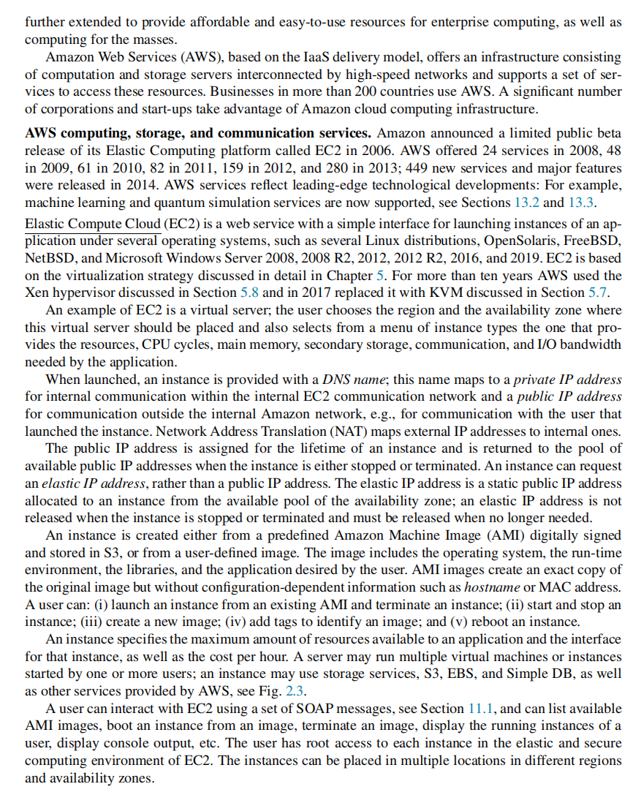
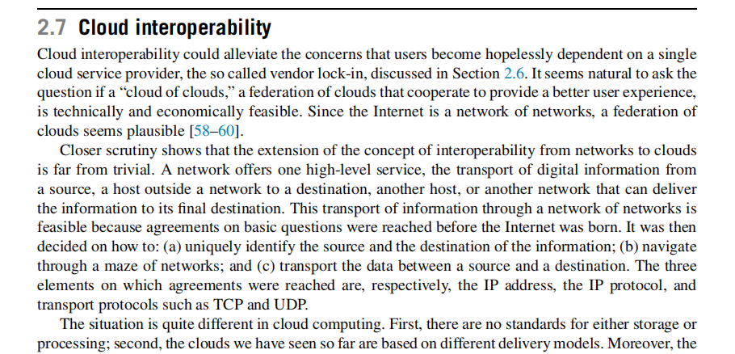

# Chapter 2 The cloud ecosystem

# Start

**1\. 标题及内容概括**  
**标题：**「云计算生态系统：从颠覆性创新到核心关键角色的协同」  
本部分内容主要介绍云计算生态系统的整体概念、云计算对IT行业的影响以及云计算在技术和商业层面带来的变革。通过对云计算中负载均衡理念演进、虚拟化模式下特权级和非特权级的区分、以及规模化云基础设施的弹性需求和节能诉求等方面的讨论，帮助我们理解云计算何以被视作颠覆性技术。此外，文中也概述了云计算的主要提供商（如亚马逊、谷歌、微软和IBM）及其在云计算时代的地位，以及与云计算生态系统相关的几个重要角色（服务消费者、服务提供者、审计者、经纪人与网络承载方）与层次结构（IaaS、PaaS、SaaS、资源抽象与控制层、物理资源层等），并简单提及后续章节将要详细讲解的服务等级协议（SLAs）、云互操作性、软件授权、用户体验等主题。

* * *

**2\. 逐点详解图片与文中知识点**

以下内容基于提供的两张截图所涉及的知识点与上下文展开详细解释。

### 2.1 云计算的颠覆性与影响

1.  **云计算作为颠覆性技术**
    
    *   文中指出，云计算带来了颠覆性的影响（disruptive technology），这是因为它不仅在技术层面改变了传统IT基础设施的使用和部署方式，更在商业模式和产业规模上产生了深远影响。
    *   其颠覆性可以从经济价值量化方面理解：未来企业在云计算上的投入预计达数十亿甚至上万亿美元规模。这样的商业规模和投资额本身就说明了云计算在企业级应用中所扮演的重要角色。
2.  **云计算与CO₂排放的争议**
    
    *   有一种观点认为，云计算会带来IT行业大量的能耗与碳排放，因为运行大规模数据中心需要消耗相当可观的电力。
    *   然而，作者提出这一点还比较复杂并需要进一步探讨。例如，一些集中化的大数据中心在资源利用率和能耗管理上相比分散式小型机房可能更具优势；云平台的自动伸缩和负载管理也可能带来更有效的能源使用。这些因素使得云计算对IT行业碳足迹的实际影响更微妙（more subtle）。

### 2.2 云计算对计算机系统与软硬件技术的“变革性”影响

1.  **云计算对几乎所有计算领域的影响**
    
    *   影响涉及算法、计算机软件和硬件、数据库系统、网络、操作系统等。换言之，云计算并非只是提供远程服务器或在线存储，而是改变了IT系统的设计理念和实现方式。
    *   在后续章节（从2.1到2.13以及其他章节）中，会分别讨论这种量化与质变带来的挑战，比如硬件层面如何支持安全的虚拟化、软件架构如何演进以满足大规模分布式管理需求等。
2.  **负载均衡（Load Balancing）理念的演进**
    
    *   传统负载均衡：在系统拥有大量组件时，尽可能把工作负载平均分布到各个组件上，以确保每个组件承担的负载相当，从而提高整体吞吐量和可靠性。
    *   新的云负载均衡关注点：不只追求负载分布的平均，还要尽量**减少能耗（energy consumption）**。具体而言，会将工作量集中在最少数量的服务器上（尽可能提高单台服务器的利用率），而将其他服务器切换到节能模式，从而降低整体的用电需求。这体现了云计算在资源调度和能耗管理上更高层次的优化策略。
3.  **虚拟化中的特权模式与非特权模式**
    
    *   传统架构：操作系统内核运行于特权级（privileged kernel mode），应用程序运行于非特权级（user mode）。
    *   虚拟化架构：在云环境中，底层由\*\*Hypervisor（虚拟机管理程序）\*\*管理物理资源，内核和应用都在虚拟化环境中运行。
    *   由于存在多重虚拟环境，硬件需要支持不同级别的保护和管理（比如Intel VT-x或AMD-V等技术），确保在虚拟化场景下也能安全隔离并执行各种权限级别的操作。这就需要硬件具备可信执行模式（trusted execution mode），从而保证不同云租户间的安全隔离。

### 2.3 云计算基础设施的大规模和资源管理

1.  **云基础设施的规模（Scale）**
    
    *   大规模云计算基础设施面临两个挑战：
        1.  系统必须具备**弹性（elasticity）**，能够快速适应业务负载的骤增或骤减。
        2.  同时必须**尽量降低能源消耗**，包括通过动态关停空闲机器或调整资源分配以减少浪费。
    *   这意味着云系统需要对计算、存储和网络资源进行高度智能化和动态的调度与管理。
2.  **隐藏复杂性，提供简化接口**
    
    *   对最终用户而言，云服务以简单易用、高性价比的接口呈现，如低成本且高服务级别的SaaS应用、可快速部署的PaaS环境、按需租用的IaaS等。
    *   这些对外提供的“易用界面”背后是复杂的资源管理、自动化编排与协同调度机制，云计算的核心价值在于让用户无需关心底层基础设施的复杂性。
3.  **主要云服务提供商**
    
    *   文中提到，亚马逊（Amazon）、谷歌（Google）、微软（Microsoft）以及IBM是目前云计算市场的主要玩家。其中前三者在相当长的一段时间里将主导云计算市场。
    *   后续章节会分析这些云提供商的具体服务模式（从IaaS到PaaS再到SaaS），以及它们在云市场中的战略与技术方案（2.2到2.5节）。
    *   同时，还会讨论云计算的互操作性与厂商锁定问题（2.6与2.7节）、服务等级协议（SLAs，2.8节）及云用户和云服务提供商在责任分担上的约定等内容。

### 2.4 云计算生态系统的核心角色与分层模型（根据Figure 2.1）

在第二张图片（Figure 2.1）中，展示了云计算生态系统里各角色以及云计算分层架构，主要遵循NIST对云计算的定义与角色划分。图示要点如下：

1.  **角色（Entities）**
    
    *   **Service Consumer（服务消费者）**：云服务的最终使用者，可以是个人用户或企业。
    *   **Service Provider（服务提供者）**：提供云服务的实体，如AWS、Azure、Google Cloud等。其内部又分为不同的功能层：
        1.  **Service Layer（服务层）**：包括SaaS、PaaS、IaaS三大服务模式。
        2.  **Resource Abstraction and Control Layer（资源抽象与控制层）**：负责对底层资源（计算、存储、网络等）的抽象化，以及各种管理调度功能，比如虚拟化、容器化等技术的具体实现。
        3.  **Physical Resource Layer（物理资源层）**：包括硬件（Hardware）和设施（Facility），即数据中心中的实际服务器、存储、网络设备以及配套环境（供电、制冷等）。
        4.  **Service Management（服务管理）**：包括业务支持（Business support）、资源配置（Provisioning）、可移植性/互操作性（Portability/Interoperability）等组件，用于管理云服务的运营、计费、监控、服务部署等事宜。
    *   **Broker（经纪人）**：提供中介服务、聚合服务或套利服务（Intermediation、Aggregation、Arbitrage），帮助用户整合多个云服务供应商的服务，或根据用户需求自动选择最合适的云资源等。
    *   **Auditor（审计者）**：执行安全审计（Security audit）、隐私影响审计（Privacy impact audit）以及性能审计（Performance audit）等工作，确保云服务运营合规、安全高效。
    *   **Carrier（网络承载方）**：为服务提供者、服务消费者、经纪人、审计者等角色提供网络连接和传输渠道，确保云服务通过互联网或专用网络进行交互与访问。
2.  **安全（Security）与隐私（Privacy）**
    
    *   图中在服务提供者部分特别标出了Security和Privacy两条独立“支柱”，表明云服务必须在架构设计和管理策略中系统地应对安全与隐私问题。
    *   服务提供商需要从物理安全、网络安全、虚拟化隔离、身份认证与访问控制、数据隐私保护等多方面入手。

### 2.5 后续章节概要

*   **2.9节和2.10节**：将分析用户体验（User experience）对云服务的影响，并深入探讨在云环境中如何提升用户满意度。
*   **2.11节**：聚焦软件授权（Software licensing），在云环境中如何管理许可模式，如按使用量付费或订阅制。
*   **2.12节**：介绍云计算所面临的主要挑战，包括数据安全、网络延迟、合规性、灾备、成本管理等。
*   **2.13节**：讨论云对企业生态系统的改变速度，以及给企业IT带来的机遇与风险，包括业务流程再造、技术创新速度加快等。

* * *

**3\. 本次内容小结**  
本部分主要揭示了云计算生态系统的基本面貌与主要角色，强调了云计算的颠覆性特征，以及在大规模虚拟化、负载均衡、能耗管理与数据中心运营等方面的关键技术转变。通过NIST模型，清晰地阐释了云服务的分层结构及核心实体的责任与功能，为后续深入了解云计算各层次与运营模式、SLA定义、互操作性与厂商锁定、用户体验及软件授权等问题提供了一个整体框架。在云计算的快速迭代与产业扩张中，对安全与隐私需求的重视也成为必然趋势，任何云服务都需要兼顾性能、业务需求与合规性。

* * *

**4\. 报错/不清晰内容说明**

*   本次图片内容均清晰可见，核心文字与图示信息已尽量完整解释，无明显缺失。若有更多细节或脚注(如文中脚注提及比特币挖矿对CO₂排放的影响等)需要进一步展开，可在后续章节或更详细文本资料中继续探讨。

# **2.1** **Cloud computing delivery models and services**

**1\. 标题与内容概括**  
**标题：**「云计算服务交付模式与生态角色详解：SaaS、PaaS、IaaS及DBaaS的特征与责任分担」  
本次内容重点在于根据NIST参考模型，介绍云计算生态系统中的各主要角色及其功能，并详细讨论了云计算的四种主要服务交付模式：SaaS（Software as a Service）、PaaS（Platform as a Service）、IaaS（Infrastructure as a Service）以及DBaaS（Database as a Service）。  
同时，材料阐述了如何进行云服务审计（audit）、不同云服务模式下的共享安全责任、以及基础设施即代码（IaC）对云应用开发和部署的重要意义。

* * *

**2\. 详细知识点解析**

以下结合图片与对应文字，分模块进行深入说明。

### 2.1 云计算主要角色（NIST参考模型）

1.  **Service Consumer（服务使用者/消费者）**
    
    *   与云服务提供商（CSP）建立业务关系并使用其服务。
    *   可能是个人用户、企业或各类机构，通过云平台获取计算、存储、应用等资源。
2.  **Service Provider（服务提供者）**
    
    *   向服务消费者提供可用的云服务，并负责底层资源的规划、运营和维护。
    *   如AWS、Azure、GCP等公有云，或者企业自建的私有云。
3.  **Carrier（承载方）**
    
    *   在云服务提供商和消费者之间提供网络连接和数据传输渠道。
    *   运营商或其它网络服务商通过互联网或专线将服务“送达”用户。
4.  **Broker（云经纪人）**
    
    *   管理云服务的使用、性能及交付；可为用户整合不同云服务供应商的资源，并负责供应商与消费者之间的关系协商。
    *   提供**中介服务**（Intermediation）、**聚合服务**（Aggregation）或**套利服务**（Arbitrage）等。
5.  **Auditor（审计者）**
    
    *   执行独立审计，以评估云服务的合规性和安全性，包括**安全审计**（security audit）、**隐私影响审计**（privacy-impact audit）、**性能审计**（performance audit）等。
    *   审计领域覆盖信息系统的运维、服务性能以及云计算实施的各个方面。

### 2.2 云服务审计（Audit）的重要性

*   \*\*审计（Audit）\*\*是一种系统化评估过程，用于衡量云服务是否符合既定的标准或规范：
    
    *   **安全审计**：评估云安全方案，如访问控制、加密、入侵检测等。
    *   **隐私影响审计**：评估云服务在数据收集、存储和传输过程中的隐私保障措施。
    *   **性能审计**：评估云服务在可用性、延迟、吞吐量等方面的运行效率。
*   在图2.1所示的生态中，审计对象包括：
    
    1.  **服务管理与配置**：如服务部署、呼叫中心、系统运维、QoS（服务质量）管理、账单结算、资产管理、SLA（服务等级协议）管理、技术支持与备份等。
    2.  **安全管理**：包括身份与认证、资质与合规检测、入侵防御、病毒防护、加密、物理安全、访问控制、审计跟踪、防火墙等。
    3.  **客户服务**：如线上帮助、订阅机制、商业智能、用户偏好、报告和个性化等。
    4.  **集成服务**：涉及数据管理、开发集成等。

### 2.3 云计算交付模式：SaaS、PaaS、IaaS、DBaaS

#### 2.3.1 SaaS（Software as a Service）

1.  **定义与特征**
    
    *   由云服务提供商集中托管软件并通过订阅模式向用户提供。
    *   用户通过网页或精简客户端访问应用程序，而不需要管理底层基础设施（包括网络、服务器、操作系统、存储等）。
    *   一般只提供有限的用户自定义配置，如账户管理、权限设置，或少量的功能插件。
2.  **典型场景与应用**
    
    *   企业常用业务系统：如ERP、CRM、办公协同、电子邮件、财务管理、文档处理等。
    *   适合需求周期短、参与人员较多或竞争对手也在使用类似软件的场景，如在线协同办公、临时项目协作、移动端快速访问等。
    *   尤其适用于**高并发**需求（如电商促销、账单或工资发放）与**无须实时本地处理**的应用场景。
3.  **局限性**
    
    *   不适合对实时性要求极高、或必须与大型本地系统深度集成的应用。
    *   用户对软件的自定义空间较小，核心开发与更新由服务提供商统一管理。

#### 2.3.2 PaaS（Platform as a Service）

1.  **定义与特征**
    
    *   提供可供用户创建、运行和管理应用程序的平台，支持一系列编程语言、开发工具和运行环境。
    *   用户无需管理底层硬件、操作系统和网络，只需关注应用的部署与配置。
    *   典型功能包括：会话管理、设备集成、沙箱环境、应用监控与测试、统一描述与发现（如UDDI、XML-based registry）等。
2.  **主要应用场景**
    
    *   适合需要快速开发、测试、部署的应用场景，例如团队协作的研发环境。
    *   可用于多租户应用、移动App后端、物联网数据处理等。
    *   当应用需要和特定语言、框架强绑定，而对底层环境自定义需求不高时，PaaS是较好的选择。
3.  **不足之处**
    
    *   与底层硬件或操作系统深度耦合的场景不太适合PaaS。
    *   部分PaaS平台使用专有技术或语言时，应用的可移植性会受到限制。

#### 2.3.3 IaaS（Infrastructure as a Service）

1.  **定义与特征**
    
    *   向用户提供基础计算资源，包括处理器、存储、网络设备以及可自定义的操作系统/虚拟机等。
    *   用户可以部署和运行任意软件，包含操作系统、应用程序和各种工具，拥有对基础资源的最大灵活度。
    *   IaaS具有**按需弹性扩容**、基于使用量计费以及多租户共享硬件等关键特征。
2.  **适用场景**
    
    *   当需求波动较大，需要灵活的底层资源管理时；或企业希望完整掌控部署环境、网络配置（如自定义防火墙、负载均衡策略）等。
    *   对DevOps成熟度要求较高，能够自行运维操作系统、安全策略与应用部署的团队。
3.  **特点与挑战**
    
    *   用户需要更专业的管理技能，应对系统安全、性能优化、故障排查、虚拟机/容器编排等；
    *   如果组织快速扩张或对资源控制要求高，IaaS通常是更有力的选择，但也意味着更多的管理成本。

#### 2.3.4 DBaaS（Database as a Service）

1.  **定义**
    
    *   数据库服务由云提供商在其物理基础设施上托管，用户通过API或管理界面来访问和操作数据库，而不需要自行部署数据库软件或硬件。
    *   具备**即时扩容**、**高性能保障**、**支持最新技术**、**自动容错和故障转移**等优点。
2.  **核心特征**
    
    1.  **Self-service**：无需复杂配置，即可快速申请、启停数据库实例；
    2.  **多租户与硬件无关**：在抽象层屏蔽了底层硬件，支持不同设备和地点访问；
    3.  **弹性与可扩展性**：可自动扩展数据库容量或计算能力；
    4.  **按使用付费**：资源计费与实际使用量挂钩；
    5.  **敏捷性**：可无缝适应新技术与额外需求，例如版本升级或数据分析插件等。
3.  **实施与挑战**
    
    *   DBaaS往往采用**多层架构**：用户界面层、应用层、数据存储层等；
    *   尽管对用户隐藏了数据库运维复杂性，但**多租户**环境中的资源管理和安全问题也更突出，需使用加密、访问控制、审计日志等手段。

### 2.4 三种云服务（SaaS、PaaS、IaaS）下的安全责任分担（图2.2与表2.1）

1.  **SaaS 模式**
    
    *   **用户主要负责**：用户访问权限（User Access）和数据管理（Data），以及与自身业务相关的应用数据安全策略。
    *   **服务商主要负责**：应用程序本身、操作系统、网络流量管理、虚拟化层（Hypervisor）、物理基础设施等。
2.  **PaaS 模式**
    
    *   **用户主要负责**：用户访问权限、数据和在平台上开发/部署的应用，部分平台配置。
    *   **服务商主要负责**：底层操作系统、网络流量管理、虚拟化和基础设施等。
3.  **IaaS 模式**
    
    *   **用户主要负责**：用户访问、数据、应用、操作系统、虚拟网络的配置（如安全组、路由规则），以及与之相关的安全策略。
    *   **服务商主要负责**：虚拟化层（Hypervisor）及物理层（服务器、存储、网络设备等）的安全与维护。

通过表2.1可以直观地看到，在**SaaS → PaaS → IaaS**的顺序中，用户对基础设施的掌控度依次升高，而云服务商在安全与运维层面负责的环节则相应减少。

### 2.5 云计算服务持续发展与架构趋势

1.  **多子系统与多层次的服务集成**
    
    *   云计算往往基于服务化（Service-oriented）或微服务（Microservices）架构，应用程序拆分成多个可独立部署和组合的服务，降低耦合度。
2.  **基础设施即代码（Infrastructure as Code, IaC）**
    
    *   通过脚本或高阶描述语言自动化管理与配置服务器、操作系统、数据库连接、存储等云基础设施。
    *   **主要优势**：一致性、可重复、效率提高、降低人工错误率、加速交付周期。
    *   **常见工具**：
        *   **Ansible**：可用于基础设施部署、配置管理、应用部署等；强调DevOps理念和自动化流程。
        *   **Terraform**：可在多云环境管理资源，使用“执行计划（execution plan）”的方式并行创建或修改资源，适合大规模多层次部署（如微服务、多集群、SDN等）。
3.  **微服务与容器化**
    
    *   云原生应用通常由离散的、可独立演进的微服务组成，开发者可使用容器来打包并随时在云环境中弹性部署。
    *   结合IaC可以快速实现应用迭代、版本管控与自动扩缩容。
4.  **云交付模式的未来**
    
    *   SaaS将持续成为应用交付的主流方式，更容易被普通用户或中小型组织所接受；
    *   IaaS将更多面向对IT基础设施有专业需求的个人或大型组织，存在一定程度的“厂商锁定”；
    *   PaaS在团队快速开发、测试、部署场景仍具优势；
    *   如果云标准化进一步完善，不同云间的**互操作性**与**迁移能力**将得到加强，减少对单一云厂商的依赖；
    *   随着数据库需求的不断提升，DBaaS将愈发普及，其多租户特性也会带来更多安全与隔离方面的挑战。

* * *

**3\. 本次内容总结**

*   **生态角色**：根据NIST参考模型，云生态中包含服务提供者、消费者、经纪人、承载方、审计者五大角色，各角色分工明确，相互协作。
*   **云审计**：围绕安全、隐私、性能等要素，对云服务进行系统化评估，保障云应用的合规性和可靠性。
*   **交付模式**：SaaS、PaaS、IaaS、DBaaS分别为不同层次的服务，用户对底层资源的控制权依次增加；服务商与用户的安全责任也随之变化。
*   **基础设施即代码与微服务**：代表云原生应用管理的新趋势，利用自动化、容器化和DevOps理念，有助于提高开发效率、降低运营成本、加速创新步伐。
*   **未来展望**：三大交付模式（外加DBaaS）将长期并存，云计算标准化与互操作性将逐步推进，而基础设施自动化和云原生应用将进一步引领云计算的演进。

* * *

**4\. 报错或不清晰之处**

*   本次提供的图片和文字内容已完整解读，未发现明显无法辨识的部分。如需更深入探讨具体SaaS/PaaS/IaaS的实践案例或IaC脚本示例，可结合后续章节或更完整资料进一步学习。

# **2.2**.1 **Amazon Web Services**

**1\. 标题与内容概括**  
**标题：**「亚马逊云服务（AWS）的核心组件与关键功能：从EC2到自动扩缩的完整生态」  
本次内容主要介绍了亚马逊Web服务（Amazon Web Services, AWS）的发展历程与核心服务，重点围绕IaaS层面的EC2弹性计算服务、S3对象存储、EBS块存储、SimpleDB非关系型数据库、SQS消息队列、CloudWatch监控、VPC虚拟私有云以及Auto Scaling自动扩缩功能展开讲解。通过这些服务，AWS为数百个国家和地区的企业与开发者提供了灵活、高可用、可扩展的云基础设施与工具。

* * *

**2\. 详细知识点解析**

以下依照截图与文中内容，结合上下文逐一进行全面、深入的讲解：

### 2.1 AWS 的起源与概述

1.  **商业背景**
    
    *   亚马逊早期作为一家大型电商企业，为满足其核心业务（在线销售书籍、CD、食品、家用电器等）的需求，搭建了功能强大的计算与存储基础设施。
    *   后来发现这套基础设施可以作为云服务对外提供，于是形成了AWS这样面向大众和企业的云计算平台。
2.  **AWS 的全球影响**
    
    *   AWS 在 2006 年率先推出了 Elastic Compute Cloud (EC2) 公测版，以IaaS 交付模式为主，为企业和个人开发者提供计算、存储、网络等基础云资源。
    *   如今，AWS 服务已覆盖全球 200 多个国家或地区，并在高性能计算、机器学习、量子模拟等前沿领域不断推出新功能。

### 2.2 AWS 核心服务体系

AWS 的服务大体可分为**计算（Computing）**、\*\*存储（Storage）**和**通信（Communication）\*\*三类核心产品，同时衍生出众多子服务和功能模块。

#### 2.2.1 Elastic Compute Cloud (EC2)

1.  **EC2 基本概念**
    
    *   EC2 是 AWS 提供的弹性计算服务，可快速创建虚拟服务器实例（又称“EC2实例”）。
    *   用户可从预定义的 Amazon Machine Image (AMI) 启动实例，也可上传自定义镜像。
    *   支持多种操作系统如 Linux 发行版（Ubuntu、Amazon Linux、Red Hat 等）、OpenSolaris、FreeBSD，以及各种版本的 Microsoft Windows Server。
2.  **运行机制**
    
    *   启动实例时，用户指定所属区域（Region）和可用区（Availability Zone），并选择实例类型（针对 CPU、内存、存储、网络带宽等性能需求）。
    *   每个实例会被分配内部 DNS 名（私有 IP，用于 AWS 内部通信）和公共 IP（用于外部网络访问）。若用户需要**固定公共 IP**，可使用 **Elastic IP**，可绑定到任意运行中的实例上。
3.  **实例管理与操作**
    
    *   用户可通过 SOAP 或 REST API（或 AWS 管理控制台）完成：列出可用 AMI、启动/终止实例、重启实例、查看实例控制台输出等操作。
    *   EC2还提供**弹性负载均衡（Elastic Load Balancing）**，可在多台实例之间分发流量；并可将私有 IP 与弹性 IP 动态映射，屏蔽单个实例故障。
4.  **底层虚拟化**
    
    *   早期 EC2 使用 Xen Hypervisor，2017 年后逐步迁移至基于 KVM 的“改进型虚拟化”。
    *   这些底层技术保证了多租户之间的隔离，并支持可观的资源利用率。

#### 2.2.2 Simple Storage Service (S3)

1.  **功能定位**
    
    *   S3 是一种对象存储服务，用于存放海量大小在 1 Byte ~ 5 TB 之间的对象，支持通过 HTTP/HTTPS（REST/SOAP接口）进行上传、下载、删除、列举等操作。
    *   数据以“对象”形式保存在“桶（Bucket）”中，Bucket 可以指定区域，名称在全局范围内唯一。
2.  **特性与限制**
    
    *   每个对象有**名称、修改时间、访问控制列表（ACL）、以及最多 4 KB 的用户自定义元数据**。
    *   S3 不支持对对象内容进行局部改写或移动（只能整体上传/下载）。
    *   通过**ETag**（通常是对象的 MD5 校验值）来检测对象在传输或存储过程中是否损坏。
    *   提供较高的持久性与可用性，并且支持设置**公共访问**或**私有访问**、访问权限管理等。

#### 2.2.3 Elastic Block Store (EBS)

1.  **用途与特点**
    
    *   EBS 为 EC2 提供**持久性块级存储**。EC2 实例可挂载一个或多个 EBS 卷（Volume）作为其磁盘分区来进行读写操作。
    *   适合数据库、文件系统、应用等需要**随机读写**和持久化数据的场景。
2.  **管理方式**
    
    *   卷大小可从1GB到数TB，创建在特定可用区内；
    *   EBS 卷仅能挂载到同一可用区内的实例上，无法跨区挂载；
    *   可对卷做**快照**（Snapshot），并在需要时用快照快速还原或复制到不同区域。

#### 2.2.4 Simple DB

1.  **服务定位**
    
    *   一种非关系型数据存储服务（NoSQL），支持灵活的键值对结构或简单查询，而非传统SQL结构。
    *   允许在多个地理位置存储数据副本，并具备自动化的基础设施维护、容量规划与索引优化能力。
2.  **适用场景**
    
    *   轻量级、高性能的web应用可使用 Simple DB 存储结构化或半结构化数据。
    *   AWS 后来也推出了更大规模、更强性能的 DynamoDB 和 Aurora 等替代/增强方案，但 Simple DB 在一些场景仍可用。

#### 2.2.5 Simple Queue Service (SQS)

1.  **消息队列服务**
    
    *   用于在分布式应用中传递消息，支持异步通信、解耦系统组件。
    *   允许多个EC2 实例或其他应用通过 SQS 的 REST 或 SOAP 接口发送/接收消息，不需复杂网络配置。
2.  **机制特点**
    
    *   **消息锁（Locking）**：消息被一个接收者读取后在一定时间窗口内被锁定，避免重复处理；超时后若没有确认处理完成，消息会再次可见。
    *   **安全访问**：可通过访问策略、IP限制等方式控制谁可以操作队列。
    *   适用于**分布式工作流**、**任务队列**或其他解耦应用场景。

#### 2.2.6 CloudWatch

1.  **监控与指标采集**
    
    *   一个监控服务，可以收集 CPU利用率、内存使用量、网络I/O、磁盘I/O 等指标。
    *   基础监控每 5 分钟采集一次，若需要更频繁的数据（1 分钟间隔）则属于付费的详细监控。
2.  **典型用途**
    
    *   监控 EC2 实例状态、EBS 卷可用空间、SQS 队列消息数量等；
    *   配合 Auto Scaling 使用，通过监控结果触发扩缩容策略。

#### 2.2.7 Virtual Private Cloud (VPC)

1.  **定义**
    
    *   允许用户在 AWS 云中创建一个逻辑上与其现有网络隔离的专用环境，通过VPN或其他方式将本地数据中心安全地桥接到云端。
    *   用户可配置子网（Subnets）、路由表、网络ACL、防火墙等，类似传统网络环境的安全组策略。
2.  **功能与优势**
    
    *   与传统 IT 基础设施无缝对接，可采用现有的安全服务、入侵检测系统、防火墙等；
    *   更灵活的网络控制，适合对网络拓扑和访问控制有严格要求的企业或组织。

#### 2.2.8 Auto Scaling

1.  **作用**
    
    *   自动根据监控指标或触发器，增加或减少 EC2 实例数量，从而维持应用的可用性与稳定性，优化成本。
    *   常与 CloudWatch 联动，通过设定**阈值**（例如 CPU 利用率超过 80%），触发扩容；或当利用率下降时触发收缩。
2.  **工作原理**
    
    *   用户事先定义一个**Auto Scaling Group**，包括最小、最大和期望数量的实例；并配置启动模板或配置（Launch Configuration）。
    *   当触发扩容时，Auto Scaling 会按照启动配置参数创建新的实例并加入负载均衡集群；
    *   当触发缩容时，会终止多余的实例。
    *   同时进行**健康检查**（如探测负载均衡器是否认为某实例已故障），一旦异常则可快速替换实例。

### 2.3 AWS 功能交互图 (Figure 2.3)

*   图中展示了**可用区**（Availability Zone）内部高带宽的网络互联（Cloud Interconnect），以及通过 NAT（网络地址转换）将内部 IP 映射到外部互联网 IP。
*   常见服务及其大致位置：
    *   **S3 / EBS / Simple DB** 代表存储服务；
    *   **Elastic Load Balancer**、**CloudFront（内容分发）**、**CloudFormation（资源编排）**、\*\*Elastic Beanstalk（自动平台部署）\*\*等都是围绕计算与应用生命周期管理的组件；
    *   **SQS**、**CloudWatch** 提供消息与监控功能。
*   这些组件紧密集成，共同构成一个可扩展且功能全面的云服务平台。

### 2.4 用户使用与管理AWS的方式

1.  **管理控制台（AWS Management Console）**
    
    *   提供基于网页的可视化界面，用户可以图形化地创建/管理 EC2 实例、配置网络、安全组、监控指标等。
2.  **API 接口**
    
    *   AWS 提供 RESTful 或 SOAP 接口，用户和第三方工具可编程方式调用以实现自动化部署和运维。
    *   同时配套有多种语言的 SDK（Python、Java、C#、Go等）。
3.  **CLI（命令行工具）**
    
    *   提供了 AWS CLI 工具，可以命令行管理各种 AWS 资源，非常适合批处理脚本或 DevOps 场景。

* * *

**3\. 本次内容总结**

*   **AWS 的背景与定位**：起源于亚马逊电商基础设施，通过 IaaS 模式对外开放，成为规模庞大、功能丰富的云服务平台。
*   **核心服务**：EC2、S3、EBS、SimpleDB、SQS、CloudWatch、VPC、Auto Scaling 等都围绕计算、存储、网络、消息、监控、安全等维度提供一站式解决方案。
*   **关键特性**：弹性伸缩（Auto Scaling）、高可用多区域部署、灵活的网络配置（VPC）、多种存储选项（S3 对象存储与 EBS 块存储）等使得 AWS 成为云计算行业的主导者之一。
*   **操作与管理**：用户可基于管理控制台、API、CLI 或 SDK 进行灵活的访问与资源编排；无论是快速启动小规模实例，还是大规模自动化部署，都能在 AWS 上实现。

AWS 生态仍在不断演进，后续还将进一步拓展服务范围，包括机器学习（SageMaker）、容器服务（ECS/EKS）、无服务器计算（Lambda）等，持续引领云计算创新。

* * *

**4\. 报错或不清晰之处**

*   本次图片和文本信息清晰，服务名称和功能介绍无明显缺漏。如需深度了解 AWS 上的更多高级服务或最佳实践，可在后续章节或专门的文档资料中再行探讨。

# **2.2.2** **Amazon Web Services**

**1\. 标题与内容概括**  
**标题：**「AWS 服务生态的扩展与演进：从核心云服务到无服务器计算与硬件优化」  
本部分内容介绍了亚马逊云服务（AWS）在 2012 年后逐步推出的重要服务与功能，包括 Route 53、Elastic MapReduce (EMR)、DynamoDB、ElastiCache、CloudFront、CloudFormation、Elastic Beanstalk 等，并进一步探讨了 AWS Lambda 的无服务器计算模式、AWS 的区域与可用区架构、网络和定价策略，以及随着 Nitro System 和多样化 EC2 实例家族的出现，AWS 在硬件与性能优化上的持续演进。

* * *

**2\. 详细知识点解析**

以下按照截图涉及的主要主题与服务，结合上下文进行深入说明。

### 2.1 2012 年后推出的关键服务

1.  **Route 53**
    
    *   **功能**：低延迟的 DNS（Domain Name System）服务，用于将用户请求路由到域名所对应的服务器或资源。
    *   **特点**：可管理公共 DNS 记录，并可与 AWS 其他服务集成实现健康检查、地理路由与全局负载均衡等高级功能。
2.  **Elastic MapReduce (EMR)**
    
    *   **功能**：在 EC2 上托管的 Hadoop 服务，为分布式批处理和大数据分析提供基础设施。
    *   **特点**：简化了 Hadoop 集群的部署、管理和扩容，可与 S3、DynamoDB 等其他 AWS 数据源协同处理大规模数据集。
3.  **Simple Workflow Service (SWS)**
    
    *   **功能**：一个可管理工作流、依赖关系和调度的服务，尤其适合多台 EC2 实例之间的任务分配与协同。
    *   **特点**：开发者可将各个步骤封装成“活动”（activity），由 SWS 进行编排、依赖管理并监控进度。
4.  **ElastiCache**
    
    *   **功能**：提供托管型内存缓存，支持 Redis 或 Memcached 等常见引擎。
    *   **优势**：通过把常用数据缓存在内存中，显著降低数据库或后端系统的读写压力，提升应用响应速度。
5.  **DynamoDB**
    
    *   **功能**：全托管、低延迟的 NoSQL 数据库，具有高可扩展性与高性能。
    *   **特点**：无需预置固定容量，可在存储规模及读写吞吐上自动扩展，支持细粒度的访问控制和数据加密。
6.  **CloudFront**
    
    *   **功能**：CDN（Content Delivery Network）服务，将静态或动态内容缓存到遍布全球的边缘节点，降低用户访问延迟。
    *   **典型使用场景**：为网站、视频流或 API 提供就近加速访问，也可与 S3、EC2、Elastic Load Balancer等搭配使用。
7.  **Elastic Load Balancer (ELB)**
    
    *   **功能**：在多台 EC2 实例或容器服务之间分发网络流量，支持健康检查、SSL卸载、会话保持等功能。
    *   **优势**：可自动识别故障实例并将流量切换到其他健康实例，大大提升应用的可靠性与扩展性。

### 2.2 基础设施自动化：CloudFormation & Elastic Beanstalk

1.  **CloudFormation**
    
    *   **作用**：可以使用 JSON 或 YAML 模板描述应用需要的 AWS 资源及其之间的关系，称为一个“Stack”。
    *   **流程**：用户编写模板 → 设置可参数化选项（如实例类型、端口号等） → 部署 Stack → AWS 自动按顺序创建或更新相应资源。
    *   **好处**：基础设施即代码（IaC）的典型实践，便于版本控制、重复部署以及跨环境一致性。
2.  **Elastic Beanstalk**
    
    *   **定位**：面向应用全生命周期的 PaaS 式平台，自动处理部署、容量规划、负载均衡、Auto Scaling、监控等功能。
    *   **使用方式**：
        1.  上传应用（例如 Java WAR 包、PHP/NET 程序或容器镜像）；
        2.  Elastic Beanstalk 会自动在合适的 EC2 实例上启动并配置应用；
        3.  提供简易的回滚、版本管理、查看日志和监控等。
    *   **优势**：开发者只需关注代码，且可在后台自定义扩容策略、网络配置等；也能与 CloudWatch 报警联动。

### 2.3 Serverless 计算：AWS Lambda

1.  **概念与特点**
    
    *   AWS 在物联网（IoT）和事件触发场景需求上推出的\*\*无服务器（Serverless）\*\*计算服务。
    *   与 EC2 按时计费的方式不同，Lambda 按照实际执行时间来计费，粒度可细化到毫秒级。
2.  **工作流程**
    
    *   开发者将函数代码上传到 Lambda（或直接在控制台编写），指定运行环境（Node.js、Python、Java 等）、内存限制、超时时间等；
    *   触发源（Trigger）可来自 S3、DynamoDB、Kinesis 流等事件；当事件发生时，Lambda 会自动启动相应数量的运行环境来执行函数，无需手动管理服务器实例。
3.  **适用场景**
    
    *   周期性短任务、事件驱动的实时处理（例如图像处理、日志分析）、微服务中的后端逻辑等；
    *   对开发者而言，大大降低了运维负担，只需为实际执行消耗付费。

### 2.4 全球部署：Regions 与 Availability Zones

1.  **Regions（区域）**
    
    *   AWS 在世界各地设立了 28+ 个区域（数据中心集群），每个区域内可能包含若干可用区（Availability Zones，AZ）。
    *   区域间的资源相互独立，主要出于故障隔离和合规性考虑。用户可根据成本、延迟、法规或容灾需求选择合适的区域部署。
2.  **Availability Zones（可用区）**
    
    *   每个区域至少有两个 AZ，通常彼此间通过高速低延迟网络互联（峰值可达 25 Tbps）。
    *   数据如 S3 会自动在同一区域的 AZ 间多副本同步；EBS 卷在单个可用区内部冗余。
    *   关键应用应跨可用区进行部署，以应对单点机房故障。
3.  **网络与计费**
    
    *   大多数区域间使用私有光纤或高级网络直连来提高带宽、减小延迟、降低公共互联潜在的问题。
    *   AWS 在不同区域的定价可能不同，通常分为低、中、高和极高四个层级，对应机房运营、能源、通信和维护成本差异。
4.  **AWS Networking 细节**
    
    *   单个可用区内的通信延迟可低至 1~2 毫秒甚至更低；底层通过单根 I/O 虚拟化（Single Root I/O Virtualization）技术加速网络访问。
    *   针对客户管理资源的方式，AWS 提供：
        1.  **Web 控制台**
        2.  **命令行工具（CLI）**
        3.  **各种编程语言的 SDK** (Java, PHP, C#, Python, Go 等)
        4.  **原生 REST API**
    *   用户可选择最合适的方式自动化、脚本化或可视化管理云资源。

### 2.5 AWS 的演进：Nitro System 与多样化 EC2 实例家族

1.  **AWS Nitro System**
    
    *   下一代 EC2 实例的平台架构，通过将核心虚拟化功能“卸载”到专门的硬件，加速网络、存储和管理操作并减小 Hypervisor 的开销。
    *   好处包括：更高的计算性能、更好的安全隔离、可提供几乎接近裸机的性能。
2.  **EC2 实例家族分类**  
    AWS 根据不同的工作负载需求，提供了多种实例类型，每种类型有若干系列/版本，常见的分类和示例包括：
    
    1.  **通用型（General Purpose）**
        
        *   **A1 / M6g**：基于 AWS Graviton / Graviton2（ARM）芯片，综合计算、内存与网络性能；
        *   **T3 / T3a**：突发式通用实例（在 CPU 利用率较低时积累积分，必要时可爆发更高 CPU 频率）。
    2.  **计算优化（Compute Optimized）**
        
        *   **C6g**：基于 Graviton2，适合 CPU 密集型应用；
        *   **C5n**：Intel Xeon Platinum，支持 AVX-512 指令集，适合高性能计算、批处理等。
    3.  **内存优化（Memory Optimized）**
        
        *   **R6g**：Graviton2 的高内存机型；
        *   **X1e**：Intel Xeon E7，最高可达数 TB 内存；
        *   **R5a**：基于 AMD EPYC，提供较大内存与较高性价比。
    4.  **加速计算（Accelerated Computing）**
        
        *   **P3 / P2**：包含高性能 GPU（NVIDIA Tesla V100、K80 等），适合深度学习、科学计算。
        *   **G4 / G3**：搭载图形处理 GPU（NVIDIA T4、M60），适合图形渲染、视频转码、机器学习推理等。
    5.  **存储优化（Storage Optimized）**
        
        *   **I3 / I3en**：Intel Xeon，配备本地 NVMe SSD，适合低延迟、高吞吐量的数据库或大数据处理。
        *   **H1**：可提供最多 16 TB 的 HDD，本地存储，针对海量顺序读写负载。
3.  **实例规格说明**
    
    *   每个实例类型定义了 vCPU 数量、内存（GiB）大小、存储方式、网络带宽等；
    *   vCPU（虚拟 CPU）对应硬件线程，内存则以 GiB（1 GiB = 2^30 Byte）计；
    *   不同实例在超线程、NUMA、GPU 加速、网络增强等方面各有差异，应结合应用负载进行选择。

### 2.6 其他重要点

1.  **AWS Licensing Agreement（AWSLA）**
    
    *   允许 AWS 在某些条件下终止对客户的服务，也禁止用户将 AWS 用于非法或具攻击性、诽谤性等用途。
    *   对内容存储（如 S3 上的对象）也有相关限制，禁止传播违法信息。
2.  **性能与科学计算**
    
    *   AWS 也在不断强化对 HPC（高性能计算）和科学工程应用场景的支持，如通过自研的硬件加速、大规模 GPU/AI 加速实例来提升算力。
3.  **区域与可持续发展**
    
    *   部分区域（如 AWS GovCloud 或欧盟的法兰克福地区）采用 100% 碳中和能源，表明 AWS 在能耗管理和可再生能源使用上也在持续升级。

* * *

**3\. 本次内容总结**

*   **服务扩展**：AWS 在 2012 年后不断推出新的服务，从 DNS、数据分析、全托管数据库到自动化部署、无服务器计算等，为客户提供了覆盖应用全生命周期的工具。
*   **自动化与无服务器**：CloudFormation、Elastic Beanstalk 以及 Lambda 等服务大大简化了资源管理与后端运维，使开发者将更多精力聚焦在应用逻辑。
*   **全球布局与网络**：通过多地区（Region）多可用区（AZ）的全球部署与高速互联，AWS 提供了较低延迟、高可用和弹性扩展的基础环境。
*   **持续硬件演进**：AWS Nitro System 和多样化的 EC2 实例家族（通用型、计算优化、内存优化、加速计算与存储优化）满足不同应用场景的性能需求，也展现出 AWS 在硬件和虚拟化技术方面的不断创新。
*   **未来走向**：AWS 依托其基础设施规模和研发投入，将继续推进云服务的功能扩展与性能优化，为从企业级应用到科学计算场景的各类用户提供更多选择与可能。

* * *

**4\. 报错或不清晰内容**

*   本次图片信息与文字基本完整，无明显缺漏或无法辨识之处。如需进一步了解具体实例类型定价或各区域可用性，可参考 AWS 官方文档或管理控制台中实时更新的资源与定价信息。

# **2.3** **Google Clouds**

**1\. 标题与内容概括**  
**标题：**「Google Cloud 平台：从自主硬件、Kubernetes，到 AI 与无服务器应用的全面布局」  
本部分主要介绍了 Google 在云计算方面的技术与产品，包括 IaaS、SaaS、PaaS 不同层级的多项服务（如 Google App Engine、Compute Engine、Container Engine、Cloud Storage 等），以及其在人工智能与大数据领域的主要服务（如 Cloud ML、BigQuery、Cloud Dataflow、Pub/Sub 等）。同时，文本也描述了 Google 对基础设施和自研硬件的开放态度、大规模数据中心与容器编排技术，以及广泛的消费级与企业级应用（Gmail、Google Docs、Calendar、Drive 等）。最后，也讨论了 Google 的研发文化、对数据管理与互操作性的思考、以及与苹果在云生态中的差异。

* * *

**2\. 详细知识点解析**

以下结合截图和原文内容，分条对 Google 云平台的关键服务与理念进行深入说明。

### 2.1 Google 在云计算领域的地位与技术创新

1.  **AI 与机器学习先驱**
    
    *   谈到 Google Cloud，常会提到其在 AI/ML 方面的开创性贡献，如 **TPU**（Tensor Processing Unit）硬件的研发与应用，将其大规模部署到某些实例中。
    *   Google Research Division 公开了许多关于硬件、软件和算法的研究论文，也促使云计算技术不断演进。
2.  **数据中心与集群规模**
    
    *   Google 的基础设施由大量在全球多个地理位置布置的大型集群（cluster）组成。每个集群可包含 1 万台以上的服务器，支撑了多种异构工作负载（CPU 密集型批处理、内存型数据库、延迟敏感型应用等）。
    *   Google 强调其对服务器硬件和分布式系统的深入研发，如自研网络硬件、超大规模存储系统等。

### 2.2 Google Cloud 的服务形态

Google 主要集中在 IaaS（Compute Engine 等）、PaaS（App Engine 等）和 SaaS（如 Gmail、Google Drive、Docs、Calendar 等）三个层面，此外还提供了大量辅助工具、网络与数据服务。

#### 2.2.1 App Engine (AE)

1.  **定位**
    
    *   早期是 Python-only 的托管平台，后来添加了对 Java、Go、PHP 等语言的支持。
    *   可用来快速开发和部署 Web 或移动端后端，运行在 Google 自己的服务器上，不用关心底层基础设施。
2.  **数据库与查询**
    
    *   最初提供了 GQL（Google Query Language），类似于 SQL 的查询方式；
    *   通过 App Engine 服务集成搜索、存储、网络等多功能，适合小到微实例，大到 32 vCPU + 208GB 内存的配置。
3.  **操作系统支持与管理工具**
    
    *   Compute Engine (CE) 目前支持多种操作系统：Debian、CentOS、CoreOS、SUSE、Ubuntu、Red Hat、FreeBSD、Windows Server 等。
    *   可以利用 **Google Cloud Console**、**Cloud SDK（gcloud CLI）**、或 **API** 来创建和管理实例。

#### 2.2.2 Compute Engine (CE)

1.  **IaaS 实例**
    
    *   面向更灵活、更底层的需求，用户可以自定义虚拟机配置、镜像、网络和存储。
    *   支持挂载可扩容 SSD 块存储（最大 64 TB），并且提供高度加密的 SSD 持久盘。
2.  **部署与工作负载**
    
    *   适用于需要对底层操作系统、网络端口、虚拟机参数进行精细化控制的应用场景；
    *   提供图形化的控制台和命令行工具，也可通过 REST / gRPC API 实现自动化操作。

#### 2.2.3 Container Engine (GKE)

1.  **简介**
    
    *   又称 **Google Kubernetes Engine (GKE)**，是基于 Kubernetes 的容器编排平台。
    *   **Container Registry** 提供托管 Docker 镜像存储，GKE 根据 YAML/JSON 配置文件自动部署容器，管理副本数、CPU/内存配额等。
2.  **功能与优势**
    
    *   支持自动伸缩、滚动升级、高级网络配置、负载均衡等；
    *   **Service Level Agreement**（SLA）可达 99.5% 或更高，满足大规模容器化应用对稳定性与可用性的需求。

#### 2.2.4 Cloud Functions (CF)

1.  **Serverless 函数**
    
    *   与 AWS Lambda 类似的无服务器计算服务，通过事件驱动（如触发器）来执行短时函数；
    *   采用 Node.js 运行时环境，可快速响应来自 Cloud Storage、Pub/Sub、HTTP 请求等的事件。
2.  **应用场景**
    
    *   适合分布式微服务、实时数据处理、事件驱动工作流等，小体量、高并发且无需手动管理服务器。

#### 2.2.5 Cloud Storage / Bigtable / Datastore

1.  **Cloud Storage**
    
    *   面向对象存储的服务，支持多区域副本、版本管理与访问控制。
    *   常用于网站静态内容、图片、视频或归档数据等场景。
2.  **Cloud Bigtable**
    
    *   分布式高性能 NoSQL 数据库，适合海量数据的低延迟读写，如物联网数据、时间序列分析、广告跟踪等。
    *   Google 内部著名的分布式存储系统 Bigtable 的商用云版本。
3.  **Cloud Datastore**
    
    *   高度可扩展的 NoSQL 数据库，适用于 Web 和移动应用的结构化数据存储。
    *   提供自动分片与复制，结合 App Engine 可更轻松构建应用。

#### 2.2.6 大数据与分析产品

1.  **BigQuery**
    
    *   Fully-managed 企业级数据仓库，可对海量数据执行超快 SQL 查询；
    *   按查询数据量计费，适合 BI 报表、分析和数据可视化。
2.  **Cloud Dataflow**
    
    *   基于 Apache Beam 的大数据处理服务，支持批处理与实时流处理；
    *   与 BigQuery、Pub/Sub、Cloud Storage 等无缝集成，简化ETL流程。
3.  **Cloud Pub/Sub**
    
    *   全球可用的消息中间件（MQ）服务，支持高吞吐低延迟的消息分发、订阅（发布订阅模型）。
    *   适合跨系统或跨服务解耦通信，支持与 Dataflow 或 Cloud Functions 联动处理数据流。
4.  **Cloud Datalab**
    
    *   面向大数据分析与可视化的交互式工具，基于 Jupyter Notebook。
    *   可访问 BigQuery、Cloud ML APIs 等，支持 Python 环境下的数据探索与建模。

### 2.3 Google Cloud 网络与安全

1.  **Cloud Virtual Network (CVN)**
    
    *   虚拟私有网络，允许用户在 Google 云上创建隔离环境，并可通过 VPN 或专线连接到本地数据中心。
    *   Google 路由器使用 BGP 动态更新路由，实现用户自定义拓扑、多点互联。
2.  **Cloud DNS**
    
    *   低延迟、可伸缩的权威域名系统，为 Google 全球网络提供名称解析。
3.  **安全与 IAM**
    
    *   **Cloud Identity and Access Management (IAM)**：提供对资源的精细化权限控制；
    *   **Cloud KMS**：Key Management Service，用于管理加密密钥（如 AES-256）周期；
    *   **Cloud Security Scanner**：扫描 App Engine 应用的常见安全漏洞，如 XSS、旧库依赖等。
4.  **Cloud SDK 与开发工具**
    
    *   **gcloud** 命令行工具、**gsutil**（访问 Cloud Storage）、**bq**（操作 BigQuery）等；
    *   **Cloud Source Repositories**：基于 Git 的私有代码管理，与多种 IDE（如 Android Studio、VS Code、Eclipse 等）集成。
5.  **Stackdriver 套件（现为 Google Cloud Operations）**
    
    *   **Stackdriver Monitoring**：性能、可用性指标采集；
    *   **Stackdriver Logging**：集中式日志收集；
    *   **Stackdriver Debugger / Profiler**：在线调试与分析工具；
    *   **Error Reporting**：聚合应用异常信息并提供调用栈分析。

### 2.4 Google 的机器学习服务

1.  **Cloud Machine Learning（AI Platform）**
    
    *   基于 TensorFlow 的托管式训练与模型部署平台，可在 Google 云上快速构建并扩展机器学习模型。
    *   支持多种类型数据，自动扩缩容训练集群，提供预测服务 API 等功能。
2.  **Natural Language API**
    
    *   利用神经网络模型对文本进行情感分析、主题分类、实体识别等；
    *   常用于社交媒体监测、文本自动标签或客服问答场景。
3.  **Speech API / Vision API**
    
    *   **Speech**：语音识别，将音频转换成文本；
    *   **Vision**：图像识别和分析，包括对象检测、OCR、图像标签、情感检测等。

### 2.5 广泛的消费者级应用

1.  **Gmail**
    
    *   面向个人免费使用、企业付费升级（Google Workspace）；
    *   强大的防垃圾邮件与多平台访问特性，提供从 Lotus Notes、Exchange 迁移的工具。
2.  **Google Docs / Sheets / Slides**
    
    *   在线文档、表格和演示文稿编辑，支持多人实时协作与版本控制。
    *   与 Office 格式兼容，可导入/导出多种格式文件。
3.  **Google Calendar**
    
    *   浏览器或移动端查看日程、创建事件、共享日历、设置提醒等；
    *   可与 Outlook 等同步，支持多种提醒方式（短信、桌面弹窗、邮件等）。
4.  **Google Drive**
    
    *   跨平台的云端存储与同步服务，个人版免费容量 15GB（与 Gmail、Photos 共享），也可付费升级到更高配额；
    *   提供团队盘和权限管理，适用于企业协同。
5.  **Picasa (已整合到 Google Photos)**、**Google Groups**、**Google Base (已下线)** 等
    
    *   Picasa 曾是管理、编辑与分享图片的工具；后来功能合并到 Google Photos；
    *   Google Groups 提供讨论组和邮件列表功能；
    *   Google Base 允许用户加载半结构化数据进行查询与搜索，目前已被弃用或整合到其他服务中。

### 2.6 Google 云生态背后的理念与对比

1.  **底层自研硬件与分布式基础设施**
    
    *   Google 长期采用“自下而上、工程师驱动”的方式，构建自研网络交换机、分布式存储系统（如 GFS/Colossus）、调度系统（Borg/Kubernetes）等。
    *   其大规模设施与灵活授权策略使得云上服务和开发者工具得以快速迭代和开放。
2.  **与苹果的生态差异**
    
    *   相比苹果自上而下的封闭硬件与严格的开发者规则，Google 更注重多端兼容和开源生态，Android 系统和云服务更具“多样性”，但也可能带来体验不一致或碎片化问题。
    *   跨平台兼容性与云端协作是 Google 产品的主要特色，面向企业和个人都提供相对开放的云服务接口。
3.  **数据管理与互操作性**
    
    *   Google 托管庞大数据，对各类应用提供数据库与分析服务，但数据的互操作性（semantic integration）仍是一大挑战，尤其在多云或跨平台场景下；
    *   部分情况需要更灵活的“dataspaces”概念，以在云端实现共存而非严格的数据模式集成。

* * *

**3\. 本次内容总结**

*   **多层次云服务**：Google 同时在 IaaS、PaaS、SaaS 层面投入，为开发者和企业提供从底层虚拟机、容器编排到全托管应用的各种选择。
*   **广泛的产品矩阵**：从 App Engine、Compute Engine 到大数据、AI、容器管理、协作办公工具（G Suite/Workspace）等，形成了丰富的云生态。
*   **技术理念**：Google 以工程师驱动、开源协作（Kubernetes、TensorFlow 等）和自研硬件带来了高效大规模部署能力，与持续创新的云服务组合。
*   **用户与开发者**：无论是个人用户（Gmail、Docs、Drive 等），还是企业/开发团队（GCE、GKE、Cloud Functions、AI Platform），都能在 Google 云找到相应的需求场景。
*   **挑战与未来**：在多云与混合云环境愈发普及的当下，Google Cloud 仍需积极完善跨平台互操作性、企业级迁移工具和数据集成方案，以在竞争激烈的云市场中进一步扩张。

* * *

**4\. 报错或不清晰内容**

*   截图内容已完整覆盖，无明显缺失或模糊之处。若需深入了解具体收费详情、各服务的区域可用性或更多 AI 相关 API，建议查阅 Google Cloud 官方文档以获取最新信息。

# **2.4** **Microsoft Windows Azure and online services**

**1\. 标题与内容概括**  
**标题：**「Microsoft Azure 平台架构与核心服务：从角色模型到分布式控制」  
本次内容介绍了微软的云平台 Azure（早期称作 Windows Azure）及其在线服务。Azure 提供了 PaaS 和 SaaS 两种交付模式，其中 “Windows Azure” 作为操作系统形态的云平台，SQL Azure 作为云端化的 SQL Server，Azure AppFabric 作为云应用的集合性服务。Azure 的基础架构包含了计算（Compute）、存储（Storage）、Fabric Controller（资源管理与调度）、内容分发网络（CDN）和连接组件（Connect）等核心要素，并采用“角色（Role）实例”来区分不同类型的云应用运行模式。

* * *

**2\. 详细知识点解析**

### 2.1 Azure 的核心组件（图2.4）

根据图2.4，Azure 平台由以下关键部分组成：

1.  **Compute（计算层）**
    
    *   用于运行云端应用程序的环境，部署在服务器集群上，为用户提供可扩展的计算能力。
    *   运行在虚拟机或角色实例上，由 Fabric Controller 统一管理负载、故障检测和资源分配。
2.  **Storage（存储层）**
    
    *   提供可扩展的持久化存储，Azure 采用 **Blobs**、**Tables**、**Queues** 等不同形式来满足多种数据访问需求：
        *   **Blobs**：存储大对象（如图像、视频、文档），可达 1 TB 级别；可附带元数据，用于描述对象的基本信息。
        *   **Tables**：类似 NoSQL 的键值存储，适合结构化或半结构化数据的快速读写。
        *   **Queues**：消息队列服务，用于在 **Web Role** 与 **Worker Role** 间实现异步通信或任务调度。
    *   Azure 存储可被角色实例视作本地 NTFS 文件系统使用，从而提供简化的存储访问方式。
3.  **Fabric Controller（织物控制器）**
    
    *   实际上是一个分布式应用管理器，掌握了 Azure 资源（计算、存储、网络、负载均衡）的总体状态。
    *   部署、管理并监控运行在 Azure 上的各类应用；决定新的应用和实例该被放置在哪些物理服务器上，以优化利用率与性能。
    *   通过读取应用的 XML 配置文件（其中包含角色实例数量、所需资源等），动态分配或回收虚拟机与负载均衡器等资源，实现自动伸缩和高可用。
4.  **CDN（内容分发网络）**
    
    *   保持常用数据的缓存副本，降低应用访问延迟、提升用户体验。
    *   适合全球范围分发的静态文件，如图片、视频、脚本等。
5.  **Connect（网络连接子系统）**
    
    *   实现应用与用户系统之间的 IP 连接，使应用能直接在云端与本地网络或其他服务通信。
    *   方便混合云场景下的私有网络对接或跨地域的分布式部署。

### 2.2 Azure 的主要服务模块

1.  **Live Services**
    
    *   包括微软线上服务，如 Outlook.com、OneDrive（早期 SkyDrive）、Messenger 等，为个人和企业提供在线应用。
2.  **SQL Azure**
    
    *   云端 SQL Server，提供关系型数据库服务（Database-as-a-Service, DBaaS）。
    *   用户无需管理底层硬件或安装 SQL Server，直接在云端使用 T-SQL、事务等熟悉的数据库功能。
3.  **AppFabric**
    
    *   提供云应用集合性服务，包括 Service Bus（消息与事件）、Access Control（身份认证与授权）等组件。
    *   简化跨防火墙或异构环境的系统集成，也能帮助开发者快速构建分布式组件和工作流。
4.  **SharePoint**
    
    *   协同办公与文档管理平台，具备团队站点、文档库、企业级内容管理、工作流程等功能；也能在云端部署。
5.  **Dynamics CRM（Customer Relationship Management）**
    
    *   微软的客户关系管理软件，带有销售、客户服务、市场营销等模块，可在云端作为 SaaS 服务使用。

### 2.3 角色（Role）模型与应用部署

Azure 采用“**角色（Role）**”概念来抽象不同类型的云应用进程，每种角色都可运行多个实例，实现自动伸缩与负载均衡。

1.  **Web Role**
    
    *   面向前端或对外提供服务的角色实例，通常运行 IIS（Internet Information Services）服务器，以处理 HTTP/HTTPS 请求。
    *   适合承载网站、REST API 等场景。
2.  **Worker Role**
    
    *   背景任务或后端处理角色实例，可运行用户自定义的 .NET、Windows 代码，如计算任务、数据处理、队列监听等。
    *   通过与 **Web Role** 共享的 **Queue** 来异步接收工作项，实现解耦与分布式处理。
3.  **VM Role**
    
    *   运行自定义的 Windows Server 2008 R2 镜像，给用户更多底层控制权；
    *   用户可在虚拟机上安装特定软件或进行更细粒度的配置。不过 VM Role 在 Azure 早期是提供的选项，目前已逐渐被普通 VM（IaaS 虚拟机）所取代或改进。

### 2.4 自动伸缩、负载均衡与 Fabric Controller

*   **Fabric Controller**负责集群级调度和资源优化：
    
    *   根据配置文件中的 XML 描述，决定每个角色需要多少实例、分布在何处；
    *   负责监控角色实例状态，一旦检测到故障或过载，会在其他物理节点上启用新的实例；
    *   提供自动伸缩、负载均衡和内存管理机制，保证应用可用性和弹性。
*   应用开发者只需要在部署时指定角色类型、实例数量、硬件需求及其他资源配置即可，剩余的由 Fabric Controller 完成。
    

### 2.5 存储（Blobs, Tables, Queues, Drives）

1.  **Blobs**：
    
    *   可存放任意二进制数据，大对象最高可达数 TB；可利用元数据标注文件属性，比如图像拍摄地点、文档标签等。
    *   对外暴露 REST 接口，支持分块上传/下载及访问权限管理。
2.  **Tables**：
    
    *   Schema-less（无固定架构）的表式存储，适合高可扩展、高并发的场景（类似 NoSQL）。
    *   每行可有不同的列结构，横向扩容方便，尤其适合日志、传感器数据或 Key-Value 型内容。
3.  **Queues**：
    
    *   用于角色实例之间的**异步消息通信**。
    *   Web Role 可以将任务或消息放入队列，Worker Role 监听队列并提取消息进行处理，分而治之地完成大规模并行计算或后台处理。
4.  **Drives**：
    
    *   相当于在 Azure 上实现虚拟 NTFS5 驱动器，让应用可以像读写本地文件系统一样访问云端持久存储。

### 2.6 开发工具与部署流程

*   Microsoft 提供**Visual Studio** 的插件和各种客户端库，帮助开发者轻松编写、调试和部署 Azure 应用。
*   应用的部署文件通常包含：
    1.  **应用程序包（.cspkg）**：编译后的云应用；
    2.  **服务配置文件（.cscfg）**：定义角色数量、VM 大小、端口、连接字符串等资源需求；
    3.  **服务定义文件（.csdef）**：指定角色类型（Web/Worker/VM）及其入口点等。

### 2.7 不支持分布式计算框架（当时）

*   文中提到：Azure 平台暂不提供原生的分布式并行计算框架（如 MapReduce、Dryad 或 MPI）的直接支持，只能依赖 Queue-based 方式进行任务调度。
*   不过，Azure 后续推出了 HDInsight（托管 Hadoop）等服务，以及 Azure Batch，用于分布式计算与大数据处理。

* * *

**3\. 本次内容总结**

*   **整体架构**：Azure 基于计算、存储、Fabric Controller 三大支柱构建了一个可扩展的云平台，并通过 CDN、Connect、AppFabric 等补充了网络分发与分布式通信能力。
*   **角色模型**：以 Web、Worker、VM Role 的方式抽象云端应用的部署，配合队列实现解耦与异步处理，Fabric Controller 在后台负责调度、故障恢复、负载均衡。
*   **核心服务**：SQL Azure 提供云端关系数据库，SharePoint、Dynamics CRM 等 SaaS 应用面向企业协作与客户管理，配合 Visual Studio 等工具便于开发者一站式交付。
*   **存储方式多样**：Blobs、Tables、Queues、Drives 满足文件、结构化数据、消息队列和虚拟磁盘的多种需求，使应用轻松集成持久层。
*   **限制与演进**：早期 Azure 对分布式大数据处理（MapReduce、Dryad、MPI）支持不足，但经过多年演进，微软陆续引入更多大数据/分析服务。目前 Azure 已具备与 AWS、GCP 并驾齐驱的云平台服务范围。

* * *

**4\. 报错或不清晰内容**

*   本次截图及对应文字均已完整解读，未发现模糊或缺失部分。如需更深入了解当前 Azure 的大数据、AI、容器或其他高级功能，可参考微软最新文档（Azure Portal、Azure Docs）获取实际操作与服务更新信息。

# **2.5** **IBM clouds**

**1\. 标题与内容概括**  
**标题：**「IBM 云的混合与边缘战略：从Red Hat整合到量子计算服务」  
本部分主要介绍了IBM在云计算领域的最新动向及其与其他主要云服务商竞争的背景。IBM在2018年收购Red Hat后，加大对云计算领域的投入，致力于构建混合云和边缘计算战略，并在量子计算和容器安全方面持续发力。IBM云平台提供了170多种产品和服务，强调灵活性、安全性与性能，为企业提供从公共云到私有云、以及边缘环境的多元化云端解决方案。

* * *

**2\. 详细知识点解析**

### 2.1 IBM云的发展与竞争定位

1.  **加速赶超主要竞对**
    
    *   近年来，IBM不断加大在云计算方面的投入，目标是与亚马逊、谷歌、微软等巨头竞争。
    *   2018年收购了开源软件领导者Red Hat；2020年宣布向云计算投入10亿美元。
    *   IBM还在量子计算和量子信息理论方面保持领先地位，为用户提供多种量子计算云服务（详见章节13.3）。
2.  **混合云与容器生态**
    
    *   IBM坚信“**混合云**”是未来的发展方向，帮助企业在公共云与私有云之间自由切换与协同。
    *   依托Red Hat的容器技术（如OpenShift），IBM将容器安全（built-in security）贯穿云端应用，为用户提供更高灵活度和安全性。
    *   在混合云环境中，企业可以在私有云中开发、测试并运行较小的工作负载，再将大规模或突增的工作迁移到公共云。
3.  **安全性与性能**
    
    *   IBM 在混合云方案中尤其强调安全性，凭借多年的企业级安全经验和对容器内核的深度增强，吸引大型组织采用其云服务。
    *   对那些高性能需求场景，IBM提供高规格云服务器，每台可达20TB带宽，满足对吞吐量与数据密集型计算的要求。

### 2.2 边缘计算 (Edge Computing) 的布局

1.  **5G时代的边缘趋势**
    
    *   IBM指出，5G网络能让数据与计算更贴近数据源头，大幅降低响应延迟并减少数据传输成本；
    *   预计到2025年，75%的企业数据将在边缘端进行处理（目前仅约10%）。
    *   IBM在此方向上积极布局，通过在边缘部署容器化应用与AI推理服务，为客户带来更快的洞察与实时处理能力。
2.  **动机与好处**
    
    *   低成本：减少云端与本地往返的数据量，节省带宽与云资源费用；
    *   更快响应：实时业务（如制造业监测、自动驾驶、物联网等）可在本地或边缘快速决策；
    *   持续运营：边缘设备可保持脱机或弱网络状态下的核心功能，增强业务连续性。

### 2.3 IBM云平台产品与服务

1.  **170+种云产品与服务**
    
    *   IBM云生态相当庞大，覆盖基础设施服务（IaaS）、数据与AI服务、开发者工具、安全服务等。
    *   用户可按小时或按月灵活配置云服务器，带宽可达20TB，为各类企业提供自定义化的云资源组合。
2.  **Red Hat助力容器化应用**
    
    *   Red Hat的OpenShift与Linux容器技术在IBM云上发挥核心作用：
        *   支持**容器打包**（Build and Deploy）与**全面管理**，实现“一次打包，多处运行”；
        *   封装安全策略与自动化运维工具，保证容器全生命周期的高可用与合规性。
3.  **AI与安全**
    
    *   IBM在AI领域通过 Watson 系列、AI服务和边缘AI方案帮助客户进行数据分析与洞察。
    *   云安全（Cloud Security）也是IBM与大型组织签约时的重要卖点，结合加密、身份管理、威胁检测等多种手段；
    *   AI安全方案能自动化收集、分析用户数据，并借助AI模型挖掘潜在风险或安全事件，加快用户落地AI应用的同时保证合规和稳健。

### 2.4 主要关注点：灵活性、安全性、性能

1.  **灵活性（Flexibility）**
    
    *   允许企业根据需求自主选择运行环境（公共云、私有云或边缘），并可在开发测试与大规模生产之间平滑切换；
    *   拥抱容器技术及混合云架构。
2.  **安全性（Security）**
    
    *   在容器层面强化内置安全；加之IBM多年积累的企业级安全解决方案（如数据加密、零信任架构等），获得金融、医疗等对安全要求极高行业的青睐。
3.  **性能（Performance）**
    
    *   大规模工作负载可借助公共云资源“按需扩展”；
    *   私有云或本地环境适合小规模应用与敏感数据处理，结合边缘计算可进一步减少延迟。

* * *

**3\. 本次内容总结**

*   **竞争与投入**：IBM着力于云计算领域的快速追赶，收购Red Hat和对量子计算的持续投入显示了其长期战略。
*   **混合云主线**：IBM重点发展混合云架构，聚焦容器安全与跨云灵活性，使企业能根据需求在私有云、公共云和边缘环境之间平滑移动工作负载。
*   **边缘计算**：5G时代推动了对边缘计算的需求，IBM预估更多数据将在边缘侧进行处理，并为此提供相关容器和AI解决方案。
*   **丰富服务**：在云平台上已集成超过170种产品，涵盖高性能计算、AI、大数据、安全与网络等。
*   **AI与安全价值**：IBM通过AI服务帮助客户实现数据收集与洞察，并将重点放在安全合规上，符合众多大型企业的核心需求。

* * *

**4\. 报错或不清晰内容**

*   截图部分信息均清晰可见，已完整解读各要点。暂无识别或理解上的难点。如需进一步了解IBM云具体定价或容器服务的实施细节，可参考IBM Cloud官方文档或后续章节内容。

# **2.6** **Cloud storage diversity and vendor lock-in**

**1\. 标题与内容概括**  
**标题：**「云存储多元化与厂商锁定问题：数据可移植性与多云架构的权衡」  
本节围绕云存储在可用性、价格变动、灾备等方面的风险，探讨了“厂商锁定（vendor lock-in）”可能带给用户的负面影响。同时也讨论了应对厂商锁定的多种技术策略（多云复制、基于RAID-5理念的分布式数据存储等），以及在实际实现过程中的性能、成本与标准化挑战。

* * *

**2\. 详细知识点解析**

### 2.1 云存储服务中断与数据丢失风险

1.  **服务中断对组织的影响**
    
    *   云服务可能因为网络故障、机房事故或其他不可控因素而发生短暂乃至长时间不可用；
    *   对依赖云计算的企业而言，一旦无法访问关键数据与应用，不仅会损失生产力和收益，还可能导致客户流失或信誉受损。
2.  **灾难性故障带来的永久性数据丢失**
    
    *   如果云服务提供商（CSP）发生严重系统故障且没有充分的灾备机制，用户可能面临数据无法恢复的风险；
    *   对关键业务而言，这是比服务暂停更严重的后果，危及业务连续性与生存。

### 2.2 厂商锁定（Vendor Lock-in）的成因与挑战

1.  **厂商价格上涨**
    
    *   CSP如果大幅提高计算、内存、存储、带宽等定价，用户若无法容易地迁移到其他平台，就会被“锁住”，只能接受更高成本。
    *   由于海量数据的传输及应用环境的改造极其耗时费钱，很多组织难以轻易切换供应商。
2.  **数据迁移困难**
    
    *   数据量越大，切换至其他云供应商的网络传输成本和时间就越高，尤其在**PB级**（Petabyte）数据规模下，迁移成本与带宽费用非常可观。
    *   不同云厂商使用各自的API、数据格式、访问控制策略等，缺乏统一标准，也增加了技术上的迁移障碍。
3.  **直观但高成本的解决方案：多云复制**
    
    *   最简单的办法是将同样的数据副本放在多家云上，但这意味着储存成本和带宽费用成倍增加；
    *   同时，还需解决跨云的一致性维护问题，否则系统开销和复杂性会指数级增长。

### 2.3 RAID-式多云存储与RACS系统

1.  **思路：类似于RAID-5的云存储扩展**
    
    *   RAID-5在本地硬盘层面通过奇偶校验（parity）实现冗余与纠错；
    *   若将此思路迁移至多云环境，意味着在云端做“分片+校验”的分布式存储，既避免单点故障，也减少对单一云的依赖。
2.  **RACS（Redundant Array of Cloud Storage）**
    
    *   研究中提出的原型系统，用相同的数据模型模拟了AWS S3的接口；
    *   实验结果表明，RACS带来的额外成本和性能损耗并不高，且可避免因个别云故障或涨价而被迫停机或付出高昂费用。
    *   为防止单点代理故障，方案中可利用多个代理（proxies），让客户端同时对接多家云提供商，进一步提高可用性和弹性。
3.  **局限性与开放性问题**
    
    *   针对\*\*超大规模数据（PB级别）\*\*的企业，是否仍能在多云方案中取得显著的经济与性能收益？
    *   不同云厂商的数据接入标准、API兼容性依然不统一，缺乏云端数据存储标准化；
    *   需要平衡云计算基本理念（如简化运营、单一供应商管理）与多云带来的复杂度。

### 2.4 标准化与可扩展性（Scalability）的需求

1.  **标准化**
    
    *   为解决多云协作与数据流动问题，业界亟需更统一的云存储协议、接口规范及安全策略；
    *   只有在多厂商共识下制定的标准落地后，企业才更容易在保持数据一致性的前提下自由切换云平台。
2.  **可扩展性**
    
    *   云计算体系的核心价值在于可伸缩和弹性，一些在小规模测试环境下表现不错的解决方案，一旦扩展到大规模生产环境（多个数量级）就可能面临瓶颈；
    *   需要通过大规模模拟或实际部署进行验证，而非仅依靠小型试验数据或推断。
3.  **折衷与未来方向**
    
    *   若要求最大可靠性和摆脱锁定，就需要跨云冗余与较高复杂度；
    *   若追求简便与低成本，通常选择单一供应商；
    *   市场可能在“单云易用”与“多云灵活”之间寻求各种混合或渐进式策略，并积极推动数据格式及访问接口的开源标准化。

* * *

**3\. 本次内容总结**

*   **云服务不稳定与潜在数据丢失**：云计算的短暂乃至长时间中断事件，并非罕见，面对灾难级故障，组织需考虑多重备份与存储策略。
*   **厂商锁定痛点**：高昂的迁移成本与缺乏统一标准导致用户在定价或服务质量变化时缺乏主动权。
*   **多云存储及RAID思路**：通过跨云复制或分片存储（RACS等），可减轻单一云厂商的依赖，但需要承担额外成本与复杂度。
*   **未来趋势**：标准化和大规模解决方案是关键。企业和研究者需要在可扩展性、可靠性、运营复杂度及成本之间做权衡。

* * *

**4\. 报错或不清晰内容**

*   截图文字及对应要点均已阐明，暂未发现模糊或缺失之处。如需深入了解RACS或其他跨云存储方案的技术实现，可参考原论文或进一步文献，以获取更详尽的配置细节与实验数据。

# **2.7** **Cloud interoperability**

**1\. 标题与内容概括**  
**标题：**「云互操作性（Intercloud）的挑战与前景：标准化、信任模型与跨云协作的关键议题」  
本节探讨了云互操作性（Intercloud）这一概念，即“云的联合”（federation of clouds），以期缓解厂商锁定问题。然而，要让不同云服务商协同为用户提供无缝的跨云体验，并非易事。文中分析了从网络层（Internet的成功先例）扩展到云层所面临的标准化、跨云通信、服务描述与信任管理等方面的严峻挑战，以及业界尚需进一步研究和制定统一标准。

* * *

**2\. 详细知识点解析**

### 2.1 Intercloud 的动因与设想

1.  **厂商锁定与多云协作**
    
    *   在上一个小节2.6中，谈到云用户深受厂商锁定影响；故自然想到是否能借鉴“网络互联”思路，让多家云形成一个“云的联合” (Cloud of Clouds)。
    *   这类似于 Internet 是由各个互联网络组成的概念：如果云也能协同，用户或许能随时在多云间迁移或并行使用资源，从而减少对单一提供商的依赖。
2.  **对比传统网络互联**
    
    *   互联网之所以能互联互通，是因为在 TCP/IP 协议、IP 地址、路由标准等方面早有一致共识；
    *   然而在云计算层面，尚无通用标准来规定“存储或处理如何统一被访问和使用”，也无统一接口来编排不同云资源（SaaS/PaaS/IaaS 间差异更大）。

### 2.2 标准缺失与服务多样化

1.  **缺乏统一的存储与处理标准**
    
    *   各云厂商基于不同的内部设计、API、数据模型和服务模式打造自家生态；新服务层出不穷，彼此兼容性很低。
    *   厂商也常会视自己的技术实现为竞争优势，不愿意开放内部细节，造成互操作性推进更难。
2.  **服务交付模式各异**
    
    *   目前市场上有 IaaS、PaaS、SaaS 不同服务模型，且同一个层次也可能因厂商策略而差异极大。
    *   要将这么多类型的服务统一纳入一个“联邦”，需制定大规模的协议和接口。
3.  **商业考量**
    
    *   有些 CSP 认为独家技术是核心竞争力，不一定愿意分享或兼容，以免丧失差异化优势。
    *   也无 CSP 愿意彻底改变自身云内部组织架构来匹配通用标准。

### 2.3 Intercloud 架构与需求

文中指出了若要构建一个“Intercloud”，至少需满足以下几个关键环节：

1.  **标准化的命名、寻址、身份、信任、消息、数据传输与处理**
    
    *   类似于互联网需要 IP 地址、DNS、TCP/UDP 协议；
    *   云互操作需要类似“对象命名、服务标识、数据格式、API协议”等多重标准。
2.  **公共本体（Ontology）与互联交换（Intercloud Exchange）**
    
    *   各云需对其提供的资源和服务有统一的“语义描述”，如同一套“云应用/操作/数据/权限”等概念体系；
    *   请求从“云A”的内部表示转换成“公共表示”（符合共享本体），再到“云B”的内部表示，才能进行实际操作。
    *   这会显著影响效率和性能，但在缺乏统一语言的情况下是必经之路。
3.  **Intercloud Root Nodes**
    
    *   类似于 DNS 根服务器的概念，用来存储和维护分布式信息；
    *   由于潜在云资源极其庞大，该数据库的规模和管理也极具挑战性。
4.  **安全与信任模型**
    
    *   云之间迁移数据或任务时，需处理认证授权、加密、密钥管理、隐私保护等；
    *   PKI（公钥基础设施）本身是“一元信任模型”，不足以在多域、多管理方环境下精确区分权限；
    *   需要**动态信任索引**（dynamic trust indexes）机制，结合代理或多方验证，以及 OASIS/KMIP（Key Management Interoperability Protocol）等标准来管理跨云密钥。
5.  **数据加密与在传输中安全**
    
    *   强调必须在 Intercloud 之间通过加密通道保护数据；
    *   包括静态存储加密与传输链路加密，这在多云场景下更加复杂。

### 2.4 Intercloud 带来的新威胁与性能问题

1.  **潜在的新安全漏洞**
    
    *   在多云间进行数据和任务迁移时，可能增加攻击面，如当任务从一个云管理域迁移到另一个云管理域，如何保证敏感信息不被泄露或窃取？
    *   若协议或转换层出现漏洞，将波及更多云环境，后果更严重。
2.  **翻译与转换的效率**
    
    *   任意一项跨云请求都需进行复杂的“语义转换”，还要在执行后把结果再翻译回去；
    *   这势必带来额外延迟和系统开销，影响云应用的实时性或高并发性能。

### 2.5 当前进展与未来展望

1.  **NIST 标准化努力**
    
    *   文中提到只有当云标准化取得重大进展（如NIST在推动的云标准），Intercloud才可能真正成为现实。
    *   目前仅有少数行业或组织进行相关实验和原型系统研究，实践落地尚不足。
2.  **研究热点**
    
    *   Intercloud下的分布式命名、资源调度、负载均衡、安全、容器迁移、AI应用等，都可能是学术界与工业界持续关注的领域。
    *   多云管理平台、容器编排系统（如Kubernetes、OpenShift）等，或许能够在一定程度上减少互操作痛点，但仍不是真正的标准级互联互通。
3.  **可行性评估**
    
    *   是否值得为摆脱厂商锁定而牺牲云计算的简易性与一致性？许多企业可能最终选择与少数云厂商签订多重协议，而非实现完全的跨云迁移。
    *   小规模或尝试性项目可能更易在多云间做试验，大型企业或关键业务在可靠性、性能、风险方面需更加稳妥评估。

* * *

**3\. 本次内容总结**

*   **云互操作性的初衷**：希望借鉴互联网互联成功范例，在云计算层构建类似“云联合”（Intercloud），为用户提供跨供应商的灵活性与可移植性。
*   **面临挑战**：缺乏统一标准、各云内部技术方案迥异、厂商间合作意愿不明、性能和安全威胁等都使得 Intercloud 推行艰难。
*   **所需要素**：从命名到消息协议、共同的资源描述本体、加密和可信交换机制等，都需要深入研究与行业共识；NIST 等组织致力于标准化，但尚未成熟。
*   **未来与展望**：Intercloud 设想虽极具吸引力，但需跨越技术、商业和安全多重障碍。随着云计算规模和需求激增，业界或许会出现折衷方案或局部互操作示范，最终能否形成大范围全球化联邦仍取决于各方利益与标准推进速度。

* * *

**4\. 报错或不清晰内容**

*   本次截图信息与文字相对完整，已做全面解读。若想深入了解 Intercloud 的原型实践或具体标准提案，可关注 NIST、OASIS、IEEE 等标准化组织和相关研究论文，以获取更多技术细节与进展。

# **2.8** **Service-level Agreements and Compliance-level Agreements**

**1\. 标题与内容概括**  
**标题：**「服务等级协议（SLA）与合规性：云服务提供与使用的契约与责任管理」  
本部分主要介绍了云计算中的服务等级协议（Service-Level Agreement, SLA），它是服务提供者与使用者之间所签订的具约束力的合同，用于明确服务范围、性能指标、责任分工、应对故障与争议的方式等。除此之外，还探讨了合规性（Compliance-Level Agreements, CLA）在云环境中的重要性，以及如何通过自动化谈判与实时监控来履行或调整SLA，以满足用户关于安全、成本、时效等多方面的要求。

* * *

**2\. 详细知识点解析**

### 2.1 SLA的定义与目标

1.  **SLA的基本作用**
    
    *   **需求识别**：明确用户所需的资源类型、服务级别（如计算、存储、网络、可用性指标）以及安全、时延、性能等方面的约束；
    *   **期望管理**：让双方对“服务等级”“服务边界”形成共同理解，减少不 realistic 的期望；
    *   **冲突与责任划定**：若出现故障、事故或违约，SLA可作为评价责任范围与索赔标准的依据；
    *   **激励合作**：鼓励提供方和使用方在出现问题时展开沟通并遵从既定流程解决争议。
2.  **常见的 SLA 内容**
    
    *   **交付服务**：列明提供哪些具体服务（如Web应用、数据库、存储等）；
    *   **性能与可用性**：定义可用性（Availability）目标（如 99.9% Uptime）和性能指标（响应时间、吞吐量等）；
    *   **跟踪与报告**：明确监控方式、监控频率与报告机制，以及信息披露的范围；
    *   **问题与故障管理**：包括应急响应时间、升级流程、补偿方式等；
    *   **安全与合规**：数据保密性、隐私保护、合规要求（如GDPR、HIPAA等）和违约责任；
    *   **终止条款**：说明在什么条件下可终止合作，如何处理数据迁移或删除。
3.  **SLA在云计算的特殊性**
    
    *   云环境下的SLA必须兼顾多租户、动态伸缩与分布式故障，这些特性令标准化、量化服务指标的难度更高；
    *   随着自动化管理和弹性扩容普及，服务商可通过实时检测来动态调整资源，实现对SLA的更精准执行。

### 2.2 SLA管理的阶段与自动化谈判

1.  **SLA管理的两个关键阶段**
    
    *   **谈判与签约**：客户与云服务商就服务内容和指标达成共识，形成SLA文本或电子合约；
    *   **履行与监控**：服务启动后，需要实时监控关键指标，若有偏离或潜在违约风险，则进行预警或调整，以确保满足约定的等级。
2.  **自动化谈判的三个组成**
    
    *   **对象（object）**：即谈判的主题和约束内容，包括可用性、成本、时限等；
    *   **谈判协议（negotiation protocols）**：描述谈判双方如何交换提案、计时、协商规则；
    *   **决策模型（decision models）**：各方在接收对方提案后如何生成响应（如接受、拒绝、修改建议）。
3.  **案例：虚拟计算环境的策略化SLA谈判**
    
    *   文中提到一些研究成果，如\[520\]中提出的自动化策略框架，可根据用户需求与服务商能力自动生成SLA草案，并通过协商机制达成一致。

### 2.3 责任和赔偿：理解SLA的限制

1.  **责任范围界定**
    
    *   云服务商通常只对自己可控的硬件、网络、虚拟化层及其软件负责；
    *   第三方或用户自身硬件/软件故障、外部DDoS攻击等不在一般SLA赔付责任之列；
    *   若整个IaaS基础设施因分布式攻击而全线瘫痪，则可能由服务商承担责任；但仅部分实例受到影响，则由用户（或攻击者）承担后果。
2.  **典型条款示例**
    
    *   如果服务不可用时间超过 SLA 中定义的阈值（例如月度可用性低于 99.95%），云服务提供商需向用户做出某种形式的补偿（如服务费用减免、账单抵扣等）；
    *   如果故障属用户方责任范围（如私有镜像错误配置），则云商无义务承担相应费用或损失。

### 2.4 合规性（Compliance-Level Agreements，CLA）

1.  **定义与意义**
    
    *   **合规性**在云环境指用户能够依据自身或行业监管需求（安全、时间、隐私、成本等）来选择适合的云服务提供商；
    *   一些行业（如金融、医疗、政府）有更高的合规与审计需求，必须在服务协议中明确数据保留、访问审计、物理安全等细节。
2.  **Compliant Cloud Computing (C3)**
    
    *   文中提到的一种基础架构概念，包括：
        1.  用于表达用户需求与CLA的语言；
        2.  用于管理CLA的中间件；
    *   这样用户可以根据自己在安全、时限、费用、审计等方面的要求来自动筛选并“合规”地使用云资源。

### 2.5 深化与未来方向

1.  **SLA 与 SOA**
    
    *   未来，面向服务的体系结构（SOA）可能内置SLA管理中间件，自动完成资源发现、协商签订、监控执行等流程。
    *   通过策略引擎或规则引擎实现对分布式服务的自动编排与故障感知，减少人工干预。
2.  **自动化监控与智能化决策**
    
    *   大规模云环境可以借助人工智能/机器学习对海量监控数据做实时分析，提前识别服务退化或故障征兆；
    *   结合可观测性（observability）与 AIOps，可能实现自愈式云服务以更好地确保SLA达标。
3.  **DDoS 与安全条款**
    
    *   由于大规模的DDoS攻击在云时代常见，SLA如何处理此类“外部不可抗力”尚无统一标准；许多云商也在持续升级防护措施（如WAF、CDN、自动化流量清洗）以降低此风险。
4.  **监管与行业联盟**
    
    *   政府部门或行业联盟（如金融业）可能制定更细致的SLA/CLA标准或范本，要求云商为不同级别的数据或应用提供相应的保证及审计机制；
    *   这将推动云市场的进一步规范与用户权益保护。

* * *

**3\. 本次内容总结**

*   **SLA的重要性**：SLA是云服务商与用户间的“契约”，明确服务范围、性能指标与纠纷解决方式；
*   **管理流程**：从谈判签约到实时监控，保证指标达标并快速处理偏差或事故；自动化手段能提升效率并降低人工干预；
*   **责任划分与法律风险**：SLA需明晰哪些因素属于服务商义务、哪些属于用户自身责任，尤其是安全攻击与第三方故障；
*   **合规性需求**：针对安全、审计、行业监管，云用户可借助合规性约定（CLA）确保云服务符合政策法规；
*   **未来展望**：随着云计算与行业监管的成熟，SLA与CLA也将不断演进，向更高水平的自动化、多方协同与智能化监控迈进。

* * *

**4\. 报错或不清晰内容**

*   截图内容清晰，已完整解读，无明显缺失。若需更深入了解具体SLA示例或合规标准，如GDPR、HIPAA等，可参阅实际云提供商协议或行业法规文档。

# **2.9** **Responsibility sharing between user and service provider**

**1\. 标题与内容概括**  
**标题：**「用户与云服务提供商之间的责任分担：从SaaS到PaaS再到IaaS的不同层次」  
本节聚焦于云服务用户和服务提供商（CSP）在不同服务模式（SaaS、PaaS、IaaS）下各自的责任范围。通过前文对亚马逊、谷歌、微软等云服务的介绍，可以更好地理解在SaaS、PaaS、IaaS下由谁负责硬件、系统软件、应用以及安全、运维、更新补丁等工作。

* * *

**2\. 详细知识点解析**

1.  **SaaS（Software as a Service）**
    
    *   **服务提供商的职责**：不仅提供底层硬件（服务器、存储、网络），还提供应用软件本身。用户通过网页或特定客户端直接使用软件功能。
    *   **用户的职责**：只需负责在应用层对功能进行使用和配置，不需要管理云端底层资源或系统软件。
    *   **典型示例**：
        *   **Gmail、Google Docs、Google Calendar、Google Groups、Picasa**（由Google提供）
        *   **Microsoft Online Services**（如Microsoft 365）等。
    *   **责任划分要点**：
        *   用户无法对云端应用架构和服务器进行管理；
        *   CSP 全面负责应用功能更新、系统补丁、安全维护。
2.  **PaaS（Platform as a Service）**
    
    *   **服务提供商的职责**：提供一个开发、部署平台及关键系统软件（如操作系统、数据库、Web服务器）并负责更新和维护。
    *   **用户的职责**：
        *   需自行开发或部署自己的应用代码，决定业务逻辑与数据结构；
        *   对平台之上的应用功能、配置和数据负责；
        *   无法访问或更改底层操作系统、安全特性、或安装额外的系统软件。
    *   **典型示例**：
        *   **Google App Engine**（GAE）
        *   **Microsoft Azure**（部分PaaS功能）
        *   **Force.com**（Salesforce 提供）
    *   **责任划分要点**：
        *   用户不能管理底层服务器和操作系统；
        *   CSP 持续更新平台服务的安全和系统组件，用户只需聚焦上层应用本身。
3.  **IaaS（Infrastructure as a Service）**
    
    *   **服务提供商的职责**：
        *   提供硬件资源（服务器、存储、网络）和虚拟化管理层；
        *   保障基础设施的可用性、安全性、故障容错，以及负载均衡等基础架构级服务。
    *   **用户的职责**：
        *   对运行在虚拟机（VM）上的所有事件负责，包括操作系统、应用软件及安全配置；
        *   需要自行管理更新补丁、应用部署、访问控制等。
    *   **典型示例**：Amazon EC2、Google Compute Engine、Microsoft Azure（VM部分）。
    *   **责任划分要点**：
        *   用户在IaaS层有最大自主权，对虚机操作系统和应用安全、维护承担更多责任；
        *   CSP只保证底层物理资源可用及虚拟化环境安全，出现应用层面的问题主要由用户自己解决。

### 2.1 不同模式下责任范围增减

根据图2.5（文中提到的示意）或云计算常见的“共享责任模型”可知，在**SaaS → PaaS → IaaS**的变化中：

*   **SaaS**：CSP几乎承担全部技术堆栈的责任，包括硬件、操作系统、中间件、应用软件，用户只需关注应用使用；
*   **PaaS**：用户比在SaaS层拥有更多的控制权（主要针对自定义应用开发与部署），但底层OS、DB等由CSP负责；
*   **IaaS**：用户最灵活，但需自己管理操作系统、安全策略和应用维护，CSP只提供硬件与虚拟化环境。

* * *

**3\. 本次内容总结**

*   **SaaS**：用户只负责应用本身的使用，对云端架构无管理权限；
*   **PaaS**：提供者维护平台和系统软件，用户管理和部署自己的应用逻辑；
*   **IaaS**：用户对虚拟机操作系统及应用负主要责任，云提供商保障底层硬件与网络环境的可用性与安全。  
    每种服务模式都代表着用户和服务提供商之间不同程度的责任划分；云用户需根据自身对灵活性、控制权和运维能力的需求，选择最合适的云服务模式。

* * *

**4\. 报错或不清晰内容**

*   本次内容清晰明了，无缺失信息。如需进一步了解安全责任模型或具体服务配置细节，可结合各大云服务商的官方文档，以获得更详尽的说明。

# **2.10** **User challenges and experience**

**1\. 标题与内容概括**  
**标题：**「云用户所面临的挑战与经验：安全、合规、管理及专业能力之考验」  
本部分内容介绍了云计算对软件开发者与用户所带来的主要挑战，包括安全威胁、合规需求、成本管理，以及专业技能不足等问题。通过现实调查和研究结果（如芬兰云计算联盟、NIST 工作组、IBM 调研等），揭示了用户对数据安全、互联网依赖、所有权与隐私，以及与云供应商责任边界不清等方面的疑虑和担忧。文中还列举了潜在的解决方案，例如加强 SLA 协议、完善加密与安全测试、分级权限与审计机制等。

* * *

**2\. 详细知识点解析**

### 2.1 云用户常见的挑战与经验

1.  **控制成本与资源使用**
    
    *   用户通常会采取各种措施降低云上的费用：
        1.  监控资源使用并优化利用率；
        2.  避开高峰时段、关停暂时不用的工作负载；
        3.  通过购买预留实例（Reserved Instances）和使用抢占式实例（Spot Instances）来削减开支；
        4.  将部分工作负载转移到成本更低的区域。
2.  **安全与依赖**
    
    *   芬兰云计算联盟的研究（文中参考\[383\]）显示：用户最关注的问题是安全威胁、对高速互联网连接的依赖、强制版本更新、数据所有权及用户行为监控。
    *   受访者普遍认为对云提供商的信任很重要，但大约三分之二反映服务提供商与用户之间在责任和功能范围上存在模糊界限，一半以上用户并不充分理解云端的运行机制，也有约三分之一对安全性保持担忧。
3.  **安全威胁类型**
    
    *   恶意或滥用云服务（abuse / villainous use）；
    *   不完善的API安全；
    *   恶意内部人员（malicious insiders）；
    *   账户被劫持（account hijacking）；
    *   数据泄漏（data leaks）；
    *   共享资源导致的潜在隐私/安全问题；
    *   身份盗用、隐私缺失等问题约有一半用户非常担心。

### 2.2 解决安全与合规挑战的建议

1.  **SLA 与云使用监控工具**
    
    *   签订清晰的服务等级协议（SLA）并监控云使用情况，以防止滥用或对资源使用缺乏管控。
    *   当云端资源使用出现异常或高峰时段，可及时预警或采取配额限制。
2.  **数据加密与安全测试**
    
    *   加强 API 的安全，加密数据传输与存储，对关键业务进行渗透测试或安全评估；
    *   采用“独立安全层”来应对潜在的恶意内部人员威胁；
    *   使用强身份验证（MFA、多因子验证）及授权机制，避免账号被盗用。
3.  **隔离与细粒度访问控制**
    
    *   在多租户环境下，对不同组件进行隔离，配合防火墙策略，以减少资源共享带来的安全隐患；
    *   通过分级权限和审计日志来监控数据访问、确保透明度。
4.  **安全环境中的数据解密/加密**
    
    *   尽量在可靠环境（如本地安全模块或可信执行环境）中进行加解密操作，减少云端明文数据的暴露面。

### 2.3 来自 NIST 与 IBM 等机构的调研与发现

1.  **NIST 工作组列举的主要云安全顾虑**
    
    1.  潜在的数据控制/所有权丧失；
    2.  数据整合、隐私执行、数据加密；
    3.  资源被回收（de-provisioning）后，数据仍然存在的残留风险（data remanence）；
    4.  多租户间数据隔离；
    5.  地理位置要求（在某国境内存储）；
    6.  虚拟化管理程序（hypervisor）的安全；
    7.  数据完整性保护审计；
    8.  通过提供商控制来验证用户策略；
    9.  获得云服务认证/鉴定。
2.  **IBM 调查对公有云与私有云采用的障碍**
    
    *   受访用户认为有以下工作负载不适宜迁移到云端：
        *   数据挖掘、分析（83%）
        *   应用程序流化（83%）
        *   帮助台服务（80%）
        *   行业专属应用（80%）
        *   开发环境（80%）
    *   认为不适合公有云的场景：
        1.  存放敏感数据（如医疗健康记录）；
        2.  需要多系统协同（例如在线交易处理）；
        3.  无法适配云端授权/许可的第三方软件；
        4.  需审计与问责的场景；
        5.  需高度定制化。

### 2.4 对用户的启示

1.  **充分评估风险**
    
    *   用户在上云前应明确业务对安全、隐私、地理位置、合规等方面的需求；
    *   同时评估对于数据泄漏、服务中断、性能瓶颈等风险的容忍度。
2.  **制定防护与治理策略**
    
    *   结合 SLA、加密、访问控制、监控与日志分析等手段，形成系统化的云安全治理方案；
    *   若需更高的合规与可控性，可以考虑混合云或私有云部署。
3.  **人员技能与专门知识**
    
    *   开发者和运维人员需具备云环境下的安全管理、成本优化，以及自动化运维相关的技能；
    *   大规模云采用意味着对企业文化与流程的转变，需适配 DevOps 或 FinOps 等新理念。

* * *

**3\. 本次内容总结**

*   **挑战与担忧**：包括安全威胁、对高速网络与云厂商的依赖、责任界限模糊，以及对用户行为监控、数据所有权等的顾虑；
*   **主要安全威胁**：恶意或滥用云、API安全不足、内部恶意行为、账号劫持、数据泄露、跨租户资源共享等；
*   **解决策略**：完善 SLA、部署监控工具、防止云资源滥用；加强数据加密与安全测试；利用独立安全层与多因子验证等；
*   **NIST & IBM研究**：从多重角度揭示了用户在云采用过程中对于失去控制、隐私、地理位置合规、虚拟化安全等问题的持续担忧；对不同工作负载是否适宜云化亦有差异化认识。
*   **对策与建议**：云用户需在风险评估、技术栈改造、人员培训和合规管理上做好准备；在应用场景与云平台特性之间做出平衡选择，借助混合云或私有云应对部分高风险需求。

* * *

**4\. 报错或不清晰内容**

*   本次截图信息较为完整，所列举的用户关注点与研究调研结果均已梳理。若需获取更深入的实践经验或针对行业场景的安全解决方案，可参考各大云厂商文档与权威机构（如NIST、ENISA、CNCF）发布的云安全报告。

# **2.11** **Software licensing**

**1\. 标题与内容概括**  
**标题：**「云计算环境下的软件授权：传统模式转型与弹性许可管理」  
本部分聚焦于云计算中软件授权（Software Licensing）所面临的难题，以及各种新的解决方案尝试。传统的软件许可模式常基于“命名用户”或“站点许可（site license）”，由集中式的许可证服务器统一管理。但在云计算的分布式环境下，这种老方式常无法满足按需用量、弹性伸缩及跨地域运行的需求。文中指出，一些企业和研究项目（如IBM 与 EC2 上的软件授权协议、MathWorks 为 MATLAB® 在网格环境的商业模式，SmartLM 与 elasticLM 等）正在探索更灵活、更易管理的云端授权机制。

* * *

**2\. 详细知识点解析**

### 2.1 传统软件授权与云环境的冲突

1.  **传统授权模式**
    
    *   过去在企业自有机房或集中式服务器上，软件许可通常基于**命名用户**或**站点许可**：
        *   **命名用户**：按照特定数量的用户（每个具名用户）来发放许可证；
        *   **站点许可**：允许在某一地理范围或单个组织内部无限次使用。
    *   对于本地网络环境，这类许可管理通常通过许可证服务器验证用户数或使用次数即可。
2.  **云计算中的问题**
    
    *   云资源常分散在多个地理位置，且工作负载可随时弹性伸缩，容器或VM实例的数量在动态变化；
    *   因此过去那种“固定用户/固定机器”的许可模式难以应用到按秒/分钟计费、跨区域部署、容器并发实例的场景；
    *   云端多租户与共享基础设施也增加了识别用户和实例的复杂度，传统“本地许可证服务器”方法往往不再合适。

### 2.2 新的云许可模式

1.  **SaaS 模式的兴起**
    
    *   SaaS允许用户按实际使用（例如：每月订阅、基于使用量的付费）来获得软件功能访问权限。
    *   这种模式下，软件运行在服务商管理的云端服务器上，用户无需下载或安装许可证；
    *   替代了部分传统许可销售，从而简化用户购买和升级，并减少盗版风险。
2.  **IBM 与 EC2 上的软件授权**
    
    *   IBM 与 AWS 之间签署协议，允许 IBM 的部分软件可以合法运行在 EC2 上；
    *   由云提供商与软件厂商合作，为用户提供在云上使用特定软件的途径，费用可整合到云计费或独立付费。
3.  **MathWorks 与 MATLAB® Grid Licensing**
    
    *   MathWorks 开发了可按使用量计费的商业模式，将 MATLAB 放到分布式/网格计算或云环境中；
    *   用户只为实际使用时长或处理量付费，支持大型并行或批处理任务灵活扩容。

### 2.3 SmartLM 项目与 elasticLM

1.  **SmartLM 概念**
    
    *   由一个研究项目提出，用以解决云环境下的灵活软件许可证管理。
    *   结合**服务等级协议（SLA）**、谈判协议、身份认证和其他管理功能，从根本上重新定义许可证颁发与控制流程。
2.  **elasticLM 商业化产品**
    
    *   基于 SmartLM 理念开发的 Web 服务式许可证与计费系统；
    *   其**架构**包含几层：
        1.  **co-allocation** 与 **authentication**：确保应用与许可服务、计费服务之间安全通信；
        2.  **administration**、**management**、**business**：定义许可策略、协调自动化计费等；
        3.  **persistency**：保存使用记录（如应用ID、使用时长、处理器数量等），以便最终计算费用或执行审计。
    *   当用户请求软件许可证时，会进行**SLA谈判**，在协商模板和条款后生成对应的许可证证书。
3.  **WS-Agreement Negotiation Protocol**
    
    *   若需要多个回合的许可谈判，可使用此协议；它是面向Web服务环境的一套协商标准，允许双方动态提出、修改和达成协议。
4.  **许可证验证与证书**
    
    *   应用执行需获得**授权证书**（由许可方或认证中心签发），并保存在本地以应对无网络环境；
    *   但在本地存储证书也带来潜在的安全隐患，如本地管理员可能篡改证书以“盗用”许可。

### 2.4 面临的挑战与关注点

1.  **分布式环境的可信度**
    
    *   应用可能在限制网络访问（firewalled off）的环境中运行，需要事先把授权证书放置到本地；
    *   这引发对证书验证的安全担忧，防范被非法复制或替换。
2.  **与 SLA 相融合**
    
    *   新的授权模式往往将许可费用、适用范围、最大处理器数量、时间期限、性能保证等纳入 **Service-Level Agreement**；
    *   用户与软件商/云提供商可更灵活地按应用场景定价，例如：
        *   按GPU核数、使用时长、数据处理量等计费；
        *   提供超出约定范围时的自动扣费或警告。
3.  **多云或混合云许可**
    
    *   未来用户可能在不同云平台或混合环境同时运行同一应用，如何跨云管理许可证、避免双重收费或违反许可约束，是进一步需要解决的问题。
4.  **云原生应用与无服务器模式**
    
    *   在无服务器（Serverless）或容器编排（Kubernetes）环境，服务实例常短暂存在和销毁，对许可证计时或计量提出新的要求。

* * *

**3\. 本次内容总结**

*   **传统许可模式局限**：命名用户/站点许可在云时代不再适配分布式弹性需求；
*   **SaaS与新商业模式**：SaaS带来“按使用付费”的更简易方案，也减少盗版风险，但需要厂商和用户达成定制协议；
*   **SmartLM与elasticLM**：代表新型云许可管理思路，通过SLA谈判、认证层、计费层，自动化地控制授权颁发与费用结算；
*   **安全与证书管理**：分布式云环境对许可证的验证、存储、更新提出安全挑战，需运用严格的加密与防篡改机制；
*   **发展方向**：软件商与云提供商合作，构建能适应弹性伸缩、多实例运行的灵活计费体系，并兼顾安全与简化用户体验，将是软件授权在云计算时代的主流趋势。

* * *

**4\. 报错或不清晰内容**

*   本次文本及图片信息完整，关键技术及项目（SmartLM、elasticLM）已阐释。若需更深入的技术实现或协议详情，可参考 WS-Agreement Negotiation 文档或相关研究论文及产品文档。

# **2.12** **Challenges faced by cloud computing**

**1\. 标题与内容概括**  
**标题：**「云计算面临的核心挑战：安全、资源管理、可扩展架构与标准化」  
本部分总结了云计算在继承并行与分布式计算挑战的同时，还面临一些全新的难题，如多样化应用的混合负载管理、用户对安全和信任的要求、复杂的资源管理与自组织机制，以及厂商锁定与缺乏标准化等。文中列举了分布式存储、容器与虚拟化、资源调度系统等技术的快速演进，也对潜在的安全攻击方式与应对难点作了分析。最后指出科研与标准化机构（如 NSF）在云计算新技术、新架构上的探索对于未来云发展十分关键。

* * *

**2\. 详细知识点解析**

### 2.1 云计算软件栈的演变与复杂性

1.  **云计算所需的超大规模软件系统**
    
    *   以 Google 为例，其在线服务（Gmail、Docs、Calendar、Maps、Search 等）合计超过 20 年研发累积、数十亿行代码；相比之下，Windows 操作系统约 5000 万行代码。
    *   如此庞大的系统中包含了**分布式或半结构化存储**（如 BigTable、Dynamo）和**高层次抽象**（Pig、Spark、FiumeJava 等），同时借助 **Borg、Omega、Kubernetes** 等容器/集群管理器来隐藏硬件细节，为海量应用提供支持。
2.  **从“网络为中心”到“多元应用负载”**
    
    *   早期猜想“Web 搜索”将成为驱动云基础架构和软件的“杀手级应用”，但现实中云上跑的应用类型极其多元（批处理、实时处理、AI 推理等），给云基础设施带来复杂挑战。
    *   比如同时满足多种作业的时延和吞吐需求，甚至有些任务对安全隔离要求极高，需要**性能与安全双管齐下**。
3.  **关键性矛盾**
    
    *   多路复用资源以提升效率，同时确保安全隔离和可控的响应时间，并不容易达成；
    *   体量越大、用户越多，系统越复杂；云厂商必须在硬件、软件、安全、资源管理等多方面不断演化技术栈。

### 2.2 安全与信任

1.  **获得大众对大规模公有云的信任**
    
    *   尤其在公有云，用户担心攻击面过大或被恶意内部人利用；
    *   一些云服务仍可能遭受 DoS 攻击、数据窃取、滥用资源、或在多租户隔离上出现漏洞。
2.  **存储安全与加密**
    
    *   提醒应对存储服务器加强防护，因为数据在静态存储期间最容易遭到攻击；
    *   数据加密与冗余复制能提升容灾能力，但解密环节仍会暴露数据给潜在攻击；
    *   目前同态加密（Homomorphic encryption）概念虽具吸引力，但尚不实用。
3.  **IaaS 的安全挑战**
    
    *   IaaS 用户可自行决定操作系统、网络配置、虚拟机镜像等，这也为攻击者滥用云资源提供更多入口；
    *   感染的 VM 可以在云平台上“休眠”，在系统清理后再次启动并攻击同一数据中心其他系统；
    *   虚拟化层（Hypervisor）本身成为新的信任边界，需要仔细审计与监控。

### 2.3 资源管理与自组织

1.  **资源管理复杂性**
    
    *   大型云系统需要多个控制器来执行各类策略：准入控制、容量分配、负载均衡、能耗优化和 QoS 保证等；
    *   系统庞大而多元，且需求不断变化；只靠人工干预难以实现高效率。
2.  **自管理与审计难题**
    
    *   越来越多的云采用**自组织**、**自修复**、**自动伸缩**的架构，却给故障追踪与安全审计带来新的挑战；
    *   在自管理情境下，若出现安全事故，追溯“谁做了什么决策”更加困难。

### 2.4 互操作性与标准化

1.  **厂商锁定的问题**
    
    *   缺少统一标准时，大型企业担心若所依赖的云厂商停业或涨价，会造成业务风险；
    *   标准化本可带来互操作性、简化跨云迁移，但过早或过度的强制标准化也可能压制创新。
2.  **行业及研究推进**
    
    *   NIST 等组织正致力于云计算的标准化；
    *   各种开源云平台与实验环境（如 CloudLab、Chameleon）为研究人员测试新型云操作系统、资源编排方法提供机会。

### 2.5 其他突出难点

*   **DDoS 攻击与服务中断**：云平台易成为大规模 DDoS 攻击的目标或跳板；
*   **监管与合规**：不同国家对数据位置、传输、加密等方面有不同法律要求；
*   **更新与维护的风险**：大型云服务频繁升级，稍有不慎就引发严重故障；
*   **高能耗与环保**：数据中心规模增长带来巨大的能源消耗，也引发绿色计算需求。

* * *

**3\. 本次内容总结**

*   **安全与信任**：云的最大挑战在于确保安全隔离与用户信任，包括存储加密、防范恶意内部人、抵御DDoS等；在IaaS层，用户拥有高自由度，也带来更多潜在攻击面。
*   **复杂性与资源管理**：云计算软件栈演化为“更高层抽象”的集合，以满足不同负载与应用场景；资源管理的自动化与自组织提高效率，但同样给安全审计和问题排查带来难度。
*   **标准化与互操作**：厂商锁定阻碍大企业采用云，但过早或不当的强制标准也可能限制创新。
*   **科研与未来**：云计算仍在快速演进，NSF 等机构推动了开源云研究平台，帮助学术界和产业界共同探索下一代云操作系统与更完善的安全机制。

* * *

**4\. 报错或不清晰内容**

*   本次图片与文字内容已完整解析，无明显缺失或模糊之处。若需更深入了解具体分布式系统（如 Borg、Omega、Mesos、Kubernetes）或安全技术，可参照相关论文与官方文档获取更细节信息。

# **2.13** **Cloud computing as a disruptive technology**

**1\. 标题与内容概括**  
**标题：**「云计算的颠覆性：增长趋势、行业应用与未来前景」  
本部分引用了最新统计数据来说明云计算如何快速且深刻地改变企业IT布局，展现了云计算从2018年起在公共云营收、混合云应用、企业迁移动机、以及SMB和政府部门采用率等方面的巨大增长。文中指出，各行业（如制造、专业服务、金融）正投入巨资迁移到云端，主要原因在于降本增效、灵活性与业务连续性。随着云市场规模扩大与多云架构兴起，云计算在AI、边缘计算与无服务器等方向上也将进一步“颠覆”传统IT模式。与此相对，黑客攻击面随用户增多而变得更广，安全风险亦需得到更重视。

* * *

**2\. 详细知识点解析**

### 2.1 公共云服务市场规模与增长预测

1.  **Gartner 预测数据**
    
    *   公共云服务收入从 2018 年的 1967 亿美元增长到 2022 年的 3546 亿美元；
    *   超过 1.3 万亿美元的 IT 支出会受云迁移影响。
    *   **PaaS、SaaS、IaaS** 三大类云服务收入几乎翻倍：
        *   PaaS：从 26.4 亿美元到 58 亿美元；
        *   SaaS：从 85.7 亿美元到 151.1 亿美元；
        *   IaaS：从 32.4 亿美元到 74.1 亿美元。
2.  **企业工作负载与海量数据**
    
    *   到 2020 年末，82% 的企业工作负载已经迁移到云端；
    *   全球网络承载了 40 ZB（即  $40 \times 10^{21}$  字节）的数据流量。
    *   94% 的企业使用云，66% 的企业组建了专门团队优化云成本和使用策略。
3.  **行业投入**
    
    *   制造业、专业服务、银行业等领域最先大规模采购云服务，年度云支出分别达 197 亿、181 亿和 167 亿美元。

### 2.2 云迁移动因与效果

1.  **成本削减与灵活性**
    
    *   通过云计算，组织希望降低IT资本开支和维护成本；
    *   有 80% 的企业在迁移云后短短几个月内就看到运营改进；
    *   对拥有 1000+ 员工的公司而言，主要诉求是灵活性和更低的运营成本；而规模较小的公司则为保障业务持续性。
2.  **混合云与多云采用**
    
    *   2021 年调研：78% 的受访企业使用混合云；19% 仅使用公有云，2%仅使用私有云；
    *   31% 的受访企业年云支出超 1200 万美元；
    *   中小型企业（SMB）快速推动云经济，约 41% 的 SMB 倾向公有云，94% 选择云以改善安全；美国政府机构已有 50% 采用云。
3.  **主要公共云提供商市场份额**
    
    *   AWS（Amazon Web Services）占比 32%，居于首位；
    *   Dropbox、Google Drive、Microsoft OneDrive 在云存储市场各占 47.3%、26.9%、15.3%。

### 2.3 多云与厂商锁定（Vendor Lock-in）问题

1.  **Multicloud 模式**
    
    *   出于避免单一厂商风险以及灵活管理需要，越来越多企业将应用和数据分布在多个云环境；
    *   有些传统软件供应商（例如借助 VMware、Red Hat 等技术）开发平台，以便企业能轻松在多云间转移工作负载。
2.  **技术发展方向**
    
    *   在不远的将来，人工智能、分析（Analytics）、物联网（IoT）、边缘计算以及无服务器架构将成为主要的云创新点；
    *   不同云服务商将通过更专业的托管服务来区分竞争力，需大量云计算专业人才（如可靠性工程师、客户成功经理、解决方案架构师等）。

### 2.4 安全与风险的新挑战

1.  **云用户爆发式增长**
    
    *   越来越多企业与个人采用云服务，也意味着潜在的漏洞数量与目标攻击面都大幅提升；
    *   黑客正钻研新的攻击手法，利用庞大的云用户群在安全意识和培训不足方面下手。
2.  **安全形势的两面性**
    
    *   上云可获得强大的安全防护能力与自动化运维，但若用户缺少配置与管理经验，也可能留下安全弱点；
    *   整体看，云仍被视作提供业务连续与弹性的重要手段，但安全防护和合规要求必须同步加强。

* * *

**3\. 本次内容总结**

*   **市场与动因**：云计算正以惊人速度改变企业IT格局，市场规模不断翻倍，企业追求降本增效和数字化转型；
*   **混合云和多云趋势**：为规避厂商锁定并满足多场景需求，企业采用跨云部署；
*   **中小企业与政府加速云化**：SMB 的动因包括安全升级与业务连续性，美国政府已有半数组织使用云；
*   **云安全需求升级**：更多用户涌入云，带来更大攻击面和更强安全诉求，厂商也在提供AI、边缘、无服务器等细分服务做竞争差异化；
*   **展望**：随着云成为企业IT的常态，各种新兴技术与服务模式会层出不穷；云人才需求愈发旺盛。同时，云安全形势需要企业和个人共同提升专业水平并制定完善的安全策略。

* * *

**4\. 报错或不清晰内容**

*   本次图片与文字信息已全面解读，尚无遗漏或模糊之处。若需更细分的统计数据或厂商份额，可参考文末引用的 Gartner 与 Flexera 等市场研究报告、或各云厂商的官方财报。

# **2.14** **Exercises and problems**

**1\. 本次内容标题**  
**「云计算复习与思考：大型分布式系统特性、服务模型对比、以及私有云与公共云迁移的探讨」**  
以下是对图中所列 **Exercises and problems (2.14)** 中十个问题的教师式讲解与提示。每个问题都与本章所涉内容紧密相关，涵盖分布式系统关键特性、云服务模式区别、SLA评估、软件许可、以及云计算在实际部署中的考量等方面。

* * *

2\. 逐题详细解析
----------

### **Problem 1**

_“The list of desirable properties of a large-scale distributed system includes transparency of access, location, concurrency, replication, failure, migration, performance, and scaling. Analyze how each one of these properties applies to AWS.”_

**题目释义：**

*   大规模分布式系统通常追求的特性：
    
    1.  **访问透明性（Transparency of access）**
    2.  **位置透明性（Location transparency）**
    3.  **并发性（Concurrency）**
    4.  **复制（Replication）**
    5.  **故障容忍（Failure handling）**
    6.  **迁移（Migration）**
    7.  **性能（Performance）**
    8.  **可扩展性（Scaling）**
    
    问题要求我们结合 Amazon Web Services（AWS）的实例，说明在云环境下这些特性如何体现或面临哪些挑战。
    

**解题思路与提示：**

1.  **访问透明性**
    *   AWS 提供了 REST API、CLI、Web Console 等多种途径让用户访问资源，不需要深入理解底层物理机、网络拓扑等。
2.  **位置透明性**
    *   用户往往只关心可用区（Availability Zone）与区域（Region），但不必知道确切的物理位置。AWS 会自动将数据和计算负载分布到世界各地的数据中心。
3.  **并发性**
    *   通过云端自动伸缩和负载均衡（Elastic Load Balancing）应对高并发访问，支持多实例并发处理请求。
4.  **复制**
    *   如 S3、DynamoDB 等服务做了多副本存储，确保高可用和容错；RDS 提供读写分离和多可用区部署。
5.  **故障容忍**
    *   AWS 会在可用区/多区域层面提供冗余。用户可使用 Auto Scaling 或跨区部署，应对节点或机房故障。
6.  **迁移**
    *   支持从本地数据中心向云上迁移（AWS Migration Services）。且用户可在不同实例类型或区域间自由移动工作负载，但可能需要注意网络和费用问题。
7.  **性能**
    *   AWS 提供多种实例类型、负载均衡、弹性 IP 等手段来满足性能需求。部分高吞吐服务（如 EBS IOPS 优化、EC2 HPC实例）可满足计算/网络密集场景。
8.  **可扩展性**
    *   弹性伸缩（Auto Scaling）和无服务器（Lambda）等特性，帮助系统快速适应流量变化；背后依托大规模数据中心与虚拟化技术。

* * *

### **Problem 2**

_“Compare the three cloud computing delivery models, SaaS, PaaS, and IaaS, from the point of view of application developers and users. Discuss the security and the reliability of each one of them. Analyze the differences between PaaS and IaaS.”_

**题目释义：**

*   从应用开发者和最终用户角度，对比 **SaaS、PaaS、IaaS** 三种云服务模式：
    *   关注安全性（Security）、可靠性（Reliability）、以及它们之间的核心区别。
*   尤其要分析 **PaaS 与 IaaS** 在控制权限、运维职责、可扩展性等方面的差异。

**解题思路与提示：**

1.  **对应用开发者而言**
    *   **SaaS**：开发者只需针对已有的SaaS平台进行配置或二次开发，部署难度最小，但可定制性有限。
    *   **PaaS**：提供了完整的开发与部署平台（语言、框架、数据库等），开发者可快速构建和上线应用，但操作系统层通常不可见，不支持对底层组件深度修改。
    *   **IaaS**：灵活度最高，可自由选择操作系统、运行环境，但需承担更多运维工作，包括安全补丁、负载均衡策略等。
2.  **对最终用户而言**
    *   **SaaS**：直接使用云端应用，仅需浏览器或轻量客户端；对运维零感知。
    *   **PaaS**：用户视角往往不直接感知，只是体验到定制应用的功能。
    *   **IaaS**：通常与用户交互不多，更多是企业IT/管理员在使用，最终用户还是看到某个部署在IaaS上的应用。
3.  **安全性与可靠性**
    *   SaaS：由服务商管理到应用层，用户只负责基础账户与数据安全；若服务商出现大规模故障或被攻击，用户失去控制。
    *   PaaS：安全责任在平台和用户应用之间分摊；平台确保系统软件、数据库的安全与补丁，用户负责自己应用层的安全。
    *   IaaS：用户掌控最多，对虚机、操作系统、安全策略全面负责；云商主要负责物理层与虚拟化层安全。相应地，IaaS使用不当最容易出现配置失误引发安全漏洞。

* * *

### **Problem 3**

_“Compare the Oracle Cloud offerings with the cloud services provided by Amazon, Google, and Microsoft.”_

**题目释义：**

*   要求对 **Oracle Cloud** 与 AWS、GCP、Azure 的云服务进行对比，从服务种类、定价模式、主要适用场景、数据库服务能力等方面分析差异。

**解题思路与提示：**

1.  **主要层面对比**
    *   数据库服务：Oracle 在数据库领域具有明显优势和成熟方案（Autonomous Database 等）。AWS 有 Aurora、RDS；GCP 有 Cloud SQL、BigQuery；Azure 有 SQL Database、Cosmos DB 等。
    *   企业级市场：Oracle 云在对传统Oracle用户、Oracle ERP/SaaS应用整合方面具备便利；AWS/GCP/Azure 更通用、多样化的服务生态。
    *   定价与迁移成本：Oracle 云通常有一些针对已有Oracle许可证客户的优惠；其他云则在初创、免费额度、广泛服务组合上占优。
    *   区域可用性与生态体系：AWS、Azure、GCP在全球节点、合作伙伴网络更大，而Oracle云在快速拓展数据中心，但范围可能相对有限。

* * *

### **Problem 4**

_“Read the IBM report \[249\] and discuss the workload preferences for private and public clouds and the reasons for the preferences.”_

**题目释义：**

*   IBM 报告（文中编号\[249\]）中提到企业在私有云和公共云使用上的工作负载偏好。需要我们总结为什么某些负载更适合私有云，而另一些更适合公共云。

**解题思路与提示：**

*   **私有云** 常见理由：
    1.  对数据安全、合规、隐私要求极高（如金融、医疗数据）；
    2.  需要内部定制化管理、大规模遗留系统整合；
    3.  避免对公共网络和外部服务的过度依赖。
*   **公共云** 常见理由：
    1.  弹性需求大、负载波动明显；
    2.  初创或中小企业希望快速上线、节省资本支出；
    3.  地理覆盖面广、可用区和容灾优势明显。
*   **综合**：
    *   大型企业通常采取**混合云**策略，一部分敏感业务在私有云，一部分弹性/对外业务在公共云。

* * *

### **Problem 5**

_“Many organizations operate one or more computer clusters and contemplate the migration to private clouds. What are the arguments for and against such an effort?”_

**题目释义：**

*   分析一家已有若干计算集群的组织，若考虑改造为私有云，需要权衡利弊。

**解题思路与提示：**

1.  **支持改造为私有云的理由**
    *   通过**虚拟化与自动化**管理，提高资源利用率；
    *   提供自助式服务（self-service portal），让内部团队更快获取资源；
    *   统一的管理与监控，比分散式集群更便捷；
    *   能保留数据在本地，满足合规与安全。
2.  **反对或质疑点**
    *   改造成本高（硬件升级、软件部署、维护运维团队）；
    *   内部团队是否具备私有云所需的**DevOps**或**云平台管理**技能；
    *   若集群负载稳定且无大弹性需求，私有云价值可能有限；
    *   可能需要与公共云竞争性价比。

* * *

### **Problem 6**

_“Evaluate the SLA toolkit at [http://www.service-level-agreement.net/](http://www.service-level-agreement.net/). Is the interactive guide useful, and what does it miss? Does the SLA template include all clauses that are important in your view, and what is missing? Are the examples helpful?”_

**题目释义：**

*   要求我们访问并评估某个SLA工具包（示例网站），从完整性、可读性、实用性等角度给予点评；并讨论是否所有关键条款都已覆盖。

**解题思路与提示：**

*   建议查看其 **SLA模板** 是否包含：
    *   服务范围、性能指标（可用性、响应时间）、安全和隐私条款、数据所有权与可移植性、补偿机制、违约处理、版本更新策略等；
*   思考该模板在真实企业环境中是否过于简略或缺少行业特殊需求；
*   评价示例：
    *   是否有案例能指导实际操作？
    *   是否有自动化谈判或更新的机制介绍？

* * *

### **Problem 7**

_“Software licensing is a major problem in cloud computing. Discuss several ideas to prevent an administrator from hijacking the authorization to use a software license.”_

**题目释义：**

*   我们需提出一些解决方案，以防管理员（或其他内部角色）通过替换证书、伪造身份等手段非法使用软件许可证。

**解题思路与提示：**

*   **可能措施**：
    1.  强化 **License Server** 的安全，结合外部信任机构签发数字证书；
    2.  采用**分布式或加密**的许可证存储、并在运行时进行远程验证；
    3.  将许可使用与**硬件指纹**或**实例ID**绑定；
    4.  对许可证文件进行**签名**，并定期在线校验；
    5.  最小化本地证书驻留时间，利用**Just-In-Time**授权；
    6.  实施多因子认证、审计日志、分权管理等防止内部人员单点篡改。

* * *

### **Problem 8**

_“Annotation schemes are widely used by popular services such as Flickr photo-sharing service, which support the annotation of photos. Sketch the organization of a cloud service used for sharing medical x-ray, tomography, CAT-scans, and other medical images and discuss the main challenges for its implementation.”_

**题目释义：**

*   模拟一个**医疗图像共享云服务**（类似Flickr 的注释功能，但对医疗X光、CT等敏感图像）。需要思考架构组织及实现中的关键挑战。

**解题思路与提示：**

1.  **服务架构示意**：
    *   前端：允许医生或患者上传、查看图像，并添加标注（如病灶定位、诊断文本等）。
    *   中间层：存储服务（对象存储+数据库）和注释管理（metadata、标签、访问控制列表）。
    *   后端：安全模块（HIPAA 或相关医疗法规的合规监控），日志审计，身份与权限管理。
2.  **主要挑战**：
    *   **数据隐私与合规**（对医疗信息要求极其严格）；
    *   **传输加密**与**存储加密**；
    *   **访问控制**：医生、患者、辅助诊断机构权限不同；
    *   **高性能**：图像文件可能很大，且支持多人同时访问和远程协作；
    *   **标注一致性**：可能不同专家协同标注同一图像，需版本控制与冲突解决。

* * *

### **Problem 9**

_“An organization debating whether to install a private cloud or to use a public cloud (e.g., AWS) for its computational and storage needs, asks your advice. What information will you require to base your recommendation on, and how will you use each one of the following items: (a) the description of the algorithms and the type of the applications the organization will run; (b) the system software used by these applications; (c) the resources needed by each application; (d) the size of the user population; (e) the relative experience of the user population; (f) the costs involved?”_

**题目释义：**

*   结合前文对私有云和公共云的对比，列出你给出建议时所需的信息，以及这些信息如何影响决策。

**解题思路与提示：**

1.  **算法与应用类型**
    *   是否需要特殊硬件（GPU、TPU）或高密集IO？公共云也许在多样化实例上更具优势；若极度定制或涉密，则私有云更适合。
2.  **系统软件栈**
    *   需确定应用对操作系统、数据库、中间件的版本依赖，公共云提供相应映像？若兼容性困难，也许要在私有云部署。
3.  **资源需求**
    *   负载是否波动很大？公共云弹性值得考虑。若长期稳定，高负载场景，私有云或许划算。
4.  **用户规模**
    *   大用户基数、地理分布、访问高峰时段等，决定了对网络带宽、全局覆盖的需求。
5.  **用户经验**
    *   若团队熟悉云运维、容器化，可快速转移到公共云；若缺乏经验且对安全合规不熟，则需要评估培训与管理成本。
6.  **成本**
    *   需要比较构建私有云的硬件、运维工资、能耗等长期成本 VS 公共云的持续订阅、数据传输费、可能的折扣或预留实例模式等。

* * *

### **Problem 10**

_“A university is debating the question in Problem 9. What will be your advice and why? Should software licensing be an important item of the decision?”_

**题目释义：**

*   针对上一题的场景换成了一所大学。是否应该将软件许可（Software Licensing）纳入决策的重要因素？需要给出具体原因。

**解题思路与提示：**

*   对大学而言：
    1.  校内拥有大量师生，需要多样化的实验平台，负载或课程需求变化大，公共云的弹性可能非常有利。
    2.  有些专业软件（如 MATLAB、SPSS、CAD 软件等）存在学术授权/校园网授权，与云上的商业授权冲突或费用难测；
    3.  若私有云则需考虑学校IT人员水平、预算审批流程；公共云则面临长期使用费、以及大规模计算任务时的峰值消耗。
*   **软件许可**确为一大关键：
    *   大学使用大量第三方软件，如果这些软件在云环境无合适授权模式，会增加复杂度或费用；
    *   需评估供应商对教育机构的折扣或学术协议；
    *   若云端授权不方便，或者网络安全策略很严，需要结合实际状况去权衡。

* * *

3\. 小结
------

*   本节练习题围绕大规模分布式系统特性、云服务模式对比、混合云/私有云的利弊以及软件许可、安全等问题展开。
*   通过这些思考与讨论，能帮助我们更全面地理解云计算在不同层面（技术、商业、运维、安全、合规）所面临的挑战与解决思路。
*   解答时要抓住**需求—方案—评估**的思路，结合现实案例或云平台具体功能来进行分析，才能提出有深度的见解。

* * *

4\. 报错或额外说明
-----------

*   上述问题多为开放性讨论题，并非仅有单一“正确答案”；可结合最新云产品和实践经验做更深入的思考。
*   如果在访问链接（如Problem 6中所示的网址）或 IBM 报告 \[249\] 时遇到失效或无法打开，可寻找替代性官方资料或云厂商白皮书以获取最新信息。

