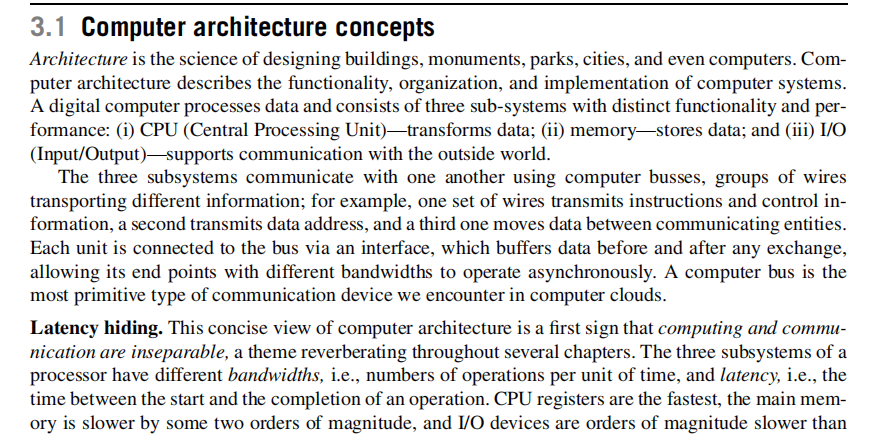

# CHAPTER 3 

# START

**并行处理与分布式计算：概念综览**

本部分课件内容主要介绍了并行处理（Parallel Processing）和分布式计算（Distributed Computing）的基本概念及其在当代计算机系统中的地位与发展脉络。通过回顾历史、分析技术要点、展望未来应用场景，说明这两大领域如何共同推动云计算、大数据等新一代计算模式的兴起。

* * *

1\. 内容概述
--------

课件首先从宏观层面概括了并行处理和分布式计算的重要性和发展历程，指出这两个研究方向对于当代计算系统的构建与应用起到了至关重要的作用。后续又进一步讨论了下列关键要点：

*   **并行处理：**
  
    *   与高性能计算（HPC）和超级计算机的发展密切相关。
    *   通过对科学应用中的问题进行分解，利用多核或大规模并行架构同时处理数据或指令，从而获得较高的速度提升。
    *   随着多核时代和更高时钟频率的需求逐渐受限，人们更加重视如何利用多核架构的所有核心，并行化算法以及编程模型。
*   **分布式计算：**
  
    *   研究由多个网络互联的自主系统组成的系统整体如何进行通信与协作。
    *   早期主要依赖操作系统内核提供的消息传递机制（1960年代即初见雏形），在1970年代以太网（Ethernet）的普及进一步推进了分布式系统的落地。
    *   面向云计算和大数据时代，分布式系统成为存储、计算、网络的基础支撑技术，海量数据的分析与处理需要分布式资源协调与并行执行。
*   **云计算与大数据：**
  
    *   云计算借由多实例并行运行、弹性扩缩容，能够高效地处理海量数据。
    *   客户端-服务器（Client–Server）的软件模式在云环境下演变为“薄客户端（thin-client）+云端高密度并行计算”的典型模式，使资源受限的移动设备也能依托云端完成高强度的计算任务。
    *   大数据背景下，新的挑战是如何充分利用多核、集群、甚至分布在不同地理位置的数据中心的计算能力，加快对海量数据的处理和洞察。
*   **事务处理系统和网络服务：**
  
    *   大规模并发访问（如Web服务、电子商务、在线数据库）的场景，需要支持多实例并行运行，并具有可靠的消息传递和有序交付能力。
    *   并行处理与分布式计算的结合，为支撑此类大规模应用提供了关键技术支柱。
*   **历史与挑战：**
  
    *   并行处理在早期发展中需要特殊硬件、编程模型与软件支持，难度较大。一系列支持并行处理的公司（Ardent、Convex、Encore、MasPar、nCube、Thinking Machines等）曾尝试在该领域突围，但开发难度和应用生态限制使得很多公司最终未能持续。
    *   编程模型和并行应用开发环境的困难也是导致产业化进程波折的重要原因。

* * *

2\. 课件各要点详细解析
-------------

以下部分将结合课件文字内容，对并行处理与分布式计算在硬件、软件和系统结构等方面的细节进行逐条展开说明。

### 2.1 并行处理的背景与动因

1.  **高性能计算与科学应用推动：**
  
    *   科学计算、工程仿真等应用对计算力的要求极为强烈，研究者发现如果能让多个处理器同时工作，可以在复杂数值模拟或大规模数据处理上获得显著的加速比。
    *   早期并行计算常见于超级计算机领域，它们以极高的硬件成本和繁琐的编程模式换取数十倍甚至成百上千倍的性能提升。
2.  **硬件发展限制与多核时代：**
  
    *   CPU主频在很长时间内是提升计算能力的主要途径，但主频提升受功耗和发热限制而渐趋平缓。
    *   制造工艺进入硅时代后，多核处理器成为主流：在同一块芯片上集成多个核心（cores），从而通过并行方式提升总计算能力。
    *   因此，研究如何有效地调度和利用这些多核资源，使应用“真正并行”地执行成为关键。
3.  **并行算法与编程模型：**
  
    *   并行处理不仅是硬件问题，更需要从算法设计与编程层面重新思考。例如MPI（消息传递接口）、OpenMP（共享内存并行模型）等技术都是在这一背景下兴起。
    *   如何**暴露并行性**并让程序员能够简单、安全地编写并行代码，是业界和学术界持续关注的焦点。

### 2.2 分布式系统的研究范围与特征

1.  **基本概念：**
  
    *   分布式系统由多个互联的自治计算节点（可能相距甚远）组成。每个节点有各自独立的计算资源和内存空间。
    *   通信方式包括：
        *   **消息传递（Message Passing）：** 常见于早期操作系统与后续的集群系统。
        *   **共享存储（Shared Memory）：** 一种逻辑概念，可以在部分并行环境或高性能架构中出现（如NUMA），但在地理上分散的分布式系统中不常见。
2.  **网络技术推动：**
  
    *   1970年代以太网（Ethernet）的出现极大促进了局域网内的多机通信。
    *   随着互联网普及与通信速率的提升，分布式系统逐渐扩展到广域网环境（如云计算数据中心横跨全球）。
3.  **分布式计算的应用场景：**
  
    *   大规模数据处理（如MapReduce、Spark），需要分块后分配给不同节点处理，再聚合结果。
    *   微服务与云端服务，将功能拆分为彼此通信的独立服务，以便部署在不同节点上，提高扩展性、容错性。
    *   P2P（对等网络），在网络层面各节点地位对等；区块链技术更是建立在分布式一致性基础之上。
4.  **挑战与问题：**
  
    *   **一致性（Consistency）：** 分布式场景下保持数据一致性难度增大，需要借助分布式一致性算法（如Paxos、Raft）或弱一致模型来平衡效率与正确性。
    *   **容错性（Fault Tolerance）：** 节点随时可能出现故障，系统必须有足够冗余与故障检测机制来维持整体服务的可用性。
    *   **可扩展性（Scalability）：** 随着节点增多和数据量增加，如何保证系统性能和功能的线性或接近线性增长，需要在体系结构和算法上做大量优化。

### 2.3 云计算与大数据的时代转变

1.  **云计算的发展：**
  
    *   依赖大规模集群或数据中心，利用虚拟化或容器技术，为用户提供弹性、分布式的计算与存储资源。
    *   **薄客户端（thin-client）模型：** 由用户在移动设备或普通PC端运行轻量级应用逻辑，大量数据分析和复杂处理则在云端进行。
    *   云平台对**并行处理**和**分布式计算**都有依赖：要快速处理海量数据，云端需要高效的并行计算能力；要支持全球范围的服务和资源调度，就需要分布式系统基础。
2.  **大数据带来的新挑战：**
  
    *   数据体量与多样性推动并行和分布式系统结合，以处理数TB、数PB甚至更大规模的数据集。
    *   大数据应用的实时或准实时需求，也要求对架构进行分布式流式处理或并行批处理的优化。
    *   对多核、多GPU乃至异构平台（FPGA、TPU等）的利用也在云端被广泛探索，用于机器学习、深度学习的训练与推断等场景。

### 2.4 并行与分布式硬件体系结构要点

1.  **硬件并行性的重要性：**
  
    *   现代处理器早已不是简单的流水线执行，包含缓存、乱序执行、动态调度、分支预测等复杂特性，以提升指令级并行（ILP）。
    *   节点之间的多处理器（多核）系统、集群系统、数据中心（仓库规模计算）是从芯片级到系统级再到数据中心级的硬件并行形态。
2.  **不同类型硬件并行：**
  
    *   **SIMD（Single Instruction Multiple Data）架构：** 一条指令并行处理多组数据，如向量化指令、GPU大规模并行等。
    *   **GPUs（图形处理器）** 及 **TPUs（张量处理器）**：专为并行密集型任务（图形渲染、深度学习）而设计，擅长大规模并行计算。
    *   **SoCs（System On a Chip）**：将CPU、GPU、专用电路等集成在单芯片上，强化在移动和嵌入式场景中的并行处理能力。
    *   **Edge Cloud Computing（边缘云计算）：** 在靠近用户侧或边缘节点部署低时延的计算资源，也往往采用轻量多核或分布式小型集群来提供即时服务。

### 2.5 并行性提取与性能提升：Amdahl定律

1.  **数据级并行、任务级并行、线程级并行：**
  
    *   数据级并行：同一操作作用于多份数据并行执行。
    *   任务级并行：将不同任务拆分后分配给并行执行单元。
    *   线程级并行：在多线程/多进程环境中同时使用多核以提升吞吐量。
2.  **Amdahl定律：**
  
    *   描述系统中可并行部分与不可并行部分对整体加速比的影响。
    *   若程序中有一部分占比  $p$  能够并行化，另一部分  $1-p$  无法并行化，则当使用  $N$  个处理器时，最大加速比约为 
        $$
        \text{Speedup} \approx \frac{1}{(1-p) + \frac{p}{N}}
        $$
        
    *   随着  $N$  的增加，如果  $p$  不足够高，整体加速也会遇到瓶颈。这对硬件和软件设计都有重要启示。

### 2.6 分布式系统的组织原则与应用

1.  **模块化与分层化（Section 3.12与3.13）：**
  
    *   在分布式系统中采用分层模型（如网络层、传输层、应用层）可简化复杂度，并使系统更易扩展和维护。
    *   模块化思想：将大系统拆分为若干可独立演进与部署的子系统或服务。
2.  **Peer-to-Peer与大规模系统设计（Section 3.14与3.15）：**
  
    *   P2P系统中的所有节点都可能同时担当客户端和服务器的角色，具有高可扩展性和自组织能力。
    *   大规模系统则往往结合分层化、分片与负载均衡策略，应对海量请求与数据。
3.  **可组合性与可扩展性（Section 3.16）：**
  
    *   研究如何在多种异构计算资源与服务之间进行组合，以满足不断增长的计算需求。
    *   分析在扩展规模时系统性能、成本、可靠性等方面的影响。
4.  **区块链技术（Section 3.18）：**
  
    *   区块链是典型的分布式账本，依赖分布式一致性算法来达成全网对交易的验证和记录。
    *   其去中心化的思路本质上与分布式系统的原则相吻合，却也带来了性能、隐私与监管等新的挑战。

* * *

3\. 本部分知识点总结
------------

*   **并行处理**与**分布式计算**是计算机领域的两大主流方法，用以应对现代应用对高性能与可扩展性的需求。
*   并行处理侧重于在**单节点**或**多节点**上挖掘**多核、多处理器**的并发潜力；分布式系统则关注在**网络互联**的多节点中如何**通信、协调与资源调度**。
*   随着云计算与大数据的繁荣，二者相辅相成：
    *   **硬件层面**从单核到多核，再到集群与大规模数据中心；
    *   **软件层面**从单一进程到多线程，再到分布式系统与微服务架构。
*   Amdahl定律等理论对并行系统的加速极限进行量化分析，提示我们必须提高并行比重并降低串行瓶颈，才能在多核或多节点系统中充分发挥性能优势。
*   **组织原则**（模块化、分层化）、**可组合性**与**可扩展性**是构建大规模分布式系统与云计算平台的指导思想。
*   **区块链**等新兴技术拓展了分布式计算的应用边界，也引发对一致性、去中心化与性能平衡的新研究。

* * *

# 3.1.1 Computer architecture concepts

**第3.1节：计算机体系结构概念**

下面的笔记将围绕计算机体系结构的核心思想展开，介绍CPU、内存、I/O及它们之间的连接与交互方式，并讨论指令集架构（ISA）的不同流派（CISC与RISC），以及控制流（Control Flow）与数据流（Data Flow）两种处理器架构理念。此外，还会阐述处理器的时钟频率（Clock Rate）、CPI（每条指令所需的时钟周期数）与IPC（每个时钟周期可执行的指令数）等概念，以及为什么单纯提升主频面临的物理与能耗极限。

* * *

1\. 大体内容概览
----------

1.  **计算机的三大子系统与通信：**
  
    *   CPU（中央处理单元）负责数据的“变换与计算”。
    *   内存（Memory）负责数据的“存储与取用”。
    *   I/O（输入/输出）负责系统与外部世界的“交互”。
    *   这三部分通过\*\*总线（Bus）\*\*相互连接与通信，不同线组（地址线、数据线、控制线）完成不同类型的信息传输。
2.  **延迟隐藏（Latency Hiding）：**
  
    *   CPU、内存与I/O三者的带宽和延迟差异非常大。
    *   为了减少“慢速子系统”造成的等待，体系结构采用多级缓存、流水线、乱序执行等多种技术，试图将等待时间隐藏起来。
    *   这种延迟隐藏机制在架构上会变得越来越复杂，也可能引入新的安全性或设计方面的挑战。
3.  **指令集架构（ISA）与CISC、RISC：**
  
    *   ISA 是CPU所能执行的指令集合及其对外呈现的抽象接口，编译器与程序员都基于ISA来编写或翻译程序。
    *   CISC（复杂指令集计算机）：指令丰富、对内存直接操作，但不利于流水线实现和CPU优化。典型代表是 x86-64 架构。
    *   RISC（精简指令集计算机）：指令集精简、强调`load/store`结构，所有算术逻辑操作都只在CPU寄存器之间进行，有利于流水线与高速执行。典型代表有MIPS、PowerPC、SPARC等。
4.  **控制流 vs. 数据流处理器：**
  
    *   控制流（Control Flow）：大多数通用处理器遵循冯·诺依曼模型，程序计数器(PC)决定下一条指令，每条指令按序在指令寄存器(IR)中执行，遇到分支时再跳转。
    *   数据流（Data Flow）：只要操作所需的输入数据就绪，操作就自动执行，和传统控制流顺序执行不同。该模型在某些**专用处理器**（如信号处理器、并行计算系统等）中应用较多，但通用处理器采用较少，原因在于本地性、缓存效率以及流水线设计等方面的难度。
5.  **处理器时钟、CPI、IPC：**
  
    *   时钟频率（ $R$  或主频）：CPU以一定频率进行工作（GHz）。
    *   CPI（Cycle Per Instruction）：执行一条指令平均需要的时钟周期数。其倒数IPC（Instructions Per Cycle）指明每个时钟周期可完成多少条指令。
    *   应用程序运行总时间（ $T$ ）可近似表示为 
        $$
        T = N \times CPI \times R
        $$
         其中  $N$  为指令总数， $CPI$  为平均每条指令周期， $R$  为时钟周期时间（或与频率成反比）。
    *   要缩短执行时间，可以：
        *   减少指令总数  $N$ （即编译优化、提高程序效率）。
        *   降低  $CPI$ （改进流水线、乱序执行、分支预测等）。
        *   提高时钟频率（ $R$ ）。  
            但每种手段都有物理或技术上的限制。
6.  **主频提升的物理极限：**
  
    *   1980年代到2000年代初期，依靠提升CPU主频来获得性能指数级增长，但频率提高受功耗与散热限制；当工艺进步难以支撑更高主频时，出现了“主频墙”。
    *   热量产生与芯片面积、晶体管密度关系密切，过高的频率会让能耗指数级上升，散热成为严重瓶颈。
    *   因此，业界转向多核（多处理器）方案来继续扩展并行计算能力。

* * *

2\. 详细知识点与分析
------------

### 2.1 三大子系统与总线

1.  **CPU 与控制单元（Control Unit）、ALU（算术逻辑单元）、寄存器文件（Register File）**
    *   **控制单元（CU）**：协调指令执行流程，控制各阶段信号。
    *   **ALU**：执行算术运算和逻辑运算。
    *   **寄存器文件（RF）**：CPU内部用于快速存取数据的高速度存储位置。
2.  **内存（Memory）与层次结构**
    *   为了弥补内存和CPU速度之间的鸿沟，现代处理器常采用多级缓存（L1、L2、L3），以及可能引入的主存、甚至进一步到磁盘或SSD。
    *   缓存的目的是**隐藏内存延迟**，提高数据访问命中率。
3.  **I/O（Input/Output）**
    *   速度往往比内存更慢，等待时间更长。
    *   通过I/O接口和总线进行外部设备通信，需考虑带宽和延迟平衡。
4.  **总线（Bus）**
    *   一组公共信号线，用于CPU、内存和I/O模块之间的信息传输。
    *   每个子系统通过接口连接到总线，接口可进行缓冲与速率匹配，以支持异步工作模式。

### 2.2 延迟隐藏与架构复杂度

1.  **延迟差异**
    *   CPU寄存器：纳秒级或更快。
    *   主存：比寄存器慢约1~2个数量级。
    *   磁盘或其他I/O设备：比主存进一步慢几个数量级。
2.  **隐藏延迟的手段**
    *   **流水线（Pipelining）**：把指令执行分解为多个阶段，并行处理不同指令的不同阶段。
    *   **乱序执行（Out-of-Order Execution）**：遇到长延迟操作时，可提前执行其它不依赖该操作结果的指令。
    *   **分支预测（Branch Prediction）**：减少分支指令带来的流水线冲刷和停顿。
    *   这些架构优化导致硬件内部逻辑日益复杂，也在少数场景（如Spectre、Meltdown）中暴露出安全漏洞。

### 2.3 指令集架构（ISA）：CISC 与 RISC

1.  **CISC**
    *   设计理念：提供尽可能多的复杂指令，让编程更方便、程序更紧凑。
    *   缺点：指令执行过程在硬件层面更复杂，难以提高流水线效率。
    *   例子：x86/x86-64 指令通常由微码（Microcode）翻译为更简单的微操作（Micro-ops）后再执行。
2.  **RISC**
    *   设计理念：“精简”指令集，通过限制指令种类来强化流水线，提升CPU执行效率。
    *   典型：PowerPC、MIPS、SPARC，以及如今ARM系列。
    *   核心特征：`load/store`架构，所有算术/逻辑操作都在寄存器内进行，只有读写寄存器时需要访存指令。
3.  **现状：**
    *   x86-64处理器的内部微架构也趋近RISC风格（通过微码翻译），以实现更高性能。
    *   移动、嵌入式领域则多采用原生RISC（ARM）实现。

### 2.4 控制流与数据流架构

1.  **控制流（Control Flow）**
    *   传统冯·诺依曼模型：根据程序计数器执行顺序流的指令，遇到跳转再改变PC值。
    *   优点：简单易行、适用广。
    *   缺点：潜在的分支等待和流水线停顿，需要额外硬件（分支预测）来减轻性能损耗。
2.  **数据流（Data Flow）**
    *   只要操作数就绪，当前操作即可并行启动，无需等待控制流指令顺序。
    *   在专用处理器或并行计算模型中更具优势（高并行度、动态调度）。
    *   不广泛应用在通用CPU上的原因包括：缺乏局部性、难以充分利用缓存和流水线等。

### 2.5 时钟、CPI、IPC及性能公式

1.  **T = N × CPI × R**
    *    $T$ ：应用执行总时间
    *    $N$ ：指令总数
    *    $CPI$ ：每条指令平均需要的时钟周期数
    *    $R$ ：时钟周期长度（与时钟频率成倒数关系）
2.  **减小T的三大方向：**
    *   **减少N**：编译优化、算法优化、提高语言/编译器效率。
    *   **降低CPI**：优化CPU微架构，采用深度流水线、乱序执行、多级缓存、分支预测等。
    *   **提高主频（提高1/R）**：提升制造工艺、改进散热与功耗设计，但当前已遇到物理与能耗瓶颈。

### 2.6 主频提升的极限与多核

1.  **历史回顾：**
    *   1980年代VAX 8600主频22MHz到2003年Intel Xeon达到3.2GHz，主频增长一度相当迅速。
    *   但随着CMOS工艺面临散热、能耗与物理极限，单核主频继续攀升难度巨大。
2.  **多核时代：**
    *   通过在芯片上集成更多核来并行执行更多指令流，从而提升整体运算能力。
    *   每个核心具备自己的ALU、寄存器文件，有时还共享最后级缓存。
    *   多核处理还需软件层面（线程、并行算法）来配合，才能真正发挥性能潜力。

* * *

3\. 本次内容小结
----------

*   **三大子系统（CPU、Memory、I/O）**和**总线**构成计算机硬件基础，带宽与延迟的差异要求各种**延迟隐藏**机制。
*   **ISA**作为CPU可执行指令集合的抽象，分为CISC和RISC两大流派，现代处理器多融合了两种思路的优点。
*   **控制流**仍是当今主流的通用处理器实现模型，而**数据流**在特定并行或专用设备中效果更好。
*   **CPU性能**的基本衡量方法可以用公式  $T = N \times CPI \times R$  概括，提升性能可从减少指令总数、降低CPI或提升主频着手，但主频提升已遇到物理瓶颈。
*   **多核处理器**成为当代继续提高计算能力的重要途径，需要并行编程与并行算法的支持，才能有效利用硬件潜能。

* * *

# 3.1.2 Computer architecture concepts

**并行处理：流水线与体系结构分类**

本次课件主要围绕流水线技术（Pipelining）、指令级并行（ILP）、Flynn 体系结构分类（SISD、SIMD、MIMD、MISD）及性能指标（MIPS、MFLOPS等）展开，介绍了现代处理器如何利用各种形式的并行性来提高执行效率，并且详细分析了流水线可能面临的各种冲突（Hazard）与解决思路。以下为对应内容的完整笔记与解析。

* * *

1\. 主题概述
--------

1.  **基本超标量流水线（Superscalar Pipeline）：**
  
    *   处理器存在多个执行单元（执行通道），在同一周期内可并行执行多条指令。
    *   课件以一个五级流水线为例：取指（IF）、译码（ID）、执行（EX）、访存（MEM）、回写（WB）。
    *   表格（Table 3.1）中展示了指令  $i, i+1, i+2$  等在各周期内如何依次进入流水线各级。当流水线填满后，每个时钟周期可同时完成多条指令的不同阶段。
2.  **位级并行与指令级并行：**
  
    *   **位级并行（Bit-level parallelism）**：指CPU一次能处理的操作数位宽从最初的4位扩展至8位、16位、32位甚至64位。位宽的增加减少了处理同样数据量所需的指令数，从而提升整体性能。
    *   **指令级并行（ILP）**：通过流水线、多发射（Superscalar）、乱序执行（Out-of-Order Execution）等手段，让多个指令在硬件上尽可能并行进行。
3.  **流水线分级与车间装配线类比：**
  
    *   将指令执行拆分为若干顺序阶段（如IF、ID、EX、MEM、WB），在硬件中各阶段能并行处理不同指令。
    *   一旦流水线“灌满”，理想情况下每个周期都能产出一条（或多条）指令的执行结果，极大提高吞吐量。
    *   这一思路与Henry Ford于1913年在汽车制造中引入的装配线理念相似，着眼于并行执行与分工协作。

* * *

2\. 五级流水线的工作流程
--------------

课件对典型RISC处理器（如MIPS）的5级流水线做了通用描述：

1.  **IF（Instruction Fetch）取指：**
  
    *   从PC（程序计数器）指定的内存地址取出指令，并放入指令寄存器IR。
    *   计算下条指令PC（若无分支），存储到流水线寄存器中，为后续分支判断做准备。
2.  **ID（Instruction Decode）译码：**
  
    *   分析指令类型，读取需要的源操作数（寄存器或立即数）。
    *   若是分支指令，会根据译码结果、分支偏移等信息进行后续判断。
3.  **EX（Execute）执行：**
  
    *   ALU执行算术或逻辑运算，并计算访存的地址（如Load/Store操作），或若为分支则计算跳转目标地址等。
    *   条件分支指令可能在EX阶段就产生跳转结果。
4.  **MEM（Memory Access）访存：**
  
    *   若指令需要内存访问（Load/Store），则在此阶段进行。
    *   如果是分支指令，可能更新PC或进行其他控制操作。
5.  **WB（Write Back）回写：**
  
    *   将运算结果（来自ALU或内存）回写到寄存器堆（Register File）。
    *   对于RISC架构，一般只有此阶段才更新寄存器文件，从而保证指令执行顺序的一致性。

* * *

3\. 流水线冲突（Hazard）与流水线暂停（Stall）
------------------------------

流水线增加了并行度，但也会产生一系列冲突，需要硬件或编译器来解决。主要分为三类：

1.  **数据冲突（Data Hazards）：**
  
    *   **RAW（Read After Write）**：后续指令要读取的寄存器尚未被前一条指令写回；可能导致读取到旧数据。
    *   **WAR（Write After Read）**：后续指令要写入的寄存器正好是前面指令要读取的寄存器（通常在乱序执行场景下才会出现）。
    *   **WAW（Write After Write）**：两条指令都要对同一寄存器写入，前后顺序必须保持一致。
    *   常见解决方案包括：硬件转发（Forwarding/Bypassing），编译器调度，或插入流水线暂停等。
2.  **结构冲突（Structural Hazards）：**
  
    *   当流水线硬件资源（如访存模块、执行单元）无法同时支持多条指令的需求时会产生结构冲突。
    *   例如，只有一个内存端口，但同时有一条指令在IF取指，另一条指令在MEM访存，就会引起资源冲突。
    *   可通过增加硬件模块数量（如分离指令/数据缓存）或在必要时进行流水线暂停来解决。
3.  **控制冲突（Control Hazards）：**
  
    *   分支指令的目标不确定，会影响流水线对下一条指令的获取。
    *   如预测出错，需丢弃（Flush）已经进入流水线错误路径中的指令，重新取正确路径的指令。
    *   **分支预测**、推测执行等机制可降低分支带来的控制冲突影响，但预测失误时仍需付出代价。

> **流水线暂停（Pipeline Stall）**：指令在流水线中出现延迟，需要插入空周期（或填充无效指令），导致流水线无法充分发掘并行性，直接提高了CPI。

* * *

4\. 流水线性能与CPI公式
---------------

课件给出了一个常用的流水线性能公式：

$$
\text{PipelineCPI} = \text{IdealPipelineCPI} + \text{StructuralStalls} + \text{DataHazardStalls} + \text{ControlStalls}
$$

*   **IdealPipelineCPI**：指理想情况下（无任何冲突、无限资源、分支预测全命中）每条指令平均所需的周期数。对于单发射（单发射通道）的五级RISC流水线，理想CPI通常接近1。
*   其余三项为各种冲突引起的额外停顿。如何降低或隐藏这些停顿是流水线设计的核心目标。

* * *

5\. Flynn 体系结构分类
----------------

在讨论并行模式时，1966年Michael Flynn提出了按照**指令流**与**数据流**数量进行划分的体系结构分类（Flynn's Taxonomy）：

1.  **SISD（Single Instruction Single Data）**：
  
    *   单指令流、单数据流的传统冯·诺依曼架构。
    *   大多数通用单核CPU、无多线程时都符合该范畴。
    *   超标量（Superscalar）处理器即使能一次发射多条指令，但从外部看它仍是“单指令流”，因此也被视为SISD的一种增强形态。
2.  **SIMD（Single Instruction Multiple Data）**：
  
    *   单指令流、多个数据流。
    *   一条指令在多个数据元素上同时执行，如向量操作、GPU中常见的向量化运算。
    *   早期的Cray超级计算机、Intel MMX / SSE、ARM NEON等都属于SIMD指令集扩展。
3.  **MIMD（Multiple Instructions Multiple Data）**：
  
    *   多指令流、多个数据流。
    *   多个处理器或多核同时执行各自独立的指令流、处理不同的数据集。
    *   现代多核CPU、多处理器集群、超级计算机大多属于MIMD结构。每个处理器都拥有自己的控制单元和本地资源，能独立执行不同程序。
4.  **MISD（Multiple Instructions Single Data）**：
  
    *   多指令流、单数据流。
    *   实际场景中几乎很少使用，主要在容错或特殊安全场合下可能出现。

* * *

6\. 多处理器共享存储架构与现代系统
-------------------

课件提到多核或多处理器系统如何与共享内存进行交互，以及常见的分类：

1.  **UMA（Uniform Memory Access）**：所有处理器访问内存的时延基本相同，常见于小规模对称多处理器(SMP)。
2.  **NUMA（Non-Uniform Memory Access）**：多节点集群或大型多核系统中，不同内存模块与处理器之间访问延迟不同，需要专门的NUMA优化。
3.  **COMA（Cache-Only Memory Architecture）**：将所有内存都视为缓存的特殊架构，极为罕见，一般出现在研究型机器或特殊应用中。

* * *

7\. 性能度量：MIPS 与 MFLOPS
----------------------

1.  **MIPS（Million Instructions Per Second）**：
  
    *   测量整数运算为主的处理器吞吐能力。
    *   仅能粗略衡量CPU“执行多少机器指令”的速度，不同指令集的指令复杂度差异会导致此指标并不通用。
2.  **MFLOPS（Million Floating Point Operations Per Second）**：
  
    *   测量浮点运算性能。
    *   同样受到应用场景、处理器架构、编译器优化等多因素影响。
    *   GPU、TPU在浮点计算方面有时可远超CPU，但不代表它们在所有任务上都更快。
3.  **Benchmark 测试**：
  
    *   现代更倾向使用**benchmark suites**（如SPEC、PARSEC、BioParallel等）来反映处理器在真实应用负载下的性能表现。
    *   云服务（如AWS）的实例类型也会针对不同负载（计算密集、存储密集、网络密集）进行优化。

* * *

8\. 本次要点总结
----------

*   **超标量流水线**与**指令级并行（ILP）**：通过分阶段执行与多发射技术提升CPU吞吐量，但会面临数据、结构、控制冲突，需要硬件与编译器的综合优化。
*   **流水线5级阶段**（IF、ID、EX、MEM、WB）和**常见冲突类型**（数据/结构/控制）构成了RISC处理器设计的核心。
*   **Flynn's Taxonomy**（SISD、SIMD、MIMD、MISD）从指令流与数据流的角度给计算体系结构进行分类。在现代系统中，SISD与MIMD最常见，SIMD广泛用于向量化和GPU加速。
*   **多处理器与多核**属于MIMD结构，可能共享内存（UMA/NUMA），或者通过网络互连成更大规模分布式系统。
*   \*\*性能指标（MIPS、MFLOPS）\*\*只是参考；针对特定应用场景需要使用更具代表性的Benchmark测试来衡量处理器性能。

* * *

# 3.2.1 Grand architectural complications

**3.2 体系结构中的重大复杂性：内存层次结构与缓存设计**

本次课件围绕 RISC 架构下如何确保流水线持续满载（条件 A: 指令、数据的内存获取必须及时；条件 B: CPU 优化确保流水线不过度空转）展开，并重点探讨了内存层次结构（Memory Hierarchy）、缓存组织与缓存替换策略等方面的“体系结构复杂性”。以下为详细笔记与解析，帮助你从零理解这一部分的关键内容。

* * *

1\. 概述与动因
---------

### 1.1 维持流水线满载的挑战

1.  **条件 A – 内存优化（Memory Optimization）：**
  
    *   取指时，必须保证下一条指令能快速到达指令寄存器（IR），而且若该指令需要的数据，也应在执行前进入 CPU 寄存器。
    *   现代 CPU 主频极高，但内存速度与带宽存在物理和成本局限；若访问延迟过高，流水线会因“等数据”而停顿。
2.  **条件 B – CPU 优化（CPU Optimization）：**
  
    *   即使内存不成为瓶颈，也要让流水线时刻处于饱和状态。任何分支、长延时指令（例如乘法/除法）或控制流变动，都可能导致流水线气泡（bubble）或停顿（stall）。
    *   CPU 设计需考虑避免或减少等待周期，如乱序执行（Out-of-Order Execution）、分支预测（Branch Prediction）等手段，从而最大限度保证每个时钟周期都有指令在执行。

### 1.2 程序正确性与异常行为

*   体系结构必须保证：
    1.  **异常行为（Exception Behavior）**：程序执行顺序改变时，不可导致异常触发顺序失常。例如，除零异常、访存越界等必须在正确的位置被捕获。
    2.  **指令流完整性（Preserve Instruction Flow）**：产生结果的指令与使用结果的指令之间的顺序要正确。
    3.  **安全性（Preserve Security）**：防止通过对指令地址空间的并行处理而泄露信息。
*   哪怕是数据流架构，在面对异常、控制流等复杂场景时，也需特别设计来维护程序 correctness（正确性）。

* * *

2\. 内存层次结构（Memory Hierarchy）
----------------------------

### 2.1 基本概念：延迟、带宽与成本

*   **延迟（Latency）**：访问一次存储器所需的最小时间，以皮秒/纳秒/微秒为单位。
*   **带宽（Bandwidth）**：单位时间内可读写的数据量，用 MB/s 或 GB/s 度量。
*   **成本（Cost per bit）**：每比特存储所需的金钱成本。
*   理想情况：无限容量、零延迟、零成本，但现实中三者互相制约，只能采用“分级存储”来平衡速度与容量。

### 2.2 层次结构及局部性原理

1.  **层次模型**
    *   **CPU 寄存器**：速度最快、容量最小、成本最高。
    *   **L1 / L2 / L3 缓存（Cache）**：速度依次变慢，容量逐级增大。
    *   **主存（DRAM）**：容量更大，延迟更高，成本较低。
    *   **磁盘 / SSD / 外部存储**：延迟最高、容量最大、成本相对更低。
2.  **空间局部性（Spatial Locality）**：一旦访问了某个内存地址，很可能在其附近的地址也会被访问（代码通常顺序执行，数组等数据结构常连续存放）。
3.  **时间局部性（Temporal Locality）**：一旦访问了某个数据，近期很可能还会再次访问它（循环变量、函数调用等重复使用同一数据）。
4.  **工作集（Working Set）**：程序在一段时间内会反复访问的那批数据（或指令）集合。如果工作集能装入高速缓存，则访问效率极大提高。

### 2.3 多级缓存示意（图 3.1）

*   (a) **金字塔形层次**：从上到下，容量越来越大、速度越来越慢、成本越来越低。
*   (b) **CPU 内部结构示意**：
    *   **L1 Cache** 一般区分为 **I-Cache**（取指用）和 **D-Cache**（数据用），以减少结构冲突；
    *   **L2 / L3 Cache** 常为统一缓存（Unified Cache）同时存储指令和数据。
*   不同级别缓存的带宽（GB/s）、延迟（纳秒）、成本（$/bit）差异巨大。

* * *

3\. 缓存设计与性能
-----------

### 3.1 缓存的关键问题

1.  **块大小（Cache Block / Line Size）**
  
    *   CPU 与缓存交换的基本单位。若块过大，可能浪费带宽；过小，又无法有效利用空间局部性。常见尺寸为 32~128 字节。
2.  **映射方式（Mapping Policy）**
  
    *   **直接映射（Direct Mapped Cache）**：一个内存块只能放到缓存中唯一位置（根据地址索引定位）。实现简单但冲突率可能较高。
    *   **全相联（Fully Associative Cache）**：一个内存块可以放在缓存的任意位置。灵活但查找比较复杂，需要比较多路的 Tag。
    *   **组相联（Set Associative Cache）**：折中方案，把缓存分成若干组（Set），内存块只能映射到某个组内任意位置。N 路组相联通常常见于通用 CPU 设计（如 2 路、4 路、8 路等）。
3.  **替换策略（Replacement Policy）**
  
    *   当缓存已满，需要替换其中的某个块：
        *   **LRU（Least Recently Used）**
        *   **FIFO（First In First Out）**
        *   **Random** 等等。
    *   LRU 在保持时间局部性上常表现较好，但实现代价略高。现代缓存也会结合近似 LRU 的算法来平衡性能与硬件复杂度。
4.  **写策略（Write Policy）**
  
    *   **写直达（Write Through）**：当缓存块被修改，立即写回主存，保证主存和缓存内容一致；但写操作频繁时会带来更大带宽消耗。
    *   **写回（Write Back）**：修改只写到缓存中，并将“脏位（dirty bit）”置 1。只有当该缓存块被替换时，才把数据写回主存。可减少写操作次数，但需要额外逻辑跟踪脏位。

### 3.2 缓存命中与缺失

*   **命中（Cache Hit）**：访问地址已经在缓存中，访问延迟较小。
*   **缺失（Cache Miss）**：访问地址不在缓存中，需要从下一层存储中读取数据块进入缓存，会导致较高延迟并可能引发流水线停顿。
*   课件提到三种缺失类型：
    1.  **强制缺失（Compulsory Miss）**：程序首次访问某个数据块时必然发生。
    2.  **容量缺失（Capacity Miss）**：缓存容量不足，先前读入的数据被换出后再次需要访问。
    3.  **冲突缺失（Conflict Miss）**：地址映射到同一组或相同位置，导致不必要的块替换。

### 3.3 容量与换出（Eviction）

*   **缓存容量通常只有主存的几百分之一到几千分之一**。例如，L1 仅数十 KB，L2 约数百 KB 至几 MB，L3 约数 MB ~ 数十 MB，主存则是 GB 级。
*   当缓存已满、要放入新块时，就要“赶走”一个旧的块：
    *   若是“脏块”，需先写回主存（写回策略下）。
    *   若块是干净的，则无需写回，直接覆盖即可。

* * *

4\. 与流水线的结合：B1 ~ B3 的影响
-----------------------

课件提到保持流水线满载（B1~B3）时，与缓存/内存有如下关联：

1.  **B1 – 避免流水线停顿（Pipeline Stall）**
    *   若指令或数据无法在需要时及时送达，CPU 就得暂停，等待访存完成。多级缓存的设计目的之一便是“避免或减少取指/访存的停顿”。
2.  **B2 – 不同运算耗时不同**
    *   某些指令（如除法）需要很多周期，如果数据访问再出现延迟，会让执行阶段拉得更长，流水线无法发挥并行效率。
    *   高速缓存能快速提供数据，以免拖延 EX / MEM 阶段。
3.  **B3 – 控制流指令导致分支失效**
    *   若分支预测失误，需要丢弃指令并重新取指。Cache 命中可帮助尽快取到新路径指令，缩短分支带来的空转周期。

* * *

5\. 小结
------

1.  **两个核心条件**：
    *   **内存层面**：Cache 体系、层级设计、块大小与映射策略等共同保障取指与数据访问足够快。
    *   **CPU 优化层面**：流水线深度、乱序执行、分支预测等多种手段减少空转或冲突。
2.  **内存层次（Memory Hierarchy）**是现代计算机体系结构的灵魂，用不同速度/容量/成本的存储部件组成一个分层结构，尽量利用局部性原理降低平均访问延迟。
3.  **缓存设计**决定了在实际运行中命中率和缺失代价，对整体性能影响巨大。
4.  **程序正确性**必须保留异常顺序、指令依赖以及安全边界，这些都对 CPU 乱序执行、缓存一致性提出了更严格的要求。

* * *

6\. 备注
------

*   课件中关于缓存组织（直接映射、组相联、全相联）、缺失类型、写策略等关键知识点描述详尽，可读性完整，没有明显遗漏或无法识别的内容。
*   若后续部分继续深入到高级缓存一致性协议（如 MESI、MOESI 等）或高级分支预测算法，可结合本段内容进一步分析。

以上即为“3.2 Grand architectural complications”及缓存层次结构的完整笔记和详细解读。通过对内存延迟、缓存映射及替换策略的认识，可以理解现代 CPU 如何在硬件层面努力满足流水线对高效访存的需求，并以此保障整体程序执行效率与正确性。

# 3.2.2 Grand architectural complications

**3.2节后半部分：AMAT优化、乱序执行与分支预测（含Meltdown与Spectre安全漏洞）**

本次课件进一步深入探讨了在现代CPU中如何降低平均内存访问时间（AMAT），以及使用乱序执行（Out-of-Order Execution）和分支预测（Branch Prediction）来减少流水线停顿、提高指令并行度。最后，还介绍了近年曝光的CPU硬件漏洞（Meltdown与Spectre）如何利用投机执行和缓存副通道攻击来窃取敏感数据。以下为完整知识点解析。

* * *

1\. AMAT（Average Memory Access Time）与缓存性能优化
-------------------------------------------

### 1.1 AMAT公式

课件首先定义了**平均内存访问时间**（AMAT）的常见模型：

$$
\text{AMAT} = \text{HitTime} + \text{MissRate} \times \text{MissPenalty}
$$

*   **HitTime**：缓存命中的访问时间
*   **MissRate**：缓存未命中率
*   **MissPenalty**：发生缓存缺失后，从下一层存储（如L2/主存）调取数据并替换到缓存的耗时

一般而言，HitTime较短，但MissPenalty往往非常大（需要访问更慢的L2或主存甚至外存），因此降低MissRate和MissPenalty都是提升整体性能的核心目标。

### 1.2 降低AMAT的常用技术

课件列举了多种手段：

1.  **小且简单的L1缓存**
  
    *   缩短命中查询时间（Critical Path），减少HitTime。
    *   通过减少索引比较与Tag匹配的硬件开销，可在超标量或深度流水线场景下确保更快的取指和数据访问。
2.  **快速命中预测（Way Prediction）**
  
    *   对多路组相联缓存存储一些预测位，快速猜测下一次访问可能在哪一路，从而减少查找延时。
    *   若预测正确，可显著缩短访问时间；预测错误则会增加一定额外开销。
3.  **缓存流水线（Cache Pipelining）**
  
    *   分成多个阶段来访问缓存，使缓存带宽增加，但也会引入更高的延迟或分支预测惩罚。
    *   对高频CPU而言，缓存本身也必须做流水线化设计。
4.  **非阻塞式缓存（Non-blocking Caches）**
  
    *   当某条指令在读取数据时发生缺失，CPU可继续处理其他命中指令，不必等待缺失处理完才能访问缓存。
    *   有助于隐藏多发射CPU下的访存延迟。
5.  **独立Bank、交错访问（Interleaving）**
  
    *   将缓存分割为多组Bank，可并行处理多条访存请求，增大带宽。
    *   常用于大型L2或L3缓存，提高吞吐量。
6.  **Early Restart & Critical Word First**
  
    *   当读取一个缓存块时，如果CPU只急需其中一部分数据（Critical Word），先把该部分送回CPU，余下的字再慢慢加载。
    *   减少等待整块数据到齐的时间，使CPU更快获得关键内容。
7.  **写缓冲（Write Buffer）**
  
    *   当CPU执行写操作时，先将数据放进写缓冲，由硬件异步地写回下一层存储（结合写回或写直达策略）。
    *   CPU不必一直等待写完，大幅缩短写引起的停顿。

### 1.3 其他缓存相关硬件

*   **ROB（Reorder Buffer）**：用于乱序执行的结果提交和异常恢复；
*   **BTB（Branch Target Buffer）**：为分支预测提供分支目标地址缓存；
*   **TLB（Translation Lookaside Buffer）**：加速虚拟地址到物理地址的转换，也是一个小型缓存。

这些部件与数据缓存一样，都旨在减少访存或指令获取的延迟，保障CPU能充分利用流水线并行度。

* * *

2\. CPU优化：乱序执行与分支预测
-------------------

课件接着回到“条件B：CPU优化”，强调现代冯·诺依曼处理器在**CPI最小化**方面需重点关注三大“流”的优化：

1.  **指令流（Instruction Flow）**：
  
    *   由**分支指令**主导。分支可能中断顺序执行，导致空槽（delay slot）或流水线flush，需要分支预测和投机执行等方法来降低影响。
2.  **寄存器数据流（Register Data Flow）**：
  
    *   受算术逻辑指令（ALU）的数据依赖关系影响，通过乱序执行、寄存器重命名（Register Renaming）等手段减少等待。
    *   乱序执行硬件包括**RS（Reservation Stations）**、**ROB**和\*\*CDB（Common Data Bus）\*\*来跟踪尚未完成的指令，保证程序表面上保持“在序提交”，但内部可并行或乱序进行。
3.  **内存数据流（Memory Data Flow）**：
  
    *   与Load/Store指令有关，通过**load-store缓冲**、乱序访存、并行处理等来减少等待。
    *   缓存缺失则依赖前面提到的非阻塞式缓存等优化来继续执行其他指令。

### 2.1 乱序执行的硬件结构

1.  **保留站（Reservation Station, RS）**
    *   存放尚未完成的指令及其操作数；当操作数就绪后即可发射给对应功能单元执行，不必等待之前指令全部完成。
2.  **重排序缓冲（ROB, Reorder Buffer）**
    *   提供乱序执行时的提交与异常处理机制：
        *   指令完成后在ROB中标记为“执行完毕”；
        *   只有当ROB队首（head）的指令完成并且没有异常时，才将结果真正写回寄存器或内存（称为“提交commit”）；
        *   若队首指令发生异常，则清空流水线，丢弃后续指令效果，跳转到异常处理程序。
3.  **公共数据总线（CDB）**
    *   用于广播运算结果给所有保留站和ROB，通知等待这些结果的指令即可开始执行。

### 2.2 分支预测（Branch Prediction）与投机执行

1.  **分支惩罚（Branch Penalty）**
  
    *   流水线越深，多发射越多，分支指令会导致的停顿越严重。
    *   必须预测分支走向（taken / not taken）以及分支目标地址（PC值）。
2.  **BTB（Branch Target Buffer）**
  
    *   存储分支指令的目标地址，一旦检测到当前取指地址在BTB中，就能快速取出预测的下一条地址，减少或避免等待。
    *   若预测方向或目标错误，需要flush指令并重新取正确路径。
3.  **两位饱和计数器（Two-bit Saturation Counter）**
  
    *   常见的历史预测算法；使用4种状态（strongly taken, weakly taken, weakly not taken, strongly not taken）来记录分支倾向，只有连续数次错误才会改变预测方向。
    *   提高预测命中率，如SPECint92可达85%或更高。
4.  **Yeh and Patt的分支预测**
  
    *   使用分支历史寄存器（m位），记录最近m次分支实际行为，作为索引访问模式表。
    *   多位历史结合2位饱和计数器的“分层预测”能捕捉更复杂的分支模式，进一步提升预测成功率。

### 2.3 乱序与投机的安全隐患

*   课件特别提到：硬件投机执行、分支预测在加速流水线的同时，也带来了潜在的安全漏洞。Meltdown 和 Spectre 就是依托这类投机机制所产生的副通道攻击。

* * *

3\. Meltdown 与 Spectre：现代处理器的严重安全漏洞
-----------------------------------

### 3.1 Meltdown漏洞概述

1.  **机制**：
    *   处理器对禁止访问的地址（A）进行“投机访问”，虽然最终会因权限检查失败而丢弃指令结果，但**缓存状态**已被修改（该地址内容被加载到缓存）。
    *   攻击者通过测量访问此缓存行所需时间来推断敏感数据的值。
2.  **危害**：
    *   主要影响x86、IBM Power以及部分ARM架构。
    *   允许普通用户态程序借助投机执行绕过权限检查并读取内核或其他进程的敏感信息。

### 3.2 Spectre漏洞概述

1.  **原理**：
    *   利用分支预测进行错误的投机执行，让CPU读取并缓存原本不该访问的数据。
    *   攻击者随后通过**计时测量**区分缓存命中/未命中，从而获取被投机加载的数据。
2.  **范围**：
    *   几乎所有具有先进分支预测和投机执行功能的现代处理器都可能受到影响。
    *   攻击手段更灵活，能“欺骗”分支预测器进入攻击者想要的执行路径。

### 3.3 缓解与影响

*   软件补丁、微码升级或在编译器层面插入“序列化指令”等都能在一定程度上减轻Meltdown与Spectre的危害，但通常会降低性能。
*   攻击原理具有普适性，对未来具备投机执行的CPU仍是潜在威胁。国家级或高资历黑客可利用这些漏洞攻击关键基础设施。

* * *

4\. 本次内容小结
----------

1.  **AMAT优化**：通过小而快速的L1、Way Prediction、Cache Pipelining、非阻塞式缓存等多手段降低MissRate与MissPenalty，从而提高CPU访存性能。
2.  **乱序执行与分支预测**：利用硬件（RS、ROB、CDB）使指令“先执行后提交”，并对分支走向和目标地址进行动态预测，提高流水线利用率。
3.  **安全漏洞**：投机执行在提高并行度的同时，也衍生了Meltdown与Spectre等严重安全问题，说明硬件优化与安全性需全面权衡。
4.  **未来展望**：随着CPU体系结构日益复杂，为提升性能所采用的一系列优化手段均可能产生意想不到的副作用。该领域仍在不断演进，安全研究也在持续跟进。

* * *

5\. 备注
------

*   本次课件中的文字与图示（如Fig 3.2的两位饱和计数器有限状态机）都清晰可读，没有明显缺失或模糊部分。
*   后续若出现更详尽的分支预测算法、投机执行机制及硬件实现图，可再结合本节内容进行深入理解。

以上即为本节课件“AMAT优化、乱序执行和分支预测（Meltdown/Spectre）”的完整笔记。通过对这些概念的系统学习，可深刻认识现代CPU在性能和安全两方面面临的关键挑战与技术细节。

# 3.3 ARM architecture

**ARM体系结构概览：从移动终端到云端的RISC微架构**

本节课件从ARM（Advanced RISC Machine）的特点和应用着手，对比通用处理器的发展，介绍了ARM在指令集、寄存器组织、异常与中断模式、以及安全技术（TrustZone）等方面的关键设计。ARM如今广泛应用于智能手机、平板、笔记本甚至部分云环境，其低功耗、高性能与灵活的授权合作模式已经让它在出货量上领先于传统x86架构。以下为该部分内容的完整笔记。

* * *

1\. 内容概述
--------

*   ARM与Thumb双指令集模式
*   统一的16个32位寄存器（R0~R15），并包含PC、SP、LR等特殊寄存器
*   单周期指令执行思路，配合强大的寻址模式
*   支持未对齐访问，但原子性有部分限制
*   通过Link Register（LR）优化函数调用返回，加快叶函数（leaf function）调用
*   支持条件执行与条件码，能减少分支指令数量
*   提供多种特权模式（User、FIQ、IRQ、SVC等），以及安全扩展（TrustZone）
*   ARM架构无需微码（hardwired），低功耗且高性能
*   全球范围内ARM处理器出货量激增，甚至已超越x86-64

* * *

2\. 详细知识点与解析
------------

### 2.1 ARM 与 Thumb 指令集

1.  **32位ARM指令 & 16位Thumb指令**
  
    *   ARM指令固定长度32位，解码简单、有利于流水线，但代码密度相对较低。
    *   Thumb指令长度16位，代码更紧凑，适合内存和带宽受限的场景，尤其在早期处理器（如ARM7TDMI）上可显著提升效率。
2.  **T位与模式切换**
  
    *   在CPSR（Current Program Status Register）寄存器中有T位标记当前是否处于Thumb模式。
    *   某些处理器（如ARMv7-M）直接只支持Thumb-2指令集，不再具备原ARM 32位指令模式。

### 2.2 寄存器组织与特性

1.  **统一16×32位寄存器**
  
    *   R0~R12常用通用寄存器；
    *   R13 (SP) 为堆栈指针；
    *   R14 (LR) 为链接寄存器；
    *   R15 (PC) 为程序计数器。
    *   这种固定指令长度+统一寄存器文件的RISC风格，简化硬件译码，利于流水线高效执行。
2.  **单周期执行**
  
    *   大多数ARM指令在理想情况下只需1个时钟周期完成（如简单算术、逻辑、寄存器间操作），与精简指令集理念相符。
    *   某些复杂指令（乘法、除法等）可能需要更多周期，但依旧相对高效。
3.  **强大的寻址模式**
  
    *   多种方式（寄存器+立即数、寄存器+寄存器、带移位/变址等），常见于Load/Store指令；
    *   可一次性完成复杂地址计算，如基址加偏移并可移位，避免额外指令开销。
4.  **支持未对齐访问**
  
    *   可在半字（16位）或字（32位）层面进行非对齐访问，但并非完全保证原子操作；编程需注意并发场景下可能的竞态。

### 2.3 函数调用与条件执行

1.  **快速叶函数调用**
  
    *   叶函数（leaf function）不再调用其他函数，仅使用LR寄存器保存返回地址。
    *   若函数内部不需要更多保存操作，则无需在栈上额外保存LR，可进一步降低调用开销。
2.  **条件执行**
  
    *   许多ARM指令带有条件域（Condition Code），如`EQ`（等于时执行）、`NE`（不等时执行）等，只有满足特定状态才执行该指令，否则当作空操作。
    *   这减少了分支指令的频度，降低流水线分支开销。早期ARM芯片甚至缺乏硬件分支预测，也主要靠条件执行提升效率。
3.  **Barrel Shifter（桶形移位器）**
  
    *   可与算术逻辑操作在同一周期内组合进行移位操作，不额外消耗时钟周期。
    *   提高了指令的表达力与执行速度。

### 2.4 多种处理器模式与中断

课件列出了ARM架构常见的运行模式（具体实现因版本略有不同）：

1.  **User模式**：非特权，普通应用程序运行环境。
2.  **FIQ模式**：快速中断请求（Fast Interrupt Request），优先级高于IRQ，拥有单独的寄存器组以加快中断响应。
3.  **IRQ模式**：通用中断处理模式。
4.  **Supervisor (SVC) 模式**：通过SVC指令或复位等进入，是一种特权模式，一般操作系统核心在此模式运行。
5.  **Abort/Undefined**：处理异常时进入，用于访问异常或无效指令异常。
6.  **System模式**：仅在ARMv4及以上存在，可通过修改CPSR进入，是另一种特权模式。
7.  **Monitor (ARMv6-M, ARMv7 Security Extensions, ARMv8 EL3)**：用于TrustZone安全监控或安全系统管理。
8.  **Hyp (ARMv7 Virtualization Extensions, ARMv8 EL2)**：虚拟化模式，给Hypervisor提供特权级别。
9.  **Thread/Handler模式 (ARMv6-M, ARMv7-M, ARMv8-M)**：常见于嵌入式与RTOS，区分普通线程与异常处理的模式。

> **寄存器重映射**：在不同异常模式下，R13(堆栈指针)、R14(链接寄存器)等可能有单独的banked版本，以快速切换上下文，减少保存/恢复寄存器的开销。

### 2.5 CPSR寄存器（Current Program Status Register）

*   包含处理器状态：当前模式(M位,0~4)、Thumb状态位(T位)、FIQ/IRQ禁止位(I/F位)、以及条件码N、Z、C、V等。
*   例如，T=1表示Thumb模式；I=1表示禁用IRQ；F=1表示禁用FIQ；N、Z、C、V四位分别表示算术运算结果的符号、零值、进位/借位、溢出等。

### 2.6 TrustZone与安全扩展

1.  **TrustZone**
  
    *   硬件级安全隔离，将系统分为安全世界（Secure World）与普通世界（Normal World），通过Firewall机制隔离总线访问。
    *   允许在同一SoC上同时运行安全操作系统和普通系统，实现安全领域（如密钥管理、DRM）与通用应用相互独立。
2.  **MMU（Memory Management Unit）**
  
    *   把物理内存划分为多个区域，结合TrustZone可进一步分割外设与存储访问权限，不同World之间不能随意访问对方资源。

### 2.7 ARM无微码（Hardwired）与市场表现

1.  **无微码**
  
    *   ARM指令集解码与执行多数为硬连线（hardwired）逻辑，不像x86采用微码翻译复杂指令。
    *   结果是低功耗、低硅片面积，以及不错的执行效率。
2.  **市场与出货量**
  
    *   课件提到，自2019年起已有超1500亿颗ARM处理器出货，远超x86。
    *   表格3.2显示，从2010到2016年，ARM在年出货量上逐渐赶超x86。
    *   ARM持有授权商业模式，其低功耗特性在移动、嵌入式、服务器等领域都受到青睐。
3.  **近期动向**
  
    *   课件还提到2020年NVIDIA拟收购ARM的消息（虽后续因多方原因未最终完成），表明业界对ARM在数据中心、人工智能等领域扩张前景的高度认可。

* * *

3\. 本部分内容总结
-----------

*   **双指令集与统一寄存器文件**：ARM & Thumb模式兼容了硬件解码与代码密度之间的需求，让ARM在嵌入式和移动场景中取得优势。
*   **单周期执行与强大寻址**：纯RISC思路下高效的流水线化执行，再配合精巧的地址移位功能，实现了处理器在低功耗下仍具备不错的性能表现。
*   **多模式 & TrustZone安全**：ARM深入考虑了中断、异常处理，以及软硬件隔离的安全需求，适合移动、IoT和服务器领域多样化应用场景。
*   **硬连线无微码**：设计简洁、能耗与成本低。再加上灵活的授权模式，让ARM在全球范围出货量激增。
*   **生态与未来**：ARM正逐渐渗透笔记本、服务器乃至云计算，TrustZone等安全特性也为日益增长的安全需求提供了硬件基础。

# 3.4 SIMD architectures

**第3.4节：SIMD体系结构**

本节课件聚焦于Flynn分类中的**SIMD（Single Instruction Multiple Data）**架构，重点探讨了在数据并行场景下如何通过单条指令作用于多组数据来获得高效加速。课件也简要介绍了SIMD的三大常见形态：**向量架构**、**面向多媒体及移动系统的SIMD扩展**，以及**GPU（图形处理单元）**。最后，针对浮点运算在SIMD中的性能瓶颈给出“Roofline模型”来可视化分析运算强度与内存带宽的平衡关系。以下为内容的完整笔记与解析。

* * *

1\. SIMD优势与应用场景
---------------

课件首先概括了SIMD相较MIMD/SISD等架构的主要优点：

1.  **高效利用数据并行**
  
    *   适合数据挖掘、大规模线性代数、媒体处理（图像/音频/视频）等需要同一操作应用于大量数据元素的场景。
    *   一条指令即可驱动对多份数据的并行处理。
2.  **针对多媒体和移动场景**
  
    *   移动设备上常借助SIMD指令来加速图像渲染、音视频编解码；
    *   传统ISA扩展（如ARM NEON、Intel SSE、AVX等）在媒体与信号处理场景中效果显著。
3.  **能效表现更佳**
  
    *   由于“一次取指，多份数据操作”，每个数据单元不需单独取指，可降低能耗和控制开销。
    *   对比MIMD需要多路指令流，SIMD少了同步与调度复杂度。
4.  **潜在加速更高**
  
    *   相对于一次只能执行单条指令的顺序处理器，如果数据足够多且同构，SIMD可在一次操作内并行很多元素，获得接近线性乃至更高的吞吐增长。
5.  **开发思路仍保持相对顺序**
  
    *   对程序员而言，SIMD常由编译器向量化或使用特定API加以封装，不一定需要重写大段并行通信逻辑；
    *   只需确保数据可并行处理、对齐、划分为向量形式即可。

* * *

2\. 三大形态的SIMD架构
---------------

课件介绍了现代处理器设计中常见的三种SIMD类型：

### 2.1 向量架构（Vector Architectures）

1.  **向量寄存器**
  
    *   一般包含64、128、256甚至更大数量的元素，例如Cray矢量机、现代CPU的AVX-512可容纳512位向量寄存器。
    *   操作（如加法、乘法、逻辑运算）在这些向量寄存器上并行执行。
2.  **向量长度寄存器**
  
    *   用于处理当可用物理寄存器与真实向量长度不匹配时的场景（如100个元素仅容纳于64个向量寄存器单元）；
    *   可指定实际活动元素数。
3.  **向量掩码寄存器（Vector Mask Registers）**
  
    *   用于选择/屏蔽向量中某些元素，使得在单条指令中实现类似条件执行。
    *   仅对掩码设置为1的元素执行操作，其他元素可保持不变或被忽略。
4.  **散点/聚集（Scatter/Gather）**
  
    *   向量单元能够从内存中非连续地址加载（gather）或将数据分散存回（scatter），以支持稀疏数据结构的并行处理。
    *   常结合多Bank存储系统减少访存冲突，提升并行带宽。
5.  **流水化与链式执行（Chaining）**
  
    *   某些向量处理机可在部分结果就绪后立即启动后续运算，进一步增加并行度。
    *   多个向量运算可在数据依赖满足时“接力”执行，称为“convoys”并行执行。

### 2.2 面向多媒体与移动系统的SIMD扩展

1.  **典型命名：MMX、SSE、NEON等**
  
    *   厂商在原有CPU架构基础上扩展一组SIMD指令，主要面向多媒体与信号处理。
    *   硬件增加少量逻辑、寄存器即可实现对8-bit、16-bit、32-bit等多种数据类型的并行操作。
2.  **优点**
  
    *   **低成本**添加到现有ALU；
    *   **兼容性**好，不破坏原有内存/虚拟内存管理；
    *   **带宽需求相对较小**，因为同一个指令流仅需要传输一条指令控制，多份数据可在寄存器中就地并行。
3.  **Intel扩展例子**
  
    *   **MMX**（1996）针对8/16位整型操作。
    *   **SSE**系列（从1999年开始）逐渐加入对浮点、双精度运算等支持（SSE2、SSE3、SSE4）。
    *   **AVX**（2010年开始）扩大寄存器到256位甚至512位（AVX2、AVX-512），并支持更丰富的浮点与整型SIMD指令。

### 2.3 GPU（Graphics Processing Unit）

课件虽未在此处展开，但GPU本质上也是一种SIMD/SIMT（Single Instruction Multiple Threads）架构，针对图形和通用并行计算（GPGPU）进行优化，拥有大规模并行处理单元。此处只作提及，本节重点还是矢量架构及CPU端SIMD扩展。

* * *

3\. 浮点性能与Roofline模型
-------------------

课件以\*\*Intel Core i7 920 (Nehalem)\*\*为例，介绍了如何用“Roofline模型”来分析浮点运算在SIMD结构中的性能瓶颈：

1.  **算术强度（Arithmetic Intensity, AI）**
  
    *   每字节数据需要执行多少次浮点运算，反映了算法的计算/访存比值。
    *   如果AI很低（表示需要频繁访存），性能就会受限于内存带宽；若AI高（大量重复计算，数据重用度高），则性能受限于处理器的浮点吞吐能力。
2.  **Roofline图示**
  
    *   纵轴为双精度浮点运算性能（GFLOPs/s），横轴为算术强度；
    *   当**AI < 临界值**时，系统性能由带宽限制（斜线段）；
    *   当**AI > 临界值**时，性能由浮点峰值限制（水平线段）。
    *   图中Intel i7 920峰值约 42.66 GFLOP/s，带宽 16.4 GB/s，对应交汇点在AI≈3。
3.  **影响**
  
    *   稀疏矩阵运算往往AI低，易被带宽瓶颈限制；
    *   密集矩阵、FFT等有较高AI，可以更接近浮点峰值性能。
    *   对SIMD架构尤其如此，若访存跟不上，即使SIMD宽度再大也难以发挥全部并行能力。

* * *

4\. 本节重点总结
----------

1.  **SIMD概念与优势**：适用于数据并行、高吞吐场景，单指令驱动多数据操作可显著提升能效与性能。
2.  **三类SIMD架构**
    *   **向量架构**：拥有超宽向量寄存器及复杂寻址/掩码机制；
    *   **多媒体/移动扩展**：在通用CPU中增加少量SIMD指令，低成本但仍可加速常见图像/信号处理；
    *   **GPU**（简要提及）：大规模并行执行单一指令流，擅长图形和通用并行计算。
3.  **多媒体扩展示例**：Intel MMX、SSE、AVX系列；指令兼容原有硬件、对8/16/32/64位多种数据同时运算。
4.  **Roofline模型**：利用算术强度（AI）与内存带宽、浮点峰值性能的关系判断应用在SIMD架构下的潜在瓶颈，是进行并行算法优化的重要分析工具。

# 3.6 Tensor processing units

**第3.6节：Tensor Processing Units（TPUs）与领域专用架构**

本节课件聚焦在摩尔定律与Dennard缩放定律逐渐失效的时代，计算机体系结构如何从通用CPU/GPU转向**领域专用架构**（Domain Specific Architectures, DSA）以获得指数级性能提升。谷歌于2015年推出的\*\*Tensor Processing Unit（TPU）\*\*是一个典型案例，旨在加速深度神经网络（DNN）推断和（某些版本中）训练负载。以下为内容的完整笔记与解析：

* * *

1\. 背景：摩尔定律、Dennard定律与DSA的崛起
----------------------------

1.  **摩尔定律（Moore’s Law）**
  
    *   由Intel联合创始人戈登·摩尔在1965年提出，指出在成本不变的情况下，每片芯片上可容纳的晶体管数量大约每两年翻一倍。
    *   常被公众误解为“处理器性能每两年翻倍”，但实际只是晶体管数量的经验性增长。
2.  **Dennard缩放定律（Dennard’s Law）**
  
    *   1974年Dennard等人提出：随着晶体管尺寸缩小，电压和电流也相应按比例缩小，功耗密度可保持近似不变。
    *   这在过往几十年里支撑CPU频率不断攀升（从MHz到GHz级）。
    *   **失效迹象**：2006年后，散热与功耗瓶颈凸显，主频基本被限定在4 GHz左右，很难再继续提升。
3.  **领域专用架构（DSA）**
  
    *   在摩尔定律放缓、Dennard定律失效的大环境下，通过面向特定应用领域（如机器学习、加密、图像处理等）的专用硬件，能够大幅提高能效和性能。
    *   **TPU**即是谷歌在云计算环境中为推理加速而设计的定制ASIC（Application Specific Integrated Circuit）。

* * *

2\. Google TPU：面向深度学习推断的ASIC
----------------------------

### 2.1 TPU的设计目标

*   **1个数量级的性能提升**
    *   TPU诞生于2015年，目标是与GPU相比获得约10倍的性能/功耗比提升，满足Google大规模深度神经网络推断的需求，特别关注**延迟**与**99%响应时间**等指标。
*   **确定性执行模型**
    *   TPU硬件设计和软件栈紧密结合，消除尽量多的并行调度和缓存不确定性，从而在云端为DNN推断提供一致的QoS（服务质量）。
*   **可插拔式协处理器**
    *   TPU以协处理器形式插入服务器，通过PCIe或其它高速接口与主机CPU通信。
    *   主CPU负责控制，向TPU下发指令，TPU专注执行深度学习相关操作（如矩阵乘、卷积、激活函数等）。

### 2.2 硬件组织与数据流（图 3.7）

课件展示了TPU内部大致模块及与主机（CPU）的连接示意：

1.  **PCIe 3.x接口**
  
    *   提供14 GiB/s带宽，用于与CPU通信：传输指令、部分参数和数据等。
    *   同时有连接DDR3内存的多通道接口（30 GiB/s）。
2.  **Unified Buffer（统一缓冲）**
  
    *   存放局部激活/临时数据，容量适中（图示对激活数据和中间结果进行缓存）。
    *   负责在矩阵运算单元与外部内存之间传输数据，可达167 GiB/s的内部带宽。
3.  **Matrix Multiply Unit（矩阵乘法单元）**
  
    *   核心计算引擎，具有**大规模MAC（Multiply-Accumulate）阵列**，例如64K个MAC单元能在一个时钟周期内完成大量乘加操作。
    *   用于执行 **MatrixMultiply/Convolve** 指令：包括矩阵-矩阵乘、向量-矩阵乘、卷积操作等；将结果累加到Accumulator单元。
4.  **Accumulator & Activation**
  
    *   累加器（Accumulator）暂存MAC结果；
    *   Activation单元执行ReLU、Sigmoid、Tanh等神经网络常用的非线性激活。结果再写回统一缓冲区。
5.  **指令种类（TPA ISA）**
  
    *   **Read\_Host\_Memory**：从CPU主存读取到Unified Buffer；
    *   **Write\_Host\_Memory**：将Unified Buffer数据写回CPU主存；
    *   **Read\_Weights**：从Weight FIFO或外部存储读权重到矩阵乘法单元。
    *   **MatrixMultiply/Convolve**：最关键操作，用于DNN中的矩阵乘或卷积；
    *   **Activate**：执行非线性函数，输出到统一缓冲区。

### 2.3 性能指标与后续发展

1.  **Google的测试**
  
    *   一代TPU在28 MiB片上存储+8 MiB管理内存条件下，功耗极低（仅几瓦到数十瓦），却能提供数十TOPS（万亿次操作/秒）的8位或16位定点运算能力。
    *   性能对比：同时期NVIDIA K80 GPU（浮点数操作）在做DNN推断时，TPU在能耗与速度方面可有10倍量级的优势。
2.  **后续版本**
  
    *   **TPU v2 / v3**：增加对浮点/混合精度训练支持，配备更大HBM带宽，并可组成TPU Pods进行集群训练。
    *   **Edge TPU（v3?）**：2018年推出，面向移动/边缘端设备，功耗低至2W、峰值可达4 TOPS，用于TensorFlow Lite模型的推断。
3.  **行业影响**
  
    *   TPU的成功引发了一系列专用加速器浪潮，NVIDIA也强化GPU对深度学习的支持；
    *   其它厂商亦推出FPGA（微软 Catapult）、ASIC（Habana Labs, Graphcore）等形态的推断/训练加速器，DSA理念已成为AI时代重要趋势。

* * *

3\. 小结
------

1.  **摩尔定律与Dennard定律的瓶颈**
  
    *   让通用CPU仅靠增加主频和乱序执行来提升性能的策略渐渐遇到极限。
    *   领域专用处理器（如TPU）专为特定计算负载（DNN）进行优化，获得远超通用器件的效率。
2.  **TPU示例：硬件-软件协同设计**
  
    *   通过强大的矩阵乘累加阵列、快速访存与激活单元、紧耦合的API（TensorFlow）实现高通量和高能效。
    *   不同版本针对推断或训练场景作出相应调整（定点/浮点、带宽大小、片上内存等）。
3.  **DSA 未来**
  
    *   AI、图像处理、密码学、量子模拟等对算力需求的增速远高于摩尔定律；
    *   专用加速器将持续涌现，并与CPU/GPU形成异构计算模式；
    *   新工艺与新架构将进一步探索低功耗、高密度集成解决方案。

* * *

4\. 备注与报错
---------

*   本次课件截图文字与图表（如Figure 3.7）信息完整。
*   若后续内容深入提到TPU v2/v3结构或者其它AI加速器（Graphcore、Habana等），可再结合本节DSA理念扩展。

至此，本节对Tensor Processing Unit以及DSA在后摩尔定律时代的崛起进行了系统解读。TPU的成功表明，专门针对神经网络工作负载定制的硬件可获得数倍乃至数量级的效能跃升，也印证了DSA成为高性能计算与AI应用的关键方向。

# 3.5 Graphics processing units

**3.5 图形处理器（GPU）架构**

本节课件介绍了图形处理器（GPU）如何利用高度并行化的SIMD/多线程执行单元，加速二维、三维、乃至四维向量图形实时渲染与大规模并行计算。当前主流GPU（NVIDIA和AMD/ATI等）不仅应用于个人电脑和游戏主机，也广泛用于深度学习、高性能计算以及移动嵌入式设备。以下为该内容的完整笔记与解析。

* * *

1\. 大体内容概览
----------

1.  **发展动因：**
  
    *   最初GPU的主要目标是实时处理大规模矢量图形（2D、3D、4D坐标变换）。
    *   现代GPU通过强大的并行计算单元，不仅可完成图形渲染，还能进行通用计算（GPGPU）。
2.  **硬件结构：**
  
    *   GPU由多个多线程SIMD处理器（multithreaded SIMD processors）组成，每个处理器内部含若干“SIMD执行通道（lanes）”。
    *   例如NVIDIA Fermi架构可有7~15个多线程SIMD处理器，每个处理器内部包含若干宽向量单元及本地寄存器堆。
3.  **执行模型：**
  
    *   **异构计算**：CPU作为主机（host），GPU作为设备（device），计算任务在二者间分工。
    *   CPU加载数据到GPU显存，发起并行执行指令，GPU完成后将结果写回主存。
4.  **编程模型：**
  
    *   **SIMT（Single Instruction Multiple Threads）**：NVIDIA以CUDA（C风格语言）支持将数据并行问题映射为大量线程，每个线程在同一程序下执行，实际硬件则在SIMD通道中批量处理。
    *   数千甚至上万条线程可同时调度，分组为Block，在Grid维度上统一分配。

* * *

2\. GPU体系结构要点
-------------

### 2.1 多线程SIMD处理器

*   **构成：** 当前一代GPU通常集成多个“SM（Streaming Multiprocessor）”或“CU（Compute Unit）”，每个SM/CU里含有多路并行计算单元（warp/wavefront执行）。
*   **对比向量架构：** 向量机多是“深而窄”的寄存器阵列，而GPU采用“浅而宽”的SIMD执行通道，同时在硬件层面调度上千条轻量级线程。

### 2.2 CPU–GPU异构模式

1.  **CPU端：**
    *   负责通用控制、内存分配、启动GPU内核（kernel），在主存中准备数据。
2.  **GPU端：**
    *   大规模并行执行核心，用于数学密集或图形相关任务；
    *   GPU多拥有专用显存（GDDR、HBM等），高带宽但与CPU之间需额外数据拷贝。

### 2.3 执行流程

1.  **数据拷贝**：CPU将数据从主存传输到GPU显存。
2.  **调用内核**：CPU发出命令让GPU加载可执行模块，启动大规模线程块（Blocks）。
3.  **并行处理**：GPU内部分发线程到各个SM处理器，每个线程对自己负责的一部分数据执行相同的核函数（kernel code）。
4.  **结果回写**：执行结束后，GPU把处理结果写到显存，再拷贝回主存，或由显示设备直接读取进行渲染输出。

### 2.4 SIMT编程模型（以CUDA为例）

1.  **线程和Block**
    *   代码中通常指定一维/二维/三维的线程块（Block），每个Block包含数百甚至上千个线程。
    *   多个Block再组成一个Grid，用来映射数据划分。
2.  **自动调度**
    *   **Thread Block Scheduler**：将Block分配给不同的多线程SIMD处理器；
    *   **Thread Scheduler**：在处理器内部将线程分配到SIMD执行单元（lanes）。
    *   硬件自动管理上下文切换，以掩盖访存延迟。

### 2.5 GPU内存层次

课件提到，NVIDIA GPU一般有以下内存层级：

1.  **私有内存/寄存器**（Lane私有）
    *   每条SIMD执行通道的本地寄存器，用于存放临时变量和线程上下文，如栈帧、私有数据等。
2.  **片上共享内存（Shared Memory）**
    *   一个多线程SIMD处理器内部所有执行通道共享的高速缓存区，Block内线程可快速交换数据，类似片上缓存或本地存储。
3.  **全局GPU显存（Global Memory）**
    *   “Off-chip”内存，大容量但延迟更高，所有线程可读写，CPU也能访问。
    *   L1/L2缓存可加速对全局显存的访问。

* * *

3\. GPU在市场与云计算中的应用
------------------

1.  **硬件演进**
    *   NVIDIA：从Fermi、Kepler、Maxwell、Pascal到最新的Ampere（A100）、Ada（RTX 4090）等。
    *   AMD：从GCN（Graphics Core Next）到RDNA架构（Radeon系列），也提供Compute核心。
2.  **用途扩展**
    *   游戏渲染、科学计算（HPC）、深度学习训练与推断、区块链挖矿、视频转码等。
3.  **云服务**
    *   AWS、Azure、Google Cloud都提供GPU实例（如AWS P4、P4d配A100 GPU可达600 GB/s显存带宽，支持NVSwitch互联、400 Gbps网络等），用以满足机器学习和超并行计算需求。

* * *

4\. 总结
------

1.  **GPU定位：** 最初为图形渲染而生，逐渐发展为通用并行处理器（GPGPU），擅长大规模数据并行。
2.  **SIMT架构与编程模式：** 通过将问题分割为大量并行线程，硬件调度协同执行，同一核函数在海量数据上重复应用。
3.  **内存结构：** 分层设计（私有寄存器、共享内存、全局显存）兼顾高速与大容量；
4.  **云端与高性能计算：** GPU因其强大的并行算力在AI、科学模拟、数据挖掘等领域成为不可或缺的计算加速器。

* * *

# 3.7 Systems on a chip

**3.7 SoC（System on a Chip）体系结构**

本节课件讲解了当代\*\*系统级芯片（SoC）\*\*如何将CPU、GPU、TPU、DSP、存储/外设等多种功能模块集成在单一硅片上，借此大幅提升性能并降低功耗，成为移动设备、嵌入式系统以及部分高性能场景（如边缘计算、分布式处理）的核心架构。以下为完整笔记：

* * *

1\. 内容概述
--------

1.  **SoC的核心理念：**
  
    *   将传统主板上的独立芯片（CPU、内存控制器、I/O接口等）集成于单一芯片上，减少互连延迟与能耗，同时节省整体体积和成本。
    *   随着制程工艺（如5nm、3nm）的进步，数十亿级晶体管可以在一个小小的芯片中容纳多种功能模块。
2.  **多元化功能集成：**
  
    *   不仅包括CPU或GPU，还可能集成**TPU**（张量处理单元）、**DSP**（数字信号处理器）、**ISP**（图像信号处理单元）、调制解调器、Wi-Fi/蓝牙单元、以及各类外设控制器等。
    *   此种架构在智能手机、平板、可穿戴设备等功耗敏感场合尤其常见，也正逐渐向边缘服务器领域渗透。
3.  **RISC处理器+AMBA总线：**
  
    *   课件指出SoC处理器核心多采用**ARM架构**（见3.3节），以其低功耗、高效率等特性为基础。
    *   不同核心之间常以**AMBA**或\*\*网络级片上总线（NoC）\*\*互联，满足多模块并行和高带宽需求。
4.  **优点与代价：**
  
    *   优点：性能/功耗比提升、体积更小、制造和安装成本降低，适合大规模量产。
    *   代价：一旦单个部件出现故障或工艺缺陷，通常整个SoC都需更换；可维护性相对独立芯片方案更差。

* * *

2\. SoC的内存与功耗管理
---------------

1.  **多级缓存与片上存储：**
  
    *   SoC依然遵循内存层次结构（L1、L2、L3、DRAM等），并在片上整合了只读存储器（ROM/EEPROM）用于固件或安全启动逻辑；
    *   **SRAM**实现快速缓存和寄存器，**DRAM**则为主存。更大型的外部存储（如闪存或SSD）可能通过总线或高速接口对接。
2.  **功耗敏感性：**
  
    *   特别是移动/可穿戴设备中，电池供电与被动散热大大限制了芯片热设计功耗（TDP）；
    *   SoC通常利用**DVFS（动态电压与频率调节）**、**电源域控制**（Power Gating）等技术在不同模块间灵活分配能耗预算。
3.  **能效度量：**
  
    *   以“性能每瓦”（Performance per Watt）或“每单位能耗的运算能力”来评估SoC优劣。
    *   在边缘计算、分布式处理和IoT场景下尤为关键。

* * *

3\. 典型案例：苹果A14与M1
-----------------

课件举例说明了当代SoC的代表性产品：

1.  **Apple A14 Bionic**
  
    *   5nm工艺制造，集成六核64位ARMv8.5a CPU（2个高性能+4个高能效）以及四核GPU；
    *   还包含神经网络引擎（Neural Engine，16核，约每秒11万亿次运算），专门优化机器学习；
    *   全芯片晶体管数量达百亿级别，并在有限功耗下实现极高的移动端性能。
2.  **Apple M1**
  
    *   首款苹果自研ARM桌面SoC，用于Mac电脑；
    *   拥有高性能核与高能效核共8个CPU核心，另含8核GPU；
    *   将L1、L2缓存与片上高速内存（unified memory）紧密结合，实现高带宽和低延时；
    *   提供约2.6 TFlops（单精度）的图形计算能力，在轻薄笔记本中兼顾续航与性能。

* * *

4\. SoC与边缘计算
------------

1.  **等同或超越过去超级计算机的性能**
  
    *   当今智能手机或平板的处理能力，已可与20年前的某些超级计算机匹敌；
    *   能在本地完成许多计算任务，无需依赖云端，大幅减少网络带宽消耗与延迟。
2.  **对云计算的补充**
  
    *   与云紧密配合成为“云-边-端”协同计算模式的一环；
    *   SoC设备在边缘实时处理本地数据，只有在需要时才将结果或重要数据上传云端，从而减轻中心服务器负载，并提升系统整体响应速度和可用性。

* * *

5\. 总结
------

*   **SoC**在尺寸、功耗、性能三者间做极致平衡，集成度与定制化程度远超传统分离式设计。
*   **工艺与散热**：随着制程进化，SoC可容纳越来越多功能单元，但也面临更严峻的散热与良率挑战。
*   **应用场景广泛**：移动终端、智能家居、自动驾驶、边缘服务器等都可从SoC架构的高能效、高集成度中获益。
*   **未来趋势**：DSA（领域专用架构）、heterogeneous computing（异构计算）将进一步融合，SoC将继续发展更丰富的专用核（AI、加密、安全），成为各类设备的核心平台。

* * *

# 3.8 Data, thread-level, and task-level parallelism

**3.8 数据级、线程级与任务级并行**

本节课件围绕并行计算的不同粒度展开，分别从**数据级并行**（Data-Level Parallelism）、**线程级并行**（Thread-Level Parallelism）和**任务级并行**（Task-Level Parallelism）三个层次进行了阐述。并行化能够将大型问题拆分为可同时运行的子问题，从而加速求解过程。不过在实践中，需要考虑应用类型、通信方式、硬件结构等多重因素。以下是本节内容的完整笔记。

* * *

1\. 并行化的总体思路
------------

*   **目标：** 将大任务拆分为若干可并行执行的小任务，以充分利用多核/多处理器/分布式系统的资源，提高整体吞吐量或降低计算时长。
*   **难点：** 发现并行性往往需要算法和程序结构的改造；并行任务之间的通信、同步也会带来额外开销，尤其在细粒度并行中更为明显。

* * *

2\. 粒度区分：细粒度（Fine-Grained）与粗粒度（Coarse-Grained）
----------------------------------------------

1.  **细粒度并行**
  
    *   规模较小的代码块即可并行，通常也意味着并行任务需要频繁同步、通信。
    *   例：数值线性代数运算、求解偏微分方程(PDE)时的子步骤、部分图像/信号处理中的像素级操作。
    *   优势：可充分利用硬件资源，若并发数高可能得到更高加速；
    *   劣势：需要低延迟的高速互连，否则通信开销会掩盖计算加速。
2.  **粗粒度并行**
  
    *   大块代码或大模块可并行执行，同步点较少；
    *   例：大规模数据挖掘中各独立子集的并行处理、批处理作业拆分、MapReduce风格的任务切分；
    *   优势：通信和同步相对较少，实现难度更低；
    *   劣势：利用率可能不如细粒度，并发度受限于块的大小与划分策略。

* * *

3\. 共享内存与消息传递
-------------

*   **共享内存（Shared-Memory）**
  
    *   并行线程/进程通过访问同一地址空间来通信；
    *   适用于多核、多线程处理器（每核自己L1/L2缓存，共享L3或主存），也见于操作系统的进程管理。
    *   缺点：不够可扩展，大规模分布式系统中很少直接使用共享内存。
*   **消息传递（Message Passing）**
  
    *   各并行单元之间没有共享地址空间，而是通过消息（network packets）进行通信；
    *   典型于分布式计算（超算或云环境），编程模型如MPI、Spark的RDD等；
    *   优点：可扩展到大规模集群；缺点：程序员需显式发送/接收数据，调试和管理消息逻辑更复杂。

* * *

4\. 数据级并行（Data-Level Parallelism, DLP）
--------------------------------------

1.  **基本思想**
  
    *   将大数据集拆分为块或分段（chunks/blocks/segments），为每一部分启动同样的程序或函数（SPMD：Same Program Multiple Data）。
    *   所谓\*\*“尴尬并行（Embarrassingly Parallel）”\*\*：几乎无需额外同步或通信即可并行进行，如对海量图像/文本批量处理、基因序列分析、单独分段的矩阵乘。
2.  **应用示例**
  
    *   搜索：在 $n$ 张图片或字符串段中查找某个目标对象，可将数据均分后并行搜索；加速比近似等于并发的处理节点数。
    *   图像/视频批量转换：每段或每帧独立处理，通信需求极低。
3.  **MapReduce模型**
  
    *   课件提到MapReduce在Chapter 11.5介绍，是典型的数据级并行框架：
        *   **Map**阶段：对输入块并行执行某种操作；
        *   **Reduce**阶段：汇总所有Map输出结果。
    *   通信与同步只在Map/Reduce阶段交汇，过程较为简单。

* * *

5\. 线程级并行（Thread-Level Parallelism, TLP） & 任务级并行（Task-Level Parallelism）
------------------------------------------------------------------------

1.  **线程级并行**
  
    *   通常在同一进程内的多线程共享地址空间，或在GPU的SIMT模型中，每条线程处理不同数据元素。
    *   操作系统层面也可通过多线程调度来隐藏I/O延迟，或并行执行CPU密集型子任务。
    *   例：数据库查询处理、文件I/O并行、web服务器多请求并发。
2.  **任务级并行**
  
    *   将一项大作业分解为多个逻辑任务（可能差异较大）并行执行，任务之间可能偶尔需要协作或同步。
    *   例：工作流调度、云计算中的多作业并发（不同模型参数并行运行），或多进程方案。
    *   优势：每个任务可独立运行，故并行粒度相对大；劣势：需要合适的调度策略、资源隔离与进程间通信。
3.  **混合并行**
  *   现实系统常把数据并行、线程并行和任务并行结合起来，例如在云环境中使用容器或虚拟机部署，内部再做多线程并行，线程内部再用SIMD对数据操作。

* * *

6\. 并行应用实例与场景
-------------

1.  **云环境中的参数搜索**
  
    *   在Cloud上同时运行不同模型参数的多个实例，快速找到最佳配置；
    *   常见于机器学习调参、仿真优化，或电路设计中FPGA/ASIC多版本评估。
2.  **大型数值模拟**
  
    *   PDE（偏微分方程）求解、有限元分析，对网格或域进行分块并行；
    *   通常通信需求较大，需要高带宽低延迟互连，如MPI并行在超算集群中。
3.  **图像处理与GPU加速**
  
    *   数据级并行：同样的像素操作应用到图像各区域；
    *   线程级并行：GPU中大量线程（SIMT）同时处理不同像素块；
    *   任务级并行：在服务器或云中可能并发处理多张图片或多项任务。

* * *

7\. 小结
------

1.  **并行度的层次化**：数据、线程、任务这三类并行在应用中往往并存、互补。
2.  **通信与同步**：越细粒度并行，越依赖高速互连与高效同步；越粗粒度并行，通信需求通常更低，但并发度可能较受限。
3.  **编程模型**：
    *   数据级：MapReduce、SPMD、GPU核函数；
    *   线程级：多线程、并发进程、OS调度；
    *   任务级：工作流/作业管理、微服务、分布式执行引擎。
4.  **实际工程考虑**：选择并行粒度与通信模型，要平衡加速潜力与编程/硬件复杂度；若通信代价过高，吞吐收益将会被抵消。

* * *

# 3.9 Speedup, Amdhal’s law, and scaled speedup

**3.9 加速比、Amdahl定律与扩展加速比**

本节课件探讨了并行程序的\*\*加速比（Speedup）**如何衡量并行化效果，以及**Amdahl定律（Amdahl’s Law）**在固定问题规模下对最大加速比的理论限制。还介绍了**扩展加速比（Scaled Speedup）\*\*的概念，即当问题规模随处理器数增加而扩大时，如何用Gustafson定律描述实际可获得的加速潜力。以下为详细笔记：

* * *

1\. 加速比（Speedup）的定义
-------------------

*   **加速比  $S(N)$ **： 
    $$
     S(N) = \frac{T(1)}{T(N)},
    $$
     其中 $T(1)$ 是串行执行整个任务所需时间， $T(N)$ 是使用 $N$ 个处理器并行执行任务所需时间。
*   **意义**：表征并行相对于串行的加速效果；理想情况下若任务可完美并行，期望 $S(N) \approx N$ 。

* * *

2\. Amdahl定律
------------

### 2.1 基本思想

*   Amdahl定律指出：**程序中无法并行化的部分**会成为整个并行加速的瓶颈。
*   若设程序中**不可并行的部分占比**为 $\alpha$ ，则最大加速比为： 
    $$
     S_{max} = \frac{1}{\alpha}.
    $$
    

### 2.2 经典推导

*   假设程序执行时间可分为**串行部分** $\sigma$ 和**可并行部分** $\pi$ 。当有 $N$ 个处理器并行时，可并行部分耗时约为 $\pi / N$ 。
*   总并行时间： 
    $$
     T(N) = \sigma + \frac{\pi}{N}.
    $$
    
*   令 
    $$
     \alpha = \frac{\sigma}{\sigma + \pi} \quad\Rightarrow\quad \sigma = \alpha(\sigma + \pi).
    $$
    
*   在 $N$ 足够大时， $\pi / N $ 接近0，则并行执行时间趋近 $\sigma$ ，所以极限加速比约为 $1/\alpha$ 。

### 2.3 指导意义

*   **Amdahl定律告诉我们**：若应用的并行部分占比不够高（ $\alpha$ 较大），即使处理器数目再多也无法进一步显著加速。
*   **优化方向**：减小不可并行部分（ $\alpha$ ），或者采用其他方式（算法改进、管线并行、分布式处理等）来提高实际的并行度。

* * *

3\. 扩展加速比（Scaled Speedup）
-------------------------

### 3.1 固定问题规模 vs. 可变问题规模

*   **Amdahl定律**一般针对“固定工作负载”：问题规模固定。当 $N$ 增加时，并行部分的工作量并未增加，因此加速比被串行部分所限制。
*   **实际应用**中，当可用处理器数多时，往往会把**问题规模也扩大**（更多数据、更多任务），从而提升并行部分所占比重。

### 3.2 Gustafson定律（或称扩展加速比）

*   当问题规模随处理器数  $N$  增加时，可并行工作量也随之增大，串行部分占比相对减少。
*   Gustafson 给出： 
    $$
     S(N) = N - \alpha(N - 1),
    $$
     其中  $\alpha$ 为原串行部分在新问题规模下的比例（但可比Amdahl分析时更小），实际可得到更高的加速比。

### 3.3 解释

*   **Scaled Speedup**假设并行部分的“工作量”随处理器数增加成比例扩展，串行部分不随规模扩展或扩展较慢。
*   这样即便 $\alpha$ 不为0，只要可并行部分大幅扩张，总体执行仍能随 $N$ 增长获得近似线性加速。

* * *

4\. 其他形式与公式总结
-------------

1.  **Amdahl公式** 
    $$
     S = \frac{1}{\alpha + \frac{1-\alpha}{N}} \quad\text{或}\quad S = \frac{1}{\alpha}.
    $$
    
2.  **表示并行化程度 $f$ **：若 $f$ 为并行部分，则 
    $$
     S_{overall}(f, S) = \frac{f}{(1 - f) + \frac{f}{S}} \quad \text{(另一种表述)}.
    $$
    
3.  **Scaled speedup** 
    $$
     S(N) = N - \alpha(N - 1).
    $$
    

* * *

5\. 小结
------

*   **Amdahl定律**：在固定问题规模下，**不可并行部分**决定了并行化上限；要提升加速须减少 $\alpha$ 。
*   **Gustafson定律（扩展加速比）**：当问题规模可增大时，并行部分占比可能变高，从而实际可取得更优的加速比。
*   **实践启示**：
    *   优化并行算法，减小串行瓶颈；
    *   合理增加问题规模，使可并行部分扩张；
    *   不盲目堆硬件资源，否则会陷入“并行效率低、加速不明显”的困境。

* * *

6\. 备注与报错
---------

*   本次课件列出的Amdahl定律推导、公式（3.1）至（3.10）都完整清晰；无可见缺失或模糊。
*   若后续内容继续探讨分布式系统性能、超线性加速等现象，可结合此节理论进行对比和分析。

以上即为“3.9 Speedup, Amdahl’s Law, and Scaled Speedup”部分的完整笔记。理解并善用Amdahl与Gustafson定律，有助于在设计并行程序和配置硬件资源时，清楚地预估性能提升的极限与潜在空间。

# 3.10 Multicore processor speedup

**3.10 多核处理器的加速比：对称与非对称核心设计**

本节课件从多核时代的视角探讨了当在同一片芯片上放置多个核心时，如何取得更高的并行性能，以及如何在对称（Symmetric）与非对称（Asymmetric）多核配置之间进行权衡。课件引入了“**BCE**（Basic Core Equivalent）”概念，用以量化核心资源，并基于Amdahl定律的扩展模型来分析核心数量、核心性能以及并行化程度之间的关系。以下是本节的完整笔记与解析。

* * *

1\. 多核背景与设计思路
-------------

*   **多核的出现**：由于摩尔定律遭遇功耗与散热瓶颈，主频难以大幅提升，芯片制造商转而在同一硅片上集成更多核心来扩展并行性能。
*   **核心配置问题**：
    1.  **多少个核心？**（核心数目）
    2.  **核心是否均匀？**（对称 vs. 非对称）
    3.  **是否可动态调整？**（chameleonic/dynamic multicore）
*   目的是在给定的芯片面积、功耗预算下，组合出能最大化应用并行加速的核心架构。

* * *

2\. BCE概念与对称/非对称多核
------------------

### 2.1 Basic Core Equivalent（BCE）

*   **BCE**：抽象衡量一个核心“资源量”的基准单位。
*   **对称多核（Symmetric Multicore）**：拥有相同BCE资源的  $n$  个核心。例如，若“1-BCE”表示“一个最小核心”，则“16-BCE对称多核”可以是16个“1-BCE”核心。
*   **非对称多核（Asymmetric Multicore）**：同一芯片上核心资源分布不均，如1个“16-BCE”大核心 + 若干“1-BCE”小核心，又或4个“4-BCE”核心 + 12个“1-BCE”核心等。

### 2.2 设计原则

1.  **对称核心**：
    *   更均衡，编程与任务调度简单；
    *   适合并行度高且均质的工作负载，但若应用有明显串行瓶颈，则只能依靠任意一个核心串行执行那部分；性能可能不如非对称设计。
2.  **非对称核心**：
    *   包含“大核心”处理串行或轻度并行部分，以较高IPC或主频完成关键任务；
    *   其余若干“小核心”并行处理大规模数据任务；
    *   缺点是架构与调度更复杂，编译器/操作系统需针对不同核心作出良好分配。

* * *

3\. 多核加速比模型
-----------

课件基于Amdahl定律的思想，结合BCE资源来分析并行加速。令：

*    $f$ ：并行部分占比（可并行化比例）， $1 - f$ ：不可并行的部分；
*    $r$ ：单个大核心的BCE数，**性能**记为  $\mathrm{perf}(r)$ 。
*    $n$ ：总BCE数量，即芯片资源总量。当对称多核时，每核心为 $r$  BCE，共有  $n/r$  个核心；当非对称时，可能有1个  $r$ \-BCE核 +  $(n-r)$ 个1-BCE核。

### 3.1 对称多核加速比

*   设对称配置下，单个核心为  $r$  BCE，芯片上共有  $n/r$  个核心。
*   串行部分在**其中一个核心**上执行，速度为  $\mathrm{perf}(r)$ ；并行部分在  $n/r$  个核心上同时执行，每个核心性能同为  $\mathrm{perf}(r)$ 。
*   使用先前（3.7）的S公式（Amdahl扩展模型）可得： 
    $$
     \text{Speedup}_{\mathrm{symcore}}(f, n, r) = \frac{1}{\frac{1-f}{\mathrm{perf}(r)} + \frac{f}{(n/r)\cdot\mathrm{perf}(r)}} \;=\; \frac{1}{\frac{1-f}{\mathrm{perf}(r)} + \frac{f\,r}{n\cdot\mathrm{perf}(r)}}.
    $$
     通常简化记法见课件式(3.11)。

### 3.2 非对称多核加速比

*   假设有1个 “ $r$ \-BCE” 大核心 +  $(n-r)$ 个 “1-BCE” 小核心：
    *   串行部分在大核心执行，性能  $\mathrm{perf}(r)$ ；
    *   并行部分可同时使用大核心(性能  $\mathrm{perf}(r)$ ) +  $(n-r)$ 个小核心(性能各1)。
*   则加速比类似： 
    $$
     \text{Speedup}_{\mathrm{asymcore}}(f, n, r) = \frac{1}{\frac{1-f}{\mathrm{perf}(r)} \;+\; \frac{f}{\mathrm{perf}(r) + (n-r)}}
    $$
     课件式(3.12)给出此模型。

### 3.3 动态多核

*   **Chameleonic multicore**：可在运行时将  $n$  BCE资源动态聚合为大核心或分散为小核心，以适应不同应用场景：
    *   若并行部分极大，则配置更多小核心；若串行部分明显，则合并资源成一个大核心，提高IPC或频率。
*   加速比见课件式(3.13)，可视为在串行阶段用“ $r$ \-BCE”，在并行阶段用所有  $n$  BCE做小核心。

* * *

4\. 关键结论
--------

1.  **非对称多核往往优于对称多核**
  
    *   原因：应用总有一定串行或弱并行的部分，大核心能显著加速这段部分；
    *   同时，其余小核心也能并行处理大部分工作负载。
2.  **增大单核性能也对对称多核有利**
  
    *   若  $\mathrm{perf}(r)$  显著大于  $r$  时（在高IPC或高频下，每增加1 BCE带来比线性更多的性能提升），对称设计也受益；
    *   但对于同等资源，非对称配置往往更灵活。
3.  **调度复杂性**
  
    *   对非对称和动态多核，操作系统/编译器需实时决定哪个任务在大核心执行、哪些任务并行分配到小核心；在硬件和软件层面都存在一定挑战。
4.  **超大规模并行场景**
  
    *   当  $f \approx 0.975$  等极高并行度场景、以及  $n$  达数百~上千，课件分析发现最优配置常是一个超级大核心 + 大量小核心；可达最大加速比。

* * *

5\. 小结
------

*   **多核加速依赖并行度**：Amdahl定律在单一核内失效后，我们扩展到多核情形，其核心仍是 $(1-f)$ 部分对整体性能有决定性影响。
*   **对称 vs. 非对称**：非对称设计通过在串行阶段利用大核心、并行阶段利用所有小核心，实现比对称核心更佳的综合性能。
*   **动态可重构**：若能动态调整核配置，则可在不同场合获得最佳加速，但实现难度高。
*   **BCE概念**：用以评估资源分配和核心性能的关系，为设计者提供简单可行的定量模型。

* * *

# 3.11 From supercomputers to distributed systems

**3.11 从超级计算机到分布式系统**

本节课件讲述了高性能计算（HPC）如何从早期的超级计算机发展到如今的跨网络大规模分布式系统。最初的超级计算机依靠大规模并行处理（大量处理器和核心）通过定制高速互连实现极高的浮点运算性能；后来，随着网络和操作系统技术的进步，大规模分布式系统成为另一种可扩展的计算模式。以下为本节的完整笔记与解析：

* * *

1\. 超级计算机的历史与现状
---------------

1.  **早期超级计算机示例**
  
    *   **CDC 6400, 6500, 7600**（1960年代中期）：具备流水线、多功能单元等创新设计。
    *   **IBM 360 Model 91**（1969年）：率先尝试Tomasulo算法（乱序执行）等技术，意在科学计算领域拓展市场。
2.  **现代超级计算机**
  
    *   特点：采用大量处理器（CPU多核、GPU加速器等）与**高速互连**（Infiniband、定制网络）。
    *   **IBM Sequoia-BlueGene/Q**（2012年）：1.6GHz的Power BQC 16核处理器，达到16.32 PFLOPS，可达千万级核心数。
    *   **Cray XK7 “Titan”**（2012年）：含NVIDIA K20x GPU加速器，17.59 PFLOPS。
    *   **Sunway TaihuLight**（2016年，中国）：超千万核心，峰值125.436 PFLOPS，Linpack性能93.0146 PFLOPS。
    *   **Fugaku超级计算机**（2020年，日本RIKEN中心）：基于ARM A64FX处理器，约730万核，峰值浮点性能445.53 PFLOPS，Linpack达148.60 TFLOPS/sec（注：课件中使用的单位是PFLOP/s，具体以表格或上下文为准）。
    *   这些顶尖系统通常通过NVIDIA GPU、Power CPU等异构组合实现高并行度，互连多采用Infiniband或自研网络。
3.  **系统构建要点**
  
    *   大规模并行架构，**细粒度并行**对硬件和软件提出苛刻需求；
    *   需要**定制互连**以保证节点间通信带宽与低延迟；
    *   功耗与可靠性成为关键挑战（百万或千万级核心中任何一个点故障都可能影响全局）。

* * *

2\. 向分布式系统的演进
-------------

1.  **驱动力**
  
    *   网络带宽和广域网（WAN）通信技术的提升，使得在地理上分散的计算资源也能互联协作；
    *   分布式系统无需单一大型机器，可利用许多自治节点，通过**消息传递**等机制共同完成计算任务。
2.  **概念**
  
    *   **分布式系统**：由互联的、彼此独立的计算机组成，通过**中间件**（middleware）协调行为，对用户呈现统一的整体。
    *   最初应用：科学与工程领域的大规模计算、网络文件系统（NFS）等；
    *   后续推广：云计算、边缘计算、微服务架构等，覆盖从互联网应用到企业级后端。
3.  **实现方式**
  
    *   常用中间件技术，如**RPC（Remote Procedure Call）**、分布式文件系统（可将远程目录映射为本地挂载）；
    *   分布式数据库、分布式存储、MapReduce/Spark等框架处理海量数据。

* * *

3\. 分布式系统的目标与特性
---------------

### 3.1 八大“透明性”要求（理想化目标）

1.  **访问透明性（Access Transparency）**
  
    *   访问本地或远程资源应使用相同操作方式，不需额外处理远程访问细节。
2.  **位置透明性（Location Transparency）**
  
    *   不需要知道资源的实际物理位置，系统自动完成寻址与路由。
3.  **并发透明性（Concurrency Transparency）**
  
    *   多个并发进程或线程可共享资源，而不会相互干扰或破坏一致性。
4.  **副本透明性（Replication Transparency）**
  
    *   资源副本的存在对用户不可见；系统自动维护一致性和负载均衡。
5.  **故障透明性（Failure Transparency）**
  
    *   节点或网络发生故障时，系统可通过冗余或容错策略保持对用户的正常服务。
6.  **迁移透明性（Migration Transparency）**
  
    *   对象或资源可在不同节点之间移动而不影响其使用。
7.  **性能透明性（Performance Transparency）**
  
    *   系统可根据负载和服务质量需求自动调优配置或资源分配。
8.  **扩展透明性（Scaling Transparency）**
  
    *   系统规模可增大或缩小，应用无须修改即可适应。

> **现实中**：达到完全透明非常困难，许多分布式系统只能在特定场景下做到部分透明。

### 3.2 其他分布式特性

*   **自治**：每个节点可有自己的操作系统、调度与安全策略；
*   **多控制点 / 多故障点**：分布式系统并发性与协调需求高，故障检测与容错更复杂；
*   **可扩展性**：可通过增加更多节点来提升系统整体性能或存储容量；
*   **可用性**：在低可靠硬件/网络环境下，仍需提供一定服务水平（系统度量称为“availability”）。

* * *

4\. 小结
------

1.  **超级计算机与分布式系统**：二者都利用并行思想，只是硬件形态与互连方式不同；前者常在同一个集群机房内采用定制高速网络，后者多在广域/跨数据中心下使用通用网络与分布式软件框架。
2.  **对用户的抽象**：分布式系统核心是让用户看到一个统一且可靠的虚拟整体，即使背后是数百乃至数千节点。
3.  **挑战**：分布式系统很难做到对所有应用都“最优”。在复杂环境下，需要在性能、成本和透明性之间做各种折中。
4.  **未来趋势**：云计算、边缘计算、物联网等模式下，分布式系统仍在演进，新型互连、容器编排、微服务、Serverless架构等都在持续丰富分布式系统的生态。

* * *

# 3.12.1 Modularity. Soft modularity versus enforced modularity

**3.12 模块化：软模块化与强制（硬）模块化**  
本节课件讨论了\*\*模块化（Modularity）\*\*在软件与系统设计中的重要性，特别对分布式系统而言，如何通过清晰的模块边界与接口降低复杂度、提高可维护性与可拓展性。文中区分了“**软模块化（Soft Modularity）**”与“**强制模块化（Enforced Modularity）**”，并阐述了在分布式体系中常见的客户端-服务器（Client–Server）范式、远程过程调用（RPC）等机制如何体现模块化原则。以下为具体内容笔记。

* * *

1\. 模块化的概念与意义
-------------

1.  **基本定义：**
  
    *   系统由若干彼此独立、功能定义明晰的**模块**组成，每个模块可被单独开发、测试或替换。
    *   优势：
        *   关注点分离（Separation of Concerns）：鼓励专家在特定模块上深耕；
        *   维护成本下降：更容易定位故障或升级模块；
        *   灵活性：可以在不影响其他模块的情况下实现新功能或替换旧模块。
2.  **工业实例：**
  
    *   从工业革命起，各领域产品都在使用模块化思路（如汽车零部件可独立更换、手机主板集成多个可更换模块）。
    *   软件同理：现代计算机体系（操作系统、应用程序等）都是彼此协作的模块构成。
3.  **模块化在分布式系统中的挑战：**
  
    *   系统规模更大、不同节点可能运行异构操作系统或硬件架构；
    *   必须通过网络通信与中间件（middleware）进行分布式协作；
    *   模块之间的通信成本和一致性难题尤为突出。

* * *

2\. 模块化的软件设计原则
--------------

课件提到若干关键原则：

1.  **信息隐藏（Information Hiding）**
  
    *   模块内部实现对外不可见，使用者只需了解接口，不必了解内部数据结构或算法细节。
2.  **行为不变（Invariant Behavior）**
  
    *   模块在不同上下文或调用环境中都应保持一致的功能语义。
3.  **数据泛化（Data Generality）**
  
    *   模块接口应能处理多样的数据类型，或至少支持灵活的序列化与解析，以满足广泛需求。
4.  **安全参数（Secure Arguments）**
  
    *   模块应避免对传入参数进行隐式修改或产生副作用；
    *   在分布式系统中，需要注意数据在网络传输中被篡改或损坏的可能性。
5.  **递归构造（Recursive Construction）**
  
    *   可将模块组装成更大组件，或将组件继续分解为子模块，保证层次化与可扩展性。
6.  **系统资源管理（System Resource Management）**
  
    *   资源分配应由全局视角（操作系统或系统管理）负责，而非模块自行暗箱操作。
    *   有助于避免模块间资源争用失控。

* * *

3\. 软模块化（Soft Modularity）与强制模块化（Enforced Modularity）
----------------------------------------------------

### 3.1 软模块化

*   **定义**：通过共享内存或过程调用的方式将程序拆分为多个模块；模块间可相互调用函数、读写内存。
  
*   **特点**：
  
    *   **接口定义松散**，模块之间依赖编译器、语言类型系统、调用约定等来保证安全性；
    *   容易出现冲突，如命名空间混淆、堆栈/寄存器使用不当、无限循环或递归导致调试困难；
    *   好处是开发灵活、可在同一进程或地址空间下快速调用。
*   **实现注意**：
  
    *   类型安全检查（编译期或运行期）以避免模块间参数传递混乱；
    *   不同语言或版本的模块集成时，需桥接机制（FFI、插件框架等）；
    *   调试难度较高，如果一个模块陷入死循环或破坏内存，会影响整个系统稳定性。

### 3.2 强制（硬）模块化

*   **定义**：模块之间**只能通过消息传递**通信，例如Client-Server架构，进程隔离、微服务等。
  
*   **优点**：
  
    *   每个模块是一个独立进程或服务，崩溃或故障不会直接蔓延到其他模块；
    *   通信采用网络或IPC方式，必须序列化数据、显式调用（如RPC），更容易保护边界；
    *   系统可扩展性与容错性更好，模块可以在不同主机、不同操作系统上运行。
*   **缺点**：
  
    *   通信开销较高（网络延迟、序列化/反序列化）；
    *   接口演化较难，需要维护版本兼容性；
    *   调试和分布式跟踪复杂度上升。
*   **Client–Server范式**：
  
    *   常见于绝大多数现代网络服务：浏览器（客户端）访问Web服务器；
    *   服务器可采用无状态设计（stateless），提高鲁棒性；
    *   能够采用负载均衡策略，将请求分发给后端多个服务器或微服务；
    *   适应性：客户端和服务器可以运行于不同平台，异构系统可互操作。

* * *

4\. RPC（Remote Procedure Call）与客户端-服务器范式
----------------------------------------

1.  **RPC概念**
  
    *   起源于1970年代，允许进程在远程主机上调用过程（函数），对调用方而言看似本地函数调用；
    *   需明确：因网络不可避免引入延迟与不确定性，RPC本质上还是消息发送/接收。
    *   标准：如Sun RPC (NFS), Java RMI, XML-RPC, gRPC 等，都基于“请求-应答”通信模式。
2.  **RPC的3种语义**
  
    *   **At least once**：若超时则重发请求，可能导致服务器执行多次相同操作；适用于幂等操作。
    *   **At most once**：设置超时后，若超时会返回错误，保证请求最多执行一次；对有副作用操作更安全。
    *   **Exactly once**：在理论上需要额外确认机制；现实中很难在普通网络中完美保证。
3.  **客户端-服务器应用**
  
    *   **Web**：浏览器（客户端）HTTP请求到Web服务器，服务器端动态生成响应内容；
    *   **DNS**：客户端查询域名，DNS服务器返回IP地址；
    *   **Email**、事件服务、图形化接口（X-windows）等等都是客户端-服务器典型。

* * *

5\. 本节要点总结
----------

*   **模块化是分布式系统软件设计的核心**：通过明确接口与内部实现分离，降低系统复杂度并提高可维护性。
*   **软模块化 vs. 强制模块化**：
    *   软模块化：同一地址空间、函数调用；优点是低延迟调用、开发灵活，但存在安全/稳定性风险。
    *   强制模块化：独立进程/服务间消息传递；更安全、更可伸缩，网络通信带来一定开销与复杂性。
*   **客户端-服务器范式**：分布式系统最普遍的实现方式，以消息交换（RPC/HTTP）实现强制模块化；可在异构平台上互操作，并易于部署与扩展。
*   **RPC机制**是典型的“看似本地调用，实为远程消息”模式，其可靠性语义（at least once、at most once、exactly once）适合不同场景下的副作用和幂等需求。

* * *

# 3.12.2 Modularity. Soft modularity versus enforced modularity

**3.13 分布式系统中的应用示例：邮件与事件服务、代理与隧道**

本节课件以实际应用案例说明了分布式系统中常见的**异步通信**与**客户端–服务器**模式。它展示了电子邮件服务如何利用“收件箱–发件箱（inbox/outbox）”进行异步传递，以及“事件服务（Event Service）”如何采用发布–订阅（publish–subscribe）模型来协调多方系统。同时，课件也介绍了在HTTP请求中使用代理服务器与隧道（tunneling）以实现灵活网络访问。以下是本节的详细笔记与解析。

* * *

1\. 电子邮件服务：异步收发
---------------

### 1.1 基本机制

*   **收件箱（Inbox）与发件箱（Outbox）**：
    *   发送者的邮件客户端将消息放入本地发件箱并通过邮件传输代理（MTA）发送到远程收件人的邮箱服务器；
    *   接收者在合适的时间通过邮件客户端连接到邮箱服务器并拉取（或推送）收到的新邮件。
*   **Mail daemons**：在每个站点上运行，负责邮箱管理和邮件协议实现（如SMTP、IMAP、POP3）。
*   **异步特点**：发送与接收不需同时在线；队列化方式允许离线处理和跨网络的可靠传输。

### 1.2 优点与挑战

*   **优点**：
    *   发送端与接收端可在时间上解耦，网络或服务器故障时可自动重试；
    *   适合文本、附件等多媒体的传输。
*   **挑战**：
    *   需处理垃圾邮件过滤、安全加密（TLS/SSL）等；
    *   存储管理：服务器需长期保存用户邮件。

* * *

2\. 事件服务：发布–订阅模型
----------------

### 2.1 发布–订阅（Publish–Subscribe）概念

*   **事件生产者（Event Producer）**：负责在发生某种事件时发布（Publish）通知；
*   **事件服务（Event Service）**：维护各事件主题（Topics/Queues），并追踪订阅者列表；
*   **事件消费者（Event Consumer）**：通过订阅（Subscribe）某个事件主题，异步地接收通知或更新。

### 2.2 典型流程

1.  **Publish**：当发生`Event_x`时，生产者向事件服务提交事件消息；
2.  **Queue**：事件服务将消息放入`Event_x`对应的队列；
3.  **Delivery**：事件服务遍历订阅此事件的所有消费者队列，并分发或通知；
4.  **Consume**：订阅者接收并处理事件消息。

### 2.3 优点

*   **松耦合**：生产者与消费者彼此无需直接相互知道，只需面向事件服务；
*   **灵活扩展**：可添加新的消费者订阅同一事件，不影响现有系统；
*   **异步与并发**：消费者可在各自节奏获取事件，自动并行化处理流程。

* * *

3\. 响应时间与网络延迟
-------------

课件强调\*\*响应时间（Response Time）\*\*由以下部分组成：

1.  **RTT（Round-Trip Time）**：建立TCP连接或来回发送消息所需的往返时间，取决于网络延迟。
2.  **服务器处理时间（Server Residence Time）**：服务器构造响应的时间，可能受当前负载或计算复杂度影响。
3.  **数据传输时间**：受网络带宽影响，消息或数据越大传输越久。

* * *

4\. 代理服务器与HTTP隧道
----------------

### 4.1 代理服务器（Proxy）

*   **工作原理**：客户端请求先发送给代理服务器，代理再决定如何转发给后端目标服务器；
*   **作用**：
    *   **过滤**：可检查请求是否符合策略并执行访问控制；
    *   **负载均衡**：代理可将请求重定向到相对空闲或地理上更近的服务器；
    *   **缓存**：代理可缓存热门资源以减少后端压力并缩短客户端响应时间。

### 4.2 HTTP隧道（Tunneling）

*   **定义**：在HTTP请求/响应上封装更底层的网络通信协议，用于**跨越防火墙**或**绕过网络限制**；
*   **原理**：客户端向隧道端口发起HTTP请求，建立后隧道将后续TCP流量原封不动地转发到目标服务器；
*   **用途**：可突破仅允许HTTP端口（80或443）访问的网络环境，实现VPN或加密通道等需求。

* * *

5\. 小结
------

1.  **邮件与事件服务**示例展示了分布式系统的异步通信：
    *   **邮件**采用收件箱–发件箱队列模式；
    *   **事件服务**则是典型的发布–订阅模式，用于解耦生产者与消费者的关系。
2.  **网络通信影响响应时间**：
    *   **RTT**、**服务器处理**、**带宽**共同决定整个请求–响应周期的延迟。
3.  **代理和隧道**在客户端–服务器体系中进一步拓展了灵活性：
    *   **代理**可提供过滤、安全或缓存等额外功能；
    *   **隧道**则能穿透或规避防火墙，支持对非HTTP协议的透明转发。

* * *

6\. 备注与报错
---------

*   本次课件的图示（如3.10、3.11）描述邮件系统与事件服务架构，以及HTTP请求可经过**代理**或**隧道**的过程；内容清晰，无缺失之处。
*   若后续讨论队列持久化、MQ消息确认机制或代理负载均衡算法，可与本节案例深入对比。

# 3.13 Layering and hierarchy

**3.13 分层与层次结构（Layering and Hierarchy）**

本节课件讨论了\*\*分层（Layering）**和**层次结构（Hierarchy）\*\*在计算机系统和软件设计中的重要作用。通过将系统划分为若干层，每一层只与其相邻层通信，可以在复杂系统中降低耦合度、提升可维护性与可扩展性。然而，严格的分层也可能影响系统优化，需要在抽象与性能之间做权衡。以下为详细笔记与解析：

* * *

1\. 分层与层次结构的背景
--------------

1.  **社会层次的类比：**
  
    *   古代社会（如斯巴达）经常有严格的分层与等级制度，用以划分权力与职责；
    *   在现代社会和计算机系统中也存在类似理念：通过**划分层次**来组织复杂度并保持秩序。
2.  **概念与目的：**
  
    *   **分层**：将系统划分为多个具有明确定义功能的层（Layer），每层只与相邻层交互；
    *   **层次结构**：在分层的基础上，形成自上而下或自下而上的组织方式；
    *   **主要优势**：
        *   **通信限制**：仅在相邻层之间交互，使系统结构更清晰；
        *   **易于理解与维护**：开发者可聚焦某一层的功能实现，而不必关心系统全貌；
        *   **单一职责**：每层承担特定责任，减少全局耦合度。
3.  **潜在缺陷：**
  
    *   过于严格的分层可能阻碍跨层优化。例如\*\*跨层通信（Cross-layer Communication）\*\*在无线网络中可提高性能，但也会打破层次边界的简洁性；
    *   当系统规模或模块关系非常复杂时，一刀切的分层不一定能彻底解决所有问题，需要合理设计接口并在必要时支持跨层协作。

* * *

2\. 分层在计算机体系结构中的体现
------------------

1.  **网络协议栈分层**：
  
    *   早期为了适应多种物理通道（电磁、光学、声学信号）而设立**物理层**；
    *   为保证端点间比特传输正确，引入**数据链路层**；
    *   当数据在多跳网络中传输时，需要**网络层**负责路由；
    *   数据在不同应用中有不同语义，需要**传输层**来确保完整性（TCP/UDP）；
    *   最终，为满足应用需求，还需**应用层**来定义高层协议，如HTTP、SMTP等。
    *   这种分层模型（OSI或TCP/IP）极大地简化了网络开发与演进，但有时因层间隔离而无法实现更底层的优化（如MAC层信息在应用层的使用）。
2.  **操作系统分层**：
  
    *   大型OS可分为多个功能子系统：
        1.  **处理器管理**：虚拟化、调度、中断处理、特权操作。
        2.  **虚拟内存管理**：将虚拟地址映射到物理地址。
        3.  **多级内存管理**：管理主存与外存之间的数据交换（页/段）。
        4.  **I/O子系统**：负责主存与I/O设备间数据传输。
        5.  **网络子系统**：处理网络协议栈与通信。
    *   每个子系统都有自己的职责范围和接口，但在内核内往往存在多种交互，想要严格分层并不易。
3.  **云计算分层**：
  
    *   课件提出一个未来思考：是否可将云计算架构也分成若干可重用层，包括虚拟化管理层、资源调度层、应用服务层等？
    *   在实践中，云平台确实有物理机层（bare metal）、虚拟化层（hypervisor/containers）、编排层（Kubernetes等）、服务层（微服务/Serverless）等多层结构，只是对外不一定呈现为严格的分层接口。

* * *

3\. 系统分层与接口示例：硬件到应用
-------------------

课件给出了**图3.12**，示意计算机系统从底层硬件到最上层应用的分层结构：

1.  **硬件层（Hardware）**
    *   包括处理器、内存、总线、I/O设备等。
2.  **ISA（Instruction Set Architecture）**
    *   软件与硬件的第一个接口；
    *   定义可用指令、寄存器模型、执行模式（特权/用户）等；
    *   例如x86-64或ARMv8。
3.  **操作系统（OS）与ABI（Application Binary Interface）**
    *   OS为用户进程提供系统调用、调度、内存管理等功能；
    *   ABI保证应用程序和库以一致的方式访问硬件资源（不含特权指令）；
    *   例如Linux上的ELF ABI，或Windows上的PE/COFF ABI。
4.  **库（Libraries）与API（Application Programming Interface）**
    *   应用程序通常用高级语言编写，通过库函数或系统调用使用系统资源；
    *   API描述了操作系统或库提供的函数接口，开发者仅需了解函数签名和文档来使用其功能。
5.  **应用程序（Applications）**
    *   最高层，由开发者编写的业务逻辑，针对特定需求而运作。
    *   应用通过API与库交互，库再调用系统调用或硬件指令完成底层操作。

**注**：

*   二进制文件（Binaries）通常针对特定ISA与操作系统编译生成，因此移植性有限；若需跨平台，可使用虚拟机或动态二进制翻译。
*   同时也可采用“容器化”方式，依托操作系统抽象来封装应用与库，提高可移植性。

* * *

4\. 小结：分层与层次结构的价值
-----------------

1.  **简化与抽象**
    *   将复杂系统“分而治之”；每层对应一定功能，使得开发、调试和维护更直观。
2.  **接口与模块化**
    *   层与层之间通过明确接口通信，减少直接耦合；配合前面“模块化”概念，可形成健壮的层次化架构。
3.  **可替换与扩展**
    *   某层实现发生变化时，只要接口保持兼容，不必影响其他层；这样也便于系统在底层或高层进行演进和优化。
4.  **折中与跨层优化**
    *   需谨记：绝对的分层在某些高性能场景下阻碍了跨层协作。为平衡性能与结构清晰度，实际系统可能做部分跨层设计（如无线网络协议的MAC/PHY联动）。

* * *

5\. 备注与报错
---------

*   本次课件中对分层概念、网络协议栈、OS架构（图3.12）描述完整；无可见缺失或错误信息。
*   若后续内容涉及微内核、虚拟化或分布式存储系统的具体层次设计，可以与本章分层理念进行对比理解。

综上，“3.13 Layering and hierarchy”围绕分层这一基础理念，说明从网络通信协议到操作系统乃至云计算如何利用层次化结构来管理系统复杂度、划定接口与职责。分层在软件工程、系统架构中均起到关键作用，但需要结合性能需求与具体应用场景合理取舍，方能取得最佳平衡。

# 3.14 Peer-to-peer systems

**3.14 点对点（P2P）系统**

本节课件介绍了点对点（Peer-to-Peer, P2P）系统如何在没有集中式管理的情况下，通过网络中各自治节点彼此协作来提供计算与存储资源。P2P与之前讲到的客户端-服务器（C/S）模式有显著区别：不再由少数服务器节点集中控制与分发，所有节点（也称为对等体、Peer）都可以同时担当服务提供者和使用者。以下为本部分的完整笔记整理。

* * *

1\. 从传统C/S到P2P的转变
-----------------

1.  **传统C/S模式**
  
    *   服务器由单一组织管理并集中提供服务；
    *   客户端仅请求与使用资源，具有较少的控制或贡献；
    *   资源可扩展性主要取决于服务器硬件规模或集群能力。
2.  **P2P系统特点**
  
    *   **去中心化**：大多数P2P不依赖中心服务器或管理节点，系统自组织、自适应；
    *   **资源由所有节点共同提供**：每个Peer既能消费资源，也能向其他节点提供带宽、存储或计算；
    *   **典型应用**：
        *   **早期**：SMTP（电子邮件转发）、NNTP（新闻组传播）是分布式信息发布的前身；
        *   **1990年代**：Napster实现音乐共享，Skype实现语音与视频通话，BitTorrent用于文件分发；
        *   **分布式计算**：如SETI@home、BOINC平台，用于科学计算任务的分布式协作；
        *   **现代更多场景**：区块链、IPFS、P2P直播流媒体等。

* * *

2\. P2P系统的主要属性
--------------

文中提到P2P的几大“可取特性”：

1.  **基础设施需求较低**：不需昂贵的集中服务器，节点各自提供资源；
2.  **高度分散**：无单点控制，节点自治性强；
3.  **可扩展性强**：网络里可随时加入或离开新节点，不依赖全局状态；
4.  **容错与抗攻击能力**：没有核心组件的失效就能瓦解系统，可通过节点冗余来增强可靠性；
5.  **节点带宽需求低**：每个节点只需处理其自身流量与部分转发负载，整体网络能力由所有节点汇聚形成；
6.  **难以审查或屏蔽**：没有明显的中心点可令系统更难被封锁或审查（P2P的无结构化动态架构）。

同时也存在**一些不利面**：

*   **管理与安全**：缺少集中管控，难以对P2P网络实施有效管理或统一安全策略；
*   **容易衍生非法用途**：去中心化架构使得版权侵权、非法内容传输等更难监管；
*   **潜在节点不可靠/恶意**：高动态性导致节点可能下线或作恶，要求协议层面有抗作弊或信誉机制。

* * *

3\. 代表性P2P应用与系统
---------------

1.  **文件共享**：
    *   **Napster**（集中目录 + P2P传输）最早实现点对点音乐文件分发；
    *   **BitTorrent**：完全分散式文件切片与多源下载，提升下载速度与带宽利用效率。
2.  **语音与视频通信**：
    *   **Skype**：最初利用超级节点维护用户登录信息，但数据传输多为点对点；后被微软收购后出现混合式模型（部分C/S + P2P）。
3.  **分布式计算**：
    *   **SETI@home**：利用闲置CPU周期进行外星信号分析；
    *   **BOINC**：框架化分布式计算平台，支持多领域科学任务。
4.  **直播/流媒体**：
    *   **Cool Streaming**、BBC流媒体服务等，采用P2P理念分发视频流，减轻中心服务器负载。

* * *

4\. P2P架构与Overlay网络
-------------------

1.  **Overlay网络**
  
    *   P2P系统基于真实互联网之上构建的**虚拟拓扑**，每个Peer维护一张“Overlay链接”表，用于标识其他Peers的地址；
    *   两类overlay：
        *   **无结构化**（Unstructured）：节点随机连接或依赖洪泛/随机游走搜索资源（如Gnutella）。优点是自组织性强，缺点是搜索效率不稳定；
        *   **结构化**（Structured）：如DHT（分布式哈希表），节点按一定规则形成有序拓扑，如Chord、Pastry、Kademlia，搜索时可在O(log N)跳数内定位目标。
2.  **超级节点（Supernodes）**
  
    *   在一些混合P2P系统中，具有更多资源或带宽的节点可担当“超级节点”，存储索引或路由信息以加速查询；
    *   Skype早期利用部分超级节点来中继NAT后节点的语音流或维护用户在线状态。
3.  **索引与路由**
  
    *   **无结构化**：通常采用洪泛（Flooding）或随机游走（Random Walk）算法查找文件或资源；
    *   **结构化**：基于关键字Key进行哈希映射（Key-based Routing, KBR），通过分布式哈希表（DHT）来高效确定资源所在节点。

* * *

5\. 信任与声誉系统
-----------

1.  **问题背景**
  
    *   无中心控制意味着节点可以随意作恶（不分享资源、传播虚假内容、窃听或篡改数据）；
    *   需某种信誉或评分机制来区分可靠节点与恶意节点。
2.  **Credence**、**Chord**等项目
  
    *   **Credence**：分布式投票与相似度测量，每个客户端根据本地观测评估其他节点信誉并共享给邻居；
    *   **Chord**本身是分布式查找协议；在一些P2P系统中，附加了信誉扩展以记录节点行为。
3.  **投票与淘汰**
  
    *   节点可对他人提供的文件、服务进行评分；若评分过低则拒绝与其连接或数据交互；
    *   这种分散式名誉算法要兼顾防止恶意刷票、Sybil攻击等安全风险。

* * *

6\. 小结
------

1.  **去中心化与自治**：P2P系统的核心价值在于让大量闲置或分散的资源被充分利用，但也面临管理、信任与安全上的挑战。
2.  **多样化架构**：完全去中心化、部分中心化（混合），或结构化 / 无结构化Overlay，各种技术适应不同需求；
3.  **典型应用**：文件共享、分布式计算、P2P通信、流媒体等；
4.  **未来趋势**：在大数据、边缘计算与区块链等场景中持续演变，P2P思想与技术或将进一步与云平台结合，形成更灵活的混合式架构。

* * *

# 3.15 Large-scale systems

**3.15 大规模系统：从万维网到计算网格，再到云计算**

本节课件探讨了现代计算中几种大规模分布式系统的发展历程与主要理念，包括**万维网及语义网**、**网格计算（Grid Computing）**，以及如何在后来催生出云计算这一新型大规模分布式模式。以下为详细笔记与解析：

* * *

1\. 大规模系统的驱动背景
--------------

*   **计算机体系结构、存储技术、网络与软件**在20世纪下半叶快速发展，人们对大规模数据和资源共享的需求日渐强烈。
*   **分布式应用场景**不断扩张：科学研究、工程仿真、企业信息化、互联网数据处理等均需跨地域、跨组织的合作和资源调度。

* * *

2\. 万维网（The Web）与语义网（Semantic Web）
----------------------------------

1.  **万维网（WWW）**
  
    *   提出者：Tim Berners-Lee在CERN工作时期，为共享高能物理实验数据而创建；
    *   核心技术：
        *   **HTML**（Hypertext Markup Language）用于描述文档内容与超链接；
        *   **HTTP**（Hypertext Transfer Protocol）执行浏览器与服务器间的数据传输；
    *   影响：万维网使信息跨平台共享成为可能，引发了网络内容的爆炸式增长，成为后续分布式与云应用的基础。
2.  **语义网（Semantic Web）**
  
    *   **愿景**：使网页信息由机器直接理解与处理，从而自动完成知识整合、推理和交互。
    *   **技术组件**：
        *   **RDF**（Resource Description Framework）以三元组形式描述事物及其关系；
        *   **RDFS**（RDF Schema）和 **OWL**（Web Ontology Language）为RDF定义更严谨的本体结构；
    *   **现状**：“语义网”并未大规模普及，主要在特定领域（如知识库、数据联邦）有一定应用。

* * *

3\. 网格计算（The Grid）
------------------

1.  **起源**
  
    *   1990年代初，美国国家实验室与大学为支撑“大科学”研究（如气象、蛋白质折叠、高能物理）而提出概念；
    *   目标是让研究者能够像使用“电力网”一样方便地获取计算资源（虚拟超级计算机）。
2.  **关键理念**
  
    *   **Loose Coupling**：由大规模、异构且地理分散的计算节点构成；
    *   **Middleware**：在底层硬件之上提供资源发现、调度、安全认证等共享功能；
    *   **典型项目**：LHC（大型强子对撞机）的计算网格，聚合全球分布的存储与计算资源。
3.  **挑战与局限**
  
    *   **异构性**：不同行政域、硬件与系统软件多样性导致兼容与协作难度大；
    *   **WAN时延**：远程网络延迟使得网格难以在超大并行计算中与超级计算机互连性能相媲美；
    *   **管理难度**：资源调度、容错和安全性在跨组织的网格环境下更加复杂。
    *   尽管在科学与研究社区获得成功，但网格计算对企业与通用应用的影响较有限。

* * *

4\. 向云计算迈进
----------

1.  **吸取网格经验**
    *   云计算公司（Google、Amazon、Microsoft等）借鉴网格时代的管理与调度教训，**在同一云数据中心内提供更易控管且相对均质的资源**（硬件和操作环境更统一）。
2.  **云计算特点**
    *   **同质性**：数据中心通常批量部署相似或相同的硬件；
    *   **全局管理**：由云服务商统一配置安全、资源调度与计费策略；
    *   **面向企业**：通过IaaS、PaaS、SaaS模型提供多层次服务；
    *   更轻量、更经济的方式供大众和企业使用高性能或弹性的分布式计算资源。
3.  **政府与行业采用**
    *   多个政府部门（如美国HHS、CDC、NASA、DISA等）展开云计算项目以提升IT效率和可扩展性。

* * *

5\. 小结
------

*   **万维网与语义网**：奠定了网络上跨平台信息共享与自动化处理的基础，但语义网的全面实现仍面临标准与应用落地难题。
*   **网格计算**：在科学与工程领域曾取得成功，用于大规模协作计算，但缺乏对异构域与企业场景的强大吸引力。
*   **云计算**：被视为继网格之后的新阶段，大型数据中心集中资源，提供统一的管理与服务，因而广受政府与企业青睐。
*   **展望**：越来越多的大规模分布式应用将借助云/边缘计算与异构硬件协同，为科学、商业与社会创新提供技术支撑。

* * *

# 3.16 Composability bounds and scalability (R)

**3.16 组合性极限与可伸缩性（Composability Bounds and Scalability）**

本节课件探讨了大规模系统在物理制造、系统构架和应用层面面临的**组合性**与**可伸缩性**极限问题。从微观的芯片制造工艺到宏观的云端分布式系统，物理法则和工程限制都在对系统规模、性能及可靠性产生不可忽视的约束。以下为详细笔记与解析：

* * *

1\. 组合性的概念
----------

1.  **自然启示：**
  
    *   生物体是由简单的基础单元（如氨基酸）组合成更复杂的结构（蛋白质、多肽链）。
    *   相似地，人造系统也可由基本子模块组装成更大子系统，再逐层组合成完整系统。
2.  **组合性极限（Composability Bounds）：**
  
    *   当系统规模不断扩大或组件尺寸不断缩小时，物理与工程上的各种问题会限制我们将更多部件无缝拼装。
    *   具体表现：芯片制程微缩带来的缺陷率攀升、系统热散不及时、信号干扰增加、资源管理与并发控制复杂度暴增等。

* * *

2\. 芯片制造与物理极限
-------------

1.  **制程微缩的“红砖墙”**
  
    *   随着半导体工艺进入10纳米以下，随机制造偏差（原子级差异）可能导致元件特性显著变化，进而引发功耗增大、性能下降或器件失效。
    *   14nm及以下制程中，阈值电压( $V_{th}$ )差异范围更宽；微小波动即可让晶体管出现失效或超耗能。
2.  **缺陷率上升**
  
    *   制造工艺越精细，每一块芯片中出现不合格部件的概率随之攀升，导致芯片一致性难保证；
    *   无法依赖所有处理器核心全都“完美工作”，需启用冗余或分bin来限制可用性。
3.  **模拟电路 vs. 数字电路**
  
    *   模拟系统更容易受到噪声、热量、串扰等因素的约束，其可组合性在大规模下更易遭遇极限；
    *   数字系统因采用离散信号，拓展空间相对更大，但在极小制程下依然遭遇局部物理极限。

* * *

3\. 大规模分布式系统中的可伸缩性
------------------

1.  **软件推动下的规模提升**
  
    *   数字通信和云计算借助软件抽象突破了某些硬件极限——如在云端可通过成千上万台服务器协同实现近乎无限的计算/存储能力；
    *   但当系统规模极度庞大时，调度算法、容错协议和一致性机制也面临更高的复杂度。
2.  **集群与云中的多中心管理**
  
    *   小规模集群常用单一“前端控制节点”管理全局，但在云环境下，需要多个“控制中心”协同，导致调度算法复杂度升高；
    *   调度在单一数据中心内有效的方法，无法简单扩展到跨多数据中心的全球分布式系统。
3.  **延迟与地理分布**
  
    *   当节点分布区域更大，网络延迟与带宽成为瓶颈；
    *   对一致性要求高的应用（如分布式数据库）在跨大陆部署时，可能出现极大开销；
    *   新的数据存储模型（NoSQL、NewSQL等）也随之产生，权衡延迟与一致性。
4.  **故障模式复杂性**
  
    *   大规模意味着节点失效、网络分区、时钟偏差等事件发生几率激增；
    *   分布式协议（如Paxos、Raft）原本针对中小规模集群设计，扩展到超大规模后经常要做很多优化或分层处理。

* * *

4\. 社会层面与交互复杂度
--------------

1.  **规模不仅在技术层面**
  
    *   服务若面向数亿、数十亿用户，必须满足极高的可用性与安全性；
    *   大规模应用的社会影响也更显著（如大型电商、社交网络、金融平台等），任何宕机都可能产生重大经济和社会影响。
2.  **易用性与安全性**
  
    *   用户规模越大，系统需要更友好的界面与更可靠的安全机制；
    *   移动端和无线网络的普及，使通信复杂度与安全隐患并行增长（频繁更换设备、陌生无线环境等）。

* * *

5\. 组合性与可伸缩性的取舍
---------------

1.  **跨层优化 vs. 模块化边界**
  
    *   为兼顾可伸缩性，有时需要打破传统分层或抽象；
    *   但过度跨层会增加耦合度与实现难度，需要在抽象可维护性与性能之间平衡。
2.  **冗余与分区**
  
    *   为应对硬件缺陷与网络故障，大规模系统往往使用冗余副本或分区容错；
    *   又会增加同步和管理开销，需要合理的数据分区策略与副本一致性协议。
3.  **最终结论**
  
    *   在物理世界，小到原子级制程、大到地理尺度的分布都会带来不可忽视的组合性极限；
    *   软件和分布式算法可以在一定程度上“隐藏”或“平滑”这些极限，但并不能彻底消除；
    *   真正的大规模系统设计需要多方位考量——硬件工艺、系统结构、软件算法，以及用户需求与安全隐患。

* * *

6\. 小结
------

*   **组合性极限**：当组件越来越小或数量越来越大，物理问题（热量、随机缺陷、噪声等）与系统复杂度（容错、管理）都会成为瓶颈。
*   **可伸缩性**：数字系统和网络能够比模拟硬件或单节点更好地突破物理限制，但到达超大规模后仍会遇到新的瓶颈（网络延迟、故障频率、软件复杂度）。
*   **实践启示**：云服务、数据中心设计、全球分布式数据库等需在架构层面以及运营管理层面采取针对性策略，才能最大限度地提高可伸缩能力，同时应对物理与组织上的不确定性。

* * *

7\. 备注与报错
---------

*   课件中提及了芯片微缩面临“红砖墙”、大规模分布式系统的管理与故障挑战，内容完整无误。
*   若后续讨论硬件安全漏洞（随机失效）或超大规模系统的分区一致性算法，可结合此节内容加深理解。

通过以上要点可见，“3.16 Composability bounds and scalability”旨在提醒我们：尽管软件抽象和分布式架构使系统能在规模与复杂度上不断突破，但物理层面与管理层面仍然存在不可回避的约束，需要在设计与实现中保持对极限问题的审慎思考。

# 3.17 Distributed computing fallacies and the CAP theorem

**3.17 分布式计算的谬误（Fallacies）与CAP定理**

本节课件从著名的“分布式计算八大谬误”谈起，揭示开发分布式系统时常见的错误假设，并介绍了由Eric Brewer提出的**CAP定理**（Consistency、Availability、Partition tolerance）的核心要点和后续扩展，如PACELC定理。以下为详细笔记与分析。

* * *

1\. 背景：分布式计算的“八大谬误”
-------------------

\*\*八大谬误（Fallacies of Distributed Computing）\*\*最初由Sun公司开发者（Bill Joy、James Gosling等）在早期网络化开发中提出，随后Peter Deutsch也做了补充。它们指出了一系列往往被忽视、但却严重影响分布式系统正确性的错误假设：

1.  **网络是可靠的**
  
    *   现实：网络中可能随时断连、丢包或出现故障；程序若无限等待会导致死锁或严重延迟。
2.  **延迟为零且无丢包**
  
    *   现实：网络带宽有限、时延不可忽视，封包在拥塞或长距离传输中会丢失或乱序。
3.  **带宽无限**
  
    *   现实：持续发送大量数据会引发拥塞，造成性能劣化或网络拥塞崩溃。
4.  **网络安全可忽略**
  
    *   现实：网络层面黑客攻击、数据窃听或篡改等威胁普遍存在。
5.  **拓扑不变**
  
    *   现实：网络节点/路由拓扑随时可能变化（故障、扩容、动态路由）。
6.  **只有一个管理员**
  
    *   现实：跨组织的分布式环境中，权限和管理策略常冲突或不一致。
7.  **传输成本为零**
  
    *   现实：建设与维护网络基础设施本身有成本；长距离通信更昂贵并有更高延迟。
8.  **网络是同质的**
  
    *   现实：实际网络由不同ISP、异构硬件、不同协议与带宽构成，性能差距明显。

> **忽略这些谬误往往会让分布式应用在故障处理、容错、吞吐和安全等方面陷入困境**。

* * *

2\. CAP定理：Consistency、Availability、Partition Tolerance
------------------------------------------------------

### 2.1 定理内容

*   **提出者**：Eric Brewer（UC Berkeley），指出“在分布式数据存储中，无法同时完美保证一致性（C）、可用性（A）和分区容忍性（P）。”
*   **C（Consistency）**：任何读操作要么返回最新写入结果，要么返回错误；
*   **A（Availability）**：每个请求能得到非错误响应（可能不含最新更新）；
*   **P（Partition Tolerance）**：系统能在任意数量的消息丢失或延迟（网络分区）下继续运作。

**结论**：在发生网络分区的情况下，系统必须在“一致性”与“可用性”中做权衡，无法三者兼得。

### 2.2 常见折衷

1.  **C 取重**：通常减少节点副本写成功数，以尽量保持所有已写入数据强一致，需要牺牲一定可用性或性能；
2.  **A 取重**：允许读取到过期数据或最终一致（Eventual Consistency），以确保系统不会因为少数节点失效就拒绝请求。

* * *

3\. PACELC与后续扩展
---------------

1.  **PACELC定理（Daniel Abadi, 2010）**
  
    *   指出CAP仅在网络分区（P）出现时需在C和A之间二选一；
    *   但即使网络无分区，系统仍要在\*\*延迟（Latency, L）**与**一致性（Consistency, C）\*\*之间做权衡。
    *   形式化写法：
        *   **P** or **A/C** : 在分区场景下，系统必须在可用性与一致性中二选一；
        *   **E** or **L/C** : 在无分区场景下，为了更低延迟，通常要牺牲某些强一致性特性，反之亦然。
2.  **区块链场景**
  
    *   有人质疑区块链牺牲一致性，却还能保证分区容忍与可用性；
    *   实际上区块链在网络分区时依旧会出现分叉或延迟确认，算作“最终一致”范畴，属于“牺牲部分瞬时一致性”来维持P与A。

* * *

4\. 关键启示
--------

1.  **折衷无处不在**：CAP定理表明在真正分布式环境下，系统无法同时达到强一致、100%可用与在任意网络状态下持续运作。
2.  **设计层面**：
    *   **数据库**、**消息队列**和**分布式存储**常会在可用性与一致性之间提供不同级别的可选模式（如强一致 / 读己所写 / 最终一致等）。
    *   分区容忍能力通常被视为必须，除非系统始终运行在单地点、同一局域网中。
3.  **八大谬误对应的后果**：任何实际部署都要考虑网络故障、延迟、安全等因素，不能仅凭理想模型做开发。

* * *

5\. 小结
------

*   **八大谬误**在早期网络时代就提出，至今依然适用，因网络故障、带宽有限、异构性和安全威胁从未消失；
*   **CAP定理**：分区时需在一致性与可用性间做折衷；加之**PACELC**补充了平时对延迟与一致性的取舍；
*   **现实实践**往往通过副本协议、Quorum机制、最终一致性等方式在CAP三要素中做平衡，视应用需求来决定**C**或**A**优先级。

* * *

# 3.18 Blockchain technology and applications

**3.18 区块链技术与应用**

本节课件介绍了区块链技术的基本原理及其主要应用场景，重点阐述了区块链如何在去中心化的P2P网络中通过共识机制完成数据的安全存储与不可篡改。比特币作为代表性加密货币使区块链概念广受关注，并催生了更多领域的探索与实践。以下为详细笔记与解析：

* * *

1\. 区块链概念与核心机制
--------------

1.  **区块链（Blockchain）**
  
    *   本质：去中心化、分布式的**数字账本**（digital ledger），记录一系列按顺序链接的“区块”（blocks）；
    *   **创始时间**：2008年，中本聪（化名）在比特币白皮书中提出；
    *   **特征**：数据一旦写入区块并被后续区块确认，要修改历史记录就需同时重写后续所有区块，并取得全网多数共识，成本极高，因而具备**防篡改性**。
2.  **区块**
  
    *   区块包含一批已验证的交易（transactions），通过哈希与Merkle树结构保证内部数据完整性；
    *   每个区块都指向上一个区块的哈希，从而形成“区块链”。
3.  **P2P网络与共识**
  
    *   区块链节点形成一个**对等网络**，数据同步采用分布式复制；
    *   **共识机制**（如工作量证明PoW、权益证明PoS等）决定新区块的生产方式和全网对其合法性的认定。

* * *

2\. 比特币示例
---------

1.  **比特币（Bitcoin）**
  
    *   第一种广泛应用的加密货币，使得区块链技术走向公众视野；
    *   **比特币挖矿（Mining）**：利用算力解决PoW难题，以竞争记账权；
        *   专用矿机（ASIC）可达百余TH/s的哈希能力；
        *   挖矿者获取区块奖励（新比特币）和交易手续费，形成经济激励。
2.  **网络治理**
  
    *   拥有高算力的矿工在比特币社区协议升级时拥有更多“投票权”；
    *   但去中心化属性也导致社区决策分歧（如BTC/Bitcoin Cash分叉）。

* * *

3\. 区块链的特性与影响
-------------

1.  **不可篡改**
  
    *   任何已加入链上的交易和数据，若要修改历史记录，需要极高成本；
    *   依赖哈希链结构与分布式共识保证数据完整性。
2.  **去中心化**
  
    *   不依赖单点服务器或第三方机构，只要大多数节点（51%以上）遵循同一协议，系统就能持续运转；
    *   易于跨国、跨组织协作，减少中心化信任风险。
3.  **交易公开透明**
  
    *   全网节点均可检索或验证账本数据；
    *   同时，为保护隐私，往往使用公钥/私钥模式或额外隐私技术（如零知识证明）来隐藏交易细节或参与者身份。
4.  **计算与能耗**
  
    *   工作量证明（PoW）引发对能耗的关注：挖矿需要庞大的算力与电力，可能对环境造成负面影响。
    *   2022年比特币挖矿消耗约130 TWh，约占全球用电量0.6%。

* * *

4\. 区块链应用与扩展
------------

1.  **加密货币**
  
    *   比特币、以太坊、稳定币等加密货币是区块链的主要现有应用；
    *   通过智能合约（如以太坊）可进一步支持去中心化金融（DeFi）与分布式应用（DApps）。
2.  **供应链与防伪**
  
    *   为每件产品分配唯一身份，记录生产、物流、销售全过程；
    *   任何节点都无法单方面篡改产品信息，可用于防伪溯源、正品鉴别等。
3.  **NFT（非同质化代币）**
  
    *   在区块链上标记数字艺术品或收藏品的唯一性；
    *   已被广泛用于数字艺术、游戏资产及其他独特数字文件的交易与确权。
4.  **政府与公共服务**
  
    *   政府部门尝试使用区块链来提高采购、投票、或公共记录的透明度与防篡改性（如GSA与区块链供应链合作）。
5.  **机器自动化**
  
    *   机器间无需信任即可相互协调（M2M支付、物联网设备共享），在工业与物流场景有潜力。

* * *

5\. 区块链面临的挑战
------------

1.  **可扩展性**
  
    *   单链TPS（交易吞吐量）相对有限，难满足高频交易场景；
    *   各种Layer2方案（如闪电网络、侧链）和分片技术试图提高区块链可扩展性。
2.  **隐私与监管**
  
    *   区块链数据公开可能导致个人隐私泄露；
    *   一些国家对加密货币和区块链存在严格监管和法律不确定性。
3.  **能源消耗**
  
    *   PoW共识使用大量电力，产生环境和成本压力；
    *   趋势：PoS、DPoS等更节能的共识逐渐受到青睐。
4.  **复杂性**
  
    *   智能合约容易出现安全漏洞（如不当编写引起重大经济损失）；
    *   用户理解门槛较高，推广普及尚需时日。

* * *

6\. 小结
------

*   **区块链**是一种基于P2P网络和共识算法的去中心化账本，核心在于“**数据防篡改**”与“**无需可信第三方**”。
*   **比特币**等加密货币应用让区块链技术走红，继而扩展至防伪追踪、智能合约、NFT等众多领域。
*   **主要难题**：能耗、可扩展性、监管与安全等方面仍需持续演进与技术创新。
*   **未来潜力**：随共识算法改进、Layer2扩展、隐私计算技术等发展，区块链或将在数字金融、物联网、企业协作及更多场景中发挥更大价值。

* * *

# 3.19 History notes and further readings

**3.19 历史回顾与延伸阅读**

本节课件在内容结尾回顾了计算机发展史上一系列至关重要的理论、技术和里程碑事件，并推荐了若干经典参考书目。它从艾伦·图灵（Alan Turing）和克劳德·香农（Claude Shannon）在1930年代的奠基性论文谈起，一直到20世纪下半叶 UNIX、ARPANET、微处理器的诞生与普及，为读者提供了从理论到实践的历史脉络。以下是本节的详细笔记与分析：

* * *

1\. 早期理论奠基：图灵、香农与布尔
-------------------

1.  **艾伦·图灵的1936年论文**
  
    *   提出了“图灵机（Turing Machine）”的概念，定义了通用可计算机模型；
    *   指明了存在不可判定问题（如停机问题），在理论上阐明了可计算性的极限。
2.  **克劳德·香农的1937年硕士论文**
  
    *   标题：_A Symbolic Analysis of Relay and Switching Circuits_；
    *   证明了任何布尔逻辑表达式都可用继电器/开关电路来实现，奠定了数字逻辑电路与现代计算机硬件的基础；
    *   同时再次致敬了乔治·布尔（George Boole）对逻辑代数的贡献。
3.  **恩尼格码与图灵**
  
    *   尽管课件未在此细讲，但可以补充：图灵在二战期间对恩尼格码的破译也推进了计算机硬件雏形的萌芽。

* * *

2\. 第一代可编程计算机与冯·诺伊曼
-------------------

1.  **Konrad Zuse 的 Z3（1941）**
  
    *   采用二进制浮点数表示和电影胶片式程序控制，被认为是首台功能完备的数字计算机之一（机电式）。
2.  **ENIAC（1946年）**
  
    *   由UPenn的Moore电气工程学院团队（John Presper Eckert和John Mauchly等）建造；
    *   以插线板和开关来编程，处理十进制数制，很快在军事和科学计算中发挥作用。
3.  **John von Neumann**
  
    *   与Alan Turing的理论思想互动，使其提出了“存储程序（stored-program）”计算机模型（后来被称作“冯·诺伊曼架构”）；
    *   领导了MANIAC项目，用于核弹氢弹研制的数值模拟；
    *   在后世被誉为“现代计算机体系结构设计之父”之一。

* * *

3\. 早期软件与操作系统发展
---------------

1.  **Maurice Wilkes**（1951）
  
    *   提出“微程序（Microprogramming）”理念，并在EDSAC 2上实现；
    *   也对符号标签、宏和子程序库等软件概念作出贡献。
2.  **MULTICS（MIT, GE, Bell Labs, 1960年代）**
  
    *   一种先进的多道程序设计操作系统，提供层次化文件系统、动态链接、在线重新配置等特性；
    *   虽最终在商业上未广泛流行，但其思想对后续系统有深远影响。
3.  **UNIX（1969）**
  
    *   源于贝尔实验室在退出MULTICS项目后的再创作；
    *   肯·汤普森（Ken Thompson）和丹尼斯·里奇（Dennis Ritchie）在PDP小型机上实现了UNIX；
    *   设计哲学：一切皆文件，Shell 作为命令解释器，管线/重定向等机制大大简化了系统编程与扩展。

* * *

4\. 硬件飞速演进：微处理器与个人计算机
---------------------

1.  **第一款微处理器：Intel 4004（1971）**
  
    *   使用4位BCD运算；
    *   后续：Intel 8080（8位）与Motorola 6800（1974），拉开微处理器时代的序幕。
2.  **16位与32位时代**
  
    *   IMP-16（1973）、Intel 8086、Motorola 68000（32位寄存器、24位寻址）等陆续出现；
    *   1980年代，Intel x86与Motorola 68K在PC、工作站等市场上相继普及。
3.  **64位与多核**
  
    *   AMD64（2003）首次将x86扩展到64位；
    *   多核处理器在桌面、服务器和手机上成主流，推动并行与分布式计算在更广泛领域崛起。

* * *

5\. 网络与分布式系统的兴起
---------------

1.  **ARPA与ARPANET**
  
    *   高级研究计划局（ARPA）1958年成立，1968年发出“接口消息处理机（IMP）”研发请求；
    *   1969年首个ARPANET节点在UCLA连通；1971年底已有15个节点互联；
    *   后期发展为TCP/IP协议，形成互联网（Internet）雏形。
2.  **以太网（Xerox PARC, 1973）**
  
    *   Bob Metcalfe提出CSMA/CD机制，为局域网大规模接入PC和工作站铺平道路。
3.  **DNS**
  
    *   Paul Mockapetris（USC/ISI）发明域名系统，使得层次化解析域名到IP地址成为可能，促进网络大规模扩展。
4.  **分布式计算与蠕虫程序**
  
    *   早期的Creeper/Reaper（1970年代）展示了在ARPANET上自复制的可能性；
    *   也推动安全防护与分布式资源管理等概念的进一步研究与落地。

* * *

6\. 进一步阅读与经典著作
--------------

课件列举若干必读书目与文献，涵盖计算机体系结构、操作系统、网络、并行分布式等领域：

1.  **John Hennessy & David Patterson** - _Computer Architecture: A Quantitative Approach_
  
    *   权威性经典之作，深入研究RISC、CPU流水线、多核、Cache等硬件机制。
2.  **Jerome Saltzer & Frans Kaashoek** - _Principles of Computer System Design_
  
    *   聚焦系统设计基本原理，包括分布式与多线程开发。
3.  **James Kurose & Keith Ross** - _Computer Networks: A Top-Down Approach_
  
    *   标准网络教材，从应用层到物理层逐层剖析网络协议与实现。
4.  **UNIX相关文献**：
  
    *   \[416\], \[417\] 等对UNIX内部运作及Shell理念有深入解读。
5.  **Amdahl’s paper (21)**
  
    *   分析多处理器加速比极限；对并行计算乃至现代多核性能模型意义深远。
6.  **Chord, Credence, Peer-to-peer文献**
  
    *   如 \[420\], \[457\], \[502\] 等，深入探讨P2P网络与节点信誉机制等。

* * *

7\. 小结
------

*   **本节回顾计算机发展历程**：从理论奠基到硬件实现，再到操作系统与网络协议的革新，以及多核CPU与分布式系统的普及；
*   **关键人物与项目**：图灵、香农、冯·诺伊曼、Wilkes、Corbató、Metcalfe、Cerf等；
*   **互联网之父**：ARPANET、TCP/IP、Ethernet的发明者们让分布式计算迈入全面爆发；
*   **后继参考资料**：若想深入学习计算机体系结构、操作系统、网络或P2P领域，可参考本节末尾的文献与经典教科书。

通过阅读这些历史笔记与延伸文献，可以更全面地理解现代计算技术如何在数十年乃至上百年的理论与实验中逐步形成与演进，也能更深刻地体会到当代分布式系统与并行计算背后的思想起源与关键里程碑。

# 3.20 Exercises and problems

**第3.20节：习题与思考题详解与引导**

以下内容将围绕课件中给出的第3.20节“Exercises and problems”中的10个问题展开，结合前面各章节的理论与案例，为每个问题提供思路分析、知识要点讲解，以及可能的解答方向。**请注意**，这里并非标准“参考答案”，而是从老师角度进行的深入引导，让你能根据已有知识对问题进行全面思考和回答。

* * *

**Problem 1**
-------------

> **题目摘录：**  
> “Do you believe that the homogeneity of a large-scale distributed system is an advantage? Discuss the reasons for your answer. What aspects of hardware homogeneity are the most relevant in your view and why? What aspects of software homogeneity do you believe are the most relevant and why?”

### 题意理解

本题聚焦于“大规模分布式系统的同质性（Homogeneity）”是否带来好处，分硬件与软件两方面来探讨。

1.  **同质性**：指在系统内部，所有节点在硬件配置（CPU型号、内存、网络接口等）或软件环境（操作系统、库版本、编程语言等）上尽可能统一。
2.  **异质性**：不同节点之间存在很大差异，可能来自历史原因或不同厂商硬件/操作系统选择。

### 解题思路

1.  **同质性的优势：**
  
    *   **易于部署与维护**：统一的硬件规格可简化系统调试与批量扩容；软件层面相同的版本/镜像也降低配置冲突；
    *   **性能评估更可控**：相同硬件/软件使负载预测与调优更可靠；
    *   **容错与高可用**：在出现故障时可以快速进行热备替换。
2.  **同质性的劣势：**
  
    *   **单点脆弱性**：如果同一种硬件/软件存在系统性漏洞，整个系统都易受影响；
    *   **可能缺乏灵活性**：一些异质硬件（GPU/FPGA等）在特定场景的效率更高；
    *   **采购/运营成本**：同质化可能在某些情况下增加成本或限制可选择的供应商。
3.  **硬件同质性哪些方面最相关**：
  
    *   **CPU架构一致**（例如全都x86-64或者全都ARMv8）；
    *   **网络互连模式**（带宽、延迟特性）；
    *   **存储介质类型**（全SSD vs. HDD混用）。
4.  **软件同质性哪些方面最关键**：
  
    *   **操作系统版本和Linux内核**一致（便于统一调度、cgroup、容器等）；
    *   **编程语言或运行时环境**（Java/Python/Go版本统一，减少兼容问题）；
    *   **分布式系统框架与中间件**版本统一，方便升级和故障诊断。

### 回答要点

*   结合个人立场：
    *   如果要构建**云数据中心**或**HPC集群**，同质性通常是优势；
    *   在**边缘计算**或**IoT**场景，异质性较大可能无法回避；
*   具体例子：AWS EC2实例大多同质化程度较高；边缘或P2P网络则呈现异质化。

* * *

**Problem 2**
-------------

> **题目摘录：**  
> “Peer-to-peer systems and clouds share a few goals, but not the means to accomplish them. Compare the two classes of systems in terms of architecture, resource management, cost, and security.”

### 题意理解

让你对比**P2P系统**与\*\*云（Cloud）\*\*在架构、资源管理、成本以及安全四个维度的异同点。

### 解题思路

1.  **体系结构（Architecture）**
  
    *   **P2P**：去中心化，无单一控制中心；节点自组织，参与者皆可提供/消费资源；
    *   **云**：中心化数据中心，提供计算/存储/网络资源，用户通过API或控制台使用。
2.  **资源管理（Resource Management）**
  
    *   **P2P**：节点松散管理，各节点根据协议（如DHT、洪泛搜索等）对资源进行发布与发现；
    *   **云**：服务商集中调度，自动伸缩（auto-scaling）、负载均衡等功能由云管理平台统一分配。
3.  **成本（Cost）**
  
    *   **P2P**：利用闲置资源，理论上节点自行负担硬件与带宽；部署运营门槛低；
    *   **云**：运营由云服务商承担基础设施成本，用户按量付费；扩展性好但费用相对集中。
4.  **安全（Security）**
  
    *   **P2P**：去中心化下的身份、加密与信誉机制复杂；易遭受节点恶意或钓鱼；
    *   **云**：云平台内通常有严格安全策略，但集中管理也意味着若云本身被攻破，影响巨大。

### 回答要点

*   可进一步举例：Skype、BitTorrent vs. AWS、Azure；
*   列出优劣势并结合应用场景分析。

* * *

**Problem 3**
-------------

> **题目摘录：**  
> “Explain briefly how the publish–subscribe paradigm works, and discuss its application to services such as bulletin boards, mailing lists, etc. Outline the design of an event service based on this paradigm, see Fig. 3.10(b). Can you identify a cloud service that emulates an event service?”

### 题意理解

问题核心在于“发布–订阅（Pub-Sub）模式”的原理及其应用，最后让你举例说明实际的云服务实现。

### 解题思路

1.  **Pub-Sub工作原理**
  
    *   **发布者（Publisher）**：产生事件或消息；
    *   **订阅者（Subscriber）**：对所关心的主题（Topic）进行订阅；
    *   **中间件（Broker/Event Server）**：维护主题及订阅信息，负责消息转发或存储；
    *   当发布者有新事件时，中间件将消息推送给所有订阅者。
2.  **应用场景**
  
    *   **公告板、邮件列表**：订阅某个话题后即可自动收到更新；
    *   **事件服务**：如日志监控系统、新用户注册触发行为、订单系统触发发货等。
3.  **云服务示例**
  
    *   AWS的 **Amazon SNS (Simple Notification Service)**；
    *   Google Cloud的 **Pub/Sub**；
    *   Azure的 **Event Grid**；
    *   这些都在实现发布–订阅机制。

### 回答要点

*   简要描述系统架构：Topic或Channel、Subscription以及Message队列或推送模式；
*   指出可在**微服务**或**分布式事件驱动**场景广泛应用。

* * *

**Problem 4**
-------------

> **题目摘录：**  
> “Tuple spaces can be thought of as an implementation of a distributed shared-memory. … Explain briefly how tuple spaces work. How secure and scalable are they?”

### 题意理解

“元组空间（Tuple Spaces）”是一种把**共享内存**概念推广到分布式环境的模型，如Linda语言、JavaSpaces等。

### 解题思路

1.  **元组空间概念**
  
    *   程序通过向共享空间写入（out）带有若干字段的元组；
    *   消费者可以匹配（read/ in）符合模式的元组，进行获取或读取操作；
    *   **分布式共享内存**的一种抽象：网络中的多个节点可通过此空间通信与协同。
2.  **安全性**
  
    *   需身份鉴别或访问控制，否则不安全的节点可读写任意元组；
    *   数据加密或权限字段可增强安全，但实现复杂。
3.  **可扩展性**
  
    *   如果元组空间只保存在少数服务器，易成为**瓶颈**；
    *   分布式哈希或多副本可能提升可扩展性，但加大一致性开销；
    *   Linda/JavaSpaces典型应用在中小规模系统，超大规模需更复杂分片方案。

### 回答要点

*   介绍Linda语言的out/read/in操作；
*   带出JavaSpaces在Java平台下的实现；
*   简评：在分布式消息队列与NoSQL数据库普及后，Tuple Spaces渐少见，但概念仍很有价值。

* * *

**Problem 5**
-------------

> **题目摘录：**  
> “Arithmetic intensity is defined as the number of floating-point operations divided by the number of bytes in the main memory accessed… (1) Give examples with low, medium, and high arithmetic intensity. (2) Derive a formula relating the attainable performance… (3) How is this formula related to the roofline model?”

### 题意理解

本题围绕“算术强度（Arithmetic Intensity, AI）”和**Roofline模型**。你需要：

1.  给出低/中/高算术强度的示例；
2.  推导一个公式：性能与处理器峰值算力、内存带宽、AI之间的关系；
3.  解释与Roofline模型的对应关系。

### 解题思路

1.  **低/中/高算术强度示例**
  
    *   **低AI**：简单矢量加法、逐元素操作时，访问内存多，计算少；
    *   **中AI**：典型的向量/矩阵乘部分场景；
    *   **高AI**：深度学习矩阵乘、FFT、大块矩阵分块运算等，访问同样字节数但进行大量浮点操作。
2.  **公式推导**
  
    *   令AI = FLOPs / Bytes Accessed；
    *   **实际可达性能** = min( 处理器峰值算力， AI × 内存带宽 )；
    *   与Roofline中两条斜线/水平线相呼应（斜线=带宽受限区，水平线=算力受限区）。
3.  **Roofline模型关系**
  
    *   当AI较低，往往**带宽瓶颈**；
    *   当AI较高时，算力瓶颈占主导；
    *   Roofline图就是以AI为横轴、可达GFLOP/s或GFLOP/s为纵轴，指出瓶颈由哪一侧决定。

### 回答要点

*   提供具体数值案例能更直观；
*   强调该模型在并行优化、编译器向量化等方面的重要意义。

* * *

**Problem 6**
-------------

> **题目摘录：**  
> “Read Section 3.5 … about dynamic instruction scheduling. (1) What is the role of the reservation stations used by Tomasulo’s approach…? (2) What are instruction execution steps for dynamic instruction scheduling? (3) Draw a diagram of a system with two reservation stations.”

### 题意理解

与处理器“乱序执行（Out-of-Order Execution）”和“Tomasulo算法”相关。

### 解题思路

1.  **Reservation Stations的作用**
  
    *   存储指令及其操作数，等待操作数就绪后再发射到执行单元；
    *   可解决WAR/WAW/RAW等数据冒险，通过寄存器重命名/结果转发。
2.  **动态调度的指令执行步骤**
  
    *   **取指（IF）**：获取指令；
    *   **分发（ID）**：指令进入Reservation Station，若寄存器值尚未就绪则记录依赖；
    *   **执行（EX）**：当操作数就绪，在Functional Unit执行运算；
    *   **写回（WB）**：将结果广播（CDB），更新其他Reservation Stations与ROB等。
3.  **示例简图**
  
    *   包含Instruction Queue、两个Reservation Stations、ALU或功能单元，CDB（Common Data Bus）广播机制。

### 回答要点

*   主要参考Tomasulo算法核心流程；
*   强调对数据冒险（RAW, WAR, WAW）如何缓解。

* * *

**Problem 7**
-------------

> **题目摘录：**  
> “Hardware multithreading: fine-grain, coarse-grain, simultaneous (SMT). … What are the benefits/disadvantages of each, and if and where are they used?”

### 题意理解

探讨CPU硬件多线程的3种实现方案：

1.  **Fine-grained multithreading**；
2.  **Coarse-grained multithreading**；
3.  **SMT（Simultaneous Multithreading）**。

### 解题思路

1.  **细粒度（Fine-grain）**
  
    *   每个时钟周期切换不同线程，隐藏长延迟；
    *   优势：流水线利用率高，对长延时操作（如缓存缺失）敏感度低；
    *   劣势：切换开销对流水线复杂度要求高，单线程峰值受损。
2.  **粗粒度（Coarse-grain）**
  
    *   只有在当前线程遇到长延时（如Cache miss）时才切换；
    *   优势：切换频率低，硬件调度复杂度小；
    *   劣势：对短延时隐藏效果有限。
3.  **SMT**
  
    *   同一周期内同时发射多条指令，多个线程共享执行通道；
    *   优势：充分利用ILP + TLP；
    *   劣势：竞争资源，线程间可能相互干扰；安全/资源隔离也更复杂。

### 回答要点

*   结合Intel超线程（HT）或IBM Power SMT举例；
*   说明在服务器与高负载场景下，SMT普遍使用。

* * *

**Problem 8**
-------------

> **题目摘录：**  
> “Amazon EC2 instances with GPU coprocessors for data-intensive applications. … (1) Is it beneficial to have the GPUs attached as coprocessors? (2) Is thread scheduling inside a GPU done by hardware or by the application? (3) Is it beneficial to add more CUDA threads to an application?”

### 题意理解

围绕AWS EC2 GPU实例应用场景，探讨**GPU加速**是否有利、GPU线程调度机制以及 CUDA线程数量带来的性能影响。

### 解题思路

1.  **GPU作为协处理器是否有益**
  
    *   对**深度学习、科学计算、图像处理**等数据并行密集型任务，非常有益；
    *   若应用本身无法并行化或数据传输过大，收益有限。
2.  **GPU线程调度**
  
    *   一般由**硬件调度** + **CUDA runtime**/driver层协作完成；
    *   应用侧可配置grid/block大小，但**具体warp分派**等由GPU硬件内部完成。
3.  **增加CUDA线程**
  
    *   通常可更好隐藏存储延迟，但过多线程也可能引入溢出（资源占用过高）或上下文切换开销；
    *   建议基于**并行度**和**显存限制**来决定线程规模。

### 回答要点

*   可引用NVIDIA文档说明warp调度；
*   强调应用类型决定ROI（Return On Investment）。

* * *

**Problem 9**
-------------

> **题目摘录：**  
> “Reference \[52\] analyzes the power consumption of computing, storage, and networking infrastructure in a cloud data center. Find the percentage of the total power consumed by the CPUs, the DRAM, the disks, the networking, and other consumers, and then suggest the most effective means to reduce the power consumption.”

### 题意理解

关注**云数据中心**的功耗构成：CPU、内存、硬盘、网络设备，以及其他（冷却、UPS、PDU等）。

### 解题思路

1.  **功耗比例**
  
    *   大致数据显示：CPU常是最大消费者（30~50%），DRAM约10~20%，存储设备、网络设备各占一部分，冷却系统也相当可观；
    *   各数据中心统计略有差异，但此题目标是让你先查阅某文献或公开报告。
2.  **降低功耗的方法**
  
    *   **虚拟化与整合**：把工作负载集中在少数活跃服务器上，让其余进入低功耗模式；
    *   **硬件升级**：高能效服务器、SSD替换旧HDD、优化网络拓扑；
    *   **散热改进**：自然冷却、热通道/冷通道布局；
    *   **软件层面**：动态负载均衡、关机空闲节点、DVFS（动态电压频率调节）。

### 回答要点

*   强调设计的\*\*PUE（Power Usage Effectiveness）\*\*指标；
*   引入“能效比提升”才能在大规模下可持续发展。

* * *

**Problem 10**
--------------

> **题目摘录：**  
> “Given the 32-bit processor with 64 Kbyte cache, 32 byte block, and one block per cache set from Section 3.2 draw a figure showing the cache lines… Then repeat for a processor with a two-way set associative cache.”

### 题意理解

缓存（Cache）结构设计问题：要求你画出映射方式并说明地址解析过程（offset, index, tag位）。

### 解题思路

1.  **情境设定**
  
    *   32位地址；
    *   64 KB总缓存大小；
    *   32字节块大小；
    *   **直接映射**（one block per set） vs. **2路组相联**（two-way set associative）。
2.  **具体步骤**
  
    *   计算：
        *   **总块数** = (64 KB) / (32 B) = 2048 块；
        *   对应**set数**：若直接映射 = 2048 sets； 若2路 = 1024 sets；
    *   **偏移位数**(offset bits) = log2(32) = 5；
    *   **索引位数**:
        *   直接映射 → log2(2048) = 11；
        *   2路 → log2(1024) = 10；
    *   **标记位数**(tag bits) = 32 - offset bits - index bits。
3.  **图示要求**
  
    *   画出地址的bit切分： \[ tag | index | offset \]；
    *   对比直接映射与2路组相联，标记如何查找/替换；
    *   说明：2路组相联每个set有2个cache line（way0, way1）。

### 回答要点

*   结合示意图，展示索引和way的作用；
*   注意可能区分**valid位**、**dirty位**等实现细节。

* * *

**总结**
------

*   这10个问题涵盖**分布式系统**（同质性、P2P、发布-订阅、Tuple Spaces）、**并行计算**（算术强度、动态指令调度、多线程）以及**云/数据中心**（GPU协处理、能耗）和**处理器缓存**关键概念。
*   解答时需综合前文所学，包括**3.1-3.19**各小节的知识点，或参考相关文献与示例（如Amazon SNS、NVIDIA GPU文档、Tomasulo算法等）。
*   最终，你可根据兴趣与重点，将答案写成较详尽的讨论或附有插图的技术报告，亦可做简练版要点总结，皆能帮助你巩固并深入理解本章内容。

