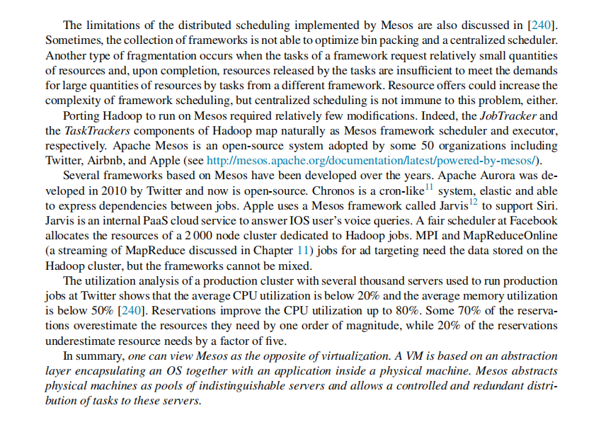
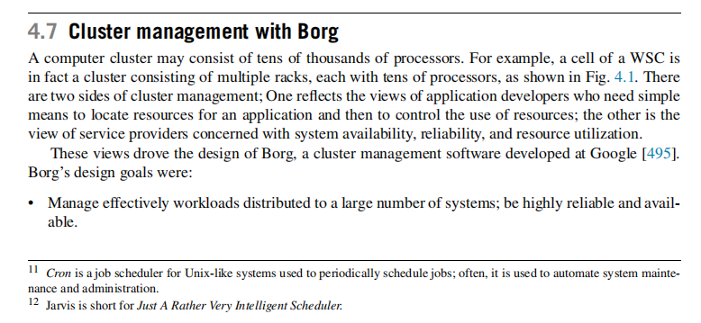
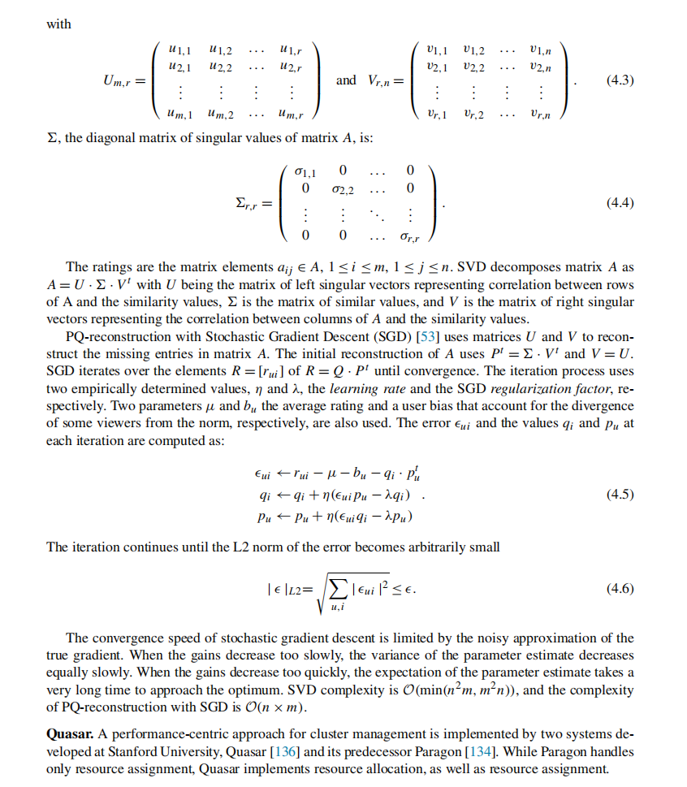
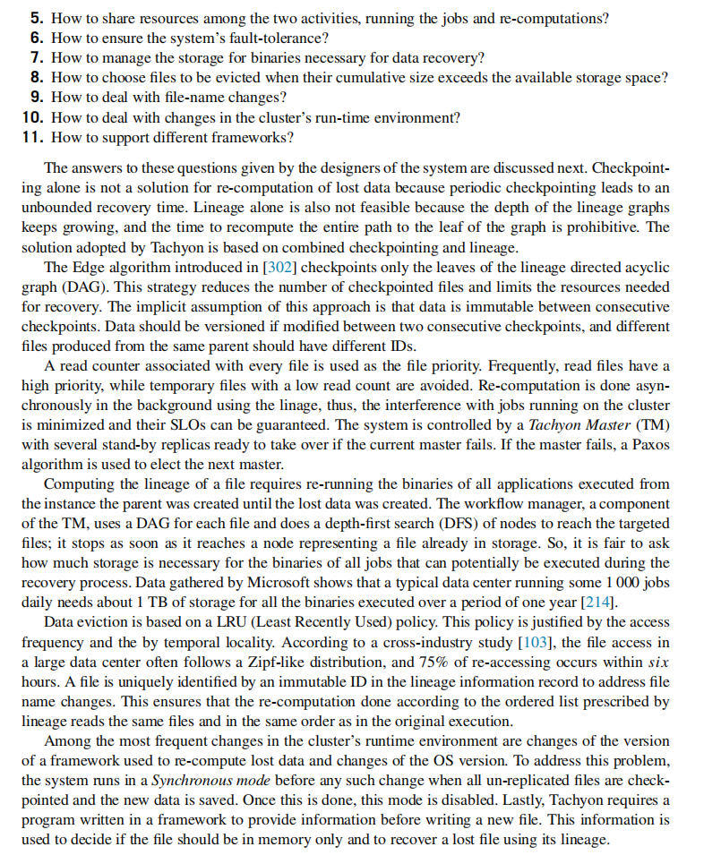

# CHAPTER   4 Cloud hardware and software


# START

**1\. 标题：云计算硬件与软件综览**

本部分主要介绍云计算如何从硬件和软件两个层面来支撑大规模、可靠且低成本的服务。云服务提供商（CSPs）通过最新的计算、通信以及软件技术构建高度可用、易于使用且高效的云计算基础设施。本章则着重讨论这些硬件和软件栈的整体概念与构成。

* * *

**2\. 详细内容解析**

下面的内容将逐段、逐点对课件截图中的文字进行深入讲解和扩展，让读者在不依赖课本的情况下，也能够理解这部分知识。

* * *

### 2.1 硬件基础设施概述

1.  **“云硬件基础设施由廉价、通用（off-the-shelf）的组件构建”**
    
    *   传统大型机或超级计算机往往由专门定制、昂贵且独特的硬件组件组成。
    *   云计算数据中心的理念是采用大量市面上常见的“通用组件”（例如标准的x86服务器）进行部署，通过规模化来降低单位计算成本。
    *   这种做法使得云计算可以提供比过去更经济、更广泛的计算资源，解决过去只有超级计算机才能处理的大规模问题。
2.  **“数百万台服务器在当今的云数据中心同时运行”**
    
    *   大型云数据中心往往拥有成千上万甚至数百万级别的服务器。
    *   通过分布式架构和集群管理，这些服务器可以对外提供统一的云计算服务。
3.  **“这些廉价服务器能完成过去只能靠昂贵超级计算机解决的任务”**
    
    *   依赖强大的集群管理和并行计算框架，云计算可以在“规模”与“分布式并行”上发力，从而在性价比和扩展性上具备巨大优势。
    *   同时，硬件故障频率也随着节点数增多而提高，因此需要在软件层面（如故障检测与容错算法、分布式文件系统等）做更多支持。

* * *

### 2.2 云系统软件概述

1.  **“云系统软件的复杂性”**
    
    *   相比传统的单机操作系统或中小规模集群管理工具，云系统软件需要处理数以万计到数百万计的计算节点，以及多样化的工作负载。
    *   不能只针对单一“杀手级应用”（killer application）进行优化，而是要支持各种形态的作业：
        *   **粗粒度的批处理（batch）**：一次性大规模数据处理，例如离线统计分析、数据挖掘或机器学习训练。
        *   **细粒度、长时间运行的应用**：如在线服务、实时分析、需要精准性能隔离以及低延迟响应的任务等。
    *   随着应用种类的丰富，对于集群性能隔离和可调度的要求越来越高，只有有针对性的调度算法和分布式资源管理机制，才能避免网络抖动和资源竞争造成的“尾部延迟”问题（长尾延迟）。
2.  **“资源虚拟化在云中的重要性”**
    
    *   为了隐藏底层复杂的物理系统结构，并让用户能够弹性使用资源，云计算大量使用虚拟化技术。
    *   虚拟机（VM）以及容器（container）都是当今云计算环境的核心支柱：
        *   **虚拟机 (VM)**：通过Hypervisor或虚拟机管理器把底层硬件资源抽象成若干虚拟实例，每个实例都好像是一台独立的“物理机”，从而便于多租户隔离和资源弹性分配。
        *   **容器 (Container)**：它基于操作系统层面的虚拟化，容器既包含操作系统必要组件，也包括应用或任务及其依赖库，可以被视为“轻量级的可移植运行环境”。相比虚拟机，容器启动速度更快、资源开销更低，也更易于分发和管理。
        *   容器虚拟化“bridges the gap between a clustered infrastructure and assumptions made by applications about their environments”——容器可以同时兼顾集群层面的资源管理需求和应用层面对环境的要求，为更灵活的部署和调度奠定基础。
3.  **“现代集群管理系统的混合工作负载挑战”**
    
    *   现今的云平台通常需要同时处理**大批量**（批处理式）和**长时间运行**（在线交互式）两类工作负载，还要兼顾服务质量（QoS）、时延等要求。
    *   调度策略需要确保：
        1.  **性能隔离**：不同应用或不同租户之间的资源互不影响。
        2.  **高级调度**：要有对延迟敏感型应用的优先排布，并能在资源发生竞争时做出合理的决策。
4.  **“大规模系统带来的新挑战”**
    
    *   在大规模集群中，“资源共享”与“性能保障”往往相互冲突，需要在调度算法、系统架构以及操作策略上不断迭代与优化。
    *   这些挑战推动了硬件体系结构和软件系统的一连串研究与改进。

* * *

### 2.3 本章主要内容结构

接下来，书中列出的各个小节（4.1~4.14）针对云计算硬件和软件栈的不同方面进行了深入解析：

1.  **Section 4.1**：
    
    *   探讨云基础设施面临的挑战，以及虚拟化和容器化的优势。
    *   介绍为什么虚拟化技术对云来说至关重要，以及容器化在现代云环境中扮演的角色。
2.  **Sections 4.2 & 4.3**：
    
    *   分析“Warehouse Scale Computers (WSCs)”，即超大规模数据中心的一些架构特征、设计思路与性能考虑。
3.  **Section 4.4**：
    
    *   重点讲解虚拟机（VMs）与Hypervisor的概念与实现方式。
    *   包括硬件辅助虚拟化技术的原理（如Intel VT-x、AMD-V）以及不同类型Hypervisor（Type-1与Type-2）。
4.  **Sections 4.5, 4.6, 4.7**：
    
    *   介绍三种常见的集群框架：
        *   **Dryad**：一种适合粗粒度数据并行应用的计算引擎。
        *   **Mesos**：更适合细粒度的集群资源共享，通过“双层调度”思想实现多框架在同一集群上共存。
        *   **Borg**：谷歌内部的集群管理系统，注重大规模集群调度的稳定性与高效利用率。
5.  **Section 4.8**：
    
    *   阐述集群管理系统的演变过程，探讨为何资源调度和管理在云计算规模下会出现新的挑战与机遇。
6.  **Section 4.9**：
    
    *   覆盖Google提出的**Omega**框架：基于全局状态共享思想的集群管理系统，用以应对多调度器并发管理同一集群状态所带来的冲突问题。
7.  **Section 4.10**：
    
    *   分析**Quasar**：一个支持QoS感知的集群管理系统，旨在满足作业的服务质量需求，同时提高资源利用效率。
8.  **Section 4.11**：
    
    *   深入讨论资源隔离问题。包括对CPU、内存、网络和存储等多种资源的隔离管理手段。
9.  **Section 4.12**：
    
    *   介绍内存计算（In-Memory Cluster Computing）的代表性系统：**Spark**和**Tachyon（现更名为Alluxio）**。
    *   讲解为什么内存计算可以大幅提升数据处理速度，及其在云环境下的价值。
10.  **Sections 4.13 & 4.14**：
     
    *   集中讲解**Docker容器**与**Kubernetes**：
        *   Docker如何简化应用打包与部署；
        *   Kubernetes如何在大规模集群上对容器进行编排与调度；
        *   容器编排系统实现弹性伸缩、高可用性、滚动升级等关键功能。

* * *

**3\. 总结**

从本次课件中可见，云计算的基础设施和软件栈在设计和实现上极其复杂。云提供商不再依赖昂贵的专用机器，而是通过采用海量通用硬件、分布式架构以及虚拟化技术来提供高可用、高弹性的大规模计算能力。软件层面，虚拟机与容器成为资源隔离和弹性伸缩的核心手段，而各种集群管理框架则负责将极其多样化的工作负载调度到海量服务器中去执行。本章后续各节（4.1~4.14）将对硬件架构（如超大规模数据中心WSC）与软件层面（如虚拟化、容器化、资源管理与调度框架）逐一剖析，阐释云计算在硬件、资源管理、容器编排以及大数据等多方面的关键技术及其演进。

* * *

**4\. 报错/补充信息**

*   当前笔记已将图片中出现的主要内容和知识点详尽解析，如有图片文字部分缺失或模糊不清之处，请告知以便进一步补充。
*   如果没有出现遗漏，可忽略本条。

以上内容即为对本次课件截图的完整笔记与解析。阅读此笔记后，即使没有课本作为辅助，也能理解云计算硬件和软件栈的背景、核心思路以及后续章节的逻辑安排。

# **4.1** Cloud infrastructure challenges


**1\. 标题：云基础设施挑战与虚拟化、容器技术概览**  
在本部分内容中，我们将深入探讨云数据中心（WSC，Warehouse-Scale Computer）的组织架构、云基础设施面临的主要挑战，以及两种核心的虚拟化手段——虚拟机与容器——如何在云计算环境中发挥作用。通过这些知识点的系统梳理，读者能够理解云基础设施的复杂性以及虚拟化与容器技术在提高资源利用率、提高应用可移植性以及简化运维方面的关键作用。

* * *

2\. 详细内容解析
----------

### 2.1 云基础设施面临的挑战

1.  **从单处理器到多处理器再到大规模集群（WSC）**
    
    *   随着计算机体系结构的演变，出现了多核、多处理器以及分布式集群系统。
    *   **WSC（Warehouse-Scale Computers）**：指拥有成百上千甚至数十万处理器的大型数据中心。它们不再只存在于理论或特殊环境中，而是现实中支撑数以百万计用户的服务。
2.  **复杂的软件栈与海量组件**
    
    *   这些WSC系统由非常复杂的分布式软件栈统一管理和控制，需要协调大量服务器、存储与网络组件。
    *   在规模巨大的通用硬件上，故障不可避免，平均无故障运行时间（MTTF）相对较短。
    *   所以，为了保证高可用和可靠性，需要在软件层面引入**容错机制**、**错误检测**及**自动恢复**能力。
3.  **高可用性的要求**
    
    *   云端长时间运行的服务（如网站、在线应用等）通常对可用性要求极高，例如 99% 的可用性意味着一个季度有 22 小时的潜在宕机时间。
    *   仅靠硬件冗余是不够的，还需要与软件级的故障检测、恢复措施相结合，才能实现如此高水平的可用性。

* * *

### 2.2 虚拟化（Virtualization）

1.  **虚拟化的目标**
    
    *   **移植性（portability）**：让应用或操作系统在不同硬件环境中轻松运行。
    *   **提高效率**：通过在同一硬件上运行多个虚拟实例，提升资源利用率。
    *   **增强可靠性**：可以将系统资源抽象化，便于故障隔离和弹性伸缩。
    *   **屏蔽底层基础设施复杂性**：对用户而言，虚拟化提供了一层抽象，让他们不必理解硬件架构的细节。
2.  **常见虚拟化示例**
    
    *   **线程（threads）**：可以视为“虚拟处理器”，允许多个程序共享同一物理CPU。
    *   **RAID**：利用冗余与分块技术对存储进行抽象，提升性能与可靠性。
    *   **处理器虚拟化**：运行多个彼此独立的操作系统实例（虚拟机）在同一台物理服务器上。
3.  **处理器虚拟化的历史与优势**
    
    *   **历史**：最早由 IBM 在 1970 年代初提出，用于大型主机；随着云计算的兴起再次流行。
    *   **优势**：
        1.  **提高资源利用率**：不同应用的资源需求在时间维度上互补，整台物理机的空闲时间减少。
        2.  **更好的应用隔离**：相较于传统进程共享模式，每个 VM 都有独立的操作系统边界，可提供更好的安全与隔离性。
        3.  **选择灵活**：应用开发者可以在熟悉的 OS 中进行开发测试；云服务提供商能在同一台物理机上部署多种不同操作系统或应用环境。
        4.  **VM 迁移（Live Migration）**：在云端可动态把运行的虚拟机搬迁到其他服务器，减少维护停机，提升可用性与运维效率。
4.  **虚拟化带来的额外复杂性**
    
    *   系统架构中新增了**Hypervisor**（又称虚拟机监控器，Virtual Machine Monitor）。
    *   一般而言，Hypervisor 的规模比常规操作系统小得多（数十万行 vs. 上百万行代码），理论上出错几率更低；但仍需配合一个管理操作系统（如 Xen 的 Dom0，负责管理来宾操作系统和硬件访问）。
    *   虚拟机镜像（VM Image）往往体积庞大，运行开销相对较重，移植性也不如更轻量化的容器。

* * *

### 2.3 容器（Containers）

1.  **操作系统级虚拟化**
    
    *   与硬件层级的虚拟化（VM）不同，**容器采用操作系统级虚拟化**：所有容器共享同一个 OS 内核，但是在文件系统、网络、进程空间等方面互相隔离。
    *   容器不仅可将不同应用相互隔离，也将它们与底层物理系统隔离。
    *   相比虚拟机镜像更“轻量可移植”，资源占用更小，也更容易监控与管理。
2.  **容器的主要优势**
    
    1.  **应用部署快捷**：可快速构建和分发容器镜像。
    2.  **应用与基础设施分离**：容器镜像在构建阶段就将依赖环境封装好，部署时无需大规模配置变更。
    3.  **良好的可移植性**：只要目标主机支持相同容器引擎（如Docker），容器即可运行。
    4.  **以应用为中心的管理**：开发者关注的对象是容器内的应用，底层运行环境由容器封装完成。
    5.  **更灵活的微服务理念**：应用可被拆分为多个独立容器单元，各自独立部署和伸缩。
    6.  **更高资源利用率**：容器开销更少，在同等硬件上可运行更多实例。
    7.  **应用性能更可预测**：容器化避免了过多的虚拟化层次，多数情况下拥有较小的性能损耗。
3.  **容器技术的历史溯源**
    
    *   早期的 `chroot` (1979年于Unix) 用于更改进程的根目录，避免访问系统外部文件。
    *   后来BSD、Linux 加入此概念，2000年 FreeBSD 推出了 `jail`，进一步强化隔离性。
    *   Docker 在容器领域大受欢迎，提供简便的镜像构建与分发；Kubernetes 专注容器编排与性能管理，在大规模集群环境中广受青睐。

* * *

### 2.4 集群管理系统的演进

1.  **Mesos**
    
    *   由加州大学伯克利分校开发，现被包括Twitter等在内的多家企业使用；也演化出了 Aurora、Marathon（Mesosphere 提供）等衍生项目。
    *   采用“双层调度”思想，让不同框架（如Hadoop、Spark等）在同一集群中协同共存。
2.  **Borg、Omega、Kubernetes**
    
    *   皆为谷歌内部或衍生的集群管理技术里程碑。
    *   **Borg**：谷歌早期的大规模集群管理系统，强调资源利用率和稳定性。
    *   **Omega**：基于状态共享的集群管理，旨在解决多调度器并发访问同一集群状态的冲突问题。
    *   **Kubernetes**：谷歌在 Borg 和 Omega 经验基础上开源的容器编排系统，现已成为云原生体系的核心技术之一。

* * *

### 2.5 WSC（Warehouse-Scale Computer）的组织结构（图 4.1）

1.  **分层结构**
    
    *   整个 WSC 由若干个**cell**组成（图中示例有 N 个 cells）。
    *   每个 cell 中包含多个机架（R racks），每个机架上有若干台服务器（S servers）。
    *   所有 cell 统一通过上层网络/交换结构与外部连接，并共同对外提供云服务。
2.  **设计思路**
    
    *   **横向扩展**：每个 cell 可以增加更多机架，或者增加新的 cell 来应对更大的负载。
    *   **高度分布式**：随着规模增长，尽量减少集中式瓶颈，采用分布式存储、分布式计算与网络技术来提供性能和容错能力。
    *   **模块化维护**：每个 cell、机架、服务器都可以独立更换或维护，减少对整体服务的影响。

* * *

3\. 总结
------

通过对以上内容的梳理，我们可以得出以下关键认识：

1.  **云基础设施具有高度复杂性与高可用性要求**：硬件层面的大规模通用组件必然带来更多故障点，需要先进的分布式软件栈和管理机制来实现故障容忍和自动化运维。
2.  **虚拟化（VM）和容器是云计算中两大重要支撑技术**：
    *   虚拟机侧重硬件层级的隔离，提供更完整的操作系统环境；
    *   容器则从操作系统层面虚拟化，具有“轻量、快速部署、资源开销低”等优势，是当今云原生应用的核心。
3.  **集群管理系统不断演进**：从 Mesos、Borg、Omega 到 Kubernetes，各有针对性的调度和管理思想，以解决大规模分布式环境中资源利用、隔离、多租户以及高效调度的难题。
4.  **WSC 的整体架构**：采用多层次的“cell–rack–server”组织方式，实现弹性扩容、分级管理，并用软件栈来弥补硬件可靠性的不足。

综上所述，云计算的基础设施挑战不仅来自于硬件规模的急剧扩大，也包括保证服务“高可用、高可靠、高弹性”所需要的系统复杂度。虚拟化与容器化的快速发展、大规模集群管理系统的不断进步，都是为了解决这些挑战并充分释放云端资源的潜力。

* * *

4\. 报错或补充信息
-----------

*   本次笔记已覆盖图片中出现的主要文字与图示要点，如有任何截图中模糊难辨或遗漏的内容，请进一步指出。若无，则可忽略此条。

以上即为关于“云基础设施面临的挑战、虚拟化与容器技术以及WSC组织结构”的完整讲解，读者无需依赖课本即可充分理解这一部分的知识脉络。

# **4.2** Cloud hardware; warehouse-scale computer (WSC)


**1\. 标题：云硬件与仓库级计算机（WSC）概述**  
本部分主要介绍了仓库级计算机（WSC，Warehouse-Scale Computer）在云计算中的关键地位，以及云数据中心硬件在网络层次、内存层次和处理器选择方面所面临的设计与性能挑战。透过对内存层级、带宽、延迟以及“brawny”和“wimpy”处理器的讨论，我们能够更好地理解WSC的整体架构和工程考量。

* * *

2\. 详细内容解析
----------

### 2.1 WSC：云计算大规模系统的核心

1.  **WSC 的概念与背景**
    
    *   WSC 由谷歌、亚马逊等云服务提供商（CSP）广泛部署，动辄拥有 50,000~100,000 个处理器。
    *   可针对\*\*数据级并行（data-level parallelism）**和**请求级并行（request-level parallelism）\*\*进行优化，因而成为现代云基础设施的支柱。
2.  **WSC 的层次化网络**
    
    *   图 4.1（前一部分）展示了 WSC 的分层结构：`服务器` -> `机架（rack）` -> `单元/阵列（cell/array）` -> 整个 WSC。
    *   **机架 (Rack)**：
        *   通常由 48 台服务器与一个 48 端口的 10 Gbps 以太网交换机相连。
        *   与上层单元/阵列之间的连接会在机架交换机上使用若干上行端口（uplink）来汇聚流量。
        *   机架内部与机架外部端口比（即内部端口 / 外部端口）会导致一定的**oversubscription（过订阅）**，比如 48/8 = 6 或 48/2 = 24，这会影响跨机架通信带宽与延迟。
    *   **单元/阵列 (Cell/Array)**：
        *   由多个机架构成，通过\*\*阵列交换机（array switch）\*\*互联。
        *   阵列交换机带宽和造价都比普通机架交换机高出约 2 个数量级（带宽和端口数的成本随端口数 n 呈大约 n² 的关系）。
        *   一个阵列交换机可支持多达 30 个机架，这样可以在单一阵列（cell）内部实现更高容量的带宽聚合。

* * *

### 2.2 内存层级与性能（表 4.1）

书中给出了一个 WSC 的 “内存层次结构”示例（包含 DRAM 与磁盘），并列出了不同层次的**延迟**（latency，单位微秒）、**带宽**（MB/s），以及**容量**（GB）：

*   **Local（服务器本地）**
    *   DRAM 延迟：0.1 μs；带宽：20,000 MB/s；容量：16 GB
    *   磁盘 延迟：10,000 μs（即 10 ms）；带宽：200 MB/s；容量：2,000 GB
*   **Rack（机架内）**
    *   DRAM 延迟：100 μs；带宽：100 MB/s；容量：1,040 GB
    *   磁盘 延迟：11,000 μs（11 ms）；带宽：100 MB/s；容量：160,000 GB
*   **Cell（单元/阵列）**
    *   DRAM 延迟：3,000 μs（3 ms）；带宽：10 MB/s；容量：31,200 GB
    *   磁盘 延迟：12,000 μs（12 ms）；带宽：10 MB/s；容量：4,800,000 GB

> 这些数字并非严格的绝对值，而是对云数据中心不同层次存储和通信特性的一个典型参考。

1.  **延迟与带宽的变化**
    
    *   从服务器本地到机架再到单元（cell），DRAM 的延迟增加了三个数量级以上，带宽则大幅下降。
    *   磁盘延迟与带宽也呈现类似趋势。
    *   如书中所举例：在同一台服务器内传输 1000 MB 的数据可能只需 50 毫秒，但跨机架需 10 秒，跨单元则需 100 秒。若是从磁盘读取，可能分别要花 5 秒、10 秒、100 秒。
2.  **对应用执行的影响**
    
    *   无论是**交互式**（interactive）还是**批处理**（batch）工作负载，都需要考虑数据分布、数据大小和计算节点之间的距离。
    *   应用在部署和调度时，要尽可能让相关计算和数据“就近”放置，才能降低延迟、节省带宽成本。

* * *

### 2.3 WSC 的成本与运营

1.  **WSC 的总体造价**
    
    *   虽然建设一个大型云数据中心需要上亿美元投入（如文中提到的约 1.5 亿美元），但其**性价比**在大规模时体现最优。
    *   成本主要包括：服务器购置、网络互联设备、机房建设和能耗（电力、散热等）。
    *   运营成本亦不可忽视，如文中所述的案例：1.6751 亿美元的总资本支出，其中包括数万台服务器、上千台机架交换机、若干台阵列交换机及路由器等，再加上机房能耗（可达 8 MW）。
2.  **功耗与散热**
    
    *   功耗在云环境里极为重要，因为电力费用和散热需求都随着硬件数量增长而显著提升。
    *   选择什么样的处理器（高性能 vs. 低功耗）直接影响到功耗、性能，以及整体成本效益的平衡。

* * *

### 2.4 WSC 服务器与多核处理器

1.  **多核处理器的价值**
    
    *   现代云应用中既包含**数据级并行**（大规模数据分析、搜索）也包含**请求级并行**（海量并发请求）。多核架构可同时处理多线程或并行任务，从而提升吞吐量。
    *   常被称为**brawny core**与**wimpy core**的两种思路：
        *   **brawny（强壮）核心**：单核性能强，功耗也高。
        *   **wimpy（瘦弱）核心**：单核性能较弱，但更省电；通过增加核数来提升总并行度。
2.  **brawny 与 wimpy 核心的取舍**
    
    *   **brawny 优势**：单线程性能高，可减少软件开发的复杂度，因为很多应用（尤其是实时交互请求）依赖单线程响应速度。
    *   **wimpy 优势**：功耗低，能在同样功率预算下布置更多核心，提高集群的总并行处理能力。
    *   **面临的挑战**：
        1.  若使用 wimpy core，需要在软件层显式地平行化（增加多线程或分布式任务）来充分利用更多内核，否则单线程性能不足会造成响应延迟。
        2.  多线程/多进程会带来更多的**同步开销**与**调度开销**。一些需要全局同步的算法（barrier-synchronization）会因最慢的线程导致整体等待。
        3.  当大量 wimpy 节点一起工作时，内存开销和资源争用可能增大。例如，需要在更多节点上同时加载应用数据结构，反而可能导致性能下降。
    *   当单线程性能落后主流通用处理器超过约一倍或两倍时，很难在商业上证明大规模使用 wimpy 处理器的合理性，因为用户端的请求往往期望更低延迟。
3.  **Hölzle 的观点**
    
    *   一旦单核性能较主流处理器落后一倍以上，对许多基于单线程请求处理的应用而言，很难达到预期的延迟目标。
    *   应用开发者也会认为这是一种“性能倒退”，从而对大规模使用 wimpy 核心持谨慎态度。

* * *

3\. 总结
------

*   **WSC（Warehouse-Scale Computer）** 通过分层次的网络互联（机架→单元→整体数据中心）支撑大规模并行计算与海量并发请求。
*   **内存/通信层次**决定了数据访问和计算分布策略：服务器本地访问最快、跨机架和跨单元延迟与带宽差异显著，影响应用的总体性能与调度策略。
*   **成本与功耗**是云数据中心核心考量：虽然初始投入巨大，但大规模部署所带来的单位计算成本降低使其具备经济可行性。
*   **处理器选择**需在单核性能与能耗间权衡：brawny 核心提供更好单线程性能，wimpy 核心具有更高能效比，但需强大的并行化编程能力以及应对同步开销的机制。
*   对于云服务提供商而言，如何在**性能、能耗与应用需求**之间做出平衡，将直接影响数据中心的设计与运营成本。

* * *

4\. 报错或补充信息
-----------

*   当前笔记已覆盖截图中所有主要知识点。若您发现有截图中的文字未被解析或解释，请告知以进一步完善。
*   若无，则可忽略本条。

综上所述，这部分内容围绕“仓库级计算机”的网络层次、内存访问特点以及处理器选择策略展开，全面揭示了云数据中心在硬件设计与性能优化上的挑战与应对思路。通过了解这些基础设施要点，可以更好地理解后续与集群管理、虚拟化及容器化技术相关的讨论。


* * *

## **4.3** WSC performance

## 


**1\. 标题：云端大规模系统（WSC）的性能分析与微架构优化要点**  
本部分深入讨论了如何在仓库级计算机（WSC）中提取最大化的性能，以及导致WSC性能低效的一些根源及可能的优化方向。通过谷歌大规模数据（GWP）调研结果、对常见通信/序列化/压缩流程的开销分析，以及对现代CPU微架构的Top-Down分析方法，我们可以更清晰地了解WSC工作负载的特点与瓶颈。

* * *

2\. 详细内容解析
----------

### 2.1 WSC性能问题概述

1.  **核心问题**
    
    *   怎样才能从WSC中提取出最大性能？
    *   主要的性能低效（inefficiency）从何而来？
    *   如何避免、或尽可能减少这些性能浪费？
2.  **影响层面**
    
    *   **即使微小的性能改进**，对云服务提供商（CSP）来说都可能带来大规模的成本节约；对用户而言则可享受显著更好的服务质量。
    *   由于云计算工作负载种类非常多，很难通过“一个杀手级应用”来驱动所有设计决策，因此需要从真实生产环境和不同应用实践中采集分析数据。

* * *

### 2.2 多样化工作负载与监测工具：Google-Wide-Profiling (GWP)

1.  **多样性挑战**
    
    *   WSC 中应用类型繁多：无论是批处理还是延迟敏感的前端服务，都同时存在。
    *   **缺乏可在大规模真实场景中随意试验的环境**，只能在生产运行时，利用低开销监控工具搜集采样数据，然后进行分析。
2.  **GWP（Google-Wide-Profiling）的原理**
    
    *   **随机采样**：GWP 会每天随机选择一批服务器，通过工具（如Perf）对它们进行短时间的性能采样。
    *   **采集callstack**：对CPU上正在执行的子程序调用栈信息（call stacks）进行记录。
    *   **低开销**：通过采样而不是全量跟踪，尽可能减少对应用的干扰；只维护事件计数器，而非全部事件记录。
    *   数据会被汇总到数据库中，形成对生产系统各类应用的性能画像。
3.  **GWP在C++应用上的分析**
    
    *   研究团队分析了长达36个月的数据，但只对C++程序进行深度统计（C++在CPU周期消耗中占比最高），其余如Java、Python、Go语言暂不在此处分析。
    *   大约来自20,000台服务器（基于Intel Ivy Bridge处理器），最后聚焦12个执行二进制（含Gmail前后端、BigTable、disk、indexing、search、ads、video、flights-search等），分别具备：
        *   批处理或延迟敏感特征；
        *   以及底层系统服务（如分布式存储驱动）的功能。

* * *

### 2.3 “WSC架构税”：通信与通用库开销

1.  **通信相关开销**
    
    *   大多数云应用都要在多台服务器间进行通信；集群管理软件本身也会分散在集群每个节点上，进行调度与负载均衡决策。
    *   **RPC调用**（Remote Procedure Calls）：包括序列化、反序列化、压缩/解压缩，以及网络协议本身的处理。
    *   根据11个月的数据，RPC的通用开销（或称“WSC architecture tax”）可占用\*\*22%~27%\*\*的CPU周期。
    *   其中约1/3的RPC用于集群管理（加密数据、检测故障、平衡负载等），其余则在应用任务和系统过程之间传递数据。
2.  **库函数（memmove、memcpy等）的数据搬移**
    
    *   除了RPC，很多数据搬移也发生在标准库函数层面（如memmove和memcpy），此部分占据总“税费”的4~5%。
    *   **压缩、解压缩、哈希及内存分配/重分配**等流程，也可各自占据该“税费”四分之一以上的CPU时间。
3.  **影响与优化**
    
    *   云端应用大约有1/5的CPU周期花费在调度器和内核等“周边”上，这意味着若能减少RPC通信和常见库函数的额外消耗，就能显著提升WSC的整体利用率。
    *   许多云应用的可执行文件体积本身就很大（数百MB以上），且缺乏空间或时间局部性，如何高效利用缓存与内存管理亦成为挑战。

* * *

### 2.4 内存层次与缓存失效

1.  **内存延迟大于内存带宽问题**
    
    *   当处理器试图发挥指令级并行（ILP）时，内存访问的等待（延迟）会产生大量停顿周期（stall cycles）。
    *   数据Cache miss（数据缓存缺失）被报道占 50~60% 的停顿周期；加上指令缓存缺失导致的停顿，也在显著降低实际IPC（每周期指令数）。
2.  **工作集尺寸大，导致缓存效率低**
    
    *   现代云应用往往有巨大的可执行体（binary）和海量数据集，对L2/L3缓存提出高要求。
    *   指令cache和数据cache都容易miss，而且随着大数据处理需求的增长，这些问题只会愈发明显。
3.  **指令级并行（ILP）受阻的主要原因**
    
    *   **分支预测困难**（如go,mbk之类应用中普遍存在的不可预测分支）。
    *   **硬件线程（SMT）可部分缓解**内存等待，通过在停顿周期里切换到另一线程执行。但SMT需要更大的寄存器文件等硬件资源支持。
    *   **链表等间接寻址**数据结构会削弱预取器（prefetcher）的效果，导致流水线空闲增加。

* * *

### 2.5 现代处理器微架构与Top-Down分析方法（图4.2）

1.  **微架构分块**
    
    *   **前端（front-end）**：含有L1指令缓存、预解码（pre-decode）、分支预测（branch predictor）、指令队列、微操作缓存（MicroOp Cache）等；负责取指令、解码、分配并生成微操作（micro-ops）给后端。
    *   **后端（back-end）**：含重命名（rename）/分发单元、调度器（scheduler）、多个执行端口（ALU、FPU、向量单元、Load/Store单元等），以及L1数据缓存、统一L2缓存，最终连接内存控制器。
    *   Out-of-order执行由重排序缓冲区（Reorder Buffer）等组件支持。
2.  **Top-Down分析**
    
    *   该方法把微操作队列当作前端与后端的分界点，将CPU周期分为：
        1.  **Retiring**：真正完成有用工作的周期（指令退休阶段）。
        2.  **Front-end bound**：因取指、解码或指令cache缺失等导致的前端延迟。
        3.  **Bad speculation**：分支错误预测或其它投机执行失败导致的浪费周期。
        4.  **Back-end bound**：内存层次、执行单元带宽不足等导致的停顿。
    *   谷歌工作负载中，约15~30% 的周期可归为浪费周期（front-end或其它方面），而SPEC CPU2006基准更少出现前端瓶颈，说明云工作负载在缓存缺失和低重退休率等方面有其独特之处。
3.  **测量结果**
    
    *   后端（back-end）和内存子系统往往是性能的主要瓶颈，限制了指令级并行度。
    *   同时观察到多个物理核心的实际活跃度：在某些场景下，CPU并未被满载，有时只有 1~2 核处于活跃状态（占72%的时间），有时只有 3 核处于活跃状态（占28%的时间）。
    *   有研究显示“平均CPU利用率仅10%”，而其它文献则报告“40~70%”。 不同测试场景下的差异表明云负载的可变性非常大。

* * *

3\. 总结
------

1.  **WSC应用多样化，且普遍存在通信开销**
    *   大规模分布式系统需要频繁RPC、序列化/反序列化、数据移动，从而产生额外CPU“税费”（占 22~27% 的周期），一半以上与集群管理或系统库函数相关。
2.  **内存与缓存问题依旧突出**
    *   大型二进制与高增长率的内存需求，导致指令cache和数据cache的缺失率较高；数据cache miss 能造成 50~60% 的停顿周期。
    *   短时间内难以通过简单增加缓存来彻底解决，因为工作集的规模也在不断膨胀；需要更智能的缓存策略或更高层的算法优化。
3.  **微架构级分析利于找出瓶颈**
    *   Top-Down 方法把CPU性能浪费精确分割为前端（取指/解码问题）、投机错误及后端（内存/执行单元等）阻塞；能帮助工程师定位优化方向。
    *   云工作负载常表现出“burst + stall”的执行模式，对并行度和硬件线程支持提出了更高要求。
4.  **CPU利用率与负载峰值并非一致**
    *   某些研究统计出低CPU利用率，也有报告指出CPU利用率可达40~70%；这差异可能源于不同类型应用的峰谷周期差异大，也说明在云场景中进行性能分析需要持续地、广泛地采样。

* * *

4\. 报错或补充信息
-----------

*   若发现图片中仍有未被讲解的内容或数据，请提示以便补充；若无，则可忽略此条。

通过以上笔记，读者可对WSC性能分析有系统了解：从真实负载采样与RPC“架构税”，到微架构层面的缓存失效与流水线停顿，再到Top-Down诊断方法。这些要点共同构成了云应用在超大规模系统中面临的主要瓶颈与优化空间。

# **4.4** Hypervisors


**1\. 标题：Hypervisor（虚拟机监控器）的原理与关键技术**  
本部分介绍了Hypervisor在云计算环境中的角色及其核心机制，包括如何将物理硬件安全地分区给多个虚拟机（VM），并保障它们之间的隔离与资源调度。通过理解Hypervisor的工作流程，我们能更深入了解云上多租户隔离、动态迁移（live migration）以及内存虚拟化等关键技术。

* * *

2\. 详细内容解析
----------

### 2.1 Hypervisor的基本概念

1.  **Hypervisor是什么？**
    
    *   它是一种软件层，运行在主机硬件之上，用于安全地将计算机系统的资源（CPU、内存、网络等）划分并分配给一个或多个虚拟机（VMs）。
    *   来宾操作系统（guest OS）并不直接访问底层硬件，而是在Hypervisor控制下运行。
    *   Hypervisor通常在内核态（kernel mode）运行，而VM内部的来宾系统在用户态（user mode）运行，有时会有第三种“来宾内核态”，具体取决于硬件虚拟化特性。
2.  **Hypervisor的主要作用**
    
    *   **多租户隔离**：同一台物理服务器可同时运行多个不同的VM，相互之间彼此隔离，安全性更高；
    *   **动态迁移（Live Migration）**：可将正在运行的虚拟机从一台主机平滑地移动到另一台；
    *   **系统修改与兼容性**：在原有物理系统的接口之上提供抽象层，可在不影响底层硬件兼容性的情况下，对系统进行升级、扩展、修复等。

* * *

### 2.2 处理器与特权指令的管理

1.  **特权指令的截获与管理**
    
    *   当来宾操作系统（guest OS）执行特权指令时，Hypervisor会捕捉（trap）该指令：
        *   例如，来宾系统试图修改中断向量表或访问某些仅硬件可访问的寄存器等。
    *   Hypervisor验证并确保这些操作在安全可控的范围内再执行，从而避免VM对硬件或其他VM造成不良影响。
    *   这能保证**安全性与封装**（encapsulation），也是云计算中多租户安全的核心关注点。
2.  **性能监测与故障防护**
    
    *   Hypervisor实时监控各个VM的运行状态、性能指标，并可及时采取措施防止整体性能劣化。
    *   例如，当某VM内存消耗过大、开始频繁换页（thrashing）时，Hypervisor会将该VM进行swap out（将其内存页写到磁盘），以释放更多物理内存供其他VM使用。

* * *

### 2.3 CPU与内存虚拟化

1.  **CPU虚拟化**
    
    *   Hypervisor会拦截硬件中断，再将其分发给适当的VM；如果来宾操作系统禁止中断，则只有在Hypervisor允许的情况下才真正屏蔽中断。
    *   这样可以让每个VM都像在独占CPU硬件上运行，同时又保持对外部硬件设备和中断管理的统一控制。
2.  **内存虚拟化与影子页表（Shadow Page Table）**
    
    *   为让来宾OS具备自己的地址空间映射，Hypervisor通常会维护一份“影子页表（shadow page table）”。
    *   每当来宾OS修改自己的页表时，Hypervisor会将这些修改同步到影子页表，从而确保实际物理地址映射的一致性。
    *   在硬件支持下，内存管理单元（MMU）通过该影子页表进行动态地址转换，为各个VM提供隔离且灵活的内存使用。
3.  **内存虚拟化的性能影响**
    
    *   同页合并（page sharing）：例如VMware会对不同VM上的相同内存页面使用同一个物理拷贝并启用写时复制（copy-on-write），减少整体内存占用。
    *   反复切换和swap out：在Xen中，强制每个VM拥有固定大小的共享地址空间，或使用“热气球”进程（ballooning）向VM请求归还未使用的内存页。
    *   **“气球进程”机制**：当Hypervisor检测到物理内存紧缺时，会在需要收回内存的VM中运行一个“balloon process”，该进程会申请大量页，将它们从VM的可用内存中“抢走”，再将这些页交还给Hypervisor供其它VM使用。这样可避免大量换页导致性能崩溃。

* * *

### 2.4 典型Hypervisor的实现差异

1.  **VMware ESX/ESXi**
    
    *   有全面的内存管理和页共享技术（transparent page sharing）。
    *   也支持热迁移（vMotion），可在不停止VM的情况下进行硬件层变更。
2.  **Xen**
    
    *   Xen 的架构中包含“Dom0”（管理域）和多个“DomU”（客户域）。
    *   Dom0 负责I/O和管理操作，DomU运行来宾OS并使用被分配的资源。
    *   Xen从软件层面给每个VM划分内存，并使用paravirtualization或硬件辅助虚拟化来实现更高效的指令截获。
3.  **KVM**
    
    *   KVM基于Linux内核，自身是一个内核模块，将Linux本身转变为一个Type-1的Hypervisor。
    *   使用硬件虚拟化扩展（如Intel VT-x或AMD-V），大部分内存映射与处理器分发都在硬件层执行，加速VM的上下文切换。

* * *

### 2.5 安全与可管理性

*   **安全优势**：
    *   由于来宾OS不直接访问硬件，Hypervisor可以拦截所有关键操作；若来宾系统出现漏洞或攻击行为，难以直接威胁到宿主机或其他VM。
*   **管理优势**：
    *   通过对VM镜像与配置的集中管理，云平台能够快速分配资源、上线/下线服务。
    *   动态迁移和快照（snapshot）功能有助于弹性伸缩以及在故障发生时进行迅速恢复。

* * *

3\. 总结
------

1.  **Hypervisor实现多租户安全与资源分配**：通过截获特权指令、管理中断与内存映射，Hypervisor将同一物理硬件的资源安全地虚拟化给多个VM。
2.  **内存虚拟化机制是关键性能瓶颈**：影子页表、共享页、热气球进程等技术既能节省资源又可能带来额外开销，需权衡取舍。
3.  **动态迁移与灵活扩展**：Live Migration等功能使云服务提供商得以在繁忙负载中进行快速调度与失效转移，同时也对Hypervisor的可靠性和可移植性提出更高要求。
4.  **不同Hypervisor的实现差异**：VMware、Xen、KVM等都通过不同的架构和优化手段来处理CPU虚拟化、内存虚拟化及I/O管理，共同支撑云计算的核心服务。

* * *

4\. 报错或补充信息
-----------

*   当前笔记已对图片中的主要内容进行详细解释。如有部分信息在图片中模糊或遗漏，请告知以便补充。若无，则可忽略本条。

以上即为本次关于Hypervisor技术原理与应用的完整笔记。它为了解虚拟化在云计算中的多租户隔离、安全、资源调度和性能优化提供了基础。

# **4.5** Execution of coarse-grained data-parallel applications


**1\. 标题：基于SPMD范式的粗粒度数据并行与典型框架：MapReduce、Hadoop与Dryad**

本部分讨论了如何利用粗粒度数据并行（coarse-grained data-parallelism）来高效处理海量数据集，重点介绍了SPMD（Same-Program-Multiple-Data）模型的核心思想，以及MapReduce、Hadoop和Dryad等框架在云端大规模任务中的应用与演进。

* * *

2\. 详细内容解析
----------

### 2.1 粗粒度并行与SPMD简介

1.  **粗粒度并行（coarse-grained parallelism）**
    
    *   章节 3 中曾区分细粒度与粗粒度并行。在粗粒度并行中，一个大型数据集可被拆分为多个相对独立的分块，分别由不同处理节点并行执行。
    *   与需要密集通信的细粒度并行不同，粗粒度通常以较少的同步或通信为特征，易扩展到大规模集群。
2.  **SPMD（Same-Program-Multiple-Data）模型**
    
    *   由来已久，广泛用于高性能并行计算。
    *   “相同程序”在若干并行处理节点上运行，每个节点处理不同的输入数据子集。
    *   例如，处理 10^9 张图像可将之分成 1000 片数据，每片 10^6 张图片，然后让 1000 台处理器并行执行转换工作，从而把总计算时间缩短约三个数量级。
3.  **云计算环境下的优势**
    
    *   这种工作负载适合在云端运行，一旦任务开始，就能将资源长时间保持高利用率。
    *   无需在执行中途做过多复杂调度，直到整个转换完成为止，这对云服务提供商（CSP）而言是很有利的。

* * *

### 2.2 MapReduce与Hadoop

1.  **MapReduce的诞生**
    
    *   2004 年提出，一种两阶段并行模型：先进行Map（对数据分片做并行处理），再进行Reduce（对中间结果做汇总或进一步计算）。
    *   分布式文件系统（HDFS）与MapReduce计算框架搭配，提供良好的扩展性。
2.  **半“尴尬并行”（not totally embarrassingly parallel）**
    
    *   在转换图像的示例中，如果我们并非只转换，而是还要在Reduce阶段做合并、搜索或整合信息，就需要在后期对中间结果进行额外处理。
    *   MapReduce的Reduce阶段正是解决这类“部分需要交互/合并”的场景。

* * *

### 2.3 Dryad：面向粗粒度数据并行的通用执行引擎

1.  **Dryad简介**
    
    *   由微软在 2007 年推出，最初作为内部与Hadoop相似的分布式并行框架，用于在一组计算节点间并行执行数据流图（dataflow graph）。
    *   **数据流图**：由“顶点（vertices）”和“边（links）”组成的有向无环图，每个顶点代表一个并行计算操作，边则表示数据在顶点间通过文件、TCP管道或共享内存进行传输。
2.  **整体工作流程**
    
    *   **Job Manager (JM)**：集中式管理器，负责接收用户或应用的描述信息，构建数据流图。
    *   **Name Server (NS)**：负责定位集群中实际执行的节点位置。
    *   **Daemon**：在每个集群节点上运行的守护进程，接受JM分配的子任务并执行对应顶点的代码。
    *   各Daemon之间直接通信以传递数据，实现图中边的连接和调度，无需JM介入。
3.  **DryadLINQ (DLinq)**
    
    *   基于 .NET 的语言扩展（LINQ），可通过高层次的查询式编程自动把数据并行操作转换为Dryad分布式执行流程。
    *   并非面向 SQL 这样的声明式操作，而是支持命令式编程和更灵活的数据处理。
    *   然而，Dryad 后来因其扩展性和开源生态不及 Hadoop，并且微软将资源转向 Azure 与Windows Server 的分布式方案，最终停止了Dryad项目的继续。

* * *

### 2.4 小结与对比

1.  **MapReduce/Hadoop特色**
    
    *   两阶段编程模型（Map、Reduce）；
    *   在开源社区广受支持，HDFS + MapReduce构建完整大数据生态系统（如Hive、Pig等工具）。
2.  **Dryad特色**
    
    *   以数据流图（DAG）驱动执行，可表达更灵活的计算流程，不限于Map与Reduce两阶段。
    *   与LINQ集成在 .NET 环境中，提供了更高级别的语言抽象。
3.  **适合场景**
    
    *   无论是MapReduce还是Dryad，主要处理的都是**粗粒度数据并行应用**：
        *   数据切分后，各个分片在节点间相对独立地完成大部分计算，少量通信或同步发生在组合阶段。
        *   典型案例包括数据转换、批量搜索、分布式索引构建、统计分析、机器学习训练等。

* * *

3\. 总结
------

*   **SPMD**：针对海量数据集采取“相同程序 + 数据分片并行”的方式，可以大幅度减少总执行时间，是云计算批处理场景的核心思路之一。
*   **MapReduce与Hadoop**：为处理大规模数据提供了分布式存储（HDFS）和基于Map-Reduce范式的易用框架；在开源社区被广泛应用和拓展。
*   **Dryad**：微软提出的通用数据流图计算引擎，允许更灵活的有向无环图（DAG）编排；DryadLINQ进一步将.NET语言特性与分布式计算结合。然而该项目后续发展停滞，市场份额被更成熟的开源大数据生态所占据。
*   **粗粒度并行的本质**：通过最小化节点间通信与简单的并行调度，获得良好的扩展性，这也是云环境下大数据处理的重要成功因素。

* * *

4\. 报错或补充信息
-----------

*   目前笔记已覆盖截图中主要内容。如有任何图片文字未被解析或解释，请告知以便补充；若无，则忽略此条。

通过以上内容，读者可全面理解基于SPMD范式的粗粒度并行处理在云计算中的核心地位，以及MapReduce/Hadoop和Dryad在大数据处理中各自的设计思路与适用场景。

# **4.6** Fine-grained cluster resource sharing in Mesos





**1\. 标题：Mesos 在细粒度集群资源共享中的机制与实践**  
本部分重点介绍了由加州大学伯克利分校团队开发的轻量级调度系统 Mesos，及其在大规模集群下的细粒度资源共享（fine-grained cluster resource sharing）理念。通过 Mesos 的“两级调度”模式、资源 offer 概念以及与各类框架（Hadoop、MPI 等）的集成方式，我们能深入了解为何 Mesos 对多框架、混合负载的集群具有灵活可扩展的调度能力。

* * *

2\. 详细内容解析
----------

### 2.1 Mesos 简介

1.  **核心目标**
    
    *   提供“细粒度”的资源共享，而非传统集群系统那种固定资源槽位（slots）或集中式调度。
    *   减轻集中式调度在大规模集群中产生的性能和可扩展性瓶颈。
2.  **轻量化和跨平台**
    
    *   Mesos 的 C++ 代码量仅约 1 万行，体量小、易维护。
    *   能运行于 Linux、Solaris、OS X 等操作系统，支持 C++、Java、Python 等语言的框架。
    *   可利用 Linux 容器（cgroups 等）隔离 CPU 核心和内存，从而实现不同任务间的安全隔离。
3.  **与虚拟化的对比**
    
    *   传统 VM 虚拟化：将一台物理机抽象为若干台虚拟机，每个虚拟机包含一个完整操作系统环境。
    *   Mesos：“反向”抽象，把集群中的所有服务器视为“统一的资源池”，由 Mesos 来分发任务到每个物理节点上。

* * *

### 2.2 两级调度策略与资源 Offer 模型

1.  **两级调度（Two-Level Scheduling）**
    
    *   **第一层**：Mesos Master 负责在所有工作节点上收集可用资源，并以“资源 offer”的形式将这些资源通知给各框架（Frameworks）。
    *   **第二层**：各框架自身拥有“Scheduler”，在收到 Master 提供的资源后，可自主决定如何使用资源来调度自身的任务。
    *   通过这样分层的架构，Mesos 保持了核心调度逻辑的简洁，让每个框架（Hadoop、MPI、Spark 等）根据自身需求做细粒度的任务调度。
2.  **Resource Offer**
    
    *   是 Mesos 引入的一个抽象概念，表示一组可用于执行任务的 CPU、内存以及其他可能的资源（如 GPU、网络带宽、端口等）。
    *   框架 Scheduler 收到 Offer 后，可以“接受（accept）”全部或部分资源来启动新任务，也可以“拒绝（decline）”不需要的资源以便 Mesos 将其分配给其他框架。
3.  **Framework 的角色**
    
    *   每个框架包括：
        1.  **Scheduler**：接收资源 Offer，决定如何分配给任务；
        2.  **Executor**：运行在集群各节点上，负责真正启动和管理框架的任务进程。
    *   调度器与 Executor 之间通过 callback（如 `resourceOffer`, `statusUpdate`）和 action（如 `replyToOffer`, `launchTask`）通信。

* * *

### 2.3 Mesos 架构与容错

1.  **Master / Slave / ZooKeeper**
    
    *   **Master**：进程管理集群的全局信息，追踪所有节点（也称 Slaves 或 Agents），并将资源以 Offer 形式分配给各框架。
    *   **Slave（Agent）**：运行在每台工作节点上，接受 Master 下发的任务指令、执行相应的 Executor。
    *   **ZooKeeper**：用于选举新的 Master（Paxos 风格一致性算法），保障集群在 Master 故障时能自动切换至热备 Master，提高可靠性。
2.  **资源隔离模块**
    
    *   Mesos 可插入自定义的隔离模块（如 cgroups）去限制 CPU、内存、网络带宽及 I/O 使用等。
    *   能够根据各框架的特定需求制定不同资源管理策略，比如为贪婪或有故障的任务预留特定保护措施。
3.  **可扩展与高可用**
    
    *   通过两级调度分担负载，避免了在 Master 上进行过于精细的集中式调度。
    *   Master 进程设计为可复制（replicated masters），任一节点崩溃后剩余 Master 能快速接管。

* * *

### 2.4 Mesos 在生产环境中的实践

1.  **调度效率与资源利用**
    
    *   Twitter 在数千台服务器的生产集群中使用 Mesos，观测到平均 CPU 利用率低于 20%，平均内存利用率低于 50%。
    *   使用“Reservations”机制后，CPU 利用率可提升至 80%。但也发现高达 70% 的资源请求量被高估了一个数量级，而另有 20% 的资源请求则被低估了 5 倍之多。
    *   这说明在多租户环境下，应用对资源的需求常有不确定性，Mesos 通过资源 Offer 和弹性调度能较好地应对这种变动。
2.  **碎片化问题**
    
    *   当多个框架各自提交短任务，释放的资源可能不足以满足其他大任务，对资源打包（bin packing）不够优化时，会导致资源碎片化。
    *   集中式调度、分布式调度各有优劣：前者在大规模集群中易成为瓶颈，后者在某些场合仍存在局部优化不足的问题。
3.  **与其他框架集成**
    
    *   Mesos 在运行 Hadoop 时，只需对原有的 JobTracker、TaskTracker 做较少修改，即可将它们替换为 Mesos 的调度器与执行器。
    *   许多公司（Twitter、Airbnb、Apple）都基于 Mesos 构建自己的 PaaS 平台或内部大数据调度系统，例如
        *   **Apache Aurora**：可表达任务间的依赖关系，支持弹性伸缩和定时任务；
        *   **Chronos**：类 cron 的调度系统；
        *   **Jarvis**：Apple 用于 Siri 的内部 PaaS 云服务。

* * *

### 2.5 与虚拟化的关系：两种抽象的对比

*   **虚拟机抽象**：将一台物理机抽象为多个逻辑机器（VM），每个 VM 内跑完整操作系统和应用；
*   **Mesos 抽象**：把一组物理机视为一台“大机器”，让调度器把应用任务分发到不同节点执行。

正如文中总结所言：“可将 Mesos 看作虚拟化的反面”，它更注重对整个集群的全局资源池管理，而非在单个节点上运行多个 OS 实例。

* * *

3\. 总结
------

1.  **细粒度资源共享**：Mesos 通过两级调度和资源 Offer 模型，解决大规模集群中单一集中式调度的可扩展和效率难题，同时允许不同框架自由调度各自任务。
2.  **混合多框架支持**：Hadoop、MPI、Spark 等都可平等地与 Mesos 集成，在同一集群上并行运行，从而提升资源利用率。
3.  **生产实证**：Twitter 等大规模使用 Mesos，呈现较高的资源利用率改进（CPU 从 20% 提升到 80%），说明其在云环境中具备良好的弹性和容错特性。
4.  **局限与思考**：分布式调度可能带来资源碎片化；集中式调度虽有整体视图，但在超大规模集群中可能出现性能瓶颈。实践中需要结合负载类型、系统规模去平衡调度方式。

* * *

4\. 报错或补充信息
-----------

*   当前笔记已包含截图所示之文字与概念的完整解析。如有遗漏或图片模糊，请告知以便补充；若无，则可忽略此条。

从以上内容可见，Mesos 的设计理念在云环境下针对多租户、大规模混合负载有显著优势，既能提升集群利用率，又保留了各框架独立调度与隔离的灵活性。

# **4.7** Cluster management with Borg



**1\. 标题：Borg 集群管理：谷歌内部大规模调度系统的设计与要点**  
本部分聚焦于谷歌开发的集群管理软件 **Borg**，从系统架构、核心组件、调度流程以及实际运维效率等方面进行了介绍。Borg 是谷歌面向数万台服务器（WSC 级别）的关键生产调度系统，具备高可靠性、高可用性以及对多种工作负载（生产环境和批处理）的统一管理能力。

* * *

2\. 详细内容解析
----------

### 2.1 Borg 的背景与目标

1.  **云时代的集群规模**
    
    *   一个典型的谷歌数据中心（也称 WSC 的一个 cell）包含数以千计乃至上万台服务器。
    *   Borg 作为集群管理工具，需要同时满足应用开发者和服务提供者两种视角：
        *   **开发者视角**：希望简单地获取资源来部署应用；
        *   **服务提供者视角**：追求高可用性、可靠性与资源利用率。
2.  **Borg 的主要设计目标**
    
    1.  **有效管理海量工作负载**：谷歌生产环境包括在线服务（高优先级、交互式）和后台批处理（低优先级、可延时）作业，Borg 要同时调度并保证整体效率。
    2.  **对应用隐藏底层细节**：开发者无需了解硬件差异或节点故障处理；Borg 自动执行资源管理、失败重启、负载均衡等。
    3.  **支持长时间运行、可靠的应用**：必须提供高可用性，允许在任务或节点故障时自动恢复。

* * *

### 2.2 Borg 的核心架构

1.  **Cell（Borg Cell）**
    
    *   谷歌将每个集群称为一个“Cell”，内部包含数万台机器。
    *   每个 Cell 中有一个逻辑上的集中式管理模块：**BorgMaster**，以及分散在各节点上的 **Borglet**。
2.  **BorgMaster**
    
    *   由多个副本（5个 Replica）组成，每个副本维护一个内存中状态机（基于 Paxos 进行一致性存储），在本地磁盘上也保留了基于 Paxos 的日志用于故障恢复。
    *   **Master 组件**包含：
        1.  **Control**：处理用户请求（提交、终止、更新）并与 Borglets 进行通信。
        2.  **Scheduler**：按优先级队列轮询待处理的任务；通过“可行性（feasibility）”和“评分（scoring）”机制为每个任务找到合适的机器。
        3.  **Persistent Store**：用于记录 Cell 的关键状态，以便在系统重启或分析时进行恢复。
    *   **调度过程**：
        *   **Feasibility**：先判断节点是否具备满足任务基本需求（如 CPU、RAM、磁盘等）的资源；
        *   **Scoring**：对可行节点进行打分，综合考虑负载平衡、历史使用情况、距离等，选出最合适的机器。
3.  **Borglet**
    
    *   运行在每个机器上，负责接收 BorgMaster 下发的指令：启动、停止或重启容器（或进程），并在节点上进行资源分配和管理（例如限制 CPU、内存占用）。
    *   它汇报机器的健康与状态变更，并执行 OS 层面的设置来支持应用需求（如内核参数调优等）。
4.  **任务状态流转**
    
    *   图 4.4 给出了 Borg 任务在提交后所经历的状态：
        *   **Pending**：等待调度；
        *   **Running**：已分配资源并在某台机器执行；
        *   **Dead**：任务完成、失败或被终止后进入 Dead 状态。
    *   用户可通过 RPC 命令（submit、kill、update 等）与 BorgMaster 交互，同时系统也会因故障或负载平衡对任务进行 evict（驱逐）或 restart。

* * *

### 2.3 调度策略与资源配置

1.  **优先级与配额（Quota）**
    
    *   Borg 将作业划分为不同优先级带（priority bands）：如监控、生产服务、批处理、测试等。
    *   在分配资源时，高优先级配额往往花费更多“配额成本”，以确保关键任务得到资源，但也保护低优先级作业在资源多余时得到充分使用机会。
2.  **Alloc 与 Alloc Set**
    
    *   分别指在单台或多台机器上为任务预留的资源；允许多个任务在一个 Cell 中灵活分布。
    *   生产作业可预定 70% 左右的 CPU 及 55% 左右内存，剩余资源给批处理等低优先级作业。
    *   绝大部分 Borg 作业以容器进程方式运行（并非完整 VM），更轻量、更易调度。
3.  **调度效率与缓存**
    
    *   BorgMaster 在做可行性和评分时，为避免频繁遍历所有机器，会对“机器属性”及“任务需求”进行分组处理或缓存打分结果，仅在属性发生显著变化时才重新计算。
    *   避免对每个 Pending 任务与每台机器都做重复评估，从而提高可扩展性。

* * *

### 2.4 系统可靠性与可扩展

1.  **高可靠性**
    
    *   BorgMaster 有多个副本，以 Paxos 算法实现选主，主副本故障可自动切换到热备副本继续接管。
    *   将整个集群状态定期**checkpoint**，支持在系统崩溃后回放或回滚。
    *   针对节点级故障，Borg 可自动迁移任务或重启容器，尽量保持服务可用。
2.  **性能与资源利用率**
    
    *   在一个 12,000 服务器的 Borg 集群中，调研结果显示：聚合 CPU 利用率约 25~35%，内存利用率约 40%。
    *   若使用“预留（reservation）”系统，可将 CPU 利用率提高到 75%，内存利用率到 60% 左右。
    *   显示出在大规模多租户环境下，通过适当的配额和优先级机制，可大幅提升集群利用效率。
3.  **FauxMaster**
    
    *   一个模拟器，用以回放检查点文件，分析调度器在真实生产环境下可能遇到的性能瓶颈和错误，辅助持续改进。

* * *

3\. 总结
------

1.  **Borg 架构**：在一个单一 Cell（包含数万台机器）中，BorgMaster 统一管理并调度多类型负载，通过 Borglet 实现节点的容器级资源隔离、健康监控与故障恢复。
2.  **高度可靠和可扩展**：多副本 Master + Paxos 共识让 BorgMaster 成为高可用调度中心，而分层次、缓存化调度则保障了系统在超大规模下的高效运行。
3.  **优先级与资源预留**：有助于同时兼顾在线生产服务（对延迟敏感）与批处理任务（更弹性），在整体集群层面确保资源利用率稳步提升。
4.  **实践效果**：大规模真实数据表明，Borg 能将 CPU 利用率从平均 25~35% 提升到 70% 以上，充分说明了在多租户云环境中精细化调度的重要价值。

Borg 的成功经验也影响了谷歌后来的系统（Omega、Kubernetes）以及整个云原生社区，对业界的大规模集群管理和调度思路具有深远的启示。

* * *

4\. 报错或补充信息
-----------

*   已尽量详细覆盖了本次截图提到的各个知识点，如有任何遗漏或不清楚之处，请告知。若无，则可忽略此条。

通过上述解析，读者能够充分理解谷歌 Borg 系统在云环境下实现高可用、弹性调度和高资源利用率的关键思路与技术细节。

# **4.8** Evolution of a cluster management system


**1\. 标题：集群管理系统的演进：Borg 调度策略在 2011～2019 年间的演化与资源利用分析**  
本部分探讨了谷歌 Borg 在近十年（2011–2019）间如何优化大规模数据中心的调度效率与资源利用率。通过对历年集群追踪数据（trace data）的对比分析，可以看出硬件规模、软件特性及工作负载模式的变化对调度算法和系统吞吐量的影响。

* * *

2\. 详细内容解析
----------

### 2.1 追踪数据与硬件规模对比

1.  **追踪数据来源**
    
    *   2011年，谷歌公开了一个为期一个月的 Borg 集群运行数据（一个 cell），包含节点资源、作业提交与调度信息。
    *   2019年再次公开了来自 8 个 Borg cells 的更丰富调度数据，包括作业依赖关系、资源需求分配（alloc sets）、优先级等级（0–450）等。
2.  **硬件规模的增长**
    
    *   2019 vs 2011：
        *   集群数量：1 个 cell → 8 个 cells；
        *   服务器总量：12,600 → 96,400；
        *   服务器硬件平台：3 种 → 7 种；
        *   服务器配置：10 种 → 21 种；
        *   单个 Cell 中的服务器数目保持大致相同（12,000 vs 12,600），但总体服务器密度和种类增加显著。
    *   服务器更异构化（不同 CPU、内存、辅存与网络性能），这为调度算法带来更高复杂度。
3.  **软件层面的改进**
    
    *   2019 年的 Borg 为调度器提供了更多信息和功能：资源分配集（alloc sets, 用于多机器间分配资源）、作业依赖、批处理队列、垂直扩缩容（vertical scaling）等高级特性。
    *   优先级范围也从原来的 0–11 扩展到 0–450，更细分的优先级使得调度对不同类型任务能够更精准控制。

* * *

### 2.2 2018/2019 年工作负载与调度对比

1.  **工作负载变化**
    
    *   **作业到达率**：从 2011 年平均每小时 964 个作业 → 2018 年 3360 个作业/小时，增长约 3.5 倍；
    *   **作业提交规模**：单次提交的任务数也有大幅上升，意味着作业自身结构更复杂或需要更多资源。
2.  **调度频率与延迟**
    
    *   **2019年**：相较 2011 年，调度器必须更频繁地做决定，系统中的“任务完成–任务提交”周期（churn）上升，也就是并发和任务周转更快；
    *   中位数调度延迟有所降低，但对后 28%（长尾）的作业来说，尾部延迟更长。
3.  **优先级队列的变化**
    
    *   更多高优先级、弹性批处理作业加入到了“best-effort”模式，但它们对资源仍有较强需求，导致调度器在资源分配上需要做更复杂的决策。

* * *

### 2.3 资源利用率及其波动

1.  **整体 CPU & 内存利用率**
    
    *   在 2011 年数据中，Borg 集群的 CPU 利用率大多在 20~40% 间波动，内存利用率在 3~30% 范围；
    *   2019 年经过改进（如新的调度策略、配额与保留机制等），在多租户环境下 CPU 和内存利用率都得到了显著提升，但仍保留较大波动区间。
2.  **方差与极端高负载情况**
    
    *   2019 年集群中，高于 80% 利用率的服务器比 2011 年更少，表明由于调度算法的改进，负载较为均衡，过度利用（或者“热点”）的节点减少。
    *   但尾部作业调度延迟加长，说明负载均衡并非完全解决了所有极端场景，尾部延迟依旧可能受资源竞争及调度排队影响。

* * *

### 2.4 资源需求分布的高度不确定性

1.  **需求分布的长尾特征**
    
    *   大量工作负载呈现高度多样化、Pareto 分布（长尾分布）。即小部分作业可能占用极大资源，也有大量的零碎小作业并发运行。
    *   这种不确定性直接提高了调度复杂度，也解释了为啥需要更多优先级等级来区分任务的重要性。
2.  **资源预测 vs. 手动配置**
    
    *   研究发现，**C²（方差/均值²）** 对于计算量 (NCU-hours) 与内存量 (NMU-hours) 均非常大（C² = 23,000 和 43,000），暗示资源需求在不同作业间差异极为悬殊。
    *   针对超算中心的工作负载，C² 通常在 28~256 内，而谷歌集群中能达到上万甚至十万量级。
    *   结论：**自动化的资源预测算法**通常比用户手动指定资源需求更准确，可以减少过度预留或不足配置。

* * *

### 2.5 对调度系统演进的启示

1.  **更敏捷的调度器**
    
    *   作业规模增大、到达率升高、优先级范围扩展，要求调度器以更高频率处理更多作业，更好地应对资源需求的动态变化。
    *   “工作负载 churn”也意味着要有更快速的调度响应和任务切换机制。
2.  **配额与预留机制提升利用率**
    
    *   适度的配额、资源保留以及优先级策略可将 CPU 与内存利用率提升到 70~80% 甚至更高；
    *   但需警惕尾部延迟问题，以及碎片化资源对大作业分配造成的阻碍。
3.  **自动化资源估算**
    
    *   长尾分布与巨大方差表明人工分配资源效率有限，容易出现严重的“高估”或“低估”。
    *   通过机器学习或历史数据分析，自动预测任务所需 CPU、内存，可以在超大规模集群中更好地减少资源浪费或资源竞争。

* * *

3\. 总结
------

*   **硬件与软件的双重升级**：2011~2019 间，Borg 集群规模从一个 cell 走向多 cell，服务器数量与异构性显著提升，调度器功能也相应扩展（alloc sets、Job 依赖、批处理队列、垂直扩缩容等）。
*   **工作负载加剧复杂性**：作业到达率翻数倍，任务提交规模也加大，导致调度器必须更频繁地做决策。
*   **资源利用率显著提高但仍有波动**：CPU、内存利用率普遍在 20~40% 范围，改进后可升至 70~80%，但负载长尾与大规模随机性仍是调度的主要挑战。
*   **方差极大的需求分布**：大量任务的资源需求不均匀，自动化资源预测明显优于手动配置，帮助避免大规模浪费或不足。

综上，集群管理系统需要持续迭代，调度算法要跟上工作负载复杂性的演变，同时在效率、延迟与可靠性之间找到平衡。谷歌 Borg 在公开追踪数据分析和调度机制改善上，为业界提供了深入的大规模集群管理案例研究。

* * *

4\. 报错或补充信息
-----------

*   若有截图中尚未提及的文字或概念，请指出以进行补充；若无，则可忽略此条。

以上笔记综合了本段内容中的数据、对比和关键结论，帮助读者深入了解大规模集群调度系统在多年演进过程中的挑战与应对思路。

# 4.9 **Shared state cluster management**


**1\. 标题：Omega 多调度器架构与共享状态管理：云端集群调度的新思路**  
本部分介绍了谷歌提出的 **Omega** 体系结构，其核心在于允许多个独立的调度器基于共享的全局集群状态并行进行资源分配，从而摆脱单一或两级调度的局限。Omega 通过“乐观并发控制”方式在大规模、混合工作负载环境下，实现更灵活、高效的资源利用和调度决策。

* * *

2\. 详细内容解析
----------

### 2.1 背景：多调度器 vs. 单/两级调度

1.  **单一（Monolithic）调度**
    
    *   例：早期的 Borg。所有集群资源都由一个集中式调度器统管，资源冲突风险低，但可扩展性差，面对多样化工作负载会遇到性能瓶颈和资源碎片化问题。
2.  **两级调度**
    
    *   例：Mesos。Master 先向各框架提供资源 Offer，各框架再自行分配。
    *   解决了部分可扩展性问题，但为防止冲突，往往采用**悲观的分配策略（pessimistic approach）**，即一个 Offer 的资源暂时被锁定，不能被其他框架使用。
3.  **共享状态的多调度器**
    
    *   例：Omega。每个调度器都可访问全部集群资源；通过乐观的并发控制方式来解决资源冲突。
    *   能够进一步提高集群整体利用率，减少在多框架或多应用场景下的调度延迟。

* * *

### 2.2 Omega：共享状态（Shared State）与乐观并发控制

1.  **共享集群状态**
    
    *   在 Omega 中，没有单一中央资源分配器。取而代之的是**所有调度器都拥有某种“本地副本”**，即持续更新的全局资源信息。
    *   当调度器决定给某个任务分配资源时，会向“共享的集群状态”提交一个**原子事务**（atomic transaction）。
2.  **乐观并发控制（Optimistic Concurrency Control）**
    
    *   同一时间，可能有多个调度器试图为各自任务分配同一台机器的资源；这就会产生**冲突**。
    *   只允许“冲突检测”后的**一个提交成功**，“胜利者”获得资源，另一个调度器则回退（回滚）其事务，并在稍后重试或寻找其他资源。
    *   这种方式假设并发冲突并不频繁，因而大多数情况下都能正常成功分配，可避免资源长时间被锁定。
3.  **冲突处理与代价**
    
    *   如果资源调度冲突发生，失败的一方在下次资源分配时需要重读共享状态。
    *   在实际工作负载中，Omega 团队发现冲突频率较低，且通过轻量级模拟器和基于追踪数据（trace-driven）的仿真都验证了该方案对大规模集群具有良好可扩展性。

* * *

### 2.3 工作负载特点与调度需求

1.  **Omega 所面向的谷歌工作负载**
    
    *   **80% 以上是短批处理作业**：包含大量小任务，需要频繁调度；
    *   **55~80% 资源分配给生产服务**：长期运行，任务相对少但对可用性和性能要求极高（如在线搜索、广告系统等）。
    *   需要既能保证高优先级生产任务的服务质量，又能让批处理作业以较短的周转时间得到资源。
2.  **调度粒度和系统规模**
    
    *   集群规模越大，粒度越细（甚至按单个容器进行分配）时，调度决策的次数和复杂度显著增加。
    *   如果采用悲观锁策略，大量资源容易在等待时段被闲置，降低整体利用率。Omega 的乐观并发保证了较高调度灵活性。

* * *

### 2.4 多种调度器对比（表 4.2）

书中给出四种典型调度模式的比较：

1.  **Monolithic**（如 Borg 早期）
    
    *   **资源范围**：全局
    *   **冲突**：无冲突（因为只有一个调度器）
    *   **粒度**：全局任务池
    *   **策略**：基于优先级及抢占
2.  **Static partition**（如 Dryad）
    
    *   **资源范围**：固定子集
    *   **冲突**：无（因各自区域已定）
    *   **粒度**：每个分区自行决定
    *   **调度策略**：取决于分区内框架
3.  **Two-level**（如 Mesos）
    
    *   **资源范围**：动态子集 Offer
    *   **冲突**：悲观（pessimistic），一次性占用
    *   **调度粒度**：Gang scheduling（若需要同一时刻启动一批任务）
    *   **策略**：严格公平或其他
4.  **Shared-state**（Omega）
    
    *   **资源范围**：全部可用资源
    *   **冲突**：乐观（optimistic）并发控制
    *   **粒度**：调度器可逐任务、逐容器进行分配
    *   **策略**：优先级 & 抢占

由此可见，Omega 的创新点在于“乐观并发 + 完整共享资源视图”，使得多个调度器可并发地为不同框架或应用做细粒度调度。

* * *

### 2.5 性能评估与仿真结果

1.  **轻量级模拟器**
    
    *   该模拟器针对低强度任务场景进行评估，发现 Omega 在无显著调度冲突的情况下性能优异，具备良好可扩展性。
    *   模拟器同时研究了**gang scheduling**（集体调度）在 MapReduce 类应用场景中的可行性。
2.  **追踪驱动的模拟（trace-driven simulation）**
    
    *   更贴近实际生产环境，涉及机器故障率、资源请求与实际使用的差异等复杂情况。
    *   结果与轻量模拟器一致，表明在大规模真实工作负载下，Omega 仍能高效调度，冲突频率可被有效控制。
3.  **冲突率（Conflict Fraction）**
    
    *   用于衡量调度冲突在所有事务中的占比。若该值太高，调度器会频繁回退并重试，可能影响吞吐量。
    *   研究显示：只要冲突率保持低水平，乐观并发能使Omega取得高性能。

* * *

3\. 总结
------

1.  **Omega 的核心理念**：共享集群状态 + 多独立调度器 + 乐观并发控制。一改过去单一/两级调度的限制，大幅提高了云环境中资源调度的灵活度与可扩展性。
2.  **适合场景**：在拥有多种类型工作负载（批处理、在线服务），且对资源需求多样的大规模集群中，Omega 能让调度器并行决策、最大化资源利用效率。
3.  **冲突处理代价与收益**：虽然多调度器同时为相同资源竞争可能导致回退，但若冲突概率不高，则乐观并发的收益（减少等待、提高资源周转）远大于冲突带来的额外成本。
4.  **整体演进与启示**：与 Borg、Mesos 等前辈不同，Omega 将调度进一步去中心化和“去锁化”，这在云计算高度分布、多租户、多框架混合运行的时代具有重要借鉴意义。

* * *

4\. 报错或补充信息
-----------

*   笔记中已涵盖截图中出现的主要文字和知识点，如有其他未尽之处或模糊内容，请告知以便进一步补充；若无则忽略。

通过以上解析，读者可掌握 Omega 的架构与调度策略核心，对比单一调度、静态分区、两级调度等模式后，更好理解共享状态多调度系统在云计算中的独特价值与实践效果。

# 4.10 QoS-aware cluster management





**1\. 标题：面向云端服务质量（QoS）的集群管理：工作负载分类与 Quasar 系统解析**  
本部分聚焦于在云环境中实现高效且可保证服务质量（QoS）的集群管理方法，提出了工作负载分类（workload classification）的核心思路，以及通过代表性系统 **Quasar** 来说明如何将资源分配、资源调度与性能需求（SLO）紧密结合。

* * *

2\. 详细内容解析
----------

### 2.1 QoS在云端的重要性

1.  **QoS（服务质量）概念**
    
    *   在云端，应用和用户通常关心特定的性能指标（例如响应时间、吞吐量、执行时间等）。
    *   为了对这些性能指标进行约束，集群管理系统需要具备\*\*资源分配（resource allocation）**与**资源指派（resource assignment）\*\*的能力。
        *   **资源分配**：判断某个工作负载需要多少计算资源；
        *   **资源指派**：决定在集群中具体使用哪些节点来承载该工作负载。
2.  **工作负载分类（Classification）**
    
    *   不同类型的应用对计算、存储和网络都有不同需求，且还可能有优先级、实时性或安全隔离等方面的要求。
    *   为实现自适应的资源管理，需要先将工作负载划分到某些“类别”或“级别”中，分配典型的资源模式，并在运行时持续监控和调整。

* * *

### 2.2 Netflix Challenge 回顾：SVD 与 PQ-Tree

1.  **工作负载分类 vs. 推荐系统**
    
    *   作者类比推荐系统的做法（如 Netflix Challenge中使用的 SVD），说明对工作负载进行实时分类也可以利用类似的协同过滤思路。
    *   推荐系统根据不同用户对“物品”的喜好程度来预测并进行资源或内容分配，这与集群管理对不同类型任务和系统配置的“偏好”分析有相似之处。
2.  **奇异值分解（SVD）**
    
    *   给定一个稀疏矩阵  $A \in \mathbb{R}^{m \times n}$  （m 个用户 / 作业，n 个物品 / 配置），将其分解为  $A = U \cdot \Sigma \cdot V^T$ 。
    *    $\Sigma$  是对角矩阵，包含奇异值； $U$ 、 $V$  分别对应行、列的特征向量；可以用来重建并预测缺失值。
    *   在工作负载分类场景下，通过收集以往应用在各种资源配置上的性能表现，就可像“评分矩阵”那样做低秩分解来推断新的应用可能需要怎样的资源配置。
3.  **PQ-reconstruction + 随机梯度下降（SGD）**
    
    *   进一步的矩阵补全 / 重构技术，可迭代优化，直到误差足够小。
    *   计算复杂度取决于矩阵维度和非零元素数量，在云环境中需要高效实现。

* * *

### 2.3 Quasar：面向QoS的集群管理系统

1.  **Quasar概述**
    
    *   由斯坦福大学 Quasar 项目（以及前身 Paragon）研发，基于 C、C++、Python，支持 Linux 和 OS X 环境。
    *   目标：在保证应用 QoS 的前提下，让集群整体资源利用率最大化；减少对用户手动预留资源的依赖。
2.  **系统创新点**
    
    1.  **高层接口**：允许用户或框架表达工作负载的 QoS 要求（例如请求率、最大延迟、吞吐量等）。
    2.  **自动分类**：利用应用在某些小规模测试配置下的性能数据，以及历史工作负载数据库，推断出最合适的资源分配策略。
    3.  **动态监控与调整**：系统在工作负载运行时持续监控性能，一旦发现 QoS 难以满足或资源浪费严重，会通过调度器进行重分配。
3.  **对比传统“预约系统”**
    
    *   传统做法常让用户（或运维）手动设定资源预留大小，但由于应用需求难以准确预估，很容易导致过度分配（资源闲置）或不足分配（QoS无法保障）。
    *   Quasar 通过在线 profiling + 历史数据自动推断真实所需资源，避免大规模浪费或性能劣化。

* * *

### 2.4 Quasar 的核心分类与调度机制

1.  **四种分类类型**
    
    *   **Scale-up**：考察在单个节点上分配更多核数、缓存、内存时的性能变化。
    *   **Scale-out**：适用于能并行在多台服务器上跑的工作负载（如 Hadoop），评估在增加节点数量时的性能提升。
    *   **Heterogeneity**：对不同硬件平台的适应度评估（某些任务可能跑在高主频CPU上更快，或需要 GPU/FPGA 等特定加速）。
    *   **Interference**：考量共享资源（缓存、网络带宽、内存总线等）时，不同工作负载之间的干扰。
2.  **贪心调度器（Greedy Scheduler）**
    
    *   以最少的资源满足应用的 SLO（Service Level Objective），先尝试**垂直扩容**（单节点增加资源），若不足则**水平扩容**（增加节点）。
    *   评估可用服务器的“资源质量”，平衡吞吐量和最小干扰。最终选择若干机器分配给任务，必要时也可做动态调整。
    *   支持**FCFS**（先到先服务）原则，但若发现资源分配不佳，可重采样或进行优先级判断，甚至实施“入场控制”（admission control）避免过载。
3.  **执行流程简述**
    
    1.  **初步 Profiling**：对每个新工作负载在少量配置上做短时间测试，收集性能指标（吞吐量、延迟、资源使用等）；
    2.  **结合历史数据**：利用 SVD/PQ-based 的分类模型，把该工作负载映射到对应的类型或需求模式。
    3.  **分配与调度**：Greedy Scheduler 根据分类结果，给出最合适的资源组合（核心数、内存块、节点数等）。
    4.  **监控与实时调整**：系统持续观察应用的实际性能，如无法满足 SLO 或出现闲置浪费，即时重新调度。

* * *

### 2.5 QoS 与资源利用率的双赢

1.  **满足应用 SLO**
    
    *   事务处理系统关心查询/秒（QPS），批处理系统关心总执行时间等。
    *   Quasar 将用户/框架的约束翻译成具体可度量的目标，确保分配的资源足以达标。
2.  **提升整体资源效率**
    
    *   通过自动化 profiling 和分类，减少了因用户保守估算而导致的过多预留；也能避免应用间互相干扰造成性能急剧下降。
    *   在正确评估需求的前提下，系统将空闲的 CPU、内存、网络带宽等分配给其他低优先级或弹性作业，大幅提高集群利用率。
3.  **局限与挑战**
    
    *   需要对应用做短时间 profiling，可能带来额外开销；且仍需一定量历史数据或预先训练模型来保证准确性。
    *   SLO 定义和执行时，如果某些应用对突发流量十分敏感，仍需快速的弹性伸缩机制做配合。

* * *

3\. 总结
------

1.  **云端 QoS 管理难点**：应用种类繁多，难以由用户准确说明所需资源，且多租户共享环境中存在不可预知的干扰。
2.  **工作负载分类 + 自动资源分配**：先根据应用在不同资源配置下的表现进行分类，随后由系统算法做资源决策，不再过度依赖用户的手工预留。
3.  **Quasar 框架**：
    *   将资源请求拆解为“scale-up、scale-out、heterogeneity、interference”四种独立分类，再用贪心调度器进行组合评估；
    *   提供 QoS 保证的同时尽量减少资源分配量，进而提高集群总体利用率。
4.  **前景与启示**：该方法在容器化与云原生时代非常重要，借助在线学习或机器学习模型随时适配工作负载变化，为集群的弹性伸缩与性能保障提供可行之道。

* * *

4\. 报错或补充信息
-----------

*   本笔记已经覆盖截图中提及的主要内容与概念。若您发现截图中还有任何遗漏或模糊之处，请告知以进一步补充，否则可忽略本条。

以上内容帮助我们理解在云环境中如何通过工作负载分类（类似推荐系统思路）与动态调度器（Quasar 等），在保证应用 QoS 的前提下充分利用大规模集群资源，实现“性能 + 效率”的双赢。

# **4.11** Resource isolation


**1\. 标题：面向延迟敏感与批处理混合负载的资源隔离——Heracles 系统及其机制**

在云计算环境中，常见的工作负载可分为\*\*延迟敏感（latency-critical, LC）**和**尽力而为（best-effort, BE）\*\*两类。LC 工作负载（例如网页搜索、在线推理、内存键值存储）对响应延迟有严格要求，而 BE 负载（例如 Hadoop 批处理）可相对灵活。如何在同一台服务器上为它们提供并行服务、同时又能保证 LC 应用的服务水平目标（SLO），是云集群管理的关键挑战。本节介绍了“Heracles”这一系统如何通过资源隔离（resource isolation），在单服务器层面保障 LC 的延迟要求并最大化资源利用率。

* * *

2\. 详细内容解析
----------

### 2.1 延迟敏感（LC）工作负载的特征

1.  **三种典型 LC 工作负载**
    
    *   **websearch**：搜索引擎查询端，需要对海量索引进行打分和检索，每次查询会分发到数千个叶节点。SLO 通常在数十毫秒级，CPU 密集且对内存带宽要求也不低。
    *   **ml\_cluster**：利用机器学习算法（例如将文本片段分配到合适分类）来实现服务请求，每个请求时长级别也是数十毫秒，偏向占用较大内存带宽，但 CPU 需求略低于 websearch。
    *   **memkeyval**：在线缓存（in-memory key-value store），其 SLO 则在数百毫秒级别，但由于请求数极其庞大，CPU 开销仍然很大（网络处理协议消耗也显著）。
2.  **与 BE 负载的竞争**
    
    *   LC 负载对延迟特别敏感，需要随时保证一定数量的 CPU 核心、缓存和内存带宽。
    *   当 BE 作业（如 Hadoop）或其它后台任务与其共享硬件资源时，如果抢占过多 CPU、缓存或内存带宽，可能造成 LC 作业的延迟飙升，甚至违反 SLO。
3.  **传统做法及其局限**
    
    *   简单给 LC 保留峰值资源（如高优先级专属 CPU 核、专属内存带宽）会导致服务器空闲巨大、整体利用率低下。
    *   需要一种更灵活的方案：在 LC 作业负载低时，让 BE 作业使用空闲资源；当 LC 需要更多资源时，实时回收分配给 BE 作业的资源。

* * *

### 2.2 Heracles 的目标与架构

1.  **基本理念：动态感知 + 实时控制**
    
    *   Heracles 在每台服务器上作为独立进程运行，监控 LC 负载的实际延迟与负载情况，通过“控制器”对**CPU 核、缓存、DRAM 带宽、网络带宽、DVFS**等进行动态调节，防止 BE 负载干扰 LC 的服务质量。
2.  **硬件支持**
    
    *   **Cache Allocation Technology (CAT)**：英特尔 Xeon E5-2600 v3 等处理器提供的硬件功能，可让操作系统或 Hypervisor 将最后一级缓存（LLC）划分为多个“Class of Service (COS)”，进而限制不同进程或 VM 占用的 LLC 大小/分区。
    *   **Resource Monitoring ID (RMID)**：便于检测每个应用在 LLC 中的实际占用量。
    *   **DVFS**（动态电压与频率调节）：根据 CPU 的负载情况，自动调整频率；若 LC 负载较重，可升高频率；若 LC 压力不大，可以降低频率以节能。
    *   **HTB（Hierarchical Token Bucket）等网络限速机制**：控制 BE 任务的网络带宽使用量。
3.  **Heracles 组件**
    
    *   **LC Controller**：核心控制器，通过反馈环路（feedback loop）每隔一段时间（如 15 毫秒）检查 LC 的延迟表现和负载，并执行相应调整：
        1.  **Cores and DRAM**：决定 LC 和 BE 各自可用的 CPU 核心数量以及分配多少 LLC 容量、DRAM 带宽；
        2.  **Power Management**：包括 DVFS 和 CPU 电源管理；
        3.  **Network Bandwidth**：为 LC 保证必要的网络吞吐量。

* * *

### 2.3 动态决策：基于“slack”指标

1.  **定义“slack”**
    
    *    $\text{slack} = (\text{target} - \text{latency}) / \text{target}$ 
    *   其中  $\text{latency}$  为当前检测到的 LC 请求延迟均值（或分位数）， $\text{target}$  为 LC SLO 要求。当 slack > 0 表示延迟尚在安全区；slack < 0 则说明延迟已超标。
2.  **控制逻辑**（伪代码示例）
    
    ```pseudo
    while True:
        latency = Poll_Latency-critical
        load = Poll_latency-critical_Load
        slack = (target - latency) / target
    
        if slack < 0:
            Disable Best-effort
            EnterCoolDown()
        elsif load > 0.85
            Disable Best-effort
        elsif load < 0.80
            Enable Best-effort
        else if slack < 0.10
            Disallow Best-effort Growth
            if slack < 0.05
                Best-effort_core.RemoveTwoCores
        sleep(15)
    ```
    
    *   当 slack < 0 或 LC 负载高于 85% 时，Heracles 会禁用或减少 BE 任务，以腾出资源；
    *   当 slack >= 0 且 LC 负载下降至 80% 以下时，逐步启用更多 BE 资源；
    *   若 slack 介于 0~0.1，仍可运行 BE 作业，但**禁止其扩张**；当 slack 降至 0.05 以下时，说明 LC 已接近临界值，需要移除 BE 作业占用的部分核心或缓存。
3.  **资源管理要点**
    
    *   **LLC缓存与 DRAM 带宽**：当内存流量超过 90% 峰值时，会触发回收 BE 核心；通过 CAT 限制 BE 对 LLC 的过度使用。
    *   **梯度上升/下降策略**：若还未触及内存带宽瓶颈，就可以在保证 LC SLO 的前提下，增加 BE 的使用核心或 LLC 分区，以提升总利用率。
    *   **电源控制**：当 slack 较大时，可以降低 CPU 频率节约功耗；若 slack 逼近 0，则提高 CPU 频率。

* * *

### 2.4 实际效果与评价

1.  **实验结果**
    
    *   在同时运行三种 LC 工作负载的测试中，Heracles 通过这种精细化隔离与动态分配，实现了**90% 平均服务器利用率**，同时无 SLO 违例（violation）。
    *   说明了在单机多核环境下，通过对 CPU 核、LLC、DRAM、网络等多维度资源的实时调控，可以让 LC 和 BE 任务平稳共存并维持高利用率。
2.  **优势**
    
    *   **弹性与细粒度**：可根据 LC 实时负载来动态缩减或放开 BE 资源，占用；比单纯预留峰值资源效率高得多。
    *   **广泛硬件支持**：依赖现代 CPU 的硬件监控与隔离特性（CAT、CMT、DVFS 等），结合操作系统/Hypervisor 层实现灵活分配。
3.  **挑战与局限**
    
    *   Heracles 控制器仅在服务器本地做管理，无法全局考虑集群层面的资源分配优化（需要与上层集群管理系统协作）。
    *   依赖于硬件支持的 CAT、CMT 等能力，对于不具备相关特性的处理器，可能没法精确分配 LLC；网络带宽限制也需要操作系统配置队列（qdisc）等协同。

* * *

3\. 总结
------

*   **资源隔离的重要性**：在同一台服务器同时跑 LC 与 BE 负载易引发资源竞争；若无有效隔离，LC 的延迟目标易被破坏。
*   **Heracles 的动态调度思路**：利用反馈环路与“slack”指标，实时检测 LC 是否处于安全延迟区间，进而相应地减少或增加 BE 任务的可用核心、缓存、带宽；并可结合 DVFS 来调整CPU频率。
*   **高效利用硬件特性**：如 Intel 的 CAT / CMT、DVFS、HTB 等网络限速，保证 LC 有足够的共享资源，同时让 BE 利用闲置资源提升整体吞吐量。
*   **成效与启示**：Heracles 实验达到 90% 的服务器利用率并无 SLO 违例，为在多核服务器上实现“LC + BE”混合负载共存提供了借鉴，也启示未来需要在集群级别进一步扩展类似的资源隔离和调度机制。

* * *

4\. 报错或补充信息
-----------

*   如有截图中出现但笔记尚未解释的文字或公式，请告知以补充；若无，则可忽略。

以上即为对本节 “4.11 Resource isolation” 及 Heracles 系统的详细解析。理解其工作原理有助于在云数据中心中同时满足高优先级任务的延迟需求与整体资源利用率目标。

# **4.12**.1 In-memory cluster computing for Big Data


**1\. 标题：面向大数据的内存化集群计算：Spark 与 Tachyon（Alluxio）概述**  
本部分介绍了大数据场景下通过内存化（in-memory）技术来加速数据密集型应用的关键思想，主要以 **Spark**（及其 RDD 模型）和 **Tachyon**（后更名为 Alluxio）为代表，探讨如何通过分布式内存与容错机制实现对迭代型/交互式工作负载的高效处理。

* * *

2\. 详细内容解析
----------

### 2.1 背景与动机

1.  **内存与大数据**
    
    *   虽然存储成本正在不断下降，但对“超大规模”数据（TB/PB 级）一次性全部装入内存依旧不现实。
    *   然而在许多大数据应用中，存在“工作集（working set）”反复被访问或迭代计算的情形，将这部分核心数据尽可能缓存或常驻于内存，可显著减少 IO 与网络开销。
2.  **典型适用场景**
    
    *   **迭代算法**：例如 PageRank（需要多轮迭代计算），每一轮都要重用上一轮结果。若每次都读写外部存储，性能会大幅降低；将中间结果保留在内存中，可得到数量级的加速。
    *   **交互式分析**：需要针对同一数据集执行多次查询或操作（如多步骤的数据探索、OLAP 分析等），若能复用已加载到内存的分区数据，将显著提升速度。

* * *

### 2.2 Spark：RDD（Resilient Distributed Dataset）

1.  **RDD 概念**
    
    *   RDD 是 Spark 提出的**弹性分布式数据集**抽象，用于存储在集群中的只读数据分区。
    *   核心特征：
        1.  **容错性（fault-tolerance）**：通过“血统（lineage）”记录 RDD 的生成关系，一旦分区丢失，可追溯父RDD进行重计算。
        2.  **粗粒度转换（coarse-grained transformations）**：如 `map`, `filter`, `union`, `join`, `reduceByKey` 等一次作用于整个分区集合，无需精细操作单个记录。
        3.  **延迟计算（lazy evaluation）**：只有在真正需要输出（action）时才执行前面定义的转换，以便优化合并多个操作。
2.  **编程示例**
    
    ```scala
    // 从HDFS中的文本文件创建一个RDD
    val lines = spark.textFile("hdfs://...")
    
    // 过滤出以"ERROR"开头的行，得到errors RDD
    val errors = lines.filter(_.startsWith("ERROR"))
    errors.persist() // 将errors RDD缓存到内存
    
    // 行为示例1: 统计包含"MySQL"的错误行数
    errors.filter(_.contains("MySQL")).count()
    
    // 行为示例2: 统计包含"HDFS"的错误行数
    errors.filter(_.contains("HDFS")).map(_.split("\t")(3)).collect()
    ```
    
    *   **persist()**：将 RDD 缓存到内存中（也可选择缓存到磁盘或内存+磁盘混合），在后续动作中无需重复读取外部数据。
    *   Spark 调度器会分析 RDD 依赖关系，将任务分发到存储对应分区的节点上，以最小化网络传输。
3.  **PageRank 示例**
    
    *   文中描述了 PageRank 算法的迭代过程：每个网页将自己的 rank 值平均分给指向的链接，再重新计算自身 rank。
    *   伪代码：
        
        ```scala
        val links = spark.textFile(...).map(...)  // (URL, outlinks)
        val ranks = ... // RDD of (URL, rank) pairs
        for (i <- 1 to ITERATIONS) {
          val contribs = links.join(ranks).flatMap {
            case (url, (links, rank)) =>
              links.map(dest => (dest, rank / links.size))
          }
          ranks = contribs.reduceByKey(_ + _)
            .mapValues(sum => alpha / N + (1 - alpha) * sum)
        }
        ```
        
    *   与传统的 MapReduce 版 PageRank 相比，Spark 使用 RDD 及内存缓存可显著减少对磁盘的重复 IO。
4.  **窄依赖与宽依赖**
    
    *   **窄依赖（narrow dependency）**：一个子 RDD 的每个分区只依赖一个或少数父分区（如 `map`, `filter`）；可以在单机内部完成，不需要大量 shuffle。
    *   **宽依赖（wide dependency）**：如 `groupByKey`, `join` 等需要全局重分区；数据会在不同节点间大规模传输（即 shuffle 阶段）。
    *   Spark 会通过 DAG（有向无环图）和延迟计算来对这些依赖进行优化。

* * *

### 2.3 Tachyon（Alluxio）

1.  **Tachyon 的定位**
    
    *   与 Spark 类似，Tachyon (后更名为 Alluxio) 也是由 UC Berkeley 开发，目标是为跨框架、跨存储系统提供一个分布式内存文件系统。
    *   它可与 HDFS 等底层存储配合，让数据被缓存到分布式内存中，并支持容错与多副本管理。
2.  **核心功能**
    
    *   **内存级加速**：在上层（如 Spark、MapReduce、Hive 等）多次访问同一数据时，可直接从 Tachyon 内存读取，减少外部存储访问开销。
    *   **Lineage & Checkpoint**：支持基于血统记录的容错策略，必要时也可在后端存储进行 checkpoint 以防数据丢失。
    *   **统一命名空间**：对用户或作业提供文件/对象的统一视图，无需关心底层具体存储位置或类型。

* * *

### 2.4 性能与容错

1.  **RDD容错机制：Lineage**
    
    *   Spark 中丢失 RDD 分区后可追溯父 RDD，重新执行一系列转换操作来重建数据，而无需完整复制所有中间结果。
    *   适合对数据集不可变（immutable）的场景；若节点出现故障，只需针对丢失的分区做差量重计算。
2.  **与传统复制相比**
    
    *   RDD 的血统比完全数据冗余更节省存储，也适合迭代或交互式场景；
    *   不过对于频繁写操作或流式数据输入，重计算可能带来较大额外开销，需要结合检查点（checkpoint）或跨存储副本来保证效率。
3.  **内存带宽 vs. 网络带宽**
    
    *   内存带宽通常比网络带宽高 1~2 个数量级，且随机访问延迟更低；
    *   因此，能在内存中保留常用数据对大数据应用性能提升显著。然而一旦数据量超过内存限制，就需要多级存储策略（内存 + SSD/HDD）。

* * *

### 2.5 Spark 的优势与局限

1.  **优势**
    
    *   **迭代性能**：对多轮循环或交互式分析有极大加速；
    *   **编程抽象**：使用 RDD + transformations + actions 的编程模型，相较于原生 MapReduce 更简洁灵活。
    *   **生态系统**：Spark 围绕 SQL、机器学习（MLlib）、流处理（Spark Streaming）、图计算（GraphX）形成了统一框架。
2.  **局限**
    
    *   **对内存依赖**：若数据量远大于内存，性能会退化到与磁盘 IO 类似的水平；需合理规划集群与分区策略。
    *   **写操作支持**：对高频写场景以及某些实时应用尚需结合其它组件（如 Structured Streaming 或 Delta Lake）。
    *   **Shuffle 代价**：宽依赖场景仍会带来数据重分布负担，需优化调度和内存管理。

* * *

3\. 总结
------

1.  **内存化计算的价值**：通过把热数据或迭代中间结果驻留于内存，大幅减少对外部存储和网络传输的依赖，是大数据处理的主要性能优化方向之一。
2.  **Spark：RDD 及血统**：RDD 抽象允许针对不可变分区执行粗粒度操作并记录转换血统。以极少的编程量即可支持高效迭代及容错。Spark 在许多实测中比 Hadoop 更快、更易用。
3.  **Tachyon（Alluxio）**：为多种框架和分布式存储系统提供“内存文件系统”，提高跨作业的数据重用效率并支持分布式容错。
4.  **面临的挑战**：当数据规模远超内存容量或对写操作要求频繁时，需要结合其他技术（检查点、副本、分级存储等）来平衡性能与容错。
5.  **应用前景**：结合云原生环境，Spark 与 Alluxio 等内存化技术在迭代计算、交互式查询、机器学习等领域拥有广泛应用，显著提升了大数据的处理效率。

* * *

4\. 报错或补充信息
-----------

*   若截图中仍有部分未被提及或解析的内容，请告知，以便进一步补充。若无，则可忽略此条。

通过以上笔记，读者可系统理解 Spark、Tachyon 等内存计算系统如何加速大数据应用，并掌握其核心抽象（RDD、Lineage）与在容错、存储分层以及迭代计算方面的关键机制与实践价值。

# **4.12**.2 In-memory cluster computing for Big Data





## Prompt:
已推理，持续 几秒

**1\. 标题：Tachyon（Alluxio）的分布式内存文件系统与边缘算法：结合血统与检查点的高效容错机制**

在本节中，作者深入讨论了 **Tachyon** 系统（后更名为 **Alluxio**）如何在高吞吐量内存存储中支持频繁的读写操作，并在避免大规模数据副本的前提下，通过\*\*血统（lineage）**与**检查点（checkpoint）\*\*相结合，实现容错与高效的数据重用。对于需要频繁读写的海量数据应用来说，纯粹依赖多副本复制会严重拖慢系统性能，而仅仅依赖血统进行回放重算又可能导致恢复时间过长。Tachyon 则通过混合策略来平衡性能与恢复成本。

* * *

2\. 详细内容解析
----------

### 2.1 Tachyon 的总体目标与挑战

Tachyon 旨在为大数据应用提供**高吞吐量的内存级存储**，同时支持**读与写**两种高频操作，确保在节点发生故障时仍能快速恢复数据。作者在文中提出以下 11 个关键问题，概括了系统设计所需应对的挑战：

1.  如何在服务器故障情况下恢复丢失数据？
2.  如何限制恢复操作所需的资源和时间？
3.  如何快速发现并优先恢复“常用文件”？
4.  如何避免对临时文件进行不必要的恢复？
5.  如何在正常作业与重计算（re-computations）之间共享资源？
6.  如何保障系统自身的容错能力？
7.  如何管理为数据恢复而必须的二进制程序？
8.  如何选择要被逐出的文件（当内存空间不足时）？
9.  如何处理文件名变更？
10.  如何应对集群运行环境的变化？
11.  如何支持不同的上层框架？

这些问题既包含容错策略，又涉及到资源管理、调度优先级以及系统扩展性。

* * *

### 2.2 混合了检查点与血统的容错思路

1.  **血统（Lineage）**
    
    *   与 Spark 类似，Tachyon 用 **DAG（有向无环图）** 记录文件之间的依赖关系：某个文件是由哪些父文件经过什么变换操作生成。
    *   如果文件在内存中丢失，则可回溯到其父文件，顺着 DAG 逐层重算。但是当 DAG 过深或文件生成路径相当长时，单纯的血统会导致恢复时间过大。
2.  **检查点（Checkpoint）**
    
    *   为避免无休止的血统回放，Tachyon 定期对**叶子节点（leaf nodes）**进行**检查点**，即将这些最终生成的文件（或中间关键结果）写入更可靠的存储。
    *   当出现故障时，可以直接从最近的“叶子检查点”开始回放，而不必从最初的源文件算起。
    *   检查点操作采用异步方式进行，尽可能减少对当前运行作业的影响。
3.  **Edge Algorithm（边缘算法）**
    
    *   文中给出了一个名为 **Edge algorithm** 的策略：
        1.  将 lineage DAG 中的叶子文件定义为需要优先 checkpoint 的对象；
        2.  每阶段先 checkpoint 已经到达叶子状态的文件，并标记为不可再写；
        3.  以后若某些文件又有新变换产生，则会形成新的“子叶”需要下一阶段 checkpoint。
    *   如图 4.8 所示，不断在 DAG 的叶子处进行 checkpoint，以控制回放深度。
4.  **分层优先级与交替的 checkpoint 策略**
    
    *   为更好地满足不同应用的延迟需求，Tachyon 还支持**优先级驱动**的checkpoint策略，将重要文件（被高优先级作业依赖）进行更频繁或更早的 checkpoint，而低优先级文件可以适当延迟。
    *   提出了一种将 edge-checkpoint 与 priority-checkpoint 交替使用的混合模型，可在保证 SLO 的同时，降低对系统吞吐的影响。

* * *

### 2.3 资源管理：文件恢复与正常作业并行

1.  **并行恢复与调度**
    
    *   当某个文件丢失，需要恢复时，Tachyon 会在后台发起相应的**重计算作业（re-computation job）**。这可能会与生产任务（正常工作负载）共享集群资源。
    *   若集群不繁忙，通常有足够空闲算力来执行恢复；但在高负载情形下，需考虑优先级与公平调度策略，防止无限地推迟恢复或严重阻碍正常作业。
2.  **文件优先级**
    
    *   Tachyon 中每个文件都带有一个“读计数”的指标，用于判定其使用频率；经常被访问的文件优先恢复，而临时文件或低访问量文件可延后甚至忽略其恢复。
    *   **优先级继承**：假设一个高优先级作业需要某文件 F，如果该文件不幸丢失了，其恢复任务自然应当获得与作业本身相同或更高的优先级，这是一种“优先级继承”机制，避免出现作业等待低优先级恢复任务的死锁情况。
3.  **LRU 驱动的文件逐出（Eviction）**
    
    *   当内存空间不足，需要逐出部分文件时，Tachyon 采用 **LRU（Least Recently Used）** 策略；
    *   依据访问分布（Zipf-like）统计，75% 的重访问会在写入后 6 小时内发生，因此 LRU 能在一定程度上匹配访问的时间局部性。

* * *

### 2.4 Tachyon 的系统实现与运行机制

1.  **两层结构：Lineage Layer + Persistence Layer**
    
    *   **Lineage Layer**：记录作业和文件的血统依赖（DAG），当文件丢失时可追踪其源头与中间转化过程。
    *   **Persistence Layer**：管理物理存储（HDFS 或其他后端），用于异步 checkpoint，存放已落盘的文件内容。
2.  **Tachyon Master 与 Worker**
    
    *   系统有一个主进程（Tachyon Master）和多个工作进程（Worker Daemons），管理集群节点上内存空间和文件元数据。
    *   主进程中有**Workflow Manager**，用于计算 checkpoint 次序，与集群资源管理器（如 YARN、Mesos）协同分配重计算任务。
    *   为了提供高可用性，Master 节点也有多个备份副本，采用类似 **ZooKeeper** 或 Paxos 的一致性算法选举活跃 master，防止单点故障。
3.  **Synchronous 模式与数据一致性**
    
    *   当系统发现环境版本变化（比如操作系统升级、作业框架更新），可能导致之前的二进制或数据不再兼容，这时 Tachyon 会进入“同步模式”，为尚未复制的文件做强制checkpoint，确保后续一旦需要回放，能正确使用合适的程序版本。
    *   这些措施避免了 DAG 血统回溯时出现不匹配的问题（新的二进制可能无法重算旧版本生成的数据）。
4.  **性能与实际消耗**
    
    *   文中引用了来自 Facebook 与 Bing 的经验，表明 “重计算不会占用超过 1.65% 的集群资源”。大多数时候恢复操作是少量进行，且系统空闲资源足以处理这种负载。
    *   临时文件在被 checkpoint 前若已被删除，便无需恢复，可减少约 50% 的网络流量。

* * *

### 2.5 Edge Algorithm 细节与恢复时间分析

1.  **Edge Algorithm 过程**
    
    *   假设有文件  $A_0$  通过一系列转换（血统边）生成  $A_1, A_2, \ldots, A_i, \ldots$ 。
    *   当生成  $A_i$  后便进行 checkpoint。若  $A_i$  丢失，直接从 “ $A_i$  或 其父节点中最近一次 checkpoint” 开始恢复，而无需回溯到  $A_0$ 。
    *   如图 4.8，黑色节点表示已 checkpoint 的文件，白色节点表示尚未 checkpoint。每次迭代，叶子状态的文件被保存，逐步往 DAG 深处推进。
2.  **恢复时间上限**
    
    *   论文 \[302\] 给出了 recovery time 的上界： 
        $$
         T_{\mathrm{edge}} = 3 \times M \quad\text{where}\quad M = \max_i \{T_i\}, \quad T_i = \max(W_i, G_i).
        $$
        
    *   其中  $W_i$  为重新计算一条边（任务）的时间， $G_i$  为其生成所需的祖先转换时间。
    *   加入优先级调度后，给出  $T_{\mathrm{edge,priority}} \approx \frac{3 \times M}{c}$ ，其中  $c$  为优先级 checkpoint 分配比率，保证恢复不会过分拖延。

* * *

3\. 总结
------

1.  **Tachyon（Alluxio）在大数据内存存储中的地位**：通过对频繁访问的数据进行内存化缓存，并结合**血统 + 检查点**的容错机制，Tachyon 兼顾了读写性能与灾难恢复。
2.  **关键创新**：
    *   仅在 DAG 叶子处进行 checkpoint，避免大量中间文件副本；
    *   通过优先级、LRU 淘汰和 async 方式，把重计算对正常作业的干扰降到最低；
    *   基于 lineage DAG 查找重算所需的二进制执行文件，并保证版本一致性。
3.  **系统性能与资源利用**：
    *   在无故障或轻微故障情况下，借助内存缓存获得极高吞吐；
    *   即便出现故障，所需重算资源在大多数案例中只占集群极小份额。
4.  **应用价值与局限**：
    *   适合海量大数据分析与多框架共享缓存场景（MapReduce、Spark、SQL 等）；
    *   若应用更新非常频繁或写操作极多，仍需要更精细的写优化或更多 checkpoint 以免血统过于庞大；
    *   依赖主节点（Master）和一系列配套组件（如 ZooKeeper）来协调，增加了系统复杂度。

* * *

4\. 报错或补充信息
-----------

*   当前笔记已覆盖截图所示之主要概念与算法细节；若你发现截图里有其他未提及之处，请告知以作补充。若无则可忽略此条。

以上即为对 Tachyon / Alluxio 在“内存计算 + 混合容错”方面的完整讲解：通过巧妙的**Edge algorithm**与**优先级 checkpoint**策略，Tachyon 让分布式内存缓存在高频读写和偶发故障的云环境中依然保持高效与可靠。

# **4.13** Containers; Docker containers


**1\. 标题：容器技术与 Docker 生态：轻量化应用隔离与云端落地**

本部分内容主要介绍了容器（Containers）与 Docker 技术的核心概念、实现原理以及在云计算环境下的广泛应用。相较于传统虚拟机（VM），容器通过与宿主操作系统内核的直接共享，实现更轻量、更高效的资源利用与快速启动，同时在公共云与私有云中都展现出优越的部署与运维体验。

* * *

2\. 详细内容解析
----------

### 2.1 容器与 cgroups 概念

1.  **容器的起源：chroot 与 cgroups**
    
    *   最初，类 Unix 系统使用 `chroot` 将进程根目录更改为一个受限环境，隔离文件系统。
    *   2006 年，Google 在 Linux 内核层面实现了 `cgroups` (control groups)，可对一组进程进行 CPU、内存、磁盘 I/O、网络等资源限制和监控。
    *   结合名字空间（namespaces）机制，容器在同一个 OS 内核上可拥有彼此隔离的进程 ID、文件系统、网络栈等，保证安全与互不干扰。
2.  **资源限制与优先级**
    
    *   cgroups 除了能硬性限制目标进程组的 CPU 或内存占用，还能设定任务之间的优先级，如“让某一组进程获得更多 CPU 周期或 I/O 带宽”。
    *   也可利用“冻结”/“重启”进程组的功能来进行容器级别的休眠或热迁移检查。

* * *

### 2.2 Docker：将容器理念推广到开发运维全流程

1.  **Docker 容器的特性**
    
    *   **轻量级**：多个容器共享宿主机操作系统内核，每个容器只需打包自身依赖（库、配置、可执行文件等）。对比 VM，容器不需额外的 Guest OS；因此启动快、内存占用小。
    *   **可移植**：Docker 容器将应用及其运行时环境封装成同一个镜像，无论在开发机、测试机还是生产环境，都能“一次构建，到处运行”。
    *   **性能**：容器天然拥有接近原生 OS 的执行效率，适合微服务和大规模分布式部署。
2.  **Docker 生态系统**
    
    *   **Image**：用于构建容器的 blueprint（蓝图）。基础镜像（base image）通常包含操作系统根文件系统，如 Ubuntu、Alpine、BusyBox 等；子镜像（child image）在此之上增加功能。
    *   **Daemon**：Docker 在宿主机上运行的后台进程，负责管理容器的创建、启动、停止、删除等。
    *   **Client**：`docker` 命令行工具或其他客户端通过 Docker API 与 daemon 通信。
    *   **Hub/Registry**：Docker 官方或私有镜像仓库，提供镜像的上传、下载与版本管理。
3.  **Docker 编排与集群**
    
    *   **Docker Swarm**：Docker 提供的原生容器编排方案，通过 Swarm 可以将多台节点组成一个“虚拟单一主机”，简化容器调度与服务发现。
    *   **第三方工具**：Compose（一次性编排多容器服务）、Dokku、Krane 等，也利用 Docker API 做应用部署与管理。
    *   **容器即服务 (CaaS)**：公有云厂商也提供 Docker 容器在其 IaaS/PaaS 平台上的托管版本，如 AWS ECS、GCP GKE、Azure Container Service 等。

* * *

### 2.3 公有云对 Docker 容器的支持

1.  **Amazon ECS** (EC2 Container Service)
    
    *   以 AWS EC2 实例为宿主，支持与 IAM、CloudFormation 等服务集成；提供内置的调度器和容器管理功能，部署流程较为简化；
    *   结算粒度以时间为主（按实际使用小时或任务时间），与 AWS 的其他服务无缝对接。
2.  **Google Container Engine (GKE)**
    
    *   基于开源 **Kubernetes**，强调性能与灵活扩展；可使用私有 Docker registry 及 JSON 配置文件管理集群中的容器。
    *   GKE 与 GCP 生态紧密结合，支持 Google Cloud Logging、IAM 等组件；号称谷歌内部容器化技术的对外产品，具备大规模部署经验。
3.  **Microsoft Azure Container Service**
    
    *   通过 Azure Resource Manager API 同时支持 Docker、Apache Mesos 等多种容器编排。
    *   为 Docker 容器提供镜像仓库集成、网络、负载均衡等一站式服务。

* * *

### 2.4 其他容器标准化工作：OCI

1.  **Open Container Initiative (OCI)**
    
    *   由 Linux Foundation 领导，多家厂商（Docker、CoreOS、Red Hat 等）共同推动的开源项目，旨在建立统一的容器镜像格式与运行时标准。
    *   Docker Engine 自 1.11 版本起逐步拆分为多模块，如 `containerd`、`runC` 等，兼容 OCI 标准，减少对 Docker monolithic 架构的依赖。
2.  **容器规范与可移植性**
    
    *   随着 OCI 的推进，不同容器平台（如 Docker、rkt、containerd 等）会遵循相同的镜像格式和 runtime 接口，使容器在更广泛的云环境中可移植。

* * *

### 2.5 容器的优势与应用场景

1.  **轻量化、多租户隔离**
    
    *   共享同一内核的容器间仍通过 namespace、cgroups 等机制隔离资源，快速启动/销毁非常适合微服务架构或弹性伸缩场景。
    *   更小的镜像与内存占用，有利于将同一物理机或 VM 上运行更多并发容器。
2.  **快速迭代与持续交付（CI/CD）**
    
    *   开发者打包应用到容器镜像后，只需将镜像推送到仓库，即可让测试和运维团队在相同环境下部署；大幅减少“环境不一致”带来的故障与调试成本。
    *   运维人员可利用容器滚动更新、蓝绿部署等手段，迅速发布新版本并回滚。
3.  **弹性伸缩与密度提升**
    
    *   在高峰期短时间内启动更多容器，保证对外服务能力；低谷时收缩容器以节省资源。
    *   公有云环境（CaaS）下，只需为容器实际运行时付费，灵活度与成本控制更优。
4.  **与 VM 的互补**
    
    *   容器并不完全取代 VM：VM 提供更强的内核级隔离（不同 OS），适合异构操作系统场景或更严苛安全需求。
    *   容器则非常适合“相同操作系统内核、多套应用环境”的情况，对环境要求统一的微服务拆分尤其有效。

* * *

3\. 总结
------

*   **容器技术演进**：从最初的 chroot 到 LXC、cgroups、namespace，再到 Docker 将容器概念与开发运维工具链结合，容器如今成为云计算的主流应用打包与交付方式。
*   **Docker 生态**：镜像（image）、容器（container）、仓库（hub）、编排（Swarm/Kubernetes）共同构建了完善的容器生命周期管理体系。
*   **云服务集成**：AWS、GCP、Azure 等主流公共云都推出容器服务（ECS、GKE、ACS），并支持 Docker 及 Kubernetes 等编排框架，更进一步简化大规模容器化部署和管理。
*   **OCI 与未来**：随着 Open Container Initiative 的发展，容器标准化将进一步推动多平台的可移植性与开放性，加速容器在各种环境（公有云、私有云、混合云、边缘计算等）的广泛应用。

* * *

4\. 报错或补充信息
-----------

*   本次笔记已包含截图中主要段落与概念的解析，如有遗漏或需要进一步扩展之处，请告知；若无，可忽略此条。

由此可见，容器及 Docker 技术极大地改变了应用部署与运维的方式，轻量且灵活，帮助企业与个人在云环境下迅速实现应用交付、扩展和管理。

# **4.14** Kubernetes


**1\. 标题：Kubernetes：面向容器的模块化编排与扩展性集群管理**  
本部分介绍了 **Kubernetes**——一个由 Google 开源的容器编排系统，用于在集群环境中自动部署、调度、扩容并管理容器化应用。Kubernetes（常被简称为 “K8s”）通过抽象出 Pods、Services、ReplicationControllers 等核心概念，极大简化了多容器协同、滚动升级、资源伸缩与高可用的实现方式。

* * *

2\. 详细内容解析
----------

### 2.1 Kubernetes 概要

1.  **系统定位**
    
    *   Kubernetes 最初由 Google 基于内部大规模容器管理经验（Borg、Omega）对外开源，旨在提供自动化容器部署、资源调度、水平扩缩容等功能。
    *   其核心思路是帮助开发者与运维人员更加专注于应用逻辑，而不必直接与底层基础设施及容器运行细节打交道。
2.  **开放与可扩展**
    
    *   Kubernetes 采用了微内核式（modular）设计，各类特性（如日志、监控、消息总线、存储系统）并非内置，而是可由插件或第三方服务来组合实现。
    *   同时还对外提供了可编程 API，使得用户可根据需要自定义控制器、调度器等组件，或集成到更高级别的 PaaS 平台。
3.  **与 Mesos、Swarm 的关系**
    
    *   Mesos 在本章早些部分提到，是另一种集群管理框架。Mesos 可“增强”Kubernetes，为其提供更底层的资源调度；
    *   Docker Swarm 则是 Docker 官方的容器编排方案，但 Kubernetes API 更加成熟完备，也已成为事实上的容器编排标准。

* * *

### 2.2 Kubernetes 主要组件与组织架构

1.  **Master-Node 架构**
    
    *   **Master**：负责集群全局控制，包括 API 服务、调度、状态管理等；
    *   **Nodes（或 Minions）**：实际运行容器的工作节点，每个 Node 会运行 `kubelet` 进程与 Docker（或其他容器 runtime）来启动与管理容器实例。
2.  **etcd**
    
    *   一个轻量级、分布式的键值数据库，Kubernetes 用它存储集群配置信息与状态，例如节点列表、部署规格、服务发现信息等；
    *   Master 及 Node 之间通过 etcd 协同更新、读取状态。
3.  **Kubernetes Scheduler**
    
    *   负责根据资源使用情况和调度策略，为待运行的 Pods 选定合适的 Node；
    *   追踪集群节点的负载与可用资源，并将工作负载均衡分配，以满足节点健康度、资源请求、亲和性/反亲和性规则等需求。
4.  **代理与网络**
    
    *   Node 上运行一个代理进程，为容器提供基本的网络映射、负载均衡功能，把服务端口映射到容器。
    *   Kubernetes 本身允许多种网络模型（如 Flannel、Calico、Weave 等）以支持容器之间的扁平网络或 overlay 网络。

* * *

### 2.3 Pod：Kubernetes 的原子调度单位

1.  **概念**
    
    *   Pod 是一组共享网络命名空间与存储卷的容器集合，通常包含 1~N 个紧密协作的容器。
    *   这些容器共享同一个 IP 地址、端口范围，并且可以通过 `localhost` 直接通信。
    *   当 Pod 被调度到某个 Node 上时，其内部所有容器一同在该节点上运行，生命周期也绑定在一起。
2.  **意义与优点**
    
    *   与将所有功能打包进一个容器相比，Pod 允许多个职能相对单一的容器在同一台宿主机上协同。例如一个主应用容器 + 日志收集容器 + 监控或 sidecar 容器；
    *   不同容器在同一个 Pod 内部能相互透明地访问进程、共享文件系统，更好地解耦依赖、分担功能；
    *   可以更方便地实现持续交付，针对不同容器进行更新或版本管理。

* * *

### 2.4 核心控制器与概念

1.  **Replication Controller / ReplicaSet**
    
    *   用于管理 Pod 的副本数量（replicas）。如果某些 Pod 异常退出或节点故障，RC 会自动补足新 Pod 保持指定副本数。
    *   若用户修改副本数，RC 即可自动弹性扩缩容，实现对应用负载的平滑应对。
2.  **Deployment**
    
    *   在 ReplicaSet 之上进一步封装了“滚动更新”、“回滚”等高级特性。
    *   用户可声明想要的应用版本及副本数，Deployment 会以最小中断或分批策略更新或回退 Pod 镜像版本。
3.  **Service 与 Label**
    
    *   **Service**：为一组逻辑相同的 Pod 提供一个固定访问入口（虚拟 IP 或 DNS 名），实现服务发现与负载均衡；
    *   **Label**：给对象（Pod、Service 等）添加键值对标记，Service 通过 Label Selector 匹配对应的 Pod。
    *   这种松散耦合方式让 Kubernetes 在管理大量分布式服务时更灵活，可以将任意具备相同 Label 的 Pod 聚合为一个服务，对外暴露统一地址。
4.  **ConfigMap、Secret**
    
    *   Kubernetes 提供的配置与敏感信息管理机制；容器可在运行时挂载配置文件、环境变量等，或注入加密处理的密码、密钥等安全数据。
    *   允许在不重建镜像情况下更改应用配置。

* * *

### 2.5 Kubernetes 的优势与复杂度

1.  **优势**
    
    *   **自动化**：内置故障检测、重启、弹性伸缩、服务发现等，对生产环境运维极具价值；
    *   **抽象层次高**：开发者只需定义 YAML/JSON 描述应用需求，Kubernetes 控制面负责完成资源调度与容器生命周期管理；
    *   **可扩展性**：通过自定义资源定义（CRD）、Operators 等机制，可搭建更灵活的云原生应用平台。
2.  **学习与安装门槛**
    
    *   Kubernetes 的 CLI（kubectl）、API 对初学者而言有一定复杂度；需要掌握 Pod、Deployment、Service、Ingress 等多个对象概念。
    *   部署与维护 Kubernetes 集群本身也较 Docker Swarm 更具难度，需要 ETCD、高可用 Master、网络插件、存储插件等配合。
    *   不同操作系统、云服务商可能有各自一套安装脚本或管理工具。
3.  **生态系统**
    
    *   目前 Kubernetes 社区非常活跃，构成了完整生态，如 Helm（包管理）、Istio（服务网格）、Prometheus（监控）等。
    *   被众多云供应商（GCP GKE、AWS EKS、Azure AKS 等）所提供的托管 Kubernetes 服务大大简化了自建难度，使其成为容器编排的事实标准。

* * *

3\. 总结
------

1.  **Kubernetes 核心价值**
    *   面向容器化应用，Kubernetes 提供了自动调度、弹性伸缩、滚动更新、服务发现等功能，让大规模分布式服务管理更为高效、可靠。
2.  **Pods 与控制器**
    *   Pod 作为容器编排的最小单位，实现资源绑定与协同；Deployment、ReplicaSet 等高层控制器为 Pod 提供副本管理和升级回滚。
3.  **高扩展性与可移植性**
    *   Kubernetes 兼容多种容器运行时（Docker、containerd、CRI-O 等），并可通过插件/Operator 机制集成外部服务或自定义功能；
    *   不强制绑定监控、日志、存储等体系，用户可根据需要自由选用。
4.  **社区与云原生趋势**
    *   作为云原生体系的核心，Kubernetes 已成为容器编排的主流选择。虽然学习曲线较陡，但其灵活性与社区生态足以支撑各类微服务、分布式大数据、机器学习集群等应用场景。

* * *

4\. 报错或补充信息
-----------

*   以上笔记已涵盖截图中的主要内容。如有截图部分尚未解析，请告知；如无，则可忽略。

通过理解 Kubernetes 的架构与关键概念（Pod、Service、Controller 等），读者能更好地把握云原生应用的部署模式，并在容器化时代利用 Kubernetes 构建高可用、可伸缩的分布式系统。

# **4.15** Further readings


**1\. 标题：本章拓展阅读与云计算研究前沿**  
在本小节中，作者列出了一系列关于云计算与大规模系统管理的参考文献与资源，涵盖亚马逊、微软、谷歌等主要云服务商的研究成果与系统实现，也包括多所高校（如伯克利、斯坦福、哈佛）在集群管理、容器化与云能耗分析等方面的前沿探索。这些参考信息有助于读者在本章内容之外，进一步深入云计算关键技术及学术研究热点。

* * *

2\. 详细内容解析
----------

### 2.1 公有云平台研究现状

1.  **亚马逊（AWS）的“神秘性”**
    
    *   AWS 提供了大量文档来帮助用户使用其云服务，但对其内部算法与资源分配机制公开资料并不多。
    *   这种保密倾向部分源于商业竞争；亚马逊希望保留特有的竞争优势，因此并未像谷歌或学界那般频繁发布技术细节。
    *   仅有少量研究论文（如  $255, 530$ ）涉及到微软 Azure 或类似平台的内部机制。
2.  **微软 Azure**
    
    *   参考文献  $255, 530$  提及微软在云平台的一些研究贡献，表明 Azure 在架构和资源管理层面也进行了学术化探讨。
    *   虽然公开程度略高于 AWS，但整体仍不及谷歌研究团队的活跃度。
3.  **谷歌的公开研究**
    
    *   与 AWS、Azure 相比，谷歌通过大量论文和技术报告分享其在大规模系统挑战、容器管理等领域的经验和思路（如 Borg  $495$ , Omega  $442$ , Quasar  $136$ , Heracles  $312$ , Kubernetes  $80$  等）。
    *   谷歌还曾对外提供过集群工作负载跟踪数据（trace data），帮助学术界和工业界更好研究大规模系统的性能与调度策略（如  $265$  等）。

* * *

### 2.2 重点文献与研究方向

1.  **伯克利、斯坦福、哈佛等高校的工作**
    
    *   UC Berkeley：开发了 Mesos  $240$ , Spark, Tachyon 等广为使用的分布式系统；
    *   Stanford：对 Quasar、Heracles 等项目进行深入研究；
    *   Harvard：在云端能耗分析、调度性能方面也有多篇重要论文  $265$ 。
2.  **多核与大规模集群性能**
    
    *   面对谷歌、亚马逊这种海量多核服务器集群，如何充分发掘多核并行度、降低尾延迟一直是学界与工业界合作研究的焦点，如  $130, 242$  等指出针对典型谷歌工作负载的多核优化策略。
3.  **容器、Docker 与 Kubernetes**
    
    *   Docker 开源软件及丰富教程可在官方站点或各大技术社区获取（如 `docker.com`, `digitalocean.com`, `prakhar.me/docker-curriculum` 等）。
    *   Kubernetes 同样拥有丰富文档与教程（`kubernetes.io`, `digitalocean.com/community/tutorials/...`），并由开源社区与各大云厂商（GCP, AWS, Azure 等）所支持。
    *   Open Containers Initiative (OCI) 以进一步推动容器格式与运行时标准化，让容器应用具备更高可移植性。

* * *

### 2.3 开源与云计算生态

1.  **开源软件的主导地位**
    
    *   无论是 Docker、Kubernetes，还是 Apache 基金会、Linux Foundation 等，开源社区在云计算领域形成了巨大的协同创新力量。
    *   这让开发者和研究人员能方便地获取源码进行二次开发或学术实验，也使云技术发展速度极为迅猛。
2.  **Edge Cases：分布式内存系统与大数据**
    
    *   Tachyon（Alluxio）及 Spark、Hadoop 等项目在大数据场景下结合内存化、分布式处理的特性，实现了对海量数据迭代运算和实时分析的高效支持；
    *   越来越多研究（如  $263$ ）关注分布式主内存处理系统及云原生数据库的容错、可扩展性问题，为下一代云计算打下基础。

* * *

3\. 总结
------

*   **云计算研究中，谷歌的公开度最高**：通过论文与开放数据集，为业界深入理解超大规模系统的挑战提供了参考。亚马逊与微软则相对保守，但近年也陆续有部分研究成果公开。
*   **高校前沿项目**：伯克利（Mesos、Spark、Tachyon）、斯坦福（Quasar、Heracles）、哈佛（云能耗与性能分析）等在集群管理和分布式计算方面做出了重要贡献。
*   **开源软件与社区**：Docker、Kubernetes、Open Container Initiative 等在容器和编排领域成为云计算的核心与未来趋势。
*   **延伸阅读**：作者列举了丰富的资料（ $9,30,45,51,52,331,494,499$ 等），涵盖调度算法、能耗控制、容器技术、分布式存储与大数据处理等多个方向，为读者进一步研究与实践提供指引。

* * *

4\. 报错或补充信息
-----------

*   当前笔记已包括截图文字主旨和提及的文献概览；若有任何遗漏请告知以作补充。若无则可忽略此条。

总体来说，本小节为读者提供了通往云计算更深层研究与实践的“阅读地图”，既包含了主流云厂商与高校的代表研究，也揭示了开源生态在云领域的蓬勃发展态势。

# **4.16** Exercises and problems


**1\. 标题：云计算集群管理与性能分析综合练习题详解**  
本节列出了围绕本章核心内容（云端 CPU 利用率、集群管理系统、容器与调度机制等）的综合性思考题与探讨题，涵盖理论分析、实验观察以及对文献内容的归纳理解。下面将按照题号逐一对题意进行梳理，并给出思路、要点和建议解答方向，帮助读者巩固学习效果、开拓思路。

* * *

2\. 详细内容解析（按题号）
---------------

### **Problem 1**

题目围绕云计算环境下的 CPU 利用率这一关键性能指标展开，引用了多篇文献（ $52$ ,  $265$ ,  $170$ ）对实际测得的 CPU 利用率范围进行对比，并重点关注**数据密集型 WSC 工作负载**中**内存带宽、延迟**与**CPU 利用率**之间的关系。要求读者结合文献  $265$  的数据，说明以下问题：

1.  **循环停顿（cycle stalls）与指令级并行度（ILP）对处理器利用率的影响**
    
    *   指令流水线会因**缓存缺失、分支预测失误**等导致停顿周期（stall），直接降低实际IPC（每周期指令数）。
    *   WSC 负载通常在数据读取上花费大量时间，cache miss 频繁，ILP也难以提升；要结合文献中对“stall cycles 与 ILP 的统计”进行分析并联系实际CPU利用率。
2.  **为何 WSC 的数据密集型负载高比例出现缓存停顿（cache stalls），ILP 低**
    
    *   数据分布随机、访问不规律，且数据体量大，导致 CPU 频繁等待内存或远端节点返回数据。
    *   负载本身缺乏明显的空间或时间局部性，也常需处理非连续的数据块；Cache 不易命中，停顿比率升高。
3.  **WSC 负载高 cache stall、低 ILP 的原因**
    
    *   与第2点相关，可进一步突出：当节点需要并发处理多种请求、网络通信和协议解析时，也会增大流水线空闲。
    *   还可结合多核共享 LLC、NUMA 结构、远端内存访问等实际挑战。
4.  **对内存带宽、延迟的结论**
    
    *   文献  $265$  中可能提到内存利用率通常不高，但延迟敏感度很强；读者需根据原文数据，回答“如何得出带宽未被完全用尽，而延迟成为主要瓶颈”的结论。
    *   解释为何这会带来 CPU 利用率分布相对偏低，且对尾延迟较敏感等。

**解答思路：**

*   回顾前文对于\*\*“数据中心典型负载 = 交互式服务 + 大数据分析”\*\*的讨论；
*   引入\*\*“stall cycles 主要来源”**、**“ILP 提升受限点”\*\*等理论；
*   对比  $52$ ,  $265$ ,  $170$  中关于中位CPU利用率(10%~70%)的差异及可能原因（工作负载类型、时间片选取等）。

* * *

### **Problem 2**

关注**同时多线程（SMT）**（如 Intel 的 Hyper-Threading）在云环境中的效果，基于文献  $265$  的实验结果进行思考：

1.  **SMT 最适合哪类工作负载？**
    
    *   一般而言，SMT 对**存在较多内存等待或流水线空闲时间**的应用更有效，能利用空闲周期执行另一个线程的指令。
    *   而对于已经 CPU-bound、ILP 高的应用，SMT 额外线程反而可能竞争缓存与执行资源导致收益有限。
2.  **如何评估 SMT 效果？**
    
    *   提示题目提到“比较单个超线程（per-hyperthread）的性能计数器，与汇总为 per-core 的指标”，说明不能简单以单线程或单核的统计值来衡量。
    *   在云环境中，多个租户或应用可同时跑在一个物理核心的两个 SMT 线程上，评估时需要区分哪部分性能归属哪个应用。
3.  **为何在云端环境中衡量 SMT 效率很难？**
    
    *   多租户环境下，负载不可预测，互相干扰严重；
    *   难以定义“单一应用”在 SMT 上得到的纯粹加速，因为资源调度随时可能调整或被其他租户抢占部分资源；
    *   需要精细的调度与性能归因机制，实践中测试很复杂。

**解答思路：**

*   联想前面 Problem 1 对 stall cycles、ILP 的讨论：SMT 的收益往往来自“互补”的stall时段；
*   强调“在云端，有各种不同负载随机混合”，故对 SMT 带来的性能增益要结合调度、隔离策略深入探讨。

* * *

### **Problem 3**

以 Mesos 为例，考察其对容错和鲁棒性的设计。题目要求读者阅读  $240$  并回答：

1.  **Mesos 的设计目标**以及达到这些目标所用的技术/机制。
    
    *   例如：双层调度、资源 Offer、容器隔离模块、对 Master 的容错等。
2.  \*\*为何 Mesos master 的容错至关重要？\*\*它如何实现容错？
    
    *   Master 一旦失效，全系统资源分配瘫痪；
    *   Mesos 在实践中采用 ZooKeeper 做选主（master failover）、支持多副本 master；
    *   还可提到 Framework（如 Hadoop、Spark）如何在 Master 切换时保持状态一致。

**解答思路：**

*   回顾第4.6节对 Mesos 资源 Offer 模型、Master-Slave 架构的阐述；
*   将“critical to make the master fault-tolerant”与具体技术手段(如 ZooKeeper)结合说明。

* * *

### **Problem 4**

关于 Borg（ $495$ ），谷歌内部集群管理系统，要求回答：

1.  **Borg 是否有 admission control？若有，机制如何？**
    
    *   Admission control 即判断新的作业或容器请求能否进入系统，以防止超载；
    *   可以参考 Borg 通过优先级带、配额、阻塞队列等机制进行资源调度与作业接纳。
2.  **Borg 调度器可扩展性的元素**
    
    *   常见要点：多副本 Master + Paxos、对任务/资源进行分层缓存打分等。
    *   可能提到 Borglet 代理、调度器多线程或多队列等。
3.  **Borg cell 中的 job mix 对 CPI (Cycles Per Instruction) 的影响**
    
    *   当多种负载混合在同一cell时，会影响共享资源（缓存、网络、磁盘），导致 CPI 增高；
    *   或者调度器设计会尝试把互补负载放到同一节点，以减少资源争用带来的性能损失。

**解答思路：**

*   联系第4.7节中 Borg 的调度与批处理+在线服务混合负载；
*   CPI 提升/变动原因通常与资源竞争、尾部延迟、缓存抖动等相关。

* * *

### **Problem 5**

讨论 Google 另一集群管理系统 **Omega**（ $442$ ）：

1.  **Omega 使用的调度器性能指标**
    
    *   可能包括“调度吞吐量（transactions/s）、冲突率（conflict fraction）、调度延迟、资源利用率”等；
    *   题目要分析为何这些指标重要，以及如何度量，如 atomic transaction 提交成功率等。
2.  **Trace-driven simulation 的意义**：
    
    *   用真实生产环境的运行轨迹对系统进行离线模拟，观察调度冲突、资源分配效果；
    *   有助于发现 Omega 多调度器同时访问共享状态时出现的冲突模式。
3.  **模拟结果之一是对“gang scheduling”的研究**
    
    *   “gang scheduling”指一次性给一组协同作业分配资源，让它们同时运行；
    *   有利于像MapReduce这样需要 map、reduce 同时进行的应用，以减少等待与通信开销。

**解答思路：**

*   回顾第4.9节对 Omega 的“乐观并发控制 + shared cluster state”；
*   结合二级调度、pessimistic/optimistic对比，理解多调度器带来的冲突与解决策略。

* * *

### **Problem 6**

针对 Quasar（ $136$ ），一个**QoS感知**的集群管理系统，题目涉及：

1.  **Netflix Challenge 与 Quasar**的关系（见  $135$ ）
    
    *   Netflix 通过协同过滤进行推荐，Quasar 则使用类似思路“对工作负载特征进行分类”，为 QoS 资源分配提供决策。
2.  **资源分配的四种分类：scale up/out, heterogeneity, interference**
    
    *   题目问：为何这些分类重要？Quasar如何运用？
    *   **Scale-up**：单节点资源的纵向扩容；**Scale-out**：多节点分布式部署；
    *   **Heterogeneity**：不同硬件平台适配度；
    *   **Interference**：与其他负载共享缓存/网络等资源时产生干扰。
    *   这四种分类能帮助系统更细粒度地评估应用需求与系统实际负载。
3.  \*\*“Stragglers”\*\*在 Quasar 中如何处理？
    
    *   Straggler = 进程中出现某些运行极慢或被干扰严重的实例，导致整体延迟飙升；
    *   Quasar 通过在线监控和分类模型，及时调整该任务的资源或迁移到更合适节点。

**解答思路：**

*   重温第4.10节对 Quasar 的 QoS 实现与应用分类框架；
*   强调分类与调度算法如何对 scale up/out 做自适应调配，处理干扰与性能不均。

* * *

### **Problem 7**

资源隔离在混合负载场景下对 SLO 至关重要，以 **Heracles（ $312$ ）** 为例：

1.  **Heracles 用什么机制减少干扰？**
    
    *   结合 CPU 核、LLC Cache、DRAM 带宽、网络带宽等动态调控；
    *   Slack-based 控制逻辑：若延迟敏感型(Latency Sensitive, LS)负载接近超标，就剥夺 best-effort 负载的资源。
2.  **Heracles 实验中对 LS 延迟的研究结果**
    
    *   展示了在多核服务器上跑 LC（如 websearch、memkeyval）+ BE（批处理）时，通过动态隔离可保持低延迟并提升整体资源利用率。
3.  **Effective Machine Utilization (EMU)**
    
    *   Heracles 用 EMU 衡量在满足 LC SLO 的前提下，对机器资源的实际利用情况；
    *   读者需了解如何通过时段、资源占用等计算 EMU，并探讨实验结果。

**解答思路：**

*   回顾第4.11节 Heracles “LC Controller” 与 Slack 指标；
*   分析Heracles实验中LC负载延迟是否达到SLO，Best-effort负载利用了多少剩余资源等。

* * *

### **Problem 8**

大规模调度器研究需要同时了解**工作负载和云基础设施**间的交互，Google trace data  $412$  是宝贵参考。要求：

1.  **从 trace data 中对调度器行为的结论**
    
    *   分析 Google 集群任务提交速率、资源请求与实际使用的差异；调度器如何响应峰值或突发提交；
    *   也可注意优先级调度、资源碎片化、作业队列延迟等表现。
2.  **调度器行为背后的原因**
    
    *   可能出现 reservations 被高估、实际CPU利用率偏低等；
    *   不同框架（如 MapReduce、Borg）共存时对资源的竞争与隔离策略。
3.  **Google 工作负载中最显著的特征**
    
    *   如高度多样的作业规模、显著的长尾分布；
    *   “Zipf-like” 访问模式；
    *   常见短任务数量庞大，而极少量超大作业占据大部分资源等。

**解答思路：**

*   结合之前 Problem 1 中提到 CPU 利用率与  $265$  对 Google workload 的讨论；
*   Highlight Trace data 里可观测的资源利用率、提交模式、调度决策延迟等统计学特征。

* * *

### **Problem 9**

针对 Tachyon ( $302$ )：分布式内存文件系统，容错依赖“血统 + 检查点”，避免对所有数据做多副本复制。问题列举以下：

1.  **随着存储/网络技术演进，云存储系统是否可不依赖复制来容错？**
    
    *   思考点：纯粹依靠血统重算在某些场景可行，但当数据非常庞大或重算代价过高时仍需要某种形式的副本或 checkpoint；
    *   不可简单因为带宽和硬件提升就彻底抛弃复制，需要具体分析故障率、重算时间与SLO要求。
2.  **文件“热门度”（popularity）概念与其分布**
    
    *   常见 Zipf 分布或长尾分布；少量文件被频繁访问，多数文件很少被访；
    *   Tachyon 利用热门度做缓存策略，如 LRU、优先级迁移。
3.  **该分布用于何种场景？**
    
    *   资源分配、缓存淘汰策略、预取、负载均衡等都可受文件访问分布指导。
4.  **在何种事件类型下此分布尤为关键？**
    
    *   比如流量突发、热点文件飙升、某个关键数据集临时极端访问等；
    *   分布认知有助于做冷热数据区分，提升系统响应。

**解答思路：**

*   回顾第4.12节和 Tachyon 血统 + Edge Algorithm + 优先级检查点；
*   结合长尾访问模式、对临时文件与高优先级文件的处理方式等细节展开。

* * *

3\. 总结与解题建议
-----------

*   这些练习题不仅考察读者对**云计算系统原理**（容器化、集群管理、调度策略、QoS隔离、容错机制等）的理解，也要求结合文献与实验数据进行**分析与推理**。
*   回答时需**先明确题目侧重点**，再结合前文章节与引用文献中的**实际案例、统计数据**进行阐述；对于每个问题下的子问，更强调**系统性与逻辑性**地阐释——如现象、原因、机制、对应措施、结果等。
*   在云计算实际工作或研究中，这些问题都具有很强的**实践指导意义**：比如 CPU 利用率低的成因、如何评估SMT收益、如何做容器编排与容错、以及云端数据长尾访问模式如何影响缓存与调度等。

通过对这些问题的深入思考，读者将全面加深对大规模分布式系统中**性能瓶颈、调度与容错、容器与资源管理**等核心议题的理解与应用能力。
