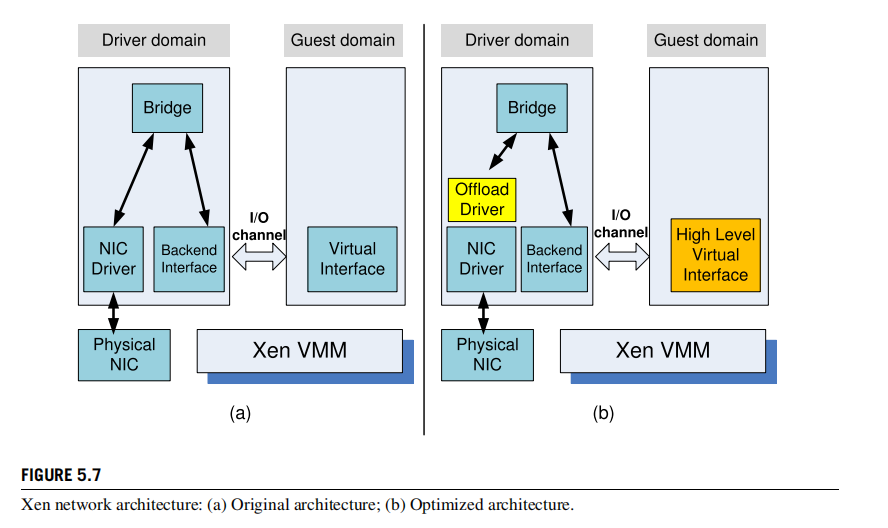
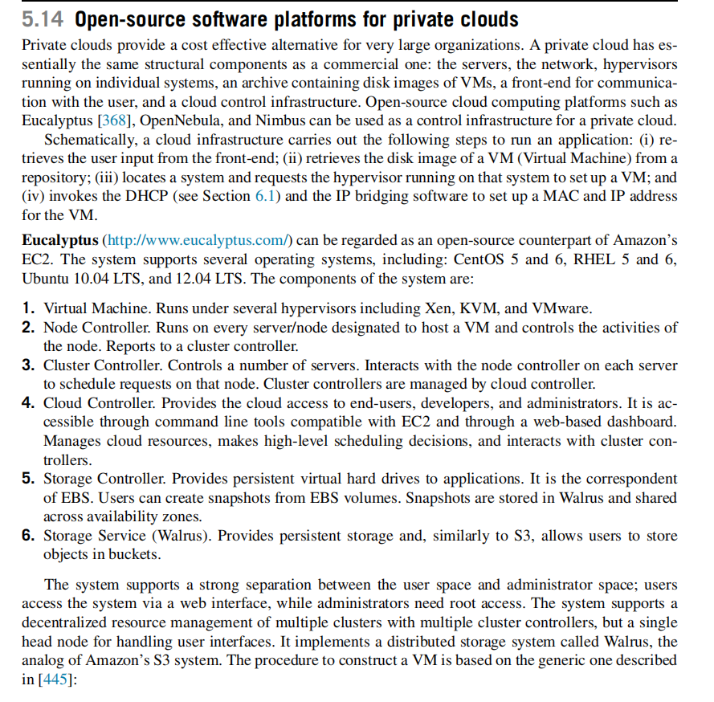

# CHAPTER 5 Cloud resource virtualization

## 

# Start

**1\. 标题：云资源虚拟化概述与核心原理**  
本部分内容主要阐述云环境下资源虚拟化（Cloud Resource Virtualization）的概念、背景、关键技术及其在数据中心与云服务中的应用与挑战。通过对处理器、内存、通信等抽象资源的虚拟化，云计算可以灵活地管理硬件资源，实现用户隔离与系统弹性。在本次笔记中，我们将依次介绍虚拟化的基本定义、作用机制、在云数据中心中的运作模式，以及各种常见的虚拟化实现方式（包括完整虚拟化、半虚拟化/准虚拟化等），并对可能的性能和安全问题进行概述。

* * *

**2\. 详细内容解读与知识点剖析**

以下内容根据截图（共两页）整理，涵盖了从虚拟化背景到不同架构支持、以及可能的性能问题和风险概述等多个方面。为方便理解，我们将内容分解为若干主题逐一解析。

* * *

### 2.1 云资源虚拟化的背景与作用

1.  **虚拟化的定义与意义**
    
    *   **概念**：虚拟化通过对计算机与通信系统底层物理资源进行抽象，将其转换成用户或应用程序可直接使用的逻辑资源。它可以简化资源的使用方式、隔离不同用户或工作负载并支持资源的复制和迁移。
    *   **优势**：
        *   **简化资源管理**：如虚拟机（VM）在管理上更加灵活，迁移到其他服务器可平衡负载并节省能耗。
        *   **提高弹性和可靠性**：用户可以在熟悉的系统环境中运行应用，无需针对不同硬件环境重新开发和部署。
        *   **支持多重隔离与资源共享**：一个物理服务器可运行多个虚拟机，每个虚拟机之间实现资源、故障、进程等隔离。
2.  **基础抽象：解释器、内存和通信**
    
    *   **解释器（Interpreter）**：在物理层面对应处理器（CPU），通过执行指令对信息进行转换和处理。
    *   **内存（Memory）**：包含主存和二级存储（如磁盘），为系统存储程序和数据提供空间。
    *   **通信（Communication Channels）**：提供处理单元、存储单元、外部网络等之间的交互能力。
    *   **差异性**：处理器、内存、通信三者在带宽、延迟、可靠性等方面都有不同的物理特征，需要系统软件进行统一管理与抽象。
3.  **传统数据中心的模式**
    
    *   在传统模式下，通常在每台物理机上安装操作系统（OS），通过操作系统自身的进程管理、内存管理、权限隔离等机制实现资源共享与隔离。
    *   面临问题：当应用或用户环境迁移至新的硬件时，需要重头配置、优化、甚至更换系统，过程繁琐且成本高昂。
4.  **云环境下的挑战**
    
    *   **云服务提供商（CSPs）**：需要在记账、系统安全和资源管理等多方面进行优化；不同应用与用户环境多样化，管理更加复杂。
    *   **云用户**：为了应对不同数据中心的硬件和软件差异，往往要针对每种环境重新调试应用。
    *   **虚拟化的缓解作用**：通过虚拟化，CSP和云用户可以在同样的抽象层面上进行部署和管理，简化了在异构硬件环境间反复迁移带来的问题。
5.  **共享资源与多级控制需求**
    
    *   **多层次共享**：在一个虚拟化环境中，CPU、内存、I/O和网络带宽等资源都要在多个虚拟机之间共享。虚拟机内部又需要进一步在不同进程和线程之间分配资源。
    *   **硬件与架构支持**：为了有效调度这些共享资源，硬件需要提供一定程度的虚拟化扩展（如Intel VT-x、AMD-V等），并且要求处理器和系统架构能支持在不同层面进行调度和控制（hypervisor层和Guest OS层）。

* * *

### 2.2 本章结构概览与重点内容

1.  **第5.1节：虚拟化原理与动机**
    
    *   将讨论为什么需要虚拟化，以及虚拟化在性能提升、系统管理、用户隔离等方面的动机。
2.  **第5.2节：性能与安全隔离**
    
    *   重点在于当系统有多个虚拟机（或容器）并行运行时，如何保证每个虚拟机的性能不会受到其他虚拟机过多影响，同时又能确保安全与故障隔离。
3.  **第5.3节：虚拟化的实现方案**
    
    *   对常见的虚拟化实现方法进行分析，包括不同层次（硬件层、OS层、应用层）的技术取舍和权衡。
4.  **第5.4节：处理器虚拟化的两种主要路径**
    
    *   **完整虚拟化（Full Virtualization）**：
        *   Hypervisor 提供的硬件抽象与真实物理机几乎完全一致，操作系统无需做任何改动即可运行在虚拟机中。
        *   优点：对用户最透明，几乎无需改动现有操作系统。
        *   缺点：实现上较为复杂，尤其在处理某些特权指令、敏感指令时需要借助硬件扩展或binary translation等技术。
    *   **准虚拟化（Paravirtualization）**：
        *   需要对Guest OS进行一定修改，使其知道自己运行在虚拟环境中，从而更有效地调用hypervisor提供的接口。
        *   优点：通常性能会有所提升；实现复杂度在某些场景下可降低。
        *   缺点：对操作系统本身有侵入性，需要源码级修改，不适用于无法修改或无法获取源码的专有系统。

* * *

### 2.3 处理器架构对虚拟化的支持与多级控制

1.  **传统处理器的单级控制**
    
    *   传统x86处理器仅支持“内核态（kernel mode）”和“用户态（user mode）”这两种执行模式。
    *   在没有硬件虚拟化扩展之前，hypervisor 需要想办法“欺骗”或“捕获”Guest OS对特权指令的执行，并进行适配或翻译；这往往带来额外的开销与实现难度。
2.  **双层虚拟化控制**
    
    *   在虚拟化环境中，资源实际由hypervisor掌控，但Guest OS自身也需要进行调度与资源管理，两者形成了双层控制：
        *   第一层：hypervisor对所有硬件资源进行底层管理与分配。
        *   第二层：Guest OS对虚拟出来的资源进行常规操作系统的管理。
    *   **CPU周期共享**可以借助调度器较容易地实现，而对缓存（cache）、内存带宽以及I/O带宽的共享与分配则更加复杂，需要更深层次的硬件协作与策略。
3.  **x86硬件扩展**
    
    *   在2005与2006年，主流x86处理器（Intel与AMD）开始支持硬件级虚拟化（Intel VT-x、VT-d，AMD-V等），从而降低hypervisor对Guest OS特权指令的捕捉与处理的复杂度，提高性能和兼容性。
    *   **嵌套虚拟化（Nested Virtualization）**：允许在一台虚拟机里再运行另一个hypervisor，形成“嵌套”结构，进一步增加了管理和调度的复杂度。

* * *

### 2.4 常见虚拟化工具与Hypervisor

1.  **开源模拟器与虚拟化器**
    
    *   第5.6节提及的开源虚拟化/模拟器工具，让用户可使用多种免费或开源方案。
2.  **常用Hypervisor示例**
    
    *   **Xen**：一种常用的开源Hypervisor，支持准虚拟化与完整虚拟化两种模式。第5.8节和5.9节介绍了其网络性能优化。
    *   **KVM（Kernel-based Virtual Machine）**：Linux内核的虚拟化基础设施，将Linux内核本身变为一个Hypervisor。第5.7节讨论了它的实现细节。
    *   **其他话题**：第5.10节提到嵌套虚拟化；第5.11节介绍可信内核（trusted kernel）虚拟化。
3.  **高性能处理器与Itanium虚拟化**
    
    *   高性能处理器往往包含多个功能单元，但未必都提供对虚拟化的直接支持；因此需要软件层面进行更多适配。
    *   第5.12节将讨论Itanium处理器架构下的准虚拟化方案，以及其在特权指令和硬件管理方面的实现。

* * *

### 2.5 虚拟化性能、风险及开源平台

1.  **性能问题：缓存与I/O管理**
    
    *   **缓存未命中（cache miss）**：在虚拟化环境下尤其严重，因为存在两级调度或多层中间抽象，Guest OS与Hypervisor之间会导致额外的上下文切换和缓存抖动。
    *   I/O处理：特权指令处理与设备I/O需要在Hypervisor与Guest OS之间反复切换，对性能带来影响。
    *   第5.13节将探讨cache miss对VM性能的影响。
2.  **开源软件平台概览**
    
    *   第5.14节将对各种开源虚拟化平台进行全面介绍（例如QEMU、VirtualBox、Xen、KVM等），它们在功能、稳定性和性能上各有侧重。
3.  **风险与安全**
    
    *   虚拟化增加了一个系统层次（Hypervisor层），也可能带来新的安全漏洞，如VM逃逸、Hypervisor被攻击等。
    *   第5.15节将重点分析这些潜在风险。
    *   第5.16节介绍具体的虚拟化软件，实现与产品形态。

* * *

**3\. 总结**  
通过本次图片所展示的内容，我们可以看到云资源虚拟化在现代云计算与数据中心中具有非常重要的地位。它不仅极大地简化了资源的部署与管理流程，还能在硬件差异较大的情况下维持用户熟悉的操作环境。虚拟化所带来的关键挑战和讨论点主要包括：

*   **性能与隔离**：如何在高并发、多虚拟机环境中高效地共享处理器、内存、网络与存储资源，同时保持各虚拟机间的安全与隔离。
*   **硬件支持**：传统处理器架构的局限性与现代处理器对虚拟化的扩展（如Intel VT-x、AMD-V等）如何协助Hypervisor更好地管理资源。
*   **多种实现方法**：完整虚拟化、准虚拟化、嵌套虚拟化等技术路线，涉及到对Guest OS的兼容性与修改需求的权衡。
*   **性能瓶颈与风险**：缓存管理、I/O处理、系统开销等都会引起性能下降，同时也会衍生新型安全威胁，需要系统层面和硬件层面共同应对。

在后续的章节与更深入的技术资料中，将进一步讨论如何平衡虚拟机的性能、可扩展性和安全性。对于想要在生产环境中部署虚拟化技术的技术人员或云服务运营者，这些问题都是必须深入了解和权衡的重点。

* * *

**4\. 报错**

*   本次两张截图内容基本完整清晰，未发现有难以辨认或无法解释的部分，故无报错信息可补充。

_——至此，本次课件截图对应的笔记内容全部结束——_

# 5.1 Resource virtualization

**1\. 标题：资源虚拟化的概念与实现方式解析**  
本部分主要介绍了云计算环境中资源虚拟化（Resource Virtualization）的背景与具体形式，包括多路复用（Multiplexing）、聚合（Aggregation）、模拟（Emulation）以及两者结合等多种方式。同时阐述了虚拟化对云服务提供商（CSP）和用户在安全、性能、可靠性以及功能隔离方面的重要意义，并通过示例说明了虚拟化带来的便利与相关的代价。

* * *

**2\. 详细内容解析**

### 2.1 虚拟化历史与背景

1.  **早期虚拟化的起源**
    
    *   虚拟化技术在20世纪50年代末即已成功应用，比如“基于分页（Paging）的虚拟内存”在英国曼彻斯特大学的Atlas计算机上于1959年首次实现。
    *   这些早期探索为现代虚拟化技术（特别是云计算环境下的虚拟化）奠定了基础。
2.  **四种主要的资源虚拟化方式**  
    根据资料中引用的 $430$ ，虚拟化可以通过以下四种手段实现对物理对象接口的模拟：
    
    1.  **Multiplexing（多路复用）**
        *   从一个物理对象创建多个虚拟对象的过程。
        *   例子：将单个处理器在多个进程或线程之间进行多路复用。
    2.  **Aggregation（聚合）**
        *   将多个物理对象合并成一个逻辑上的虚拟对象。
        *   例子：将多个物理磁盘聚合成一个RAID虚拟磁盘。
    3.  **Emulation（模拟）**
        *   用与原有物理对象不同类型的物理资源，创建出目标对象的虚拟形式。
        *   例子：利用物理磁盘模拟随机访问内存（RAM）。
    4.  **Multiplexing and Emulation（多路复用与模拟结合）**
        *   同时利用多路复用与模拟技术来实现更复杂的虚拟对象。
        *   例子：分页机制下的虚拟内存既多路复用主存储器与次级存储器，又通过地址映射模拟了一个真正的物理地址空间；TCP协议既模拟了“可靠的比特传输管道”，也将底层的通信信道和处理器资源进行多路复用。

### 2.2 虚拟化在云计算中的关键作用

1.  **对于云服务提供商和用户都至关重要**
    
    *   **安全性**：虚拟化允许在同一硬件上隔离不同的服务或工作负载，增强了系统层面的安全性；
    *   **性能与可靠性**：可在异构硬件之间灵活迁移应用，提高弹性与可靠性；
    *   **服务开发与管理**：云服务提供商可以更轻松地部署和管理软件、库和系统镜像；
    *   **故障隔离**：不同虚拟机间互不影响，当一台虚拟机出现故障时，不会殃及其他虚拟机。
2.  **Hypervisor（虚拟机监控器）或Virtual Machine Monitor在云中的地位**
    
    *   虚拟化环境下，Hypervisor直接运行在物理硬件之上，对外输出硬件抽象层供一个或多个Guest OS使用；
    *   **Guest OS**认为自己在与真实硬件交互，但所有特权操作都要被Hypervisor捕获、检测和管理；
    *   **示例**：Hypervisor控制两个虚拟磁盘的I/O，可能将它们实际映射为物理磁盘上的不同磁道组合，而Guest OS对此无需感知，也无需修改。

### 2.3 虚拟化给用户带来的便利

1.  **远程使用能力**
    
    *   用户可以在不需修改应用和依赖库的情况下，通过虚拟机在远程数据中心运行服务；
    *   这非常契合“公用计算（utility computing）”或“随选服务（on-demand services）”的理念，提升了用户的便捷度。
2.  **AWS示例**
    
    *   例如在AWS中，用户可上传一个Amazon Machine Image（AMI），其中包含应用、所需库、数据及配置。然后通过API或控制台操作，随时启动或终止若干虚拟机实例，进行弹性伸缩。

### 2.4 虚拟化的潜在副作用与成本

1.  **性能损耗（Performance Penalty）**
    
    *   Guest OS的所有特权操作都必须先通过Hypervisor进行捕获与校验；
    *   这会引入额外的上下文切换与指令翻译，带来不可忽视的性能损耗。
    *   处理器虚拟化扩展（Intel VT-x、AMD-V等）能在一定程度上缓解这个问题，但仍然存在开销。
2.  **硬件成本（Hardware Costs）**
    
    *   一台物理服务器同时运行多个虚拟机，需要更强大的CPU、多核架构、更大的内存、更优异的磁盘与网络接口带宽等；
    *   相比只运行一个操作系统的传统环境，虚拟化环境常常需要更高的硬件投入。
3.  **多虚拟机环境的系统总成本**
    
    *   虚拟机共用物理硬件，但若要满足高并发、高可靠性要求，供应商通常会配备高性能、多资源冗余的服务器；
    *   因此，与单一操作系统独占物理机的模式相比，尽管灵活性与弹性大大提升了，但硬件投资和运营成本也相应更高。

* * *

**3\. 总结**  
本小节深入探讨了“资源虚拟化”的基础概念与实施手段，并结合现代云计算环境中虚拟机的工作机制，说明了为何虚拟化对云服务提供商与云用户具有核心价值。主要要点包括：

*   **四种虚拟化形式**：多路复用、聚合、模拟与两者结合。
*   **云计算中的重要性**：增强安全、提升灵活性与可靠性、支持应用迁移与弹性伸缩，并简化大规模服务管理。
*   **便捷性与典型应用**：以AWS为例，展示了提供预配置镜像（AMI）来方便快速部署和回收虚拟机的商业模式。
*   **缺点与成本**：性能损耗与硬件投入的上升是虚拟化不可回避的副作用，需要从硬件虚拟化支持及系统优化多方面综合考虑。

通过了解这些内容，读者可以更清晰地认识虚拟化在云计算体系结构中的地位，以及在实际部署时需要衡量的利弊。

* * *

**4\. 报错说明**

*   本次图片内容清晰可见，未发现未被解释或无法阅读的内容，因而无额外报错信息需要补充。

_——至此，本次课件截图对应的笔记内容讲解完毕——_

# 5.2 Performance and security isolation in computer clouds

**1\. 标题：云环境中的性能与安全隔离：多用户共用与Hypervisor防护机制**  
本部分（第5.2节）主要聚焦在云计算环境中如何实现“性能隔离（Performance Isolation）”和“安全隔离（Security Isolation）”。在共享的资源环境中，不同应用或虚拟机间的干扰是影响云计算服务质量（QoS）的关键因素；同时，安全层面也必须保证攻击者难以利用同一物理宿主机上的其他虚拟机为跳板来渗透系统。本节从操作系统与Hypervisor的对比、处理器虚拟化与模拟的区别、安全威胁面与防护思路等方面进行了深入探讨。

* * *

**2\. 详细内容解析**

### 2.1 性能隔离的重要性与挑战

1.  **性能隔离的定义与背景**
    
    *   当不同应用在同一物理系统中并发运行，竞争CPU时间片、缓存、主存、磁盘和网络带宽等资源，容易相互影响其运行时行为；
    *   对于云计算中的QoS要求，必须尽量减少这种互相干扰，也即“QoS Crosstalk” $473$ ；
    *   在实时应用中，不可预测的性能会带来严重问题，被视为“致命缺陷（deadly sin）”。
2.  **现有操作系统对性能隔离的支持**
    
    *   一些特殊的Linux分支或增强内核（如Linux/RK  $369$ 、QLinux  $466$ 、SILK  $54$ ）都曾针对性能隔离做过改进；
    *   但即便如此，完全消除交互影响仍然困难，涉及内核调度、资源分配（CPU、IO、内存分页）等多方面协调。

### 2.2 处理器虚拟化与处理器模拟

1.  **处理器虚拟化（Processor Virtualization）**
    
    *   允许将同一物理处理器或内核的多个“虚拟拷贝”提供给应用；
    *   与操作系统中的多进程/多线程“多路复用”不同，在Hypervisor层面是“完整操作系统”的并行运行；
    *   Hypervisor直接基于硬件执行大部分指令，并仅在处理特权指令时进行截获、翻译或重定向，从而实现高效的虚拟化。
2.  **处理器模拟（Processor Emulation）**
    
    *   当Guest OS的指令集与底层物理机不兼容，或者缺乏必要的硬件虚拟化支持时，才需要使用完全的“模拟”；
    *   例如早期的VirtualPC在x86架构上模拟英特尔处理器；通过软件对指令逐条翻译，但速度远逊于直接硬件执行。
    *   两者差异：模拟（emulation）是一种纯粹的软件翻译，而虚拟化（virtualization）更多依赖硬件扩展来减少性能损失。

### 2.3 操作系统与Hypervisor的对比：抽象与安全

1.  **传统操作系统：进程抽象与资源共享**
    
    *   OS使用进程抽象来实现资源共享与隔离，但在云端环境中，一旦有进程被攻破，往往能更轻易地影响整个系统；
    *   传统OS拥有大量特权功能（例如处理设备I/O、中断、各种系统调用），也意味着更多的安全暴露面。
2.  **Hypervisor及其安全意义**
    
    *   Hypervisor在概念上比传统OS更加精简、目标更明确：它只负责在不同Guest OS之间分配底层硬件资源、截获和处理特权指令；
    *   示例：
        *   **Xen**（第5.8节会谈到），包含大约60,000行代码；
        *   **Denali**（ $514$ 所示）只有30,000行左右；
        *   相较之下，传统Linux内核（如2.6.11版）有289个系统调用，更别提还要支持大量第三方程序（如sendmail、sshd）和特殊设备；
        *   代码量少意味着攻击面相对更小，也降低了漏洞出现的可能性。
3.  **虚拟化与安全隔离**
    
    *   应用在虚拟机内仅能访问软件所模拟或映射的“虚拟设备”；
    *   在Hypervisor层之下，实际上物理设备被严格管理，并不会直接暴露给Guest OS；
    *   从安全角度看，这与在两台不同物理机上运行两套系统的隔离度相似——若Hypervisor本身足够安全，那么VM之间就能有效“隔绝”。

### 2.4 开销与性能影响

1.  **Hypervisor额外负担**
    
    *   所有特权操作都需要Hypervisor进行捕获和校验，增加了上下文切换成本；
    *   在高并发下，IO访问、地址映射变换、CPU模式切换等都带来额外开销；
    *   对于实时或高性能场景，需要在硬件层面提供支持（如VT-x、AMD-V）并进行优化调度。
2.  **资源使用与安全折中**
    
    *   借助Hypervisor可以在多个Guest OS之间实现更细粒度的资源隔离和更高的安全性；
    *   但是，引入新的抽象层也意味着在性能和硬件配置方面要付出代价。

* * *

**3\. 总结**  
在云计算环境中，实现可靠的“性能隔离”和“安全隔离”是构建高质量服务与保护用户资源的关键。本节从以下角度阐述了两者的关系和重要性：

*   **性能隔离**：如何在共享物理资源时减小不同应用之间的干扰，实现QoS保障；
*   **安全隔离**：让虚拟机之间相互隔离，避免因单一点被攻破而渗透整个系统；
*   **处理器虚拟化 vs. 处理器模拟**：硬件辅助下的虚拟化通常性能较好，而纯软件模拟耗时且只在硬件不兼容或缺乏虚拟化扩展时才使用；
*   **操作系统 vs. Hypervisor**：Hypervisor更精简，特权面更小，安全性与隔离度更高，但也带来了管理与调度上的额外性能开销。

随着云规模不断扩大，如何在保持高效性能的前提下，运用合适的虚拟化技术（并结合硬件支持）来增强安全性，依然是云计算研究与实践中的核心课题。

* * *

**4\. 报错信息**

*   本次截图内容清晰，无缺失或无法阅读的部分，暂无错误可报告。

_——至此，本次课件截图对应的笔记内容讲解完毕——_

# 5.3 Virtual machines

**1\. 标题：虚拟机的类型、体系架构及操作系统级虚拟化详解**  
在本部分（第5.3节）中，课件主要介绍了虚拟机（VM）的概念、发展历史以及各种常见的虚拟机类型与体系架构。通过图5.1可以直观了解传统、混合与宿主式（Hosted）三大VM模型的差异，同时也阐述了操作系统级虚拟化（OS-level virtualization，如容器）与完整虚拟机之间的性能、兼容性和适用场景差异。

* * *

2\. 详细内容解析
----------

### 2.1 虚拟机的基本定义与历史

1.  **基本定义**
    
    *   虚拟机（VM）是一个与真实硬件隔离且能够访问物理资源子集的运行环境。对使用者而言，VM就像是一台可以独立运行的机器。
    *   所有VM共用同一台物理机，却能给用户带来“专用硬件”的错觉。
2.  **历史溯源**
    
    *   虚拟机技术可追溯至20世纪60年代；
    *   20世纪70年代，IBM推出VM 370系统，其后又有MVS（Multiple Virtual Storage）系统，用于在大型机上执行多个虚拟环境；
    *   这些技术为后来在PC服务器与云计算环境中的通用虚拟机奠定了基础。

### 2.2 虚拟机的两大类型：进程VM与系统VM

1.  **进程VM（Process VM）**
    
    *   针对单一进程或应用创建的虚拟平台，进程终止后虚拟机随即销毁。
    *   几乎所有操作系统都为每个应用提供“进程抽象”，但是更有趣的进程VM是能够运行与宿主机指令集不同的可执行文件（如某些跨平台二进制翻译工具）。
    *   当进程VM运行在普通操作系统下，并且仅仅为单个应用提供独立的平台，就可称之为**应用级虚拟机**，例如Java虚拟机（JVM）。
2.  **系统VM（System VM）**
    
    *   提供完整的系统环境，每个VM可以运行自己的操作系统，并可同时启动多个应用。
    *   示例：Linux VServer、OpenVZ (Open Virtu‐Ization)、FreeBSD Jails、Solaris Zones等，这些都属于**操作系统级虚拟化**技术（OS-level virtualization）。
    *   也常被称为容器（Containers）、虚拟私有服务器（Virtual Private Servers，VPS）或虚拟环境（Virtual Environments），都属于此类范畴。

### 2.3 操作系统级虚拟化（OS-level Virtualization）

1.  **概念与实现**
    
    *   在同一个物理服务器上，通过操作系统内的命名空间隔离、资源配额管理等手段，生成多个彼此独立的“容器”或“轻量级虚拟环境”；
    *   客户容器与宿主机OS内核相同，但每个容器拥有独立的用户态环境、文件系统视图、网络栈、进程空间等。
2.  **典型示例**
    
    *   **Linux VServer**: 提供多个隔离环境，其资源管理与调度在宿主Linux内核中；
    *   **OpenVZ**: 仅支持Linux（宿主和来宾都需是Linux），开源协议GPL v2，据 $376$ 性能损失只有1%~3%，和物理机几乎相当；
    *   **FreeBSD Jails**: 在FreeBSD上实现类似容器化的技术；
    *   **Solaris Zones**: Solaris系统下的操作系统级虚拟化功能。
3.  **优缺点**
    
    *   **优点**：内存占用小、性能损耗极低、快速创建与销毁；
    *   **缺点**：Guest OS与Host OS必须使用相同或高度兼容的内核，不同内核版本的操作系统无法共存；隔离程度相较“完整虚拟化”略弱。

### 2.4 虚拟机体系架构：传统、混合与宿主式

课件给出了图5.1来对比三种常见的VM架构：

1.  **Traditional（或“Bare Metal”）**
    
    *   Hypervisor直接运行在物理硬件之上，不依赖宿主操作系统。
    *   典型代表：VMware ESX/ESXi、Xen、OS370、Denali等；
    *   **特点**：性能最佳，因减少了中间层；Hypervisor相对精简，安全面较小，但开发复杂度高。
2.  **Hybrid（混合虚拟机）**
    
    *   Hypervisor与一个已有的操作系统共同运行，共享硬件；
    *   主机操作系统（Host OS）提供如调度、驱动管理等部分功能，Hypervisor负责VM管理；
    *   **示例**：VMware Workstation在Windows或Linux下执行，部分功能借用宿主机的系统资源调度和驱动。
3.  **Hosted（宿主式虚拟机）**
    
    *   完全依赖宿主操作系统的功能；Hypervisor自身并不处理大多数硬件访问，而是通过宿主OS将I/O、分页等请求传递给硬件；
    *   **优点**：安装部署简单，用户熟悉度高，兼容性好；
    *   **缺点**：存在更多的性能开销（I/O操作、分页故障与调度皆需宿主OS中转），在云端的大规模应用场景中吸引力较弱；
    *   **示例**：User-mode Linux、部分VirtualBox配置、QEMU在普通用户态运行等。

### 2.5 处理器虚拟化的挑战

1.  **Guest OS与底层抽象**
    
    *   对于完整虚拟化，Hypervisor需要向Guest OS提供仿真的硬件接口，拦截其执行的特权指令；
    *   若硬件支持（如Intel VT-x、AMD-V等）不足或未启用，则可通过软件手段（binary translation）来实现，但性能往往较低。
2.  **I/O操作与磁盘结构**
    
    *   I/O请求和磁盘数据结构往往在Guest OS看来是“透明”的，但Hypervisor需要知道如何将这些请求映射到实际物理硬件上；
    *   这增加了系统的复杂性，也带来性能损耗与维护成本。

* * *

3\. 总结
------

通过本节的学习，可以清晰地看到虚拟机技术在云计算乃至大型服务器环境中的多种形态与实施方法。它们从性能、兼容性、安全性和易用性上各有侧重：

*   **进程VM** vs. **系统VM**：前者聚焦单个应用或跨平台二进制翻译，后者模拟完整OS生态。
*   **操作系统级虚拟化**：以容器等方式提供轻量级隔离，性能几乎接近原生，但内核必须相同。
*   \*\*传统、混合、宿主式（Hosted）\*\*三大VM架构：各自有不同的设计取舍，在性能与可部署性上呈梯度差异。

在实际生产环境中，开发者或运维人员应根据需求（资源隔离、运行效率、平台兼容性、安全需求等）选择合适的虚拟化方式。容器往往在微服务、DevOps及快速交付场景下优势显著，而“Bare Metal”型Hypervisor则多应用于对性能和隔离要求极高的核心云服务节点。

* * *

4\. 报错说明
--------

*   本次图片内容清晰、完整，未发现无法识别或遗漏之处，因此无报错信息需要补充。

_——至此，本次课件截图对应的笔记内容讲解完毕——_

## 

# 5.4 Full virtualization and paravirtualization

**1\. 标题：完整虚拟化与准虚拟化的原理、条件与实现**  
在本节（第5.4）中，课件主要介绍了由Popek和Goldberg在1974年提出的经典虚拟化条件，以及在现代处理器架构下如何通过“完整虚拟化（Full Virtualization）”与“准虚拟化（Paravirtualization）”两种方式实现高效的处理器虚拟化。通过区分敏感指令与特权指令的概念，进一步探讨了二进制翻译（Binary Translation）和对Guest OS进行修改的准虚拟化策略。文中指出在x86等架构上进行完整虚拟化的挑战与开销，并说明了为何有时准虚拟化在性能和实现简易度上更具优势。

* * *

2\. 详细内容解析
----------

### 2.1 Popek和Goldberg的虚拟化条件

1.  **条件概述**  
    Popek和Goldberg给出了一个计算机体系结构“可虚拟化”的充要条件，简要来说包括三点：
    
    1.  在Hypervisor之下运行的程序，其行为应与在裸机上运行时基本一致。
    2.  Hypervisor必须能完全控制底层虚拟化资源（包括CPU、内存、IO等），防止Guest OS越权。
    3.  必须保证大部分指令可在无需Hypervisor干预的情况下直接执行，从而实现高效。
2.  **敏感指令（Sensitive Instructions）**
    
    *   **Control sensitive**：涉及改变系统资源分配或切换到内核模式的指令。
    *   **Mode sensitive**：在内核态和用户态表现不同的指令。
    *   如果这些敏感指令正好也是机器的“特权指令（Privileged Instructions）”子集，那么就易于实现高效虚拟化；否则需要在软件层面做更多处理（如陷阱与模拟、二进制翻译等）。

### 2.2 完整虚拟化与准虚拟化的两种思路

1.  **二进制翻译（Binary Translation）**
    
    *   Hypervisor实时监控Guest OS执行的指令，一旦遇到非可虚拟化的敏感指令，就将其替换成安全的“可虚拟指令”或调用Hypervisor进行模拟；
    *   优点：Guest OS无需修改，保持了对原有操作系统的兼容性；
    *   缺点：翻译过程会带来额外的性能开销，尤其是在处理频繁的特权指令时。
2.  **准虚拟化（Paravirtualization）**
    
    *   通过修改Guest OS，使其只使用在虚拟环境中“可虚拟化”的指令或Hypervisor提供的“超管接口”来执行特权操作；
    *   优点：
        1.  **更好性能**：减少了对敏感指令做陷阱和翻译的需求；
        2.  **实现简单**：某些硬件层面难以虚拟化的功能可通过修改OS层面来规避；
        3.  **接口更清晰**：Guest OS“自觉”配合Hypervisor进行资源管理。
    *   缺点：
        1.  需要得到Guest OS源码并进行移植或修改；
        2.  不适合无法修改内核或闭源的操作系统。

### 2.3 两种虚拟化方式的结构对比

课件中给出的**图5.2**展示了完整虚拟化（a）与准虚拟化（b）的示意：

*   **(a) 完整虚拟化（Full Virtualization）**
    
    *   Guest OS中仍保持其自有的“硬件抽象层（Hardware Abstraction Layer）”，以为自己直接运行在真实硬件上；
    *   Hypervisor需要提供几乎所有的硬件仿真，并拦截、处理敏感指令；
    *   如果硬件本身提供了虚拟化扩展（如Intel VT-x、AMD-V），则可减少对二进制翻译的依赖，从而提升效率；
    *   示例：VMware ESX在x86上实现了完整虚拟化，同时依靠shadow page tables或硬件辅助技术来处理MMU虚拟化等问题。
*   **(b) 准虚拟化（Paravirtualization）**
    
    *   Guest OS被裁剪或修改为只使用Hypervisor暴露的接口来执行特权操作；
    *   Guest OS“知晓”自己处于虚拟环境中，因而不会执行那些无法在虚拟化模式下直接运行的敏感指令；
    *   示例：Xen与Denali。Xen要求对Linux或其他Guest内核进行适配与编译，使其能够调用Xen提供的特权接口。

### 2.4 x86架构中虚拟化的难点与对策

1.  **x86早期的非对称指令**
    
    *   传统x86设计并非为虚拟化而生，许多敏感指令并未在特权指令集合内，导致内核模式与用户模式的行为难以被简单捕捉。
    *   为实现完整虚拟化，往往需要二进制翻译或“修补（patch）”Guest OS。
2.  **现代硬件扩展**
    
    *   Intel、AMD推出VT-x、AMD-V等虚拟化指令集扩展，允许在CPU层面区分Hypervisor和Guest OS的特权级；
    *   大幅减少了Hypervisor对敏感指令进行软件拦截和翻译的次数，提高了虚拟化性能。

### 2.5 虚拟化性能与可能的“收益”

1.  **虚拟化的开销**
    
    *   一般情况下，运行在虚拟机中的应用性能会有所下降（8%～35%不等），具体取决于磁盘I/O、CPU负载、内存/缓存争用等因素；
    *   影像越多、访问越频繁，需要的二进制翻译或特权切换也就越频繁。
2.  **意外的性能优势：缓存隔离**
    
    *   在某些情况下，虚拟机环境对高速缓存进行分割或者缓存替换策略中的隔离反而可能带来性能提升；
    *   例如：两个竞争缓存的进程分配在不同的VM中，Cache Miss的冲突会有所减少，从而在特定场景下使应用运行速度快于传统OS共享环境。

* * *

3\. 总结
------

本节围绕\*\*完整虚拟化（Full Virtualization）**和**准虚拟化（Paravirtualization）\*\*展开讨论，总结出以下核心点：

1.  **虚拟化条件**：Popek和Goldberg的“三大准则”奠定了高效虚拟化的理论基础；
2.  **指令拦截与替换**：通过“二进制翻译”或修改Guest OS（准虚拟化）来处理x86等架构中的敏感指令；
3.  **硬件辅助**：现代CPU对虚拟化的支持让完整虚拟化更容易实现，减少Hypervisor的陷阱与模拟开销；
4.  **性能权衡**：虽然虚拟化带来一定损耗，但在实际应用场景中也可能因更好的缓存隔离或资源调度而获得性能优势；
5.  **应用场景**：Xen、Denali等系统基于准虚拟化取得了良好性能，而VMware ESX等成熟解决方案在硬件辅助下也实现了高效且兼容度极高的完整虚拟化。

* * *

4\. 报错说明
--------

*   本次截图内容基本完整可读，无缺失或无法辨认之处，故无报错信息可补充。

_——至此，本次课件截图对应的笔记内容讲解完毕——_

# 5.5 Hardware support for virtualization

**1\. 标题：x86 硬件级虚拟化支持：VT-x 与 AMD-V 的原理与关键机制**  
本部分（第5.5节）主要介绍了英特尔与 AMD 在 x86 架构上为支持虚拟化所做的硬件扩展，包括 Intel 的 VT-x（及后续的 VT-d、VT-c 等）和 AMD 的 SVM（也称 Pacifica），以及它们解决的核心技术难题。通过新的特权级管理、指令集扩展和数据结构（如 VMCS）来应对 x86 在 Ring 机制、地址空间、特权指令管理等方面的固有限制，从而为 Hypervisor 提供更高效、更安全的运行环境。

* * *

2\. 详细内容解析
----------

下面将按照截图内容逐点进行拆解，帮助读者理解硬件虚拟化支持的背景、技术细节以及它所要解决的问题。

* * *

### 2.1 背景：为何需要硬件支持

1.  **虚拟化需求的兴起**
    
    *   **时间线**：进入 21 世纪初期，随着虚拟化在服务器和桌面领域的普及，人们发现仅靠软件（如二进制翻译、准虚拟化）难以在 x86 架构上高效地实现全面虚拟化。
    *   **英特尔与 AMD 行动**：2005 年起，Intel 开始在部分 Pentium 4 处理器中加入 VT-x，2006 年 AMD 也推出了 Pacifica（后称 AMD-V）并在 Athlon 64 中实现，从此硬件层面对虚拟化的支持开始普及。
2.  **核心思路**
    
    *   硬件直接提供额外的“虚拟机管理模式”和相关指令，以便 Hypervisor 可以将 Guest OS 放在一个受控、相对独立的执行环境中。
    *   减少或替代软件层面对“敏感指令”的捕获、翻译和模拟，从而提升性能并增强隔离。

* * *

### 2.2 Intel 的 VMX 模式与 VMCS 数据结构

1.  **VMX（Virtual Machine Extension）简介**
    
    *   英特尔在 2006 年引入 VMX 指令集扩展，核心概念是区分两种状态：
        *   **VMX Root**：Hypervisor（或 VMM）所在的特权模式；
        *   **VMX Non-Root**：Guest OS 及其应用程序所在的模式。
    *   在 VMX Root 与 VMX Non-Root 之间的切换通过特定指令（如 VMLAUNCH / VMRESUME / VMEXIT / VMENTRY 等）进行管理。
2.  **VMCS（Virtual Machine Control Structure）**
    
    *   **作用**：用来跟踪和保存主机（Host）以及各个 Guest VM 的 CPU 寄存器、控制寄存器、段寄存器、异常位图以及 I/O 位图等状态。
    *   **三类数据**：
        1.  **Guest State**：Guest VM 的寄存器信息、段寄存器等，一旦发生 VMEntry，CPU 会自动加载这些信息并切换到来宾环境。
        2.  **Host State**：Hypervisor 或物理机的寄存器信息，用于从 Guest 返回 Host 时恢复主机状态。
        3.  **Control Data**：定义哪些事件会触发 VMExit（如哪种异常要交给 Hypervisor 处理），以及 Hypervisor 如何将中断或异常注入 Guest OS。
3.  **VMX 指令集**
    
    *   常见指令：
        *   **VMXON / VMXOFF**：进入/退出 VMX 操作；
        *   **VMREAD / VMWRITE**：读写 VMCS；
        *   **VMLAUNCH / VMRESUME**：启动或恢复一个虚拟机；
        *   **VMEXIT**：当 Guest OS 触发敏感指令或特定事件时，会自动切换到 Root 模式。
    *   **Shadow VMCS**：为了解决嵌套虚拟化带来的性能损耗问题，引入影子 VMCS 机制，使得上层 Hypervisor 也能高效访问 VMCS。
4.  **VT-d 等扩展**
    
    *   **VT-d** (I/O MMU 虚拟化)：为 VM 提供 DMA 地址重映射、硬件中断重映射、设备直通（pass-through）等功能，显著提升 I/O 设备的安全性和隔离性。
    *   **VT-c**（网络虚拟化扩展）：为网络包处理和转发提供硬件支持，进一步提高虚拟网络性能。

* * *

### 2.3 x86 虚拟化的主要难题

文中列举了在 x86 上实现虚拟化时，Hypervisor 面临的九大问题，这些问题正是硬件扩展所要解决或缓解的关键瓶颈：

1.  **Ring Deprivileging（权限环降级）**
    
    *   x86 体系结构原本有四个权限环（0～3），传统 OS 内核在 Ring 0。Hypervisor 需要比 Guest OS 具有更高优先级，但缺少额外的硬件环可用，因而容易引发冲突和管理复杂度。
2.  **Ring Aliasing（权限环混淆）**
    
    *   当 Guest OS 被迫在比其设计更低的环级上运行，某些指令如 `PUSH`/`POP` 段寄存器时，会导致实际存储在栈中的权限信息与 Guest OS 认为的权限信息不一致，引发一系列兼容性问题。
3.  **Address Space Compression（地址空间压缩）**
    
    *   Hypervisor 需要在自己的地址空间中保留如中断描述符表（IDT）、全局描述符表（GDT）等数据结构，但 Guest OS 也必须访问这些表；如何防止 Guest OS 未经许可地修改这些结构，带来了“压缩”与映射复杂度。
4.  **Nonfaulting Access to Privileged State（无错误报告的特权访问）**
    
    *   指令如 `LGDT`, `SIDT`, `SLDT`, `LTR` 只能在 Ring 0 执行，但若 Guest OS 不在真正的 Ring 0，可能执行失败却无故障提示，Guest OS 也无法察觉异常。
5.  **Guest System Calls**
    
    *   一些快速系统调用指令（如 `SYSENTER`, `SYSEXIT`）期望在 Ring 0 操作，若 Guest OS 并非真在 Ring 0，则需要 Hypervisor 进行额外模拟。
6.  **Interrupt Virtualization（中断虚拟化）**
    
    *   Hypervisor 需要捕获硬件中断或异常并将其发往正确的 Guest OS；可选地，还要遵循 Guest OS 对中断屏蔽等行为的需求。
7.  **Access to Hidden States（对隐藏状态的访问）**
    
    *   x86 中段寄存器的“隐藏部分”（descriptor caches）、机器内部状态在切换上下文时并不会通过常规指令自动保存/恢复，需要硬件配合或软件模拟来维护 Guest 环境的正确性。
8.  **Ring Compression（环压缩）**
    
    *   在 64 位模式下，x86 架构仅实际使用 Ring 0 与 Ring 3，而 Ring 1、Ring 2 基本被废弃，这种“压缩”增加了虚拟化管理的难度。
9.  **Frequent Access to Privileged Resources（对特权资源的频繁访问）**
    
    *   例如任务优先级寄存器（TPR）被许多操作系统频繁读写，一旦 Hypervisor 必须每次都截获并模拟，就会造成严重性能负担。

* * *

### 2.4 VT-x 模式切换与 VMEntry / VMExit

1.  **模式切换原理**
    
    *   处理器在 VMX Root 模式中运行 Hypervisor；执行 `VMLAUNCH` / `VMRESUME` 后会切换到 VMX Non-Root 模式运行 Guest OS。
    *   **VMExit** 是从 Guest 返回 Hypervisor 的关键事件，当 Guest OS 执行了敏感指令或发生异常/中断等触发时，即会自动退出到 Root 模式。
2.  **VMCS 的双重状态**
    
    *   **Host-state**：存储了切换回 Hypervisor 时需要恢复的 CPU 寄存器等；
    *   **Guest-state**：保存 Guest OS 运行所需的寄存器上下文。
    *   切换过程由硬件负责，大幅减轻了 Hypervisor 的软件模拟工作。
3.  **配合 I/O MMU 虚拟化（VT-d）**
    
    *   允许直通某些 PCI 设备给 Guest OS；
    *   通过 DMA 地址重映射与中断隔离，保证不同 VM 间的 I/O 安全和性能。

* * *

### 2.5 效果与意义

1.  **性能与安全**
    
    *   硬件层支持减少了对二进制翻译的依赖，大幅提升了 Guest OS 执行效率；
    *   Ring 降级、特权指令截获等机制在硬件中统一管理，降低了 Hypervisor 的实现复杂度，也减小了攻击面。
2.  **软件堆栈简化**
    
    *   不需要在 Guest OS 中大规模修改核心代码（相对于准虚拟化），在保证通用性的同时，也减少了 Hypervisor 的负担；
    *   对嵌套虚拟化（Nested Virtualization）也提供了 shadow VMCS 等支持，使多个 Hypervisor 层级的场景成为可能。
3.  **面向未来的拓展**
    
    *   随着云计算规模增大与安全需求提升，硬件虚拟化扩展（如 IOMMU、网络虚拟化等）变得更加完备；
    *   VT-x / AMD-V 已成为现代 x86 处理器的标准配置，也是云数据中心虚拟化基础设施的支柱之一。

* * *

3\. 总结
------

通过本节对 **硬件支持虚拟化** 的介绍，我们可以看到 x86 架构原本并非天生适合虚拟化，但英特尔与 AMD 通过**VT-x / SVM 指令集扩展、VMCS 数据结构、IOMMU** 等技术手段，解决了以下关键难题：

1.  **Ring 权限问题**
2.  **敏感指令与中断截获**
3.  **隐藏状态与地址空间管理**
4.  **I/O 设备与 DMA 的安全隔离**

这些硬件改进不仅提升了运行效率和隔离度，也让 Hypervisor 的实现更简化、更安全。今天，硬件辅助虚拟化已经成为各大云服务商和企业数据中心的底层核心技术，为多租户隔离、按需分配资源以及高可用性奠定了坚实基础。

* * *

4\. 报错说明
--------

*   根据截图内容，文字与图示均较为清晰，无明显缺失或模糊之处，暂无可报告的错误。

_——至此，本次课件截图对应的笔记内容讲解完毕——_

## 

# 5.6 QEMU

**1\. 标题：QEMU 的多种工作模式与关键特性详解**  
本节（第5.6节）围绕 QEMU（Quick EMUlator）这一开源的机器模拟器和虚拟化工具展开，介绍了其在不同模式下对多种体系结构和设备的支持，包括 x86-64、PowerPC、RISC-V、ARMv7、ARMv8 等。QEMU 通过动态二进制翻译（Dynamic Binary Translation）来实现对处理器指令集的模拟和虚拟化，并能配合 KVM 或 Xen 等底层技术提供更高效的运行环境。

* * *

2\. 详细内容解析
----------

### 2.1 QEMU 的核心概念

1.  **功能定位**
    
    *   QEMU 既可以作为**纯粹的模拟器**（Emulator）运行在不同的硬件架构上，也可以作为**虚拟化工具**（Virtualizer）在相同架构下通过硬件辅助（如 KVM）获得近乎原生的执行性能。
    *   支持**多种架构**与**丰富的设备模型**，可引导多种客户操作系统（Linux、Windows、DOS、BSD 等）。
2.  **动态二进制翻译（DBT）**
    
    *   当 QEMU 需要运行与宿主机指令集不同的客体二进制时，就通过 DBT 将目标指令翻译为宿主机可执行的指令，并对其进行优化或插入一些“thunk”函数处理字节序（endian）或地址宽度差异（32/64 位）。
    *   相比静态翻译，DBT能在运行时根据热点、分支预测等信息对代码进行优化，也可暂时“延后”某些复杂操作。

### 2.2 四种主要工作模式

课件中列举了 QEMU 的**四种操作模式**：

1.  **User-mode Emulation（用户态模拟）**
    
    *   **用途**：主要用于**跨平台快速编译、跨平台调试**；
    *   **实现方式**：把与宿主机指令集不同的应用程序二进制，通过 QEMU 的翻译层在当前系统的用户态直接运行；
    *   **示例**：在 x86-64 的 Linux 主机上运行某些只编译了 ARM 指令集的 Linux 应用程序，方便开发者进行移植或测试。
2.  **System Emulation（系统模拟）**
    
    *   **用途**：可在同一物理服务器上**虚拟化多个完整操作系统**；
    *   **实现方式**：模拟各种硬件，包括 CPU、主板芯片组、网络接口、存储设备等，使得 Guest OS 感知到一个“完整真实的机器”；
    *   **可运行客体**：包括 Linux、Solaris、Windows、DOS、BSD 等多种 OS；
    *   **架构支持**：从 x86-64、PowerPC、RISC-V 到 ARM 皆可。
3.  **KVM Hosting（KVM 主机模式）**
    
    *   **用途**：结合 KVM（Kernel-based Virtual Machine）在 Linux 内核提供的硬件辅助虚拟化加速功能；
    *   **实现方式**：QEMU 负责设备模拟及用户态管理部分，但**核心 CPU 指令的执行**由 KVM 完成；
    *   **优点**：相比纯软件模拟，性能大幅提升，且对 x86 或其他 KVM 支持的架构而言可接近原生速度。
4.  **Xen Hosting（Xen 主机模式）**
    
    *   **用途**：对 Xen hypervisor 进行“外部封装”或辅助管理；QEMU 的工作是模拟硬件，Guest 的执行实际由 Xen 来调度；
    *   **特点**：从 QEMU 视角看，Guest OS 的执行隐藏在 Xen 之下，它只需要配合提供设备模拟或 I/O 操作。

### 2.3 QEMU 的功能与特性要点

1.  **虚拟磁盘与增量镜像**
    
    *   QEMU 支持多种磁盘镜像格式，包括**QCOW2**，它可以创建**overlay images**：
        *   允许用户将某个稳定的系统镜像作为“基础”，然后在此之上保存增量变化；
        *   如果增量镜像出现病毒或系统损坏，可随时回退到之前的状态；
        *   也减小磁盘占用（只记录实际使用的数据）。
2.  **多 CPU、多设备模拟**
    
    *   QEMU 能模拟对称多处理（SMP）环境，提供给 Guest OS 多个虚拟 CPU 核心；
    *   同时还支持多种网络设备、显卡、USB 控制器、甚至嵌入式系统的 SoC（如 ARM Cortex-A9 MPcore、DDR 控制器、DMA 控制器等）。
3.  **网络连接与图形输出**
    
    *   QEMU 模拟的虚拟机可使用网络地址转换（NAT）共享宿主机网络，或者桥接至宿主机网卡；
    *   无需依赖宿主机本地显示，可以通过**VNC**（Virtual Network Computing）协议远程访问虚拟机的图形界面，实现跨网络的可视化管理。
4.  **权限需求**
    
    *   大部分情况下，QEMU 并不要求 root 权限即可在用户空间运行，除非要加载内核模块（如加速器 KQEMU、内核驱动）或需要访问特权设备；
    *   当在同一架构下使用 KVM 加速时，往往需要管理员权限来开启硬件虚拟化功能。
5.  **跨架构支持**
    
    *   除了常见的 x86 / x86-64，QEMU 也可模拟 PowerPC、ARM（ARMv7、ARMv8）、RISC-V、MIPS 等多个处理器，并能提供相关外设模型；
    *   对嵌入式开发、IoT 设备模拟非常有用，比如 Xilinx Zynq-7000 SoC、ARM Cortex-M 系列等都能在 QEMU 里做初步开发和调试。

### 2.4 典型应用场景

1.  **跨平台软件开发**
    
    *   在不用购买实体硬件的情况下，模拟 ARM、PowerPC、RISC-V 等平台进行编译测试；
    *   利用用户态模拟对应用程序进行快速调试、找出兼容性问题。
2.  **虚拟机管理**
    
    *   使用 KVM 模式与 QEMU 提供的设备模拟，可以在云或本地环境中快速部署和管理多个 VM，性能接近原生，尤其在服务器端常见的 Linux + KVM 堆栈中。
3.  **安全与漏洞研究**
    
    *   开发者、研究员可在 QEMU 中部署可疑的系统或测试恶意代码，而不会影响宿主环境；
    *   快照、回滚功能使得排查问题或重现攻击场景更加便利。

* * *

3\. 总结
------

QEMU 作为一款功能强大的开源虚拟化与模拟工具，既能满足**全系统模拟**的需求，也可与**KVM/Xen** 等硬件虚拟化方案结合提供接近原生的高性能虚拟机运行环境。其主要亮点包括：

*   **多模式**：用户态模拟、系统模拟、KVM 主机、Xen 主机；
*   **广泛架构支持**：x86-64、ARM、PowerPC、RISC-V 等；
*   **灵活的磁盘管理**：QCOW2 增量镜像和快照；
*   **网络与图形**：支持多种网络模拟及 VNC 协议远程访问；
*   **可扩展性**：丰富的命令行参数和设备模型，满足从桌面到嵌入式再到云端的多种需求。

结合硬件加速与镜像管理，QEMU 已成为服务器虚拟化、边缘设备开发与安全研究的重要工具之一。

* * *

4\. 报错说明
--------

*   截图文字与图表信息较为完整，无明显缺失或难以辨读的内容。暂未发现需报告的错误。

_——至此，本次课件截图对应的笔记内容讲解完毕——_

# 5.7 Kernel-based Virtual Machine

**1\. 标题：KVM：基于 Linux 内核的虚拟化基础设施与关键特性**  
本部分（第 5.7 节）围绕 KVM（Kernel-based Virtual Machine）展开，介绍了它在 Linux 内核中的实现方式、主要功能模块、支持的硬件架构及其与 QEMU、Firecracker 等上层工具的配合。作为 Linux 内核自 2.6.20 版本以来的官方虚拟化解决方案，KVM 充分利用硬件虚拟化扩展（Intel VT-x、AMD-V 等），为云计算与桌面虚拟化环境提供了高性能与良好的安全隔离。

* * *

2\. 详细内容解析
----------

### 2.1 KVM 的基本原理与组件

1.  **KVM 的内核模块与用户态进程**
    
    *   **KVM 内核模块（kvm.ko）**：这是加载到 Linux 内核中的模块，用于管理虚拟化硬件功能，向用户态暴露 `/dev/kvm` 这一接口；
    *   **用户态模拟（改装版 QEMU 或 kvm-userspace 等）**：在用户态运行的进程，通过读写 `/dev/kvm` 来执行 VM 的创建、配置和管理，并负责大部分设备模拟或协助 I/O 处理。
2.  **工作机制**
    
    *   KVM 将 Linux 内核“升级”成一个拥有 Hypervisor 能力的操作系统，使多个 Guest OS 能够以接近物理机的特权级（常被称为 ring -1）运行；
    *   在具备 VT-x、AMD-V 等硬件扩展的 CPU 上，每个 Guest OS 都会直接执行本身的指令，只有特权指令或中断处理等需要时才会产生 VMExit 切换回 Host。
3.  **硬件架构支持**
    
    *   起初主要是 x86（32 位与 64 位），现已扩展到 ARM、PowerPC 等多种平台；
    *   对 Guest OS 而言（如 Linux、BSD、Windows、macOS 等），KVM 都能提供硬件辅助虚拟化。

### 2.2 KVM 的关键功能

1.  **VirtIO 与准虚拟化支持**
    
    *   KVM 为 Linux、FreeBSD、Windows 等 Guest 提供了 VirtIO API，以便获得高效的 I/O 虚拟化性能；
    *   通过 virtio 驱动实现准虚拟化的网络、存储、块设备等，可以显著减少在 I/O 处理上的虚拟化开销。
2.  **CPU 热插拔（Hotplug）与动态内存管理**
    
    *   KVM 继承了 Linux 内核对 CPU、内存资源的调度与分区能力，可在不关机的情况下为 VM 启用或禁用一颗物理 CPU 核或动态调整内存配额；
    *   对云环境而言，能灵活地在运行中扩容或缩容。
3.  **实时迁移（Live Migration）**
    
    *   允许将正在运行的 VM（其内存、存储映射、网络连接等）从一台物理宿主机迁移到另一台，而不会中断或显著影响客户端；
    *   对于维护与扩容场景非常关键，可实现近乎无缝的服务转移。
4.  **sVirt 与 SELinux 安全增强**
    
    *   基于 SELinux 的强制访问控制与 sVirt 技术，对虚拟机进行更细粒度的权限隔离与进程保护；
    *   减少多租户场景下的安全风险，让不同 VM 之间难以“越权”访问对方或宿主机关键资源。

### 2.3 KVM 的运行方式与与其他虚拟化技术的关系

1.  **Hypervisor 类型**
    
    *   虽然 KVM 运行在 Linux 内核中，但对外呈现为“类 Bare Metal（Type-1）”的 Hypervisor：它将底层硬件资源直接管控，同时继承了 Linux 的驱动、调度和安全机制；
    *   每个 Guest OS 被视为内核“管理”下的一个进程（从调度角度看），但在底层则享有完整的硬件虚拟化支持。
2.  **与 QEMU、Firecracker 等工具的配合**
    
    *   **QEMU**：最常见的用户态前端，用来配置虚拟硬件、管理虚拟磁盘镜像、提供 VNC/图形输出等；
    *   **crosvm、Firecracker**：基于 KVM 的轻量化虚拟机管理器，常用于容器化与微服务场景（如 AWS Lambda、Fargate 等），追求极快的启动速度和更小的内存占用。
3.  **与其他 Hypervisor 的对比**
    
    *   表 5.1 中对比了 KVM 与 QEMU、VMware ESX、Xen 等：
        *   **KVM 优点**：开源、无厂商锁定、性能高、可在多种 Linux 发行版上直接集成；
        *   与 VMware 或 Xen 相比，KVM 更紧密地依托 Linux 优化、调度与安全特性，也与多核多处理器支持齐头并进。

### 2.4 优势与典型应用场景

1.  **开源与灵活**
    
    *   KVM 基于 GPLv2 许可证，无需额外授权成本，适合构建大规模云平台；
    *   兼容 Linux 的生态系统与工具链，易于与 Ansible、OpenStack、Kubernetes 等平台协同。
2.  **性能与可扩展性**
    
    *   完整利用硬件辅助虚拟化，在大部分测试场景中与原生性能相距不远；
    *   对并行计算、网络功能虚拟化（NFV）等高吞吐场景也能提供较好支持。
3.  **跨平台可移植性**
    
    *   除了主流的 x86-64，在嵌入式 ARM 服务器或其他体系结构上也可使用 KVM；
    *   同时针对 Guest OS 提供了多种 VirtIO 驱动，在 Windows、Linux、BSD 等系统里皆可安装并获得优化。
4.  **典型应用**
    
    *   公有云与私有云 IaaS 平台（如多家云厂商均基于 KVM）；
    *   高性能计算（HPC）或 NFV 环境需要快速伸缩、热迁移；
    *   各种容器与微 VM（Firecracker、gVisor 等）方案的底层支持。

* * *

3\. 总结
------

综上所述，KVM 通过将 Linux 内核本身变为一个 Hypervisor，大幅简化了在 x86、ARM 等平台上部署大规模虚拟化所需的工作量，并与 QEMU、Firecracker 等工具协同提供了丰富的功能特性，包括**硬件辅助虚拟化、准虚拟化 I/O（virtio）、CPU 热插拔、实时迁移以及基于 SELinux 的安全增强**。

*   **可维护性**：依托 Linux 的进程、内存、调度管理，KVM 更新速度与内核同步。
*   **高性能**：充分利用硬件虚拟化指令集，使 Guest OS 直接执行大多数指令。
*   **场景多样**：适用于传统服务器虚拟化、云计算平台与轻量级容器化应用。

结合表 5.1 所示的各种虚拟化软件对比，KVM 的开源优势、与 Linux 的紧耦合，以及较佳的性能表现，使之成为当前数据中心、云服务商、企业级虚拟化的主流选择之一。

* * *

4\. 报错说明
--------

*   从截图信息来看，内容展示充分、字迹可见，暂未发现需额外说明的模糊或遗漏之处。

_——至此，本次课件截图对应的笔记内容讲解完毕——_

# **5.8.1** Xen—a hypervisor based on paravirtualization

**1\. 标题：Xen 系统的体系结构与准虚拟化机制解析**  
本部分内容（第5.8节及相关段落）主要介绍了 Xen 在 x86 平台上的实现原理，包括其“域（Domain）”的概念、Dom0 与 DomU 的角色分工，以及 Xen 在内存管理、CPU 多路复用和 I/O 虚拟化方面所采用的准虚拟化策略。通过“超调用（hypercall）”和拆分驱动（split driver）等方式，Xen 在保证可管理性的同时，显著提升了虚拟机的性能与隔离水平。

* * *

2\. 详细内容解析
----------

### 2.1 Xen 的总体结构与核心概念

1.  **Domain（域）**
    
    *   在 Xen 的术语中，每个客体操作系统（Guest OS）及其应用、地址空间等都处于一个独立的“域（DomU）”；
    *   **Dom0** 则是特权域，运行管理 OS（通常是一个经过特殊补丁或支持的 Linux 系统），用于执行 Xen 的控制功能，如创建/销毁虚拟机、分配资源、访问真实硬件设备（IDE/SCSI 磁盘、网络卡等）并提供抽象给 DomU。
2.  **Xen 本身**
    
    *   **Hypervisor 层**：运行在 x86 硬件之上，拥有最高特权级（ring 0）。
    *   **DomU（客体域）**：在 ring 1 上运行，可利用“Xen 感知（Xen-aware）”的驱动程序与 Hypervisor 交互。
    *   Xen 实现了对 CPU、内存、网络、块设备等资源的抽象与管理，提供给各个域进行访问。
3.  **“准虚拟化”定位**
    
    *   原始的 x86 架构中某些特权指令无法轻易虚拟化；
    *   因此 Xen 通过让 Guest OS 做适度修改（paravirtualization），把涉及硬件敏感或特权操作变成“超调用（hypercall）”给 Xen 处理。
    *   这既绕过了 x86 上难以完全陷阱捕获的指令，也提升了性能。

### 2.2 关键实现策略：内存、CPU、多路复用与 I/O

Xen 在 x86 平台上的准虚拟化策略，可分为以下方面（表5.2 所示）：

1.  **内存管理**
    
    *   **分页（Paging）**：允许域分配分散的物理页面（非连续物理地址），但 Guest OS 对自己的页表有一定访问权限；更新页表时须由 Xen 验证，保证安全与正确性。
    *   **隔离与 Balloon Driver**：不同域之间的内存是静态分配或动态调整（ballooning），通过 balloon driver 将内存页在 Guest OS 与 Hypervisor 间来回“充气/放气”。
    *   **保护环级**：在 x86 上，Xen 占用 ring 0，Guest OS 退到 ring 1，应用依旧在 ring 3。以此让 Hypervisor 可最先拦截特权指令。
2.  **CPU 多路复用**
    
    *   Xen 提供了进程调度算法（如 BVT：Borrowed Virtual Time），可在各 Guest OS 间分配 CPU 时间；
    *   Guest OS 运行在虚拟 x86 CPU 上，每个 vCPU 都被映射到物理 CPU 核或与其他域共享 CPU 时间片。
3.  **异常与中断处理**
    
    *   传统 x86 通过 IDT（中断描述符表）在 ring 0 响应中断；
    *   在 Xen 中，中断通过“轻量级事件系统（lightweight event system）”和 hypercall 机制传递给 Guest OS；
    *   对 Guest OS 来说，需要在 Xen 中注册异常处理入口；对硬件产生的中断，会先由 Xen 拦截，然后异步通知 Guest OS。
4.  **I/O 设备虚拟化**
    
    *   Xen 采用“拆分驱动（split driver）”或“前后端驱动（frontend/backend driver）”：
        *   **前端（frontend）**：运行在 DomU，负责与 Guest OS 协同，提供对磁盘、网络等设备的抽象访问；
        *   **后端（backend）**：在 Dom0 中与真实硬件交互，并与前端共享内存队列（I/O rings）传输数据。
    *   **Grant Table** 机制控制哪些页面可被 DomU 与 Dom0 共享，以保障安全，避免“crosstalk”。
5.  **多应用 Multiplexing**
    
    *   虚拟机本身可运行多个应用或进程，既可继续享受 Xen 提供的高效资源抽象，也可通过自带 OS 进一步管理进程。

### 2.3 重要组件与工具链

1.  **XenStore**
    
    *   作为一个 Dom0 进程，提供系统范围的注册与命名服务；
    *   以层次化 key-value 存储的形式维护各个域的配置信息，如 CPU、内存、设备等分配情况；
    *   **Watch 机制**：允许其他域监控某些键值的变化，当配置改变或新域加入时可实时响应。
2.  **Toolstack**
    
    *   也在 Dom0 中运行，负责解析创建新虚拟机的配置文件（如 CPU 数量、内存大小、设备信息），将其写入 XenStore；
    *   完成加载 Guest 内核、启动 Virtual BIOS 等初始化工作，并为新 VM 设置虚拟控制台等。
3.  **I/O rings**
    
    *   用于在前后端驱动之间交换数据和通知；
    *   是一块循环队列式共享内存，每个条目包含操作请求或响应信息，实际的数据缓冲区放在单独映射的页面中，以防止相互干扰。

### 2.4 性能与安全特性

1.  **性能**
    
    *   通过让 Guest OS“认识”到自己处于 Xen 中（“Xen-aware”），可以少做无用的陷阱或模拟，性能较“完全虚拟化”有明显提升；
    *   分布式事件系统和分批页表更新也减少了中断处理、页表操作上的开销。
2.  **安全**
    
    *   **多层防护**：Hypervisor 处于 ring 0；Guest OS 只能运行在 ring 1；Dom0 负责管理控制，同时 XenStore、Grant Table 等对内存访问都做严格权限审查；
    *   一旦某个 Guest 被攻破，仍很难直接影响其他 Guest 或访问硬件设备的 Dom0，前提是 Hypervisor 本身没有漏洞。

### 2.5 Xen 的发展与多平台支持

1.  **开源与社区**
    
    *   Xen 在 2010 年起成为完全开源（GPLv2），由社区主导开发；
    *   除了 x86，还可在 ARM、Itanium 等平台上运行，Guest 范围覆盖 Linux、BSD、Windows、Solaris、Minix、NetBSD 等。
2.  **实时与网络场景**
    
    *   Xen 的调度算法与事件系统不断升级，针对低延迟网络、实时操作也有相应的增强；
    *   通过“Borrowed Virtual Time”或其他调度器，尽力实现对 TCP ACK 等实时性需求的支持。

* * *

3\. 总结
------

综上，Xen 透过**准虚拟化（Paravirtualization）**思路在 x86 体系结构上克服了传统难题，包括内存管理中的 TLB 更新、CPU 特权环级与中断处理、I/O 设备虚拟化等。其**Dom0/DomU**的分层架构将管理功能与用户 Guest 环境分离，并利用“前后端驱动”方案高效地处理网络与存储。相较于完全虚拟化方案，Xen 在性能和灵活性上有明显优势，同时又能保持良好的安全隔离。配合 XenStore、Toolstack 等工具链，管理员可方便地创建与管理多租户或多域场景，从而广泛应用于服务器虚拟化、云计算平台以及嵌入式等领域。

* * *

4\. 报错说明
--------

*   从截图内容来看，信息完整可见，未发现遗漏或无法阅读之处，暂无需补充的错误信息。

_——至此，本次课件截图对应的笔记内容讲解完毕——_

# 5.8.2 Xen—a hypervisor based on paravirtualization

**1\. 标题：Xen 网络与 I/O 体系：驱动域、I/O rings 及设备直通的实现与优化**  
本部分内容对 Xen 在网络和存储方面的虚拟化机制进行了更深入的阐释，尤其关注了域间通信过程、虚拟接口（VNI / VIF）、I/O rings 的零拷贝（zero-copy）语义、以及通过 PCI 直通（passthrough）将硬件设备直接分配给 Guest OS 的特性。同时介绍了 Xen 随着 VT-x、VT-d 的成熟而不断演进，以及其在 I/O 吞吐与延迟方面的性能表现。

* * *

2\. 详细内容解析
----------

以下分多个主题，结合图示与文本信息，具体解析 Xen 在网络和存储层面实现共享与隔离的方式。

### 2.1 虚拟网络接口与虚拟防火墙路由器 (VFR)

1.  **VNI (Virtual Network Interface)**
    
    *   每个域（DomU）可以拥有一个或多个虚拟网卡（VNI），功能类似普通物理网卡；
    *   VNI 通过发送环（send ring）和接收环（receive ring）两种缓冲描述符队列来实现数据包的收发；
    *   当 Guest OS 想发送网络数据时，它在发送环中加入一个描述符，Xen 核查并复制数据包的头部，然后依据防火墙或路由规则进行转发。
2.  **Virtual Firewall-Router (VFR)**
    
    *   相当于 Xen 提供的一个虚拟路由/防火墙，Dom0 可以设置相应的规则（如基于目的 IP 和端口的匹配），对数据包做转发或过滤；
    *   这样可以确保数据包正确分发给对应域，避免源 IP 欺骗等安全隐患。

### 2.2 存储虚拟化与 VBD

1.  **Virtual Block Device (VBD)**
    
    *   除了 Dom0 之外，任何 Guest OS 要访问物理磁盘（IDE、SCSI）都必须通过 Xen 提供的虚拟块设备层；
    *   Dom0 控制真实硬件块设备的访问；DomU 只能看到 VBD 这个抽象，从而保证安全和隔离。
2.  **QEMU 在 Xen 中的角色**
    
    *   若 Guest OS 未进行过 Xen 定制，需要某些硬件仿真时，Xen 会调用 QEMU（通常在 Dom0）来模拟 x86 芯片组、网络卡、显示适配器等；
    *   QEMU 也可以提供 DMA 仿真功能，使得访存过程中不必大量占用 CPU。

### 2.3 I/O rings 与事件通道：零拷贝语义

图 5.6 展示了 I/O rings 在 Xen 的数据传输过程，以及 driver domain（通常为 Dom0）与 guest domain（DomU）的交互：

1.  **环形队列（Circular Queue）结构**
    
    *   Guest OS 在“发送环”（request queue）里写入请求描述符；Driver domain 在“接收环”（response queue）里写回复；
    *   两端使用共享内存（shared memory），通过指针或索引来标记可写、可读的位置，避免反复拷贝数据。
2.  **零拷贝（zero-copy）原理**
    
    *   数据的实际缓冲区并不保存在描述符中，而是分配在某些共享页面；
    *   Guest 端和后端 driver 只需更新描述符指针，无需重复搬移大块数据，减少了 CPU 与内存带宽消耗。
3.  **事件通道（Event Channel）**
    
    *   用于异步通知请求或完成；当发送环或接收环有更新时，通过事件通道发信号，使对方及时处理队列内容；
    *   避免轮询带来的资源浪费，提升响应效率。

### 2.4 PCI 直通（Passthrough）与硬件加速

1.  **PCI Passthrough**
    
    *   允许将一块物理 PCI 设备（磁盘控制器、网卡、GPU 等）直接分配给某个 Guest OS；
    *   Guest OS 可以直接访问设备寄存器、使用硬件 DMA 等，而不必通过 Dom0 的中转，大幅提升 I/O 性能；
    *   对硬件和安全性有更高要求，一般需要 VT-d 或 AMD-Vi 等 IOMMU 支持，以防止 Guest OS 非法访问其他域内存。
2.  **BDF (Bus/Device/Function) 标识**
    
    *   在 PCI 体系下，每个设备都有其独特的 BDF 编号；Xen 会根据此标识将设备直通给 Guest OS，并将其余硬件隐藏。

### 2.5 Xen 网络栈演进与优化

图 5.7 对比了 Xen 网络架构在最初设计(a) 与优化后(b) 的差别：

1.  **初始架构**
    
    *   后端驱动（Backend Interface）和物理网卡驱动都在 Driver Domain (Dom0) 中，数据需要在后端与网桥（Bridge）之间转发；
    *   整个路径相对较长，一部分性能消耗在软件桥接和上下文切换上。
2.  **优化架构**
    
    *   引入**Offload Driver** 或 **High Level Virtual Interface**，可在 Driver Domain 进行部分校验/分段合并（TSO / LRO）等硬件加速操作；
    *   Guest Domain 端则提供更高层次接口，减少协议栈的重复处理与拷贝，以进一步提升网络吞吐。

### 2.6 性能测试与系统演化

1.  **I/O-bound 场景下的测试结果**
    
    *   文中提及了在 Xen 上运行多个 Web Server，随着文件大小从 1 KB 增加到 100 KB，系统吞吐与响应延迟的变化；
    *   当数据包达到较大规模时，I/O 成为瓶颈，但总体看请求速率只下降不到 50%，而数据传输速率却提高了 5 倍，说明 Xen 的网络虚拟化在高负载下依旧保持较好扩展性。
2.  **Xen 的发展历程**
    
    *   自 2003 年问世起，先后经历了 Intel VT-x、AMD-V、VT-d 等硬件支持的出现；
    *   2006 年起被 AWS 采用构建 EC2；2008 年增加对 PCI 直通的支持；2011 年 Xen 合并到 Linux 内核中提供 Dom0/DomU；
    *   不断引入更多优化，如对更多硬件平台（ARM、x86\_64）与新特性的支持。
3.  **Xen 与 Denali 的比较**
    
    *   文末提到 Denali 这一早期研究性项目，着眼于极大规模的网络服务容器，但缺少对传统操作系统的兼容特性；
    *   Xen 则保留了对市面上各类 OS 的支持以及运行多个进程的能力，适用范围更广。
4.  **修改量统计**
    
    *   对于 Linux 客户端操作系统，移植到 Xen “准虚拟化”模式大约需要修改 3000 行代码 (~1.36%)；
    *   对 Windows XP 需要的修改更少，约 4620 行（~0.04%），显示 Xen 准虚拟化带来的“侵入”相对有限。

* * *

3\. 总结
------

Xen 在网络与 I/O 虚拟化方面采用了**前后端驱动、I/O rings、事件通道**等一系列机制，以实现高效且安全的数据传输。其零拷贝策略、VFR 防火墙、VBD 虚拟块设备，以及 PCI 直通进一步增强了性能与灵活度。通过图 5.6 和图 5.7，可以看到以下要点：

*   \*\*驱动域（Dom0）\*\*集中管理硬件设备，Guest OS（DomU）通过前端接口与后端驱动通信；
*   \*\*共享内存队列（I/O rings）\*\*能大大减少数据拷贝与上下文切换，配合异步事件实现低延迟；
*   **PCI Passthrough**为高负载或特殊需求场景（如 GPU 加速）提供更接近原生的硬件访问性能；
*   **持续演进**：从初代纯软件过渡到 VT-x、VT-d，以及网络优化与硬件直通，Xen 逐步完善了对大规模云服务、多租户以及高性能应用的支持。

Xen 由此成为当今云计算与虚拟化领域的重要一员，与 KVM、VMware ESX 并驾齐驱，各有侧重与场景适用性。

* * *

4\. 报错说明
--------

*   本次截图中的文字与图表内容都较为完整，可读性好，未发现缺失或错误之处，无需额外报错。

_——至此，本次课件截图对应的笔记内容讲解完毕——_

# 5.9 Optimization of network virtualization in Xen 2.0

**1\. 标题：Xen 2.0 网络虚拟化的优化策略：高层虚拟接口、零拷贝与超级页映射**  
在本小节（第5.9）中，课件聚焦介绍了 Xen 2.0 针对网络虚拟化的性能改进方法。通过比较原生 Linux 与 Xen 中 Guest OS、Driver Domain 在收发数据速率上的差距，文中解释了 Xen 网络栈中多路复用/解复用产生的额外开销，并列举了针对虚拟接口、I/O 通道以及虚拟内存这三方面进行的优化手段，如何帮助 Xen 2.0 在带宽和 CPU 利用率之间取得平衡。

* * *

2\. 详细内容解析
----------

以下根据截图内容，将 Xen 2.0 在网络虚拟化方面的优化过程细分讲解，重点关注其在虚拟接口、零拷贝、内存管理方面的改进。

### 2.1 Xen 中的网络开销与对比实验

1.  **Hypervisor 带来的网络成本**
    
    *   以 VMware Workstation 2.0 在 saturate（饱和）100 Mbps 网络时为例，它比原生 Linux 2.2.17 要消耗 5~6 倍的 CPU 指令数量；
    *   Xen 2.0 也面临类似情况：数据包需要多次在 Guest OS、Driver Domain（Dom0）以及物理网卡之间进行“拆装和检查”；
    *   **多路复用/解复用**造成了约 40%（接收方向）和 30%（发送方向）的额外通信负担。
2.  **性能对比（表 5.3）**
    
    *   表中列出了 4 种环境下的收发带宽（Mbps）：
        1.  **Native Linux**：约 2508 Mbps（接收）/ 3760 Mbps（发送）
        2.  **Xen driver domain**：约 1728 Mbps / 3760 Mbps
        3.  **原始 Xen guest**：仅 820 Mbps / 750 Mbps
        4.  **优化版 Xen guest**：可达 970 Mbps / 3310 Mbps
    *   相比“原始”Xen guest，这些优化让发送带宽从 750 Mbps 跃升至 3310 Mbps，提升超 4 倍；接收方面则由 820 Mbps 提升到 970 Mbps。

### 2.2 三大优化方向

根据文中引用的  $346$ ，Xen 2.0 做了\*\*(i) 虚拟接口的改进、(ii) I/O 通道增强、(iii) 虚拟内存层优化\*\*三方面努力。

* * *

#### 2.2.1 虚拟接口（Virtual Interface）优化

1.  **原先的低级接口**
    
    *   在最初设计中，Xen 只为 Guest OS 提供了一个较低级的虚拟网卡抽象，适用面广但无法充分利用物理 NIC 的硬件加速（如 TCP 分段卸载 TSO、散播/聚合 DMA 等）。
2.  **高层虚拟接口（High Level Virtual Interface）**
    
    *   新增的优化接口允许 Guest OS 与 Driver Domain 共享更多关于包头、分段校验等信息，支持物理网卡的硬件卸载功能；
    *   这样能显著降低 CPU 负担，尤其在大包或高流量场景下。
3.  **MAC 头的“out-of-band”发送**
    
    *   当 Guest 要发包时，只需将包头的 MAC 地址信息单独通知给桥接（bridge），而不用先复制整包再拆分；
    *   减少了一次额外拷贝，也让后续数据的传输更轻量。
    *   结果是，网络发送速率从 750 Mbps 提升至 3310 Mbps，增幅超过 4 倍。

* * *

#### 2.2.2 I/O 通道与零拷贝策略

1.  **Driver Domain 与 Guest 之间的通信**
    
    *   最初实现中，收到或发送的数据包常常需要在 Guest 与 Driver Domain 间复制；
    *   优化方案：先分配一块新页面，然后将其中的物理页直接重映射给目标域，这样整个数据内容不必重新拷贝，达成零拷贝或最小化拷贝。
2.  **环形缓冲队列**
    
    *   与前面章节讨论的 I/O ring 一致，通过共享内存让请求与响应在 Guest、Driver Domain 之间交换；
    *   在优化后，对包头及大数据块分开处理，减少重复操作次数，提升吞吐。

* * *

#### 2.2.3 虚拟内存：超级页映射（Superpage）与全局页映射（GPM）

1.  **超级页（Superpage）**
    
    *   利用 Pentium 或 Pentium Pro 处理器的硬件特性，可将一组连续物理页（如 1024 页）映射为一个更大的块，从而减少 TLB（Translation Lookaside Buffer）的压力；
    *   这可显著降低频繁地址转换带来的开销。
2.  **问题与改进**
    
    *   如果 Guest OS 需要给页表分配新页或只读权限，则无法利用超级页特性；
    *   优化版 Xen 2.0 通过定制的内存分配器来避免此问题，使内核大块地使用超级页，同时在用户态进程或页表管理处做适当妥协。

* * *

### 2.3 性能效果与设计权衡

1.  **显著增益**
    
    *   实验表明，最令人瞩目的改进在发送速度（750→3310 Mbps）上；接收端也有一定提高（820→970 Mbps）；
    *   CPU 占用率则随之下降，网络吞吐随包尺寸变化更平滑，能与驱动域配合硬件加速功能。
2.  **设计折中：通用性 vs. 专用性**
    
    *   采用高层虚拟接口与硬件卸载功能势必减少了某些通用性，同时对网卡、Guest OS 的配合提出更多要求；
    *   超级页映射、零拷贝等同样需要在内存调度、页表管理上做额外处理，增加了实现复杂度。

* * *

3\. 总结
------

本节围绕 **Xen 2.0 中网络虚拟化** 的性能瓶颈与对应优化进行详述，主要集中在：

*   **虚拟接口层**：从低级到高级，利用物理 NIC 的硬件特性（TSO 等）大幅提速；
*   **I/O 通道零拷贝**：通过重映射物理页，避免频繁的数据复制；
*   **超级页与全局页映射**：降低 TLB 开销，提高内存访问效率。

这些改进让“优化版 Xen guest”的发送带宽从 750 Mbps 提升至 3310 Mbps，并在更大的包流量下维持高效，缩小了与原生 Linux 网络性能的差距，也为后续 Xen 版本提供了重要参考。

在云计算与高并发场景下，如何在**通用性**与**高效性**之间取得平衡，一直是网络虚拟化方案所需权衡的重点。Xen 2.0 的经验表明，针对网络通道、硬件卸载以及内存布局进行深度优化，可以显著提升 Hypervisor 环境下的网络性能与可扩展性。

* * *

4\. 报错说明
--------

*   本次图片内容与文字描述清晰可读，无明显缺失或难以辨认之处，无需额外报错。

_——至此，本次课件截图对应的笔记内容讲解完毕——_

# 5.10 Nested virtualization

**1\. 标题：多层次嵌套虚拟化原理与 x86 平台支持机制解析**  
本节（5.10）主要探讨“嵌套虚拟化（Nested Virtualization）”的概念，即在一个虚拟机内部再次运行Hypervisor，从而形成多层次（L0、L1、L2 乃至更多层）的虚拟化结构。文中结合 KVM、Xen、ESXi 等示例，介绍了在 x86 硬件单级虚拟化（single-level hardware virtualization）扩展的限制下，如何通过“trap and emulate”或额外的 VMCS 重组机制来实现多级Hypervisor的并行运行，以及它在云计算、测试环境和安全隔离场景中的价值。

* * *

2\. 详细内容解析
----------

下文依图示（Figure 5.8、5.9、5.10、5.11）和文字说明，将嵌套虚拟化的主要概念与实现方式分步骤讲解。

### 2.1 嵌套虚拟化的概念与应用场景

1.  **定义与结构**
    
    *   在嵌套虚拟化中，一个“来宾Hypervisor（Guest Hypervisor）”本身作为某台虚拟机（运行于“主机Hypervisor（Host Hypervisor）”之上）去管理更多Guest VM。
    *   如图 5.8(a) 所示：KVM 充当最底层的 Host（L0 层），其上可能运行 Xen（L1 层），而 Xen 内部又可启动Linux（L2 层）作为来宾操作系统；或者 ESXi 作为来宾 Hypervisor 再运行 Windows VM 等。
2.  **主要用途**
    
    *   **测试与实验**：研究人员可在单台物理机上模拟多层Hypervisor部署场景，测试服务器配置或Hypervisor功能；
    *   **IaaS 场景**：云用户若想在公有云提供的VM里，再次创建自己的虚拟化环境（比如KVM或Xen）来管理更多VM；
    *   **动态迁移与安全**：可在多级Hypervisor之间做负载均衡，或为安全层面提供更多隔离和监控机制；
    *   **互操作性**：某些情况下，用户希望在云环境里尝试不同Hypervisor组合以测试兼容性和性能。
3.  **性能开销**
    
    *   由于每条敏感指令都必须由最底层（L0）Hypervisor来捕捉、模拟或转发，嵌套虚拟化普遍会带来额外的性能开销（trap & emulate的次数增多）；
    *   如果多层Hypervisor之间的切换和陷阱传递未优化，开销会相当可观（可达数倍或更多）。
    *   研究表明，若软件与硬件层面协同优化，某些场景下可将额外损耗控制在 6%~8% 以内。

* * *

### 2.2 x86 上的单级硬件虚拟化与限制

1.  **单级虚拟化（Single-level Support）**
    
    *   当前主流 x86（Intel 和 AMD）的硬件扩展（VT-x、AMD-V）只提供对“一层”虚拟化的硬件支持；
    *   也就是说，处理器只有针对“L0 → Guest OS（或 L1 Hypervisor）”的陷阱与状态切换机制。
    *   当 L1 上再想执行 VMX 指令（如VMLAUNCH、VMRESUME）时，这些指令本身会被 L0 视为“敏感”操作，需要在 L0 进行模拟。
2.  **Trap & Emulate 模型**
    
    *   不管是 L1 Hypervisor 还是 Guest OS，其执行的特权指令若没有在当前硬件层被“直接支持”，都要被最底层的 L0 所截获（trap）并模拟（emulate）；
    *   L0 需要“冒充”硬件，把L1对 VMCS（虚拟机控制结构）的修改等动作翻译为对真实 VMCS 的操作；或在其之上再叠一层“虚拟 VMCS”。
    *   这就造成多重陷阱与翻译，给性能和实现都带来挑战。
3.  **IBM System Z 与多级支持**
    
    *   与 x86 相比，IBM System Z 架构在硬件层面支持“多级嵌套虚拟化”，因此能更轻松地实现 L0、L1、L2、L3 等多层；
    *   x86 仅提供单级支持，因此不管多少层，最终都要经由 L0 “手动”模拟或转发，不可直接依赖硬件。

* * *

### 2.3 多层 Hypervisor 的工作机制

1.  **多级 VMCS 重用：VMCS0→1、VMCS0→2**
    
    *   图 5.11 中给出一个典型例子：当 L0（KVM）要为 L1（Xen）创建来宾 VM（L2）时，会生成 **VMCS0→1**（管理 L1）和 **VMCS0→2**（管理 L2）两份结构；
    *   当 L1 Hypervisor执行 VMLAUNCH 命令时，实际上陷入 L0，后者再把 L2 的状态写入 VMCS0→2，让处理器在 L2 的客体上下文中执行；
    *   当 L2 触发 VMExit 或遇到中断，需要返回 L1/ L0 时，也得在 L0 做一系列更新和模式切换。
2.  **例：执行特权指令**
    
    *   如果 L2 (来宾OS)发出一个特权操作，先被 L1 捕捉吗？事实上并非如此，因 x86 硬件只识别 L0 的 VMX Root；
    *   处理器会把陷阱直接传给 L0，L0 必须判断该陷阱“原本”应归 L1 处理还是自己处理；如需交给 L1，则将相关信息反写到 VMCS1→2 并“伪造”一次 VMExit 供 L1 处理；
    *   过程复杂，但可让 L2 “以为”自己确实在 L1 直接获得了硬件支持。
3.  **地址映射与多重分页**
    
    *   除了指令陷阱之外，MMU（内存管理单元）也需在多层虚拟环境下被“虚拟化”；
    *   L0 要把 L1 的页表和 L2 的嵌套页表统一转化，可能需要额外的“多维分页机制”或 EPT/NPT shadowing；
    *   这进一步增加了多级嵌套的开销与实现复杂度。

* * *

### 2.4 典型实现与研究成果

1.  **KVM Nested Virtualization**
    
    *   在 Linux/KVM 中，“nested=1”等内核参数可启用对嵌套虚拟化的支持，让Guest Hypervisor也能执行 VMX 或 SVM 指令；
    *   L0 会用**vmcs01**、**vmcs02**等结构分别管理“L1来宾Hypervisor”和“L2来宾OS”。
2.  **Xen 与 L1 层共存**
    
    *   当 Xen 作为 L1 运行在 KVM L0 上，其对VMX指令的操作全部得经由 KVM截获并模拟；
    *   Xen 自身可能也支持对 L2 Guest 做准虚拟化或硬件虚拟化（取决于 Xen 的配置和 L2 OS 的类型）。
3.  **Turtle 项目 (IBM)**
    
    *   参考资料 $57$ （Turtle from IBM Research）对 x86 嵌套虚拟化进行深入探讨，提出了多层陷阱协调与地址映射的方案；
    *   目标是在“不修改来宾Hypervisor二进制”的条件下，将多级嵌套的额外开销控制在 6%~8%。
4.  **局限性**
    
    *   并非所有操作系统都能在任何 Hypervisor 中进行嵌套；一些旧版本或缺少硬件扩展的场景，兼容性有限；
    *   对性能极其敏感的生产环境，深度嵌套（≥ 2层）往往成本太高，主要适合测试或特殊需求场景。

* * *

3\. 总结
------

嵌套虚拟化为云计算和操作系统开发者带来更多灵活性与可玩性，例如：

*   可以在公有云的 VM 内再次部署自定义 Hypervisor；
*   能够在多级环境中测试不同虚拟化平台兼容性；
*   对负载均衡与复杂安全策略也有助益。

然而，由于 x86 平台大多只提供**单级硬件虚拟化**支持，多层Hypervisor的陷阱与地址映射都要依赖最底层 Hypervisor（L0）进行捕捉与模拟，导致性能开销上升、实现难度加大。只有在硬件、软件都作出特殊优化时，才能将额外损耗控制在可接受范围内。如 IBM System Z 等架构原生支持多级嵌套，x86 要做到相同程度仍有较长的技术演进之路。

* * *

4\. 报错说明
--------

*   本次截图完整呈现了嵌套虚拟化的图示与文字说明，内容可读性良好，无需额外报错或补充。

_——至此，本次课件截图对应的笔记内容讲解完毕——_

# 5.11 A trusted kernel-based virtual machine for ARMv8

**1\. 标题：面向 ARMv8 的可信内核级虚拟机（T-KVM）及其安全机制**  
本节（第5.11）介绍了在 ARMv8 架构下如何借助 TrustZone、安全启动（Secure Boot）以及 TEE（Trusted Execution Environment）来构建可信的虚拟机环境，并重点阐述了 T-KVM 的工作原理与分层设计。通过整合 TrustZone 与 GlobalPlatform TEE、SELinux 等技术，T-KVM 实现了安全启动、零拷贝共享内存、可信计算等关键能力，适用于移动终端、嵌入式设备乃至物联网场景。

* * *

2\. 详细内容解析
----------

以下将围绕文本截图中的主要概念，包括 ARMv8 体系架构、TrustZone、T-KVM 方案及其在可信计算与安全启动方面的实现进行分点说明。

### 2.1 ARMv8 及其安全特性

1.  **AArch64 与 AArch32**
    
    *   ARMv8 引入了 64 位的 AArch64，向下兼容 AArch32；
    *   **A64 指令集**相比 AArch32 提供了更丰富的特性：32 个 128 位矢量寄存器、加强版的 SIMD（支持双精度浮点和 IEEE 754 标准）、内嵌加密指令等；
    *   支持硬件级虚拟化和 TrustZone。
2.  **ARM TrustZone (ATZ)**
    
    *   将 ARM 处理器划分为**安全世界（Secure World）**和**非安全世界（Non-Secure World）**；
    *   关键外设（如指纹识别、加密引擎等）可仅在安全世界中访问；
    *   通过安全上下文切换（secure context switch），可在出现中断或特定指令时在两种世界间切换。
3.  **TEE (Trusted Execution Environment)**
    
    *   用于在设备上创建隔离的“可信应用（Trusted Apps）”运行环境，可执行安全关键操作（加密、认证等），防止非安全世界的干扰；
    *   拥有专门的 API，如 Trusted Storage、TEE Cryptographic Operations、时间管理等。

* * *

### 2.2 T-KVM 的总体思路与关键组件

文中引用了  $388$  提到的 **T-KVM**（Trusted KVM），它是基于 ARMv8 架构并结合 TrustZone、GlobalPlatform TEE、SELinux 的“可信超管（hypervisor）”方案，主要做了以下工作：

1.  **可信启动（Trusted Boot）**
    
    *   T-KVM 采用四阶段启动（4-stage boot）的安全流程：
        1.  第一阶段：在芯片ROM里启动小程序，校验后续加载器公钥；
        2.  第二阶段：加载微内核到安全世界（Secure World），并启用 TrustZone；
        3.  第三阶段：校验 Linux 内核（处于非安全世界）的完整性；
        4.  第四阶段：若检查通过，启动并运行 Non Secure World 的操作系统。
    *   如果任何阶段失败，系统即被强制终止，确保只在可信状态下才能进入主系统。
2.  **支持可信计算（Trusted Computing）**
    
    *   T-KVM 能虚拟化 TEE 功能，让处于 Guest OS 的客户端应用直接使用 TEE Client API；
    *   QEMU 设备模拟层扩展了一个“TEE control plane”，Guest OS 通过此接口可发起请求（会话初始化、命令调用、结果通知等），然后由 T-KVM 转交给安全世界的可信应用。
3.  **零拷贝共享内存**
    
    *   通过映射，让 TrustZone Secure World 与 Non Secure World（以及 VM）之间共享一段内存区域；
    *   TEE 中的可信应用（TA）可直接对这段 VM 的共享内存进行读写，以便高效地交换数据；
    *   减少了跨世界拷贝的开销和潜在安全隐患。
4.  **安全、实时且可靠的 OS**
    
    *   T-KVM 在安全世界内运行的微内核须保证尽量接近实时，并避免普通系统可能出现的错误；
    *   结合 SELinux、GlobalPlatform TEE 等安全框架，让应用在 VM 中也能享受基于硬件的隔离与安全策略。

* * *

### 2.3 T-KVM 启动过程详解

文中提到的安全启动流程如\*\*图 5.12(a)\*\*所示：

1.  **Stage 1**
    
    *   存储于片上 ROM 的小程序启动；
    *   校验公钥并认证第二阶段加载器的有效性；若失败则终止系统。
2.  **Stage 2**
    
    *   进入 Secure World，加载微内核（可能是一个精简 RTOS 或安全 OS）并激活 TrustZone；
    *   准备好 T-KVM 的安全结构。
3.  **Stage 3**
    
    *   验证 Linux 内核（用于 Non Secure World）及其载入器；
    *   验证通过后再执行。
4.  **Stage 4**
    
    *   最终运行非安全世界的 OS（例如 Linux），并将 hypervisor 层面功能（KVM + TEE）准备就绪；
    *   如果任何阶段的校验不通过，系统就会停止，避免安全漏洞在早期进入主环境。

* * *

### 2.4 虚拟化 TEE 的主要挑战

1.  **TEE Client API 的直通**
    
    *   Guest OS 中的应用想要调用 TEE，需要有相应的“TEE client API”接口；
    *   T-KVM 在 QEMU 端做了设备模拟，能够将这些调用及数据平面请求路由至安全世界（TAs），再把结果返回给 Guest 应用。
2.  **零拷贝数据通道**
    
    *   借助 T-KVM 的共享内存机制，TAs 与 Guest VM 间无需多次数据拷贝即可完成安全处理；
    *   访问权限由 T-KVM 控制，以免攻击者在非安全世界窃取或篡改关键数据。
3.  **安全性与性能平衡**
    
    *   ARMv8 TrustZone 设计可以将安全世界完全隔离，但要让非安全世界的虚拟机也能有选择地访问 TEE；
    *   T-KVM 必须保持安全世界内核的精简与正确性，既保证性能又防范跨世界攻击。

* * *

### 2.5 小结与适用场景

*   **移动与嵌入式**：智能手机、平板、IoT 设备越来越需要硬件加密、指纹等安全应用；T-KVM 为这些敏感功能提供了高强度的硬件隔离；
*   **可信计算**：通过安全启动可确保加载的操作系统和 hypervisor 没有被篡改，配合 TEE 进一步实现密钥保护、可信存储、加密运算；
*   **多租户环境**：对于需要在同一 ARM SoC 上运行安全任务和普通应用的场景，T-KVM 能够通过 TrustZone 强化隔离与访问控制。

* * *

3\. 总结
------

在 ARMv8 的生态里，**T-KVM** 通过集成 TrustZone、GlobalPlatform TEE、SELinux 等安全机制，构建了一个**可信的内核级虚拟化环境**。它主要解决了：

1.  **安全启动**：四阶段加载流程，逐步验证后续软件的完整性；
2.  **虚拟化 TEE**：让 Guest VM 也能访问硬件级可信执行环境；
3.  **零拷贝共享内存**：在安全与非安全世界之间高效交换数据；
4.  **安全微内核**：在 Secure World 运行的可靠小型系统负责仲裁、监控和中断处理。

对于需要强安全隔离（指纹识别、加密、身份验证等）的移动/嵌入式设备，T-KVM 提供了一个兼顾性能与安全的方案，也为未来 IoT 终端的大规模部署提供了可信基础设施。

* * *

4\. 报错说明
--------

*   本次截图内容完整且可读，未发现任何无法识别或遗漏的部分，无需额外报错。

_——至此，本次课件截图对应的笔记内容讲解完毕——_

# 5.12 Paravirtualization of Itanium architecture

**1\. 标题：Itanium 架构的准虚拟化：Xen 项目的设计挑战与实现思路**  
本节（第5.12）详细阐述了在 Itanium（IA64）平台上进行准虚拟化的难点，以及 Xen 项目为克服这些挑战所采取的措施。Itanium 处理器采用 EPIC（Explicitly Parallel Instruction Computing）/ VLIW（Very Long Instruction Word）架构，与传统 x86 在指令集、特权环级、地址空间管理等方面大不相同，这使得 Hypervisor 的设计、敏感指令截获与模拟、以及内存虚拟化都相对复杂。本文也提到“metaphysical addressing”等独特方案，帮助 Xen 在保持高性能的同时实现对 Guest OS 的安全隔离。

* * *

2\. 详细内容解析
----------

以下将围绕 Itanium 架构本身的特性，以及 Xen 如何在 IA64 上实现准虚拟化进行分点说明。

### 2.1 Itanium 架构简介

1.  **EPIC / VLIW 特性**
    
    *   Itanium 由 HP 与 Intel 联合开发，属于 EPIC（Explicitly Parallel Instruction Computing）架构；
    *   每个 128 位指令字可包含多条指令（VLIW），一次可从 L1 缓存中取两条指令字进入流水线；
    *   处理器拥有多种功能单元，如通用 ALU、移位单元、分支单元、大量浮点乘加单元以及 SIMD 计算单元等，实现高度并行。
2.  **多重寄存器**
    
    *   64 位地址空间，每个进程可有 32 个通用寄存器 R0~R31，另加 96 个重命名寄存器（R32~R127）供过程调用时“alloc”使用；
    *   如果读/写超出范围的寄存器会返回 0 或触发非法指令陷阱；
    *   以区域寄存器（region register）为基础，来隔离不同进程的地址空间。
3.  **四个特权环（PL0、PL1、PL2、PL3）**
    
    *   核心/内核模式在 PL0；
    *   应用常跑在 PL3；
    *   PL1 和 PL2 在传统 OS 中很少用；
    *   Hypervisor 在 Xen 的设计中，需要“压缩（ring compression）”的方式来分配环级给自身与 Guest OS，以防止 Guest OS 获取过高权限。

* * *

### 2.2 准虚拟化的主要难点

1.  **特权外泄（Privilege Leaking）**
    
    *   某些非特权指令竟然能检测出当前的 CPL（Current Privilege Level），从而让 Guest OS 察觉自己不在最高权限；
    *   这会破坏虚拟化的“Guest OS 认为自己在 Ring 0”的假象；
    *   Xen 需要改写或截获相关指令，以防止 Guest OS 获取真实 CPL 信息。
2.  **缺乏 Instruction Register（IR）**
    
    *   Itanium 没有单独的 IR 用于表明当前执行的指令；
    *   这导致在分析指令是否是特权指令时更加复杂，需要结合 register stack engine（RSE）和地址异常来推断。
3.  **复杂的特权指令行为**
    
    *   例如 `cover`、`thash`、`ntag` 等指令，在不同权限级下含义或参数不同；
    *   Hypervisor 在动态翻译这些指令时，需要将它们替换为 break.b 或类似指令，再由 Hypervisor 检测和模拟相应功能。
4.  **中断与 IVA（Interrupt Vector Address）**
    
    *   每个 Guest 维护一份自己的中断向量表 IVA；
    *   Hypervisor 要在陷阱时切换到 Guest OS 的 IVA、并根据 Guest 是否允许屏蔽该中断进行处理；
    *   这过程中 Xen 需记录、模拟对中断的开关，避免 Guest 不当屏蔽影响系统。

* * *

### 2.3 CPU 虚拟化策略

1.  **Trap & Emulate**
    
    *   当 Guest 执行一条特权或敏感指令，如 `rsm psr.i`（关闭中断）或写入 region register，Hypervisor 会截获并做相应动作；
    *   部分操作在执行前先动态替换或“patch”，让指令变成 break 指令，再进入 Hypervisor，完成模拟后返回 Guest。
2.  **Ring Compression**
    
    *   Xen 自身运行在 PL0、PL1，而 Guest OS 被迫跑在 PL2；
    *   应用程序依旧是 PL3；
    *   这样可以避免 Guest OS 拥有最高权限，但也会带来一系列指令行为差异的兼容问题。
3.  **性能计数器与 PSR（Processor Status Register）**
    
    *   Guest 想访问性能计数器寄存器时，需要看 PSR.sp 位是否被置位；
    *   Hypervisor 可以通过控制这个位来决定是否允许 Guest 读取相关统计信息。

* * *

### 2.4 内存虚拟化：Metaphysical Addressing

1.  **思路**
    
    *   为了减少大部分内存读写时的虚拟化开销，Xen 不想介入每次读写；
    *   但又需防止 Guest OS 非法访问别的 Guest 或 Hypervisor 内存。
    *   因此，Xen 增加了一层“metaphysical addressing”作为虚拟地址（Guest 视角）与物理地址（Host 视角）之间的映射。
2.  **工作流程**
    
    *   当 Guest OS 要访问某地址时，先检查该地址是否为虚拟地址；
    *   若是虚拟地址，再由 Hypervisor 判断 Guest 对此地址是否有权限；若可访问，就映射到实际物理内存；
    *   当地址标记为“真实地址”（real addressing）时，硬件可直接执行，不需要 Hypervisor 参与。
3.  **优点**
    
    *   大量普通内存操作无需每次都中断到 Hypervisor；
    *   当 Guest 尝试越权访问或访问不属于自己的页面，则由 Hypervisor 拦截并拒绝。

* * *

### 2.5 总体评价

1.  **实现复杂度**
    
    *   相对于 x86，Itanium 在指令集、寄存器数量、特权环分配、以及分支/中断处理上更具挑战；
    *   Hypervisor 需要大量动态翻译或截获操作，对性能和正确性都提出高要求。
2.  **性能与可靠性**
    
    *   如果实现得当，可在服务器级场景下充分发挥 Itanium 多功能单元与高并行度优势；
    *   对多操作系统隔离以及精细化资源管理都有潜在好处；
    *   但由于 Itanium 市场占有率相对有限，加之编译器和软件生态较为狭窄，推广也受一定制约。
3.  **Xen 项目的意义**
    
    *   通过对 IA64 架构进行准虚拟化适配，展示了 Xen 具备可移植性与可扩展性，不只局限于 x86；
    *   同时也为研究员和工程师提供了丰富的案例，如何在 VLIW/EPIC 体系下处理特权指令、地址空间隔离等问题。

* * *

3\. 总结
------

在针对 Itanium (IA64) 平台进行虚拟化时，**Xen** 团队面临了大量特定于该架构的挑战，包括：

*   **特权环压缩**与 CPL 检测；
*   **复杂指令的动态替换（cover、thash、ntag 等）**；
*   **中断向量表 (IVA) 与寄存器堆管理**；
*   **metaphysical addressing** 以在效率和安全之间寻求平衡。

Itanium 的 EPIC/VLIW 性质使得传统 x86 虚拟化思路不能直接套用，开发者必须根据 Itanium 独特的硬件特性与指令行为来重新设计捕捉与模拟机制。虽然市场应用规模有限，但这一实践为异构架构下的虚拟化技术提供了宝贵经验，也帮助大家理解计算机体系结构对高效虚拟化所带来的影响。

* * *

4\. 报错说明
--------

*   截图中的文字与图表信息均清晰可见，无明显缺失或错误，无需额外补充。

_——至此，本次课件截图对应的笔记内容讲解完毕——_

# 5.13 A performance comparison of virtual machines

**1\. 标题：Xen、OpenVZ 与原生 Linux 的性能对比实验**  
本小节（5.13）聚焦对三种系统环境——**原生 Linux**、**OpenVZ**（OS级虚拟化方案）以及**Xen**（基于准虚拟化的Hypervisor）——在运行Web应用与数据库负载时的性能表现进行对比分析。通过多次实验，研究人员测量了处理器占用率、L2缓存未命中（cache miss）、系统吞吐量与响应时间，并讨论了应用合并（application consolidation）的影响。实验结果显示，Xen在高负载下的开销比OpenVZ更大，主要归因于L2缓存未命中的大幅增加，而OpenVZ在许多情况下更贴近原生Linux的效率。

* * *

2\. 详细内容解析
----------

下面将按照截图介绍的实验设计、测量结果和关键结论依次进行讲解。

### 2.1 实验对象与对比体系

1.  **原生Linux**
    
    *   直接在宿主机上运行Apache Web服务器与MySQL数据库服务器，无任何额外虚拟化层。
    *   作为“基线系统（base system）”来测量CPU使用、L2-cache命中率、吞吐量和响应时间。
2.  **OpenVZ**
    
    *   **OS级虚拟化**：在宿主机Linux内核下，通过容器（containers）或虚拟环境方式隔离不同应用，每个容器共享同一个宿主内核，但可以有独立的文件系统、进程树、网络栈、资源限额等；
    *   优势：**开销较小**，支持更灵活的资源调整；
    *   劣势：所有容器需与宿主机使用相同内核版本，且隔离粒度不如完全虚拟机。
3.  **Xen**
    
    *   基于**准虚拟化（paravirtualization）**：Guest OS 需配合修改才能运行在Xen上（或使用硬件辅助）
    *   Xen本身有一个独立的“Hypervisor”层，Dom0域负责管理硬件与I/O，DomU域提供实际的来宾操作系统；
    *   优点：较强隔离，适用范围广；
    *   缺点：**相对较高的虚拟化开销**。

* * *

### 2.2 实验场景与负载说明

1.  **两层应用：Web服务器 + MySQL数据库**
    
    *   典型的Web应用架构，客户端通过网络浏览器发起请求，后端由MySQL数据库存储/检索信息；
    *   每次请求会生成一个新线程，以模拟并发访问；线程数由500增至800，用于模拟不断加重的工作负载；
    *   实验还观察了**多台服务器**或**多实例**部署时的情况，如图5.13所示：（a）单机多进程、（b）两台服务器各跑Web或DB、（c）多台服务器同时跑多实例等。
2.  **测量指标**
    
    *   **CPU占用率**
    *   **L2-cache miss**（二级缓存未命中次数）
    *   **执行的指令数**
    *   **系统吞吐量**（每秒处理请求数）
    *   **响应时间**（单次请求从发起到完成所需时间）
3.  **合并应用（Application Consolidation）**
    
    *   将多个应用或不同服务器任务合并到同一物理机或同一虚拟化环境中，以提高资源使用率；
    *   研究负载随线程增多时，对CPU与缓存的影响，以及不同虚拟化层在高并发下的响应特性。

* * *

### 2.3 主要实验结果与分析

#### 2.3.1 第一组实验：单服务器运行Web与DB

*   **吞吐量**：
    
    *   当线程数由500增至800时，吞吐量随之线性增长；
    *   原生Linux与OpenVZ都能保持较好的线性扩展，但**Xen**在工作负载不断提高时性能出现更明显的劣化。
*   **响应时间**：
    
    *   对于Linux和OpenVZ，响应时间增长相对平缓；
    *   对于Xen系统，当线程达到800时，响应时间飙升至初始负载时的600%，显著高于其他两者。
*   **CPU占用**：
    
    *   MySQL数据库端消耗相对较小（1~4%），主要开销来自Web Tier；
    *   在相同负载下，OpenVZ的Web进程CPU使用接近于基线Linux，而Xen的相应CPU使用量几乎是OpenVZ的两倍；
    *   Dom0和来宾应用域（User Domain）共产生大量L2-cache miss，导致更高的CPU花销。
*   **缓存未命中**：
    
    *   OpenVZ比原生Linux多了两倍的L2-cache miss，而Xen则比Linux多 2.5~9 倍不等；
    *   Xen的Dom0和来宾域共同“干扰”缓存，加之Hypervisor本身需要处理更多事件调度与陷阱，导致额外开销。

#### 2.3.2 第二组实验：使用两台物理服务器

*   一台服务器运行Web，另一台服务器运行DB；
*   同样比较Linux、OpenVZ、Xen三种场景，随着线程从500增至800；
*   结果：**吞吐量线性增加**，响应时间也随负载上升；Xen的响应时间比OpenVZ提升更多，表明并发度越高，虚拟化开销越明显。

#### 2.3.3 第三组实验：两台服务器，各运行4个Web + 4个DB实例

*   进一步增加合并数量；
*   **吞吐量**仍能随负载增长，但**Xen**在极端高并发下的开销放大，响应时间增长约5倍，而OpenVZ则相对保持稳定；
*   L2-cache miss的对比更加突出：Dom0和User Domain都对缓存造成冲击，可能是导致Xen出现性能瓶颈的主要原因。

* * *

### 2.4 关键结论

1.  **Xen开销显著高于OpenVZ**
    
    *   在相同负载下，Xen产生更多的L2缓存冲突与未命中，导致CPU使用率飙升并拖慢响应时间；
    *   OpenVZ采用了OS级虚拟化，仅需维护一个内核上下文，其容器隔离的开销很小，因而更接近原生Linux。
2.  **工作负载增大时，Xen性能衰减明显**
    
    *   当线程从500增长到800，Xen系统的响应时间可能飙升 5~6 倍，而OpenVZ基本保持相对平稳（在测试范围内）。
    *   说明Xen更适合中等负载或有较高隔离需求的场景，而OpenVZ更适合高并发的轻量隔离应用。
3.  **同机多层应用非最佳方案**
    
    *   在同一个物理服务器上同时运行Web和DB服务会带来更复杂的缓存和I/O竞争；
    *   实验发现分开部署（不同服务器）可获得更稳定的性能。
4.  **多应用/多容器 vs. 多虚拟机**
    
    *   对于提供相同服务（例如 Web + DB）来处理大量并发连接，如果选择OpenVZ容器方案，资源使用更高效、响应更稳定；
    *   Xen在强隔离和硬件抽象上更具优势，但性能折扣不可小觑。

* * *

3\. 总结
------

这组实验清晰地展示了不同虚拟化技术在运行Web服务器与数据库应用时的性能差异与原因：

*   **OpenVZ**（OS-level virtualization）几乎与原生Linux的性能接近，主要瓶颈在容器之间的资源划分，但L2缓存干扰相对有限；
*   **Xen**（paravirtualization）在高并发下出现了更多的L2-cache miss，导致CPU占用和响应时间急速上升；
*   **合并应用**需要权衡：将多层（Web + DB）合并到单台物理机，对Xen的缓存带宽提出更苛刻要求，性能影响明显；OpenVZ在此场景下依旧优于Xen。

因此，若应用侧重**高并发**且希望尽量减少虚拟化开销，**OpenVZ**等容器化方案往往更具优势；而Xen提供了较高的隔离与灵活性，却需在高负载时付出更大代价。

* * *

4\. 报错说明
--------

*   文中与图表信息均可识别完整，未发现有模糊不清或内容缺失之处，无需额外报错。

_——至此，本次课件截图对应的笔记内容讲解完毕——_

# 5.14 Open-source software platforms for private clouds

**1\. 标题：面向私有云的开源软件平台概述：Eucalyptus、OpenNebula 与 OpenStack**  
本节（5.14）介绍了几款常见的开源云计算平台（Eucalyptus、OpenNebula、OpenStack）在私有云中的应用。它们提供类似于商业云（如 AWS 或 VMware vCloud）的核心功能，包括管理虚拟机镜像、网络、存储与调度等组件，但允许大型组织或中小型团队在内部数据中心自行搭建云基础设施。文中重点说明了 Eucalyptus 和 OpenNebula 的使用模式、组件结构及适用场景，并简要提及了 OpenStack 的发展与特性。

* * *

2\. 详细内容解析
----------

以下将围绕 Eucalyptus、OpenNebula、OpenStack 三款开源云平台的功能与架构进行讲解，并比较其在私有云中的部署特点。

### 2.1 私有云的整体流程

1.  **资源管理**
    *   一般由控制面（Cloud Controller 或 Head Node）统筹管理计算节点、网络节点及存储资源；
    *   用户通过前端接口（CLI、API或Web界面）发起请求，如创建 VM 或管理镜像；
2.  **镜像分发**
    *   当用户选择一个 VM 镜像后，系统将其拷贝到目标计算节点；
3.  **网络配置**
    *   计算节点为新 VM 设置虚拟网卡与虚拟 MAC 地址；
    *   DHCP 或 IP bridging 软件为 VM 分配 IP 地址；
4.  **VM 启动**
    *   Hypervisor（如 KVM、Xen、VMware）加载镜像并启动 Guest OS；
    *   用户可通过 SSH 等方式登录到其 VM 中进行操作。

* * *

### 2.2 Eucalyptus

1.  **概念定位**
    
    *   常被视为 Amazon EC2 的“开源对应版本”，主打**私有云**场景；
    *   支持主流 Linux 发行版（如 CentOS、RHEL、Ubuntu LTS），并兼容多种 Hypervisor（Xen、KVM、VMware）。
2.  **六大组件**
    
    1.  **Virtual Machine**：在宿主机上以 XEN/KVM/VMware 等方式运行；
    2.  **Node Controller**：部署在每台物理服务器（计算节点）上，执行 VM 启动、监控等功能；
    3.  **Cluster Controller**：管理一个“服务器组（cluster）”，与 Node Controller 协同调度资源；
    4.  **Cloud Controller**：面向用户、开发者、管理员提供云端访问接口（兼容 EC2 命令行、Web仪表板）。它负责全局资源调度与高层次决策；
    5.  **Storage Controller**：为 VM 提供持久化虚拟硬盘（类似 EBS），支持快照功能；
    6.  **Walrus（Storage Service）**：对标 Amazon S3 的分布式存储，用户可在“桶（buckets）”中存放对象。
3.  **典型部署流程**
    
    *   用户通过 euca2ools 或兼容 EC2 的 CLI/API 请求 VM；
    *   VM 镜像传至目标计算节点；
    *   Node Controller 配置网络桥接、MAC/IP；
    *   Hypervisor 启动 VM；
    *   用户即可通过 SSH 等访问虚机。
4.  **适用场景**
    
    *   大中型企业私有云，关注与 EC2 兼容性，强调对用户行为的限制和较严格的安全策略；
    *   采用分布式存储 Walrus，类似 S3，用于对象存储与快照。

* * *

### 2.3 OpenNebula

1.  **概念定位**
    
    *   同样面向私有云，但更强调**可定制性**与**灵活性**，经常被研发团队或小型集群采用；
    *   用户需要登录到“Head Node”，可通过命令行或脚本配置与部署 VM。
2.  **核心工作流程**
    
    *   用户 SSH 登录“Head Node”；
    *   运行 `onevm` 命令请求创建 VM；
    *   将 VM 模板（镜像+配置）放到 NFS 目录；
    *   Head Node 通过 `oned` 守护进程与 compute node 通信，设置网络桥接、分配 MAC 和 IP；
    *   compute node 从 NFS 获取镜像并使用指定 hypervisor 启动 VM；
    *   用户可 SSH 直连 VM 进行操作。
3.  **系统特性**
    
    *   默认使用集中式架构，NFS 共享镜像；
    *   适合**中小规模**或对云平台有较多**自定义需求**的场景；
    *   对有一定 Linux 运维经验的用户或管理员非常友好。
4.  **场景比较**
    
    *   相比 Eucalyptus，OpenNebula管理规模与应用范围略偏小，更适合高度可信赖且“懂技术”的团队对系统进行定制开发；
    *   易与其他管理工具/脚本集成，不一定要求类似 EC2 的通用 API。

* * *

### 2.4 Eucalyptus vs. OpenNebula (表5.4)

表格对比了二者在若干方面的差异：

| 属性 | Eucalyptus | OpenNebula |
| --- | --- | --- |
| 设计理念 | 模拟EC2 | 灵活定制 |
| 云类型 | 私有云 | 私有云 |
| 目标用户群 | 大型机构 | 中小型团队/测试 |
| 应用支持 | 通用 | 通用 |
| 可定制性 | 管理员+受限用户 | 管理员+用户 |
| 内部安全模型 | 较严格 | 相对宽松 |
| 用户访问方式 | 用户凭据 | 用户凭据 |
| 网络访问 | 走集群控制器 | \-- (自定义脚本) |
| ... | ... | ... |

*   **Eucalyptus**更注重与EC2模式兼容，有较严格的内部安全控制；
*   **OpenNebula**给用户留下更大余地做自定义，但在多租户/安全策略上较松散。

* * *

### 2.5 OpenStack

1.  **概念与历史**
    
    *   2009年起由NASA与Rackspace发起，用于标准服务器硬件上构建可扩展云OS；
    *   后来NASA将其云迁移至AWS，但OpenStack生态仍由HP、Cisco、IBM、Red Hat等众多厂商参与维护。
2.  **功能特性**
    
    *   提供丰富的API：支持限流、认证、RBAC（基于角色的访问控制）；
    *   支持对虚机的实时管理（启动、重启、挂起、终止）；
    *   角色细分的多租户管理，管理员与用户通过Dashboard或命令行进行资源管理与监控；
    *   各种核心组件（Nova、Glance、Cinder、Neutron、Swift 等）分别负责计算、镜像、块存储、网络与对象存储等功能。
3.  **适用范围**
    
    *   大规模/企业级私有云或公有云，集成度与可扩展性很高；
    *   社区活跃，支持KVM、Xen、VMware等多Hypervisor；
    *   强调多模块组件化，便于根据需求灵活组合。

* * *

3\. 总结
------

在搭建私有云时，**Eucalyptus、OpenNebula、OpenStack**都提供了不同程度的开源管理能力。

*   **Eucalyptus**：侧重与AWS EC2/S3兼容，适合大企业私有云部署；
*   **OpenNebula**：强调简化与可定制，更适合小型或研发环境；
*   **OpenStack**：组件化、社区庞大、功能最全面，支持大规模生产环境。

对于组织规模与技术需求各异的用户而言，这些开源平台为自主搭建云端基础设施提供了充足的选择空间。

* * *

4\. 报错说明
--------

*   以上根据截图内容完整解析，各图与文本部分可读性正常，未见明显缺失或错误，无需报错。

_——至此，本次课件截图对应的笔记内容讲解完毕——_

# 5.15 The darker side of virtualization

**1\. 标题：虚拟化潜在的威胁：虚拟机根基恶意软件 (Virtual-Machine Based Rootkit, VMBR)**  
本小节（5.15）探讨了虚拟化技术在安全层面可能带来的“暗面”，即恶意软件或攻击者能否利用虚拟化来隐藏自身活动、规避检测。文中重点介绍了“虚拟机根基恶意软件（Virtual-Machine Based Rootkit，VMBR）”的概念：它可将一个“恶意OS”插入到系统软件栈的最底层，伪装成Hypervisor或在合法Hypervisor之下植入，从而在硬件与Guest OS之间做手脚，记录键盘输入、网络数据甚至执行隐藏任务。  
由于操作系统和应用感知到的都是来自Hypervisor模拟的“虚拟硬件”，若VMBR成功介入，就能在Guest OS毫无察觉的情况下窃取或篡改数据，并对安全系统形成巨大威胁。

* * *

2\. 详细内容解析
----------

### 2.1 虚拟化与安全对抗的层级问题

1.  **分层架构的核心**
    
    *   在典型的虚拟化堆栈中，Guest OS 运行于Hypervisor上，而Hypervisor直接与物理硬件交互；
    *   在安全对抗中，**最底层**（能够直接控制硬件或截获最底层指令）的实体往往占据优势，因为它可以绕过或控制上层的任何防御措施。
2.  **Hypervisor和Rootkit的关系**
    
    *   普通情况下，我们认为Hypervisor比传统操作系统更精简、更安全；
    *   但若攻击者能把自己伪装成一个恶意Hypervisor，让所有合法软件运行于其之上，则它就可**完全掌控**上层系统环境。

* * *

### 2.2 虚拟机根基恶意软件（VMBR）的概念

1.  **VMBR 的两种插入方式**
    
    *   **方式A**：将恶意Hypervisor加载到物理硬件之上，再在其上运行受害者的操作系统（如图 5.14(a)）；
    *   **方式B**：在已存在的合法Hypervisor下方再嵌入一层恶意Hypervisor（如图 5.14(b)）。这样合法Hypervisor也变成“Guest Hypervisor”。
2.  **Rootkit**
    
    *   “Rootkit”意指拥有最高权限（root）的恶意软件，可修改操作系统核心、隐蔽进程、文件等；
    *   将Rootkit理念与虚拟化结合形成VMBR后，恶意软件可隐蔽得更深；对Guest OS和应用来说，这个“底层”世界几乎是透明的。
3.  **危害场景**
    
    *   **信息窃取**：记录键盘输入、网络流量、系统状态；
    *   **恶意服务**：利用宿主资源进行垃圾邮件中继、DDoS攻击等；
    *   **干扰应用**：注入或操纵关键进程数据，篡改系统调用结果。

* * *

### 2.3 VMBR实现的核心前提：控制引导过程

1.  **劫持引导链**
    
    *   若攻击者能修改服务器的启动顺序或加载过程，就可在开机最初阶段（BIOS/UEFI引导）插入自己的虚拟机Monitor；
    *   一旦成功装载，VMBR会将原本的OS或合法Hypervisor当成“Guest”。
2.  **难度与权限**
    
    *   在现代安全系统中，想要改写引导过程并非易事，攻击者一般需要root权限或物理访问权限；
    *   然而，一旦获得如此高权限，攻击者就可部署VMBR并使其持久化存储在磁盘中，下次重启后系统即处于恶意Hypervisor之下。
3.  **持久化策略**
    
    *   攻击者可能将VMBR映像写入硬盘启动扇区或EFI分区，也可能修改主引导记录（MBR）等关键位置；
    *   这样即可在下次开机时自动加载VMBR，从而完全掌控系统。

* * *

### 2.4 隐蔽性与攻防博弈

1.  **隐蔽优势**
    
    *   VMBR运行在比Guest OS更底层的环境，安全软件、杀毒程序等很难侦测到其存在；
    *   它可以对所有Guest OS的查询与检测信息进行拦截或篡改，展现“干净”的系统镜像。
2.  **典型示例**
    
    *   2006年已有研究 $274$ 探讨了如何在Windows XP、Linux等系统中实现概念验证的VMBR，展示其可行性；
    *   虽然攻击者需要掌握高权限来修改启动过程，但一旦成功，就可长期暗中操作。
3.  **防御难点**
    
    *   传统根基依赖于操作系统级别的防护或引导链验证；
    *   为防范VMBR，必须在硬件层或BIOS/UEFI中进行可信启动（Secure Boot）、固件签名等更底层防护；
    *   一旦攻击者成功加载VMBR，就难以通过操作系统层面清除。

* * *

### 2.5 小结与启示

*   **谁掌控最低层，谁赢得对抗**：在虚拟化体系中，Hypervisor地位极其关键；若被恶意方抢占先机，其隐蔽与操控能力远胜于传统Rootkit；
*   **恶意Hypervisor负面影响深远**：可不被常规安全软件察觉，窃取或破坏信息；
*   **加强引导链与硬件安全**：想要预防此类攻击，需要在BIOS/UEFI、TPM可信模块、Secure Boot等层面确保系统只能启动签名且可信的Hypervisor；
*   **权限管理**：避免攻击者获取root权限更是第一道防线；若root权限失陷，持久化VMBR便可被加载，使系统彻底陷入恶意环境。

* * *

3\. 总结
------

本节强调了在虚拟化框架下，恶意软件（特别是Rootkit）能够进一步隐藏自身，通过在硬件与操作系统间插入一层“虚拟机根基恶意软件（VMBR）”来完全控管系统资源与数据流。对此，主要的对策在于强化系统引导流程的安全性（可信启动、签名验证）、在硬件级别检测并阻断可疑的Hypervisor加载过程，并始终严防高权限滥用。一旦最底层被攻陷，上层所有安全机制都面临失效风险，这正是虚拟化“暗面”最可怕之处。

* * *

4\. 报错说明
--------

*   从截图看，文字与图示能正常阅读，无缺失或模糊内容，因此无额外报错。

_——至此，本次课件截图对应的笔记内容讲解完毕——_

# 5.16 Virtualization software

## Prompt:
已推理，持续 一秒

**1\. 标题：多样化的虚拟化软件生态：原生型与宿主型 Hypervisor 的主要代表**  
本节（5.16）对市面上不同形式的虚拟化软件及常见产品进行简要介绍。根据 Hypervisor 的实现方式和依赖关系，可分为\*\*原生（bare-metal）**和**宿主型（hosted）\*\*两大类。此外，还提及了一些专用场景或特定架构下的虚拟化解决方案，如面向嵌入式和实时系统的 XtratuM，以及针对 macOS、PowerPC、L4 微内核环境等的若干特化虚拟化软件。

* * *

2\. 详细内容解析
----------

### 2.1 两大类型：原生型（Bare-Metal）与宿主型（Hosted）

1.  **原生型（Native Hypervisor / Type-1）**
    
    *   直接运行在物理硬件上，不依赖宿主操作系统；
    *   更常用于服务器端、企业级的虚拟化场景，对性能和安全隔离要求较高；
    *   **主要示例**：
        *   **Red Hat Virtualization (RHV)**：基于KVM的企业级虚拟化；
        *   **Hyper-V（Microsoft）**：在Windows Server环境下，为x86-64硬件提供VM支持；
        *   **z/VM（IBM）**：IBM大型机（mainframe）上运行的VM操作系统；
        *   **VMware ESXi**：VMware旗舰产品，广泛应用于数据中心；
        *   **Oracle VM Server for x86**：整合开源Xen，支持多种Guest系统；
        *   **Adeos**：一个纳米内核层，提供自适应域环境；
        *   **XtratuM**：面向嵌入式实时系统（x86, ARM Cortex-R4F等）的裸机Hypervisor。
2.  **宿主型（Hosted Hypervisor / Type-2）**
    
    *   安装于现有操作系统之上，通过宿主OS提供的设备驱动、文件系统等进行硬件访问；
    *   常用于桌面虚拟化、开发测试、跨平台等场景；
    *   **主要示例**：
        *   **VMware Fusion**：在macOS上为Windows、Linux、Solaris等提供虚拟机支持；
        *   **PearPC**：PowerPC平台模拟器，用于macOS (pre-Intel)、Darwin、Linux等；
        *   **Oracle VM VirtualBox**：免费开源，跨平台支持x86硬件上的多种Guest OS；
        *   **QEMU**：通用的开源模拟器与虚拟化器，支持多种CPU架构与模式。

* * *

### 2.2 其他专用或混合型虚拟化软件

1.  **coLinux（Cooperative Linux）**
    
    *   在Windows与Linux间“协同运行”，使Linux内核以特定机制与Windows共享硬件资源。
2.  **Mac-on-Mac / Mac-on-Linux**
    
    *   让老版本macOS或Classic Mac OS在PowerPC或Intel平台上通过虚拟化技术运行；
    *   适合苹果生态下的兼容、移植或怀旧场景。
3.  **bhyve**
    
    *   一个Type-1 Hypervisor，出现在FreeBSD 9+中，同时也支持OpenBSD、NetBSD、Linux与Windows Desktop的虚拟机；
    *   以FreeBSD内核的一些特性为基础，可较轻量地管理VM。
4.  **L4Linux**
    
    *   将Linux内核虚拟化于L4微内核上，使之成为L4上的一个服务；
    *   特别适用于安全需求或嵌入式系统，需要将Linux功能与实时微内核环境分层隔离。

* * *

### 2.3 不同软件在应用场景中的选型

1.  **企业数据中心 / 大规模服务器**
    
    *   更倾向于**Type-1**（原生）Hypervisor，如 VMware ESXi、Hyper-V、KVM、Oracle VM Server；
    *   强调高吞吐、稳定性、热迁移、管理集成等特性。
2.  **个人桌面 / 小规模开发测试**
    
    *   常用**Type-2**（宿主型）Hypervisor，如 VirtualBox、VMware Workstation / Fusion、QEMU；
    *   便利性高，易与宿主系统共存，适合跨平台编译、测试、仿真等需求。
3.  **嵌入式 / 特殊平台**
    
    *   **XtratuM**、**Adeos**、**L4Linux**等面向实时或微内核环境；
    *   在IoT、工业控制、嵌入式设备中提供轻量且安全的隔离。

* * *

3\. 总结
------

从企业级数据中心到桌面开发，再到嵌入式微内核，各种虚拟化软件都在细分领域发挥作用。**原生型Hypervisor**（如 KVM、ESXi、Hyper-V）普遍应用于服务器端，大量支撑生产环境的多租户隔离、资源调度与高可用；而**宿主型Hypervisor**（如 VirtualBox、QEMU、VMware Fusion）则更偏向桌面使用与模拟测试。另有**针对嵌入式、实时系统及特定平台**的专业Hypervisor，为工业、科研或安全领域提供更灵活的虚拟化支撑。综上可见，虚拟化软件生态十分多样，可结合具体需求选择合适的实现形式和平台。

* * *

4\. 报错说明
--------

*   根据截图，本段内容已完整呈现，未发现需纠正或无法阅读之处，无额外报错信息。

_——至此，本次课件截图对应的笔记内容讲解完毕——_

# 5.17 History notes and further readings

**1\. 标题：虚拟化技术的历史脉络与更多学习资料**  
本节（5.17）对虚拟化技术的演化历程作了简要回顾，并提供了一系列值得深入阅读的学术与技术文献。从最早的虚拟内存与分段分页机制，到 IBM S/360 系列的先驱性虚拟化系统（如 CP-67、CP-40、VM/370），再到当代 x86、ARM 平台的大规模虚拟化应用，虚拟化技术经历了数十年的发展与变革。最后，文中也列举了多种参考文献，涵盖早期的虚拟机原理、高性能 Hypervisor 设计、安全性研究以及嵌套虚拟化等主题，为读者提供了深入学习和研究的方向。

* * *

2\. 详细内容解析
----------

### 2.1 虚拟内存与早期商业系统

1.  **起点：虚拟内存**
    
    *   1959 年，在英国曼彻斯特大学的 Atlas 计算机上首次实现了基于分页（Paging）的虚拟内存；
    *   1961 年，Burroughs B5000 商用机器采用分段（Segmentation）方式；
    *   这些技术为后来更复杂的 CPU、内存、I/O 虚拟化奠定了理念基础。
2.  **IBM S/360 时代：CP-67 和 CP-40**
    
    *   1967 年，IBM 发布带有虚拟内存的 360/67 机型，搭载一个实验 OS——TSS；但在 TSS 问世前，IBM 研发了 CP-67，让标准 IBM-360 系统看起来像有虚拟内存；
    *   **CP-40** 则是首个支持**完整虚拟化**的系统，通过“Dynamic Address Translation”实现多操作系统在同一硬件上并发运行；
    *   这些实验成果最终汇聚为 VM/370（1970 年代初），在大型主机上广受欢迎。
3.  **虚拟化背后的动因**
    
    *   当时硬件昂贵且稀缺，多用户或多任务共享同一物理机是极其重要的需求；
    *   VM/370 透过“multiplexing”将多道程序分时运行，同时提供了对资源的强隔离和统一管理。

* * *

### 2.2 现代虚拟化与中断

1.  **微型机与个人电脑出现（1980~1990 年代）**
    
    *   CPU 体积缩小、成本下降，大量商用 PC 操作系统开始专注于多任务管理和图形界面；
    *   虚拟化在桌面市场一度相对冷却，主要在大型机和高端服务器领域继续活跃。
2.  **互联网爆发与服务器安全**
    
    *   20 世纪末，随着网络与 Web 服务迅速增长，虚拟化的重要性再次引起关注；
    *   虚拟化技术不仅能支持服务器 consolidation（整合），还为容器化与隔离安全提供了基础。
3.  **嵌套虚拟化与新需求**
    
    *   随着云计算兴起，各种新场景（如多租户、实时迁移、服务器无状态化等）涌现；
    *   研究者与厂商纷纷在硬件与软件层面实现嵌套虚拟化或可信执行环境，进一步扩展虚拟化的适用范围。

* * *

### 2.3 进一步阅读与参考文献

1.  **早期原理与名著**
    
    *   Saltzer 和 Kaashoek  $430$  的著作深入讲解了虚拟化概念和系统设计；
    *   Smith 和 Nair  $450$  也对虚拟机进行了高层次剖析；
    *   Popek 和 Goldberg  $201,402$  提出的虚拟化定理奠定了理论基础。
2.  **Hypervisor 与性能研究**
    
    *   Rosenblum 与 Garfinkel  $423$  的综述文献，对现代 Hypervisor 安全与隔离做了系统性讨论；
    *   Xen 专题研究有多篇（如  $48,345,346$  等）分析其性能开销和工程实现；其源码维护在  $519$ ；
    *   Denali 系统  $514$  展示了与 Xen 相比更专注于极大量网络服务隔离的尝试。
3.  **OS-level Virtualization 技术**
    
    *   Linux VServer、OpenVZ  $376$ 、FreeBSD Jails  $415$ 、Solaris Zones  $403$  等；
    *   有关它们性能对比和案例研究详见  $385$ 。
4.  **嵌套虚拟化与安全**
    
    *   针对 KVM 嵌套虚拟化的实现与未来展望见  $57$ ；
    *   虚拟化在 HPC（高性能计算）与安全基础设施中的应用详见  $410$ 、 $283$ 、 $452$  等。

* * *

3\. 总结
------

自 1950~60 年代最初的“虚拟内存”概念诞生以来，虚拟化在大型机、服务器、PC、云乃至嵌入式场景中不断演化、壮大。从 IBM S/360 时代的 CP-40 / VM/370 到当代 x86/ARM 平台的多样化 Hypervisor（VMware、KVM、Hyper-V 等），虚拟化始终是提升资源利用、支持多租户并发、增强安全隔离和简化部署管理的核心技术。  
想进一步深入研究，可阅读本节提供的文献与论文，从传统 Hypervisor 的工作原理到最新安全与性能优化方法，皆有详尽的分析与案例。

* * *

4\. 报错说明
--------

*   根据截图和文本内容，本次段落已完成准确解析，无可报告的缺失或错误之处。

_——至此，本次课件截图对应的笔记内容讲解完毕——_

# 5.18 Exercises and problems

**1\. 标题：本章习题与思考题全解析**  
以下为第5.18节“Exercises and problems”中列出的练习题及思考问题的详细解析思路，帮助你逐一理解并展开相应的分析。由于这些题目更偏向开放性思考与理解实践，下面的解答将提供提纲式的思路指导、要点提示及示范性分析，供你在做作业或复习时参考。

* * *

**Problem 1**
-------------

**题目要求**：

> 请总结从 1960 年到 2010 年这半个世纪里操作系统演进的里程碑事件；并根据文中 $423$ 提出的观点：  
> “Hypervisors give OS developers another opportunity to develop functionality no longer practical in today’s complex and ossified operating systems, where innovation moves at a geologic pace.”  
> 进行评论。

**思路与分析**：

1.  **操作系统演进的里程碑**
    
    *   **1960~1970年代**：多道批处理系统、分时系统兴起；IBM S/360、Multics等早期大型系统的创新；
    *   **1970~1980年代**：Unix 家族在研究机构和企业中普及，C语言编写的移植性带来影响；VAX/VMS 及迷你计算机兴起；
    *   **1980~1990年代**：个人电脑（PC）普及，MS-DOS、Windows、Mac OS 等成为大众化 OS；服务器 OS 开始强调多任务、多用户；
    *   **1990~2000年代**：Linux 内核诞生并快速壮大，开源生态日益蓬勃；Windows NT 系列提升企业级特性；
    *   **2000~2010年代**：云计算热潮，虚拟化、容器技术（如 VMware、Xen、KVM、OpenVZ 等）在数据中心全面普及；移动操作系统（iOS、Android）兴起也标志着 OS 多元化。
2.  **对文中观点的评论**
    
    *   **“传统操作系统过于复杂，创新变慢”**：随着硬件体量与需求的增长，主流 OS 内核累积了大量历史包袱，修改和引入新特性往往需要克服兼容、稳定性等阻力。
    *   **Hypervisor 给开发者新的实验平台**：借助虚拟化，不必在 OS 内核上“大修大改”，而可在底层或旁路（sidecar）的方式开发新功能，例如安全监控、资源管理、跨 OS 协作等。这相对减少了对主 OS 的依赖，也加速了原型测试。

**可扩展讨论**：

*   虚拟化在云时代如何促进操作系统与应用的解耦？
*   新技术（如 unikernel、微服务）是否会进一步改变 OS 发展的“缓慢节奏”？

* * *

**Problem 2**
-------------

**题目要求**：

> 虚拟化在简化资源使用、隔离用户以及支持复制和迁移方面带来好处，却也付出性能和成本的代价。请就以下三个方面分别分析：
> 
> 1.  内存虚拟化 (memory virtualization)
> 2.  处理器虚拟化 (processor virtualization)
> 3.  通信通道虚拟化 (virtualization of a communication channel)

**思路与分析**：

1.  **内存虚拟化**
    
    *   好处：
        *   每个虚拟机拥有独立地址空间，简化应用开发和部署；
        *   支持快速迁移（memory snapshot + 远程加载）；
    *   代价：
        *   需要额外的地址转换开销，可能导致 TLB miss 增加；
        *   Shadow page table 或 EPT/NPT 等机制增加复杂度和性能损耗。
2.  **处理器虚拟化**
    
    *   好处：
        *   在同一台物理机上安全地跑多个操作系统；
        *   CPU 调度灵活，可以实现弹性伸缩、负载均衡。
    *   代价：
        *   特权指令截获，处理器上下文频繁切换；
        *   当指令集不完全可虚拟化时，需要二进制翻译或模拟，性能折减明显。
3.  **通信通道虚拟化**
    
    *   好处：
        *   每个 VM 拥有虚拟网卡、独立 IP/MAC，可轻松隔离网络或做虚拟网络拓扑；
        *   支持热迁移时，网络连接可继续保持。
    *   代价：
        *   虚拟交换、I/O rings 等带来额外 CPU 负载与上下文切换；
        *   I/O 性能往往低于直通硬件，需要后端驱动/前端驱动协调才能优化。

**可扩展思考**：如何在保持隔离与灵活的同时最大限度降低虚拟化开销？诸如硬件辅助（VT-x、AMD-V）或SR-IOV直通能否显著提高性能？

* * *

**Problem 3**
-------------

**题目要求**：

> 当处理器与内存管理同时被虚拟化时，特别是中断处理和分页机制之间交互变得复杂。请分析这其中的挑战。

**思路与分析**：

1.  **中断处理**
    
    *   虚拟化下，硬件中断往往先被 Hypervisor 拦截，再由 Hypervisor 判断是否需转发给相应 Guest OS；
    *   在处理器虚拟化 + 内存虚拟化同时生效的情况下，需要保证 Guest OS 的中断向量或 IDT 与实际硬件不冲突，还要处理映射翻译。
2.  **分页与中断的交织**
    
    *   当一个中断到来时，可能会发生页表切换或 TLB 刷新；如果恰好 Guest OS 在 ring1/ ring3, 而Hypervisor在 ring0，需要多层捕获与模拟；
    *   对实时性有更高要求，必须优化中断路径；否则频繁陷入Hypervisor会拖慢系统响应。
3.  **额外的性能开销**
    
    *   CPU 与内存的双重虚拟化增加二进制翻译或 shadow page table 等机制；
    *   频繁 IO 和中断情形下，可能导致性能显著下降，需要硬件协助（VT-d、IOMMU 等）。

* * *

**Problem 4**
-------------

**题目要求**：

> 第5.2节中提到，Hypervisor 相比传统 OS 更加精简，特权面更小。请比较多个操作系统（Linux、Solaris、FreeBSD、Ubuntu、AIX、Windows）的系统调用行数或特权调用数量，再与若干 VM 系统进行对比，并分析 Hypervisor 漏洞可能性为何降低。

**思路与分析**：

1.  **统计方法**
    
    *   可收集不同操作系统的内核代码行数、系统调用数（syscall），并与 Xen、KVM 或其他 Hypervisor 的核心代码行数做对比；
    *   例如：Linux 2.6.11 有 289 个系统调用，Xen 仅有数十个 hypercall。
2.  **结果与分析**
    
    *   传统 OS 提供大量驱动、文件系统、网络栈、用户管理等功能，暴露了更广的攻击面；
    *   Hypervisor 专注于虚拟化 CPU、内存、IO 并做特权指令截获，功能相对单一且规模更小，潜在漏洞也相对更少。
    *   漏洞可能性：行数越多、功能越复杂 => 攻击面更广 => 漏洞发现概率也更高。

* * *

**Problem 5**
-------------

**题目要求**：

> 第5.4节提到，如果一个处理器架构的“敏感指令集合”是该架构中“特权指令集合”的子集，则可构建高效Hypervisor。请列出 x86 架构中的敏感指令并讨论由此带来的问题。

**思路与分析**：

1.  **敏感指令类型**
    
    *   **Control sensitive**：影响内存分配、切换到内核态等指令；
    *   **Mode sensitive**：在内核态和用户态行为不同的指令；
    *   x86 早期有若干指令（如POPF、VERR/VERW、SGDT/SLDT 等）在非特权模式下仍能部分执行，对虚拟化造成困扰。
2.  **问题**
    
    *   若敏感指令不在特权指令集合中，Hypervisor 很难通过“陷阱”统一捕获，需要额外的二进制翻译或动态修改；
    *   导致性能开销加大，也增加了实现复杂度（参见 VMware 对 x86 32 位旧处理器的二进制翻译策略）。

* * *

**Problem 6**
-------------

**题目要求**：

> 表5.3 显示了 Xen 网络优化带来的效果：发送带宽提升超 4 倍，而接收带宽提升却不显著。请分析可能原因。

**思路与分析**：

1.  **发送与接收路径不对称**
    
    *   发送时可采用批量操作或 zero-copy 优化；
    *   接收端通常需要拆包、校验，更依赖中断响应，易出现频繁陷阱。
2.  **缓存与前后端驱动差异**
    
    *   发送时只要在 Guest 构建完包头即可“快速扔给”后端驱动；
    *   接收时需经过网络栈分层解析、路由，再传给 Guest。若中断处理或 I/O rings不够高效，就导致瓶颈。
3.  **网络协议特点**
    
    *   大流量 TCP/UDP 发送可开 TSO/LRO 等硬件加速，而接收往往更依赖 CPU 参与检测，若硬件支持有限，就难以显著优化。

* * *

**Problem 7**
-------------

**题目要求**：

> VMware EX Server 是完整虚拟化（full virtualization）的代表。结合第5.2节中 Xen 的表5.2，分析 VMware 提供的功能如何对应“全面虚拟化 x86 架构”的要求。

**思路与分析**：

1.  **CPU 虚拟化**：
    *   VMware 通过二进制翻译或硬件 VT-x 协助，使 Guest 无需修改就可运行；
    *   分析指令截获、陷阱、shadow page table 或 EPT 机制；
2.  **设备和IO**：
    *   VMware 提供虚拟 NIC、磁盘、显卡、USB 设备等；对 IO 进行仿真或部分直通；
    *   强调高兼容性。
3.  **内存管理**：
    *   不同于 XEN 准虚拟化对 Guest OS 的改动，VMware 可以透明处理 paging、TLB；
    *   可能在 hypervisor 中维护 shadow page tables 或 use hardware EPT。

* * *

**Problem 8**
-------------

**题目要求**：

> 2012年 Intel 与 HP 宣布停止 Itanium 架构。结合第5.12节对 Itanium 架构虚拟化的讨论，谈谈可能原因。

**思路与分析**：

1.  **市场与生态**
    *   x86-64 大行其道，加上 ARM 服务器逐渐兴起，Itanium 市场份额萎缩；
2.  **技术复杂度**
    *   EPIC/VLIW 造成编译器与软件生态门槛高；
    *   Xen 在 IA64 准虚拟化时遇到多种特权指令陷阱与 ring compression 问题。
3.  **企业策略**
    *   Intel 重心转向 Xeon、Core 系列；
    *   HP 也想在 x86 上使用通用硬件，减少研发与维护成本。

* * *

**Problem 9**
-------------

**题目要求**：

> 阅读  $385$  并分析第5.13节提到的虚拟化性能对比结果。

**思路与分析**：

1.  **文献  $385$  主要内容**
    *   对比了 OS-level 虚拟化（如 OpenVZ）与传统 Hypervisor（如 Xen）在运行 Web + DB 负载时的性能；
    *   重点在 L2 cache miss、CPU 占用、吞吐与响应时间曲线。
2.  **对比结论**
    *   OpenVZ 开销更小，性能更接近原生 Linux；
    *   Xen 虽提供更强隔离，但在高并发负载下 L2 cache miss 很多，导致明显性能衰减。
3.  **延伸思考**
    *   适用场景：OpenVZ 适合对隔离要求相对灵活但追求高效的场合；Xen 适合需要强隔离、多 Guest OS 类型并行的环境；
    *   是否可以通过硬件辅助或调度算法优化进一步弥补 Xen 的弱点。

* * *

总结
--

本次“Exercises and Problems”覆盖了虚拟化历史脉络、性能分析、硬件支持、特权指令、IO 虚拟化优化乃至 Itanium 架构停产等多方面内容。

*   **Problem 1~3** 着重考察对历史背景、虚拟化优缺点与多层交互机制的概念性认识；
*   **Problem 4~9** 则更深入到技术细节，如特权指令列表、Xen vs. OpenVZ性能对比、VMware实现策略、以及 Itanium的退出市场原因等。

在作答时，可结合书中对应章节（例如 5.2、5.4、5.12、5.13）的案例与表格（如表5.2、5.3）进行更详实的数据引用和举例说明。若需进一步扩展，可参考官方文献、论文及在线社区资源进行深入探究。

_——本章习题解析到此结束，祝学习顺利！——_

