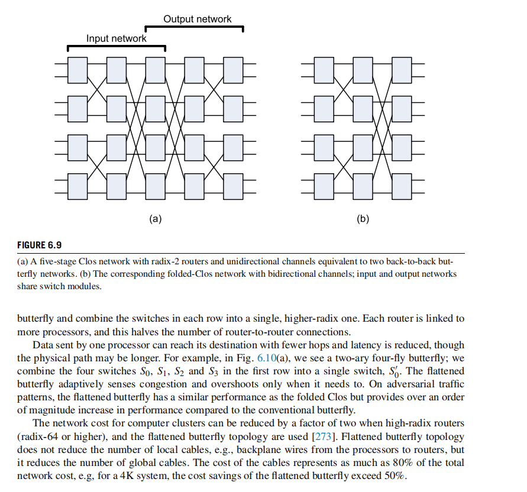

# Chapter 6 Cloud access and cloud interconnection networks

# 


# Start

**1\. 标题：云访问与云互联网络概述**

本部分内容主要介绍了云计算中网络互联的重要性，以及围绕云互联网络所涉及的各个主题与章节结构。核心观点是：云计算的关键在于通信能力，无论是在单个处理器芯片内，还是在超级计算机与分布式系统级别，都需要高效且有针对性的互联网络来支撑云端的各种应用需求。

* * *

**2\. 详细内容解析**

1）**通信在云计算中的核心地位**

*   **演化背景**：
    *   现代云计算之所以能够兴起，离不开几十年来微处理器、存储技术、计算机体系结构、软件系统、并行算法以及分布式控制策略的共同发展。
    *   然而，真正让云计算成为可能的关键，是在于互联网以及网络互联技术的不断演进，使得广域和局域网络具备了支撑大规模分布式计算的能力。
*   **通信与计算不可分**：
    *   如同本书第3章所述，哪怕在单一核心（single core）层面，CPU、内存与I/O子系统之间的高效通信都是性能优化的关键。
    *   当扩大到多核处理器或SoC（System on a Chip）时，片上总线或片上网络、以及路由器驱动的数据包交换网络对于提升计算效率意义重大。
*   **大规模系统与互联网络**：
    *   对于更大规模的系统（如超级计算机），其核心依赖复杂而高效的互联网络硬件来降低通信延时、提高带宽。
    *   与之对比，云间互联（即更大范围的云数据中心之间或云与终端用户之间）则通常受限于较高的网络延时和较低的带宽，原因在于它需要基于互联网协议、软件通信协议和路由算法的广域网络来实现。

2）**互联网与云计算的关系**

*   **分布式系统与云如何通信**：
    *   分布式系统和云计算大多基于互联网进行通信。
    *   互联网本质上是由若干子网通过交换机相互连接起来的网络集合，每个交换机都在路由算法控制下工作。
    *   互联网中的通信主要依赖软件层面的协议堆栈（如TCP/IP），这一点在保证通用性的同时，也带来了一定的延时开销和带宽限制。
*   **云计算设计者的关注点**：
    *   计算资源（CPU）与网络物理距离越远，通信带宽越低、延时越高。
    *   大规模云计算系统中往往有成千上万甚至数百万台服务器，网络带宽和时延成为影响整体性能的重要瓶颈。
    *   部分云工作负载对于网络延时与带宽极其敏感。例如：
        1.  **CPU密集型**工作负载：主要需要强大的计算能力和CPU资源，对网络依赖相对较弱。
        2.  **内存密集型**工作负载：强调对大容量、高速度内存的访问速度，对网络需求有限，但如果需要跨节点访问则仍受网络延时影响。
        3.  **I/O密集型**与**存储密集型**工作负载：对于网络性能尤为敏感，任何网络延时或带宽不足都会直接影响整体吞吐量与性能。

3）**网络基础设施的成本与需求**

*   随着计算与存储硬件成本的下降，网络基础设施的成本却在持续上升，尤其是针对高带宽、低延时的网络互联环境，其部署与维护费用都很高。
*   科学计算和工程应用通常需要在数据和网络方面投入更多——这意味着此类应用比普通互联网/云用户更依赖高性能网络，从而对网络提出了更高要求。
*   今天的云互联仍有改进空间，包括带宽、延时和网络管理等方面都在不断演进。

4）**本章内容结构**

*   **6.1、6.2、6.3：互联网与万维网(WWW)概述**
    *   介绍互联网的基础网络结构和基本概念。
    *   指出互联网的实际使用场景是“面向内容的”(content-centric)，通常我们的上网行为主要围绕“获取内容”而展开。
*   **6.4：面向内容的互联网研究**
    *   探讨将互联网朝着更“内容为中心”的方向发展的一些研究思路。
    *   这与传统的“主机到主机”或“IP地址到IP地址”的通信模型有所不同。
*   **6.5：软件定义网络（SDN）**
    *   介绍了一种对传统网络管理方式的革新，通过将控制平面与数据平面分离，实现对网络的可编程化控制与实时管理。
    *   这能显著提高网络的可定制性、可监控性和弹性，从而提高网络资源的利用效率、降低运维难度。
*   **6.6：互联网络概览**
    *   提供对各种互联网络结构的总览性介绍，作为后续更深入讨论的基础。
*   **6.7、6.8、6.9：多级网络、Infiniband和存储网络**
    *   **多级网络（Multi-stage networks）**：指通过若干层交换设备和路由路径的设计，将网络划分为多级以提高吞吐量并降低阻塞。
    *   **Infiniband**：一种常见于高性能计算（HPC）环境和数据中心的低延时、高带宽互联技术。
    *   **存储区域网络（SAN，Storage Area Network）**：专门用于高效、快速访问数据存储设备的网络，保证高可用性、高可靠性和高带宽。
*   **6.10、6.11：可扩展的数据中心架构与网络资源管理**
    *   探讨如何设计更大规模的数据中心以及如何进行网络资源的高效管理，从而满足不同时期、不同类型应用负载需求。
*   **6.12、6.13：内容分发网络（CDN）和车联网（Vehicular Networks）**
    *   **CDN**：用来将内容缓存在接近用户的边缘服务器或节点上，减少网络中长距离传输带来的延迟，提高访问效率。
    *   **车联网**：将网络连接扩展到移动的交通工具中，包含车辆之间（V2V）、车辆与基础设施（V2I）之间的通信模式，探讨其网络技术与挑战。
*   **最后部分**：
    *   提供一些延伸阅读材料、历史背景注释以及习题与思考题，为读者进一步研究与实践提供指导。

* * *

**3\. 本次内容小结**

*   **核心理念**：云计算离不开网络互联支撑，网络的性能和架构会直接影响到云计算资源的可用性与应用性能。
*   **多种工作负载分类**：CPU密集型、内存密集型、I/O密集型和存储密集型，对网络需求程度不同，但后两者尤其需要高速、低延时的网络。
*   **互联网特质**：在云环境下，互联网既要承担承载亿万用户的访问需求，又要兼顾多数据中心的相互通信，需要从硬件到软件协同优化。
*   **后续章节结构**：从基础网络概念到前沿技术（如SDN、多级网络、Infiniband、车联网等），逐层深入，帮助读者理解现代云互联网络的设计与实现。

* * *

**4\. 报错与补充**

*   本次图片文字清晰，内容已完整解释。若仍有不明之处或想深入探讨的细节，可在后续提问中具体指出。

* * *

以上内容便是对“云访问与云互联网络”章节开篇及结构介绍的完整笔记。通过这些要点，读者可以对云互联网络在云计算中的地位、性能影响因素、典型技术以及后续章节的组织结构有一个全面的了解，为后续深入学习做好铺垫。

# **6.1**.1 Packet-switched networks and the Internet


**1\. 标题：分组交换网络与互联网的基本概念及TCP/IP协议栈解析**

本部分内容聚焦于“分组交换网络（packet-switched networks）”这一核心思想，以及互联网是由若干分组交换网络构成的网络之网络（network of networks）。同时介绍了数据包（datagram）、网络体系结构、协议等基本概念，及五层TCP/IP协议栈如何在端系统与网络设备之间协同工作。

* * *

**2\. 详细内容解析**

1）**分组交换网络与互联网：基础概念**

*   **分组交换网络**：
    *   在互联网环境中，数据被拆分为一个个“分组（packet）”后，通过层层交换机和路由器进行转发，最终到达目标地址。
    *   分组在传输过程中可能会出现随机时延、丢包或乱序到达等现象。
    *   分组交换为云计算的通信模式提供了灵活性与扩展性，也是互联网通信的基本机制。
*   **数据报（datagram）**：
    *   在分组交换网络中，传输单位称为“数据报”；它包含**载荷（payload）**以及**首部（header）**。
    *   首部中含有地址、控制和校验等信息，用于指导分组在网络中的正确传输。
*   **网络体系结构（network architecture）**：
    *   指使用何种协议栈来实现通信，包括分层模型以及每层对应的功能和接口。
*   **协议（protocol）**：
    *   通信双方必须遵循的规则和约定，定义了发送者和接收者如何进行交互。
    *   每一层通常都有不同的协议，用于完成其特定功能。
*   **网络主机（network host）**：
    *   位于网络边缘，能够发起或接收通信的设备，如计算机、手机或传感器等。

2）**网络核心与网络边缘**

*   **网络核心（network core）**：
    *   由高带宽的通信链路、路由器和控制系统组成，是互联网高速转发的“骨干”部分。
*   **网络边缘（network edge）**：
    *   用户的终端系统（主机）所在位置，通过接入网络（如本地局域网、Wi-Fi、移动网络等）与核心网络相连。

3）**分组交换网络的实现思想**

*   分组交换网络是一个高度复杂的系统，由大量自治组件组成，每个组件相互配合并可能有不同的要求和约束。
*   为了有效地实施和管理这一复杂系统，通常使用\*\*分层（layering）和模块化（modularization）\*\*的基本策略：
    *   **分层（layering）**：将复杂系统分解为多个互相依赖、功能定义清晰的层，每一层通过明确定义的接口与相邻层交互。
    *   **模块化（modularization）**：将系统划分为可相互替换、可独立更新的模块，在保证功能的同时减少重复与耦合。

4）**五层TCP/IP协议栈**

*   教材中常见的TCP/IP协议栈示意图如**图6.1**所示。数据从发送方主机的上层往下层传递，然后在网络中的路由器逐层被解封装并转发，最后到达接收方主机再逐层向上还原。
*   对应五层模型各层及其数据单位如下：
    1.  **应用层（Application Layer）**
        *   数据单位：消息（message）
        *   面向用户的应用程序（如HTTP、FTP、SMTP等）。
        *   负责应用进程之间的通信，如浏览器与网页服务器之间的数据交换。
    2.  **运输层（Transport Layer）**
        *   数据单位：报文段（segment）
        *   负责端到端的可靠或不可靠传输，如TCP（提供面向连接、可靠传输）或UDP（无连接、尽力而为的传输）。
        *   主要功能包括：错误检测、流量控制、拥塞控制等（如果使用TCP）。
    3.  **网络层（Network Layer）**
        *   数据单位：分组（packet）
        *   负责对分组进行寻址和路由，将分组从源端路由到目的端。
        *   主要协议：IP（Internet Protocol），用IP地址进行标识，确保分组能在不同自治系统之间正确中继和转发。
    4.  **数据链路层（Data Link Layer）**
        *   数据单位：帧（frame）
        *   负责在相邻节点之间提供可靠的传输，可以检测并纠正链路级别的错误。
        *   常见协议：以太网、Wi-Fi等。
    5.  **物理层（Physical Layer）**
        *   数据单位：比特流（bits）
        *   负责在物理媒介上传输比特流，比如电信号、光信号或电磁波等。
        *   常见技术：双绞线、光纤、无线电波等。

5）**分层与封装/解封装（encapsulation & decapsulation）**

*   **封装**：当数据从应用层往下传时，每一层都会附加该层的首部（header），在最底层成为可以在物理链路上传输的帧或比特流。
*   **解封装**：当数据抵达接收方后，每一层会先读取并移除对应的首部，然后将真正的有效载荷（payload）传递给上一层，直到应用层接收完整数据。
*   **点对点(peer-to-peer)通信**：
    *   举例：发送端主机A的运输层协议（如TCP）会与接收端主机B的运输层协议“对等”工作（peer）。当A传输数据时，它加上运输层首部，B的运输层对该首部进行解析并执行相应操作。
    *   这种“对等层”的概念在整个协议栈中反复出现，使得网络层和数据链路层也具有相对应的工作机制。

6）**互联网：网络之网络（network of networks）**

*   **Internet的构成**：
    *   互联网由多个独立的、自主的并且相互连接的子网组成，共同遵循三大基础框架：
        1.  **全局唯一的IP地址**：保证互联网上每台设备都有一个唯一识别的地址；
        2.  **IP路由协议**：用于在网络层对分组进行寻址和转发；
        3.  **边界网关协议（BGP）**：负责自治系统之间的主干路由选择，是全局路由策略的核心。
*   **BGP的作用**：
    *   BGP维护一张网络可达性表，以决定跨自治系统（AS）的最优路由（或策略路由），可基于路径、网络策略或规则集（rule set）来进行分组转发决策。
*   **工作原理**：
    *   当一个数据包由源主机发起，网络层将它打包并通过本地路由器发送到更广泛的互联网，路由器之间使用IP及BGP等协议找出下一跳（next hop），最终到达目的AS中的目的主机。

* * *

**3\. 小结**

*   分组交换是互联网和云计算通信的核心方式。数据被拆分为分组在网络中传输，这带来了更大的灵活性和高效性，但也会带来随机时延和丢包挑战。
*   TCP/IP五层协议栈利用分层与模块化思想，为端到端通信提供了分工明确、相对独立的功能组件。
*   互联网是由分布在全球的大量子网构成，通过IP和BGP等核心协议实现跨自治系统的互联互通。
*   对于云计算而言，理解这些网络基础知识有助于掌握云访问和部署、以及在大规模分布式环境中进行高效数据传输的原理。

* * *

**4\. 报错或补充说明**

*   本次图片中内容清晰可见，已尽可能详细解析。如果仍有需要补充或加深理解的地方，可随时指出。

以上内容就是对“6.1 分组交换网络与互联网”相关概念以及图6.1协议栈示意图的完整笔记，希望能帮助你夯实对互联网通信机制的理解，为后续云网络互联与部署的学习打好基础。

# 6.1.2 **Packet-switched networks and the Internet**


已推理，持续 5 秒

**1\. 标题：互联网“沙漏”体系结构、IP地址分配与传输层协议详解**

本部分主要围绕互联网的“沙漏”型网络体系结构（hourglass architecture）展开，探讨了IP协议在网络中的核心地位、IP地址与MAC地址的区别与分配方式（DHCP），以及TCP/UDP在传输层的工作机制与拥塞控制策略。通过本节内容，我们将了解互联网能迅速扩张的技术基础，也将更清晰地掌握主机从网络层到应用层的数据传输流程及关键要点。

* * *

2\. 详细内容解析
----------

### 2.1 沙漏体系结构（Hourglass Architecture）

1.  **核心思想**
    *   如图 6.2 所示，IP协议位于网络层的“腰部”，上层可支持各种应用层协议（HTTP、FTP、Telnet、Email、RealAudio、Videoconferencing等），下层则可以运行在各种物理和链路层技术之上（LAN、Wi-Fi、Modem、卫星、Cable、Frame Relay、ATM等）。
    *   这种“上宽下宽、中间窄”的架构设计，使得互联网只需在网络层统一使用IP协议，就能与多种应用协议以及多种物理链路技术兼容。
2.  **促进互联网爆炸式增长的原因**
    *   **低层与高层的独立演进**：物理层和数据链路层可以不断升级（例如光纤带宽、无线网络、卫星通信等），而不影响网络层以上的结构；同样，应用层也能推陈出新，而无需修改底层。
    *   **端到端原则**：网络层只提供尽力而为（best-effort）服务，应用层在源端与目的端进行更多智能化控制（如TCP的可靠传输），从而减少网络核心的复杂度。

### 2.2 IP地址与MAC地址

1.  **IP地址**
    *   是用来标识互联网上每台主机的“网络层地址”，常表示为32位（IPv4）或128位（IPv6）。
    *   结构：IP地址中包含了“网络号（Network ID）”和“主机号（Host ID）”，以便路由器能将数据报路由到正确的网络，再由网络内部的方式定位具体设备。
    *   一台主机可能存在多个IP地址（多网卡、多网络接口），甚至可跨不同网络。
2.  **MAC地址**
    *   也称物理地址，是网卡（网络接口）在数据链路层的唯一标识，一般由硬件生产商烧录，全球唯一且通常不可更改。
    *   IP地址可随时改变（取决于接入网络和DHCP配置），MAC地址则相对固定。
3.  **DHCP（Dynamic Host Configuration Protocol）**
    *   用于自动分配IP地址的协议，免去了管理员手动配置的繁琐。
    *   三种常见分配方式：
        1.  **动态分配（Dynamic allocation）**：客户端开机请求IP地址，DHCP服务器从地址池中暂时租给客户端一个IP地址。租期到期后可回收再分配。
        2.  **自动分配（Automatic allocation）**：DHCP服务器从地址池中一次性地永久分配某个IP给客户端。
        3.  **手动分配（Static allocation）**：管理员在DHCP服务器上维护一个“MAC地址—IP地址”列表，只有特定MAC地址才能拿到对应的IP地址。

### 2.3 传输层协议与端口

1.  **端口（Port）与Socket**
    *   端口是传输层中用于区分同一台主机上不同应用进程的逻辑编号。
    *   进程或线程通过“套接字（Socket）”这一抽象，与网络交互。每个Socket通常由“IP地址 + 端口号”的组合唯一标识。
    *   当分组到达目标主机后，操作系统根据分组中指定的端口号将数据交付到对应的应用程序或服务进程。
2.  **TCP（Transmission Control Protocol）**
    *   面向连接、可靠传输协议。
    *   提供**有序、可靠的字节流**传输，发送端和接收端必须先建立连接（握手）再通信。
    *   **拥塞控制与流量控制**：利用诸如慢启动（slow-start）、拥塞避免（congestion avoidance）、快速重传（fast retransmit）、快速恢复（fast recovery）等算法，根据网络状况（丢包、RTT等）动态调整发送速率，防止网络拥塞并保证公平性。
    *   常见应用：万维网（WWW）、电子邮件、文件传输、远程登录等。
3.  **UDP（User Datagram Protocol）**
    *   无连接的尽力而为协议，报文（datagram）之间独立发送。
    *   不保证可靠性、顺序、也不做流量控制；适合对实时性要求较高、丢包相对可容忍的应用，如DNS查询、IPTV、实时语音或视频流（VoIP）。
    *   优点是开销小、时延低。

### 2.4 分组在主机与网络之间的传递过程

1.  **封装与解封装**
    *   当应用进程发出数据时，操作系统会先交给传输层（TCP或UDP）封装添加相应的头部，再交给网络层IP，最后再下到数据链路和物理层。
    *   数据抵达目标主机后，逆向解封装，再由传输层根据端口号将数据传给对应应用。
2.  **路由与转发的分离**
    *   **路由平面（Routing plane）**：负责构建并维护路由表，决定分组要走哪条“宏观路径”到达目的地。
    *   **转发平面（Forwarding plane）**：将收到的分组查路由表后，快速转发到相应的输出接口。
    *   这种功能分离使得路由器在做路径选择和包转发时可以分别优化，提高网络效率。
3.  **拥塞控制机制的意义**
    *   当网络接近饱和时，丢包和时延会显著增大。TCP的拥塞控制就像“交通灯”限制进入高速公路的车流，以防交通堵塞崩溃。
    *   通过动态调整发送窗口和速率，TCP实现了对网络资源的合理利用与保护。

### 2.5 信道容量与带宽

*   链路的\*\*带宽（Bandwidth）\*\*常用来指代信道的最大数据传输速率。
*   例如，光纤骨干带宽可达 Gbps 或 Tbps，而端到端通信通常受多重因素影响（路由转发、协议栈处理时延、链路质量等），实际吞吐能力往往低于物理极限。
*   在毫秒级延迟下，“速度”往往指实际可达的传输数据速率，也即对用户而言的网络吞吐（throughput）。

* * *

3\. 小结
------

*   \*\*沙漏结构（Hourglass Architecture）\*\*以IP为核心，使互联网下层可支持各种物理链路，上层可支持多样化应用，是互联网快速发展的关键架构设计。
*   **IP地址与MAC地址**分别用于网络层标识与链路层标识；结合DHCP可以实现灵活的地址分配。
*   **传输层的TCP/UDP**协议分别适配“可靠+有序传输”与“轻量+实时传输”的不同应用需求。
*   **TCP拥塞控制与流量控制**在当前互联网规模下尤为重要，避免网络过载、保证数据端到端的平稳传输。
*   **信道带宽**是物理层面极限，端到端实际速度还要考虑时延、路由、协议开销等因素。

* * *

4\. 报错或补充说明
-----------

*   本次提供的图片清晰可见，所有主要知识点已做了完整解析。若后续需要更深入探讨TCP拥塞控制算法、DHCP的实现细节或者沙漏模型的历史沿革，可在后续问题中进一步提出。

以上就是对“互联网‘沙漏’模型、IP/DHCP机制以及TCP/UDP在传输层所扮演角色”的详细笔记。借助此内容，读者应能更好地理解互联网在网络层与传输层的设计原则和技术细节，为学习云互联网络及后续更高阶的网络应用打下坚实基础。

# **6.2** **Internet evolution**


**1\. 标题：互联网分层网络（Tier 1/2/3）、IXP与IPv6演进概览**

本部分主要介绍互联网从早期单纯的数据传输网络演变为支持海量数据流与实时性应用的历程，阐述了不同层级网络（Tier 1、Tier 2、Tier 3）的概念和业务关系（Peering与Transit），并讨论了IXP（Internet Exchange Point）在ISP互联中的作用。最后，探讨了IPv6在地址扩展、多播、自动配置以及安全方面的改进及其迁移挑战。

* * *

2\. 详细内容解析
----------

### 2.1 互联网的持续演进与云计算的影响

*   **演进驱动**：
    1.  用户规模越来越庞大，网络需要更高的带宽与承载能力；
    2.  新应用和新服务（如云计算、视频流、边缘计算）对实时传输和大数据吞吐提出更高要求；
    3.  如AWS Lambda等无服务器（Serverless）服务的实时性对互联网延迟提出了更严苛标准。
*   **从数据网络到流媒体与实时应用**：
    *   互联网早期主要承载文件传输；
    *   现今大量高带宽需求的流媒体（视频、音频）及分布式实时计算（云端函数调用、物联网数据汇聚）已成互联网流量主力。

### 2.2 Tier 1、Tier 2、Tier 3网络

1.  **基础定义**
    *   **Peering**：两个网络之间的互联协议，双方互相免费交换各自用户的流量。
    *   **Transit**：一个网络向另一个网络付费，以获得互联网访问（即对方负责将其网络的流量路由到全网）。
    *   **Customer**：在Transit的关系中，支付费用来获得对方网络访问的客户网络。
2.  **三种层级网络**
    1.  **Tier 1**
        *   能够访问整个互联网（Global Internet）而**无需向其他网络购买Transit**、也无需支付结算费用的网络。
        *   世界知名Tier 1示例：Verizon、AT&T、NTT、Deutsche Telekom等。
        *   具有庞大的骨干线路和全球性路由能力，是互联网的顶层运营商。
    2.  **Tier 2**
        *   与部分网络进行Peering，但如果想要访问互联网上其他未直连的网络，仍须向某些Tier 1或其他Tier 2购买Transit。
        *   大多数的互联网服务提供商（ISPs）属于此级别：他们有部分免费互联的伙伴网，但不具备全网覆盖能力，需要额外购买骨干网络接入。
    3.  **Tier 3**
        *   自身规模更小，无法与太多网络进行直接Peering，需要向Tier 1或Tier 2付费购买Transit才能接入更大范围的互联网。
        *   这类网络一般直接面向终端用户或区域性市场。
3.  **POP（Point-of-Presence）**
    *   指从一个网络接入到另一个网络的物理接入点；
    *   Tier 3网络常在其服务区域设置POP，通过POP与上级网络（Tier 2或Tier 1）相连接，提供用户出入口。

### 2.3 IXP（Internet Exchange Point）

1.  **定义**
    *   IXP是一个物理基础设施，供不同的互联网服务提供商（ISPs）在此直接互连并交换流量；
    *   通常部署在相对中立的数据中心，通过互连交换机让各运营商互联互通；
2.  **优势**
    *   **减少中转流量、降低成本**：若没有IXP，ISP之间的数据要通过上游网络或第三方网络中转。IXP使ISP能就近交换用户数据，从而降低带宽使用成本。
    *   **改善路由效率**：通过IXP可以形成更多路径选择，提高可靠性和故障切换能力。
    *   **降低延时**：本地流量本地交换，减少跨区域长距离路由的需求，提升用户体验。
3.  **应用驱动**
    *   新兴大流量应用（云计算、高清视频、游戏、VR/AR等）促使运营商更加需要就近交换流量，以节省带宽开支并满足用户的低延时需求。

### 2.4 最后一公里（Last Mile）与带宽需求

*   虽然骨干网络和IXP在不断升级带宽，但针对普通用户而言，“最后一公里”常成为瓶颈。
*   FTTH（Fiber-to-the-Home，光纤到户）是高速接入方案之一，利用光纤替换原有铜线接入，显著提升家庭及终端用户的网速。
*   美国ATT、Google等公司都在推动千兆宽带的家庭覆盖计划。

### 2.5 IPv4向IPv6迁移

1.  **IPv4地址枯竭与NAT**
    *   IPv4提供大约  $2^{32}$ （约43亿）个IP地址，不足以应对如今海量互联设备；
    *   IANA在2011年将最后一批IPv4地址块分配给各大区域注册机构后，全球IPv4地址已基本耗尽；
    *   NAT（网络地址转换）在一定程度上缓解地址短缺问题，但增加了网络管理复杂度。
2.  **IPv6**
    *   地址空间扩展至  $2^{128}$ ，即约  $3.4 \times 10^{38}$  个地址；
    *   与IPv4相比，IPv6主要差异：
        1.  **Multicasting**：IPv6未使用传统IP广播，而采用新的多播方案，包括嵌入Rendezvous Point地址到IPv6组播组地址，便于跨域组播部署；
        2.  **无状态地址自动配置（SLAAC）**：主机可根据网络的IPv6路由通告（Router Advertisement）自动配置地址和网络参数；
        3.  **安全性（IPsec）**：在IPv6协议栈中强制支持IPsec（对IPv4而言是可选），确保IP包完整性和加密；
    *   **迁移挑战**：升级涉及应用、主机、路由器和DNS基础设施的改造，需保持对IPv4的兼容，不可能“一刀切”完成。

* * *

3\. 小结
------

*   互联网在不断演进，原本简单的数据网络正承受流媒体、云计算、IoT等新业务带来的流量冲击。
*   根据网络规模和结算模式，骨干网络呈现Tier 1、Tier 2、Tier 3的分层结构，不同层级间通过Peering和Transit关系交换流量。
*   IXP的出现大幅降低ISP之间的互联成本，增强路由灵活性与可靠性，满足对高带宽与低延时的需求。
*   最后一公里接入和IPv6的推广是当前互联网演进的重要课题，既要应对地址短缺，又要提升用户接入速率，满足下一代应用不断增长的带宽需求。

* * *

4\. 报错或补充说明
-----------

*   图片内容均已清晰覆盖；如需了解更多比如IPv6过渡技术（Dual Stack、Tunnel、NAT64/464XLAT等）或Tier网络的商务结算细节，可在后续提问中进一步说明。

以上是对“6.2 互联网演进”相关内容的完整笔记，涵盖网络层级模型、IXP作用以及IPv6关键特征，为深入了解云计算在新一代互联网架构下的发展铺垫了背景知识。


# **6.3** **TCP congestion control**

**1\. 标题：TCP 拥塞控制原理及典型算法（Tahoe/Reno）的运行机制**

本部分深入探讨了 TCP 的拥塞控制思想，阐述了网络发生拥塞的原因、TCP 如何利用滑动窗口进行流量与拥塞控制，以及早期著名的拥塞控制算法（如 Tahoe、Reno）如何在实际中通过“慢启动 (slow start)”、“拥塞避免 (congestion avoidance)”和“快速重传 (fast retransmit)”等机制来提高网络利用率、避免或减轻拥塞，并兼顾不同类型连接的公平性和效率。

* * *

2\. 详细内容解析
----------

### 2.1 拥塞控制的背景与 TCP 特性

1.  **网络拥塞 (network congestion)**
    *   当路由器或某个通信链路需要承载的流量超过其处理能力时，就会产生拥塞。表现为：
        *   队列积压导致时延增大；
        *   数据包丢失率升高；
        *   重传（retransmissions）增多，进一步占用带宽；
        *   新连接阻塞或整体吞吐量下降。
    *   拥塞会带来网络性能和容量的大幅降低。
2.  **TCP 与拥塞控制**
    *   TCP 是**面向连接** (connection-oriented) 的协议，一旦出现丢包或时延显著增加，TCP 会将其视作网络拥塞信号，触发拥塞控制机制。
    *   相比之下，UDP 因为是**无连接**协议，不具备这种内在的拥塞侦测能力，也不会主动进行拥塞控制。
3.  **流量控制 (flow control) 与拥塞控制 (congestion control)**
    *   **流量控制**：基于接收端的处理能力进行调节，防止发送端过快发送数据导致接收端缓存溢出。
    *   **拥塞控制**：基于网络容量（特别是链路和路由器队列）进行调节，防止过量数据在网络中造成拥塞。
    *   TCP 同时通过“接收窗口 (receive window)”和“拥塞窗口 (congestion window, cwnd)”这两个因素动态调整实际发送速率。

### 2.2 滑动窗口与发送速率

1.  **基本公式**
    *   文中给出了 TCP 发送速率的简化形式： 
        $$
        S = \frac{W \times MSS}{RTT} \approx \frac{W}{RTT} \quad (\text{以分组/秒计})
        $$
        *   其中：
            *    $W$  为发送端当前的发送窗口大小（滑动窗口）；
            *    $MSS$  为单个 TCP 段可携带的最大数据量 (Maximum Segment Size)；
            *    $RTT$  为该连接的往返时延 (Round-Trip Time)。
        *   如果  $S$  太小，意味着发送速率低于网络所能提供的最大带宽；若过大，则会导致拥塞。
2.  **实际窗口 W 的限制**
    *   实际可用的窗口  $W$  受**两方面**限制：
        1.  接收端的**接收窗口**（advertised window，简写为 awnd），由接收方告知发送方可接收的剩余空间；
        2.  发送端根据网络状况估算出的**拥塞窗口**（cwnd）。
    *   取二者的较小值： 
        $$
        W = \min(\text{cwnd}, \text{awnd})
        $$
        
    *   当接收端向发送端通告一个较小的窗时，发送端必须减慢发送；若网络发生丢包、超时或 RTT 激增，拥塞窗口也会相应减小。

### 2.3 TCP 经典拥塞控制算法：Tahoe 与 Reno

TCP 拥塞控制的核心机制主要包括：**慢启动 (SS)**、**拥塞避免 (CA)**、**快速重传 / 快速恢复 (FR / FR)**。文中重点讲到 Tahoe 算法（也是 Reno 的基础），其关键思想如下：

1.  **慢启动 (slow start)**
    *   初始拥塞窗口  $\text{init\_cwnd}$  通常设为 1～2 个 MSS。
    *   每收到一个 ACK，就将拥塞窗口加一 MSS，相当于在每个 RTT 期间成倍（指数方式）增加发送速率。
    *   当  $\text{cwnd}$  达到**慢启动阈值**( $\text{ssthresh}$ )时，表明进入拥塞避免阶段。
2.  **拥塞避免 (congestion avoidance)**
    *   在拥塞避免阶段中，窗口的增长速率从指数增长切换为线性增长：每个 RTT 内  $\text{cwnd}$  仅增加 1。
    *   这样可以防止发送方过快探测到超过网络容量而引发严重拥塞。
3.  **快速重传 (fast retransmit)**
    *   当发送方收到三个重复 ACK（意味着有分组丢失）时，不必等待超时，立刻执行重传，减少丢包对吞吐量的影响。
4.  **Tahoe 的处理逻辑**
    *   当检测到分组丢失：
        1.   $\text{ssthresh} \leftarrow \text{cwnd}/2$ 
        2.   $\text{cwnd} \leftarrow 1$ 
        3.  进入重新慢启动。
    *   Tahoe 只要丢包，就会把拥塞窗口降到 1，重新进入慢启动；Reno 则在快速重传后尝试进入“快速恢复”状态，不一定退回到 1，而是部分回退，提升了效率。

**简化伪代码**（Tahoe为例）：

```
for every ACK {
    if (W < ssthresh) then
        W++             // (SS) 慢启动阶段指数增长
    else
        W += 1/W        // (CA) 拥塞避免阶段线性增长
}

for every loss {
    ssthresh = W/2
    W = 1
}
```

> 这里的“W += 1/W”表示每个 RTT 增加约 1（因为在一个 RTT 期间会收到 W 个 ACK）。

### 2.4 对慢启动局限性的改进

1.  **慢启动的不足**
    *   对**短生命周期**连接（例如加载网页中的小文件或图片）的影响比较大，可能在数据传完之前窗口还没来得及充分增大；
    *   对大文件的首次传输启动也会产生明显延迟，导致整体下载时延升高。
2.  **实际应用中的多连接策略**
    *   浏览器（如 Firefox、Chrome）常常会并行打开多个 TCP 连接来“绕过”慢启动带来的初始拥塞窗口限制，以提高网页加载速度。
    *   IE 8 甚至打开更多连接，尽管这会给网络带来额外的混乱并降低全局公平性。
3.  **提高初始拥塞窗口 (init\_cwnd)**
    *   研究表明，适当调大初始窗口可以减少短流量的 RTT 循环数，从而缩短下载完成时间，并保证与长流量间的一定公平。
    *   例如，将  $\text{init\_cwnd}$  从 3 调大到 16 可在实验中显著降低页面传输延迟（从 490 ms 降到约 466 ms）。

### 2.5 传输时延公式 (6.4)

文中给出了一个在慢启动阶段**无丢包**的情况下完成传输的时延估计公式：

$$
\text{Latency} = \left[ \log_\gamma \left(\frac{L(\gamma - 1)}{\text{init\_cwnd}} + 1\right) \right] \times RTT + \frac{L}{C}
$$

*   含义：
    *    $L$  为传输文件大小；
    *    $C$  为网络瓶颈链路速率；
    *    $\gamma$  是常数 (1.5～2) 用于近似建模 ACK 延迟和是否采用了分组成组发送等因素；
    *    $\text{init\_cwnd}$  即初始拥塞窗口大小；
    *    $\frac{L}{C}$  表示数据全部发送完后在管道中还需要的排队/传输时间。
*   由此可见，若  $\text{init\_cwnd}$  提高，整体需要的 RTT 数量减少，延迟就能相应降低。

* * *

3\. 小结
------

*   **TCP 拥塞控制**基于对丢包和时延的检测，不断调整拥塞窗口，让发送速率与网络可用带宽相匹配，既避免过度拥塞又保证较高吞吐量。
*   **Tahoe、Reno 等算法**通过慢启动、拥塞避免、快速重传/快速恢复等阶段性调节，实现了对网络拥塞的自适应。
*   **慢启动缺点**在短连接或首次传输时会增加传输时延，因此实际应用往往采用**并发连接**或**增大初始窗口**等方式优化用户体验。
*   保证大规模互联网中各连接的**公平性**和**高效率**，仍是 TCP 设计与演化的核心目标之一。

* * *

4\. 报错或补充说明
-----------

*   本次图片内容完整，所有关键知识点均已说明。若需要进一步了解 Reno 与 Tahoe 的差异、以及后续 NewReno、Cubic 等更先进 TCP 拥塞控制算法，可在后续提问中继续探讨。

以上笔记即为对“6.3 TCP 拥塞控制”内容的系统解析，帮助读者从原理和算法层面深入理解 TCP 如何在保持稳定和公平的同时，尽量提高网络资源利用效率。


# **6.4** **Content-centric networks; named data networks (R)**


**1\. 标题：面向内容的网络（Content-Centric Networks）与命名数据网络（Named Data Networks, NDN）的概念与架构解析**

本部分主要聚焦在**面向内容的网络**（Content-Centric Networking, CCN）和**命名数据网络**（Named Data Networking, NDN）的设计思想以及与传统互联网（IP 地址/主机为中心）的差异。通过本节内容，我们了解到未来可能的互联网形态——通过“内容或数据对象”的名称来路由和分发数据，而非依赖主机地址，从而实现更灵活、高效和安全的数据分发。

* * *

2\. 详细内容解析
----------

### 2.1 面向内容的网络背景

1.  **互联网从主机到主机的通信范式**
    *   目前的互联网基础是通信端点（主机）之间的交互：发送方与接收方必须通过 IP 地址标识。
    *   这样做对“大规模数据分发”场景（如视频流媒体、大数据分析、边缘计算等）并不十分友好，因为相同内容在不同主机上出现时，仍需区分主机位置，不便于复制与迁移。
2.  **“面向内容” (content-centric) 的理念**
    *   在一个\*\*分发型网络 (distribution network)\*\*里，用户只关心“获取到所需的内容”，至于内容具体在哪个节点或服务器并不重要。
    *   这种思路下，网络以“内容名称（content name）”为核心，允许任意缓存、复制与重定向，让用户就近获取数据。

### 2.2 从 TRIAD 到 DONA 再到 NDN

1.  **TRIAD 项目（1999 年，斯坦福）**
    *   提出了使用对象名称 (object name) 而非主机地址进行路由；
    *   **Internet Relay Protocol** 将名称映射到地址；**Name-Based Routing Protocol** 则像 BGP 一样在中间节点传播路由信息。
2.  **DONA（2006 年，UC Berkeley）**
    *   Data Oriented Network Architecture (DONA) 将**安全性**和**数据持久性**纳入新型网络体系结构的基本要求；
    *   提出了两个核心操作：**FIND**（请求特定名称的数据）、**REGISTER**（内容提供者向网络注册数据）。
3.  **NDN（Named Data Networks）及 ICN (Information-Centric Networking)**
    *   **Van Jacobson** 等人在 2006 年提出了 NDN 作为下一代互联网的候选；
    *   2012 年，IRTF（Internet Research Task Force）成立了信息中心网络研究组（ICNRG），专注探讨 NDN 架构设计的关键问题；
    *   目前 NDN 研究围绕命名空间、路由、缓存、数据安全性和发现机制等方向不断演进。

### 2.3 NDN 架构与要素

1.  **“沙漏”架构**
    *   类似 IP 所在位置的“狭窄腰部”，NDN 将“数据名称 (data name)”作为底层网络与上层应用的分界点；
    *   上层灵活演化数据命名方式和安全策略，下层可在各种物理链路之上运行 NDN 协议，或者与现有 IP 网络“并行”存在。
2.  **Interest Packet 与 Data Packet**
    *   如**图 6.5(b)** 所示，NDN 划分为两种包：
        1.  **Interest Packet**：由数据消费者（如客户端）发出，包含要请求的数据名称、可选的选择器、标识以及路由指引信息。
        2.  **Data Packet**：由拥有该内容的节点返回，包含对应的**名称、内容、元信息、签名**等。
    *   **请求-响应模式**：每当路由器收到 Interest，就会搜索自己的内容缓存（Content Store），若命中则直接返回 Data Packet；否则将 Interest 向其他路由或内容节点转发，直到找到数据副本为止。
3.  **NDN 路由与转发表**
    *   主要由三种数据结构支撑：
        1.  **Content Store**：路由器本地缓存，用于存储最近转发/请求的 Data 包，避免重复向远端请求；
        2.  **Forwarding Information Base (FIB)**：基于**名称前缀**（name prefix）的转发表，采用最长前缀匹配来决定 Interest 包的转发方向；
        3.  **Pending Interest Table (PIT)**：用于追踪哪些 Interest 包还未得到响应，以及对应转发接口。当对应的 Data 包到达后，路由器可把它发给所有发起过该 Interest 的下游接口并进行缓存。
4.  **命名与安全**
    *   NDN 中的“名称”可以是分层结构，也可以有自定义命名空间，确保全局可访问数据有唯一名称；
    *   每个 Data 包自带“加密签名”，实现**数据级别的安全**（data-centric security），而不仅仅依赖主机和传输端的安全措施。
    *   名称空间管理并非 NDN 体系结构本身的一部分，需要应用层或特定命名策略进行约定。

### 2.4 NDN 与 TCP/IP 的主要区别

1.  **命名空间无穷**
    *   IPv4 地址 32 位有限，促使向 IPv6 迁移；而 NDN 中名称可用字符串或层次结构表达，几乎不受“地址空间”的束缚。
2.  **分发模式 vs. 端到端模式**
    *   IP 网络面向“端到端”（源和目的 IP）；NDN 面向“内容对象”（名称）。
    *   NDN 中的任意节点都可缓存数据并响应后续相同的请求。
3.  **安全机制**
    *   TCP/IP：安全更多在端点层面，如 TLS、SSH、IPsec 可选；
    *   NDN：数据对象自身是签名的，传输到任何地方都具备可验证的完整性和来源认证。
4.  **协议叠加与部署**
    *   传统 IP 路由协议（OSPF、BGP 等）基于 IP 地址来做路由表维护；
    *   NDN 则需基于名称做最长前缀匹配，也可在 IP 之上隧道化运行；
    *   应用层则可以通过 Interest/Data 模式而不是 Socket/IP-Port 模式来访问内容。

### 2.5 NDN 的潜力与挑战

1.  **本地缓存与数据重用**
    *   在云数据中心或内容分发网络 (CDN) 场景下，NDN 可通过就近缓存大幅减少骨干网络负载、降低访问延时；
    *   对数据密集型应用（如视频流、MapReduce 等并行任务）可能有明显效率提升。
2.  **可扩展路由**
    *   需要在全球范围内管理**命名前缀**并进行高效查找，对路由可扩展性提出新挑战；
    *   同时需要统一处理安全、持久性以及访问控制等问题。
3.  **部署与过渡**
    *   NDN 与现有 IP 网络并存需要各种过渡机制；
    *   应用开发需要全新 API：当前大多以“Socket / IP / DNS”方式构建应用，切换到“Named Content / Interest / Data”需要一段适应期。

* * *

3\. 小结
------

*   **面向内容的网络 (CCN)** 和 **命名数据网络 (NDN)** 强调“以数据或内容名义”进行路由和获取，突破了传统IP基于“地址”的通信模式。
*   核心数据结构如 **Content Store**、**FIB**、**PIT** 及 **Interest/Data** 包体系，与 IP 网络中 **路由表 + DNS + Socket** 的运作方式有根本差别。
*   NDN 推行 **数据级安全**，每个内容对象本身带签名，增强了分发过程中对内容来源及完整性的信任；
*   这种模式可能显著改善流媒体、大规模分发服务的效率，但需要面对**命名管理**、**路由可扩展**及**部署兼容性**等挑战。
*   对于云计算与大数据而言，NDN 也具备潜力在大规模分发和边缘缓存中发挥更大的优势。

* * *

4\. 报错或补充说明
-----------

*   本次图片中的知识点已完整覆盖，包括 NDN 关键数据结构与 Interest/Data 包格式。若需要深入了解命名数据网络的具体路由算法、内置安全机制或 ICN 更广泛的研究进展，可在后续提问中进一步探讨。

以上内容即为对“6.4 面向内容网络；命名数据网络”章节的完整解析笔记，帮助读者理解为何 NDN 以及更多信息中心网络 (ICN) 的设计可能成为下一代互联网的重要发展方向。

# **6.5** **Software-defined networks; SD-WAN**


**1\. 标题：软件定义网络 (SDN) 与软件定义广域网 (SD-WAN) 的概念与架构解析**

本部分内容主要讲解了软件定义网络（SDN）如何通过在网络控制与物理资源之间引入抽象层，实现网络资源的可编程化与集中管理。随后介绍了SD-WAN这一应用场景，阐述其核心理念：将广域网连接从传统“硬件中心”转变为“软件可定义”的模式，从而在成本、管理、性能和安全等方面获得提升。

* * *

2\. 详细内容解析
----------

### 2.1 软件定义网络（SDN）的基本思想

1.  **SDN 的概念与动机**
    
    *   **软件定义网络 (Software-defined Networks, SDN)**：核心在于将网络控制层与数据转发层分离，通过编程接口对网络资源进行更灵活、更动态的控制。
    *   它将传统网络设备（如交换机、路由器）中紧耦合的控制平面与数据平面拆分，将控制逻辑集中在**控制器**上，统一管理网络策略与资源。
    *   这一思路借鉴了“虚拟化”的原则，即对底层物理资源进行抽象，使之可被编排、动态调整。
2.  **SDN 分层与主要组件**
    
    *   **应用层 (Applications)**：来自业务或用户的需求，如安全策略、带宽需求、流量工程等。
    *   **控制层 (Controllers)**：接受上层应用需求，并对底层网络设备进行统一配置。
    *   **数据平面 (Datapaths)**：由物理或虚拟网络设备构成，执行具体的包转发操作。
    *   **南向接口 (Control-to-Data-Plane Interface)**：如 OpenFlow，用于控制器与网络设备间的通信。
    *   **北向接口 (Northbound Interface)**：用于上层应用向控制器发出策略或编排需求，API 形式因不同厂商而异。
    *   **管理与运维**：贯穿于整个SDN架构中，实现网络状态监测、日志分析与故障处理等。
3.  **OpenFlow 简介**
    
    *   一个常见的 SDN 南向接口标准，用于对交换机的“流表 (flow table)”进行编程；
    *   流表中每条表项指示对符合某匹配字段的报文进行转发、修改、丢弃等操作。
    *   控制器可随时下发新规则或更新流表，以快速适应网络流量变化或策略改变。
4.  **SDN 的价值**
    
    *   动态控制：可依据实时网络状态做流量调度、负载均衡；
    *   提高网络可编程性：便于开发自动化运维，减少人工配置错误；
    *   资源利用最优化：以全局视角规划网络路径和带宽资源，提升效率。

### 2.2 软件定义广域网（SD-WAN）

1.  **SD-WAN 的核心概念**
    
    *   **SD-WAN (Software-Defined Wide Area Network)**：将广域网从依赖专用硬件和固定协议栈的模式转化为“软件可定义、可集中管理”的服务。
    *   与普通 WAN 区别：不再是依赖 MPLS 等传统封闭性技术，而是通过软件层在广域网链路上建立虚拟覆盖网 (overlay)，实现安全、高可用、可动态调度的接入。
2.  **多种传输链路的抽象与组合**
    
    *   常用底层传输包括：
        1.  **MPLS**（多协议标签交换），通过标签快速转发数据；
        2.  **LTE/4G/5G** 无线网络；
        3.  **宽带因特网**连接；
        4.  **DSL/Cable** 等传统宽带接入。
    *   SD-WAN 将这些不同接入方式抽象成统一的虚拟连接，根据应用需求和网络状况，自动选择最佳路径或进行流量分配。
3.  **SD-WAN 的主要优点**
    
    1.  **提高云端应用用户体验**：对云计算流量可做优先级分配、智能选路和QoS保证；
    2.  **降低成本**：可将部分原本依赖昂贵 MPLS 的流量转移到更廉价的宽带或无线网络上；
    3.  **集中化的流量管理**：SD-WAN 提供跨链路的统一管理面，可自动执行策略下发与流量调度；
    4.  **增强安全**：内置下一代防火墙、加密通道 (VPN)，实现更强的访问控制与数据保护；
    5.  **自动化与易部署**：通过软件控制，大部分配置可自动下发到各分支路由设备，无需现场繁琐操作；
    6.  **弹性与冗余**：可使用多条不同的链路进行备份与故障切换，提高广域网的可用性；
    7.  **可视化运维**：统一监控、分析 WAN 流量，实现故障快速定位。
4.  **SD-WAN 的实现与厂商**
    
    *   主要厂商示例：Citrix、Riverbed、Cato Networks、Cisco（含 Meraki、Viptela）等。
    *   这些厂商为企业提供软硬一体解决方案，让企业分支和数据中心之间能灵活组网并统一管理。

* * *

3\. 小结
------

*   **SDN**：从本质上改变了网络的组织方式，以集中式控制器和开放接口为核心，让网络具备灵活的流量调度与自动化配置能力；
*   **SD-WAN**：是 SDN 思想在广域网场景下的具体实践，通过将多种物理网络链路抽象为统一虚拟通道，并结合安全策略和自动化运维，大幅提升了企业广域网的可管理性、性能、以及成本效益。
*   随着云计算与分支网络的普及，**SD-WAN** 正快速发展，成为企业和服务商构建“智能广域网”的主流解决方案。

* * *

4\. 报错或补充说明
-----------

*   本次图文信息已基本解析完毕。如需进一步了解 **OpenFlow** 的具体流表匹配规则、**SD-WAN** 如何与云服务深度整合等，可以在后续提出更多问题。

以上就是对“6.5 软件定义网络；SD-WAN”内容的完整笔记。通过这些知识点，读者可以更好地理解现代网络从传统硬件驱动走向软件可编程化的趋势，以及在广域网场景中实现网络弹性与成本优化的具体技术路线。

# **6.6** **Interconnection networks for computer clouds**


**1\. 标题：云计算环境下的互连网络概述：拓扑结构、路由与流控设计**

本部分内容聚焦于云计算及大规模并行系统中的互连网络（Interconnection Networks）。通过介绍不同的拓扑结构（如总线、超立方体、Mesh/Torus、Crossbar、Fat-Tree 等）以及衡量网络性能的关键指标（如网络直径、双割带宽、跳数、端口数量等），我们可以理解数据中心或超级计算机在构建时如何在成本、性能与扩展性之间取得平衡。

* * *

2\. 详细内容解析
----------

### 2.1 互连网络概念与性能挑战

1.  **互连网络的组成**
    
    *   由\*\*节点（nodes）**和**链路（links）\*\*构成：节点可表示处理器、内存或服务器；链路代表通信通道。
    *   **网络接口**：节点与网络的接口硬件，用于发送与接收数据包。
    *   **交换机（switches）**：互连网络中的核心组件，负责根据路由表将数据包转发至下一跳。
    *   是否**阻塞（blocking）**：若网络能够同时支持任意源与目标之间的通信而不互相干扰，则称为**non-blocking**；否则为**blocking**。
2.  **网络发展的制约**
    
    *   虽然计算和存储遵循摩尔定律快速发展，但网络带宽的增长速度略慢于理想预测，给大规模系统的性能提升带来了挑战。
    *   1997～2010 年以太网速率从 1 Gbps 提升至 100 Gbps，虽很可观，但仍略低于预期的 1 Tbps 水平。
3.  **网络拓扑、路由与流控**
    
    *   **拓扑（Topology）**：节点间的物理或逻辑连接方式。影响网络直径（最大/平均跳数）、双割带宽、成本和功耗等。
    *   **路由（Routing）**：决定消息从源到目的的具体路径。
    *   **流量控制（Flow Control）**：决定在网络拥塞或缓存受限时如何分配、调度数据包。
4.  **静态 vs. 交换式网络**
    
    *   **静态网络（Static）**：节点之间有直接连接（无独立交换机层），常用于共享内存或小规模系统；如总线、超立方体、2D 网格、2D 环面（torus）等。
    *   **交换式网络（Switched）**：引入专门的交换机设备将节点分层或多级连接，以更灵活地实现大规模互联；如多级交换结构、Crossbar、Omega 网络等。

### 2.2 静态网络拓扑示例

文中**图6.6**列举了几种典型静态网络拓扑：

1.  **Bus（总线）**
    
    *   简单、成本低，但**可扩展性差**，所有节点共享一条总线，带宽很快成为瓶颈。
    *   常见于小规模共享内存多处理器系统，易于实现缓存一致性（snooping），但难以支持大规模并行。
2.  **Hypercube（超立方体）**
    
    *   对阶数为  $n$  的超立方体，节点数为  $N=2^n$ ；每个节点的度数（degree）为  $n$ 。
    *   **双割带宽高**（bisection bandwidth 大）、**平均跳数  $\mathrm{O}(\log N)$ **，适合在大规模并行计算中快速互联。
    *   实例：SGI Origin 2000 使用超立方体连接结构。
3.  **2D Mesh（二维网格）**
    
    *    $n \times n$  网格，有近邻连接，构造简单，平均距离  $\mathrm{O}(\sqrt{N})$ 。
    *   在某些应用中（如 Intel Paragon），利用网格结构简化布线，但若节点与网格边缘之间的访问频繁，会导致中心或边缘不均衡。
4.  **2D Torus（二维环面）**
    
    *   在 2D Mesh 基础上，将网格边缘再首尾相连，形成环面结构以减少边缘的影响。
    *   **距离更均衡**，但硬件开销也更高，因为增加了连接边缘节点的额外链路。
    *   适用于需要大量最近邻通信的并行应用；如 Fujitsu K 超级计算机采用 6D Mesh/Torus。

### 2.3 交换式网络与多级网络

文中**图6.7**展示了交换式网络的两种典型结构：

1.  **Crossbar**
    
    *   完全连接的交换矩阵，支持任意输入端口到输出端口的直接映射；
    *   成本为  $\mathrm{O}(N^2)$ ，适合小规模场景；当节点数量大时需要大量交换元件，开销极高。
2.  **Omega 网络**
    
    *   一种多级网络，每一级都由固定规模的交换单元组成，通过若干级交叉连接，使得任意输入端口可在若干级后到达任意输出端口；
    *   成本  $\mathrm{O}(N \log N)$ ，延迟  $\mathrm{O}(\log N)$ ；属于**小直径网络**。

#### 云互联网络（Cloud Interconnection Networks）

*   大型云数据中心往往由成千上万台服务器组成，使用**分层路由**结构：
    1.  **机架（Rack）**：服务器通过 Top-of-Rack 交换机互联；
    2.  **机架交换机汇聚**到**集群交换机**；
    3.  不同集群之间通过**数据中心核心**或**骨干网络**互联。
*   **位置透明**（location transparency）是目标：每个服务器应可在延时和带宽上均衡地访问其他服务器，避免对应用部署位置过度敏感。
*   **Oversubscription（过度订阅）**：衡量“最差情况下所有服务器间可用带宽”与网络理论全双工带宽之比；典型值约在 2.5～10 之间。越接近 1 表示全双工、低阻塞，但成本也更高。

### 2.4 Fat-Tree 拓扑

1.  **Fat-Tree 思想**
    *   类似树形结构，但在上层和中间层加粗“干线”（即更多并行链路或更大端口数的交换机）来提高双割带宽。
    *   适合大规模集群/WSC（Warehouse Scale Computers）互联，利用廉价、端口数相同的交换设备级联组成。
2.  **图 6.8** 示例
    *   两个 96 端口交换机在根部，通过若干 24 端口交换机组成多级层次，总共连接 192 个节点；
    *   **Oversubscription**可以通过增加核心层或中间层交换机数量、带宽来降低。
3.  **优点**
    *   高双割带宽、扩展性好、成本相对可控；
    *   多路径容错，发生局部故障时仍能找到可替代路径。

### 2.5 不同拓扑下的性能与成本比较

**表 6.1** 给出针对 64 节点的多种互连网络比较（2D 网格、2D 环面、超立方体、Fat-Tree、Fully Connected）：

*   **BW in # of links**：代表双割带宽（bisection bandwidth）对应的链路数量指标；
*   **Max/Avg hop count**：最大/平均跳数；
*   **I/O ports per switch**：交换机端口数；
*   **Number of switches**：交换机数量；
*   **Total number of links**：系统中总链路数量。

结论大致如下：

1.  **Fat-Tree** 在双割带宽与交换端口数量之间表现平衡，提供了较大带宽且端口需求相对合理；
2.  **Fully connected** 虽带宽极高，但连接数随节点数平方增长，硬件成本与能耗难以承受；
3.  **Hypercube** 具有中等端口数且较好的双割带宽，平均跳数  $\mathrm{O}(\log N)$ ；
4.  **Mesh/Torus** 构造简单，但扩展性和双割带宽相对较低。

* * *

3\. 小结
------

*   本节详述了各种**互连网络拓扑**（静态与交换式）的特性、优势与不足。
*   对于大型云数据中心和超级计算机，网络已成为影响整体性能和成本的关键因素。
*   **网络拓扑**直接决定网络直径、双割带宽以及系统扩展性；适宜的路由与流控策略可进一步提升网络利用效率。
*   **Fat-Tree** 等多级分层结构已在云计算场景中广泛应用，平衡了硬件投入与高吞吐需求。
*   随着节点规模的扩增与高带宽需求，互连网络仍需在硬件创新与拓扑设计上不断演进。

* * *

4\. 报错或补充说明
-----------

*   以上图片内容基本可见并已阐述其主要知识点，如需深入了解例如**Omega 网络**的具体路由逻辑、**Fat-Tree**的详细构造或**mesh/torus**在实际部署中的性能调优，可在后续问题中进行进一步探讨。

以上即为“6.6 计算机云互连网络”之详细笔记，通过对各种经典拓扑与云环境下的大规模网络设计要点的介绍，相信能帮助我们更好地理解数据中心内部及超级计算机互连网络的性能与结构设计原理。

# **6.7** **Multistage interconnection networks**





**1\. 标题：多级互连网络（Multistage Interconnection Networks）及其典型拓扑（Clos、Butterfly、Flattened Butterfly）**

本部分主要介绍了多级互连网络的概念与几种常见实现，包括经典的 Clos 网络（以及其折叠形式 folded-Clos，也称 fat-tree）、Butterfly 网络、Black Widow 拓扑和 Flattened Butterfly 等。这些网络通过多层交换结构和高阶路由器，将节点规模成倍扩大并可实现较高的网络带宽与较低的延迟，在大规模并行计算和云数据中心中应用广泛。

* * *

2\. 详细内容解析
----------

### 2.1 高阶路由器（High-radix）与低阶路由器（Low-radix）

1.  **路由器的 radix（阶）定义**
    *   指路由器拥有的端口数量。高阶 (high-radix) 路由器拥有更多端口，可让网络在同样级数下连接更多节点；但每个端口的带宽相对变窄。
    *   低阶 (low-radix) 路由器端口数少，但单端口带宽可较高。
2.  **高阶路由器的优势**
    *   在同等带宽芯片条件下，使用多端口可减少网络分级数：从而降低延迟、功耗以及网络级联成本。
    *   过去 20 年中，交换芯片的单 pin 带宽大约每 5 年增长一个数量级，推动了高阶路由器的普及。

### 2.2 Clos 网络

1.  **Clos 网络诞生背景**
    *   1950 年代由 Bell Labs 的 Charles Clos 提出，是多级非阻塞网络的一种典型设计。
    *   由奇数层的交换机组成，输入网络和输出网络之间通过中间层连接（如图 6.9(a)）。
2.  **Butterfly 网络**
    *   通常可以看作由两个背靠背（back-to-back）的 Butterfly 网络组合成 Clos。Butterfly 网络因其互联模式类似蝴蝶翅膀而得名。
    *   缺点：Butterfly 是阻塞式的，一旦有两个数据包要同时访问同一端口，就发生冲突。
3.  **Clos 网络特征**
    *   大多数时候为**无阻塞**（non-blocking），即允许同时分配多对输入输出连接而不互相影响。但如果路由算法不当，也可能出现包绕路导致额外跳数、增加延迟。
    *   **Folded Clos（折叠式 Clos）**：将输入与输出部分“折叠”到同一组交换模块里（如 fat-tree），从而简化布线并共享资源。许多商用高性能互连技术（Myrinet、InfiniBand、Quadrics 等）都采用了类似的 fat-tree 思想。
    *   例如：Cray XD1 超级计算机使用 24 阶路由器构造 folded Clos，以获得较低延迟和合理成本。

### 2.3 Black Widow 拓扑

1.  **在折叠式 Clos 基础上的扩展**
    *   Black Widow 增加了侧向链路 (side links)，使网络可以被划分成多个子树并灵活分配整体带宽。
    *   拥有更低成本与更低延迟，Cray 计算机中曾采用此拓扑。

### 2.4 Flattened Butterfly 网络

1.  **原理**
    *   相比传统 Butterfly，需要多个“阶层”交换机级联，Flattened Butterfly 会把同一行的多个低阶交换机合并成一个更高阶的交换机。
    *   数据包能在物理上走更长路径，但实际上逻辑跳数更少，常能以更少级数完成路由。
2.  **适用于高阶路由器**
    *   Flattened Butterfly 能显著减少全局连线（特别是跨机架、跨机房布线），从而降低 80% 左右的电缆成本或更多。
    *   在面对复杂流量（adversarial traffic）时具备与 Folded Clos 相近的性能，且在典型应用下可以减少整体延迟或造价。
3.  **成本与性能权衡**
    *   当路由器的阶数足够高 (如 radix-64)，Flattened Butterfly 能取得与 fat-tree/folded Clos 同级甚至更好的性能，但布线与端口需求更少。
    *   在大规模集群（如 4K 节点规模）测算中，Flattened Butterfly 的整体成本可比传统蝶形网络节省一半以上。

### 2.5 总结：多级网络适用性

*   **Clos/Folded Clos (Fat-tree)**
    *   优点：高带宽、易扩展、能保持较低阻塞；
    *   常见于高性能计算和云数据中心的核心网络。
*   **Butterfly/Flattened Butterfly**
    *   优点：路由简单、延迟低；Flattened 版本借助高阶交换机可减少级数、降低布线成本；
    *   劣势：在对抗性流量模式下，可能出现包“过冲”现象，需要更复杂的自适应路由和缓冲管理。
*   **高阶 vs. 低阶**
    *   **高阶 (High-radix)**：端口多、级数少，构建大规模网络时延迟更低；
    *   **低阶 (Low-radix)**：端口少但带宽高，适合规模相对较小或仅需少数高速连接的场景。

* * *

3\. 小结
------

*   **多级互连网络**在大规模并行系统中至关重要，它通过多层交换机构建具有高带宽、低延迟、可扩展性的网络结构。
*   **Clos 网络**（及折叠式 Clos）是经典的多级非阻塞结构，多款商用高性能互连和超级计算机都基于这种设计。
*   **Flattened Butterfly** 利用高阶路由器的优势，减少物理连接数量并保持较优的网络性能与可扩展性。
*   在实际部署中，具体拓扑的选择往往根据**集群规模、硬件成本、路由器端口数、布线复杂度**等综合决定。

* * *

4\. 报错或补充说明
-----------

*   本次内容涵盖多级网络及常见拓扑的主要知识点，若需更深入讨论如**Black Widow 的具体实现细节**，或**Flattened Butterfly 在某些对抗性流量下的路由优化算法**，可在后续提问中进一步探讨。

以上即为“6.7 多级互连网络”的完整笔记，希望能帮助你了解不同拓扑在大规模并行及云数据中心环境中的应用与设计考量。

# **6.8** **InfiniBand and Myrinet**


**1\. 标题：高性能互连网络之 InfiniBand 与 Myrinet 概述**

本部分介绍了应用于超级计算机和云计算集群的两种高性能互连网络技术：**InfiniBand** 与 **Myrinet**。它们均以高带宽、低延迟著称，并在硬件与协议层面提供了针对大规模并行计算环境的专用支持。通过了解它们的架构、速率发展和工作机制，我们可以更好地理解为何这些互连网络能在大规模集群中发挥关键作用。

* * *

2\. 详细内容解析
----------

### 2.1 InfiniBand

1.  **背景与产业支持**
    
    *   InfiniBand 广泛应用于超级计算机和企业级数据中心，行业巨头如 Dell、HP、IBM、Intel、Microsoft 都提供支持；
    *   Intel 生产了配套的主机总线适配器 (HBA) 和网络交换设备，构成了完善的产业生态；
    *   典型用途：在高性能计算 (HPC) 和分布式存储、数据库 (如 Oracle Exadata/Exalogic) 中构建高速、低延时的通信网络。
2.  **交换式结构 (switched fabric)**
    
    *   与“共享介质 (shared channel)”不同，InfiniBand 采用交换式结构，每条链路只连接两个通信端（如主机与交换机、或交换机与交换机）；
    *   这种点对点的高速链路极大提高了总带宽，并能减少拥塞与延迟。
    *   当节点规模扩大时，通过叠加更多交换机层级（类似前文介绍的多级网络，如 Fat-tree、Clos 等）保持高吞吐量和低延时。
3.  **数据速率与规格演进**
    
    *   InfiniBand 提供多种速率模式：SDR(1X)、DDR(2X)、QDR(4X)、FDR(14X)、EDR(14X 改进) 等；对应不同信号速率和带宽：
        *   **SDR**：2.5 Gbps 每通道（双向传输）
        *   **DDR**：5 Gbps
        *   **QDR**：10 Gbps
        *   **FDR**：14.0625 Gbps
        *   **EDR**：25.78125 Gbps
    *   链路可以通过“捆绑 (bonding)”多条通道来进一步提升总有效带宽（如 4X、12X 等）。
    *   表 6.2 展示了业界对于高速度互连的演进路线，从 1 Gbps 以太网到如今 100 Gbps 及更高。
4.  **特点与应用**
    
    *   InfiniBand 提倡“开箱即用的带宽 (bandwidth-out-of-the-box)”，减少传统服务器内部或操作系统层的网络瓶颈；
    *   支持子微秒级乃至纳秒级的链路反应时间，适合低延迟敏感场景；
    *   提供面向故障转移 (failover)、多播 (multicast) 等高级特性，增强高可用性与可扩展性；
    *   可通过 PCI Express (如 PCIe 2.0/3.0/4.0 等) 为服务器提供较大的传输带宽通道，从而充分发挥其高速特性。

### 2.2 Myrinet

1.  **诞生与设计初衷**
    
    *   Myrinet 是加州理工学院 (Caltech) 研发的面向大规模并行系统的高速互连网络，早期在 Intel Paragon、Cray T3D 等系统中应用；
    *   如今已不再广泛使用，但其许多先进理念对后续高性能网络设计产生了深远影响。
2.  **关键特性**  
    a. **通信鲁棒性**：通过流控、分组封装与纠错机制，提高传输可靠性；  
    b. **自初始化、低延迟、cut-through 交换**：一旦交换机收到数据头部，就能在未完全接收完整分组前将其转发至下一节点；  
    c. **主机接口 (Host interface)**：可直接映射网络，并将地址转换、路由选择及报文处理等工作在硬件层完成，以减少操作系统介入带来的额外延迟。  
    d. **简化的主机软件栈**：用户进程可与网络直接交互，而无需繁重的内核协议堆栈。
    
3.  **网络结构**
    
    *   Myrinet 采用**点对点全双工**链路连接主机与交换机，或交换机之间；
    *   链路速率曾达到**单向 640 Mbps**，双向合计 1.28 Gbps，在 1990 年代初具有领先优势；
    *   用“阻塞式 cut-through routing”避免死锁：在路由发生冲突时可以等待空闲通道，也可以在数据头部刚到达时马上转发到下一级（wormhole 模式）。
    *   系统规模扩展时，总传输能力随着节点增多而增加，且支持多数据流并发传输。
4.  **对比以太网与 MPI 上的性能差异**
    
    *   针对某些 HPC 基准 (MG NAS Benchmark) 测试，Myrinet 比基于 TCP 的以太网大约高 5% 的消息传输性能；
    *   不同应用及库实现（如 MPI）对结果影响很大；同时随着现代以太网(25G、40G、100G)和 RDMA over Converged Ethernet (RoCE)兴起，性能差距进一步缩小。

### 2.3 Store-and-Forward 与 Cut-through (Wormhole) 转发模式

*   **存储转发 (Store-and-Forward)**：在路由器/交换机中完整接收并验证数据包后再发送至下一跳；安全但增加延迟。
*   **Cut-through 或 Wormhole**：数据头部一旦抵达就可立即转发，下游链路若暂时忙则头部需等待；大幅降低端到端延迟，但容易出现“通道阻塞”。
*   Myrinet 采用后者，搭配流量控制，兼顾低延迟与高吞吐。

* * *

3\. 小结
------

*   **InfiniBand** 已成为许多 HPC 集群和数据库应用的事实标准互连，通过高阶交换芯片与点对点全双工链路实现高带宽、低延迟和丰富的容错特性。
*   **Myrinet** 曾在 90 年代到 2000 年初大规模部署于科研并行集群，具备先进的 cut-through 交换及主机硬件加速能力。在今天，它的理念部分继承于其他 HPC 网络（如 Omni-Path、Slingshot）和 RDMA 技术。
*   相比传统以太网，这些专用互连网络在高带宽和低延迟上更具优势，适合对通信敏感的大规模并行应用；不过在开发难度、生态及硬件成本等方面也存在一定取舍。
*   随着网络技术演进，InfiniBand 与新一代以太网 (如 100G RoCE) 在 HPC、云计算环境中将继续共存并相互竞争。

* * *

4\. 报错或补充说明
-----------

*   图片内容大体清晰，已概括 InfiniBand 与 Myrinet 的核心特点与使用场景。若需更多技术细节（如 InfiniBand 协议栈、Myrinet 路由算法实现），可在后续提问深入探讨。

以上就是“6.8 InfiniBand 与 Myrinet”章节的完整笔记，通过这些内容，读者能够了解高性能互连网络如何在大型并行系统与云环境中显著提升数据传输效率与可扩展性。

# **6.9** **Storage area networks and the Fibre Channel**


**1\. 标题：存储区域网络（SAN）与 Fibre Channel（FC）体系结构全面解析**

本部分聚焦于专为数据块传输设计的高性能存储网络——**存储区域网络 (Storage Area Network, SAN)**，以及其核心协议架构 **Fibre Channel (FC)**。通过了解SAN的整体组成以及FC的多层协议栈、帧结构、服务类别，我们可以更好地理解高吞吐、低延迟及数据中心级别的可靠存储网络是如何构建和运作的。

* * *

2\. 详细内容解析
----------

### 2.1 SAN（Storage Area Network）概述

1.  **SAN的功能**
    
    *   专门用于**数据块级别**的高速传输网络，将**服务器**与**存储设备**连为一体，同时也支持服务器与服务器、存储与存储之间的数据通信；
    *   典型架构如**图 6.11**所示，通常使用**光纤连接**和**FC协议**搭建。客户端（上层应用）通过局域网（LAN）访问服务器，服务器则通过SAN来访问底层存储设备；这可提升大规模数据读写的效率和稳定性。
2.  **组网构成**
    
    *   SAN由两大部分组成：
        1.  **通信基础设施**：即交换机、光纤、适配器 (HBA) 等硬件及其网络拓扑；
        2.  **管理层**：为存储资源提供统一的监控、配置、分区 (Zoning) 等功能，以便在同一存储网络中实现安全、可管理的共享访问。
3.  **SAN在企业与云环境中的意义**
    
    *   通过高速且可靠的存储网络，服务器可像访问本地磁盘那样高效存取远程存储；
    *   分离的存储与计算资源使扩容、迁移、容灾更为灵活，从而满足大规模数据库、虚拟化平台和关键业务系统的需求。

* * *

### 2.2 Fibre Channel 协议栈

**Fibre Channel（FC）**是SAN应用中最广泛的架构。它是分层设计的协议栈，如**图 6.12**所示，自底向上包括：

1.  **FC-0：物理层 (Physical Interface)**
    
    *   定义光纤或铜缆的物理信号特性，使用激光二极管管理点对点光纤连接；
    *   当连接断开时，端口会发送一系列脉冲以检测何时重新连上，并进行必要的握手。
2.  **FC-1：传输编码 (Transmission Code)**
    
    *   负责串行传输、编码/解码和位同步等；
    *   典型地采用 8B/10B 编码，使10位数据传输中有8位为有效载荷，提供DC平衡、定界对齐功能等。
3.  **FC-2：信令协议 (Signaling Protocol)**
    
    *   处理数据帧的分组、顺序和交换标识 (Sequence and Exchange Identifiers)；
    *   提供流控机制、拓扑管理 (点对点或交换结构)、以及不同服务类别的传输方法。
    *   FC 框架常用的帧格式如**图 6.13**所示，包含：
        *   SOF (Start of Frame，4字节)
        *   目的/源端口地址 (各3字节)
        *   控制信息 (18字节)
        *   有效载荷 (0 ~ 2112字节)
        *   CRC 校验(4字节)
        *   EOF (End of Frame)
4.  **FC-3：公共服务层 (Common Services)**
    
    *   提供高级功能供多个端口或节点共享；
    *   例如：**Hunt groups** (一组端口共享同一别名，可将到该别名的帧转发到任意一个可用端口)、**带宽条带化 (striping)** 将多个端口并行传输单一数据流以提高带宽、**多播/广播**等功能。
5.  **FC-4：协议映射层 (Protocol Mapping Layer)**
    
    *   定义与上层协议的映射关系，如 SCSI、IP、ATM 等，使 FC 可同时承载多种协议；
    *   实际中，最常见的是**SCSI over FC**，服务器可以通过 SCSI 命令集对远端存储设备进行读写。

* * *

### 2.3 FC的服务类型

根据不同应用需求，FC 提供多种**服务类别 (Classes of Service)**：

1.  **Class 1**：面向连接的阻塞服务，保证帧按发送顺序到达，预留连接带宽；常见于极高可靠性场景，但使用不多。
2.  **Class 2**：带有ACK确认的帧交换，但帧可走不同路径，不保证顺序，由上层协议负责重排。
3.  **Class 3**：无连接、无ACK的“尽力而为”数据报服务，最常见，用于存储流量和高吞吐场景。
4.  **Class 4**：面向连接的虚电路服务，支持带宽/时延的 QoS 保证。适合需要稳定传输、实时度较高的应用。
5.  **Class 5**：异步传输模式，专门用于需要立即传输的多媒体业务。
6.  **Class 6**：提供可靠多播连接，保证组播接收的可靠性。
7.  **Class 7**：类似于 Class 2 但用于Fabric管理的无连接服务，带有非送达通知。

> 注：实际部署中**Class 3**最为常见，用来承载 SCSI over FC 或 IP over FC 等。

* * *

### 2.4 安全与分区：Zoning、WWN

1.  **分区 (Zoning)**
    
    *   为保证安全或管理方便，可对交换结构进行**分区**，只有相同zone内的节点可以互相通信；
    *   常用于隔离如“Windows NT环境”和“UNIX环境”或不同应用场景的数据流。
2.  **WWN (World Wide Name)**
    
    *   与以太网的 MAC 地址类似，每个 FC 设备都有全局唯一的 64 位地址；
    *   Fabric 交换机在设备登录时，会将端口地址与设备WWN对应起来，存入交换机内的**Name Server**，以实现后续帧路由与管理。

* * *

### 2.5 FC扩展协议与SAN互联

1.  **Fibre Channel over IP (FCIP)**
    *   通过IP网络隧道传输FC帧，实现地理分散的SAN之间互联；
    *   典型场景：跨防火墙或远程站点的容灾复制 (Disaster Recovery)，可把传统FC流量封装到TCP/IP里。
2.  **Internet Fibre Channel Protocol (iFCP)**
    *   网关-网关协议，用 TCP/IP 取代底层FC物理协议；
    *   Fibre Channel 存储设备通过连接 iFCP 网关，对外呈现 TCP/IP 形式的会话，实现跨IP网络的访问。

* * *

3\. 小结
------

*   **SAN** 通过专用、高速的**块级存储网络**，为服务器和存储之间提供高性能、可靠的通信途径；
*   **Fibre Channel** 是 SAN 的主流技术，拥有完善的分层协议栈（FC-0 ~ FC-4）和多种**服务类别**来满足不同等级的可靠性和带宽需求；
*   其帧格式、分区(Zoning)和 WWN 机制有助于大型企业、数据中心在存储资源共享与安全隔离之间取得平衡；
*   **FCIP / iFCP** 等协议可通过 IP 隧道或网关将 SAN 扩展至广域环境，实现更灵活的远程容灾与跨区域互联。

* * *

4\. 报错或补充说明
-----------

*   本节图片（6.11 ~ 6.13）文字清晰，已对**Fibre Channel**多层结构、FC帧格式及分区与安全机制做了详尽解析。若需进一步了解 iSCSI、FCoE 等其他存储网络协议或深入探讨 FC Class 4/5/6 的实际部署案例，可在后续提问中继续探讨。

以上内容即为“6.9 存储区域网络（SAN）与光纤通道（Fibre Channel）”的完整笔记。通过这些要点，读者可以更好地掌握在企业级和云端环境中构建大规模高性能存储网络的关键技术与实现方式。

# **6.10** **Scalable data center communication architectures**


**1\. 标题：可扩展数据中心网络（DCN）架构：三层与Fat-Tree设计分析**

本部分聚焦于大型云数据中心如何在**性能**与**成本**间取得平衡，构建出高带宽、低延时且可扩展的网络架构（Data Center Network, DCN）。文中对比了传统的**三层架构**与**Fat-Tree**多根树形架构，详细说明了Fat-Tree在云环境下的优点，并展示了如何利用多路径路由及合适的交换机端口规模来构建大规模、高带宽、低阻塞的数据中心互联。

* * *

2\. 详细内容解析
----------

### 2.1 三层架构与其局限性

1.  **三层网络模型**
    *   分为三层：**Core（核心层）**、**Aggregate（汇聚层）** 与 **Access（接入层）**；
    *   服务器连接到接入层交换机，汇聚层交换机负责连接各接入层，核心层交换机处于网络顶端，与外部互联网互联。
2.  **问题与不足**
    *   **可扩展性差**：当服务器节点数巨大时，核心层与汇聚层交换机成本和功耗急剧增加；
    *   **Bisection Bandwidth（双割带宽）不理想**：多层转发带来拥塞，尤其在东西向流量（同数据中心内的东西向通信）激增时容易产生热点；
    *   **高端交换机昂贵**且功耗大，不利于大规模集群的经济性。

### 2.2 Fat-Tree架构：云数据中心首选

1.  **Fat-Tree的概念**
    *   一种多根树（multi-rooted tree）拓扑，将根部、中间与底层交换机多级互联，保证高带宽与多路径；
    *   与传统三层结构相似，但在“汇聚层”与“核心层”增加更多并行链路，降低阻塞概率。
2.  **关键特征**
    1.  **网络可大规模扩展**：能支持成千上万甚至更多的服务器；
    2.  **多核心交换机**：多个并行核心层节点，以实现高冗余、高带宽与负载均衡；
    3.  **等成本多路径路由 (ECMP)**：采用 Equal-Cost Multi-Path，依据哈希或流量拆分策略，让各条路径上流量分布尽量均匀；
    4.  **利用商品交换机**：不必依赖昂贵的企业级核心设备，而是用更多低端但端口适中的交换机堆叠成大规模网络，显著降低每 Gbps 的成本。

### 2.3 Fat-Tree实现细节

1.  **k-port交换机与Pod（分区）**
    *   以每个交换机有 k 个端口为例，系统拆分为若干个“pod”。每个 pod 内有两层：
        *   **Edge Layer**（连接服务器）
        *   **Aggregation Layer**（连接上层或同 pod 内其他交换机）
    *   在最顶层，还会有**Core Layer**交换机若干个，用于互连所有 pod。
    *   对于 k-port 交换机，能容纳服务器数量约为  $k^3 / 4$ （当 k 为偶数）或类似的公式。
2.  **示例：k=4**
    *   如**图 6.14**所示，每个 pod 有 2 个汇聚层交换机、2 个边缘交换机；核心层有 4 台四端口交换机，各核心交换机与每个 pod 的汇聚层相连；
    *   每个边缘交换机连接到 2 台服务器（因为 k=4，半数端口留给服务器，半数端口上连汇聚层）。
3.  **IP寻址与多级路由表**
    *   采用**分层IP地址**：如“87.pod.switch.server”，其中 pod、switch、serverID 各占不同段；
    *   路由过程可分两级查表：**前缀匹配**（prefix）决定走哪条主路径，再根据 **后缀匹配**（suffix）确定最终输出端口；
    *   **ECMP** 在多条等价路径之间进行流量拆分，以充分利用冗余链路、避免热点。
4.  **示例路径**
    *   文中给出 (6.5) 中一些可能的路由示例：当服务器 87.0.1.1 发送数据给 87.2.0.3，包可能走若干条不同路径 (核心层交换机ID不同)，再到达目的地。

### 2.4 路由表生成与算法

*   **汇聚层交换机 (Aggregation Switch)**：
    *   为同一 pod 内的子网生成终止前缀 (terminating prefix)，并加上“/0”前缀指向二级匹配表，用于跨 pod 通信；
    *   采用**Algorithm 6.1**演示了如何添加前缀和后缀，以匹配同 pod 和跨 pod 流量。
*   **核心层交换机 (Core Switch)**：
    *   只存各个目标 pod 的聚合前缀 (如 /16)，见 **Algorithm 6.2**；
    *   当包到达核心层后，会按照其目标 pod 前缀找到合适的 next hop。

### 2.5 成本与能耗考虑

*   大规模数据中心交换机往往消耗数千瓦至数十千瓦的电力，**核心层**的高端设备更是功耗惊人；
*   通过多根树和商品交换机构建的 **Fat-Tree** 网络，在保证高吞吐和冗余的同时，也能用更廉价的设备替代昂贵的核心路由器，降低单位带宽成本；
*   但交换机数量多层叠加，也会带来管理复杂度与功耗总量的上升，需要在**成本-性能-功耗**间权衡。

* * *

3\. 小结
------

*   **三层架构**在早期企业网络中普及，但对于云数据中心中成千上万台服务器场景，往往存在扩展性、带宽及成本等瓶颈。
*   **Fat-Tree**通过多重并行核心层和汇聚层，形成多根、高带宽的树形互连，配合 ECMP 等多路径技术，可在大规模集群里提供近似“全双工”带宽。
*   通过对路由表的两级前缀/后缀匹配，以及对 IP 地址空间的合理划分，Fat-Tree 能实现**可扩展的层次化路由**，满足海量服务器互联需求。
*   在实践中，Fat-Tree 与其他基于**Clos**或**Folded Clos**思路的网络（如 **Spine-Leaf**）一起，已成为**云数据中心**的主流网络架构选择。

* * *

4\. 报错或补充说明
-----------

*   以上内容完整阐释了本节“可扩展数据中心通信架构”的重点，包括三层结构局限、Fat-Tree原理与路由表构建示例等。如果需更深入了解单个 pod 内部实现、或大型 DCN 中故障转移及流量工程（TE）策略，可在后续问题中继续探讨。

至此，“6.10 可扩展数据中心通信架构”笔记完毕。读者应能理解为什么 Fat-Tree 能在云计算数据中心中成为常见的网络拓扑，以及它如何实现高扩展性与高性能。

# **6.11** **Network resource management algorithms (R)**


**1\. 标题：云网络资源管理与调度算法：FCFS、Fair Queuing、SFQ 与 CBQ 详解**

本部分主要讨论了在云计算环境中，如何通过**网络资源管理算法**来满足应用带宽需求并避免网络拥塞。网络带宽和交换机缓存等资源有限，需要有合理的调度策略来同时管理多条流（Flow）的带宽分配、数据传输时序与缓冲空间。文中介绍了几种经典的队列调度算法及其变体，包括：先来先服务（FCFS）、公平队列（FQ）、随机公平队列（SFQ）以及基于类的队列（CBQ）等。

* * *

2\. 详细内容解析
----------

### 2.1 先来先服务 (FCFS)

1.  **基本思想**
    
    *   **FCFS (First-Come First-Served)** 即按照数据包到达的先后顺序进行排队和发送；
    *   简单易实现，每个流在同一个队列中排队，处理完成一个包后再处理下一个。
2.  **优缺点**
    
    *   优点：管理“三要素”（带宽、时序、缓存）十分直接；实现成本低；
    *   缺点：无法保证**公平性**，若有“贪婪流”（高数据速率的发送方），则可能长期占用带宽，其他流会因“队列被占满”而得不到合理资源。

* * *

### 2.2 公平队列 (FQ)

1.  **背景**
    
    *   为了让“高数据速率流”无法无限制地占用带宽，引入了**Fair Queuing (FQ)**；
    *   **目标**：实现**Max-Min Fairness**，即先确保最小数据速率、然后尽量提升各流数据速率，避免任意流被完全饿死。
2.  **做法**
    
    *   **分类器 (Classifier)**：先按流（Flow）将数据包分到不同的队列；
    *   **调度器 (Scheduler)**：采用“轮转 (Round-Robin, RR)”的方式，在各流队列间依次发送。如果某个流队列空，则跳过该流；
    *   FQ 中常引用“Bit-by-bit 轮转”理论进行精确分析，但实际实现通常是**分组（packet-by-packet）轮转**。
3.  **问题与改进**
    
    *   FQ 能保证流级公平的带宽分配和缓存使用，但对于“分组大小差异”会出现偏差：大包享受更多带宽。
    *   论文 \[360\] 中提出对大分组进行惩罚或其他方法改进，但在真实系统中往往结合其他技术（如令牌桶）一起使用。
4.  **非抢占式与抢占式**
    
    *   非抢占式：一旦开始发送某包，就发送完后再轮换到下一流；
    *   抢占式：若有更紧急/预计完成时间更早（或更短）的包出现，可中断当前包传输来切换，这在实践中较少使用。

* * *

### 2.3 随机公平队列 (SFQ)

1.  **Stochastic Fairness Queuing (SFQ)**
    *   为降低FQ中精确划分与管理队列的开销，SFQ通过“随机散列”将流映射到一定数量的队列来近似实现公平；
    *   每个队列采用RR或类似轮转算法，减少了跟踪过多流的复杂度；
    *   因为是随机映射，不同流可能碰巧映射到相同队列中，导致公平性有轻微偏差。但在总体流量大、流数多时，效果依然较好。

* * *

### 2.4 基于类的队列 (CBQ)

1.  **CBQ 的提出**
    
    *   由 Sally Floyd 和 Van Jacobson (1995) 提出，用于在同一链路上支持可灵活带宽分配的应用，如VoIP、视频流、音频流等；
    *   可以在大流量与短流量之间进行区分与调度，如网页请求（短流）和文件传输（长流）各自占用一定带宽比例。
2.  **核心思想：树状层次化带宽分配**
    
    *   **分类器 (Classifier)**：识别数据包头信息（如端口、协议、目的IP等），将包划分到不同“类 (Class)”。
    *   **估计器 (Estimator)**：估算各类的短期带宽需求，判断是否“过载(overlimit)”或“未满(underlimit)”。
    *   **调度器 (Selector)**：在满足优先级的前提下，以“轮转”或“轮转+限制”的方式发送数据；
    *   **延迟器 (Delayer)**：当某类流量超出其带宽分配，就对其进行延迟处理或停止调度一段时间。
3.  **层次化架构示例**
    
    *   如**图6.18**：将流量分为2组 (A、B)，A组负责短流（如交互/实时/网页），B组则负责长流（如视频、FTP等）。
    *   每组又包含多个子类：
        *   例如A组下：实时流(RT)、网页流(Web)、交互流(Intr)；
        *   B组下：视频(Video)、音频(Audio)、FTP；
    *   每类有**优先级 (Priority)**和**分配带宽 (Alloc)**，如RT优先级最高，确保实时性；FTP优先级最低，但占用的额外带宽也不大。
4.  **overlimit / underlimit / atlimit**
    
    *   **overlimit**：某类在近期用量超过了它的分配带宽，需要被限制；
    *   **underlimit**：用量低于分配，可能可借出或让给其他类；
    *   **atlimit**：恰好用完分配的带宽。
5.  **Linux中的层次化令牌桶 (HTB)**
    
    *   Linux内核调度器使用\*\*Hierarchical Token Buckets (HTB)\*\*来改进 CBQ；
    *   每个类都有**保证速率(AR)** 和**封顶速率(CR)**；
    *   当子类需要更高带宽时，可“向父类借”带宽。如果父类也未达到上限，则可将剩余带宽分配给该子类；实现灵活的链路共享。

* * *

3\. 小结
------

*   **云环境**下，如何在网络链路上为多条并发流进行**带宽与缓冲**分配是资源管理的核心挑战。
*   **FCFS**尽管简单，却容易造成“先到先得”的不公平；**FQ**及其变体 (SFQ) 尝试从流级出发保证带宽公平、抑制贪婪流；
*   **CBQ**更进一步，允许对不同类型应用（短流/长流、实时/批处理等）进行分层管理，灵活地设定带宽保障、优先级与超用机制；
*   现代操作系统（如 Linux）常使用**HTB**等算法实施类似 CBQ 的层次化调度策略，在实际生产环境中广泛应用。

* * *

4\. 报错或补充说明
-----------

*   本节配图(6.16、6.17、6.18)已清晰展示各队列调度算法。若需更深入了解**HTB**或**令牌桶**在实践中的参数配置、以及 FQ 的抢占式实现，可在后续问题中再做探讨。

以上即为“6.11 网络资源管理算法”的完整笔记。从这些调度思想和算法中，我们能更好地理解云计算网络中 QoS 保障和公平分配背后的原理与实现方式。

# **6.12** **Content delivery networks**


**1\. 标题：内容分发网络（CDN）的架构与关键技术**

本部分重点介绍了**内容分发网络 (Content Delivery Network, CDN)** 在云计算环境下的重要作用：通过在全球各地部署缓存和复制策略，将海量数据（包括静态内容、流媒体、实时直播等）更高效地分发给用户。文中阐述了 CDN 的核心概念、运作模式、常见实现方式以及面临的挑战，同时也简要提及了 CCN（命名数据网络）与 CDN 的关系。

* * *

2\. 详细内容解析
----------

### 2.1 CDN 的背景与定义

1.  **大规模网络内容的高效分发**
    
    *   随着云端存储与计算的兴起，用户规模和数据吞吐量不断攀升，如何快速、稳定地向全球用户提供高带宽、低延时的内容服务成为关键问题。
    *   **CDN** 的基本思想：在用户所在的地理区域附近部署“边缘缓存 (Edge Servers)”，将原始内容服务器 (Origin Server) 上的数据**复制/缓存**到边缘节点，减少跨区域长距离传输带来的延迟与网络负载。
2.  **CDN 的两种服务器角色**
    
    *   **Origin server**：由内容提供方维护，存放完整的权威内容；
    *   **Replica (Edge) server**：地理分散地部署于世界各地，通过缓存/复制原始内容，为邻近用户提供快速响应。
3.  **CDN 与云计算的结合**
    
    *   大型云平台（如 AWS、Azure）通常内置 CDN 服务（Amazon CloudFront、Azure CDN 等），可灵活结合其全球数据中心网络；
    *   通过在云端自动扩展容量，还能应对“流量洪峰 (flash crowds)”等突发负载。

* * *

### 2.2 CDN 的功能与优势

1.  **加速内容交付**
    
    *   内容副本距离用户更近，减少网络跳数和 RTT，显著降低访问延时；
    *   大量并发请求不再集中到原服务器，而是分散到各地边缘节点，从而提升整体服务吞吐。
2.  **减少网络带宽占用与主站压力**
    
    *   用户请求只需要在本地或附近 CDN 节点之间传输，无需都回源站；
    *   缓解骨干网络和源站服务器负载，保证核心系统的稳定性。
3.  **提高可用性与安全性**
    
    *   如果某个边缘节点出现故障，调度系统可自动切换到其他节点；
    *   重复部署的内容在不同地理位置间冗余分布，可增强灾备能力；
    *   CDN 节点往往内置多层防护策略，减轻源站遭受 DDoS 攻击的风险。
4.  **灵活应对实时和点播**
    
    *   **静态内容交付**：HTML、图片、文档、软件补丁、音频或视频文件；更新不频繁，易于缓存；
    *   **直播/点播流媒体**：实时编码并推送到边缘媒体服务器，再分发给附近用户，技术上更具挑战性。

* * *

### 2.3 代表性 CDN 技术与运营商

1.  **Akamai**
    
    *   最早的商业 CDN (MIT 项目衍生)，在 2009 年时控制了全球约 85% 的市场；
    *   通过遍布全球的 2 万多台服务器提供加速服务；
    *   采用自适应算法，根据网络位置、服务器负载等指标，将用户请求分配到最优边缘节点。
2.  **其他主要提供商**
    
    *   **EdgeStream**（主打视频流和游戏分发）、**Limelight Networks**、**Cloudflare**、**Fastly** 等；
    *   有些学术或开源 CDN 项目如 Coral（PlanetLab 上的免费网络），Globlule（协作式 CDN）等。
3.  **通信基础**
    
    *   不同 CDN 间组件使用多种协议组合，如：
        *   ICP (Internet Cache Protocol) 或 HTCP (Hypertext Caching Protocol) 发现并定位可用缓存；
        *   CARP (Cache Array Routing Protocol) 用于多缓存阵列的路由；
        *   WCCP (Web Cache Communication Protocol)、SOCKS 等辅助网络元素的通信与控制。

* * *

### 2.4 CDN 核心要点与策略

1.  **边缘服务器部署**
    
    *   放置位置的决策往往采用启发式算法，基于网络拓扑、流量统计和地理分布。
    *   典型做法：**全站复制 (full-site replication)** 对于静态内容较高效；或**部分选择性复制 (partial-site selection)** 更灵活地只分发热门文件、HTML 主体等。
2.  **内容管理与一致性**
    
    *   **缓存技术**：确保副本数据与源站同步，避免陈旧内容给用户带来错误响应；
    *   **刷新策略**：定期或由源站触发更新，也可按需更新（当用户访问时发现内容已变才更新）；
    *   **请求路由 (Request routing)**：将用户指向最合适的边缘节点，考虑网络距离、节点负载、连接质量等因素。
3.  **典型调度方式**
    
    *   **DNS-based routing**：修改域名解析，多 IP 解析指向不同边缘服务器；客户端或其 DNS 服务器选择某 IP；
    *   **HTTP 重定向**：原服务器返回重定向响应，让客户端转向最合适的边缘地址；
    *   **IP Anycast**：同一 IP 同时在多个边缘节点上广播，路由层会将用户流量送到“最近”的 Anycast 接收者。
4.  **CDN 的性能指标**
    
    *   **缓存命中率**：副本命中对象数量占总请求数的比例；
    *   **源服务器保留带宽**：源站必须具备的最小带宽以应对缓存未命中的请求；
    *   **延时**：用户访问内容的平均响应时间；
    *   **边缘服务器利用率**：节点负载平衡程度；
    *   **可靠性**：丢包率或可用性等。

* * *

### 2.5 面临的挑战与拓展

1.  **移动设备普及**
    
    *   视频流量飙升，对无线网络带宽和边缘缓存提出更高要求；
    *   需针对移动用户的地理位置和流动性，动态优化服务器或基站侧内容分发。
2.  **自适应的流量均衡**
    
    *   包括**全局负载均衡** (Global Load Balancing) 的需求：不同边缘节点间交互共享负载信息，以便实时调度请求。
3.  **与 CCN（命名数据网络）的比较**
    
    *   CCN/NDN（前面章节提到）将内容命名与网络层路由融合在一起，网络任意路由器都可缓存并提供数据；
    *   不需要预先预测热点，对实时或动态内容也有更强自适应能力；
    *   但大规模商业部署仍需更多标准化与协议支持，CDN 在现有 IP 架构下仍是主流。
4.  **内容服务网络 (CSN)**
    
    *   文献 \[320\] 中提出在 CDN 之上构建“内容服务网络”，提供对内容的处理、转码等增值服务；
    *   面向音视频转码、图像处理等需求，进一步深化了 CDN 的功能。

* * *

3\. 小结
------

*   **CDN** 本质上是把内容分布与复制的逻辑带到网络边缘，以减少跨网长距离传输和集中化带宽压力，是目前互联网内容加速的主流方案。
*   其技术包括**边缘缓存放置**、**请求路由算法**、**内容更新同步**、**全局负载均衡**等；主要厂商和开源项目在商业与学术领域均开展了大量实践。
*   移动流量、视频点播与实时流媒体的快速增长给 CDN 带来新的挑战，同时也推动 CDN 技术进一步演化，如与 **云计算**、**SDN**、**Edge Computing** 结合。
*   **CCN/NDN** 从网络架构层面支持内容命名与路由，可视为 CDN 的“下一代模式”，但暂未取代基于 IP 的 CDN，二者可能在未来融合或协同。

* * *

4\. 报错或补充说明
-----------

*   本节图片（6.19、6.20）与前文的带宽分配示例配合说明了 CDN 场景如何结合调度策略来进行效率提升。若读者想要了解更多**Akamai** 的内部负载均衡算法、**HTTP 重定向**或**DNS 解析策略**的具体实现，可在后续问题中深入探讨。

以上便是“6.12 内容分发网络 (CDN)” 的完整笔记，通过这些要点，读者应能明白 CDN 如何在云端与全球网络范围内实现内容分发的加速与高可用，为现代互联网应用带来更佳的用户体验。


# **6.13** **Vehicular ad hoc networks**


**1\. 标题：车载自组织网络（VANET）概述及其在智能交通中的应用**

本部分主要探讨了\*\*车载自组织网络（Vehicular Ad Hoc Networks, VANET）\*\*在现代交通与智慧城市中的角色。从最初仅用于提升驾驶安全与舒适度，VANET 正逐渐演变为支持自动驾驶、智能运输系统及车载云计算等更丰富场景的重要基础设施。以下是本节的要点归纳。

* * *

2\. 详细内容解析
----------

### 2.1 什么是车载自组织网络（VANET）

1.  **概念**
    
    *   由一组行驶或停驻的车辆，通过无线网络进行彼此互联而形成的自组织网络；
    *   无需固定基础设施，可自我组织和路由，常用于\*\*车辆到车辆（V2V）**和**车辆到基础设施（V2I）\*\*的通信场景。
2.  **早期用途与新趋势**
    
    *   **早期**：主要关注**行车安全**和司机便利，例如路况信息发布、碰撞预警、导航等；
    *   **当下**：随着**智能交通系统**与**自动驾驶**需求兴起，VANET 范围已扩大到\*\*“车上云”\*\*（在机场停车场车辆提供本地计算资源）等更多样化应用，甚至为无人驾驶或移动互联网接入提供支撑。

* * *

### 2.2 车辆生成内容的特征：本地性与时空限制

1.  **本地关联 (local relevance)**
    
    *   车辆产生或消费的信息往往在特定时间、空间内才有意义；
    *   例如：前方道路拥堵信息对同一路段后方不远处的车辆很重要，而对远在其他省市的车辆则无关。
2.  **本地有效性 (local validity)**
    
    *   信息通常具有**显式生命周期**与**空间覆盖范围**；
    *   比如某高速路段的事故警告只在该事故路段附近的一段时间内对车辆有用，过时后就失去参考价值。
3.  **本地兴趣 (local interest)**
    
    *   仅在临近地区或少数车辆之间相关，与互联网的大规模共享有很大差异；
    *   此类数据分发也需要基于车与车之间的临时组网，而不必长程回到远程服务器。

* * *

### 2.3 内容中心分发：VANET 与传统互联网的对比

1.  **内容大于源头**
    
    *   互联网请求通常是“到某个IP地址或主机”获取资源；
    *   在 VANET 中，信息**在本地区域内泛洪**并被需要的车辆接收，不一定关心具体是哪辆车产生了该数据。
    *   例如：交通事故信息会自动在周边范围广播，让附近车辆及时得知，而不用像在互联网上先找出专门提供路况信息的服务器。
2.  **地址分配挑战**
    
    *   车辆移动频繁，加入/离开网络随时发生，想给每辆车分配固定IP地址并保持稳定映射难度大；
    *   即便通过 DHCP 自动获取 IP，也与典型的自组织协议理念相冲突；且内容无法长期绑定到单一 IP 地址。
    *   网络中很多路由器/中继节点只进行短暂的转发，随后就会清理数据。
3.  **典型应用例子**
    
    *   **Waze**：通过社区共建的方式让驾驶者共享实时交通信息（拥堵、封路、事故等）；
    *   **CarSpeak**：允许车辆间访问邻居车辆上的传感器，协作获取更多环境感知信息。

* * *

### 2.4 VANET 的关键特征与挑战

1.  **节点移动性**
    
    *   车载节点高速移动、拓扑变化快，使网络管理、路由和链接维护非常复杂；
    *   需采用自组织、自适应协议（如 AODV、DSDV、GPSR 等）处理频繁断连和多跳传输。
2.  **安全与隐私**
    
    *   与行车安全高度相关，对通信的实时性和可靠性要求极高；
    *   同时要保证车辆信息与用户隐私不被滥用，需要对数据进行签名或加密传输。
3.  **资源与基础设施**
    
    *   有些场景无固定基础设施（如高速路、车辆分散区域），完全靠车与车自组织；
    *   也可能在城市中借助路侧单元 (RSU) 或基站提供混合联网模式。
4.  **本地性加速**
    
    *   数据多具有本地时效性，分布方式更倾向于**内容中心广播**或**多播**，利用地理位置和车辆邻域来确定信息传递范围；
    *   不再像互联网一样依赖中心服务器，减少长距离回程流量并提升实时性。

* * *

3\. 小结
------

*   **VANET** 正从传统的车载安全与交通信息共享扩展到更广泛的智能交通、移动云和自动驾驶生态中；
*   **车辆生成内容**往往具有本地性与时空限制，需要更灵活、更分布式的网络机制进行传输与管理；
*   **内容优先**而非**地址优先**的理念在 VANET 中更常见，这与互联网传统的端到端 IP 通信模式存在本质差异，也为 **CCN/NDN** 在交通领域的应用提供了思路；
*   高移动性、节点频繁加入离开、IP 地址管理困难等特点，促使 VANET 朝着自组织、自适应的网络协议方向发展，为未来智慧城市的车联网应用打下基础。

* * *

4\. 报错或补充说明
-----------

*   本次图片文字清晰，章节内容基本涵盖。若还需深入探讨具体的 VANET 路由算法、安全机制或对 **CarSpeak** 工作原理的更多细节，可在后续提问中进一步展开。

以上就是“6.13 车载自组织网络 (VANET)” 的详细笔记。在车联网和自动驾驶飞速发展的今天，VANET 已成为智能交通系统不可或缺的一部分，其“内容中心式”的信息分发理念与高动态网络特点，为现代通信和云计算领域带来了新的研究与实践挑战。

# **6.14** **Further readings**


**1\. 标题：延伸阅读与相关文献推荐**

在本节中，作者列举了一系列值得参考的文献与网络资源，以帮助读者进一步深入了解互联网与云网络领域的关键概念、研究成果以及前沿技术发展。主要包括历史性文章、经典教材、研究论文和行业标准等，为多种细分领域提供延伸学习路径。

* * *

2\. 详细内容解析
----------

1.  **互联网发展历史与基础性书籍**
    
    *   **“Brief History of the Internet” \[289\]**：由多位互联网先驱（Barry Leiner, Vinton Cerf, David Clark, Robert Kahn, Leonard Kleinrock, Daniel Lynch, Jon Postel, Larry Roberts, Stephen Wolff）撰写，简要回顾互联网的起源与演化历程。
    *   **Kurose and Ross \[285\]**：一本广为使用的网络入门教科书，系统介绍计算机网络的基础概念、协议栈及应用案例。
    *   **Bertsekas and Gallagher \[61\]**：提供了对计算机网络性能评估方面的深入探讨。
    *   **Kleinrock \[276\]**：排队理论的经典著作之一，可用于理解网络流量与性能分析的理论基础。
2.  **信息中心网络 (ICN) 与命名数据网络 (NDN)**
    
    *   **\[522\]**：对信息中心网络（ICN）研究进行概述性调研；
    *   **\[539\]**：对NDN（Named Data Networking）的简明介绍；
    *   **Open Networking Foundation (ONF)** 网站（https://www.opennetworking.org/sdn-resources）中也有许多与 SDN 及 NDN 相关的资源，可供深入研读。
3.  **其他相关研究领域**
    
    *   **Moore’s law of traffic \[359\]**：讨论网络流量呈指数增长的趋势，以及对网络体系带来的挑战。
    *   **Class-based queuing \[181\]**：Floyd 与 Van Jacobson 在 1995 年提出的 CBQ 算法，用于链接共享与带宽分配。
    *   **Black Widow 拓扑 \[443\]**：深入分析高性能系统互连的架构和优化。
    *   **Storage Area Networks (SAN) \[472\]**：对 SAN 技术与实现进行研究的参考文献。
4.  **网络拓扑与复杂网络分析**
    
    *   **Barabási and Albert \[17–19,46\]**：关于无标度（scale-free）网络的研究；
    *   **Watts and Strogatz \[507\]**：提出“小世界 (small-world) 网络”模型；
    *   **Epidemic algorithms \[215,258,259\]**：基于流行病模型的拓扑信息传播方法；
    *   **Erdős-Rényi 随机图 \[67,165\]**：另一类常见的随机拓扑模型；
    *   **能耗优化协议 \[162\]**：研究如何在协同网络中应用高效节能的通信策略。
5.  **专门领域与案例**
    
    *   **光纤网络 \[290\]**：深入探讨光纤通信的技术与演化；
    *   **车载自组织网络 (VANET) \[194,300,511\]**：进一步了解车辆云、自动驾驶场景应用中的研究成果；
    *   **Peer-to-peer (P2P) 网络 \[195\]**：介绍私有云、P2P 网络与虚拟网络等分布式系统管理问题；
    *   **网络管理 \[356,357,364\]**：着重于云环境下的网络资源管理策略与实践案例。

* * *

3\. 小结
------

*   本节列出的参考文献涵盖了从互联网发展简史到前沿的 SDN、NDN、复杂网络分析、SAN 技术以及 VANET 等多领域研究。
*   对于想要在特定方向继续深入学习或研究的读者，这些文献与资源提供了权威而广泛的知识基础。
*   不同细分领域（如信息中心网络、分布式网络架构、车联网、能耗优化等）都有相应的经典论文、技术标准以及社区站点可供查询和跟进。

* * *

4\. 报错或补充说明
-----------

*   本次“Further readings”图片中内容文字较为简短，已完整解读其含义；如需具体文献内容或需进一步探讨以上各书、论文的主要观点，可在后续问题中提出。

**至此，“6.14 Further readings”笔记完成**。读者可结合这些文献参考，在云计算网络和大规模互连领域获取更深入、更全面的技术与研究视角。

# **6.15** **Exercises and problems**


以下是对图中 **6.15 Exercises and problems** 列出的每道习题的详解思路与相关上下文分析，帮助读者更好地理解与作答。请注意，这些并非唯一答案，更多是提供解题思路、关键知识点以及与之前章节内容的联系。

* * *

**Problem 1**
-------------

**题意：**  
引用自 _“Brief History of the Internet” \[289\]_，其中列出了互联网开放体系结构（open-architecture）所遵循的四条基本原则，让我们分析每一条规则的含义及其影响。

**思路与要点：**

1.  **Open-architecture 的四条基本原则**（根据 \[289\] 大致包括）：
    
    *   允许不同类型的网络互联（heterogeneous networks interconnection）；
    *   每个网络负责内部细节实现，而互联协议提供端到端的统一接口；
    *   网关仅做少量功能（尽力而为传递数据），而非重度处理；
    *   无需全局控制，将复杂性留给端系统或更高层处理。
2.  **逐条分析其意义**
    
    *   **网络异构性**：鼓励不同物理链路、路由协议或操作系统的网络都能通过公共协议（TCP/IP）实现互联；
    *   **端到端原则**：核心网络只管简单转发，不做过多功能，应用层智能留在主机端；
    *   **网关功能最小化**：把互联网的可扩展性、鲁棒性建立在尽量简单的路由器（网关）基础上，提升大规模部署的灵活性；
    *   **无中心控制**：互联网采用分布式体系，避免单点故障或瓶颈，这也是互联网迅猛发展的原因。
3.  **影响或启示**
    
    *   **技术影响**：保证了互联网的开放性和可扩展性，不同组织可独立升级各自子网；
    *   **经济与社会影响**：降低接入互联网的门槛，促进新技术与应用的发展（如云计算、移动互联网等）。

* * *

**Problem 2**
-------------

**题意：**  
根据 \[289\] 中对网络设计的关键问题：（1）防止丢包后永久关断通信；（2）主机之间的“管线化”（pipelining）以便允许多分组在途；（3）端到端检验和、分片重组与重复分组检测；（4）全球寻址的需求；（5）端到端流控。讨论TCP/IP体系结构是如何解决这些问题的。

**思路与要点：**

1.  **丢包不至于永久断开**
    *   **TCP 重传机制**（重传计时器、ACK丢失检测）；
    *   **网络层 “尽力而为”** 原则使得短暂故障不导致永久切断，超时后重新路由或重传。
2.  **主机间“管线化”**
    *   TCP使用滑动窗口（sliding window），允许在一个RTT内可发多个分组，而不必等待逐一应答；
    *   提升吞吐量并减少时延。
3.  **端到端检验和、分片重组、重复检测**
    *   **TCP/UDP 头部**均含校验和 (Checksum)，保证端到端数据完整性；
    *   **IP分片/重组**：在IP层实现，大包分片后在目的端重组；
    *   **TCP序列号**与**ACK**可识别重复分组。
4.  **全球寻址**
    *   **IP地址**提供全球唯一的网络层标识，可进行路由寻址；
    *   DNS 做域名->IP 的映射，解决可读性与可路由性的关系。
5.  **端到端流量控制**
    *   **TCP 流控**：接收端通告窗口（receive window），发送端根据对方缓冲大小调整发送速率；
    *   避免接收方缓存溢出以及网络过载。

* * *

**Problem 3**
-------------

**题意：**  
分析从 IPv4 向 IPv6 过渡的挑战，以及这种迁移对云计算的影响。

**思路与要点：**

1.  **过渡挑战**
    *   **地址分配兼容**：IPv6 128位地址格式与现有 IPv4 不同，需双栈（Dual-stack）或隧道(Tunneling)方式兼容；
    *   **网络设备升级**：路由器、防火墙、负载均衡等需更新固件或配置支持IPv6；
    *   **应用及系统升级**：软件必须支持AAAA记录解析、IPv6套接字等；
    *   **用户及运营商认知**：部分用户的ISP尚未完全提供IPv6访问，部署进程较慢。
2.  **对云计算的影响**
    *   **可扩展性**：云数据中心有大量虚拟机与容器实例，对IPv4地址需求极高，IPv6可以缓解地址枯竭；
    *   **运维成本**：短期内需同管 IPv4/IPv6 双栈；
    *   **安全性**：IPv6引入IPsec强制支持，但实际部署需考虑与现有安全策略的兼容。
    *   **全球性服务**：大规模分布式云更易跨越IPv4地址限制，实现端到端的可寻址性。

* * *

**Problem 4**
-------------

**题意：**  
讨论用来计算 TCP 窗口大小（window size）的算法。

**思路与要点：**

1.  **TCP窗口机制**
    *   **滑动窗口**：发送端根据接收窗口 (rwnd) 与拥塞窗口 (cwnd) 取最小值作为实际发送窗口；
    *   **cwnd 计算**体现拥塞控制算法：慢启动（slow-start）、拥塞避免（congestion avoidance）、快速重传/快速恢复 (fast retransmit/recovery)等。
2.  **慢启动与拥塞避免**
    *   **慢启动**：初始cwnd较小，每次收到ACK后成指数增长，直到达到ssthresh或发生丢包；
    *   **拥塞避免**：窗口线性增长，每RTT增加1个MSS。
3.  **典型算法**
    *   Tahoe、Reno、NewReno、Cubic等，计算方式略有差别；
    *   如Reno: cwnd从1 MSS起，指数增长至ssthresh后转为线性增长；检测到丢包后调整ssthresh并重置cwnd。
4.  **窗口适配**
    *   cwnd实时反映网络可用带宽；当丢包或RTT显著增加，TCP认为网络拥塞，缩小窗口；
    *   在高BDP (带宽时延积) 链路中，还需根据RTT等因素做更激进或保守的增/减。

* * *

**Problem 5**
-------------

**题意：**  
虚拟机（VM）的创建最终可视为拷贝文件。因此大规模增加VM会加剧IPv4地址耗尽问题；让我们分析IaaS模型下对此问题的解决思路。

**思路与要点：**

1.  **VM激增与地址消耗**
    *   每个VM可能需要分配一个IP，尤其是公有云场景；
    *   IPv4地址本就有限，大量VM实例的使用（如Auto-scaling自动伸缩）会加剧资源紧张。
2.  **IaaS中的应对方案**
    *   **NAT / Private IP + 公网映射**：大多数云内使用私网地址，外部只暴露有限的公有IP；
    *   **DHCP**：动态分配，回收未用IP；
    *   **IPv6**：从根本上解决地址数量限制，允许大规模VM；
    *   **容器技术**：通过更细粒度的网络虚拟化或共享网络栈来减少对独立IP的需求。
3.  **长期可行性**
    *   最终大规模云环境还是需要引入IPv6，否则“地址耗尽”将显著影响云业务扩展。

* * *

**Problem 6**
-------------

**题意：**  
阅读 \[181\]（Floyd & Van Jacobson）关于随机公平队列（Stochastic Fair Queuing, SFQ）算法，并分析它与“start-time fair queuing”算法的相似/差异性（start-time fair queuing 之前在 9.6节或本章相关部分中讨论过）。

**思路与要点：**

1.  **SFQ主要特征**
    *   通过哈希将流映射到有限数量队列，每个队列采用FIFO或RR方式；
    *   更简化、更低成本的近似公平队列方法。
2.  **Start-time Fair Queuing (STFQ)**
    *   根据分组“开始服务时间”加权排序，保证每条流按照理想化的 bit-by-bit round-robin顺序得到服务；
    *   实现更精确的“max-min fairness”，但算法复杂度较高，需要跟踪每个分组或流的到达时间、队列情况等。
3.  **比较**
    *   **相似**：都试图在多流间公平分配带宽；都依赖对分组队列进行某种轮转或时序控制；
    *   **区别**：SFQ 更依赖随机散列，精度不如 STFQ；后者理论更优但实现成本更高；SFQ更易在实际路由器中部署。

* * *

**Problem 7**
-------------

**题意：**  
小世界网络（small-world networks）由 Watts 和 Strogatz 在 \[507\] 中提出，具备**高聚类系数**与**短平均路径**两大特征。阅读 \[507\] 并设计一个构造小世界网络的算法。

**思路与要点：**

1.  **小世界网络两大属性**：
    *   高聚集度（clustering），节点倾向形成局部团伙；
    *   小平均路径长度 (short path length)，任意两个节点间距离较小；
2.  **Watts-Strogatz模型**简要构造：
    *   从一个环形或环形格子网络开始（每个节点与邻近节点相连），保证一定聚类度；
    *   随机重连其中少数边，减少全局路径长度；
    *   通过重连概率p来控制网络从规则到完全随机的过渡。
3.  **可让读者扩展**：
    *   依据该模型或在其基础上改进，形成自己的“构造算法”，并分析在不同p下的聚类系数和平均路径变化。

* * *

**Problem 8**
-------------

**题意：**  
无标度（scale-free）网络相关研究在 \[17–19,46\] 中有介绍，讨论此类网络系统的重要特征以及论文中的发现。

**思路与要点：**

1.  **Barabási-Albert (BA) 模型**核心：
    *   “增长 + 优先连接”原则导致度分布呈幂律 (power-law)；
    *   少数节点度数极高（hub），大部分节点度数低；
2.  **特征**：
    *   **鲁棒性**：对随机故障具有较强抵抗力；但对针对hub节点的攻击脆弱；
    *   **无标度**：不随网络规模增长出现典型的特征尺度；
    *   **现实网络**（互联网拓扑、社交网络等）常呈现无标度特征。
3.  **讨论**：
    *   可以联系到云数据中心互联或P2P网络，分析此类分布对扩展性、容错性、路由效率的影响。

* * *

**Problem 9 (标注“\*”)**
----------------------

**题意：**  
考虑图 6.8 中提到的两种 192 节点 fat-tree 互连（96端口交换机与24端口交换机数量不同），计算这两个互连结构的**bisection bandwidth**（双割带宽）。

**思路与要点：**

1.  **回顾Fat-Tree定义**：
    *   192节点系统由**两个96端口**和**若干24端口**交换机搭建成层次结构。
    *   双割带宽指将网络节点等分成两组，使组间最大可能通信带宽最小化时的总带宽值。
2.  **Fig. 6.8示例**：
    *   (a) 96端口交换机位于根部，连接6个24端口交换机……
    *   (b) 不同的互联方式：每个96端口交换机与12个24端口交换机相连；
3.  **具体计算**：
    *   需根据每层交换机与节点的连接数，以及各链路带宽（通常1:1或 oversubscription几比几），估算当网络被一分为二时能通过的链路总容量。
    *   可能需要：
        *   **查看各交换机下行与上行端口**分配情况；
        *   **汇总所有跨分割线的可用链路**；
        *   同时考虑链接是否是全双工(通常是全双工)；
    *   最终给出一个数值或推导过程。书中已有相应介绍Fat-tree bisection带宽的思路，也可能在表格6.1中有类似对比。

* * *

**总结与启示**
---------

*   这些问题横跨了网络开源原则、TCP/IP协议细节、IPv6过渡、虚拟化、队列调度算法、小世界与无标度网络、以及Fat-tree结构等多主题。
*   结合本章（或前后章节）所学知识，通过阅读文献、理解算法原理及实际案例，可以更全面掌握云网络互连、大规模拓扑、资源管理与调度等关键技术。
*   建议在作答时使用示例与算例、并引入课本中介绍的概念或章节内容（如6.2 IPv6迁移、6.3 TCP拥塞控制、6.6/6.7互连网络拓扑、6.11队列算法、6.13车联网等），加深理论与实践的结合。

* * *

### 参考关系

*   本题目引用了先前章节和文献：
    *   \[289\]：“Brief History of the Internet”
    *   \[181\]：Floyd & Van Jacobson (CBQ等工作)
    *   \[507\]：Watts & Strogatz 小世界网络
    *   \[17–19,46\]：Barabási-Albert无标度网络
    *   \[443\]：Black Widow拓扑
    *   \[359\]：Moore’s law for traffic
    *   …等等

利用前述章节内容（如 6.1~6.14）和这些参考文献，可为每道题目提供更多论据与思路。祝学习愉快！

