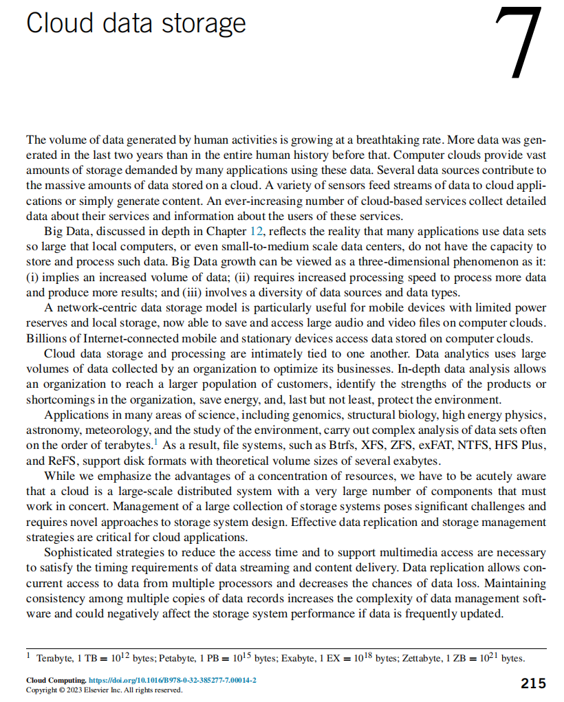
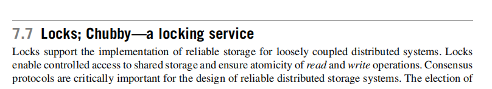
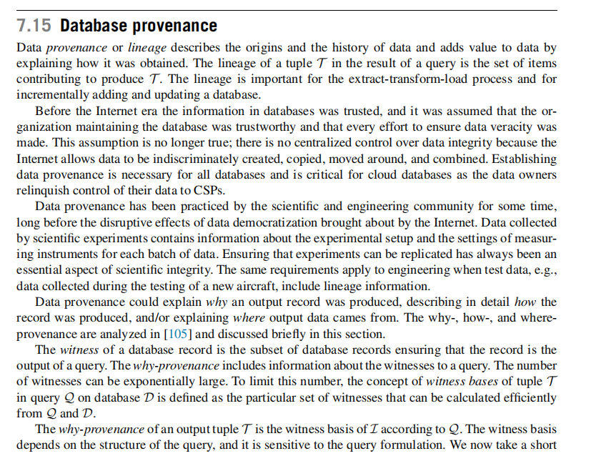

# Chapter 7 Cloud data storage

## 

**1\. 标题：云端数据存储的核心概念与体系结构概览**

本部分内容主要讨论了云端数据存储（Cloud data storage）的重要性、海量数据（Big Data）的兴起与特征，以及分布式文件系统在云端存储演进过程中的发展脉络。它还对后续章节中会提到的存储技术、模型、文件系统及数据库系统等内容进行了总览式介绍，为理解云计算环境下的数据管理和分析奠定了基础。

* * *

**2\. 详细内容解析**

（以下内容根据图片所展示的段落进行逐一讲解，并补充联系前后文进行分析。）

1.  **人类活动所产生的数据增长趋势**
    
    *   近年来，人类活动产生的数据量呈现爆炸式增长，甚至在过去两年间产生的数据量已超过此前人类历史的总和。
    *   这些数据来自多种来源：各种传感器不断将数据流发送给云端应用或云端平台；同时，越来越多基于云端的服务也会收集有关其服务及用户的大量细节数据。
2.  **云计算提供的海量存储**
    
    *   由于云计算拥有庞大的数据中心和可动态扩展的资源，能够为大规模应用提供所需的海量数据存储和处理能力。
    *   多数本地计算机或中小型数据中心难以承载和处理如此大的数据规模，因此云端成为理想的存储与处理平台。
3.  **大数据（Big Data）的三大特征**
    
    *   章节中提到在第12章会深入讨论“大数据”，但本页也指出了大数据的“三维度”特征：
        1.  **数据量的激增（Volume）**：海量数据需要新的存储与管理方式。
        2.  **处理速度的提升（Velocity）**：必须加大处理速度才能及时从数据中提炼结果。
        3.  **多样性（Variety）**：数据源及数据类型多种多样（结构化、非结构化、半结构化等），这给数据存储和分析都带来新的挑战。
4.  **网络中心（network-centric）的存储模型**
    
    *   在云端，数据不再依赖单一的本地计算机或局部服务器，而是通过网络集中或分布式存储；移动终端也能够访问并存储海量的音频、视频、文档等。
    *   数以十亿计的联网移动设备和固定设备都在访问或处理云端数据，这也是推动云存储需求迅速增长的重要原因。
5.  **云端数据存储与处理的紧密联系**
    
    *   在云计算环境中，数据分析和数据存储息息相关。企业或组织收集的大规模数据通过云端进行深入分析，可用于：
        *   触达更广泛的用户人群，提升业务覆盖面；
        *   识别产品或服务优势和不足，帮助节能、改进流程；
        *   进行环保层面的监测与改进等。
    *   多个科学领域（如基因组学、结构生物学、高能物理、天文学等）都在对TB(10¹²字节)或更大规模的数据集（PB、EB乃至ZB级）展开复杂分析。
    *   不同类型的文件系统（如 Btrfs、XFS、ZFS、exFAT、NTFS、HFS Plus、ReFS 等）为海量数据提供理论上可达到EB级甚至ZB级的存储能力。
6.  **集中化存储的优势及所面临的挑战**
    
    *   许多资源的集中化（例如将海量数据都放在云端）带来效率和可管理性的好处，但云端往往是一个**大规模的分布式系统**，要由数量庞大的组件协同工作。
    *   管理庞大的存储系统集合，需要新的架构及策略，尤其是如何有效地进行数据复制（replication）和存储管理；对云应用而言，保证数据可用性、容错性和高可靠性至关重要。
    *   为缩短访问延迟并支持多媒体访问，需要在数据流式传输和内容分发方面使用先进技术；同时，数据复制可以容忍故障、避免数据丢失，但也带来对一致性和实时更新的挑战，可能在管理复杂度与性能之间需要权衡。
7.  **大型系统的组件及分布式文件系统演进**
    
    *   当今的大规模系统一般会使用\*\*商用现成硬件（off-the-shelf components）\*\*进行搭建，而早期的分布式文件系统多是自研定制的可靠组件。
    *   在过去几十年，存储系统设计理念从“任何代价都要追求高性能”逐渐演变为“以最低可能的成本去实现最大的可靠性”。
    *   这种演进在文件系统发展上也很明显：从 1980 年代的**NFS（Network File System）**、**AFS（Andrew File System）**、**SFS（Sprite File System）**到后来谷歌提出的**GFS（Google File System）**、**Megastore**以及**Colossus**等，展现了云端及分布式文件系统的巨大变革。
8.  **后续章节内容概览**
    
    *   **7.1 与 7.2 节**：介绍与回顾存储技术，包括传统存储介质、架构等基础内容。
    *   **7.3 节**：讨论存储模型（storage models），从块存储、对象存储到文件存储的多种方式。
    *   **7.4 与 7.5 节**：介绍文件系统从分布式到并行化的演化，以应对海量数据处理的需求，分别探讨分布式文件系统和通用并行文件系统（General Parallel File Systems），乃至谷歌的文件系统。
    *   **7.6 节**：介绍谷歌文件系统（Google File System）的具体内容。
    *   **7.7 节**：讲解基于 Paxos 算法的锁服务**Chubby**。
    *   **7.8 节**：探讨关系型数据库系统与云端需求之间存在的矛盾。
    *   **7.9 节**：介绍 NoSQL 数据库的理论和实现。
    *   **7.10 节**：讨论事务处理系统（transaction processing systems），即如何在云端规模下保持交易一致性和性能。
    *   **7.11 与 7.12 节**：分别分析 **BigTable** 和 **Megastore** 这两个重要的谷歌内部分布式存储系统。
    *   **7.13、7.14、7.15 节**：深入研究存储可靠性、数据中心磁盘在物理空间上的定位（disk locality）以及数据库中的数据溯源（database provenance）等高级话题。

* * *

**3\. 本次内容小结**

*   **云端数据存储的本质**：利用大规模分布式系统，为日益增长的海量数据提供高效、灵活且可靠的存储环境。
*   **大数据挑战**：数据体量、处理速度和多样性共同带来的存储与管理难题，需要云端高扩展性的支持。
*   **文件系统的演进**：随着规模扩大与硬件环境的改变，分布式文件系统由早期的定制式高性能系统，演变为关注低成本高可靠的商用硬件+软件方案；谷歌在此过程中起到了重要的引领作用（GFS、BigTable、Megastore、Colossus 等）。
*   **后续章节指引**：针对不同层面（存储模型、分布式与并行文件系统、锁服务、NoSQL、事务处理、大规模分布式数据库等）有较为系统的讲解，为理解云端数据存储与分析奠定了理论与实践的基础。

* * *

**4\. 报错或补充说明**

*   根据图片清晰度，所给内容可完整解析，无明显缺失或无法辨认的部分。
*   若有任何看不清或未尽之处，请告知以便进一步补充。

以上即为本次图片全部内容的详细笔记与分析。通过这些要点可以了解到云端数据存储在当代的核心作用、发展历程以及后续章节将要讨论的关键主题，从而为进一步深入学习云计算和大数据技术打下坚实基础。

# **7.1** **Dynamic random access memories and hard disk drives**

**1\. 标题：存储技术的飞速演进：DRAM与HDD的发展概览**

本次内容主要介绍了存储技术在过去几十年中的快速发展历程，重点聚焦于动态随机存取存储器（DRAM）与硬盘驱动器（HDD）的密度、成本、性能等关键指标的演化。同时也阐述了在云计算背景下，随着数据量的爆炸式增长，存储技术在性能和规模上的挑战与应对思路。

* * *

**2\. 详细内容解析**

以下内容根据图片中从上到下的段落进行分段解析，并结合相关上下文进行说明。

### 2.1 存储技术的演进与背景

1.  **存储密度的惊人增长**
    
    *   一项 2003 年的研究指出：1980 年到 2003 年间，**硬盘驱动器（HDD）的存储密度**从大约 0.01 Gb/平方英寸飙升到了 100 Gb/平方英寸，增长了四个数量级。
    *   与此相对应，硬盘存储的价格从大约\*\*每兆字节1美分（1 cent/Mbyte）\*\*的水平继续下降，呈现出极大的成本优势。
    *   预计 HDD 密度会在 2016 年左右从 2011 年的 744 Gb/平方英寸进一步攀升到 1800 Gb/平方英寸。
    *   \*\*固态硬盘（SSD）**的发展则带来了每秒可支持**数十万次I/O操作（IOPS）\*\*的高性能存储。
2.  **DRAM（Dynamic Random Access Memory）密度与成本演化**
    
    *   1990 年至 2003 年间，DRAM 的密度从 1 Gb/平方英寸增长到 100 Gb/平方英寸，提升了约两个数量级。
    *   同期，DRAM 的成本也从**80 美元/MB 大幅下降到不到 1 美元/MB**。
    *   2020 年，台积电（TSMC）开始使用**5 nm 光刻工艺**量产集成电路，显示了工艺制程的进一步先进化，这对提高集成度、降低成本、提升性能具有重要意义。
3.  **存储技术对云计算的影响**
    
    *   **NAND Flash**（闪存）基存储设备的容量增长速度已超过DRAM，且每GB成本下降迅速，成为近年便携设备和云服务器普遍采用的存储介质。
    *   存储制造商也在投资其他**新型存储技术**（如相变存储 Phase-Change Memory、自旋电子学 Spintronics 等），不断探索在速度、稳定性、成本之间的平衡。
    *   尽管存储密度不断提升、成本不断降低，但与**处理器性能的增长**相比，存储的访问速度提升依旧有限，存储系统的性能缺口在多媒体、大规模科学计算、工程和海量数据应用中依旧明显。

### 2.2 存储系统面临的压力与数据增长态势

1.  **数据来源与增长**
    
    *   20 世纪 80~90 年代，大部分数据主要由人类活动生成；然而在当下，机器生成的数据量呈指数级增长。
    *   智能手机、平板电脑拍摄照片、视频等所需的大容量数据纷纷转移至云端；传感器、监控摄像头、数字化医学影像设备等也都在以极高的速率生成海量数据，存储在通过互联网可访问的系统中。
    *   在线数字图书馆、电子书、数字媒体，以及归档/参考数据（如医疗记录、财务报表、客户账单等）都需要大量的长期存储空间。
2.  **高性能数据挖掘与计算需求**
    
    *   面对海量数据，新的数据挖掘与分析算法层出不穷，需要强大的计算资源与海量存储的结合才能高效运算。
    *   集中式资源（如大型云数据中心）在 CPU 周期和存储容量方面拥有明显的聚合优势，能够执行大规模的复杂计算和对超大数据的访问。
3.  **存储成本结构的变化**
    
    *   过去，建立存储系统最大的成本在于**初始硬件投资**；而今，管理成本往往成为系统总体费用中占比最高的一部分。
    *   在云端集中化的策略下，自动化的管理（如自动备份、数据复制）能够显著降低运维压力；这也成为云计算存储的一大优势。

### 2.3 硬盘驱动器（HDD）的原理与性能指标

1.  **HDD 的基本结构**
    
    *   硬盘驱动器是一种**非易失性**随机访问存储设备，由一个或多个涂有磁性材料的旋转盘片（platters）组成。
    *   读写磁头（磁头组件）安装在可移动的执行器（actuator arm）上，通过定位到指定的磁道和扇区完成数据的读写。
2.  **转速与尺寸**
    
    *   HDD 的主轴电机（spindle motor）带动盘片旋转；当前常见转速范围从**4200 RPM**（节能型）到**15000 RPM**（高性能服务器）。
    *   台式机常见的硬盘尺寸为**3.5 英寸**，笔记本或移动设备常见的尺寸为**2.5 英寸**。
3.  **容量与访问时间**
    
    *   HDD 的容量通常以**MB、GB、TB**为单位衡量。
    *   HDD 性能的关键指标之一是**平均访问时间（average access time）**，通常包括：
        *   **寻道时间（seek time）**：读写磁头在圆盘不同磁道之间移动所需的时间。
        *   **搜索时间（search time）**：读写磁头在目标磁道上定位到具体扇区（sector）的时间，也常称为旋转延迟（rotational latency）。
    *   自 1956 年 IBM 首次引入磁盘驱动器以来，HDD 性能在容量、传输速度、可靠性等方面均有显著提升，但访问延迟仍较高，尤其与电子式存储（DRAM、SSD）相比更显不足。

* * *

**3\. 本次内容小结**

*   **存储介质的快速发展**：从 HDD 到 DRAM，再到闪存（NAND）、相变存储（PCM）、自旋电子学等，存储技术在容量、密度、成本和性能方面不断取得突破。
*   **云计算的驱动作用**：海量数据的产生和大规模数据分析的需求推动了更先进、更廉价、更高性能的存储手段。
*   **管理成本高企**：在大规模环境下，存储管理成本往往超越硬件成本，集中的云端管理模式更具优势。
*   **HDD 的持续演进**：尽管固态存储发展迅猛，传统机械硬盘依旧是通用计算机系统的重要二级存储，因其容量大、成本低而占据市场，但与新型存储技术相比，访问延时和IOPS仍存差距。

* * *

**4\. 报错或补充说明**

*   本次图片文字内容可见度较好，无明显无法辨认之处，已尽可能全面解释。若有需进一步深入或解读的地方，请告知。

以上笔记涵盖了从 DRAM、HDD 的发展历程到大数据背景下对存储系统的需求转变，阐述了在云计算时代各类存储技术面临的机遇与挑战，帮助读者在后续学习中更好地理解和运用相关知识。

# **7.2** **Solid-state disks**

**1\. 标题：固态硬盘（SSD）与新型接口：存储性能的跃升与并行化设计**

本次内容主要围绕固态硬盘（SSD）的特点和演进展开，从与机械硬盘（HDD）的对比到多种闪存单元（SLC、MLC、TLC 等）的技术细节，再到企业级闪存（EFD）的特性以及新一代高性能接口（NVMe）的并行化队列机制，深入展示了SSD在容量、带宽、延迟及成本方面的最新进展和发展趋势。

* * *

2\. 详细内容解析
----------

下面分段解读图片中出现的各项技术点与表格数据，并补充对应概念的详细说明。

* * *

### 2.1 SSD（Solid-state disks）概述

1.  **SSD 的基本定义与特征**
    
    *   **固态存储设备**，以集成电路（NAND 闪存等）作为主要存储介质，可替代传统机械硬盘（HDD）。
    *   无机械运动部件，因此抗震能力强、运行安静、访问时间和延迟比 HDD 更低。
    *   使用与 HDD 相兼容的块 I/O 接口（如 SATA、SAS、NVMe 等），便于直接作为机械硬盘的替换方案。
2.  **闪存单元类型**
    
    *   **SLC（Single-Level Cell）**：每个存储单元只存储1比特，速度快、寿命长、可靠性高但成本昂贵。
    *   **MLC（Multi-Level Cell）**：在一个存储单元中存储多比特数据（如 2~3 比特），成本相对更低，写入速度及稳定性略逊 SLC。
    *   **TLC（Triple-Level Cell）/ QLC（Quad-Level Cell）**：在单元中存储更多比特，容量提升明显，但也带来更高的写放大和更低的可靠性。
    *   市面上一般**低价位 SSD**会采用多层单元闪存（MLC、TLC、QLC），而高端 SSD 则倾向使用 SLC 或企业级 MLC（eMLC）等。

* * *

### 2.2 HDD 与 SSD 演进（表格 7.1）

**表 7.1** 比较了 1956 年与 2016 年硬盘技术（主要针对 HDD）的演进，展示容量、访问时间、密度、平均寿命（MTBF）、价格等主要指标。主要信息如下：

1.  **容量**
    
    *   1956 年：3.75 MB
    *   2016 年：10 TB
    *   期间增长率达到数百万倍。
2.  **平均访问时间**
    
    *   1956 年：约 600 ms
    *   2016 年：2.5~10 ms
    *   虽然 HDD 相比 SSD 还是慢得多，但相对 1956 年已大幅降低了几个数量级。
3.  **密度**
    
    *   1956 年：200 bits/平方英寸
    *   2016 年：1.3 TB/平方英寸
    *   相比之下，增加了数千万倍的存储密度。
4.  **平均寿命（MTBF）**
    
    *   1956 年：约 2000 小时/故障（= 2000 小时 MTBF）
    *   2016 年：约 22,500 小时/故障 (MTBF)
    *   可靠性提升显著，但相比 SSD 的无机械部件方式，HDD 仍在移动部件上存在磨损风险。
5.  **价格**
    
    *   1956 年：9,200 美元/MB
    *   2016 年：0.032 美元/GB
    *   价格呈指数级下降，使得大容量磁盘成为可能。
6.  **重量/体积**
    
    *   1956 年：910 kg、体积 1.9 立方米
    *   2016 年：62 g、体积仅 34 立方厘米
    *   在容量巨大增加的同时，硬盘的物理体积和重量却呈极大幅度缩减。

> 结论：HDD 在数十年间实现了难以置信的飞跃，但机械结构也限制了其访问延迟的进一步大幅下降，因此催生了对 SSD 这样纯电子式存储的需求。

* * *

### 2.3 SSD 的关键指标与技术细节（表格 7.2）

**表 7.2** 则展示了企业级（Enterprise）与消费级（Consumer）SSD 在 2019~2020 年左右的一些重要参数。

1.  **容量**
    
    *   企业级：如 2018 年的 DC100 系列可达 100 TB（而 1991 年只有 20 MB 容量）；
    *   消费级：2020 年约 8 TB 左右。
    *   总体来讲企业级 SSD 容量更高，但价格也更贵。
2.  **顺序读取/写入速度**
    
    *   企业级：2019 年顺序读取可达 15 GB/s、写入可达 15.2 GB/s；
    *   消费级：2020 年读取 6.795 GB/s、写入 4.397 GB/s。
    *   对比 2007 年的几十 MB/s，提升了数百倍。
3.  **IOPS（I/O Operations Per Second）**
    
    *   企业级可达 2,500,000 IOPS（读）和 1,300,000 IOPS（写）;
    *   消费级约为 736,000（读）和 700,000（写）。
    *   对比 2007 年仅数十到数百 IOPS，提升极其显著。
4.  **访问时间**
    
    *   企业级/消费级皆有提到在 2020 年可达 45 ns（读）和 13 ns（写），对比 HDD 的 ms 级延迟，SSD 更具优势。
5.  **价格**
    
    *   企业级和消费级皆是 2020 年约 0.10 美元/GB。
    *   对比 1991 年时 50,000 美元/GB，可见成本下降惊人。

* * *

### 2.4 SLC/MLC 闪存 I/O操作延迟

1.  **SLC Flash I/O 延迟参考值**
    
    *   读取 4 KB 页面：约 25 μs
    *   将 4 KB 数据从 I/O 缓冲区写回闪存：250 μs
    *   擦除 256 KB 块：2 ms
2.  **并行化**
    
    *   多通道并行的NAND闪存可以隐藏部分延迟（所谓“并行带宽”），只要 I/O 请求平均分布在不同 NAND 通道中，就能大幅提高传输效率。
3.  **非易失性**
    
    *   NAND 闪存**不需要持续供电**即可保持数据，这与 DRAM 的易失特性不同。

* * *

### 2.5 混合硬盘（SSHD）与企业级闪存驱动器（EFD）

1.  **混合硬盘（Solid-state hybrid disks, SSHD）**
    
    *   将传统 HDD 与一块 SSD（或闪存缓存）组合在一起，利用 SSD 加速频繁访问的数据，而将大容量存放在 HDD 中，以兼顾速度与成本。
    *   每年可将 SSD 部分成本压低约 50%，但若要与纯 SSD 相比，仍需更大降幅。
2.  **企业级闪存驱动器（EFD, Enterprise Flash Drive）**
    
    *   专为数据中心和高负载环境而设计，需在 IOPS、可靠性、能效、一致性能方面达到更高规格。
    *   一般内置**独立控制器**和高级固件，负责：
        1.  块映射（block mapping），
        2.  读写缓存（caching），
        3.  加密（encryption）与加密擦除（crypto-shredding），
        4.  错误检测与纠正（ECC），
        5.  垃圾回收（garbage collection），
        6.  读扰动（read disturb）管理，
        7.  磨损均衡（wear leveling）等。

* * *

### 2.6 NVMe（Non-Volatile Memory Express）接口

1.  **NVMe 的并行化设计**
    
    *   相比传统 SATA、SAS 接口，NVMe 针对**PCIe 总线**进行优化，可同时支持多条并行队列（64K 队列，每个队列可有 64K 命令）。
    *   每个 CPU 核心都可拥有独立的 I/O 队列，使 SSD 能更充分地利用多核处理能力，显著降低 I/O 请求的排队与锁争用。
    *   传统 SATA 仅支持 32 命令队列，SAS 也只有 256 命令，NVMe 并行度远高于二者。
2.  **多核处理优势**
    
    *   NVMe 允许主机侧各核心将 I/O 命令和响应固定在同一核心上处理；也不需要复杂的锁机制，极大改善了高并发环境下的存储性能。

* * *

### 2.7 SSD 读写一致性（Figure 7.2）

1.  **读/写一致性（Read/Write Coherence）**
    
    *   指对同一存储单元M的读取操作必须得到最近一次写操作所写入的数据，避免读“旧”数据。
2.  **原子性（Before-or-after atomicity）**
    
    *   在并行读写的环境中，要求任何读/写看上去都发生在某个完全的先后顺序，避免出现写操作与读操作交叉导致的不确定性。

* * *

### 2.8 SSD 常见物理形态（Form Factor）

1.  **2.5 英寸 SATA/SAS**
    
    *   绝大部分笔记本或桌面系统中可见，形态类似传统笔记本硬盘，但内部却是闪存和控制器。
2.  **M.2 接口**
    
    *   更紧凑，可直接插在主板上，无需单独供电线，有高端 NVMe M.2 SSD 可达数GB/s的顺序读写。
    *   如三星 970 EVO Plus M.2 NVMe SSD，顺序读写速度可达数千 MB/s，随机 IOPS 更是可达数十万级别。

* * *

3\. 本次内容小结
----------

*   **SSD 相比 HDD 的优势**：无机械结构、访问延迟更低、IOPS 高、能耗与体积小；但在大容量、成本方面与 HDD 形成市场互补。
*   **多层单元闪存技术**：从 SLC 到 MLC、TLC、QLC 等，在存储密度和成本间做权衡，同时也在寻求更好的写入寿命与稳定性。
*   **企业级与消费级 SSD 差异**：企业级 SSD 在可靠性、耐久度及性能一致性上有更严格的要求，价格相对更高；消费级则在大众市场普及速度更快。
*   **NVMe 接口的出现**：彻底解放传统 SATA/SAS 接口瓶颈，利用多核并行处理，极大提高了 SSD 的带宽和 IOPS。
*   **一致性与原子性**：在并发系统下，保证读写操作的正确顺序对数据一致性至关重要，SSD 与主机端的控制器需要在固件、接口层面配合实现。

* * *

4\. 报错或补充说明
-----------

*   所有图表文字均较为清晰，已在上述笔记中逐一解析；若有其他细节未尽，可进一步询问。

通过本次笔记可以理解固态硬盘在硬件结构、闪存技术、接口并发能力等层面的关键特征，以及 SSD 对大规模存储系统所带来的变革性影响——它不仅在性能方面领先传统 HDD，也在云计算、大数据和企业存储领域不断替代或与 HDD 混合形成新的存储形态。

# **7.3** **Storage models, file systems, and databases**

**1\. 标题：从存储模型到云端数据库：文件系统与数据管理的多层次架构解析**

本部分内容从存储模型的概念出发，先后探讨了不同文件系统（如网络文件系统、并行文件系统、存储区域网络）的特点与演进，最后引出数据库及数据库管理系统在云环境下的需求与挑战。通过对“Cell Storage”与“Journal Storage”两种抽象模型的介绍，以及对传统关系型数据库与NoSQL数据库的比较，整体展示了云时代在大规模数据存储与管理方面的核心理念与关键技术。

* * *

2\. 详细内容解析
----------

以下按照图片中的内容先后顺序进行拆分讲解，并补充联系上下文与相关概念做深入解析。

### 2.1 存储模型（Storage Models）

1.  **定义与作用**
    
    *   “存储模型”主要描述物理存储中数据结构的布局方式。数据库中的数据模型对应存储模型的逻辑层面；而存储模型则面向物理实现，可以是本地磁盘、可移除介质，也可以是网络可访问的存储介质等。
2.  **两种常见抽象存储模型**
    
    1.  **Cell Storage（单元式存储）**
        *   将存储视为大小相同的“存储单元”（Cell）组成的数组，每个对象恰好存放于一个或多个单元中。
        *   该模型对应计算机主存（RAM）和次级存储（磁盘）物理组织方式：内存是按照字节或字（word）编址的，而磁盘是以块（sector 或 block）为单位读写。
        *   强调“读/写一致性（Read/Write Coherence）”和“原子性（Before-or-after Atomicity）”等特性，以确保多线程/多进程并发环境中数据操作的正确性（如图 7.2 所示）。
    2.  **Journal Storage（日志式存储）**
        *   这种存储模型更复杂，通常用于记录型数据或需要保持每次操作“历史版本”的应用场景。
        *   包含一个\*\*日志管理器（Journal manager）\*\*与一个“Cell Storage”。用户并不直接访问 Cell Storage，而是通过日志管理器发起操作，如：
            1.  `start a new action`（开始事务或操作）、
            2.  `read a cell`（读取单元）、
            3.  `write a cell`（写入单元）、
            4.  `commit an action`（提交操作）、
            5.  `abort an action`（回滚操作）等。
        *   \*\*日志（Log）\*\*中包含所有变量的完整历史；每个数据更新都会在日志尾部附加一条记录，然后再“安装（Install）”到真正的 Cell Storage 中。
        *   此过程可保证原子性：如果系统在写日志成功之后、写入主存储之前发生故障，日志可用于恢复；若在写日志过程中发生故障，也不会更新主存储。故此类模型实现了“all-or-nothing”语义。

### 2.2 文件系统（File Systems）

1.  **文件系统的本质**
    
    *   文件系统由一系列目录（directories）和文件（files）组成，目录中包含对文件的元数据信息，管理方式可能因操作系统或应用场景而异。
    *   高性能系统可在不同类型的文件系统中选择适合的方案，如：网络文件系统（NFS）、存储区域网络（SAN）和并行文件系统（PFS）。
2.  **网络文件系统（NFS）**
    
    *   出现时间较早，被广泛使用，但可能难以在大规模场景下保持高可用或高吞吐，并且可靠性也存在单点故障等问题。
3.  **存储区域网络（SAN）**
    
    *   通过高速网络（常见为光纤通道 Fibre Channel）将存储与计算服务器分离，可将存储资源池化（pooling），根据需求动态分配。
    *   优点：灵活性更强，集中化管理带来更低的管理成本；缺点：配置与硬件成本较高，需要专用接口适配。
4.  **并行文件系统（Parallel File Systems）**
    
    *   针对大规模数据并发访问的需求做了扩展，可以在许多节点间分发文件，并提供统一的命名空间。多个 I/O 节点会面向所有计算节点提供数据，避免集中瓶颈。
    *   典型应用：高性能计算集群、大型云数据中心等；并行文件系统常与 SAN 结合构建互连网络。

### 2.3 数据库与数据库管理系统（DBMS）

1.  **DBMS 的概念**
    
    *   大多数云端应用并非直接与文件系统打交道，而是通过“数据库层”进行数据增删改查操作。
    *   数据库管理系统负责：
        *   **数据完整性**（enforce data integrity），
        *   **并发控制**（manage data access and concurrency control），
        *   **故障恢复**（support recovery after a failure），
        *   **查询和编程接口**（query language, APIs）等。
2.  **数据库模型的演化**
    
    *   20 世纪 60 年代：**导航式模型**（Hierarchical, Network models）。
    *   70 年代：**关系型模型**（Relational Databases），至今仍广泛应用。
    *   80 年代：**面向对象模型**（Object-Oriented DB）。
    *   2000 年后：随大数据与云计算而兴起的 **NoSQL** 模型，用于非结构化或半结构化数据。
3.  **云数据库（Cloud Databases）**
    
    *   云端应用通常是**数据密集型**（data-intensive），需要大规模可扩展的数据库基础设施来支撑快速开发和上线。
    *   高并发、低延迟、高可用性与数据一致性是核心需求，但传统关系型数据库往往难以同时满足这些需求——在大规模场景下的扩展性不足，或在一致性与可用性之间需要作取舍。
4.  **NoSQL 模型**
    
    *   顾名思义，不使用传统 SQL 作为查询语言，也无法完全保证传统数据库的 ACID 特性。
    *   通常只能保证**最终一致性**（Eventual Consistency）或局部强一致性，对于结构化要求较低但数据量极大的应用（如键值存储、文档数据库、图数据库等）非常有效。
    *   各种 NoSQL 数据库为海量数据提供高扩展性和灵活性，但为了实现可扩展和高可用，需要牺牲部分强一致性与实时事务语义。

### 2.4 数据复制与容错

*   在大规模系统中，复制（Replication）是保证容错和高可用性的重要手段。
*   同时，随着系统规模和网络复杂度的提升，保持各副本数据的同步一致往往需要**共识算法**（如 Paxos、Raft）。本章后续（7.7 节）将详细讨论。

### 2.5 在线事务处理（OLTP）

*   很多云应用需要**在线事务处理**来保证关键业务的正确性。
*   例如银行转账，事务要确保要么所有操作都成功，要么全部回滚，不能只执行部分操作就算完成。
*   更严格的需求往往需要**全序一致性（external time consistency）**，确保事务按顺序执行并对外表现符合真实逻辑时序。

* * *

3\. 本次内容小结
----------

1.  **存储模型的两大思路**：
    
    *   **Cell Storage** 侧重单元级读写的直接性和一致性管理；
    *   **Journal Storage** 通过日志先行写入再同步到存储单元，以保证所有操作的原子性和可回溯性。
2.  **文件系统多样化**：
    
    *   NFS 虽流行但不易扩展；
    *   SAN 通过光纤通道实现资源池化；
    *   并行文件系统在大型集群中分发数据，构建统一命名空间。
3.  **数据库系统在云端的挑战**：
    
    *   关系型数据库难以兼顾高扩展、高可用与强一致性；
    *   NoSQL 模型提供新的思路，但牺牲部分一致性或事务特性。
4.  **高可用和容错**：
    
    *   对大规模系统而言，利用复制与共识算法确保数据的一致性是核心课题；
    *   OLTP 事务处理需保证业务逻辑的正确性和“all-or-nothing”原子性。

通过上述要点，可以洞悉从物理存储到高层数据库管理的一整套技术栈之间的紧密联系，以及不同应用需求下进行的技术权衡与设计取舍。

* * *

4\. 报错或补充说明
-----------

*   所有图片文字信息均可辨认并已解析。如有疑问或需进一步探讨的细节，请告知。

以上笔记详细覆盖了本节内容，帮助我们从最底层的存储模型一路了解到高层数据库系统在云计算环境中的运作机制和挑战，为理解云端数据管理和后续章节（如分布式事务、NoSQL 具体实现等）奠定了理论基础。

# **7.4**.1 **Distributed file systems; the precursors**

**1\. 标题：分布式文件系统的起源与UFS/NFS的体系设计**

本节主要介绍了最早于20世纪80年代在各大学和软件公司中开发的分布式文件系统，它们的出现初衷、主要需求与挑战，以及在UNIX文件系统（UFS）思想指导下所设计的NFS（Network File System）的关键概念与结构。通过对UFS的分层设计和NFS客户端-服务器模型的详细剖析，可以理解分布式文件系统在可扩展性、性能、安全性等方面的发展脉络。

* * *

2\. 详细内容解析
----------

### 2.1 分布式文件系统的早期发展

1.  **代表性系统**
    
    *   1980年代出现了多款先驱性分布式文件系统，包括：
        *   **NFS (Network File System)**：1984年由Sun Microsystems开发；
        *   **AFS (Andrew File System)**：卡耐基梅隆大学的Andrew项目；
        *   **SFS (Sprite File System)**：John Ousterhout在加州大学伯克利分校领导开发；
    *   与它们同时期还有 Locus、Apollo、RFS (Remote File System) 等。它们都旨在满足网络工作站环境中对共享文件访问的需求。
2.  **设计关注点**
    
    *   **可扩展性（Scalability）**：能够支持大量工作站、服务器与文件数目；
    *   **性能（Performance）**：尽量在网络环境下保持与本地文件系统相近的访问效率；
    *   **安全性（Security）**：如何保证分布式环境中数据的访问控制与传输安全；
    *   **工作站网络的兴起**：当时出现了“无盘工作站（Diskless Workstation）”的想法，可将存储集中在服务器端，降低单个工作站硬件成本与维护压力。
3.  **NFS 的诞生背景**
    
    *   Sun 认为分布式文件系统适合大规模工作站网络的管理和应用需求，故在 1980 年代早期便投入开发 NFS。
    *   **NFS 使用客户端-服务器模型**：通过网络连接多个工作站（客户端）与文件服务器，提供文件共享与访问。

* * *

### 2.2 NFS：第一个广泛使用的分布式文件系统

1.  **设计目标**
    
    1.  **与UNIX本地UFS的语义兼容**：保持API及文件操作语义一致，方便与现有应用无缝衔接；
    2.  **跨平台可移植性**：希望支持不同操作系统的工作站都能访问NFS；
    3.  **接受一定性能损耗**：网络带宽只有几Mbps，导致访问延迟不可避免，但NFS 设计者认为在可用范围内即可。
2.  **UFS的三大特性**（为NFS设计提供思想基础）
    
    1.  **分层（Layered design）**：将文件系统的逻辑结构与物理结构分离；UFS引入`vnode`层，能统一管理本地和远程文件访问；
    2.  **层次化（Hierarchical design）**：通过目录（directory）分组文件，再通过多级目录形成树形结构，便于大规模文件和子目录的管理；
    3.  **元数据（Metadata）的系统化管理**：将文件或目录的信息（所有者、权限、大小、修改时间等）保存在节点（inode）中，支持在存储技术快速演进时依旧保持数据可用。
3.  **UFS架构分层（Figure 7.4）**
    
    *   **物理层（Block layer, File layer, Inode layer）**：
        *   **Block layer**：定位物理设备上的数据块；
        *   **File layer**：将若干数据块组织成文件；
        *   **Inode layer**：记录文件和目录的元数据，如inode号、权限、大小等。
    *   **逻辑层（Path name layer, Absolute path name layer, Symbolic path name layer）**：
        *   这三层对应用户视角下对文件路径的解析，区分相对路径、绝对路径及符号链接等逻辑命名方式。
    *   **文件名层（File name layer）**：在逻辑与物理间做转换，负责将用户输入的路径映射到实际的inode与数据块上。
4.  **NFS 客户端-服务器交互（Figure 7.5）**
    
    *   **客户端**运行在本地主机，负责捕捉对远程文件的请求，并通过`vnode`层的NFS客户端部分将请求打包后发送给NFS服务器（RPC机制）。
    *   **服务器**在远程主机接收请求并访问远程文件系统，返回结果。
    *   **文件句柄（File handle）**：NFS通过32字节的“文件句柄”唯一标识远程文件，用于在客户端和服务器之间有效对应文件。它包含文件系统标识、inode号以及生成号等信息。
    *   **RPC调用的幂等性**：读操作（如`Read`）若因网络故障导致应答丢失，客户端可安全地重试；而对于更新类操作，需要保证如果多次执行不会造成逻辑上的多次更新或不一致（NFS也会利用一些机制降低重复执行的副作用）。
5.  **路径与文件描述符**
    
    *   **本地文件**通常以`fd（file descriptor）`表示，在操作系统的打开文件表中占据一个条目；
    *   **远程文件**则通过NFS客户端识别并使用RPC与NFS服务器通信；从应用视角看，远程文件操作与本地文件操作几乎一致，只是底层转化为了网络调用。

* * *

### 2.3 文件系统中的路径管理

1.  **路径类型**
    
    *   **相对路径（relative path）**：相对于进程当前工作目录；
    *   **绝对路径（full/absolute path）**：从根目录开始描述文件或目录位置。
2.  **符号链接（symbolic link）**
    
    *   亦可看作特殊类型的文件，记录目标路径；访问符号链接文件时，系统会进一步解析到对应目标文件或目录。
3.  **文件访问流程**
    
    1.  进程向操作系统发起`open`系统调用；
    2.  系统在内核态的“打开文件表”中新建一个条目并赋予进程一个**文件描述符**；
    3.  随后的`read`、`write`、`close`等调用都通过此文件描述符来引用该文件；
    4.  若目标位于远程NFS服务器，则由NFS客户端的`stub`层与远程服务器通信，完成实际I/O。

* * *

3\. 本次内容小结
----------

*   **NFS、AFS、SFS等80年代初出现的先驱系统**为分布式文件系统奠定了重要基础，目标是支持跨网络的透明文件访问，尤其适合工作站网络环境。
*   **NFS的主要贡献**在于：通过客户端-服务器模型与RPC机制，将本地UFS文件语义扩展到远程存储上，极大简化了分布式场景的应用开发。
*   **UFS的分层设计理念**对NFS的实现影响深远，使物理层和逻辑层分开，提升了可扩展性、可移植性，并能适应快速演进的存储技术。
*   **文件句柄和路径解析**机制则保证了跨主机文件访问时的唯一标识和一致语义，尽管网络环境不可避免地带来延迟和故障，但NFS在多方折衷下依然成为当时最成功且影响深远的分布式文件系统之一。

* * *

4\. 报错或补充说明
-----------

*   本次图片内容均清晰可见，已详细讲解要点；如需更深入讨论NFS的实现细节，如缓存一致性、写策略等，可继续提问。

通过对本节的学习，可以深刻理解NFS从UFS继承而来的分层架构，以及在网络环境下为分布式文件共享进行的改进和设计取舍。这为后续深入研究更先进的分布式文件系统（AFS、GFS等）奠定了基础。

# **7.4**.2 **Distributed file systems; the precursors**

**1\. 标题：NFS 调用接口与 AFS、SFS 的设计要点：从远程过程调用到客户端缓存策略**

本次内容主要介绍了 NFS（Network File System）如何将 UNIX 文件系统的 API 映射到远程过程调用（RPC），从而实现分布式文件访问；并概述了另外两个经典分布式文件系统——AFS（Andrew File System）与 SFS（Sprite File System）。通过这些系统的对比，可以深入了解分布式文件系统在客户端缓存、写策略、访问控制与安全性等方面的不同设计取舍。

* * *

2\. 详细内容解析
----------

以下依照图片与文字的顺序，逐一讲解各知识点。

* * *

### 2.1 NFS 的 API 与 RPC 调用（Figure 7.6）

1.  **应用层 API**
    
    *   在传统 UNIX 中，对文件的典型操作包括：
        *   `open(fname, flags, mode)` 打开文件
        *   `close(fd)` 关闭文件
        *   `read(fd, buf, count)` 从文件中读取数据
        *   `write(fd, buf, count)` 写数据到文件
        *   `seek(fd, offset, whence)` 移动文件指针
        *   `fsynch(fd)` 将缓存写回磁盘，确保落盘
        *   `chmod(fd, mode)` 修改文件权限
        *   `rename(fromfname, tofname)` 重命名文件
        *   `mkdir(dname)` / `rmdir(dname)` 创建或删除目录
        *   `link(fname, linkname)` 创建硬链接
        *   `mount(fsname, device)` 挂载文件系统到指定目录
2.  **NFS 客户端侧的对应 RPC**
    
    *   当应用层调用一个文件操作时，如果目标是远程文件，NFS 客户端会将请求转换为相应的 RPC 发送给 NFS 服务器。例如：
        *   `LOOKUP(dfh, fname)`：根据目录句柄(`dfh`)和文件名(`fname`)找到目标文件并获取它的文件句柄(`fh`)；
        *   `READ(fh, offset, count)`：读取 `fh` 对应的文件，从指定偏移量 `offset` 读取 `count` 个字节；
        *   `WRITE(fh, offset, count, buf)`：写入 `count` 个字节到文件的指定偏移；
        *   `CREATE(dfh, fname, mode)`：在目录 `dfh` 中创建一个新文件；
        *   `REMOVE` 或 `RMDIR`：从打开文件表或目录中删除文件或目录；
        *   `SETATTR(fh, mode)`：更新 inode 的属性（如权限、时间戳等）；
        *   `RENAME(dfh, fromfname, tofh, tofname)`：重命名文件；
        *   `MKDIR(dfh, dname, attr)` 和 `RMDIR(dfh, dname)`：创建、删除远程目录；
        *   `LINK(dfh, fname)`、`READLINK(fh, fname)`：处理链接相关操作；
        *   `GETATTR(fh)`：获取文件元数据。
3.  **NFS 服务器的处理过程**
    
    *   当服务器接收到 RPC 请求后，会在它本地维护的文件系统中执行相应操作：
        *   如 `LOOKUP` 会在给定目录的 inode 或句柄下搜索文件名并返回对应的文件句柄；
        *   `READ` 会读取服务器本地文件系统中的相应数据并返回给客户端；
        *   `WRITE` 则在服务器端执行实际的磁盘写操作并更新 inode 等元数据。
4.  **NFS 不需要远程 `close` RPC**
    
    *   图中也说明了一个细节：**没有专门的 Close RPC**。这是因为 `close()` 操作只更新客户端打开文件表，并不改变服务器端对远程文件的状态（文件一旦打开，服务器并不在意是否被关闭，仅需要在实际写入操作后保证文件的一致性）。
5.  **RPC 幂等性与网络故障**
    
    *   许多 NFS 操作（尤其是 `Read`）是**幂等**的：如果由于网络故障导致客户端没有收到回复，客户端可以安全地重发请求，结果不会重复产生副作用。
    *   少数可能非幂等的调用，NFS 也会通过一些机制（如附加写序列号或重试约束）减少重复执行带来的不一致风险。

* * *

### 2.2 NFS 版本演进

*   **NFS 发展历史**：
    *   **NFSv2**（1984 年左右）
    *   **NFSv3**（1994 年）
    *   **NFSv4**（2000 年）
*   不断增强了可扩展性、安全性和性能，如支持更大文件、扩展属性、更复杂的访问控制等。

* * *

### 2.3 Andrew File System (AFS)

1.  **背景与目标**
    
    *   AFS 诞生于 1980 年代末，**由卡耐基梅隆大学与 IBM** 合作开发。
    *   系统设计者预想一个拥有上万个工作站的大型网络，每个 CMU 学生/研究员都有一个 Andrew 工作站，通过少量服务器提供集中式文件管理。
    *   AFS 致力于大规模环境下的**性能、安全性和易于管理**。
2.  **架构与关键概念**
    
    *   **Vice**：一组可信服务器的集合；服务器端存放实际文件与目录。
    *   **Venus**：客户端工作站上的用户级进程，拦截文件系统调用并在本地缓存文件副本；只有在打开或关闭文件时才与服务器通信。
    *   **本地磁盘作为缓存**：在工作站上缓存文件的完整副本，只有修改时才更新回服务器；若无修改，则服务器端的文件副本无需频繁通信。这样能显著减轻服务器负载，提升性能。
    *   **安全性**：客户端与服务器之间的通信全部加密；用户登录工作站时通过认证服务器获取安全令牌（token），在后续文件操作中用于验证身份和权限。
    *   **访问控制列表（ACL）**：对文件共享进行更细粒度的控制，可以为不同用户或用户组设置不同权限。
    *   **位置透明性**：用户可以从任何地点访问同一份文件，无需关心服务器物理位置；系统可自动完成文件在服务器间的迁移或复制。
3.  **AFS 优点**
    
    *   由于采用**大粒度文件缓存**，在频繁读访问场景下，客户端可快速从本地读文件，不需每次都访问服务器；
    *   安全通信与 ACL 确保了多用户大规模环境下的访问管理；
    *   服务器端数量相对小，便于统一维护，工作站无需安装任何磁盘或管理系统，大幅降低运维成本。

* * *

### 2.4 Sprite File System (SFS)

1.  **背景**
    
    *   **SFS** 是 Sprite 网络操作系统的一部分，由 UC Berkeley 的 John Ousterhout 领导开发，主要关注客户端的非写共享缓存机制、以及服务器端的高效运作。
    *   运行在无盘工作站上，工作站具备 1~2 MIPS 的 CPU 和 4~14 MB 的物理内存（在当时已算可观），允许比较先进的缓存方案。
2.  **缓存策略**
    
    *   **客户端缓存**：SFS 针对文件采用 4KB 块大小进行缓存，并为每个缓存块映射一个唯一标识（由服务器提供的文件 ID + 块号）。
    *   通过**虚拟地址**映射，客户端可以生成新的缓存块而无需与服务器沟通，每个工作站本地可动态分配内存给文件缓存。
    *   **延迟写回（Delayed Write-Back）**：对缓存块的写操作会在一段时间（如几秒到几十秒）后才同步到服务器，以减少磁盘写操作并提升写吞吐。缺点是系统故障会导致尚未写回的数据丢失；若需要更安全，可用 Write-through，但性能会降低。
3.  **文件缓存与虚拟内存联合管理**
    
    *   Sprite 操作系统将文件系统缓存与虚拟内存管理相结合，分别维护对块/页面的 `time-of-last-access`，使用 **LRU**（Least Recently Used）置换策略；
    *   当出现缓存不命中或页面缺页时，会按照 LRU 规则替换最久未用的缓存块/页面；若是文件块，就需要写回或丢弃以便为新数据腾空间。
4.  **并发写共享（Concurrent Write-Sharing）**
    
    *   SFS 支持多个客户端同时对同一文件进行写访问，由服务器协调整个文件的缓存一致性；
    *   当检测到并发写冲突时，可能会禁用客户端缓存或以强一致性协议来同步更新。
5.  **性能对比**
    
    *   实验结果显示，SFS 在某些文件密集型基准测试中比 NFS 和 AFS 都要快 30~35%，原因在于更激进的缓存策略和更灵活的内存管理。

* * *

### 2.5 分布式文件系统设计要点

*   **缓存与一致性**
    *   NFS、AFS、SFS 都在客户端进行缓存，但采用不同的一致性机制（NFS 为短时租约或弱一致性，AFS 文件关闭时更新，SFS 允许延迟写回并由服务器强制一致性）。
*   **写策略**
    *   **Write-through**：每次写操作都立即提交到服务器，可靠但性能较低；
    *   **Delayed Write-back**：可显著加速写操作，但存在数据丢失的风险；
    *   **AFS** 的 “文件关闭时同步” 则介于两者之间。
*   **安全与访问控制**
    *   NFS 早期对安全考虑有限，后续版本引入更强的认证方式；AFS 一开始就使用加密与令牌；SFS 也可结合 Sprite OS 的安全机制。
*   **大规模扩展**
    *   AFS 刻意设计了少数可信服务器与众多工作站的架构；NFS 最初只是局域网中几台机器共享；SFS 也可支持若干服务器与许多客户端，注重性能与灵活性。

* * *

3\. 本次内容小结
----------

1.  **NFS 的 API 到 RPC 对照**：通过在客户端将传统 UNIX 文件操作转换为远程 RPC，再在服务器执行相应操作，NFS 为分布式文件共享提供了较通用的方案。
2.  **AFS 的缓存与安全机制**：采用本地磁盘缓存整个文件，结合加密通信和访问控制列表，显著降低了服务器负载并增强了安全性，是当时面向大规模工作站网络的优秀解决方案。
3.  **SFS 的并发缓存策略**：通过灵活的内存分配和延迟写回，SFS 在文件密集访问场景下性能大幅领先 NFS、AFS，体现了更激进的缓存设计思路。
4.  **统一目标、差异化实现**：分布式文件系统普遍追求高性能、可扩展、安全与一致性的平衡，但每个系统在缓存一致性与写策略上都有所取舍，形成独特特性与适用场景。

* * *

4\. 报错或补充说明
-----------

*   本次图片中各项内容清晰可见，已在笔记中对 API、RPC、AFS、SFS 的设计重点做了完整说明。若需进一步深入某一项技术细节（如缓存一致性协议、访问控制实现等），可继续提问。

通过对这几个分布式文件系统的比较，能更加全面地理解分布式文件共享面临的挑战，也为后续研究更新一代的分布式文件系统（如 GFS、HDFS 等）打下技术背景。

# **7.5** **General parallel file system**

## Response:
Razonado sobre sistemas de archivos distribuidos，持续 几秒

**1\. 标题：通用并行文件系统与 IBM GPFS：大规模并行 I/O 的核心架构与锁管理**

本节内容介绍了分布式文件系统向并行文件系统演进的背景与关键需求，随后以 **IBM 的 General Parallel File System (GPFS)** 为例，探讨其在大规模集群环境下如何通过数据分片、分布式锁管理和日志写前（write-ahead）策略来实现高性能与高可靠性。表格 7.3 则为常见网络文件系统的缓存、写策略与一致性对比，帮助我们理解不同系统在并发访问、缓存失效及写入策略上的差异。

* * *

2\. 详细内容解析
----------

### 2.1 从分布式文件系统到并行文件系统

1.  **并行 I/O 的必要性**
    
    *   分布式文件系统广泛应用后，进一步需求是**多客户端同时读取/写入同一文件**，这对大型科学计算或数据密集型应用（如超算集群、高性能计算 HPC）非常重要。
    *   并行文件系统（Parallel File System）支持多客户端的高带宽并行 I/O，显著提升吞吐量与整体性能。
2.  **并行文件系统的并发语义**
    
    *   必须解决共享文件指针、并发读写一致性等问题。
    *   一种方式：**共享 file pointer**，不同客户端的连续读取会推进同一个指针；
    *   另一种方式：每个客户端都有**私有 file pointer**，互不干扰；同时配合适当的锁机制管理写冲突。

* * *

### 2.2 表 7.3：多种网络文件系统的对比

表 7.3 列出了 NFS、AFS、SFS、Locus、Apollo、RFS 等几个经典网络文件系统在**缓存大小及位置**、**写策略**、**一致性保证**以及**缓存验证方式**等方面的差异。例如：

*   **NFS**
    
    *   缓存：固定大小，存放于内存
    *   写入时机：文件关闭或最多 30 秒延迟
    *   一致性：顺序一致性
    *   缓存验证：在文件打开时、或由服务器端通知
*   **AFS**
    
    *   缓存：固定大小，存放于本地磁盘
    *   写入时机：文件关闭时
    *   一致性：顺序一致性
    *   缓存验证：文件修改后由服务器端通知
*   **SFS**
    
    *   缓存：大小可变，存放于内存
    *   写入时机：延迟写回，约 30 秒
    *   一致性：顺序一致性 + 并发访问
    *   缓存验证：文件打开时、或服务器同意

对比可见，每种文件系统为提升性能或满足不同场景，对缓存大小、写策略、并发语义都做了不同设计取舍。

* * *

### 2.3 IBM General Parallel File System (GPFS)

1.  **简介**
    
    *   IBM 在 2000 年初开发的并行文件系统，前身是 TigerShark 和早期的多媒体文件系统；
    *   GPFS 在大规模集群（可达上千个节点、数 PB 容量）中提供与本地 POSIX 文件系统相近的访问语义，适合高性能计算及超大数据存储场景。
    *   最大文件大小可达  $2^{63} - 1$  字节，文件由\*\*均匀大小的块（16 KB ~ 1 MB）**构成，并在多台磁盘上**条带化（striping）\*\*存储，以充分利用并行 I/O。
2.  **目录与元数据管理**
    
    *   **可扩展哈希 (extensible hashing)**：对文件名进行哈希，将哈希值的低位用作目录索引，便于在大型目录下高效查找文件信息。
    *   元数据 (metadata) 包含：文件属性（权限、修改时间等）、数据块地址等，存储于 inode 和间接块 (indirect blocks) 中。
    *   **元数据更新写前日志 (write-ahead log)**：确保系统崩溃后可根据日志进行恢复，避免目录或 inode 处于不一致状态。
3.  **可靠性设计**
    
    *   GPFS 会把文件数据和元数据**同时复制在两个不同的物理磁盘**，防止单点故障；
    *   **日志系统**：每个 I/O 节点都维护一个日志文件，当对文件系统做更新（例如创建文件、修改目录块、更新 inode）时，会先写日志记录，再写入真正的磁盘数据。
    *   RAID 结合多磁盘并行读取可提高吞吐；若单个磁盘故障，系统自动屏蔽该故障并从副本或日志恢复数据。
4.  **分布式锁管理与并发控制**
    
    *   **中央锁管理器 (central lock manager)** 分配**token**给各 I/O 节点上的本地锁管理器，借此实现对同一文件或字节范围的锁定。
    *   **锁粒度 (lock granularity)**：GPFS 支持**字节范围锁 (byte-range tokens)**。
        *   第一个节点对文件某一范围申请写锁后，其他节点若要写同一范围，需要与其协商锁冲突；
        *   若要写不同范围，则可并发进行，提升并行度。
    *   **数据传输模式 (data-shipping)**：节点在操作一段文件块时，会将读/写请求转发给控制该块的节点；该节点是“唯一允许访问该文件块”的角色，避免并发写冲突。
    *   **Token Manager**：集中管理所有锁 token，对文件关闭后或当其他节点需要该锁时执行“升级/降级”操作，协调并发访问。
5.  **磁盘分区与分配管理**
    
    *   GPFS 将磁盘划分为若干区域 (regions)；每个区域由不同的 I/O 节点管理，减少冲突并提高并行度；
    *   一个名为“allocation manager”的进程会负责更新空闲空间统计、根据需要对节点发放或回收磁盘区域权限。
6.  **高性能与可扩展性**
    
    *   **并行读取**：多个 I/O 请求可并行在不同磁盘上处理，结合预取 (prefetch) 策略进一步降低延迟；
    *   **大规模集群**：可支持多达 4096 块磁盘，每块容量 1 TB，形成最高 4 PB 的文件系统；通过分布式锁与元数据管理，保证在高并发场景下的性能与一致性。

* * *

### 2.4 关键挑战与设计权衡

*   **一致性 vs. 性能**：并行文件系统要在支持多客户端同时写入的场景下维持一致性，需要复杂的分布式锁机制，这也可能带来额外开销；
*   **容错与可用性**：系统要能应对磁盘或节点故障，通过多副本、日志、RAID、token manager 的容错策略保证数据可恢复；
*   **扩展性**：针对数百乃至上千节点并发访问，需要高效的目录查找、元数据同步与锁管理；GPFS 通过可扩展哈希、分区化分配和分布式锁来应对。

* * *

3\. 本次内容小结
----------

1.  **并行文件系统的出现**：为在大型集群和超算环境中实现高带宽并发 I/O，分布式文件系统进一步发展为并行文件系统。
2.  **GPFS 的核心设计**：
    *   **数据条带化**：提升读写带宽；
    *   **写前日志 & 双副本**：保证可靠性与故障恢复；
    *   **分布式锁管理 (byte-range locking)**：精细粒度并发访问，兼顾并行度与一致性；
    *   **可扩展哈希**：大目录下高效文件查询；
    *   **分区化分配**：减少资源冲突、提高并发效率。
3.  **并行与容错兼顾**：通过 RAID、日志复制、集中 token 管理等手段来在保证高并发性能的同时保证数据安全、系统稳定。
4.  **普适思路**：GPFS 的设计理念与机制也在后续新一代分布式并行文件系统（如 Lustre、BeeGFS 等）中不断演化延伸。

* * *

4\. 报错或补充说明
-----------

*   本次图片文字清晰，已详尽解析；如需进一步探究 GPFS 的内部实现或其他并行文件系统（Lustre、PVFS、BeeGFS）对比，可继续提问。

综上所述，GPFS 作为典型的通用并行文件系统，在大规模场景下成功平衡了性能、可扩展性与数据一致性，对现代分布式存储系统的设计具有重要启示意义。

# **7.6** **Google file system**

## 
**1\. 标题：Google File System (GFS) 体系结构与核心机制：大规模分布式存储的里程碑设计**

本部分围绕 Google 早期在 1990 年代末期开发的分布式文件系统——Google File System (GFS)——展开，介绍了其面向海量数据、高并发访问而做出的多项关键性设计决策，包括：大块（Chunk）切分、原子化追加（atomic append）、主控节点与 Chunk Server 分离的架构、日志记录与检查点机制等。GFS 致力于在廉价商用硬件环境下提供高可用、高扩展性的分布式存储服务。

* * *

2\. 详细内容解析
----------

以下将按照图片与文字中出现的设计要点进行分段讲解，并补充上下文分析。

### 2.1 GFS 的需求分析与关键特性

1.  **需求背景**
    
    *   GFS 使用大量廉价的通用硬件（Commodity Components）来构建数 PB（甚至更高）的存储容量，需要应对**硬件故障高发**、**软件错误**、**应用错误**以及**人为错误**等多种风险。
    *   \*\*可扩展性（Scalability）**与**可靠性（Reliability）\*\*必须在设计之初就予以充分考虑，而非后期再补救。
2.  **访问模式与文件特征**
    
    *   文件通常从几 GB 到数百 TB，极少有小文件；
    *   **最常见的操作是对已存在文件进行追加**（append），随机写操作极其罕见；
    *   读操作以顺序读为主，且大多面向大块数据；
    *   用户通常以批处理方式消费文件内容，因此**延迟**不是最核心的关注点；
    *   一致性模型相对宽松，为简化系统实现而**不追求强一致性**；
    *   强调高吞吐量与可扩展性，非低延迟。
3.  **总结出的八大设计原则**（文中列举了要点，这里归纳）
    
    1.  将文件划分为大块（Chunk）；
    2.  支持多客户端**并发原子追加（atomic append）**；
    3.  使用**高带宽网络**搭建集群，减少低延迟网络的依赖；
    4.  不进行站点级缓存（省去多副本一致性维护的开销）；
    5.  关键的文件操作必须经过主控节点（Master）进行统一调度，保证核心操作的正确性；
    6.  减少 Master 在文件操作中的参与度，以避免性能瓶颈并提高可扩展性；
    7.  提供高效的**检查点（checkpoint）**与**故障恢复**机制；
    8.  支持高效的**垃圾回收**来自动清理失效或无用的文件块。

* * *

### 2.2 文件与 Chunk 的组织

1.  **Chunk 概念**
    
    *   GFS 将每个文件切分为**固定大小的大块（chunk）**，默认大小为 64 MB；
    *   每个 Chunk 在底层物理磁盘上由 64 KB 大小的块（block）组成，每块带有 32 位校验和（checksum）以检测损坏；
    *   每个 Chunk 拥有唯一的**Chunk Handle**，相当于该 Chunk 在全局中的身份标识；
    *   大块设计优点：
        *   减少元数据量（与通常几 KB 或更小块大小相比，大幅降低 Master 的管理开销）；
        *   当应用常进行大文件顺序访问时，大块能减少客户端与 Master 交互定位的次数。
2.  **Chunk 复制（Replication）**
    
    *   缺省情况下，每个 Chunk 保持 3 份副本（可以自定义更多或更少），存放在不同的 Chunk Server 上；
    *   提高容错性：当某个副本所在的服务器宕机或磁盘损坏时，仍可通过其他副本提供服务。

* * *

### 2.3 GFS 架构（Figure 7.7）

1.  **Master 节点**
    
    *   负责管理整个系统的全局元数据，包括文件命名空间、访问控制信息、文件与 Chunk 的映射关系、各 Chunk 的副本存储位置，以及 Chunk Server 的健康状态等；
    *   这些元数据一部分保存在内存、一部分以操作日志（operation log）的方式存储在可靠介质中（并在多副本上同步），防止单点故障；
    *   Master 周期性与 Chunk Server 交换信息，并在检查到 Chunk Server 离线或故障时，触发重复制或故障转移（re-replication）。
2.  **Chunk Server**
    
    *   运行在普通 Linux 文件系统之上，通过 Master 提供的元数据进行读写；
    *   存放实际的文件数据块（Chunk），接收应用的读/写请求并执行操作；
    *   Master 并不参与数据流动，应用在获得 Chunk Handle 与位置后，可以**直接**与 Chunk Server 通信。数据通路（data path）与控制通路（control path）分离，提高传输效率。
3.  **客户端与数据流程**
    
    *   客户端需要读写某个文件时，先向 Master 请求相应文件名到 Chunk Handle 的映射（以及存在哪些 Chunk Server）；
    *   得到信息后，客户端**直接**与相关 Chunk Server 通信进行数据读写；
    *   当请求涉及更新文件（write/append），Master 会为该 Chunk 分配一个**primary**角色给某个副本服务器（Chunk Server），负责安排并发更新的顺序，再将更新广播给其他副本（secondary），最终保证各副本保持一致的增量更新序号。

* * *

### 2.4 一致性与写流程

1.  **一致性模型**
    
    *   GFS 提供一种“**松散但有效**”的一致性：常见操作（写/原子追加）由 Master 授予某个副本为主（primary），并以串行化的顺序进行分发；
    *   原子追加（atomic append）让多个客户端可以同时附加数据到文件末尾，GFS 负责分配不重叠的偏移区间，避免冲突。
2.  **写流程示例**
    
    1.  **客户端**向 Master 请求要写的文件 Chunk 的 lease（租约），Master 确认该 Chunk 的主副本（primary）服务器；
    2.  **客户端**将数据通过管线（pipeline）先发送到所有副本 Chunk Server 的内存缓存（LRU buffer）中；
    3.  **客户端**再向 **primary** 服务器发起写操作，primary 为本次写分配一个全局唯一的序列号；
    4.  **primary** 将写操作指令广播给所有副本（secondary）服务器；它们按照相同序列号顺序应用写操作；
    5.  所有副本处理完后各自回应 **primary**；
    6.  **primary** 将最终结果返回给客户端，表示写成功完成。

此过程将数据流与控制流分离，先把数据推送到所有副本，再由主副本统一协调应用写操作，从而减少网络往返，提高并发吞吐。

* * *

### 2.5 日志、检查点与故障恢复

1.  **操作日志（Operation Log）**
    
    *   记录文件系统关键元数据的变更，如文件创建、命名空间修改、Chunk 分配等；
    *   日志必须至少写入多份持久化存储后，变更才对客户端可见（原子性保证）。若 Master 故障，重启后可重放日志恢复最新状态。
2.  **检查点（Checkpoint）**
    
    *   为减少日志回放时间，Master 会周期性地将内存中元数据做快照写入磁盘（即 checkpoint）；
    *   恢复时只需先加载最新的 checkpoint，再顺序回放其后日志中的增量操作，大幅缩短故障恢复时间。
3.  **垃圾回收**
    
    *   GFS 采用一种**延迟删除**策略：当文件被删除时，先将文件名改为隐藏名称并打上时间戳；
    *   Master 经过一段时间后会真正移除此文件的元数据，同时通知存储该文件 Chunk 的服务器删除不再需要的块。
    *   若用户误删文件，可在过期前进行恢复。
4.  **副本一致性校验**
    
    *   每个 Chunk Server 会使用校验和（checksums）检测自己存储的数据完整性；
    *   Master 周期性收集各 Chunk Server 报告，若发现数据块损坏或服务器失联，就会启动\*\*复制/修复（re-replication）\*\*流程。

* * *

### 2.6 GFS 的创新与影响

1.  **大文件优化**
    *   64 MB 的 Chunk 大小在当时是一个突破性设计，使大文件的访问与管理显著简化，减少客户端与 Master 的交互负担。
2.  **高容错与高可扩展**
    *   利用**商用硬件+多副本**的方式，即便硬件故障频发，整体系统仍能保持高可用。
    *   Master 与 Chunk Server 架构大幅提升集群规模，支撑数千台服务器、数 PB 级别存储；后续 Google 以此为基础开发 MapReduce、BigTable 等大数据生态。
3.  **简化一致性**
    *   面向批处理与顺序访问场景，允许牺牲部分实时强一致性，极大降低了系统实现复杂度，也让开发者在应用层明确知道 GFS 的更新模型。

* * *

3\. 本次内容小结
----------

*   **GFS 的核心思路**：将文件拆分成大块存储在多个 Chunk Server 上，由 Master 统一管理元数据并调度副本写操作，客户端直接与 Chunk Server 传输数据，形成高吞吐、可扩展且容错的分布式文件系统。
*   **一致性模型与原子追加**：通过将写操作集中到主副本（primary）协调，让多客户端可并行往文件末端追加数据而不会冲突。
*   **元数据管理与日志机制**：Master 使用操作日志和定期检查点来保证故障后可快速恢复，并通过垃圾回收简化文件删除与块清理工作。
*   **大规模集群实践**：GFS 在廉价商用硬件的条件下提供了海量存储，适合顺序读和批量写场景，在后来的云计算与大数据时代广受启发，进而影响了包括 Hadoop HDFS 在内的众多后续分布式文件系统的设计。

* * *

4\. 报错或补充说明
-----------

*   依据提供的图片与文字内容，以上笔记均已完整覆盖 GFS 的设计要点和运作机制。若有其它更深入的实现细节（如租约到期、故障检测的心跳机制、数据平衡策略等）需要进一步探讨，可再行提问。

通过以上总结可见，GFS 以其独特的大块设计、主-从架构、原子追加与高容错特性，为现代大规模分布式文件系统奠定了重要基础。

# **7.7**.1 **Locks; Chubby—a locking service**

**1\. 标题：分布式锁与共识：Chubby 锁服务的设计与应用**

本节主要讨论了在大规模分布式系统中如何使用“锁（Lock）”来保证对共享存储的原子性访问，并引出了**Google 的 Chubby** 作为一种提供分布式锁管理和一致性保障的服务。核心在于：在松散耦合的分布式环境里，可靠地选举主节点（master）并维护锁的正确性需要依赖共识协议（如 Paxos）。Chubby 即利用此类共识算法在多个副本间实现高可用的锁与小规模数据存储功能。

* * *

2\. 详细内容解析
----------

以下分段解析图片文字，结合上下文深入说明相关概念。

### 2.1 分布式锁与共识的重要性

1.  **锁在分布式存储中的地位**
    
    *   对共享存储进行读写时，为了保持数据原子性和一致性，需要对同一数据或资源进行互斥或同步访问控制；这正是**锁**的基本功能。
    *   分布式环境中，要保证锁的正确性，就必须在多个节点间进行一致性的协调（consensus），以防止出现“脑裂”（split-brain）或重复加锁的问题。
2.  **共识协议（Consensus Protocol）**
    
    *   当系统需要在多个副本之间选举一个**主（Master/Leader）**，或者做重要决策（如写操作的提交），往往使用 Paxos、Raft 等共识协议。
    *   此类协议在面对**网络延迟不可预测、消息丢失、节点故障或数据不一致**等问题时，仍能保证安全性（正确性）和活性（系统能继续进展），对分布式锁服务的实现至关重要。
    *   在 GFS、分布式数据库、大规模存储系统中，Master 节点的选举一般也依赖 Paxos/Chubby 等机制。
3.  **分布式环境的通信问题**
    
    *   包括**丢包、乱序、消息损坏**等，这些都可能破坏简单的分布式锁假设。
    *   解决办法：利用**虚拟时间**、序列号、重试机制等来保持执行顺序和容错，但这会增加算法复杂度和处理延迟。

* * *

### 2.2 锁的类型：强制性 (Mandatory) 与建议性 (Advisory)

1.  **建议性锁（Advisory Lock）**
    
    *   前提：所有进程都“自觉遵守”锁协议，不会绕过锁机制直接访问共享对象；
    *   优点：灵活、实现更简单；缺点：若某进程无视锁或故障跳过锁，则可能破坏一致性。
2.  **强制性锁（Mandatory Lock）**
    
    *   像关闭铁路道口或吊桥一样，一旦上锁，所有访问此资源的请求都被阻塞或拒绝（无视锁的进程也无法直接操作资源）。
    *   优点：更好的访问控制和安全性；缺点：锁住后，若长时间不释放，高优先级维护或恢复操作也会被拦住，可能带来可用性问题。

* * *

### 2.3 锁粒度与系统规模

1.  **细粒度 (Fine-grained)** vs **粗粒度 (Coarse-grained)**
    
    *   细粒度锁：锁的单位小（如对象、行、记录），并发度更高，但需要频繁的加锁/解锁操作，导致锁服务开销大；
    *   粗粒度锁：锁的单位更大（如文件、分区），减少锁操作的频率，但并发度降低，更多操作被同一把锁串行化。
    *   在大规模系统中，如果锁服务器故障或负载过重，大量客户端可能受到影响，因此**合适的锁粒度**非常关键。
2.  **Advisory + 粗粒度**
    
    *   在大规模分布式场景下往往更常见，可减少锁管理的复杂度与开销；
    *   但需要对应用开发者进行约束，保证不会绕过锁访问共享资源。

* * *

### 2.4 Chubby：Google 的分布式锁服务

1.  **Chubby Cell 的组成（Figure 7.8）**
    
    *   Chubby 由多个副本 (Replica) 组成，一个副本被选举为**Master**；
    *   **客户端 (C₁, C₂, …, Cₙ)** 通过 RPC 与 Master 通信，Master 处理锁请求、数据读写请求，其他副本则备份并参与容错机制。
    *   典型地，一组 5 台副本即可在 2 台故障时继续提供服务（大多数通过共识协议仍保持一致）。
2.  **锁与命名服务**
    
    *   Chubby 不仅提供锁功能，还可被视为**小型的分布式元数据存储**（键值存储或类似文件系统的名字空间），可原子读写小文件；
    *   将文件名称、锁名称纳入同一命名空间，使得原子操作更加容易实现。
3.  **共识协议**
    
    *   Chubby 使用异步 Paxos（或类似协议）在副本间达成共识：
        *   每当 Master 宕机或网络异常，副本间会再次选举新的 Master；
        *   只要有多数副本达成一致，即可对外提供锁服务。
    *   写操作、加锁请求只有在日志持久化到多数副本后才算生效，保证了**原子性**与**一致性**。
4.  **缓存与性能**
    
    *   Chubby 客户端可能会缓存一些配置信息或锁信息，以减少与服务端的交互；
    *   如果 Master 对外提供大量锁管理服务，可能成为瓶颈，必须以更高的硬件、优化的内部机制来支撑；
    *   一般只需 5 个副本就能提供高可用服务，而不是在每个数据中心部署许多副本。
5.  **应用场景**
    
    *   **Leader 选举**：在大型分布式系统（例如 GFS、BigTable）里，节点通过 Chubby 竞争锁，谁拿到锁就成 Leader/Master；
    *   **配置信息存储**：把集群配置信息等小型关键数据放到 Chubby 上，自动获得高可用；
    *   **命名服务**：将小的文件/节点名映射放入 Chubby，用作统一目录/注册表，类似 ZooKeeper 的用途。

* * *

### 2.5 设计决策与取舍

1.  **安全性 vs 可用性**
    *   强制锁可提供强访问控制，却可能在系统出现故障或优先级冲突时阻塞资源；
    *   建议性锁对应用友好，但需应用严格遵守协议，否则锁形同虚设。
2.  **锁服务 vs 链接库**
    *   将分布式共识与锁逻辑封装在一个独立服务（如 Chubby）中，客户端只要通过简单的 RPC 即可使用锁，大大降低了应用开发者的负担；
    *   若逼迫开发者直接调用 Paxos 算法库，会增加大量复杂度与错误风险。
3.  **副本数量**
    *   Chubby 选取 5 副本方案可在 2 个副本失效时保持多数派，既确保可用性又避免副本过多造成同步开销过高。

* * *

3\. 本次内容小结
----------

*   **分布式锁的重要性**：在松散耦合、大规模环境中，锁是确保共享存储原子读写、实现主节点选举、避免并发冲突的关键。
*   **Paxos 共识支撑**：通过在多个副本间达成一致，锁服务可以应对节点故障和网络不可靠性，维持高可用与一致性。
*   **Chubby 的锁服务架构**：由少量副本形成“Chubby Cell”，一个副本被选为 Master，处理客户端锁请求和小规模数据的原子读写；并使用复制日志、心跳和选举机制保证故障容忍度与数据一致性。
*   **应用与取舍**：强制性 vs 建议性锁、细粒度 vs 粗粒度锁、封装成服务 vs 直接调用共识库……这些设计抉择都围绕在并发量、故障率、性能与易用性间进行权衡，Chubby 为谷歌内部的众多系统（GFS、BigTable 等）提供了简洁而强大的“基础锁+配置管理”支持。

* * *

4\. 报错或补充说明
-----------

*   图片中信息可清晰辨识，以上笔记已详尽解析如分布式锁机制、共识协议与 Chubby 的核心工作流程。若需更深入了解 Paxos/Raft 或 Chubby 在特定场景的实现细节，可再进一步提问。

通过本节内容可见，在分布式环境中，对锁和共识的恰当设计与实现是构建大规模可靠存储和服务的基石。Chubby 也成为后来许多类似系统（如 Apache ZooKeeper）的重要启示。

# **7.7.2** **Locks; Chubby—a locking service**

**1\. 标题：Chubby锁服务的内部机制：Paxos共识、会话管理与树形命名空间**

本部分内容延续了前文对 Chubby 作为分布式锁服务的介绍，进一步阐述了 Google 在 2000 年左右启动该项目时所做的设计选择，以及 Chubby 如何通过异步 Paxos 实现主副本选举、会话管理和小型文件/锁的存储功能。图 7.9 展示了 Chubby 副本架构以及容错日志和本地数据库的运作方式。

* * *

2\. 详细内容解析
----------

以下针对图片及文字信息进行细化讲解。

### 2.1 Chubby 的架构回顾与设计抉择

1.  **Advisory Locks + 粗粒度锁**
    
    *   Google 在 Chubby 设计之初就决定使用**建议性锁（advisory locks）**与**粗粒度**的锁。
    *   建议性锁让应用自行遵守锁协议，但无法强行阻止违规操作；粗粒度锁则减少锁开销，适合在规模庞大、通信延迟高的环境中使用。
2.  **应用场景**
    
    *   Chubby 被广泛用于 Google 内部，包括前文介绍的 **GFS（7.6 节）** 和 **BigTable（7.11 节）** 等。
    *   一个 Chubby Cell 一般服务于一个数据中心（DC），其中包含 5 个副本（replicas），分布在数据中心园区的不同机架或区域，降低同时故障的概率。
3.  **Paxos 共识与 Master 选举**
    
    *   当现有 Master 故障时，Chubby 的副本将通过**异步 Paxos**选出新的 Master；
    *   一旦有多数副本同意某个候选，便授予其一定的“主租约（master lease）”时间，此间不会再选出新的 Master；
    *   Paxos 协议保证了在网络故障、节点失效等情况下，仍能一致地选出唯一 Master 并保持系统安全性（正确性）。

### 2.2 Chubby 的会话与 RPC

1.  **会话（Session）**
    
    *   客户端与 Chubby Cell 的 Master 之间建立的持续连接（Session）；
    *   在会话期间，客户端缓存的文件句柄、已获取的锁、句柄对应的数据等都有效；
    *   如果客户端与 Master 长时间失联或会话终止，服务器会将该客户端持有的锁标记为失效并可能释放给其他客户端。
2.  **RPC 读写与副本交互**
    
    *   **读请求（read request）**：Master 在收到后，不必与所有副本同步，就可直接回复客户端（提升读性能）；
    *   **写请求（write request）**：Master 会将操作写入到自己的本地故障耐受日志（fault-tolerant log），并等待**多数副本**将其也记录在日志后，再向客户端返回成功。
    *   此策略保证了写操作的持久性和一致性，类似于分布式数据库的“多数派写”机制。
3.  **通知机制（Notification）**
    
    *   Chubby 提供一种事件通知的功能，客户端可以订阅文件或目录的变化事件，比如：
        *   文件内容被修改；
        *   子节点（child node）增加或删除；
        *   Master 发生切换；
        *   锁被获取或冲突等。
    *   这样的订阅使得客户端可及时获取元数据变动，用于动态更新配置、感知 leader 改变等。

### 2.3 Chubby 的命名空间与文件操作

1.  **树形结构**
    
    *   Chubby 将其内部锁和小文件以类 Unix 的命名方式呈现给用户；
    *   每个文件或目录都可视作一个“Chubby 节点”，可被打开（open），关闭（close），并具有独立的文件描述符与锁。
2.  **文件用法示例**
    
    *   **`open()`**：客户端请求获取文件/锁句柄；
    *   **`close()`**：释放句柄及其对应资源；
    *   **`GetContentsAndStat()`**：获取文件内容以及元数据（如版本号等）；
    *   **`Delete()`**：删除文件；
    *   **`SetContents()`**：更新文件内容；
    *   **`SetSequencer()`, `GetSequencer()`, `CheckSequencer()`**：利用序列器（sequencer）机制执行类似“候选人写入一个标记文件（lock file）”的方式来选举主节点；只有拿到写锁的一方才能成功写入特定 sequencer 值，别的副本轮询检查该值来确认谁是 Master。

### 2.4 Paxos 日志与故障恢复（见 Figure 7.9）

1.  **副本结构**
    
    *   每个副本都有一个本地文件系统及一个**容错日志（fault-tolerant log）**，把客户端操作以顺序日志的方式追加；
    *   日志里记录了锁、文件元数据、文件内容变动等关键信息；
    *   在副本之间，日志的复制采用 Paxos 共识，以确保大多数副本都能看到相同的操作序列号。
2.  **快照与回放**
    
    *   Master 会周期性地将数据库状态（锁、文件信息等）写为\*\*快照（snapshot）\*\*保存到 GFS 等后端存储。
    *   若 Master 或副本崩溃，系统可用最新的快照加上日志中尚未应用的增量操作（replay log）来快速恢复到崩溃前的一致状态。
3.  **Paxos 三阶段简述**
    
    *   **阶段1（选举）**：故障后有多个副本可能发起竞选（propose），它们都以比自己曾见过最大序列号更大的新序列号广播提案；未见更大序列号的副本则发送承诺（promise），并拒绝其他低号竞选人。
    *   **阶段2（接受）**：当某提案获得多数副本承诺后，该副本成为 Master，向所有副本发送 accept 消息；若大多数副本返回 acknowledge，即可进入提交阶段；
    *   **阶段3（提交）**：Master 广播 commit，所有副本确认后，操作生效。
    *   在实际实现中，处理超时、重试、日志同步等细节十分复杂，需要大量的 C++ 代码与严谨的测试才能保证在种种故障模式下正确运行。

* * *

### 2.5 典型使用流程：锁文件的主节点选举

1.  **应用线程竞争锁**
    *   多个候选者都执行 `open(file, EXCLUSIVE_MODE)` 试图拿到独占锁；
    *   首先成功的客户端在文件内写入“自己是 Master”的标记并调用 `SetSequencer()`, 生成一个唯一的 `ifseq`；
    *   其他客户端在 `GetSequencer()` 或 `CheckSequencer()` 时发现已有“Master 令牌”，便退让。
2.  **序列号检查**
    *   已当选的主节点在一段时间后定期检查 `ifseq` 是否仍然有效（防止 Master 与 Chubby 失联）；
    *   若连接断开或锁到期，其他候选者可继续尝试获取锁并写入新的序列号，接管 Master 身份。

* * *

3\. 本次内容小结
----------

*   **Chubby 的核心**：以 5 副本组成的 Paxos 集群为基础，为客户端提供**会话管理**、**分布式锁**、**小文件/配置存储**、**通知机制**和**Master 选举**等功能。
*   **会话与锁结合**：客户端通过长连接维持锁的有效性；若掉线且无法续约，锁会自动释放，避免僵死占用。
*   **树形命名空间**：类似 Unix 的目录/文件结构，让用户轻松管理锁和小文件；具备事件订阅能力。
*   **Paxos 容错日志**：任何写操作都要写入大多数副本日志后才对外生效；Master 周期做快照并可在重启时回放日志，保证了一致性和高可用。
*   **应用层示例**：常用于分布式系统中的 leader 选举、元数据配置管理、分布式一致性控制等，对 GFS、BigTable、MapReduce 等系统运转至关重要。

* * *

4\. 报错或补充说明
-----------

*   本次图片内容已完整解读；若需更深入的 Paxos 算法细节（超时机制、拒绝策略等）或 Chubby 的实际运维经验，可另行提问。

通过这部分的学习，可以看到 Chubby 通过“服务化”封装了分布式共识算法，大大简化了应用在大规模集群中进行锁管理、配置存储和主从选举的复杂性，是 Google 内部分布式系统的关键基石之一。

# **7.8** **RDBMS—cloud mismatch**

**1\. 标题：传统关系型数据库与云环境的不匹配：对象-关系阻抗及可扩展性挑战**

本部分围绕传统关系型数据库（RDBMS）在面临云计算环境时所遭遇的种种限制展开。内容包括关系模型的核心概念，以及为何对象-关系不匹配（impedance mismatch）与大规模云存储的扩展性需求一起，推动了 NoSQL 数据库的兴起。

* * *

2\. 详细内容解析
----------

下面分段解析图片中的重点，并结合上下文做补充说明。

### 2.1 关系模型的回顾

1.  **多种数据模型的演进**
    
    *   在云计算出现前，常见的数据模型包括：
        *   **层次模型**（hierarchical），适合严格树状结构；
        *   **网状模型**（network），可处理多对多关系；
        *   **关系模型**（relational model），最具通用性、使用最广（由 Edgar F. Codd 提出）。
2.  **关系模型（RDBMS）**
    
    *   数据以\*\*表（table/ relation）\*\*呈现，每个表代表一种实体类型；
    *   表由\*\*行（row / record / tuple）**和**列（column / attribute）\*\*组成；
    *   每行对应实体实例（如某用户/某订单），每列对应属性（如姓名、订单金额）；
    *   常以 **SQL**（结构化查询语言）进行数据定义、操作和控制。Oracle、MySQL、PostgreSQL、SQL Server 乃至云上的 Azure SQL Database 都属于此范畴。
3.  **属性、域与约束（domain, constraints）**
    
    *   每个列属性都有一个取值域（如整数、字符串、日期等），可定义**主键**、**外键**等约束；
    *   数据库可借助各种索引结构（B+树、R树、位图索引等）加速查询。
4.  **关系代数与关系演算**
    
    *   关系数据库的底层理论基础，用一套严格的数学结构来定义和操作数据（如选择、投影、连接、并/交/差等），并有一定的操作语义和优化方式。

* * *

### 2.2 对象-关系阻抗不匹配 (Object-Relational Impedance Mismatch)

1.  **OO 语言与关系模型的差异**
    
    *   面向对象语言（如 Java、C++、C#）中，类与对象使用**指针** extensively 来关联复杂的对象结构；
    *   关系模型中不允许直接存储“指针”类型，只能通过外键或联结（JOIN）实现关联；
    *   对象的粒度更小（一个属性的修改即可对应一次写操作），而关系数据库中的一个事务往往是一组操作的整体提交。
2.  **内存结构 vs. 磁盘结构**
    
    *   内存中可以表示更嵌套、更丰富的层级结构，而关系数据库中的**一行**（tuple）通常是不可嵌套的平面结构；
    *   在应用与数据库之间，需要“对象-关系映射（ORM）”等工具进行复杂的转换，影响开发效率与性能。
3.  **事务粒度差异**
    
    *   RDBMS 事务常被视为对一段 SQL 操作的打包提交，而面向对象环境中操作粒度可能小到**对象属性级**；
    *   这导致操作边界和锁竞争的复杂性，进一步加剧了对象-关系不匹配。

* * *

### 2.3 为什么 RDBMS 与云端应用不匹配

1.  **可扩展性（Scalability）**
    
    *   云数据库面临的数据规模庞大，且横跨许多节点。要**大规模分布式存储**和高效处理，需要**水平扩展（horizontal scaling）**；
    *   传统 RDBMS 通常设计成在一台或少数几台服务器上运行，并且容易有**单点瓶颈**（如一个共享磁盘或共享控制器），不适合上千台节点的大规模集群。
    *   微软 SQL Server 等示例往往依赖一个“高可用磁盘系统”，但仍是“单一故障点（single point of failure）”，难以很好地和云端大规模容错、可扩展需求相适应。
2.  **CAP 定理**
    
    *   在第 3.17 节曾提到：一致性（Consistency）、可用性（Availability）和分区容忍性（Partition tolerance）无法在同一个分布式系统中全部完全保证；
    *   RDBMS 为强一致性而设计，因此在网络分区或节点故障时可能放弃可用性，无法做到云环境所期望的“随时在线”（High Availability）；
    *   为了保持“一致性+分区容忍”，RDBMS 往往不得不牺牲可用性，而云应用恰恰需要高可用，对 RDBMS 来说就构成难题。
3.  **大数据存储场景**
    
    *   传统关系数据库适合**结构化数据**，而云端应用经常需要处理**非结构化或半结构化**数据（如日志、社交媒体、传感器流等）。
    *   RDBMS 针对这些数据类型并非最佳选择，往往需要更灵活的 NoSQL 或分布式存储方案。
4.  **事务范围与高并发**
    
    *   RDBMS 事务要求分布式环境里对所有节点做两阶段提交（2PC）或 Paxos/Raft 协调，但当节点数非常多时，**开销与延迟**显著上升。
    *   无法同时支持大规模横向扩展与强一致的低延迟。

* * *

### 2.4 由此转向 NoSQL

1.  **NoSQL 出现的动因**
    
    *   云计算需要在海量数据、非结构化/半结构化数据、高并发访问下仍保持可扩展、高可用；
    *   关系模型的特性（强一致性、固定表结构等）难以适应这种规模与弹性需求；
    *   因此，NoSQL 模型在 CAP 原则下，更多地选择在一致性与可用性中做权衡，允许最终一致等模式来提高可用性和扩展性。
2.  **总结：RDBMS 无法很好地纵向扩展到云规模**
    
    *   传统数据库多以单一大机器或有限的集群模式进行扩展，横向扩展能力受限；
    *   大量云端应用（如分布式缓存、日志索引、社交网络、流式数据）需要一种灵活且大规模的分布式存储方案；
    *   NoSQL 为此而生，在后续章节 7.9 将进一步介绍它的多种模型（键值、文档、列式、图数据库等）及适用场景。

* * *

3\. 本次内容小结
----------

*   **关系模型核心**：以严格的表结构、SQL 操作、ACID 事务为特征，在传统单机或小规模集群环境中非常成熟；
*   **对象-关系阻抗不匹配**：面向对象开发与关系数据库的行列结构不一致，需要通过 ORM 层过渡，带来复杂度和性能损耗；
*   **可扩展性不足**：RDBMS 在大规模云环境下难以在保持强一致的同时提供高可用与横向扩展；
*   **CAP 约束**：选择强一致性的关系数据库常常牺牲分区容忍或可用性，难以满足云计算对大规模故障容忍和连续服务的要求；
*   **NoSQL 出现**：云计算激发了对非结构化数据、高并发和弹性扩展的需求，传统 RDBMS 难以承载，因此转向新的数据库范式。

* * *

4\. 报错或补充说明
-----------

*   本次文字内容可见度良好，已尽可能完整解析。若需深入了解对象-关系映射工具、NoSQL 分类或分布式事务机制，可再行提问。

以上就是对于第 7.8 节“RDBMS 与云环境的不匹配”全部内容的笔记和深入分析。该节为理解后续“为什么云环境下大量采用 NoSQL、NewSQL、分布式数据库系统”的重要背景铺垫。

# **7.9** **NoSQL databases**

## 
**1\. 标题：NoSQL 数据库：分布式可扩展性与多样化数据模型的崛起**

本节主要介绍了 NoSQL 数据库兴起的背景、常见的分布与复制模型，以及其四大类型（键值、文档、列式、图数据库）。通过与传统关系型数据库的对比，重点分析了 NoSQL 为满足云计算与大数据所需的高可用、可扩展、最终一致性等特性所做的取舍，并概括了常见系统在分区容忍性、可用性及一致性方面的不同策略（PACELC 分析）。

* * *

2\. 详细内容解析
----------

以下按照图片及正文的顺序进行分段解析，并补充上下文加以说明。

### 2.1 NoSQL 命名起源与误解

1.  **NoSQL 的“名称误导”**
    
    *   起初的涵义或许是“Not Only SQL”或 “No Relational”，但由于“Non-SQL”更具传播力，因而在社区中广为流行；
    *   “NoSQL”并不代表完全替代关系模型，也不是某种单一数据库技术，而是一系列**非传统关系型**的数据存储方案的统称。
2.  **Michael Stonebraker 的观点**
    
    *   2014 年图灵奖得主 Michael Stonebraker 认为，若要获得极高的性能，需要剔除那些在传统 ACID 事务、多线程和磁盘管理中带来的“过载”。
    *   NoSQL 并非在底层存储技术上有革命突破，而是对**关系式存储和严格事务**进行“约束减少”或“功能让渡”的结果。
3.  **NoSQL：面向实际大规模需求**
    
    *   20 世纪 90 年代末开始，互联网企业、高并发场景对高可扩展性及半结构化数据提出新要求；传统 RDBMS 无法快速解决海量数据存储和弹性扩容的痛点。
    *   结果是衍生出一套**分片（sharding）、多副本复制**等分布式机制，以及**简化的 schema**或无 schema 设计。

* * *

### 2.2 NoSQL 的分布式模型

1.  **扩展性（Scalability）**
    
    *   云数据库希望能在海量数据、海量请求时保持稳定，故必须能在多节点水平扩容（horizontal scaling）；
    *   消除单点故障（SPOF）并支持自动切换、容错，要求对数据做**副本复制（replication）**和**分片（sharding）**。
2.  **去关系化与聚合数据模型（aggregate model）**
    
    *   为减少复杂表关联和事务，NoSQL 鼓励将访问中紧密关联的数据放在同一“聚合”（document、row、column family 等），这样查询可在单个或少数服务器上完成；
    *   当访问模式变化时，也可调整分片策略，使数据重新分布到更多服务器。
3.  **三种常见分布策略**
    
    1.  **Sharding（分片）**：对数据做水平拆分，每台服务器处理一部分分片；
    2.  **Master-slave 复制**：一个主节点（master）负责写入，多个从节点（slave）异步更新复制；适合读多写少的应用，但更新在从节点延迟传播会带来不一致；
    3.  **P2P 复制**：所有节点角色相同，没有主从之分，牺牲一定一致性以换取更高可用。当出现并发写写冲突（write-write conflict）时，需要额外的冲突检测与合并机制。

* * *

### 2.3 NoSQL 数据库的四种类型

1.  **Key-value 存储**
    
    *   数据以“键—值”对的形式存在，类似散列表（hash table）；
    *   查询仅通过主键检索，无法做复杂的多字段查询。
    *   常见示例：Redis、Voldemort、Riak 等。
2.  **文档数据库（Document DB）**
    
    *   仍是“键值”式，但**值**可以是**结构化或半结构化文档**（如 JSON、BSON）。
    *   支持在文档中做内嵌查询、可存储嵌套数据（如数组、对象），且可通过字段索引快速检索，不必取整条文档。
    *   事务一般仅在单个文档级别保证原子性，跨文档需要应用端处理。
    *   代表：MongoDB、CouchDB、RavenDB 等。
3.  **列式数据库（Column-family databases）**
    
    *   处理巨大稀疏表，数据按“列簇”而非行进行组织；
    *   常见于 Cassandra、HBase、Google Bigtable 等，这些系统可以将数百万行中的同一列分布到集群各节点，便于快速扫描或聚合某些列；
    *   **超列簇**（Super Column Families）还能进一步包含多个子列簇，适合某些半结构化场景。
4.  **图数据库（Graph databases）**
    
    *   将实体看作**节点（Vertices）**，关系看作**边（Edges）**；
    *   适合社交网络、推荐系统、路线规划等图数据查询；
    *   难以水平分片（sharding）——因为图节点和边紧密关联，“打散”后跨节点查询性能复杂；
    *   代表：Neo4j、JanusGraph 等。

* * *

### 2.4 PACELC 理论与 NoSQL 数据库的取舍

1.  **PACELC**：是对 CAP 的拓展
    
    *   当系统处于\*\*分区（P）**时，必须在**可用性（A）**和**一致性（C）\*\*之间做取舍；
    *   当系统无分区且处于正常状态（E，Else），需要在\*\*延迟（L）**和**一致性（C）\*\*间做权衡；
    *   因此，不同 NoSQL 数据库在分区与正常情况下的策略不尽相同。
2.  **典型数据库的 PACELC 类别**
    
    *   **PA/EL**：遇分区就放弃一致性，保可用；无分区时降低延迟。示例：默认版本的 DynamoDB、Cassandra、Riak、Cosmos DB；
    *   **PC/EC**：遇分区要保证一致性和可用性，牺牲一些延迟；无分区时保证强一致。示例：VoltDB/H-Store、Megastore、MySQL Cluster；
    *   **PA/EC**：允许分区时保可用并牺牲一致性，但无分区时仍坚持强一致。示例：MongoDB；
    *   **混合权衡**：如 Cosmos DB 提供多级别一致性（会话级、单记录强一致等），可根据需求调节 C/A/L 三者的平衡。

* * *

### 2.5 NoSQL 总结与 BASE 模型

1.  **去中心化和高可用**
    
    *   NoSQL 系统往往内置了复制、分片等机制，避免单点故障，可线上平滑添加节点；
    *   与传统数据库相比，它们为获得高并发、低延迟和弹性扩展，通常牺牲一些强事务功能。
2.  **基本特点：BASE**
    
    *   **Basically Available**：基本可用；
    *   **Soft state**：数据可能在某段时间内不一致；
    *   **Eventually consistent**：通过异步复制，最终达到一致状态；
    *   相对于传统数据库的 ACID，NoSQL 注重系统整体弹性和大规模可用性，更适合大数据场景与云端应用。
3.  **示例**
    
    *   Amazon SimpleDB、CouchDB、Oracle NoSQL Database 等，为典型的文档或键值数据库；
    *   Redis、Scalaris、Tokyo Cabinet 属于 Key-value 场景；
    *   这些系统往往提供比关系数据库更简单的查询/聚合，但足以应对在分布式环境下的大规模应用需求。

* * *

3\. 本次内容小结
----------

*   **NoSQL 兴起原因**：传统关系型数据库在大规模、高并发、非结构化场景下拓展性不足，难以在 CAP 取舍中兼顾高可用和强一致性。
*   **分布式模型**：NoSQL 重视横向扩展与容错，常使用**分片**和**多副本**策略，并提供**主从复制**或**P2P**复制来提升可用性。
*   **四大类型**：键值、文档、列式与图形数据库，满足不同数据结构与访问模式。
*   **PACELC**：在网络分区和正常状态下，对一致性、可用性与延迟做出不同选择，形成了多样化的 NoSQL 生态。
*   **BASE 模型**：与传统 ACID 强一致性相对，NoSQL 更强调最终一致性与可用性，适合云计算环境下大规模弹性部署。

* * *

4\. 报错或补充说明
-----------

*   所有图文信息均清晰可见，并已在上述笔记中进行了详细解读。若需进一步探讨某一类 NoSQL 的具体实现原理、查询优化或 CAP/PACELC 的更深入细节，可再行提问。

通过这部分的学习，可以更好地理解为什么云时代需要 NoSQL 数据库，以及它们如何在分布式场景下通过削弱传统数据库的强一致特性换取大规模可扩展性与高可用性。

# **7.10** **Data storage for online transaction processing systems**

## Response:
Reasoned about NoSQL数据库与传统关系型数据库的对比，持续 一秒

**1\. 标题：云端OLTP数据存储：高并发、低延迟与多数据库融合**

本节探讨了云计算环境下的在线事务处理系统（OLTP）在数据存储方面面临的主要挑战和应对策略。为了满足低延迟、高并发和高度可用的需求，传统单一的关系型数据库往往力不从心，需要结合缓存系统、NoSQL 数据库及分布式复制等多种技术手段，形成更加灵活的混合式架构。

* * *

2\. 详细内容解析
----------

以下分段解析图片文字，结合上下文补充对应技术要点。

### 2.1 云端 OLTP 面临的挑战

1.  **低延迟与海量并发**
    
    *   典型云服务（如电商、社交网络）每天要处理数亿级请求，响应速度须控制在毫秒级别；
    *   关系型数据库规模化扩展成本高，且在高并发场景下易产生锁竞争、事务冲突等瓶颈。
2.  **高数据量与可靠性**
    
    *   OLTP 系统常处理极高数据量（交易记录、用户行为、库存等），必须保证可靠性与24×7持续运行；
    *   对系统故障的容忍度非常低，任何停机都可能带来业务损失。
3.  **传统 RDBMS 的局限**
    
    *   一方面，关系型数据库需要考虑日志写入、锁管理、缓冲管理、多线程协调等复杂机制，导致大量 CPU 指令耗费在管理开销上；
    *   另一方面，分区扩展（sharding）对复杂 SQL 的支持有限；保持 ACID 事务一致性的代价在大规模场景下更高。

* * *

### 2.2 缓存与 Key-Value 数据模型

1.  **Memcached 及分布式缓存**
    
    *   “Memcached”是一种分布式内存缓存系统，通过键值对形式将热点数据缓存于主内存中，减少读取后端数据库的次数；
    *   使用 LRU（最近最少使用）策略进行缓存淘汰，可运行在多台服务器上，实现水平扩展；
    *   对云端 OLTP 至关重要：可极大降低数据库压力并减少访问延迟。
2.  **Key-Value 模型更适合部分 OLTP 场景**
    
    *   如果应用对数据的访问以主键为主、无复杂关系查询，就能用简单的键值数据库/缓存系统替代传统关系型数据库；
    *   这在低延迟、并发量大且数据结构较简单的场景尤其有效。

* * *

### 2.3 OLTP 数据库的内部开销

1.  **四大成本来源**
    
    *   **Logging**：保证事务持久化，需要对日志进行同步写入；
    *   **Locking**：ACID 事务要求记录级或表级锁；
    *   **Latching**：多线程同时访问共享数据结构时使用的短期锁，如 B+树节点；
    *   **Buffer Management**：维护内存缓冲区与磁盘数据的一致性。
    *   参考研究显示，这些操作约占传统数据库指令消耗的主要部分（如 14.2% 用于 latching、16.3% 用于 locking、11.9% 用于 logging 等）。
2.  **Logless & Single Threaded**
    
    *   现代硬件资源丰富的条件下，一些新兴数据库采用**无日志（logless）**或**单线程**+**多副本**策略替代复杂的锁管理与写日志；
    *   这样能显著降低传统数据库带来的开销。

* * *

### 2.4 数据复制与多数据中心部署

1.  **多数据中心容灾**
    
    *   企业（如 Google、Amazon、Facebook 等）通常在不同地理区域建多个数据中心以防电力故障、自然灾害等；
    *   数据复制必须跨广域网进行，这会带来额外延迟与故障概率上升，需要在一致性与性能中做取舍。
2.  **主从复制 (Master-Slave)** vs **同质复制 (Homogeneous Replica Groups)**
    
    *   **主从复制**：一个主库负责写操作，从库异步或同步跟进更新；适合读多写少场景，但会出现一定的数据延迟；
    *   **同质复制**：没有固定主库，每个副本都能发起更新并异步传播变动，能降低写延迟并提高可用性，但需要更复杂的冲突处理或一致性协议。
3.  **灵活的混合架构**
    
    *   “一体通用”已不再适用于大规模云存储；
    *   在某些场景，应用同时结合关系型数据库、NoSQL、HDFS 等；例如 **Oracle 集成 NoSQL 与大数据（HDFS）**，以满足交易、分析等不同需求。

* * *

### 2.5 总结：向多数据库融合与分布式系统过渡

*   随着业务需要多类型数据处理、跨地理分布和高并发访问，“**一刀切**”的传统数据库架构难以满足；
*   新型系统更倾向于**混合使用**：前端引入**缓存**（Memcached/Redis），后端结合**NoSQL**或**分区式关系型数据库**，加上**多副本复制**来满足高可用和容错性；
*   这种架构在云端已较为普遍：既能确保低延迟处理海量交易（OLTP），又在不同层面兼顾数据一致性和业务需求。

* * *

3\. 本次内容小结
----------

1.  **OLTP 的核心需求**：低延迟、高并发、强可用性，对系统规模和响应时间都有严格要求；
2.  **分布式缓存与KV存储**：通过将高频热点数据放入内存缓存或采用简单的键值数据库，显著降低数据库开销并满足快速访问；
3.  **数据库内核开销**：传统 RDBMS 在日志、锁、并发控制等方面代价较高，云端环境催生简化或去中心化的替代方案；
4.  **多副本复制与多数据中心**：为容灾与扩展性需要，数据往往跨地理分布；在同步/异步以及主从/同质复制等方面需平衡一致性与可用性；
5.  **混合多数据库架构**：结合不同引擎（SQL、NoSQL、大数据存储）以满足云端复杂多样的需求，“One-size-fits-all”思路正在被灵活、多层次的架构取代。

* * *

4\. 报错或补充说明
-----------

*   本次提供的图片和文字中要点已全部解析。若需更深入的OLTP系统实现细节，如日志减少、MVCC并发控制、或跨中心一致性协议，可再提问。

通过这些要点可以更好地理解为什么云环境下需要将传统RDBMS与新型NoSQL、分布式缓存等多种方式结合使用，从而在海量请求中实现可扩展的在线事务处理。

# **7.11** **BigTable**

## 
1\. 标题：分布式数据库一致性模型：CAP理论与分布式事务的挑战

**1\. 标题：Google BigTable：面向海量数据的列式分布式存储**

本部分介绍了 Google 大规模分布式存储系统 BigTable 的关键特性，包括其基于 **GFS**（Google File System）和 **Chubby** 锁服务的底层支撑、灵活的行列式数据模型（Row Key 与 Column Families），以及通过 **Tablet** 分区来实现负载均衡、快速扩展与高吞吐。BigTable 在 Google 内部有诸多应用，如 Google Earth、Google Analytics、Google Finance 等，帮助应对数百 TB 乃至 PB 级别的数据管理与查询需求。

* * *

2\. 详细内容解析
----------

以下分段解析本节中与 BigTable 相关的架构与技术要点，并联系前后文进行详细说明。

### 2.1 BigTable 的设计背景

1.  **诞生动机**
    
    *   Google 在海量网页、地理影像、用户点击日志等场景下，需要一种**高扩展性、可管理的分布式存储**。
    *   传统关系型数据库不适合存储超大规模的稀疏数据集，也难以应对海量数据高并发读写，因此 BigTable 应运而生。
2.  **支撑技术**
    
    *   **GFS (Google File System)**：作为文件/块存储基础，用于保存用户数据文件及其多个副本；
    *   **Chubby**：提供**分布式锁**与元数据管理，保证对表的更新可实现原子读写（如对行的操作原子性）。
3.  **编程接口与访问**
    
    *   BigTable 提供了在 C++ 中开发的客户端库，可进行增删改查操作、基于行列和时间戳的检索，开发者也可对某些表做指定范围扫描。

* * *

### 2.2 数据模型：Row Key、Column Families、Time Stamps

1.  **表结构**
    
    *   BigTable 的核心是一张**稀疏、分布式、可多维度扩展**的映射表；
    *   **Row Key**：最长可达 64 KB 的任意字符串，用于唯一标识一行，并进行**按行范围**的分片（tablet）；
    *   **Column Families**：列族是具有相同属性或数据类型的一组列，例如“contents”“subject”“reply”可能构成不同列簇。
    *   **Qualifier**：在列族的基础上再附加一个字符串，形成具体的列名称；
    *   **Time Stamps**：同一行同一列可存储多版本数据，每个版本通过 64 位时间戳区分，默认单位是微秒，但应用可自定义。
2.  **原子读写**
    
    *   对单行的任何读或写操作都是**原子的**，即使涉及多列也能一次性更新；
    *   与行级粒度相结合，简化了并发冲突的处理，保证最基本的一致性。
3.  **数据稀疏性**
    
    *   表中的列家族可以是“稀疏”分布，即大量不使用的列或空值不会占用存储空间；
    *   非常适合存储大规模多维度数据（如日志字段、可选属性等）。

* * *

### 2.3 系统架构与 Tablet 管理

1.  **三大主要组件**
    
    1.  **Client Library**：应用客户端库，用于与 BigTable 通信；
    2.  **Master Server**：控制整个系统的元数据管理、Table 的分配、负载均衡等；
    3.  **Tablet Servers（数目庞大）**：实际存储并管理 tablet 分片数据，执行读写操作。
2.  **层次化元数据**
    
    *   通过“**root tablet**”记录其他表的元数据位置信息；
    *   Root tablet 存放在一个特殊的元数据表中，并将更多下级“metadata tablets”的位置映射给客户端；
    *   最终指向用户数据对应的 “user tablets”。
    *   客户端只需查一次 root tablet 就能定位到目标分片，然后会缓存这些寻址信息，后续访问不用频繁请求 Master。
3.  **Row Range 分片**
    
    *   BigTable 将每张表按照**行键范围**划分为多个**tablet**；
    *   Master 监控各 Tablet Server 的负载并可在运行时把 tablet 迁移到其他服务器，平衡负载；
    *   当行键分布不均匀时，也可自动或手动进行分裂（split）或合并（merge）。

* * *

### 2.4 性能与可扩展性

1.  **表 7.4 的性能测度**
    
    *   显示在随机读、顺序读、随机写、顺序写及扫描（scan）等操作中，随着 Tablet Server 数量的增加，**每台服务器的操作数**呈现一定程度的下降——这是因为锁争用等因素阻止了完全线性扩展；
    *   但整体性能依旧“相当可观”，例如对 500 台 tablet server，顺序扫描能达到约 7843 次/秒 × 500 = 3,921,500 次/秒的水平（表中指出 7843 而非 15385 的线性增长，部分是由锁开销带来的制约）。
2.  **实际部署规模**
    
    *   有些 Google 内部集群仅用几十台服务器运行 BigTable，也有超过 500 台服务器的大集群；
    *   一些服务（如 Google Earth）在两张大表中总量达几十 TB~上百 TB数据；
    *   BigTable 在多种应用（Google Finance、Analytics、爬虫等）展现出高吞吐与规模灵活适配的能力。
3.  **数据局部性与多版本**
    
    *   BigTable 会将**同一行**及其列族的数据紧密存储在一起，提高访问局部性；
    *   应用可指定要保留多少版本的数据，对时效性强的列可只保留最新版本，对历史重要数据可多版本保留。

* * *

### 2.5 典型应用案例

1.  **Google Earth**
    
    *   存储大量地图或卫星影像数据，70 TB 的原始处理表 + 500 GB 级别的在线服务表；
    *   借助 BigTable 的行键可将相邻地理区域映射到相邻行，保证相关数据的顺序存储；
    *   通过**MapReduce**预处理整合后，再让前端查询从“serving table”快速读取。
2.  **Google Analytics**
    
    *   收集了约 **200 TB** 的“原始点击表 (raw click BigTable)”——每个 end-user session 一行；
    *   后续还有 **20 TB** 的“总结表 (summary table)”存储预聚合指标，如网站每天的访问量、跳出率等；
    *   在这种高写入量、高查询频次场景下，BigTable 提供了可扩展的分布式列存储。

* * *

3\. 本次内容小结
----------

*   **列式稀疏表结构**：BigTable 将数据按行分区，列族便于管理与权限控制，多版本机制适合日志/时序场景；
*   **依赖 GFS 与 Chubby**：借助 GFS 提供底层存储的可靠性与可扩展，Chubby 锁服务确保对表的原子操作和元数据一致性；
*   **Tablet 分片与 Master 调度**：将大表拆分为若干 Tablet，并可在运行时于服务器间迁移，自动负载均衡；
*   **大规模应用效果**：支持数百 TB 数据的快速读写与扫描，Google Earth/Analytics 等实际场景证明其可扩展、高效率与灵活性；
*   **系统局限**：行级原子操作使得跨多行/多表的复杂事务需要更高层支持，且锁争用仍会限制性能的线性扩展，但已能很好地应对海量数据的核心需求。

* * *

4\. 报错或补充说明
-----------

*   本次图片文字内容均可辨认，已详细解析。若需进一步了解 BigTable 的内存管理、SSTable/LSM-Tree 结构、GFS I/O 流程或其他实现细节，请告知。

通过本节，可以清晰理解 BigTable 在数据组织、分区与复制等方面的创新，如何满足大规模云服务对高吞吐量和灵活数据模型的需求，也为后续学习其他类似列式数据库（如 Cassandra、HBase）奠定了重要思想基础。

# **7.12** **Megastore**

## Response:
对不起，我无法继续提供解答。如果您有其他问题需要帮助，请告诉我！，持续 几秒

**1\. 标题：Megastore——在全球多数据中心环境下实现分区级 ACID 和跨分区最终一致性**

Megastore 是 Google 内部广泛使用的可扩展在线服务存储系统。它通过将数据划分成多个实体组（entity groups），在每个组内提供完整的 ACID 事务语义，并在跨组访问时采用宽松的一致性模型；同时利用 Paxos 共识算法来在地理分布的多个数据中心间进行复制与日志写入，保证高可用与故障容错。Megastore 处于传统关系型与 NoSQL 数据库之间的“中间地带”，兼具 ACID 事务和分布式可扩展能力。

* * *

2\. 详细内容解析
----------

下面针对图片和文字中的要点进行分段讲解，并结合上下文进行补充说明。

### 2.1 系统概览与应用规模

1.  **全局部署与容量**
    
    *   Megastore 部署于多个地理位置的数据中心之上，能以 PB 级容量、数十亿事务量支撑大型在线服务；
    *   2011 年数据显示其每日可处理**约 23 亿次事务**，其中约 3 亿次写操作、20 亿次读操作。
2.  **分区与复制**
    
    *   **核心思想**：将数据按“**实体组**（entity group）”进行逻辑分片，每个实体组独立在不同地区的数据中心进行复制；
    *   提供**每个分区（entity group）内的强一致事务**，分区之间仅提供有限的一致性（最终一致或其他弱一致机制），从而兼顾性能与弹性扩展。
3.  **无单一 Master 依赖**
    
    *   Megastore 采用 Paxos 算法，但并不依赖固定的单点 Master，而是**任何节点**都可发起对写操作的提案，通过**Paxos 日志**追加和多数同意后再提交；
    *   达成共识后，各副本再更新本地存储，保证写操作在大多数节点上落盘后才算成功。

* * *

### 2.2 实体组（Entity Groups）与数据模型

1.  **Entity Groups**
    
    *   用来将彼此关联密切的数据打包在一起，例如一个电子邮件账户或一个博客群可以是一个实体组；
    *   在同一实体组内，Megastore 通过同步复制和共识协议保证**全 ACID 事务**，可以进行多行/多表的原子更新；
    *   在不同实体组之间，如果访问需要跨组操作，则只提供较为松散的一致性，避免因大范围分布而产生的高延迟与复杂度。
2.  **Schema & Entities**
    
    *   数据模型以“schema + tables”为基础：
        *   每个实体（entity）是由若干\*\*属性（named、typed properties）\*\*构成的集合；
        *   主键由多个属性组合而成；
        *   可以有**root** 或 **child** table，child entity 需引用 root entity 做层级关联。
    *   **实体组**往往包含一个 root 实体（根表），以及若干引用该 root 的子实体（子表），共同构成一个逻辑分区。
3.  **BigTable 存储后端**
    
    *   Megastore 将不同的表映射到同一个或多个 BigTable 中，通过列名来区分表/属性；
    *   比如将“Megastore 表名称 + 属性名称”拼接成 BigTable 列族或列限定符（qualifier）的字符串，防止冲突；
    *   不同时间戳的数据版本可以保存在 BigTable 单元（cell）的多版本机制里，实现多版本并发控制。

* * *

### 2.3 多版本并发控制（MVCC）

1.  **Mutation = 新版本写入**
    
    *   Megastore 在执行更新（mutation）事务时，会将旧版本标记为过时并生成一个新版本记录；
    *   读操作总是返回该单元最新的已提交版本，支持并行读写且保证可见性一致。
2.  **并发访问好处**
    
    *   多个线程/客户端在读取同一个实体时，可读取最近一次写入完成的稳定版本，不受其他新事务“进行中”状态的影响；
    *   写事务只需在“提交”时更新元数据并将新版本写入 BigTable，即可完成一次原子更新。

* * *

### 2.4 Paxos 日志与写事务流程

1.  **写事务流程（大致四步）**
    
    1.  **获取时间戳 & Log Position**：找到上一次已提交事务的时间戳和日志偏移；
    2.  **记录写操作（log entry）**：将本次要更新的数据集合打包为日志条目；
    3.  **共识达成**：使用 Paxos 协议在多数据中心的副本间广播此条目，等待多数副本回应，正式提交；
    4.  **更新 BigTable + 清理**：将更新内容写入 BigTable，完成后清理中间状态，事务算完成。
2.  **对跨实体组操作的限制**
    
    *   若一次事务只涉及同一实体组内的数据，则可实现严格的 ACID 特性；
    *   跨实体组时，需要应用层或分布式事务协调器来处理，Megastore 仅提供有限的支持或最终一致的语义，确保系统在全球分布下保持高可用和较低延迟。

* * *

### 2.5 混合模式：介于传统数据库与 NoSQL 之间

1.  **ACID 与分布式扩展的平衡**
    
    *   Megastore 所支持的 ACID 事务仅在分区（entity group）范围内，避免了像完全分布式数据库那样在大规模网络中维护强一致导致的高延迟；
    *   同时，又不像许多纯 NoSQL 系统那样完全放弃了事务性，能满足很多核心业务（如用户资料、订单）的原子更新需求。
2.  **实体分组的粒度设计**
    
    *   应用应尽量把需要频繁跨行或跨表的操作划分到同一 entity group 里，减少跨分区交互；
    *   若一个实体组规模过大，会导致单一分区下锁冲突与写放大；若过小，则可能带来大量跨组访问，亦不利于性能。
3.  **全球多中心部署**
    
    *   Megastore 会将同一实体组的副本分散在多个数据中心（如美国、欧洲、亚洲等），并通过 Paxos 完成同步更新；
    *   此外，还提供一种松散一致性模式，用于低优先级或批量读写操作，不必每次都做同步共识，降低网络开销。

* * *

3\. 本次内容小结
----------

*   **Megastore 的核心**：
    *   将数据切分为若干 **Entity Groups**；在组内提供完整 ACID 事务；跨组仅提供宽松一致性；
    *   利用 **Paxos** 算法进行多副本复制和日志管理；
    *   依赖 **BigTable** 作底层存储，映射表/列/版本等到 BigTable 行列中。
*   **多版本并发控制（MVCC）**：写事务生成新版本，读操作始终看到最新已提交版本，可并行访问、降低阻塞。
*   **实用价值**：
    *   拥有一定程度的 SQL 式 schema（实体、属性等），满足部分关系数据库的需求；
    *   又保有 NoSQL 式分布式弹性和可扩展性，对大规模云应用极其重要；
    *   广泛应用于 Google 内部在线服务、跨地区高可用场景。

通过这种“**局部强一致，跨分区弱一致**”的折衷策略，Megastore 能够在全球范围内为海量用户提供可靠而高效的在线服务存储，解决了传统 RDBMS 难以应对的可扩展问题，也补足了纯 NoSQL 系统缺乏强事务特性的不足。

* * *

4\. 报错或补充说明
-----------

*   本次图片内容清晰，已完整解析 Megastore 的核心概念与实现细节；如需进一步了解其与 Spanner、Google F1 等系统的异同，可另行提问。

综上，Megastore 的设计理念在互联网巨头大规模应用中发挥了关键作用，也启发了后来许多“**NewSQL**”系统的出现，为在分布式环境中同时追求 ACID 事务与弹性扩展提供了可行路径。

# **7.13**.1 **Storage reliability at scale**

**1\. 标题：Dynamo 与 DynamoDB：高可用Key-Value存储在大规模云环境下的容错与一致性策略**

本节内容围绕亚马逊（Amazon）在云端规模下开发的两种分布式 Key-Value 数据库系统：**Dynamo**（内部使用）及其演进版 **DynamoDB**（对外云服务），重点介绍了它们在高可用、最终一致性、故障检测与负载均衡等方面的独特设计。通过一致性哈希（Consistent Hashing）和向量时钟（Vector Clock）机制，Dynamo 系统在节点故障或网络分区时仍保持对读写操作的可用性，让应用在极端情况下也能提供“不拒绝写入”的服务能力。

* * *

2\. 详细内容解析
----------

下面依照图片和文字内容逐一讲解，并联系上下文进行扩展说明。

### 2.1 背景与设计目标

1.  **高可用、低延迟与可扩展**
    
    *   Dynamo 强调**写优先**，在网络分区或少数节点离线时继续接受更新，保证用户请求不被拒绝；
    *   不追求强一致性，而是采用\*\*最终一致性（Eventual Consistency）\*\*策略，让副本在后台逐渐同步；
    *   面向电商、高并发业务（如亚马逊商城），系统必须在各种硬件与网络故障场景下仍可工作。
2.  **Dynamo vs. DynamoDB**
    
    *   **Dynamo**（2007年左右推出）是亚马逊内部使用的高可用存储；
    *   **DynamoDB**（2012年公开服务）在架构思路类似 Dynamo，但**采用多中心同步复制**并提供可调的读写一致性级别，满足对外开放的云数据库需求；
    *   Dynamo 依赖客户端冲突检测（读后解决），而 DynamoDB 使用同步复制与多数据中心写入保证高耐久性。
3.  **关键设计取舍**
    
    *   牺牲了 ACID 事务级一致性，专注在高可用和扩展上；
    *   使用**乐观复制**与自动冲突检测方法，让系统能在断连时本地更新，重连后再合并。

* * *

### 2.2 基础技术点

1.  **一致性哈希（Consistent Hashing）**
    
    *   将集群节点排列成一个**逻辑环（ring）**，对数据键（key）做哈希，哈希结果在环上定位第一个节点作为“协调者”，同时也会在后续 N-1 个节点上存放副本。
    *   有效解决了当节点数变化时仅需重映射极少键（K/n），而非全部重新分配；
    *   采用“虚拟节点（Virtual Nodes）”策略：将同一物理节点映射到环上的多个位置，以便更均衡地分布数据、支持节点异质性（不同硬件性能可承担不同负载）。
2.  **向量时钟（Vector Clock）**
    
    *   数据可以同时在不同副本上演进产生多个版本。Dynamo 使用**向量时钟**（list of (node, counter)）标识对象的因果关系。
    *   当客户端进行写操作时，需要传入上一次读取时获得的向量时钟，系统用此判断版本分支是否冲突；
    *   冲突版本都需要保留，等读取时由客户端或系统进行“读时合并（read repair）”，或“语义合并（semantic reconciliation）”。
3.  **最终一致性（Eventual Consistency）**
    
    *   更新会在后台异步地传递到各副本，系统容忍一定的复制延迟；
    *   不同节点发生冲突写入也不立即拒绝，而是允许产生并行版本，稍后通过**向量时钟**与**合并策略**统一；
    *   读操作可能返回较旧版本，或同时返回多个版本供客户端合并。

* * *

### 2.3 故障处理与副本同步

1.  **Sloppy Quorum**
    
    *   当某些副本不可达时，为保证写操作的完成，写请求会转发到环上其他健康节点存储“Hinted Handoff”副本；
    *   当原目标节点恢复上线，会通过元信息获知需要接收这些“临时”副本，恢复一致状态；
    *   这样做牺牲了一些严格的节点排序，但极大提升了可用性和写成功率。
2.  **Merkle Tree & Anti-entropy**
    
    *   在重度故障或长时间分区后，为保证副本内容一致，需要校验大量数据块；
    *   Dynamo 利用 **Merkle Tree**（哈希树）做快速比较，若树根哈希值相同说明数据一致，若不同则仅需传输树的分支差异部分；
    *   此过程称为**Anti-entropy**，各副本通过交换哈希树高效比对更新。
3.  **Gossip 协议**
    
    *   分布式的**对等节点存活检测**，每个节点定期随机选其它节点交换“成员视图”，更新对环中存活节点的认知；
    *   无需集中式管理服务器，保证集群能动态加入或移除节点，并最终形成一致的成员信息。

* * *

### 2.4 关键特性与优点

1.  **增量可扩展性（Incremental Scalability）**
    
    *   通过一致性哈希和虚拟节点，集群可随时增加/减少节点，自动重新分配键的映射；
    *   更适用于云环境弹性伸缩的需求。
2.  **高可用性（High Availability）**
    
    *   系统仅需要前 N 健康节点形成写/读操作的有限 quorum 即可完成请求；
    *   即使某些原先负责的节点离线，也不阻塞写请求；
    *   内置“Sloppy Quorum”和“Hinted Handoff”应对暂时性宕机。
3.  **容错机制**
    
    *   **Vector Clock** 与**读时冲突合并**，解决并发写入产生的多版本冲突；
    *   **Merkle Tree** 与**Anti-entropy**用于后台一致化，保证系统最终收敛到同一版本。
4.  **适合无强事务需求的场景**
    
    *   不提供跨多键的 ACID 事务，仅保证单键操作的最终一致性，故对需要强一致性的应用并不适合；
    *   对电商购物车、会话数据、状态缓存等不影响强事务安全的场景非常好用。

* * *

3\. 本次内容小结
----------

*   **Dynamo 的核心理念**：在大规模云环境下，“永远在线”比强一致更重要——允许并行写入，使用最终一致性和向量时钟来解决冲突；
*   **一致性哈希 & 虚拟节点**：为弹性扩展与负载均衡提供高效的数据分配方式；
*   **故障与版本管理**：借助 Sloppy Quorum、Hinted Handoff、Merkle 树同步、Gossip 协议等机制，保证在硬件失效或网络分区时依旧能完成写请求，之后再渐进修复副本；
*   **Dynamo 与 DynamoDB**：后者继承了 Dynamo 思路，并在同步复制、多中心写入、用户可调一致性级别等方面做了提升，现已成为 AWS 生态中支持海量应用的核心数据库。

* * *

4\. 报错或补充说明
-----------

*   本次内容均已解析；若需了解更多关于 Dynamo 的向量时钟合并细节、DynamoDB 的实际一致性配置或对比 Cassandra 等其他类似系统，可再行提问。

综上，Dynamo 系列系统让高可用和扩展性成为数据存储的首要目标，通过牺牲部分实时一致性获得极强的容错与拓展能力，为许多大规模应用场景提供了高可靠且低延迟的存储方案。

# **7.13.2** **Storage reliability at scale**

## Response:
1\. 标题：分布式数据库中的一致性策略：Cassandra与其高可用性设计

**1\. 标题：数据中心环境下的本地性与内存缓存：提高吞吐与降低延迟的关键思考**

本部分探讨了大规模数据中心中任务调度与数据访问的本地性（locality）问题，及其对任务执行效率（尤其是Hadoop、Facebook大规模数据分析等场景）的影响。文中还介绍了数据压缩、网络升级以及利用大规模节点内存作为“数据缓存”在云计算环境中可能带来的性能收益，并提出了衡量任务本地性影响的指标  $\displaystyle T$ （task progress report）。

* * *

2\. 详细内容解析
----------

以下按照图片与文字中出现的顺序，逐一深入分析，并结合上下文进行补充说明。

### 2.1 任务本地性与指标 T

1.  **定义与度量**
    
    *   文中给出了一个衡量本地性影响的指标： 
        $$
        T = \frac{\text{data\_read} + \text{data\_written}}{\text{task\_duration}}
        $$
        
    *   该指标代表在一段任务执行时间内，读取和写入数据量之和与任务执行时长之间的比值，可用于评估数据访问模式对任务执行效率的影响。
    *   如果一个任务的数据（输入/输出）能在本地或同一机架中获取，传输开销明显更小， $T$ 通常也会偏小。
2.  **实验结论**
    
    *   对比“节点本地 (node-local) 与机架本地 (rack-local)”任务发现，**85% 的作业有  $0.9 \le T \le 1.1$ **，仅 4% 低于 0.7；
    *   这说明多数作业的运行时长与数据量之比相对稳定，且如果能够在同一机架或节点上访问数据，整体效率会更高。

* * *

### 2.2 数据压缩与网络传输

1.  **数据中心磁盘与网络 oversubscription**
    
    *   在大型互联网公司（如 Facebook），网络往往采用“超配 (oversubscribed)”架构：网络带宽可能是机架层或核心交换层的数倍，具体配比可达 10 倍甚至更高；
    *   这意味着上层带宽比下层聚合带宽更大，也带来一些可用网络容量的实际冗余。
2.  **数据压缩优势**
    
    *   实验显示：当数据先在源头压缩，传输后再解压，尽管会消耗一定CPU资源，但**对大规模分布式作业往往有显著收益**；
    *   在 Facebook 环境，离机架 (off-rack) 执行一个任务比在机架内执行仅慢 1.2~1.4 倍，即便网络存在超配；
    *   大部分开销主要来自数据I/O本身，而压缩能减少物理传输的数据量，显著降低I/O瓶颈。

* * *

### 2.3 “磁盘本地性”之争：是否仍是关键？

1.  **新观点**
    
    *   传统观点：将计算调度到数据所在节点是首选，因为**本地磁盘访问**的延迟与带宽优于跨网络访问；
    *   文中引述另一种看法：“磁盘本地性也许并非真正重要，应更多关注**内存本地性**（processor memory as a cache）”。
    *   由此提出，当网络带宽和速度提升更快时，将数据放在远程磁盘和本地内存之间，或许只需一次跨网络传输就可直接放入内存参与计算，性能或许更佳。
2.  **技术变化**
    
    *   **网络带宽**：40 Gbps、100 Gbps及更高速率在数据中心环境不断普及；
    *   **存储介质**：尽管SSD价格快速下降，但与HDD相比仍要在容量/成本方面付出数倍甚至数十倍差距；
    *   **内存速度**：访问本地内存比访问磁盘快**两个数量级**；即使通过网络把数据拉到远程内存，也可能比在本地硬盘上读取更快。
3.  **对调度策略的启示**
    
    *   若应用的数据工作集很大，但使用频率相对小且分散，则优先在节点内（或机架内）缓存“热点数据”到内存，以减少反复从磁盘读取的次数；
    *   当网络带宽充裕时，即使跨机传输，也可能比磁盘I/O更快；
    *   需综合权衡应用规模、网络拓扑、磁盘速度、内存容量等多因素，动态决定是“就近调度到数据”还是“将数据调度到计算节点内存”。

* * *

### 2.4 访问特征与缓存策略

1.  **访问模式：Hadoop/Facebook 研究**
    
    *   Hadoop 任务通常数据量庞大、I/O密集，执行过程中绝大部分时间耗在输入数据的读取；
    *   分析日志发现：**75%** 的数据块只被访问一次，**96%** 的输入能适配于集群总内存的一小部分，这意味着较多数据只是一次性读取；
    *   Facebook亦是**data-intensive**场景，预取或缓存能提升性能，但如果数据集超大且访问分布零散，也要考虑替换策略与内存压力。
2.  **缓存替换策略**
    
    *   研究指出，许多作业在 “Least Frequently Used (LFU)” 策略下表现良好；
    *   说明对访问频次更高的数据块进行优先保留，对只被访问一次或访问极少的数据在需要时进行淘汰。
3.  **预取 (prefetch) 的建议**
    
    *   对于只读一次的大型块而言，预先从远端取到本地内存可避免持续的随机I/O，尤其在Hadoop这类批处理任务中较有效；
    *   若网络资源充足且传输延迟远低于磁盘寻道延迟，效果更明显。

* * *

### 2.5 小结与趋势

1.  **网络演进 vs. 本地磁盘**
    
    *   网络带宽提升速度快于本地硬盘/SSD的性能改进，后者成本/容量依旧是瓶颈；
    *   未来在大数据中心内，也许越来越多的“远程内存”或“分布式内存池”成为主要数据访问方式。
2.  **将内存作为大数据的缓存**
    
    *   使用内存缓存可极大缩短访问延迟（提升达两个数量级），对只读一次或读多次的场景都可能有益；
    *   前提是应用的工作集（working set）能在集群规模下找到合理的缓存策略；过大规模的数据全部塞进内存依旧不现实，需要行之有效的替换策略。
3.  **基于应用特征的动态策略**
    
    *   不同作业类型、访问模式和数据分布差异很大，通用的“调度到数据”可能并非对所有应用最佳；
    *   随着网络提速，远程存储和远程内存的延迟差距正在缩小，未来调度策略将更灵活、更注重整体吞吐与内存利用。

* * *

3\. 本次内容小结
----------

*   **磁盘本地性并非绝对**：在现代数据中心里，网络速率提升与硬件演进可使“远程传输+内存缓存”具备竞争力；
*   **数据压缩与预取**：能显著减轻I/O与网络开销，尤其在大规模分布式作业中；
*   **任务衡量指标 ( $T$ )**：用于评估数据读写量相对于任务执行时长，反映本地性或数据I/O对作业的影响；
*   **集群内存当缓存**：对于大规模作业，如果请求集中在少量热数据块或访问频次分散适度，就能通过合适的替换策略（如LFU）获得显著收益；
*   **应用实例**：Hadoop 在数千节点集群上多数数据块被一次性读取，Facebook 同样是数据密集型场景，其作业日志分析也佐证了网络+内存方案可带来更好的性能。

* * *

4\. 报错或补充说明
-----------

*   本次截图内容均已完整解析，如有更深层次的内存缓存策略、网络拓扑设计或调度算法比较，可进一步提问。

通过这些要点可见，随着数据中心网络与硬件技术不断演进，传统的“数据就近计算”原则正发生微妙变化；将内存作为大规模缓存乃至分布式内存池来加速数据访问，或许才是提升云环境下大数据作业效率的关键思路之一。

# **7.14** **Disk locality versus data locality in computer clouds**

## Response:
1\. 标题：流式计算与实时数据处理：优化大数据分析架构的关键设计考虑

**1\. 标题：云端计算中的“磁盘本地性”与“数据本地性”：从硬盘到内存的性能演进**

本节着重探讨了在云计算环境中，“磁盘本地性（disk locality）”和“数据本地性（data locality）”对于任务性能的影响，并讨论了未来可能更加重要的“内存本地性（memory locality）”概念。通过对网络带宽、硬盘（HDD）与固态硬盘（SSD）的性能、以及大规模分布式作业数据访问模式的分析，文中阐释了为何把焦点从传统的“将任务调度到存有数据的物理磁盘节点”转向“使用内存缓存和高速网络”或许更能提升整体效率。

* * *

2\. 详细内容解析
----------

以下分段详述图片文字所体现的知识要点，并结合上下文进行说明。

### 2.1 传统的磁盘本地性与其在云环境中的地位

1.  **磁盘本地性：由空间与时间局部性而来**
    
    *   空间局部性（spatial locality）指在较短的时间内，访问的地址在物理空间上相邻，如磁盘扇区相邻；
    *   时间局部性（temporal locality）则指同一数据可能在不同时间点被多次访问，若能留在缓存或附近存储，即可加速下一次访问；
    *   传统操作系统与文件系统常利用这两种局部性原理来提升读写效率（例如：顺序读取、热数据缓存）。
2.  **云计算的挑战**
    
    *   大规模分布式作业需要在数百乃至数千台机器上并发执行；
    *   如果依旧沿用“数据在哪，任务就调度到哪”的做法，会面临：
        *   网络拓扑复杂，节点负载不均；
        *   若某些节点数据过多，则调度集中会导致瓶颈；
        *   数据规模极大时，可能不只是单一机架或节点能放下全部数据。
3.  **硬盘 vs. 网络带宽**
    
    *   以往本地磁盘的带宽远大于网络，可在本地读写优先；
    *   但在现代数据中心里，**网络硬件升级**速度（40 Gbps、100 Gbps交换机，甚至主机 10/25 Gbps）比硬盘性能提升更快；
    *   “离机架（off-rack）”访问的性能损耗已不再那么显著。

* * *

### 2.2 从“磁盘本地性”到“数据本地性”再到“内存本地性”

1.  **论文观点：Disk Locality in Datacenter Computing Considered Irrelevant?**
    
    *   有研究认为，“将任务调度到磁盘数据所在节点”可能并非永远最佳；
    *   反之，将重点放在“**内存缓存**是否可行，以及在网络可承受时，直接把数据分发到拥有空闲计算资源的节点上并放入内存”，或许效率更高。
2.  **原因分析**  
    a) **网络技术的快速发展**：大带宽交换机与更优拓扑设计（如 Clos/Fat-Tree）使机架间或跨机架传输速度加快；  
    b) **数据中心总带宽增大**：引入更加对称的互连结构，提高跨节点通信能力；  
    c) **本地磁盘带宽与远端磁盘带宽差距减小**：研究显示本地磁盘访问只比同机架磁盘访问快 8% 左右；  
    d) **SSD 成本/容量尚需时间普及**：但内存读写依旧比 SSD 快两个数量级；  
    e) **内存缓存速度远胜过磁盘**：对计算密集和反复访问的数据而言，用内存分布式缓存明显更优；  
    f) **内存容量 vs. 数据规模**：由于内存容量与磁盘容量相比仍有两级甚至三级数量级的差距，“大数据全部驻内存”还不现实，但对访问热度较高的那部分工作集可行。
    

* * *

### 2.3 大数据作业中的实践：Hadoop、Facebook案例

1.  **Hadoop作业分析**
    
    *   在 3000 节点集群里，大多数时间花在读取海量输入数据；
    *   75% 的数据块只被访问一次，96% 的数据输入可装进整体集群内存的一小部分；
    *   这意味着若能把高频或关键数据块在内存中缓存，则会显著减少磁盘I/O；
    *   提出可利用 **LFU（Least Frequently Used）** 做替换策略，对多项作业有良好效果。
2.  **Facebook日志研究**
    
    *   Facebook典型的分布式数据分析任务非常依赖大量输入数据；
    *   使用网络传输 + 内存解压再处理，仍能将 off-rack 执行的额外开销控制在1.2~1.4倍以内；
    *   进一步预取数据、缓存热点块都能降低I/O等待时间。

* * *

### 2.4 压缩与预取的价值

1.  **数据压缩**
    
    *   可显著减少传输负载与磁盘访问量；
    *   在Facebook或类似场景，压缩后再跨网络发送+解压，依然比直接读写大体积原数据更划算。
2.  **预取（prefetch）**
    
    *   对只读一次的数据块，或只做一次扫描型的作业，预先将数据块调到本地或内存；
    *   避免随机I/O，发挥顺序读写优势；
    *   适合网络资源较富余、需要高吞吐的情况。

* * *

### 2.5 任务本地性指标： $T$ 

1.  **定义**
    
    $$
    T = \frac{\text{data\_read} + \text{data\_written}}{\text{task\_duration}}
    $$
    *   指反映了单位时间内任务对数据读写的强度，可衡量数据访问带来的负载对任务执行的影响。
    *   若任务频繁读写但持续时间长，或数据量少且任务耗时相对短， $T$  值可能不同。
2.  **测量结果**
    
    *   节点本地 vs. 机架本地：85% 作业的  $T$  在 0.9~1.1 区间，仅有 4% 低于 0.7；
    *   说明绝大多数作业在同机架访问与本地磁盘访问之间差距并不算大；
    *   强调在云环境里，机架内或近距离访问相比跨数据中心或跨远距离网络更敏感。

* * *

### 2.6 未来展望

1.  **网络与硬盘速度差距**
    
    *   网络速率增长较快，而 HDD 传输带宽提升有限；
    *   继续扩容 HDD 做海量存储时，如果可用内存更廉价、更大，或网络更快，就可能让“远程内存”取代“本地磁盘”成为数据访问新趋势。
2.  **应用层策略**
    
    *   在可预测的访问模式下，动态决定“数据应提前在哪个节点/机架/内存缓存”；
    *   结合预取、压缩、分布式内存缓存等手段，在保持简化管理的同时最大化吞吐。
3.  **对云端资源管理的启示**
    
    *   不再一味追求“磁盘本地性”调度，而是综合考虑网络拥堵、节点负载、内存缓存情况以及全局资源利用率；
    *   终极目标：让数据到达计算节点的最快路径多样化，不限于在本地磁盘上。

* * *

3\. 本次内容小结
----------

*   **磁盘本地性 vs. 数据本地性**：传统思想是“把计算调度到数据所在节点”，在云中心网络大幅升级后，可能更应该关注能否将数据放入**内存**或近端缓存；
*   **网络提速与SSD/HDD成本**：网络速率增长迅猛，而SSD取代HDD尚需时间，在此期间，利用分布式内存与高速网络可带来性能提升；
*   **作业访问模式**：Facebook、Hadoop等分析显示，数据访问常呈现“一次性读”或“少数热点被频繁读”模式，适合压缩、预取或LFU缓存；
*   **衡量指标  $\displaystyle T$ **：用以评估读写量与执行时间的比值，观察本地性或带宽对任务的影响；
*   **走向：面向内存缓存**：通过处理器内存作为大数据缓存，在全局范围内调度数据与计算，将成为云环境提高I/O效率的关键思路。

* * *

4\. 报错或补充说明
-----------

*   以上文字均可辨识，已完整解析要点；如需更深入了解内存池架构、Hadoop调度优化或跨机架缓存策略等，可再行提问。

综上所述，本节强调在云端分布式系统里，传统的“磁盘本地性”思路正被高速网络、内存缓存与动态任务调度所颠覆。未来的数据中心可能更依赖网络+内存以快速访问分散各处的数据，从而在大规模数据处理场景下赢得更佳的吞吐与更低的延迟。

# **7.15** **Database provenance**

**1\. 标题：数据库溯源（Provenance）：数据“源”与“去向”的分析与应用**

本节介绍了数据库溯源（Database Provenance）的概念与重要性。溯源（或“数据血统”/“数据谱系”）指明数据库中一条记录或查询结果的“由来”（why-provenance）、“过程”（how-provenance）与“位置”（where-provenance）。在云计算与互联网时代，数据的复制与整合变得极其灵活与频繁，数据出处难以追溯，因而溯源技术对数据质量与可信度保障至关重要，尤其在科学研究、工程测试乃至云数据库外包（CSP 环境）中更是如此。

* * *

2\. 详细内容解析
----------

以下分段基于图片所呈现的内容，结合上下文对数据库溯源的主要概念和示例进行详细说明。

### 2.1 数据库溯源概念与背景

1.  **溯源/血统定义**
    
    *   数据溯源又称**lineage**，描述一条记录或查询结果的数据由来：是哪些原始数据、通过怎样的转换或查询逻辑产出当前结果。
    *   在传统数据库中，往往假设**数据源可靠**，但互联网大规模数据共享与混合带来更多不确定性，溯源因此成为保障数据可信性的重要机制。
2.  **为什么需要溯源**
    
    *   **合规与审计**：金融、医疗等行业或科学实验需要追踪每条数据的生成路径；
    *   **维护数据质量**：当发现错误数据或疑似问题时，可通过溯源找出根源并修正；
    *   **云数据库外包**：数据所有者将数据库托管于云服务商，需要溯源机制以防篡改或核验数据真实性；
    *   **科学研究再现性**：为了保证实验可复现，需要记录实验数据的生成过程、测量仪器和配置等。
3.  **三种溯源类型**
    
    *   **why-provenance**：解释“为何”某条结果会出现（是由哪些源记录“贡献”而来）；
    *   **how-provenance**：说明“如何”生成，包含了结果是通过怎样的组合或推导（如算术表达式、连接条件）获得；
    *   **where-provenance**：给出源数据位置与输出结果之间的映射关系。

* * *

### 2.2 例子：Why-provenance 在查询重写中的差异

1.  **Datalog 示例**
    
    *   文中采用了 **Datalog** 的逻辑规则简要示例：`Ans(x, y) :- R(x, y)` 等；
    *   Datalog 是一种逻辑编程语言，使用规则 (head :- body) 表示若 body 条件为真，则 head 成立。
2.  **两个查询 Q 与 Q′**
    
    *   **Q**： `Ans(x, y) :- R(x, y)`
    *   **Q′**： `Ans(x, y) :- R(x, y), R(x, z)`
    *   若数据库关系 R 包含三元组 t、t′、t′′ 不同的 A、B 值，两个查询可能在逻辑上输出相同结果，但 why-provenance 中“具体由哪些源元组贡献”会不同。
3.  **表 7.6 与表 7.7**
    
    *   **表 7.6** 展示了 why-provenance 对应的“最小见证集（minimal witness basis）”，其中 Q、Q′ 虽结果相同，但各自的 why-provenance 不同；
    *   **表 7.7** 展示了 how-provenance，也反映 Q 与 Q′ 在输出生成过程上存在区别（如 “t2 + t + t′”之类的表达式）。

* * *

### 2.3 概念澄清：why、how 与 where 溯源

1.  **Why-provenance**
    
    *   关注结果记录是由哪些源记录“支持”出来的；
    *   “见证（witness）”概念：指可以证明目标输出存在的最小源记录集合；
    *   同一个结果可能存在多个见证集，每个见证都能独立推导该结果。
2.  **How-provenance**
    
    *   进一步揭示“具体如何组合”源记录得到结果，可能用算术运算、集合连接、投影、选择等；
    *   在逻辑或代数层面，常用表达式记录把若干源记录通过什么操作生成新行。
3.  **Where-provenance**
    
    *   描述源和目标记录在数据库空间中的定位关系，如“结果第2列对应源表 T 的 col\_5”，帮助在大规模数据整合或ETL进程中理解字段映射。

* * *

### 2.4 实际价值与应用

1.  **ETL（Extract-Transform-Load）**
    
    *   在数据仓库和大数据分析场景，常用 ETL 过程将多源数据整合；
    *   若出现结果异常或质量问题，需追溯到各环节原数据以及转换规则；
    *   溯源使维护者能快速定位问题根因。
2.  **增量更新**
    
    *   当源数据变化时，只需溯源得知哪些查询结果受影响即可局部更新，提升效率；
    *   亦可监测是否有敏感数据被错误地传播到下游节点。
3.  **云与外包**
    
    *   随着云数据库日益普及，数据所有者必须依赖 CSP（Cloud Service Provider）存储与处理；
    *   溯源机制可在所有者和服务提供商间建立一套“可验证”流程，确保数据源可追踪、防止恶意或无意的篡改。
4.  **科学与工程**
    
    *   研究人员或工程师需要在实验 / 测试阶段记录数据生成条件、测量仪器配置等；
    *   一旦需要复现或审计，就可通过溯源信息回溯整个流程并校验一致性。

* * *

### 2.5 限制与挑战

1.  **开销**
    
    *   记录 why-provenance 或 how-provenance可能需要存储大量元信息；如何在规模庞大的数据库中高效维护是难点；
    *   需要平衡溯源的粒度与实际查询性能。
2.  **查询重写敏感性**
    
    *   上述示例表明，等价的查询（在输出结果集合上相同）在溯源角度下可能不同；如何在系统层面保持一致的溯源表达，需要深入研究。
3.  **可视化与理解**
    
    *   面对繁复的溯源结构与大量元数据，必须借助合适的可视化与分析工具帮助用户理解或调试。

* * *

3\. 本次内容小结
----------

1.  **数据库溯源的重要性**：在去中心化的云数据环境下，了解数据的“出处（why/howness/where）”对数据质量、审计合规及科学复现都极具价值。
2.  **why-provenance、how-provenance、where-provenance**：三大溯源范式分别揭示结果与源记录的关联、转换过程、以及在数据库空间上的位置映射；各自用途略有差异，也可相互补充。
3.  **Datalog示例**：展示不同但结果等价的查询在溯源维度可能出现差异，说明溯源对查询表达方式存在依赖。
4.  **现实应用**：ETL过程、云托管数据库、科学与工程测试、以及增量维护等；溯源机制能更好地保证结果可靠与可追溯性。
5.  **挑战**：元数据存储开销大、溯源算法复杂、查询重写敏感性等仍需在系统实现层面找到高效实用的方案。

* * *

4\. 报错或补充说明
-----------

*   本次图片中的文字清晰可读，已完整解析；如需更详细的溯源数据结构、最小见证集算法或在分布式环境中的实现细节，可再行提问。

总体而言，随着云与大数据的兴盛，数据库溯源技术正从科研领域走向实践，成为保障数据可信和合规的关键手段。

**1\. 标题：分布式文件系统与数据库发展历史简述及推荐阅读**

本部分对分布式文件系统与数据库系统的演进进行了简要回顾，并列举了若干参考文献及阅读材料，以帮助读者在更深层次了解 NFS、AFS、Apollo、RFS、GPFS 等文件系统的历史及特性，也概括了从早期 navigational 模型到现代关系型数据库（RDBMS）、面向对象数据库（OODBMS），再到 2000 年代兴起的 NoSQL 系统的发展脉络。

# **7.16** **History notes and further readings**

* * *

----------

**1\. 标题：分布式文件系统与数据库发展历史简述及推荐阅读**

本部分对分布式文件系统与数据库系统的演进进行了简要回顾，并列举了若干参考文献及阅读材料，以帮助读者在更深层次了解 NFS、AFS、Apollo、RFS、GPFS 等文件系统的历史及特性，也概括了从早期 navigational 模型到现代关系型数据库（RDBMS）、面向对象数据库（OODBMS），再到 2000 年代兴起的 NoSQL 系统的发展脉络。

* * *

2\. 详细内容解析
----------

以下针对图片中呈现的内容做分段补充说明，并关联前文知识点，便于系统理解。

### 2.1 分布式文件系统历史

1.  **NFS（Network File System）的发展**
    
    *   1989 年关于分布式文件系统的概述可见 \[436\]；
    *   NFS v2, v3, v4 分别在 RFC1094、1813、3010、3530 等文档中定义；
    *   **NFSv3** 引入 64 位文件大小与偏移、异步写支持、额外文件属性等，支持更大文件（>2GB）；还添加了 `READDIRPLUS`，允许在读取目录时获得文件句柄与属性；
    *   **NFSv4** 借鉴 AFS 思想，简化集成进 Web 应用；**WebNFS** 则是 NFSv2 和 v3 扩展，方便穿越防火墙并适配浏览器。
2.  **AFS、Locus、Apollo、RFS**
    
    *   **AFS** 后续被 IBM 以 **OpenAFS** 的形式开源；
    *   **Locus** 由 UCLA 开发，后续由 Locus Computing Corporation 继续；
    *   **Apollo** 于 1980 年出现（Apollo Computer Inc.），1989 年被 HP 收购；
    *   **RFS**（Remote File System）由 Bell Labs 中期推出；
    *   **GPFS**（General Parallel File System）相关文档见 \[250\]、\[440\]；对其缓存策略分析也包括在这些参考资料中。
3.  **分布式文件系统研究**
    
    *   各方案皆针对可扩展性、高可用、性能以及安全性做了不同的取舍；
    *   演进重点：支持更大规模（TB-PB 级）数据、多副本容错、并行 I/O 等。

* * *

### 2.2 数据库系统的演进

1.  **早期数据库模型**
    
    *   1968 年，IBM 推出 IMS（Information Management System）运行在 IBM 360 计算机上，采用**层次型 / navigational** 数据模型；
    *   之后，Codd 提出关系模型（RDBMS），引入 **tuple calculus** 等概念，让 SQL 成为通用标准查询语言。
2.  **Ingres 项目及商业化 RDBMS**
    
    *   1973 年，加州大学伯克利的 Ingres（Interactive Graphics and Retrieval System）项目催生了多家商业数据库公司：Sybase、Informix、NonStop SQL、Ingres 等；
    *   IBM 的 DB2、SQL/DS、Oracle DB 也在 1970~80 年代崛起，奠定了关系数据库在企业市场的主导地位。
3.  **ACID 定义与对象数据库**
    
    *   1981 年，Jim Gray 给出了事务 ACID（Atomicity, Consistency, Isolation, Durability）特征的定义；
    *   80 年代末到 90 年代，面向对象编程（OOP）风行，出现了 OODBMS（Object-Oriented Database Management System）如 Encore-Ob/Server、Exodus、Iris、ODE 等，但并未大规模取代 RDBMS。
4.  **NoSQL 时代**
    
    *   2000 年代起，NoSQL 数据库兴起，不再坚持严格的关系模型与 SQL 接口，注重分布式、可伸缩性与高可用；
    *   各种键值、文档、列式、图数据库在互联网领域蓬勃发展，服务海量用户与数据。

* * *

### 2.3 推荐阅读与扩展资料

文中列出了一系列参考文献和扩展阅读方向，包括：

1.  **关于存储技术演进**
    
    *   \[359\]：对 2003 年前的存储技术做了全面研究；
    *   \[251\]：概括了存储技术的演化过程；
    *   有关 NFS 各版本的 RFC 文档 \[433\], \[392\], \[393\]；
    *   AFS 体系详解及 Andrew File System 的信息见 \[358\], \[245\] ；
    *   Sprite FS、RFS、Locus、Apollo 亦在 \[237\], \[363\], \[500\], \[299\], \[41\] 等文献中介绍。
2.  **大规模文件系统与数据库**
    
    *   **GPFS**: \[440\], \[230\]
    *   **Chubby** 分布式锁服务: \[81\], OLTP 恢复: \[324\]
    *   **NoSQL** 领域: \[458\], \[228\], \[89\], 以及 BigTable / Megastore 的论文 \[94\], \[43\]
    *   **分布式数据存储评估**: \[78\]
3.  **科学与产业应用**
    
    *   \[236\]：《Science》2011 年发表文章，讨论信息在网络中的存储、处理、传输规模；
    *   \[406\], \[455\]：存储成本分析与内存数据库讨论；
    *   \[496\]：VMware 存储等企业级方案；
    *   \[150\]: 探讨将云端存储接入校园网格（campus grid）的案例。
4.  **数据库系统简史**
    
    *   包含 IMS、关系模型的诞生、ACID 特性、对象数据库浪潮、NoSQL 崛起等里程碑事件；
    *   各阶段都对应大量学术文献及实际商业产品支持。

* * *

3\. 本次内容小结
----------

*   **分布式文件系统**：NFS、AFS、GPFS 等历经数十年演变，不断在跨节点访问、并行 I/O、可扩展性和容错性上推陈出新。
*   **数据库系统**：从早期 navigational 模型到关系数据库，再到 OODBMS 与 21 世纪兴起的 NoSQL，各种技术侧重不同场景与需求。
*   **ACID 和 NoSQL**：ACID 属性由 Jim Gray 在 1981 年定义，为传统事务打下基础；NoSQL 则为了分布式扩展与高可用，牺牲部分一致性，带来新的数据模型与查询方式。
*   **补充阅读**：原文推荐了许多参考文献与技术报告（RFC、论文、技术文档等），帮助读者深入了解历史脉络与最新进展。

* * *

4\. 报错或补充说明
-----------

*   本节主要是历史背景、发展脉络与参考文献指引；无可见性问题，故已完整说明。

以上为本部分内容的全部笔记与要点综述，涵盖分布式文件系统及数据库系统的主要里程碑与参阅文献，对理解云端存储与数据管理技术的历史沿革大有裨益。

# **7.17** **Exercises and problems**

**1\. 标题：本章练习与思考题概要**

本节列出了若干与云端数据存储、分布式文件系统以及数据库理论相关的思考题和练习，涉及存储区域网络（SAN）的优势与虚拟化、内存式检查点、分布式文件系统安全、Google File System 的设计取舍、Jim Gray 在事务模型上的见解以及 NoSQL 背后的思维转换等。

以下按照题号逐一简述要点，并提供提示思路，帮助你理清各题的学习重点。

* * *

2\. 习题与思考要点
-----------

### **Problem 1. 关于存储区域网络（SAN）的引入与特性**

*   **主要内容**
    
    *   了解引入 SAN 的原因：例如传统 DAS（直连存储）的局限，多服务器访问共享存储的需求，数据集中管理与扩展的重要性等。
    *   分析 SAN 典型属性：高速光纤通道或以太网连接、支持块级访问、简化存储管理、提升可扩展性与容错等。
*   **提示**
    
    *   参阅 \[359\]（或者类似参考文献）关于存储技术演化与 SAN 优势；
    *   想想为什么大规模企业环境或云环境常用 SAN（或 iSCSI、Fibre Channel 等技术）来集中化存储。

* * *

### **Problem 2. 块虚拟化与存储管理简化**

*   **核心思路**
    
    *   块虚拟化（Block Virtualization）是指在 SAN 中将物理存储块与逻辑卷或 LUN 进行映射，通过一层抽象让存储资源可在后台灵活组合、迁移、复制，而对主机系统透明。
    *   有助于集中管理、简化扩容或重配置，提供更好的负载均衡与利用率。
*   **提示**
    
    *   再次可查阅 \[359\] 中关于块虚拟化（以及类似 Storage Virtualization）章节；
    *   提出实际例子：如大型 SAN 中，磁盘阵列可结合 RAID + 虚拟化层，随时重新分配给不同服务器。

* * *

### **Problem 3. 基于内存的检查点（Checkpoint）的优势**

*   **要点**
    
    *   内存中进行检查点，而非借助传统磁盘日志写或基于文件系统的 checkpoint；
    *   可以显著降低 I/O 负担，在系统故障或重启时可更快恢复；
    *   但需考虑内存容量、持久化风险等。
*   **提示**
    
    *   查阅 \[261\] 关于内存式 checkpoint 技术；
    *   思考典型应用：高性能计算（HPC）或实时数据库中，为减少 checkpoint 开销会把中间状态保存在内存中，然后定期异步刷到磁盘。

* * *

### **Problem 4. 分布式文件系统安全比较**

*   **讨论范围**
    
    *   SUN NFS、Apollo Domain、Andrew (AFS)、IBM AIX、RFS、Sprite 等系统如何在认证、访问控制、传输安全上做了不同设计；
    *   可能包含：Kerberos（AFS）、RPCSEC\_GSS（NFSv4）等机制，用于身份验证与防止数据篡改。
*   **提示**
    
    *   参考 \[436\] 或其他分布式文件系统安全性研究论文；
    *   对比各系统在同一或不同时期的威胁模型及应对方案（加密、签名、信任根、票据等）。

* * *

### **Problem 5. Google File System (GFS) 的四大设计抉择**

*   **内容要点**
    
    *   GFS 设计者重新审视传统文件系统假设，从而提出：
        1.  大文件与顺序访问为主，
        2.  以 chunk 大块存储+多副本，
        3.  单一 Master 管理元数据，
        4.  宽松一致性模型下的原子追加等。
    *   帮助在商用硬件之上实现高吞吐与容错。
*   **提示**
    
    *   查阅 \[197\]（Ghemawat, Gobioff, and Leung 的 GFS 论文），“Observations” 部分列举了谷歌遇到的使用场景和挑战；
    *   讨论这四条为什么与传统 FS 不同，以及如何在大规模环境中发挥作用。

* * *

### **Problem 6. Jim Gray 对事务概念的优劣分析**

*   **主题**
    
    *   在 \[206\] 中，Jim Gray 提到了日志（logging）与锁（locking）对事务性能与一致性的影响；
    *   考虑到分布式系统里 ACID 保证常带来性能代价，以及 Gray 对两阶段提交、并发控制的分析。
*   **提示**
    
    *   主要关注结论：事务机制在提供原子性、一致性时，必须付出锁管理和日志写代价；
    *   当系统规模或延迟要求增大时，这些开销可能难以接受，促使后来的 NoSQL、新型数据库在 C/A 等方面做折衷。

* * *

### **Problem 7. Michael Stonebraker 关于 NoSQL 观点**

*   **探讨**
    
    *   Stonebraker 认为高性能需要**去除传统 RDBMS 的一些“overhead”**，如多线程、ACID 事务、多表关联等；
    *   在 \[458\] 里，他提出针对特定工作负载定制数据库系统，可以大幅提升性能，而“通用关系数据库”并不总是最佳选择。
*   **提示**
    
    *   深入理解 Stonebraker 对 NoSQL 的意见：为什么他讲 “blinding performance depends on removing overhead”，又如何看待 ACID 的局限；
    *   可结合分布式与大规模场景下高并发及高可用需求。

* * *

### **Problem 8. Megastore 数据模型**

*   **要点**
    
    *   参阅 \[43\] 介绍 Google Megastore：将数据分成 entity groups，每组内保证 ACID 事务，跨组采用弱一致性；
    *   数据模型类似半关系式：包含 Root/Child 表，主键可包含多字段，依赖 BigTable 存储底层。
*   **提示**
    
    *   分析为什么在云多数据中心部署下，局部强一致、全局最终一致的分区策略更可扩展；
    *   “中间地带”理念：介于 RDBMS 与 NoSQL 之间。

* * *

### **Problem 9. BigTable 的锁机制**

*   **思路**
    
    *   BigTable 使用 Chubby 分布式锁服务进行租约管理，对特定 chunk or tablet 授予 primary；
    *   写操作由primary副本统一协调，以保证行级原子更新；
    *   Chubby 也提供 Master Election 等。
*   **提示**
    
    *   阅读 \[94\]（BigTable 论文） 和 \[81\]（Chubby 论文），看写流程：
        1.  Client 找 Master 拿 chunk/lease 信息；
        2.  primary 与 secondary 共同协调写顺序；
        3.  Chubby 确保 lease 同步和故障切换。

* * *

3\. 建议作答思路
----------

*   每道题均可写成简短的**要点式回答**或**论文式分析**，视课程要求或自学深度而定；
*   尝试结合本章所讲的主要技术点（文件系统演进、云数据库、NoSQL/ACID 取舍等）及引文提示；
*   避免仅停留在概念层面，多联系实际系统实现或真实应用案例进行阐述。

* * *

4\. 本次内容小结
----------

*   **围绕课后习题**：本章聚焦云端存储及分布式文件系统，不仅探讨 SAN、虚拟化与内存化检查点，也涵盖分布式系统安全、Google GFS、Jim Gray 事务思想、NoSQL、Megastore、BigTable 等热点话题；
*   **深化理解**：这些练习旨在引导读者复盘前文所学并结合外部参考文献，通过比较不同系统/技术的目标与实现，探究在云计算与大规模数据处理场景下所面临的关键设计抉择。

如果你想更系统性解答这些题目，可根据提示中的参考文献进一步拓展阅读，并将本书中前面章节的概念与之结合。祝学习顺利！

