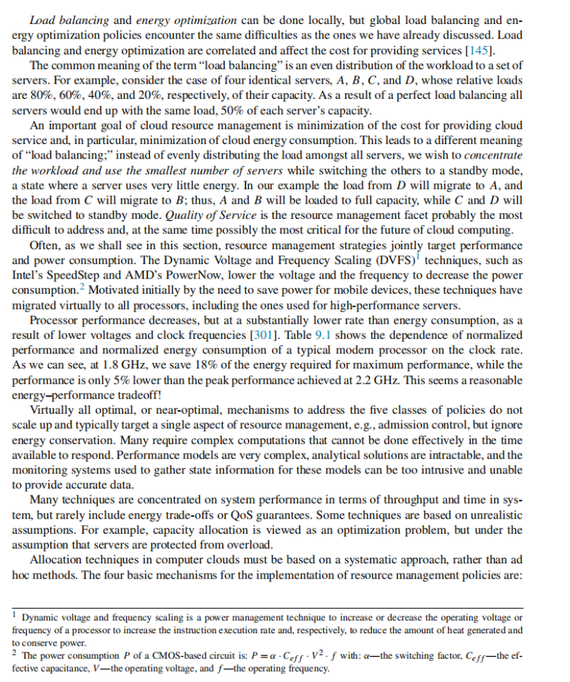
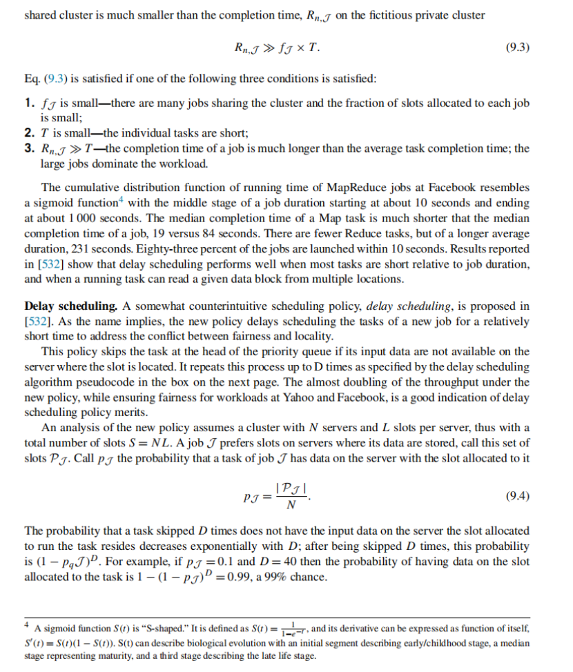
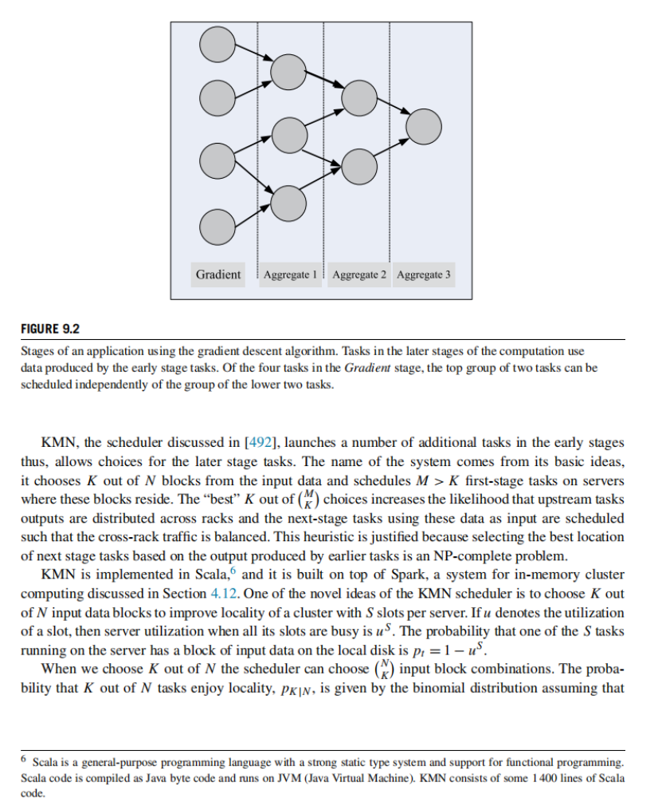
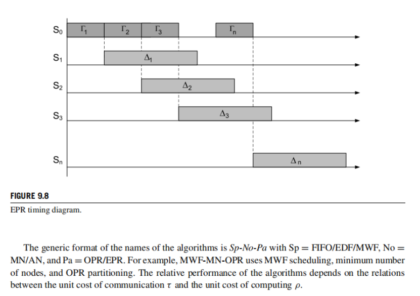
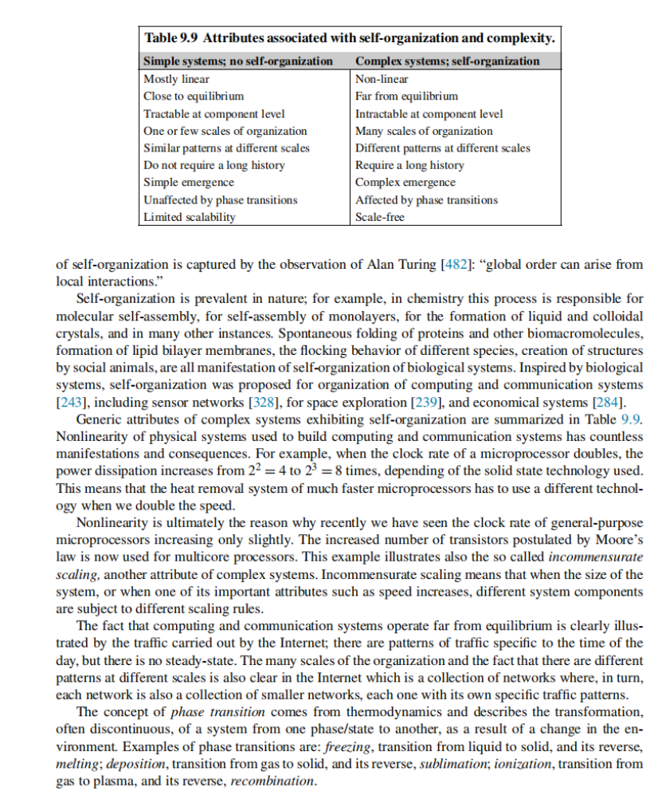

# Chapter 9 Cloud resource management and scheduling

# Start


**1\. 标题：云资源管理与调度概述**

本次课件主要介绍了云计算环境下资源管理与调度（Cloud Resource Management and Scheduling）的核心概念、挑战以及在不同层次（IaaS、PaaS、SaaS）中的策略差异。此外，还阐述了自动伸缩（Auto-scaling）的原理、集中式和分布式管理方法的利弊，并对本章后续各小节所涵盖的具体内容和重点做了概述，包括调度算法、数据感知调度（Data-aware Scheduling）、云能耗管理、自组织与自管理，以及云互操作性（Cloud Interoperability）等。

* * *

**2\. 详细内容解析**

下面将根据图片中出现的内容，按知识点顺序进行详细讲解和分析：

1.  **资源管理的核心地位与关键目标**
    
    *   **核心功能**：资源管理是任何人造系统(尤其是云计算系统)的核心职能，对系统性能（performance）、功能性（functionality）和成本（cost）都有决定性影响。
    *   **三维度评价**：
        1.  **Performance（性能）**：系统对请求的响应速度、吞吐量等指标。
        2.  **Functionality（功能性）**：系统所能提供的服务特性和可用功能是否能满足用户需求。
        3.  **Cost（成本）**：为保持性能和功能而支出的资金、资源、电能等。
    *   **相互关系**：如果资源管理不足，会导致性能下降或者成本上升，并可能间接导致功能性不能完全发挥，比如某些服务必须关闭以节省资源。
2.  **云计算环境的复杂性**
    
    *   **大规模异构基础设施**：云环境中包含大量异构服务器、网络设备和存储设备，且用户数目庞大，用户行为不可预测，给资源管理带来巨大挑战。
    *   **无法获得全球精确状态**：因为云规模过于庞大，实时获取并分析整个系统状态几乎不可能，这造成了资源调度和性能预测的难度。
    *   **无法准确预测工作负载**：云系统的用户数量庞大、需求多样且波动频繁，导致负载类型和负载强度很难被准确预估。
3.  **资源过度分配与外部因素**
    
    *   **过度分配（Oversubscription）**：在云环境中，常常会出现提供给租户（租用方）的“声明资源”大于实际可用物理资源的情况。这需要更智能的资源管理和调度算法。
    *   **自私性（Self-interest）**：资源提供方或使用方可能根据自身利益最大化来使用或争夺资源，导致协作难度上升。
    *   **外部因素影响**：硬件与软件系统的异构性、节点故障率、网络带宽瓶颈等都会显著影响资源调度与负载均衡效果。
4.  **IaaS、PaaS、SaaS 不同层次的资源管理策略**
    
    *   **IaaS（Infrastructure as a Service）**：主要关注在底层计算、存储、网络等基础资源的管理与分配。典型例子是通过虚拟机或容器动态扩容/缩容。
    *   **PaaS（Platform as a Service）**：主要为开发者提供运行环境、开发平台、数据库等中间层功能。此时资源管理既考虑底层容量，也考虑支持编程平台的中间件调度、运行时的负载。
    *   **SaaS（Software as a Service）**：最贴近终端用户，多数由服务提供商直接管理应用层资源，通常在后端也需要配合IaaS/PaaS的动态扩容来应对波动。
5.  **自动伸缩（Auto-scaling）的原理**
    
    *   **应对突发负载**：云通常会遇到无法预测的流量激增或季节性请求高峰，自动伸缩可以根据实时监控数据触发资源的增加或释放。
    *   **必要条件**：
        1.  **有可用的资源池**，可在需要时动态分配或回收。
        2.  **监控系统**：持续监控当前负载、资源使用状况，并基于阈值或智能算法触发伸缩操作。
    *   **自动伸缩的应用**：
        *   在IaaS中，自动伸缩往往需要更底层的API来启动或关闭虚拟机、容器。
        *   在PaaS和SaaS场景下，也需要在平台/应用层面进行细粒度或粗粒度的扩展。
6.  **集中式管理与分布式管理**
    
    *   **集中式管理**：将系统状态信息集中到少数管理节点，做出全局调度决策。
        *   优点：可以(在理论上)做出“全局最优”的资源分配决策。
        *   缺点：云环境规模庞大且动态性强，集中式方案难以实时获取准确的系统状态，且单点故障风险大。
    *   **分布式管理**：将管理决策分散到多个节点或层级中，每个子系统根据局部信息进行自治或协同。
        *   优点：扩展性好，容错能力强，能应对云环境的复杂性。
        *   缺点：难以获得全局最优，且需要更复杂的协同机制。
7.  **自治系统与自管理（Autonomic Management）**
    
    *   **原理**：基于自治计算(Autonomic Computing)的思想，系统能根据策略自动监控、分析、规划和执行（MAPE-K循环）。
    *   **意义**：在云系统中，随着规模增大和变化频率提升，人工干预已难以应对复杂度和实时性需求。自管理机制可以根据设定策略和实时数据自动调整资源。
    *   **挑战**：自治管理需要高效的算法（如机器学习、控制理论等）去做决策，并且系统之间的配合和互操作性也影响最终效果。
8.  **带宽与延迟（Bandwidth & Latency）**
    
    *   **带宽（Bandwidth）**：这里特指单位时间内可完成的操作数或可传输的数据量，比如：
        *   Mips (Million Instructions Per Second)：CPU执行指令速度。
        *   Mflops (Million Floating Point Instructions Per Second)：浮点运算速度。
        *   Mbps (Megabits per second)：网络吞吐量等。
    *   **延迟（Latency）**：从请求某项操作到能感知其结果所经过的时间。
        *   **通信延迟**：数据包在源与目的地之间的传输时间。
        *   **内存延迟**：发出一次内存读取指令到数据可用所需的时间。
9.  **资源需求的动态性与不可预期性**
    
    *   在云环境中，应用的数据处理量和用户请求量瞬息万变，计算、存储、网络等需求也会随之不断变化。
    *   通过实时监控、历史数据分析或者预测模型来判断是否需要扩增或缩减资源，以保持合理的性能与成本平衡。
10.  **本章结构与后续内容概述**
        
    *   **Section 9.1**：概览云资源管理的策略与机制。
    *   **Section 9.2**：介绍面向计算机云的调度算法。
    *   **Section 9.3 & 9.4**：重点讨论数据感知调度（Data-aware Scheduling）。
    *   **Section 9.5**：Apache Capacity Scheduler。
    *   **Section 9.6 & 9.7**：开始时间公平排队（Start-time Fair Queuing）等调度算法研究。
    *   **Section 9.8 & 9.9**：带有截止期限（Deadlines）的调度算法，以及MapReduce的截止期调度。
    *   **Section 9.10**：资源捆绑与组合拍卖（Combinatorial Auctions）。
    *   **Section 9.11 & 9.12**：云能效（Cloud Energy Efficiency）与资源利用率的研究。
    *   **Section 9.13, 9.14, 9.15**：基于控制理论的资源管理思想，并探讨具体的分配机制。
    *   **Section 9.16**：机器学习在自适应性能管理中的应用。
    *   **Section 9.17**：面向Web服务的资源配置的效用模型（Utility Model）。
    *   **Section 9.18**：云系统中的自组织与自管理(自组织/自管理)。
    *   **Section 9.19**：云互操作性的深入分析。

* * *

**3\. 小结**

*   **本次课件的主要内容**是阐述云资源管理的重要性以及在云计算环境下进行调度和管理时所面临的复杂挑战。
*   通过对性能、功能性与成本之间的平衡和其交互关系的讨论，强调了资源管理的难点与多目标优化需求。
*   对比了IaaS、PaaS、SaaS层次的资源管理差异，以及在应对峰值负载时常用的自动伸缩方法。
*   指出了集中式与分布式管理的优缺点，引出了自治管理和自组织系统在云计算未来演进中的地位。
*   介绍了“带宽”“延迟”这些常用衡量指标在云资源调度中的意义，并概览了后续章节将要深入探讨的各类调度和管理算法、能耗优化、以及云系统互操作性等高级主题。

通过这部分内容的学习，我们可以更好地理解云环境中为什么资源管理如此关键，以及在面对大规模动态负载时，需要考虑哪些核心技术与策略。

* * *

**4\. 是否有内容缺失或不清晰**  
从目前提供的截图来看，文字内容较为完整，图像也较清晰，没有明显缺失之处。本次笔记已涵盖了截图中的所有知识点和细节。如有更多细节内容或下一部分截图，请继续提供以便进一步完善。

# **9.1** **Policies and mechanisms for resource management**





**1\. 标题：云资源管理的策略与机制：分类、能耗与性能的权衡**

本次课件内容主要围绕云计算资源管理中“策略（Policy）”与“机制（Mechanism）”的区别与重要性展开，重点介绍了五类主要的管理策略（Admission Control、Capacity Allocation、Load Balancing、Energy Optimization、QoS Guarantees）及相关实现机制。同时，探讨了在云环境下进行资源分配时常见的挑战，包括能耗与性能的权衡、负载均衡、服务质量（QoS）保障，以及可用于实现资源管理的四大基础方法（控制理论、机器学习、基于效用、市场/经济模型）。以下是对各知识点的分条详细分析。

* * *

### 2\. 详细内容解析

#### 2.1 策略（Policy）与机制（Mechanism）的区别

1.  **策略（Policy）**：指导决策的原则，即系统该“做什么”以及“何时做”。
2.  **机制（Mechanism）**：实现策略的手段，即系统“如何做”以及具体“如何执行”。
3.  **分离的重要性**：
    *   **操作系统设计原则**：Butler Lampson 与 Per Brinch Hansen 提出将策略与机制分离能提高系统的灵活性和可扩展性；在云计算场景下，也能使资源管理在应对复杂多变的需求时有更大的自主度。

#### 2.2 云资源管理的五类主要策略

文中将云资源管理策略粗略归为以下五类，每一类都有其核心目标与关键挑战：

1.  **Admission Control（准入控制）**
    
    *   **目的**：防止系统接收会违反更高层策略或造成系统过载的工作负载。例如，在已经承诺一定工作量的情况下，不再接收额外负载，保证已在执行或已签约的任务能顺利完成。
    *   **难点**：需要对系统全局状态或未来负载有一定的掌握。但在动态云环境中，准确掌握全局状态往往非常困难。
2.  **Capacity Allocation（容量分配）**
    
    *   **定义**：将可用资源（计算、存储、网络等）分配给各个实例（instance）的过程，一个“实例”通常是某个服务或容器的激活。
    *   **挑战**：
        *   需要在大规模、快速变化的系统中进行资源定位（比如选择哪台物理机或虚拟机来运行新实例）。
        *   存在多种全局优化目标（性能、能耗、成本、延迟等），需要在巨大的搜索空间中快速做出决策。
3.  **Load Balancing（负载均衡）**
    
    *   **常见意义**：将负载在所有可用服务器之间进行“均匀”分配，以避免热点问题或单点过载。
    *   **能耗新思路**：在云环境中，有时会**有意集中负载**到尽可能少的服务器上，使其他服务器进入待机（standby）或低功耗模式，从而减少整体能耗。
    *   **示例**：若有四台服务器  $A, B, C, D$ ，相对负载能力为 80%、60%、40%、20%，在传统均衡中会让所有服务器都承担大约 50% 的负载；而在能耗优化场景下，可将部分负载转移到前两台，让后两台关机或待机以减少能耗。
4.  **Energy Optimization（能耗优化）**
    
    *   **目标**：在提供服务的同时尽量降低云数据中心的总能耗，如减少服务器空转、利用动态电压与频率调节（DVFS）等。
    *   **相关性**：与负载均衡密切相关；在某些情况下，能耗优化策略会与负载均衡策略相互制衡，也会影响成本。
5.  **QoS Guarantees（服务质量保证）**
    
    *   **意义**：在云环境中，QoS（如响应时间、吞吐量、可靠性、服务等级协议SLA等）往往是最为关键的指标之一；对于用户而言，这直接影响服务可用性和业务。
    *   **难点**：在同时考虑负载均衡、能耗等其他目标时，仍要确保关键任务的响应时间和可靠性，往往需要复杂且精细化的调度算法。

#### 2.3 负载均衡与能耗优化的互相影响

*   **传统负载均衡**：将工作负载平均分散到所有可用节点上，从而提升并行度、降低单点压力。
*   **能耗优化优先**：为了减少整体电力消耗，往往希望“用最少的服务器完成既定工作量”，并尽量让其他服务器处于待机或关机状态。
*   **如何平衡**：需要根据系统对于“性能”和“能耗”的偏好进行调优，也受业务特性（如工作负载类型）影响。

#### 2.4 动态电压与频率调节（DVFS）

1.  **原理**：通过降低CPU频率及电压来减少功耗；常见技术如Intel SpeedStep、AMD PowerNow等。
2.  **性能与能耗的权衡**：
    *   频率降低带来能耗的大幅下降，同时性能会有一定程度衰减。
    *   表 9.1（Table 9.1）给出了不同CPU速度下能耗和性能的“归一化”值；例如：
        *   在1.8GHz时，仅消耗了最高频率时82%的能量，却能达到95%的性能。
        *   在2.2GHz最高频率时性能虽最佳，但也消耗了更多电能。
    *   结论：在实际部署中，经常会选择“稍微低于最高主频”这样的折中点，既节能又能保持较高性能。

#### 2.5 管理策略的复杂性与单一策略的不足

*   **单一策略局限**：许多方法只能解决某个特定方面（如只考虑准入控制或只考虑能耗），但云环境往往需要多目标优化（QoS、能耗、负载均衡等）。
*   **性能模型的复杂性**：精确的性能模型难以建立，分析方法复杂且系统状态采集也容易侵入性过高（比如过频率地采集监控信息影响性能）。
*   **大规模与动态性**：很多需要全局最优的计算在动态云环境中几乎不可能实时完成，因此常用启发式或近似算法。

#### 2.6 资源管理政策的四大实现机制

文中列举了四种常见的资源管理机制，可单独或组合使用：

1.  **Control Theory（控制理论）**
    
    *   **原理**：基于反馈控制环（Feedback Loop），可在一定程度上保证系统的稳定性并预测瞬态行为。
    *   **局限**：通常仅能在局部或简化模型下工作，对于真正复杂的大规模云系统，需要较多假设；Kalman Filter等方法也只适用于简单化场景。
2.  **Machine Learning（机器学习）**
    
    *   **优点**：不需要精准的系统性能模型；可通过历史数据和实时信息进行训练和预测。
    *   **应用**：可用于多个自治管理器（autonomic manager）的协调，也可在资源分配、负载预测、异常检测等方面发挥作用。
3.  **Utility-based（基于效用/效益）**
    
    *   **概念**：定义一个系统的效用函数（utility function），将用户性能需求与成本或能耗关联起来进行优化。
    *   **难点**：需要构建合理的性能模型以及将用户级性能映射到相应的“成本”或“收益”上，从而找到总体最优解。
4.  **Market-oriented/Economic Mechanisms（市场或经济学驱动）**
    
    *   **思想**：资源按照供需关系或竞拍（例如组合式拍卖）进行分配，常见于大型公共云平台或多方资源交易场景。
    *   **好处**：无需精确的性能模型，可以借助市场定价机制或拍卖机制使资源得到较为合理的分配。
    *   **挑战**：设计公平、高效且能反映真实供需关系的拍卖或定价策略并不容易。

#### 2.7 交互型工作负载与非交互型工作负载

*   **交互型工作负载**：如Web服务，需考虑流量控制、实时性、动态应用部署等。
*   **非交互型工作负载**：通常集中在作业调度和批处理任务上，更侧重吞吐量最大化、作业排队优化等。
*   **混合场景**：云环境往往既有Web交互式请求又有离线批处理任务，需要兼顾两种类型的管理策略。

* * *

### 3\. 小结

1.  **策略与机制的分离**：在云计算资源管理中，将决策原则（policy）和实现手段（mechanism）分离有助于提高灵活性和可扩展性。
2.  **五大主要资源管理目标**：准入控制、容量分配、负载均衡、能耗优化、服务质量，是云环境中最常见的关注点。
3.  **能耗与性能的平衡**：在考虑负载均衡时，通常需要折中方案。一方面要保障服务质量和资源利用率，另一方面要尽量降低能耗。DVFS等技术为这两者提供了可调节的手段，表 9.1 具体展示了CPU频率变动对性能与能耗的影响。
4.  **四种实现机制**：
    *   **控制理论**：通过反馈调节来维持稳定性或预测过渡行为。
    *   **机器学习**：利用数据训练模型，为自治和资源分配提供策略决策。
    *   **基于效用**：将性能和成本映射到一个效用函数，实现最优分配。
    *   **市场/经济模型**：通过价格、竞拍等经济学方法实现资源的供需调节。
5.  **交互与非交互负载并行管理**：云通常会同时运行Web服务和批处理作业，需要针对性或组合式的调度策略。

通过这一部分内容，我们可以清晰地了解到云资源管理中“策略”与“机制”的概念区别，并初步掌握了在面向不同需求（如低能耗、高性能、稳定QoS等）时可采用的主要思路与常见实现方法。在大规模云环境中，这些方法往往需要结合实际业务模型、硬件条件和实时监测数据进行多目标综合优化。

* * *

### 4\. 是否有内容缺失或不清晰

从截图内容来看，文字信息较为清晰，本笔记已涵盖涉及的主要知识点和核心细节。如果后续还有更多图片或更深层次的内容，请继续提供，以便我们将整体课件串联成更完整的知识体系。

# **9.2** **Scheduling algorithms for computer clouds**


**1\. 标题：云计算中的调度算法：资源共享、多目标需求与公平性**

本次课件的内容聚焦于云计算环境下的调度算法（Scheduling Algorithms for Computer Clouds），从资源共享、多目标调度需求以及不同类型应用场景（批处理、实时、多媒体等）对调度提出的要求展开分析。通过介绍多种调度策略与公平性准则，帮助我们理解如何在云环境中实现高效、稳定且可预测的资源分配。

* * *

2\. 详细内容解析
----------

### 2.1 调度在云资源管理中的关键作用

1.  **核心功能**
    *   调度是云资源管理的核心组成部分，负责在多个层次上进行资源的共享与复用（Multiplexing），例如：
        *   **服务器层面**：一台物理服务器可同时运行多个虚拟机（VM），每个虚拟机里可运行多个应用。
        *   **应用层面**：每个应用通常包括多个线程，这些线程在CPU虚拟化层面被视为“虚拟处理器”。
        *   **网络层面**：一条通信链路可通过虚拟信道（Virtual Channels）来复用，多条数据流共享同一物理网络通道。
2.  **调度器的目标**
    *   **效率**：在给定资源下尽量提高吞吐量、减少平均响应时间或作业完成时间等。
    *   **公平性**：避免某些作业被长期“饥饿”或长期得不到资源分配。
    *   **无饥饿（Starvation-free）**：确保即使优先级较低的任务，在一定时间后也能获得资源执行。
    *   **批处理系统的目标**：最大化吞吐量、最小化作业的周转时间（从提交到完成的时间）。
    *   **实时系统的目标**：满足截止期限（Deadline），具有可预测性。

### 2.2 调度策略与资源需求类型（图 9.1 解析）

课件中展示了一个坐标图（Fig. 9.1），从两大维度来划分资源需求策略：

1.  **资源数量（Quantity）**：从“宽松（loose）”到“严格（strict）”。
2.  **时间要求（Timing）**：从“宽松（loose）”到“严格（strict）”。

据此，形成三类典型需求：

*   **Best-effort（尽力而为）**
    *   对资源的数量和调度时机都无严格要求，也即不提供明确的服务保证。
    *   常见于批处理作业或分析型应用，它们对延迟或吞吐有一般性需求，但并无硬性约束。
*   **Soft-requirements（软需求）**
    *   需要一定量的资源和大体的时间限制，往往希望获得统计上的性能保证（如流媒体应用需要一定带宽与延迟上限）。
    *   但一旦无法完全满足，也不会导致系统或应用“硬性失败”。
*   **Hard-requirements（硬需求）**
    *   在资源数量和时间上都有非常严格的要求（如硬实时系统，需严格满足截止期限或CPU周期数）。
    *   若无法满足，系统功能或应用可能会出现严重错误或失效。

#### 2.2.1 预占式（Preemptive）与非预占式（Nonpreemptive）调度

*   **预占式**：允许高优先级或紧急任务中断当前正在执行的低优先级任务，以优先获得资源。常见于操作系统的抢占式多任务和实时调度。
*   **非预占式**：已开始执行的任务通常会一直运行到结束或进入等待状态才会让出资源。

### 2.3 资源管理的两个核心维度

1.  **分配资源的数量或质量（Amount/Quantity）**
    *   比如网络带宽、CPU核心数或内存配额等。
2.  **访问资源的时机（Timing）**
    *   何时能够获得CPU、何时能够获得I/O带宽，以及是否满足实时性要求。

### 2.4 调度算法中的公平性原则

文中提到了**Max-min Fairness Criterion**，即在将带宽  $B$  分配给  $n$  个用户时，每个用户请求量为  $b_i$ ，实际分配量为  $B_i$ ，为保证分配的公平性，需要满足以下条件：

1.  ** $C_1$ **：任何用户得到的资源不超过其请求量： $B_i \le b_i$ 。
2.  ** $C_2$ **：若分配中存在某个用户的分配量为  $B_{\min}$ ，则无其他满足  $C_1$  的分配能够使得  $B_{\min}$  再提高。
3.  ** $C_3$ **：当移除分配量为  $B_{\min}$  的用户时，可将该部分资源  $ (B - B_{\min})$  重新分配给余下用户，并保持  $C_2$  递归有效。

#### 2.4.1 CPU调度的公平性度量 (公式 9.1)

> $$
> \min \left\lvert \frac{\Omega_a(t_1, t_2)}{w_a} \;-\; \frac{\Omega_b(t_1, t_2)}{w_b} \right\rvert
> $$

*    $\Omega_a(t_1, t_2)$  表示在  $[t_1, t_2]$  时段内线程  $a$  获得的 CPU 工作量； $w_a$  为线程  $a$  的权重。
*   同理， $\Omega_b(t_1, t_2)$  表示线程  $b$  获得的 CPU 工作量； $w_b$  为其权重。
*   **目标**：使所有线程在相同时间内得到与其权重成正比的 CPU 资源，从而提升整体公平性。

### 2.5 不同应用类别对调度算法的需求

1.  **Best-effort 应用**：如批处理应用、数据分析作业（Analytics），不需硬性QoS保证。
2.  **流媒体应用**：往往具有软实时约束，希望有**统计保证**，如最大延迟、最小吞吐率等。
3.  **硬实时应用**：必须满足严格的截止期限，目前大多不会放在公共云上，但未来可能出现。

### 2.6 常见调度算法

1.  **Round-Robin（RR）**
    *   **思想**：按时间片（time-slice）循环地将CPU分配给就绪队列中的各任务。
    *   **特性**：公平、易实现，但上下文切换较频繁。
2.  **First-Come-First-Serve（FCFS）**
    *   **思想**：按照任务到达队列的顺序执行。
    *   **优点**：实现简单，不存在抢占；**缺点**：可能出现“长作业”堵塞后续短作业的问题。
3.  **Shortest-Job-First（SJF）**
    *   **思想**：优先执行运行时间最短的作业。
    *   **优点**：能减少平均等待时间和平均周转时间；**缺点**：对长作业不太友好，且需要知道作业执行时间的先验信息。
4.  **Priority Scheduling（优先级调度）**
    *   **思想**：按照预先分配的优先级高低来决定调度顺序。
    *   **问题**：可能导致低优先级任务“饥饿”，通常会结合“优先级老化”（动态提高长期未执行任务的优先级）来缓解。
5.  **Earliest Deadline First（EDF）** & **Rate Monotonic Algorithms（RMA）**
    *   **应用场景**：用于硬实时系统的调度。
    *   **EDF**：始终先调度截止时间最近的任务；若任务能抢占，则更能确保调度的实时性。
    *   **RMA**：根据任务的执行周期分配优先级，周期越短优先级越高。
6.  **其他新型算法**：
    *   **Resource Allocation/Dispatching（RAD）** 和 **Rate-Based Earliest Deadline（RBED）**：将资源分配、调度结合在一起，以适应集成化需求或更复杂的应用场景（如大数据、流式计算、混合负载等）。

### 2.7 面向大数据与多媒体应用的多目标调度

*   **多目标调度**：需在公平性、吞吐量、实时性、能耗等多个方面综合考量。
*   **大数据应用**：可能关心作业总体完成时间（如MapReduce作业），在云环境中通常会使用批处理调度算法或其变种。
*   **多媒体应用**：需要保证一定的延迟抖动、带宽需求，属于软实时范畴，调度器需结合网络带宽分配和CPU调度多重因素。

* * *

3\. 小结
------

1.  **调度的重要性**：云计算资源管理中，调度承担着在多层次上分配与复用资源的核心职责，直接影响系统效率与用户体验。
2.  **需求多样化**：从批处理到流媒体再到硬实时，每种应用都有不同的QoS要求与调度优先级；因此，需要多种调度算法或组合方案才能有效满足多元需求。
3.  **公平性与性能兼顾**：通过Max-min或其它公平准则，力求在保证不同作业的基本需求下，提升系统整体吞吐和资源利用效率。
4.  **常用算法对比**：RR、FCFS、SJF、优先级调度广泛应用于非实时和批处理场景；EDF和RMA则常见于实时系统。新型算法（如RAD、RBED）进一步针对集成化云应用提出解决方案。
5.  **持续演进**：在面向大规模云计算和混合型工作负载时，单一算法往往不能满足所有目标，需要结合实际应用场景选择或开发定制化的调度策略。

* * *

4\. 是否有内容缺失或不清晰
---------------

根据截图显示，所含文字内容较为完整，图示（Fig. 9.1）也清晰表述了Best-effort、Soft-requirements、Hard-requirements之间的关系。本次笔记已覆盖所有主要知识点和细节。如后续还会有更深入的算法案例或代码，请继续提供对应课件内容，以便完善学习笔记。

# **9.3.1*Delay scheduling (R)**





**1\. 标题：面向大规模数据处理的延迟调度策略：在公平与数据本地性之间的平衡**

本次课件围绕“延迟调度（Delay Scheduling）”在Hadoop及大规模集群中的应用展开，探讨如何在保证**公平性**、**资源利用率**和**高吞吐量**的同时，兼顾**数据本地性**（Data Locality）以提升大数据应用（如MapReduce）的效率。该策略最初由大型IT服务提供商（如Yahoo、Facebook）在实际环境中提出并验证，为解决传统FIFO或优先级调度对数据位置缺乏考虑而设计。

* * *

2\. 详细内容解析
----------

### 2.1 背景：Hadoop调度与数据本地性

1.  **Hadoop作业结构**
    
    *   一个Hadoop作业由多个Map和Reduce任务组成，每个任务都需要在集群中的某个“Slot”上运行。
    *   **JobTracker & TaskTracker**：在早期Hadoop版本中，JobTracker负责全局调度和资源分配，多个TaskTracker在各个从属节点（Slave Servers）上实际执行任务。
2.  **传统调度的不足：FIFO或优先级调度**
    
    *   **FIFO调度**：Hadoop默认采用FIFO（先进先出）策略，并用5个优先级队列给作业分配Slot。优先级越高的任务，越先获得可用资源。
    *   **问题**：优先级调度往往忽视数据本地性（data locality）。若任务被分配到远程节点，其数据需要跨网络传输，耗时与带宽消耗都会明显增大。
    *   **Sticky slots**：在稳定状态下，优先级调度可能导致同一个Job的后续任务被不断地分配到同一个Slot，优先级随着任务执行而降低，但并不会主动考虑将任务调度到更本地化的数据节点。
3.  **数据本地性（Locality）的重要性**
    
    *   **Server locality**：任务在存储其输入数据的同一台物理服务器上执行；数据I/O非常快。
    *   **Rack locality**：任务在与数据存储节点同一个机架（rack）内执行；虽然需要在机架内部进行数据传输，但带宽和延迟依然比跨机架要好。
    *   实际监测表明：许多在Facebook运行的Map任务中，只有少数（5%）的低优先级Map任务能达到“Server Locality”，59%的任务只能做到“Rack Locality”。意味着大部分情况下并未实现最优的数据访问。

* * *

### 2.2 任务本地性及作业本地性

1.  **任务本地性的定义**
    
    *   只有当一个任务在存储其输入数据（或数据副本）的那个服务器（或机架）上运行时，才算实现了数据本地性。
2.  **平均作业本地性**
    
    *   设集群共有  $N$  台服务器，每台服务器上有  $L$  个Slot，总Slot数为  $S = N \times L$ 。
    *   若某作业  $J$  获得的Slot数为  $n$ ，则“集群份额”可写作  $f_J = n / N$ 。
    *   **数据副本数量**：假设HDFS中数据块的副本数为  $R$ ，那么每个输入数据块在集群中有  $R$  个拷贝。
    *   **数据不存在于分配节点的概率**：若给某任务分配到的节点不在作业数据所在集合中（概率为  $1 - f_J$ ），则它需要跨节点访问数据。考虑  $R$  个副本、以及节点上有  $L$  个Slot 的情况，推导出当数据块出现在该节点的概率相关公式。
    *   **本地性上限  $L_J$ **：课件中给出了 
        $$
        L_J = 1 - (1 - f_J)^{R L},
        $$
         表示在最多  $R$  个副本、每台服务器  $L$  个Slot 的情况下，作业  $J$  的最大本地性概率。
3.  **作业等待与Slot可用性**
    
    *   若作业需要等待空闲Slot，则其最后一个任务的开始时间会直接影响整体完成时间。
    *   在共享集群中，当有多个作业同时排队竞争资源时，很难保证所有任务都能立即分配到适宜节点。

* * *

### 2.3 延迟调度（Delay Scheduling）

1.  **提出原因**
    
    *   **公平性 vs. 本地性**：优先级或FIFO调度往往更倾向于公平性和简单实现，但忽略了数据本地性。
    *   **延迟调度**：通过对“非本地”分配进行有限次数的跳过（delay或skip），给有数据本地性的调度机会，让任务在数据所在节点上执行，从而兼顾公平与本地效率。
2.  **核心思想**
    
    *   如果任务所需数据不在当前分配节点上（即不满足本地性），调度器会暂时“跳过（skip）”该分配机会，让出Slot，等待后续更合适的分配（例如Slot在数据本地节点上）。
    *   可以跳过的次数由一个可调参数  $D$  决定：
        *   当跳过次数超过  $D$  后，调度器就不再坚持本地性，而会将任务调度到任何可用的Slot上，以避免过度等待造成饥饿或资源浪费。
    *   这个策略表面上看“反直觉”，因为故意放弃了立即分配资源，但在大规模集群中，短暂延迟可能换来大幅减少远程数据传输的时间，最终提高整体吞吐和资源利用率。
3.  **数学分析**
    
    *   ** $p_J$ **：对作业  $J$  而言，其数据所在服务器相对于集群总Server数的比例，即 
        $$
        p_J = \frac{|P_J|}{N},
        $$
         其中  $|P_J|$  表示存储作业  $J$  数据的服务器数。
    *   **跳过成功概率**：若跳过  $D$  次，每次都希望找到“本地数据节点”，那么经过  $D$  次后的成功概率约为  $1 - (1 - p_J)^D$ 。
        *   例如，当  $p_J = 0.1$  且  $D=40$  时，概率为  $1 - 0.9^{40}\approx 0.99$ ，意味着通过40次“跳过”就有99%的几率分配到本地数据节点。
4.  **实际收益**
    
    *   实验与实践（在Yahoo和Facebook集群）表明，延迟调度策略在任务相对较短、作业数众多的环境中可以显著提升吞吐量与数据本地性。
    *   几乎接近“倍增”的性能提升，在同时运行大量作业时尤其突出。

* * *

### 2.4 工作负载特征与延迟调度适用条件

1.  **作业/任务持续时间分布**
    
    *   Facebook上的MapReduce作业：Map任务的中位完成时间比Reduce任务要短得多，但Reduce任务平均时长更长。
    *   许多Map任务在10秒内就能完成，而长作业可持续数百秒甚至更长。
    *   延迟调度效果最佳时往往是**短任务**占据较大比例，或者作业本身持续时间（ $R_{n,J}$ ）远大于单任务执行时间（ $T$ ），这样的一点点“延迟”带来的本地性收益会被放大。
2.  **三种典型情况**
    
    *   ** $f_J$  很小**：即某作业在集群中只占用很小一部分Slot/资源；另有许多并行作业在跑，调度器可以经常遇到新的空闲Slot。
    *   ** $T$  很小**：任务执行时间短，等待一点时间换取数据本地性更划算。
    *   ** $R_{n,J} \gg T$ **：作业总执行时间远大于单个任务时长；此时稍微“延迟”不会显著影响整体作业的完成时间，但能大幅减少远程数据传输的负担。

* * *

### 2.5 小结

1.  **延迟调度的核心贡献**：
    
    *   兼顾公平与本地性：在优先级调度机制上增加“延迟”跳过策略，有效提升数据本地访问率，进而提高整体吞吐量和资源利用率。
    *   对“短任务多、数据分布广”的典型大数据集群特别有效。
2.  **本地性与调度的平衡**：
    
    *   过于执着本地性：可能让任务无限等待而浪费系统资源。
    *   完全忽略本地性：会引入大量网络开销和I/O负载，影响应用性能。
    *   延迟调度设置一个最大跳过次数  $D$ ，在两者之间作折中。
3.  **实际应用价值**：
    
    *   据报告，在Yahoo和Facebook集群上应用延迟调度时，MapReduce吞吐量几乎翻倍，证明了其在互联网级大规模集群中的可行性和有效性。
    *   该思想也启发了后续针对Spark、Flink等分布式计算框架中对本地性策略的改进。

* * *

4\. 是否有内容缺失或不清晰
---------------

从当前提供的截图来看，文字信息完整，介绍了延迟调度的原理、数学分析及适用情形。本次笔记已对相应内容做了详尽解读和分析。如若后续有更多关于延迟调度的代码或示例、或更深入的性能评测内容，请继续提供，以便补充与完善整体理解。

# **9.3.2** **Delay scheduling (R)**


**1\. 标题：延迟调度算法与Hadoop Fair Scheduler：在数据本地性和公平性之间的深入折中**

本次课件内容延续了前面对延迟调度（Delay Scheduling）的介绍，进一步展示了延迟调度的算法伪代码与数学分析，并引入“Hadoop Fair Scheduler（HFS）”的改进调度方案。通过这些内容，我们可以深入理解延迟调度在实际集群中的实现细节和性能收益，以及如何在更复杂的需求（如多用户共享、可控调度、可预测的任务完成时间等）下演化出更加灵活的公平调度策略。

* * *

2\. 详细内容解析
----------

### 2.1 延迟调度算法的实现细节

课件给出了延迟调度算法（Delay Scheduling Algorithm）的伪代码，大致流程如下（行号对应课件图示）：

1.  **初始化**：对每个作业  $j$ ，将  $\text{j.skipcount} = 0$ 。这是作业  $j$  被跳过的计数器，用于控制在“非本地”分配上跳过多少次。
2.  **节点空闲检测**：当一个节点  $n$  发送心跳（即表明节点存在空闲Slot）时，调度器进行如下步骤：
    1.  如果节点  $n$  有可分配的空闲Slot，则对所有作业按“当前正在运行的任务数”从小到大进行排序。
    2.  依次检查这些作业：
        *   若作业  $j$  还有**未启动**的任务  $t$ ，**并且**该任务在节点  $n$  上有数据副本（即本地数据），则将任务  $t$  启动在  $n$  上，并将  $\text{j.skipcount}$  重置为0。
        *   否则，如果  $j$  还有未启动的任务  $t$  **但**不在节点  $n$  上，那么检查  $\text{j.skipcount}$ ：
            *   若  $\text{j.skipcount} > D + 1$ ，说明作业  $j$  已经“跳过”超过预设阈值  $D$  次，则不再等待本地性，直接在节点  $n$  启动该任务；
            *   否则  $\text{j.skipcount} = \text{j.skipcount} + 1$ ，表示此时跳过一次，将该Slot让给后续其他作业。
3.  **结束**：若当前作业无法分配任务，则继续检查下一个作业；一旦找到能成功分配任务的作业就停止本次分配循环。

> **核心逻辑**：通过设置最大跳过次数  $D$ ，来在“等待本地节点”与“尽快占用Slot”之间取得平衡。若等待过久，宁可牺牲本地性以避免资源浪费；若等待尚少，则再试几次以获取更佳本地性。

* * *

### 2.2 延迟调度的数学分析

课件中给出了针对延迟调度策略的若干数学推导和公式，用来估算在给定参数（如副本数  $R$ 、集群规模  $N$  等）下，作业  $J$  获得本地性（locality）的概率。

1.  **数据本地性概率  $p_J$ **
    
    *   假设作业  $J$  有  $k$  个未启动的任务，且每个数据块有  $R$  个副本；此外，集群总服务器数为  $N$ 。
    *   $$
        p_J = 1 - \Bigl(1 - \frac{k}{N}\Bigr)^R
        $$
         表示一次分配中找到本地数据节点的概率（此处 $\frac{k}{N}$ 是一个简化假设，用于估计作业数据覆盖比例）。
2.  **跳过  $D$  次后分配到本地节点的概率  $p_{J,D}$ **
    
    *   若每次分配时，节点满足本地性的概率为  $p_J$ ，则在跳过  $D$  次后成功匹配本地的概率为 
        $$
        p_{J,D} = 1 - (1 - p_J)^D.
        $$
        
    *   当  $p_J$  较小但  $D$  足够大时，可显著提升最终拿到本地节点的概率。
3.  **期望本地性  $L_{J,D}$ **
    
    *   通过对不同  $k$  或作业中不同任务进行积分或求和，可得到作业整体的期望本地性概率    $\; L_{J,D}$ 。课件中示例推导（9.7）～（9.9）中，利用指数近似进一步得到： 
        $$
        L_{J,D} \approx 1 - \frac{e^{-RD/N}}{N(1 - e^{-RD/N})}
        $$
         或类似的上界下界分析。
    *   从这些公式可以看出：**增大  $D$ ** 能提高作业整体本地性；**增大副本数  $R$ ** 也能帮助提高本地匹配成功概率；但都存在一定的边际收益递减。
4.  **满足目标本地性要求的跳过次数**
    
    *   若我们要求某个作业  $J$  达到本地性水平  $L_{J,D} \ge (1 - \lambda)$ ，则可推导出一个对  $D$  的下限约束，如公式(9.9)所示： 
        $$
        D \;\ge\; \frac{N}{R} \ln \Bigl[\frac{n(1 - \lambda)}{1 + n(1 - \lambda)}\Bigr] \quad \text{或类似形式}.
        $$
        
    *   通过这种方式，系统管理员或调度器可根据对本地性的需求程度，设置合理的  $D$  值。

* * *

### 2.3 Hadoop Fair Scheduler（HFS）

延迟调度被证明有效后，Hadoop社区又提出了“Hadoop Fair Scheduler（HFS）”，作为更复杂、更灵活的调度方案。它与延迟调度在理念上相通，但更注重对多用户、多作业池以及可预测的周转时间等需求。

1.  **HFS 的新特性**
    
    1.  **按用户而非作业进行公平分享**
        *   在第一层调度中，集群将可用的任务Slot分配给不同的“用户池”或“作业池”，每个池根据公平策略获得一定份额。
        *   在第二层调度中，各池内部再自行分配给具体的作业或任务。
    2.  **用户可控调度**
        *   第二层策略可配置为FIFO或在池内再做Fair Sharing。某些企业环境中，让用户可自定义更细颗粒度的调度策略。
    3.  **可预测周转时间**
        *   通过定义“最小份额超时（minimum share timeout）”和“公平份额超时（fair share timeout）”等机制，防止作业长时间无法获取足够的资源；还可对执行时间过长或“卡住”的任务进行自动处理。
2.  **HFS Scheduling Algorithm伪代码**
    
    *   **核心逻辑**：
        1.  对所有作业按其调度策略（Hierarchical Scheduling Policy）进行排序；
        2.  逐个检查是否可以在当前空闲节点上分配“节点本地（level=0）”任务；
        3.  若无法分配节点本地任务，则检查是否能分配“机架本地（level=1）”任务；
        4.  如果等待时间  $\text{j.wait}$  超过一定阈值（如  $W_1, W_2$ ），则允许作业提升到更高层次本地性（如off-rack任务）等等；
        5.  一旦找到符合条件的作业任务，则进行分配，并重置相应标记；否则，标记  $\text{j.skipped}=true$  并进入下一轮。
    *   **Locality等级（level）**：
        *   level = 0：仅能运行在与数据同一节点的任务；
        *   level = 1：可跨机架但仍在同一个Rack内；
        *   level = 2：可在任何节点上运行（off-rack）。
    *   当一个作业在更高locality级别成功启动了本地任务，则说明之前的等待或者资源分配不满足数据完全本地化，系统会将其level调整或回退，确保下一次再有机会调度到更优本地。
3.  **实际效果**
    
    *   在保证**各用户/作业池**最低份额的同时，HFS利用“等待时间阈值”来让作业先尝试“节点本地”或“机架本地”调度。
    *   Facebook等大规模集群实测发现，HFS可在延迟调度的思路上做更广泛应用，并在一定程度上实现**近乎100%的本地性**（如果愿意牺牲部分公平性或让低优先级作业长时间等待）。

* * *

### 2.4 延迟调度的通用化

1.  **可应用于除本地性以外的其他“偏好”**
    *   延迟调度的思想是：**如果调度器认为“当前Slot不符合某个偏好”，就短暂放弃**，期待下一次可能出现更好的选项。
    *   此偏好不一定是数据本地性，也可以是某种硬件特性（如GPU节点、加速卡）、网络拓扑、负载均衡策略等。
2.  **适用于其他资源类型**
    *   传统Hadoop只针对“Slot”概念，而在Mesos、YARN、Kubernetes等平台中，可以对CPU、内存、GPU、网络带宽等多种资源做相似的延迟调度策略。
3.  **“接近100%本地性”的代价**
    *   如果我们愿意足够多地跳过分配并降低公平原则，也即让一些作业等待更久，就有机会接近100%本地性。
    *   在实际生产环境中，需要在“追求高本地性”与“作业整体等待时间”之间寻求平衡。

* * *

3\. 小结
------

1.  **延迟调度算法细节**：通过引入“跳过（skipcount）”和最大跳过次数  $D$  来控制对本地性的追求力度，极大提高了大数据作业的局部化执行效率。
2.  **数学模型与推导**：课件中给出的公式为我们展示了影响延迟调度效果的关键参数（集群规模、数据副本数、任务数量、等待次数等）及其定量关系。
3.  **Hadoop Fair Scheduler（HFS）**：在延迟调度的基础思路上，针对多用户共享环境提供了多层次调度（用户级与作业级）和可配置的周转时间控制机制，进一步平衡了**公平、可预测性、数据本地性**。
4.  **通用化潜力**：延迟调度不仅适用于Hadoop，还能延伸到其他调度目标（GPU资源、特殊硬件、网络拓扑），帮助云平台在复杂环境中高效利用资源。
5.  **实践中的取舍**：为追求高本地性，可以接受一定程度的延迟或放弃绝对公平；具体策略参数需结合实际集群负载和业务场景做调优。

* * *

4\. 是否有内容缺失或不清晰
---------------

目前的截图与文字信息相对完整，从算法伪代码到公式推导、再到Hadoop Fair Scheduler的多层次实现都已有比较全面的展示。本次笔记对这些内容进行了逐条分析。如果后续需要更深入的实验评测数据或对HFS中参数（如  $W_1$ 、 $W_2$  等）如何选择的经验，可继续提供相关课件，以更好地完善本章的学习与理解。

# **9.4**.1 **Data-aware scheduling (R)**





**1\. 标题：面向I/O密集型大数据任务的“数据感知调度”：以KMN调度器为例**

本节课件围绕“数据感知调度（Data-aware Scheduling）”这一核心概念展开，重点讨论了在I/O密集型应用（如MapReduce、机器学习、近似查询、交互式调试等）中如何利用**数据本地性**来提升整体性能。文中以梯度下降（Gradient Descent）为示例，展示多阶段任务在DAG（有向无环图）模式下如何通过数据感知调度策略优化执行效率。随后，介绍了KMN调度器在Spark上的实现及其显著收益。

* * *

2\. 详细内容解析
----------

### 2.1 数据感知调度（Data-aware Scheduling）的背景与动机

1.  **I/O密集型应用与DAG任务**
    
    *   很多大数据应用可表示为多阶段DAG任务：如MapReduce、机器学习中的迭代优化（如梯度下降）、大规模数据分析等。
    *   各阶段之间存在依赖：后一阶段的任务需要前一阶段产出的数据。
    *   在云集群或大规模集群环境下，若能让任务在存有其输入数据的本地节点或附近节点执行（数据本地性），则能有效减少网络传输时延与带宽开销，提高吞吐量与响应速度。
2.  **多阶段调度与“Late Binding”**
    
    *   **多阶段**：一个作业可能包含多个阶段（如Figure 9.2所示：Gradient、Aggregate1、Aggregate2、Aggregate3），每个阶段可包含若干并行任务。
    *   **Late Binding（后期绑定）**：在调度时，尽可能依据最新的集群状态（数据分布、资源利用率等）来决定将任务安排在哪个节点执行，以提升数据本地性并减少负载不均或跨机架通信。
    *   **Straggler任务**：在大数据场景中，作业的完成时间常由最慢的“尾部任务”决定。提升数据本地性的一个关键目标，就是减少或避免出现明显的尾部拖延。
3.  **数据本地性的重要性**
    
    *   **同节点（Server locality）**：任务与数据在同一台物理机上，可直接读本地磁盘或内存，效率最高。
    *   **同机架（Rack locality）**：若数据和任务在同一个机架内，网内延迟与带宽好于跨机架。
    *   **跨机架（Off-rack）**：通信延迟高、带宽相对有限，通常是最不优的场景。
    *   避免不必要的跨机架数据传输，是数据感知调度的主要目标之一。

* * *

### 2.2 KMN 调度器概述

课件中提到一个名为**KMN**的调度器（来自参考文献 $492$ ），专门面向Spark等内存计算框架，用于提升I/O密集型作业的数据本地性。其名称“KMN”来源于其核心思路：在**输入数据块**及**下一阶段任务**之间做“ $K$  out of  $N$ ”的选择，以提高本地性概率。

1.  **KMN 的主要操作流程**
    
    *   **阶段划分**：将作业分为若干阶段（如图 9.2），上一阶段的输出数据可能分布在集群多个机架或节点。
    *   **选择性调度（Choose K out of M）**：若本阶段有  $M$  个可供选择的“上游任务输出数据块”，KMN在这些数据中挑选“最优” $K$ 个块来在本地或相对就近的节点上启动下一阶段任务。
    *   **负载均衡**：KMN也尝试平衡集群各机架之间的流量，以免出现某些机架过载、另一些机架空闲的情况。
2.  **实现细节**
    
    *   KMN用Scala编写，基于Spark之上进行调度扩展。
    *   在调度时先计算出可能放置任务的节点集合，以及该节点是否存有所需数据的副本。
    *   采用**Round-Robin**或相似策略，以“机架索引”“机架内任务数”等因素对上游任务进行排序。伪代码中展示了一个对 `upstreamTasks` 排序、选出 `K` 个最佳任务块的过程：
        
        ```text
        // 伪代码示例
        for task in upstreamTasks do
            upstreamRacksCount[task:rack] += 1
        end for
        
        roundRobin = upstreamTasks.sort(CompareTasks)
        chosenK = roundRobin[0 : K]
        ```
        
    *   **CompareTasks** 比较规则：
        1.  先比较 `rack` 中的 `idx` (即机架内索引)，数字更小更优；
        2.  如果在同一个rack索引，则比较该rack中已有的任务数，任务数少者更优（以平衡机架负载）。
3.  **本地性概率与数学分析**
    
    *   **假设**：集群中共有  $S$  个Slot，每台服务器利用率为  $u^S$ ，则有概率  $p_t = 1 - u^S$  可以在本地找到空闲Slot。
    *   **二项分布**：若从  $N$  个数据块中挑选  $K$  个，则能实现本地性的概率可用类似二项分布公式计算(见 9.10 ~ 9.12)。
    *   **叠加多次采样**：若对一个Stage的输出多次尝试在不同节点上调度，成功率会进一步提升。
    *   当副本数增多，或集群规模增大时，KMN通过选取“最优” $K$ 个块来部署下游任务，可极大提高数据本地性。
4.  **KMN的性能收益**
    
    *   实验环境：Amazon EC2集群（100台服务器）
    *   实验结果：KMN替换Spark原生调度器后，平均作业完成时间减少了81%
        *   **98%** 的任务输入达到了本地访问
        *   数据传输成本降低了 **48%**
        *   调度器本身开销不大，仅额外使用了5%的资源。
    *   结论：在超大规模场景下，KMN能让I/O密集型任务获得极高的数据本地性，并大幅缩短作业执行时间。

* * *

### 2.3 为什么数据感知调度能显著提升性能

1.  **跨机架通信代价高**
    
    *   集群往往分为多个机架，机架间可能通过“背板交换机”或多级网络连接，带宽远小于机架内或节点内通信。
    *   对I/O密集型作业而言，大部分时间消耗在数据读取和传输上，因而提高数据本地性能显著缩短作业执行时间。
2.  **阶段化并行与“最慢任务”影响**
    
    *   在DAG模型下，每一阶段都需要等所有任务（尤其是最慢的那个）完成后才能进入下一阶段。若有过多任务不能本地读数据，就会形成“straggler”，拉长整批作业时间。
    *   数据感知调度可减少straggler出现几率，使各并行任务在平均速度上都能接近最优。
3.  **启发式算法与近似最优**
    
    *   由于在NP难问题场景中（选择最佳节点组合以最大化本地性或最小化跨机架流量）无法在短时间内精确求最优解，KMN等调度器采用启发式（Heuristic）方法，效果却已相当接近最优。
    *   较小的调度开销就能带来显著性能提升，具有很好的工程实践价值。

* * *

3\. 小结
------

1.  **核心思想**：数据感知调度强调在每个阶段让任务与其所需数据“就近”匹配，以减轻数据传输负担。
2.  **KMN调度器**：以“选取 $K$ 块输入数据就近执行”提高本地性为思路，基于Spark实现，在EC2大规模测试中可让平均作业时间降低81%。
3.  **重要结论**：
    *   对于I/O密集型大数据应用，在调度层面做好“数据本地性”优化往往比纯粹提升CPU性能或网络带宽更能有效降低作业时长。
    *   DAG多阶段、迭代性任务（如机器学习算法）尤为适合此类策略。
    *   数据感知调度可与其他优化（如延迟调度、负载均衡等）结合，实现对云环境资源的高效利用。

* * *

4\. 是否有内容缺失或不清晰
---------------

从截图内容来看，主要涉及KMN调度算法的思路、公式、伪代码和实验结果，信息相对完整。本次笔记已详细解读这些关键点，如需了解KMN在更多场景下的配置或与Spark默认调度器更深入的对比测试，请提供相应的课件或资料，以便更全面地总结数据感知调度的实践经验。

# **9.5** **Apache capacity scheduler**


**1\. 标题：Apache Capacity Scheduler 详解：多队列、优先级与资源保障**

本次课件介绍了 Hadoop MapReduce 生态中的一个可插拔调度器——**Apache Capacity Scheduler**。它支持多队列（Multiple Queues）、作业优先级（Job Priorities）以及为每个队列分配集群容量（Guaranteed Capacity），从而在共享集群环境中实现对不同用户/队列的资源保障、队列间资源弹性借用与内存密集型作业支持等功能。

* * *

2\. 详细内容解析
----------

### 2.1 Apache Capacity Scheduler 的主要特性

1.  **多队列与保证容量（Guaranteed Capacity）**
    
    *   每个队列在配置中都可指定一部分集群 Slot（如 20% 的空闲槽位）作为“保证容量”，队列中的作业可优先占用这部分资源。
    *   当某队列暂时闲置时，其未使用的“多余容量”可被其他队列动态借用，从而提升资源利用率。
2.  **资源可抢占与返还（Reclaim / Restore）**
    
    *   如果一个队列已经借用到其他队列的闲置资源，但随后该队列需要收回保证容量，Scheduler会在预定的时间内将分配出去的资源收回。
    *   将来的任务或已经分配的任务可在“**reclaim-time-limit**”之前继续使用这些资源；一旦时间到期，需要将资源返还给原队列以满足其保证容量需求。
3.  **队列优先级管理**
    
    *   每个队列内的作业可根据优先级（Priority）分配资源：
        *   **高优先级作业**可先获得该队列的可用资源；
        *   **低优先级作业**在资源竞争时会让位给高优先级作业。
    *   不支持“抢占式优先级”（即作业运行后不会被高优先级作业强行中断）。
4.  **用户配额限制（User-limit-percent）**
    
    *   当队列中有多位用户提交作业时，可用“**user-limit-percent**”限制单个用户在队列中最多能占用的资源份额（如 50%、33%、25% 等）。
    *   例如：
        *   若队列中只出现 2 位用户，则每位用户最多占用 50% 的该队列资源；
        *   若同时存在 3 位用户，则单用户最多只能占 33%；
        *   以此类推，用户数越多，单个用户能够占用的比例越小。
    *   值设为 100% 表示不对单个用户在队列中使用资源的上限做任何限制。
5.  **支持内存密集型作业（Memory-intensive Jobs）**
    
    *   允许用户声明比默认值更高的内存需求，将只在拥有充足内存的 TaskTracker 上运行该作业的任务。

### 2.2 调度流程概览

1.  **TaskTracker 空闲检测**
    *   当某个 TaskTracker（Hadoop 1.0 框架中的工作节点）空闲后，Scheduler 先决定哪个队列最需要 reclaim（收回）资源；
    *   如果无需立即 reclaim，则选择“当前可用 slot / 保证容量”比例最小的队列（即最需要资源的队列）。
2.  **选定队列后分配作业**
    *   在该队列里，通过提交时间和优先级（若启用支持优先级）进行排序，选出最合适的作业，并启动其任务。
3.  **周期性 reclaim 机制**
    *   当一个队列需要收回它的保证容量（例如有新的高优先级任务或作业提交到该队列），Scheduler 会在 reclaim-time-limit 内杀死（kill）部分被其他队列占用的任务，以腾出资源。
    *   若任务处于“相对后启动”的状态，则更容易被杀死并让出资源。这可以确保队列能及时取回自己的“保证容量”。

### 2.3 常见配置项

配置文件通常位于 `conf/capacity-scheduler.xml`，通过 `mapred.capacity-scheduler.queue.<queue-name>.<property-name>` 的形式进行设置。主要字段如下：

1.  **.guaranteed-capacity**
    
    *   指定队列在集群中所能获得的最小资源比例（例如 20%，表示能保证该队列至少使用 20% 的 Slots）。
2.  **.reclaim-time-limit**
    
    *   资源被借用给其他队列后，需要在该时间限制内收回（单位：秒）。队列若要重新使用自己的保证容量资源，会在此时间窗口后杀掉占用资源的其他任务。
3.  **.supports-priority**
    
    *   若设为 `true`，队列内的任务将使用优先级策略进行调度；否则按照默认 FIFO 或提交顺序。
4.  **.user-limit-percent**
    
    *   该队列多用户并发时，对单个用户可使用队列资源上限的百分比限制。

### 2.4 能力调度器的特点与限制

1.  **特点**
    
    *   **共享与隔离**兼顾：队列间按保证容量隔离，闲置时又可相互借用空闲资源，提升集群利用率。
    *   **不支持抢占式优先级**：已在运行的作业不会被更高优先级作业强制中断；只能靠资源回收时对新作业进行排队。
    *   **简单易理解**：基于队列容量和用户限额，直观地保障某些业务线、部门、或用户组所需的最低资源。
2.  **限制**
    
    *   在需要极强的优先级抢占场景下，能力调度器的“无抢占”机制可能导致高优先级作业需要等待当前低优先级作业完成。
    *   对于极大规模或多维度（CPU、内存、网络）资源管理的场景，可能需要更先进的调度框架（如YARN Capacity Scheduler 或 Fair Scheduler 的版本更新、Kubernetes、Mesos 等）来补充。

* * *

3\. 小结
------

*   **Apache Capacity Scheduler** 通过给每个队列分配一部分集群资源（保证容量），同时允许队列间闲置资源相互借用，维持了集群利用率和资源隔离的平衡。
*   用户配额（user-limit-percent）和优先级设置让集群管理员可在一个队列内对不同用户、不同任务进行细粒度管理。
*   **无抢占**特性意味着运行中的低优先级作业不会被强行中断，只有在资源再分配回收时才能重新调度，这一点在对实时性或紧急任务需求高的场合需要额外考量。
*   通过简单的队列配置（guaranteed capacity、reclaim-time-limit、supports-priority、user-limit-percent 等），管理员可灵活地针对不同部门或用户组实现多租户资源共享。

* * *

4\. 是否有内容缺失或不清晰
---------------

从本次截图内容来看，文字部分较为完整，已基本涵盖了 Capacity Scheduler 的主要工作原理与配置选项。本笔记已对关键机制做了详尽说明，如需更深入的细节（如与 Fair Scheduler 的性能对比、在 YARN 环境下的进化机制、具体使用案例配置等），可提供更多课件内容以进一步探讨。

# **9.6** **Start-time fair queuing (R)**


**1\. 标题：基于开始时间的公平排队（Start-time Fair Queuing，SFQ）：层次化CPU调度的理论与示例**

本次课件内容介绍了针对多线程、多虚拟机环境的分层CPU调度算法——**Start-time Fair Queuing (SFQ)**。它将处理器带宽在层次结构中按权重分配给虚拟机（VM）、应用（Application）以及应用内部线程，实现更灵活且公平的CPU使用。通过“虚拟时间”“开始时间”“完成时间”等概念，SFQ在多线程并发场景下能够为各个线程提供近似的带宽份额和服务时延保证。以下将对其机制、数学公式及示例进行详细剖析。

* * *

2\. 详细内容解析
----------

### 2.1 SFQ 概念与层次结构

1.  **SFQ 基本思想**
    
    *   将CPU看作树形结构的根节点，叶子节点代表可执行单元（线程），中间节点可代表VM或应用程序。
    *   在每一层（节点）上，都会根据该节点的权重（ $w_i$ ）从其父节点所分配的CPU带宽中得到相应比例的带宽。
    *   若某个节点（如某VM或某应用）暂时无可运行的任务，其带宽会动态地让渡给同层其他活跃节点(如同一台VM内的其他应用、或同一应用内其他线程)。
2.  **分层带宽分配公式 (9.13)**
    
    $$
    \frac{B_i}{B} \;=\; \frac{w_i}{\sum_{j=1}^n w_j},
    $$
    *    $B$  为父节点的总带宽， $B_i$  为分配给子节点  $i$  的带宽。
    *    $w_i$  为子节点  $i$  的权重。
    *   若某个节点不活跃（比如没有可运行线程），其份额将会再次在同层其他子节点间重新分配。
3.  **调度树示例 (图9.3)**
    
    *   根节点是“Server”，代表一台物理机/CPU资源。
    *   其子节点可能是多个虚拟机 VM1、VM2；
    *   VM1 下又有不同应用 A1、A2；应用 A1 再有若干线程 t1,1、t1,2、t1,3；等等。
    *   每个节点都带有一个权重值（图中括号内数字）。当其子节点中有活跃线程时，就会得到相应的CPU带宽。

* * *

### 2.2 虚拟时间、开始时间与完成时间

SFQ 的关键在于通过\*\*“虚拟时间”\*\* (Virtual Time) 来决定线程的调度顺序，具体定义如下：

1.  **虚拟时间  $v(t)$ **
    
    *   表示调度器在真实时间  $t$  下的“逻辑时间”。
    *   当CPU忙碌时， $v(t)$  会随着真实时间增长；若CPU空闲， $v(t)$  则保持不变。
    *   在课件公式 (9.16) 中给出： 
        $$
        v(t) \;=\; \begin{cases} \text{(Virtual start time of the thread in service at }t), & \text{CPU busy} \\ \max(\text{finish times of all threads}), & \text{CPU idle} \end{cases}
        $$
         这表示如果CPU正运行某线程，则虚拟时间等于该线程的**虚拟开始时间**；如果CPU空闲，则直接跳到所有线程中**最大完成时间**的值。
2.  **虚拟开始时间  $S_x^i(t)$ ** 与 **虚拟完成时间  $F_x^i(t)$ **
    
    *   一个线程  $x$  的第  $i$  次被调度时，其开始时间和完成时间分别记为  $S_x^i$  与  $F_x^i$ 。
    *   公式 (9.14) 给出了开始时间的计算： 
        $$
         S_x^i(t) = \max \bigl\{ v(\tau^j), \; F_x^{(i-1)}(t) \bigr\}, \quad \text{且 } S_x^{0} = 0.
        $$
        *   这里， $v(\tau^j)$  是在调度器第  $j$  次发生调度决策时的虚拟时间；
        *    $F_x^{(i-1)}$  表示线程 $x$ 上一次执行完成后的虚拟结束时间；
        *   因为要确保新的激活不能早于上次结束或当前调度器进度。
    *   公式 (9.15) 给出完成时间： 
        $$
         F_x^i(t) \;=\; S_x^i(t)\;+\;\frac{q}{w_x},
        $$
        *    $q$  为一个时间片（time quantum），
        *    $w_x$  为线程 $x$ 的权重。
        *   因此，当一个线程获得“真实时间”  $q$  的CPU服务后，其“虚拟完成时间”会在其“虚拟开始时间”基础上增加  $\tfrac{q}{w_x}$ 。
3.  **调度规则**
    
    *   **规则 1**：线程按其“虚拟开始时间”从小到大进行服务排序；若有并列，随机或任意打破平局。
    *   **规则 2**：当线程 $x$ 开始第  $i$  次激活时， $S_x^i$  由前述公式决定。上一激活必须完成且调度器空闲才会进入下一激活。
    *   **规则 3**：完成时间  $F_x^i$  = 开始时间  $S_x^i$  +  $q/w_x$ 。
    *   **规则 4**：一个线程的当前时间片用完后，会被挂起；虚拟时间也相应更新。若另一个线程具有更小的虚拟开始时间，则该更小者优先获得CPU。

* * *

### 2.3 算法运行示例 (图9.4)

课件给出了两个线程  $a$  与  $b$  的示例：

*   线程  $a$  权重  $w_a = 1$ 
*   线程  $b$  权重  $w_b = 4$ 
*   时间片  $q = 12$ 

从 **t=0** 开始到 **t=60**，两线程交替调度，期间  $b$  有两次阻塞（在 t=3 到 t=12 期间一直运行，随后还会在 t=24到 t=60 挂起等）。以下摘取关键时间点：

1.  **t=0**
    
    *   两线程初始虚拟开始时间  $S_a^0 = S_b^0 = 0$ ，出现平局。调度器任意选择 **线程b** 首先运行。
    *   线程 b 的完成时间  $F_b^0 = S_b^0 + q / w_b = 0 + 12/4 = 3$ 。表明它在虚拟时间=3结束本轮。
2.  **t=3**
    
    *   线程 b 用完时间片并可再次被调度。此时**两线程均可运行**，而调度器虚拟时间  $v(3)$  =  $S_b^0 = 0$ 。
    *   计算下一次激活：
        *   线程 b 的上轮完成时间  $F_b^0=3$ 
        *   线程 a 的上轮完成时间  $F_a^0=0$ （初值）。
        *   于是  $S_b^1 = \max\{v(3), F_b^0\} = \max\{0,3\} = 3$ ,  
             $S_a^1 = \max\{v(3), F_a^0\} = \max\{0,0\} = 0$ 。
        *   因为  $S_a^1 = 0 < S_b^1 = 3$ ， 所以**线程a**优先运行。
    *   线程 a 的虚拟完成时间 =  $F_a^1 = S_a^1 + q/w_a = 0 + 12/1 = 12$ 。
3.  **t=15**
    
    *   线程 a 运行至 t=12（真实时间）后让出CPU；此时 b 又有机会运行等，但在 t=3～t=12、t=12～t=15 之间还需详细跟踪(课件里有逐步推导)。
    *   到 t=15 时，调度器计算： $v(15)=S_a^0=0$  (前面有一系列更新，此处只是概念展示)，  
        接着对下一次激活进行比较——总之继续发现 b 的虚拟开始时间比 a 更小，故 b 获得CPU，以此类推。
4.  **后续时间** (t=18, t=21, t=24, …)
    
    *   线程 b 多次连续运行，因为其虚拟完成时间一直在与 a 的比对中占优(由于 b 的权重大，分摊q/w\_b相对小)。
    *   当 b 在 t=24 阻塞直到 t=60，此时 a 则连续获得CPU（从 t=24到 t=36、再到 t=48），完成若干激活。
    *   到 t=60 时 b 恢复可运行，虚拟时间再次计算后，b 获得剩余调度机会。

**最终结果**

*   在 CPU 忙碌时，通过这个“虚拟开始时间+虚拟完成时间”的排队机制，保证了权重较大的线程 b 获得更多(或更频繁的)时间片。
*   在 b 阻塞期间，a 独占CPU，不会产生不必要的等待。
*   从图9.4可以看出，SFQ给出了一个相对公平且可控的调度序列，确保了带宽分配和时延保证。

* * *

### 2.4 SFQ 算法特性

1.  **公平性和吞吐量**
    
    *   带宽可随时分配给活跃线程，且按权重分享。若一个线程（或VM）暂时没有可执行任务，则其份额自动让渡给其他线程，提高CPU利用率。
2.  **时延/延迟保证**
    
    *   因为SFQ按照虚拟时间排序，能够在一定程度上限制线程的等待时间；只要线程具备更早的虚拟开始时间，就能优先调度，从而缩短其响应延迟。
3.  **对比传统算法**
    
    *   其调度复杂度和Solaris中的调度算法相近\[205\]；
    *   不像RR（Round-Robin）那样简单轮转，也不会像纯优先级调度那样可能导致低优先级线程长期饥饿。SFQ在公平分配和时延保证之间做出了平衡。
4.  **层次化扩展**
    
    *   SFQ 在多层级（VM-应用-线程）中复用相同思想，把 CPU 带宽在子节点间依据权重进行划分，使得资源管理更灵活。
    *   如果某层中的某些节点(如应用、线程)不活跃，资源会自动转移给其他节点。

* * *

3\. 小结
------

*   **核心要点**：SFQ通过“虚拟时间”和“开始/完成时间”概念进行调度，将CPU带宽在多层结构中按权重公平分配。
*   **算法流程**：
    1.  维护每个线程的“虚拟开始时间” $S_x^i$ 和“虚拟完成时间” $F_x^i$ ；
    2.  使用最小虚拟开始时间线程先执行，每次执行一个时间片 $q$ ，更新其完成时间；
    3.  若线程阻塞或运行结束，其份额可以让给其他线程；
    4.  若CPU空闲则虚拟时间跳到当前最大完成时间，避免资源闲置。
*   **示例解析**：两个线程 a,b 的调度过程说明了如何比较它们的虚拟开始时间以决定谁先运行，从而使权重大的线程获得更大带宽，也不会压制另一方过久。
*   **优点**：在多线程、虚拟化环境中可实现带宽动态分配与公平成果，并提供良好的时延性能。

* * *

4\. 是否有内容缺失或不清晰
---------------

根据截图内容，文字较为完整，示例也有详细时间点说明。本次笔记已阐述了 SFQ 的关键概念、公式、以及如何在示例中应用。如果需要更多关于大规模多应用环境下的实际性能对比或更进一步的理论分析，请继续提供相关课件或资料，以便我们更完善地理解 SFQ 调度在云计算或多核系统中的应用效果。

# **9.7** **Borrowed virtual time (R)**


**1\. 标题：Borrowed Virtual Time (BVT) 调度：低延迟实时与加权共享的融合**

本次课件介绍了 **Borrowed Virtual Time (BVT) 调度算法**，它在考虑各线程（或进程）权重的同时，允许“低延迟实时”应用**借用未来的CPU配额**来获得更高调度优先级，以应对紧迫的响应需求。BVT 算法兼顾了**硬实时**、**软实时**及**普通最佳努力**等多种应用场景，实现对CPU带宽的加权公平分配与实时性支持。

* * *

2\. 详细内容解析
----------

### 2.1 BVT 调度目标与核心机制

1.  **目标**
    
    *   **支持低延迟调度**：给实时性强、对响应敏感的线程以更高的优先级，减少其调度延迟。
    *   **加权共享 CPU**：类似于 SFQ 等公平调度，所有线程按各自权重分配处理器时间，但允许“借用机制”打破原先纯粹的时间序列。
2.  **关键概念：Actual Virtual Time (  $A_i$  )、Effective Virtual Time (  $E_i$  )、Warp**
    
    *   ** $A_i$ **：线程  $i$  的“实际虚拟时间”，在 BVT 中类似 SFQ 的虚拟时间，用于衡量线程已经消耗的 CPU 份额或应占的排队进度。
    *   ** $E_i$ **：线程  $i$  的“有效虚拟时间”，决定调度器在时刻  $t$  给谁优先派发 CPU。若开启了“虚拟时间扭曲（warpBack = ON）”，则可人为减小  $E_i$ ，让线程更快拿到调度机会，形成“borrowed”的效果。 
        $$
        E_i \;=\; \begin{cases} A_i, & \text{if warpBack = OFF}, \\[6pt] A_i - W_i, & \text{if warpBack = ON}, \end{cases}
        $$
         其中  $W_i$  表示当 warpBack=ON 时要“借用”或向后退的虚拟时间量。
3.  **Earliest Virtual Time (EVT) 调度策略**
    
    *   调度器维护一个全局  $\text{SVT} = \min_{j} \{A_j\}$ （即系统中最小的实际虚拟时间），
    *   在线程可运行时，根据其有效虚拟时间  $E_i$  的先后顺序进行调度：谁的  $E_i$  最小，谁先执行。
    *   当一个线程想要更快响应，就可以将 warpBack 打开，把自己的  $E_i$  值降低，使得自己排在队列最前。

* * *

### 2.2 运行时度量：mcu、C、上下文切换时机

1.  **mcu (Minimum Charging Unit)**
    *   表示调度器最小的记账粒度（典型如 100μs），线程在此单位时间内被记为“消费了1个 mcu”CPU时间。
2.  **C (Context Switch Allowance)**
    *   以 mcu 的倍数表示线程在竞争下可连续占用的CPU时长。
    *   比如：如果  $mcu = 100\mu s$  且  $C = 9 \times mcu$ ，则一次分配给线程的时间片大约 900\\mu s。
3.  **上下文切换触发**
    *   当线程用完其分配的时间片或被阻塞，或有更高优先级（更小  $E_i$ ）的线程出现时，就触发上下文切换。
    *   如果线程长时间睡眠后再醒来，实际虚拟时间可能会被更新（ $A_i \leftarrow \max\{A_i, SVT\}$ ），以防睡眠线程得到过度补偿。

* * *

### 2.3 无 Warp 情况示例

课件表 9.2 中给出了两个线程  $a$ 、 $b$  的简单示例：

*   **权重**： $w_a = 2 \cdot w_b$ ，即线程 a 的权重大于 b。
*   ** $\Delta = k_a / w_a = k_b / w_b$ **：每次实际分配 CPU 时间后，将  $\Delta$  加到正在运行线程的 $A_i$ 中，表示它的虚拟时间向前推进。
*   根据表中记录，在特定的“real time”时刻（2, 5, 11, 14, …），线程间会发生上下文切换；调度器根据 $E_a$ 和 $E_b$ 的大小决定谁是下一个运行线程。
*   结果显示：线程 a/b 整体上按权重分得 CPU；没有其他实时性特别需求时，BVT呈现和 SFQ 类似的加权公平共享。

* * *

### 2.4 启用 WarpBack 的实时线程示例

课件后续（Example 2）加入了第三个线程  $c$ ，有“实时约束”，设置了 ** $W_c = -60$ **，表示线程 c 可以“向前借用” 60个mcu 的虚拟时间；当它唤醒时能立即抢占正在运行的普通线程 a 或 b：

1.  **线程 c 的关键配置**
    *   当 c 处于休眠后在 t=9, 18, 27, 36… 等时刻醒来，需要在后续 3个mcu 时间内紧急执行（模拟实时需求）。
    *   warpBack=ON，所以其有效虚拟时间  $E_c$  被设为  $A_c - W_c$ 。因为  $W_c=-60$ ，所以  $E_c$  比  $A_c$  小 60，令调度器认为 c 的虚拟时间远小于 a,b，从而**优先派发 CPU**。
2.  **上下文切换过程**
    *   当 c 醒来，调度器计算  $E_c( t ) = A_c( t ) - 60$ 。此时 a,b 的有效虚拟时间大概在 90、120 等更高数值。
    *   因为  $E_c\ll E_a, E_b$ ，调度器立刻中断 a 或 b，切换执行 c。
    *   表 9.3 中显示了在各个时间点 (9,12,14,18,21,23,27,30,36,39,41…) 的上下文切换情况；每次 c 出现都立刻抢占 CPU，执行其 3个mcu 后再休眠。
3.  **图 9.6 的可视化**
    *   纵轴是线程的有效虚拟时间，横轴是真实时间（mcu）。
    *   线程 c 的线一开始在 -60 处（因为 warpBack 直接把它往后移了 60），每次醒来时就处于远低于 a,b 的位置，获得CPU使用权。
    *   a,b 作为普通最佳努力线程，在空闲时继续按他们的实际虚拟时间上升规律竞争 CPU。

**效果**：

*   c 总能在自己醒来的瞬间迅速调度执行，满足实时性/低延迟需求；
*   a,b 按其权重获取剩余 CPU 时间；长时间不运行的线程在 BVT 中也不会累积过多虚拟时间优势，从而避免一醒来就长期霸占 CPU。

* * *

### 2.5 BVT 算法特征

1.  **支持实时/软实时/通用负载**
    *   通过“借用（warpBack）”对虚拟时间的调整，让需要低延迟的线程在唤醒时优先获得 CPU；其他普通线程依旧以权重公平方式分享剩余时间。
2.  **灵活配置**
    *   不同线程可设置不同的 warpBack 值（如 0、负值、或更极端数值）来决定其调度优先级。
    *   mcu 与 C 也可根据系统对调度粒度的要求进行调优。
3.  **抢占与上下文切换**
    *   BVT 在遇到 warpBack 线程唤醒时会立即进行抢占上下文切换；
    *   如果频繁有多个实时线程唤醒，可能导致较高的切换开销，需要在实时响应与系统吞吐之间进行权衡。
4.  **与 SFQ 对比**
    *   SFQ 同样强调加权公平，但不直接支持“借用未来时间”的概念；
    *   BVT 在此基础上增添了 warpBack 机制，能显著降低实时任务的调度延迟，同时保持加权共享；
    *   这为混合负载（既有实时需求，也有普通最佳努力任务）的场景提供了更优方案。

* * *

3\. 小结
------

1.  **BVT 核心**：
    *   通过**实际虚拟时间 ( $A_i$ )**来计量线程已用CPU份额；再加上**虚拟时间扭曲 (warpBack)**，让时效敏感线程获得更早（更小）的\*\*有效虚拟时间 ( $E_i$ )\*\*以优先调度。
    *   调度策略选择\*\*最小 $E_i$ \*\*的线程先运行，保证了低延迟线程能快速获得CPU。
2.  **低延迟与加权共享**：
    *   BVT兼顾实时响应与多线程加权公平，适合软实时或混合负载场景；
    *   对必须严格满足硬实时的系统仍需结合更专门的实时调度来实现期限保证。
3.  **示例说明**：
    *   在无 warpBack 时，BVT与其它加权公平调度相似；
    *   当有实时线程（warpBack < 0）参与竞争时，其有效虚拟时间减小，每次唤醒都能立即抢占CPU。
4.  **实践价值**：
    *   Linux内核中曾有过类似概念的调度补丁（如 BFS、MuQSS）或修改版本；
    *   在需要“响应敏感 + 公平共享”的云平台、媒体处理或交互式应用中，BVT思想可提供更灵活的延迟保障。

* * *

4\. 是否有内容缺失或不清晰
---------------

从提供的截图看，文本内容覆盖了 BVT 的主要算法思路、公式、示例与图示，并无明显缺失之处。本次笔记对这些核心概念及例子做了详尽解析。如需进一步讨论 BVT 在更大规模、多核心系统中的性能或与其他实时调度方法的比较，可继续提供相应课件内容，以完善对本主题的学习理解。

# **9.8.1** **Cloud scheduling subject to deadlines (R)**


**1\. 标题：面向截止期限（Deadlines）的云调度：任务模型、常见策略与最优分区规则**

本次课件内容介绍了在云环境下带有**截止期限（Deadline）**的任务如何进行调度。云环境中，服务级协议（SLA）常常会要求作业在规定时间内完成，因而需要结合实时调度理论来保证任务的按时完成。课件具体讨论了任务的表征、硬/软截止期限的区别，以及在云中运行时如何进行分区与调度，并举例说明了几种常见的调度策略（FIFO、EDF、MWF）与**最优分区规则（OPR）**。

* * *

2\. 详细内容解析
----------

### 2.1 任务模型与截止期限

1.  **实时任务分类：周期性 (Periodic) 与非周期性 (Aperiodic)**
    *   **周期性任务**  $\Pi_i^p$ ：具有固定的周期  $q$ ，每次实例在相隔  $q$  的时刻到达 (如  $A_0, A_1, \ldots$ )。
    *   **非周期性任务**  $\Pi_i$ ：到达时间互相不关联，通常只知道到达时刻  $A_i$  和执行需求。
2.  **任务表征**
    
    *   课件中用三元组  $(A_i, \sigma_i, D_i)$  来描述任务：
        *    $A_i$ ：任务的**到达时间**。
        *    $\sigma_i$ ：任务的数据大小或工作量（与执行时间正相关）。
        *    $D_i$ ：相对于到达时刻的**相对截止期限**。
    *   对于**绝对截止期限**：若任务在时刻  $A_i$  到达，且需要在时刻  $D'_i$  之前完成，则  $D'_i = A_i + D_i$ 。
3.  **硬/软截止期限**
    
    *   **硬截止期限（Hard Deadline）**：如果在到期前未完成，系统或后续任务会受到严重影响或报错，不可容忍超时。
    *   **软截止期限（Soft Deadline）**：超过截止期限不至于导致系统失败，但可能会有性能或经济上的惩罚。云中很多场景是软截止期限，如延迟超出SLA约定会影响用户体验或付费。

* * *

### 2.2 系统模型：头节点 + 若干工作节点

1.  **分区与映射问题**
    
    *   课件将云系统简化为：一个**头节点**  $S_0$  分发工作给  $n$  个工作节点  $S_1, \ldots, S_n$ ，每个工作节点执行相同的工作单元处理速率。
    *   需要解决的关键问题：
        1.  任务（ $\Pi_i$ ）的执行顺序（调度策略）
        2.  任务工作负载如何在这些工作节点间分配（即任务映射与分区）
2.  **调度策略**
    
    *   常见策略：
        *   **FIFO（First-In-First-Out）**：按照任务到达顺序执行。
        *   **EDF（Earliest Deadline First）**：最早截止期限优先。此为实时系统常用策略。
        *   **MWF（Maximum Workload Derivative First）**：基于工作量的派生值选取优先级，先执行派生值最大的任务。
    *   **MWF 的派生值  $ DC_i(n^{\text{min}}_i)$ **：课件在公式 (9.36) 中定义了若把某任务  $\Pi_i$  分配给  $n^{\text{min}}_i$  个节点后，任务的“工作量衍生函数”如何计算，以决定任务对资源的敏感程度。选择派生值最高的先执行，可在一定程度上减少整体完成时间。
3.  **最小节点数  $n^{\text{min}}_i$ **
    
    *   有时为保证任务在截止时间内完成，需要给它分配**至少**  $n^{\text{min}}_i$  个工作节点。若分配得过少，则无法按时完成任务；若分配过多可能造成资源浪费。

* * *

### 2.3 最优分区规则（OPR, Optimal Partitioning Rule）

1.  **核心思路**
    
    *   将应用或任务拆分并分配到多个节点时，要求所有工作节点**同时**完成，以达到最佳整体完成时刻（即使分配更均匀，所有节点几乎同步结束）。
    *   这在公式上意味着把负载划分为若干部分，使各个节点的执行完成时间尽量接近或相同，从而最短化该作业的完成时间。
2.  **负载与时间参数**
    
    *   课件给出表 9.4，总结了与 OPR 相关的重要参数：
        *    $\alpha_i$ ：任务  $\Pi_i$  在各个节点分配的负载比例向量，如  $(\alpha_1, \alpha_2, \ldots, \alpha_n)$ 。
        *    $\tau$ ：头节点向工作节点发送 1 单位数据所需的网络传输时间。
        *    $\rho$ ：工作节点处理 1 单位数据所需的 CPU 时间。
        *    $\Gamma_i$ ：将负载分配  $\alpha_i \times \sigma$  发送到 worker  $S_i$  所需时间；即  $\Gamma_i = \alpha_i \times \sigma \times \tau$ 。
        *    $\Delta_i$ ：在 worker  $S_i$  上处理  $\alpha_i \times \sigma$  数据所需时间； $\Delta_i = \alpha_i \times \sigma \times \rho$ 。
3.  **执行时间  $\mathcal{E}(n,\sigma)$ **
    
    *   对应于在分配了  $n$  个节点时，整个应用的总完成时间包含**传输**与**处理**两部分： 
        $$
         \mathcal{E}(1,\sigma) = \Gamma_1 + \Delta_1, \quad \mathcal{E}(2,\sigma) = \Gamma_1 + \Delta_1 + \Gamma_2 + \Delta_2, \ldots
        $$
        
    *   在图 9.7 的时序图示中，头节点先把一部分数据传给  $S_1$ ， $S_1$  开始处理后，头节点再传给  $S_2$  等等，也可能并行发送。
    *   **OPR**力求让所有工作节点的完成时刻相同或尽量接近，保证没有节点处于长时间等待或闲置，从而最短化**整个任务的完成时间**。
4.  **公式 (9.37) ~ (9.38)**
    
    *   $$
        \mathcal{E}(1,\sigma) = \Gamma_1 + \Delta_1, 
        $$
        
    *   $$
        \mathcal{E}(2,\sigma) = \Gamma_1 + \Delta_1 + \Gamma_2 + \Delta_2, 
        $$
        
    *   当有  $n$  个工作节点时： 
        $$
        \mathcal{E}(n,\sigma) = \Gamma_1 + \Delta_1 + \Gamma_2 + \Delta_2 + \ldots + \Gamma_n + \Delta_n,
        $$
         并将其展开为 
        $$
        \mathcal{E}(n,\sigma) = (\alpha_1 \times \sigma \times \tau) + (\alpha_1 \times \sigma \times \rho) + (\alpha_2 \times \sigma \times \tau) + (\alpha_2 \times \sigma \times \rho) + \ldots + (\alpha_n \times \sigma \times \tau) + (\alpha_n \times \sigma \times \rho).
        $$
        
    *   如果采用 OPR，让各节点处理时间和传输时间达成最优分配，会极大提升整体吞吐并确保截止期限内完成任务。

* * *

### 2.4 在截止期限调度中的应用

1.  **调度与分区的综合**
    
    *   在云中，当有多个带截止期限的任务到达时，调度器需决定：
        1.  哪个任务先分配可用节点（FIFO, EDF, MWF 等策略）
        2.  对每个任务如何在节点间分割任务负载（OPR 或其他分区策略）
    *   若任务要求硬实时，则必须保证完成时间  $\leq D_i$ ；否则需要分配足够多节点并尽量用最优分区减少执行时间。
2.  **示例应用**
    
    *   **FIFO** + **OPR**：按到达顺序处理，在分配时采用 OPR 将任务负载拆分到多个节点；如果任务顺序和节点分配都恰当，即可在软截止期限内保持高吞吐。
    *   **EDF** + **OPR**：更偏实时性，先把最紧迫的任务执行，利用 OPR 在分配节点时让执行最快完成。
    *   **MWF** + **OPR**：当某些任务在增加更多节点后能显著减少执行时间（衍生值大），调度器优先处理这些“敏感任务”，同样结合 OPR 做负载拆分。

* * *

3\. 小结
------

1.  **任务表征与截止期限**：
    *   通过三元组  $(A_i, \sigma_i, D_i)$  描述非周期性实时任务；若是周期性任务则到达时间间隔固定。
    *   硬截止期限不可逾越，软截止期限则可容忍适度延迟。
2.  **云系统调度要点**：
    *   需在**调度策略**（FIFO/EDF/MWF）和**任务分区**（如何把工作量分配到各节点）上同时做决策；
    *   合理的算法能够在满足截止期限要求的前提下，提高云资源利用率并减少任务延迟。
3.  **OPR（Optimal Partitioning Rule）**：
    *   旨在让同一任务被多个节点并行处理时，所有节点尽量同步完成，从而最小化整体完成时间；
    *   其实现需考虑网络传输时间、处理时间、以及节点并行度。
4.  **对实际云平台的借鉴**：
    *   在各种大数据/分布式框架（如 MapReduce、Spark）中，也常需要对任务划分、数据传输与执行进行优化。
    *   云服务商若承诺处理时间（SLA），往往借助类似的分析在调度层面确保关键任务可以按时或超时赔偿。

* * *

4\. 是否有内容缺失或不清晰
---------------

从本次截图可见，主要内容已涵盖截止期限下的云调度模型、常见策略与“最优分区”公式推导。本笔记已经详细解析了各主要点。如需更具体的数值案例或算法实现细节，可继续提供相应课件内容，以便将本章内容融会贯通。

# **9.8.2** **Cloud scheduling subject to deadlines (R)**





**1\. 标题：OPR 与 EPR 分区策略：如何确定最小节点数以在截止期限内完成任务**

在上一部分中，我们学习了带有**截止期限**（Deadlines）的云调度与“最优分区规则（OPR）”的核心思想。本次课件进一步展示了 OPR 的推导过程，以及另一个名为 **EPR（Equal Partitioning Rule）** 的分区策略。通过这些公式及示意图，可以清晰地看到如何计算最小节点数  $n^{\text{min}}$ ，并比较 OPR 和 EPR 两种分区方案在满足截止期限时所需的资源量与执行时间。

* * *

2\. 详细内容解析
----------

### 2.1 OPR 时序图与负载分配推导

1.  **图 9.7 时序示意**
    
    *   在 OPR（Optimal Partitioning Rule）下，头节点  $S_0$  依次把不同份额的工作量  $\alpha_1 \sigma, \alpha_2 \sigma, \dots, \alpha_n \sigma$  传输给各工作节点  $S_1 \ldots S_n$ 。
    *   传输完成后，工作节点开始处理自己的数据块  $\Delta_i$ 。
    *   **OPR 要求**：所有节点尽量**同时完成**（图中终止时间对齐），以最小化总体完成时间。
2.  **推导过程**
    
    *   通过前面两“相邻”分配方程可得  $\alpha_2 = \beta \times \alpha_1$ ，其中 
        $$
         \beta = \frac{\rho}{\tau + \rho}, \quad 0 \le \beta \le 1,
        $$
         代表了在**计算开销（ $\rho$ )** 与**通信开销（ $\tau$ )** 二者比重下的一个比率。
    *   **一般形式**（9.40）： $\alpha_i = \beta \times \alpha_{i-1} = \beta^{i-1} \times \alpha_1$ 。
    *   由于  $\sum_{i=1}^n \alpha_i = 1$ ，可解得（9.42）： 
        $$
         \alpha_1 + \beta \,\alpha_1 + \beta^2 \,\alpha_1 + \dots + \beta^{n-1}\,\alpha_1 = 1 \quad \Longrightarrow \quad \alpha_1 = \frac{1 - \beta}{1 - \beta^n}.
        $$
         由此即可得到所有  $\alpha_i$ 。
    *   将  $\alpha_i$  带入执行时间公式  $\mathcal{E}(n,\sigma)$ （9.43），就能算出应用在  $n$  个节点上完成该工作的所需总时间。
3.  **完成时间与截止期限**
    
    *   若应用  $A = (A_0, D, \sigma)$  在时刻  $t_0$  开始执行，应用的完成时间  $C^A(n)$  就是  $t_0 + \mathcal{E}(n,\sigma)$ 。
    *   只有当  $C^A(n) \le A_0 + D$ （公式 (9.45)）时，才表示在截止时间内完成任务。
4.  **最小节点数 (9.49)**
    
    *   令 
        $$
        \gamma = 1 - \frac{\sigma \times \tau}{A + D - t_0}, \quad \text{并令 } \beta^n \le \gamma,
        $$
         结合  $\beta = \frac{\rho}{\rho + \tau}$ ，最后可得到 
        $$
        n^{\text{min}} = \biggl\lceil \frac{\ln \gamma}{\ln \beta} \biggr\rceil.
        $$
        
    *   若  $\gamma \le 0$ ，说明可用时间太短，连数据传输都来不及完成，此时需直接拒绝或无法满足截止期限。

* * *

### 2.2 EPR（Equal Partitioning Rule）及其最小节点数

1.  **EPR 思想**
    
    *   与 OPR 不同，EPR 给所有工作节点分配**相同**的工作量，即  $\alpha_i = \frac{1}{n}$ 。
    *   因此头节点对每个节点的传输量都相同，节点处理时间也相同。
    *   虽然分配简单，但在很多场景下不如 OPR 高效，因为通信与计算比率差异时，完全均分并不一定让所有节点“同时完成”。
2.  **执行时间 (9.50)**
    
    *   有  $n$  个节点时，总时间为 
        $$
        \mathcal{E}(n,\sigma) = n \times \Gamma_i + \Delta_n = n \times \Bigl(\frac{\sigma}{n} \times \tau\Bigr) + \frac{\sigma}{n} \times \rho = \sigma \times \tau + \sigma \times \rho \;\; \frac{1}{n}.
        $$
         其中  $\Gamma_i$  表示给每个节点分配  $\sigma/n$  数据块的传输时间， $\Delta_i$  是对应的处理时间。
3.  **满足截止期限 (9.51)-(9.52)**
    
    *   若应用自  $t_0$  开始传输数据到  $n$  个节点，则完成时间 
        $$
         C^A(n) = t_0 + \sigma \times \tau + \frac{\sigma}{n} \times \rho.
        $$
        
    *   需要  $C^A(n) \le A_0 + D$ ，因此可解得 
        $$
         n \;\ge\; \frac{\sigma \times \rho}{A + D - t_0 - \sigma \times \tau}, \quad n^{\text{min}} = \Bigl\lceil \frac{\sigma \times \rho}{A + D - t_0 - \sigma \times \tau}\Bigr\rceil.
        $$
        

* * *

### 2.3 多种策略组合

课件最后指出，整体调度过程由以下三个要素组合而成：

1.  **Sp**：调度策略，如 FIFO、EDF、或 MWF。
2.  **No**：节点分配策略，可选 “MN” (最小节点数  $n^{\text{min}}$ ) 或 “AN” (全部节点可用) 等。
3.  **Pa**：分区规则，如 OPR 或 EPR。

具体可写成 “Sp-No-Pa”，例如 **MWF-MN-OPR** 表示：

*   用 MWF (Maximum Workload Derivative First) 判断各任务调度次序；
*   为每个任务只分配到最小足以完成截止期限的节点数 (MN)；
*   负载在这些节点上采用 OPR 进行最优分区。

**性能对比**：不同的  $\tau$ （通信开销）与  $\rho$ （计算开销）比值，会影响在 OPR 与 EPR、以及使用多少节点上哪个更占优势。实际云环境一般通过仿真或测评来选择适合的组合。

* * *

3\. 小结
------

1.  **OPR: 最优分区**
    *   通过依次减少工作负载份额 ( $\alpha_i$ ) 保证所有节点几乎同时完成，最小化总执行时间；
    *   公式 (9.49) 提供了满足截止期限时所需的最小节点数  $n^{\text{min}}$ 。
2.  **EPR: 等分分区**
    *   所有节点领取相同工作负载  $\frac{\sigma}{n}$ ；计算更简单，但若通信与计算开销比不合适，整体时间可能比 OPR 较长。
    *   相应地，可从公式 (9.52) 中确定满足截止期限所需的节点数。
3.  **调度与分区结合**
    *   在多任务场景下，还需结合 FIFO、EDF、MWF 等策略决定任务间的先后顺序，是否使用最小节点数（MN）还是全部节点（AN）等。
    *   组合产生多种可行算法，如 “EDF-AN-EPR” 或 “MWF-MN-OPR”等。
4.  **实际应用**
    *   这些模型和公式在云资源调度中具有指导意义：
        *   评估给定任务在指定时间内能否完成；
        *   估算需要多少节点才能确保截止期限。
    *   对需要强 SLA 保证的云服务商或实时数据处理平台相当重要。

* * *

4\. 是否有内容缺失或不清晰
---------------

从截图内容看，文本对 OPR、EPR 的分区公式以及如何计算最小节点数做了较完整的呈现。本次笔记也详细阐述了推导过程和关键结论。如若需要更进一步的数值示例或对各种 Sp-No-Pa 组合在实际负载下的性能对比分析，可继续提供相关课件或测试结果进行补充。

# **9.9** **MapReduce application scheduling subject to deadlines (R)**


**1\. 标题：带有截止期限的 MapReduce 调度：双阶段模型与最小 Slot 数的推导**

本次课件聚焦在**MapReduce 作业**如何在云环境中进行**截止期限（Deadline）**管理的问题。通过分析 Map 和 Reduce 两个阶段的执行时间，结合网络传输及数据过滤等因素，给出了用于满足截止期限所需的**最小 Map Slot 和 Reduce Slot 数**推导方式，并提出了基于此分析的调度器设计思路。

* * *

2\. 详细内容解析
----------

### 2.1 基本假设与符号说明

1.  **双阶段 MapReduce 模型**
    *   **Map 阶段**：对输入数据  $\sigma$  进行处理，得到部分输出。
    *   **Reduce 阶段**：对 Map 阶段结果进行汇总或进一步计算。
2.  **系统同构**
    *   所有服务器上的 Map 和 Reduce 处理速度相同，分别记为  $\rho_m$ （处理一单位数据所需时间）和  $\rho_r$ 。
    *   ** $\tau$ **：将数据从 Map 输出传输给 Reduce 节点的网络耗时(单位数据)。
    *   ** $\phi$ **：Map 输出对原始数据的“过滤比例”，即只有  $\phi\cdot \sigma$  量的数据需要进入 Reduce。
3.  **Slots 概念**
    *   课件中将“slots”视作并行执行的“节点数”或“可用并发数”。
    *   记  $n_m$  为分配给 Map 阶段的并行 Slot 数， $n_r$  为 Reduce 阶段的并行 Slot 数。

### 2.2 作业执行时间公式 (9.53)

令作业  $J$  的输入数据量为  $\sigma$ 。当给 Map 阶段分配  $n_m$  个 Slot，Reduce 阶段分配  $n_r$  个 Slot 时，整个 MapReduce 执行时间可表述为：

$$
\mathcal{E}(n_m, n_r, \sigma) = \sigma \Bigl[\frac{\rho_m}{n_m} + \phi \Bigl(\frac{\rho_r}{n_r} + \tau\Bigr)\Bigr].
$$

*   ** $\sigma \cdot \rho_m / n_m$ **：Map 阶段把  $\sigma$  数据分到  $n_m$  个并发执行，平均每个数据分片所需的处理时间。
*   ** $\sigma \cdot \phi \cdot (\rho_r / n_r + \tau)$ **：Reduce 阶段只需处理 Map 输出大小  $\phi \sigma$ ，如果分配了  $n_r$  个 Slot，并加上网络传输时间  $\tau$ 。

### 2.3 截止期限条件与最大 Reduce 启动时刻

如果作业  $Q = (A, \sigma, D)$  在时刻  $A$  到达（到来时间），必须在  $A + D$  之前完成，则执行过程可分为：

1.  **Map 阶段开始时刻**： $t_m^0$ （一般可视为与到达时间一致，或者可能有一些排队时间）。
2.  **Map 执行完成后**：马上进入 Reduce 阶段，但 Reduce 实际启动的最晚时刻记为  $t_r^{\max}$ ，若超出该时刻仍未开始 Reduce，就会导致超过截止期限。

课件 (9.54) 给出满足截止期限的整体不等式：

$$
t_m^0 + \sigma \Bigl[\frac{\rho_m}{n_m} + \phi\Bigl(\frac{\rho_r}{n_r} + \tau\Bigr)\Bigr] \;\;\le\;\; A + D.
$$

由此推得 **Reduce 最晚启动时刻** (9.55)：

$$
t_r^{\max} = A + D - \sigma\,\phi\Bigl(\frac{\rho_r}{n_r} + \tau\Bigr).
$$

### 2.4 最小 Map Slot 数的推导 (9.56)-(9.57)

根据前述不等式，可知 Map 阶段必须在  $t_r^{\max}$  前结束，即

$$
t_m^0 + \sigma \frac{\rho_m}{n_m} \;\le\; t_r^{\max}.
$$

移项并求  $n_m$ ，得到满足截止期限所需的**最小 Map Slot**数 (9.57)：

$$
n_m^{\min} \;\;\ge\;\; \frac{\sigma \,\rho_m}{t_r^{\max} - t_m^0}, \quad n_m^{\min} = \Bigl\lceil \frac{\sigma\,\rho_m}{\,t_r^{\max} - t_m^0\,} \Bigr\rceil.
$$

对于 Reduce 阶段，也可类似推导最小  $n_r^{\min}$ ，使得在规定时间内处理 Map 产出数据  $\phi\,\sigma$ 。

### 2.5 考虑异构服务器

文中也提到若各节点在 Map 或 Reduce 环节的处理能力不同，即  $\rho_m^i \neq \rho_m^j$ 、 $\rho_r^i \neq \rho_r^j$ ，则可取其中的最小值来得到**保守估计**，或者基于调度算法分配到处理速度更快的节点。

### 2.6 约束调度器与应用

根据以上公式，文献 \[267\] 设计了一个“Constraints Scheduler”，在分配 Map/Reduce Slot 时会先计算是否能满足截止期限：

*   若能满足，则分配恰当数量的 Slot 并立即执行；
*   若不可满足（资源不足或截止时间太紧），可能选择拒绝或排队。

此类基于分析的调度器在**多作业并发**时，可对每个作业进行类似的检验，或结合优先级调度策略（FIFO, Fair Scheduler, Capacity Scheduler等）做资源分配决策。

* * *

3\. 小结
------

1.  **MapReduce 截止期限模型**：将作业分为 Map 与 Reduce 两阶段，并考虑网络传输及数据过滤 ( $\phi$ )。
2.  **执行时间公式**： $\mathcal{E}(n_m, n_r,\sigma) = \sigma [\frac{\rho_m}{n_m} + \phi(\frac{\rho_r}{n_r} + \tau )]$ ，可用于评估分配给 Map/Reduce 各多少并发 Slot 时的完成时长。
3.  **最小 Slot 数推导**：对 Map、Reduce 两阶段分别求不等式，得到在保证**不超过截止期限**的前提下，所需的最少并发数  $n_m^{\min}, n_r^{\min}$ 。
4.  **异构环境**：若各服务器处理速率不一，可取最慢节点速率做保守计算，或基于实际调度给快速节点更大工作量；框架不同而略有差异。
5.  **实践意义**：基于此分析，可设计“Constraints Scheduler”或类似调度策略，在云上自动推算所需资源以满足 MapReduce 作业的时间限制。若资源不足，调度器可拒绝或延后作业，避免盲目并发带来后续不必要的浪费或违约。

* * *

4\. 是否有内容缺失或不清晰
---------------

本次截图信息涵盖了Map/Reduce两阶段执行时间的推导过程、截止期限约束，以及“最小Slot数”公式 (9.57)。本笔记已逐条解析相应要点。如需进一步了解该调度器在多作业情形下的具体策略或性能评估，可提供更多课件内容以补充案例或实验结果。

# **9.10** **Resource bundling; combinatorial auctions for cloud resources**


**1\. 标题：基于组合拍卖（Combinatorial Auction）的云资源打包与ASCA算法**

本次课件讨论了在云计算场景下，如何将资源打包（Resource Bundling）并通过\*\*组合拍卖（Combinatorial Auction）**进行分配，尤其是**Ascending Clock Auction (ASCA)\*\*算法。此类方法有助于在复杂资源组合（CPU、内存、带宽、存储等）上实现动态、灵活的竞拍与分配，旨在使资源以公平且高效的方式分配给“出价最高”的使用者，同时能够处理用户对“打包资源（Bundles）”的偏好与需求。

* * *

2\. 详细内容解析
----------

### 2.1 资源打包与组合拍卖

1.  **资源打包（Resource Bundling）**
    
    *   在云计算中，用户往往需要的不仅是一种资源，而是**多种资源**的组合（如CPU+内存+网络+存储），才能运行完整应用。
    *   单独对某一类资源进行拍卖，不能有效表达用户对“资源组合”的偏好；而“打包拍卖”能让用户对多种资源的组合一次性出价。
2.  **组合拍卖（Combinatorial Auctions）**
    
    *   允许竞拍者（用户）对一组项目（资源打包）进行联合出价；
    *   用户可表达“要么拿到这一整套资源，要么不要”的偏好；不会出现部分分配导致无法使用的问题。
    *   **本质**：求解一个资源分配与定价问题，使得拍卖收益或效率最大化，同时满足资源不可分的约束。

### 2.2 拍卖模型与用户偏好

1.  **用户与资源**
    
    *   假设有  $U$  个用户  $\{1,2,\dots,U\}$  与  $R$  类资源  $\{1,2,\dots,R\}$ 。
    *   用户  $u$  的投标向量表示为  $B_u = (Q_u, \pi_u)$ ，其中：
        *    $Q_u = (q_u^1, q_u^2, \dots, q_u^m)$ ：用户对资源组合的选择集合（或多个“打包”请求）的表达；
        *    $\pi_u$  表示用户对这些打包资源可以接受的**总价**上限或出价意愿。
    *   有时可用 **XOR** 方式表达“只愿意拿到其中一组资源包”或其他偏好结构。
2.  **价格与分配**
    
    *   最终拍卖的结果会给每种资源一个单价  $p = (p^1, p^2, \dots, p^R)$ 。
    *   资源分配决定向用户  $u$  分配  $x_u = (x_u^1, x_u^2, \dots, x_u^R)$ ；该用户付费  $(x_u \cdot p)$ 。
    *   若用户的投标成功（即成为“赢家”），则必须按最终单价付费；若为“输家”，则与拍卖后价格无关。
3.  **目标函数**
    
    *   可针对总收益（所有获胜者的支付总和）、社会福利（用户总满意度减支付）或其他度量进行最大化。
    *   本章节关注拍卖对云资源的分配与定价如何实现**资源利用率提升**与**收入最大化**，在满足资源约束前提下分配给“价值”最高的用户。

### 2.3 组合拍卖约束与ASCA算法

1.  **组合拍卖中的主要约束（表 9.6）**
    
    *   **独占或全部**：每位用户要么得到某个完整的资源包，要么不得到；不允许部分资源分配（除非用户在投标中声明可拆分）。
    *   **可行性**：总的分配不能超过实际可用的资源；
    *   **公平性**：在同一资源池内，所有胜者支付相同的单价；
    *   **价格为正**：拍卖结束时，各资源单价应为非负值，以保证卖方不会“贴钱”。
    *   **输家出价小于最终价格**：输了的出价不满足支付最终单价，故不能获得资源包。
2.  **Ascending Clock Auction (ASCA) 算法**
    
    *   **思路**：使用“时钟价格”逐步递增，每次在拍卖中检查用户对于当前价格的需求量；如果总需求超出资源供应，则提高价格；若需求低于或等于供应，拍卖结束。
    *   **拍卖流程**：
        1.  **初始化**：给资源一个起始价  $\bar{p}$ ；时间步  $t=0$ ；
        2.  **循环**：
            *   收集所有用户在当前价格  $p(t)$  下的“最优需求”  $x_u(t)$ 。
            *   计算所有用户需求向量之和  $z(t) = \sum_u x_u(t)$ 。
            *   若  $z(t) \le 0$ （指所有资源都供过于求或刚好满足），则拍卖停止；
            *   否则，提升价格  $p(t+1) = p(t) + g\bigl(x(t),p(t)\bigr)$ ，并令  $t \leftarrow t+1$ 。
        3.  **结束**：拍卖终止时的价格就是最终价格，用户需求不超资源供给；获胜者按此单价付费并获得资源。
    *   **需求代理（Proxy）**：实际中，用户可能多次出价调整；可用一个“代理”函数  $G_u\bigl(p(t)\bigr)$  来计算在当前价格下用户最佳资源组合需求  $\hat{q}_u$ 。
    *   **复杂性**：
        *   该方法能在多资源、多用户情况下找到**可行解**，但不一定保证全局最优；
        *   线性时间依赖于拍卖参与者数量和资源品种；对于云环境大规模用户来说，仍具可扩展性。
3.  **示意图（Fig. 9.9）与伪代码**
    
    *   图示中，每个用户  $u_i$  通过代理提交需求  $x_i(t)$  到拍卖方（Auctioneer），拍卖方计算“余量或超额需求”  $z(t)$  并决定价格升降。
    *   最终价格收敛后，分配给需求量不超过资源限制且能负担此价格的用户。

### 2.4 实际启示与局限

1.  **Google 内部实验**
    *   文献 \[456\] 里在 Google 内部测试过该算法，发现对资源利用率和应用灵活性均有积极影响：
        *   用户被激励去使应用具备更灵活的“资源需求模式”，从而利用低价时段或空闲资源进行扩张、应对高负载。
2.  **拍卖机制的优势**
    *   支持**资源打包**，无需构建系统的复杂性能模型。
    *   自然引入市场价格机制，让用户“用付费程度”来表达对资源的偏好和紧迫度。
3.  **实施挑战**
    *   **拍卖周期**：真实场景中，云平台请求随时到达，而拍卖一般需要同步进行（所有用户同时响应），这会增加响应延迟。
    *   **弹性与即时需求**：云服务弹性通常要求能立即满足既有应用新增需求；但拍卖需要等下一轮才可申请额外资源，两者理念存在冲突。
    *   **最优性**：ASCA在某些情况下只能收敛到**可行解**，不保证全局最优，并且要求拍卖参与者分别只是需求方或资源供应方，不能兼具多重身份。

* * *

3\. 小结
------

1.  **组合拍卖在云中重要性**：
    *   资源往往以**打包**形式被需求，组合拍卖能更好地满足用户在CPU、内存、带宽等多维度上的联合偏好；
    *   也能通过市场化定价，提高资源分配效率并获得较高收益或社会福利。
2.  **ASCA 算法**：
    *   使用“上升时钟”不断提高资源单价，直到供需平衡；
    *   能够处理多维资源场景，且算法复杂度在一定规模下可行。
3.  **实践与局限**：
    *   Google等公司内部试验表明此方法有潜力提升资源利用率与用户满意度；
    *   真正上线还需考虑**拍卖频率**、**实时性**、**云弹性要求**，以及确保**拍卖参与者的诚实竞价**等机制设计。

* * *

4\. 是否有内容缺失或不清晰
---------------

从提供的截图看，关于**资源打包与ASCA组合拍卖算法**的内容已比较完善。本次笔记针对核心概念、算法流程及优劣势做了详细解析，如需进一步了解该拍卖在多云互操作或更精细弹性策略下的应用，请继续提供更多课件资料，以便更深入探讨。

# **9.11** **Cloud resource utilization and energy efficiency**


**1\. 标题：云资源利用率与能效：弹性、过度配置与能量感知管理**

本次课件的主题是云数据中心里对**能耗**与**资源利用率**的关注。随着数据中心规模不断扩张，电力消耗成为重要的成本和环境负担。因此，如何在云环境中通过弹性伸缩、能量感知调度等手段提升资源利用率并降低能耗，已成为云计算研究和实践的重点。

* * *

2\. 详细内容解析
----------

### 2.1 能耗背景与摩尔定律影响

1.  **摩尔定律与电气效率**
    
    *   处理器晶体管数约每1.5年翻倍，性能提升与制造工艺进步几乎会抵消掉一部分能效改进；然而，随着整体服务器数量增长，总体能耗依然巨量。
    *   大规模数据中心发展迅猛，电力消耗及其成本也日益增加，且不同地区电价和能耗成本差异巨大。
2.  **能耗成本与地域差异**
    
    *   课件举例：在AWS上，同一配置在US East与南美区域的年租金与小时成本差异约40%，主要因能源和通信费用不同。
    *   随着数据中心分布全球，不同区域的电价、气候冷却条件、政府政策等都影响云服务成本结构。

### 2.2 云弹性与过度配置（Over provisioning）

1.  **弹性（Elasticity）**
    
    *   云计算的一大优点：能按需伸缩，应用需要更多资源时可迅速提供，需要减少时亦可释放。
    *   用户最终只为实际使用付费，不必预先购买全部硬件；但这意味着云提供商必须“备有”足够基础设施来满足突发峰值需求。
2.  **过度配置（Over provisioning）**
    
    *   为了保证“随时可用”，云提供商常常配备远超平均负载需求的服务器容量。
    *   结果是**典型服务器利用率常年只有10%~50%**（图 9.10 指出常见的“典型工作区间”很低）；导致大量服务器在低负载时依然耗费大量能量，造成效率与成本双重浪费。
3.  **低利用率与能耗效率**
    
    *   即使处于闲置，服务器仍可能消耗50%左右的满载功率；因此在低负载下，系统的能耗效率（每瓦性能）会大幅降低。
    *   这在云规模扩大后变得愈发严重：数以万计闲置/低负载服务器累加的电力成本相当可观。

### 2.3 能量感知与能量比例型系统

1.  **能量感知管理（Energy-aware Management）**
    
    *   为减少浪费，研究者提出**能耗感知的负载均衡**与**伸缩策略**：
        *   让服务器在负载低时进入休眠或低功耗模式；
        *   将工作负载集中于尽量少的活跃节点上，其他节点关机或休眠。
    *   缺点是：如果调度不当，可能增加响应延迟或在需要时无法迅速唤醒足够节点。
2.  **能量比例型系统（Energy-proportional)**
    
    *   理想情况下，系统在空闲时应几乎不耗电，而在满载时线性增加能耗；
    *   现实中，大多数硬件即使空闲也消耗相当一部分功率，需要进一步改进CPU、内存、磁盘、网络等子系统的能量比例设计；
    *   人体被形象地类比为“能量比例型”——不做事时能耗很低，工作量越大消耗越高；然而当代服务器硬件尚难完全做到。
3.  **硬件子系统功耗**
    
    *   服务器CPU在性能模式下可能具有较好的能量比例特性，但内存、磁盘和网络设备通常在低负载时也保持较高功耗；
    *   一些存储和网络设备动态功耗范围不足50%，远小于CPU可达70%以上的动态调整范围。

### 2.4 典型能量优化策略

1.  **集中负载**
    
    *   将负载在少数服务器上集中到高负载（利用率更高），并使其他服务器进入节能模式（关机/待机/低电压频率）。
    *   可能牺牲一点性能冗余，但能显著降低能耗。
2.  **副本策略与数据迁移**
    
    *   在存储系统中，可通过在访问量低时减少活跃副本，把数据动态迁移到少数活跃节点；其他节点下电或休眠；
    *   动态迁移带来的开销与延迟需与节能收益权衡。
3.  **网络能耗优化**
    
    *   采用能量比例型交换机，支持部分端口或信道休眠；
    *   使用分层或扁平化网络拓扑（如 butterfly topology）以减少高负载路径的能耗，或者对闲置链路关停。
4.  **动态虚拟机分配**
    
    *   通过迁移虚拟机，让物理机在无负载时关机，从而降低总能耗；
    *   结合负载预测与SLA约束，保证服务性能同时达到节能效果。

### 2.5 能耗优化的挑战

1.  **协调与综合决策**
    
    *   **能耗控制**不能孤立进行，需要和准入控制、容量分配、负载均衡、QoS保障结合；
    *   若仅追求节能，可能影响用户体验或引发SLA违约；
    *   **Concurrent optimization**难度高，目前多数方案只能在某些维度上做启发式或近似最优。
2.  **实时性与弹性要求**
    
    *   云环境负载多变且用户随时到达；关机/开机节点或迁移虚拟机需要时间；
    *   在突发高峰时若资源不可快速恢复上线，可能导致服务不可用。
3.  **缺乏通用模型**
    
    *   一些基于控制理论或机器学习的能耗管理策略需要精确系统模型，然而大规模云系统异构且动态性强，难以精确建模。
    *   算法复杂度和可扩展性也是阻碍大规模部署的重要因素。

* * *

3\. 小结
------

1.  **云能耗问题严重**：随着数据中心持续扩张，能耗成为重要开销和环境压力。空闲服务器仍耗费大量功率，导致利用率与能效偏低。
2.  **关键对策**：
    *   **能量感知调度**（在负载低时关机或待机不需要的节点）；
    *   **虚拟机动态迁移**与**数据迁移**；
    *   **硬件改进**和**网络节能**；
    *   **分层次管理**以在性能与节能之间取得平衡。
3.  **理想：能量比例型**
    *   目标是让系统的能耗与负载成比例，空闲时几乎零功耗；
    *   目前大多硬件和网络设备尚不足以实现“线性能耗”，研究与工程实践仍在持续推进。
4.  **协同与综合优化**
    *   能耗优化与其他云资源管理策略（准入控制、负载均衡、QoS保证等）必须协同；
    *   机器学习、控制理论等都可为动态决策提供思路，但在大规模生产环境中的应用仍需克服模型复杂度与扩展性难题。

* * *

4\. 是否有内容缺失或不清晰
---------------

当前截图文字内容较完整。本次笔记已涵盖了主要知识点：能耗背景、低利用率成因、能量感知管理思路与典型技术等。如需更多案例或具体算法（如DVFS、分布式调度策略的能耗测评），可继续提供相应课件材料以便更深入探讨。

# **9.12** **Resource management and dynamic application scaling**


**1\. 标题：云环境下的动态应用伸缩与资源管理：垂直扩容与水平扩容**

本次课件讨论了在云计算环境中，应用在面对高峰需求或低负载时，如何实现**动态伸缩（Dynamic Scaling）**。通过区别**垂直扩容**（Vertical Scaling）和**水平扩容**（Horizontal Scaling），并结合工作负载特征与负载均衡策略，探讨了映射计算（将应用分配至适合物理/虚拟节点）以及各种自动伸缩框架（如 AWS CloudWatch、Elastic Beanstalk 等）的核心机制。

* * *

2\. 详细内容解析
----------

### 2.1 动态负载与弹性需求

1.  **负载随时间变化**
    
    *   云应用的需求量可能随时间成规律性或非规律性波动：
        *   **新服务**：一开始请求量小，若成功则可指数增长。
        *   **季节/节日峰值**：如纳税系统在报税截止日前会激增流量；
        *   **突发性灾害**：如FEMA服务在自然灾害后请求陡增。
    *   云计算能提供“想用多少就买多少”的灵活度，引发了对动态伸缩策略的研究。
2.  **弹性（Elasticity）**
    
    *   云的核心吸引力：只为自己使用的资源付费，并可随负载波动而加减资源。
    *   **挑战**：当负载无法准确预测时，需要快速而高效的自动伸缩方案，既保证性能，又不浪费成本。

### 2.2 垂直扩容（Vertical Scaling）

1.  **定义**
    
    *   VM（虚拟机）数量不变，但提升每个VM的配置（CPU、内存、磁盘等），从而增强处理能力。
    *   常见做法：
        *   **迁移到更强大的服务器**：停止VM并将其镜像恢复于配置更高的物理机；
        *   **动态调整CPU份额/内存**（某些虚拟化技术支持在线分配更多vCPU或内存）。
2.  **优缺点**
    
    *   **优点**：对应用而言通常不需要改变分布式架构或负载均衡方式，更改VM本身的资源即可。
    *   **缺点**：迁移到更强服务器时往往需要停机—快照—传输—重启，有额外开销；可用的“更强机型”也有限，存在“升级天花板”。

### 2.3 水平扩容（Horizontal Scaling）

1.  **定义**
    
    *   通过**增加或减少VM实例数量**来应对负载变化。若需求上涨，就新建更多VM副本并将请求负载分发给它们；负载下降时释放部分VM以节省成本。
    *   **负载均衡**是关键：需要协调多个实例共同处理请求，对通信量较大的应用也要注意可能增加的网络开销。
2.  **常见做法**
    
    *   **在应用前面设置负载均衡器**，如 AWS Elastic Load Balancer，动态添加或移除后端实例。
    *   多个负载均衡器协同也可能出现，尤其是微服务架构下，每个服务都有自己的扩容逻辑。
3.  **优缺点**
    
    *   **优点**：几乎可无限水平扩展，只要云提供商有足够资源；适合可并行或可分区（“arbitrarily divisible workload”）的应用。
    *   **缺点**：分区/并行度需要应用支持；对通信密集的场景可能导致网络瓶颈；新的实例启动与集成也需时间和资源。

### 2.4 负载与应用类型的适配

1.  **模组化可分负载**
    *   若应用天生可分成多个并发模块（如MapReduce式），适合**水平扩容**。
2.  **不可分/静态划分**
    *   如果工作负载无法再分，或者将负载分割太细导致严重通信开销，则只能**垂直扩容**，或在有限程度上做“静态分区”。
3.  **映射与调度**
    *   为最大化效率，还需将应用映射到正确的硬件：
        *   高通信的应用优先放在带宽强大的节点；
        *   对CPU密集型、内存密集型的应用，则选不同配置最优；
        *   减少网络流量的同时提高单机处理效率。

### 2.5 自动伸缩与工具支持

1.  **自动伸缩（Autoscaling）**
    
    *   由**传感器（Sensors）**实时监控系统状态（CPU利用率、请求速率、延迟等），并由**控制器（Controller）**（或策略）来决定是否加VM实例/减VM实例；或者增大/减小单个VM配置。
2.  **典型服务**
    
    *   **AWS CloudWatch**：可根据CPU使用率、网络流量等指标设置阈值，触发自动扩容/缩容。
    *   **AWS Elastic Beanstalk**：自动在给定的最小-最大EC2实例数范围内伸缩，还结合Elastic Load Balancer调度请求。
    *   **Google Autoscaling**：可使用自定义或预设策略来调整GCE实例池大小。
    *   **Nonblocking/Stateless负载均衡**：部分云提供智能LB，结合机器学习调优扩容时机，降低停机或性能损失。
3.  **水平+垂直混合扩容**
    
    *   某些场景下可组合两种扩容方式：
        *   优先水平扩容到一定实例数，再在每个实例上垂直扩展资源，以减少部署新实例的开销。
        *   或先垂直扩容保证单实例性能，然后超出某阈值再水平扩容以缓解集群负载。

* * *

3\. 小结
------

1.  **垂直 vs 水平**
    *   **垂直扩容**：VM数量固定，提升单个VM资源，应用改动少但存在升级极限。
    *   **水平扩容**：最常见的云扩展方式，通过增减VM实例数量实现弹性。适合可分负载，但需应对通信和管理开销。
2.  **应用需求与负载模式**
    *   对通信密集、不可分的应用，垂直扩容更简单有效；
    *   对并行可分工作负载，“水平扩容”更能发挥云的弹性优势。
3.  **自动伸缩实践**
    *   监控指标（CPU、内存、QPS、延迟等）+ 规则/机器学习策略
    *   主流云平台（AWS、Azure、GCP）均提供自动伸缩组件，与负载均衡器配合使用。
4.  **未来趋势**
    *   组合扩容策略（既水平又垂直）;
    *   更高级的负载预测及AI调度;
    *   高效的实时迁移技术（以降低应用中断）。

* * *

4\. 是否有内容缺失或不清晰
---------------

从截图内容看，本次笔记对关键概念（垂直扩容、水平扩容、负载均衡、映射策略、自动伸缩工具）均已阐述。如果还需要更详细的扩容策略算法或在微服务架构下的多层伸缩实践，请继续提供相关课件资料，我们将进一步补充。

# **9.13** **Control theory and optimal resource management (R)**


**1\. 标题：基于控制理论的云资源最优管理：反馈调节与最优控制原理**

本次课件讨论了如何在云环境或单机服务器场景下，利用**控制理论（Control Theory）**和**最优控制**方法来进行自适应的资源管理。通过将系统视作具备可测量输出（队列长度、响应时间等）的动态过程，设计一个反馈回路，根据系统状态（队列长度、到达率预测等）来求解在给定时段内的“最优决策”——即如何调度CPU频率、分配资源，以在满足服务质量（QoS）的同时最小化能耗或其他成本。下面将分条详细解析课件中的关键内容。

* * *

2\. 详细内容解析
----------

### 2.1 控制理论在资源管理中的应用背景

1.  **反馈控制思想**
    
    *   传统的反馈控制在工业和自动化领域广泛使用，通过检测系统输出偏差来调整系统输入，保持系统稳定或达到期望性能指标。
    *   在云计算或服务器端应用中，这种方法可用于**电源管理**、**任务调度**、**Web服务器的QoS自适应**以及**负载均衡**等场景。
2.  **线性时不变模型假设**
    
    *   经典控制理论通常假设系统符合线性时不变系统(LTI)的动态方程，并用闭环控制器（如PID或基于状态空间）进行调节。
    *   但云系统往往更为复杂且具有非线性与时变特性，因此需要扩展或更高级的控制理论模型（自适应控制、预测控制等）。
3.  **多目标与约束**
    
    *   在云环境，往往要同时优化多项指标，如**响应时间**（或队列长度）与**能耗**；并存在**频率范围、资源上限/下限**等约束。
    *   这种问题可映射到最优控制中的“带约束的有限时域调度”，需要结合拉格朗日乘子、庞加莱最小值原理(Pontryagin’s minimum principle)等方法求解。

* * *

### 2.2 最优控制问题的数学形式

1.  **系统状态、控制变量与代价函数**
    
    *   令  $x(k)$  表示系统在离散时间步  $k$  的**状态**（如队列长度）， $u(k)$  表示**控制输入**（如CPU频率、服务器数）。
    *   在一个**有限预测时域**  $[i, n]$  内，我们要最小化某个**代价函数**  $J(i)$ ，例如 (9.60): 
        $$
         J(i) \;=\; \Phi\bigl(n, x(n)\bigr)\; +\; \sum_{k=i}^{n-1}\; L^k\bigl(x(k),\, u(k)\bigr),
        $$
         其中  $\Phi$  为终端状态代价（如最后队列残留）， $L^k$  为阶段代价（如响应时间惩罚 + 能耗）。
    *   **系统约束**： $x(k+1) = f^k\bigl(x(k), u(k)\bigr)$ 。同时  $u(k)$  可能受上下限限制。
2.  **Lagrange 乘子与最优性条件**
    
    *   为在约束下寻找极值，需要将问题构建成 
        $$
         \Lambda(x,y,\lambda) = g(x,y) + \lambda\,[\,h(x,y) - k\,],
        $$
         并使  $\nabla_{x,y,\lambda}\Lambda = 0$ 。
    *   在时序系统中，对应到**庞特里亚金最小值原理**(Pontryagin’s Minimum Principle)或**动态规划**(Bellman方程)等方法，从而求得最优控制策略  $u^*$ 。

### 2.3 以单服务器为例：QoS与能耗的综合优化

1.  **系统模型**
    
    *   假设单台服务器以FCFS队列处理输入请求；此时系统状态  $q(k)$  表示队列长度；**控制输入**  $u(k)$  表示CPU频率或处理速率（介于  $[u_{\min}, u_{\max}]$  之间）。
    *   每个采样间隔  $T_s$  内，到达率估计为  $\Lambda(k)$ ；若处理频率不够高，则队列增长。
    *   队列公式 (9.63)： 
        $$
         q(k+1) = \max\bigl\{\, q(k) + \bigl(\Lambda(k) - \frac{u(k)}{\hat{c}(k)} \times u_{\max}\bigr)\,\times T_s,\; 0 \bigr\}.
        $$
    
2.  **代价函数**
    
    *   同时考虑**响应时间惩罚**(或队列长度的平方) 与 **能耗(与CPU频率相关)**： 
        $$
         S(q(k)) = \tfrac12\, s\, \bigl[\omega(k) - \omega_0\bigr]^2, \quad R(u(k)) = \tfrac12\, r\, \bigl[u(k)\bigr]^2,
        $$
          $\omega(k)$  与队列、响应时间相关； $s$  和  $r$  分别是QoS和能耗的权重因子。
    *   总cost如 (9.67)： 
        $$
         J = \Phi\bigl(q(N)\bigr) \;+\; \sum_{k=0}^{N-1} \Bigl[S\bigl(q(k)\bigr) + R\bigl(u(k)\bigr)\Bigr].
        $$
    
3.  **最优控制方程**
    
    *   定义哈密顿量 (9.70): 
        $$
         H = S\bigl(q(k)\bigr) \;+\; R\bigl(u(k)\bigr) + \lambda(k+1)\times \Bigl[q(k) + \dots - q(k+1)\Bigr] \;+\; \text{边界约束项},
        $$
        
    *   根据庞特里亚金原理，存在一组伴随变量(拉格朗日乘子)  $\mu_1(k), \mu_2(k), \dots$ ， 使得在可行状态轨迹下满足 
        $$
         \frac{\partial H}{\partial u} = 0,\quad \mu_i(k)\ge0,\quad \mu_i(k)\bigl(\text{constraint violation}\bigr)=0.
        $$
    
4.  **结果与局限**
    
    *   通过数值迭代或在线算法，可得到一条最优控制序列  $\{u(k)\}$ ，在每个时刻选择CPU频率(或负载分配)使队列长度与能耗综合代价最小。
    *   但大规模云环境中，单台服务器的最优解难以直接推广至**多服务器**情景；更何况云应用往往是**事务型或工作流型**，需要复杂排队网络模型。

* * *

### 2.4 反馈控制器结构与预测

1.  **图 9.11：最优控制器结构**
    
    *   包含**预测滤波器**(Predictive Filter)对未来输入负载做估计；
    *   **Optimal Controller**在给定预测负载和实时反馈(状态信息)下，计算最优控制  $u^*(k)$ ；
    *   **系统动态**(队列/处理器)给出下一个状态  $\omega(k)$ ，形成闭环反馈。
2.  **展望**
    
    *   在复杂云环境中，还可能使用自适应预测、分层控制或机器学习融合，把传统控制理论与**在线监测**和**预测**结合。
    *   研究者仍在尝试把这类最优控制框架从单机扩展到云集群规模，但涉及通信、调度、QoS多层次耦合，问题更为棘手。

* * *

3\. 小结
------

1.  **核心思想**：
    
    *   利用控制理论中**反馈调节**和**最优控制**(如拉格朗日乘子、庞特里亚金最小值原理)，在云或服务器中实现自适应资源管理；
    *   将系统的性能和能耗目标建模为**时序优化问题**，通过数值或解析方法求解出最优控制策略。
2.  **示例：单服务器队列**
    
    *   对响应时间（或队列长度）与功耗进行加权，找出CPU频率的最优轨迹，使综合代价最小；
    *   需满足队列不可为负、CPU频率区间等硬约束，运算中须引入相应的拉格朗日乘子进行“约束处理”。
3.  **难点与未来**
    
    *   **大规模云**：将此方法用于数百上千台服务器有很大挑战，系统动态方程复杂度高；
    *   **多目标与非线性**：云应用常包含各种QoS、时延、并发限制；最优控制在非线性和多目标场景下复杂度更高；
    *   **稳定性与实时性**：需要保证算法在负载突变时快速收敛并保持服务稳定，进一步研究依赖更强大的模型推断和分布式控制技术。

* * *

4\. 是否有内容缺失或不清晰
---------------

目前截图信息覆盖了将控制理论应用于单机队列场景的基本原理、公式与哈密顿量的推导。本次笔记已就相关概念做详细解读。如果还需查看如何在多节点集群或分布式事务系统中应用此类最优控制模型，或想要更具体的数值求解示例，可继续提供对应课件材料以进一步探讨。

# **9.14** **Stability of two-level resource allocation strategy (R)**


**1\. 标题：双层级资源分配策略的稳定性：应用控制器与云控制器的协作**

在前面（Section 9.13）我们已经看到，单台服务器可以视为一个闭环控制系统，并可应用控制理论来管理其资源。这里（Section 9.14）进一步讨论了将该思路拓展到整个云平台的双层控制体系：一层在云平台（Cloud Controller）层面，另一层在每个应用（Application Controller）层面。通过双层控制器协同工作，实现自动化的资源分配与服务质量保证。以下是本节内容的详尽解析。

* * *

2\. 详细内容解析
----------

### 2.1 双层控制体系结构

1.  **应用控制器 (Application Controller)**
    
    *   负责单个应用层面的监控、决策和执行（Monitor, Decision, Actuator）。
    *   关注该应用的SLA（Service-Level Agreement）和性能指标，依据负载状况、SLA需求等，向云平台请求更多或更少的资源（如增加/减少VM实例、调整垂直/水平扩容等）。
2.  **云控制器 (Cloud Controller)**
    
    *   站在云提供商视角管理整个平台的资源池，对所有应用的请求进行统筹分配。
    *   可能还包含能耗优化、负载均衡、容量控制等更多全局决策逻辑；
    *   如果应用控制器发出请求，云控制器会评估当前系统整体状态，决定是否满足请求、以及在何处分配相应资源。
3.  **交互过程**
    
    *   如图 9.12所示，Application 1、Application n 等都各自有自己的控制器，监控并决策应用自身资源需求；
    *   这些请求由 Cloud Controller 接收，综合全局信息后再做统一的资源调度与分配决定。
    *   最终的目标是在保障所有应用SLA的同时，提升云平台整体利用率与稳定性。

* * *

### 2.2 控制系统中的不稳定因素

在任何闭环控制系统中，都可能出现“不稳定”现象；在云环境下尤其需要关注下列三大来源：

1.  **控制动作与系统反应的延迟（Delay）**
    
    *   当控制器发出指令后，系统需要时间去执行（如增加虚拟机、迁移负载等）；
    *   若延迟过大，则系统实际状态和控制器决策可能产生错位，导致持续地“追在后面改”，造成性能抖动或资源浪费。
2.  **控制粒度（Granularity）的不当**
    
    *   有时，一个小的阈值变化却能触发较大的资源变更，产生剧烈波动；
    *   也可能因为调度步长太粗，系统难以进行细腻的调节，一旦负载稍微波动就引起过度或不足的资源分配。
3.  **控制振荡（Oscillation）**
    
    *   如果负载变化过快，而控制策略又过于被动或“力度”不足，则输入端的波动会毫无衰减地传递到输出端，导致周期性频繁调度（分配/释放资源）。
    *   系统可能进入“颠簸”或“来回抖动”状态，频繁地分配又回收资源，浪费管理开销，同时性能也反复不定。

* * *

### 2.3 阈值型策略与马尔可夫决策

文中提到双层控制常见的两种策略思路：

1.  **阈值型（Threshold-based）**
    
    *   为每个性能指标（CPU使用率、响应时间等）设定“上阈值”和“下阈值”；当超出上阈值就扩容/加资源，低于下阈值就缩容/释放资源。
    *   **优点**：简单直观、易实现；
    *   **缺点**：易于产生不稳定性，尤其当上下阈值距离太近且负载波动较大时，可能出现频繁地资源分配/回收（Thrashing）。
2.  **序列决策 (Markov Decision Process)**
    
    *   通过将系统状态建模成马尔可夫过程，应用策略迭代或价值迭代等方法，得到在不同状态下最优的动作（分配/回收资源）。
    *   **优点**：能更好地综合长期收益，不仅仅凭瞬时指标；
    *   **难点**：需有合适的状态表示和转移概率估计，且在大规模环境中计算量较大。

### 2.4 经验教训与设计建议

1.  **控制节奏**
    
    *   适当延迟或分批执行调整，保证系统有足够时间来“稳定”在新的资源配置上；
    *   避免在系统尚未对上一次调度“消化”完成之前，又进行下一次调整。
2.  **合理的阈值设置**
    
    *   选择上、下阈值时，留出足够的间隔，确保负载小幅波动不会频繁触发加/减资源；
    *   如果负载变化非常剧烈或响应时间要求非常严苛，可考虑更高级的控制方法（如预测性调度、序列决策等）配合较稳健的阈值设计。
3.  **多层协调**
    
    *   在双层结构下，Application Controller与Cloud Controller都可进行“调度行为”，若二者未做好协作或相互感知，也会出现冲突或不一致。
    *   设计时应确保上层对下层有清晰的接口和配额限制，以免上下层都在频繁做决策，产生叠加振荡。
4.  **循序渐进地扩缩容**
    
    *   例如，对于水平扩容，一次不要增加/删除过多实例；可先加1~2台，看是否满足SLA，再根据监测情况继续决策。
    *   垂直扩容时也可逐步加CPU核心或内存，而非一次性增大太多，以保持平稳过渡。

* * *

3\. 小结
------

*   **双层控制**：通过应用控制器关注单应用SLA、云控制器关注全局资源管理，以层次化方式管理复杂云环境，有助于提高可伸缩性与稳定性。
*   **不稳定根源**：延迟、粒度不当、输入大幅波动等都会引起系统振荡或频繁切换，从而降低实际效率。
*   **控制策略**：阈值策略易实现但存在潜在不稳定风险；马尔可夫决策或更先进的自适应方法能更好地利用预测和全局优化。
*   **实践要点**：在多层控制架构中，必须定义好**时间节奏**与**阈值范围**；在进行分配/回收资源时应适度缓冲，以免引发系统抖动。

* * *

4\. 是否有内容缺失或不清晰
---------------

从截图来看，本节主要讨论了双层控制结构与系统不稳定性的成因，以及常见自适应策略（阈值型、马尔可夫决策等）的优劣。本次笔记已对这些要点做了详细解释。如果还需进一步了解实际实验结果或更具体的控制算法示例，可继续提供对应课件章节或实验数据进行补充。

# **9.15** **Feedback control based on dynamic thresholds (R)**


**1\. 标题：基于动态阈值的反馈控制：从静态到自适应的阈值策略**

本节讨论了在云环境中，如何利用**动态阈值（Dynamic Thresholds）**实现带有反馈控制特性的资源管理。它与前面章节所述的双层控制、马尔可夫决策等策略相呼应，具体提出了一种**比例阈值法（Proportional Thresholding）**，以在应用负载波动时做出更精准、敏捷的资源伸缩决策。

* * *

2\. 详细内容解析
----------

### 2.1 控制系统要素：传感器、监控器、执行器

1.  **传感器（Sensors）**：
    
    *   负责采集系统所需的监测指标（如CPU利用率、队列长度、响应时间等）。
    *   这些指标在云平台或应用内部通常可由Hypervisor、操作系统或中间件收集到。
2.  **监控器（Monitors）**：
    
    *   接收传感器的测量值，判断系统是否需要在资源配置或调度方面进行调整。
    *   如果发现系统状态偏离期望区间（比如负载过高或过低），就发出资源增减命令。
3.  **执行器（Actuators）**：
    
    *   响应监控器的请求，实际执行扩/缩容动作，如启动新的虚拟机实例、释放现有实例、或调整CPU/内存等资源配额。

### 2.2 阈值在控制中的作用

1.  **阈值型控制概念**
    
    *   通过给系统关键指标（如CPU利用率）设定阈值，让控制器在其**超过或低于**该阈值时触发资源调整；
    *   最简单的情况是**单一固定阈值**(如CPU利用率大于80%时扩容)，但易导致**抖动**。通常会使用**上下阈值**(高/低阈值)来降低频繁切换。
2.  **静态阈值的局限**
    
    *   若阈值是一次性设定且长期不变，面对时间上或规模上的负载变化往往显得不够灵活；
    *   负载在不同场景下差异很大，单一静态阈值要么过松、要么过紧，引发资源浪费或性能不佳。
3.  **动态阈值**
    
    *   根据最近一段时间的监测数据，实时调整阈值，以更好地适应当前系统负载模式。
    *   可以基于**移动平均**、**积分控制**(integral control)，或多指标函数（如CPU、内存、网络带宽共同决定）设置动态阈值。

### 2.3 比例阈值法（Proportional Thresholding）

文中引用的策略（源自 \[306\]）展示了如何在IaaS场景下应用“**比例阈值**”以更好地管理VM数目：

1.  **算法核心**
    
    1.  **计算高阈值与低阈值**
        *   基于过去一段时间内 CPU 利用率的历史最大值、最小值，分别求“积分或平均”来得到高阈值、低阈值。
        *   这样可以动态地根据近期负载波峰、波谷来设置扩容/缩容的触发点。
    2.  **触发扩容（Request additional VMs）**
        *   若“当前时段”CPU利用率的**平均值**超过“动态高阈值”，说明负载持续升高，需要新建VM实例。
    3.  **触发缩容（Release a VM）**
        *   若“当前时段”CPU利用率的**平均值**低于“动态低阈值”，说明负载下滑，可释放部分实例节省成本。
2.  **实验结论**
    
    *   **动态阈值优于静态阈值**：对负载变化较大的场景更具适应性，减少资源浪费或性能损失。
    *   **双阈值（高/低）优于单阈值**：可以避免在阈值附近出现频繁的资源抖动；高阈值只负责扩容触发，低阈值只负责缩容触发，中间区域则维持现状更稳定。
    *   但要在真实环境中验证效果，需要仔细设计采样周期、历史窗口长度等，以兼顾稳定性和响应速度。

### 2.4 设计实践建议

1.  **选择合适的控制粒度**
    
    *   **细粒度控制**：可更精确感知负载小波动，但实现复杂、可能带来太多调整动作。
    *   **粗粒度控制**：简单易实现，但可能对中等规模负载波动反应不及时，需要找到两者平衡点。
2.  **监控指标的选择与整合**
    
    *   CPU利用率是最常见指标，但在某些应用中带宽、IOPS或延迟更重要，可能需多指标综合。
    *   可将多个指标“聚合”成一个加权或函数来决定阈值调整。
3.  **系统与应用两级控制**
    
    *   结合前文的双层控制（应用控制器+云控制器）思路：
        *   应用层做“比例阈值”判断是否需要更多或更少资源；
        *   云平台再根据全局资源状况决定具体资源分配或拒绝。
4.  **谨慎设置阈值区间**
    
    *   **上/下阈值**最好保持足够距离，避免系统在阈值附近来回波动，造成不断地开/关VM；
    *   对应“Proportional Thresholding”也要合理衡量历史最大值/最小值以免极端短时峰值/谷值导致阈值过度拉高/降低。

* * *

3\. 小结
------

1.  **阈值控制在云资源管理中的地位**：
    *   简单易实现，大多数云自动伸缩策略（如AWS Auto Scaling）本质上也属于阈值型控制（基于CPU、网络、请求数等阈值触发扩缩容）。
2.  **动态阈值显著优于静态**：
    *   随时间变化调整阈值，更能适应随机或季节性负载，也降低极端情况下的资源浪费或性能瓶颈。
3.  **Proportional Thresholding**：
    *   通过计算历史最大/最小CPU利用率的积分值来设定高阈值与低阈值，实践表明：
        *   **双阈值胜过单阈值**（避免频繁抖动），
        *   **动态优于静态**（自适应性强），
        *   真实部署仍需结合具体业务特点和监控精度来选取参数。
4.  **后续工作**：
    *   将动态阈值扩展到多指标、多层级的控制体系；
    *   寻找更智能或基于预测的阈值方法，以进一步提高资源利用效率和服务性能。

* * *

4\. 是否有内容缺失或不清晰
---------------

目前截图信息已经包含了阈值型控制在云中的运用、静态/动态的区别以及实验性结论。本次笔记对相关要点和“Proportional Thresholding”算法做了详细解读。如果还需要更大规模或复杂业务场景下的实测报告及模型，请继续提供相关课件或数据进行补充。

# **9.16** **Coordination of autonomic performance managers (R)**


**1\. 标题：自管理性能管理器的协作：功耗与性能的联合优化**

本节聚焦了云或数据中心环境中，**性能管理器**（Performance Manager）与**功耗管理器**（Power Manager）这两大自管理组件如何协作，从而在满足服务质量（SLA）的同时降低能耗。文中展示了在刀片服务器上进行的实验示例（图 9.13 所示），并探讨了不同效用函数（utility function）和管理策略如何共同发挥作用。

* * *

2\. 详细内容解析
----------

### 2.1 背景：为何需要性能与功耗管理协同？

1.  **能耗随CPU频率而变**
    
    *   现代处理器通常支持**动态电压与频率调节(DVFS)**；
    *   能耗与时钟频率大致呈二次方关系：频率越高，功耗越大；但对某些应用而言，频率降低会显著影响性能（如增加响应时间）。
2.  **相互影响**
    
    *   **性能管理器**（Performance Manager）旨在满足应用QoS（响应时间、吞吐量等）；它倾向于让CPU频率高一些，以便处理请求更快。
    *   **功耗管理器**（Power Manager）则倾向于限制CPU频率或设定电力上限(p\_k)以节省能耗；
    *   二者必须通过一定协议或联合效用函数来协调，不可互相“打架”。

### 2.2 联合性能-功耗效用函数

1.  **形式**
    
    *   文中示例 (9.75) 给出两种常见的联合效用函数  $U_{pp}(R,P)$ ： 
        $$
         U_{pp}(R,P) = U(R) - \epsilon \times P \quad \text{或} \quad U_{pp}(R,P) = \frac{U(R)}{P},
        $$
         其中：
        *    $R$ ：响应时间； $P$ ：功耗；
        *    $U(R)$  可基于响应时间定义为“收益”或“满意度”（响应时间低则收益高）；
        *    $\epsilon$  是平衡性能与能耗的参数。
2.  **含义**
    
    *   第一种函数( $U(R) - \epsilon \times P$ )：越高的性能 $U(R)$ 越好，但要扣除能耗带来的“成本”( $\epsilon P$ )。
    *   第二种( $\frac{U(R)}{P}$ )：试图让每单位能耗带来更多收益或更低响应时间。

### 2.3 两大自治管理器与实验环境

1.  **性能管理器**
    
    *   负责分配工作负载（请求）到刀片服务器(Blade)，并监测响应时间；可根据SLA或测量来调整分发策略、目标频率等。
2.  **功耗管理器**
    
    *   为每台刀片（Blade）分配一个**功率上限**(power cap,  $p_k$ )，该上限控制CPU可使用的电力范围，从而间接影响可用频率。
    *   在硬件层面，通过板载固件或IPMI( Intelligent Platform Management Interface )下达指令，多次每秒可调节CPU频率。
3.  **实验平台**
    
    *   采用Intel Xeon处理器(3GHz, 1GB L2 cache, 2GB RAM)的刀片，支持频率从375MHz到3GHz；
    *   当功率上限 $p_k$  < 80W时，CPU只能运行在最低频率(375MHz)；当 $p_k$  ≥ 110W时，CPU可跑到最高频率(3GHz)。
    *   工作负载由IBM Web Services Toolkit的一款性能测试工具生成，请求数( $n_c$ )代表负载强度。

### 2.4 协调策略与实验结果

1.  **整体流程**
    
    *   **Performance Manager**每隔一定时间评估响应时间  $R$ ，并计算一个相应的调度或速度需求；
    *   **Power Manager**根据Performance Manager给出的负载强度( $n_c$ )以及选择的功率上限策略( $p_k$ )来分配可用功耗；
    *   二者通过**共享关键数据**（负载强度、当前响应时间与功耗）协调，以找出最优 $p_k^*(n_c)$ ，即让 $U'(p_k,n_c)$ 最大化(见9.76,9.77)。
2.  **三类实验**
    
    1.  关闭电源管理：CPU始终跑满频率；对比参考。
    2.  通过穷举实验推断在不同 $p_k$ 、不同 $n_c$ 下的响应时间与功耗关系；
    3.  引入强化学习算法(“Hybrid Reinforcement Learning”)动态学习最优功率上限策略。
3.  **关键观察**
    
    *   **非线性**：在低负载时(小 $n_c$ )，即使功率上限 $p_k$ 很小(80~110W之间)，响应时间也保持在目标(≤1000ms)；而在中高负载，需快速提升 $p_k$ 到110W附近以降低响应时间；
    *   **功耗迅速攀升**：一旦负载变大并提高 $p_k$ ，系统能提供更高性能，但能耗也增加较快；
    *   **学习算法**：当 $\epsilon$ 不同(衡量性能与能耗比重)，最优 $p_k$ 也不同； $\epsilon$ 小（表示重视性能）时倾向更高 $p_k$ ， $\epsilon$ 大（表示重视省电）时倾向更低 $p_k$ 。

### 2.5 总结与启示

1.  **双管理器相互沟通**
    
    *   实验强调：性能管理器与功耗管理器的自治决策不能各自为政，需要“约定”一个联合效用或交流必要参数，否则可能出现资源分配冲突或效率低下。
    *   对于大规模集群，只做单点优化难以奏效，需要分级或分区协作机制。
2.  **实用策略**
    
    *   **设置功率上限**：对每个服务器给出可变电力限制，使其自动调节CPU频率；
    *   **性能策略**：定期监控响应时间或吞吐量，对本地调度进行小幅调整；
    *   **共享有限状态信息**：如负载强度 $n_c$ 与当前电力使用情况，以便功耗管理器针对当前负载做出最优决策。
3.  **强化学习表现**
    
    *   采用Hybrid Reinforcement Learning方法能够更智能地在不同负载区间调整 $p_k$ ；
    *   当对性能或能耗偏好（ $\epsilon$ ) 改变时，学习算法可相应重新调节策略，实现柔性高。
4.  **不可忽视的复杂度**
    
    *   在真实大规模云平台中，**组合爆炸**与**分布式决策**令此问题极其复杂；
    *   需要借助分层架构或分布式强化学习，并配合高效监控与协议，以控制管理开销。

* * *

3\. 小结
------

*   **为什么协同**：性能与能耗是两大重要但相互牵制的指标；各有自治管理器，则需“合作”以避免冲突并实现全局优优化。
*   **联合效用函数**：如  $U_{pp}(R,P)=U(R)-\epsilon P$  等，可量化性能和能耗之间的折中；调度或功率分配时即根据此函数选最优行动。
*   **实验发现**：
    *   当负载较低时，适当限制功率上限可大幅节能，对性能影响不大；
    *   当负载较高时，需更高功率上限维持SLA；
    *   强化学习等智能方法可在不同负载情况下自适应选择最优功率策略。
*   **面向未来**：在更大规模服务器集群甚至容器化环境下，如何高效地让多个自管理器协同仍是研究热点，需要在可扩展性与算法复杂度间做平衡。

* * *

4\. 是否有内容缺失或不清晰
---------------

从提供的文本与图例，可见本节主要聚焦功耗管理和性能管理在刀片服务器环境中的试验与结论。本次笔记已涵盖所需要点，如需更多关于强化学习方法或在多节点大规模云中实践的详细结果，请继续提供相关资料以完善整体理解。

# **9.17** **A utility model for cloud-based web services (R)**


**1\. 标题：面向云端 Web 服务的效用模型：在响应时间与成本之间寻求最优平衡**

本节讨论了如何为云端 Web 服务构建**效用模型（Utility Model）**，将所提供服务的“收益”（或SLA所规定的奖励/惩罚）与运行服务的各种成本（服务器能耗、迁移开销等）统一在一个优化框架中，从而在多种约束下（服务可用性、CPU/内存容量等）做出最优资源分配和调度决策。文中以一个**多层排队网络**和“分段式效用函数（Step Function）”为例，展示了从响应时间(R)角度来度量收益或惩罚，并结合不同服务器运行状态的成本，构建混合整数非线性规划（MINLP）问题。

* * *

2\. 详细内容解析
----------

### 2.1 效用函数的概念与形式

1.  **为何需要效用函数**
    
    *   将服务提供者的“收益”与用户对“服务质量（QoS）”的需求量化。例如：
        *   当响应时间  $R$  低于某门槛  $R_0$  时，服务商获得最高收益；
        *   当  $R$  介于  $R_0$  和  $R_1$  或  $R_1$  和  $R_2$  间，则收益减少或存在小罚款；
        *   若  $R$  超过  $R_2$  则受到显著惩罚。
    *   这样就把SLA中“达不到Xms响应则罚款Y”的条款具象化为**分段效用**(如图 9.14 中的阶梯形函数)； dotted line 为二次曲线近似。
2.  **分段式/分段线性**
    
    *   使用多个区间 \[ $(0,R_0), (R_0,R_1), (R_1,R_2), \dots$ \] 来表示收益(或惩罚)如何随响应时间变化，贴合SLA要求。
    *   可被近似为二次函数或更复杂形式，但分段表示往往与实际服务等级（SLO/SLI）一一对应，更具可解释性。

### 2.2 多类服务与系统模型

1.  **多类服务 (Class)**
    
    *   假设云服务商提供  $K$  类不同Web服务，每一类有不同到达率  $\lambda_k$ 、收益函数  $v_k(R)$  和资源需求。
    *   每类服务也可包含多个“应用层级”或“tier”，形成排队网络结构 (见Fig. 9.15(b))。
2.  **服务器资源与频率**
    
    *   每台服务器  $i$  可以在若干离散频率集合  $\{h \in H_i\}$  上运行，不同频率对应不同处理吞吐量与能耗。
    *   服务器也有**内存限制**与**吞吐极限**，以及**切换成本**：从休眠到激活或从低频到高频都要耗费一定开销。
3.  **请求到达与调度**
    
    *   入系统的请求会根据策略分配到不同服务器、频率组合上进行处理；
    *   处理时长或响应时间受服务器性能、排队等待、网络传输等影响；
    *   请求完成或出现重定向(在模型中考虑一定概率返回系统做下一个“tier”处理)。

### 2.3 优化目标与代价要素

文中提出要最大化**总收益 - 总成本**，即在(9.78)所示：

$$
\text{Maximize: } (A + B) - (C + D + E + F),
$$

其中各项含义见(9.79)与(9.80)：

1.  ** $A$ **：由请求完成而获得的最大收益(与响应时间相关)
2.  ** $B$ **：外部收益(基于请求数与服务价钱等)
3.  ** $C$ **：运行服务器成本
4.  ** $D$ **：以某频率运行为代价
5.  ** $E$ **：从低功耗/待机模式到激活的切换成本
6.  ** $F$ **：迁移VM的开销(若在不同服务器间移动负载)

### 2.4 决策变量与约束

表 9.7、9.8 中枚举了若干**决策变量**，如：

*    $x_i$ ：服务器 i 是否处于运行状态；
*    $y_{i,h}$  : 服务器 i 是否在频率 h 上运行；
*    $z_{i,k,j}$  : 第 j 层(tier)的请求(属于服务类别 k)是否分配给服务器 i；
*    $\lambda_{i,k,j}$  : 对应的请求到达速率（或流量）分配；
*   以及资源容量/可用性约束，如 CPU 容量、内存限制、SLA可用性 ( $\Gamma_8$ ) 等。

典型约束举例：

*   **(Γ1)**：所有请求的流量总和要等于系统预测总负载( $\lambda_k$ )；
*   **(Γ2)**：服务器 i 的总负载不得超过它能处理的容量；
*   **(Γ6)**：请求流量  $\lambda_{i,k,j}$ 与服务器频率/服务率  $\mu_{k,j}$ 匹配，避免过载；
*   **(Γ7)**：内存占用  $\mathrm{RAM}_{i,k,j}$  不能超过服务器 i 的可用内存；
*   **(Γ8)**：服务可用性保障(Ak≥Minimum availability)；
*   **(Γ9)**：布尔变量互斥与逻辑关系等。

### 2.5 模型的可扩展性问题

1.  **高维度与大规模**
    
    *   由于每台服务器有多个可选频率，每种服务有不同层级，每个层级有多种可能分配……导致**决策变量数量**极大。
    *   同时需满足一堆线性/非线性/布尔约束( $\Gamma_1 \ldots \Gamma_9$ )，形成复杂的混合整数非线性规划(MINLP)问题。
2.  **不适合超大规模云**
    
    *   课件指出：此方法对于大型云(数千台乃至更多服务器)在实际中并不具可行性，因模型求解复杂度过高；
    *   只能在相对中小规模或有特定限制的场景下使用，或需进一步简化模型、采用启发式或分层式算法。

* * *

3\. 小结
------

1.  **云效用模型动机**：
    
    *   将SLA的奖励/罚款机制与硬件运行成本(功耗、迁移、空闲服务器开销等)结合，做出全局最优资源配置；
    *   将响应时间 $R$  与收益 $v_k(R)$ 建模成阶梯函数或近似函数，以量化用户满意度或惩罚。
2.  **关键要素**：
    
    *   **多类请求**(K classes)、**多层应用**(tiers)和**多服务器**(每个可有不同频率或模式)；
    *   **决策变量**涵盖服务器启停、频率选择、请求分配(多维)；
    *   **约束**涉及CPU、内存、SLA可用性等。
3.  **优化与挑战**：
    
    *   该问题形成混合整数非线性规划(MINLP)——非常复杂；
    *   虽能得到理论上最优解，但对大规模云环境不太可扩展，需要近似或分层调度策略。
4.  **现实应用**：
    
    *   在小中型数据中心或局部场景(如关键业务+少数服务器)可用此框架得到较优方案；
    *   大规模时可使用启发式方法(如分层调度、遗传算法、局部搜索)或分散化控制(多自治域)，在可接受时间内获得近似最优解。

* * *

4\. 是否有内容缺失或不清晰
---------------

从本节截图看，内容已涵盖效用函数构造、混合整数规划问题结构和约束等。本次笔记对这些要点（多层服务、服务器频率、成本项、优化目标、模型可扩展性）做了详尽解析。若需更深入的数值实验或实际部署案例，可继续提供相应课件或数据，以更全面地了解该效用模型在真实云环境中的实践效果。

# **9.18** **Cloud self-organization**





**1\. 标题：云计算中的自组织：复杂性、涌现与可扩展性**

本节探讨了“自组织（Self-organization）”这一概念在云计算系统中的重要性。自组织源于复杂系统研究，强调当系统规模与动态性极高时，个体节点在无中央控制的情况下通过本地交互和演化过程逐步形成全局有序或特定模式的行为。本次内容重点介绍了自组织与涌现（Emergence）的涵义、其在物理与社会系统中的典型表现，以及对于云计算架构所带来的启示。

* * *

2\. 详细内容解析
----------

### 2.1 自组织与涌现

1.  **基本定义**
    
    *   **涌现（Emergence）**：系统整体的某些性质或行为并不能从单个组件的属性直接推断得出，而是系统“整体大于部分之和”的表征。
    *   **自组织（Self-organization）**：系统中各元素通过局部交互，形成在宏观层次上某种有序结构或稳定模式，且无外部中央指令干预。
2.  **简单系统 vs. 复杂系统**（表 9.9）
    
    *   **简单系统**：多为线性、接近平衡、可在局部层面可解；无长历史积累，模式比较固定。
    *   **复杂系统**：非线性、远离平衡、组织层级多样，需要长时间动态演化，常出现相变（Phase transition）等特性；自组织、可扩展性、规模无关性是其常见属性。
    *   云计算环境显然属于后者：规模庞大、异构多变、负载与资源状态远离静态平衡，难以用单一“全局最优”算法精确调度。
3.  **涌现在大型系统中的表现**
    
    *   社会经济系统(如股票交易)、交通系统(如空中交通管理)、电力系统(如电网故障)都可以在某些时刻出现“突然涌现”现象。
    *   云计算也与此类似：当大量虚拟机、微服务同时交互，且负载不可预测时，可能出现突发性的网络拥塞、资源争夺或非线性放大效应。

### 2.2 自组织在云计算中的启示

1.  **局部行为与全局模式**
    
    *   自组织意味着云中的节点（服务器、服务实例等）可在无中央全局命令的情况下，依靠本地感知与协议，协同构成有效的资源利用、故障自愈或负载分担机制。
    *   举例：在微服务架构里，每个服务实例都能根据本地监控做伸缩决定，最终形成全局均衡。
2.  **相变与非线性**
    
    *   系统可能在微小参数变化下，经历“相变”式崩溃或转移，比如集群大规模交换繁忙导致网络阻塞或过载；
    *   云调度需内建足够的**负反馈**手段（如拥塞控制、熔断机制）来缓和局部极端行为扩散为全局灾难。
3.  **可扩展性与Scale-free结构**
    
    *   许多复杂系统展现“无标度（Scale-free）”特点：节点度分布呈幂律，少数节点承担大量连接，而大多数节点连接度小；
    *   互联网络(Internet)、社交网络与分布式系统常有这种特征；对云系统而言，少数“超级节点”（如中心数据库、特定调度节点）若负荷过重，易成为瓶颈；要尽量避免形成中心化结构。

### 2.3 典型现象与应用案例

1.  **物理与生物自组织**
    
    *   从分子自组装、蛋白质折叠，到鸟群齐飞（flocking behavior），皆为局部规则下自发形成宏观结构的典型案例；
    *   这些自然灵感鼓舞在云计算中采用“自治代理”或“无中央协调”的调度策略。
2.  **网络拥塞的自发坍塌**
    
    *   一种“自组织”消极例子是：缺乏正确拥塞控制时，路由器与发送端同时失控，不断重传包裹导致网络雪崩，令系统陷入瘫痪。
    *   需要在系统协议层引入“负反馈”或“自恢复”机制减少崩溃。
3.  **可扩展性（Scalability）**
    
    *   自组织系统常常能随规模增长而保持功能不变，这被视为其“scale-free”或无标度性质；
    *   社交网络、电力网络、互联网都被实测有接近幂律分布( $P(m)\approx m^{-\gamma}$ )的拓扑结构， $\gamma$  通常在2~3之间，云环境亦可能呈现类似。

* * *

3\. 小结
------

1.  **自组织在云中的必要性**
    
    *   云系统规模与动态交互日趋增大，中央控制难以及时覆盖所有细节；
    *   自组织式的设计，可利用局部决策与全局涌现，增强系统弹性与容错能力。
2.  **关键特征**
    
    *   **非线性 & 远离平衡**：负载波动、资源互争，不可用线性简单模型描述；
    *   **多层次涌现**：从微观节点决策汇聚到宏观全局模式；
    *   **相变 & 规模无关**：可能在某临界点出现崩溃或突变，也可随系统扩张保持结构特性。
3.  **应用与挑战**
    
    *   要在云系统中真正实现自组织，需要对自治代理制定本地交互规则，使之在无中央指令下亦能达成资源优化与风险防护；
    *   仍需谨慎设计负反馈以防范不良涌现（如网络风暴、资源争夺）。
    *   大规模云中心的自组织策略研究尚在持续深化。

* * *

4\. 是否有内容缺失或不清晰
---------------

从截图看，本节的重点是解释云“自组织”和“涌现”概念及其在复杂系统中的意义。本次笔记针对主要概念（非线性、相变、可扩展性等）做了详细解析。如需更多具体在云调度或微服务架构中应用自组织机制的实践案例，可继续提供相关课件或资料，以进一步探究技术细节。

# **9.19** **Cloud interoperability**


**1\. 标题：云互操作性：挑战、现实与未来展望**

本节探讨了云计算环境下的“互操作性（Interoperability）”，即在不同云服务商（CSP）之间或云内部不同数据中心之间，如何实现工作负载迁移、数据交换和应用兼容。内容聚焦于当下迁移跨云工作负载的现实难度、云厂商对标准化的抵触、以及容器/虚拟化技术带来的新希望。

* * *

2\. 详细内容解析
----------

### 2.1 背景：厂商锁定与互操作性

1.  **厂商锁定（Vendor lock-in）**
    
    *   不同云服务商往往使用专有的API、技术栈和数据格式，用户在一个云平台上部署后，想要迁移到另一家就面临巨大成本。
    *   比如：某应用若紧密依赖特定PaaS服务，就无法简单在另一CSP上找到等效支持，导致无法移植或需大规模重写。
2.  **云互操作性在PaaS/IaaS层的意义**
    
    *   对SaaS而言，跨厂商互通并不现实(如Google的Gmail不太可能部署到Amazon)；
    *   但在PaaS或IaaS层，希望在管理与资源层面实现跨CSP互操作，以减少锁定、增强灵活性。
3.  **迁移难度**
    
    *   仅在同一CSP内，从一台服务器迁移到另一台(或另一个数据中心)都已非易事，须复制数据、重启应用等；
    *   在不同CSP之间，更要处理网络、数据格式、二进制兼容、依赖库等问题，成本极高、不现实。

### 2.2 标准化与CSP的态度

1.  **标准化努力**
    
    *   NIST等机构在推进云标准(包括接口、数据格式等)，理论上可降低异构云间迁移门槛；
    *   但进展缓慢：云技术发展迅速，早期标准可能束缚创新；各CSP也可能不愿意失去技术独占优势。
2.  **CSP的保守立场**
    
    *   云厂商往往强调自己独特的基础设施和API兼容性很难开放，这些内部信息被视为核心竞争力；
    *   也担心完全标准化后会导致价格竞争加剧、差异化降低。

### 2.3 为何互联网的成功无法简单复制到“SuperCloud”

1.  **互联网的简单互连原则**
    
    *   网络层仅需IP地址标识与IP路由转发，数据包可在任何硬件/操作系统上通过相同协议传输。
    *   传输的只是比特流，无需关心发送端、接收端硬件的具体实现方式。
2.  **云环境的差异**
    
    *   **计算/存储异构性**：不同云采用不同CPU架构、Cache层次、操作系统、Hypervisor等；应用需要依赖二进制兼容、特定系统调用等；
    *   **高量数据传输**：在云中常动辄需传输TB级甚至PB级数据，跨云网络带宽有限，传输时间极长；
    *   **硬件/软件多样性**：与“只需传比特”的IP层思维不同，云应用需“执行”在具体硬件+OS之上，也意味着兼容问题远更复杂。

### 2.4 虚拟化与容器的曙光

1.  **虚拟机迁移**
    
    *   可将完整的OS和应用打包到VM镜像中，只要目标服务器有相似架构+相同Hypervisor，就可能做**热迁移**或**冷迁移**；
    *   Nested virtualization（Section 5.10）进一步让一个Hypervisor在另一Hypervisor上运行，扩展了迁移的自由度。
2.  **容器技术（Docker, LXC等）**
    
    *   容器只包含应用和依赖库，基于宿主机内核运行，因此迁移速度快、镜像更小；
    *   但要实现真正“跨云容器迁移”，仍需保证底层OS内核版本兼容、网络/存储接口一致，且要处理容器内数据的迁移与持久化。
    *   有人提出先用 `docker commit` 把容器变更打包成镜像，再在另一宿主机 `docker run` 该镜像，但数据同步仍是难题。
3.  **仍不完美**
    
    *   虽然VM或容器技术在同一CSP、相同Hypervisor/OS情况下能较好迁移，但对跨CSP环境，因硬件架构、网络拓扑、API差异等，仍复杂昂贵。
    *   要真正实现“SuperCloud”式互操作，需要更多层面兼容与标准化——短期内较难。

* * *

3\. 小结
------

1.  **跨云迁移的挑战**
    
    *   同一CSP内尚可做到一定程度的工作负载迁移；跨CSP时数据复制、应用重构、网络瓶颈带来巨大障碍；
    *   标准化进程缓慢，CSP不太愿意全面开放内部信息。
2.  **实现互操作的技术思路**
    
    *   **统一接口与管理层**(如OpenStack APIs)；
    *   **虚拟机/容器封装**：减少对底层差异的依赖；
    *   **注意数据同步**与**兼容性**问题(架构、操作系统、依赖库等)。
3.  **可行性与现实**
    
    *   大多数情况下，应用不会轻易跨云迁移；多云环境更常见的做法是**跨云部署**(分布式或混合云架构)，而非完全移走；
    *   对亟需高可用或容灾的场景，可能在多云中保持数据副本，但实际运维成本很高。
4.  **未来展望**
    
    *   随着云市场成熟，或许会出现某种程度的兼容API与更通用容器/VM格式；
    *   但仍需权衡标准化对创新的影响，以及CSP商业竞争。
    *   短期来看，“一云通用”的SuperCloud理想尚难实现；“互联网式的通用路由”在云计算层面并不适用简单复刻。

* * *

4\. 是否有内容缺失或不清晰
---------------

从提供的截图看，内容已较完整地讨论了云互操作性的难点、CSP对标准的态度，以及VM/容器迁移的技术与限制。本次笔记对要点逐条解析。如果需要更多针对现有多云管理平台或专用跨云工具（如Terraform、Kubernetes Federation等）的实践案例，可继续提供相应课件或资料。

# **9.20** **Further readings**


**1\. 标题：推荐文献与后续学习方向**

在这一节（9.20）中，课件罗列了云资源管理领域的众多研究与文献参考，帮助读者进一步深入学习。其核心信息在于：

*   该领域研究极其活跃，现有文献覆盖了从QoS/SLA管理、自动化资源分配、功耗与性能平衡，到大规模批处理与流式作业调度等方方面面。
*   不同文献聚焦于不同主题，如故障容忍、控制理论在资源管理中的应用、自组织系统、多智能体协同、经济/定价模型等。
*   也提及了一些开源或标准化进展，如OCCI（Open Cloud Computing Interface）等。

* * *

2\. 详细内容解析
----------

以下按照课件提及的研究方向，将主要文献与主题简要归纳：

### 2.1 QoS、SLA与容量管理

1.  **资源管理与QoS/SLA**
    
    *   文献 \[6\]、\[29\]、\[68\]、\[169\]、\[161\] 等探讨如何在满足SLA（Service Level Agreement）的前提下进行调度与容量分配。
    *   \[199\] 讨论SLA驱动的容量管理；\[171\]和\[27\]等对不同QoS指标与服务级别做更细化研究。
2.  **自律性与多智能体**
    
    *   \[161\]指出了基于语义的多智能体系统对资源分配的改进；
    *   \[30\]、\[269\]对自治计算(Autonomic Computing)环境下的资源优化策略进行了深度分析。

### 2.2 自动化管理与能耗优化

1.  **能耗意识（Energy-aware）**
    
    *   \[30\] 涉及能耗在自治计算中的重要性；\[268\]聚焦多管理器在功耗与性能折中上的协调机制；
    *   文献 \[156\]、\[91\]、\[216\] 等也都涉及多方面(如fault-tolerance、资源多路复用、入场控制)的能耗/性能策略。
2.  **控制理论、验证与测试**
    
    *   \[38\] 为故障容忍的权威参考；\[226\] 研究最优控制问题；\[231\] 探讨系统测试；
    *   \[278\] 着眼云端性能断言与验证；\[287\]、\[384\] 分别研究集群与基于Web服务的性能管理。

### 2.3 自组织与多工作负载

1.  **多管理器协作**
    
    *   \[11\]：云服务自治管理在可用性保证方面；
    *   \[219\]：自组织智能体在服务组合中的应用；
    *   \[470\]：面向异构工作负载的自动化管理及应用放置控制。
2.  **模式匹配与预测**
    
    *   \[88\] 应用于按需资源需求预测；\[327, 330, 431\] 涉及资源分配的经济模型；\[421\] 深入分析集群资源容量管理。

### 2.4 调度、批处理与大数据

1.  **大数据调度**
    
    *   \[538\]：基于Hadoop与HBase的批处理系统；\[151\]：针对业务应用的数据流调度；
    *   \[126\]：可扩展多线程调度；\[132\]：数据库管理中的“反拥塞”技术（anti-caching）。
2.  **实时与低延迟**
    
    *   \[310\] 研究实时业务的云端调度；\[370, 377, 382\] 等关注低延迟、分布式调度与灵活内存交换等。

### 2.5 虚拟化与标准化

1.  **虚拟化格式与API**
    
    *   OGF(Open Grid Forum)的 OCCI(Open Cloud Computing Interface)在推动虚拟化格式、IaaS层API标准化的努力；
    *   但正如前面所述，主流CSP或出于竞争考虑，对广泛的标准化推进有顾虑。
2.  **参考综述**
    
    *   \[96\]、\[432\]、\[27\] 等文献为资源管理策略提供了较全面综述，包含从调度算法到服务质量保障多个维度。

* * *

3\. 小结
------

*   **研究范围宽广**：云资源管理涉及服务质量、能耗、故障容忍、自组织、经济模型、多租户调度等众多领域；
*   **核心焦点**：自动伸缩、能耗与性能协同、控制理论运用、工作负载特性建模、分布式调度算法等；
*   **标准化现状**：如 OCCI 等机构正试图推进云API和格式的统一，但由于云技术发展快速、厂商竞争，完全统一的标准尚未确立；
*   **未来方向**：从以上文献可见更多研究将继续围绕多目标优化、自治管理、多云互操作以及大规模实时数据处理展开。

这些文献可视为对章节内容的延伸与支持，也为读者提供了深入探讨云资源管理更多层面的新起点。

# **9.21** **Exercises and problems**


## Response:
1\. 标题：云资源优化的未来趋势：基于数据分析与机器学习的自适应管理

**1\. 标题：第九章练习与思考题解析**

在第9.21节，课件给出了若干开放式思考题，帮助我们复盘并深化对云资源管理本章所涵盖概念的理解。这些问题涉及到控制理论、机器学习、效用函数、市场导向策略，以及多层次控制器、可扩展性与自动伸缩（elasticity）等领域。以下逐题做了讲解与提示性分析，供参考与启发。

* * *

**Problem 1**
-------------

**题目**：分析使用控制理论、机器学习、效用函数及市场驱动策略实现资源管理时所带来的**好处**与**问题**。

### 思考要点

*   **控制理论**
    
    *   **好处**：提供严格的反馈调节机制，可在已建模型下实现稳定性、动态自适应；
    *   **问题**：大规模云中非线性、时变特性强，难以构建精确模型；对延迟与全局最优控制的限制也会导致不稳定或低效率。
*   **机器学习**
    
    *   **好处**：无需精确系统性能模型，通过训练可自适应复杂多变场景；在负载预测、异常检测或资源分配中常见；
    *   **问题**：数据需求大、在线学习难度高，可能出现模型过拟合；缺乏可解释性及对快速突发负载应对不佳等。
*   **效用函数（Utility-based）**
    
    *   **好处**：将用户体验与成本合并到单一指标，可直接量化“收益-成本”，便于在多目标之间做折衷；
    *   **问题**：如何准确设计效用函数是挑战；容易陷入本地最优或忽略非量化因素（如长尾延迟、自治需求）。
*   **市场导向（Market-oriented）**
    
    *   **好处**：借助经济学方法(如拍卖/竞价等)自发调配资源，简化对系统内部性能模型的要求；
    *   **问题**：市场机制设计复杂，需要保证公平和效率；对实时性要求高的场景可能不够灵活。

* * *

**Problem 2**
-------------

**题目**：五类策略(准入控制、容量分配、负载均衡、能耗优化、服务质量保障)是否能真正实现“最优”，并彼此是否存在冲突？

### 思考要点

*   **最优性**：
    *   在控制理论意义上，所谓“最优”常指给定模型、给定约束下某种最优化解。大规模云环境中，完全全局最优往往因复杂度太高而难以落地。
*   **策略间冲突**：
    *   例如，为最大化QoS而大幅扩容，会与“能耗优化”策略冲突；或“准入控制”过于严格会损失收入等。
*   **可行实践**：
    *   一般采取多目标折衷与启发式近似；或分层/分时地分别兼顾不同目标。“最优”多是小规模或特定场景下的理论解，在实际云中多采用次优/近似方案。

* * *

**Problem 3**
-------------

**题目**：分析系统规模与资源管理策略之间的关系，考虑到地理分布与系统“规模”对策略与机制的影响。

### 思考要点

*   **规模扩大带来的挑战**：
    *   地理分布增加网络延迟与数据一致性难度；控制或调度算法在高维度下常爆发组合复杂度；
    *   单中心调度瓶颈可能使系统不堪负荷，需分布式或分层式管理。
*   **机制随规模演变**：
    *   小规模可用集中式全局最优，大规模需启发式或自治代理；
    *   跨地域时还要考虑法律法规、时区差异、网络速率等。

* * *

**Problem 4**
-------------

**题目**：基于第9.13、9.14、9.15节的内容，探究控制理论方法的**局限性**。这些局限性是否能通过双层控制(9.14)或动态阈值(9.15)加以缓解？

### 思考要点

*   **局限性**：
    *   模型假设(线性时不变)与实际云的非线性/异构性不符；
    *   反馈滞后与调度开销易导致振荡；
    *   难以单一控制器通盘考虑多目标与多层结构。
*   **双层控制和动态阈值**：
    *   可在本地(应用层)与全局(云平台层)间分工，减少单点压力；
    *   动态阈值自适应波动，能降低振荡；
    *   但仍不能彻底消除模型不精确、延迟等根本难点。

* * *

**Problem 5**
-------------

**题目**：多控制器是否必要？需要**系统级**与**应用级**控制器吗？是否由一个控制器管理若干服务器或地理区域更合理？

### 思考要点

*   **多控制器动机**：
    *   大规模云中，单控制器难以掌握所有细节；
    *   不同关注点(性能、能耗、故障恢复...)可能需要专门的自治策略。
*   **分层或分域管理**：
    *   应用控制器：懂得应用SLA/业务逻辑；
    *   云/系统控制器：全局资源容量、分配策略。
*   **专业化 vs. 集中化**：
    *   利好：专业化让每控制器侧重自己领域，高效处理局部决策；全局层仅做大方向协调。
    *   风险：更多通信/协调开销，可能导致决策冲突；需要明确定义接口。

* * *

**Problem 6**
-------------

**题目**：在一个具有指数分布度数的无标度(scale-free)网络中，节点拥有不同连通度。可将高连通度节点指定为管理节点，用于资源管理和控制。分析其潜在效益。

### 思考要点

*   **无标度网络属性**：
    *   幂律度分布意味着少数“枢纽节点”连通度极高，大多数节点连通度低。
*   **将枢纽节点当控制器**：
    *   有助于减少网络直径，提高信息传播/协调速度；
    *   但是枢纽节点负载过高易形成瓶颈或易成单点故障；
    *   需平衡负载与冗余，或在多个高连通节点间分担管理功能。

* * *

**Problem 7**
-------------

**题目**：运用开始时间公平排队(SFQ)算法，计算两个线程(a，b)在权重  $w_a=1$  和  $w_b=5$ 、时间片 $q=15$ 下的虚拟开始/完成时间，考虑线程b在t=24阻塞并于t=60再激活。画出调度器真实时间下的虚拟时间曲线。

### 思考要点

*   **SFQ公式**：
    *    $\displaystyle S_x^i = \max\{v(t^j),F_x^{(i-1)}\}$ ；
    *    $\displaystyle F_x^i = S_x^i + \frac{q}{w_x}$ .
*   **阻塞/唤醒处理**：
    *   当b阻塞时，它的SFQ计时应中断，a可独占CPU；
    *   在t=60后b重新变为可运行，需要重新比较虚拟开始时间以确定调度顺序。
*   **绘图**：
    *   横轴是真实时间 t，纵轴是调度器的虚拟时间 v(t)；
    *   分步计算并标出每段时区内谁在运行(见9.6类似示例方法)。

* * *

**Problem 8**
-------------

**题目**：将BVT调度应用于9.7中的示例2，但把时间扭曲 $W_c$ 改为 -30。如何影响调度？

### 思考要点

*   **Borrowed Virtual Time (BVT)**
    *    $\displaystyle E_i = A_i - W_i$ （若 warpBack=ON）；
    *   warpBack = -30使得线程c具有更早的有效虚拟时间，一旦唤醒就能抢占CPU。
*   **新调度序列**：
    *   需要重新依照bvt公式  $\displaystyle F_x^i, S_x^i$ 等步骤计算；
    *   期望c更频繁地“插队”运行，因为其 $E_c$ 更小。

* * *

**Problem 9**
-------------

**题目**：在9.11中讨论过能量比例系统（energy-proportional），不同组件有不同动态范围。草拟一个策略，在低负载时让计算服务器进入待机模式，高负载时再唤醒；描述放置至待机与恢复所需步骤。

### 思考要点

*   **待机/恢复**：
    *   _进入待机_：
        *   先排空任务或迁移VM；
        *   关闭或降低电压频率；
        *   监控系统需保留最基本心跳/远程管理接口；
    *   _恢复激活_：
        *   检查硬件健康与资源就绪(网络、存储等)；
        *   从镜像/快照恢复或重新启动操作系统；
        *   重新参与调度并等待新任务；
*   **考量负载预测**：
    *   若负载预测短期内会升高，就不宜过快关机，可能导致频繁切换而消耗更多能量；
    *   需要综合阈值策略或预测模型判断何时进入/退出待机。

* * *

**Problem 10**
--------------

**题目**：过度配置(Overprovisioning)依赖多余容量来满足峰值需求，尤其当平均负载与峰值负载之比非常大。给出大规模系统使用过度配置的示例，探讨其可行性：云弹性与过度配置的可持续性是否冲突？

### 思考要点

*   **过度配置含义**：
    *   云厂商为确保在极端峰值时不崩溃，常配备比日常平均负载需求高许多的硬件资源；
    *   大量服务器在非高峰期处于闲置状态，利用率低；
*   **优/缺点**：
    *   _优点_：可保证高峰时SLA不受影响；减少“排队”或准入拒绝；
    *   _缺点_：浪费能源、电力成本高，服务器闲置极多；
    *   _可持续性_：若云能实现自动伸缩(按需分配)，则过度配置部分机群可进入低功耗模式；但在极高峰时仍能启用；
    *   需平衡**峰值需求**与**运维成本**；不同规模用户群与负载模式下策略各异。

* * *

**总结**
------

这些题目考察了本章介绍的**控制理论与机器学习**、**阈值与自适应调度**、**多层级控制器**、**网络拓扑**、**批处理与实时调度**以及**过度配置与能耗优化**等主题的综合运用。解题关键在于：

1.  **透彻理解**章节所讨论的资源管理概念及其在现实大规模云中的可行性；
2.  **多目标冲突**(性能、能耗、容量、QoS、成本)需折衷处理；
3.  **系统规模与地理分布**经常决定是否能采用某种集中或自治化策略；
4.  **自组织、分层控制、启发式方法**等思路可在大规模非线性系统中缓解复杂度；
5.  **实践中**常结合监控数据(预测与阈值)来做近似最优或“足够好”决策。

透过这些思考题，读者可更深入理解云资源管理过程中的实用挑战与理论方法，并在学术或工程应用中更好地权衡和设计相应策略。


---
Powered by [ChatGPT Exporter](https://www.chatgptexporter.com)