# Chapter 8 Cloud security

# Start
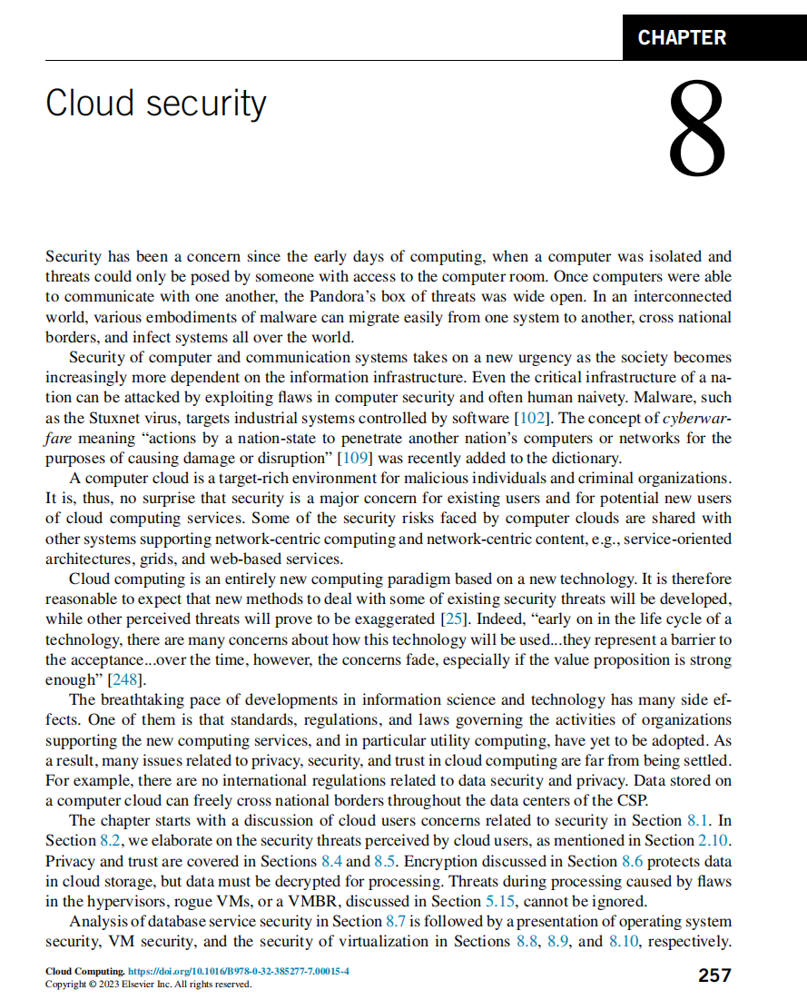

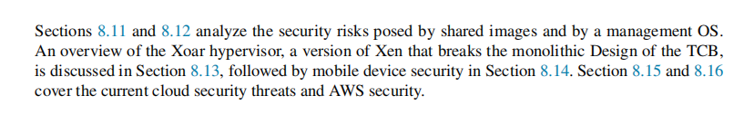

**1\. 标题：云计算安全概览与章节内容导读**

在这一部分课件中，主要介绍了云计算安全（Cloud Security）的重要性、所面临的潜在威胁，以及本章后续各节将要探讨的关键安全议题。整体内容概括了云计算在当今社会所面临的新型安全挑战、常见的风险点，以及本章会涵盖的安全技术与监管问题。通过这些内容，我们能够初步了解为什么云计算安全需要额外关注，以及后续会从哪些角度来详细剖析云计算安全的方方面面。

* * *

**2\. 详细内容与知识点解析**

1.  **云计算安全的背景和威胁概述**
    
    *   \*\*早期计算机安全：\*\*在最初的计算机时代，只有拥有实体访问权限的人才能对系统造成威胁。然而，随着计算机联网与通信的普及，威胁范围从本地扩展到全世界，恶意软件可以轻易跨系统、跨国境传播。
    *   \*\*恶意软件（Malware）与攻击者：\*\*恶意软件，如文中提到的Stuxnet病毒，可以通过利用软件安全漏洞来攻击工业系统。它体现了现代攻击的复杂性和高破坏性，同时也揭示了国家层面的网络战（Cyberwarfare）正成为安全领域的新焦点。“网络战”被文中定义为“一国政府或相关组织渗透另一国家的计算机或网络以达成破坏或扰乱目标的行为”。这一概念反映了网络攻击在国际关系中正在扮演越来越重要的角色。
    *   \*\*云计算环境面临的高风险：\*\*云端的系统通常是黑客或犯罪组织攻击的首选目标（“a target-rich environment”），因为云计算平台集中承载了海量资源和数据，一旦被攻破或利用，其影响范围极广。
2.  **网络与数据基础设施的重要性**
    
    *   \*\*依赖信息基础设施：\*\*随着社会对信息基础设施的依赖日益加深，云计算安全问题也随之升级。例如，传统的计算机系统攻击只是针对单机或局域网，但现在任何对云系统（云数据中心、服务器等）的攻击都可能带来跨国影响。
    *   \*\*法规、标准与法律：\*\*信息科学技术的快速发展使得相关的法律、法规与标准无法立即跟上新型技术和服务模式的变化。尤其在云计算模式下，隐私、数据主权、跨国数据管理都远未达成全球统一的标准，导致出现许多模糊或争议地带。
3.  **云计算的创新与安全挑战**
    
    *   \*\*云计算作为新计算模式：\*\*课件提到，云计算是一种全新的计算范式，人们希望通过新的方法来应对已有的安全威胁，同时也可能夸大对新威胁的担忧。随着云计算在技术和市场上的成熟，早期对云安全的担心会逐渐减弱，尤其是在云带来的价值足够显著的情况下。
    *   \*\*云服务跨国界数据中心：\*\*由于云服务商在不同国家和地区均设有数据中心，数据可以在全球范围内流动，这在技术、合规和法律层面都带来了新的挑战。
4.  **本章（第8章）各节内容概览**
    
    *   **Section 8.1：云用户的安全问题讨论。**  
        这里将对云计算使用者在上云时所面临的一系列威胁进行探讨，包括基础设施安全、应用与数据安全等。
    *   **Section 8.2：云计算威胁进一步讨论（与Section 2.10呼应）。**  
        将具体阐述在网络中心化与服务中心化架构下，云服务所面临的主要威胁是什么，以及这些威胁在云环境下的特殊性。
    *   **Section 8.4 & 8.5：隐私与信任。**  
        在云计算环境中，用户如何保证个人隐私？如何确保云服务商的可靠性和可信度？这两节会着重从信任模型、云服务商资质等角度分析。
    *   **Section 8.6：数据加密。**  
        这里提到了加密对于云端数据保护的关键意义，但也指出了一旦加密数据要被处理，往往需要解密，从而在解密环节又产生新的安全风险。另外还会探讨处理过程中的一些漏洞，如在虚拟化层面（hypervisor、虚拟机等）造成的数据泄露隐患。
    *   **Section 8.7：数据库服务安全分析。**  
        重点讨论在云端数据库使用过程中出现的安全问题，如多租户环境中的数据隔离、数据库访问控制、SQL注入风险等。
    *   **Sections 8.8, 8.9, 8.10：虚拟化安全与系统初始化安全问题。**  
        从虚拟机和虚拟化管理程序（hypervisor）层面讨论云计算安全，包括虚拟机之间隔离不当、管理程序漏洞、以及云系统启动与初始化过程中可能出现的配置风险等。
    *   **Section 8.11 & 8.12：共享镜像、管理操作系统的安全风险。**
        *   共享镜像：很多云平台允许用户在社区或公共库中上传并共享镜像，若镜像中存在后门或恶意软件，则可能影响其他租户。
        *   管理操作系统：云服务提供商所使用的管理层或宿主操作系统，如果出现漏洞或被攻陷，会波及所有在该平台上运行的虚拟机或容器。
    *   **Section 8.13：Xoar hypervisor 介绍。**  
        这是Xen虚拟化技术的一种变体，通过打破传统单体式TCB（Trusted Computing Base）的设计来提升安全性。章节将展示其结构、设计理念，以及在安全性方面的改进。
    *   **Section 8.14：移动设备安全。**  
        随着移动设备与云服务的深度融合，移动端的安全也变得尤为重要。这一节将探讨移动终端如何安全接入云，以及移动应用在云环境中的数据交互安全机制。
    *   **Sections 8.15 & 8.16：当前云安全威胁与AWS安全。**
        *   当下云安全威胁：介绍最新出现的云安全攻击技术与防护趋势。
        *   AWS安全：以Amazon Web Services为例，剖析一个主流云提供商在安全防护策略、合规性以及具体安全功能上的实践与进展。

* * *

**3\. 本次内容总结**

本节内容为第8章“云计算安全”开启了一个宏观讨论。它强调了以下要点：

*   云计算的出现，使得传统的安全威胁在新环境下放大和演变，并带来了跨国管理、法律法规不统一等复杂因素。
*   对于组织和个人用户而言，云端环境在带来灵活性和规模效益的同时，也不可避免地面临更为复杂和严峻的安全挑战。
*   后续章节将依次分析云安全的不同层面，包括网络、隐私、加密、虚拟化、数据库、移动设备等，并以具体的云平台（如AWS）为例进行探讨，让读者对云安全有更完整的认知与实践指导。

整体而言，这部分内容打下了整个云计算安全的思想基础，让我们能够理解为什么云安全议题越来越重要，也清楚了后续需要重点关注的关键技术领域与风险来源。

* * *

**4\. 错误检查**

*   从图片信息来看，内容清晰可见，无明显缺失部分，未发现无法辨认或无法理解的文字。
*   若对后续引用的文献或章节细节需要更深入了解，需要等到后续更具体的图片或文本，但就本次截图内容而言，没有明显漏解或错解之处。

_若对以上内容有任何疑问或希望更深入探讨的部分，可以在后续继续提出。_

# **8.1** **Security—the top concern for cloud users**
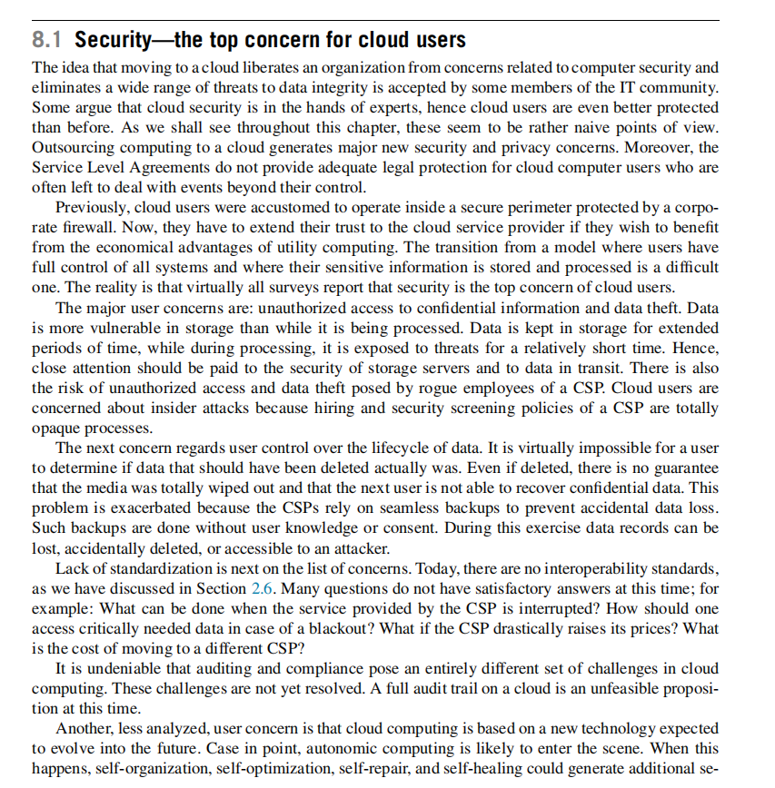

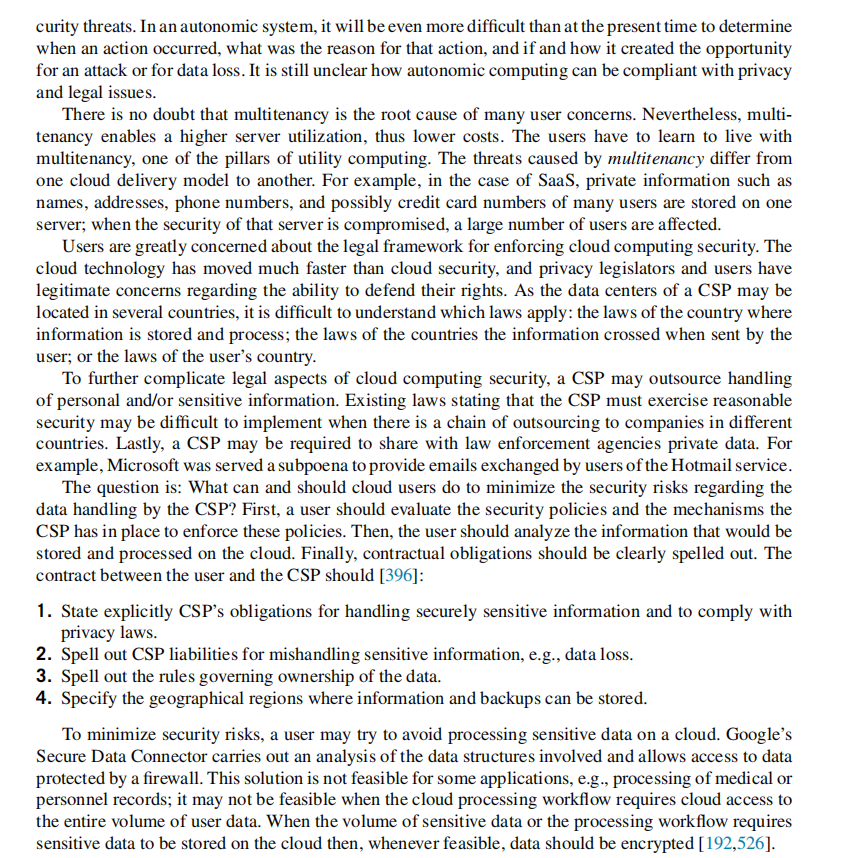

**1\. 标题：云安全：云用户的首要关注点与关键防护措施**

在这一部分课件（第8.1节）中，主要聚焦于云计算使用者在将数据和应用迁移至云端后所面临的安全风险与挑战。与之前介绍的云计算安全宏观背景不同，本节更强调“用户视角”的具体顾虑，包括数据未经授权访问、数据生命周期控制、行业标准缺乏、合规审计困难、多租户环境等问题，同时也探讨了云服务提供商（CSP）在法律与监管层面需要承担的责任，以及用户在签订合同时应当如何约束与明确相关条款。

* * *

### 2\. 详细内容解析

#### 2.1 迁移到云端后是否意味着安全威胁减少？

*   \*\*传统认知的偏差：\*\*有些IT从业者认为，将系统与数据托管给专业的云服务提供商后，安全风险会随之降低。
*   \*\*实际情况：\*\*然而，课件指出，这种观点过于天真，用户依然面临重大安全与隐私风险。服务级别协议（SLA）往往不足以从法律层面完全保护云计算用户。
*   \*\*背景原因：\*\*云计算服务部署在公共网络环境下，面临更广泛、更复杂的攻击面。一旦云端出现安全漏洞，影响范围远大于传统的本地数据中心。

#### 2.2 云用户的首要关注点：未经授权的访问与数据泄露

*   **云端存储与处理时的安全隐患：**
    1.  \*\*数据在存储时：\*\*通常数据会被长时间保存在云端的存储系统，这段时间越长，可能遇到内部或外部恶意攻击的风险也越大。
    2.  \*\*数据在处理时：\*\*处理过程通常相对短暂，但依然有被窃取或篡改的可能性，例如进程间隔离不足、虚拟机逃逸等。
*   \*\*内部威胁：\*\*除了外部黑客，云服务提供商的内部员工（可能存在“恶意员工”或“流氓员工”）也会对用户的数据造成威胁。由于CSP在招聘与内部审查方面往往不透明，用户难以掌握真正的风险。

#### 2.3 数据生命周期与控制权

*   \*\*删除数据的确认难题：\*\*用户很难确认一旦在云端请求删除了数据，该数据是否真的被彻底清除，也无法保证之后的其他租户无法恢复该信息。
*   \*\*无缝备份导致的额外风险：\*\*CSP为了保证用户数据不丢失，往往会进行自动备份。在此过程中，如果没有用户知情或显式同意，一旦这些备份副本被攻击者或内部员工获得，用户也将失去对数据安全的掌控。
*   \*\*数据在意外或故障场景下的可访问性：\*\*有时数据可能被错误地删除、意外丢失或被攻击者加密勒索，用户对其在云中到底如何被恢复以及恢复版本的完整性也难以验证。

#### 2.4 标准化和合规难题

*   \*\*缺乏统一标准：\*\*云计算领域尚未形成正式且广为接受的全球性标准或协议（在2.6节也有提到），因此很多跨国或跨机构的云安全问题仍未得到满意解决。例如：
    *   当CSP的服务突然中断或发生大规模故障时，用户应如何紧急访问关键业务数据？
    *   CSP如果临时或随意上涨价格怎么办？
    *   不同国家和地区之间的数据流动受到怎样的法律监管？
*   \*\*审计与合规挑战：\*\*在云中做全面审计相对复杂，因云环境多租户、动态伸缩以及跨国界部署，想要严格追踪每一次访问和操作具有极高难度，而且合规性标准也可能随着数据跨境而变得不一致。

#### 2.5 多租户（Multitenancy）带来的风险

*   \*\*根源：\*\*多租户是云计算可以实现高资源利用率和低成本的关键技术之一。然而也正因为如此，多个用户会共享同一物理或虚拟化环境；一旦其中某个租户的安全层被攻破，攻击者可能利用漏洞间接访问其他租户的敏感信息。
*   \*\*示例：\*\*SaaS模式下，同一云服务器上可能存放了大量个人隐私信息（例如姓名、地址、电话、信用卡号等），一旦服务器被攻陷，就会同时影响到许多用户。

#### 2.6 法律框架与跨国监管

*   \*\*云计算速度快于立法速度：\*\*云技术发展非常迅速，但立法和隐私保护立法往往滞后，用户难以及时寻求法律保护或维权。
*   \*\*数据位置的法律适用难题：\*\*CSP的数据中心分布在多个国家，可能出现“数据在哪个国家存储、哪个国家的数据法律有效”的问题。
    *   如果用户在A国，CSP在B国，实际存储设施又在C国，那么在发生纠纷或安全事故时，应适用何种法律？
*   \*\*外包与执法部门需求：\*\*CSP本身也可能将部分运营外包给其他国家的公司；此外，CSP可能在执法机构的要求下提供用户数据（如著名案例：微软Hotmail被要求配合调查），使用户数据在法律层面可能受到不同方向的冲击。

#### 2.7 用户应如何应对？（对CSP的安全要求和自身措施）

*   **用户自我审查与评估：**
    1.  \*\*评估CSP的安全策略：\*\*详细审查CSP在数据保护和威胁防御方面的实践。
    2.  \*\*分析自己的数据类型：\*\*明确哪些数据会在云端存储和处理，哪些数据必须本地保持控制或采用更高级别的加密方案。
    3.  \*\*在合同中明确CSP的责任：\*\*参考文献\[396\]中指出的四点：
        1.  明确CSP对于敏感信息处理和遵守隐私法规的义务。
        2.  规定CSP在敏感数据丢失或处理不当时的责任和赔偿机制。
        3.  约定数据归属权（所有权）和访问权限的规则。
        4.  明确信息和备份存储的地理位置，以符合所在地区的法律合规要求。
*   **最小化风险的技术措施：**
    *   尽量避免在云端处理高度敏感的数据，或采用诸如“安全数据连接器（Secure Data Connector）”等技术；
    *   对必须放在云端的数据进行加密，确保即使发生数据泄露，攻击者也难以直接读取明文内容；
    *   结合访问控制和日志审计，如果满足应用场景需要，可以实现最基本的违规追踪与安全告警。

#### 2.8 云计算的未来：自主式计算（Autonomic Computing）与安全

*   \*\*自主式计算：\*\*文中提及，随着云计算和自动化技术的演进，自主式计算（在发生事件时自动做出决策和调整）可能成为下一个趋势。但其带来的挑战在于：
    *   当系统自行做出安全决策时，用户更难追踪或理解行为的原因，这也给数据追踪和责任认定带来难题；
    *   尚不清楚自主式计算在隐私和合规层面将如何结合现有的法律要求。

* * *

### 3\. 本次内容的整体总结

*   \*\*云用户对安全的关注点：\*\*主要围绕数据的存储、处理、传输过程中的保密性与完整性，以及对内部威胁、多租户风险、缺乏国际标准和跨国法律合规等问题的担忧。
*   \*\*合规与法律难点：\*\*云计算的快速发展超越了现行隐私与安全法律的反应速度，跨国界的数据流动进一步放大了监管难度。
*   **应对策略：**
    1.  用户要在合同层面明确CSP的安全责任与义务。
    2.  避免将最敏感的核心数据完全托管到云端，或进行高级加密与访问控制。
    3.  持续关注并评估CSP的安全能力与内部审计流程，警惕因多租户模式带来的隐含威胁。
*   \*\*展望：\*\*随着云计算向高度自动化、自主化方向发展，安全保障与隐私保护也面临新的技术与合规挑战。本节为后续更深入的云安全机制讨论提供了一个“用户需求与担忧”的视角。

* * *

### 4\. 报错与补充说明

*   \*\*可见性与完整度：\*\*从本次图片内容来看，文字较为清晰，没有明显缺失或无法辨别的内容。
*   \*\*若需更深入细节：\*\*可在后续章节或更具体的课件里查看CSP的安全模型及相应的技术实现案例。当前已对本图涉及的要点进行了完整概述和详细解析。

若对以上任何概念或条目有进一步疑问，欢迎随时提问。

# **8.2**.1 **Cloud security risks**

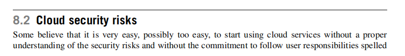

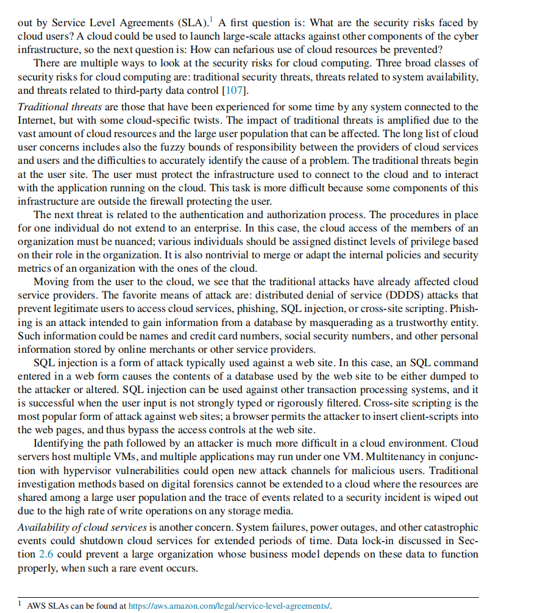

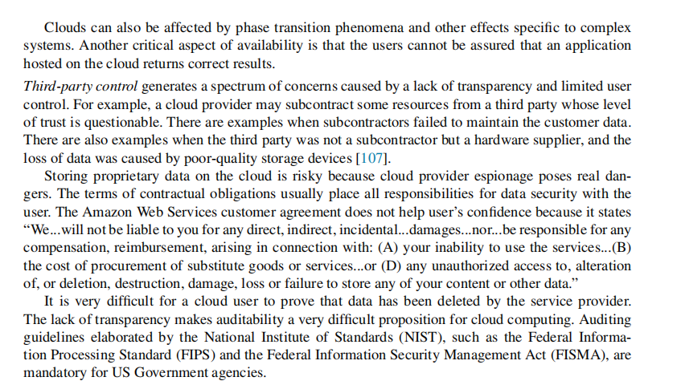

**1\. 标题：云端安全风险解析：传统威胁、可用性挑战与第三方数据控制**

本节（8.2）围绕“云计算安全风险”展开，重点分析了云计算环境中用户与服务提供商可能忽视或低估的各种风险类型。文中将云安全风险大体分为三类：传统安全威胁、系统可用性相关威胁，以及第三方数据控制带来的风险。并通过具体案例与实践条款（如AWS的服务协议）剖析了云用户在实际使用中可能面临的种种问题。

* * *

2\. 详细内容与知识点解析
--------------

### 2.1 缺乏对云安全风险的充分理解

*   \*\*起因：\*\*许多企业或个人在使用云服务时，往往对安全威胁和用户自身应尽的责任认识不足，也可能未仔细审阅服务级别协议（SLA）中约定的条款。
*   \*\*潜在后果：\*\*导致用户盲目信赖云平台，以为将数据和计算迁移到云端就能“彻底摆脱安全烦恼”，实际却面临更复杂的安全环境。

### 2.2 云安全风险的三大分类

1.  **传统安全威胁（Traditional Security Threats）**
    
    *   \*\*背景：\*\*此类威胁原本就存在于任何连接互联网的系统之中，在云计算场景下规模和影响更大。
    *   **特点：**
        *   \*\*模糊的责任边界：\*\*云服务提供商（CSP）与用户之间对问题来源的认定和排查更加困难，尤其当云端基础设施由CSP掌控，而应用环境由用户自己管理时；
        *   \*\*防火墙外延伸：\*\*用户必须自行保护从本地至云端的连接通道和部署的应用组件，难度超过传统单一内网环境；
        *   \*\*传统攻击手段：\*\*分布式拒绝服务（DDoS）、网络钓鱼（Phishing）、SQL注入（SQL Injection）、跨站脚本攻击（XSS）等仍然是针对云服务最常见的攻击方式。
        *   **SQL注入和XSS示例：**
            *   SQL注入：通过注入恶意SQL语句窃取或篡改数据库中的信息；
            *   XSS：在Web页面或用户输入接口中插入恶意脚本，获取用户机密或篡改前端显示。
        *   \*\*取证难度高：\*\*云环境中，主机上会运行多个虚拟机（VM），多个应用也可能同处于一台VM之内；同时云端日志通常分散在不同层级，取证追踪更复杂。
2.  **可用性相关威胁（Threats to System Availability）**
    
    *   \*\*系统与电力故障：\*\*云数据中心的停机或网络中断会造成大面积服务不可用，影响业务连续性。
    *   \*\*Data lock-in（数据锁定）：\*\*如果用户所依赖的云平台出现严重宕机或直接退出市场，用户的数据和应用短期内可能无法迁移到其他平台，导致陷入被动。
    *   \*\*复杂系统效应：\*\*云环境规模庞大且复杂，容易受到诸如“相变效应（phase transition phenomena）”等系统性故障的影响，一旦出现大规模崩溃，恢复时间及结果不可预测。
    *   \*\*正确性保证：\*\*在云端无法100%确保应用结果的正确性，比如某些故障或服务降级情况下，用户可能拿到错误输出，但自身却难以及时发现。
3.  **第三方数据控制的风险（Third-Party Data Control）**
    
    *   \*\*多重外包与透明度不足：\*\*CSP可能将部分基础设施或服务再次外包给第三方，但用户对此几乎没有透明度，无法判断第三方供应商的安全水准；
    *   \*\*硬件供应商失误：\*\*曾出现硬件供应商质量或管理不善导致用户数据丢失的案例；
    *   \*\*云端储存机密数据的间谍风险：\*\*将专利、商业机密、核心技术等存储在云端，若遭遇恶意攻击或内部人员泄密，会造成巨大损失；
    *   \*\*不利的法律条款：\*\*如课件引用的AWS服务协议案例：“我们（AWS）不对直接、间接、附带性……的损害负任何责任……” 此类条款往往使CSP将绝大部分责任转嫁给用户；
    *   \*\*缺乏审计可行性：\*\*云环境中的日志和资源分布庞杂，且CSP出于商业机密或隐私原因，不一定向用户开放完整审计接口。用户很难对云端执行审计或验证数据被真实删除。

### 2.3 具体攻击手段与示例

*   \*\*DDoS攻击：\*\*通过大量伪造请求占用云资源，使合法用户无法正常访问云服务。
*   \*\*网络钓鱼：\*\*借助伪装网站或邮件，引诱用户输入机密信息（如信用卡号、登录凭证等）。
*   \*\*SQL注入：\*\*在Web表单或其他输入字段插入恶意SQL语句，进而访问或篡改数据库。
*   \*\*跨站脚本（XSS）：\*\*利用网站输入验证不当，将恶意脚本注入到合法页面中执行。

这些手段在云环境中变得更加危险，因为一旦云平台受到攻击，覆盖的用户与数据范围会极为庞大。

### 2.4 云计算中的责任划分与SLA问题

*   \*\*SLA中的现实：\*\*通常CSP会在服务协议中规避自身在安全与数据丢失方面的法律责任，把安全的主要责任留给用户。
*   \*\*用户角度：\*\*若对协议缺乏重视或不了解“Shared Responsibility Model”（云计算的责任共担模型），可能导致在事发后维权困难。
*   \*\*合规与标准：\*\*如美国的NIST（国家标准与技术研究院）出台了一些云安全规范（FIPS、FISMA等），在政府机构环境中要求CSP必须达到某些合规要求，但在商用云环境中尚无全球统一标准。

### 2.5 面对云安全风险的关键思考点

1.  \*\*识别云服务及其潜在外包方的安全资质：\*\*了解是否有第三方服务的介入，评估他们的安全能力与可靠性。
2.  \*\*加大审计与监控：\*\*在CSP允许的范围内尽量布设日志管理、监控报警机制，并定期进行安全性评估。
3.  \*\*数据保护策略：\*\*对核心敏感数据进行加密或保留在私有环境中，尽可能降低被外泄的风险。
4.  \*\*应急预案和数据迁移能力：\*\*在SLA中明确数据所有权、备份与迁移条款，以便遇到CSP服务故障或纠纷时，能快速迁移数据至其他平台。

* * *

3\. 本次内容总结
----------

*   \*\*风险分类：\*\*云安全威胁可从“传统威胁”“可用性威胁”“第三方数据控制”三个角度来理解。其中，多租户环境、DDoS、钓鱼、SQL注入、跨站脚本等是最为常见的攻击方式。
*   \*\*可用性与数据锁定：\*\*一旦云服务出现大规模故障或违约，用户对于数据与应用的可持续访问可能受到严重影响。
*   \*\*第三方外包导致的透明度低：\*\*CSP可能在不透明的外包体系中引入新的风险，同时也在SLA条款中把责任转嫁给用户，削弱用户对自身数据安全的掌控能力。
*   \*\*策略与建议：\*\*在选择云服务前，用户需深入评估CSP的安全措施与外部依赖，并在合同中明确数据所有权与审计权。对于关键业务数据，应采取加密或保留关键部分在私有环境中，同时建立完善的应急和迁移预案。

* * *

4\. 报错与补充说明
-----------

*   \*\*图片中内容识别：\*\*当前截图文字清晰，信息传达完整。对文中的引用如\[107\]以及具体AWS条款示例未做深入展开，可在后续章或文献中进一步了解。
*   \*\*若有细节需要特别关注：\*\*可在后续讨论中结合实际云服务案例或更多技术细节（如虚拟化层安全、容器安全、零信任模型等）做更深层次分析。
*   本次解读基于截图信息，如有更多原文页或其他章节引用，可进一步补充。

# **8.2**.2 **Cloud security risks**
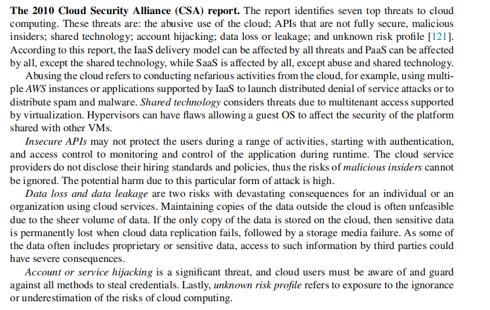

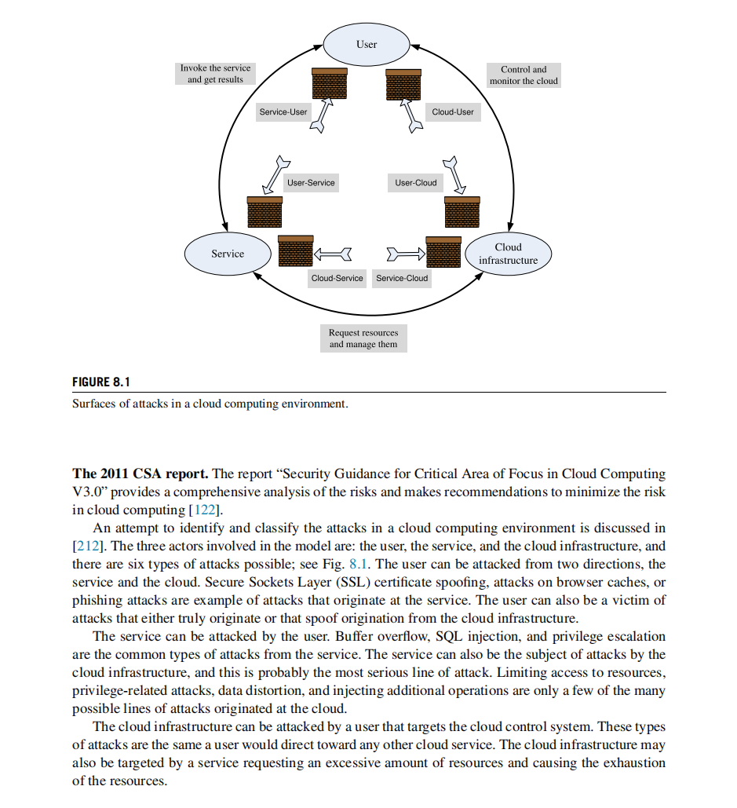

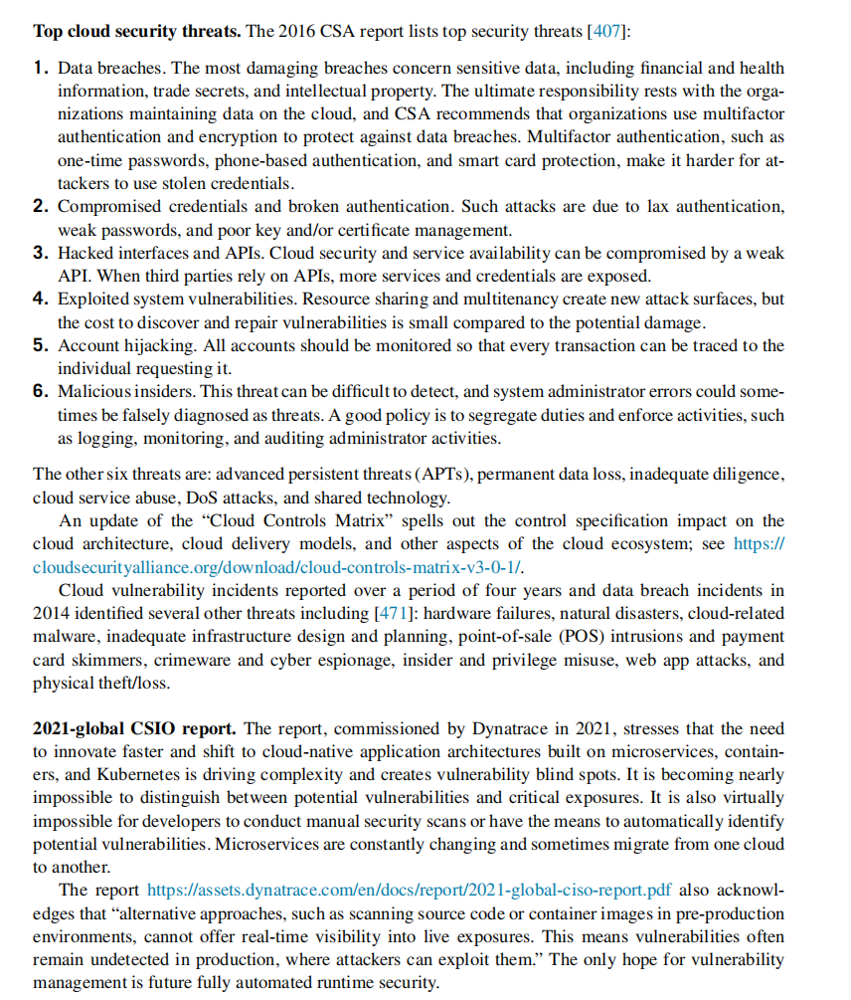

**1\. 标题：云安全威胁的演进与CSA报告要点解析**

在本次课件的内容中，我们重点关注云安全联盟（Cloud Security Alliance，简称CSA）在不同年份发布的云计算安全报告，以及对云计算攻击面（attack surfaces）的分类与分析。CSA每隔一段时间都会根据行业现实和调研结果更新安全威胁的清单、提出针对性的安全建议，这些报告为企业和个人用户理解与应对云安全风险提供了重要参考。

* * *

2\. 详细内容与知识点解析
--------------

### 2.1 2010年CSA报告：七大云安全威胁

2010年云安全联盟报告列出了当时业界公认的**七个最主要的云安全威胁**：

1.  **Abusive use of the cloud（对云服务的滥用）：**
    *   指利用云计算平台的巨大弹性与可伸缩性来从事恶意活动，如攻击者使用AWS或其他IaaS平台的大量实例发起DDoS攻击、传播垃圾邮件或恶意软件。
    *   IaaS模式在此类攻击中最为常见，因为用户可以直接获得对虚拟机的广泛控制权。
2.  **Insecure APIs（不安全的API）：**
    *   从身份验证、访问控制到应用运行时监控，云服务通常依赖API接口来供用户或其他服务调用。
    *   如果API缺乏严格的安全策略（如加密、鉴权、输入验证），就会被恶意者利用。
    *   同时，云服务提供商一般不公开内部安全标准或做法，使得攻击者更容易利用API漏洞。
3.  **Malicious insiders（恶意内部人员）：**
    *   CSP内部员工可能存在“内鬼”，他们对云基础设施或用户数据拥有较高权限；
    *   因为内部审查和背景调查不透明，用户难以预判或预防此类风险。
4.  **Shared technology vulnerabilities（共享技术漏洞）：**
    *   多租户环境下，共享底层虚拟化技术（如Hypervisor）或容器层一旦出现漏洞，攻击者可通过一个租户的虚拟机入侵到宿主机，进而威胁其他租户的数据与应用。
    *   IaaS与PaaS尤为明显，因其依赖虚拟化或容器化来实现资源隔离；SaaS也会有共享层，但影响程度略不同。
5.  **Account hijacking（账户劫持）：**
    *   盗取云账户后，攻击者可冒充用户进行恶意行为，如窃取机密数据、利用云资源进行非法挖矿等。
    *   常见手法包括钓鱼（phishing）、暴力破解、撞库或在弱口令情况下的尝试登录。
6.  **Data loss or leakage（数据丢失或泄露）：**
    *   一旦云端是唯一存储副本，那么若发生存储系统故障、复制机制失效或人为删除，数据可能永久丢失；
    *   数据泄露也极其严重，可能导致企业核心机密、知识产权或个人隐私瞬间曝光。
7.  **Unknown risk profile（未知风险状况）：**
    *   指的是用户或组织在使用云服务时，对CSP的安全策略、架构、外包流程等知之甚少，一些潜在风险根本没有纳入评估；
    *   使得企业或个人在决策时实际上处于“信息盲区”，对真实风险的估计不足或忽视。

**IaaS**更易受到上述全部威胁影响，**PaaS**同样可能受大多数威胁波及（主要还是共享底层与恶意使用等问题），而**SaaS**则在“滥用云服务”和“共享技术漏洞”这两个方面的风险相对较低，但仍会面临其他威胁。

* * *

### 2.2 攻击面分析：Figure 8.1

课件中的**Figure 8.1**展示了云计算环境中各个可能成为攻击起点与目标的交互面（attack surfaces）。

*   \*\*三个主要角色：\*\*用户（User）、服务（Service）以及云基础设施（Cloud infrastructure）。
*   **攻击可能性：**
    1.  **用户可能被攻击**：攻击来自于服务端（例如服务器被入侵后反向攻击、伪造SSL证书、浏览器缓存注入等）或来自云端基础设施本身。
    2.  **服务可能被攻击**：例如用户恶意利用SQL注入、缓冲区溢出或权限提升等方式攻击服务；服务还可能受到云基础设施发起的攻击（如系统漏洞或被攻陷的虚拟化层导致服务可被篡改）。
    3.  **云基础设施可能被攻击**：通常是用户对云控制系统的恶意利用，或者与其他云服务互相攻击，造成资源枯竭、大规模宕机等。

从图中可以看出，**请求资源与管理资源**、**访问服务并获取结果**以及**监控与控制云**等环节都可能成为潜在的攻击链路。而且越是复杂的云生态，越容易产生新的攻击面。

* * *

### 2.3 2011年CSA报告：安全指导与风险最小化建议

在2011年的报告《Security Guidance for Critical Area of Focus in Cloud Computing V3.0》中，CSA提出了更完善的云计算风险分析模型与最小化风险的建议，包括：

*   建立从用户到服务、从服务到云基础设施的多层安全策略；
*   在应用开发和部署环节加强安全评估，如对API、认证和数据传输进行加密；
*   完善日志审计机制，确保在出现安全事件时能够追溯责任与实现取证。

文中提及，云计算的\*\*三方交互（User—Service—Cloud）\*\*都可能存在攻击行为或受到攻击的威胁，强调了对每一个链路、协议和接口都需要进行审慎的安全设计与监控。

* * *

### 2.4 2016年CSA报告：十大云安全威胁

课件给出了**2016年CSA报告**中列出的十大云安全威胁，其中前五大威胁为：

1.  **Data breaches（数据泄露）**
    *   涉及敏感数据（金融、健康、知识产权）被盗；
    *   CSA建议：采用多重身份认证、加密存储及传输、严格访问控制等措施，最大程度降低泄露发生的可能性。
2.  **Compromised credentials and broken authentication（凭证泄露与身份认证失效）**
    *   如使用弱口令、不当的密钥或证书管理；
    *   攻击者可利用被盗凭证直接登陆云端系统。
3.  **Hacked interfaces and APIs（接口和API遭受攻击）**
    *   若API的权限设置、密钥管理或输入输出验证不到位，黑客可通过不安全API获得访问权限或中断服务。
    *   第三方集成的API也可能引入新的攻击面。
4.  **Exploited system vulnerabilities（系统漏洞被利用）**
    *   多租户和资源共享放大了漏洞带来的影响，攻击者可利用虚拟化层缺陷、容器逃逸等方式扩大破坏范围；
    *   相比潜在损失，补丁与修复成本其实很小，但需要CSP和用户共同执行。
5.  **Account hijacking（账户劫持）**
    *   要求对所有账户进行监控，确保任何行为都可审计到具体的使用者；
    *   包括多种方式劫持账户，如社工、钓鱼、漏洞利用、弱口令等等。

后续还提到了**APT（高级持续性威胁）**、**永久性数据丢失**、**缺乏尽职调查**、**云服务滥用**、**DoS攻击**及**共享技术**等其他关键威胁。

**Cloud Controls Matrix (CCM)** 是CSA推出的控制规范表，帮助用户对照云架构、云交付模型、云生态系统等各方面安全控制要求，从而有针对性地实施安全策略。

* * *

### 2.5 2021年Global CSIO报告：动态云原生架构的挑战

在本节最后，课件提到了**2021年由Dynatrace委托发布的全球CISO报告**，突出强调了：

*   **云原生架构的快速发展**（微服务、容器、Kubernetes等）大幅增加了系统复杂度与漏洞风险；
*   许多漏洞只有在生产环境才会显现出来，事先扫描代码或在预生产环境测试难以全面发现；
*   随着微服务和组件“动态迁移”与“频繁更新”，要想在整个生命周期里保持高水平安全十分困难；
*   报告指出，**自动化运行时安全**（fully automated runtime security）可能是未来的主流方向之一，使得系统能够在运行阶段自动检测和防范未知漏洞或攻击尝试。

**结论要点：**

*   传统“上线前”安全审查模式不足以应对动态云原生环境；
*   安全检测和防护需要贯穿整个DevOps流程，应用自动化、持续监控与响应技术，实现安全左移与右移兼顾（DevSecOps概念）。

* * *

3\. 本次内容总结
----------

1.  **威胁的不断演变**：从2010年的七大威胁到后续报告的十项威胁，再到云原生时代对自动化防护的需求，云安全风险呈现动态上升和多样化的趋势。
2.  **多层安全需求**：用户（身份认证、凭证管理、API安全）、服务（代码安全、SQL注入防范、平台漏洞修复）以及云基础设施（虚拟化隔离、多租户管理、资源调度）都需要有针对性的安全策略。
3.  **联合治理与shared responsibility（共同责任模型）**：组织与CSP需要在合同或SLA层面明确安全职责，用户也应对自身应用和数据负责，包括加强密钥管理、身份认证、加密传输等。
4.  **新技术与攻击面的挑战**：微服务、容器和跨云或混合云部署引入了新的复杂度，要求安全工具和管理模式能适应“持续交付、动态变更”的特性。

通过CSA不同年份报告和各类安全事件的汇总分析，可以看到云安全并非一劳永逸，需要持续跟踪最新研究和攻防动态，不断更新云安全防护措施。

* * *

4\. 报错与补充说明
-----------

*   **当前截图信息量较大，但主要聚焦在CSA各年度报告的核心威胁与总结**，并引用了一些示例性攻击手段和防护建议。
*   \*\*内容完整度：\*\*目前未发现明显缺失或不可识别部分，引用文献\[407\]、\[471\]、\[212\]等在截图中仅提供了链接或简要描述，若需更深入细节，可参考CSA官网或相应报告的原文。
*   若对特定威胁、CSA的控制矩阵或自动化安全方案有更多疑问，可在后续继续讨论。

# **8.3** **Security as a service (SecaaS)**
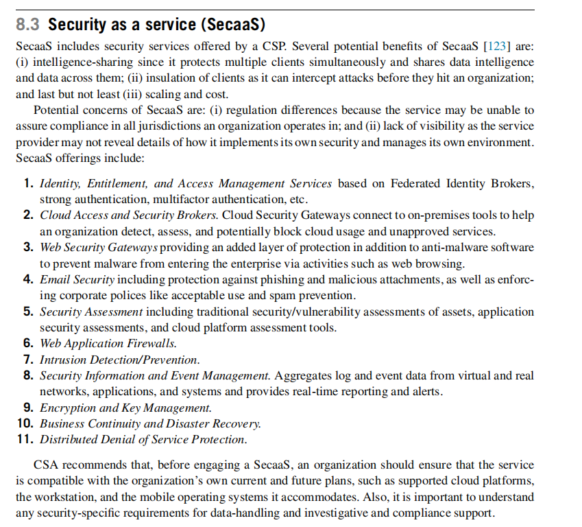

**1\. 标题：云端安全服务（SecaaS）的模式与核心功能解析**

在这一部分（8.3节）中，课件重点介绍了“Security as a Service (SecaaS)”——即由云服务提供商（CSP）提供的各类安全功能和解决方案。SecaaS的概念与传统本地安全部署有所不同，它利用云端的规模效应、实时情报共享及集中化管理等特性，为企业或个人提供全方位的安全防护。

* * *

2\. 详细内容与知识点解析
--------------

### 2.1 SecaaS的定义与潜在优势

1.  **什么是SecaaS？**
    
    *   \*\*SecaaS（Security as a Service）\*\*是指云服务提供商在云端为用户提供各类安全服务的模式。用户不需要自己在本地部署或维护大量安全设备与软件，而是通过网络使用CSP的安全功能。
2.  **主要潜在优势**
    
    1.  **情报共享（Intelligence-Sharing）：**
        *   SecaaS服务商通常同时服务多个客户，可实时收集、分析海量安全事件和威胁情报，将所获取的防护经验与攻击模式识别快速应用到所有客户的防护体系。
    2.  **隔离攻击（Insulation of clients）：**
        *   当SecaaS检测到对某个组织或用户的攻击，可以及时拦截并在更广范围内阻止类似攻击的蔓延。
    3.  **弹性伸缩与成本优化（Scaling and Cost）：**
        *   使用云端安全服务意味着不用一次性投入大量安全设备（如硬件防火墙、入侵检测系统），并可随业务需求动态调整安全服务规模，从而节省成本。

### 2.2 SecaaS的潜在顾虑与挑战

1.  **监管与合规（Regulation differences）：**
    *   由于企业可能在多个司法辖区运营，不同国家/地区的法律法规对数据隐私和安全的要求不尽相同。SecaaS提供商是否能够满足所有地区的合规要求，仍存在不确定性。
2.  **可见度不足（Lack of visibility）：**
    *   用户无法深入了解SecaaS提供商的内部安全措施及运维环境，无法确定其风险管控水平，也难以进行内部审计或取证调查。

### 2.3 SecaaS的主要功能类别

课件列出了SecaaS常见的11种服务或功能模块，每个模块都可被视为一个独立的安全服务，也可组合为整合式一站式安全解决方案。具体如下：

1.  **Identity, Entitlement, and Access Management Services（身份、授权与访问管理服务）**
    
    *   典型特性：基于联合身份认证(Federated Identity)、多因素认证(MFA)、单点登录(SSO)等，为用户提供更安全、灵活的访问控制策略。
    *   通过统一账户管理，减轻企业在本地维护繁琐身份体系的负担。
2.  **Cloud Access and Security Brokers（CASB，云访问与安全代理）**
    
    *   通过在企业内部工具与云服务之间建立“安全网关”，检测和阻止未经授权的云使用或服务访问。
    *   帮助企业识别“影子IT”（员工私自使用的云服务）并进行风险评估和政策管控。
3.  **Web Security Gateways（Web安全网关）**
    
    *   在网络访问层面提供多一层防护，例如拦截恶意网站、在线病毒检测、针对浏览器活动的安全过滤。
    *   通常与传统的反病毒软件结合使用，避免恶意流量进入企业网络。
4.  **Email Security（电子邮件安全）**
    
    *   防御网络钓鱼、过滤恶意附件、执行公司策略（如垃圾邮件与内容过滤、禁止违规行为等）。
    *   保障电子邮件往来安全，也可与数据加密相结合，确保敏感邮件内容的保密性。
5.  **Security Assessment（安全评估）**
    
    *   包含传统安全或漏洞评估、应用安全测试、平台评估等多种评估手段。
    *   可针对企业资产或云平台本身做渗透测试、配置审计、漏洞扫描等，及时发现薄弱点。
6.  **Web Application Firewalls（WAF，Web应用防火墙）**
    
    *   专门针对Web应用层的防护，阻断SQL注入、跨站脚本攻击(XSS)、路径遍历等常见Web安全风险。
    *   通过规则或智能分析过滤恶意请求，保护Web服务器资源。
7.  **Intrusion Detection/Prevention（入侵检测/防御）**
    
    *   监控云中或混合环境中的网络与系统活动，实时发现异常或可疑行为，并执行拦截或报警。
    *   IDS/IPS通常会与其他安全服务(如SIEM)联动，形成统一的安全监控体系。
8.  **Security Information and Event Management（SIEM，安全信息与事件管理）**
    
    *   汇总并关联来自虚拟、物理网络和各类应用系统的日志与事件信息，提供实时报告、预警和可视化。
    *   便于安全运营团队对整个系统安全态势进行集中管控与快速响应。
9.  **Encryption and Key Management（加密与密钥管理）**
    
    *   提供数据在传输和存储过程中的加密功能，以及安全的密钥生命周期管理（生成、分发、存储、销毁）。
    *   一些CSP允许客户自带密钥（BYOK），提升对敏感数据的掌控度。
10.  **Business Continuity and Disaster Recovery（业务连续性与灾难恢复）**
        
    *   利用云端冗余与备份方案，为企业提供高可用性和快速恢复选项。
    *   当本地发生灾难（自然灾害或系统崩溃等）时，SecaaS能帮助业务快速切换到云上备用环境。
11.  **Distributed Denial of Service Protection（DDoS防护）**
        
    *   通过全球流量清洗中心或高弹性网络架构来缓解大规模DDoS攻击，确保服务可用性。
    *   结合实时监控和自动化应急策略，将攻击流量进行分流或阻断。

### 2.4 使用SecaaS的关键建议

\*\*CSA的建议：\*\*在使用SecaaS之前，企业需确认以下事项：

1.  服务与自身业务现状和未来规划是否兼容，包括要适配的操作系统、所使用的云平台等。
2.  清晰了解SecaaS对数据处理和合规审计的要求，确认是否符合企业所在行业或国家的相关监管规则。
3.  弄明白组织需承担的安全责任与SecaaS提供商负责的边界，确保数据处理过程、取证需求、合规报告等方面有明确约定。

* * *

3\. 本次内容总结
----------

本节围绕“云安全即服务”展开讨论，核心要点包括：

*   **SecaaS的本质**：将各类安全功能转移到云端，通过CSP或专门的安全厂商提供服务，用户以“按需使用”方式获取相应安全能力。
*   **多元化安全功能**：从身份管理到网络防护、从评估审计到业务连续性与灾备，再到DDoS防护和数据加密，几乎覆盖了企业安全生态的方方面面。
*   **优势与顾虑并存**：SecaaS能提升整体安全弹性、降低成本，但在合规性、多地区运营、用户可见度方面仍存在风险和不确定性。
*   **部署前的建议**：企业应在使用SecaaS之前，详细审查并测试其与自身安全需求与合规要求的适配度，同时明确合同条款中各方责任。

* * *

4\. 报错与补充说明
-----------

*   **图片清晰可读，无明显缺失信息**。如需更深度了解各项SecaaS服务的技术原理或配置细节，可参考CSA相关文档或具体CSP提供的白皮书。
*   本次解读基于截图内容，若有更多原始文献引用，可在后续补充。

整体而言，本节为我们阐述了SecaaS在云安全领域的重要角色，以及用户在使用前需要考量的关键要点，让读者对“安全即服务”这一模式有了更加系统和具体的认识。

## 
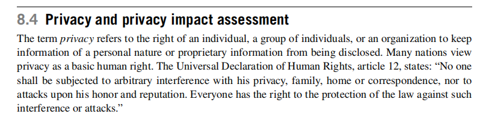

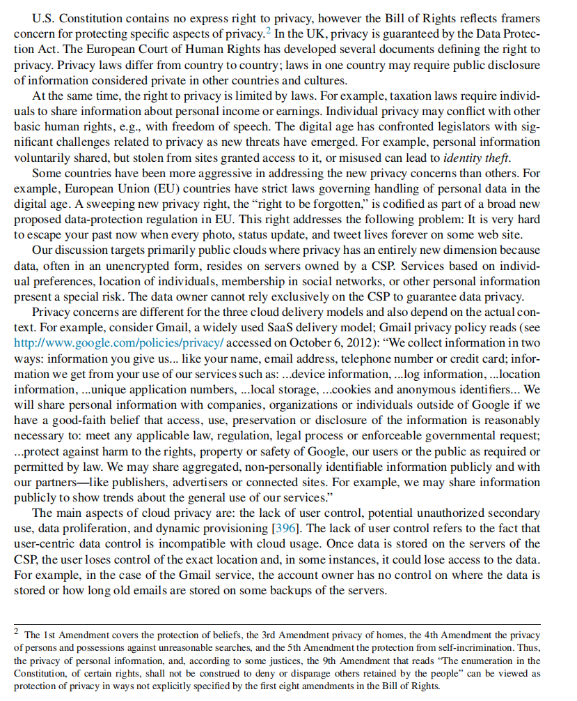

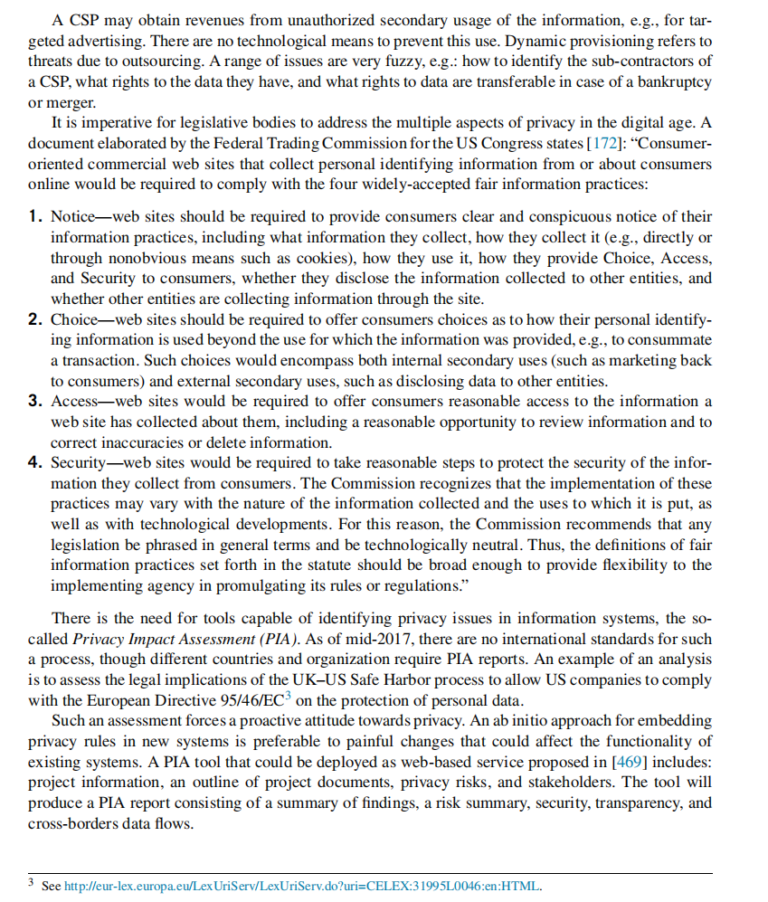

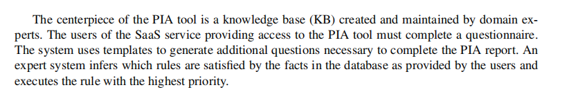

## Response:
推理关于云安全威胁分析，持续 4 秒

**1\. 标题：云计算环境中的隐私概念与隐私影响评估（PIA）解析**

在本节（8.4）内容中，主要探讨了“隐私（Privacy）”在云计算环境下所面临的挑战，包括不同国家和地区对隐私权的法律界定和保护方式，以及在数字时代背景下衍生的新问题。随后，课件介绍了“隐私影响评估（Privacy Impact Assessment，PIA）”这一工具，用于事先识别和评估信息系统（特别是云环境）中的潜在隐私风险，并提出改进方案。

* * *

2\. 详细内容与知识点解析
--------------

### 2.1 隐私的定义与法律溯源

1.  **隐私的基本含义**
    
    *   隐私（Privacy）是指个人、群体或组织对其个人性质或专有信息的自主控制权；即能够决定何时以及以何种方式对外披露这些信息。
    *   《世界人权宣言》第12条明确指出，任何人不应受到对私生活、家庭、通信及名誉的无端干涉和攻击，人人都有受到法律保护的权利。
2.  **不同国家/地区法律差异**
    
    *   \*\*美国：\*\*尽管《宪法》未直接明文写出“隐私权”，但《权利法案》数项修正案（如第1、3、4、5、9修正案等）往往被解读为对某些隐私方面的保护。
    *   \*\*英国：\*\*有《数据保护法》（Data Protection Act）来保障个人数据的合法处理。
    *   \*\*欧洲：\*\*欧洲人权公约（European Court of Human Rights）以及EU各国严格的隐私和数据保护法规（如“被遗忘权”及GDPR），对个人数据的收集、使用和跨境传输有更明确且严格的要求。
    *   \*\*法律冲突：\*\*不同地区可能对“公开或保密哪些信息”有不同的规定，跨国云服务面临合规风险。
3.  **数字时代的新挑战**
    
    *   个人信息可能在社交网络、云端应用等平台被自愿或不自觉地分享；若被黑客盗取或公司滥用，易导致**身份盗窃**或其他严重后果。
    *   一些地区立法者尝试制定新的隐私法规，比如欧盟的“被遗忘权”，允许个人请求移除过往发布的数据（如照片、状态更新、推文等），但在分布式的互联网环境中实际执行难度很大。

* * *

### 2.2 云环境下的隐私关注点

1.  **公共云中的隐私**
    
    *   数据往往处于未加密或半加密状态，被存放于云服务提供商（CSP）的服务器上；
    *   对于用户来说，仅依赖CSP本身远不足以保证隐私安全。
2.  **典型SaaS示例：Gmail隐私策略**
    
    *   课件引用了Google在2012年的隐私条款，提到收集的信息（如姓名、电子邮件、电话、设备信息、Cookies、位置等），以及在满足法律或内部需要时可能与第三方分享。
    *   这说明SaaS服务广泛收集用户数据，用于系统改进、广告或其他用途，用户本身难以掌控数据的具体使用方式。
3.  **云隐私的四大关键方面（文献\[396\]）**
    
    *   \*\*缺乏用户控制（Lack of user control）：\*\*数据一旦上传到云端，用户无法决定准确的存储位置，也有被CSP或其外包商调度、复制的风险；
    *   \*\*潜在的未授权二次使用（Potential unauthorized secondary use）：\*\*CSP可能在用户不知情或未授权的情况下，用用户数据谋取商业利益（如定向广告）；
    *   \*\*数据扩散（Data proliferation）：\*\*云环境中的多副本存储、备份、跨区域同步，使得数据分散在不同地域，用户更难保证安全与合规；
    *   \*\*动态调度（Dynamic provisioning）：\*\*云端服务会动态地为应用分配或回收资源，可能涉及跨区域或多租户共用基础设施，进一步增加监管难度。
4.  **其他实际问题**
    
    *   CSP可能因外包或合作，引入对用户数据的进一步访问；
    *   法律边界模糊：CSP破产、合并或重组时，用户的数据权益如何得到保障？
    *   一些CSP的收入模式包括利用用户数据投放定向广告，当前尚无完全有效的技术手段来禁止或限定此类使用。

* * *

### 2.3 联邦贸易委员会（FTC）对隐私的四项“公平信息实践”（Fair Information Practices）

1.  **Notice（通知）：**
    *   网站（或服务）须明确告知用户收集了哪些信息、如何收集、如何使用，以及是否会与他方共享。
2.  **Choice（选择）：**
    *   用户应有权选择其个人信息的使用方式，尤其在初始用途之外的二次利用方面，应征得用户同意。
3.  **Access（访问）：**
    *   用户应能访问自己被收集的信息，并能更正或删除不准确的数据。
4.  **Security（安全）：**
    *   服务提供者应采取合理措施保护所收集的用户数据免遭未授权访问或泄露。

这些实践原则被认为是确保网络和云环境中个人信息安全与隐私的基础。

* * *

### 2.4 隐私影响评估（Privacy Impact Assessment, PIA）工具

1.  **PIA的目的**
    
    *   在信息系统或新产品上线前，先行评估可能引发的隐私风险；
    *   以主动方式识别潜在问题，减少后续修改系统或法律纠纷的高昂成本。
2.  **PIA的主要流程**
    
    *   \*\*项目信息收集：\*\*描述项目背景、数据类型、涉众角色；
    *   \*\*隐私风险分析：\*\*结合法律法规、业务场景，识别数据在收集、存储、传输和处理环节可能出现的风险；
    *   \*\*风险缓解方案：\*\*提出相应的技术和管理措施（如加密、访问控制、最小化收集原则、数据保留期限定等）；
    *   \*\*编写PIA报告：\*\*包括调查结果、风险等级与处置措施、合规性分析以及后续改进建议。
3.  **具体实现方式**
    
    *   一种可行方法是将PIA作为Web服务来交付。由专家知识库(KB)维护一套规则或模板，用户通过答问卷方式输入系统特点；专家系统自动生成更深入的后续问题并分析合规性，最终输出一份详细的PIA报告。
4.  **全球应用现状**
    
    *   中、欧、美等多地已有机构或企业在引入PIA，但并未形成统一的国际标准；
    *   在跨国业务场景下，依赖PIA可帮助组织更好地应对各国监管差异，如英国—美国之间的Safe Harbor协议适用，欧盟的95/46/EC指令或现行GDPR等。

* * *

3\. 本次内容总结
----------

*   **隐私在云环境中的复杂性**：不同国家和地区对隐私的法律保护和实践模式不尽相同，云计算的多租户与跨境特性加剧了监管和合规难度。
*   **核心痛点**：用户对云中数据的控制缺失、潜在的二次利用风险、数据在全球范围内扩散、以及CSP提供有限的透明度。
*   **公平信息实践与PIA**：美国联邦贸易委员会提出“通知、选择、访问、安全”四大原则，PIA则是一种前置的风险评估工具，强调在系统/产品设计初期就将隐私需求纳入考量，避免后期被动修补。
*   **实际落地**：组织应在选择云服务或部署应用时，充分了解服务商的数据收集、处理、共享策略，并执行PIA或类似合规审核，尽可能降低隐私违规或失控的可能性。

* * *

4\. 报错与补充说明
-----------

*   **图片文字完整可读**，各段内容相对衔接顺畅；文中附带的相关法规与文献如\[396\]、\[469\]、\[172\]等，都在引用但未做全文展开，可在后续深入研究。
*   上述内容为对本节主要观点的系统归纳，若需具体法规条文或实践案例，可参考原始法律文本与CSA的隐私合规指导。

# **8.5** **Trust**
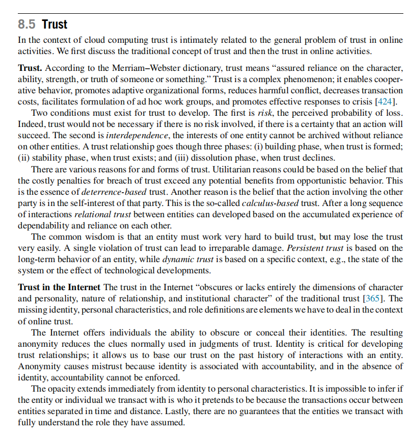

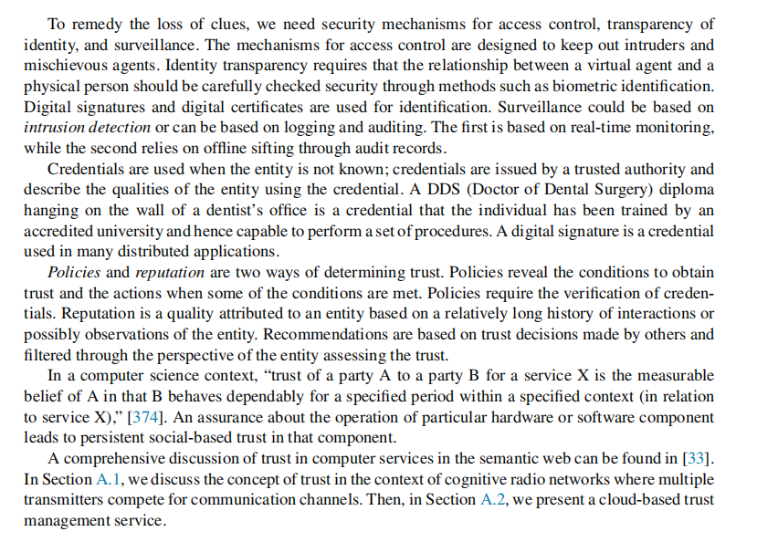

**1\. 标题：云计算环境中的信任概念与形成机制**

在本节（8.5）中，课件从传统信任概念出发，深入探讨了网络与云计算环境下信任（Trust）所面临的挑战与建立方法。随着互联网和云服务的发展，“信任”已不再局限于线下的人际或组织关系，而是转变为需要通过技术手段、身份验证与行为审计等方式来维系的动态模式。本节将信任放在更广泛的安全和社会背景中加以阐述。

* * *

2\. 详细内容与知识点解析
--------------

### 2.1 信任的传统概念与重要性

1.  **Merriam-Webster对信任的定义**
    
    *   信任意味着“对某人或某物的品格、能力、力量或真实性之确信赖”。
    *   在组织或个人层面，信任可以促进合作，减少冲突与交易成本，推动临时工作团队的形成，并在面对危机时带来更高效的应对措施。
2.  **信任形成的前提**
    
    1.  \*\*风险（Risk）：\*\*若无风险，就不需要信任；信任之所以存在，是因为有损失或失败的可能。
    2.  \*\*相互依存（Interdependence）：\*\*一方的目标需要另一方的参与或协助才能实现，双方互相依赖，使得信任成为维系合作的基础。
3.  **信任的生命周期**
    
    *   \*\*建立阶段（Building phase）：\*\*初始接触、相互了解与评估，通过承诺和行为逐渐形成信任。
    *   \*\*稳定阶段（Stability phase）：\*\*信任已然建立，双方在相互依赖和交互中维持信任。
    *   \*\*消解阶段（Dissolution phase）：\*\*若出现背信或违规行为，信任将下降甚至破裂。
4.  **多种信任形态**
    
    *   \*\*Deterrence-based trust（威慑型信任）：\*\*基于对违约后果的惧怕或对规则惩罚的畏惧而形成。
    *   \*\*Calculus-based trust（计算型信任）：\*\*双方相信与对方交互符合彼此最大利益。
    *   \*\*Relational trust（关系型信任）：\*\*通过多次正面互动逐步积累的信任，建立在长期合作与可靠表现之上。
    *   **Persistent trust（持久信任）**与**Dynamic trust（动态信任）**：前者基于长期观察和稳定表现，后者则随环境或技术发展而变化。
5.  **失去信任的风险**
    
    *   一次严重的背信行为即可让多年建立的信任迅速瓦解，引发无可挽回的损失。

* * *

### 2.2 网络与云环境下的信任挑战

1.  **“信任在互联网上”的难题**
    
    *   \*\*身份与个性的模糊性：\*\*在网络环境中，实体的真实身份、角色和属性常常无法直接获知，导致传统线下评估“人格可信度”的方式难以适用。
    *   \*\*匿名性与责任追究：\*\*互联网赋予个人或攻击者一定程度的匿名性，而责任归属和行为审计却需要确认真实身份，没有身份便难以追责。
    *   \*\*地理与时空分离：\*\*交易与交互在不同地点、不同时间进行，双方对彼此的合法性和意图缺乏全面了解。
2.  **需求：安全机制填补“线索”缺失**
    
    *   \*\*访问控制、身份透明化（Identity transparency）：\*\*通过访问控制和强身份验证，尽可能确保“虚拟实体”与真实个人或组织对应。
    *   \*\*数字签名和数字证书：\*\*用于身份识别和验证，可将“我是谁”的声明与受信任机构的背书结合起来，增强可信度。
    *   **监控与审计（Surveillance & Auditing）：**
        *   \*\*实时监控（Intrusion Detection）：\*\*安全系统在网络或主机层面实时检查异常行为，及时报警；
        *   \*\*离线审计（Logging & Auditing）：\*\*对所有关键操作记录日志，事后可分析溯源，对违规者进行追责。
3.  **凭证与信任机构**
    
    *   \*\*凭证（Credentials）：\*\*由第三方机构颁发，证明持有者具备某种资格或身份（例如医生执照、数字签名证书）。在分布式系统中，这种凭证常用于鉴别节点或用户的信任度。
    *   **策略（Policies）与声誉（Reputation）：**
        *   \*\*策略：\*\*规定何种条件下可获得信任，以及违规后的惩罚措施；
        *   \*\*声誉：\*\*基于历史交互或他人评价形成。信任也可通过“推荐（recommendations）”在群体或社会网络中传播。

* * *

### 2.3 云计算场景下的信任定义与实践

1.  **云服务的信任定义**
    
    *   学术界常引用的定义：
        
        > “对A来说，对B在某服务X上的信任值是指：A对B在规定时间、特定环境下能够可靠执行服务X的可测量性信念。”
        
    *   一旦对某硬件或软件组件的可靠运行建立了稳定的认知，就会衍生出持续的“社会化信任（social-based trust）”。这在云计算环境里可能体现在对特定云平台或虚拟化基础架构的认可。
2.  **构建云服务信任的要素**
    
    *   \*\*身份验证与访问控制：\*\*确保连接云资源的角色（人、设备或应用）经过授权；
    *   \*\*凭证管理与信誉机制：\*\*对CSP及其子服务做信誉考察，并要求CSP提供足够透明度（认证资质、审计报告等）；
    *   \*\*安全策略与技术实现：\*\*如零信任架构、加密传输、最小权限分配等；
    *   \*\*日志与审计追踪：\*\*记录重要操作和访问，及时发现可疑事件并给予溯源。
3.  **信任模型在计算机科学中的应用**
    
    *   **语义Web**：在分布式环境下，需要用本体、规则和可信证书来确定可信数据源；
    *   **认知无线电网络**：设备竞争使用频谱时，需基于历史行为构建动态信任评估机制；
    *   **云端信任管理服务**：自动度量并跟踪CSP的安全状况或服务可用性，辅助用户做出是否继续使用或迁移的决策。

* * *

3\. 本次内容总结
----------

*   **信任的本质**：源于风险与依赖关系，在互联网上因身份模糊、匿名性与跨地域等问题而面临严峻考验。
*   **传统与计算型信任**：既包含基于社会规范和个人信誉的信任，也包括通过数学模型（计算型或基于威慑、利益分析）来衡量与维系的信任。
*   **技术与制度协同**：在云计算环境下，仅依赖道德或单方面制度是不够的；必须借助访问控制、身份认证、数字签名、日志审计和信誉系统等技术机制来增强和维持信任。
*   **容易失去的宝贵资产**：云服务提供商和用户都需深知，信任的建立往往耗时长、投入大，而一次严重的背信或安全事故就可能导致信任全面瓦解，后果严重。

* * *

4\. 报错与补充说明
-----------

*   **图片可见文字完整无明显缺失**，提到的引用如\[365\]、\[374\]以及在Section A.1、A.2中的额外讨论不在此截图范围，可在后续资料中查看。
*   本次回答对“信任在云计算”的概念、挑战和技术实践做了系统梳理。若需更深入探讨云信任管理服务或信任度量模型，可结合其他更详细的章节或专业论文进行研究。

# **8.6** **Cloud data encryption**
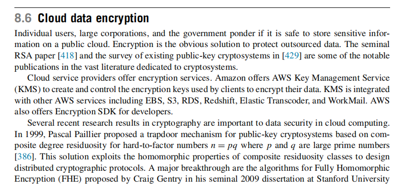

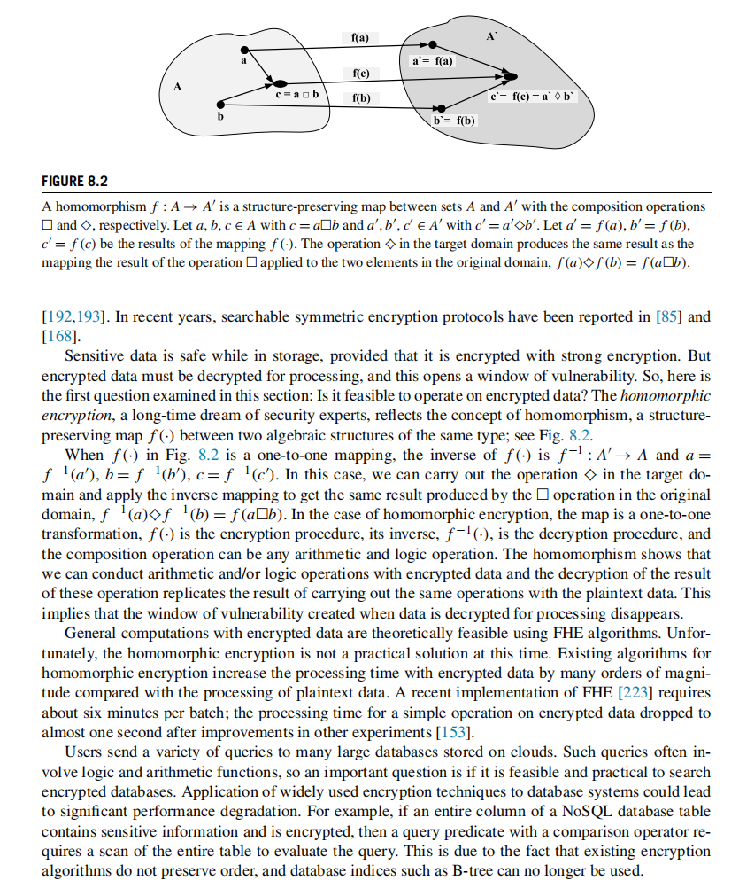

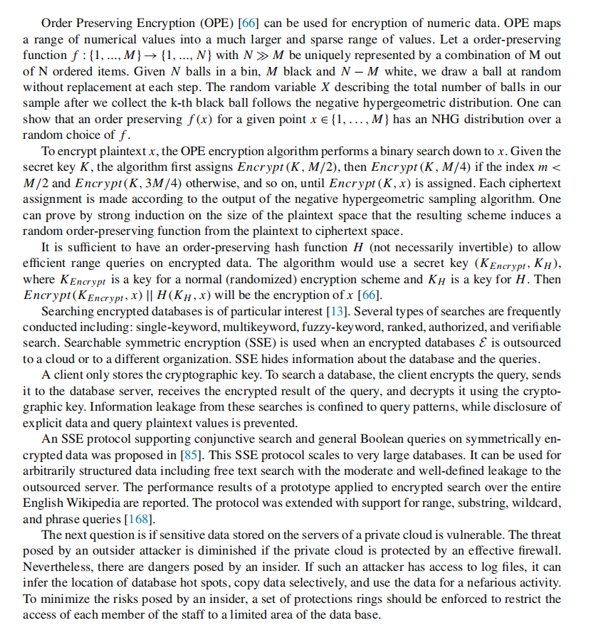

**1\. 标题：云端数据加密与可搜索加密技术概览**

本节（8.6）围绕云计算环境中数据加密（Cloud Data Encryption）的多种技术和挑战展开讨论。首先介绍了云服务商（如AWS）提供的密钥管理服务，以及现代密码学的发展背景（包括同态加密与可搜索加密等前沿方向）。随后，课件聚焦在如何在云端安全地存储、处理和检索加密数据的问题上，介绍了同态加密、顺序保持加密（OPE）、可搜索对称加密（SSE）等技术思路及其现实可行性。

* * *

2\. 详细内容与知识点解析
--------------

### 2.1 数据加密在云端的重要性

*   \*\*核心问题：\*\*当个人或组织将敏感信息托管在公共云上时，必须确保该数据即使在云端保存或传输时也能受到保护。加密成为一种“显而易见”的解决方案。
*   \*\*云服务商密钥管理服务：\*\*如Amazon的AWS KMS，帮助用户管理加密密钥生命周期并与众多云服务（EBS、S3、RDS等）集成；还提供Encryption SDK，方便开发者在自己的应用中使用。

### 2.2 现代密码学研究与同态加密（Fully Homomorphic Encryption, FHE）

1.  **同态加密的概念：**
    
    *   在数学上，若有一个同态映射  $f: A \to A'$ ，针对任意操作  $\otimes$  和对应的  $\otimes'$ ，满足  $f(a \otimes b) = f(a) \otimes' f(b)$  的性质时，就可在密文域上执行运算，并得到与在明文域上运算对应的结果。
    *   同态加密正是利用这种“结构保持映射”，以便对加密数据进行算术或逻辑操作而无需解密，**理论上**避免了“解密后处理数据”这段的安全漏洞窗口。
2.  **历史发展：**
    
    *   Paillier加密（1999）引入了一种公钥体制，可进行部分同态运算。
    *   \*\*Craig Gentry（2009）**在斯坦福的开创性论文中提出了**完全同态加密(FHE)\*\*的可行方案，实现对密文进行任意的算术操作。
    *   \*\*现实局限：\*\*现行FHE算法计算量极大，处理加密数据的时间远高于明文，难以大规模商用。后续研究虽降低了计算成本，但仍未达到普遍实用化的程度。

### 2.3 可搜索加密与顺序保持加密（Order Preserving Encryption, OPE）

1.  **可搜索加密（Searchable Encryption）**
    
    *   需求：在云端存储大量加密数据后，用户依然希望能够执行关键词搜索或数据库查询；
    *   **可搜索对称加密（SSE）**：由客户端维护密钥，当要检索时，客户端先对查询进行加密，然后服务器在密文数据库上执行搜索，返回结果后客户端解密；
    *   \*\*优点：\*\*查询和存储都在密文层面进行，可防止云端或第三方窥探用户数据与查询模式；
    *   \*\*局限：\*\*针对不同查询类型（单关键词、多关键词、模糊查询、范围查询等）要设计专门算法，且部分方案会存在一定程度的“可见泄漏”（例如访问模式或结果大小），需要在安全性与效率之间做权衡。
2.  **顺序保持加密（OPE）**
    
    *   \*\*原理：\*\*通过一个单调且保序的函数  $f$  将明文数值映射到密文数值，使得明文的大小关系在密文中得以保留；
    *   \*\*应用场景：\*\*加密后依然可以对数值字段进行范围查询或排序；
    *   \*\*实现思路：\*\*课件简要提到可利用二分搜索逻辑和负超几何分布，对明文空间进行随机化映射；
    *   \*\*风险与折衷：\*\*保序意味着泄露了数据的相对大小关系，在安全性上不如完全同态或传统加密；但在需要排序或范围检索的场景里，却比FHE更实用、更高效。

### 2.4 同态与可搜索加密的现实考量

1.  **性能瓶颈**
    
    *   FHE在复杂运算时的性能消耗依然非常大，尚未成为主流解决方案；
    *   OPE或SSE等特殊方案牺牲部分安全或功能性，来换取更高效的查询性能。
2.  **实际数据库加密挑战**
    
    *   若整个数据表被加密，则传统数据库索引（如B树）难以直接利用；
    *   对于NoSQL或全文搜索场景，大量检索需求可能需要定制化的可搜索加密结构，避免大范围解密带来的性能开销。
3.  **部分场景下的安全风险**
    
    *   攻击者可结合访问模式、统计分析（如频度分析）推测明文信息；
    *   内部人（如云端管理者）若能访问日志与元数据，仍可能侧面获取敏感信息。

### 2.5 其他加密相关思路

*   **Searchable Symmetric Encryption（SSE）**：支持多种查询形式（如布尔查询、范围、子串匹配等），兼顾性能与安全。
*   **隐私保护策略**：通过最小化暴露给云端的数据范围、严格的访问控制策略和日志审计等，结合加密手段，实现更高等级的保护。

* * *

3\. 本次内容总结
----------

*   **加密在云中的核心地位**：面对对外部与内部威胁，保证云端数据安全的一种关键方式就是加密；
*   **同态加密的潜能与局限**：理论上能在密文域操作而不需解密，但当前实际应用仍受制于高计算成本；
*   **可搜索加密（OPE、SSE等）**：解决加密后如何查询和检索的问题，但常以牺牲部分安全或使用场景的灵活度为代价；
*   **应用落地与多种权衡**：企业需基于业务类型、数据敏感度和查询需求，综合选择加密方式，兼顾性能、可用性与安全性。

* * *

4\. 报错与补充说明
-----------

*   **截图文字清晰可读**，引用文献如\[418\]、\[429\]、\[66\]、\[85\]、\[168\]等在此仅做简述，若需了解算法实现或具体安全性证明可查阅原文。
*   以上笔记对同态加密、可搜索加密等思路做了整体性解析。具体场景下如何选型与部署，还须结合业务需求、云平台特性及合规要求进一步探讨。

# **8.7** **Security of database services**
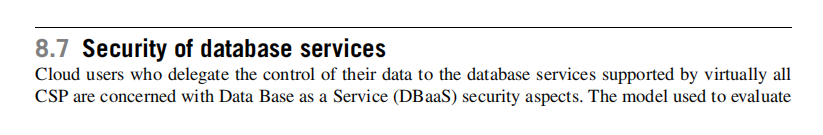

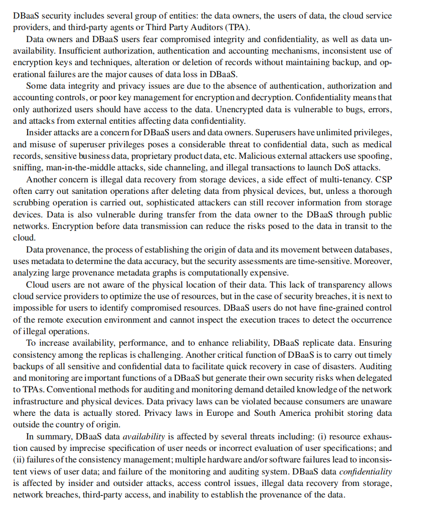

**1\. 标题：云端数据库服务（DBaaS）的安全性与挑战解析**

本节（8.7）主要聚焦“数据库即服务（DBaaS）”在云计算环境下所涉及的安全问题。随着几乎所有云服务提供商都支持数据库托管服务，用户将数据库及其敏感数据移交给云平台，势必面临新的安全风险与治理难点。通过本节内容，可以了解云端数据库服务的关键利益相关者、潜在威胁类型以及保障可用性、机密性和完整性的主要考量。

* * *

2\. 详细内容与知识点解析
--------------

### 2.1 DBaaS安全涉及的多方角色

1.  \*\*数据拥有者（Data Owners）：\*\*拥有数据版权或管理权的组织或个人。
2.  \*\*数据使用者（Users of Data）：\*\*根据权限读取或操作数据的终端用户或应用。
3.  \*\*云服务提供商（CSP）：\*\*提供数据库即服务的平台方，负责底层基础设施、系统维护和部分安全控制措施。
4.  \*\*第三方代理或审计方（TPA，Third Party Auditors）：\*\*可能是监管机构、专业审计公司或安全评估机构，对DBaaS进行独立审计或合规检查。

### 2.2 主要安全风险与问题

1.  **数据完整性与机密性（Integrity & Confidentiality）**
    
    *   \*\*不充分的鉴权与授权控制：\*\*若身份认证和权限分配不严谨，将导致敏感数据被越权访问或篡改。
    *   \*\*密钥管理不当：\*\*加密与解密密钥若保管不到位，极易被内部或外部攻击者利用。
    *   \*\*数据未加密存储：\*\*使其在云端暴露于漏洞、错误和外部攻击；一旦发生安全事件，将造成严重信息泄露。
2.  **内部威胁（Insider Attacks）**
    
    *   \*\*超级用户（Superuser）权限滥用：\*\*CSP或数据拥有者内部管理员拥有极高权限，一旦被利用或故意滥用，可直接访问或篡改数据库。
    *   \*\*外部恶意行为者：\*\*包括网络攻击者利用中间人攻击、侧信道攻击和非法交易等手段，导致数据泄露或服务瘫痪。
3.  **非法数据恢复与多租户风险（Illegal Data Recovery & Multi-Tenancy）**
    
    *   \*\*跨租户数据残留：\*\*云环境存在磁盘、存储共享，当CSP删除数据或回收物理介质不彻底时，攻击者可能从残留信息中还原机密数据。
    *   \*\*存储故障与多副本管理：\*\*为保证可用性，DBaaS通常会自动复制多份数据；但如果未正确清除或管理这些副本，亦会被不法分子或内部人员利用。
4.  **数据在传输过程中的风险**
    
    *   若用户与DBaaS之间的通信通道缺乏加密保护（如TLS/SSL），数据中途被窃听或篡改的风险升高。
    *   公共网络环境下更容易遭到各种监听或中间人攻击。
5.  **数据溯源（Data Provenance）困难**
    
    *   数据溯源指追踪数据的来源及其在数据库间流动的全过程。
    *   随着数据体量增大、分布式拓扑变复杂，要对元数据进行实时分析以确保“数据来自何处、被谁修改”变得难度极高。
6.  **物理位置与审计缺失**
    
    *   用户往往不知道数据在云端究竟存储于哪个地理位置，这对遭遇数据泄露或合规纠纷时会带来隐患。
    *   传统审计和监控手段需要对底层网络与硬件进行深度检查，但在DBaaS模式下，用户无法直接接触这些基础设施。
7.  **数据可用性（Availability）受到威胁**
    
    *   资源消耗或不当的使用需求规格可能导致数据库性能下降或服务中断；
    *   硬件故障、网络中断、软件Bug或一致性管理失败都可能导致数据库不可用或部分数据视图不一致；
    *   对故障容灾的监控和及时备份恢复要求很高，但交由第三方（CSP或TPA）操作也会引入新的风险点。

### 2.3 DBaaS关键安全要素

1.  **可用性（Availability）**
    
    *   高可用架构：通过多副本、分布式部署来实现容灾容错；
    *   及时备份与恢复：在出现硬件或软件故障后可迅速还原数据；
    *   监控一致性：对多个副本或分片的同步情况进行实时监控，避免因并发更新导致的数据冲突或丢失。
2.  **机密性（Confidentiality）**
    
    *   加强用户身份认证与权限控制，确保只有授权人员能够访问数据库；
    *   数据加密存储与传输：无论是在磁盘、内存还是网络层面，都要采用安全加密协议；
    *   内部隔离与最小权限原则（Least Privilege Principle），减少管理员过度特权。
3.  **完整性（Integrity）**
    
    *   审计日志与可追溯：详细记录增删改查操作及操作者身份，支持事后调查；
    *   定期校验与哈希签名：对关键数据进行校验，防止篡改不被发现；
    *   数据库版本控制和变更管理：追踪更新历史，避免不当修改无法回溯。
4.  **合规与隐私保护**
    
    *   不同国家和地区的隐私法规定可能禁止数据存储或处理出境；
    *   CSP需提供地理位置选项或合规证书，让用户能够满足各自行业或地域性法规（如GDPR、HIPAA 等）；
    *   第三方审计：对DBaaS及其运维流程进行独立评估，以帮助数据拥有者确信其满足合规要求。

### 2.4 总体安全建议与挑战应对

*   \*\*多层保护：\*\*从用户端到CSP，都需实现端到端的安全方案；
*   \*\*强密钥管理：\*\*建立完善的加密与解密操作流程，防止密钥被滥用或遗失；
*   \*\*严格访问审计：\*\*对“超级用户”或DB管理员的操作加大审查力度，执行多因素认证和分权管理；
*   \*\*定期安全评估与演练：\*\*模拟常见攻击场景（如SQL注入、社会工程学、内部威胁）并及时修补漏洞；
*   \*\*透明度与监控：\*\*要求CSP提供详细的服务级别协议（SLA）与操作日志，便于及时发现异常与合规违规。

* * *

3\. 本次内容总结
----------

1.  \*\*DBaaS安全特点：\*\*云中的数据库托管服务面临多重风险，包括外部攻击与内部威胁，数据在存储与传输环节都需加密与严格管控。
2.  \*\*关键要素：\*\*可用性、机密性和完整性是数据库安全的三大支柱，在DBaaS模式下因为物理隔离度降低、运维权限复杂化，故更需完善的安全机制。
3.  \*\*多方协作：\*\*DBaaS安全需要数据拥有者、CSP和第三方审计机构共同努力，才能实现从物理设备到业务层的全面防护。
4.  \*\*持续合规与监控：\*\*面对跨国界或多区域监管差异，DBaaS用户必须慎重选择数据中心位置，并持续监控数据操作与系统健康，辅以定期的独立审计。

* * *

4\. 报错与补充说明
-----------

*   **图片信息完整可读**，没有明显缺失或无法识别的内容；文中引用法律和合规性仅做概括，具体细节需查询相应国家和行业法案。
*   以上笔记为对DBaaS安全要点的系统性总结，若需深入了解特定云数据库产品的安全特性或实施细节，可查阅相应的官方文档与配置指南。

# **8.8** **Operating system security**
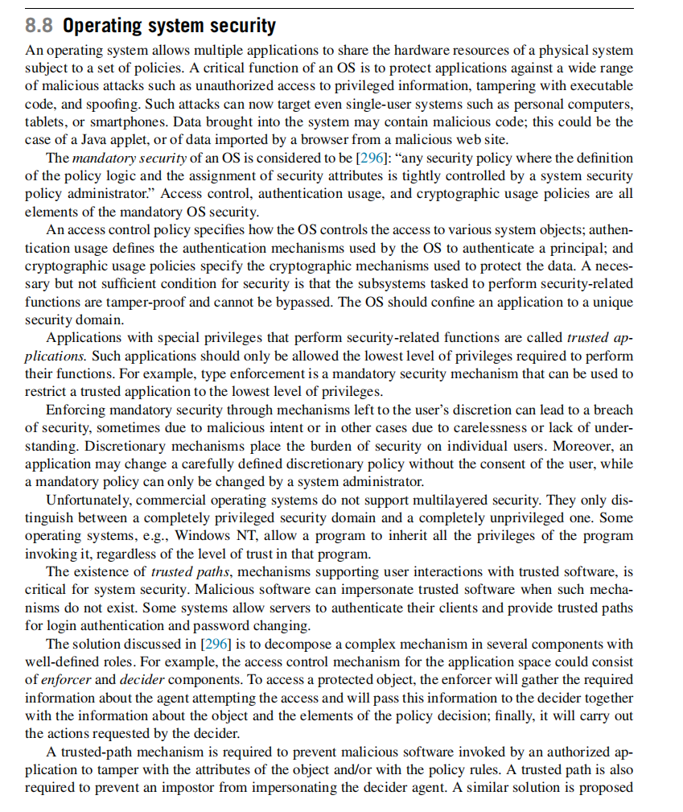

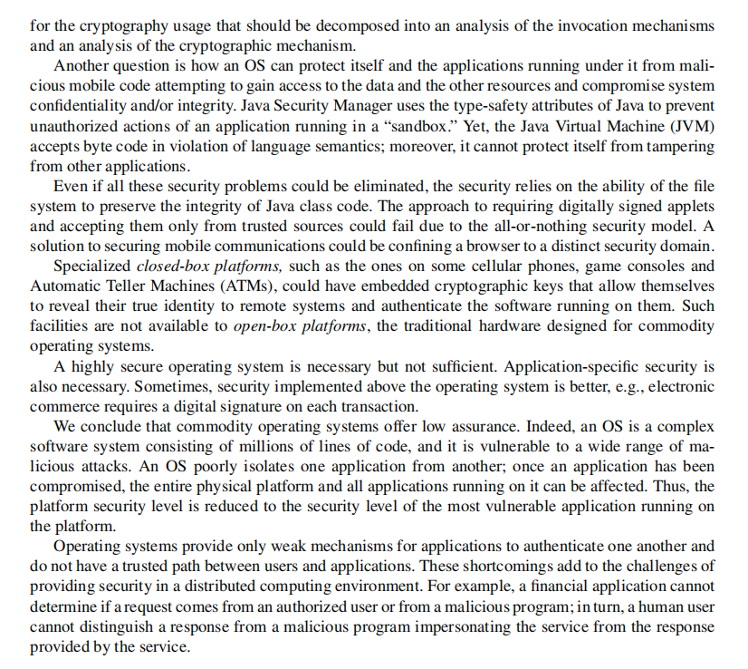

**1\. 标题：操作系统安全机制与应用隔离的重要性**

在本节（8.8）中，课件探讨了操作系统（Operating System，简称OS）在保障应用安全方面所肩负的职责，以及OS如何通过访问控制、鉴权、加密及“信任路径”等多重机制，防御恶意攻击。与此同时，课件指出，目前主流操作系统往往仅提供有限的多层级安全支持，因此在面对实际威胁时，仍需从更细化的安全策略（如强制性安全策略、可信路径、分权管理）与硬件隔离等多个层面进行强化。

* * *

2\. 详细内容与知识点解析
--------------

### 2.1 操作系统安全的核心目标

1.  **保护共享资源与应用**
    
    *   OS允许多个应用程序共享硬件和系统资源，其首要任务之一便是阻止应用间或应用对内核的未经授权访问，以确保数据机密性和完整性。
    *   同时，OS也须防范对可执行文件（如应用程序代码）的篡改，预防恶意软件等潜在危害。
2.  **强制性安全策略（Mandatory Security）**
    
    *   文中引用对强制性安全（Mandatory Security）的定义：
        
        > “安全策略的定义和安全属性的分配由系统安全策略管理员紧密控制。”
        
    *   这是与“自由裁量安全策略（Discretionary Security）”相对的概念，后者通常依赖用户或程序自行决定资源访问权限，易产生配置不当或用户过失。
    *   强制性安全策略要求只有系统管理员才能修改关键访问控制策略，从而减小策略被应用或用户随意改变的风险。
3.  **访问控制与认证、加密策略**
    
    *   访问控制：指定何种用户或进程可访问哪些系统对象；
    *   认证机制：确定操作系统如何验证用户或进程身份，包括口令、多因素认证、数字证书等；
    *   加密策略：用于保护系统关键数据的机密性，例如对配置文件或日志进行加密存储等。

### 2.2 可信应用与最小特权原则

1.  **可信应用（Trusted Applications）**
    
    *   是指系统中那些执行安全相关功能、需要较高权限的应用或服务（如安全审计、密钥管理等）；
    *   它们的权限配置应遵循**最小特权原则**：只赋予其完成任务所需的最低权限，以减少潜在滥用或被攻击后带来的影响。
2.  **自由裁量安全 vs 强制性安全**
    
    *   自由裁量安全（Discretionary Security）让最终用户或应用自行设定访问权限，这常常导致安全策略易被无意识改变或恶意篡改；
    *   强制性安全策略（Mandatory Security）一般由内核或高级管理员统一维护，对系统关键资源进行强制访问控制（MAC），并可结合类型强制（Type Enforcement）等技术手段。
3.  **多级安全模型**
    
    *   课件提到，许多通用操作系统（如Windows NT）并未提供多层次的安全隔离，而是只有“全权管理员”与“普通用户”两种极端；
    *   这往往导致应用一旦获得高级权限，就能影响到整个系统或继承前任程序的全部权限。

### 2.3 信任路径与安全隔离

1.  **Trusted Path（可信路径）**
    
    *   用于建立用户与可信软件之间的安全通道，防止恶意软件假扮系统服务或窃取用户输入。
    *   若缺少可信路径，用户无法确认交互对象的真实身份，容易被仿冒或中间人攻击利用。
2.  **应用隔离与分权**
    
    *   将复杂安全功能拆解成多个小组件，如“执行者（Enforcer）”和“决策者（Decider）”，彼此之间通过安全通信或API协同。
    *   “执行者”负责收集请求信息并执行最终操作，“决策者”负责评估策略、判断是否允许或拒绝操作；
    *   通过这种方式，将安全决策逻辑和实际资源操作分离，可降低单点故障和被完全攻陷的风险。
3.  **Java安全管理器与Sandbox模式**
    
    *   Java Security Manager依靠语言的类型安全特性以及“沙箱（sandbox）”环境来限制应用对系统资源的访问；
    *   但该机制仍需依赖底层操作系统的完整性，一旦JVM或底层OS被破坏，就很难单靠Java层面的安全机制自保。

### 2.4 闭合系统（Closed-box Platforms）与通用平台安全

1.  **闭合系统例子：**
    
    *   某些专用设备（如手机、游戏主机、自动柜员机）内置硬件加密密钥，可以向远程服务证明自身身份并限制第三方软件的安装。
    *   这类“Closed-box”平台的安全性相对较高，但也牺牲了部分灵活性。
2.  **通用操作系统的局限**
    
    *   传统桌面或服务器操作系统规模庞大，代码量动辄数百万行，内部漏洞难免存在；
    *   一旦其中任何应用受到攻击，整个平台的安全级别可能就降至受侵害应用的级别。

### 2.5 OS安全与应用安全的配合

*   **“一个高安全的操作系统并不代表万无一失”**
    *   在OS之上还需要为特定业务或场景进行应用级别的安全措施。例如电子商务往往需要在每笔交易上进行数字签名或额外认证。
*   **OS的安全边界有限**
    *   操作系统难以识别网络环境中的应用之间的通信是否可信，也难以区分远程请求的来源是合法用户还是恶意程序。

* * *

3\. 本次内容总结
----------

*   **操作系统安全机制**：包括访问控制、身份认证、加密、强制性安全策略和可信路径等，这些都是保护系统和应用的基础。
*   **自由裁量策略的缺陷**：若将关键安全决策交给用户或应用自行执行，易导致策略实施不一致或被恶意篡改，引发重大安全隐患。
*   **可信路径与应用隔离**：操作系统应当严格区分安全特权域并设置可信交互通道，以免被恶意软件冒充系统组件，造成权限泄露。
*   **闭合系统与大规模通用OS**：专用平台具有更高安全性但牺牲灵活性，通用OS则面临更大攻击面，需要在硬件隔离、内核精简、应用安全配置等多方面加强。
*   **OS安全非全部**：尽管安全操作系统是防御的关键部分，但应用级别安全策略也必不可少。若应用本身存在漏洞或缺乏安全审计，整个系统仍难以抵挡高级攻击。

* * *

4\. 报错与补充说明
-----------

*   本次截图文字清晰可辨，引用文献如\[296\]等在文中仅做概念说明，若需深入了解类型强制（Type Enforcement）或分权机制的实现细节，可参阅相应资料。
*   整体而言，本节内容为操作系统安全在云端或分布式环境下的挑战与关键点提供了概述。更多实际场景（如容器、虚拟机安全）可结合后续章节或其他参考文献进行扩展。

# **8.9.1** **Virtual machine security**
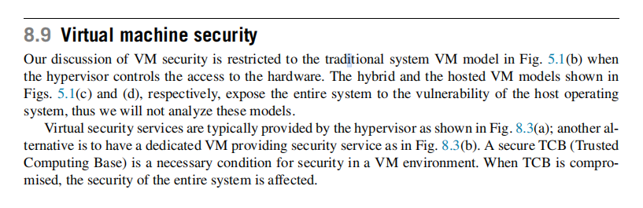

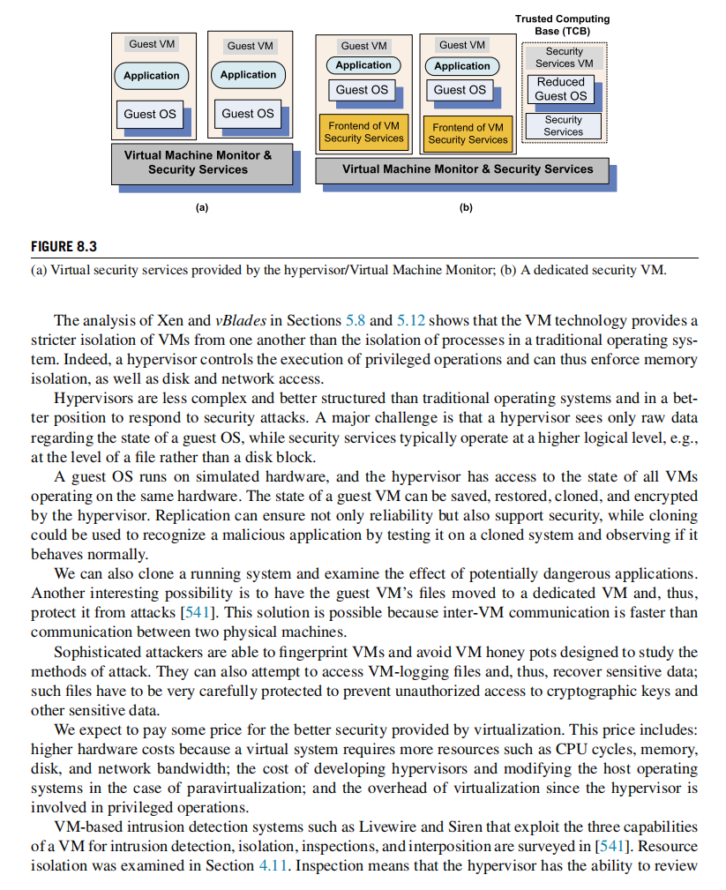

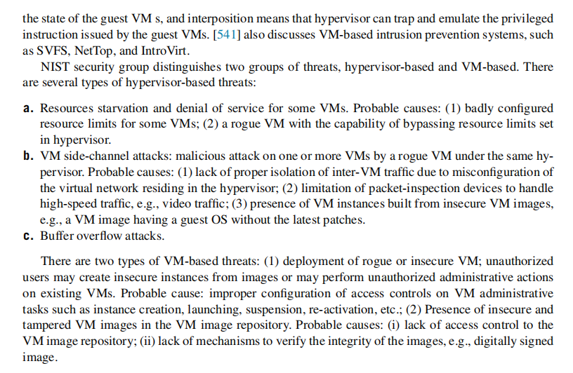

**1\. 标题：虚拟机安全要点与Hypervisor常见威胁分析**

在这一部分（8.9节）中，课件讨论了传统系统虚拟机模型（由Hypervisor控制底层硬件）下的虚拟机（VM）安全问题。重点说明了Hypervisor在隔离不同虚拟机、提供安全服务方面的重要作用，以及在云环境中可能面临的多种威胁类型。文中也简要介绍了NIST针对Hypervisor层和VM层的安全威胁分类，并分析了其各自的可能原因。

* * *

2\. 详细内容与知识点解析
--------------

### 2.1 虚拟机安全模型与TCB（Trusted Computing Base）

1.  **传统系统虚拟机（System VM）模型**
    
    *   课件引用了图5.1(b)，即Hypervisor直接管理硬件资源，Guest VM在其上运行。
    *   其他模型如“混合型”和“宿主型”VM（Hosted VM）依赖宿主操作系统，整体系统会暴露给宿主OS的潜在漏洞，因此本节着重分析传统Hypervisor模型。
2.  **虚拟安全服务的部署方式**
    
    *   \*\*方案(a)：\*\*Hypervisor或虚拟机监控器（VMM）中直接提供安全服务，对各VM进行统一管控；
    *   \*\*方案(b)：\*\*使用专门的“安全虚拟机”，即“Dedicated Security VM”，将安全功能（如防病毒、监控审计等）部署在特定VM上，以便与其他Guest VM隔离。
3.  **TCB（可信计算基）在VM环境中的重要性**
    
    *   TCB包括系统中必须被信任的关键组件（Hypervisor、核心安全服务等）。
    *   若TCB被攻破，整个虚拟化环境的安全都将陷入严重风险。

### 2.2 VM隔离与Hypervisor的作用

1.  **VM隔离：**
    
    *   对比传统操作系统中的“进程隔离”，VM隔离更严格，因为Hypervisor可以控制特权指令的执行、管理CPU/内存/网络/磁盘访问；
    *   让每个Guest OS的运行状态相对独立，减少了一个Guest OS被攻陷后对其他Guest OS直接造成影响的可能。
2.  **Hypervisor的安全优势与挑战**
    
    *   **优势：**
        *   结构相对精简，对特权操作控制更集中；
        *   更容易检测、记录、克隆或恢复Guest OS的状态（快照、加密、复制等）。
    *   **挑战：**
        *   Hypervisor只看到Guest OS的“磁盘块”或“低层文件信息”，缺乏对应用层逻辑或操作意图的深入理解；
        *   攻击者可针对VM特性进行指纹识别（fingerprinting），或试图访问Hypervisor日志信息（如VM-logging文件）来窃取敏感数据或加密密钥。
3.  **VM快照与克隆的安全运用**
    
    *   借助Hypervisor，管理员可保存并加密Guest VM的快照；
    *   也可克隆一台正在运行的Guest VM，在克隆系统中测试可疑应用，观察其真实行为，不影响生产环境；
    *   在安全加固层面，快照与克隆既有助于故障恢复，也可用于安全检测与取证分析。

### 2.3 Hypervisor与VM层的主要威胁

根据NIST的分类，威胁主要分为**Hypervisor-based threats**与**VM-based threats**。文中列出了几种典型类型：

#### A. Hypervisor-based threats

1.  **资源耗尽与拒绝服务（Resource Starvation & DoS）**
    
    *   不当的资源配置或存在“恶意VM（rogue VM）”绕过资源限制，导致其他VM无法获得足够CPU、内存、网络带宽等；
    *   可能造成部分合法VM无法正常运行，或系统可用性明显下降。
2.  **VM间侧信道攻击（VM Side-channel Attacks）**
    
    *   “恶意VM”可利用与其他VM共享的物理资源（CPU缓存、内存总线、网络I/O）来推断或窃取其他VM中的敏感信息；
    *   可能的原因包括：虚拟网络配置不当、包监测设备无法处理高速流量或缺乏深度检测、多租户环境下使用了缺少安全补丁的操作系统镜像等。
3.  **缓冲区溢出攻击（Buffer Overflow Attacks）**
    
    *   针对Hypervisor自身或其管理程序的漏洞，试图通过越界写操作等方式取得更高权限；
    *   一旦Hypervisor遭到溢出攻击并被攻陷，所有VM都处于不安全状态。

#### B. VM-based threats

1.  **部署恶意或不安全的VM（Rogue/ Insecure VM Deployment）**
    
    *   由于对VM镜像仓库缺乏访问控制或签名验证，攻击者可能上传或使用被篡改的VM镜像；
    *   不完善的管理权限导致有人可在没有授权的情况下执行创建、挂起、重启、销毁等操作。
2.  **不安全或篡改的VM镜像（Insecure/Tampered VM Image）**
    
    *   存在老旧补丁级别的操作系统镜像，容易被攻击；
    *   未对VM镜像进行数字签名或校验，导致恶意者可植入后门。

### 2.4 安全与性能的平衡

*   虚拟化提供了更灵活的安全管控手段，但也会带来一定的性能开销：
    *   Hypervisor需要额外的CPU、内存、网络等资源来运行和监控；
    *   虚拟层的管理和IO中转也会引入一定的延迟；
*   在云计算场景，运营者和客户都需平衡安全增强与性能损失之间的取舍。

### 2.5 虚拟化安全措施与建议

1.  **强化Hypervisor安全**
    
    *   使用轻量化、经安全审计的Hypervisor；及时打补丁；
    *   严格限制管理接口与日志文件的访问，防止内部或外部攻击者获取运行记录或密钥。
2.  **防范侧信道与资源争夺**
    
    *   在多租户环境下合理分配CPU、内存、网络等资源，避免单个VM可滥用或抢占过多；
    *   加强虚拟网络隔离（如通过VLAN、VXLAN、SDN策略），减少不同租户间的潜在侧信道。
3.  **安全镜像仓库与签名验证**
    
    *   提供安全的镜像存储与分发机制，使用数字签名或哈希校验防止镜像被篡改；
    *   定期更新镜像，及时修复操作系统和中间件漏洞。
4.  **VM级安全监控与日志审计**
    
    *   建立完善的VM生命周期管理（创建、启动、暂停、快照、销毁），对关键操作记录日志；
    *   结合实时监控或虚拟化入侵检测系统（如Livewire、VM introspection）及时发现异常。
5.  **备份与快照安全**
    
    *   对备份和快照进行加密与访问控制，避免因快照泄露导致攻击者获取敏感数据；
    *   使用克隆环境进行应用或补丁测试，减少对生产系统的直接影响。

* * *

3\. 本次内容总结
----------

*   **Hypervisor在虚拟化安全中的地位**：作为底层控制程序，Hypervisor能对Guest VM进行较严格的隔离和资源管控，但若自身存在漏洞或被攻陷，后果尤其严重。
*   **NIST对威胁的分类**：从“Hypervisor-based threats”与“VM-based threats”两个角度分析常见风险，如资源耗尽、侧信道攻击、缓冲区溢出、不安全镜像、缺乏镜像签名验证等。
*   **安全与性能的取舍**：虚拟化可带来更好的弹性与安全手段，但也会增加系统复杂度和资源开销；合理部署和管理对于提升安全性至关重要。
*   **推荐措施**：强化Hypervisor安全、增强VM隔离与网络防护、实施镜像签名与版本更新、做好日志审计和快照/备份的安全防护等。

* * *

4\. 报错与补充说明
-----------

*   \*\*截图内容完整度：\*\*本次图片清晰展示了Hypervisor与VM安全的主要知识点及NIST分类的威胁类型；无无法辨认或缺失明显段落。
*   如需深入了解各类侧信道攻击、防护措施或特定Hypervisor架构（Xen、KVM、VMware ESXi）的安全机制，可参阅对应的官方文档或后续章节。

# **8.10** **Security of virtualization**
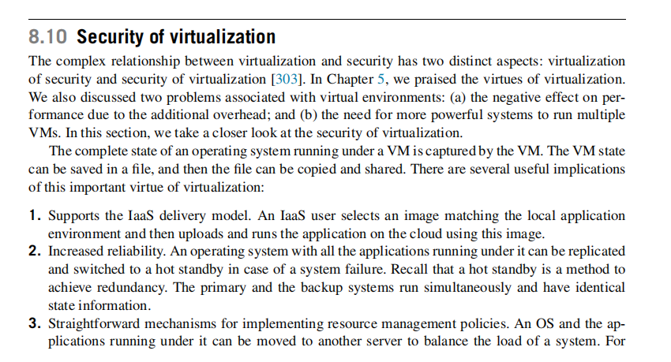

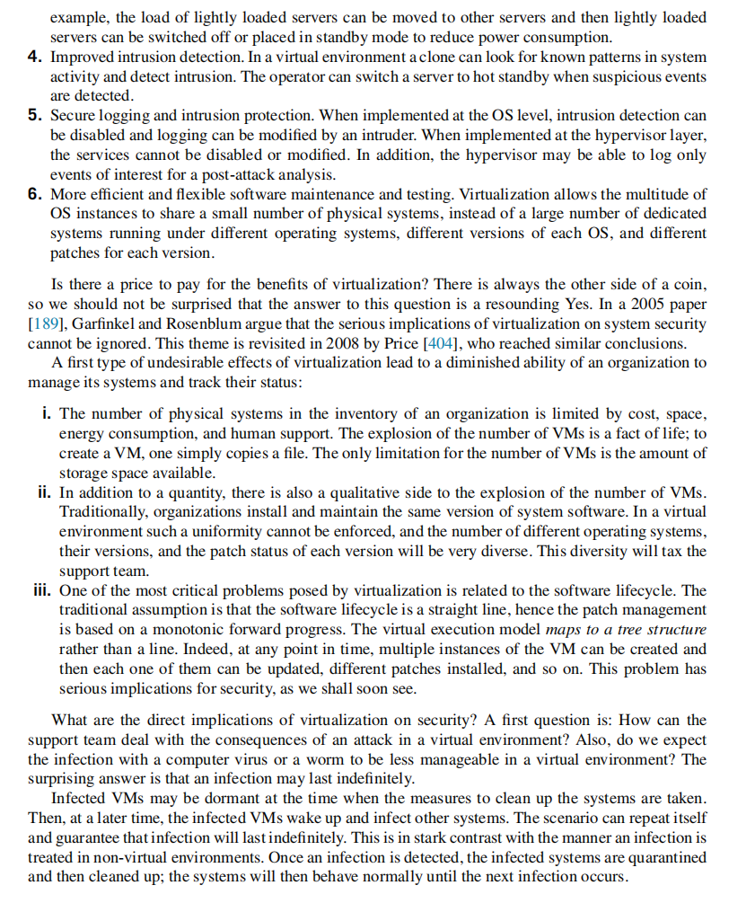

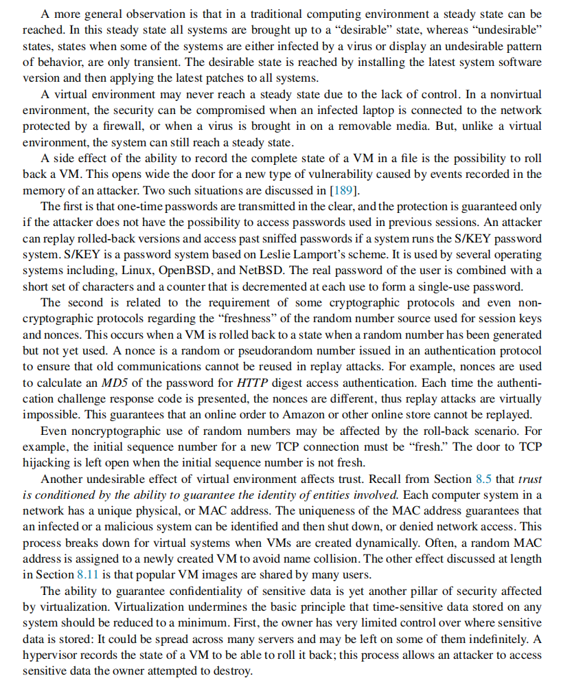

**1\. 标题：虚拟化安全的核心要素、收益与代价——从IaaS模式到无限期感染问题**

在本节（8.10）内容中，课件探讨了“虚拟化”与“安全”之间的双重关系：既有“虚拟化带来的安全增强”，也有“虚拟化引入的特殊风险”。在前面章节已提及，虚拟化除了在性能和资源利用上带来一定额外负担（例如多虚拟机需要更强大的硬件支撑）之外，也涉及系统管理难度上升。与此同时，本节强调了一些“虚拟化独有的优势和功能”，以及这些功能如何被滥用或导致安全挑战，特别是“无限期感染”等严重后果。

* * *

2\. 详细内容与知识点解析
--------------

### 2.1 虚拟化带来的主要优势

1.  **支持IaaS交付模式**
    
    *   用户只需选择与本地应用环境相匹配的镜像，然后将其上传到云端运行。
    *   IaaS使用户能够更加灵活、快速地部署系统，无需管理底层硬件。
2.  **提高可靠性（Reliability）**
    
    *   操作系统与其上应用都可以被完整复制，作为“热备份（Hot Standby）”存在；
    *   一旦主系统出现故障，可以无缝切换到备份系统，实现持续的高可用性。
3.  **资源管理策略更为灵活**
    
    *   通过虚拟机迁移（VM Migration），可将低负载服务器任务转移到其他机器，让空闲物理机进入节能或关机模式；
    *   由此在资源调度和负载均衡方面更轻量与智能。
4.  **改进的入侵检测**
    
    *   在虚拟化环境中，可以克隆出相同的系统来检测可疑行为；
    *   如果发现安全威胁，可将“主服务”切换到安全干净的副本上，或对可疑实例进行深度分析。
5.  **安全日志与入侵防护**
    
    *   如果仅在操作系统层面部署日志和IDPS（Intrusion Detection and Prevention System），攻击者可能有权限关闭或篡改它们；
    *   而在Hypervisor层级实现安全服务，可以在更底层进行监控与记录，攻击者不易绕过或关闭这些安全机制。
6.  **更高效的维护与测试**
    
    *   不同操作系统或其多版本、不同补丁级别，都能在少量物理机上并行运行；
    *   方便软件打补丁或进行A/B测试等，大大简化了系统维护和升级流程。

### 2.2 虚拟化的另一面：管理与安全的复杂化

1.  **系统数量“爆炸”**
    
    *   创建一个新的VM只需复制映像文件，成本较低，导致短时间内诞生大量VM实例；
    *   传统的物理机数量受硬件、空间、能耗等限制，而VM几乎只受磁盘空间的制约，容易引发“虚拟机蔓延（VM Sprawl）”。
2.  **多元操作系统与补丁状态**
    
    *   与传统做法（在整个企业内部统一操作系统版本与补丁）不同，在虚拟化环境中可能同时存在不同OS版本、不同补丁级别；
    *   安全团队很难掌握所有虚拟机的运行状态与漏洞状况，补丁管理压力增大。
3.  **软件生命周期的树状结构**
    
    *   在非虚拟化环境下，软件升级多是线性、渐进式的；
    *   虚拟机可被任意快照和克隆，不同分支各自应用不同更新或修补；同一个系统版本可能衍生多条“演化路径”。
    *   这就产生了严重的安全管理难题：同一个基础镜像衍生的多个实例，其修补进度、配置差异可能千差万别。
4.  **无限期感染（Indefinite Infection）**
    
    *   传统环境下，检测到恶意软件后会及时隔离或清除，系统恢复到健康状态便可稳定运行；
    *   在虚拟化场景下，被感染的VM可能暂停或者生成快照，后期又被恢复运行，从而让病毒再次散播。
    *   如此循环往复，恶意程序可能一直潜伏在闲置或封存的镜像里，没有彻底清除的机会。

### 2.3 滚动回退（Roll-back）对安全协议的影响

1.  **一时性密码泄露**
    
    *   如果系统使用一次性密码（如S/KEY），一旦回退到先前状态，攻击者可重放本该已弃用的密码或令牌；
    *   在正常场景下，旧密码或旧Token失效。但回退操作让系统处于“过去时间点”，有可能让先前的凭据再次生效。
2.  **随机数/Nonce新鲜度丧失**
    
    *   密码学协议中大量使用随机数或Nonce来防止重放攻击；
    *   若VM被回滚到产生Nonce但尚未使用完的时刻，则后续重新使用该Nonce，或造成会话劫持风险。
3.  **TCP初始序列号不再独立**
    
    *   TCP连接建立时的初始序列号本应是连续且唯一的，若回滚导致序列号重复，也可能导致连接劫持机会。

### 2.4 信任与机密性受虚拟化影响

1.  **MAC地址的不唯一**
    
    *   在传统网络中，MAC地址可标识设备身份；虚拟化环境里，随机MAC分配给新VM，且同一镜像若多人使用，MAC冲突或混淆都可能发生。
    *   破坏了基于MAC等物理特征鉴别恶意设备的思路。
2.  **机密数据的实际位置不透明**
    
    *   数据常常以快照或备份的形式散布在不同物理节点上；
    *   Hypervisor可在不经意间保留了用户试图删除的敏感数据。攻击者若能获取这些保留快照，就能逆向获取隐秘信息。

### 2.5 管理防护与实践建议

*   **完善的VM生命周期管理**：
    
    *   制定严格的创建、暂停、销毁、镜像更新流程；
    *   避免大量旧快照长期堆积，定期清理不使用或存在安全风险的镜像。
*   **集中化补丁和版本控制**：
    
    *   使用统一平台或自动化编排工具（如DevSecOps理念），对所有活跃虚拟机执行补丁推送与合规检查；
    *   避免版本过度分散导致无从下手。
*   **防范回滚重放**：
    
    *   强制每次恢复镜像后刷新随机数种子或安全令牌；
    *   对只应一次使用的密码或会话信息做好加密管理与过期处理。
*   **网络与访问控制**：
    
    *   借助虚拟交换机（vSwitch）或软件定义网络（SDN）策略，进行多租户隔离；
    *   MAC地址管理与交换机端口安全配置，避免轻易“冒充设备”或冲突。
*   **监控与日志审计**：
    
    *   在Hypervisor层面部署不可篡改的日志与安全审计功能；
    *   对虚拟机克隆、迁移及停启操作进行实时监控，并对异常行为发出预警。

* * *

3\. 本次内容总结
----------

1.  **虚拟化安全的利与弊并存**：
    
    *   在IaaS模式、可靠性提升、资源调度和入侵检测等方面，虚拟化能显著增强灵活度和效率；
    *   但管理大规模VM、多个版本操作系统及可能无限期循环的感染威胁，也为安全团队带来前所未有的挑战。
2.  **主要风险点**：
    
    *   VM数量与多样化导致补丁和生命周期管理难度激增；
    *   回滚机制破坏了一次性密码、随机数“新鲜度”等安全假设，助长了重放攻击；
    *   机密数据散布与动态MAC地址使得传统的身份鉴别和数据销毁措施难以适用。
3.  **应对策略**：
    
    *   从镜像创建到使用完毕，都要进行严格审计和管控；
    *   引入自动化部署与统一补丁管理系统，保证即时更新与风险排查；
    *   针对回滚风险制定相应的协议调整，如刷新所有安全令牌或密钥；
    *   加强网络层隔离和日志审计，以便及早发现并处置可疑活动。

通过理解这些“虚拟化安全”的利弊与关键对策，可以帮助企业更好地在云中运用虚拟化技术并抵御潜在的长期安全威胁。

* * *

4\. 报错与补充说明
-----------

*   **截图文本可读性**：信息完整，无明显缺失。部分引用文献（\[189\]、\[404\]等）详细说明了虚拟化对系统安全的深远影响，如需深入研究可查阅原文。
*   **整体观点**：本次笔记涵盖了虚拟化在安全与管理层面的重要关注点、好处及局限性，提供了多项实践建议。若需更详细的技术配置或安全框架，可结合后续章节或专业文献进一步展开。

# **8.11** **Security risks posed by shared images**
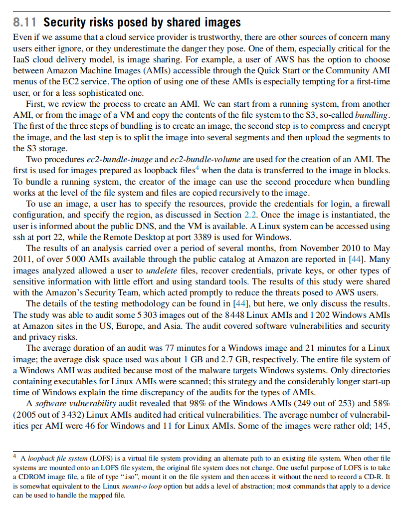

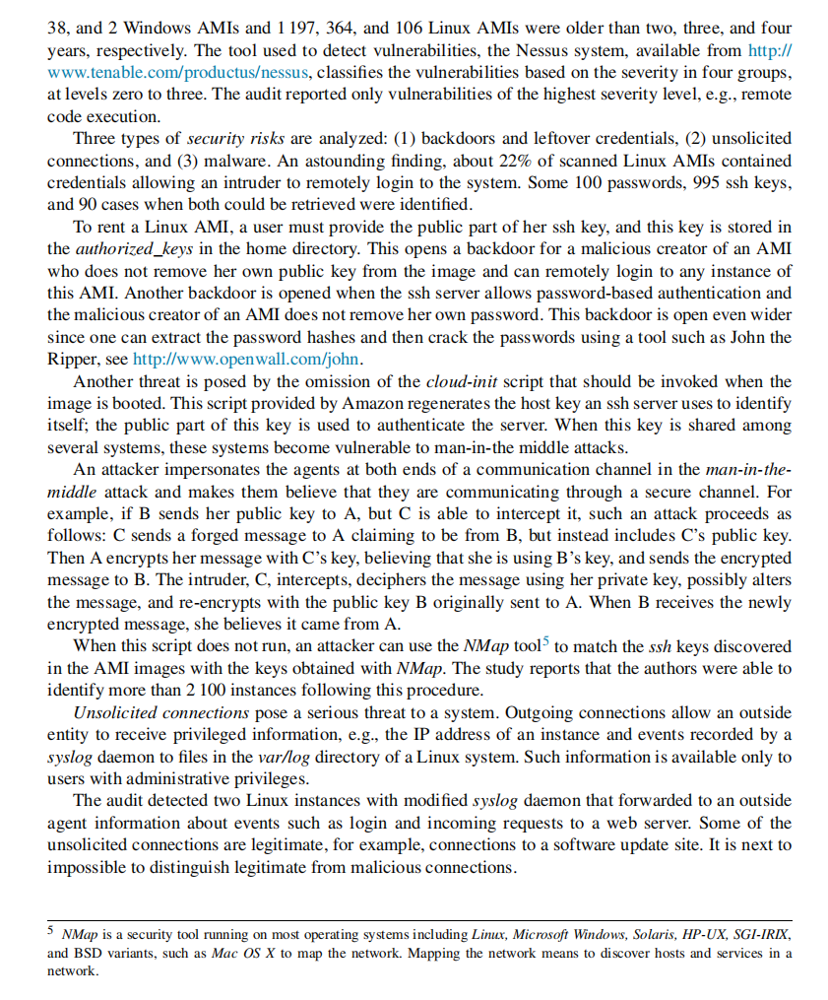

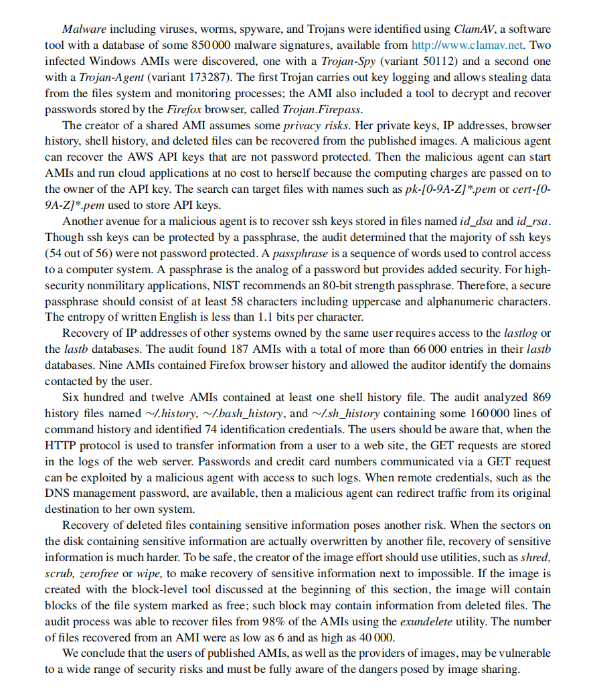

**1\. 标题：共享镜像的安全风险与实际案例分析**

在本节（8.11）中，课件深入阐述了在IaaS环境下使用共享镜像（如AWS AMI）的常见安全隐患。许多初级云用户常选择“社区共享”或“公共镜像”来快速启动虚拟机，却忽视了这些镜像中潜藏的漏洞、后门、残留信息等风险。本节通过对数千个公共AMIs进行审计的实测案例，揭示了共享镜像可能导致的严重安全和隐私问题。

* * *

2\. 详细内容与知识点解析
--------------

### 2.1 共享镜像的创建与发布流程

1.  **AMI的打包过程（Bundling）**
    
    *   从现有运行系统或已有镜像拷贝文件系统到S3存储；
    *   压缩并加密生成文件包；
    *   将其拆分成多个段并上传到S3。
    *   在AWS上对应的命令行工具：`ec2-bundle-image` 与 `ec2-bundle-volume`。
2.  **使用AMI启动实例**
    
    *   用户在AWS控制台或CLI中选定镜像（AMI）后，指定登录凭据、安全组、防火墙配置等，实例启动后即可通过SSH（Linux默认22端口）或RDP（Windows默认3389端口）访问。
3.  **风险概览**
    
    *   **一旦镜像中存在潜在的敏感信息、后门或漏洞**，使用该镜像的所有人都将被波及；
    *   许多初级用户（尤其在“Quick Start”或“Community AMI”列表里）往往低估了镜像的合规性与安全性审核流程。

* * *

### 2.2 大规模审计发现：共享AMI中的常见安全问题

一项针对**5000+公共AMIs**的长期审计（2010年11月至2011年5月）结果表明：

1.  **软件漏洞与系统缺陷**
    
    *   使用Nessus工具检测后发现：
        *   **98% Windows AMIs**（249/253个）及 **58% Linux AMIs**（2005/3432个）含有高危漏洞；
        *   平均每个Windows镜像存在46个漏洞，Linux镜像有11个漏洞。
    *   一些镜像版本非常老旧，未及时安装补丁，存在严重安全风险。
2.  **后门与遗留凭证**
    
    *   **22%已审计的Linux AMIs**中包含可直接远程登录的凭据（如SSH密钥或密码），相当于预留后门；
    *   部分镜像在`authorized_keys`目录下保留了制作者自己的公钥，攻击者可随时用私钥登录；
    *   不安全的SSH配置（同时支持密码登录，且密码未移除）让攻击者可轻松爆破或获取哈希后破解明文。
3.  **缺失`cloud-init`脚本导致的Man-in-the-Middle攻击**
    
    *   AWS默认流程会利用`cloud-init`在首次启动时更新主机SSH密钥；
    *   若镜像作者移除或忽视此脚本，则多台实例共用同一SSH密钥，容易被中间人攻击；
    *   攻击者可冒充合法主机或拦截加密通信。
4.  **未授权连接（Unsolicited connections）**
    
    *   某些镜像配置了外发连接，可能将敏感日志或系统信息发送到恶意地址；
    *   被修改过的`syslog`守护进程将所有事件转发到攻击者控制的外部服务器，包括Root级日志，严重泄密。
5.  **恶意软件与木马（Malware）**
    
    *   使用ClamAV扫描发现：
        *   若干Windows AMIs感染了特洛伊木马（Trojan-Spy、Trojan-Agent）、包含键盘记录或窃取Firefox存储密码的工具；
        *   Linux镜像同样可能带有Rootkit、蠕虫或后门脚本，威胁整个云环境。
6.  **存留隐私信息（Privacy Risk）**
    
    *   镜像制作者的**私有密钥、IP地址、浏览器历史、Shell命令记录**等常被一并打包到AMI；
    *   攻击者可利用这些信息在镜像上传者不知情的情况下发起计算任务，费用则记在镜像拥有者的AWS账号；
    *   敏感API密钥或证书文件（如 `pk-*.pem` / `cert-*.pem`）也常被遗留在镜像中。
7.  **浏览器与Shell历史泄露**
    
    *   **187 AMIs**中含有`lastlog`或`bash_history`等文件，共约66,000条登录信息；
    *   **612 AMIs**含有 `.history、.bash_history、.sh_history` 文件，曝光了大量Shell操作指令及潜在凭据；
    *   部分镜像含有Firefox浏览器历史，揭示了制作者访问过的站点、账号登录等轨迹。
8.  **可恢复已删除文件**
    
    *   若镜像在打包前未对空闲磁盘块进行擦除（如`shred`、`wipe`），通过`undelete`类工具可从挂载的镜像文件系统中恢复敏感数据；
    *   实测显示，在98%的AMI中能恢复到部分“已删除”文件，有时数量高达4万条。

* * *

### 2.3 共享镜像背后的三大风险类型

课件总结了**三种主要安全风险**：

1.  **后门与遗留凭证（Backdoors & Leftover Credentials）**
    
    *   攻击者或不慎的镜像作者将SSH key、密码等保存在镜像里，任何使用者都会面临被远程接管的威胁。
2.  **不明外连（Unsolicited Connections）**
    
    *   修改过的系统服务会将内部信息或日志偷偷外发到黑客服务器，容易造成数据泄漏或被植入恶意代码。
3.  **恶意软件（Malware）**
    
    *   病毒、木马、特洛伊工具可能被打包进镜像，用户无意中使用即相当于将恶意代码直接带入生产环境。

* * *

### 2.4 攻击利用手段与后果

1.  **远程访问**
    
    *   若镜像作者保留自己的SSH公钥、未移除root密码或弱口令，攻击者可在任意时刻登录并获取最高权限。
2.  **密码破解**
    
    *   若密码散列存在镜像中，攻击者可使用工具（如John the Ripper）离线破解，随后在线登录系统。
3.  **截获API密钥**
    
    *   许多镜像默认路径下保留了制作者的云API密钥（未加密），可让攻击者创建额外资源、执行云端操作，费用记在原作者的账号上。
4.  **中间人攻击**
    
    *   对缺少`cloud-init`或重复SSH密钥的系统，攻击者可伪装合法主机，劫持通信并解密用户流量。
5.  **信息泄露**
    
    *   浏览器历史、Shell命令、`var/log`内日志、已删除文件等可能包含大量机密信息（如DNS管理密码、信用卡号码）被不法分子利用。

* * *

### 2.5 防范与建议

1.  **镜像发布者应注意**
    
    *   **彻底清理**：在创建AMI前删除或覆盖敏感文件、密钥、历史记录；
    *   **移除后门**：关闭不必要的账户和服务，删除默认密码与SSH公钥；
    *   **更新系统**：定期打补丁、安装安全更新，将安全漏洞降到最低。
2.  **镜像使用者应审慎**
    
    *   **选择可信来源**：尽量使用官方或知名厂商提供的镜像；
    *   **自行扫描**：下载后使用安全工具（如Nessus、ClamAV等）进行漏洞和恶意软件检测；
    *   **重置密钥**：首次启动后立即更新SSH密钥与管理员密码，确保新实例与原镜像隔离。
3.  **AWS等云服务商**
    
    *   **强化审核**：对Community或Public AMI进行签名、扫描或配备安全评级；
    *   **用户教育**：引导用户了解共享镜像可能的风险以及安全使用建议；
    *   **封堵后门**：对已知存在严重后门或恶意的AMIs进行下架处理。
4.  **安全工具与机制**
    
    *   采用文件安全擦除工具（`shred`、`secure-delete`）彻底清理磁盘空闲块；
    *   使用**强密码**或**Passphrase**保护私钥文件（如 `id_rsa`），且应达NIST推荐80+位熵强度；
    *   配置**严格防火墙**和最小权限的安全组策略，以减少外部攻击面的存在。

* * *

3\. 本次内容总结
----------

*   **共享镜像是一把双刃剑**：能够大大简化云端部署，但若作者或用户缺乏安全意识，镜像里可能残留大量敏感信息或高危漏洞；
*   **三大主要风险**：后门（遗留凭证）、不明外连（机密泄漏）、恶意软件（木马、病毒）；
*   **实测案例触目惊心**：众多AMIs含有严重漏洞或隐私数据，对使用者和制作者都构成威胁；
*   **安全实践**：从镜像创建到使用都应采用最佳实践，包括清除历史数据、打补丁、审计漏洞、更新密钥，以及审慎选择可信来源。

* * *

4\. 报错与补充说明
-----------

*   **截图内容完整**，文中引用了审计实测（\[44\]等文献）详细列举了实例数量和发现的漏洞。
*   对于镜像制作者、使用者和云平台都提出了改进建议。本节给出的数据凸显了共享镜像风险之高，用户必须谨慎对待。

## Prompt:
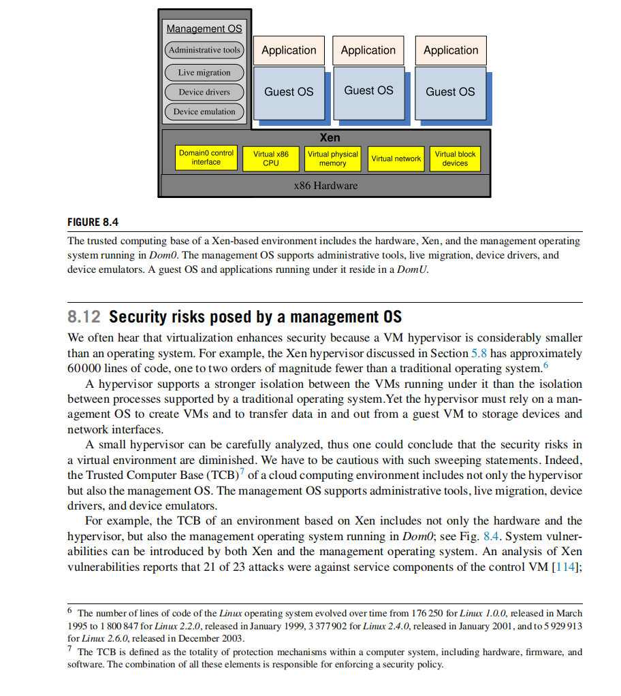

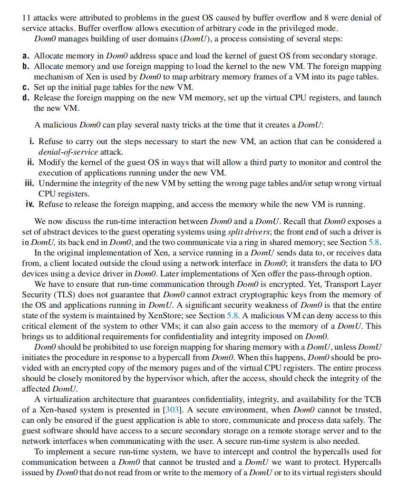

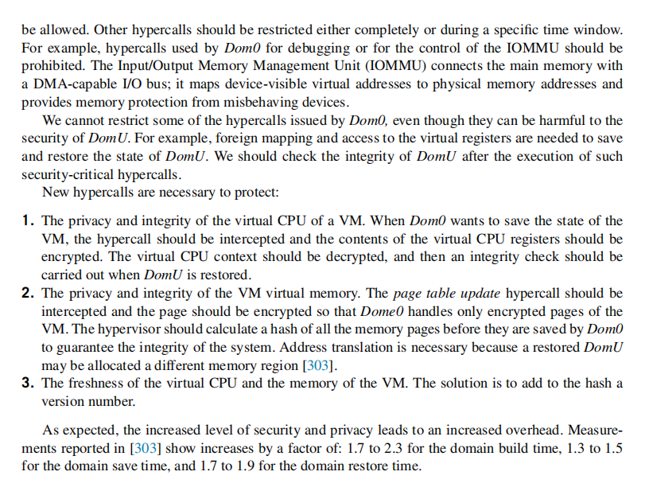

**1\. 标题：管理操作系统（Dom0）带来的虚拟化安全风险及防护要点**

在本节（8.12）中，课件专门讨论了管理操作系统（Management OS）在虚拟化环境下所引入的安全隐患。以Xen架构为例，虚拟化通常被视为可提升安全性，因为Hypervisor代码量相对传统操作系统小很多，出错点也更少；然而，Xen必须配合一个管理操作系统（如Dom0）来执行创建与管理虚拟机等核心操作。若Dom0存在漏洞或被攻击者控制，则整个虚拟化环境的安全都将面临严重威胁。

* * *

2\. 详细内容与知识点解析
--------------

### 2.1 Xen环境中的Dom0与TCB

1.  **TCB（Trusted Computing Base）的范围**
    
    *   在Xen环境下，TCB不仅包含底层硬件、Hypervisor自身，还包括负责管理与控制的操作系统Dom0；
    *   Dom0通常运行管理工具、驱动程序（如设备模拟、虚拟网络接口）以及Live Migration功能。
    *   安全分析不能只看Hypervisor，还需关注Dom0的安全性。
2.  **轻量Hypervisor与管理OS的关系**
    
    *   **Hypervisor的优点：** 代码规模（约6万行）远少于Linux/Windows等传统OS；隔离性更强；
    *   **Dom0扮演的关键角色：** 创建、销毁Guest VM（DomU），负责内存与CPU等底层资源的分配，控制I/O设备的访问与模拟；
    *   一旦Dom0出现安全缺陷，则会影响所有正在运行的DomU。

### 2.2 Dom0的攻击面与常见风险

1.  **实例创建过程中的风险**
    
    *   当Dom0创建新的DomU时，需要执行下列步骤：
        1.  在Dom0地址空间分配内存，并从辅助存储中加载Guest OS内核；
        2.  使用“foreign mapping”机制将目标VM的内存映射到Dom0，用于初始化内核和设置页表；
        3.  设定新VM的页表和虚拟CPU寄存器；
        4.  释放映射并启动Guest VM。
    *   在此过程中，**若Dom0有恶意意图**，可进行如下“捣乱”操作：
        *   拒绝正确启动VM，造成拒绝服务；
        *   篡改Guest OS内核，预留监控后门；
        *   设置错误的页表或虚拟寄存器，破坏新VM完整性；
        *   继续保留对VM内存的访问权限，窥探甚至修改其运行时数据。
2.  **Dom0与DomU之间的运行时交互**
    
    *   Xen采用“分裂驱动（split driver）”模式：前端驱动在DomU，后端驱动在Dom0，二者通过共享内存环通信；
    *   如果Dom0恶意或被攻陷，可读取DomU传来的数据包、截取密钥或篡改I/O数据；
    *   后续版本的Xen支持“直通模式（pass-through）”，但默认的TLS加密并不保证Dom0无法读取明文数据。
3.  **虚拟存储的安全隐患**
    
    *   Dom0负责管理磁盘镜像与操作系统映像；
    *   若Dom0不受信任，就可调取任意Guest VM的磁盘内容或做镜像回滚/篡改，严重破坏Guest端的数据私密性与完整性。
4.  **Hypercall 滥用**
    
    *   Hypercall相当于VM对Hypervisor提交的特权调用；Dom0也可发起Hypercall去修改Guest VM状态；
    *   若Dom0有权限执行某些敏感Hypercall（如调试、IOMMU控制），攻击者便能绕过设备防护或访问Guest内存。
5.  **Xen漏洞案例**
    
    *   课件引用了对Xen系统脆弱性的分析：**23起安全事件中有21起与服务组件相关**，涉及Guest OS与Dom0之间的异常交互；
    *   这些漏洞大多与缓冲区溢出、服务拒绝以及Dom0特权滥用相关。

### 2.3 保护Guest VM免受Dom0侵害的思路

1.  **限制或拦截关键Hypercall**
    
    *   针对Dom0发起的敏感操作（如外部内存映射、访问虚拟CPU寄存器、页表更新等）进行拦截；
    *   在调用后，由Hypervisor对DomU完整性做校验；若检测到异常修改，立刻阻断或报警。
2.  **加密关键数据与状态**
    
    *   **虚拟CPU寄存器加密**：当Dom0想要保存Guest VM的CPU状态时，只有在Hypervisor进行解密与完整性校验后才可恢复；
    *   **页面加密**：对VM内存页面进行加密并在Hypervisor层保管密钥，让Dom0只能处理密文，而无法读取实际内容。
    *   **增加版本戳（hash + version number）**：保证当VM被恢复或迁移时，其CPU和内存的状态新鲜度可验证。
3.  **严格管控Dom0行为**
    
    *   禁止Dom0随意进行“foreign mapping”或共享内存分配，只有在合规场景（如创建或迁移VM）才临时授权；
    *   在完成相应操作后，Hypervisor收回权限并检查DomU的关键数据结构是否被篡改。
4.  **分离驱动与管理功能**
    
    *   有研究提出将管理OS拆分成多个最小化服务域（driver domain / service domain），每个域只负责部分功能（网络驱动、存储驱动、管理工具等），这样即使其中一个域受损，也不会全部沦陷；
    *   虽然增加了系统架构的复杂性，但能显著降低Dom0成为“单点大漏洞”的风险。
5.  **安全运行时系统**
    
    *   课件中提到，一个云环境若想实现更完整的保密性与完整性保证，需让Guest VM应用能够**独立于Dom0**访问密钥或远程安全存储；
    *   **加密通信**：Guest VM访问外部网络或存储时，不依赖Dom0中转明文数据，以减少截获风险。

### 2.4 新的安全Hypercall与性能影响

*   为了保护Guest VM的隐私与完整性，需要在Hypervisor层增加对特定Hypercall的拦截与加密，这势必带来额外开销：
    *   课件引用\[303\]的实验表明，引入这些安全机制后，虚拟机的构建时间、保存/恢复时间等开销增大**1.7~2.3倍**不等；
    *   这说明安全与性能之间依然存在权衡。

* * *

3\. 本次内容总结
----------

*   **Dom0地位双刃剑**：其具备管理所有Guest VM的高权限，对虚拟化环境至关重要，但也成为安全的薄弱点；
*   **可能风险形式**：包括在创建VM时篡改内核或CPU寄存器、在运行时截获数据或注入后门、利用Hypercall或外部映射机制干扰Guest VM。
*   **防护思路**：增加Hypervisor对Dom0的权限细分与监控，使用加密保护Guest VM的CPU和内存状态，并在恢复或迁移时进行完整性校验；
*   **现实难点**：这些防护措施往往带来显著性能损耗，需要在安全性与虚拟化效率之间做出平衡。
*   **启示**：当我们谈及云计算环境的TCB时，必须将Hypervisor、管理OS及其驱动服务等都纳入考量。若管理OS无法可信，那么即使Hypervisor自身非常精简，也无法保证整体安全。

* * *

4\. 报错与补充说明
-----------

*   **截图内容完整且可读**，引用文献如\[114\]、\[303\]在此仅做简要说明，若需了解具体实验参数与实现细节，可在后续文献中查阅。
*   本节所涵盖的对Dom0的攻击与防护方案，为理解Xen虚拟化安全的关键所在；其他Hypervisor（如KVM、VMware ESXi）的“管理域/宿主OS”也存在类似风险与应对策略。

## 
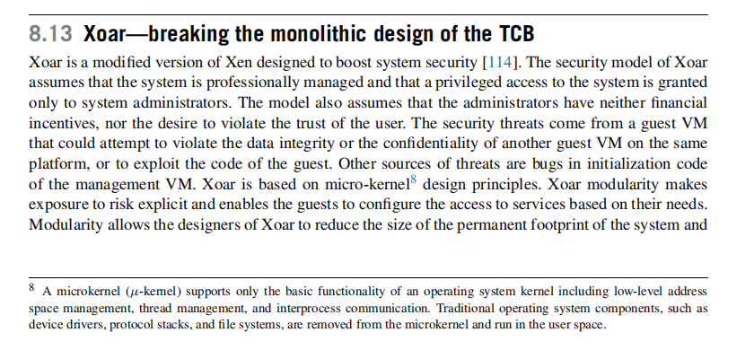

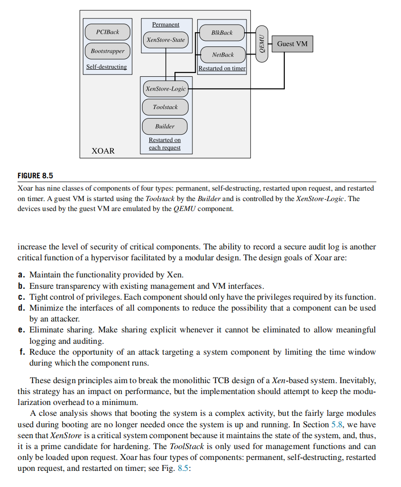

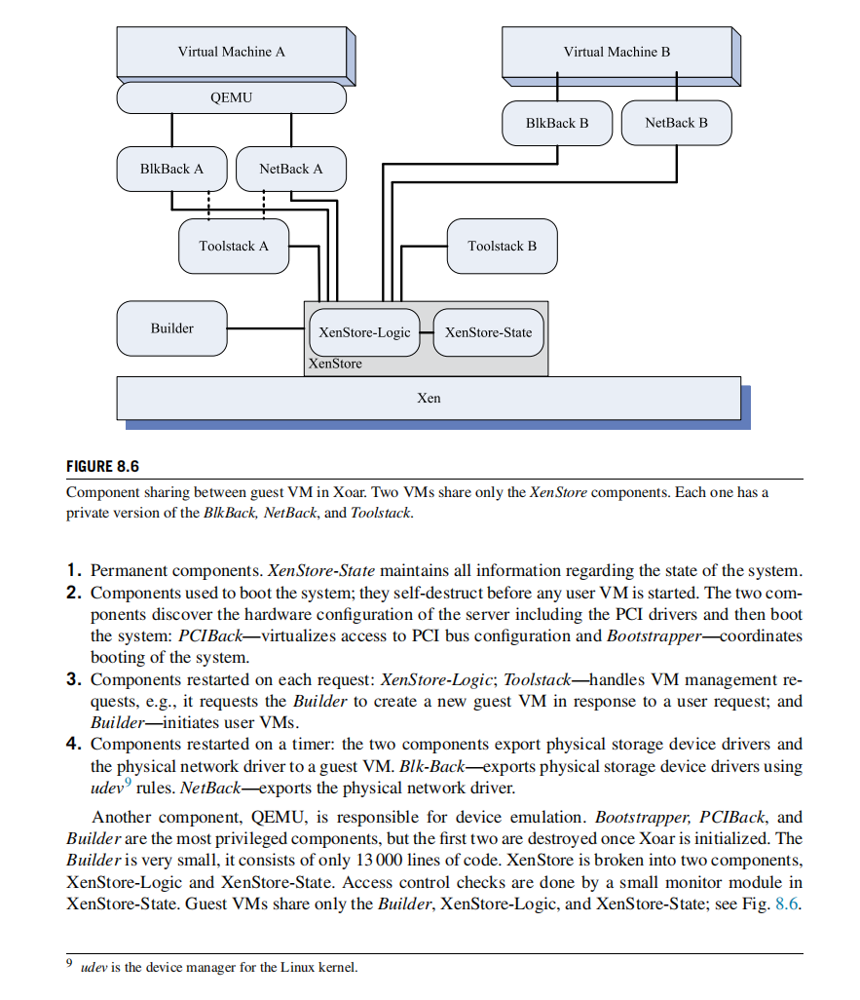

**1\. 标题：Xoar：通过微内核与模块化设计打破TCB的单体式结构**

本节（8.13）介绍了一个名为“Xoar”的Xen改进版本，其目标是显著增强虚拟化环境的安全性。Xoar在Xen的基础上，采用了微内核（micro-kernel）设计原则，通过将传统上由管理操作系统（Dom0）统一承担的功能“拆分”为多个更小、权限更精确的组件来降低安全风险。这样做能够\*\*减小可信计算基（TCB）\*\*的规模，并让攻击面更可控，从而提升整体系统的安全性与可审计性。

* * *

2\. 详细内容与知识点解析
--------------

### 2.1 Xoar的安全模型与威胁来源

1.  **安全模型假设**
    
    *   系统由专业管理员运营，只有受信任的管理员能获取特权访问；
    *   假设管理员无财务诱因或其他动机去破坏用户的信任；
    *   安全威胁通常来自任意恶意或受攻击的Guest VM，尝试破坏同一平台上其他Guest VM的数据完整性或机密性，或利用初始化代码的漏洞攻击管理VM。
2.  **微内核设计动机**
    
    *   相对于传统Xen的一体化管理OS（Dom0），Xoar将管理/服务部分拆分，模块之间最小程度共享、最小化权限；
    *   “模块化”可让不同VM按需配置服务访问，并使某些组件仅在极短时间内启用，减少被攻击利用的窗口。
3.  **威胁场景**
    
    *   来自Guest VM的攻击，试图侵入或篡改管理功能或其他VM内容；
    *   初始化代码（如为新VM分配资源的工具栈）中的漏洞被利用；
    *   由于Dom0权限过大导致的单点故障问题。

* * *

### 2.2 Xoar的体系结构与组件分类

课件给出了**图8.5**与**图8.6**来说明Xoar如何将系统功能拆分成不同类型的组件。Xoar组件大致分为四类：

1.  **Permanent（永久驻留）**
    
    *   如 **XenStore-State**：存储整个平台的配置信息与状态，对所有用户VM都是持久有效。
    *   这些组件在系统运行全程都保持激活，因为它们是虚拟化运行的核心支柱。
2.  **Self-destructing（自毁型）**
    
    *   这类组件只需在引导或初始化阶段工作，一旦启动完毕，就会自毁、释放自身，避免长期驻留；
    *   例子：
        *   **Bootstraper**：在系统启动时识别硬件配置并将驱动载入；
        *   **PCIBack**：虚拟化PCI访问，但在VM都已正常运行后即可退出。
3.  **Restarted upon request（按需重启）**
    
    *   如 **XenStore-Logic**、**Toolstack**、**Builder**：用于处理VM管理请求（创建、销毁、修改），只有在需要时才加载运行，完成任务后即退出；
    *   这样限制了它们被长期暴露在内存中，从而减少潜在攻击时间窗口。
4.  **Restarted on timer（定时重启）**
    
    *   两个模块：**BlkBack**（提供虚拟块设备访问）与 **NetBack**（提供虚拟网络驱动）
    *   以时间周期或特定触发事件重启，可以清理内部状态，避免长期内存中留存可被攻击者利用的漏洞或缓存数据。

此外，还有 **QEMU** 负责传统设备模拟、**Builder** 负责生成并启动用户VM，规模较小（仅13000行代码）。因此，在Xoar环境中，每个Guest VM只与必要组件交互，且各组件间权限可被更加精细地划分。

* * *

### 2.3 设计目标：打破单体TCB

Xoar的主要设计目标如下：

1.  **保持Xen原有功能**
    
    *   不能牺牲对Guest VM的隔离、性能或兼容性；现有管理和VM接口要保持透明。
2.  **权限最小化（Tight control of privileges）**
    
    *   各组件仅能获取其功能所需的最小权限，减少组件滥用或被利用的可能性。
3.  **接口精简化（Minimize interfaces）**
    
    *   减少组件暴露的API或共享面，防止攻击者利用复杂接口发起攻击。
4.  **显式共享或拒绝共享（Eliminate sharing or make it explicit）**
    
    *   只有无法移除的资源共享才保留，并进行明确的日志审计和访问控制。
5.  **限制攻击时机**
    
    *   通过将很多功能组件只在需求时启动，将攻击面暴露在最短时间内；
    *   当组件不再需要，可自毁或下线。

* * *

### 2.4 组件间交互与安全审计

1.  **XenStore**
    
    *   关键组件，用来维护系统整体状态（如VM配置信息、运行状态）。被分拆为 **XenStore-Logic** 与 **XenStore-State** 两部分：前者负责解析管理命令，后者存储配置信息。
    *   访问控制策略由XenStore-Logic中的小型监控器执行，避免庞大代码处理带来安全风险。
2.  **VM共享与审计**
    
    *   不同VM若需要共享某些服务（比如同一物理硬件），在Xoar会显式打上标签，并进行安全审计。
    *   当一个VM被创建、停止或重启，Xoar都会将操作记录写入只追加的数据库，可在事后审计。
3.  **快照替代重启**
    
    *   为了保证组件或服务VM在可控状态，Xoar使用快照机制（基于写时复制 Copy-on-Write），而非直接重启。
    *   在需要响应请求前，服务VM会加载其快照，以确保“从干净状态”开始处理，减少运行时被攻击的窗口。

* * *

### 2.5 优势与性能影响

1.  **增强安全性**
    
    *   模块化减少了单个组件的特权与暴露面积；
    *   自毁型和定时重启型组件让潜在攻击难以长期隐蔽；
    *   审计机制强化了对管理操作（创建/销毁VM等）的可追溯性。
2.  **降低风险**
    
    *   与传统Xen相比，Dom0不再承担所有驱动和管理功能；
    *   一旦某个组件被攻陷，也不至于获取到整个平台的控制权。
3.  **性能代价**
    
    *   课件提到，必然会有一些模块化带来的开销，如组件间通信、频繁的加载/卸载或快照操作；
    *   相关实验显示，系统启动或VM启停时间会增加1.7至2.3倍左右，但在实际生产环境是否能接受，要视具体需求和安全优先度而定。

* * *

3\. 本次内容总结
----------

*   **Xoar是对Xen安全架构的深度改良**：通过微内核式的拆分与最小特权设计，减少TCB规模，将高危功能隔离开。
*   **四种组件生命周期（永久、自毁、按需重启、定时重启）**：对应不同功能场景，最大化收缩攻击面的时间窗。
*   **客制化审计与快照机制**：确保所有VM管理操作被安全记录，并用快照维持组件的“已知良好状态”。
*   **安全与性能权衡**：Xoar虽然提升了安全性，但也带来一定复杂度和资源开销，需根据应用场景判断是否值得采用。

通过Xoar的案例，可见微内核理念与“最小化TCB”对云平台安全架构的积极意义，也为后续云安全系统设计提供了一个可借鉴的路线。

* * *

4\. 报错与补充说明
-----------

*   **截图内容完整可读**，引用文献\[114\]提到对Xen源代码的改造；内容详述了Xoar组件及其安全策略。
*   在实践中，Xoar之类的研究性项目与主流虚拟化平台（Xen、KVM、VMware）依然有差距，但它提供了重要理念，即更细粒度地拆分与控权，可显著提升虚拟化环境的整体安全水平。

# **8.14** **Mobile devices and cloud security**

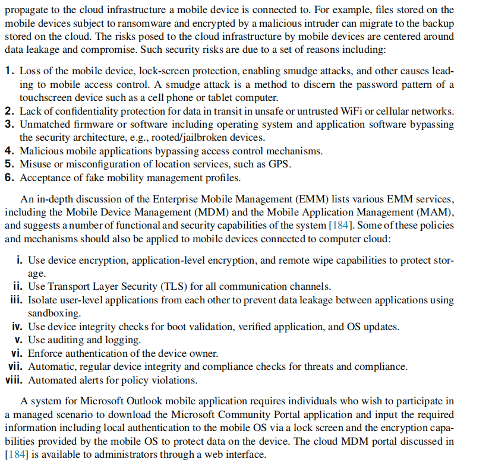

**1\. 标题：移动终端与云安全：威胁来源与防护措施**

在本节（8.14）中，课件探讨了移动设备（如智能手机、平板等）在云计算环境中的安全挑战与应对策略。移动应用在当今云生态中扮演着重要角色：通过移动端随时随地访问云资源和服务。然而，移动终端的特性（设备易丢失、网络环境复杂、多种传感器与应用并行运行等）使其面临更高的攻击风险，且一旦移动设备被攻陷，波及到的云端数据与应用也可能随之遭受威胁。本节将重点分析移动设备的安全需求、常见攻击面以及主要防护技术。

* * *

2\. 详细内容与知识点解析
--------------

### 2.1 移动设备对云安全的重要性

1.  **移动设备已成云生态核心**
    
    *   个人与企业广泛使用移动App来访问和存储云端信息，也可能在云中执行大量运算；
    *   安全性需求包括：机密性（确保数据不被未经授权者读取）、完整性（防止数据被篡改）、可用性（随时可访问云服务）以及不可抵赖性（保证请求身份可认证）。
2.  **移动设备技术栈**
    
    *   包含硬件、固件、操作系统和应用四层；
    *   基带处理器多用于电话与蜂窝网络功能，与应用处理器相对独立；
    *   某些设备具有安全专用硬件和固件，用于存储加密密钥与证书。
3.  **高暴露风险**
    
    *   设备形态便携、联网频繁，易遭遇网络钓鱼、公共Wi-Fi窃听、恶意应用植入等；
    *   用户往往只设置简短解锁密码或甚至不加密存储；
    *   地理定位服务（GPS）也可能造成用户被追踪或敏感信息泄露。

* * *

### 2.2 常见移动安全威胁

课件列出了一些典型移动威胁因素，其中许多会对云端造成连带影响：

1.  **设备丢失或被盗**
    
    *   攻击者可通过“**smudge attack**”（根据触摸屏指纹或划痕推测图案密码）或技术手段解锁设备，继而获取云端账号与数据。
2.  **缺乏安全传输**
    
    *   当移动端通过不安全的Wi-Fi或蜂窝网络访问云服务，若未使用TLS/加密通道，数据在传输中可被窃听或篡改。
3.  **固件或操作系统漏洞**
    
    *   “Root”或“Jailbreak”设备往往绕过官方安全机制；
    *   未及时升级系统的设备可能残留已知漏洞，黑客可利用来远程获取高级权限或数据。
4.  **恶意移动应用**
    
    *   部分应用违规访问系统资源，甚至绕过权限控制；
    *   可能携带木马、后门或窃取用户凭据并向云服务发起虚假请求。
5.  **位置服务滥用**
    
    *   不当的GPS数据使用导致个人隐私被追踪，或使攻击者更精确地针对用户发起社会工程学攻击。
6.  **虚假移动管理配置**
    
    *   接受不可信的配置文件或“策略”可能使攻击者取得设备控制权或重定向通信流量。

* * *

### 2.3 主要安全威胁场景与后果

1.  **数据泄露**
    
    *   敏感资料（个人照片、公司机密文档等）被窃或加密勒索，亦可借移动端同步至云端而扩大破坏面。
2.  **未授权访问**
    
    *   攻击者若能在移动端读取云服务Token、Cookie或口令，即可冒充合法用户访问云资源。
3.  **电子窃听与跟踪**
    
    *   监控用户通话、短信、网络流量或地理位置，用于诈骗或情报搜集。
4.  **恶意应用扩散到云**
    
    *   若移动端应用接入云端文件存储或协作平台，被感染的文件或恶意脚本可上传到云，进而感染其他终端或服务器。

* * *

### 2.4 移动与云端安全防护的关键措施

课件最后引用了企业移动管理（EMM）与移动设备管理（MDM）、移动应用管理（MAM）等概念，给出了一套通用的安全建议：

1.  **设备与应用加密，远程擦除功能**
    
    *   对存储在设备本地的数据进行全盘加密或应用级加密；
    *   若设备丢失或被盗，可通过远程擦除功能删除本地数据。
2.  **安全通信（TLS/SSL）**
    
    *   所有通信通道使用加密（HTTPS、VPN）以防止中途监听与篡改；
    *   对敏感操作可要求VPN或私有APN通道确保更高隔离度。
3.  **应用沙箱隔离**
    
    *   不同应用各自运行在受限容器中，减少应用间的数据泄露；
    *   Android/iOS原生沙箱或第三方安全框架，有助于防止恶意App读取其他应用数据。
4.  **设备完整性验证**
    
    *   开机时检查Bootloader、固件签名、操作系统是否被篡改；
    *   强制应用签名校验、定期更新系统版本与安全补丁。
5.  **审计与日志**
    
    *   记录关键操作与访问日志，并定期分析可疑模式；
    *   结合云端SIEM（Security Information and Event Management）集中管理移动事件。
6.  **设备认证与自动化策略**
    
    *   验证设备所有者身份（如绑定指纹、人脸识别、多因素认证）；
    *   通过MDM/EMM对设备进行合规性检测与威胁评估，若不合规（Root/越狱），可自动阻止其访问内部资源。
7.  **自动化违规检测与响应**
    
    *   设置策略阈值，如定位服务异常调用、应用高权限越界请求，一旦触发可强制锁定设备或断开云连接。
8.  **定期威胁情报与教育**
    
    *   持续更新移动安全情报，告知用户慎装未知应用、不随意点击可疑链接；
    *   提醒用户养成良好密码/生物识别习惯，并禁用公共Wi-Fi传输敏感数据。

* * *

3\. 本次内容总结
----------

*   **移动设备与云安全互相关联**：一端的薄弱环节可能导致云端更广泛的安全事件；
*   **主要风险**：设备丢失、不安全网络通信、系统或App漏洞、恶意应用、位置滥用等；
*   **防护要点**：
    1.  加密与隔离（设备加密、应用沙箱、TLS）；
    2.  完整性检测（Boot验证、应用签名校验）；
    3.  EMM/MDM落地（统一策略、远程擦除、身份认证、多因素验证）；
    4.  审计日志与合规检查（检测违规行为、快速响应）；
*   **综合措施**：需要从硬件到软件，从固件到应用的多层面综合防护，也需云端协助进行风险监测与策略执行，才能最大程度保证移动端对云应用的安全接入。

* * *

4\. 报错与补充说明
-----------

*   **截图内容清晰**，并包含常见移动云安全要点与对策。
*   本次讲解已涵盖移动设备安全在云环境中的主要风险与建议措施，如需更细节的企业级部署方案可参考后续更专业的EMM文档与移动安全标准。

# **8.15** **Mitigating cloud vulnerabilities in the age of ransomware**
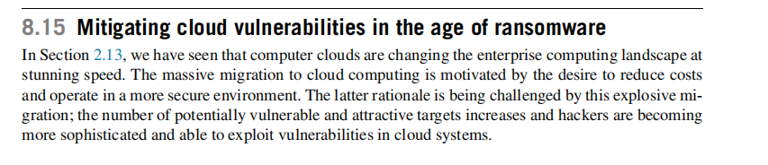

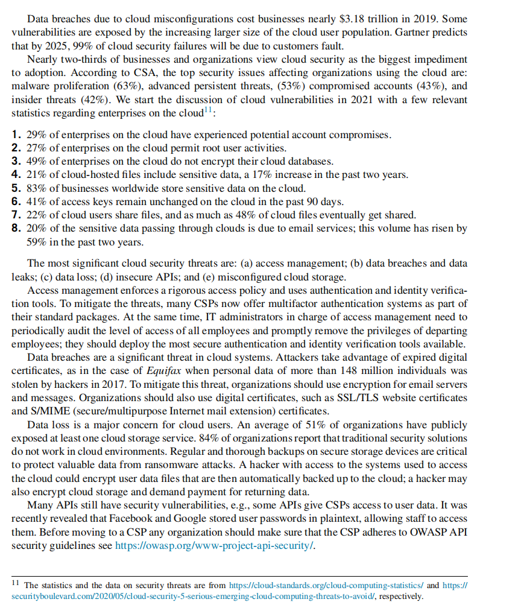

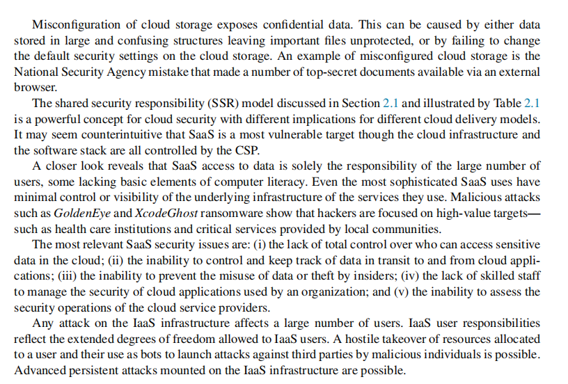

**1\. 标题：云环境中的脆弱性与勒索软件时代的安全对策**

在本节（8.15）中，课件指出了随着企业大规模迁移至云计算，云端成为黑客与勒索软件攻击的高价值目标，暴露面急剧增大。虽然许多组织将“更安全”视为上云的驱动力之一，但实际中配置不当、访问管理松散、API漏洞等常导致数据泄露与勒索事件。课件结合多项统计数据，解析了云端最显著的安全威胁，并给出了相应的缓解措施。

* * *

2\. 详细内容与知识点解析
--------------

### 2.1 云安全形势与勒索软件威胁

1.  **云误配造成巨大损失**
    
    *   课件提到，2019年因云配置错误导致的数据泄露成本达3.18万亿美元，凸显了管理与配置漏洞的重要性；
    *   Gartner预测：到2025年99%的云安全事故将起因于客户自身的失误（错误配置、弱密码策略等）。
2.  **勒索软件盯上云端**
    
    *   传统勒索软件多针对本地系统，但云端数据日益成为“更具价值的攻击面”；
    *   攻击者可渗透到云存储或云数据库后，直接加密云端文件并要挟用户支付赎金，或利用云备份机制让受害者被迫支付。
3.  **云安全的复杂性**
    
    *   超过2/3的组织将云安全列为上云最大的阻碍；
    *   来自CSA的统计显示，云用户常遇到高级持续性威胁(APT)、恶意软件扩散、帐号被盗用，以及内部人员威胁等。

* * *

### 2.2 统计与常见脆弱点

课件引用了多项调查数据（见脚注11）反映企业在云中的安全实践现状：

*   \*\*29%\*\*的企业曾遭遇账号被攻破；
*   \*\*27%\*\*的企业允许在云端执行root权限操作；
*   \*\*49%\*\*的企业并未对云数据库进行加密；
*   \*\*21%\*\*的云端托管文件含敏感信息（同比增长17%）；
*   \*\*83%\*\*的企业在云端存储机密数据；
*   \*\*41%\*\*的访问密钥在云上超过90天内未做更换；
*   \*\*22%\*\*的云用户会共享文件，约48%共享后续仍无严密管控；
*   \*\*20%\*\*的敏感数据是通过云邮箱传输。

最重大的云安全威胁可归纳为：

1.  访问管理(Access Management)
2.  数据泄露与丢失(Data Breaches & Data Loss)
3.  不安全API(Insecure APIs)
4.  云存储配置错误(Misconfigured Cloud Storage)

* * *

### 2.3 关键风险与缓解对策

1.  **访问管理问题**
    
    *   大量高权限账户缺乏多因素认证(MFA)、口令策略松散；
    *   员工离职后账户和访问密钥没有及时删除；
    *   **对策**：
        *   定期审核员工权限、停用不必要账号；
        *   全面使用MFA、零信任理念；
        *   妥善管理密钥与证书，及时轮转。
2.  **数据泄露与数据丢失**
    
    *   攻击者可利用过期证书、漏洞或钓鱼获取凭据，窃取或加密敏感信息；
    *   **对策**：
        *   一律加密传输与存储（邮件服务器、数据库、文件存储均应HTTPS/TLS/加密卷）；
        *   定期离线备份核心数据，以应对勒索软件；
        *   使用数字证书(SSL/TLS、S/MIME)确保通信机密性。
3.  **不安全或暴露的API**
    
    *   部分API允许云服务商或第三方过度访问数据，或将API密钥置于明文；
    *   **示例**： Facebook、Google曾一度将员工密码以明文存储；
    *   **对策**：
        *   符合OWASP API Security项目建议，实施严格身份验证与速率限制；
        *   防止过度授权，尽量使用least-privilege原则分配API权限。
4.  **云存储误配**
    
    *   公网S3存储桶、数据库实例等由于默认权限或目录错配暴露大量机密文件；
    *   NSA曾因配置失误而泄露机密文档；
    *   **对策**：
        *   避免默认公共访问，定期扫描和审计访问策略；
        *   利用CSP原生或第三方安全工具自动检测配置异常，提醒管理员整改；
        *   用“加密+最小访问权限”双重保护。

* * *

### 2.4 不同云服务模式的安全关注点

1.  **SaaS安全**
    
    *   用户仅在应用层进行管理，对底层基础设施不可见；
    *   却因用户数量庞大、云端密集存储敏感数据而成为黑客首要攻击目标；
    *   要求SaaS用户做好访问管理、数据加密、防范恶意插件等；开发者方面需及时修补应用漏洞。
2.  **IaaS安全**
    
    *   用户可在云上部署自定义操作系统与应用，享有较多自由度，也带来更大责任；
    *   攻击者可利用滥用的IaaS实例进行DDoS或诈骗活动；
    *   需强化网络隔离、镜像签名、日志审计，并及时关闭闲置资源与端口。

* * *

### 2.5 总结与建议

*   **共享安全责任模型**：云服务商提供底层保障，用户也需落实各自的安全责任，尤其在访问与配置层面；
*   **对抗勒索软件和APT**：
    1.  **多重备份**：云+离线备份，并经常测试恢复流程；
    2.  **及时打补丁**：应用与OS均需保持更新；
    3.  **最小权限**：降低爆发面；
    4.  **监控与告警**：结合SIEM等手段快速发现异样活动；
*   **培训与审计不可或缺**：安全漏洞往往源自人为疏忽或经验不足，应开展安全意识培训，并对云配置进行周期性审计。

* * *

3\. 本次内容总结
----------

1.  **云安全在勒索软件时代面临更严峻挑战**：大规模企业上云让攻击者能一举获取更多敏感数据，且云端一旦被攻破，后果更具破坏性。
2.  **云脆弱点多发于配置失误和访问管理不善**：统计数据揭示了高权限账户滥用、数据库无加密、过期秘钥仍在使用等普遍问题。
3.  **核心缓解策略**：
    *   强化访问管理（MFA、零信任），
    *   全面加密数据并实施离线备份，
    *   确保API安全并杜绝误配的云存储、
    *   明确云服务模式(SaaS/PaaS/IaaS)下的用户与CSP责任边界。
4.  **安全需要持续运营**：频繁监测、审计与人员培训不可少；勒索软件手法日益复杂，组织需保持警惕和灵活应对。

* * *

4\. 报错与补充说明
-----------

*   **截取内容完整可读**，引用了一些统计来源如cloud-standards.org与cloudsecurityboulevard.com进行具体数据说明。
*   当前笔记总结了应对云脆弱性的主要要点与安全建议，若需深入探究具体技术方案（如零信任架构、容器/微服务安全策略等），可后续结合专门章节或安全白皮书进行延伸学习。

# **8.16** **AWS security**
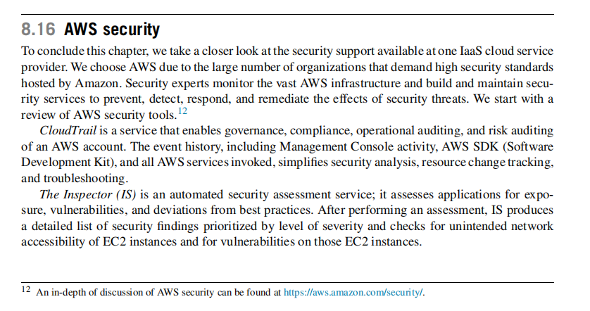

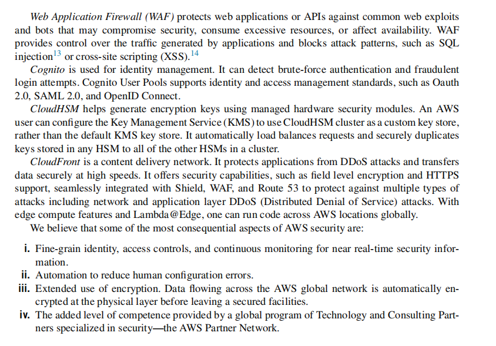

**1\. 标题：AWS云安全工具与核心安全策略概览**

在本节（8.16）中，课件聚焦于亚马逊AWS（Amazon Web Services）所提供的一系列安全工具与最佳实践。作为主流的IaaS服务商之一，AWS针对防护、检测、响应与修复等环节推出了多种安全组件与服务，帮助企业强化云端工作负载的保护能力。通过学习这些工具，我们可以更好地理解如何利用AWS的原生安全功能来满足不同层面的安全合规需求。

* * *

2\. 详细内容与知识点解析
--------------

### 2.1 AWS核心安全服务简介

1.  **CloudTrail**
    
    *   **功能**：记录AWS账户下几乎所有操作事件并保存详尽日志，包括：
        *   管理控制台活动
        *   AWS SDK/API调用（如创建、删除、修改资源）
        *   资源变动跟踪与故障排查
    *   **安全价值**：便于审计与追溯谁在何时、何地、对哪些资源执行了怎样的操作；有助于侦测可疑行为、排查安全事件。
2.  **Amazon Inspector（IS）**
    
    *   **自动化安全评估服务**：对所选EC2实例上的应用程序进行扫描，检测潜在暴露面、漏洞与偏离最佳实践之处；
    *   **安全报告**：生成按严重度排序的安全发现列表，并检查EC2网络访问性是否存在隐患；
    *   便于安全团队快速定位高风险项并制定修复方案。
3.  **Web Application Firewall（WAF）**
    
    *   **用途**：面向Web应用与API的防护，识别并阻止常见网络攻击，如SQL注入、XSS等；
    *   **行为控制**：可自定义规则拦截恶意流量、防止资源滥用或DDoS影响可用性；
    *   与AWS CloudFront或Application Load Balancer结合使用时，可覆盖全球的CDN与负载均衡层面进行统一防御。
4.  **Amazon Cognito**
    
    *   **身份与访问管理**：为应用程序提供用户身份验证、注册、登录等功能；
    *   **合规支持**：兼容OAuth 2.0、SAML 2.0及OpenID Connect等标准；可侦测暴力破解或可疑登录尝试；
    *   便于移动与Web应用在保持安全的同时简化用户体验。
5.  **CloudHSM**
    
    *   **硬件安全模块服务**：管理加密密钥的专用硬件设备集群；
    *   **KMS整合**：可将AWS Key Management Service与CloudHSM集群结合使用，由HSM代替默认密钥存储；
    *   **安全优势**：实现高等级（如FIPS 140-2级别）的密钥防护，自动负载均衡与冗余提升可用性。
6.  **CloudFront**
    
    *   **内容分发网络（CDN）**：同时具备DDoS防护能力（集成Shield、WAF、Route53）；
    *   **安全传输**：支持HTTPs加密、字段级加密(Field-Level Encryption)；
    *   **Lambda@Edge**可在CDN边缘位置运行代码，实现近端请求处理、过滤与审计，有效抵御网络与应用层攻击。

* * *

### 2.2 AWS安全特性的主要优点

课件总结了AWS安全在以下几个方面值得关注：

1.  **精细化身份与访问控制**
    
    *   AWS IAM(Identity and Access Management)支持多因子认证(MFA)、基于策略的最小权限、临时访问令牌等；
    *   配合Cognito、STS等服务可实现对内(员工)与对外(应用用户)的严格鉴权。
2.  **自动化降低人为失误**
    
    *   AWS可利用CloudFormation、Terraform等基础设施即代码（IaC）手段将安全策略模板化，减少配置错误；
    *   多数安全服务（如Inspector、GuardDuty、Security Hub）提供自动化检测、告警与响应，提升整体安全运营效率。
3.  **扩展性加密**
    
    *   AWS在全球物理层面会自动对进出机房的数据进行加密；
    *   用户层可使用KMS或CloudHSM对存储或传输中的数据做分层加密；
    *   适用从S3对象、RDS数据库到EBS卷等多种资源类型。
4.  **全球安全合作伙伴网络**
    
    *   AWS与大量安全技术公司结成合作网络（APN），可为用户提供更专业、定制化的监控、威胁情报与合规咨询；
    *   企业可结合AWS原生安全服务与第三方增强方案，共同打造云安全的“多层防护体系”。

* * *

### 2.3 其他关键要点

*   **多重DDoS防护**：通过Shield、WAF、CloudFront等逐级阻断网络与应用层拒绝服务攻击；
*   **持续监控与近实时告警**：如CloudWatch Events或Security Hub，可将安全日志、监控指标集中输出并触发自动化响应；
*   **身份审计**：使用CloudTrail、AWS Config等服务定期审查权限与资源变动，检测越权操作或策略异常。

* * *

3\. 本次内容总结
----------

1.  **AWS提供的丰富安全组件**：CloudTrail、Inspector、WAF、Cognito、CloudHSM、CloudFront等，覆盖访问管理、网络防护、加密与审计等全生命周期；
2.  **自动化与精细化**：通过安全审计和自动化工具来减少人工失误，依托IAM与KMS实现分级防护；
3.  **分层次DDoS与恶意流量防御**：WAF与Shield协同，并以CloudFront进行全球加速与冗余，大大提升服务可用性；
4.  **建议与实践**：
    *   **细化权限**：最大化利用IAM策略、临时凭证、MFA；
    *   **加密与密钥管理**：借助KMS或HSM保护核心数据；
    *   **集中化监控**：利用CloudTrail/Security Hub/CloudWatch进行事件追踪与威胁检测；
    *   **定期审计**：及时发现配置或策略漏洞并修复。

通过了解AWS安全服务和核心理念，可以帮助用户在云端建立更可靠与可管控的安全体系，进一步强化对应用和数据的防护能力。

* * *

4\. 报错与补充说明
-----------

*   **图片内容**：可见文字清晰，没有明显遗漏或无法识别之处。
*   本次笔记全面概括了AWS主流安全工具的功能要点和优势，如需更深入的技术操作细节与费用结构，可进一步查阅官方文档 [https://aws.amazon.com/security/](https://aws.amazon.com/security/) 或AWS Well-Architected Framework的Security Pillar。

# **8.17** **Further readings**
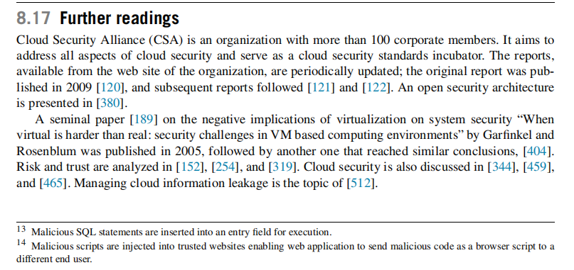

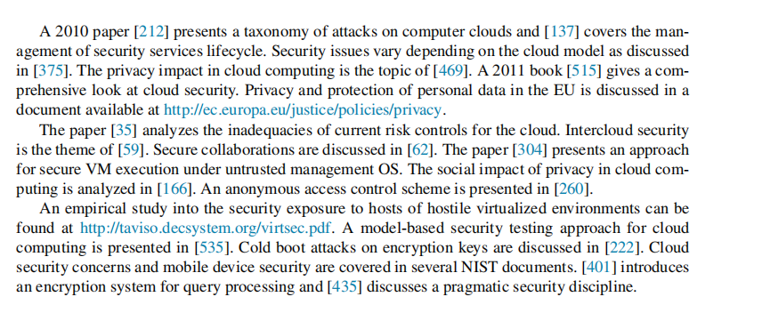

**1\. 标题：云安全的延伸与参考文献指南**

本节（8.17）提供了针对云计算安全的后续阅读和研究文献列表，涵盖云安全联盟（CSA）的报告、虚拟化安全开创性论文、风险与信任分析、信息泄露防范、云隐私保护，以及面向不可信管理操作系统的安全执行方案等诸多方面。这些文献与组织为读者提供了更全面和深入的资源，可帮助拓展第8章所讨论的云安全议题。以下是这些参考读物的核心主题与内容概述。

* * *

2\. 详细内容与知识点解析
--------------

### 2.1 云安全联盟（CSA）及相关报告

*   **云安全联盟（CSA）**
    *   CSA拥有百余家企业成员，专注于云安全各层面的研究与标准制定。
    *   **早期报告**：2009年首份报告  $[120]$ 
    *   **后续更新**：CSA陆续发布新报告  $[121]$ ,  $[122]$ ，并探讨开放的安全架构  $[380]$ 。
    *   这些报告常对最新云安全威胁、最佳实践及案例进行深入分析，适合想要实时跟进云安全动态的读者。

### 2.2 虚拟化安全及其影响

*   **Garfinkel & Rosenblum (2005)**
    *   论文题目：“When virtual is harder than real: security challenges in VM-based computing environments.”  $[189]$ 
    *   主要论述了虚拟机架构中比传统系统更复杂的安全威胁；提出虚拟化不是“自动提供更强安全”的万能灵药，而需要更仔细的安全设计与管理。
*   **续作与类似结论**
    *    $[404]$  等其他研究也指出类似问题：随着虚拟化被广泛采用，安全需求随之加剧。

### 2.3 风险与信任、信息泄露、云安全综合讨论

*   **风险与信任分析**
    *   文献  $[152]$ ,  $[254]$ ,  $[319]$ 从社会学、技术、经济等多角度探讨云中的信任机制和风险管理策略。
*   **信息泄露防护**
    *    $[344]$ ,  $[459]$ ,  $[465]$ 、 $[512]$ ：探讨云环境下如何应对机密数据泄露、侧信道攻击或敏感信息流失等问题。
*   **全面云安全综述**
    *    $[515]$ （2011年出版的一本书）从宏观角度提供了对云安全的全面探讨；
    *   欧盟的隐私与个人数据保护法规参考链接（[http://ec.europa.eu/justice/policies/privacy](http://ec.europa.eu/justice/policies/privacy)）也被提及，用以了解云跨境隐私合规要求。

### 2.4 不同云模型与安全生命周期

*   **2010年论文  $[212]$ **
    *   提出云计算攻击分类法（taxonomy of attacks）并讨论安全服务的生命周期管理；
*   **云安全在不同模型下的差异**
    *    $[375]$  指出云中安全议题会随SaaS、PaaS、IaaS的差异而变化。
*   **云隐私影响**
    *    $[469]$  讨论隐私在云端的特有挑战，特别是当数据在多方协作与大规模分布式环境下共享时。

### 2.5 额外议题：跨云协作、社交影响、访问控制等

*   **跨云协作、安全**
    *    $[62]$  探讨安全合作场景； $[59]$  则关注多云环境或互联云（Intercloud）的安全问题。
*   **不可信管理OS下的安全执行**
    *    $[304]$ ：提出如何在管理操作系统不可信的前提下仍能安全地运行虚拟机。
*   **社交影响**
    *    $[166]$  重点分析云隐私对社群互动与个人行为的影响。
*   **匿名访问控制与隐藏身份**
    *    $[260]$  讨论一种匿名访问控制机制，可减少对用户真实身份的依赖，增强隐私防护。

### 2.6 实证研究与工具

*   **Tavis Ormandy研究  $[virtsec.pdf$ \]**
    *   提供对恶意虚拟化环境宿主主机暴露程度的实证调查；
    *   展示了如何通过复杂攻击向量来攻破宿主机或其管理组件。
*   **安全测试与冷启动攻击**
    *    $[535]$ ：基于模型的云安全测试方法；
    *    $[222]$ ：加密密钥在“冷启动攻击”情形下可能的风险（即利用物理访问快速重启获取存储在内存的密钥）。

### 2.7 NIST文献与实用工具

*   **NIST 文档**
    *   涉及云安全与移动终端安全建议（与本章8.14提及主题呼应）；
*   **\[401\], \[435\]**
    *    $[401]$  介绍了查询处理加密系统；
    *    $[435]$  则侧重探讨实用的安全学科和策略。

* * *

3\. 本次内容总结
----------

1.  **云安全领域研究非常活跃**：从早期CSA报告到近年的学术论文，都在不断完善云计算威胁分类、风险管理、隐私合规和信任模型等方面的认知。
2.  **虚拟化与云特性带来的新挑战**：如虚拟机攻击面增大、管理OS信任问题、云端信息泄露风险。
3.  **文献覆盖面**：既有宏观综述（如云安全全景书籍和CSA报告），也有针对性议题（VM安全执行、匿名访问控制、跨云协作）。
4.  **实践与工具**：实证研究（例如恶意虚拟化宿主安全暴露）和模型化安全测试方法，为云安全防御和评估提供了实用技术与实践指导。

通过深入研读这些参考资料，读者能得到更专业全面的云安全知识与见解，理解当前学界与业界在云计算安全领域的研究热点与主要进展，也能更好地应用到实际的云部署与安全架构中。

* * *

4\. 报错与补充说明
-----------

*   本次截图仅给出部分参考文献的简要描述及链接，若需原文则可通过文献编号与相关数据库（ACM、IEEE、Springer等）或CSA官网查阅。
*   整体而言，这些后续阅读资料为云安全研究提供了进一步拓展方向，也与本章所讨论的安全话题形成了紧密呼应。

# **8.18** **Exercises and problems**
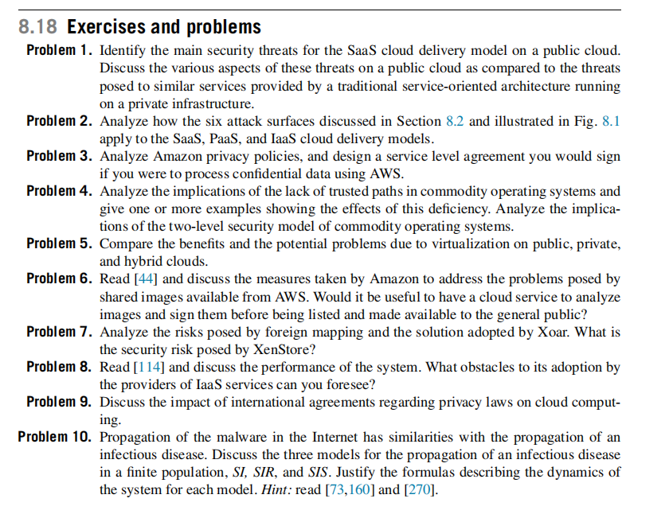

**1\. 标题：第8章复习与思考：云安全问题与应用场景拓展**

在本节（8.18）中，课件列出了与云安全相关的若干练习与讨论题，帮助读者从多个角度深入思考本章所讲述的安全理念与技术要点。每一道题都针对特定的主题或情境展开，从SaaS安全威胁、AWS隐私策略，到虚拟化环境中的信任缺失与共享镜像风险，再到国际隐私法对云端数据管理的影响等。以下为每道习题的概念点与思考方向汇总，方便读者结合前文知识进行系统复习和实践推演。

* * *

2\. 练习与思考题详解
------------

### 2.1 题目1：SaaS模式下的主要安全威胁

*   \*\*题目核心：\*\*列举公共云上SaaS交付模式所面临的安全威胁，与传统服务架构在私有基础设施运行时的安全威胁对比。
*   **思考要点：**
    1.  **访问管理与多租户**：公共云上SaaS通常由众多用户共享底层资源，若权限和隔离不到位，容易发生数据泄露或越权访问。
    2.  **数据定位与监管**：SaaS用户无法掌控数据在何处存储、是否跨国传输，对隐私与合规影响很大。
    3.  **供应商依赖度**：服务提供商若出现故障或安全事故，用户难以快速进行故障切换；在本地私有环境中则更可控。
    4.  **相同威胁，不同后果**：如DDoS、内部人员威胁、应用漏洞，这些在SaaS模式或本地架构下都存在，但在公共云上影响面更大，且多租户下难度与复杂度更高。

### 2.2 题目2：攻击面分析（Section 8.2和图8.1）在SaaS、PaaS、IaaS的应用

*   \*\*题目核心：\*\*回顾本章前面介绍的“六大攻击面”（User-Service、User-Cloud、Service-Cloud等），探讨它们在不同云交付模型（SaaS/PaaS/IaaS）中的具体表现。
*   **思考要点：**
    1.  **SaaS**：用户主要与应用接口交互，攻击面更多集中在Web/API层面、用户凭据管理等。
    2.  **PaaS**：用户在平台上部署自有应用，因此需要考虑应用代码安全、运行时容器或沙箱隔离、组件依赖库的安全等。
    3.  **IaaS**：用户可管理虚拟机、网络配置，对底层安全负责的范围更广，如虚拟机镜像安全、网络ACL、防火墙、存储配置等。

### 2.3 题目3：分析AWS隐私政策并设计SLA

*   \*\*题目核心：\*\*阅读并理解Amazon的隐私策略，思考若在AWS上处理机密数据，该如何起草一份服务级别协议（SLA）来确保隐私与合规。
*   **思考要点：**
    1.  **隐私保护条款**：包括数据的收集、使用、保留与披露；
    2.  **地理位置与跨境传输**：明确数据中心所在区域及跨境处理的法规影响；
    3.  **应急与通知机制**：遇到数据泄露或安全事件时的告警与响应时限；
    4.  **可审计性与合规**：要求AWS提供审计日志、遵循常见认证（ISO 27001、SOC 2等），以便满足内部审计或监管需求。

### 2.4 题目4：缺乏可信路径的影响

*   \*\*题目核心：\*\*探讨在通用操作系统中缺乏“可信路径（Trusted Path）”时，可能产生的安全风险及其与“两级安全模式”的关联。
*   **思考要点：**
    1.  **可信路径定义**：保障用户与系统关键服务（如登录认证、密码输入）之间的通道不被恶意软件或中间人篡改或监视。
    2.  **典型失效案例**：恶意程序冒充登录窗口、在输入层截获用户凭据等；
    3.  **两级安全模式**：对操作系统的基础安全和用户空间安全区分不明确时，会放大此类风险。

### 2.5 题目5：虚拟化在公有、私有、混合云场景的利弊

*   \*\*题目核心：\*\*综合对比虚拟化给不同云部署模式带来的收益与潜在问题。
*   **思考要点：**
    1.  **公有云**：灵活性与经济性高，但安全边界外包给云厂商；
    2.  **私有云**：易于遵守企业安全策略，但硬件/运维成本高；
    3.  **混合云**：兼顾二者优点，但须慎重设计数据和应用的分配策略及安全统一管理。

### 2.6 题目6：阅读\[44\]并讨论AWS在共享镜像问题上的对策

*   \*\*题目核心：\*\*根据前文对共享镜像风险（如遗留凭据、后门、敏感信息残留）的分析，探讨Amazon应如何检查、签名和发布镜像。
*   **思考要点：**
    1.  **自动扫描与签名**：是否可提供官方检测服务，对Community AMI进行恶意软件、后门等检测？
    2.  **用户教育**：引导镜像创建者擦除敏感数据、使用安全凭据；
    3.  **签名机制**：公钥签名或哈希校验，让使用者验证镜像源的真实性与完整性。

### 2.7 题目7：Xoar外部映射风险与XenStore安全策略

*   \*\*题目核心：\*\*探索Xoar通过“拆分管理功能”及对XenStore访问控制来降低Dom0对Guest VM内存映射的风险。
*   **思考要点：**
    1.  **foreign mapping**：传统Xen环境中，Dom0可映射并操作Guest VM内存；Xoar如何在此环节施加更多权限与审计？
    2.  **XenStore安全**：分拆为`XenStore-Logic`与`XenStore-State`，并通过最小权限接口减少潜在攻击面。

### 2.8 题目8：阅读\[114\]分析Xoar性能与潜在推广障碍

*   \*\*题目核心：\*\*基于Xoar微内核式的安全强化理念，讨论其实现对性能、可维护性及IaaS服务商采用的影响。
*   **思考要点：**
    1.  **性能损耗**：多组件拆分与频繁重启、快照等带来额外开销；
    2.  **可行性**：IaaS大规模运营商在支持大量租户与应用场景时，对高度模块化架构的部署难度；
    3.  **兼容性**：与现有云管理工具、驱动生态如何整合。

### 2.9 题目9：国际隐私法协议对云计算的影响

*   \*\*题目核心：\*\*讨论不同国家/地区的隐私法规（如GDPR、美国各州隐私法）对云端数据处理的影响，以及国际数据跨境传输的条约和准则。
*   **思考要点：**
    1.  **数据主权**：用户数据若被存放在他国，需符合当地法律及跨国协议；
    2.  **企业义务**：云用户与CSP需要签订合规与数据保护责任（如Standard Contractual Clauses等）；
    3.  **潜在冲突**：当多个司法辖区要求不同的隐私或审计条件时，云部署与访问权限如何协调。

### 2.10 题目10：恶意软件在网络中的传播与传染病模型

*   \*\*题目核心：\*\*类比计算机网络中恶意软件的传播过程与传染病模型（SI、SIR、SIS等），并根据对应的数学公式说明系统感染与恢复的动态。
*   **思考要点：**
    1.  **SI模型**：一旦感染后永不恢复，适用于某些不可逆的系统破坏；
    2.  **SIR模型**：感染后能被清理或“免疫”，类似杀毒后再不易复发；
    3.  **SIS模型**：感染-清除-再感染循环，若没有持续防御措施，系统会反复被攻陷。
    4.  **应用于云环境**：云计算多租户、镜像克隆导致可能在不同时期出现重复感染，详见“无限期感染”概念。

* * *

3\. 本次内容总结
----------

本节习题结合本章所有重点内容，要求读者：

*   **纵向**：从SaaS、PaaS、IaaS三种服务模式出发，理解云安全威胁在不同交付层的具体差异；
*   **横向**：关注企业实践，包括隐私政策、镜像安全、操作系统与虚拟化机制，以及国际法规等；
*   **深度扩展**：通过阅读特定论文（\[44\], \[114\], 等）和文献，联系当前云生态中依然活跃且不断演化的安全挑战，如共享镜像后门、Xoar微内核、以及跨境数据监管问题。

完成这些题目的过程，将帮助读者将之前学到的云安全理论转化为实际问题分析、策略设计和解决方案评估的综合能力。

* * *

4\. 错误检查与补充
-----------

*   **截图内容清晰，无阅读障碍**，各道题目主题明确；
*   若需参考更多外部文献或附录，可查看对应编号文献（如\[44\], \[114\]）以获取更具体的案例或技术原理。

这些习题能充分检验并加深对全章（第8章）内容的理解，鼓励读者在实践中思考与运用云安全所涉及的多层面原则与技术。
